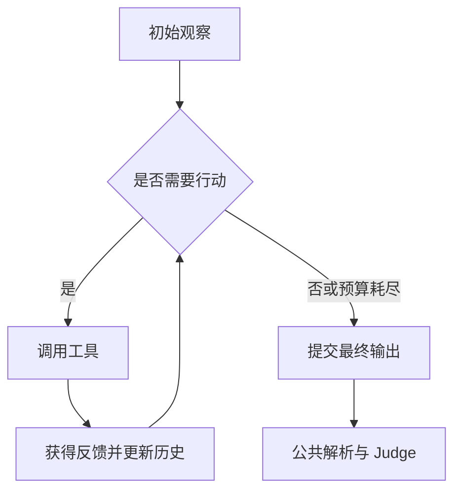

# Benchmark 调研报告模板

不要机械填空；保留适用于目标仓库的部分，但以下核心问题必须覆盖。

## 1. 执行摘要

- 一句话定位；
- 数据集本体的评测层级；
- 仓库是否包含不同层级的实验；
- 主指标和 Judge；
- 最重要的适用边界。

使用一张“评测身份卡”：

| 项目 | 结论 |
|---|---|
| Benchmark / 版本 |  |
| 任务类型 |  |
| 数据模态 |  |
| 默认评测对象 |  |
| Agent 关联度 |  |
| 交互方式 |  |
| 输出 |  |
| 主指标 |  |
| Judge / Verifier |  |
| 是否端到端 |  |
| 开放性与复现性 |  |

## 2. 仓库与证据快照

- 本地路径、远端、Commit、日期；
- 目录结构与关键文件；
- 许可证、访问与泄漏限制；
- 论文、数据卡、源码之间的版本关系。

## 3. 数据集设计

本章只保留以下三节。不要讲数据生产、标注或质量控制过程，也不要罗列后续评测不读取的字段。

首次使用专业术语时，先用一句直白中文解释。例如：“Prompt 是发送给模型的完整输入文本”“Judge 是根据隐藏答案判断任务是否成功的评分程序”。

### 3.1 构建动机

解释为什么采用这种任务、输入、输出和标签形式，以及它想支持什么评测目标。不要介绍编写者、标注者、审核轮次或数据生产流水线。

### 3.2 数据文件、规模和结构

只保留后续评测必须知道的内容：

- 可直接作为评测集合的数据文件；
- 每个文件包含多少条任务；
- 文件之间是互斥 split、嵌套子集还是不同任务；
- 一条记录代表什么；
- 任务构造、环境、Judge 或结果聚合实际读取哪些字段。

不要列出未被后续评测消费的解释、标注、质检或分析字段。不要因为文件拥有很多列就逐列介绍。

### 3.3 数据如何被后续评测消费

从“一条原始记录”出发，明确说明：

- 哪些字段构成任务输入，模型或 Agent 实际看见什么；
- 哪些字段只用于环境初始化、隐藏测试、标准答案或 Judge；
- split、过滤、采样和随机化如何决定评测实例；
- 模型或 Agent 产生什么输出；
- Judge 怎样消费输出与隐藏参考；
- 单题结果怎样进入最终指标。

先给出被实际消费字段的简表：

| 字段 | 谁能看见 | 消费方 | 用途 |
|---|---|---|---|
|  | Agent 可见 / 环境可见 / Judge 隐藏 |  |  |

然后提供一个合成的简化示例。不得复制 gated、私有或可能泄漏的真实样本。示例必须使用 `text` 代码块，并同时显示可见输入与隐藏参考：

```text
[评测文件中的一条记录]
  实际读取字段: ...
          │
          ├─ 可见字段 ─→ Prompt / Observation ─→ 模型或 Agent
          └─ 隐藏字段 ─→ 标准答案 / 隐藏测试 ───────┐
                                                     │
  模型或 Agent 输出 ────────────────────────────────→ Judge
                                                     │
                                                     └─→ 单题结果 → 聚合指标
```

在结构图后，用编号步骤解释每次转换。示例中的名称、选项、文件和答案必须与前文术语一致。

## 4. 评测任务与 Agent 流程

本章不要使用 Markdown 表格。线性流程和简单分支使用 `text` 代码块；只有包含多轮状态回路、多个决策分支且文本图难以阅读时才使用 Mermaid。每张流程图之后必须配合编号步骤和分点解释。

### 4.1 任务目标与角色

先解释单个任务要完成什么、什么算成功，再用分点区分被评测模型或 Agent、Agent Scaffold、工具与环境、Judge/Verifier、评测运行器。专业术语先解释后使用。

### 4.2 所有协议共用的环节

只提取真正相同的部分，例如：

- 数据文件和样本选择；
- 可见输入与隐藏参考的构造；
- 最终答案解析；
- Judge、失败计分和数据集级聚合。

使用一张简洁的 `text` 流程图，标出不同协议从哪里分流、又在哪里汇合到公共 Judge。

### 4.3 按协议分别讲解

先列出仓库实际存在的协议。输入、推理次数、工具、反馈、终止或回退任一不同，都要拆成独立小节；不能只放进对照表。

每种协议都按同一顺序写：

1. 一句话解释协议解决什么问题；
2. 给出简化示例，优先复用第 3 章的合成任务；
3. 用 `text` 或必要的 Mermaid 流程图画出完整路径；
4. 分点解释输入增加了什么、执行多少次、是否有工具反馈、终止条件；
5. 说明最终输出怎样进入第 4.2 节的公共 Judge；
6. 说明这个协议分数代表的是模型能力、额外采样预算，还是模型与工具组成的系统能力。

对于 Agent 协议，还要解释观察、决策、行动、工具反馈、历史状态和预算。若两个 Agent 协议分别读取搜索摘要和网页正文，应分别举例，不能合并为一个流程。

简单协议示例：

```text
合成任务 → 协议专属输入 → 模型执行 → 最终答案
                                     │
                                     └→ 公共解析与 Judge
```

复杂 Agent 协议可使用：



不要设置“代码实验”章节，也不要逐文件、逐函数介绍实现。只将会改变输入、行动、反馈、终止、Judge 或指标口径的实现事实写进相应评测阶段。

## 5. Agent Benchmark 整体总结

本章使用一条清楚的主线：Benchmark 怎样运行，什么样的评测结果可信，不同范围的 Agent 应该怎样评，最后再判断目标 Benchmark 的位置。不要重复第 4 章的协议细节。

只保留确实需要的专业词。优先使用“评分程序”“最终状态检查”“运行框架”等中文表达。必须使用英文术语时，先用一句中文说明它是什么。

### 5.1 Agent Benchmark 的基本运行结构

先解释 Agent Benchmark 是什么，再用一张 `text` 图说明完整结构：

```text
任务集 → 评测程序发放任务 → Agent 使用模型和工具完成任务
     → 产生答案或改变环境 → 评分 → 汇总结果
```

图后解释任务、Agent、工具和环境、评分程序、结果报告分别负责什么。读者看完本节，应能理解一条任务从数据进入评测到产生总分的全过程。

### 5.2 核心标准

用简短分点回答一个 Agent Benchmark 怎样才算可靠。至少覆盖：

- 评测对象是否说清楚；
- 任务是否代表目标场景；
- 不同方案是否在相同条件下比较；
- 成功与失败能否被检查；
- 评测能否重复；
- 是否同时报告成功率、成本和稳定性。

### 5.3 Agent 范围、评测方式和评测能力的对应关系

用一张表建立三者的对应关系。按 Agent 能做的事情分为：

1. 只生成答案、不能使用工具的模型；
2. 能使用搜索或计算工具的受限 Agent；
3. 能规划多步任务并操作多个工具的 Agent；
4. 能修改代码、文件、网页或应用状态的端到端 Agent。

表格至少包含“Agent 范围、常用评测方式、主要评测能力、目标 Benchmark 属于哪一类”。不要把工具调用等同于端到端 Agent。

### 5.4 标准实验结构

说明一项可比较的 Agent 实验应怎样组织：

```text
固定任务与评分规则
      ├─ 基线：模型直接完成
      └─ 实验：加入工具或 Agent 流程
              ↓
       相同预算下重复运行
              ↓
       比较成功率、成本、稳定性和失败原因
```

结合目标 Benchmark 给出一个简化实验。这里讲实验设计，不介绍代码文件或函数。

### 5.5 目标 Benchmark 的定位和使用建议

把前面的框架落到当前 Benchmark：

- 它属于哪一类；
- 使用什么评测方式；
- 实际测到什么能力；
- 结果适合支持什么结论；
- 数据、运行框架和评测结论当前是否仍可使用；
- 目标能力是否已有更合适的公开 Benchmark。

### 5.6 当前 Agent Benchmark 的主要局限

从任务是否接近真实工作、评分是否只看最终答案、公开数据污染、运行预算是否公平、外部环境是否变化、总分是否掩盖能力差异等方面总结。每项局限都说明它会造成什么误判。

### 5.7 发展趋势

依据分析日期附近的论文、官方仓库或数据卡，总结 Agent Benchmark 正在怎样变化。优先关注：

- 从回答问题转向完成真实环境任务；
- 从只看最终答案转向同时检查最终状态和必要过程；
- 从静态公开题转向私有、持续更新或带防污染措施的任务；
- 从单次成功率转向同时报告成本、速度和多次运行稳定性；
- 从单一总分转向按能力和业务场景分别评测。

趋势必须有当前一手资料支持，不能写成空泛的“未来会更智能”。

### 5.8 结论

用短段落回答：这个 Benchmark 应继续使用、作为分项使用，还是由更合适的 Agent Benchmark 替代。

## 6. 参考资料

使用普通 Markdown 编号列表，包含标题、作者/组织、版本或年份、URL、访问日期。只列正文实际使用的资料。
