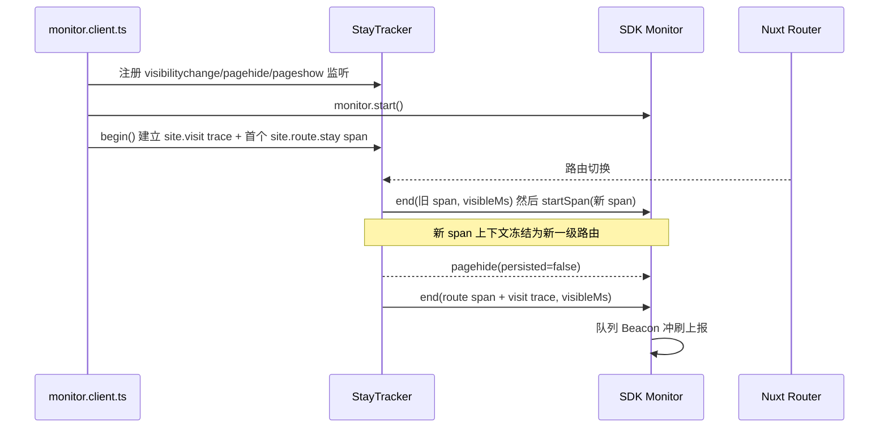

## 产品概述

在 `official-network`（缔零科技官网，Nuxt 4）中，基于已接入的 `cx-browser-monitor-sdk` 的**自定义信号架构**，新增「官网页面停留时长」采集，并通过监控平台现有的「自定义信号」看板按**一级路由**查看停留时长。

## 核心功能

- **总页面时间（仅可见时长）**：统计用户每次进入官网后、页面处于可见（前台）状态的累计时长。切换到后台自动暂停累计，回到前台继续，不计入后台停留时间。
- **一级路由停留时间**：按一级路由分别统计每次进入后的可见停留时长。一级路由集合为 `/`、`/product`、`/solution`、`/news`、`/jobs`、`/join`、`/contact`、`/develop`；动态子路径（`/product/[slug]`、`/news/[id]`、`/jobs/[slug]`、`/join/process`）全部归并到所属一级路由，未知路径统一归入兜底节点，避免维度高基数。
- **上报与查看**：上述时长以自定义信号上报到平台；在平台自定义信号页选择对应信号与时长指标（求和 / 平均 / 分位数），即可按路由名（现归一为一级路由）查看每个一级路由的停留时长总量与单次分布。
- **无侵入**：不改变官网页面结构与交互；埋点自身异常必须被兜住，不得影响页面运行。

## 边界说明

- 一级路由归一后，`/product/xxx` 等动态页面级区分丢失，性能看板的分组粒度也随之变为一级路由（已确认接受）。
- 跨硬刷新（新文档）视为新的进站会话，不做跨刷新持久化合并。

## 技术栈选型

- 宿主应用：`official-network`（Nuxt 4.3 + Vue 3.5 + TypeScript，已有 `app/plugins/`、`app/utils/`、`tests/`、`vitest.config.ts`）
- 监控能力：`cx-browser-monitor-sdk`（`workspace:*` 已在 `official-network/package.json` 声明），使用其自定义信号 API `startTrace / startSpan / span / end`，以及 `view.resolveRouteName`
- 单位与命名约束沿用 SDK：系统指标 `duration`（ms）自动附带且业务不可覆盖；业务指标通过 `end({ metrics })` 追加（name ≤64、unit ≤32 且匹配 `/^[a-zA-Z][a-zA-Z0-9_./%-]*$/`、单信号 ≤20 项）
- 不新增任何第三方依赖，不改动 platform / protocol / sdk

## 实现方案

### 总体策略

用 SDK 自定义信号里的 **Trace + Span** 表达「进站会话 → 各一级路由停留」的天然层级：一次进站创建一条 `site.visit` trace，每次进入一级路由创建其子 span `site.route.stay`，在离开路由 / 页面卸载时 `end()`。由于 SDK 的 **span context 在句柄创建时冻结**（`SpanHandleImpl` 构造时执行 `snapshotAt(startedAt)`），span 的 `route_name` 恒等于「进入时」的一级路由，正好满足「归属每一个一级路由下的页面停留时间」。

### 关键决策

1. **一级路由归一到 `route_name`，而非 attributes**：平台自定义信号分析（`custom-signals.service.ts#detail`）的 `routes` 分组只读 `route_name`，attributes 不参与分组。因此必须让 `view.resolveRouteName` 输出一级路由名，才能在看板上直接得到「每个一级路由的停留时长」。用户已确认接受该分组粒度变化，它也顺带消除了动态路径高基数问题（与 `docs/官网性能监控全流程链路.md` 现有建议一致）。
2. **可见时长必须自算**：SDK 的 `duration` 基于单调时钟，无法暂停，切后台仍会累计。因此必须自行用 `visibilitychange` 累计可见毫秒，并以业务指标 `visibleMs`（unit `ms`）上报；系统 `duration` 保留为墙钟对照值。
3. **pagehide 时序必须抢在 SDK 自动取消之前**：`CustomTelemetryManager` 在 `pagehide` 会把未结束的 trace/span 以 `status:'cancelled'` 结束，此时只保留 `duration`，**业务指标 `visibleMs` 会丢失**。因此必须在 `monitor.start()` **之前**注册自己的 `visibilitychange`/`pagehide`/`pageshow` DOM 监听（SDK 的监听在 `monitor.start()` 内才注册，DOM 监听按注册顺序触发），先于 SDK 完成 `end()` 并带上 `visibleMs`，其入队也先于 Transport 的 Beacon 冲刷，数据不会丢。
4. **BFCache 与隐藏不视为会话结束**：`pagehide` 且 `persisted=true` 时不结束 span，交由 `pageshow` 后继续；`visibilitychange → hidden` 只暂停计时（此时 SDK 亦不取消），避免把可恢复页面当成退出。
5. **单插件内编排，不引入插件顺序依赖**：不使用多插件 + `dependsOn`，而是在 `monitor.client.ts` 内按「注册 DOM 监听 → `monitor.start()` → `begin()` 建 trace/span」的固定顺序执行，避免文件名排序带来的隐式耦合。

### 性能与可靠性

- 计时与切换均为 O(1)；`visibilitychange` 只在前后台切换时触发，无轮询、无遍历。
- 上报量极低（每次路由切换 1 条 span + 每次进站 1 条 trace），远低于 Processing 默认限流（120 条/60s）与 `metrics ≤20` 约束；不同路由的 span 载荷不同，不会被 1s 去重误伤。
- 埋点逻辑整体 `try/catch` 兜底：`track/startSpan` 对空名会抛错，因此信号名使用常量，异常只静默降级，不上抛给页面。
- `attributes` 只放 `section`、`pathname`（不含 query/fragment，避免敏感信息与高基数）；不输出任何用户标识。

### 架构与时序



## 实现注意点

- **时序**：DOM 监听必须在 `monitor.start()` 之前注册；trace/span 必须在 `start()` 之后创建（非运行态 `startTrace/track` 为空操作）。
- **命名规范**：沿用 SDK 文档的 `领域.动作` 风格，`site.visit`、`site.route.stay`；业务指标名用 `visibleMs`（不可用保留名 `duration`）。
- **注释风格**：与官网既有文件一致使用中文注释，遵循 `@nuxt/eslint` + stylistic 规范；不使用 `console.log` 调试输出。
- **影响面控制**：`resolveRouteName` 变更会同时改变 `view_records`、`performance_samples` 的 `route_name`，需在文档中显式提示该口径变化；不触碰官网其它插件、布局与页面组件。
- **可测试性**：纯逻辑（一级路由归一、可见计时器）以可注入时钟 / 可注入可见性来源的形式实现，便于 vitest 覆盖暂停恢复、BFCache 等分支。

## 目录结构

```text
official-network/
├─ app/
│  ├─ plugins/
│  │  └─ monitor.client.ts                # [MODIFY] resolveRouteName 改为一级路由归一；按「注册监听 → start → begin」顺序装配停留埋点
│  └─ utils/
│     └─ monitor/
│        ├─ route-section.ts              # [NEW] 一级路由归一纯函数：白名单命中返回 /<segment>，根路径返回 /，未知路径返回兜底节点
│        ├─ visible-stopwatch.ts          # [NEW] 可见时长计时器：elapsed/pause/resume/dispose，时钟与可见性来源可注入，基于 performance.now()
│        └─ stay-tracking.ts              # [NEW] 编排层：DOM 监听注册、visit trace 与 route span 的创建/结束、BFCache 与 persisted 分支、异常兜底
├─ tests/
│  └─ monitor-stay.test.ts                # [NEW] 覆盖一级路由归一（含动态路径、根路径、未知路径）与计时器暂停/恢复累计
└─ docs/
   ├─ 官网性能监控全流程链路.md            # [MODIFY] 同步 routeName 一级路由口径，新增「页面停留时间」埋点说明与平台查看方式
   └─ project-introduction.md              # [MODIFY] 监控入口/代码索引表补充停留埋点文件条目
```

## 关键结构

```ts
// app/utils/monitor/route-section.ts
/** '/product/xxx' -> '/product'；'/' -> '/'；未知一级段 -> 兜底节点。 */
export function resolveSectionName(pathname: string): string

// app/utils/monitor/visible-stopwatch.ts
export interface VisibleStopwatch {
  /** 截至当前的累计可见毫秒。 */
  elapsed(): number
  pause(): void
  resume(): void
  dispose(): void
}

// app/utils/monitor/stay-tracking.ts
export interface StayTracker {
  /** 必须在 monitor.start() 之后调用：建立 site.visit trace 与首个 site.route.stay span。 */
  begin(): void
  /** 移除 DOM 监听；须在 monitor.start() 之前完成 DOM 监听的注册。 */
  dispose(): void
}
export function createStayTracker(monitor: Monitor): StayTracker
```