# 文档概述

- 源文档 URL：[https://bytedance.larkoffice.com/wiki/RQFqwENe8iiLqTkWk7ScWfIznwt](https://bytedance.larkoffice.com/wiki/RQFqwENe8iiLqTkWk7ScWfIznwt)
- 标题：【PRD】运营平台_内容活动_激励管控线上化
- 真实文档类型：docx
- 正文图片：11 张
- 附件：0 个
- 白板：6 个，白板节点图片：14 张
- 评论：28 条
- Parser 辅助材料：[lark_parser_strict.md](prd-source/raw/lark_parser_strict.md)
- 评论原始记录：[comments_page_1.json](prd-source/comments/comments_page_1.json)

## 白板索引

- 白板 01：`Q0E1wrjCuhA0h5bO1WycqdyRnFf`，节点图片 1 张，[缩略图](prd-source/whiteboards/whiteboard_01_Q0E1wrjCuhA0h5bO1WycqdyRnFf_thumbnail.jpg)、[节点 JSON](prd-source/whiteboards/whiteboard_01_Q0E1wrjCuhA0h5bO1WycqdyRnFf_nodes.json)、[详细分析](prd-source/whiteboards/whiteboard_01_Q0E1wrjCuhA0h5bO1WycqdyRnFf_analysis.md)
- 白板 02：`Rr6lw0FtThXhHEbHIJWcwcwTnle`，节点图片 2 张，[缩略图](prd-source/whiteboards/whiteboard_02_Rr6lw0FtThXhHEbHIJWcwcwTnle_thumbnail.jpg)、[节点 JSON](prd-source/whiteboards/whiteboard_02_Rr6lw0FtThXhHEbHIJWcwcwTnle_nodes.json)、[详细分析](prd-source/whiteboards/whiteboard_02_Rr6lw0FtThXhHEbHIJWcwcwTnle_analysis.md)
- 白板 03：`D8wwwJrbAhwQ35bCgHCcIMzgnsg`，节点图片 3 张，[缩略图](prd-source/whiteboards/whiteboard_03_D8wwwJrbAhwQ35bCgHCcIMzgnsg_thumbnail.jpg)、[节点 JSON](prd-source/whiteboards/whiteboard_03_D8wwwJrbAhwQ35bCgHCcIMzgnsg_nodes.json)、[详细分析](prd-source/whiteboards/whiteboard_03_D8wwwJrbAhwQ35bCgHCcIMzgnsg_analysis.md)
- 白板 04：`IFrAwadoph00bBbFniecIsVEnRh`，节点图片 3 张，[缩略图](prd-source/whiteboards/whiteboard_04_IFrAwadoph00bBbFniecIsVEnRh_thumbnail.jpg)、[节点 JSON](prd-source/whiteboards/whiteboard_04_IFrAwadoph00bBbFniecIsVEnRh_nodes.json)、[详细分析](prd-source/whiteboards/whiteboard_04_IFrAwadoph00bBbFniecIsVEnRh_analysis.md)
- 白板 05：`LxmswBz6yhhPDubamDSceRj2nub`，节点图片 2 张，[缩略图](prd-source/whiteboards/whiteboard_05_LxmswBz6yhhPDubamDSceRj2nub_thumbnail.jpg)、[节点 JSON](prd-source/whiteboards/whiteboard_05_LxmswBz6yhhPDubamDSceRj2nub_nodes.json)、[详细分析](prd-source/whiteboards/whiteboard_05_LxmswBz6yhhPDubamDSceRj2nub_analysis.md)
- 白板 06：`XqZwwzZVBh38QUbp3itcbqAUnmh`，节点图片 3 张，[缩略图](prd-source/whiteboards/whiteboard_06_XqZwwzZVBh38QUbp3itcbqAUnmh_thumbnail.jpg)、[节点 JSON](prd-source/whiteboards/whiteboard_06_XqZwwzZVBh38QUbp3itcbqAUnmh_nodes.json)、[详细分析](prd-source/whiteboards/whiteboard_06_XqZwwzZVBh38QUbp3itcbqAUnmh_analysis.md)

# 正文

## *一句话描述*
> 一句话描述：修改内容活动的奖励配置与投放功能，在发奖前自动校验、提示、剔除命中「不激励」规则的作品与账号

## 文档记录

|  | 时间 | 版本号 | 变更人 | 变更内容 |
| --- | --- | --- | --- | --- |
| **修订记录** | *2026年04月30日* | *1.0* | @ou_dda0c932bc07f8af0e4255037947ca0c | 新建文档 |
|  | *2026年05月15日* | 2.0 | @ou_dda0c932bc07f8af0e4255037947ca0c | 根据初评会结论修改完善 |
|  | **影响模块** |  | **poc** | **模块改造点** |
| **影响模块** | *内容运营-运营活动-奖励配置* *内容运营-运营活动-奖励投放* |  | @ou_dda0c932bc07f8af0e4255037947ca0c |  |
|  | **角色** |  | **poc** | **相关文档** |
| **相关角色** | *PM/前端开发/后端开发/QA* |  |  | meego： figma设计稿： https://www.figma.com/design/fNJJ7mEmEMYU5y0tcAZm3X/Untitled?node-id=0-1&p=f&m=dev 技术方案：【技术方案】内容活动激励管控线上化 |
| 业务 | 策略中台 |  | @ou_31a1e5c297b6c6cf21d573081cc2cac5 | 电商内容生态激励管控讨论 |
|  | 治理 |  | @ou_a11b8fff0b5e1262ea33a91ebe61b638 | 【抖音电商】达人内容激励管控导向-wip |
|  | 上游接口 |  | @ou_7fceca9eb51b80cc4d2f7b4e7885de7e | 【PRD】运营平台-治理运营-不激励名单接口封装 |

## 一、 需求背景
### 1.1 需求来源

| 来源类型 | 来源描述 | 关联部门 |
| --- | --- | --- |
| 策略产品 | @ou_31a1e5c297b6c6cf21d573081cc2cac5电商内容生态激励管控讨论 | 中国电商-电商内容生态-内容策略 |

### 1.2 背景说明
**现状及问题**
当前资管和内控发现运营发奖存在治理合规风险，主要表现为**部分短视频/图文或账号存在违规行为，但仍然获得了激励资源，**带来了平台资源的错配与浪费**。**
> 【影响分析及Badcase】内控以活动期内作者主端命中严重违规、电商侧命中任意罚单和电商侧命中严重类型的罚单的情况进行分析，具体情况如下：
> - 主端严重违规：存在204个作者在活动期属于主端严重违规中，但电商侧仍发放激励，对应激励发放金额15.9万，消耗金额5.5万。
> - 电商侧命中任意罚单：存在527个作者在活动期存在处罚，涉及发放金额128万，消耗金额17.9万。
> - 电商侧命中严重类型罚单：存在8个作者在活动期被命中严重处罚，涉及发放金额5.6万。
> 数据来源：【中国电商】内容x流量x达人运营风险评估

**解决方案**
在产品能力上做好违规账号和内容的校验与限制，在活动发奖流程前置限制获奖作者/作品的准入名单，避免出现资源使用治理风险。

#### 评论回填

> comment_id=`7637407988143442892`，状态：已解决
> **引用 quote**：[引用] 【影响分析及Badcase】 内控以活动期内作者主端命中严重违规、电商侧命中任意罚单和电商侧命中严重类型的罚单的情况进行分析，具体情况如下： 主端严重违规：存在204个作者在活动期属于主端严重违规中，但电商侧仍发放激励，对应激励发放金额15.9万
> **评论**：抄的嘉璐的
> **补充**：无

> comment_id=`7637410158708526041`，状态：已解决
> **引用 quote**：【影响分析及Badcase】 内控以活动期内作者主端命中严重违规、电商侧命中任意罚单和电商侧命中严重类型的罚单的情况进行分析，具体情况如下： 主端严重违规：存在204个作者在活动期属于主端严重违规中，但电商侧仍发放激励，对应激励发放金额15.9万，消耗金额
> **评论**：抄的嘉璐的
> **补充**：无

> comment_id=`7637472648657669086`，状态：已解决
> **引用 quote**：的短视频
> **评论**：作品都算，包含视频和图文。这里可以改下话术~
> **补充**：无
### 1.3 需求类型及目标
**核心相关的OKR**
> 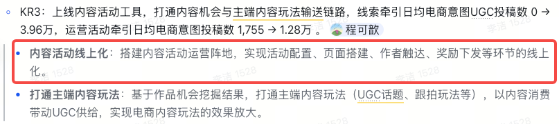

**需求类型：管理辅助型**
**目标及指标**

| **指标类型** | **指标** | 当前值 | **目标值** | 目标值制定逻辑（可选） |
| --- | --- | --- | --- | --- |
| 业务指标 | 违规账号被错误激励金额 | 两者加总，月均约150万（含主端严重违规15.9万+电商侧任意罚单128万+电商侧严重罚单5.6万） | 0 | 通过运营平台-运营活动被剔除的账号中，如果不剔除本应被激励的金额 > 通俗理解：拦截后省了多少钱 |
| 业务指标 | 违规作品被错误激励金额 | 两者加总，月均约150万（含主端严重违规15.9万+电商侧任意罚单128万+电商侧严重罚单5.6万） | 0 | 通过运营平台-运营活动被剔除的作品中，如果不剔除本应被激励的金额 > 通俗理解：拦截后省了多少钱 |
| 平台指标 | 发奖拦截接口调用成功率 | / | 100% |  |
| 平台指标 | 活动期间被剔除的「不激励」账号与作品**数量** | / | 可观测 |  |

#### 评论回填

> comment_id=`7637472989516286908`，状态：已解决
> **引用 quote**：目标及指标
> **评论**：这里明天讨论下
> **补充**：无

> comment_id=`7638914767188478943`，状态：未解决
> **引用 quote**：违规账号/作品被激励金额
> **评论**：是否能取到
> **补充**：无

> comment_id=`7638962582876474320`，状态：未解决
> **引用 quote**：作品被激励金额
> **评论**：如何定义「作品被激励金额」？
> **补充**：无

## 二、 需求概述
### 2.1 需求范围
本需求涉及运营平台「内容活动」模块的奖励配置和奖励发放两个子模块：
- **奖励配置**：圈选用户时前置透出不激励规则提示
- **奖励投放**：发奖前剔除不激励账号/作品，新增剔除明细查看
### 2.2 方案描述

| **关键改动** | **改动前***（蓝色色块为涉及变更部分）* | **改动后***（橘色色块为涉及变更部分）* |
| --- | --- | --- |
| 内容活动-配置页面 - 透出不激励规则提示 | - 当前无治理规则校验与查看明细功能 白板：Q0E1wrjCuhA0h5bO1WycqdyRnFf 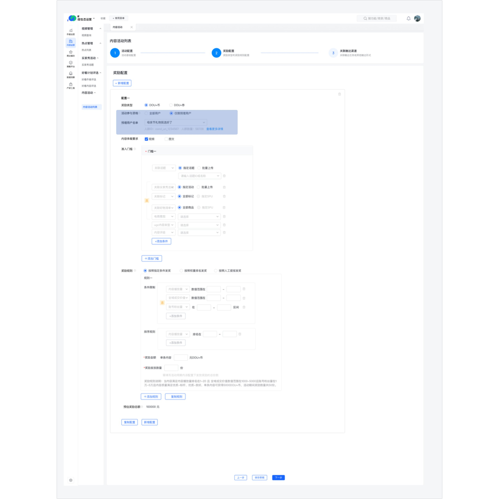 [详细分析](prd-source/whiteboards/whiteboard_01_Q0E1wrjCuhA0h5bO1WycqdyRnFf_analysis.md) | 在活动参与人群范围划定环节，透出「不激励」规则的提示： - 针对「全部用户」和「预埋用户名单」圈选，前置提示“*奖励发放环节将进行账号校验，命中【不激励】规则的账号无法被发奖*” 白板：Rr6lw0FtThXhHEbHIJWcwcwTnle  [详细分析](prd-source/whiteboards/whiteboard_02_Rr6lw0FtThXhHEbHIJWcwcwTnle_analysis.md) |
| 内容活动-奖励发放 - 剔除命中不激励规则的作品与账号 | 激励发放时无治理合规校验 | 在奖励投放前新增治理合规校验节点，将命中不激励规则的作品与作者账号即从发奖池中剔除 |
| 内容活动-奖励发放 - 新增剔除明细查看 | 发奖后无被剔除的作品与作者名单 白板：D8wwwJrbAhwQ35bCgHCcIMzgnsg 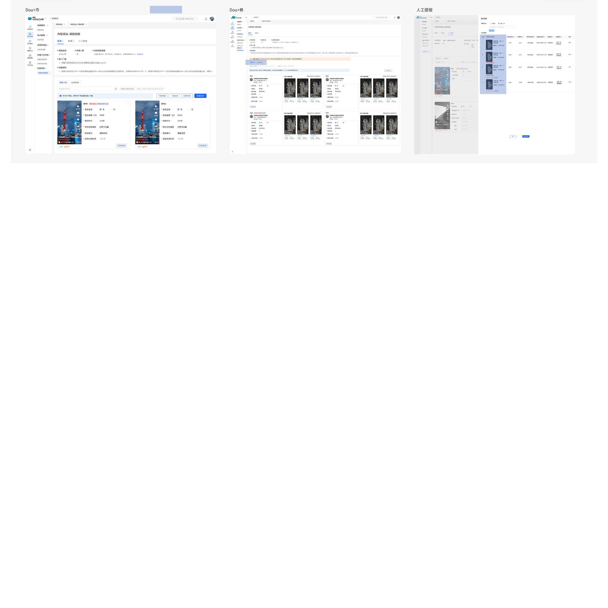 [详细分析](prd-source/whiteboards/whiteboard_03_D8wwwJrbAhwQ35bCgHCcIMzgnsg_analysis.md) | - **DOU+币和DOU+券场景：**新增「剔除明细」tab，支持查看被剔除的作品/作者明细 - **人工提报场景：**在违规作品下透出违规提示，不允许提交违规作品 白板：IFrAwadoph00bBbFniecIsVEnRh 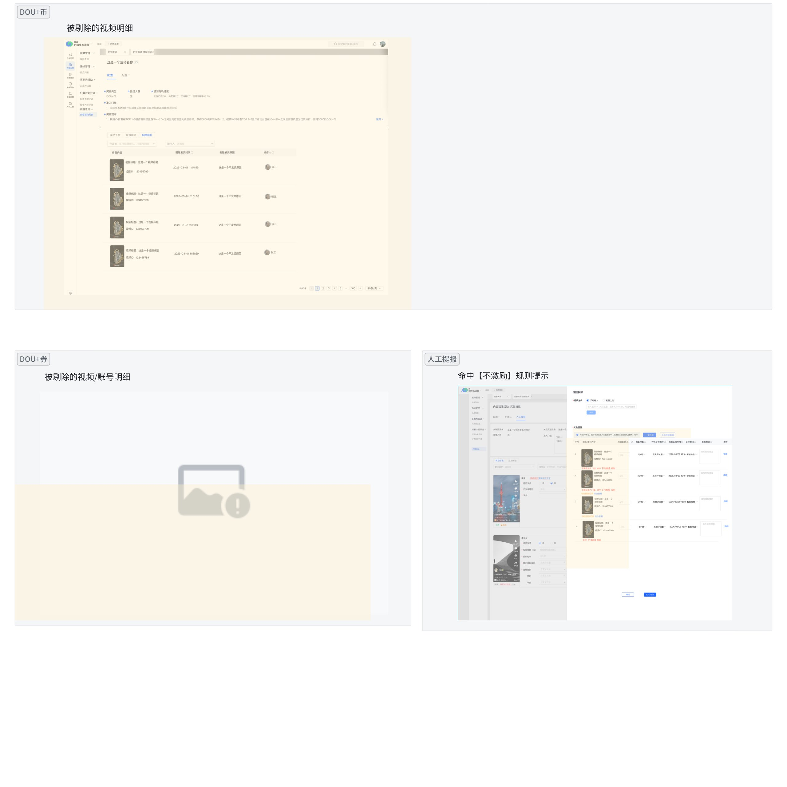 [详细分析](prd-source/whiteboards/whiteboard_04_IFrAwadoph00bBbFniecIsVEnRh_analysis.md) |
| `*不激励接口逻辑*` - 上游会支持“不激励处罚明细”查询接口，内容运营作为接口使用方，通过“不激励处罚明细”查询接口获取账号和作品维度命中“不激励”的处罚明细列表 | 无 | - 任务侧获取不激励处罚明细后，需进行逻辑判断： - 查询账号和作品维度在活动开始时——奖励投放时的不激励处罚状态，判断账号或作品是否阻断发奖 > 若最新处罚状态为“申诉解除”/“自主解封解封”，则不阻断发奖；若最新处罚状态为“自然处罚”，则阻断发奖 >  |

#### 评论回填

> comment_id=`7637439709270232279`，状态：已解决
> **引用 quote**：处罚状态判断
> **评论**：待 `@ou_31a1e5c297b6c6cf21d573081cc2cac5` 给出接口与 hive 表
> **补充**：无

> comment_id=`7651507351425469388`，状态：未解决
> **引用 quote**：被剔除的作品/作者明细
> **评论**：剔除这块的交互会上详细讨论下
> **补充**：无

> comment_id=`7650345452268768467`，状态：未解决
> **引用 quote**：（接口名待定）
> **评论**：附接口文档：[接口文档](https://bytedance.larkoffice.com/wiki/T7YXwTv6FiBka9kJ3J3c6DKVnGh)
> **补充**：无

### 2.3 需求摘要

| 需求点 | 概述 | 优先级 |
| --- | --- | --- |
| 需求点1: 不激励规则前置透出 | 「奖励配置」环节，圈选用户时，前置提示命中【不激励】规则的账号将无法在后续被发奖 | P0 |
| 需求点2: 发奖前剔除 | 「奖励投放」计算中奖作者名单和中奖作品名单时，剔除命中「不激励」规则的作者和作品 | P0 |
| 需求点3: 剔除明细查看查询 | - 「奖励投放」新增Tab，用于展示与查询由于命中「不激励」标签被剔除的作者与作品明细 - 人工提报场景，当运营手动上传的作品命中「不激励」标签，提示并剔除 | P0 |

## 三、需求详情
### 3.1 不激励规则前置透出

|  | 线上（Before） | 优化方案（After） |  |
| --- | --- | --- | --- |
| **优化点** | **图** | **图** | **说明** |
| 配置页透出不激励规则提示 | 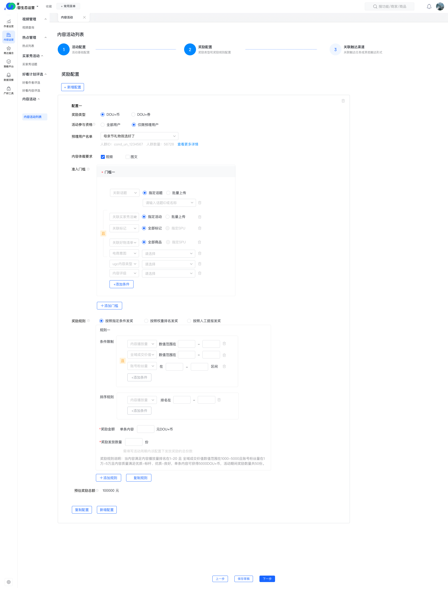 | 白板：LxmswBz6yhhPDubamDSceRj2nub 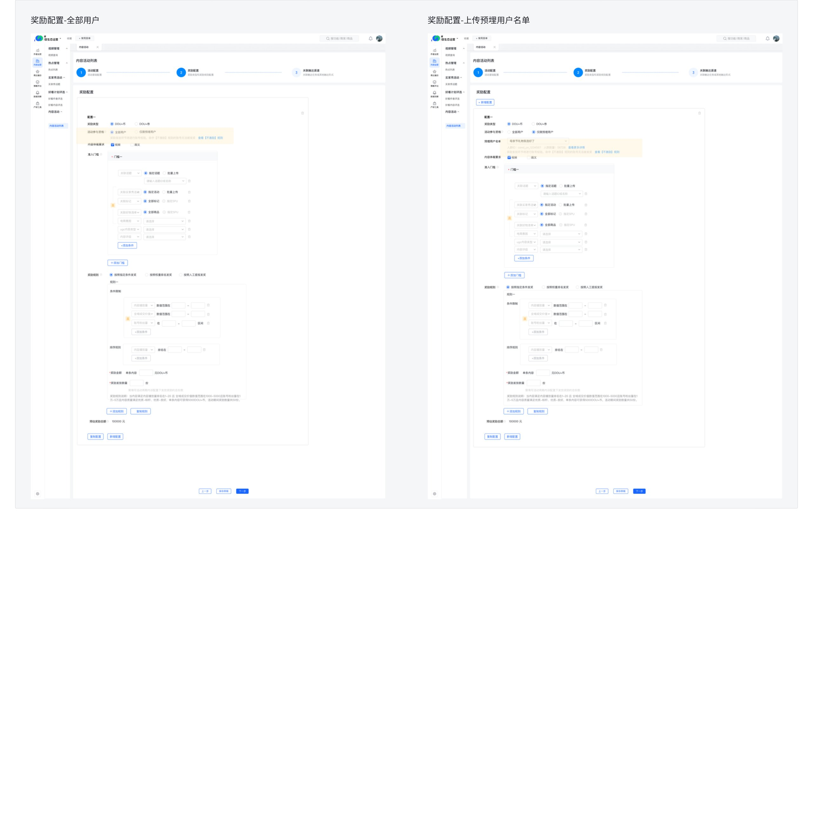 [详细分析](prd-source/whiteboards/whiteboard_05_LxmswBz6yhhPDubamDSceRj2nub_analysis.md) | > 涉及模块：奖励配置-活动参与资格/预埋用户名单 **【场景一】活动参与资格选择「全部用户」** - **提示**违规账号将无法被发奖 - 文案：“*奖励发放环节将进行账号校验，命中【不激励】规则的账号无法被发奖 **查看【不激励】规则”* - 位置：配置项下方 - 交互：点击*查看【不激励】规则*，跳转至电商内容生态激励管控讨论 **【场景二】活动参与资格选择「仅限预埋用户」** - **提示**违规账号将无法被发奖 - 文案：“*奖励发放环节将进行账号校验，命中【不激励】规则的账号无法被发奖 **查看【不激励】规则”* - 位置：配置项下方 - 交互：点击*查看【不激励】规则*，跳转至电商内容生态激励管控 |

#### 评论回填

> comment_id=`7638963026770643935`，状态：未解决
> **引用 quote**：对人群包调用治理校验接口，识别"不激励"账号并在配置页透传提示，支持下载查看具体名单
> **评论**：为什么不能在圈选的时候就剔除不激励
> **补充**：而且这个给不出来吧，圈选只能给出符合标签要求的是哪些人，给不出不符合标签的人

> comment_id=`7651833328949054676`，状态：未解决
> **引用 quote**：不激励账号数量：X个
> **评论**：`@ou_dda0c932bc07f8af0e4255037947ca0c` 文档记得变更一下
> **补充**：无

### 3.2 发奖前剔除

| 需求点 | 图 | 说明 |
| --- | --- | --- |
| 发奖前剔除不激励账号/作品 | > 本需求点仅人工提报场景涉及前端页面改造 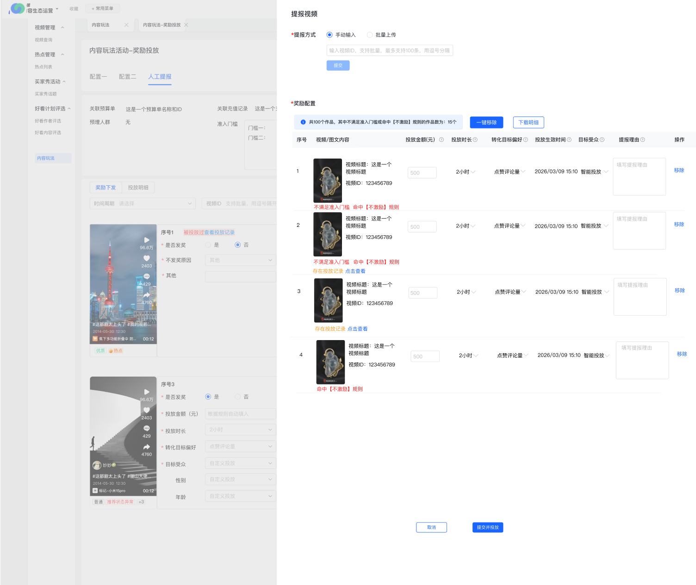 | > 涉及模块：奖励投放-奖励下发 **【场景一】DOU+币发放** - **校验对象**：满足准入条件和排名的作品 - **校验方式：**根据【活动开始时间-发奖时间】内作品的处罚状态判断 - 若最新处罚状态为“1 申诉解除”/“2 自主解封解除”，则不阻断发奖； - 若最新处罚状态为“0 自然处罚”，则阻断发奖 - **剔除逻辑与展示**：仅展示手动剔除的账号明细 - **边界情况**： > - 治理接口超时：发奖流程暂停，返回“治理校验失败，请稍后重试”。 > - 治理接口返回异常：发奖流程暂停，返回“治理校验异常，请联系管理员” > - 剔除后中奖名单为空：正常结束，不发放激励 **【场景二】DOU+券发放** - **校验对象**：满足准入条件和排名的作品/账号 - **校验方式：**根据【活动开始时间-发奖时间】内作品/账号的处罚状态判断 - 若最新处罚状态为“1 申诉解除”/“2 自主解封解除”，则不阻断发奖； - 若最新处罚状态为“0 自然处罚”，则阻断发奖 - **剔除逻辑与展示**：仅展示手动剔除的账号明细 - **边界情况**：同场景一 **【场景三】人工提报** - **触发时机**：运营在「奖励投放-人工提报」模块提交中奖名单后 - **校验对象**：手动提交的作品/账号 - **校验方式：**根据【活动开始时间-发奖时间】内作品的处罚状态判断 - 若最新处罚状态为“1 申诉解除”/“2 自主解封解除”，则不阻断发奖； - 若最新处罚状态为“0 自然处罚”，则阻断发奖 - **剔除逻辑与展示**： 1. **结果展示**：对于处罚作品/账号，红字提示“*命中【不激励】规则*” > 1. 仅提示，不做自动剔除，由运营手动剔除 > 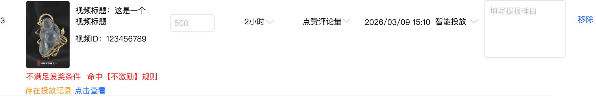 1. **提示交互：** 1. **文案展示：** 共{作品总数}个作品，其中不满足准入门槛或命中【不激励】规则的作品数为：{作品个数}个 1. **交互按钮** 1. 一键移除：点击后移除作品中不满足准入门槛或命中【不激励】规则的作品 1. 导出移除明细：支持导出飞书表格，包含字段：账号ID、视频ID、视频名称、移除原因、处罚原因（非必填字段）、操作人 1. 【模板示例】手动投放场景-移除明细 1. 在活动期间命中多个罚单时，展示最新罚单的处罚原因 > 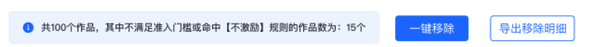 1. **提交限制**：禁止提交处罚作品/账号，运营需先移除处罚作品/账号后才可提交发奖名单 |

#### 评论回填

> comment_id=`7637773799953533884`，状态：未解决
> **引用 quote**：支持运营申诉
> **评论**：申诉入口在哪：运营和作者
> **补充**：无

> comment_id=`7651923589643095219`，状态：未解决
> **引用 quote**：不满足准入门槛
> **评论**：这个就没有了哈？只看是不是命中不激励
> **补充**：无

> comment_id=`7651923990281211071`，状态：未解决
> **引用 quote**：移除原因、处罚原因（非必填字段）
> **评论**：移除原因好像没地方填？处罚原因是什么？
> **补充**：移除原因没有就不填，处罚原因从接口拿；`@ou_dda0c932bc07f8af0e4255037947ca0c` 我意思现在交互上好像没有地方可以填移除原因

> comment_id=`7651924250043780306`，状态：未解决
> **引用 quote**：下载明细
> **评论**：另外那些可以发奖的也导出这些字段吗？导出来有啥用呢
> **补充**：可以发奖的不导出，只导出剔除的；`@ou_dda0c932bc07f8af0e4255037947ca0c` 如果只是下载剔除的话，建议按钮改下文案，叫什么下载剔除明细。另外这块交互要不要再想一下，一个是没有地方填移除原因，另一个移除后这个界面就没他了，下载按钮要下载那些东西是看不到的，会不会很奇怪 cc `@ou_e01651b1bd128b474cfc700fc0e27165`；按钮我改成“导出剔除明细”

### 3.3 发奖后展示剔除明细

| 需求点 | 图 | 说明 |
| --- | --- | --- |
| 新增「剔除明细」tab | 白板：XqZwwzZVBh38QUbp3itcbqAUnmh 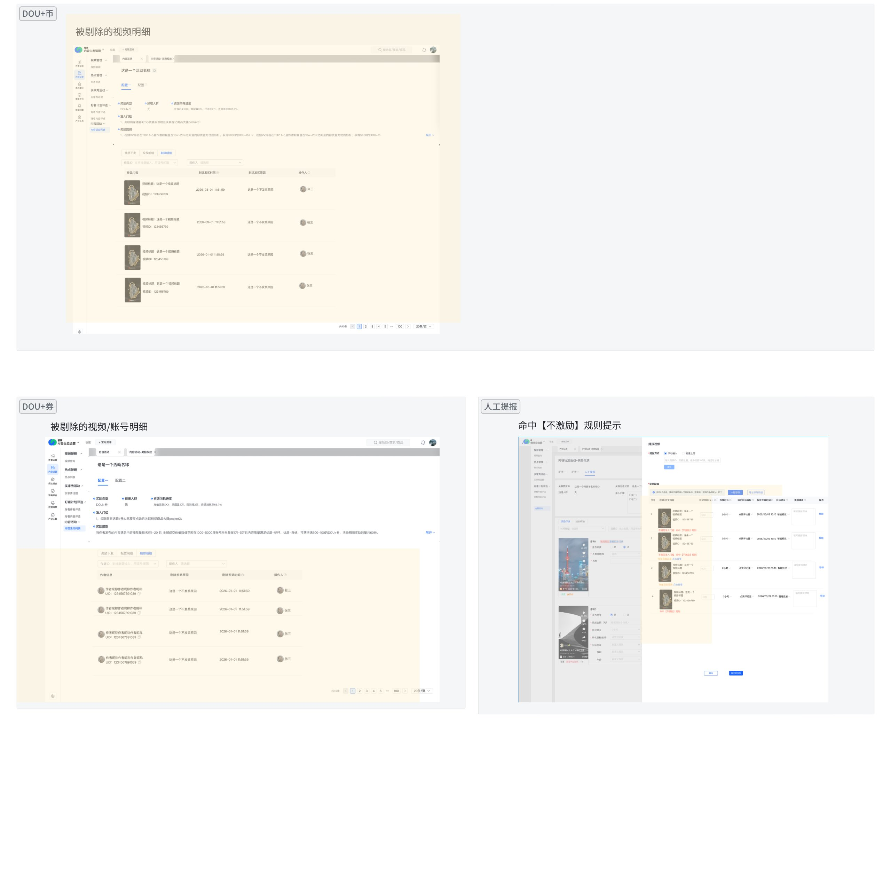 [详细分析](prd-source/whiteboards/whiteboard_06_XqZwwzZVBh38QUbp3itcbqAUnmh_analysis.md) | > 涉及模块：奖励投放-新增「剔除明细」tab，展示每个配置项下作品/账号的剔除情况 **列表展示逻辑：每发一次奖，批量产生一次剔除名单** - 入列表逻辑：每次发奖时，批量提交时提交一批当前不发奖的剔除名单 > 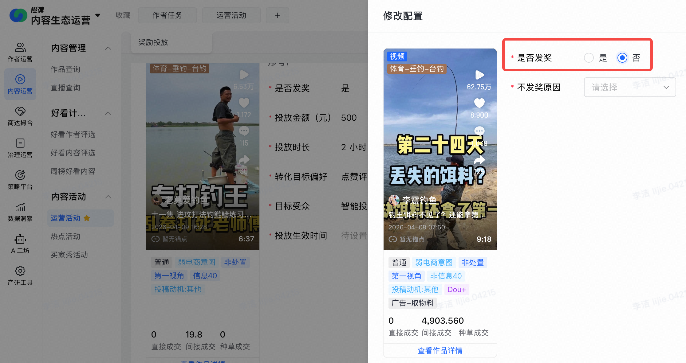 > > 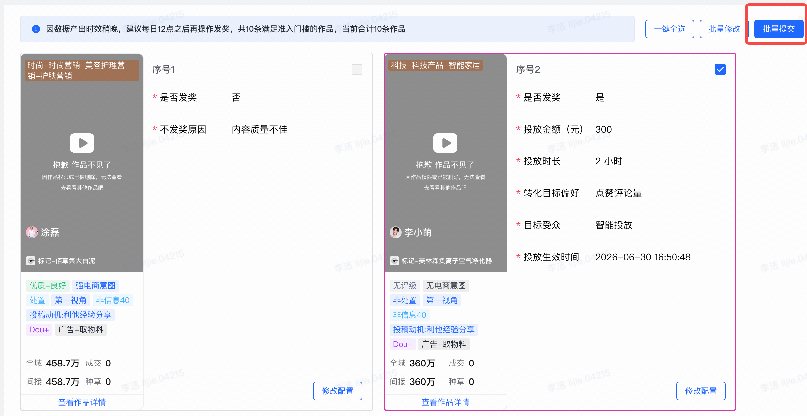 **【场景一】DOU+币发放** **筛选项** - 作品ID - 形式：支持批量输入 - 输入内容：视频/图文/直播ID - 操作人 - 支持下拉选择与输入搜索 **剔除列表** - 作品内容：作品预览、作品标题、作品ID - 剔除发奖原因：展示奖励投放前的「不发奖原因」字段内容 - 剔除发奖时间：手动剔除后提交发奖的时间 - 操作人：展示手动剔除提交发奖人员 **【场景二】DOU+券发放** **筛选项** - 作者ID - 操作人 - 支持下拉选择与输入搜索 **剔除列表** - 作者信息：作者昵称、作者ID - 剔除发奖原因：展示奖励投放前的「不发奖原因」字段内容 - 剔除发奖时间：手动剔除后提交发奖的时间 - 操作人：展示手动剔除并提交发奖的人员 |

## 四、埋点需求
> 参考文档：[【作者及联盟】数据需求模版](https://bytedance.larkoffice.com/wiki/KBMFwD8SXi0WwDk2gqwcQh53nNh)、[作者联盟埋点数据规范](https://bytedance.larkoffice.com/wiki/H342wrrHairlxKkGiCPc5NyDn9d)

| **截图** | **产品路径** | **具体模块** | **字段** | **补充参数** |
| --- | --- | --- | --- | --- |
| 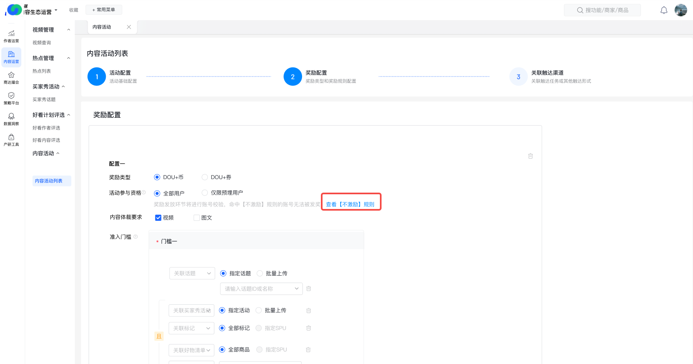 | 运营平台 > 内容活动 > 奖励配置 > 活动参与资格 | 查看「不激励」规则 | 点击UV |  |
| 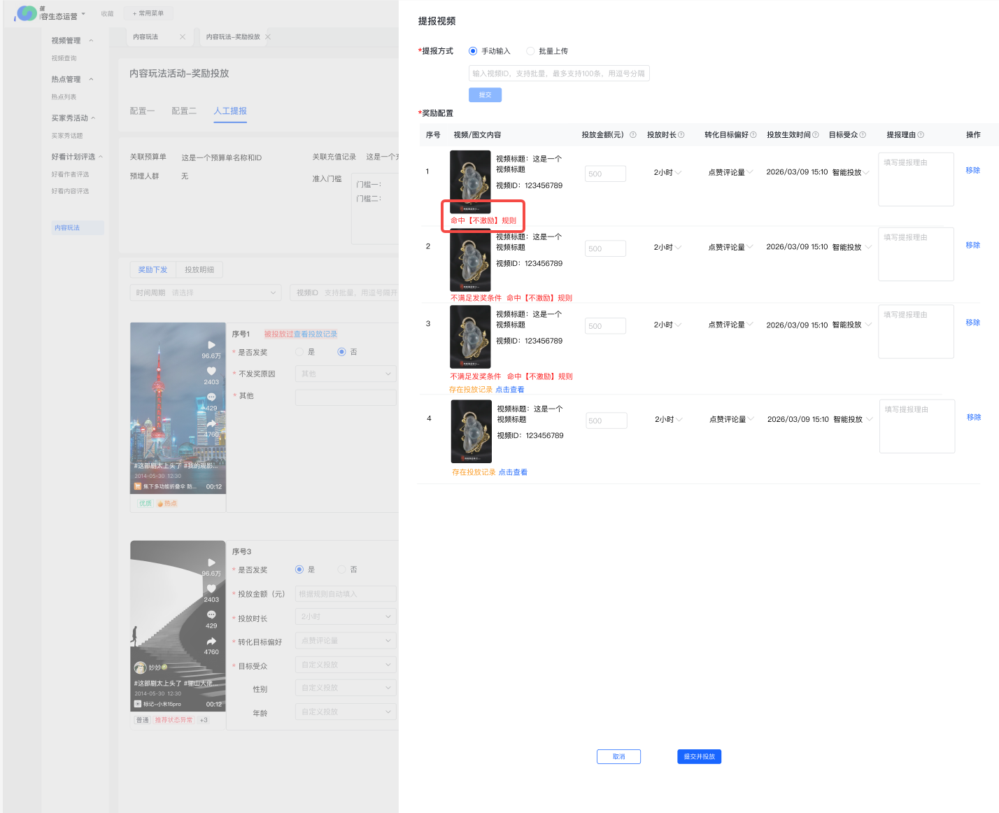 | 运营平台 > 内容活动 > 奖励投放 > 人工提报 | 人工提报命中「不激励」规则提示曝光 | 曝光UV |  |
| 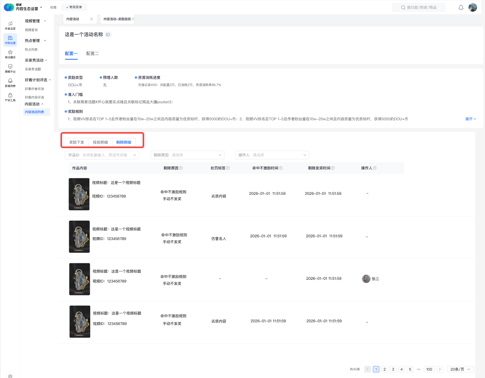 | 运营平台 > 内容活动 > 奖励投放 > 剔除明细 | 剔除明细 Tab 曝光 | 曝光UV | 区分Tab所在配置项与奖励类型 配置项：配置一、配置二...... 奖励类型：DOU+币，DOU+券 |
|  | 运营平台 > 内容活动 > 奖励投放 > 剔除明细 | 剔除明细 Tab 点击 | 点击UV | 区分Tab所在配置项与奖励类型 配置项：配置一、配置二...... 奖励类型：DOU+币，DOU+券 |

## 五、实验设计
本期需求为合规能力建设，暂不涉及AB实验。
上线后通过以下方式验证效果：
- 环比/同比：内容活动奖励下发中，违规账号被错误激励的金额及账号数
- 内控对齐：与内控团队对齐数据口径，上线后确认badcase清零或显著下降

## 全文评论

> comment_id=`7651990044009385141`，状态：未解决
> **引用 quote**：全文评论（原评论未绑定具体选区）
> **评论**：电商作者处罚信息表：`ecom.dm_gvn_author_overall_ecom_author_penalty_df`
> **补充**：非电商作者的处罚信息表待提需给主端

> comment_id=`7655357328704212182`，状态：未解决
> **引用 quote**：全文评论（原评论未绑定具体选区）
> **评论**：补充资料：[相关文档](https://bytedance.larkoffice.com/wiki/VW1WwrmQfiMYC2keWg4cldranzg)
> **补充**：无

> comment_id=`7655639134832315618`，状态：未解决
> **引用 quote**：全文评论（原评论未绑定具体选区）
> **评论**：需求 LR：[会议纪要](https://bytedance.larkoffice.com/minutes/obcngtkz1pm2sl78aw573g1q)
> **补充**：无
---

# 验收检查

## 资源对账

- 正文图片：11 / 11
- 附件：0 / 0
- 评论：28 / 28
- 白板：6 / 6
- 白板节点图片：14 / 14

## 验收证据链接

- 正文来源：[fetch_doc_content.md](prd-source/raw/fetch_doc_content.md)
- Parser 辅助材料：[lark_parser_strict.md](prd-source/raw/lark_parser_strict.md)
- 评论来源：[comments_page_1.json](prd-source/comments/comments_page_1.json)
- 白板证据 `Q0E1wrjCuhA0h5bO1WycqdyRnFf`：[缩略图](prd-source/whiteboards/whiteboard_01_Q0E1wrjCuhA0h5bO1WycqdyRnFf_thumbnail.jpg)、[节点 JSON](prd-source/whiteboards/whiteboard_01_Q0E1wrjCuhA0h5bO1WycqdyRnFf_nodes.json)、[详细分析](prd-source/whiteboards/whiteboard_01_Q0E1wrjCuhA0h5bO1WycqdyRnFf_analysis.md)
  - 节点图片 `d2:2`：[whiteboard_01_node_d2-2_FSE0bwtcFo1MdWxdA5rcu0Bdnif.png](prd-source/whiteboards/whiteboard_01_node_d2-2_FSE0bwtcFo1MdWxdA5rcu0Bdnif.png)
- 白板证据 `Rr6lw0FtThXhHEbHIJWcwcwTnle`：[缩略图](prd-source/whiteboards/whiteboard_02_Rr6lw0FtThXhHEbHIJWcwcwTnle_thumbnail.jpg)、[节点 JSON](prd-source/whiteboards/whiteboard_02_Rr6lw0FtThXhHEbHIJWcwcwTnle_nodes.json)、[详细分析](prd-source/whiteboards/whiteboard_02_Rr6lw0FtThXhHEbHIJWcwcwTnle_analysis.md)
  - 节点图片 `d2:4`：[whiteboard_02_node_d2-4_YgPib424SofgXax98ZFcnJ39nMg.png](prd-source/whiteboards/whiteboard_02_node_d2-4_YgPib424SofgXax98ZFcnJ39nMg.png)
  - 节点图片 `d8:1`：[whiteboard_02_node_d8-1_UOv8bfvSeocNJgxbzXlcBXNQn5m.png](prd-source/whiteboards/whiteboard_02_node_d8-1_UOv8bfvSeocNJgxbzXlcBXNQn5m.png)
- 白板证据 `D8wwwJrbAhwQ35bCgHCcIMzgnsg`：[缩略图](prd-source/whiteboards/whiteboard_03_D8wwwJrbAhwQ35bCgHCcIMzgnsg_thumbnail.jpg)、[节点 JSON](prd-source/whiteboards/whiteboard_03_D8wwwJrbAhwQ35bCgHCcIMzgnsg_nodes.json)、[详细分析](prd-source/whiteboards/whiteboard_03_D8wwwJrbAhwQ35bCgHCcIMzgnsg_analysis.md)
  - 节点图片 `d1:27`：[whiteboard_03_node_d1-27_TD9BbWEiDogQG7xmjG1cVIKUn3P.png](prd-source/whiteboards/whiteboard_03_node_d1-27_TD9BbWEiDogQG7xmjG1cVIKUn3P.png)
  - 节点图片 `d1:13`：[whiteboard_03_node_d1-13_BlZIbCAD0oW86ZxkftucpOOqnrd.png](prd-source/whiteboards/whiteboard_03_node_d1-13_BlZIbCAD0oW86ZxkftucpOOqnrd.png)
  - 节点图片 `d1:10`：[whiteboard_03_node_d1-10_MBzUbLUdboLVZvxAtONctCmrnnh.png](prd-source/whiteboards/whiteboard_03_node_d1-10_MBzUbLUdboLVZvxAtONctCmrnnh.png)
- 白板证据 `IFrAwadoph00bBbFniecIsVEnRh`：[缩略图](prd-source/whiteboards/whiteboard_04_IFrAwadoph00bBbFniecIsVEnRh_thumbnail.jpg)、[节点 JSON](prd-source/whiteboards/whiteboard_04_IFrAwadoph00bBbFniecIsVEnRh_nodes.json)、[详细分析](prd-source/whiteboards/whiteboard_04_IFrAwadoph00bBbFniecIsVEnRh_analysis.md)
  - 节点图片 `d33:8`：[whiteboard_04_node_d33-8_G4eXbsEojoXuDExlCHlcsBDvnTf.png](prd-source/whiteboards/whiteboard_04_node_d33-8_G4eXbsEojoXuDExlCHlcsBDvnTf.png)
  - 节点图片 `d33:9`：[whiteboard_04_node_d33-9_SfgebPx4boxzn4xL8DAcbXvmnmg.png](prd-source/whiteboards/whiteboard_04_node_d33-9_SfgebPx4boxzn4xL8DAcbXvmnmg.png)
  - 节点图片 `d33:7`：[whiteboard_04_node_d33-7_LASfbECFdoXb5VxpxU8cNgRen4g.png](prd-source/whiteboards/whiteboard_04_node_d33-7_LASfbECFdoXb5VxpxU8cNgRen4g.png)
- 白板证据 `LxmswBz6yhhPDubamDSceRj2nub`：[缩略图](prd-source/whiteboards/whiteboard_05_LxmswBz6yhhPDubamDSceRj2nub_thumbnail.jpg)、[节点 JSON](prd-source/whiteboards/whiteboard_05_LxmswBz6yhhPDubamDSceRj2nub_nodes.json)、[详细分析](prd-source/whiteboards/whiteboard_05_LxmswBz6yhhPDubamDSceRj2nub_analysis.md)
  - 节点图片 `d8:1`：[whiteboard_05_node_d8-1_U1x1bRxuOo1h1hx4kfVchJqMnLe](prd-source/whiteboards/whiteboard_05_node_d8-1_U1x1bRxuOo1h1hx4kfVchJqMnLe)
  - 节点图片 `d2:4`：[whiteboard_05_node_d2-4_WBrjb5aCuoBesUxwKnLc0Y3Hnaf](prd-source/whiteboards/whiteboard_05_node_d2-4_WBrjb5aCuoBesUxwKnLc0Y3Hnaf)
- 白板证据 `XqZwwzZVBh38QUbp3itcbqAUnmh`：[缩略图](prd-source/whiteboards/whiteboard_06_XqZwwzZVBh38QUbp3itcbqAUnmh_thumbnail.jpg)、[节点 JSON](prd-source/whiteboards/whiteboard_06_XqZwwzZVBh38QUbp3itcbqAUnmh_nodes.json)、[详细分析](prd-source/whiteboards/whiteboard_06_XqZwwzZVBh38QUbp3itcbqAUnmh_analysis.md)
  - 节点图片 `d33:8`：[whiteboard_06_node_d33-8_UmBubUgmSozWCDxEmVqc28Hsn0h](prd-source/whiteboards/whiteboard_06_node_d33-8_UmBubUgmSozWCDxEmVqc28Hsn0h)
  - 节点图片 `d33:7`：[whiteboard_06_node_d33-7_C0J7ba3vOo3ZS5xNO9Bc5Ax6nOh](prd-source/whiteboards/whiteboard_06_node_d33-7_C0J7ba3vOo3ZS5xNO9Bc5Ax6nOh)
  - 节点图片 `d33:9`：[whiteboard_06_node_d33-9_DVfwbaHDxo7TC4xuSX6crfvinLZ](prd-source/whiteboards/whiteboard_06_node_d33-9_DVfwbaHDxo7TC4xuSX6crfvinLZ)
