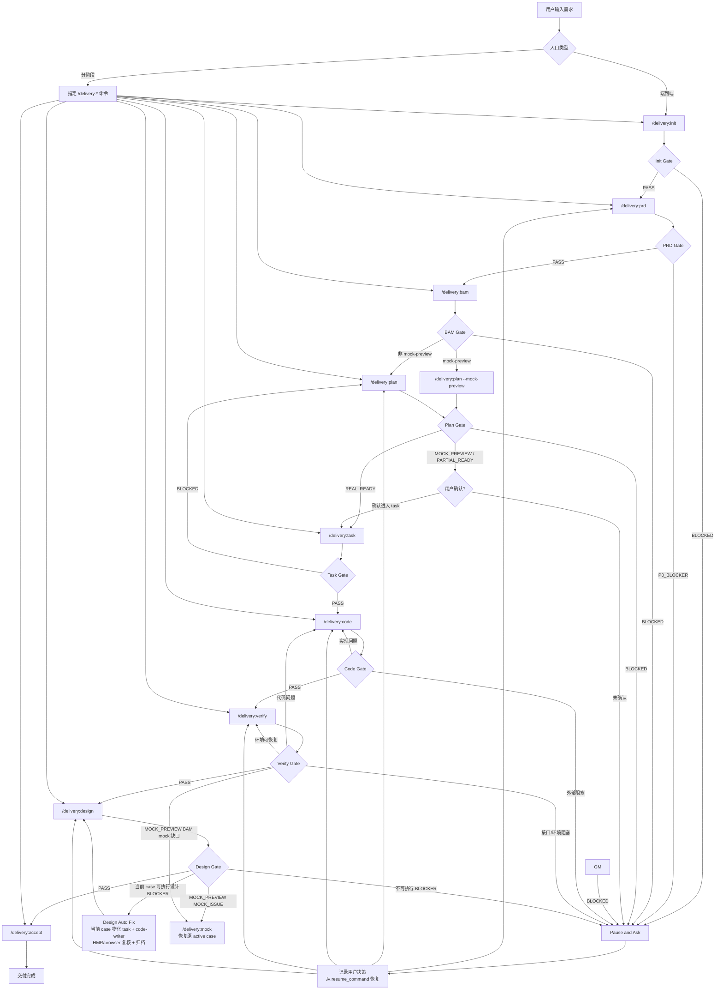
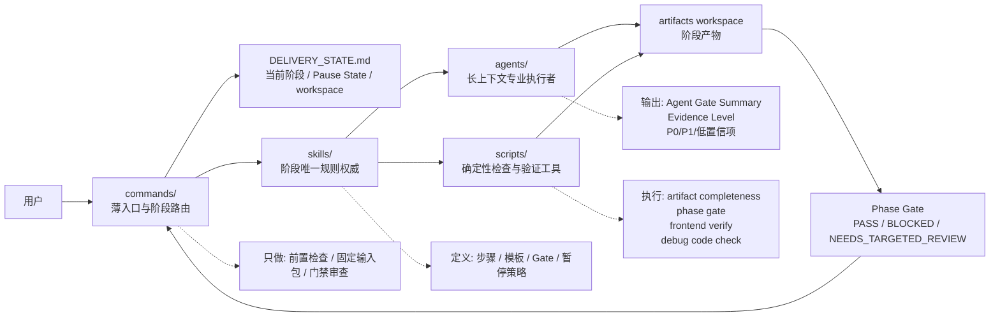
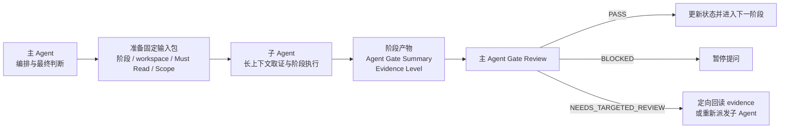
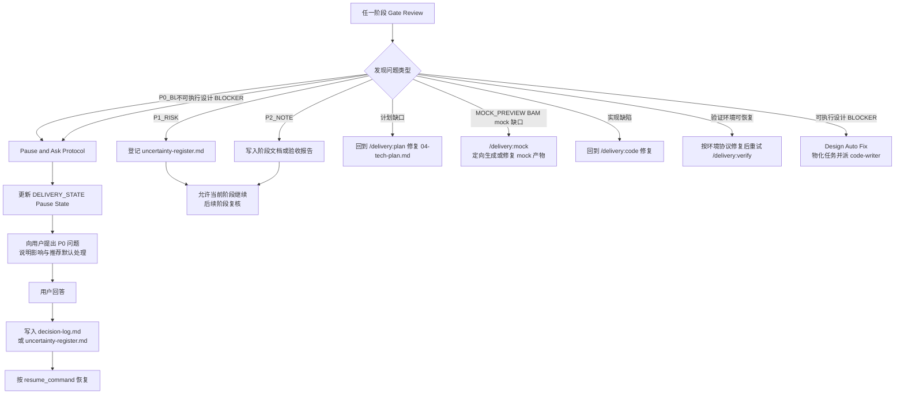
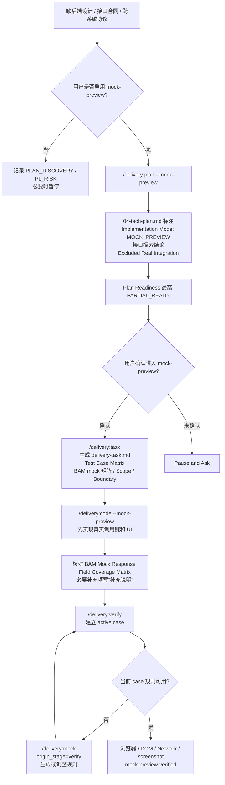

# 需求交付框架流程图

本文基于当前仓库的 `AGENTS.md`、`commands/`、`skills/`、`agents/` 和 `scripts/` 梳理。

## 1. 端到端主流程

## 2. 框架职责分工

## 3. 主 Agent 与子 Agent 分工

| 维度 | 主 Agent | 子 Agent |
| --- | --- | --- |
| 核心职责 | 阶段编排、门禁审查、状态更新、用户提问、最终放行判断 | 读取高 token 输入、取证、分析、执行阶段任务、生成结构化产物 |
| 输入处理 | 准备固定输入包，明确当前阶段、workspace、必读文件、读写范围和停止条件 | 严格按输入包执行，不自行扩大阶段范围 |
| 证据处理 | 优先审 `Agent Gate Summary`、关键门禁表、P0/P1 和 diff 摘要；只在异常时定向回读 evidence | 标注 Evidence Level：HIGH / MEDIUM / LOW；低置信结论必须显式列出 |
| 阶段推进 | 只能由主 Agent 判断 `PASS / BLOCKED / NEEDS_TARGETED_REVIEW`，并更新阶段状态 | 不得宣布进入下一阶段，不得修改 `DELIVERY_STATE.md` 的 `current_phase` |
| 代码修改 | 只在 Code 阶段且 Gate 满足后派发或执行；遇到计划缺口必须回到 Plan | 默认不能改业务代码；只有 `code-writer` 可在明确边界内修改指定文件 |
| 阻塞处理 | 遇到 P0_BLOCKER 执行 Pause and Ask，等待用户回答后从 `resume_command` 恢复 | 将阻塞项、风险、低置信结论交给主 Agent，不自行放行 |
| Flow Log | 可在阶段、agent、Gate、detour、runtime 事件后追加脱敏摘要到 `flow-logs/` | hook 只观察，不改变 Gate；不得写敏感内容或原始大证据 |
| Execution Record | 用户主动或 daily 触发 `/delivery:record`，汇总当前需求执行记录 | 写入 workspace 的 `delivery-execution-record.md`；不替代阶段产物或 Gate |
| Regression Case | 修改流程规则时通过 `/delivery:capture-regression` 记录用户问题和断言 | 默认只记录不 replay；daily suite 集中跑 |

## 4. 阶段、入口与核心产物

| 阶段 | 命令 | 主要 skill | 主要 agent | 核心产物 | 放行条件 |
| --- | --- | --- | --- | --- | --- |
| Init | `/delivery:init` | `01-requirement-intake`、`02-task-space-init` | 按需 | `prd-source.md`、`00-inputs.md`、`01-intake.md`、`02-task-space.md` | workspace 与需求源就绪 |
| PRD | `/delivery:prd` | `03-prd-analysis` | `prd-analyzer` | `03-prd-analysis.md`、`uncertainty-register.md`、`ui-source-map.md`、Figma Atlas / evidence / supplement | 无影响规划的 P0 |
| BAM | `/delivery:bam` | `bam`、BAM 同步脚本 | 主 Agent | `bam/bam-psm-branch-evidence.json`、`bam/bam-interface-change-evidence.json`、`bam/bam-branch-preflight.json`、`bam/bam-sync-report.md`，mutation 时另含 method 产物 | 以 `commands/delivery:bam.md` 为唯一合同；无分支证据 no-op 放行；有分支证据需 preflight、config、update、cleanup 全闭合 |
| Plan | `/delivery:plan` | `04-tech-planning`、`writing-plans` | `tech-planner` | `04-tech-plan.md` | `READY` / 用户确认 `PARTIAL_READY`，并路由到 task |
| Task | `/delivery:task` | `task-planning`、`test-case-planning` | `task-planner` 生成任务与测试产物；主 Agent 做最终 Gate | `delivery-task.md`、`09-test-case-matrix.md`，MOCK_PREVIEW 下包含 Test Case Matrix、BAM Mock Response Field Coverage Matrix、Mock Preview Scope、Mock / Real Boundary | Task 可执行且 coverage audit PASS |
| Mock | `/delivery:mock`（仅 verify / design active case 定向 detour） | `bam-mock-runtime-generator` | 当前执行会话直接进入并完成 BAM 审查 | `delivery-mock.md`、`mock/rule-map.json`、`mock/rule-map.md`、`mock/apis/<apiName>/**` | BAM 矩阵是合同源；mock 生成、patch、验证通过后恢复原 verify/design case |
| Code | `/delivery:code` | `05-code-implementation`、`executing-plans` | 主 Agent 用 `code-implementation` 编排正式 Task N，并派 `code-writer` 执行当前代码切片；verify code-fix handoff / micro fix 仍派 `code-writer`；`runtime-runner` 仅辅助非浏览器运行时、命令和日志；Code 只核对 BAM 矩阵 | `05-implementation-log.md`，含静态检查、Task Context Index、Task Review Packet；必要时更新 BAM 矩阵 `补充说明` | 每个 Task 通过实现、静态检查、非浏览器测试和独立 review；Code 不写 `delivery-mock.md` |
| Verify | `/delivery:verify` | `06-debug-verification` | 主 Agent 逐 case 验证；`runtime-runner` 仅做 dev server / HMR / health check / 命令 / 日志 / 机械证据辅助；执行当前 case 时读取 BAM 矩阵合同和 `补充说明`，必要时进入 `/delivery:mock`，代码问题仍走 code-fix handoff | `06-debug-verification.md`，含 `Verify Case Ledger` 和 `Case Evidence Coverage Audit` | lint/typecheck/test/build/debug 通过或风险分类闭合；mock 修复后恢复同一 case 完成浏览器验证 |
| Design | `/delivery:design` | `07-design-alignment` | 主 Agent 建立 `Design Case Queue` 严格串行；`design-checker` 每次只关闭当前 active case；`runtime-runner` 仅可辅助 dev server / HMR / health check / 命令 / 日志；每个 design / verify+design case 必须先从 Figma screenshot 或 Figma node data 提取目标可见结构，再从 runtime screenshot 抄录运行态事实，先做 screenshot-first 判定，再用 DOM / bbox / computed style 解释差异；mock 根因时当前 case 内走 `/delivery:mock`，可执行返工时当前 case 内派 `code-writer` | `07-design-alignment.md`，必要时更新 `delivery-mock.md` / `mock/**`、增量更新 `delivery-task.md` 和 `05-implementation-log.md` | 每个 case 的 Figma 基准源齐全且逐 case 归档；MOCK_ISSUE 已经 mock auto-fix 并复跑当前 case；可执行 BLOCKER 已经 design auto-fix 关闭并归档；缺 Figma 基准源则 `BLOCKED_NEEDS_FIGMA_SOURCE` |
| Accept | `/delivery:accept` | `08-delivery-acceptance` | `delivery-reviewer` | `08-acceptance-report.md`、MR 描述草稿 | 覆盖度、验证证据、设计对齐与遗留风险均闭合 |
| Regress | `/delivery:regress` | `09-flow-regression-validation` | 按需 | `flow-regression-report.md` | 流程修复后的目标阶段回归通过 |
| Analyze Flow | `/delivery:analyze-flow` | 本地 flow log 分析脚本 | 主 Agent | `flow-logs/*.ndjson` 的只读分析结果 | 只读统计，不改变阶段状态 |
| Record | `/delivery:record` | 执行记录汇总协议 | 主 Agent | `delivery-execution-record.md` | 只读汇总当前需求关键产物、截图、问题和解决记录 |
| Capture Regression | `/delivery:capture-regression` | 回归用例捕获协议 | 主 Agent | `flow-regression-cases/<stage>/<case-id>.md`、`index.json` | 只记录流程问题用例，不阻塞当前修改 |

### 4.1 Mock / Task 执行设计

| 阶段角色 | 主 Agent 固定输入与职责 | Subagent 执行职责 | 允许写入 | 并发 / Gate | 阻塞路由 |
| --- | --- | --- | --- | --- | --- |
| `/delivery:mock` / `bam-mock-runtime-generator` | 固定 workspace、origin_stage、resume_task/case/rule、Browser Runtime Mode、vmok URL / Profile / storage state、API / rule 切片、允许 / 禁止路径、接口 manifest、BAM marker、wrapper request 字段透传和最终验证合同；直接审查并恢复原 workflow | 当前执行会话按接口级流程串行初始化目标产物，调整 `rule-map.json` 索引、接口 manifest、runtime、verify 和必要的 `BAM_MOCK_WRAPPER_FIELD`，再替换对应 BAM marker；浏览器前置检查只采集能力和登录态证据，不替主 Agent 做 Gate | 当前 workspace 授权 `mock/**`、目标 BAM marker、目标 BAM wrapper 字段透传 marker 和生成器管理的 `__mock__` | 聚合文档、manifest、patch、最终 patched BAM 验证必须串行；`delivery-mock.md` 记录 origin/resume/mock_result | 前置 task/case/rule 合同缺失时返回对应上游阶段；mock 增删改、wrapper 丢字段、切片冲突或最终验证失败继续调用 `/delivery:mock` 定向修复 |
| `task-planner` | 固定实现模式、plan / design 事实源、输出路径、禁止路径和 `Excluded Real Integration`；审查摘要并决定最终路由 | 生成 `delivery-task.md` 并执行 `Executable Task Check`，生成 `09-test-case-matrix.md`；MOCK_PREVIEW 下同一产物必须包含 Test Case Matrix、BAM mock 矩阵、Scope、Boundary，保留 task/case/rule/API mock 依赖并绑定 verify case；非 MOCK_PREVIEW 下 mock 字段为 N/A | 仅当前 workspace 的 `delivery-task.md`、`09-test-case-matrix.md` | 单 agent 串行生成两个产物；`PASS` 仅表示自检通过，最终 Task Gate 由主 Agent 判断 | plan gap 返回 `/delivery:plan`；MOCK_PREVIEW mock gap 标记为 verify/design 待闭合依赖；非 MOCK_PREVIEW 缺 mock 不阻塞 |
| `/delivery:code` / `code-implementation + code-writer` | 主 Agent 解析 Task N 顺序，准备 `Task Context Index` 和 `Task Review Packet`，固定 case/rule/API、验证命令、targeted diff、机械检查和 `UI Evidence Mode`；Code 不操作浏览器、不调用 `/delivery:mock`，只核对 BAM 矩阵 | `code-writer` 执行业务代码、非浏览器测试和静态检查；独立 reviewer 先读 packet + targeted diff；矩阵缺规则返回 Task，已有 rule 需补充时返回问题和证据 | 当前 Task 业务代码、`05-implementation-log.md`、BAM 矩阵 `补充说明`；不得写 `delivery-mock.md` 或 mock runtime | 严格串行；代码、静态检查、非浏览器测试和独立 review PASS 后继续；mock closure 不参与 Code Gate | plan/task 合同缺失返回上游；已有 rule 的补充项不阻塞 Code |
| `/delivery:verify` / 主 Agent | 从 Test Case Matrix 建立 Queue，固定 Browser Runtime Mode 和 baseline；执行当前 case 时读取 BAM 矩阵合同及 `补充说明`，逐项对账 evidence | `runtime-runner` 只做非浏览器辅助；必要时以 `origin_stage=verify` 进入 `/delivery:mock`，恢复同一 case 后采集浏览器 / Network / DOM / screenshot 证据；代码问题继续走 code-fix handoff | `06-debug-verification.md`、`code-fix-handoff.md`、`omission-risk-scan.md`；mock 产物仅由 `/delivery:mock` 写入 | 当前 case 的 Evidence Coverage Audit 更新后才能进入下一 case；code auto-fix 后按增量策略复验 | mock issue 进入 `/delivery:mock`；代码、环境、证据问题沿用既有分类 |
| `/delivery:design` / Mock Auto Fix | `design-checker` 或主 Agent 将差异根因分类为 `MOCK_ISSUE` 后，主 Agent 固定 origin_stage=design、case/rule/API、vmok URL、截图 / Network / console 摘要和恢复点 | 当前执行会话直接调用 `/delivery:mock` 更新 mock 产物、BAM marker 或 wrapper request 字段透传；审查 PASS 后回到原 design case 重取证据 | `delivery-mock.md`、`mock/**`、必要 BAM marker / wrapper mock patch、`07-design-alignment.md` | 仅 `MOCK_PREVIEW`；不得派代码 agent，不得写 Design Rework Task，不得停在 mock 修复完成 | `/delivery:mock` 审查失败、case/rule/API 合同缺失或自然请求无法确定时暂停 / 回上游 |
| `/delivery:design` / Design Auto Fix | 当前 active case 出现可执行 BLOCKER 后，`design-checker` 输出该 case 的 Blocker 和 Design Rework Task Draft；主 Agent 在当前 design 阶段内更新 `delivery-task.md`，固定 case/blocker、Figma screenshot / Figma node data、`UI Evidence Mode`、证据引用、允许 / 禁止文件、HMR / browser 复核点；验证命令只在任务声明或触发升级条件时补充 | `code-writer` 只执行当前 case 的 Design Rework Task；按 `UI Evidence Mode` 使用 f2c/d2c 或 runtime baseline；`runtime-runner` 可辅助 HMR / 编译日志 / health check / 命令摘要；`design-checker` 或主 Agent 按当前 Browser Runtime Mode 采集浏览器证据并复跑原 active case，主 Agent 只审证据充分性和 Gate；关闭归档后才能进入下一个 case；targeted typecheck / build / diagnostics 只在编译、runtime、类型、接口、数据结构、公共组件或证据定位风险时升级 | 当前 Design Rework Task 允许文件；`07-design-alignment.md`、`delivery-task.md`、`05-implementation-log.md`；`runtime-runner` 不写业务代码或阶段状态 | 当前 case 最多 2 轮；每轮必须复用 dev server 和浏览器会话 / Profile / storage state；design case 缺 Figma screenshot / node data 不得 auto-fix PASS；`F2C_REQUIRED` 缺 f2c/d2c 时补证，`RUNTIME_BASELINE_ALLOWED` 缺 runtime baseline 时补证；不得把可执行返工结束为 BLOCKED 或“回 `/delivery:code`”；不得累计多个未归档 case 批量修复 | 任务无法物化、Figma 基准源缺失、证据模式缺口无法补齐、需产品/接口/权限/跨系统决策、HMR/browser 复核失败、升级验证失败或复核仍不通过时暂停；缺 plan contract 时回 `/delivery:plan` |

### 4.2 Verify / Design 共享 Case 闭环

Verify 与 Design 不合并阶段，但共享一套 case 闭环骨架：

1. 建立阶段专属 Case Queue，并锁定唯一 `active_case_id`。
2. 消费 `contract_ref`、`positive_assertion`、`negative_assertion`、`visual_assertion`、`negative_visual_assertion`、`evidence_required`。
3. 逐 `evidence_requirement_id` 映射执行动作、记录证据、实际观察值和结果。
4. mock 或 code detour 必须携带 `origin_stage`、`resume_point`、case/rule/API、允许写入范围和 closure evidence。
5. detour 完成后只回到原 active case 重取证据；归档后才能进入下一个 case。

差异边界：verify 负责运行态、命令、Network、DOM、mock / integration 事实；design 负责 Figma 基准、结构 / 样式对比、负向可见扫描和 Basic Pixel Fit。verify 截图只能作为 design 的 runtime source，不能替代 Figma-vs-Runtime 结论。

## 5. 阻塞与回退规则

## 6. Mock Preview 分支

