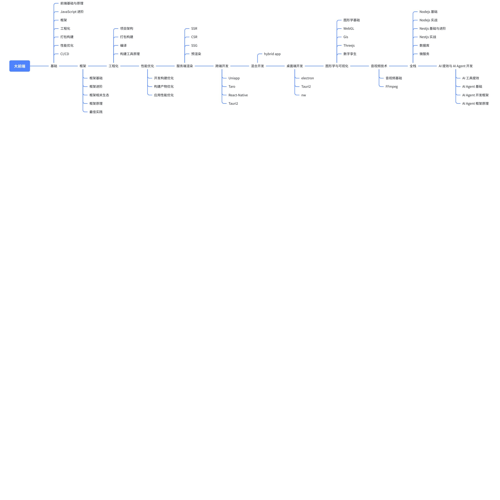

# 开班典礼与学习导引

> 原文链接：[飞书原文](https://u19tul1sz9g.feishu.cn/docx/VVURdL8FAoMEp4xqufmchFRynWb)

欢迎加入训练营

上课时间：一般一周 2\~4 节课，晚上20:00\~22:00、或周末白天 10:00\~12:00、14:00\~16:00，课程安排会在月底排出下月课表；

一般会课前10\~15分钟进入直播间，针对往期内容进行辅导答疑；

前端

Vue

React

服务端        ->   python fastapi  / java spring boot

Nestjs

Nextjs

Nuxtjs

数据库

Postgresql、redis

Prisma

kafka、clickhouse

bull

AI

Langchainjs

Langgraphjs

Deepagentjs

RAG

qdrant、milvus

## AI大前端全栈发展方向

AI大前端全栈，是前端进阶的一个大方向

### 基础前端

常规前端方向涵盖的内容有：

- 基础知识
- 前端框架
- 工程化
- 打包构建
- 性能优化
- 持续集成与持续部署
- 微前端

### 大前端

而大前端，则涵盖更多内容，包括：

- 服务端渲染
- 跨端开发
- 混合开发
- 桌面端开发
- 设计系统
- 图形学与可视化
- 音视频技术
- WebAssembly 技术

  - https://www.assemblyscript.org/

### 服务端与中间件

主要包括：

- Next
- Nuxt
- Nestjs
- prisma/typeorm
- Postgresql
- docker

Github copilot  Tab Coding  -> Claude Code/Open Code/Codex Vibe Coding  ->  Spec Coding

### 架构思维

文案：Gemini Pro2.5、Gemini Pro3

代码：Claude Code、（codex、opencode）、qwen-coder

除此以外，程序设计与架构思想也是我们需要重点掌握的，比如：

- monorepo 架构

  - https://github.com/vuejs/core/blob/b2b5f57c2c945edd0eebc1b545ec1b7568e51484/pnpm-workspace.yaml
- 微内核

  - https://github.com/vuejs/core/blob/b2b5f57c2c945edd0eebc1b545ec1b7568e51484/packages/runtime-core/src/apiCreateApp.ts#L242
- 面向切面编程

  - https://github.com/axios/axios/blob/b9f4848f8c4c7d53dbe1a1ee06e9b3604c2e56ac/lib/core/Axios.js#L121C30-L121C40
- 设计模式
- 团队基建与效率工程

### 产品业务思维

- 需求把控
- 方案评审
- 产品流程
- 业务价值

### 管理

- 代码规范
- 人效
- 向上管理

## AI大前端全栈最快成长路线

## 项目实战学习导引

### 项目矩阵列表

- **企业级可视化无代码平台架构设计与实践（Vue3）**
- **企业级类 mantine 组件库架构设计与实践（React18）**
- **企业级类 VueUse Composition 库架构设计与实践（Vue3）**
- **企业级团队脚手架命令行工具架构设计与实践（Nodejs）**
- **企业级监控平台全栈架构设计与实践（Vanilla + React19 + Vue3）**
- **企业级编辑器类飞书文档架构设计与实践（React19）**
- **企业级通用低代码平台架构设计与实践（React19）**
- **企业级数字孪生低代码平台架构设计与实践（Cesium + Openlayer + Threejs + Vue3）**
- **企业级类 react-use hooks 库架构设计与实践（React19）**
- **企业级类扣子、Dify AI 应用引擎架构设计与实践（Nextjs + Postgresql）**
- **企业级类剪映视频智能剪辑工具架构设计与实践（FFmpeg + Langchainjs + Electron + Vue3）**

  - Vibe Coding 实践
  - 需求分析与方案评审
  - 项目架构设计分析
  - 音视频核心与编解码技术进阶
  - 特效与资源管理体系
  - 视频智能剪辑核心能力
  - AI 自动剪辑功能设计与实践
  - 文本转语音 TTS （text2speech）实践
  - 导出与渲染优化
- **企业级类 Figma AI 设计与应用生成引擎架构设计与实践（React19 + Langgraphjs + Nestjs）**

  - D2C 工具需求与方案评审
  - 项目架构设计分析
  - 设计器编排引擎架构设计与实现
  - AI 生成模型核心概念与适配
  - AI 意图识别与组件生成引擎
  - T2UI（Text to UI）、D2C (Design to Code) 生成链路
  - 插件生态与扩展
  - 设计资产管理与交付
- **企业级类飞书亿级在线协同表格架构设计与实践（规划中）**
- **企业级类 Manus 全能通用 AI Agent 架构设计与实践（规划中）**

### 项目实战学习导引

对于这份优秀的项目列表，单纯地按顺序学习可能不是最高效的方式。我建议根据技术栈、项目类型和能力递进关系，将其划分为几个核心领域，并提供建议的学习路径。

#### 第一阶段：夯实基础与封装思想

这个阶段的核心是**“造轮子”**，但不是重复造轮子，而是在企业级需求的驱动下，学习如何设计高复用性、高可维护性的代码模块。

<table><colgroup><col/><col/><col/></colgroup><tbody><tr><td>项目名称</td><td>核心技术</td><td>学习重点与目标</td></tr><tr><td>1.企业级类 VueUse Composition 库</td><td>Vue3, Composition API</td><td><ul><li>函数式编程思想：学习如何将逻辑封装成可复用的、独立的函数。</li><li>响应式系统：深入理解 Vue3 响应式原理（ref, reactive）及其在 hooks 中的应用。</li><li>TypeScript 高级应用：学习泛型、类型推断等在库开发中的实践。</li><li>工程化：单元测试、文档生成、打包发布流程。</li></ul></td></tr><tr><td>2.企业级类 react-use hooks 库</td><td>React19, Hooks</td><td><ul><li>React Hooks 深入理解：彻底搞懂 useState, useEffect, useContext, useCallback, useMemo 等。</li><li>自定义 Hooks 设计模式：学习如何抽象业务逻辑，设计出通用且灵活的自定义 Hooks。</li><li>副作用处理：掌握在 Hooks 中处理异步操作、事件监听、定时器等副作用的最佳实践。</li><li>React 19 新特性探索：如 use Hook 的实践。</li></ul></td></tr><tr><td>3.企业级类 mantine 组件库</td><td>React18, TypeScript</td><td><ul><li>组件架构设计：学习原子设计（Atomic Design）思想，设计可组合的组件体系。</li><li>样式方案：深入研究 CSS-in-JS (如 Styled-components, Emotion) 或 CSS Modules，并设计主题（Theming）系统。</li><li>可访问性（a11y）：确保组件符合 WAI-ARIA 标准，对所有用户友好。</li><li>文档驱动开发：使用 dumi 或类似工具进行组件开发和文档展示。</li></ul></td></tr></tbody></table>

**学习路径建议**：

- 如果你是 **Vue** 技术栈，从 `VueUse 库` 开始。
- 如果你是 **React** 技术栈，从 `react-use 库` 开始，然后挑战 `mantine 组件库`。
- 这个阶段完成后，你将对框架的理解、代码的封装和抽象能力有一个质的飞跃。

#### 第二阶段：平台化架构与工程化思维

这个阶段的核心是**“搭平台”**，从单个模块的开发者，转变为思考整个系统架构、提升团队效率的工程师。

<table><colgroup><col/><col/><col/></colgroup><tbody><tr><td>项目名称</td><td>核心技术</td><td>学习重点与目标</td></tr><tr><td>4.企业级团队脚手架命令行工具</td><td>Node.js, Commander.js</td><td><ul><li>Node.js 核心 API：深入学习 fs, path, child_process 等模块。</li><li>CLI 交互设计：使用 Inquirer.js 等库构建友好的命令行交互体验。</li><li>发布与版本管理：学习如何将 CLI 工具发布到 npm，并管理版本。</li></ul></td></tr><tr><td>5.企业级通用低代码平台</td><td>React19</td><td><ul><li>核心架构设计：理解“物料区”、“画布区”、“配置区”的核心联动机制。</li><li>渲染器设计：如何将 JSON Schema 动态渲染成真实的 UI 组件。</li><li>拖拽与布局：实现组件的拖拽、缩放、对齐、吸附等画布核心功能。</li><li>状态管理：设计一个高效的全局状态来管理复杂的页面 Schema。</li></ul></td></tr><tr><td>6.企业级可视化无代码平台</td><td>Vue3</td><td><ul><li>与低代码平台的异同：理解无代码平台在抽象层次上与低代码的不同，更偏向于业务流程配置。</li><li>Vue3 动态组件：深入实践 component :is 和异步组件，实现动态渲染。</li><li>数据驱动视图：强化数据状态（JSON）与视图的单向或双向绑定关系。</li></ul></td></tr><tr><td>7.企业级编辑器类飞书文档</td><td>React19</td><td><ul><li>富文本编辑器核心原理：理解 Slate.js 或 ProseMirror 等库的设计哲学，模型-视图分离。</li><li>协同编辑：学习 OT (Operational Transformation) 或 CRDT (Conflict-free Replicated Data Type) 算法，实现多人实时编辑。</li><li>性能优化：处理大数据量文档时的渲染性能、输入性能优化。</li></ul></td></tr></tbody></table>

**学习路径建议**：

- `脚手架 CLI` 是一个非常好的切入点，它能让你从更高的维度思考“前端工程化”。
- `低代码/无代码平台` 和 `编辑器` 是前端领域复杂度最高的项目之一，建议在完成第一阶段后再进行挑战。它们极度考验你的架构设计能力、数据结构知识和性能优化水平。

#### 第三阶段：全栈与垂直领域深耕

这个阶段的核心是**“解决复杂问题”**，将技术应用到具体的、有挑战性的业务领域中，成为领域专家。

<table><colgroup><col/><col/><col/></colgroup><tbody><tr><td>项目名称</td><td>核心技术</td><td>学习重点与目标</td></tr><tr><td>8.企业级监控平台全栈架构</td><td>Vanilla, React19, Vue3</td><td><ul><li>全栈开发：体验从数据采集、处理、存储到前端展示的全链路。</li><li>SDK 设计：学习如何设计一个无侵入、插件化架构设计的前端监控探针（JS SDK）。</li><li>数据可视化：将监控数据通过图表清晰地呈现。</li><li>技术选型与融合：理解在复杂项目中如何让不同技术栈（原生JS、React、Vue）共存与通信。</li></ul></td></tr><tr><td>9.企业级数字孪生低代码平台</td><td>Cesium, Three.js, Vue3</td><td><ul><li>3D 图形学基础：学习 WebGL 基础，理解 Three.js 的场景、相机、光照、模型。</li><li>GIS 基础：理解 Cesium 的地球、图层、坐标系等概念。</li><li>性能优化：处理大规模 3D 模型和地理数据时的渲染性能瓶颈。</li></ul></td></tr><tr><td>10.企业级类扣子、Dify AI 应用引擎</td><td>Next.js, PostgreSQL</td><td><ul><li>AI 应用架构：学习如何将大模型（LLM）API 集成到应用中。</li><li>Prompt Engineering：设计、管理和优化与 LLM 交互的提示词。</li><li>RAG (Retrieval-Augmented Generation)：学习向量数据库和信息检索技术，让 AI 能基于私有知识库回答问题。</li><li>流程编排（Flow Engine）：设计一个可以拖拽编排不同 AI 功能节点（如知识库、大模型、代码执行）的工作流引擎。</li></ul></td></tr></tbody></table>

**学习路径建议**：

- 这三个项目代表了三个不同的专业方向：**大前端（监控）**、**图形学（数字孪生）** 和 **AI 工程化**。
- 根据你的兴趣和职业发展方向进行选择。这部分项目不仅需要技术深度，还需要大量的领域知识。`AI 应用引擎` 是当前最热门、最有前景的方向之一。

#### 第四阶段：AI驱动的全栈应用落地

聚焦在AI深度融合的复杂场景下，构建企业级、高可用、可扩展的全栈应用，成为能主导AI大前端技术战略的顶尖专家。

<table><colgroup><col/><col/><col/></colgroup><tbody><tr><td>项目名称</td><td>核心技术</td><td>学习重点与目标</td></tr><tr><td>11. 企业级类剪映视频智能剪辑工具架构设计与实践</td><td>Vibe Coding + FFmpeg + Langchainjs + Electron + Vue3</td><td><ul><li><b>AI原生架构与Vibe Coding哲学</b>：掌握如何利用AI Agent辅助复杂音视频逻辑的模块化拆解与指令级代码生成，重构大前端开发工作流；理解“多轨编辑器 + 渲染引擎 + AI决策层”三层架构，掌握Electron跨进程通信的高效设计方案。</li><li><b>音视频底层与AI语义化处理</b>：精通FFmpeg Filtergraph滤镜链、硬解码加速及像素级帧处理；基于LangChain.js实现场景分割、自动分镜、高光片段智能提取等语义化剪辑能力；开发具备“反思机制”的智能剪辑Agent，实现语音、文本与画面的像素级同步对齐。</li><li><b>全流程项目实践</b>：完成从需求分析到工程落地的完整闭环，实现“输入脚本→AI检索素材→自动匹配BGM节奏点→自动合成导出”的全链路自动化；实践“分段并行渲染 + 硬件加速编码”优化方案，保障大文件、高码率场景下的导出速度与系统稳定性。</li><li><b>工程化交付能力</b>：设计并实现插件化的素材库与滤镜管理系统，支持动态资源加载；掌握跨平台桌面端打包、版本签名与增量更新流程。</li></ul></td></tr><tr><td>12. 企业级类Figma AI设计与应用生成引擎架构设计与实践</td><td>React19 + Langgraphjs + Nestjs</td><td><ul><li><b>AI驱动的UI编排引擎架构</b>：掌握基于JSON Schema/自定义DSL的设计编排引擎，解决复杂嵌套组件的序列化与渲染性能问题；具备大型D2C工具的方案选型与设计能力，针对“性能瓶颈、数据一致性、多模态输入”产出专业评审文档。</li><li><b>AI意图识别与智能生成引擎</b>：掌握基于图编排（Graph-based Orchestration）的复杂UI生成任务处理，开发具备“自我反思与修正”能力的AI设计助手；将用户自然语言/草图语义化，精准映射至标准组件库，深度实践T2UI（Text to UI）技术闭环。</li><li><b>D2C生成链路全流程实践</b>：实现从Figma/类Figma设计稿到React/Vue代码的自动化转换，涵盖图层解析、布局还原及代码标准化；专注生成“可维护性”业务代码，包括Props抽象、状态逻辑注入及TypeScript类型自动推导。</li><li><b>插件生态与工程化扩展</b>：构建类似Figma的插件系统扩展机制，支持第三方开发者通过沙盒环境接入自定义算子；掌握设计资产动态提取与版本控制，实现全局设计变量（Tokens）的深度管理。</li><li><b>前沿技术进阶</b>：利用NestJS微服务与WebSocket解决多人协同设计中的实时冲突处理（OT/CRDT算法）与大规模数据同步；掌握针对不同LLM的Prompt调优与适配。</li></ul></td></tr></tbody></table>

#### 学习路径建议

- 这两个项目代表了AI大前端的两大战略方向：**音视频AI工业化**（类剪映）与**AI驱动的D2C应用引擎**（类Figma）。
- 不仅要求对前端、后端、AI、音视频等技术有深度理解，更需要具备**复杂系统架构设计**、**大规模工程化落地**和**AI原生产品思维**的综合能力。

## 前端开发者能力模型

> 嵌入电子表格：https://www.feishu.cn/sheets/UKgssCuPHhDVjLtiqaEck4RXnEC?sheet=grq9hc

## 业务导引

AI 大前端全栈开发常见业务方向

### **低代码/无代码（Low Code / No Code）**

- **产品示例：阿里云-宜搭**  

  - 功能：企业级低代码应用构建平台  
  - 特点：拖拽式页面搭建、流程编排、数据集成  
  - 技术：Node.js、Vue.js、Ant Design  
- **产品示例：腾讯云-微搭**  

  - 功能：无代码平台，支持小程序和Web应用开发  
  - 特点：跨平台应用、内置模板库、流程自动化  
  - 技术：Node.js、React、Ant Design  
- **产品示例：ClickPaaS**  

  - 功能：低代码开发与应用集成  
  - 特点：支持多类型业务系统集成、强大的数据建模  
  - 技术：Node.js、React、Ant Design  

lowcode：retool、iila cloud

nocode：glide、framer

### **客户关系管理（CRM）**

- **产品示例：销售易**  

  - 功能：智能CRM与销售管理平台  
  - 特点：全渠道销售、数据驱动、AI推荐  
  - 技术：Node.js、Vue.js、Ant Design  
- **产品示例：纷享销客**  

  - 功能：移动办公与客户关系管理  
  - 特点：全渠道营销、智能销售预测、客户全生命周期管理  
  - 技术：Java、JavaScript、Spring Boot  
- **产品示例：神州云动 CloudCC**  

  - 功能：全渠道客户关系管理与销售自动化  
  - 特点：多行业方案、AI驱动分析、私有化部署支持  
  - 技术：Node.js、Vue.js、Ant Design  

### **数字孪生**

- **产品示例：易知微**

  - 功能：数字孪生低代码
  - 特点：拖拉拽实现数字孪生需求  
  - 技术：Node.js、React、WebGL  
- **产品示例：阿里云-达摩院城市大脑**  

  - 功能：智慧城市与数字孪生平台  
  - 特点：城市数据融合、实时分析与智能决策  
  - 技术：Node.js、React、WebGL  
- **产品示例：腾讯-数字孪生城市**  

  - 功能：城市级数字孪生与智慧管理  
  - 特点：多层级数据融合、实时渲染、决策支持  
  - 技术：Node.js、Three.js、WebGL  

- **产品示例：华为-数字孪生城市**  

  - 功能：城市级数字孪生与数字化运营  
  - 特点：统一平台架构、全局数据整合、实时监控  
  - 技术：Node.js、React、WebGL  

### **商业智能（BI）**

- **产品示例：阿里云-Quick BI**  

  - 功能：企业级商业智能与数据可视化  
  - 特点：自助数据分析、丰富数据源、拖拽式报表  
  - 技术：Node.js、React、AntV  

- **产品示例：腾讯云-云慧BI**  

  - 功能：全流程商业智能与数据洞察平台  
  - 特点：内置分析模型、多维度可视化、实时数据监控  
  - 技术：Node.js、Vue.js、AntV  

- **产品示例：帆软-FineBI**  

  - 功能：企业级商业智能与自助数据分析  
  - 特点：自助式分析、动态报表、智能预警  
  - 技术：Java、JavaScript、Ant Design  

- **产品示例：致远互联-氚云**  

  - 功能：自助式商业智能与可视化报表  
  - 特点：跨部门数据整合、多维度分析、预测分析  
  - 技术：Node.js、Vue.js、AntV  

bdp、powerBI

### **内容管理与发布（CMS）**

- **产品示例：WordPress**  

  - 功能：博客、网站的内容创建与管理  
  - 特点：灵活的主题与插件系统  
  - 技术：PHP、JavaScript、Gutenberg编辑器  
- **产品示例：Contentful**  

  - 功能：内容管理与API交付  
  - 特点：无头CMS、GraphQL API  
  - 技术：Node.js、React、GraphQL  

### **电子商务**

- **产品示例：Shopify**  

  - 功能：在线商店与支付系统  
  - 特点：灵活的模板与插件系统  
  - 技术：React、Liquid、GraphQL  
- **产品示例：Magento**  

  - 功能：电子商务平台与多渠道零售  
  - 特点：支持B2B和B2C业务、可定制性强  
  - 技术：PHP、JavaScript、PWA Studio  
- **产品示例：WooCommerce**  

  - 功能：基于WordPress的电商插件  
  - 特点：支持扩展、适合中小型商家  
  - 技术：PHP、JavaScript、REST API  

### **在线教育与学习管理系统（LMS）**

- **产品示例：Moodle**  

  - 功能：在线课程创建、作业提交与评估  
  - 特点：开源、可定制  
  - 技术：PHP、JavaScript、SQL  

- **产品示例：Udemy**  

  - 功能：在线课程市场、教学平台  
  - 特点：全球化、多媒体内容支持  
  - 技术：Node.js、React、GraphQL  

- **产品示例：Coursera**  

  - 功能：在线课程、专业证书与学位课程  
  - 特点：合作高校多、课程质量高  
  - 技术：Python、Django、React  

### **协作与办公工具**

- **产品示例：Trello**  

  - 功能：团队协作与项目管理  
  - 特点：卡片式任务看板、插件系统  
  - 技术：Node.js、React、REST API  
- **产品示例：Slack**  

  - 功能：企业即时通讯与协作工具  
  - 特点：集成第三方应用、频道化沟通  
  - 技术：Electron、React、GraphQL  
- **产品示例：Notion**  

  - 功能：知识管理、任务管理与文档协作  
  - 特点：灵活的数据库与模板系统  
  - 技术：React、Node.js、Electron  

### **社交媒体与社区**

- **产品示例：Facebook**  

  - 功能：社交网络、即时通讯、广告平台  
  - 特点：全球用户基数大、广告精准投放  
  - 技术：React、GraphQL、PHP  
- **产品示例：Twitter**  

  - 功能：实时社交网络与信息传播平台  
  - 特点：短内容、全球事件实时传播  
  - 技术：Scala、JavaScript、Node.js  
- **产品示例：Reddit**  

  - 功能：社区与讨论论坛  
  - 特点：子论坛结构、多样化内容  
  - 技术：React、Python、GraphQL  

### **金融科技与支付**

- **产品示例：PayPal**  

  - 功能：全球支付与货币转换  
  - 特点：支持多币种、支付灵活  
  - 技术：Java、JavaScript、Node.js  
- **产品示例：Stripe**  

  - 功能：支付、订阅与结算服务  
  - 特点：开发者友好、丰富的API文档  
  - 技术：Ruby、JavaScript、GraphQL  

- **产品示例：Robinhood**  

  - 功能：股票与加密货币交易平台  
  - 特点：无佣金交易、用户体验佳  
  - 技术：React Native、Python、GraphQL  

### **企业软件与 SaaS**

- **产品示例：Salesforce**  

  - 功能：客户关系管理、销售自动化  
  - 特点：全面的SaaS解决方案、AppExchange应用市场  
  - 技术：Apex、JavaScript、Lightning Web Components  
- **产品示例：Zendesk**  

  - 功能：客户服务与支持管理  
  - 特点：工单系统、多渠道沟通  
  - 技术：Node.js、React、Ruby  
- **产品示例：Workday**  

  - 功能：人力资源与财务管理  
  - 特点：人力资本管理、财务规划与分析  
  - 技术：Java、JavaScript、Node.js

### AI 智能体/应用 (AI Agents / AI Native Apps)

- 产品示例：Manus

  - 功能：通用型 AI 智能体（General Purpose Agent），能作为“数字员工”独立完成复杂工作
  - 特点：自主拆解任务、全自动执行工作流、跨应用操作、无需持续人工干预
  - 技术：Proprietary Agent Runtime、多模态大模型、自动化工具链
- 产品示例：OpenClaw

  - 功能：开源个人 AI 助手，支持本地部署与即时通讯软件（如 Telegram/微信）集成
  - 特点：数据隐私安全（Local-first）、丰富的插件系统 (Skills)、跨平台消息集成、长短期记忆
  - 技术：TypeScript/Swift、LLM Agnostic (支持 Claude/OpenAI 等)、Docker
- 产品示例：Pencil (Pencil AI)

  - 功能：AI 广告创意生成与效果预测平台
  - 特点：一键生成多版本广告素材（视频/文案/图片）、基于数据的效果预测、品牌一致性保护
  - 技术：Generative AI (Video/Image)、Predictive AI (预测模型)、Marketing Data Integration

agent:  AutoGPT、BabyAGI、Camel

coding: cursor、windsurf、bolt.new、v0.dev

##  大厂职级划分

> 嵌入电子表格：https://www.feishu.cn/sheets/UKgssCuPHhDVjLtiqaEck4RXnEC?sheet=825EwM
