# 1.基于 Chrome 浏览器渲染原理

> 原文链接：[飞书原文](https://u19tul1sz9g.feishu.cn/docx/TQIhdVHKloumjKxO9RfcDiJOnGd)

[引用：20260207 随堂笔记与源码资料](https://www.feishu.cn/docx/HsQBdlBmsocCuExnY9Jcy99Sn2e)

## 课程目标

> **💡 提示**
>
> - 初中级：
>
>   1. **理解浏览器的基本架构**：学员将学习浏览器的**多进程**结构，包括浏览器主进程、渲染进程、网络进程等，以及它们如何协作处理网页内容。
>   2. **掌握DOM和CSSOM的构建过程**：学员将了解浏览器是如何解析HTML和CSS，构建DOM树和CSSOM树，并学习这两者如何结合生成渲染树。
>   3. **学习页面的布局和绘制基础**：介绍浏览器如何进行页面布局（Layout）和绘制（Paint），包括重排（Reflow）和重绘（Repaint）的触发条件和过程。
> - 高级：
>
>   1. **探索高级渲染性能优化技术**：学习现代浏览器的性能优化技术，包括异步加载、代码分割、硬件加速、以及如何利用浏览器的开发者工具进行性能分析和调试。
>   2. **详解浏览器的复合层和硬件加速**：详细讲解浏览器的合成阶段，包括浏览器是如何使用GPU进程加速页面元素的合成，以及如何通过层的优化提高页面的滚动和动画性能。

## 补充资料

- 关键渲染路径：https://developer.mozilla.org/zh-CN/docs/Web/Performance/Critical_rendering_path
- 进程类型 Enum：https://developer.chrome.com/docs/extensions/reference/api/processes#type-ProcessType
- 拓展 V8：https://v8.dev/docs/torque
- Chromium V8 Promise 源码：https://chromium.googlesource.com/v8/v8/+/refs/tags/12.6.236/src/builtins/promise-jobs.tq
- Chromium 多进程模型：https://www.chromium.org/developers/design-documents/multi-process-architecture/
- 浏览器渲染优化：https://web.dev/articles/optimize-long-tasks?hl=zh-cn


## 相关面试真题

### 请说说从输入 URL 到页面渲染完成的全过程

**答案：**

1. **输入URL**

用户在浏览器的地址栏输入一个URL，例如`https://www.example.com`，并按下回车键。


1. **DNS解析**

浏览器需要将域名转换为服务器的IP地址，以建立连接。

- 如果浏览器缓存、操作系统缓存或路由器缓存中已有该域名的IP地址，则直接获取。
- 否则，会向本地域名服务器发起DNS查询请求，通过递归查询的方式获得IP地址。
- 客户端使用递归查询，本地DNS 服务器使用迭代查询来获取最终的DNS 记录。在实际的网络环境中，递归查询和迭代查询会**结合使用**，以实现高效的域名解析。


1. **TCP连接**

浏览器与目标服务器之间使用三次握手建立TCP连接：

1. SYN：浏览器发送SYN（同步序号）请求包，要求服务器建立连接。
2. SYN-ACK：服务器收到SYN包后，回应SYN-ACK包。
3. ACK：浏览器收到SYN-ACK包后，回复ACK确认包，完成连接。


1. **TLS握手（HTTPS）**

如果使用HTTPS，浏览器与服务器之间进行TLS握手，确保传输的安全性：

1. 客户端问候：浏览器发送支持的加密套件列表和随机数。
2. 服务器问候：服务器选择加密套件、返回公钥证书和随机数。
3. 密钥生成：双方通过公钥证书和随机数生成会话密钥。
4. 握手完成：双方使用生成的会话密钥加密通信。


1. **发送HTTP请求**

建立连接后，浏览器发送HTTP请求：

- 请求行：包括方法、路径、HTTP版本（`GET / HTTP/1.1`）
- 请求头：携带相关头信息，如`User-Agent`、`Accept-Language`
- 请求体：通常在POST请求中携带数据


1. **服务器处理请求**

服务器接收到请求后：

1. 根据URL和请求方法，确定处理逻辑。
2. 可能需要查询数据库或调用其他API。
3. 生成响应，包括响应行、响应头和响应体。


1. **返回HTTP响应**

服务器发送响应：

- 响应行：包括HTTP版本、状态码、状态描述（`HTTP/1.1 200 OK`）
- 响应头：携带相关头信息，如`Content-Type`、`Cache-Control`
- 响应体：通常是HTML、JSON、图片等内容


1. **浏览器渲染页面**

浏览器开始渲染页面，主要经过以下阶段：

**构建DOM树**

- 解析HTML文档，构建DOM树。
- 遇到外部资源（CSS、JavaScript、图片）时，根据属性决定是否同步或异步加载。

**构建CSSOM树**

- 解析CSS文件和`<style>`标签，构建CSSOM（CSS对象模型）树。

**合成渲染树**

- 将DOM树和CSSOM树合并，生成渲染树，只包含可见元素。

**布局计算（Layout）**

- 确定每个元素的大小和位置，根据CSS盒模型进行布局。

**绘制（Paint）**

- 绘制每个元素的内容，包括文本、图像、背景等。

**分层与合成（Compositing）**

- 渲染层分为多个图层，独立绘制并最终组合成完整页面。

---

**FCP（首屏加载）**

**TTI（可交互事件）**


1. **执行JavaScript**

在页面渲染过程中或渲染完成后，浏览器执行JavaScript脚本：

- 阻塞脚本：在构建DOM时遇到`<script>`标签会暂停解析，直到脚本加载并执行完成。
- 异步脚本：`async`和`defer`属性可用于异步加载和执行脚本，不阻塞DOM解析。


1. **事件处理与交互**

- 页面加载完成后，浏览器继续处理用户的交互操作（如点击、滚动）。
- 根据事件绑定的处理函数，执行相应的JavaScript代码。

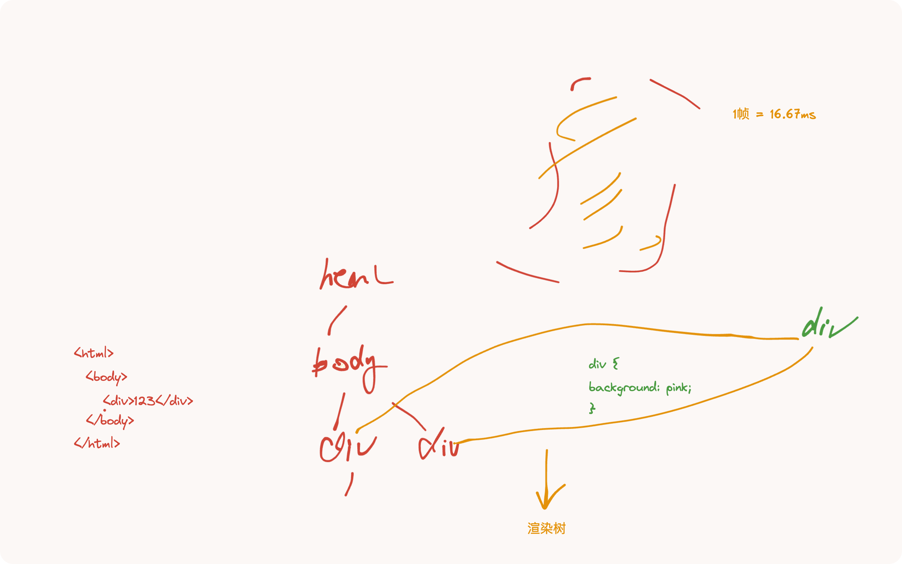

### DOM和CSSOM的关系和影响

**问题**：

- 描述DOM和CSSOM是如何分别构建的？
- 它们是如何相互影响，最终形成渲染树的？
- 修改DOM或CSSOM中的元素对页面渲染有何影响？


**答案**：

- DOM（文档对象模型）是通过解析HTML文档来构建的，每个HTML标签都会变成DOM树中的一个节点。
- CSSOM（CSS对象模型）是通过解析CSS文件和`<style>`标签中的样式信息构建的，它反映了所有CSS规则和对应样式属性的层次结构。
- 当DOM和CSSOM均构建完成后，浏览器将它们合并成一个渲染树，该树只包括页面中实际需要渲染的元素及其样式信息。
- 修改DOM（如添加、删除、修改元素）或CSSOM（如改变样式）都可能引发重排（Reflow）和重绘（Repaint），严重时会导致整个页面的重新渲染，影响性能。
- 借助 transform3d 优化，减少 Reflow，GPU


### 浏览器的重排与重绘怎么理解

**问题**：

- 解释什么是重排（Reflow）和重绘（Repaint）？
- 提供哪些常见操作会触发重排和重绘？
- 如何优化代码以减少重排和重绘的影响？


**答案**：

- 重排是指浏览器为了重新计算页面布局（例如，元素的位置和大小）而进行的过程，通常发生在添加或删除可见的DOM元素，或者元素尺寸改变的情况下。
- 重绘发生在元素的外观改变，但位置和尺寸未变的情况下，例如改变颜色、阴影等。
- 常见触发重排的操作包括修改DOM结构、改变元素位置和尺寸，而改变颜色或背景图将触发重绘。
- 优化方法包括使用CSS类进行样式变更而非直接操作样式属性，避免在循环中直接操作DOM，使用`transform`和`opacity`进行动画处理（这些属性可以由合成器处理），以及利用文档碎片或虚拟DOM来批量更新DOM。


### 请说说浏览器的合成层

**问题**：

- 什么是浏览器的合成层？
- 为何某些CSS属性可以触发GPU加速？
- 如何通过开发者工具来识别和优化合成层的性能？


**答案**：

- 合成层是浏览器处理完重排和重绘后，将页面分割成多个层次，然后由合成器合成最终视觉输出的过程。每个层可以单独被GPU处理，以优化性能。
- CSS属性如`transform`和`opacity`可以触发GPU加速，因为它们不影响DOM的布局，而只是影响元素的外观和位置变换。GPU处理这类变换比CPU更高效，因为GPU专门设计来处理图形和视觉效果。
- 使用Chrome等浏览器的开发者工具的“Layers”面板可以查看页面的层信息。通过这些工具，开发者可以观察哪些元素被创建成单独的层，评估合成层的性能，并进行相应的优化，比如减少不必要的层，合并可以合并的层，或调整动画使用合适的属性来优化GPU处理。


### 算法

- MinHeap：https://github.com/facebook/react/blob/main/packages/scheduler/src/SchedulerMinHeap.js
- LSU 缓存


## 浏览器渲染过程详解

> 注：此处包含飞书只读块（type=isv），当前导出接口未返回可展开正文。

### 核心概括

这三个阶段分别是：

1. **网络连接建立阶段**（DNS、TCP、TLS）
2. **资源解析与构建阶段**（DOM、CSSOM、预加载扫描）
3. **渲染流水线阶段**（渲染树、布局、绘制、合成）


#### 第一阶段：网络连接建立 (DNS, TCP, TLS)

这个阶段决定了资源请求的延迟。包括查找 IP、建立可靠连接以及协商加密安全通道。

> 注：此处包含飞书只读块（type=isv），当前导出接口未返回可展开正文。

##### 关键点解析

1. **DNS 延迟**：移动网络由于信号塔和基站的物理距离，DNS 查询成本很高。
2. **三个随机数的作用**：

   - `Client Random` + `Server Random` + `Pre-master Key`。
   - **目的**：这三个数共同生成最终的 `Session Key`（会话密钥）。之所以需要三个，是为了保证密钥的随机性和唯一性，防止重放攻击和预测。
3. **TCP 慢启动**：服务器不会一开始就全速发送数据，而是根据拥塞窗口（CWND）指数级增加发送量，以探测网络带宽。


#### 第二阶段：解析与构建

一旦收到 HTML 的第一个数据分块（通常是 14KB），浏览器就开始解析。

> 注：此处包含飞书只读块（type=isv），当前导出接口未返回可展开正文。

##### 关键点解析

1. **预加载扫描器 (Preload Scanner)**：这是浏览器的优化机制。当主线程被 JS 阻塞时，扫描器会在后台提前下载后续需要的 CSS 和 JS，减少等待时间。
2. **阻塞效应**：

   - CSS 不阻塞 DOM 构建，但阻塞 JS 执行（因为 JS 可能查询样式）。
   - 没有 `async/defer` 的 JS 会完全阻塞 DOM 构建。
3. **DOM 与 CSSOM**：这是两棵独立的树，它们随后将被合并。


#### 第三阶段：渲染流水线 (Rendering Pipeline)

这是将代码转换为屏幕像素的最后步骤。

> 注：此处包含飞书只读块（type=isv），当前导出接口未返回可展开正文。

##### 关键点解析

1. **渲染树 (Render Tree)**：

   - **不包含** `<head>` 等不可见元素。
   - **不包含** `display: none` 的元素。
   - **包含** `visibility: hidden` 的元素（因为它占位）。
2. **重排 (Reflow/Layout)**：当元素的尺寸、位置发生变化时触发，成本很高（例如：未定义尺寸的图片加载完成后撑开页面）。
3. **重绘 (Repaint)**：当元素外观变化但不影响布局时触发（例如：改变背景色）。
4. **合成 (Composite)**：将页面分为多个层（Layer），利用 GPU 进行处理。使用 `transform` 和 `opacity` 动画效率高，因为它们只触发合成，跳过布局和绘制。


### DNS 查询

对于一个 web 页面来说导航的第一步是要去寻找页面资源的位置。如果导航到 `https://example.com`，HTML 页面被定位到 IP 地址为 `93.184.216.34` 的服务器。如果以前没有访问过这个网站，就需要进行 DNS 查询。

浏览器向域名服务器发起 DNS 查询请求，最终得到一个 IP 地址。第一次请求之后，这个 IP 地址可能会被缓存一段时间，这样可以通过从缓存里面检索 IP 地址而不是再通过域名服务器进行查询来加速后续的请求。

每个主机名 (hostname) 在页面加载时通常只需要进行一次 DNS 查询。但是，对于页面指向的不同的主机名，则需要多次 DNS 查询。如果字体（font）、图像（image）、脚本（script）、广告（ads）和网站统计（metric）都有不同的主机名，则需要对每一个主机名进行 DNS 查询。

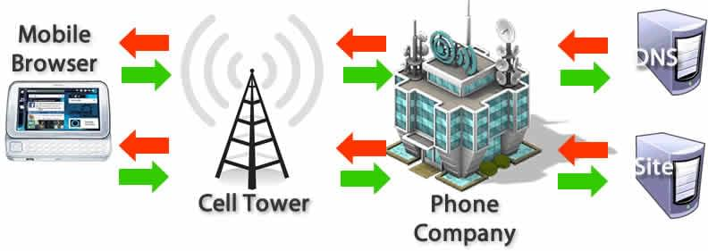

但是对于移动网络，DNS 查询可能存在性能问题。当一个用户使用移动网络时，所有 DNS 查询必须从手机发送到基站，然后到达一个权威 DNS 服务器。手机、信号塔、域名服务器之间的距离会显著增加延迟。

### TCP 三次握手


一旦获取到服务器 IP 地址，浏览器就会通过[TCP“三次握手”](https://developer.mozilla.org/en-US/docs/Glossary/TCP_handshake)与服务器建立连接。这个机制的是用来让两端尝试进行通信——在浏览器和服务器通过上层协议 [HTTPS](https://developer.mozilla.org/zh-CN/docs/Glossary/HTTPS) 发送数据之前，可以协商网络 TCP 套接字连接的一些参数。

TCP 的“三次握手”技术经常被称为“SYN-SYN-ACK”——更确切的说是 SYN、SYN-ACK、ACK——因为通过 TCP 首先发送了三个消息进行协商，然后在两台电脑之间开始一个 TCP 会话。是的，这意味着当请求尚未发出的时候，终端与每台服务器之间还要来回多发送三条消息。

### TLS 协商

对于通过 HTTPS 建立的安全连接，还需要另一次 "握手"。这种握手，或者说 [TLS](https://developer.mozilla.org/zh-CN/docs/Glossary/TLS) 协商，决定使用哪种密码对通信进行加密，验证服务器，并在开始实际数据传输前建立安全连接。这就需要在实际发送内容请求之前，再往返服务器五次。

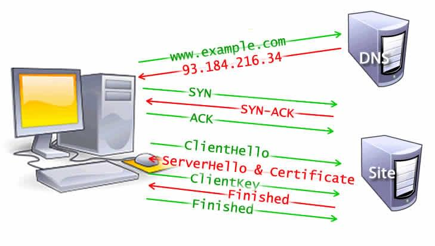

虽然建立安全连接的步骤增加了等待加载页面的时间，但是为了建立一个安全的连接而增加延迟是值得的，因为在浏览器和 web 服务器之间传输的数据不可以被第三方解密。

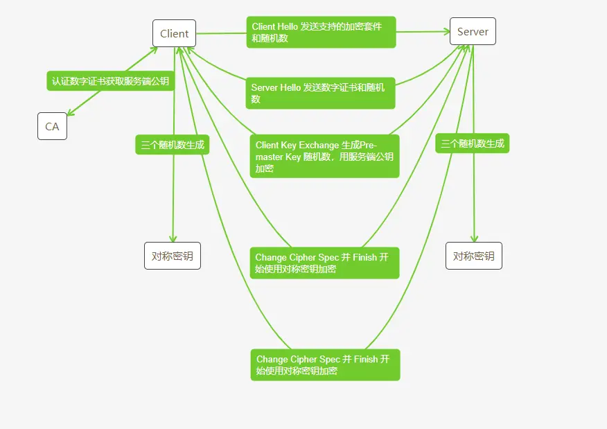

以上说明报文的交换细节，详细细节我们可以通过抓包工具 **Charles** 或者 **wireshark**

**🎉 提示**

TLS 是建立在 TCP 基础上的，因此必定需要先三次 TCP 握手建立 TCP 连接，然后再是建立 TLS

1. **Client Hello**

   1. **Client Hello** 报文：客户端对加密算法的支持度不同，因此需要向服务端发送客户端支持的 **加密套件（Cipher Suite）** ，同时还要生成一个 **随机数** 同时保存在客户端和发送给服务端
2. **Server Hello**

   1. **ServerCertificate** 报文：服务端收到 Client Hello 之后，向客户端发送 **CA 认证的数字证书**，用来鉴别服务端身份信息，同时还要生成一个 **随机数** 同时保存在服务端和发送给客户端
   2. **Server Hello Done** 报文：表示服务端宣告第一阶段的客户端服务端握手协商结束
   3. 可选：**Certificate Request** 报文：必要情况下，要求客户端发送证书验证身份
   4. 可选：**Server Key Exchange** 报文：如果 CA 认证的数字证书提供的信息不够，服务端还可发送提供补充信息
3. **Client Finish**

   1. **Client Key Exchange** 报文：客户端收到 CA 数字证书并通过验证，然后通过 CA 公钥解密获取到 **服务端公钥**。Client Key Exchange 报文包括有一个随机数，这个随机数被称为 **Pre-master key/secret**；一个表示随后的信息使用双方协商好的加密方法和密钥发送的 **通知** ；还有一个通过协商好的 HASH 算法对前面所有信息内容的 **HASH 计算值**，用来提供服务端校验。这些信息都通过服务端公钥加密传送给服务端
   2. **ChangeCipherSpec** 报文（TLS1.2 及以前，TLS1.3后无需该冗余消息）：该报文通知服务端，此后的通信都将使用协商好的加密算法计算对称密钥进行加密通信（也就是使用两个随机数以及第三个 Pre-master key/secret 随机数一起算出一个对称密钥 **session key/secret**）
   3. **Finished** 报文：该报文包括连接至此的所有报文的校验值，使用服务端公钥进行加密
   4. 可选：**ClientCertificate** 报文：如果服务端请求，客户端需要发送 CA 数字证书
   5. 可选：**CertificateVerify** 报文：服务端如果要求 CA 数字证书，那么需要通过 HASH 算法计算一个服务端发送来的信息摘要
4. **Server Finish**

   1. 服务端最后对客户端发送过来的 **Finished** 报文使用服务端私钥进行解密校验
   2. **ChangeCipherSpec** 报文：报文通知服务端，此后的通信都将使用协商好的加密算法计算对称密钥 session key/secret 进行加密通信
   3. **Finished** 报文：标志 TLS 连接建立成功
5. TLS 握手成功，此后通过对称密钥 session key/secret 加密通信

**💡 提示**

[https://datatracker.ietf.org/doc/html/rfc7918](https://datatracker.ietf.org/doc/html/rfc7918)，客户端，其实可以在发送 Client Key Exchange 时，就发送应用数据，这样 tls 只需要 1 RTT


**💡 提示**

为什么需要三个随机数
1. 密码学范畴

   - 很多协议（如 ISO/IEC、RFC 标准）明确规定，认证和密钥协商中需要多个随机数参与计算
   - 客户端和服务器会分别生成一个随机数用于会话密钥的生成。
   - 再加上协议中的其他随机因子，可以防止预测和攻击。
2. 三阶段

   - **服务端生成的随机数**（例如 `R1`）：让客户端用这个随机数参与加密或签名计算，以证明其身份
   - **客户端生成的随机数**（例如 `R2`）：让服务器用此随机数参与计算，以保证服务器的响应是动态生成的，而不是之前的响应。
   - **共享会话随机数**（例如 `R3`）：用于后续通信中作为会话密钥的一部分，保证每次会话的加密内容不同。
3. 密钥协商

   - 这些随机数的存在可以确保每个会话的密钥是唯一的，防止攻击者通过分析多个会话的密钥之间的关系来破解密钥


抓包分析细节：

#### **Client Hello**

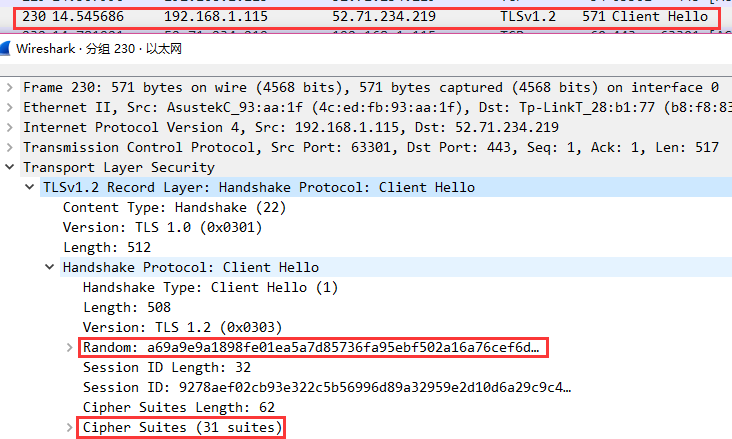

Client Hello 阶段，客户端给服务端发送一个随机数，以及 Cipher Suites 客户端支持的所有加密套件

#### **Server Hello**

Server Hello 阶段，服务端给客户端发送一个随机数，以及选中的 Cipher Suite 加密套件

然后服务端继续发送给客户端 CA 数字证书以及 Server Key Exchange 和 Hello done 信息完成第一阶段的握手：


这个是证书：

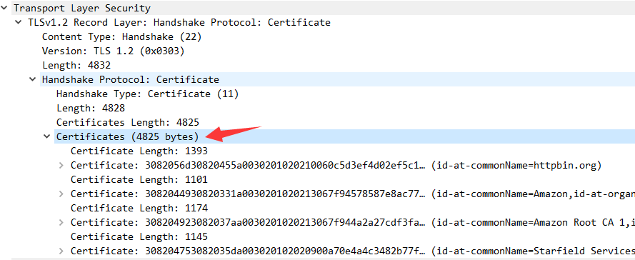

这个是 Server Key Exchange，可以看到协商了一种加密算法：

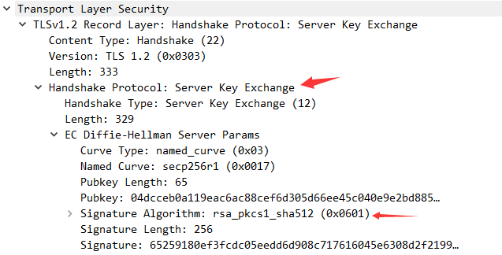

这个是 Server Hello Done：

#### **Client Finish**

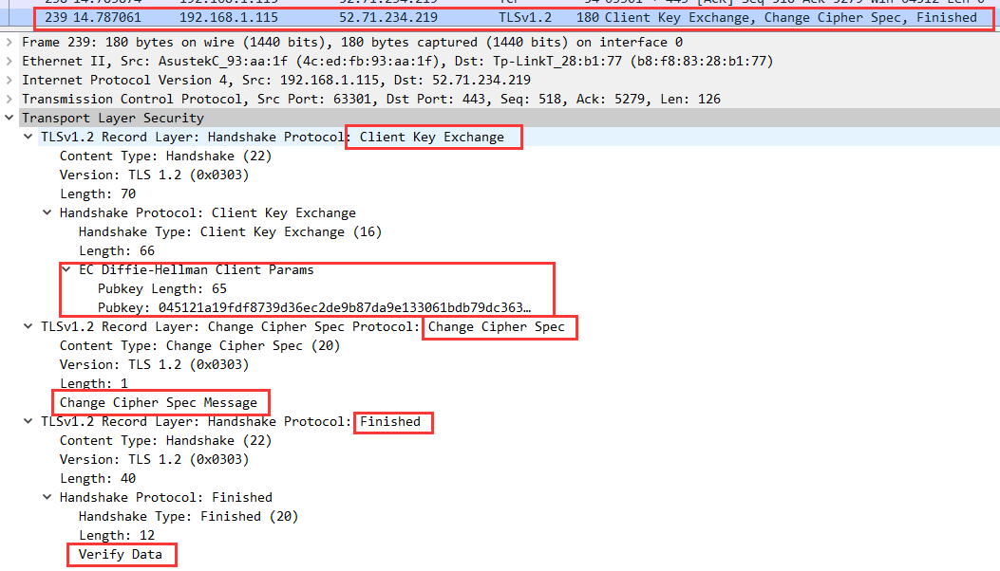

客户端发送一个 Client Key Exchange，Change Cipher Spec 和 Finished 报文

Finished Verify Data 包括至此连接的所有报文的校验信息，用服务端提供的公钥加密

客户端准备好切换为对称密钥加密

#### **Server Finish**

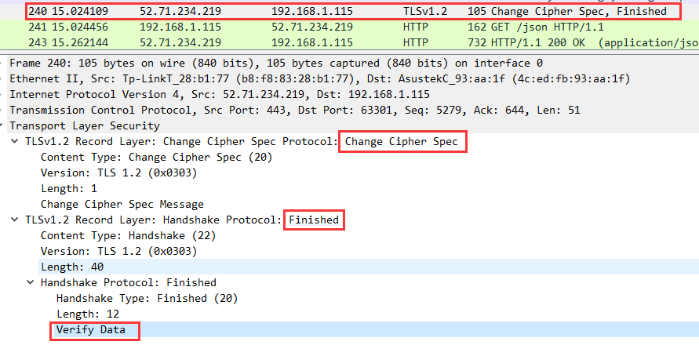

最后服务端返回一个 Change Cipher Spec 和 Server Finish

服务端准备好切换为对称密钥加密

#### **TLS 握手成功**

至此，TLS 握手成功，在 wireshark 中就可以看到接下来就是 HTTP 的请求响应：

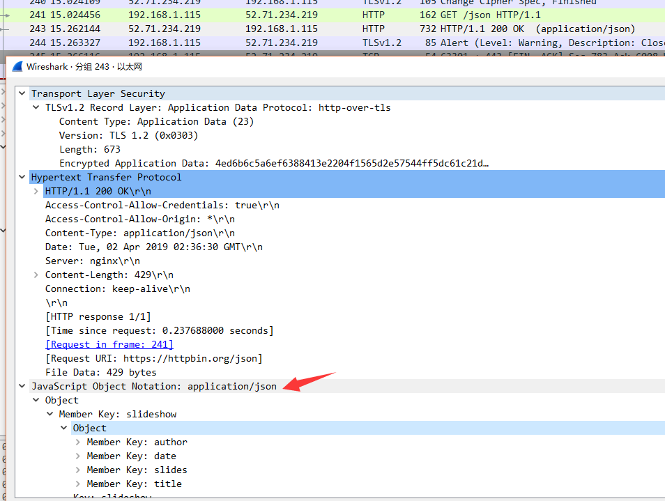


### 响应

一旦我们建立了和 web 服务器的连接，浏览器就会代表用户发送一个初始的 [HTTP ](https://developer.mozilla.org/zh-CN/docs/Web/HTTP/Methods)[`GET`](https://developer.mozilla.org/zh-CN/docs/Web/HTTP/Methods)[ 请求](https://developer.mozilla.org/zh-CN/docs/Web/HTTP/Methods)，对于网站来说，这个请求通常是一个 HTML 文件。一旦服务器收到请求，它将使用相关的响应头和 HTML 的内容进行回复。

HTMLCopy to Clipboard

```Plaintext
<!doctype html<html lang="zh-CN"<head<meta charset="UTF-8" /><title简单的页面</title<link rel="stylesheet" href="styles.css" /><script src="myscript.js"</script</head<body<h1 class="heading"我的页面</h1<p含有<a href="https://example.com/about"链接</a的段落。</p<div</div<script src="anotherscript.js"</script</body</html>
```

初始请求的响应包含所接收数据的第一个字节。[**首字节时间（TTFB）**](https://developer.mozilla.org/zh-CN/docs/Glossary/Time_to_first_byte)是用户通过点击链接进行请求与收到第一个 HTML 数据包之间的时间。第一个内容分块通常是 14KB 的数据。

上面的示例中，这个请求肯定是小于 14KB 的，但是直到浏览器在解析阶段遇到链接时才会去请求链接的资源，下面有进行描述。

### 拥塞控制 / TCP 慢启动

在传输过程中，TCP 包被分割成段。由于 TCP 保证了数据包的顺序，因此服务器在发送一定数量的分段后，必须从客户端接收一个 ACK 包的确认。

如果服务器在发送每个分段之后都等待 ACK，那么客户端将频繁地发送 ACK，并且可能会增加传输时间，即使在网络负载较低的情况下也是如此。

另一方面，一次发送过多的分段会导致在繁忙的网络中客户端无法接收分段并且长时间地只会持续发送 ACK，服务器必须不断重新发送分段的问题。

为了平衡传输分段的数量，[TCP 慢启动](https://developer.mozilla.org/zh-CN/docs/Glossary/TCP_slow_start)算法用于逐渐增加传输数据量，直到确定最大网络带宽，并在网络负载较高时减少传输数据量。

传输段的数量由**拥塞窗口（CWND）**的值控制，该值可初始化为 1、2、4 或 10 MSS（以太网协议中的 MSS 为 1500 字节）。该值是发送的字节数，客户端收到后必须发送 ACK。

如果收到 ACK，那么 CWND 值将加倍，这样服务器下次就能发送更多的数据分段。相反，如果没有收到 ACK，那么 CWND 值将减半。因此，这种机制在发送过多分段和过少分段之间取得了平衡。

### 解析

一旦浏览器收到第一个数据分块，它就可以开始解析收到的信息。[“解析”](https://developer.mozilla.org/zh-CN/docs/Glossary/Parse)是浏览器将通过网络接收的数据转换为 [DOM](https://developer.mozilla.org/zh-CN/docs/Glossary/DOM) 和 [CSSOM](https://developer.mozilla.org/zh-CN/docs/Glossary/CSSOM) 的步骤，通过渲染器在屏幕上将它们绘制成页面。

虽然 DOM 是浏览器标记的内部标识，但是它也被暴露出来，可以通过 JavaScript 中的各种 API 进行操作。

即使请求页面的 HTML 大于初始的 14KB 数据包，浏览器也将根据其拥有的数据开始解析并尝试渲染。这就是为什么在前 14KB 中包含浏览器开始渲染页面所需的所有内容，或者至少包含页面模板（第一次渲染所需的 CSS 和 HTML）对于 web 性能优化来说是重要的。但是在渲染到屏幕上面之前，HTML、CSS、JavaScript 必须被解析完成。

### 构建 DOM 树

第一步是处理 HTML 标记并构造 DOM 树。HTML 解析涉及到[符号化](https://developer.mozilla.org/zh-CN/docs/Web/API/DOMTokenList)和树的构造。HTML 标记包括开始和结束标记，以及属性名和值。如果文档格式良好，则解析它会简单而快速。解析器将标记化的输入解析到文档中，构建文档树。

DOM 树描述了文档的内容。[`<html>`](https://developer.mozilla.org/zh-CN/docs/Web/HTML/Element/html) 元素是第一个标签也是文档树的根节点。树反映了不同标记之间的关系和层次结构。嵌套在其他标记中的标记是子节点。DOM 节点的数量越多，构建 DOM 树所需的时间就越长。

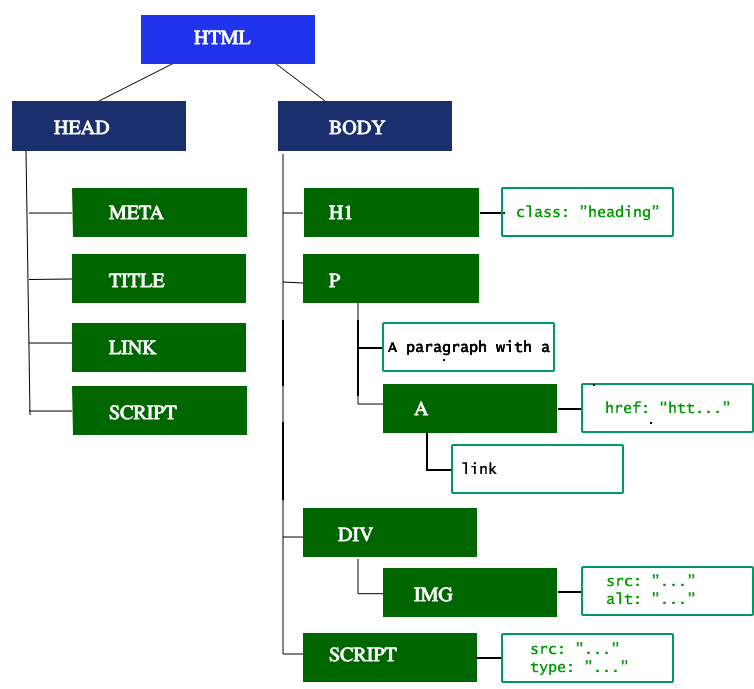

当解析器发现非阻塞资源，例如一张图片，浏览器会请求这些资源并且继续解析。当遇到一个 CSS 文件时，解析也可以继续进行，但是对于 `<script>` 标签（特别是没有 [`async`](https://developer.mozilla.org/zh-CN/docs/Web/JavaScript/Reference/Statements/async_function) 或者 `defer` 属性的）会阻塞渲染并停止 HTML 的解析。尽管浏览器的预加载扫描器加速了这个过程，但过多的脚本仍然是一个重要的瓶颈。

### 预加载扫描器

浏览器构建 DOM 树时，这个过程占用了主线程。同时，*预加载扫描器*会解析可用的内容并请求高优先级的资源，如 CSS、JavaScript 和 web 字体。多亏了预加载扫描器，我们不必等到解析器找到对外部资源的引用时才去请求。它将在后台检索资源，而当主 HTML 解析器解析到要请求的资源时，它们可能已经下载中了，或者已经被下载。预加载扫描器提供的优化减少了阻塞。

HTMLCopy to Clipboard

```Plaintext
<link rel="stylesheet" href="styles.css" /><script src="myscript.js" async</script<script src="anotherscript.js" async</script
```

在这个例子中，当主线程在解析 HTML 和 CSS 时，预加载扫描器将找到脚本和图像，并开始下载它们。为了确保脚本不会阻塞进程，当 JavaScript 解析和执行顺序不重要时，可以添加 `async` 属性或 `defer` 属性。

等待获取 CSS 不会阻塞 HTML 的解析或者下载，但是它确实会阻塞 JavaScript，因为 JavaScript 经常用于查询元素的 CSS 属性。

### 构建 CSSOM 树

第二步是处理 CSS 并构建 CSSOM 树。CSS 对象模型和 DOM 是相似的。DOM 和 CSSOM 是两棵树。它们是独立的数据结构。浏览器将 CSS 规则转换为可以理解和使用的样式映射。浏览器遍历 CSS 中的每个规则集，根据 CSS 选择器创建具有父、子和兄弟关系的节点树。

与 HTML 类似，浏览器需要将接收到的 CSS 规则转换为可处理的格式。因此，它重复了 HTML 到对象的过程，但这次是针对 CSS。

CSSOM 树包括来自用户代理样式表的样式。浏览器从适用于节点的最通用规则开始，并通过应用更具体的规则递归地优化计算的样式。换句话说，它级联属性值。

构建 CSSOM 非常快，并且在当前的开发工具中没有以独特的颜色显示。相反，开发人员工具中的“重新计算样式”显示解析 CSS、构建 CSSOM 树和递归计算计算样式所需的总时间。在 web 性能优化方面，它是可轻易实现的，因为创建 CSSOM 的总时间通常小于一次 DNS 查询所需的时间。

### 其他过程

#### JavaScript 编译

在解析 CSS 和创建 CSSOM 的同时，包括 JavaScript 文件在内的其他资源也在下载（这要归功于预加载扫描器）。JavaScript 会被解析、编译和解释。脚本被解析为抽象语法树。有些浏览器引擎会将[抽象语法树](https://zh.wikipedia.org/wiki/%E6%8A%BD%E8%B1%A1%E8%AF%AD%E6%B3%95%E6%A0%91)输入编译器，输出字节码。这就是所谓的 JavaScript 编译。大部分代码都是在主线程上解释的，但也有例外，例如在 [web worker](https://developer.mozilla.org/zh-CN/docs/Web/API/Web_Workers_API) 中运行的代码。

#### 构建无障碍树

浏览器还构建辅助设备用于分析和解释内容的无障碍树。无障碍对象模型（AOM）类似于 DOM 的语义版本。当 DOM 更新时，浏览器会更新辅助功能树。辅助技术本身无法修改无障碍树。

在构建 AOM 之前，屏幕阅读器无法访问内容。

### 渲染

渲染步骤包括样式、布局、绘制，在某些情况下还包括合成。在解析步骤中创建的 CSSOM 树和 DOM 树组合成一个渲染树，然后用于计算每个可见元素的布局，然后将其绘制到屏幕上。在某些情况下，可以将内容提升到它们自己的层并进行合成，通过在 GPU 而不是 CPU 上绘制屏幕的一部分来提高性能，从而释放主线程。

### 样式

关键呈现路径的第三步是将 DOM 和 CSSOM 组合成渲染树。计算样式树或渲染树的构建从 DOM 树的根开始，遍历每个可见节点。

不会被显示的元素，如 `<head>` 元素及其子元素，以及任何带有 `display: none` 的节点，如用户代理样式表中的 `script { display: none; }`，都不会包含在渲染树中，因为它们不会出现在渲染输出中。应用了 `visibility: hidden` 的节点会包含在渲染树中，因为它们会占用空间。由于我们没有给出任何指令来覆盖用户代理默认值，因此上述代码示例中的 `script` 节点不会包含在渲染树中。

每个可见节点都应用了 CSSOM 规则。渲染树包含所有可见节点的内容和计算样式，将所有相关样式与 DOM 树中的每个可见节点匹配起来，并根据 CSS 级联，确定每个节点的计算样式。

### 布局

第四步是在渲染树上运行布局以计算每个节点的几何体。*布局*是确定呈现树中所有节点的尺寸和位置，以及确定页面上每个对象的大小和位置的过程。*重排*是后续过程中对页面的任意部分或整个文档的大小和位置的重新计算。

渲染树构建完毕后，浏览器就开始布局。渲染树标识了哪些节点会显示（即使不可见）及其计算样式，但不标识每个节点的尺寸或位置。为了确定每个对象的确切大小和位置，浏览器会从渲染树的根开始遍历。

在网页上，大多数东西都是一个盒子。不同的设备和不同的桌面设置意味着无限数量的不同视区大小。在此阶段，根据视口大小，浏览器将确定屏幕上所有盒子的大小。以视口大小为基础，布局通常从 body 开始，设置所有 body 后代的大小，同时给不知道其尺寸的替换元素（例如图像）提供占位符空间，空间大小以相应元素盒模型的属性为准。

第一次确定每个节点的大小和位置称为*布局*。随后对节点大小和位置的重新计算称为*重排*。在我们的示例中，假设初始布局发生在返回图像之前。由于我们没有声明图像的尺寸，因此一旦知道图像的尺寸，就会出现重排。

### 绘制

关键渲染路径中的最后一步是将各个节点绘制到屏幕上，其中第一次的绘制被称为首次有意义的绘制。在绘制或光栅化阶段，浏览器将在布局阶段计算的每个盒子转换为屏幕上的实际像素。绘制涉及将元素的每个可见部分绘制到屏幕上，包括文本、颜色、边框、阴影以及按钮和图像等替换元素。浏览器需要以超快的速度执行这个过程。

为了确保平滑滚动和动画效果，包括计算样式、回流和绘制等占用主线程的所有操作，必须在不超过 16.67 毫秒的时间内完成。在 2048 x 1536 分辨率下，iPad 需要将超过 314.5 万个像素绘制到屏幕上。这是非常多的像素，必须要非常快速地绘制出来。为了确保重绘能够比初始绘制更快地完成，绘制到屏幕的操作通常被分解成几个图层。如果发生这种情况，浏览器则需要进行合成。

绘制可以将布局树中的元素分解为多个层。将内容提升到 GPU 上的层（而不是 CPU 上的主线程）可以提高绘制和重新绘制性能。有一些特定的属性和元素可以实例化一个层，包括 `<video>` 和 `<canvas>`，任何 CSS 属性为 **`opacity`** 、**3D `transform`**、**`will-change`** 的元素，还有一些其他元素。这些节点将与子节点一起绘制到它们自己的层上，除非子节点由于上述一个（或多个）原因需要自己的层。

分层确实可以提高性能，但在内存管理方面成本较高，因此不应作为 Web 性能优化策略的过度使用。

### 合成

当文档的各个部分以不同的层绘制，相互重叠时，必须进行合成，以确保它们以正确的顺序绘制到屏幕上，并正确显示内容。

当页面继续加载资源时，可能会发生回流（回想一下我们迟到的示例图像），**回流**会触发重新绘制和重新合成。如果我们定义了图像的大小，就不需要**重新绘制**，只需要绘制需要重新绘制的层，并在必要时进行合成。但我们并没有定义图像大小！所以从服务器获取图像后，渲染过程将返回到布局步骤并从那里重新开始。

### 交互

一旦主线程绘制页面完成，你会认为我们已经“准备好了”，但事实并非如此。如果加载包括正确延迟加载的 JavaScript，并且仅在 `onload` 事件触发后执行，那么主线程可能会忙于执行脚本，无法用于滚动、触摸和其他交互操作。

可交互时间（**TTI**）是测量从第一个请求导致 DNS 查询和 SSL 连接到页面可交互时所用的时间——可交互是在首次内容绘制（**FCP**）之后页面在 50ms 内响应用户的交互。如果主线程正在解析、编译和执行 JavaScript，则无法及时（小于 50ms）响应用户交互。

在我们的示例中，可能图像加载很快，但 `anotherscript.js` 文件的大小可能是 2MB，而且用户的网络连接很慢。在这种情况下，用户可以非常快地看到页面，但是在下载、解析和执行脚本之前，就无法滚动。这不是一个好的用户体验。避免占用主线程，如下面的网页测试示例所示：

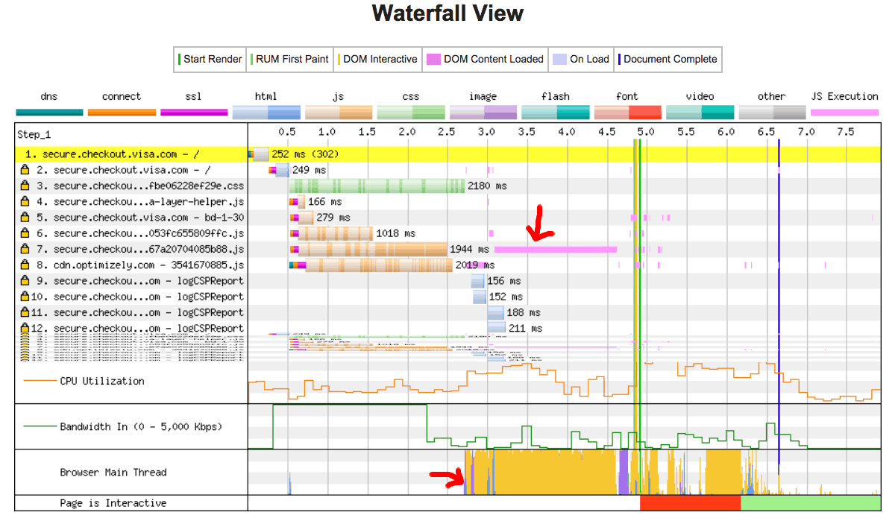


## 浏览器多进程模型

2007 年以前，浏览器都是单进程的，浏览器的所有功能都在同一个进程里运行，这其中包括了网络、插件、JavaScript 运行环境、渲染引擎和页面等。在  2008 年，Chrome 发布，新进程架构问世。


### 单进程

我们上面提到，2007 年前，浏览器的设计是单进程的，如此多的功能运行在一个进程里，是导致单进程浏览器不稳定、不流畅和不安全的一个主要因素，包括：


**不稳定**

早期浏览器的视频、游戏需要借助于插件来实现诸如 Flash 播放器等各种强大的功能，但是插件是最容易出问题的模块，并且还运行在浏览器进程之中，所以一个插件的意外崩溃会引起整个浏览器的崩溃。除了插件之外，渲染引擎模块也是不稳定的，通常一些复杂的 JavaScript 代码就有可能引起渲染引擎模块的崩溃。和插件一样，渲染引擎的崩溃也会导致整个浏览器的崩溃。


**不流畅**

从上面的“单进程浏览器架构示意图”可以看出，所有页面的渲染模块、JavaScript 执行环境以及插件都是运行在同一个线程中的，这就意味着同一时刻只能有一个模块可以执行。比如，下面这个无限循环的脚本：

```JavaScript
   function freeze() {
     while (1) {
       console.log("freeze");
     }
   }
   freeze();
```

如果让这个脚本运行在一个单进程浏览器的页面里，你感觉会发生什么？因为这个脚本是无限循环的，所以当其执行时，它会独占整个线程，这样导致其他运行在该线程中的模块就没有机会被执行。因为浏览器中所有的页面都运行在该线程中，所以这些页面都没有机会去执行任务，这样就会导致整个浏览器失去响应，变卡顿。这块内容要继续往深的地方讲就到页面的[事件循环](https://link.juejin.cn/?target=https%3A%2F%2Fzhuanlan.zhihu.com%2Fp%2F145383822)系统了。除了上述脚本或者插件会让单进程浏览器变卡顿外，页面的内存泄漏也是单进程变慢的一个重要原因。通常浏览器的内核都是非常复杂的，运行一个复杂点的页面再关闭页面，会存在内存不能完全回收的情况，这样导致的问题是使用时间越长，内存占用越高，浏览器会变得越慢。


**不安全**

这里依然可以从插件和页面脚本两个方面来解释该原因。插件可以使用 C/C++ 等代码编写，通过插件可以获取到操作系统的任意资源，当你在页面运行一个插件时也就意味着这个插件能完全操作你的电脑。如果是个恶意插件，那么它就可以释放病毒、窃取你的账号密码，引发安全性问题。至于页面脚本，它可以通过浏览器的漏洞来获取系统权限，这些脚本获取系统权限之后也可以对你的电脑做一些恶意的事情，同样也会引发安全问题。以上这些就是当时浏览器的特点，不稳定，不流畅，而且不安全。


### 多进程

当下的浏览器，都是多进程架构，这也是 Chrome 在 2008 年提出的架构设计方案。


Chrome 的页面是运行在单独的渲染进程中的，同时页面里的插件也是运行在单独的插件进程之中，而进程之间是通过 **IPC 机制**进行通信（如图中虚线部分）。

> 注：此处包含飞书只读块（type=isv），当前导出接口未返回可展开正文。

我们先看看如何解决不稳定的问题。由于进程是相互**隔离**的，所以当一个页面或者插件崩溃时，影响到的仅仅是当前的页面进程或者插件进程，并不会影响到浏览器和其他页面，这就完美地解决了页面或者插件的崩溃会导致整个浏览器崩溃，也就是不稳定的问题。

我提到 Chrome 使用多个渲染器进程。在最简单的情况下，您可以想象每个选项卡都有自己的渲染器进程。假设您打开了 3 个选项卡，每个选项卡都由一个独立的渲染器进程运行。如果一个选项卡变得无响应，那么您可以关闭无响应的选项卡并继续使用其他选项卡的服务,如果所有选项卡都在一个进程上运行，当一个选项卡变得无响应时，所有选项卡都无响应。


#### 进程类型

我们从 Chrome 插件定义源码来看当前进程架构下的进程分类，源地址：[developer.chrome.com](https://developer.chrome.com/docs/extensions/reference/api/processes#type-ProcessType)

- browser
- renderer

  - Html 解析
  - Css 渲染——**Blink**
  - JavaScript 执行—— **v8**
- extension
- notification
- plugin
- worker
- nacl
- service_worker
- utility
- gpu
- other


#### 进程工作说明

在Chrome浏览器中，多进程架构允许不同的进程负责不同的任务，提高了浏览器的安全性、稳定性和性能。以下是各种进程类型以及它们在Chrome中的职责：


1. **Browser（浏览器进程）**

   - **职责**：管理用户界面和窗口，处理输入的URL、标签页的创建和管理、书签和历史记录等。它还协调其他所有类型的进程，处理整个浏览器的主要网络活动。


1. **Renderer（渲染进程）**

   - **职责**：负责处理特定标签页内的网页内容。这包括HTML的解析、CSS的渲染、JavaScript的执行等。每个标签通常运行在独立的渲染进程中，以实现网站之间的隔离。


1. **Extension（扩展进程）**

   - **职责**：独立运行浏览器扩展或插件。每个扩展一般拥有自己的进程，以隔离故障并提高安全性。


1. **Notification（通知进程）**

   - **职责**：管理和显示来自网站的通知。这允许通知功能独立于网页和扩展，提高响应速度和可靠性。


1. **Plugin（插件进程）**

   - **职责**：运行如Flash等插件的内容。由于插件可能不稳定或不安全，因此在独立进程中运行可以防止插件崩溃影响到主浏览器进程。


1. **Worker（Web Worker进程）**

   - **职责**：执行Web Workers的JavaScript代码。Web Workers允许在后台线程中执行代码，不干扰用户界面。这些进程有助于实现复杂计算而不阻塞UI。


1. **NaCl（Native Client进程）**

   - **职责**：执行使用Native Client技术编写的应用。这些应用可以以接近本地速度运行，通常用于高性能应用如游戏或音视频处理。


1. **Service Worker（策略缓存进程）**

   - **职责**：支持Service Workers，这些是运行在浏览器背景的脚本，主要用于离线支持、缓存管理和推送通知。


1. **Utility（工具进程）**

   - **职责**：执行不需要持续存在的任务，如图像解码、文件读写等。这种轻量级进程通常用于处理不直接影响UI的任务。


1. **GPU（GPU进程）**

   - **职责**：处理所有GPU加速任务，如CSS动画、Canvas和WebGL渲染。集中处理这些任务有助于提高性能和效率。


1. **Other（其他类型的进程）**

   - **职责**：处理不属于上述任一类别的任务。这可能包括特定的后台任务或实验性功能。


这些进程各司其职，共同支持Chrome浏览器提供高效、安全的浏览体验。通过这种方式，Chrome尝试最大化利用系统资源，同时保持系统的稳定性和安全性。


#### 进程协作

通信通过 ipc

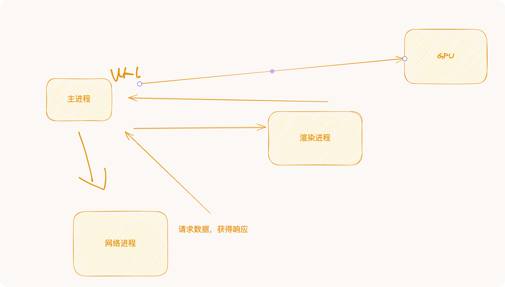


GPU vs  CPU

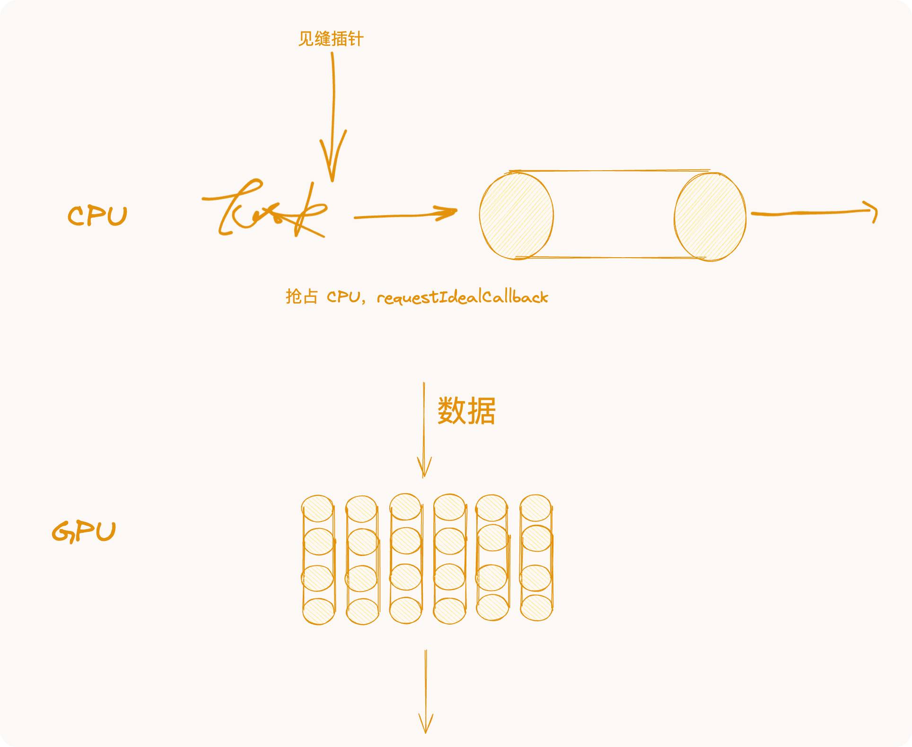


## 渲染层性能优化思路

渲染优化思路围绕任务执行时长来评估。

任务是指浏览器执行的任何独立工作。这包括呈现、解析 HTML 和 CSS、运行您编写的 JavaScript 代码，以及您无法直接控制的其他事项。网页的 JavaScript 是浏览器任务的主要来源。

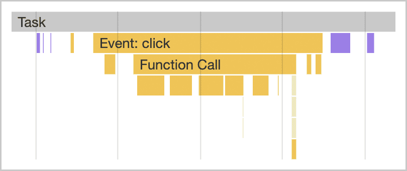

任务会在多个方面影响性能。例如，当浏览器在启动期间下载一个 JavaScript 文件时，它会将任务加入队列以解析和编译该 JavaScript，以便能够执行该 JavaScript。在网页生命周期的后期，当 JavaScript 正常运行时，其他任务（例如通过事件处理程序、JavaScript 驱动的动画和后台活动（如分析数据收集）驱动互动）就会开始。除[网页工作器](https://developer.mozilla.org/docs/Web/API/Web_Workers_API/Using_web_workers)和类似 API 外，所有这些操作都发生在主线程上。


### 减轻主进程压力

*主线程*是大多数任务在浏览器中运行的位置，您编写的几乎所有 JavaScript 都会在该线程中执行。

主线程一次只能处理一个任务。任何耗时超过 **50 毫秒**的任务均算作“耗时”。如果用户尝试在长时间的任务或渲染更新期间与页面互动，浏览器必须等待处理该互动，从而导致延迟。

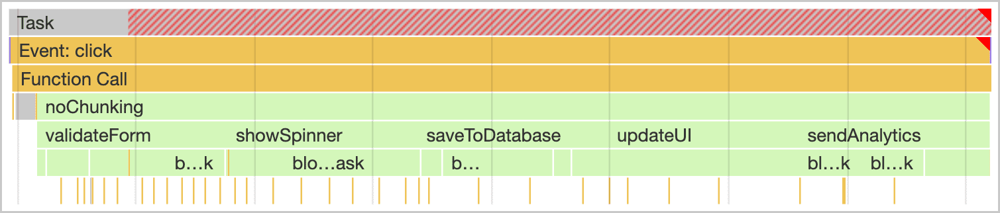

为了避免这种情况，请将每个耗时较长的任务划分为多个小任务，每个小任务的运行时间较短。这称为拆分长任务。

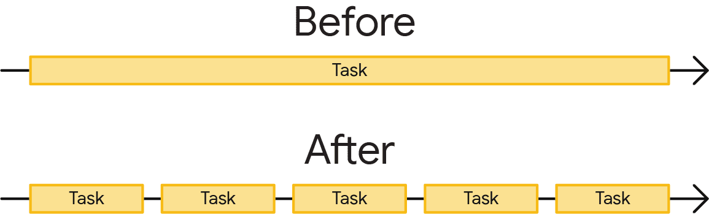

拆分任务可让浏览器有更多机会响应其他任务之间优先级较高的工作，包括用户互动。这样可以更快地进行交互，否则用户在浏览器等待长时间任务完成时可能会注意到延迟。

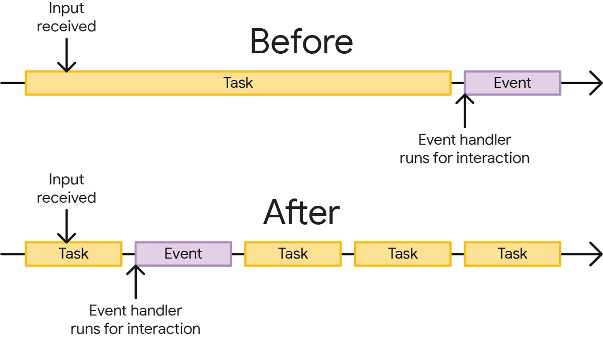


#### **任务管理策略**

JavaScript 将每个函数视为单个任务，因为它使用“运行到完成”的任务执行模式。这意味着，一个调用了多个其他函数的函数（如以下示例）必须一直运行到所有被调用的函数完成为止，这会导致浏览器速度变慢：

```JavaScript
function saveSettings () { //This is a long task.
  validateForm();
  showSpinner();
  saveToDatabase();
  updateUI();
  sendAnalytics();
}
```

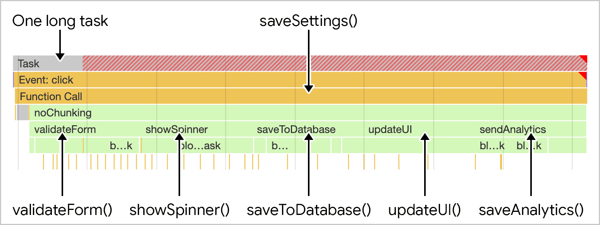

如果您的代码包含调用多个方法的函数，请将其拆分为多个函数。这不仅让浏览器有更多机会响应互动，还可让您的代码更易于读取、维护和编写测试。以下部分介绍了一些策略，用于分解长函数以及确定构成长函数的任务的优先级。


#### **手动推迟代码执行**

您可以通过将相关函数传递给 `setTimeout()` 来推迟某些任务的执行。即使您将超时指定为 `0`，此方法也有效。

```JavaScript
function saveSettings () {
  // Do critical work that is user-visible:
  validateForm();
  showSpinner();
  updateUI();

  // Defer work that isn't user-visible to a separate task:
  setTimeout(() => {
    saveToDatabase();
    sendAnalytics();
  }, 0);
}
```

这最适合一系列需要按顺序运行的函数。采用不同组织方式的代码需要采用不同的方法。下一个示例是使用循环处理大量数据的函数。数据集越大，所需的时间越长，在循环中不一定适合放置 `setTimeout()`：

```Plaintext
function processData () {
  for (const item of largeDataArray) {
    // Process the individual item here.
  }
}
```

幸运的是，还有一些其他 API 可让您将代码执行推迟到后续任务中。我们建议[使用 ](https://dbaron.org/log/20100309-faster-timeouts)[`postMessage()`](https://dbaron.org/log/20100309-faster-timeouts)[ 来缩短超时时间](https://dbaron.org/log/20100309-faster-timeouts)。

您还可以使用 `requestIdleCallback()` 拆分工作，但它会以最低优先级调度任务，并且仅在浏览器空闲期间调度任务，这意味着，如果主线程特别繁忙，使用 `requestIdleCallback()` 调度的任务可能永远无法运行。


#### **专用调度器 API（兼容性不太好，简单了解）**

到目前为止提到的 API 可以帮助您拆分任务，但它们有一个明显的缺点：如果您通过将代码推迟到后续任务中运行让主线程运行，该代码就会添加到任务队列的末尾。

如果您控制页面上的所有代码，则可以创建自己的调度器来划分任务的优先级。但是，第三方脚本不会使用您的调度器，因此您在这种情况下无法真的确定工作的优先级。您只能拆分该模块，或让它让出用户互动


调度器 API 提供 `postTask()` 函数，可以更精细地安排任务，并帮助浏览器确定工作的优先级，使低优先级任务让出到主线程。`postTask()` 使用 promise 并接受 `priority` 设置。

`postTask()` API 有三个优先级：

- `'background'`，用于优先级最低的任务。
- `'user-visible'`，适用于中优先级任务。如果未设置 `priority`，则此值为默认值。
- `'user-blocking'`，适用于需要以高优先级运行的关键任务。

以下示例代码使用 `postTask()` API 以尽可能高的优先级运行三个任务，并以尽可能低的优先级运行其余两个任务：

```JavaScript
function saveSettings () {
  // 以高优先级验证表单
  scheduler.postTask(validateForm, {priority: 'user-blocking'});

  // 以高优先级显示微调器：
  scheduler.postTask(showSpinner, {priority: 'user-blocking'});

  // 在后台更新数据库:
  scheduler.postTask(saveToDatabase, {priority: 'background'});

  // 以高优先级更新用户界面:
  scheduler.postTask(updateUI, {priority: 'user-blocking'});

  // 在后台发送分析数据:
  scheduler.postTask(sendAnalytics, {priority: 'background'});
};
```

在这里，任务的优先级是安排好的，以便浏览器优先的任务（例如用户互动）可以正常发挥作用。

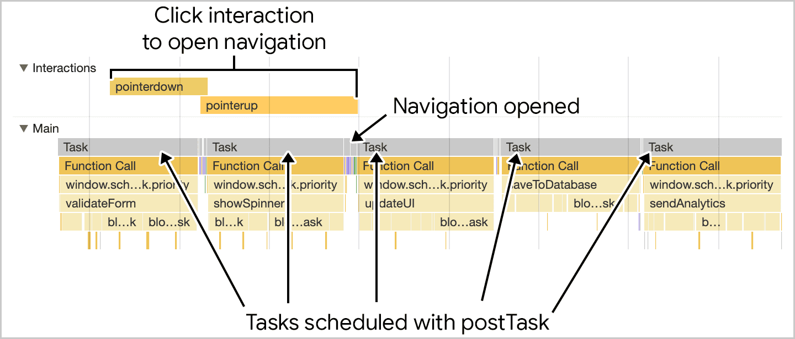

您还可以实例化在任务之间共享优先级的不同 `TaskController` 对象，包括根据需要更改不同 `TaskController` 实例的优先级的功能。


#### React Scheduler 闯入

https://github.com/facebook/react/tree/main/packages/scheduler

Chrome Scheduler API 和 React Scheduler 是两种不同的技术，分别用于浏览器和JavaScript应用程序层面的任务调度。了解它们的不同用途和优势可以帮助开发者更有效地管理任务和优化性能。


##### Chrome Scheduler API

**用途**：

- Chrome Scheduler API（也称为Task Scheduler）是Chrome浏览器内部使用的一个API，用于在浏览器中调度和管理任务。它的目标是合理分配CPU时间，优化和调整任务的执行，以改善浏览器的整体性能和响应速度。


**优势**：

- **精细的任务优先级管理**：Chrome的Scheduler API允许根据任务的类型和重要性安排其执行优先级，从而确保关键任务（如用户输入响应）能够快速执行。
- **资源使用优化**：通过有效管理背景和前台任务，Scheduler API可以减少资源竞争，提高浏览器在多任务处理时的效率。
- **增强的用户体验**：通过延迟非关键任务的执行，优先处理与用户交互相关的任务，能够显著提升页面的响应性。


##### React Scheduler

**用途**：

- React Scheduler 是React团队开发的一个调度工具，用于优化React应用中的任务优先级。它主要用于调度更新（例如状态更新和DOM更新），以决定什么时候执行哪些更新任务。


**优势**：

- **并发模式支持**：React Scheduler 是并发模式（Concurrent Mode）的核心部分之一，它允许React应用中的多个任务并发执行，同时保持应用的稳定性。
- **用户体验优化**：通过优先处理用户交互（如点击和滚动）生成的更新任务，React Scheduler可以保证应用的交互性和流畅性。
- **灵活的任务打断和恢复**：React Scheduler 允许任务被打断和恢复，这意味着React可以在执行重要的更新前暂停当前的渲染任务，从而更好地控制UI的渲染时机。
- **资源有效管理**：与Chrome Scheduler类似，React Scheduler也通过调整任务优先级来更有效地利用浏览器资源，减少长时间执行的任务对用户体验的影响。


##### 对比分析

- **操作范围**：Chrome Scheduler API在浏览器级别操作，管理整个浏览器进程的任务调度；而React Scheduler专注于React框架内部，管理与组件渲染相关的任务。
- **目标和优化焦点**：Chrome Scheduler的主要目标是优化整个浏览器的性能，包括所有标签和扩展；React Scheduler则专注于提高React应用的响应性和性能，尤其是在并发渲染环境下。
- **实现和使用方式**：Chrome Scheduler是浏览器的内置功能，对于开发者而言是透明的；而React Scheduler则需要在React应用中显式使用，并可以与React的其他特性（如Hooks和Fiber架构）紧密集成。


React Scheduler 调度，expirationTime、lanes

## V8 初涉

https://v8.dev/
