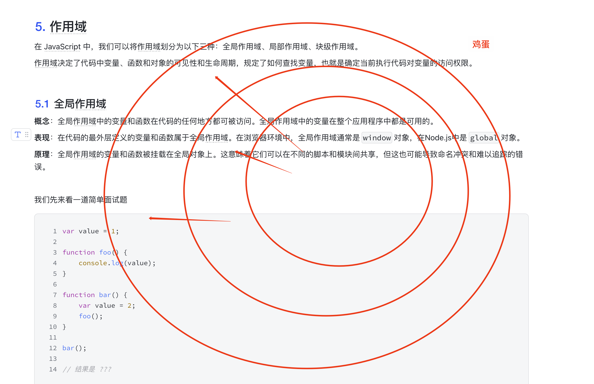
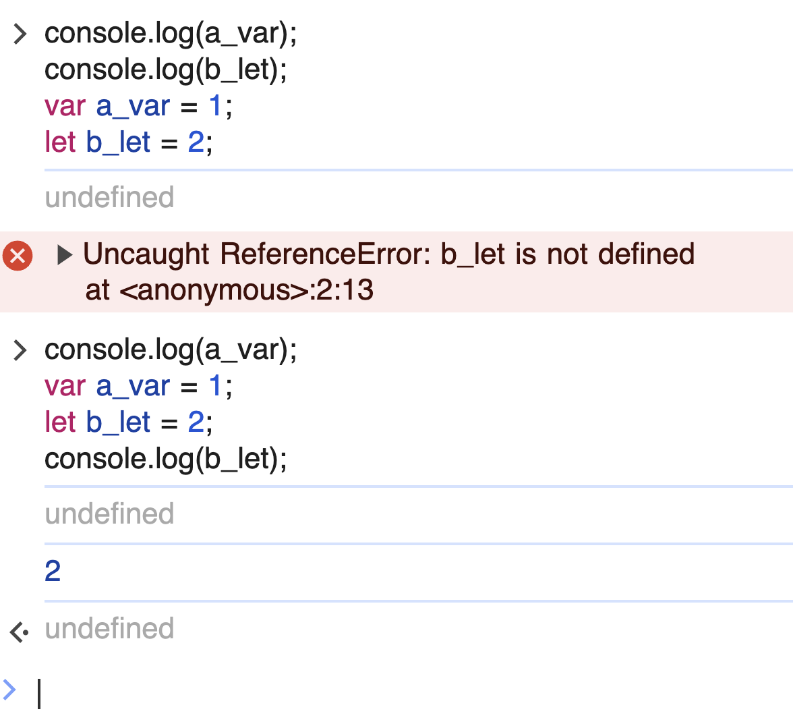
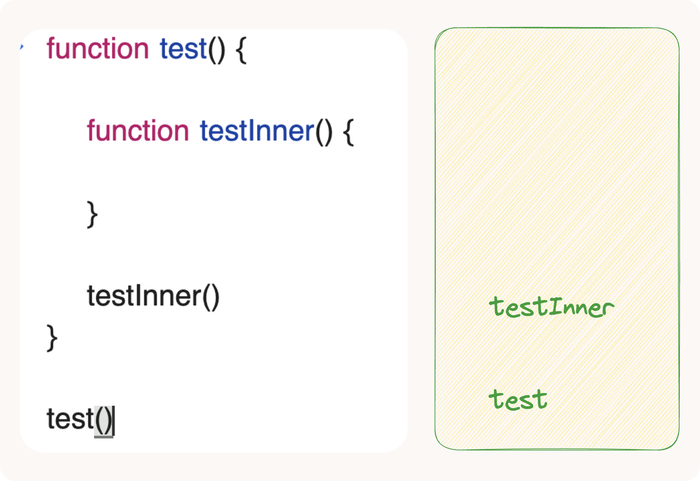
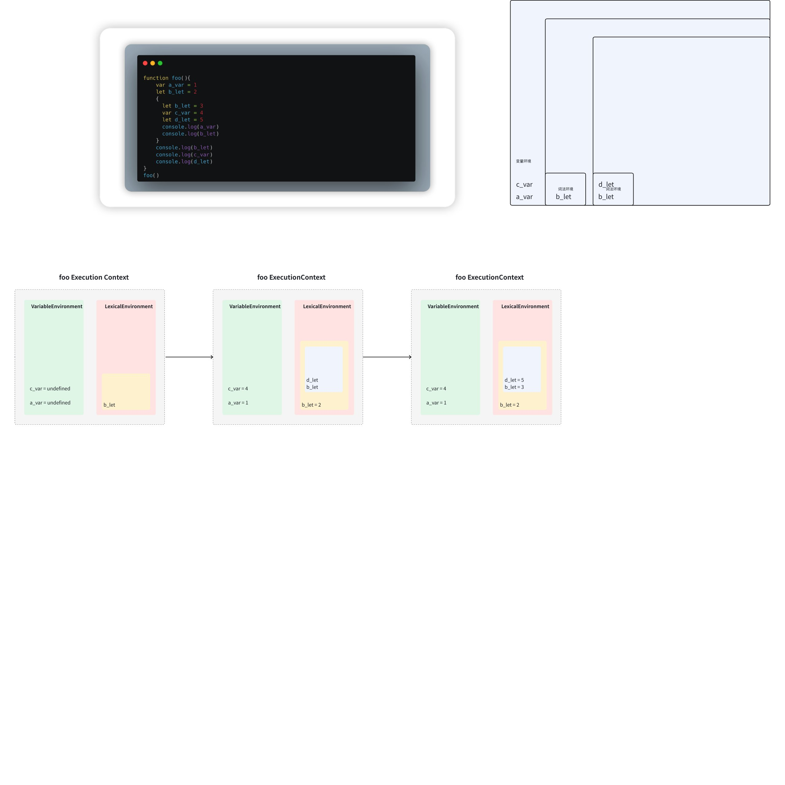
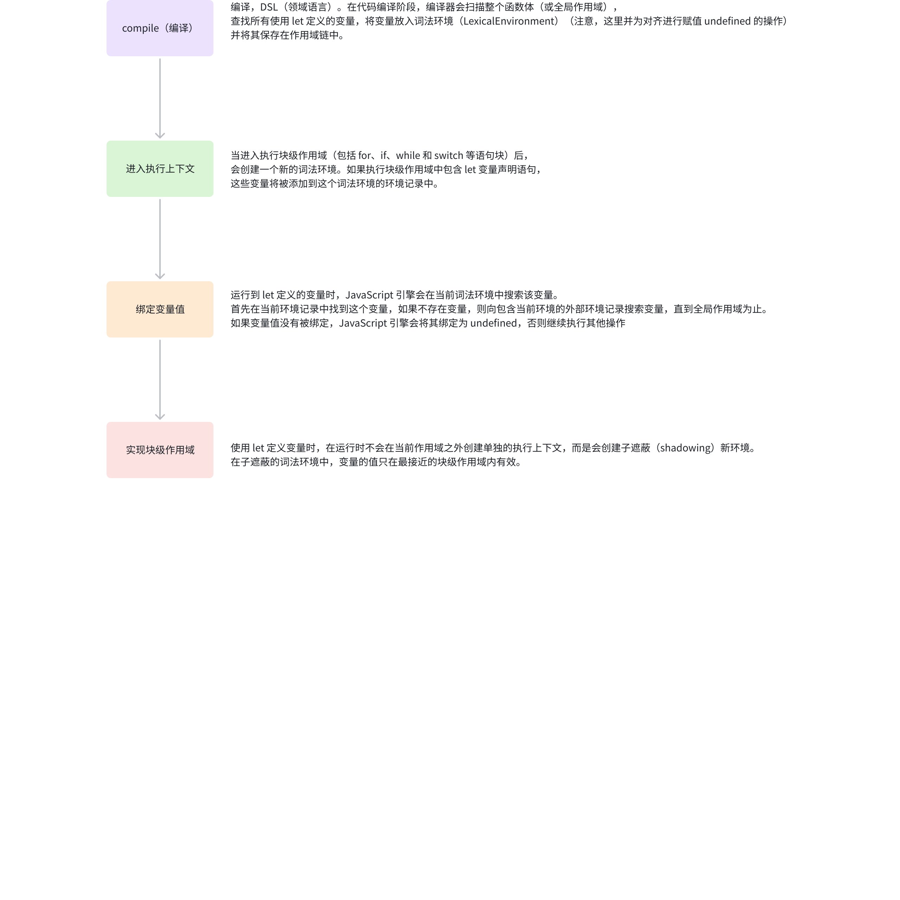

# 2.作用域与 JavaScript 执行过程深度解析

> 原文链接：[飞书原文](https://u19tul1sz9g.feishu.cn/docx/SjpedHCKcowGyHx3reFcJeO0n3d)

[引用：20260207 随堂笔记与源码资料](https://www.feishu.cn/docx/HsQBdlBmsocCuExnY9Jcy99Sn2e)
[本地资源：2.js-execute-notes](<../../20260207 随堂笔记与源码资料-压缩包/2.前端核心原理知识进阶/2.js-execute-notes>)

## 课程目标

> **💡 提示**
>
> - 初中级：
>
>   1. **理解JavaScript作用域的种类**：能够区分全局作用域、局部作用域和块级作用域，并理解它们各自的特点及适用场景。
>   2. **掌握闭包的基本概念与应用**：理解闭包如何使得函数访问外部函数作用域中的变量，并能识别闭包在实际编程中的常见用途。
> - 高级：
>
>   1. **深入理解作用域链与闭包的高级应用**：能详细解释作用域链的工作原理，并深入探讨闭包对变量生命周期和内存管理的影响。
>   2. **掌握闭包在模块化编程中的运用**：利用闭包实现JavaScript模块的封装与私有变量保护，理解其在现代框架中的应用。
>   3. **性能优化与内存泄漏问题分析**：能够识别闭包可能引发的性能瓶颈和内存泄漏，掌握优化代码的技巧并避免常见的陷阱。

## 补充资料

- ECMAScript Execution Context Stack: [ECMAScript Execution Context Stack](https://262.ecma-international.org/9.0/#sec-execution-contexts)
- Javascript 中 this：https://developer.mozilla.org/zh-CN/docs/Web/JavaScript/Reference/Operators/this
- 作用域：https://medium.com/samsung-internet-dev/javascript-scope-and-closures-3666c4fdf2c2
- Redux compose：https://github.com/reduxjs/redux/blob/ef57856c0d16f0c99fce75d9252be60d1c72e15b/src/compose.ts#L14


## 相关面试真题

### 什么是作用域？JavaScript 中有哪些类型的作用域？

**答案：**

1. 全局作用域：

   - 在代码的最外层定义的变量和函数属于全局作用域。
   - 全局作用域中的项可以在代码中的任何其他位置被访问，包括函数内部。
2. 函数作用域：

   - 变量和函数如果在一个函数内部定义，则它们属于那个函数的作用域，也就是说它们只能在那个函数内部被访问。
   - 这种作用域的主要特点是它帮助避免了变量命名冲突，并提供了变量的局部性。
3. 块级作用域（ES6引入）：

   - 通过 `let` 和 `const` 关键字声明的变量具有块级作用域，这意味着这些变量仅在包含它们的代码块（例如`if`语句或`for`循环）内部可见。
   - 块级作用域是对传统的 JavaScript 函数作用域的补充，提供了更精细的变量控制机制，有助于避免如循环中变量泄漏等问题。


### 请解释一下闭包，并给出一个闭包的具体使用场景。

**答案**：

在JavaScript中，闭包是一个函数和声明该函数的词法环境的组合。这个环境包括闭包创建时在作用域中的任何局部变量。简单来说，一个闭包让你可以从一个内部函数访问外部函数作用域中的变量。

闭包的核心特性是，即使外部函数已经执行完毕，闭包仍然可以访问外部函数的变量。这是因为函数在JavaScript中是闭包，不仅仅是代码，还包括了当时的作用域链。


一个常见的使用闭包的场景是创建私有变量。由于JavaScript不支持直接创建私有变量，可以利用闭包来模拟这种行为，从而控制外部对内部变量的访问权限。


```JavaScript
function createCounter() {
    let count = 0;  // `count`是一个私有变量

    return function() {
        count += 1;  // 每次调用时增加计数
        return count;
    };
}

const counter = createCounter();  // 创建一个计数器
console.log(counter());  // 输出 1
console.log(counter());  // 输出 2
console.log(counter());  // 输出 3

```

在这个例子中，函数`createCounter`返回了另一个函数。这个返回的函数通过闭包访问`createCounter`中的`count`变量。每次调用`counter`时，由于闭包的存在，`count`变量的值都被保存和更新，尽管`createCounter`的执行上下文已经结束。


### this 指向问题

this 代表着引用，就类似于中文里的代词。它表示当下对于某个对象的访问，因此处理 this 的问题我们需要时刻关注作用域上下文、对象等。


### this 绑定方式 

this 的绑定方式，我们可以归纳为 4 种：

- 默认绑定
- 软（隐式）绑定
- 硬（显式）绑定
- new

```JavaScript
window.name = 'heyi-window'
function test() {
    console.log(this.name);
}

// this 指向谁？
```

如果你说这个 this 指向 window，那就错了，为什么呢？

1. 如果我直接调用 test()，那么会打印：**heyi-window**
2. 对象中调用可以简单记一句，谁调用，在谁的**直接**作用域中就指向谁

   1. 对象方法中调用

   ```JavaScript
   const person = {
       name: 'person-heyi',
       sayHello() {
           // 这个作用域中确立的 this 指向 person
           test()
       }
   }
   
   person.sayHello()
   ```

   1. 直接作为对象方法

   ```JavaScript
   const person = {
       name: 'person-heyi',
       sayHello: test
   }
   
   person.sayHello()
   ```
3. `test.`call({name: 'call-heyi'})
4. new 形式绑定

```JavaScript
function Person() {
    this.name = "Person-heyi"
    this.test = test
}
```

#### 1. 默认绑定

默认绑定是最常见的`this`绑定方式，当函数独立调用时，`this`指向全局对象（在非严格模式下）或者是`undefined`（在严格模式下）。


```JavaScript
function show() {
  console.log(this);
}

show(); // 在浏览器中会输出 Window 对象（全局对象），在严格模式下输出 undefined
```


#### 2. 隐式绑定

当函数作为某个对象的方法调用时，`this`被隐式绑定到该对象。如果调用链中有多个对象，`this`指向最近的对象。


```JavaScript
const obj = {
  value: 5,
  show: function() {
    console.log(this.value);
  }
};

obj.show(); // 输出 5，this 被绑定到 obj 对象
```


#### 3. 显式绑定

通过`Function.prototype`的`call`、`apply`或`bind`方法，可以显式地设置`this`的指向。`call`和`apply`立即执行函数，而`bind`返回一个新的函数，可以稍后执行。


```JavaScript
function show() {
  console.log(this.value);
}

const obj = {
  value: 10
};

show.call(obj);  // 输出 10
show.apply(obj); // 输出 10

const boundShow = show.bind(obj);
boundShow();     // 输出 10
```


#### 4. `new`绑定

当一个函数通过`new`关键字作为构造函数调用时，`this`被绑定到新创建的对象上。


```JavaScript
function Obj(value) {
  this.value = value;
}

const obj = new Obj(20);
console.log(obj.value); // 输出 20
```


#### 特殊情况：箭头函数

箭头函数不使用上述四种标准方式绑定`this`，而是捕获其定义时所处上下文的`this`值，称为"词法作用域"。


```JavaScript
const obj = {
  value: 30,
  show: () => {
    console.log(this.value);
  }
};

obj.show(); // 在浏览器全局环境中会输出 undefined，因为箭头函数中的 this 指向全局对象
```


### 手写 bind、call、apply


### 算法

- 实现 compose：https://github.com/reduxjs/redux/blob/ef57856c0d16f0c99fce75d9252be60d1c72e15b/src/compose.ts
- 函数柯里化：https://github.com/selfrefactor/rambda/blob/4b77a89fb368cf324aae530c6d5b737741469f14/src/curry.js#L2


## 作用域

在 JavaScript 中，我们可以将作用域划分为以下三种：全局作用域、局部作用域、块级作用域。

作用域决定了代码中变量、函数和对象的可见性和生命周期，规定了如何查找变量，也就是确定当前执行代码对变量的访问权限。



### 全局作用域

**概念**：全局作用域中的变量和函数在代码的任何地方都可被访问。全局作用域中的变量在整个应用程序中都是可用的。

**表现**：在代码的最外层定义的变量和函数属于全局作用域。在浏览器环境中，全局作用域通常是`window`对象，在Node.js中是`global`对象。

**原理**：全局作用域的变量和函数被挂载在全局对象上。这意味着它们可以在不同的脚本和模块间共享，但这也可能导致命名冲突和难以追踪的错误。


我们先来看一道简单面试题

```JavaScript
var value = 1;

function foo() {
    console.log(value);
}

function bar() {
    var value = 2;
    foo();
}

bar();

// 结果是 ???
```


根据这段代码，当执行 `bar()` 时，显示的结果将是 `1`。下面是详细的解释：


1. **全局变量声明**:这里声明了一个全局变量 `value` 并赋值为 `1`。

   ```JavaScript
   var value = 1;
   ```


1. **函数 `foo`**\*\* 的定义\*\*:函数 `foo` 当被调用时，会打印变量 `value` 的值。由于在 `foo` 的定义内部没有局部变量 `value`，它会向上查找到全局作用域中的 `value`。

   ```JavaScript
   function foo() {
       console.log(value);
   }
   ```


1. **函数 `bar`**\*\* 的定义\*\*:在函数 `bar` 内部声明了一个局部变量 `value` 并赋值为 `2`，然后调用了函数 `foo`。

   ```JavaScript
   function bar() {
       var value = 2;
       foo();
   }
   ```


当 `bar()` 被调用时，内部的局部变量 `value` 被设置为 `2`。但是，当 `foo()` 在 `bar()` 的内部被调用时，`foo` 函数自身没有包含任何关于 `value` 变量的定义，因此它不会查找 `bar()` 的局部作用域，而是会直接访问全局作用域中的 `value`，此时全局作用域中的 `value` 为 `1`。


这个例子中的关键是理解 JavaScript 的作用域链。函数 `foo` 的作用域链在它定义时就已经确定，它只能访问全局变量 `value`。即使 `foo` 是在 `bar` 函数内部被调用的，它也不会访问 `bar` 函数内部的 `value` 变量。这是因为 JavaScript 的静态作用域（词法作用域）特性：**函数的作用域在定义时**就已经确定，与调用位置无关。


因此，输出结果是 `1`。


### 局部作用域

函数定义或创建代码块，可以生成局部作用域，局部作用域中可以访问上层作用域内容，局部作用域之间形成隔离。

```JavaScript
var value = 1;

console.log(value);

function test() {
    console.log(value);
    var value = 2;
}

test()
```

答案是：1、undefined

为什么？因为第二个 value 在局部作用域中，需要按照局部作用域变量访问的形式。然而，JavaScript 中 var 声明变量又存在**变量提升**的特性，所以在 test 中新定义的 value 被提升定义并初始化为 undefined。


### 块级作用域

这是 ES6 新引入的特性，块级作用域的产生解决了全局变量影响，解决了变量提升等问题。

通过 **let**、**const** 声明的变量会存储在块级作用域中，其实准确来说，会单独存放在**执行上下文的词法作用域区域中**，这个内容我们会在 ES6 块级变量特性中详细说明其编译与执行原理。




## 执行上下文

在JavaScript中，执行上下文（Execution Context）是一个非常核心的概念，因为它决定了代码片段如何和何时被评估。执行上下文负责运行时代码的管理，包括作用域、变量、对象以及函数的生命周期。理解执行上下文是深入理解JavaScript运行机制的基础。


### 执行上下文生命周期

执行上下文的生命周期可以分为三个阶段：

1. 创建阶段：

   - 确定`this`的值。
   - 创建词法环境（Lexical Environment），在这里声明的变量和函数会被存储。
   - 创建变量环境（Variable Environment），它是词法环境的一种特殊形式，用于存储`var`声明的变量。
2. 执行阶段：

   - 函数内部的代码开始执行。
   - 变量赋值、函数引用和执行都在这个阶段发生。
3. 回收阶段：

   - 当函数执行完毕后，相应的执行上下文将从执行栈中弹出，相关资源被释放，这通常是由垃圾回收机制处理。



### 执行环境作用域

```JavaScript
function foo() {
  var a_var = 1;
  let b_let = 2;
  {
    let b_let = 3;
    var c_var = 4;
    let d_let = 5;
    console.log(a_var);
    console.log(b_let);
  }
  console.log(b_let);
  console.log(c_var);
  console.log(d_let);
}
```



具体执行过程如下：



### 补充文章

1. ECMAScript 2018: [ECMAScript® 2018 Language Specification](https://262.ecma-international.org/9.0/)
2. ECMAScript 2015: [ECMAScript 2015 Language Specification](https://262.ecma-international.org/6.0/)
3. ECMAScript 2018 Job and Job Queues: [ECMAScript 2018 Jobs and Job Queues](https://262.ecma-international.org/9.0/#sec-jobs-and-job-queues)
4. ECMAScript Function Execution: [Understanding ECMAScript Function Executions](https://262.ecma-international.org/9.0/#sec-ecmascript-function-objects-call-thisargument-argumentslist)
5. ECMAScript Execution Context Stack: [ECMAScript Execution Context Stack](https://262.ecma-international.org/9.0/#sec-execution-contexts)


## this

this 代表着引用，就类似于中文里的代词。它表示当下对于某个对象的访问，因此处理 this 的问题我们需要时刻关注作用域上下文、对象等。


### this 绑定方式 

this 的绑定方式，我们可以归纳为 4 种：

- 默认绑定
- 软（隐式）绑定
- 硬（显式）绑定
- new


<synced-source><p>引入 this 指向问题，它指向谁？</p></synced-source>

```JavaScript
window.name = 'heyi-window'
function test() {
    console.log(this.name);
}

// this 指向谁？
```

如果你说这个 this 指向 window，那就错了，为什么呢？【因为不能武断下结论，要视情况而定】

1. 如果我直接调用 test()，那么会打印：**heyi-window**
2. 对象中调用可以简单记一句，谁调用，在谁的**直接**作用域中就指向谁

   1. 对象方法中调用

   ```JavaScript
   const person = {
       name: 'person-heyi',
       sayHello() {
           // 这个作用域中确立的 this 指向 person
           test()
       }
   }
   
   person.sayHello()
   ```

   1. 直接作为对象方法

   ```JavaScript
   const person = {
       name: 'person-heyi',
       sayHello: test
   }
   
   person.sayHello()
   ```
3. `test.`call({name: 'call-heyi'})
4. new 形式绑定

```JavaScript
function Person() {
    this.name = "Person-heyi"
    this.test = test
}
```

#### 1. 默认绑定

默认绑定是最常见的`this`绑定方式，当函数独立调用时，`this`指向全局对象（在非严格模式下）或者是`undefined`（在严格模式下）。


```JavaScript
function show() {
  console.log(this);
}

show(); // 在浏览器中会输出 Window 对象（全局对象），在严格模式下输出 undefined
```


#### 2. 隐式绑定

当函数作为某个对象的方法调用时，`this`被隐式绑定到该对象。如果调用链中有多个对象，`this`指向最近的对象。


```JavaScript
const obj = {
  value: 5,
  show: function() {
    console.log(this.value);
  }
};

obj.show(); // 输出 5，this 被绑定到 obj 对象
```


#### 3. 显式绑定

通过`Function.prototype`的`call`、`apply`或`bind`方法，可以显式地设置`this`的指向。`call`和`apply`立即执行函数，而`bind`返回一个新的函数，可以稍后执行。


```JavaScript
function show() {
  console.log(this.value);
}

const obj = {
  value: 10
};

show.call(obj);  // 输出 10
show.apply(obj); // 输出 10

const boundShow = show.bind(obj);
boundShow();     // 输出 10
```


#### 4. `new`绑定

当一个函数通过`new`关键字作为构造函数调用时，`this`被绑定到新创建的对象上。


```JavaScript
function Obj(value) {
  this.value = value;
}

const obj = new Obj(20);
console.log(obj.value); // 输出 20
```


#### 特殊情况：箭头函数

箭头函数不使用上述四种标准方式绑定`this`，而是捕获其定义时所处上下文的`this`值，称为"词法作用域"。


```JavaScript
const obj = {
  value: 30,
  show: () => {
    console.log(this.value);
  }
};

obj.show(); // 在浏览器全局环境中会输出 undefined，因为箭头函数中的 this 指向全局对象
```


### this 提案

> I found some details about the ECMA proposals related to the `this` keyword and general JavaScript enhancements on the TC39 GitHub page and their official website. While I couldn't locate a specific proposal that exclusively addresses changes to the `this` keyword, there are numerous proposals for new features and changes in JavaScript, some of which might affect how context is handled or provide new patterns that could influence `this` usage indirectly.
> 
> The TC39 process is highly structured, moving from initial idea stages to final inclusion in the ECMAScript standard, and it covers a wide array of proposals at different stages of consideration. You can explore various proposals, including those at different stages of the approval process, which are cataloged comprehensively in the TC39 repository and on the official TC39 website.
> 
> For detailed exploration of all current proposals and their statuses, you can visit:
> 
> - [TC39 GitHub Proposals Repository](https://github.com/tc39/proposals)
> - [TC39 Official Website](https://tc39.es/)

### this 指向相关问题解决

1. 声明上下文变量，https://github.com/koajs/koa/blob/5573b966a6062cd103123f547ec58a7c3246eb0f/lib/context.js
2. 转而 FP
3. 使用箭头函数，不用过分关注当下箭头函数中的 this 指向


**💡 提示**

箭头函数和普通函数的区别？
1. this 指向外部
2. 不能作为构造器
3. 无法访问 arguments 对象
4. 不能使用 call、apply、bind
按照以上内容回答以后，再给面试官引导，我在框架库设计的过程中是怎么处理**上下文**的，我们可以自己设计一个上下文实体来存储执行过程中产生的数据。参照：https://github.com/koajs/koa/blob/5573b966a6062cd103123f547ec58a7c3246eb0f/lib/context.js、  
https://github.com/webpack/webpack/blob/4baf1c075d59babd028f8201526cb8c4acfd24a0/lib/Compiler.js#L270C3-L270C26


## 闭包

内部的函数存在外部作用域的引用就会出现闭包现象。

闭包在框架设计中用途非常广泛，我们熟知的 redux、lodash 等库中，都大量用到闭包的特性去解决实际编程问题，例如 redux 中的 **compose** 函数实现，例如 lodash/fp 库中 **curry** 的实现。

早期闭包还用做对于变量访问的控制，使用闭包可以实现私有变量，从而控制变量的访问，例如：

```JavaScript
function person() {
    const _name = 'Heyi'

    return {
        getName: () => _name
    }
}
```


### 使用闭包

从一个小问题，来看变量提升的问题，以及使用闭包解决对应问题

```JavaScript
for(var i = 0; i < 4; i++) {
    setTimeout(function() {
        console.log(i)
    })
}
```

这个问题是因为 var 声明的变量，在子作用域中访问时，变量值均来自当下执行栈中全局环境变量存储区域，所以无法得到每次循环的值，解决这个问题，我们有两种办法。

1. 闭包
2. 声明块级变量

```JavaScript
for (var i = 0; i < 4; i++) {
  (function (ii) {
    setTimeout(function () {
      console.log(ii);
    });
  })(i);
}
```

或者

```JavaScript
for(let i = 0; i < 4; i++) {
    setTimeout(function() {
        console.log(i)
    })
}
```

1. 单例模式

```JavaScript
function Person() {}

function createInstance() {
   const p = new Person()
   return {
       getInstance() {
           return p
       }
   }
}
```

### 常见闭包的应用

#### 柯里化

```JavaScript
function curry(fn, len = fn.length) {
    return _curry(fn, len)
}

function _curry(fn, len, ...arg) {
    return function (...params) {
        let _arg = [...arg, ...params]
        if (_arg.length >= len) {
            return fn.apply(this, _arg)
        } else {
            return _curry.call(this, fn, len, ..._arg)
        }
    }
}

let fn = curry(function (a, b, c, d, e) {
    console.log(a + b + c + d + e)
})

fn(1, 2, 3, 4, 5)  // 15
fn(1, 2)(3, 4, 5)
fn(1, 2)(3)(4)(5)
fn(1)(2)(3)(4)(5)

```

#### 防抖与节流

```JavaScript
// 节流
function throttle(fn, timeout) {
    let timer = null
    return function (...arg) {
        if(timer) return
        timer = setTimeout(() => {
            fn.apply(this, arg)
            timer = null
        }, timeout)
    }
}

// 防抖
function debounce(fn, timeout){
    let timer = null
    return function(...arg){
        clearTimeout(timer)
        timer = setTimeout(() => {
            fn.apply(this, arg)
        }, timeout)
    }
}

```

#### 函数作为参数

```JavaScript
function test(fn) {
    fn('done');
}

test(function(msg) {
    console.log(msg);
})
```

**💡 提示**

关于闭包的相关用法，我们先做简单了解，后续在函数式编程章节详细介绍\~
