# 3.JavaScript V8 引擎原理详解

> 原文链接：[飞书原文](https://u19tul1sz9g.feishu.cn/docx/AvuddXy0Rovc4Bx11uGc6tIsnsh)

[引用：20260207 随堂笔记与源码资料](https://www.feishu.cn/docx/HsQBdlBmsocCuExnY9Jcy99Sn2e)
[本地资源：3.v8-notes](<../../20260207 随堂笔记与源码资料-压缩包/2.前端核心原理知识进阶/3.v8-notes>)

## 课程目标

> **💡 提示**
>
> - 初中级：
>
>   1. **理解V8引擎的基本架构与组成**：了解V8引擎的核心组成部分，包括解释器Ignition和编译器TurboFan的功能及其工作原理。
>   2. **掌握JavaScript代码的执行流程**：理解JavaScript代码如何被V8引擎接收、转换为字节码并执行的基本步骤。
>   3. **理解事件循环机制**：掌握 JavaScript 事件循环的核心概念，包括调用栈、任务队列、微任务与宏任务的区分，以及异步编程的基本原理。
> - 高级：
>
>   1. **深入理解垃圾回收机制**：精通V8引擎的垃圾回收策略与算法，深入了解标记-清除、分代收集等机制的工作原理。
>   2. **优化编译与即时编译（JIT）的高级应用**：分析V8引擎如何将字节码转换为机器代码，探讨即时编译的优化技术与策略。
>   3. **实战案例分析**：学习如何针对V8引擎进行性能优化，涵盖内存管理、执行效率提升等方面的高级技巧。

## 补充资料

- 拓展 V8：https://v8.dev/docs/torque
- Chromium V8 Promise 源码：https://chromium.googlesource.com/v8/v8/+/refs/tags/12.6.236/src/builtins/promise-jobs.tq
- V8 基础定义：https://chromium.googlesource.com/v8/v8/+/refs/tags/12.6.236/src/builtins/base.tq
- Nodejs v8：https://nodejs.org/en/learn/getting-started/the-v8-javascript-engine
- Node libuv 结构：https://www.geeksforgeeks.org/libuv-in-node-js/
- V8 优化：https://v8.dev/blog/adaptor-frame
- Chrome Blink Scheduler：https://docs.google.com/document/d/11N2WTV3M0IkZ-kQlKWlBcwkOkKTCuLXGVNylK5E2zvc/edit?tab=t.0#heading=h.3ay9sj44f0zd


## 相关面试真题

### 请说说 JavaScript  事件循环

**答案：**

- 调用栈：这里存放着所有执行中的代码块（函数）。当一个函数被调用时，它被添加到栈中；当返回值被返回时，它从栈中被移除。
- 消息队列：当异步事件发生时（如点击事件、文件读取完成等），对应的回调函数会被添加到消息队列中。如果调用栈为空，事件循环将从队列中取出一个事件处理。
- 微任务队列：与消息队列类似，但处理优先级更高。微任务（如Promise的回调）在当前宏任务执行完毕后、下一个宏任务开始前执行。
- 宏任务与微任务：宏任务包括整体的脚本执行、setTimeout、setInterval等；微任务包括Promise回调、process.nextTick等。事件循环的每个循环称为一个tick，每个tick会先执行所有可执行的微任务，再执行一个宏任务。


### V8引擎中的垃圾回收机制如何工作？

**答案**：

V8引擎使用的垃圾回收策略主要基于“**分代收集**”（Generational Garbage Collection）的理念：

- 新生代（Young Generation）：这部分主要存放生存时间短的小对象。新生代空间较小，使用**Scavenge算法**进行高效的垃圾回收。Scavenge算法采用复制的方式工作，它将新生代空间分为两半，活动对象存放在一半中，当这一半空间用完时，活动对象会被复制到另一半，非活动对象则被清除。
- 老生代（Old Generation）：存放生存时间长或从新生代中晋升的大对象。老生代使用 **Mark-Sweep（标记-清除）**和 **Mark-Compact（标记-压缩）**算法进行垃圾回收。标记-清除算法在标记阶段标记所有从根节点可达的对象，清除阶段则清除未被标记的对象。标记-压缩算法在清除未标记对象的同时，将存活的对象压缩到内存的一端，减少碎片。


### V8 引擎是如何优化其性能的？

**答案**：

V8引擎通过多种方式优化JavaScript的执行性能：

- **即时编译（JIT）**：V8将JavaScript代码编译成更高效的机器代码而不是传统的解释执行。V8采用了一个独特的两层编译策略，包括**基线编译器（Ignition）**和**优化编译器（TurboFan）**。Ignition生成字节码，这是一个相对较慢但内存使用较少的过程。而 TurboFan 则针对热点代码（执行频率高的代码）进行优化，生成更快的机器代码。
- **内联缓存（Inline Caching）**：V8使用内联缓存技术来减少属性访问的时间。当访问对象属性时，V8会在代码中嵌入缓存信息，记录属性的位置，以便后续的属性访问可以直接使用这些信息，避免再次查找，从而加速属性访问。
- **隐藏类（Hidden Classes）**：尽管JavaScript是一种动态类型语言，V8引擎通过使用隐藏类来优化对象的存储和访问。每当对象被实例化或修改时，V8会为对象创建或更新隐藏类，这些隐藏类存储了对象属性的布局信息，使得属性访问更加迅速。


## 引擎基础

### 计算机组成

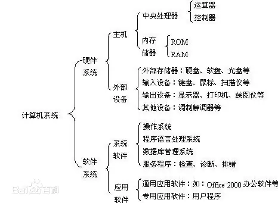

我们编写的软件首先读取到内存，用于提供给 CPU 进行运算处理。

内存的读取和释放，决定了程序性能。


冯·诺依曼结构

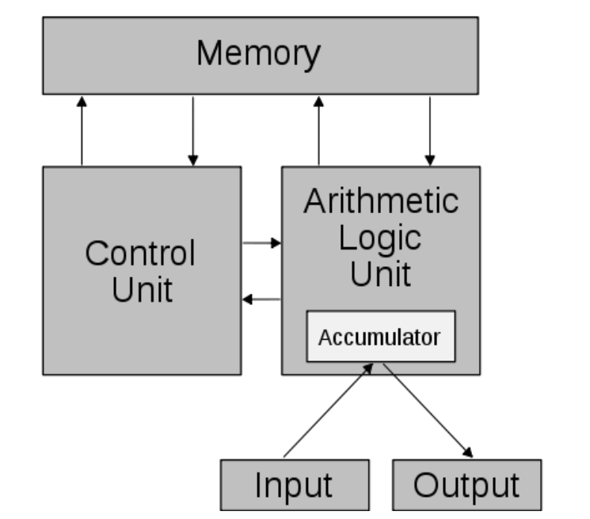

### 解释与编译

Java 编译为 class 文件，然后执行

解释型，JavaScript 代码的解释过程如下：

**💡 提示**

**编译**相当于做好了一桌子菜，可以直接开吃了。
而**解释**就相当于吃火锅，需要一边煮一边吃。优化编译，吃着吃着发现豆芽好吃，就涮点豆芽。

JavaScript 属于解释型语言，它需要在代码执行时，将代码编译为机器语言。

ast（Abstract Syntax Tree）

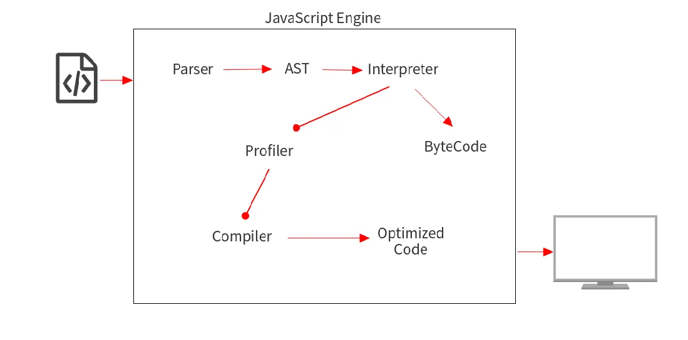

- **Interpreter** 逐行读取代码并立即执行。
- **Compiler** 读取您的整个代码，进行一些优化，然后生成优化后的代码。

让我们来看下面这个例子。

```JavaScript
function add(a, b) {    
    return a+b
}
for(let i = 0; i < 1000; i++) {    
    add(i, 1)
}
```

上面的示例循环调用了 `add` 函数1000次，该函数将两个数字相加并返回总和。

1. **Interpreter** 接收上面的代码后，它将逐行读取并立即执行代码，直到循环结束。 它的工作仅仅是实时地将代码转换为我们的计算机可以理解的内容。
2. 如果这段代码受者是 **Compiler**，它会先完整地读取整个程序，对我们要执行的代码进行分析，并生成电脑可以读懂的机器语言。过程如同获取 **X**（*我们的JS文件*）并生成 **Y**（*机器语言*）一样。如果我们使用 Interpreter 执行 **Y**，则会获得与执行 **X** 相同的结果。

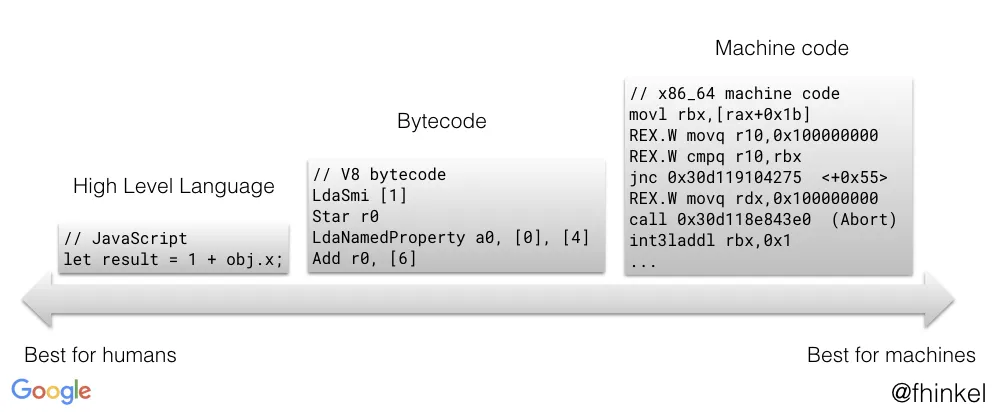

从上图中可以看出，**ByteCode** 只是中间码，计算机仍需要对其进行翻译才能执行。 但是 Interpreter 和 Compiler 都将**源代码**转换为**机器语言**，它们唯一的区别在于转换的过程不尽相同。

- **Interpreter** 逐行将源代码转换为等效的机器代码。
- **Compiler** 在一开始就将所有源代码转换为机器代码。


### JavaScript 引擎

JavaScript 其实有众多引擎，只不过 v8 是我们最为熟知的。

- **V8 (Google)**，用 C++编写，开放源代码，由 Google 丹麦开发，是 Google Chrome 的一部分，也用于 Node.js。
- JavaScriptCore (Apple)，开放源代码，用于 webkit 型浏览器，如 Safari ，2008 年实现了编译器和字节码解释器，升级为了 SquirrelFish。苹果内部代号为“Nitro”的 JavaScript 引擎也是基于 JavaScriptCore 引擎的。
- Rhino，由 Mozilla 基金会管理，开放源代码，完全以 Java 编写，用于 HTMLUnit
- SpiderMonkey (Mozilla)，第一款 JavaScript 引擎，早期用于 Netscape Navigator，现时用于 Mozilla Firefox。


这里我们先整体看一下 Nodejs 整个架构

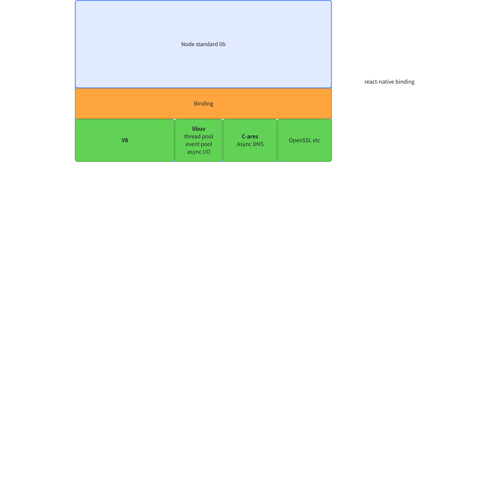

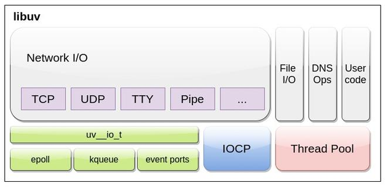


**🐶 提示**

谷歌的 Chrome 使用 V8，Safari 使用 JavaScriptCore，Firefox 使用 SpiderMonkey。

简单看一下 V8 的处理过程。

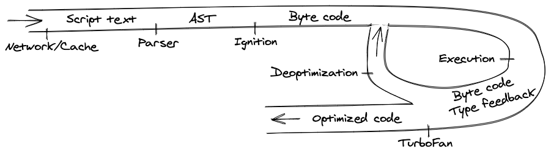

1. 始于从网络中获取 JavaScript 代码。
2. V8 解析源代码并将其转化为抽象语法树（AST abstract syntax tree）。
3. 基于该 AST，**Ignition** **基线解释器**可以开始做它的事情，并产生字节码。
4. 在这一点上，引擎开始运行代码并收集类型反馈。
5. 为了使它运行得更快，字节码可以和反馈数据一起被发送到 **TurboFan** **优化编译器**。优化编译器在此基础上做出某些假设，然后产生高度优化的机器代码。
6. 如果在某些时候，其中一个假设被证明是不正确的，优化编译器就会取消优化，并回到解释器中。


## 垃圾回收算法

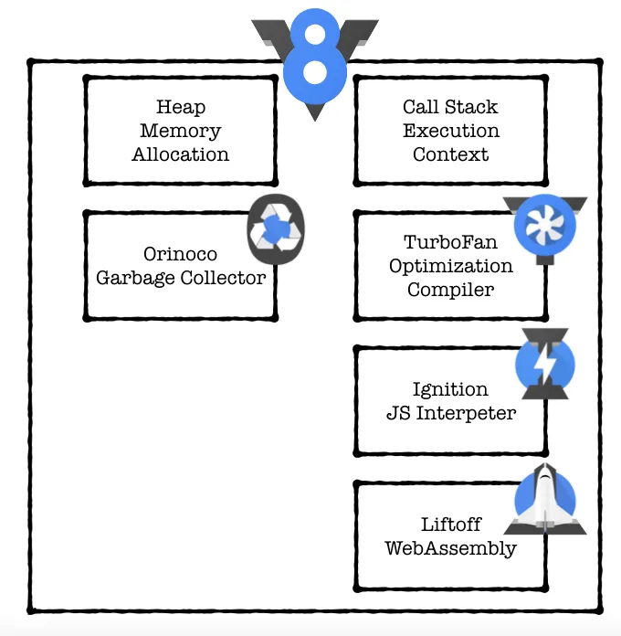

垃圾回收，又称为：GC（garbage collection）。

**💡 提示**

好，大家先看看自己电脑卡吗？
请现在打开进程管理器，看看内存占用


`GC` 即 `Garbage Collection` ，程序工作过程中会产生很多 `垃圾`，这些垃圾是程序不用的内存或者是之前用过了，以后不会再用的内存空间，而 `GC` 就是负责回收垃圾的，因为他工作在引擎内部，所以对于我们前端来说，`GC` 过程是相对比较无感的，这一套引擎执行而对我们又相对无感的操作也就是常说的 `垃圾回收机制` 了

当然也不是所有语言都有 `GC`，一般的高级语言里面会自带 `GC`，比如 `Java、Python、JavaScript` 等，也有无 `GC` 的语言，比如 `C、C++` 等，那这种就需要我们程序员手动管理内存了，相对比较麻烦


#### **垃圾的专业定义**

“可达性”，有没有被引用，没有被引用的变量，“不可达的变量”


上面提到了内容存储的方式，变量会在栈中存储，对象在堆中存储，例如：

```TypeScript
let a = {name: 'heyi'};
a = [1, 2, 3, 4, 5];
```

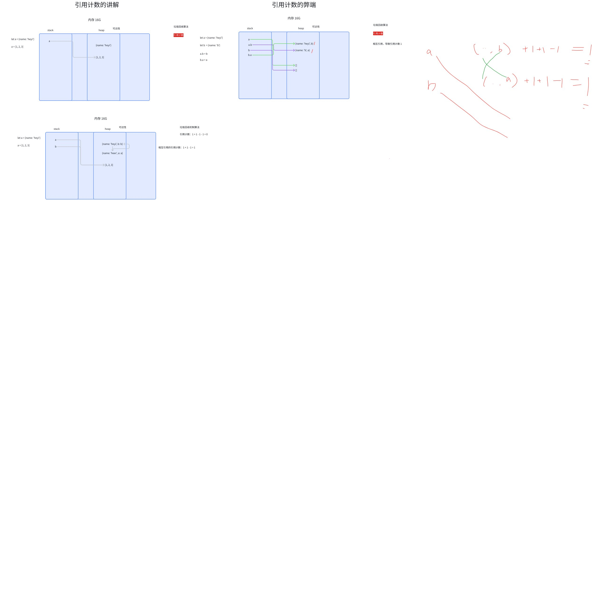

我们知道写代码时创建一个基本类型、对象、函数……都是需要占用内存的，但是我们并不关注这些，因为这是引擎为我们分配的，我们不需要显式手动的去分配内存，那么 JavaScript 引擎是如何发现并清理垃圾的呢？


**可达性**

### 引用计数算法

相信这个算法大家都很熟悉，也经常听说。

它的策略是跟踪记录每个变量值被使用的次数

- 当声明了一个变量并且将一个引用类型赋值给该变量的时候这个值的引用次数就为 1
- 如果同一个值又被赋给另一个变量，那么引用数加 1
- 如果该变量的值被其他的值覆盖了，则引用次数减 1
- 当这个值的引用次数变为 0 的时候，说明没有变量在使用，这个值没法被访问了，回收空间，垃圾回收器会在运行的时候清理掉引用次数为 0 的值占用的内存

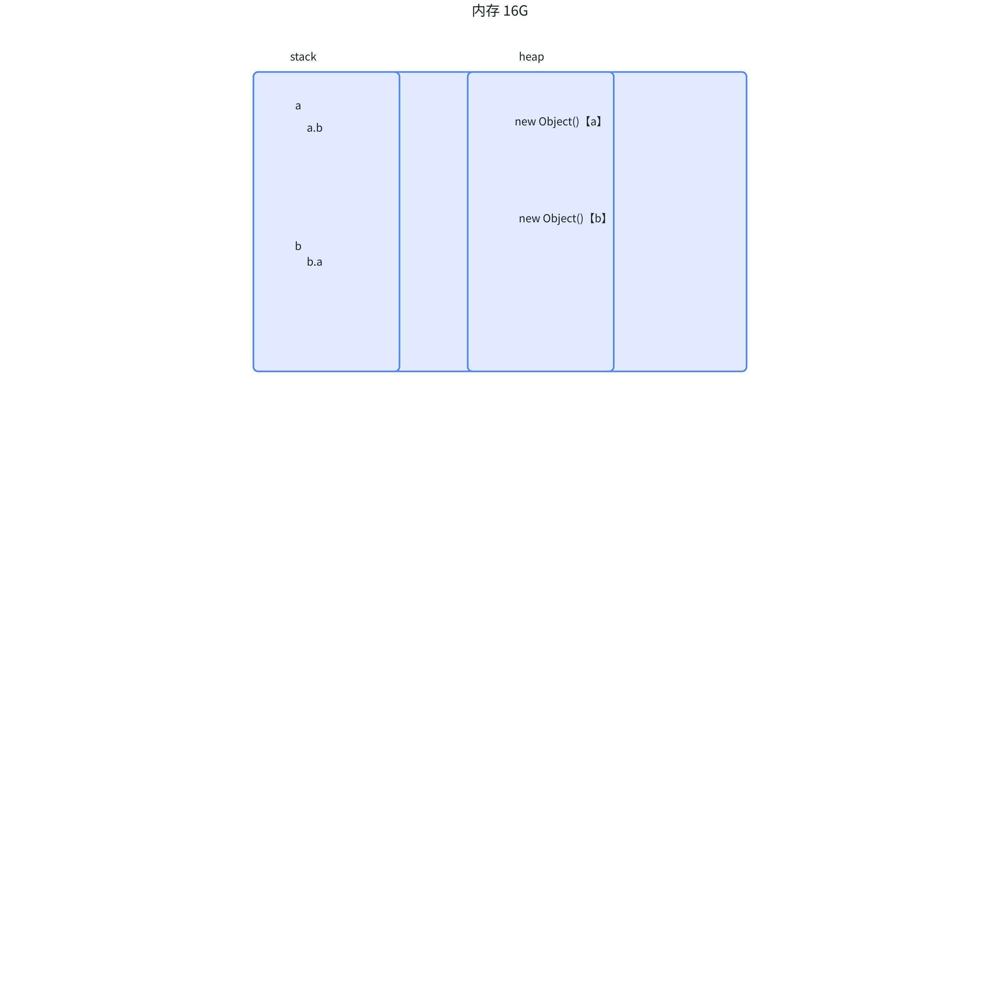

这个算法最怕的就是循环应用，还有比如 JavaScript 中不恰当的闭包写法。


看个例子：

```TypeScript
function test(){
  let A = new Object()
  let B = new Object()
  
  A.b = B
  B.a = A
}
```


**优点**

引用计数算法的优点我们对比标记清除来看就会清晰很多，首先引用计数在引用值为 0 时，也就是在变成垃圾的那一刻就会被回收，所以它可以立即回收垃圾

而标记清除算法需要每隔一段时间进行一次，那在应用程序（JS脚本）运行过程中线程就必须要暂停去执行一段时间的 `GC`，另外，标记清除算法需要遍历堆里的活动以及非活动对象来清除，而引用计数则只需要在引用时计数就可以了


**缺点**

引用计数的缺点想必大家也都很明朗了，首先它需要一个计数器，而此计数器需要占很大的位置，因为我们也不知道被引用数量的上限，还有就是无法解决循环引用无法回收的问题，这也是最严重的

### 标记清除（Mark-Sweep）算法

标记清除（Mark-Sweep），目前在 `JavaScript引擎` 里这种算法是最常用的，到目前为止的大多数浏览器的 `JavaScript引擎` 都在采用标记清除算法，各大浏览器厂商还对此算法进行了优化加工，且不同浏览器的 `JavaScript引擎` 在运行垃圾回收的频率上有所差异。

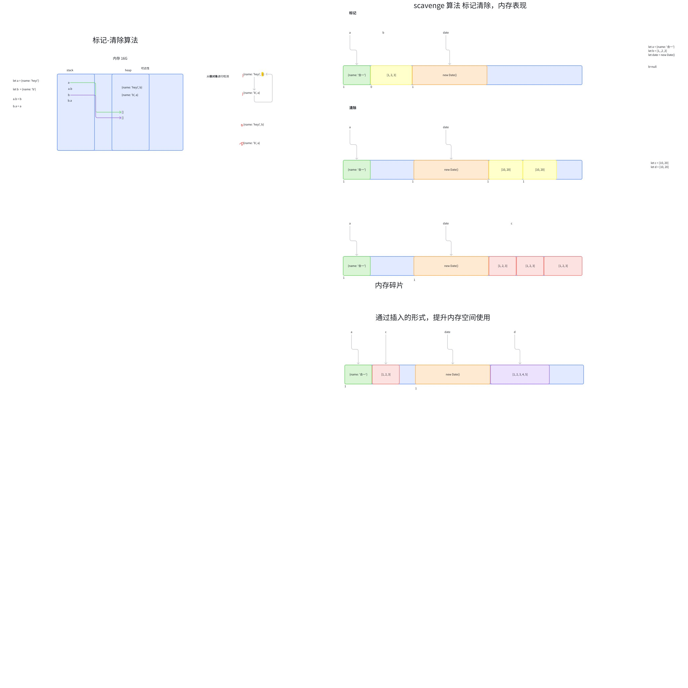

此算法分为 `标记` 和 `清除` 两个阶段，标记阶段即为所有活动对象做上标记，清除阶段则把没有标记（也就是非活动对象）销毁


当变量进入执行环境时，反转某一位（通过一个二进制字符来表示标记），又或者可以维护进入环境变量和离开环境变量这样两个列表，可以自由的把变量从一个列表转移到另一个列表。

引擎在执行 GC（使用标记清除算法）时，需要从出发点去遍历内存中所有的对象去打标记，而这个出发点有很多，我们称之为一组 `根` 对象，而所谓的根对象，其实在浏览器环境中包括又不止于 `全局Window对象`、`文档DOM树` 


整个标记清除算法大致过程就像下面这样

1. 垃圾收集器在运行时会给内存中的所有变量都加上一个标记，假设内存中所有对象都是垃圾，全标记为0
2. 然后从各个根对象开始遍历，把不是垃圾的节点改成1
3. 清理所有标记为0的垃圾，销毁并回收它们所占用的内存空间
4. 最后，把所有内存中对象标记修改为0，等待下一轮垃圾回收


**优点**

标记清除算法的优点只有一个，那就是实现比较简单，打标记也无非打与不打两种情况，这使得一位二进制位（0和1）就可以为其标记，非常简单


**缺点**

标记清除算法有一个很大的缺点，就是在清除之后，剩余的对象内存位置是不变的，也会导致空闲内存空间是不连续的，出现了 `内存碎片`（如下图），并且由于剩余空闲内存不是一整块，它是由不同大小内存组成的内存列表，这就牵扯出了内存分配的问题


假设我们新建对象分配内存时需要大小为 `size`，由于空闲内存是间断的、不连续的，则需要对空闲内存列表进行一次单向遍历找出大于等于 `size` 的块才能为其分配（如下图）

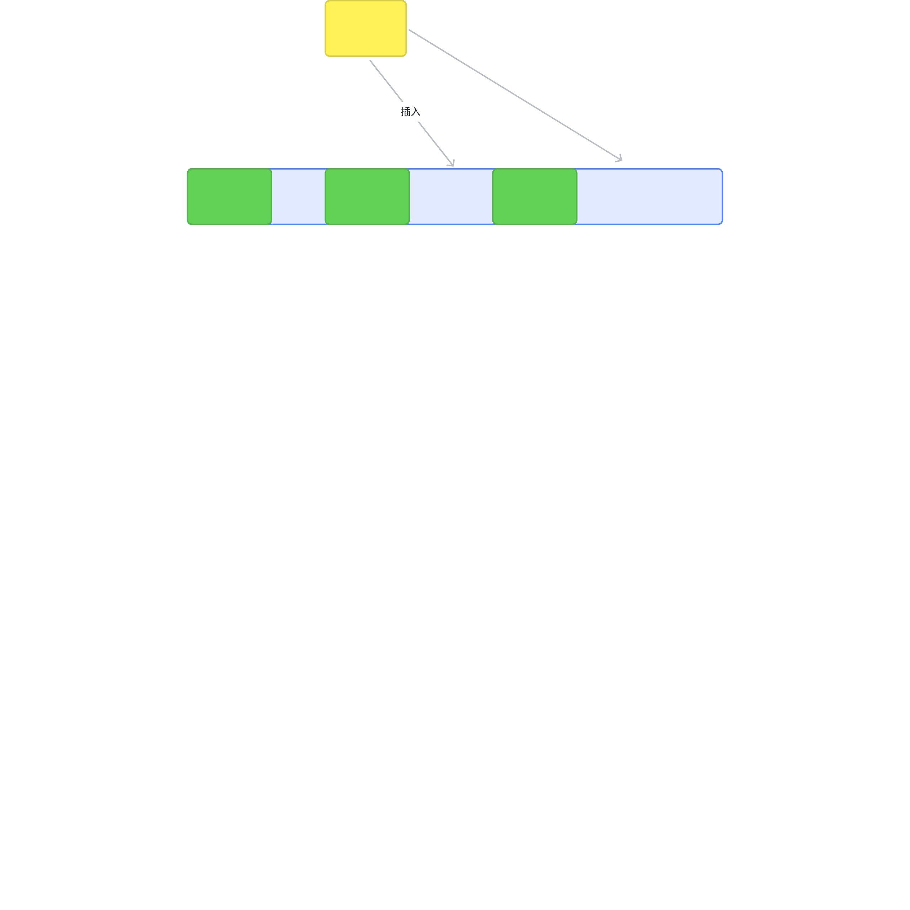

那如何找到合适的块呢？我们可以采取下面三种分配策略

- `First-fit`，找到大于等于 `size` 的块立即返回
- `Best-fit`，遍历整个空闲列表，返回大于等于 `size` 的最小分块
- `Worst-fit`，遍历整个空闲列表，找到最大的分块，然后切成两部分，一部分 `size` 大小，并将该部分返回

这三种策略里面 `Worst-fit` 的空间利用率看起来是最合理，但实际上切分之后会造成更多的小块，形成内存碎片，所以不推荐使用，对于 `First-fit` 和 `Best-fit` 来说，考虑到分配的速度和效率 `First-fit` 是更为明智的选择

综上所述，标记清除算法或者说策略就有两个很明显的缺点

- **内存碎片化**，空闲内存块是不连续的，容易出现很多空闲内存块，还可能会出现分配所需内存过大的对象时找不到合适的块
- **分配速度慢**，因为即便是使用 `First-fit` 策略，其操作仍是一个 `O(n)` 的操作，最坏情况是每次都要遍历到最后，同时因为碎片化，大对象的分配效率会更慢


**💡 提示**

归根结底，标记清除算法的缺点在于清除之后剩余的对象位置不变而导致的空闲**内存不连续**，所以只要解决这一点，两个缺点都可以完美解决了

### 6.3 标记整理**（Mark-Compact）**算法

而 **标记整理（Mark-Compact）算法** 就可以有效地解决，它的标记阶段和标记清除算法没有什么不同，只是标记结束后，标记整理算法会将活着的对象（即不需要清理的对象）向内存的一端移动，最后清理掉边界的内存

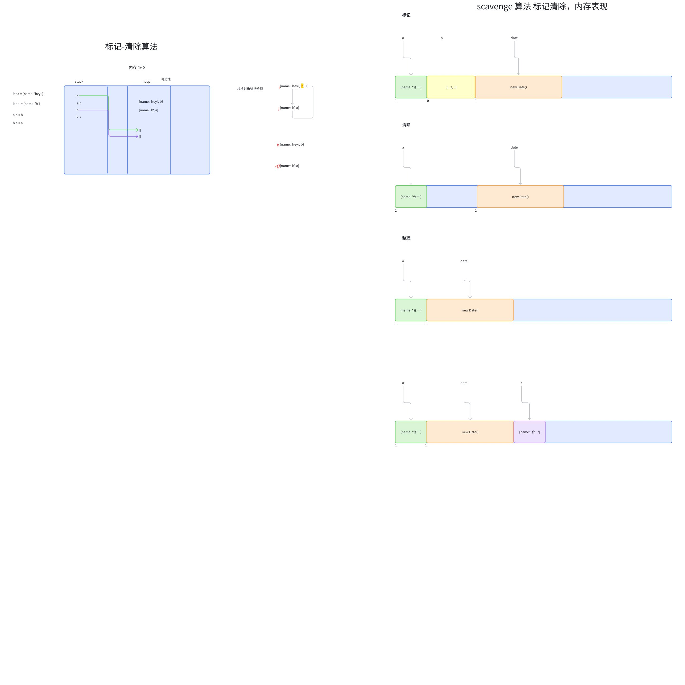


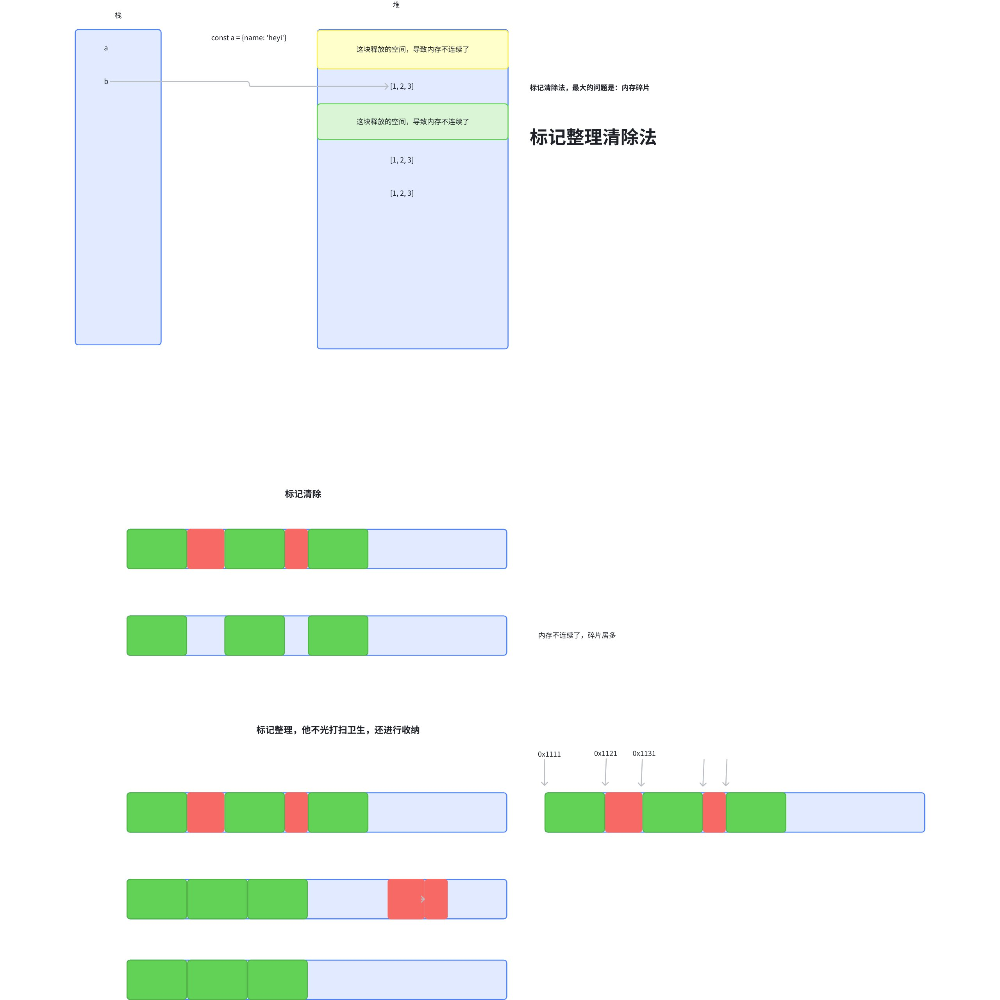

## 内存管理

以上给大家介绍了常用的一些垃圾回收算法，在不同语言中，对于垃圾回收的处理略有差异。

V8 引擎对内存这块做了深度优化，我们接下来详细介绍。


**💡 提示**

V8 的垃圾回收策略主要基于**分代式垃圾回收机制**，V8 中将堆内存分为**新生代**和**老生代**两区域，采用不同的垃圾回收器也就是不同的策略管理垃圾回收

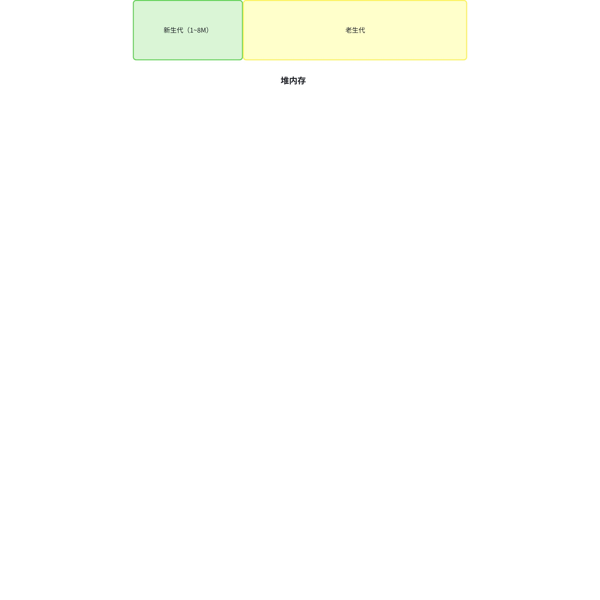

### 新生代

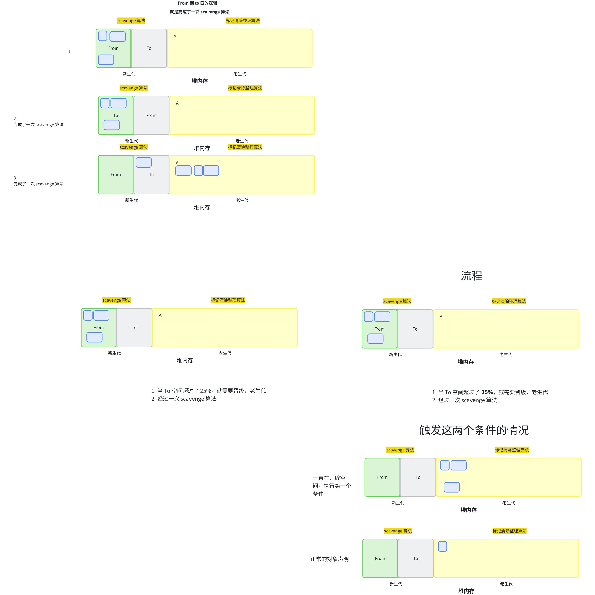

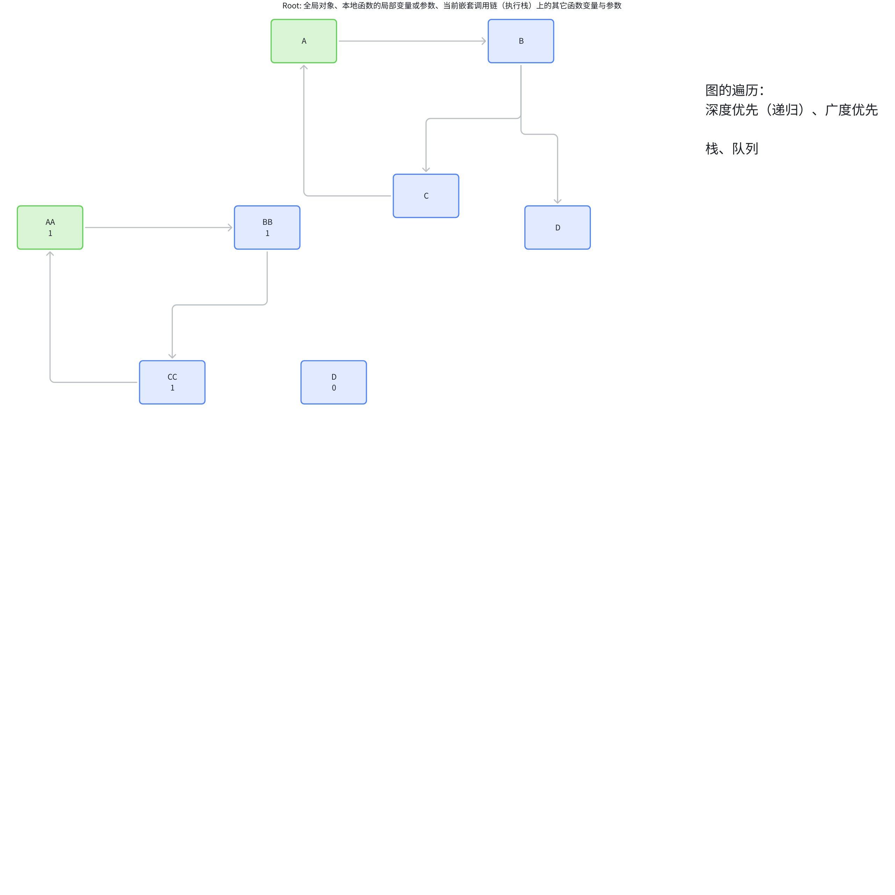

当新加入对象时，它们会被存储在使用区。然而，当使用区快要被写满时，垃圾清理操作就需要执行。在开始垃圾回收之前，新生代垃圾回收器会对使用区中的活动对象进行标记。标记完成后，活动对象将会被复制到空闲区并进行排序。然后，垃圾清理阶段开始，即将非活动对象占用的空间清理掉。最后，进行角色互换，将原来的使用区变成空闲区，将原来的空闲区变成使用区。


如果一个对象经过多次复制后依然存活，那么它将被认为是生命周期较长的对象，且会被移动到老生代中进行管理。除此之外，还有一种情况，如果复制一个对象到空闲区时，空闲区的空间占用超过了**25%**，那么这个对象会被直接晋升到老生代空间中。**25%**比例的设置是为了避免影响后续内存分配，因为当按照 `Scavenge` 算法回收完成后，空闲区将翻转成使用区，继续进行对象内存分配。

### 老生代

不同于新生代，老生代中存储的内容是相对使用频繁并且短时间无需清理回收的内容。这部分我们可以使用**标记整理**进行处理。

从一组根元素开始，递归遍历这组根元素，遍历过程中能到达的元素称为活动对象，没有到达的元素就可以判断为非活动对象

清除阶段老生代垃圾回收器会直接将非活动对象进行清除。

### 并行回收

为了减少主线程阻塞，我们在进行 GC 处理时，使用辅助进程。

**🐶 提示**

我们花两个人的钱请一个人干三个人的活儿

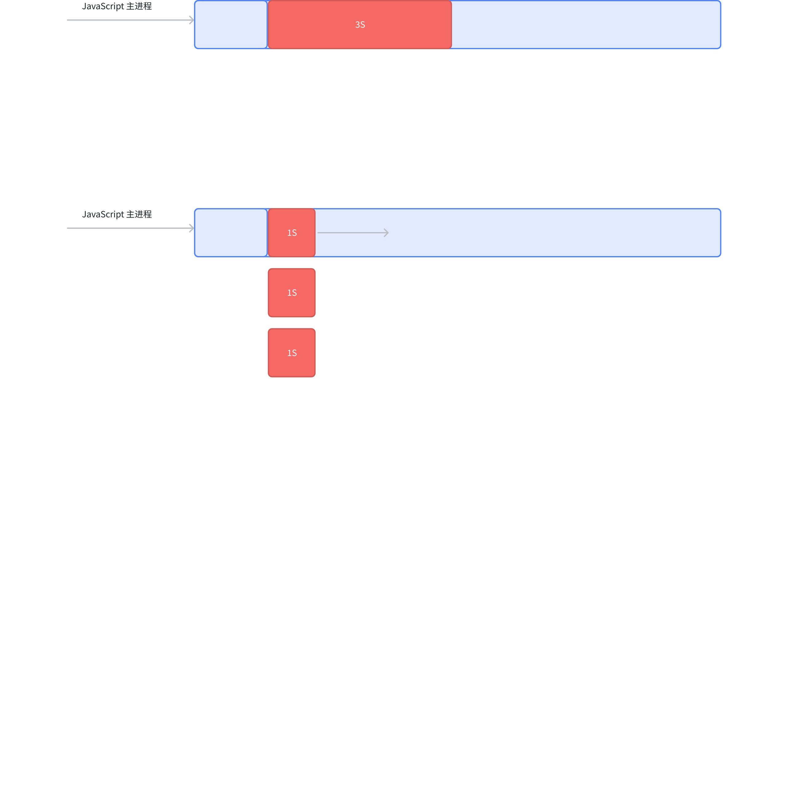

#### 全停顿标记

这个概念看字眼好像不好理解，其实如果用前端开发的术语来解释，就是**阻塞**。

虽然我们的 GC 操作被放到了主进程与子进程中去处理，但最终的结果还是主进程被较长时间占用。

在JavaScript的V8引擎中，全停顿标记（Full Stop-the-world Marking）是垃圾回收（GC）过程中的一个重要环节。这个过程涉及到V8的垃圾回收器暂停JavaScript程序的执行，以便进行垃圾回收的标记阶段。全停顿标记是为了确保在回收内存前正确标记所有活动对象（即正在使用的对象）和非活动对象（即可以清除的对象）。

##### 全停顿标记的工作原理：

1. 停止执行：当执行到全停顿标记阶段时，V8引擎会暂停正在执行的JavaScript代码，确保没有任何JavaScript代码在运行。这个停顿是必需的，因为在标记活动对象时，对象的引用关系需要保持不变。
2. 标记阶段：在这个阶段，垃圾回收器遍历所有根对象（例如全局变量、活跃的函数的局部变量等），从这些**根对象**开始，递归地访问所有**可达**的对象。每访问到一个对象，就将其标记为**活动（1）**的。
3. 恢复执行：标记完成后，V8引擎会恢复JavaScript代码的执行，进入垃圾回收的清除或压缩阶段。

##### 全停顿的影响及优化：

全停顿标记虽然对于确保内存被正确管理是必要的，但它会对应用程序的性能产生影响，特别是在垃圾回收发生时，应用程序的响应时间和性能会短暂下降。为了缓解这种影响，V8引擎采用了几种策略：

- 增量标记（Incremental Marking）：为了减少每次停顿的时间，V8实现了增量标记，即将标记过程分成多个小部分进行，介于JavaScript执行的间隙中逐步完成标记。
- 并发标记（Concurrent Marking）：V8引擎的更高版本中引入了并发标记，允许垃圾回收标记阶段与JavaScript代码的执行同时进行，进一步减少停顿时间。
- 延迟清理（Lazy Sweeping）：标记完成后的清理阶段也可以延迟执行，按需进行，以减少单次停顿的时间。

这些优化措施有助于提高应用的响应速度和整体性能，特别是在处理大量数据和复杂操作时，确保用户体验不会因垃圾回收而受到较大影响。

#### 切片标记

增量就是将一次 `GC` 标记的过程，分成了很多小步，每执行完一小步就让应用逻辑执行一会儿，这样交替多次后完成一轮 `GC` 标记（如下图）


#### 三色标记

三色：白灰黑。相信大家都知道**灰色地带**这个词吧？😄

我们这里的会，表示的是一个中间状态，为什么会有这个中间状态呢？

- 白色指的是未被标记的对象
- 灰色指自身被标记，成员变量（该对象的引用对象）未被标记
- 黑色指自身和成员变量皆被标记


在V8引擎中使用的三色标记算法是一种用于垃圾回收的有效方法，特别是在进行增量和并发标记时。这个算法通过给对象着色（白色、灰色、黑色）来帮助标记和回收垃圾。

##### 工作原理：

1. 初始化：

   - 白色：初始状态，所有对象都标记为白色，表示这些对象可能是垃圾，如果在标记过程中没有被访问到，最终将被清理。
   - 灰色：表示对象已经被标记（访问过），但该对象的引用还没有完全检查完。
   - 黑色：表示该对象及其所有引用都已经被完全访问过，并且已经标记。
2. 标记过程：

   - 垃圾回收开始时，从根集合（如全局变量、活跃的堆栈帧中的局部变量等）出发，将所有根对象标记为灰色。
   - 逐一处理灰色对象：将灰色对象标记为黑色，并将其直接引用的所有白色对象转变为灰色。这个过程不断重复，直到没有灰色对象为止。
3. 扫描完成：

   - 所有从根可达的对象最终都会被标记为黑色。所有仍然为白色的对象被认为是不可达的，因此将被视为垃圾并在清除阶段被回收。

##### 优点：

- 健壮性：三色标记算法非常适合增量和并发的垃圾回收，因为它能够确保即使在应用程序继续执行的情况下也能正确地标记活动对象。
- 防止漏标：通过灰色和黑色的严格区分，算法确保所有可达的对象都会被遍历和标记，防止错误地回收正在使用的对象。
- 效率：虽然在垃圾回收期间会有增加的计算开销，但三色标记算法可以与应用程序的执行并行进行，减少了GC停顿的时间，提高了应用的响应性和性能。

##### 应用：

在实际应用中，V8和其他现代JavaScript引擎使用这种算法进行内存管理，优化了动态内存的使用，减少了垃圾回收对应用性能的影响。这对于要求高性能和实时响应的Web应用程序尤其重要。

具体执行流程参见下图：

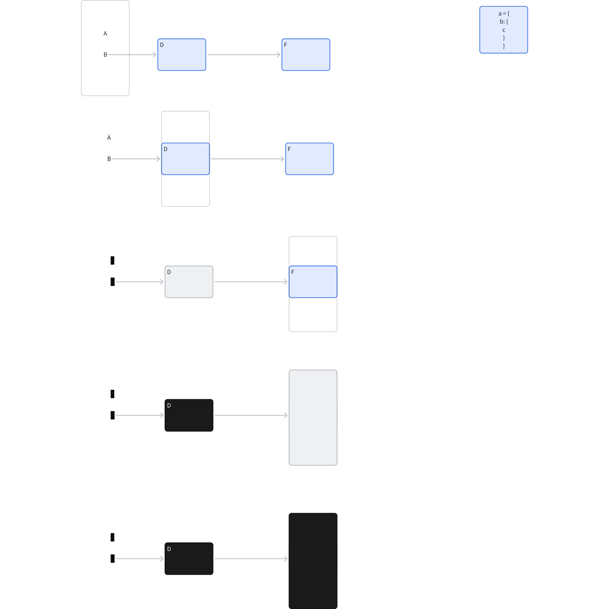

#### 写屏障(增量中修改引用)

这一机制用于处理在增量标记进行时修改引用的处理，可自行修改为灰色

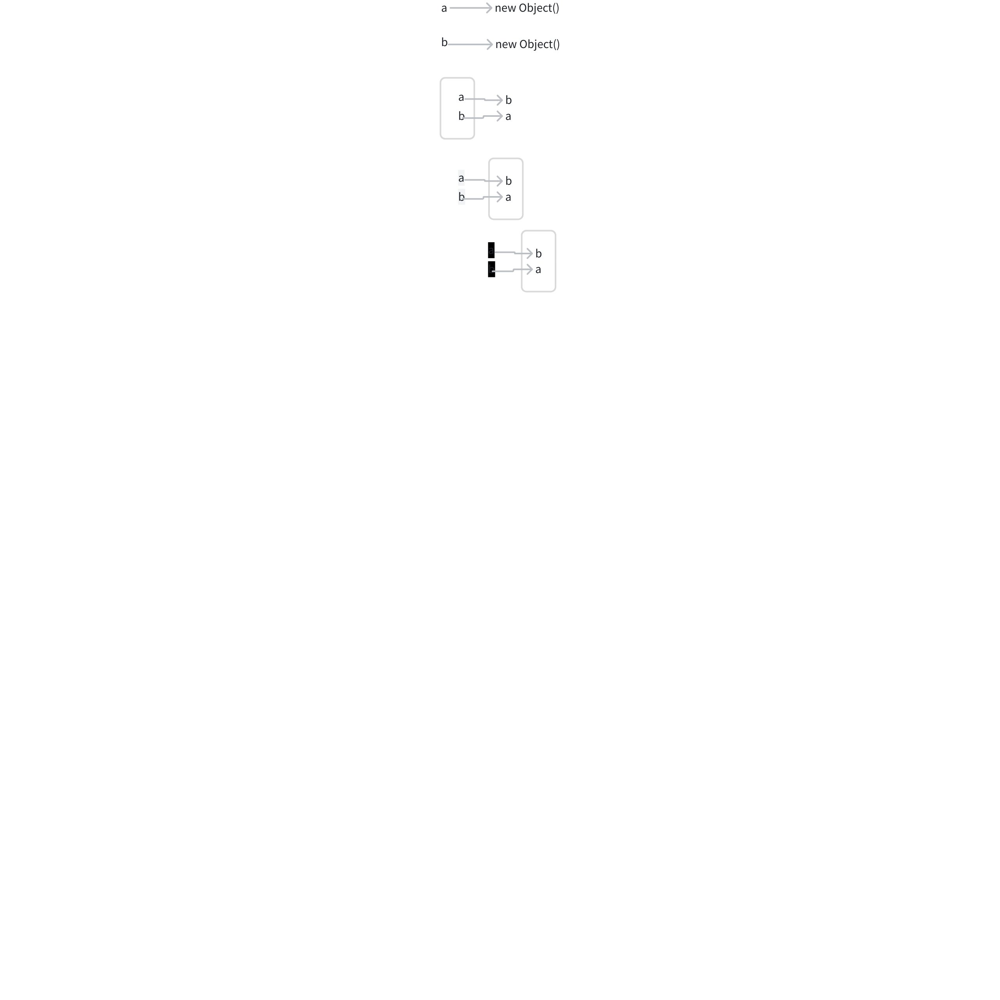

在V8引擎中，写屏障（Write Barrier）是垃圾回收（GC）的一个关键机制，尤其是在增量和并发垃圾回收过程中发挥着至关重要的作用。写屏障主要用来维持垃圾回收中的三色不变性，在对象写操作期间动态地更新对象的可达性信息。

##### 作用

1. **保持三色不变性，**在使用三色标记算法中，写屏障帮助维持所谓的三色不变性。这意味着系统确保如果一个黑色对象（已经被完全扫描的对象）引用了一个白色对象（尚未被扫描的对象，可能是垃圾），那么这个白色对象应当转变为灰色（标记但尚未扫描完毕的对象），从而避免错误的垃圾回收。
2. **处理指针更新**，当一个对象的指针被更新（例如，一个对象的属性被另一个对象替换），写屏障确保关于这些对象的垃圾回收元数据得到适当的更新。这是确保垃圾回收器正确识别活动对象和非活动对象的必要步骤。

##### 类型

1. **Pre-Write Barrier（预写屏障）**，这种类型的写屏障在实际更新内存之前执行。它主要用于某些特定类型的垃圾回收算法，比如分代垃圾回收，以保持老年代和新生代之间的引用正确性。
2. **Post-Write Barrier（后写屏障）**，这是最常见的写屏障类型，发生在对象的指针更新之后。在V8中，当黑色对象指向白色对象时，后写屏障会将该白色对象标记为灰色，确保它不会在当前垃圾回收周期中被错误地回收。

##### 实现细节

在V8引擎中，写屏障通常由简短的代码片段实现，这些代码片段在修改对象属性或数组元素时自动执行。例如，每当JavaScript代码或内部的V8代码试图写入一个对象的属性时，写屏障代码会检查是否需要更新垃圾回收的元数据。


#### 惰性清理

**增量标记**只是用于标记活动对象和非活动对象，真正的清理释放内存，则 V8 采用的是**惰性清理**(Lazy Sweeping)方案。

在增量标记完成后，进行清理。当增量标记完成后，假如当前的可用内存足以让我们快速的执行代码，其实我们是没必要立即清理内存的，可以将清理过程稍微延迟一下，让 `JavaScript` 脚本代码先执行，也无需一次性清理完所有非活动对象内存，可以按需逐一进行清理直到所有的非活动对象内存都清理完毕。


### 并发回收

还记得 react 中的 Concurrent 吗？

我们想想 React 演进过程，是不是就会觉得从并行到并发的演进变得很合了呢？

并发挥收其实是更进一步的切片，几乎完全不阻塞主进程。

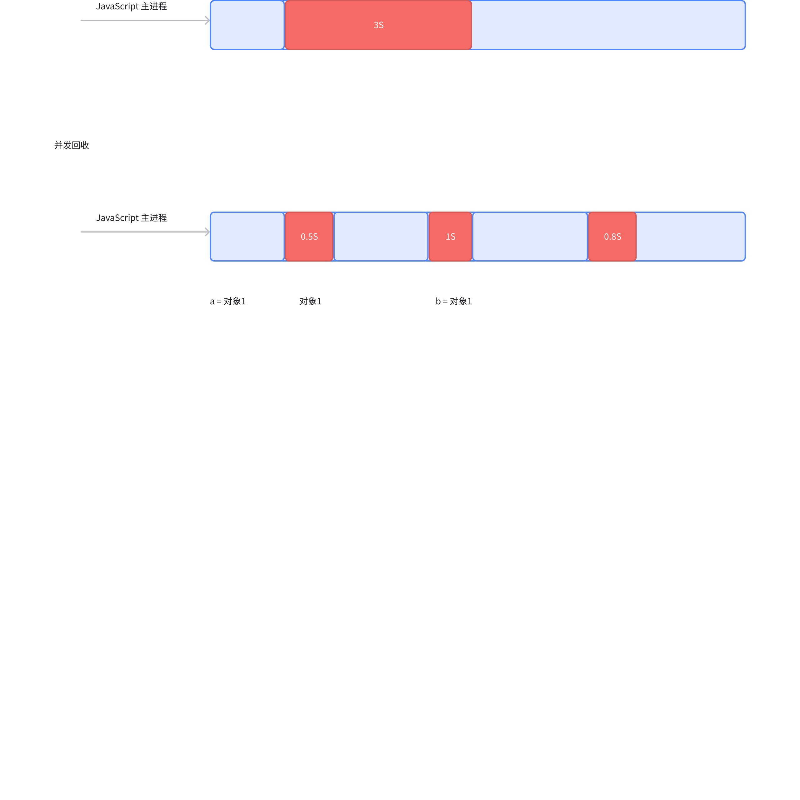

### 总结

分代式机制把一些新、小、存活时间短的对象作为**新生代**，采用一小块内存频率较高的快速清理，而一些大、老、存活时间长的对象作为**老生代**，使其很少接受检查，新老生代的回收机制及频率是不同的，可以说此机制的出现很大程度提高了垃圾回收机制的效率


**🐵 提示**

面试常问
1. 怎么理解内存泄漏
2. 怎么解决内存泄漏，代码层面如何优化？

1. 减少查找

```TypeScript
var i, str = ""
function packageDomGlobal() {
    for(i = 0; i < 1000; i++) {
        str += i
    }
}

// 第二种情况。我们采用局部变量来保存保存相关数据
function packageDomLocal() {
    let str = ''
    for(let i = 0; i < 1000; i++) {
        str += i
    }
}
```

1. 减少变量声明

```TypeScript
// 第一种情况，循环体中没有抽离出值不变的数据
var test = () => {
  let arr = ['czs', 25, 'I love FrontEnd'];
  for(let i = 0; i < arr.length; i++){
      console.log(arr[i]);
  }
}

// 第二种情况，循环体中抽离出值不变的数据
var test = () => {
  let arr = ['czs', 25, 'I love FrontEnd'];
  const length = arr.length;
  for(let i = 0; i < length; i++){
      console.log(arr[i]);
  }
}
```

1. 使用 Performance + Memory 分析内存与性能


## 运行机制

回顾一下第一节学习的浏览器多进程模型

[引用：1.基于 Chrome 浏览器渲染原理](https://www.feishu.cn/docx/TQIhdVHKloumjKxO9RfcDiJOnGd)

**浏览器主进程** 

- 协调控制其他子进程（创建、销毁）
- 浏览器界面显示，用户交互，前进、后退、收藏
- 将渲染进程得到的内存中的Bitmap，绘制到用户界面上
- 存储功能等

**第三方插件进程** 

- 每种类型的插件对应一个进程，仅当使用该插件时才创建

**GPU进程** 

- 用于3D绘制等

**`渲染进程`，就是我们说的`浏览器内核`**

- **排版引擎 Blink** 和 **JavaScript 引擎 V8** 都是运行在该进程中，将 HTML、CSS 和 JavaScript 转换为用户可以与之交互的网页

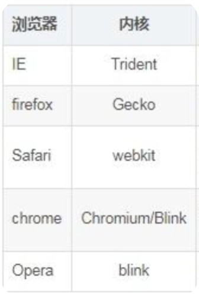

- 负责页面渲染，脚本执行，事件处理等
- 每个tab页一个渲染进程
- 出于安全考虑，渲染进程都是运行在沙箱模式下

**网络进程** 

- 负责页面的网络资源加载，之前作为一个模块运行在浏览器主进程里面，最近才独立成为一个单独的进程


### 浏览器事件循环

**💡 提示**

在 Chrome 中，事件循环的执行是由浏览器的渲染引擎（例如 **Blink**）和 **V8** 引擎配合完成的。V8 负责 JavaScript 代码的执行，Blink 负责浏览器的渲染和用户界面的更新

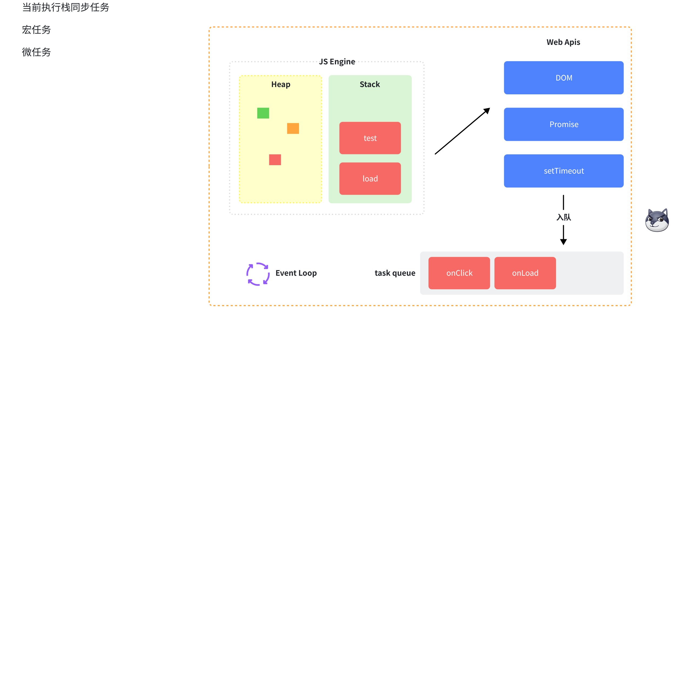

#### 执行顺序描述

先执行当前执行栈同步任务，再执行（微任务），再执行（宏任务）


#### 宏任务

**💡 提示**

**特别说明**：
在 Chrome 的源码中，并未直接出现“宏任务”这一术语，但在 JavaScript 运行时引擎（V8）以及事件循环（Event Loop）相关的实现中，宏任务和微任务的概念是非常重要的。
实际上，“宏任务”这一术语来源于 JavaScript 事件循环的抽象，它只是帮助我们理解任务的执行顺序和时机。

可以将每次执行栈执行的代码当做是一个宏任务

- I/O
- setTimeout
- setInterval
- setImmediate
- requestAnimationFrame

#### 微任务

当`宏任务`执行完，会在渲染前，将执行期间所产生的所有`微任务`都执行完

- process.nextTick
- MutationObserver
- Promise.then catch finally

#### 完整整体流程

- 执行当前执行栈同步任务（栈中没有就从`事件队列`中获取）
- 执行过程中如果遇到`微任务`，就将它添加到`微任务`的任务队列中
- `执行栈同步任务`执行完毕后，立即执行当前`微任务队列`中的所有`微任务`（依次执行）
- `宏``任务`执行完毕，开始检查渲染，然后`GUI线程`接管渲染
- 渲染完毕后，`JS线程`继续接管，开始下一个`宏任务`（从事件队列中获取）


#### 浏览器事件循环

```JavaScript
console.log(1);

queueMicrotask(() => {console.log(2)});

Promise.resolve().then(() => console.log(3));

setTimeout(() => {console.log(4)})
```

问：上面的打印顺序是怎么样的？？？

首先，任务，js 主进程的内容先执行，js 常规的代码 1, 2 为微任务，3 微任务，4 宏任务

1. 执行同步代码。
2. 执行栈同步任务（执行栈中没有就从任务队列中获取）。
3. 执行过程中如果遇到微任务，就将它添加到微任务的任务队列中。
4. 执行栈同步任务后，立即执行**当前**微任务队列中的所有微任务（依次执行）。
5. 执行宏任务，当前宏任务执行完毕，开始检查渲染，然后渲染线程接管进行渲染。
6. 渲染完毕后，JavaScript 线程继续接管，开始下一个循环。

> 宏任务-微任务-渲染（如果需要渲染，比如到了时间，或有更改 dom），而不是又执行宏任务


**call stack** vs **task queue**

```JavaScript
console.log(1);

setTimeout(() => console.log(2));

Promise.resolve().then(() => console.log(3));

Promise.resolve().then(() => setTimeout(() => console.log(4)));

Promise.resolve().then(() => console.log(5));

setTimeout(() => console.log(6));

console.log(7);

// 结果
/*
1 7 3 5 2 6 4
*/
```

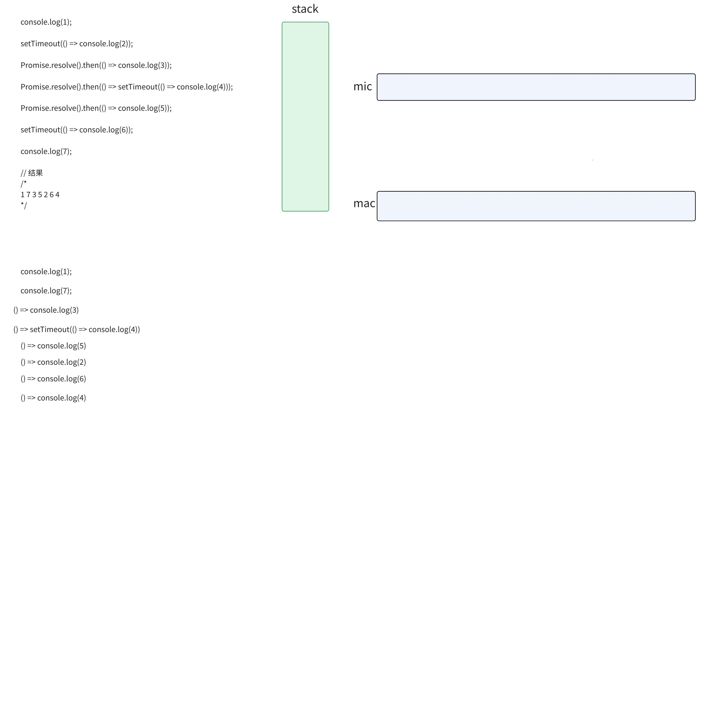

再来一道吧

```TypeScript
Promise.resolve().then(() => {
    // 微任务1
    console.log('Promise1')
    setTimeout(() => {
        // 宏任务2
        console.log('setTimeout2')
    }, 0)
})
setTimeout(() => {
    // 宏任务1
    console.log('setTimeout1')
    Promise.resolve().then(() => {
        // 微任务2
        console.log('Promise2')
    })
}, 0)

// Promise1 setTimeout1 Promise2 setTimeout2
```

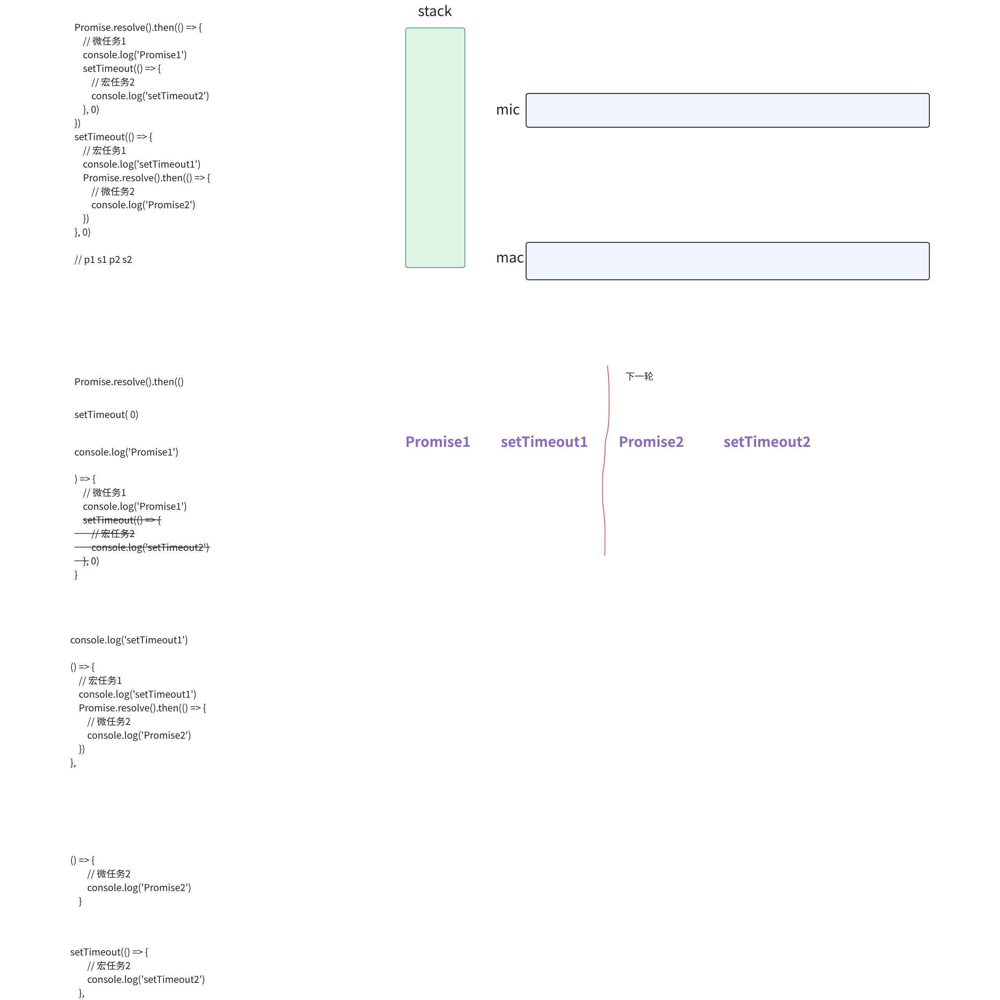

```JavaScript
Promise.resolve().then(() => console.log('p1'))
setTimeout(() => {console.log('s1')}, 0)
Promise.resolve().then(() => {}).then(() => console.log('p2'))

// p1 p2 s1
```

来一道更复杂些的题目

```JavaScript
console.log('stack [1]');
setTimeout(() => console.log("macro [2]"), 0);
setTimeout(() => console.log("macro [3]"), 1);

const p = Promise.resolve();
for(let i = 0; i < 3; i++) p.then(() => {
    setTimeout(() => {
        console.log('stack [4]')
        setTimeout(() => console.log("macro [5]"), 0);
        p.then(() => console.log('micro [6]'));
    }, 0);
    console.log("stack [7]");
});

console.log("macro [8]");

// 请说出答案
/* Result:
stack [1]
macro [8]

stack [7], stack [7], stack [7]

macro [2]
macro [3]

stack [4]
micro [6]
stack [4]
micro [6]
stack [4]
micro [6]

macro [5], macro [5], macro [5]
--------------------
but in node in versions < 11 (older versions) you will get something different


stack [1]
macro [8]

stack [7], stack [7], stack [7]

macro [2]
macro [3]

stack [4], stack [4], stack [4]
micro [6], micro [6], micro [6]

macro [5], macro [5], macro [5]

more info: https://blog.insiderattack.net/new-changes-to-timers-and-microtasks-from-node-v11-0-0-and-above-68d112743eb3
*/
```

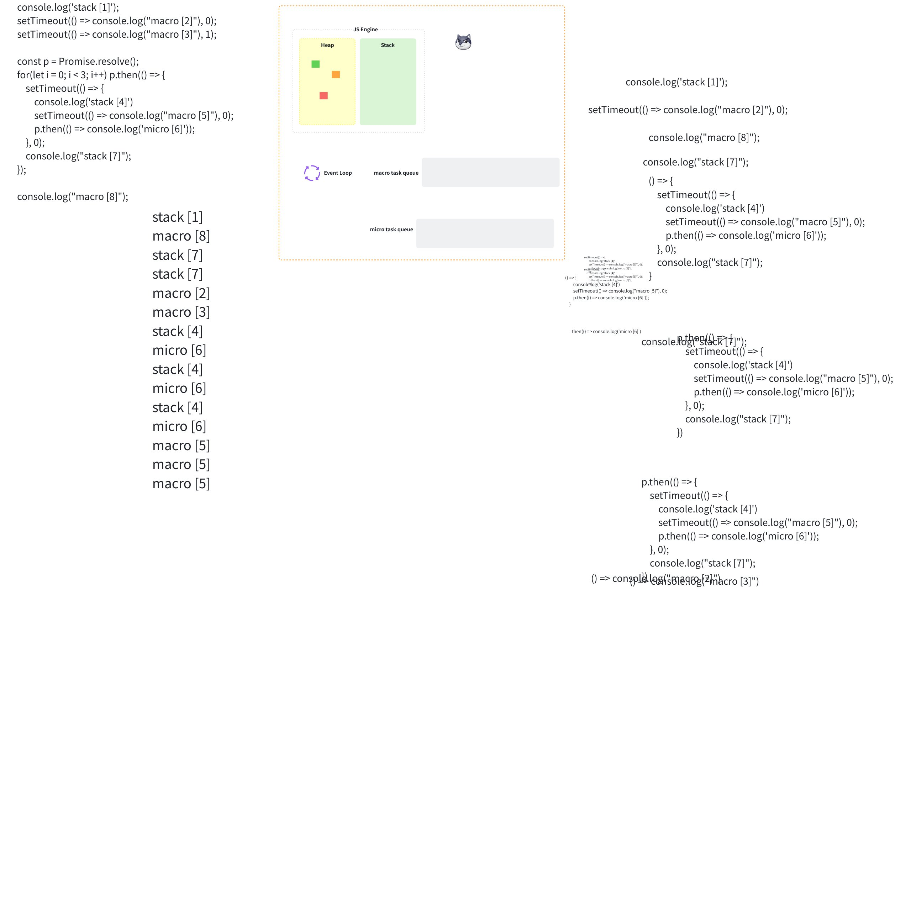


**📚 提示**

面试真题

```TypeScript
const $inner = document.querySelector('#inner')
const $outer = document.querySelector('#outer')

function handler () {
  console.log('click') // 直接输出

  Promise.resolve().then(_ => console.log('promise')) // 注册微任务

  setTimeout(() => console.log('timeout')) // 注册宏任务

  requestAnimationFrame(_ => console.log('animationFrame')) // 注册宏任务

  $outer.setAttribute('data-random', Math.random()) // DOM属性修改，触发微任务
}

new MutationObserver(_ => {
  console.log('observer')
}).observe($outer, {
  attributes: true
})

$inner.addEventListener('click', handler)
$outer.addEventListener('click', handler)
```

以上执行熟顺序：`click` -> `promise` -> `observer` -> `click` -> `promise` -> `observer` -> `animationFrame` -> `animationFrame` -> `timeout` -> `timeout`

### Node 事件循环机制

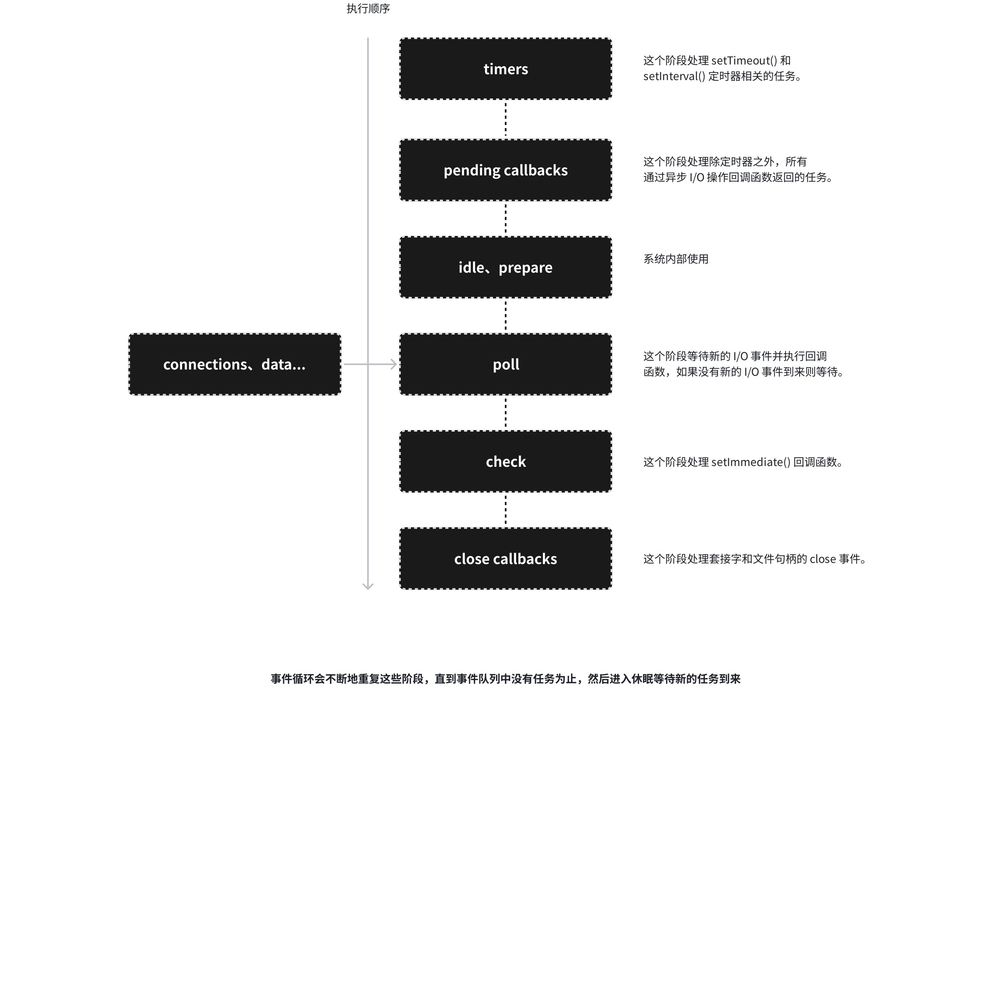

#### 与浏览器事件循环机制的不同


在 Node.js 中，为了更高效地管理和调度各种类型的异步任务。这种设计使得 Node.js 能够在单线程环境中有效地处理大量的并发任务。下

Node.js 的事件循环（Event Loop）是一个处理异步操作的机制，它会按照顺序依次执行不同阶段任务。事件循环机制中分为多个阶段，每个阶段都有自己的**任务队列**，包括：


1. **Timers 阶段**：

   - 处理 `setTimeout` 和 `setInterval` 调度的回调函数。
   - 如果指定的时间到了，回调函数会被放入这个队列。


1. **Pending Callbacks 阶段**：

   - 处理一些 I/O 操作的回调，比如 TCP 错误类型的回调。
   - 这些回调并不完全由开发者控制，而是由操作系统调度的。


1. **Idle, Prepare 阶段**：

   - 仅供内部使用的阶段。


1. **Poll 阶段**：

   - 获取新的 I/O 事件，执行 I/O 回调函数。
   - 通常情况下，这个阶段会一直等待，直到有新的 I/O 事件到来。


1. **Check 阶段**：

   - 处理 `setImmediate` 调度的回调函数。
   - `setImmediate` 的回调会在这个阶段执行，比 `setTimeout` 更早。


1. **Close Callbacks 阶段**：

   - 处理一些关闭的回调函数，比如 `socket.on('close', ...)`。


#### 多个队列的必要性


不同类型的异步任务有不同的优先级和处理方式。使用多个队列可以确保这些任务被正确地调度和执行：


1. **Timers 和 Poll 阶段的区别**：

   - `setTimeout` 和 `setInterval` 的回调在 Timers 阶段执行，这些回调函数依赖于计时器的到期时间。
   - Poll 阶段处理大多数 I/O 回调，这是事件循环的主要阶段，处理大部分异步 I/O 操作。


1. **Immediate 与 Timeout 的不同**：

   - `setImmediate` 的回调函数在 Check 阶段执行，这是在当前事件循环周期结束后立即执行。
   - `setTimeout` 的回调函数则是在 Timers 阶段执行，它可能会延迟到下一个事件循环周期，甚至更久。


1. **处理关闭回调**：

   - Close Callbacks 阶段专门处理如 `socket.on('close')` 这样的回调，以确保在资源释放时执行。


#### 实际示例


以下是一个简单的示例，展示了不同类型的异步任务如何在不同的阶段被处理：


```JavaScript
const fs = require('fs');

setTimeout(() => {
  console.log('setTimeout');
}, 0);

setImmediate(() => {
  console.log('setImmediate');
});

fs.readFile(__filename, () => {
  console.log('I/O callback');
  
  setTimeout(() => {
    console.log('setTimeout inside I/O');
  }, 0);
  
  setImmediate(() => {
    console.log('setImmediate inside I/O');
  });
});

console.log('Synchronous log');
```


**预期输出**（可能会略有不同，但大致顺序是这样的）：

```Plain Text
Synchronous log
setImmediate
I/O callback
setImmediate inside I/O
setTimeout inside I/O
setTimeout
```


- `Synchronous log` 立即执行。
- `setImmediate` 回调会在 `setTimeout` 之前执行，因为 `setImmediate` 在当前循环结束后立即执行。
- `I/O callback` 在读取文件完成后执行（Poll 阶段）。
- 在 I/O 回调中，`setImmediate` 会先于 `setTimeout` 执行。


### 伪代码实现任务执行

```Java
while (true){
    // 1. Get one macrotask (oldest) task item
    task = macroTaskQueue.pop(); 
    execute(task);

   // 2. Go and execute microtasks while they have items in their queue (including those which were added during this iteration)
   while (microtaskQueue.hasTasks()){
        const microTask = microtaskQueue.pop();
        execute(microTask);
    }

    // 3. If 16ms have elapsed since last time this condition was true
    if (isPaintTime()){
    // 4. Go and execute animationTasks while they have items in their queue (not including those which were added during this iteration)
        const animationTasks = animationQueue.getTasks();
        for (task in animationTasks){
            execute(task);
        }

        repaint(); // render the page changes (via the render pipeline)
    }
}
```


## Chrome 任务调度机制补充（仅了解）

V8 与 Blink 的调度系统密切相关。

**💡 提示**

Blink 是 Chrome 中的渲染引擎
V8 是 Chrome 中的 JavaScript 引擎

Blink 是 Chrome 浏览器中的渲染引擎，负责页面的渲染和绘制任务。V8 与 Blink 会协同工作，确保 JavaScript 的执行与页面渲染能够平稳进行。


> https://docs.google.com/document/d/11N2WTV3M0IkZ-kQlKWlBcwkOkKTCuLXGVNylK5E2zvc/edit?tab=t.0#heading=h.3ay9sj44f0zd


接下来我们了解一下 **Blink Scheduler**，一个用于优化 Blink 主线程任务调度的方案，旨在解决现有调度系统中的一些问题。

将任务不断安排到主线程的消息循环中，会导致 Blink 主线程阻塞。造成诸多问题：

1. **有限的优先级设置** – 任务按照发布顺序执行，或者可以明确地延迟，但这可能导致一些重要的任务（如输入处理）被不那么紧急的任务占用优先执行权。
2. **缺乏与系统其他部分的协调** – 比如图形管线虽然已知有输入事件的传递、显示刷新等时序要求，但这些信息无法及时传递给 Blink。
3. **无法适应不同的使用场景** – 某些任务（如垃圾回收）在用户交互时进行非常不合适。


为了解决以上问题，出现了 **Blink Scheduler** 调度器，它能够更灵活控制任务按照给定优先级执行。


**关键特点**：

- 调度器的主要功能是决定在特定时刻哪个任务应当执行。
- 调度器提供了更高级的 API 替代现有的主线程任务调度接口，任务不再是抽象的回调函数，而是更具体、具有明确标签和元数据的对象。例如，输入任务会被明确标记，并附带附加元数据。
- 调度器可以根据系统状态做出更明智的任务决策，而不是依赖给定死的静态优先级。


**调度器的代码组织**

https://gitlab.mpi-klsb.mpg.de/eweyulu/quic-chrome/-/blob/1449654ca85bd98f6f29343ff3f5a7d5d42e68ff/third_party/blink/renderer/platform/scheduler/renderer/webthread_impl_for_renderer_scheduler.cc


**性能验证和工具**

为了验证调度器的效果，文章提到了多项基准测试和性能指标，例如：

- **队列等待时间**：衡量任务从发布到执行的延迟。
- **输入事件延迟**：衡量输入事件的处理时间。
- **渲染平滑度（jank）**：衡量渲染的平滑性，避免出现卡顿。
- **页面加载时间**：跟踪页面加载时间的变化。
