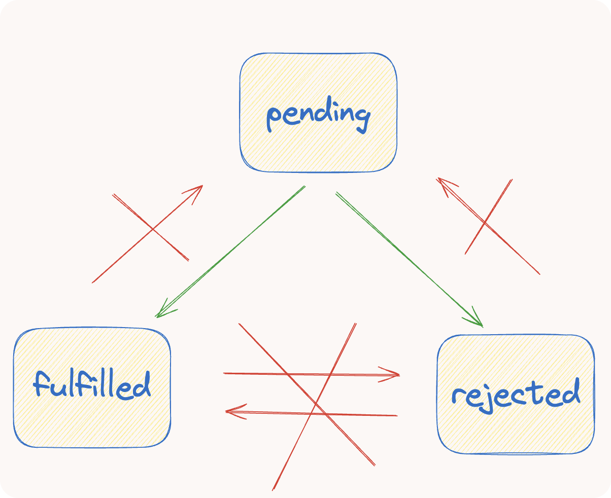

# 4.前端异步编程

> 原文链接：[飞书原文](https://u19tul1sz9g.feishu.cn/docx/CLiGdN7GzowQ4LxsuBncZK3unoD)

[引用：20260207 随堂笔记与源码资料](https://www.feishu.cn/docx/HsQBdlBmsocCuExnY9Jcy99Sn2e)
[本地资源：4.async-notes](<../../20260207 随堂笔记与源码资料-压缩包/2.前端核心原理知识进阶/4.async-notes>)

## 课程目标

> **💡 提示**
>
> - 初中级：
>
>   1. **理解异步编程的演变**：从回调（callback）到 Promise，再到 async，了解不同阶段异步任务的处理方式。
>   2. **了解 Promise A+ 规范**：掌握 Promise A+ 规范，能够清晰阐述其细节和关键特性。
>   3. **能实现简单版 Promise**：熟悉发布订阅模式，理解 Promise 执行机制，并能手写实现一个简易版本的 Promise。
> - 高级：
>
>   1. **深入理解异步处理机制**：深入掌握 Promise 的原理，理解 async 的实现细节，了解 generator（生成器）相关的特性与应用。
>   2. **手写实现完整 Promise**：从零开始完整实现 Promise，并能够通过 Promise A+ 规范进行测试。

## 补充资料

- Chromium V8 Promise 源码：https://chromium.googlesource.com/v8/v8/+/refs/tags/12.6.236/src/builtins/promise-jobs.tq
- **Promise A+ 规范**：https://promisesaplus.com/
- Promise A+ 测试：https://github.com/promises-aplus/promises-tests
- 老版 Promise 实现：https://github.com/tj/co
- async 实现：https://dev.to/gsarciotto/implementing-async-await-55f
- redux-saga 使用 generator：https://github.com/redux-saga/redux-saga/blob/9a6210bf891d3d74d4bab8d0f55c171e3c68355e/examples/async/src/sagas/index.js#L12


## 相关面试真题

### 请手写 Promise

**答案：**

见代码实现

[引用：4.前端异步编程](https://www.feishu.cn/docx/AyHRdnTNqol2NyxH4Kkc4uc2n6c)

### 如何解决 Promise 地狱问题？

**答案**：

所谓的 "Promise 地狱"，通常指的是代码中存在多层嵌套的 Promise 调用，这种情况会使代码难以理解和维护。解决 Promise 地狱的常见方法包括：

- 链式调用：利用 Promise 的 `.then()` 方法可以返回另一个 Promise，你可以通过链式调用的方式来避免深层的嵌套
- 异步函数（async/await）：使用 ES2017 引入的 async 和 await 语法可以使异步代码看起来像同步代码，这样可以极大地提高代码的可读性和可维护性。使用 `async` 标记的函数总是返回一个 Promise，而 `await` 关键字可以暂停 async 函数的执行，等待 Promise 解决


### Promise.all 和 Promise.race 的区别是什么？

**答案**：

- **Promise.all**：这个方法接受一个 Promise 对象的数组作为输入，只有当所有的 Promise 对象都变为 fulfilled 状态时，返回的 Promise 才会变为 fulfilled，并将一个数组作为结果传递给处理函数，数组中包含了所有输入 Promise 的结果。如果任何一个输入 Promise 变为 rejected，返回的 Promise 就会立即变为 rejected 状态，且失败的原因会是第一个失败 Promise 的结果
- **Promise.race**：这个方法同样接受一个 Promise 对象的数组，但是返回的 Promise 的状态会由第一个改变状态的输入 Promise 决定。也就是说，如果输入数组中的任何一个 Promise 先达到 fulfilled 或 rejected 状态，返回的 Promise 就会立即变为相同的状态，并以那个 Promise 的结果作为返回值


### 实现异步调度器 Scheduler

实现一个带并发限制的异步调度器 Scheduler，保证同时运行的任务最多有N个。完善下面代码中的 Scheduler 类，使得以下程序能正确输出：

```JavaScript
class Scheduler {
  add(promiseCreator) { ... }
  // ...
}

const timeout = (time) => new Promise(resolve => {
  setTimeout(resolve, time)
})

const scheduler = new Scheduler(n)
const addTask = (time, order) => {
  scheduler.add(() => timeout(time)).then(() => console.log(order))
}

addTask(1000, '1')
addTask(500, '2')
addTask(300, '3')
addTask(400, '4')

// 打印顺序是：2 3 1 4
```

流程分析：

整个的完整执行流程：

1. 起始1、2两个任务开始执行；
2. 500ms时，2任务执行完毕，输出2，任务3开始执行；
3. 800ms时，3任务执行完毕，输出3，任务4开始执行；
4. 1000ms时，1任务执行完毕，输出1，此时只剩下4任务在执行；
5. 1200ms时，4任务执行完毕，输出4；

当资源不足时将任务加入等待队列，当资源足够时，将等待队列中的任务取出执行

在调度器中一般会有一个等待队列queue，存放当资源不够时等待执行的任务  
具有并发数据限制，假设通过max设置允许同时运行的任务，还需要count表示当前正在执行的任务数量  
当需要执行一个任务A时，先判断count==max 如果相等说明任务A不能执行，应该被阻塞，阻塞的任务放进queue中，等待任务调度器管理  
如果count<max说明正在执行的任务数没有达到最大容量，那么count++执行任务A,执行完毕后count--  
此时如果queue中有值，说明之前有任务因为并发数量限制而被阻塞，现在count<max，任务调度器会将对头的任务弹出执行

```JavaScript
class Scheduler {
  constructor(max) {
    this.max = max;
    this.count = 0; // 用来记录当前正在执行的异步函数
    this.queue = new Array(); // 表示等待队列
  }
  async add(promiseCreator) {
    /*
        此时count已经满了，不能执行本次add需要阻塞在这里，将resolve放入队列中等待唤醒,
        等到count<max时，从队列中取出执行resolve,执行，await执行完毕，本次add继续
        */
    if (this.count >= this.max) {
      await new Promise((resolve, reject) => this.queue.push(resolve));
    }

    this.count++;
    let res = await promiseCreator();
    this.count--;
    if (this.queue.length) {
      // 依次唤醒add
      // 若队列中有值，将其resolve弹出，并执行
      // 以便阻塞的任务，可以正常执行
      this.queue.shift()();
    }
    return res;
  }
}

const timeout = time =>
  new Promise(resolve => {
    setTimeout(resolve, time);
  });

const scheduler = new Scheduler(2);

const addTask = (time, order) => {
  //add返回一个promise，参数也是一个promise
  scheduler.add(() => timeout(time)).then(() => console.log(order));
};
  
  addTask(1000, '1');
  addTask(500, '2');
  addTask(300, '3');
  addTask(400, '4');
  
// output: 2 3 1 4
```


## 异步处理发展史

JavaScript 的异步编程模型经历了从回调函数到 Promise，再到 async/await 的发展过程，每一步都旨在使异步代码更加清晰和易于管理。下面，我将逐一介绍这三种技术，并提供相应的代码示例。


###  回调函数（Callback）


回调函数是最初用来处理异步操作的方式。但当异步操作需要连续进行时，就容易出现“回调地狱”，导致代码难以阅读和维护。


**示例代码**：


```JavaScript
function getData(query, callback) {
    setTimeout(() => {
        const result = '数据结果';
        callback(result);
    }, 1000);
}

getData('query', function(result) {
    console.log(result);
    // 假设还有另一个基于这个结果的异步操作
    getData('anotherQuery', function(result) {
        console.log(result);
        // 可能还有更多层的嵌套...
    });
});
```


###  Promise


为了解决回调地狱的问题，Promise 被引入为一种更好的异步处理方式。Promise 提供了更好的错误处理机制，并支持链式调用。


**示例代码**：


```JavaScript
function getData(query) {
    return new Promise((resolve, reject) => {
        setTimeout(() => {
            const result = '数据结果';
            resolve(result);
        }, 1000);
    });
}

getData('query')
    .then(result => {
        console.log(result);
        return getData('anotherQuery');
    })
    .then(result => {
        console.log(result);
    })
    .catch(error => {
        console.error('发生错误：', error);
    });
```


###  Async/Await


Async/await 是建立在 Promise 之上的，它使异步代码的编写和阅读更接近传统的同步代码。


**示例代码**：


```JavaScript
async function asyncFunction() {
    try {
        const result = await getData('query');
        console.log(result);
        const anotherResult = await getData('anotherQuery');
        console.log(anotherResult);
    } catch (error) {
        console.error('发生错误：', error);
    }
}

asyncFunction();
```


通过这个发展历程，我们可以看到 JavaScript 的异步编程从依赖于回调到使用 Promise，再到通过 async/await 实现更优雅的异步处理方式，这整个过程旨在提高代码的**可读性**和**可维护性**，同时降低编写复杂异步逻辑时的**错误率**。


## Promise A+ 规范

Promise A+ 规范详细描述了 JavaScript 中 Promise 的行为标准，确保不同的 Promise 实现可以相互兼容。以下是 Promise A+ 规范的所有细节：


### 术语

- **promise**：一个对象或函数，其具有 `then` 方法，其行为符合本规范。
- **thenable**：一个具有 `then` 方法的对象或函数。
- **value**：任何合法的 JavaScript 值（包括 undefined，一个 thenable，或一个 promise）。
- **exception**：一个使用 `throw` 语句抛出的值。
- **reason**：一个表示 promise 被拒绝的原因。


### 要求

#### Promise 状态

一个 promise 必须处于以下三种状态之一：pending（等待态），fulfilled（执行态），或 rejected（拒绝态）。

- **pending**: 可以迁移到 fulfilled 或 rejected 状态。
- **fulfilled**: 不可迁移到其他状态，必须有一个 value。
- **rejected**: 不可迁移到其他状态，必须有一个 reason。




#### `then` 方法

一个 promise 必须提供一个 `then` 方法来访问其当前或最终的 value 或 reason。


`promise.then(onFulfilled, onRejected)`


- **onFulfilled** 和 **onRejected** 都是可选参数。
- 如果 **onFulfilled** 不是函数，必须忽略它。
- 如果 **onRejected** 不是函数，必须忽略它。


##### `onFulfilled` 的执行

- `onFulfilled` 必须在 promise 完成后被调用，且 promise 的 value 作为其第一个参数。
- `onFulfilled` 不得在 promise 完成前被调用。
- `onFulfilled` 必须只被调用一次。


##### `onRejected` 的执行

- `onRejected` 必须在 promise 被拒绝后被调用，且 promise 的 reason 作为其第一个参数。
- `onRejected` 不得在 promise 被拒绝前被调用。
- `onRejected` 必须只被调用一次。


##### `then` 方法必须返回一个 promise

```JavaScript
promise2 = promise1.then(onFulfilled, onRejected);
```

- `promise2` 必须是一个新的 promise。


##### 处理返回的值

- 如果 `onFulfilled` 或 `onRejected` 返回一个值 `x`，则运行 Promise 解决程序 `[[Resolve]](promise2, x)`。
- 如果 `onFulfilled` 或 `onRejected` 抛出一个异常 `e`，则 `promise2` 必须以 `e` 作为拒绝原因。
- 如果 `onFulfilled` 不是一个函数且 `promise1` 完成，`promise2` 必须以 `promise1` 的 value 作为其 value。
- 如果 `onRejected` 不是一个函数且 `promise1` 被拒绝，`promise2` 必须以 `promise1` 的 reason 作为其 reason。


#### Promise 解决程序 `[[Resolve]]`

```JavaScript
[[Resolve]](promise, x)
```

- 如果 `promise` 和 `x` 指向同一对象，则以 `TypeError` 作为拒绝原因。
- 如果 `x` 是一个 promise，采用 `x` 的状态。
- 如果 `x` 是一个对象或函数：

  - 取出 `x.then`。
  - 如果取 `then` 时抛出异常，以该异常作为拒绝原因。
  - 如果 `then` 是一个函数，将 `x` 作为 `this` 调用 `then`，第一个参数是 `resolvePromise`，第二个参数是 `rejectPromise`。
  - 如果 `then` 不是一个函数，以 `x` 为值完成 `promise`。
- 如果 `x` 不是对象或函数，以 `x` 为值完成 `promise`。


通过这些详细规范，Promise A+ 确保了 Promise 的行为一致性和互操作性。


### V8 关于 Promise 实现细节概览

<bookmark name="chromium.googlesource.com" href="https://chromium.googlesource.com/v8/v8/+/refs/tags/12.6.228.7/src/builtins/promise-constructor.tq"></bookmark>


## Promise 手写实现

### 核心实现要点

Promise 的实现，离不开以下几个关键思路：

1. **面向对象编程**
2. **发布订阅模式**
3. **链式调用**


在上述代码中，我们实现了一个符合 Promises/A+ 规范的 Promise 构造函数。这个过程可以作为一个教学课件来详细说明代码的封装流程和逐步实现的思路。这里将详细分解代码的每个部分：


### 状态和帮助函数定义


首先，定义了 Promise 的三种状态常量和一些帮助函数来检查类型。这些基本的定义有助于后续代码的理解和维护。


```JavaScript
const PENDING_STATE = "pending";
const FULFILLED_STATE = "fulfilled";
const REJECTED_STATE = "rejected";

const isFunction = function (fun) {
  return typeof fun === "function";
};

const isObject = function (value) {
  return value && typeof value === "object";
};
```


### Promise 构造函数


Promise 构造函数首先对传入的参数和调用方式进行校验，确保 Promise 是通过 `new` 关键字调用的，并且接受的参数是一个函数。然后初始化 Promise 的状态和存储结果值的变量。


```JavaScript
function Promise(fun) {
  if (!this || this.constructor !== Promise) {
    throw new TypeError("Promise must be called with new");
  }
  if (!isFunction(fun)) {
    throw new TypeError("Promise constructor's argument must be a function");
  }
  this.state = PENDING_STATE;
  this.value = void 0;
  this.onFulfilledCallbacks = [];
  this.onRejectedCallbacks = [];
  ...
}
```


### 解析函数（resolutionProcedure）


这是 Promise 的核心部分，它定义了如何处理传递给 `resolve` 的值，包括处理 "thenable" 对象和普通值。这部分代码复杂，因为它需要遵守 Promises/A+ 规范的详细要求。


```JavaScript
const resolutionProcedure = function (promise, x) {
  ...
  if (x instanceof Promise) {
    return x.then(resolve, reject);
  }
  if (isObject(x) || isFunction(x)) {
    ...
    then.call(x, (y) => { ... }, (error) => { ... });
  }
  ...
};
```


我们要重点关注 resolutionProcedure 的实现，因为对于传入值（可能包括其他 Promise 或者具有 `.then` 方法的 "thenable" 对象）的处理相对负责，确保其符合 Promises/A+ 规范。这里详细解释 `resolve` 函数的复杂性的原因：


#### 处理 Promise 自身


如果传给 `resolve` 的值是 Promise 本身，根据 Promises/A+ 规范，这是一个循环引用的错误情况，需要拒绝（reject）Promise：


```JavaScript
if (x === promise) {
  return reject(new TypeError("Promise cannot resolve itself"));
}
```


#### 处理传入的值是另一个 Promise


如果传给 `resolve` 的值是另一个 Promise，我们必须等待这个 Promise 解决（resolved）或拒绝（rejected），然后采用它的状态：


```JavaScript
if (x instanceof Promise) {
  return x.then(resolve, reject);
}
```


这保证了 Promise 的链式调用可以正确地传递解决的值或错误。


#### 处理 thenable 对象


"thenable" 是指任何具有 `then` 方法的对象，按照 Promises/A+ 规范，Promise 必须尝试调用这个 `then` 方法，以尝试采用该 thenable 的行为：


```JavaScript
if (isObject(x) || isFunction(x)) {
  try {
    let then = x.then;
    if (isFunction(then)) {
      then.call(
        x,
        (y) => {
          if (called) return;
          called = true;
          resolutionProcedure(promise, y);
        },
        (r) => {
          if (called) return;
          called = true;
          reject(r);
        }
      );
    } else {
      fulfill(x);
    }
  } catch (e) {
    if (called) return;
    called = true;
    reject(e);
  }
}
```


在这个过程中，需要注意：

- 只调用一次 `then` 方法。
- 处理多次调用 `resolve` 或 `reject` 的情况。
- 捕获在执行 `then` 方法时可能抛出的任何错误。


#### 其他基本类型或对象


如果传入的值不是 Promise 或 "thenable" 对象，那么直接将 Promise 设置为解决状态，并将此值作为结果：


```JavaScript
fulfill(x);
```


### then 和 catch 方法


`then` 方法是 Promise 中最常用的方法，它允许你链式调用并处理值或者错误。`catch` 方法是 `then` 方法的语法糖，用于捕获错误。


```JavaScript
Promise.prototype.then = function (onFulfilled, onRejected) {
  ...
  let promise2 = new Promise((resolve, reject) => {
    ...
  });
  return promise2;
};

Promise.prototype.catch = function (callback) {
  return this.then(null, callback);
};
```


### 相关静态方法定义


最后，实现了几个静态方法如 `Promise.resolve`, `Promise.reject`, `Promise.all`, `Promise.race`，和 `Promise.allSettled`，这些方法提供了额外的控制和处理多个 Promise 的能力。


```JavaScript
Promise.resolve = function (value) { ... };
Promise.reject = function (reason) { ... };
Promise.all = function (promises) { ... };
Promise.race = function (promises) { ... };
Promise.allSettled = function (promises) { ... };
```


### 完整代码

```JavaScript
const PENDING_STATE = "pending";
const FULFILLED_STATE = "fulfilled";
const REJECTED_STATE = "rejected";

const isFunction = function (fun) {
  return typeof fun === "function";
};

const isObject = function (value) {
  return value && typeof value === "object";
};

function Promise(fun) {
  // 1. 基本的判断
  // 1.1 判断是否是通过new调用
  if (!this || this.constructor !== Promise) {
    throw new TypeError("Promise must be called with new");
  }
  // 1.2 判断参数fun是否是一个函数
  if (!isFunction(fun)) {
    throw new TypeError("Promise constructor's argument must be a function");
  }

  // 2. 定义基本属性
  this.state = PENDING_STATE; // promise实例的状态
  this.value = void 0; // promise的决议值

  // Promises/A+：2.2.6 一个promise实例，可能会调用多次then函数，所以需要一个数组保存then中注册的回调并记录其调用顺序
  this.onFulfilledCallbacks = []; // 保存完成回调
  this.onRejectedCallbacks = []; // 保存拒绝回调

  // 3. 定义resolve方法
  const resolve = (value) => {
    resolutionProcedure(this, value);
  };

  // 主要执行Promise的决议逻辑
  const resolutionProcedure = function (promise, x) {
    // 3.1 判断x是否是promise自身
    // Promises/A+：2.3.1 如果promise和x引用相同的对象，则抛出一个TypeError为原因拒绝promise。
    if (x === promise) {
      return reject(new TypeError("Promise can not resolved with it seft"));
    }

    // 3.2 判断x是否是promise
    // Promises/A+：2.3.2 如果x是一个promise，则直接采用它的决议值进行决议
    if (x instanceof Promise) {
      return x.then(resolve, reject);
    }

    // 3.3 判断是否是thenable
    // Promises/A+：2.3.3 如果x是一个对象或函数：
    if (isObject(x) || isFunction(x)) {
      let called = false;
      try {
        /**
         * Promises/A+：
         * 2.3.3.1 Let then be x.then；
         * 2.3.3.2 如果检索属性x.then导致抛出异常error，则以error为原因拒绝promise；
         */
        // 这里要注意：在规范中有规定检索属性x.then导致抛出异常error的情况处理，以及
        // 在插件promises-aplus-tests的用例中，也有检索属性x.then的时候直接抛出异常的情况，
        // 所以，这里的检索then属性，必须写在try的内部，才能捕获异常。
        let then = x.then;
        if (isFunction(then)) {
          /**
           * Promises/A+：
           * 2.3.3.3 如果then是一个函数，则用x调用它；第一个参数是 resolvePromise，第二个参数是 rejectPromise；
           * 2.3.3.3.3 如果同时调用 resolvePromise 和 rejectPromise，或者多次调用同一个参数，则第一个调用具有优先权，后续的调用将被忽略。（所以需要使用 called 进行控制）
           */
          then.call(
            x,
            (y) => {
              if (called) {
                return;
              }
              called = true;
              // Promises/A+：2.3.3.3.1 如果使用一个值y调用了resolvePromise，则执行[[Resolve]](promise, y)，即我们写的 resolutionProcedure(promise, y);
              resolutionProcedure(promise, y);
            },
            (error) => {
              if (called) {
                return;
              }
              called = true;
              // Promises/A+：2.3.3.3.2 如果使用一个reason调用了rejectPromise，则以这个reason直接拒绝promise;
              reject(error);
            }
          );
          return;
        }
      } catch (error) {
        /**
         * Promises/A+：
         * 2.3.3.3.4 如果调用then函数抛出一个异常：
         * 2.3.3.3.4.1 如果 resolvePromise 或 rejectPromise 被调用，则忽略它。
         * 2.3.3.3.4.2 否则，以error为理由拒绝promise。
         */
        if (called) {
          return;
        }
        called = true;
        reject(error);
      }
    }

    // 3.4 x为其他js基础值，且未决议，则直接决议
    /**
     * Promises/A+：
     * 2.3.3.4 如果then不是一个函数，则用x完成promise；
     * 2.3.4 如果x不是对象或函数，则用x完成promise；
     * 2.1 Promise的决议状态是不能变的，一旦决议了，就不能再进行决议，所以这里要先判断promise是否已经决议
     */
    if (promise.state === PENDING_STATE) {
      promise.state = FULFILLED_STATE;
      promise.value = x;
      /**
       * Promises/A+：
       * 2.2.2.3 onFulfilled函数不允许执行超过一次，即最多只能执行一次
       *   (决议之后，立即执行保存的回调。因为promise只能决议一次，所以，保存的回调也正好只能执行一次)
       * 2.2.6.1 所有的onFulfilled回调，必须按照注册的顺序执行
       */
      promise.onFulfilledCallbacks.forEach((callback) => callback());
    }
  };

  // 4. 定义reject方法（reject方法不会解析接收到的值，接收到啥值就直接拿该值作为拒绝的理由）
  const reject = (reason) => {
    if (this.state === PENDING_STATE) {
      this.state = REJECTED_STATE;
      this.value = reason;
      /**
       * Promises/A+：
       * 2.2.3.3 onRejected不允许执行超过一次，即最多只能执行一次。
       *   (决议之后，立即执行保存的回调。因为promise只能决议一次，所以，保存的回调也正好只能执行一次)
       * 2.2.6.2 所有的onRejected回调，必须按照注册的顺序执行
       */
      this.onRejectedCallbacks.forEach((callback) => callback());
    }
  };

  // 5. 执行fun函数
  try {
    fun(resolve, reject);
  } catch (error) {
    reject(error);
  }
}

Promise.prototype.then = function (onFulfilled, onRejected) {
  // 1. 处理onFulfilled或者onRejected不是函数的情况
  // Promises/A+：2.2.1 onFulfilled 和 onRejected都是可选的，如果他们不是函数，就会被忽略
  // Promises/A+：2.2.7.3 如果onFulfilled不是函数，而promise1已经是fulfilled，
  // 则promise2必须用promise1的决议值进行决议，所以这里需要添加 (value) => value 直接返回promise1的决议值
  onFulfilled = isFunction(onFulfilled) ? onFulfilled : (value) => value;

  // Promises/A+：2.2.7.4 如果onRejected不是函数，而promise1已经是rejected，
  // 则promise2必须用promise1拒绝的reason进行拒绝，所以这里需要添加 throw error;
  onRejected = isFunction(onRejected)
    ? onRejected
    : (error) => {
        throw error;
      };

  // 2. 返回一个新的promise实例
  let promise2 = new Promise((resolve, reject) => {
    // 2.1 包装onFulfilled和onRejected为异步函数
    let wrapOnFulfilled = () => {
      setTimeout(() => {
        try {
          // Promises/A+：2.2.5 onFulfilled和onRejected都必须作为函数调用（采用默认调用方式，而非call、apply或者属性的方式）
          let x = onFulfilled(this.value);
          // Promises/A+：2.2.7.1 如果onFulfilled或onRejected返回一个合法值x，就执行Promise决议过程，而非拒绝
          resolve(x);
        } catch (error) {
          //Promises/A+：2.2.7.2 如果onFulfilled或onRejected抛出一个error，就利用error作为reson执行拒绝操作
          reject(error);
        }
      }, 0);
    };
    let wrapOnRejected = () => {
      setTimeout(() => {
        try {
          // Promises/A+：2.2.5 onFulfilled和onRejected都必须作为函数调用（采用默认调用方式，而非call、apply或者属性的方式）
          let x = onRejected(this.value);
          // Promises/A+：2.2.7.1 如果onFulfilled或onRejected返回一个合法值x，就执行Promise决议过程，而非拒绝
          resolve(x);
        } catch (error) {
          // Promises/A+：2.2.7.2 如果onFulfilled或onRejected抛出一个error，就利用error作为reson执行拒绝操作
          reject(error);
        }
      }, 0);
    };

    // 2.2 判断状态
    // Promises/A+：2.2.2 和 2.2.3 onFulfilled 和 onRejected 都只能在promise被决议之后执行
    // 2.2.1 若为fulfilled，则执行onFulfilled
    if (this.state === FULFILLED_STATE) {
      wrapOnFulfilled();
    } else if (this.state === REJECTED_STATE) {
      // 2.2.2 若为rejected，则执行onRejected
      wrapOnRejected();
    } else {
      // 2.2.3 如果promise未决议，则将回调保存在onFulfilledCallbacks和onRejectedCallbacks中，待promise决议之后再执行对应回调；
      this.onFulfilledCallbacks.push(wrapOnFulfilled);
      this.onRejectedCallbacks.push(wrapOnRejected);
    }
  });
  // Promises/A+：2.2.7 then函数必须返回一个promise实例
  return promise2;
};

Promise.prototype.catch = function (callback) {
  return this.then(null, callback);
};

// Promise.prototype.finally 无论promise成功或失败，都会执行对应的回调函数，并返回一个promise实例。
// 如果回调函数执行出错，将以抛出的错误，拒绝新的promise；
// 否则，新返回的promise会沿用旧promise的决议值进行决议。
Promise.prototype.finally = function (callback) {
  return this.then(
    (data) => {
      callback();
      return data;
    },
    (error) => {
      callback();
      throw error;
    }
  );
};

// 如果Promise.resolve接收到的是一个promise，则会直接返回这个promise；否则，则会进一步执行决议操作。
Promise.resolve = function (value) {
  return value instanceof Promise
    ? value
    : new Promise((resolve) => resolve(value));
};

// Promise.reject无论接收到什么，都会直接以接收到的值作为拒绝理由，而不会像resolve一样进行拆解。
Promise.reject = function (reason) {
  return new Promise((resolve, reject) => reject(reason));
};

// 需要注意的是，如果Promise.race接收到的是一个空数组([])，则会一直挂起，而不是立即决议。
Promise.race = function (promises) {
  return new Promise((resolve, reject) => {
    promises.forEach((promise) => {
      Promise.resolve(promise).then(resolve, reject);
    });
  });
};

// 如果Promise.all接收到的是一个空数组([])，它会立即决议。
Promise.all = function (promises) {
  return new Promise((resolve, reject) => {
    if (!promises.length) {
      resolve([]);
    }

    let result = [];
    let resolvedPro = 0;
    for (let index = 0, length = promises.length; index < length; index++) {
      Promise.resolve(promises[index]).then(
        (data) => {
          // 注意，这里要用index赋值，而不是push。因为要保持返回值和接收到的promise的位置一致性。
          result[index] = data;
          if (++resolvedPro === length) {
            resolve(result);
          }
        },
        (error) => {
          reject(error);
        }
      );
    }
  });
};

// Promise.allSettled 返回一个在所有给定的promise都已经fulfilled或rejected后的promise，
// 并带有一个对象数组，每个对象表示对应的promise结果。
Promise.allSettled = function (promises) {
  return new Promise((resolve, reject) => {
    if (!promises.length) {
      resolve([]);
    }

    let result = [];
    let resolvedPro = 0;
    for (let index = 0, length = promises.length; index < length; index++) {
      Promise.resolve(promises[index])
        .then((data) => {
          // 注意，这里要用index赋值，而不是push。因为要保持返回值和接收到的promise的位置一致性。
          result[index] = {
            status: FULFILLED_STATE,
            value: data,
          };
          if (++resolvedPro === length) {
            resolve(result);
          }
        })
        .catch((error) => {
          result[index] = {
            status: REJECTED_STATE,
            reason: error,
          };
          if (++resolvedPro === length) {
            resolve(result);
          }
        });
    }
  });
};

module.exports = Promise;
```

### 使用 promises-aplus-tests


用该包测试 Promise A+ 规范用例，我们需要安装 `promises-aplus-tests`，然后执行测试


```JSON
// package.json
{
  "name": "miaoma-promise-test",
  "version": "1.0.0",
  "description": "A Promise polyfill with Promises/A+",
  "main": "index.js",
  "scripts": {
    "test": "promises-aplus-tests ./src/test.js"
  },
  "author": "",
  "license": "ISC",
  "devDependencies": {
    "promises-aplus-tests": "^2.1.2"
  }
}
```

定义 `src/test.js`文件，测试 Promise。

```JavaScript
const Promise = require("./promise");

Promise.deferred = function () {
  var result = {};
  result.promise = new Promise(function (resolve, reject) {
    result.resolve = resolve;
    result.reject = reject;
  });

  return result;
};

module.exports = Promise;

```


## async/await

### 介绍

async/await的用处：用同步方式，执行异步操作

```JavaScript
function request(num) { // 模拟接口请求
  return new Promise(resolve => {
    setTimeout(() => {
      resolve(num * 2)
    }, 1000)
  })
}

request(1).then(res1 => {
  console.log(res1) // 1秒后 输出 2

  request(2).then(res2 => {
    console.log(res2) // 2秒后 输出 4
  })
})
```

现在有一个新的要求：先请求完接口1，再拿接口1返回的数据，去当做接口2的请求参数，那我们也可以这么做：

```JavaScript
request(5).then(res1 => {
  console.log(res1) // 1秒后 输出 10

  request(res1).then(res2 => {
    console.log(res2) // 2秒后 输出 20
  })
})
```

如果嵌套的多了，这个时候就可以用async/await来解决了：

```JavaScript
async function fn () {
  const res1 = await request(5)
  const res2 = await request(res1)
  console.log(res2) // 2秒后输出 20
}
fn()
```

使用async/await代替上述的内容：

```JavaScript
async function fn () {
  await request(1)
  await request(2)
  // 2秒后执行完
}
fn()
```

```JavaScript
async function fn () {
  const res1 = await request(5)
  const res2 = await request(res1)
  console.log(res2) // 2秒后输出 20
}
fn()
```

在async函数中，await规定了异步操作只能一个一个排队执行，从而达到用同步方式，执行异步操作的效果。

> 注意：await只能在async函数中使用

刚刚上面的例子await后面都是跟着异步操作Promise，那如果不接Promise？

```JavaScript
function request(num) { // 去掉Promise
  setTimeout(() => {
    console.log(num * 2)
  }, 1000)
}

async function fn() {
  await request(1) // 2
  await request(2) // 4
  // 1秒后执行完  同时输出
}
fn()
```

可以看出，如果await后面接的不是Promise的话，其实是达不到类似同步的效果的


Q：什么是async？async是一个位于function之前的前缀，只有async函数中，才能使用await。那async执行完是返回是什么？

```JavaScript
async function fn () {}
console.log(fn) // [AsyncFunction: fn]
console.log(fn()) // Promise {<fulfilled>: undefined}
```

可以看出，async函数执行完会自动返回一个状态为fulfilled的Promise，也就是成功状态，但是值却是undefined，那要怎么才能使值不是undefined呢？只要函数有return返回值就行了。

```JavaScript
async function fn (num) {
  return num
}
console.log(fn) // [AsyncFunction: fn]
console.log(fn(10)) // Promise {<fulfilled>: 10}
fn(10).then(res => console.log(res)) // 10
```

### 规则

1. await 只能在async 函数中使用，不然会报错；
2. async 函数返回的是一个 Promise 对象，有无值看有无 return 值；
3. await 后面最好是接 Promise，虽然接其他值也能达到排队效果；
4. async/await 作用是用**同步方式，执行异步操作**

**💡 提示**

生成一个 Promise 实例有哪几种方式？
1. new Promise
2. Promise.resolve
3. promise.then
4. async


### 实现原理

Q：async/await是一种语法糖，那么什么是语法糖呢？

A：语法糖是简化代码的一种方式，用其他方式也能达到同样的效果，但写法可能没有这么便利。

ES6的 class 也是语法糖，因为其实用普通 function 也能实现同样效果

回归正题，**async/await 是一种语法糖**，用到的是 ES6 里的迭代函数——generator函数


#### 介绍 generator（我们后面会详细介绍，这里我们先简单了解）

generator函数跟普通函数在写法上的区别就是，多了一个星号\*，并且只有在generator函数中才能使用yield，而yield相当于generator函数执行的中途暂停点，比如下方有3个暂停点。而怎么才能暂停后继续走呢？那就得使用到next方法，next方法执行后会返回一个对象，对象中有value 和 done两个属性

- value：暂停点后面接的值，也就是yield后面接的值；
- done：是否generator函数已走完，没走完为false，走完为true；


```JavaScript
function* gen() {
  yield 1
  yield 2
  yield 3
}
const g = gen()
console.log(g.next()) // { value: 1, done: false }
console.log(g.next()) // { value: 2, done: false }
console.log(g.next()) // { value: 3, done: false }
console.log(g.next()) // { value: undefined, done: true }
```

可以看到最后一个是undefined，这取决于你generator函数有无返回值

```JavaScript
function* gen() {
  yield 1
  yield 2
  yield 3
  return 4
}
const g = gen()
console.log(g.next()) // { value: 1, done: false }
console.log(g.next()) // { value: 2, done: false }
console.log(g.next()) // { value: 3, done: false }
console.log(g.next()) // { value: 4, done: true }
```

#### yield 后接函数

yield后面接函数的话，到了对应暂停点yield，会马上执行此函数，并且该函数的执行返回值，会被当做此暂停点对象的value

```JavaScript
function fn(num) {
  console.log(num)
  return num
}
function* gen() {
  yield fn(1)
  yield fn(2)
  return 3
}
const g = gen()
console.log(g.next()) 
// 1
// { value: 1, done: false }
console.log(g.next())
// 2
//  { value: 2, done: false }
console.log(g.next()) 
// { value: 3, done: true }
```

#### yield 后接 promise

```JavaScript
function fn(num) {
  return new Promise(resolve => {
    setTimeout(() => {
      resolve(num)
    }, 1000)
  })
}
function* gen() {
  yield fn(1)
  yield fn(2)
  return 3
}
const g = gen()
console.log(g.next()) // { value: Promise { <pending> }, done: false }
console.log(g.next()) // { value: Promise { <pending> }, done: false }
console.log(g.next()) // { value: 3, done: true }
```

如果想获取的是两个Promise的结果1 和 2，可以使用Promise的then

```JavaScript
const g = gen()
const next1 = g.next()
next1.value.then(res1 => {
  console.log(next1) // 1秒后输出 { value: Promise { 1 }, done: false }
  console.log(res1) // 1秒后输出 1

  const next2 = g.next()
  next2.value.then(res2 => {
    console.log(next2) // 2秒后输出 { value: Promise { 2 }, done: false }
    console.log(res2) // 2秒后输出 2
    console.log(g.next()) // 2秒后输出 { value: 3, done: true }
  })
})
```

#### next 函数传参

generator函数可以用next方法来传参，并且可以通过yield来接收这个参数，注意两点

1. 第一次next传参是没用的，只有从第二次开始next传参才有用；
2. next传值时，要记住顺序是，先右边yield，后左边接收参数；

```JavaScript
function* gen() {
  const num1 = yield 1
  console.log(num1)
  const num2 = yield 2
  console.log(num2)
  return 3
}
const g = gen()
console.log(g.next()) // { value: 1, done: false }
console.log(g.next(11111))
// 11111
//  { value: 2, done: false }
console.log(g.next(22222)) 
// 22222
// { value: 3, done: true }
```

#### Promise&next 传参

根据上文可以知道：

1. yield后面接Promise；
2. next函数传参；

所以一起使用时的效果为：

```JavaScript
function fn(nums) {
  return new Promise(resolve => {
    setTimeout(() => {
      resolve(nums * 2)
    }, 1000)
  })
}
function* gen() {
  const num1 = yield fn(1)
  const num2 = yield fn(num1)
  const num3 = yield fn(num2)
  return num3
}
const g = gen()
const next1 = g.next()
next1.value.then(res1 => {
  console.log(next1) // 1秒后同时输出 { value: Promise { 2 }, done: false }
  console.log(res1) // 1秒后同时输出 2

  const next2 = g.next(res1) // 传入上次的res1
  next2.value.then(res2 => {
    console.log(next2) // 2秒后同时输出 { value: Promise { 4 }, done: false }
    console.log(res2) // 2秒后同时输出 4

    const next3 = g.next(res2) // 传入上次的res2
    next3.value.then(res3 => {
      console.log(next3) // 3秒后同时输出 { value: Promise { 8 }, done: false }
      console.log(res3) // 3秒后同时输出 8

       // 传入上次的res3
      console.log(g.next(res3)) // 3秒后同时输出 { value: 8, done: true }
    })
  })
})
```

### 实现 async/await

上方的 generator 函数的 Promise&next 传参，就很像async/await了，区别在于

1. gen函数执行返回值不是Promise，asyncFn执行返回值是Promise；
2. gen函数需要执行相应的操作，才能等同于asyncFn的排队效果；
3. gen函数执行的操作是不完善的，因为并不确定有几个yield，不确定会嵌套几次；


针对这种情况，可以通过高阶函数（HOC）封装：

> 高阶函数：参数是函数，返回值也可以是函数。

```JavaScript
function highorderFn(函数) {
    // 一系列处理
    return 函数
}
```

根据上述代码，可以封装一个高阶函数，接收一个generator函数，并经过处理，返回一个具有async函数功能的函数：

```JavaScript
function generatorToAsync(generatorFn) {
  // 经过一系列处理
  
  return 具有async函数功能的函数
}
```

#### 返回值promise

```JavaScript
function* gen() {

}

const asyncFn = generatorToAsync(gen)

console.log(asyncFn()) // 期望这里输出 Promise
```

这里需要针对`generatorToAsync`进行处理：

```JavaScript
function* gen() {

}
function generatorToAsync (generatorFn) {
  return function () {
    return new Promise((resolve, reject) => {

    })
  }
}

const asyncFn = generatorToAsync(gen)

console.log(asyncFn()) // Promise
```

#### 结合上述代码

把之前的处理代码，加入generatorToAsync函数中

```JavaScript
function fn(nums) {
  return new Promise(resolve => {
    setTimeout(() => {
      resolve(nums * 2)
    }, 1000)
  })
}
function* gen() {
  const num1 = yield fn(1)
  const num2 = yield fn(num1)
  const num3 = yield fn(num2)
  return num3
}
function generatorToAsync(generatorFn) {
  return function () {
    return new Promise((resolve, reject) => {
      const g = generatorFn()
      const next1 = g.next()
      next1.value.then(res1 => {

        const next2 = g.next(res1) // 传入上次的res1
        next2.value.then(res2 => {

          const next3 = g.next(res2) // 传入上次的res2
          next3.value.then(res3 => {

            // 传入上次的res3
            resolve(g.next(res3).value)
          })
        })
      })
    })
  }
}

const asyncFn = generatorToAsync(gen)

asyncFn().then(res => console.log(res)) // 3秒后输出 8
```

到这里，就已经实现了async/await的初始功能了

```JavaScript
async function asyncFn() {
  const num1 = await fn(1)
  const num2 = await fn(num1)
  const num3 = await fn(num2)
  return num3
}
asyncFn().then(res => console.log(res)) // 3秒后输出 8
```

#### 结合多个await方法（重点看看）

因为async中可以支持若干个await，await的个数是不确定的。同样类比，generator函数中，也可能有2个yield，3个yield，5个yield，所以需要对上述代码进行改造

```JavaScript
function generatorToAsync(generatorFn) {
  return function() {
    const gen = generatorFn.apply(this, arguments) // gen有可能传参

    // 返回一个Promise
    return new Promise((resolve, reject) => {

      function go(key, arg) {
        let res
        try {
          res = gen[key](arg) // 这里有可能会执行返回reject状态的Promise
        } catch (error) {
          return reject(error) // 报错的话会走catch，直接reject
        }

        // 解构获得value和done
        const { value, done } = res
        if (done) {
          // 如果done为true，说明走完了，进行resolve(value)
          return resolve(value)
        } else {
          // 如果done为false，说明没走完，还得继续走

          // value有可能是：常量，Promise，Promise有可能是成功或者失败
          return Promise.resolve(value).then(val => go('next', val), err => go('throw', err))
        }
      }

      go("next") // 第一次执行
    })
  }
}

const asyncFn = generatorToAsync(gen)

asyncFn().then(res => console.log(res))
```

#### 测试结果

- async/await

```JavaScript
async function asyncFn() {
  const num1 = await fn(1)
  console.log(num1) // 2
  const num2 = await fn(num1)
  console.log(num2) // 4
  const num3 = await fn(num2)
  console.log(num3) // 8
  return num3
}
const asyncRes = asyncFn()
console.log(asyncRes) // Promise
asyncRes.then(res => console.log(res)) // 8
```

- generatorToAsync

```JavaScript
function* gen() {
  const num1 = yield fn(1)
  console.log(num1) // 2
  const num2 = yield fn(num1)
  console.log(num2) // 4
  const num3 = yield fn(num2)
  console.log(num3) // 8
  return num3
}

const genToAsync = generatorToAsync(gen)
const asyncRes = genToAsync()
console.log(asyncRes) // Promise
asyncRes.then(res => console.log(res)) // 8
```
