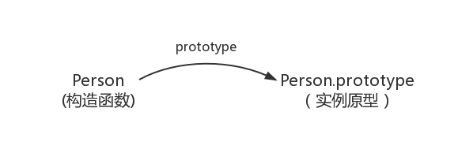
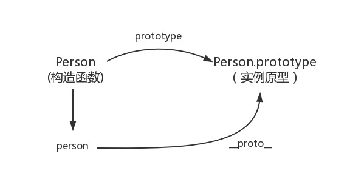
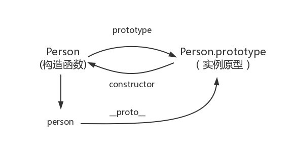
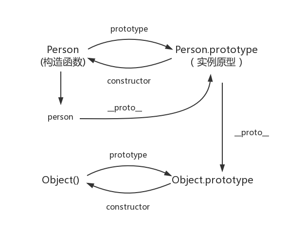
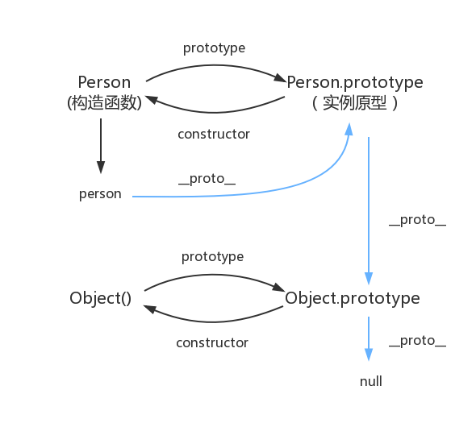
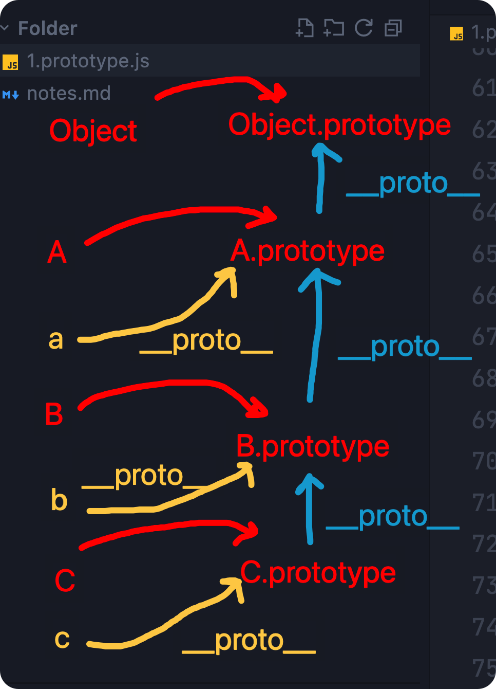

# 5.面向对象编程思想

> 原文链接：[飞书原文](https://u19tul1sz9g.feishu.cn/docx/KjQMdj6WToY6IexyNSzcKkgHnGf)

[引用：20260207 随堂笔记与源码资料](https://www.feishu.cn/docx/HsQBdlBmsocCuExnY9Jcy99Sn2e)
[本地资源：5.oop-notes](<../../20260207 随堂笔记与源码资料-压缩包/2.前端核心原理知识进阶/5.oop-notes>)

## 课程目标

> **💡 提示**
>
> - 初中级：
>
>   1. **掌握原型继承的基本概念**：理解原型和原型链的关系，掌握其核心概念。
>   2. **掌握面向对象编程（OOP）思想**：了解面向对象编程的三大特性——封装、继承、多态。
>   3. **了解原型实现继承的方式**：能够通过原型链实现对象的继承。
> - 高级：
>
>   1. **深入理解面向对象编程思想**：精通面向对象设计思想，能根据实际需求选择并应用该编程模式。
>   2. **掌握常见面向对象编程考点**：熟悉原型继承的实现、以及 `call` 和 `apply` 的原理与使用。
>   3. **OOP 实践应用**：能够在实际项目中灵活运用面向对象思想解决问题。

## 补充资料

- OOP：https://medium.com/@priyam_mondal/exploring-object-oriented-programming-in-javascript-25ebb1cc13c9
- 继承与原型链 MDN：https://developer.mozilla.org/zh-CN/docs/Web/JavaScript/Inheritance_and_the_prototype_chain
- V8 实现：https://chromium.googlesource.com/v8/v8/+/4c7cccf9f40c063e2d6410fc35664a0efd1acb46/src/builtins/builtins.h#371
- 内联缓存优化 class 初始化：https://v8.dev/blog/faster-class-features
- 构造器实现：https://source.chromium.org/chromium/chromium/src/+/main:v8/src/builtins/builtins-constructor.h;l=6?q=constructor&ss=chromium%2Fchromium%2Fsrc:v8%2Fsrc%2Fbuiltins%2F
- babel 转换场：https://babeljs.io/repl


## 相关面试真题

### 解释 JavaScript 中的原型继承概念

**答案**

原型继承是 JavaScript 中的一种特性，通过它对象可以从其他对象继承属性和方法。每个 JavaScript 对象都有一个 `prototype` 属性，它引用另一个对象，称为它的原型。这个链条一直延续到 `null`。


```JavaScript
function Person(name, age) {
    this.name = name;
    this.age = age;
}

Person.prototype.greet = function() {
    return `Hello, my name is ${this.name}`;
};

const john = new Person('John', 30);
console.log(john.greet()); // "Hello, my name is John"
```


在这个例子中，`Person.prototype.greet` 是一个方法，它被所有 `Person` 的实例共享。当调用 `john.greet()` 时，JavaScript 会在 `john` 对象中查找 `greet` 方法。如果找不到，它会沿着原型链向上查找，直到在 `Person.prototype` 上找到 `greet`。


### 解释 JavaScript 中 `class` 和 `prototype` 的区别

**答案**

`class` 和 `prototype` 是在 JavaScript 中声明对象的两种不同方式。虽然它们最终实现相同的目标，但方式不同。


- **Class（类）：** 在 ES6 中引入，`class` 语法提供了一种更简洁和易懂的语法来创建对象和处理继承。然而，它是基于原型继承方式的语法糖。
- **Prototype（原型）：** 这是 JavaScript 中创建对象和处理继承的原始方法，涉及手动设置原型链。


#### 使用 `class` 的示例:

```JavaScript
class Animal {
    constructor(name) {
        this.name = name;
    }
    
    speak() {
        return `${this.name} makes a sound.`;
    }
}

class Dog extends Animal {
    speak() {
        return `${this.name} barks.`;
    }
}

const dog = new Dog('Rex');
console.log(dog.speak()); // "Rex barks."
```


#### 使用 `prototype` 的示例:

```JavaScript
function Animal(name) {
    this.name = name;
}

Animal.prototype.speak = function() {
    return `${this.name} makes a sound.`;
};

function Dog(name) {
    Animal.call(this, name); // 继承属性
}

Dog.prototype = Object.create(Animal.prototype); // 继承方法
Dog.prototype.constructor = Dog;

Dog.prototype.speak = function() {
    return `${this.name} barks.`;
};

const dog = new Dog('Rex');
console.log(dog.speak()); // "Rex barks."
```


### 请手写 call、apply、bind

**答案**

[引用：5.面向对象编程思想](https://www.feishu.cn/docx/KjQMdj6WToY6IexyNSzcKkgHnGf)

## 对象基本概念

> Everything is object （万物皆对象）


### 什么是对象

对象到底是什么，我们可以从两个层面来理解。

- 对象是单个事物的抽象。

一本书、一辆汽车、一个人都可以是对象，一个数据库、一张网页、一个与远程服务器的连接也可以是对象。当实物被抽象成对象，实物之间的关系就变成了对象之间的关系，从而就可以模拟现实情况，针对对象进行编程。


- 对象是一个载体，承载了属性（property）和方法（method）。

属性是对象的状态，方法是对象的行为（完成某种任务）。比如，我们可以把动物抽象为animal对象，使用“属性”记录具体是那一种动物，使用“方法”表示动物的某种行为（奔跑、捕猎、休息等等）。

在实际开发中，对象是一个抽象的概念，可以将其简单理解为：数据集或功能集。

ECMAScript-262 把对象定义为：无序属性的集合，其属性可以包含基本值、对象或者函数。

严格来讲，这就相当于说对象是一组没有特定顺序的值。对象的每个属性或方法都有一个名字，而每个名字都映射到一个值。

提示：每个对象都是基于一个引用类型创建的，这些类型可以是系统内置的原生类型，也可以是开发人员自定义的类型。


### 什么是面向对象


面向对象不是新的东西，它只是过程式代码的一种**高度封装**，目的在于提高代码的开发效率和可维 护性。


面向对象编程 —— **Object Oriented Programming**，简称 **OOP** ，是一种编程开发思想。

它将真实世界各种复杂的关系，抽象为一个个对象，然后由对象之间的分工与合作，完成对真实世界的模拟。

在面向对象程序开发思想中，每一个对象都是功能中心，具有明确分工，可以完成接受信息、处理数据、发出信息等任务。

因此，面向对象编程具有灵活、代码可复用、高度模块化等特点，容易维护和开发，比起由一系列函数或指令组成的传统的过程式编程（procedural programming），更适合多人合作的大型软件项目。


面向对象与面向过程：

- 面向过程就是亲力亲为，事无巨细，面面俱到，步步紧跟，有条不紊
- 面向对象就是找一个对象，指挥得结果
- 面向对象将执行者转变成指挥者
- 面向对象不是面向过程的替代，而是面向过程的封装


面向对象的特性：

- 封装
- 继承
- 多态


### 特性说明

#### 封装 (Encapsulation)


封装是将对象的属性和方法包装在一个类中，并通过访问控制来隐藏对象的内部状态，只暴露必要的方法给外部使用。


```JavaScript
class Person {
    constructor(name, age) {
        this._name = name; // 使用下划线表示私有属性
        this._age = age;
    }

    // Getter 和 Setter 方法用于访问和修改私有属性
    get name() {
        return this._name;
    }

    set name(newName) {
        if (typeof newName === 'string' && newName.length > 0) {
            this._name = newName;
        } else {
            console.error('Invalid name');
        }
    }

    get age() {
        return this._age;
    }

    set age(newAge) {
        if (typeof newAge === 'number' && newAge > 0) {
            this._age = newAge;
        } else {
            console.error('Invalid age');
        }
    }

    // 公共方法
    greet() {
        return `Hello, my name is ${this._name} and I am ${this._age} years old.`;
    }
}

const john = new Person('John', 30);
console.log(john.greet()); // "Hello, my name is John and I am 30 years old."
john.name = 'Doe';
console.log(john.greet()); // "Hello, my name is Doe and I am 30 years old."
```


#### 继承 (Inheritance)


继承是指一个类（子类）从另一个类（父类）继承属性和方法，从而实现代码的重用。


```JavaScript
class Animal {
    constructor(name) {
        this.name = name;
    }

    speak() {
        return `${this.name} makes a sound.`;
    }
}

class Dog extends Animal {
    constructor(name, breed) {
        super(name); // 调用父类的构造函数
        this.breed = breed;
    }

    speak() {
        return `${this.name} barks.`;
    }
}

const dog = new Dog('Rex', 'German Shepherd');
console.log(dog.speak()); // "Rex barks."
```


#### 多态 (Polymorphism)


多态性是指在继承关系中，子类可以覆盖父类的方法，并且子类的实例可以被当作父类的实例使用。

```JavaScript
class Animal {
    constructor(name) {
        this.name = name;
    }

    speak() {
        return `${this.name} makes a sound.`;
    }
}

class Dog extends Animal {
    speak() {
        return `${this.name} barks.`;
    }
}

class Cat extends Animal {
    speak() {
        return `${this.name} meows.`;
    }
}

const animals = [new Dog('Rex'), new Cat('Whiskers')];

animals.forEach(animal => {
    console.log(animal.speak());
});

// 输出:
// "Rex barks."
// "Whiskers meows."
```


在上述代码中，`Dog` 和 `Cat` 类都继承自 `Animal` 类，并分别覆盖了父类的 `speak` 方法。

在遍历 `animals` 数组时，尽管实际对象既可能是 `Dog` ，又可能是 `Cat` ，但因为调用的都是父级继承过来的 `speak` 方法，所以正常运行，这就是多态性，通常多态用于在父类中定义对外统一的标准，子类需根据父类实现自己对应的方法。


## 原型 & 原型链

### 定义构造函数

我们先使用构造函数创建一个对象：

```JavaScript
function Person() {

}
var person = new Person();
person.name = 'heyi';
console.log(person.name) // heyi
```

在这个例子中，Person 就是一个构造函数，我们使用 new 创建了一个实例对象 person。

### prototype

每个函数都有一个 `prototype` 属性，比如：

```JavaScript
function Person() {

}
// 虽然写在注释里，但是你要注意：
// prototype是函数才会有的属性
Person.prototype.name = 'heyi';

var person1 = new Person();
var person2 = new Person();

console.log(person1.name) // heyi
console.log(person2.name) // heyi
```

那这个函数的 `prototype` 属性到底指向的是什么呢？是这个函数的原型吗？

其实，函数的 `prototype` 属性指向了一个对象，这个对象正是调用该构造函数而创建的实例的原型，也就是这个例子中的 `person1` 和 `person2` 的原型。

那什么是原型呢？你可以这样理解：每一个JavaScript对象(null除外)在创建的时候就会与之关联另一个对象，这个对象就是我们所说的原型，每一个对象都会从原型"继承"属性。

用一张图表示构造函数和实例原型之间的关系：



这里用 Object.prototype 表示实例原型。

那么该怎么表示实例与实例原型，也就是 `person` 和 Person.`prototype` 之间的关系呢？


### **\_\_proto\_\_**

这是每一个JavaScript对象(除了 null )都具有的一个属性，叫`__proto__`，这个属性会指向该对象的原型。

```JavaScript
function Person() {

}
var person = new Person();

console.log(person.__proto__ === Person.prototype); // true
```



既然实例对象和构造函数都可以指向原型，那么原型是否有属性指向构造函数或者实例呢？


### constructor

指向实例倒是没有，因为一个构造函数可以生成多个实例，但是原型指向构造函数是有的：`constructor`，每个原型都有一个 `constructor` 属性指向关联的构造函数

```JavaScript
function Person() {

}
console.log(Person === Person.prototype.constructor); // true
```



所以，这里可以得到：

```JavaScript
function Person() {

}

var person = new Person();

console.log(person.__proto__ == Person.prototype) // true

console.log(Person.prototype.constructor == Person) // true

console.log(Object.getPrototypeOf(person) === Person.prototype) // true
```


### 实例与原型

当读取实例的属性时，如果找不到，就会查找与对象关联的原型中的属性，如果还查不到，就去找原型的原型，一直找到最顶层为止。

举个例子：

```JavaScript
function Person() {

}

Person.prototype.name = 'heyi';

var person = new Person();

person.name = 'heyi';
console.log(person.name) // heyi

delete person.name;
console.log(person.name) // heyi
```

在这个例子中，我们给实例对象 person 添加了 name 属性，当我们打印 `person.name` 的时候，结果自然为 `heyi`。

但是当我们删除了 person 的 name 属性时，读取 `person.name`，从 person 对象中找不到 name 属性就会从 person 的原型也就是 `person.__proto__` ，也就是 `Person.prototype`中查找，结果为 `heyi`。


### 原型的原型

如果在原型上还没有找到呢？原型的原型又是什么呢？

```JavaScript
var obj = new Object();
obj.name = 'heyi'
console.log(obj.name) // heyi
```

其实原型对象就是通过 Object 构造函数生成的，结合之前所讲，实例的 **`proto`** 指向构造函数的 `prototype` ，所以我们再更新下关系图：



### 原型链

那 `Object.prototype` 的原型呢？

null，我们可以打印：

```JavaScript
console.log(Object.prototype.__proto__ === null) // true
```

然而 null 究竟代表了什么呢？

null 表示“没有对象”，即该处不应该有值。

所以 `Object.prototype.__proto__` 的值为 null 跟 `Object.prototype` 没有原型，其实表达了一个意思。

所以查找属性的时候查到 `Object.prototype` 就可以停止查找了。

最后一张关系图也可以更新为：



其中，蓝色为原型链



### 其他

#### constructor

首先是 `constructor` 属性：

```JavaScript
function Person() {

}
var person = new Person();

console.log(person.constructor === Person); // true
```

当获取 `person.constructor` 时，其实 person 中并没有 constructor 属性,当不能读取到constructor 属性时，会从 person 的原型也就是 `Person.prototype` 中读取，正好原型中有该属性，所以：

```JavaScript
person.constructor === Person.prototype.constructor
```

#### \_\_proto\_\_

绝大部分浏览器都支持这个非标准的方法访问原型，然而它并不存在于 `Person.prototype` 中，实际上，它是来自于 `Object.prototype` ，与其说是一个属性，不如说是一个 `getter/setter`，当使用 `obj.__proto__` 时，可以理解成返回了 `Object.getPrototypeOf(obj)`。


#### 继承

关于继承，前面提到“每一个对象都会从原型‘继承’属性”，实际上，继承是一个十分具有迷惑性的说法，引用《你不知道的JavaScript》中的话，就是：

> 继承意味着复制操作，然而 JavaScript 默认并不会复制对象的属性，相反，JavaScript 只是在两个对象之间创建一个关联，这样，一个对象就可以通过委托访问另一个对象的属性和函数，所以与其叫继承，委托的说法反而更准确些。


## **创建对象的多种方式&优缺点**

### **工厂模式**

```JavaScript
function createPerson(name) {
    var o = new Object();
    o.name = name;
    o.getName = function () {
        console.log(this.name);
    };

    return o;
}

var person1 = createPerson('Heyi');
```

优点：简单；

缺点：对象无法识别，因为所有的实例都指向一个原型；

### **构造函数模式**

```JavaScript
function Person(name) {
    this.name = name;
    this.getName = function () {
        console.log(this.name);
    };
}

var person1 = new Person('Heyi');
```

优点：实例可以识别为一个特定的类型；

缺点：每次创建实例时，每个方法都要被创建一次；

#### **优化**

```JavaScript
function Person(name) {
    this.name = name;
    this.getName = getName;
}

function getName() {
    console.log(this.name);
}

var person1 = new Person('Heyi');
```

解决了每个方法都要重新创建的问题

### **原型模式**

```JavaScript
function Person(name) {

}

Person.prototype.name = 'heyi';
Person.prototype.getName = function () {
    console.log(this.name);
};

var person1 = new Person();
```

优点：方法不会重新创建；

缺点：

1. 所有的属性和方法都共享；
2. 不能初始化参数；

#### **优化**

```JavaScript
function Person(name) {

}

Person.prototype = {
    name: 'heyi',
    getName: function () {
        console.log(this.name);
    }
};

var person1 = new Person();
```

优点：封装清晰点；

缺点：重写了原型，丢失了constructor属性；

#### 进一步**优化**

```JavaScript
function Person(name) {

}

Person.prototype = {
    constructor: Person,
    name: 'Heyi',
    getName: function () {
        console.log(this.name);
    }
};

var person1 = new Person();
```

优点：实例可以通过constructor属性找到所属构造函数；

缺点：

1. 所有的属性和方法都共享；
2. 不能初始化参数；

### **组合模式**

```JavaScript
function Person(name) {
    this.name = name;
}

Person.prototype = {
    constructor: Person,
    getName: function () {
        console.log(this.name);
    }
};

var person1 = new Person();
```

优点：该共享的共享，该私有的私有，使用最广泛的方式；

缺点：希望写在一个地方，即更好的封装性；

#### **动态原型**

```JavaScript
function Person(name) {
    this.name = name;
    if (typeof this.getName != "function") {
        Person.prototype.getName = function () {
            console.log(this.name);
        }
    }
}

var person1 = new Person();
```

注意：使用动态原型模式时，不能用对象字面量重写原型

```JavaScript
function Person(name) {
    this.name = name;
    if (typeof this.getName != "function") {
        Person.prototype = {
            constructor: Person,
            getName: function () {
                console.log(this.name);
            }
        }
    }
}

var person1 = new Person('heyi');
var person2 = new Person('heyi2');

// 报错 并没有该方法
person1.getName();

// 注释掉上面的代码，这句是可以执行的。
person2.getName();
```

开始执行`var person1 = new Person('heyi')`


#### new 的执行过程

1. 首先新建一个对象；
2. 然后将对象的原型指向 `Person.prototype`；
3. 然后 `Person.apply(obj)`；
4. 返回这个对象；


注意这个时候，回顾下 apply 的实现步骤，会执行 obj.Person 方法，这个时候就会执行 if 语句里的内容，注意构造函数的 prototype 属性指向了实例的原型，使用字面量方式直接覆盖 `Person.prototype`，并不会更改实例的原型的值，person1 依然是指向了以前的原型，而不是 `Person.prototype`。而之前的原型是没有 getName 方法的，所以就报错了。

如果你就是想用字面量方式写代码，可以尝试下这种：

```JavaScript
function Person(name) {
    this.name = name;
    if (typeof this.getName != "function") {
        Person.prototype = {
            constructor: Person,
            getName: function () {
                console.log(this.name);
            }
        }

        return new Person(name);
    }
}

var person1 = new Person('heyi');
var person2 = new Person('heyi2');

person1.getName(); // heyi
person2.getName();  // heyi2
```


## 继承实现

以下是每种继承方式的更详细讲解及其优缺点：


###  原型链继承

原型链继承是 JavaScript 中最基本的继承方式。通过让子类的原型对象等于父类的实例，可以实现属性和方法的继承。

```JavaScript
function Parent () {
    this.name = 'heyi';
}

Parent.prototype.getName = function () {
    console.log(this.name);
}

function Child () {

}

Child.prototype = new Parent();

var child1 = new Child();

console.log(child1.getName()) // heyi
```

但是稍微分析一下就会发现问题：

**引用类型的属性被所有实例共享，例如：**

```JavaScript
function Parent () {
    this.names = ['heyi', 'heyi2'];
}

function Child () {

}

Child.prototype = new Parent();

var child1 = new Child();

child1.names.push('test');

console.log(child1.names); // ["heyi", "heyi2", "test"]

var child2 = new Child();

console.log(child2.names); // ["heyi", "heyi2", "test"]
```

**优点**：

- 简单易于实现。


**缺点**：

- 引用类型的属性被所有实例共享，例如数组或对象，如果一个实例改变了这个属性，其他实例的相同属性也会被改变。
- 创建子类实例时，无法向父类构造函数传递参数，这限制了在实例化时对父类构造函数的复用。


###  借用构造函数（经典继承）

这种继承方式通过在子类构造函数中调用父类构造函数来实现继承。可以使用 `call` 或 `apply` 方法将父类构造函数内的 `this` 绑定到子类实例上。

```JavaScript
function Parent () {
    this.names = ['heyi', 'heyi2'];
}

function Child () {
    Parent.call(this);
}

var child1 = new Child();

child1.names.push('test');

console.log(child1.names); // ["heyi", "heyi2", "test"]

var child2 = new Child();

console.log(child2.names); // ["heyi", "heyi2"]
```

这种方式同样存在问题，例如：

```JavaScript
function Parent (name) {
    this.name = name;
}

function Child (name) {
    Parent.call(this, name);
}

var child1 = new Child('heyi');

console.log(child1.name); // heyi

var child2 = new Child('heyi2');

console.log(child2.name); // heyi2
```

**优点**：

- 解决了原型链继承中子类实例共享引用类型属性的问题。
- 可以在子类中向父类构造函数传递参数。


**缺点**：

- 方法都在构造函数中定义，无法实现函数复用，每次创建实例都会创建一遍方法。
- 只能继承父类的实例属性和方法，无法继承父类原型上的属性和方法。


### 组合继承

组合继承结合了原型链继承和借用构造函数的优点，通过调用父类构造函数继承属性并通过原型链继承方法。

```JavaScript
function Parent (name) {
    this.name = name;
    this.colors = ['red', 'blue', 'green'];
}

Parent.prototype.getName = function () {
    console.log(this.name)
}

function Child (name, age) {

    Parent.call(this, name);
    
    this.age = age;

}

// 处理原型
// Child.prototype = Parent.prototype;
// Child.prototype.constructor = Child;
Child.prototype.__proto__ = Parent.prototype; // ✅

var child1 = new Child('Heyi', '18');

child1.colors.push('black');

console.log(child1.name); // Heyi
console.log(child1.age); // 18
console.log(child1.colors); // ["red", "blue", "green", "black"]

var child2 = new Child('daisy', '20');

console.log(child2.name); // daisy
console.log(child2.age); // 20
console.log(child2.colors); // ["red", "blue", "green"]
```

**优点**：

- 可以继承父类的原型上的属性和方法，也可以继承实例属性。
- 实例之间不会共享引用类型属性。


**缺点**：

- 构造函数会被调用两次，一次是在创建子类原型的时候，一次是在子类构造函数内部，这可能导致某些父类属性被重复创建。


### 原型式继承（自行了解）

这种继承方式是通过克隆一个对象来实现继承。可以使用 `Object.create` 实现更简洁的原型式继承。

```JavaScript
function createObj(o) {
    function F(){}
    F.prototype = o;
    return new F();
}
```

问题也比较明显，包含引用类型的属性值始终都会共享相应的值，这点跟原型链继承一样。例如：

```JavaScript
var person = {
    name: 'Heyi',
    friends: ['daisy', 'kelly']
}

var person1 = createObj(person);
var person2 = createObj(person);

person1.name = 'person1';
console.log(person2.name); // Heyi

person1.friends.push('taylor');
console.log(person2.friends); // ["daisy", "kelly", "taylor"]
```

**优点**：

- 对于不需要单独创建构造函数，但仍然需要在对象间共享信息的场合非常有用。


**缺点**：

- 包含引用类型的属性值始终会共享相应的值，这点与原型链继承相似。
- 无法实现函数复用（每个方法都需要在每个实例上重新定义）。


### 寄生式继承（自行了解）

寄生式继承是一种使用工厂函数来增强对象然后返回这个对象的继承方式。

```JavaScript
function createObj (o) {
    var clone = Object.create(o);
    clone.sayName = function () {
        console.log('hi');
    }
    return clone;
}
```

**优点**：

- 可以在不影响对象的情况下，为对象添加函数或者属性，用于增强对象。


**缺点**：

- 跟借用构造函数模式一样，每次创建对象都会创建一遍方法，无法实现函数复用。


### 最好的实现

#### class 基本语法转换

```JavaScript
class Person {
  constructor(name) {
    this.name = name;
  }

  greet() {
    console.log(this.name);
  }
}

```

构造器语法

```JavaScript
// 检测变量类型
function _typeof(o) {
  "@babel/helpers - typeof";
  return (
    (_typeof =
      typeof Symbol === "function" && typeof Symbol.iterator === "symbol"
        ? function (o) {
            return typeof o;
          }
        : function (o) {
            return o && typeof Symbol === "function" && o.constructor === Symbol && o !== Symbol.prototype
              ? "symbol"
              : typeof o;
          }),
    _typeof(o)
  );
}

// 检查实例是否属于特定构造函数
function _classCallCheck(instance, Constructor) {
  if (!(instance instanceof Constructor)) {
    throw new TypeError("Cannot call a class as a function");
  }
}

// 定义属性
function _defineProperties(target, props) {
  for (var i = 0; i < props.length; i++) {
    var descriptor = props[i];
    descriptor.enumerable = descriptor.enumerable || false;
    descriptor.configurable = true;
    if ("value" in descriptor) descriptor.writable = true;
    Object.defineProperty(target, _toPropertyKey(descriptor.key), descriptor);
  }
}

// 创建类
function _createClass(Constructor, protoProps, staticProps) {
  if (protoProps) _defineProperties(Constructor.prototype, protoProps);
  if (staticProps) _defineProperties(Constructor, staticProps);
  Object.defineProperty(Constructor, "prototype", { writable: false });
  return Constructor;
}

// 将属性键转换为字符串或符号
function _toPropertyKey(t) {
  var i = _toPrimitive(t, "string");
  return _typeof(i) === "symbol" ? i : i + "";
}

// 将对象转换为原始值
function _toPrimitive(t, r) {
  if (_typeof(t) !== "object" || !t) return t;
  var e = t[Symbol.toPrimitive];
  if (typeof e !== "undefined") {
    var i = e.call(t, r || "default");
    if (_typeof(i) !== "object") return i;
    throw new TypeError("@@toPrimitive must return a primitive value.");
  }
  return r === "string" ? String : Number(t);
}

// 定义 Person 类
var Person = /*#__PURE__*/ (function () {
  function Person(name) {
    _classCallCheck(this, Person);
    this.name = name;
  }
  return _createClass(Person, [
    {
      key: "greet",
      value: function greet() {
        console.log(this.name);
      }
    }
  ]);
})();

```

#### 继承语法转换

```JavaScript
class Person {
        constructor(name) {
            this.name = name
    }
}

class Student extends Person {}
```

转换后的代码

```JavaScript
function _typeof(o) {
  "@babel/helpers - typeof";
  return (
    (_typeof =
      "function" == typeof Symbol && "symbol" == typeof Symbol.iterator
        ? function (o) {
            return typeof o;
          }
        : function (o) {
            return o &&
              "function" == typeof Symbol &&
              o.constructor === Symbol &&
              o !== Symbol.prototype
              ? "symbol"
              : typeof o;
          }),
    _typeof(o)
  );
}
function _callSuper(t, o, e) {
  return (
    (o = _getPrototypeOf(o)),
    _possibleConstructorReturn(
      t,
      _isNativeReflectConstruct()
        ? Reflect.construct(o, e || [], _getPrototypeOf(t).constructor)
        : o.apply(t, e)
    )
  );
}
function _possibleConstructorReturn(t, e) {
  if (e && ("object" == _typeof(e) || "function" == typeof e)) return e;
  if (void 0 !== e)
    throw new TypeError(
      "Derived constructors may only return object or undefined"
    );
  return _assertThisInitialized(t);
}
function _assertThisInitialized(e) {
  if (void 0 === e)
    throw new ReferenceError(
      "this hasn't been initialised - super() hasn't been called"
    );
  return e;
}
function _isNativeReflectConstruct() {
  try {
    var t = !Boolean.prototype.valueOf.call(
      Reflect.construct(Boolean, [], function () {})
    );
  } catch (t) {}
  return (_isNativeReflectConstruct = function _isNativeReflectConstruct() {
    return !!t;
  })();
}
function _getPrototypeOf(t) {
  return (
    (_getPrototypeOf = Object.setPrototypeOf
      ? Object.getPrototypeOf.bind()
      : function (t) {
          return t.__proto__ || Object.getPrototypeOf(t);
        }),
    _getPrototypeOf(t)
  );
}
function _inherits(t, e) {
  if ("function" != typeof e && null !== e)
    throw new TypeError("Super expression must either be null or a function");
  (t.prototype = Object.create(e && e.prototype, {
    constructor: { value: t, writable: !0, configurable: !0 }
  })),
    Object.defineProperty(t, "prototype", { writable: !1 }),
    e && _setPrototypeOf(t, e);
}
function _setPrototypeOf(t, e) {
  return (
    (_setPrototypeOf = Object.setPrototypeOf
      ? Object.setPrototypeOf.bind()
      : function (t, e) {
          return (t.__proto__ = e), t;
        }),
    _setPrototypeOf(t, e)
  );
}
function _defineProperties(e, r) {
  for (var t = 0; t < r.length; t++) {
    var o = r[t];
    (o.enumerable = o.enumerable || !1),
      (o.configurable = !0),
      "value" in o && (o.writable = !0),
      Object.defineProperty(e, _toPropertyKey(o.key), o);
  }
}
function _createClass(e, r, t) {
  return (
    r && _defineProperties(e.prototype, r),
    t && _defineProperties(e, t),
    Object.defineProperty(e, "prototype", { writable: !1 }),
    e
  );
}
function _toPropertyKey(t) {
  var i = _toPrimitive(t, "string");
  return "symbol" == _typeof(i) ? i : i + "";
}
function _toPrimitive(t, r) {
  if ("object" != _typeof(t) || !t) return t;
  var e = t[Symbol.toPrimitive];
  if (void 0 !== e) {
    var i = e.call(t, r || "default");
    if ("object" != _typeof(i)) return i;
    throw new TypeError("@@toPrimitive must return a primitive value.");
  }
  return ("string" === r ? String : Number)(t);
}
function _classCallCheck(a, n) {
  if (!(a instanceof n))
    throw new TypeError("Cannot call a class as a function");
}
var Person = /*#__PURE__*/ _createClass(function Person(name) {
  _classCallCheck(this, Person);
  this.name = name;
});
var Student = /*#__PURE__*/ (function (_Person) {
  function Student() {
    _classCallCheck(this, Student);
    return _callSuper(this, Student, arguments);
  }
  _inherits(Student, _Person);
  return _createClass(Student);
})(Person);

```


## 面向对象编程思想实践

前端领域，面向对象编程思想用得非常广泛，我们熟知的几个库——webpack、three.js 均使用 OOP 思想进行模块封装。

### Webpack

Webpack 中两个核心概念，Compiler 和 Compilation 均是类定义方式封装。

Compiler：https://github.com/webpack/webpack/blob/ac8e83a4a2984ed977fd6c23a609da5cb43da492/lib/Compiler.js#L134

Compilation：https://github.com/webpack/webpack/blob/ac8e83a4a2984ed977fd6c23a609da5cb43da492/lib/Compilation.js#L431


### three.js

在 three.js 中，大量使用了面向对象编程思想进行模块封装，例如核心的几个对象：场景（Scene）、相机（Camera）、几何体（Geometry）、材质（Material）等。

Three.js 中的对象之间存在着继承关系。例如，Mesh 类继承自 Object3D 类，使得网格对象具有了对象的基本属性和方法，并且可以通过继承来扩展和定制行为。

场景（Scene）：https://github.com/mrdoob/three.js/blob/2f55b3553be988ca7666896e300557957b534a45/src/scenes/Scene.js#L4

相机（Camera）：https://github.com/mrdoob/three.js/blob/2f55b3553be988ca7666896e300557957b534a45/src/cameras/Camera.js#L5

几何体（Geometry）：https://github.com/mrdoob/three.js/blob/2f55b3553be988ca7666896e300557957b534a45/src/core/BufferGeometry.js#L22

材质（Material）：https://github.com/mrdoob/three.js/blob/2f55b3553be988ca7666896e300557957b534a45/src/materials/Material.js#L8


## **手写 call、apply、bind 和 new**

### **手写 call**

> call() ：在使用一个指定的 this 值和若干个指定的参数值的前提下调用某个函数或方法。


```JavaScript
let foo = {
    value: 1
};

function bar() {
    console.log(this.value);
}

bar.call(foo); // 1
```

注意两点：

1. call 改变了 this 的指向，指向到 foo；
2. bar 函数执行了；

#### **第一步**

上述方式等同于：

```JavaScript
let foo = {
    value: 1,
    bar: function() {
        console.log(this.value)
    }
};

foo.bar(); // 1
```

这个时候 this 就指向了 foo，但是这样却给 foo 对象本身添加了一个属性，所以们用 delete 再删除它即可。

所以我们模拟的步骤可以分为：


1. 将函数设为对象的属性；
2. 执行该函数；
3. 删除该函数；


以上个例子为例，就是：

```JavaScript
// 第一步
// fn 是对象的属性名，反正最后也要删除它，所以起什么都可以。
foo.fn = bar
// 第二步
foo.fn()
// 第三步
delete foo.fn
```

根据上述思路，提供一版：

```JavaScript
// 第一版
Function.prototype.call2 = function(context) {
    // 首先要获取调用call的函数，用this可以获取
    context.fn = this;
    context.fn();
    delete context.fn;
}

// 测试一下
 let foo = {
    value: 1
};

function bar() {
    console.log(this.value);
}

bar.call2(foo); // 1
```

#### **第二步**

call除了可以指定this，还可以指定参数

```JavaScript
var foo = {
    value: 1
};

function bar(name, age) {
    console.log(name)
    console.log(age)
    console.log(this.value);
}

bar.call(foo, 'Heyi', 18);
// Heyi
// 18
// 1
```

可以从 Arguments 对象中取值，取出第二个到最后一个参数，然后放到一个数组里。

上述代码的Arguments中取第二个到最后一个的参数

```JavaScript
// 以上个例子为例，此时的arguments为：
// arguments = {
//      0: foo,
//      1: 'Heyi',
//      2: 18,
//      length: 3
// }
// 因为arguments是类数组对象，所以可以用for循环
var args = [];
for(var i = 1, len = arguments.length; i < len; i++) {
    args.push('arguments[' + i + ']');
}

// 执行后 args为 ["arguments[1]", "arguments[2]", "arguments[3]"]
```

接下来使用eval拼接成一个函数

```JavaScript
eval('context.fn(' + args +')')
```

考虑到目前大部分浏览器在console中限制eval的执行，也可以使用rest

此处代码为：

```JavaScript
// 第二版
Function.prototype.call2 = function(context) {
    context.fn = this;
    let arg = [...arguments].slice(1)
    context.fn(...arg)
    delete context.fn;
}

// 测试一下
var foo = {
    value: 1
};

function bar(name, age) {
    console.log(name)
    console.log(age)
    console.log(this.value);
}

bar.call2(foo, 'Heyi', 18); 
// Heyi
// 18
// 1
```

#### **第三步**

1. this 参数可以传 null，当为 null 的时候，视为指向 window

举个例子：

```JavaScript
var value = 1;

function bar() {
    console.log(this.value);
}

bar.call(null); // 1
```

1. 针对函数，可以实现返回值

```JavaScript
var obj = {
    value: 1
}

function bar(name, age) {
    return {
        value: this.value,
        name: name,
        age: age
    }
}

console.log(bar.call(obj, 'Heyi', 18));
// Object {
//    value: 1,
//    name: 'Heyi',
//    age: 18
// }
```

这里

```JavaScript
// 第三版
Function.prototype.call2 = function (context) {
        var context = context || window;
    context.fn = this;

    let arg = [...arguments].slice(1)
    let result = context.fn(...arg)

    delete context.fn
    return result
}

// 测试一下
var value = 2;

var obj = {
    value: 1
}

function bar(name, age) {
    console.log(this.value);
    return {
        value: this.value,
        name: name,
        age: age
    }
}

bar.call2(null); // 2

console.log(bar.call2(obj, 'Heyi', 18));
// 1
// Object {
//    value: 1,
//    name: 'Heyi',
//    age: 18
// }
```

#### 最终实现

```JavaScript
Function.prototype.call2 = function(context, ...args) {
  // 判断是否是undefined和null
  if (typeof context === 'undefined' || context === null) {
    context = window
  }
  let fnSymbol = Symbol()
  context[fnSymbol] = this
  let fn = context[fnSymbol](...args)
  delete context[fnSymbol] 
  return fn
}
```

### **手写apply**

apply 的实现跟 call 类似，只是入参不一样，apply为数组

```JavaScript
Function.prototype.apply = function (context, arr) {
    var context = Object(context) || window;
    context.fn = this;

    var result;
    if (!arr) {
        result = context.fn();
    }
    else {
                result = context.fn(...arr)
    }

    delete context.fn
    return result;
}
```

最简化版方式：

```JavaScript
Function.prototype.apply2 = function(context, args) {
  // 判断是否是undefined和null
  if (typeof context === 'undefined' || context === null) {
    context = window
  }
  let fnSymbol = Symbol()
  context[fnSymbol] = this
  let fn = context[fnSymbol](...args)
  delete context[fnSymbol] 
  return fn
}
```

### **手写 bind**

> bind() 方法会创建一个新函数。当这个新函数被调用时，bind() 的第一个参数将作为它运行时的 this，之后的一序列参数将会在传递的实参前传入作为它的参数。

由此我们可以首先得出 bind 函数的两个特点：

1. 返回一个函数；
2. 可以传入参数；

#### **返回函数的模拟实现**

```JavaScript
var foo = {
    value: 1
};

function bar() {
    console.log(this.value);
}

// 返回了一个函数
var bindFoo = bar.bind(foo); 

bindFoo(); // 1
```

关于指定 this 的指向，我们可以使用 call 或者 apply 实现

```JavaScript
// 第一版
Function.prototype.bind2 = function (context) {
    var self = this;

    // 虑到绑定函数可能是有返回值的，加上return
    return function () {
        return self.apply(context);
    }

}
```

#### **传参的模拟实现**

接下来，关于参数的传递：

```JavaScript
var foo = {
    value: 1
};

function bar(name, age) {
    console.log(this.value);
    console.log(name);
    console.log(age);

}

var bindFoo = bar.bind(foo, 'daisy');
bindFoo('18');
// 1
// daisy
// 18
```

当需要传 name 和 age 两个参数时，可以在 bind 的时候，只传一个 name，在执行返回的函数的时候，再传另一个参数 age。

这里如果不适用rest，使用arguments进行处理：

```JavaScript
// 第二版
Function.prototype.bind2 = function (context) {

    var self = this;
    // 获取bind2函数从第二个参数到最后一个参数
    var args = Array.prototype.slice.call(arguments, 1);

    return function () {
        // 这个时候的arguments是指bind返回的函数传入的参数
        var bindArgs = Array.prototype.slice.call(arguments);
        return self.apply(context, args.concat(bindArgs));
    }
}
```

#### **构造函数效果的模拟实现**

bind 还有一个特点，就是

> 一个绑定函数也能使用new操作符创建对象：这种行为就像把原函数当成构造器。提供的 this 值被忽略，同时调用时的参数被提供给模拟函数。


也就是说当 bind 返回的函数作为构造函数的时候，bind 时指定的 this 值会失效，但传入的参数依然生效。举个例子：

```JavaScript
var value = 2;

var foo = {
    value: 1
};

function bar(name, age) {
    this.habit = 'shopping';
    console.log(this.value);
    console.log(name);
    console.log(age);
}

bar.prototype.friend = 'Heyi';

var bindFoo = bar.bind(foo, 'daisy');

var obj = new bindFoo('18');
// undefined
// daisy
// 18
console.log(obj.habit);
console.log(obj.friend);
// shopping
// Heyi
```

尽管在全局和 foo 中都声明了 value 值，最后依然返回了 undefind，说明绑定的 this 失效了

> 后文中new 的模拟实现，就会知道这个时候的 this 已经指向了 obj。


```JavaScript
// 第三版
Function.prototype.bind2 = function (context) {
    var self = this;
    var args = Array.prototype.slice.call(arguments, 1);

    var fBound = function () {
        var bindArgs = Array.prototype.slice.call(arguments);
        // 当作为构造函数时，this 指向实例，此时结果为 true，将绑定函数的 this 指向该实例，可以让实例获得来自绑定函数的值
        // 以上面的是 demo 为例，如果改成 `this instanceof fBound ? null : context`，实例只是一个空对象，将 null 改成 this ，实例会具有 habit 属性
        // 当作为普通函数时，this 指向 window，此时结果为 false，将绑定函数的 this 指向 context
        return self.apply(this instanceof fBound ? this : context, args.concat(bindArgs));
    }
    // 修改返回函数的 prototype 为绑定函数的 prototype，实例就可以继承绑定函数的原型中的值
    fBound.prototype = this.prototype;
    return fBound;
}
```

#### **构造函数效果的优化实现**

但是在这个写法中，我们直接将 `fBound.prototype = this.prototype`，我们直接修改 fBound.prototype 的时候，也会直接修改绑定函数的 prototype。这个时候，我们可以通过一个空函数来进行中转：

```JavaScript
// 第四版
Function.prototype.bind2 = function (context) {

    var self = this;
    var args = Array.prototype.slice.call(arguments, 1);

    var fNOP = function () {};

    var fBound = function () {
        var bindArgs = Array.prototype.slice.call(arguments);
        return self.apply(this instanceof fNOP ? this : context, args.concat(bindArgs));
    }

    fNOP.prototype = this.prototype;
    fBound.prototype = new fNOP();
    return fBound;
}
```

#### **最终版**

调用 bind 的不是函数时，提示错误：

```JavaScript
if (typeof this !== "function") {
  throw new Error("Function.prototype.bind - what is trying to be bound is not callable");
}
```

最终代码为：

```JavaScript
Function.prototype.bind2 = function (context) {

    if (typeof this !== "function") {
      throw new Error("Function.prototype.bind - what is trying to be bound is not callable");
    }

    var self = this;
    var args = Array.prototype.slice.call(arguments, 1);

    var fNOP = function () {};

    var fBound = function () {
        var bindArgs = Array.prototype.slice.call(arguments);
        return self.apply(this instanceof fNOP ? this : context, args.concat(bindArgs));
    }

    fNOP.prototype = this.prototype;
    fBound.prototype = new fNOP();
    return fBound;
}
```

**最简化版：**

```JavaScript
Function.prototype.myBind = function(context) {
// 判断是否是undefined 和 null
    if (typeof context === "undefined" || context === null) {
        context = window;
    }
    self = this;
    return function(...args) {
        return self.apply(context, args);
    }
}
```

### **手写模拟 new**

new 运算符创建一个用户定义的对象类型的实例或具有构造函数的内置对象类型之一

先看看 new 实现了哪些功能。

```JavaScript
function Person (name, age) {
    this.name = name;
    this.age = age;

    this.habit = 'Games';
}

Person.prototype.strength = 80;

Person.prototype.sayYourName = function () {
    console.log('I am ' + this.name);
}

var person = new Person('Heyi', '18');

console.log(person.name) // Heyi
console.log(person.habit) // Games
console.log(person.strength) // 60

person.sayYourName(); // I am Heyi
```

我们可以看到，实例 person 可以：

1. 访问到 Otaku 构造函数里的属性；
2. 访问到 Otaku.prototype 中的属性；

接下来，我们可以尝试着模拟一下了。

因为 new 是关键字，所以无法像 bind 函数一样直接覆盖，所以我们写一个函数，命名为 objectFactory，来模拟 new 的效果。用的时候是这样的：

```JavaScript
function Person () {
    ……
}

// 使用 new
var person = new Person(……);
// 使用 objectFactory
var person = objectFactory(Person, ……)
```

#### **初步实现**

因为 new 的结果是一个新对象，所以在模拟实现的时候，我们也要建立一个新对象，假设这个对象叫 obj，因为 obj 会具有 Person 构造函数里的属性，我们可以使用 `Person.apply(obj, arguments)`来给 obj 添加新的属性。

然后，实例的 **proto** 属性会指向构造函数的 prototype，也正是因为建立起这样的关系，实例可以访问原型上的属性

```JavaScript
// 第一版代码
function objectFactory() {
    var obj = new Object(),
    Constructor = [].shift.call(arguments);
    obj.__proto__ = Constructor.prototype;
    Constructor.apply(obj, arguments);

    return obj;

};
```

在这一版中，我们：

1. 用new Object() 的方式新建了一个对象 obj；
2. 取出第一个参数，就是我们要传入的构造函数。此外因为 shift 会修改原数组，所以 arguments 会被去除第一个参数；
3. 将 obj 的原型指向构造函数，这样 obj 就可以访问到构造函数原型中的属性；
4. 使用 apply，改变构造函数 this 的指向到新建的对象，这样 obj 就可以访问到构造函数中的属性；
5. 返回 obj；


测试下：

```JavaScript
function Person (name, age) {
    this.name = name;
    this.age = age;

    this.habit = 'Games';
}

Person.prototype.strength = 60;

Person.prototype.sayYourName = function () {
    console.log('I am ' + this.name);
}

function objectFactory() {
    var obj = new Object(),
    Constructor = [].shift.call(arguments);
    obj.__proto__ = Constructor.prototype;
    Constructor.apply(obj, arguments);
    return obj;
};

var person = objectFactory(Person, 'Heyi', '18')

console.log(person.name) // Heyi
console.log(person.habit) // Games
console.log(person.strength) // 60

person.sayYourName(); // I am Heyi
```

#### **最终实现**

假如构造函数有返回值

```JavaScript
function Person (name, age) {
    this.strength = 60;
    this.age = age;

    return {
        name: name,
        habit: 'Games'
    }
}

var person = new Person('Heyi', '18');

console.log(person.name) // Heyi
console.log(person.habit) // Games
console.log(person.strength) // undefined
console.log(person.age) // undefined
```

在这个例子中，构造函数返回了一个对象，在实例 person 中只能访问返回的对象中的属性。

而且还要注意一点，在这里我们是返回了一个对象，假如我们只是返回一个基本类型的值呢？

再举个例子：

```JavaScript
function Person (name, age) {
    this.strength = 60;
    this.age = age;

    return 'handsome boy';
}

var person = new Otaku('Heyi', '18');

console.log(person.name) // undefined
console.log(person.habit) // undefined
console.log(person.strength) // 60
console.log(person.age) // 18
```

这次尽管有返回值，但是相当于没有返回值进行处理。

所以我们还需要判断返回的值是不是一个对象，如果是一个对象，我们就返回这个对象，如果没有，我们该返回什么就返回什么。

```JavaScript
// 最终版的代码
function objectFactory() {
    var obj = new Object(),
    Constructor = [].shift.call(arguments);
    obj.__proto__ = Constructor.prototype;
    var ret = Constructor.apply(obj, arguments);
    return typeof ret === 'object' ? ret : obj;

};
```
