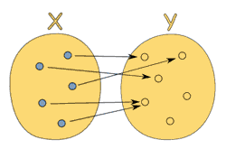
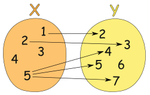
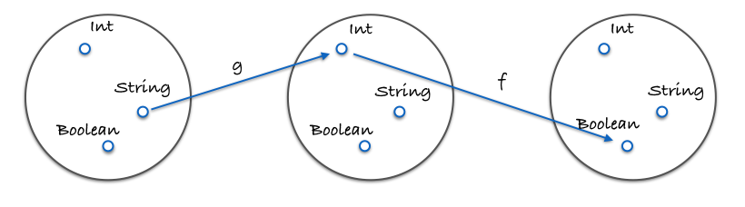
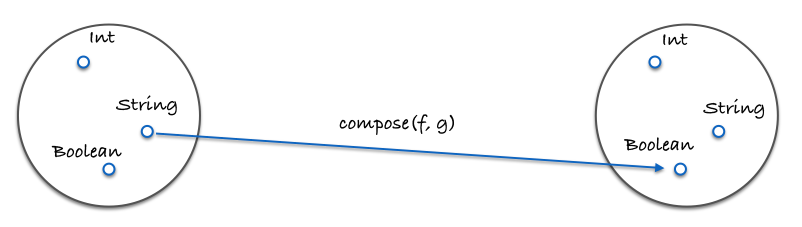

# 6.函数式编程思想

> 原文链接：[飞书原文](https://u19tul1sz9g.feishu.cn/docx/Bd9TdCL9soxwI4xA0oZcy5pXnng)

[引用：20260207 随堂笔记与源码资料](https://www.feishu.cn/docx/HsQBdlBmsocCuExnY9Jcy99Sn2e)
[本地资源：6.fp-notes](<../../20260207 随堂笔记与源码资料-压缩包/2.前端核心原理知识进阶/6.fp-notes>)

## 课程目标

> **💡 提示**
>
> - 初中级：
>
>   1. **理解函数式编程基本概念**：理解函数式编程的核心概念，如不可变性（Immutability）、纯函数（Pure Functions）、函数组合（Function Composition）以及高阶函数（Higher-Order Functions）
>   2. **掌握基本的函数式编程技巧**：能够使用 JavaScript 实现基本的函数式编程技术，例如`.map()`、`.reduce()`、`.filter()` 等数组方法进行数据处理和转换
>   3. **应用函数式编程解决简单问题**：能够通过函数式编程方法解决常见的编程问题，并深刻理解 React、Vue hooks 设计理论
> - 高级：
>
>   1. **深入理解函数式编程高级概念**：深入理解函数式编程概念，如 Monad、Currying、Lazy Evaluation 以及 Transducers，并能够在实际编程中运用这些概念
>   2. **掌握常见函数式编程考题**：掌握 compose、curry 的实现思路，并能快速手写
>   3. **FP 实践**：能在项目中熟练使用 FP 思想解决实际问题，理解 lodash/fp 库等的设计用意

## 补充资料

- FP 完整概念：https://en.wikipedia.org/wiki/Functional_programming
- 柯里化：https://zh.javascript.info/currying-partials
- V8 function optimization：https://erdem.pl/2019/08/v-8-function-optimization
- redux compose 实现：https://github.com/reduxjs/redux/blob/ef57856c0d16f0c99fce75d9252be60d1c72e15b/src/compose.ts#L31
- rxjs：https://rxjs.dev/guide/overview#values
- ramda：https://github.com/ramda/ramda
- rambda：https://selfrefactor.github.io/rambda/#/


## 相关面试真题

### 什么是纯函数？为什么它们在函数式编程中很重要？

**答案**

纯函数是一种函数，其返回值仅由其输入参数决定，不产生任何可观察的副作用，如修改全局对象或外部状态。纯函数具有以下特性：

- 确定性：相同的输入永远得到相同的输出。
- 无副作用：函数执行过程中不会改变任何外部状态。

纯函数在函数式编程中非常重要，因为它们提供了可预测性和可测试性。由于纯函数不依赖于且不修改外部环境的状态，它们在并发环境下特别有用，可以减少在多线程环境中由状态改变引起的错误。此外，纯函数的可组合性使得开发者能够构建更加模块化和可重用的代码。


### 解释函数式编程中的高阶函数并给出一个例子

**答案**

高阶函数是至少满足下列一个条件的函数：

- 接受一个或多个函数作为输入。
- 返回一个函数作为输出。

高阶函数在函数式编程中用于抽象或隔离行为，不直接操作数据，而是创建包含操作的函数，这增强了代码的可重用性和模块化。例如，`.map()` 和 `.filter()` 都是数组的高阶函数，因为它们接受一个函数作为参数。

示例:

```JavaScript
// 创建一个高阶函数，该函数接受一个数字并返回一个新的函数，新函数将其输入乘以该数字
const multiplier = factor => number => number * factor;
const double = multiplier(2);
console.log(double(3));  // 输出 6
```


### 解释并实现 Currying 函数

**答案**

Currying 是一种将接受多个参数的函数转换成一系列使用一个参数的函数的技术。这是通过返回一个新函数来实现的，该函数期待下一个参数。这一过程一直持续，直到传递了所有参数。

在函数式编程中，Currying 帮助提高函数的通用性，提高函数的可应用性。通过 Currying，可以创建更加定制化的函数，从而提高代码的重用性。

实现示例:

```JavaScript
function curry(fn) {
  return function curried(...args) {
    if (args.length >= fn.length) {
      return fn.apply(this, args);
    } else {
      return function(...args2) {
        return curried.apply(this, args.concat(args2));
      }
    }
  };
}

// 使用 curry
const sum = (a, b, c) => a + b + c;
const curriedSum = curry(sum);

console.log(curriedSum(1)(2)(3));  // 输出 6
console.log(curriedSum(1, 2, 3));  // 输出 6

```


## 函数式编程思想基本概念

> 函数式编程思想，将解决问题的方法聚焦到过程，我们着眼于解决问题所需的函数封装，强调解决问题子方案的组合。


### 函数式编程思想 vs 面向对象编程思想

回答这个问题，我们需要先拉出面向对象编程思想，细数一下面向对象编程存在的问题，以及用函数式编程思维如何改进。


面向对象编程（OOP）是一种强大的编程范式，它使用类和对象来组织代码，以模拟现实世界的实体和交互。尽管 OOP 在许多方面非常有用，例如在编写大型软件系统时提供了清晰的模块化结构，但它也存在一些问题，特别是与状态管理和副作用相关的问题。下面我们将探讨 OOP 的一些常见问题，通过代码示例说明，并讨论如何使用函数式编程思想来解决这些问题。


#### 面向对象编程存在的问题


1. **状态管理复杂**：

在 OOP 中，对象通常包含状态（数据），状态可以通过方法（行为）来改变。当应用程序复杂时，对象的状态可能在多个方法中被不同的方式改变，导致状态管理变得复杂和困难。


1. **副作用和可预测性**：

对象方法可能会改变全局状态或者对象的内部状态，这些副作用会使得程序的行为变得不可预测和难以理解。


1. **继承的问题**：

继承可以导致高度耦合的代码，使得修改和理解代码更加困难。子类依赖于父类的实现细节，父类的改动可能会影响到所有子类。


##### 代码示例：面向对象编程


假设我们有一个购物车类，它包含一组商品项和方法来添加商品、删除商品和计算总价：


```JavaScript
class ShoppingCart {
    constructor() {
        this.items = [];
    }

    addItem(item) {
        this.items.push(item);
    }

    removeItem(itemIndex) {
        this.items.splice(itemIndex, 1);
    }

    calculateTotal() {
        return this.items.reduce((total, item) => total + item.price, 0);
    }
}

const cart = new ShoppingCart();
cart.addItem({ product: 'Apple', price: 1.00 });
cart.addItem({ product: 'Banana', price: 1.50 });
console.log(cart.calculateTotal());  // 2.50
cart.removeItem(0);
console.log(cart.calculateTotal());  // 1.50
```


这里的问题是 `ShoppingCart` 的状态（`items`）可以被任意修改，可能会导致不可预测的结果，特别是在多线程环境或复杂应用中。


#### 使用函数式编程解决问题


函数式编程通过以下方式解决上述问题：


1. **不可变性**：

数据结构是不可变的，这意味着一旦创建，数据就不能更改。所有的变化都通过返回新的数据副本来实现。


1. **无副作用的函数**：

函数不修改外部状态，它们只依赖于输入参数，返回新的数据而不是修改已有数据。


1. **使用纯函数**：

纯函数增加了代码的可测试性和可预测性。


##### 代码示例：函数式编程


我们可以用函数式编程重写购物车的逻辑，使之不改变原有数据：


```JavaScript
const addItem = (cart, item) => [...cart, item];
const removeItem = (cart, itemIndex) => cart.filter((_, index) => index !== itemIndex);
const calculateTotal = (cart) => cart.reduce((total, item) => total + item.price, 0);

let cart = [];
cart = addItem(cart, { product: 'Apple', price: 1.00 });
cart = addItem(cart, { product: 'Banana', price: 1.50 });
console.log(calculateTotal(cart));  // 2.50
cart = removeItem(cart, 0);
console.log(calculateTotal(cart));  // 1.50
```


在这个函数式版本中，所有的函数都不直接修改输入的购物车数组，而是返回一个新的数组。这使得每个操作都是可预测的，并且函数不会产生副作用，从而增加了代码的稳定性和可维护性。


### 函数式编程核心概念

函数式编程，我们需要重点学习记忆以下概念：

- 函数为一等公民
- 纯函数（Pure Functions）
- 不可变性（Immutability）
- 函数组合（Function Composition）
- 高阶函数（Higher-Order Functions）


在JavaScript中，函数式编程有几个核心概念，每一个都对编写清晰、可维护的代码起着重要作用。以下是这些概念的解释和相应的代码示例。


#### 1. 函数为一等公民（First-Class Functions）


**概念说明**：

当函数在一个语言中被视为一等公民时，这意味着函数可以像任何其他数据类型一样被传递和操作。它们可以作为变量存储、作为参数传递给其他函数、作为其他函数的返回值或者赋值给对象的属性。


**代码示例**：

```JavaScript
// 将函数赋值给变量
const greet = function(name) {
    return `Hello, ${name}!`;
}

// 将函数作为参数传递
function greetUser(user, fn) {
    return fn(user);
}

console.log(greetUser("Alice", greet)); // 输出: Hello, Alice!
```


#### 2. 纯函数（Pure Functions）


**概念说明**：

纯函数是这样一种函数，它的返回值仅由其输入参数决定，并且在执行过程中不产生副作用（如修改外部变量或对象状态）。


**代码示例**：

```JavaScript
// 纯函数示例
function add(a, b) {
    return a + b;
}

console.log(add(3, 2));  // 输出: 5
```

这个`add`函数是纯的，因为给定相同的输入（`3`和`2`），它总是返回相同的输出（`5`），而且没有修改任何外部状态或产生副作用。


#### 3. 不可变性（Immutability）


**概念说明**：

不可变性指的是数据状态一旦创建，就不能被改变。在函数式编程中，任何数据变更都应通过创建和返回新的数据副本来实现，而不是直接修改原始数据。


**代码示例**：

```JavaScript
const originalArray = [1, 2, 3];
const newArray = originalArray.map(item => item * 2);  // 创建新数组，不修改原数组

console.log(originalArray); // 输出: [1, 2, 3]
console.log(newArray);      // 输出: [2, 4, 6]
```

在这个示例中，原始数组保持不变，所有的修改都在新的数组中进行。


#### 4. 函数组合（Function Composition）


**概念说明**：

函数组合是将两个或多个函数组合成一个单一函数的过程。在组合中，一个函数的输出成为另一个函数的输入。


**代码示例**：

```JavaScript
function multiplyByTwo(x) {
    return x * 2;
}

function addThree(x) {
    return x + 3;
}

function compose(fn1, fn2) {
    return function(value) {
        return fn2(fn1(value));
    }
}

const multiplyAndAdd = compose(multiplyByTwo, addThree);

console.log(multiplyAndAdd(5)); // 先 5 * 2 = 10, 然后 10 + 3 = 13，输出: 13
```

这个`compose`函数接受两个函数作为参数，返回一个新函数，这个新函数会先调用`fn1`，再将结果传递给`fn2`。


#### 5. 高阶函数（Higher-Order Functions）


**概念说明**：

高阶函数是指至少满足以下一个条件的函数：接受一个或多个函数作为参数，或者返回一个函数作为结果。


**代码示例**：

```JavaScript
// 高阶函数，接受一个函数作为参数
function repeat(times, fn) {
    for (let i = 0; i < times; i++) {
        fn(i);
    }
}

repeat(3, console.log);  // 输出: 0 1 2
```

在这个示例中，`repeat`是一个高阶函数，因为它接受一个函数`console.log`作为参数。


## 纯函数

### 什么是纯函数？

纯函数是这样一种函数，即相同的输入，永远会得到相同的输出，而且没有任何可观察的副作用。

比如数组的 `slice` 和 `splice`，这两个函数的作用并无二致——但是注意，它们各自的方式却大不同，但不管怎么说作用还是一样的。

- `slice` 符合纯函数的定义：因为对相同的输入它保证能返回相同的输出；
- `splice `却不同：会产生可观察到的副作用，即这个数组永久地改变了；

```JavaScript
var xs = [1,2,3,4,5];

// 纯的
xs.slice(0,3);
//=> [1,2,3]

xs.slice(0,3);
//=> [1,2,3]

xs.slice(0,3);
//=> [1,2,3]


// 不纯的
xs.splice(0,3);
//=> [1,2,3]

xs.splice(0,3);
//=> [4,5]

xs.splice(0,3);
//=> []
```


在函数式编程中，我们追求的是那种可靠的，每次都能返回同样结果的函数，而不是像 `splice` 这样每次调用后都把数据弄得一团糟的函数。

来看看另一个例子：

```JavaScript
// 不纯的
var minimum = 21;

var checkAge = function(age) {
  return age >= minimum;
};


// 纯的
var checkAge = function(age) {
  var minimum = 21;
  return age >= minimum;
};
```


在不纯的版本中，`checkAge` 的结果将取决于 `minimum` 这个可变变量的值。换句话说，它取决于系统状态（`system state`）；因为它引入了外部的环境，从而增加了认知负荷（`cognitive load`）。

这个例子可能还不是那么明显，但这种依赖状态是影响系统复杂度的[罪魁祸首](http://www.curtclifton.net/storage/papers/MoseleyMarks06a.pdf)。输入值之外的因素能够左右 `checkAge` 的返回值，不仅让它变得不纯，而且导致每次我们思考整个软件的时候都痛苦不堪。

另一方面，使用纯函数的形式，函数就能做到自给自足。我们也可以让 `minimum` 成为一个不可变（`immutable`）对象，这样就能保留纯粹性，因为状态不会有变化。要实现这个效果，必须得创建一个对象，然后调用 `Object.freeze` 方法：

```JavaScript
var immutableState = Object.freeze({
  minimum: 21
});
```


### 副作用

“副作用”的关键部分在于“副”。就像一潭死水中的“水”本身并不是幼虫的培养器，“死”才是生成虫群的原因。同理，副作用中的“副”是滋生 bug 的温床。

副作用是在计算结果的过程中，系统状态的一种变化，或者与外部世界进行的可观察的交互。


副作用可能包含，但不限于：

1. 更改文件系统；
2. 往数据库插入记录；
3. 发送一个 http 请求；
4. 可变数据；
5. 打印/log；
6. 获取用户输入；
7. DOM 查询；
8. 访问系统状态...


概括来讲，只要是跟函数外部环境发生的交互就都是副作用——这一点可能会让你怀疑无副作用编程的可行性。函数式编程的哲学就是假定副作用是造成不正当行为的主要原因。

这并不是说，要禁止使用一切副作用，而是说，要让它们在可控的范围内发生。

副作用让一个函数变得不纯是有道理的：从定义上来说，纯函数必须要能够根据相同的输入返回相同的输出；如果函数需要跟外部事物打交道，那么就无法保证这一点了。


### 示例

函数是两种数值之间的关系：输入和输出。尽管每个输入都只会有一个输出，但不同的输入却可以有相同的输出。下图展示了一个合法的从 x 到 y 的函数关系；



下面这张图表展示的就不是一种函数关系，因为输入值 5 指向了多个输出：



函数可以描述为一个集合，这个集合里的内容是 (输入, 输出) 对：[(1,2), (3,6), (5,10)]。

或者：

```JavaScript
var toLowerCase = {"A":"a", "B": "b", "C": "c", "D": "d", "E": "e", "D": "d"};

toLowerCase["C"];
//=> "c"

var isPrime = {1:false, 2: true, 3: true, 4: false, 5: true, 6:false};

isPrime[3];
//=> true
```

当然实际情况中，可能需要进行一些计算而不是手动指定各项值；不过上例倒是表明了另外一种思考函数的方式。

从数学的概念上讲，纯函数就是数学上的函数，而且是函数式编程的全部。使用这些纯函数编程能够带来大量的好处，让我们来看一下为何要不遗余力地保留函数的纯粹性的原因。

### 纯函数的特点

#### 可缓存性（Cacheable）

首先，纯函数总能够根据输入来做缓存。实现缓存的一种典型方式是 `memoize` 技术：

```JavaScript
var squareNumber  = memoize(function(x){ return x*x; });

squareNumber(4);
//=> 16

squareNumber(4); // 从缓存中读取输入值为 4 的结果
//=> 16

squareNumber(5);
//=> 25

squareNumber(5); // 从缓存中读取输入值为 5 的结果
//=> 25
```

```JavaScript
var memoize = function(f) {
  var cache = {};

  return function() {
    var arg_str = JSON.stringify(arguments);
    cache[arg_str] = cache[arg_str] || f.apply(f, arguments);
    return cache[arg_str];
  };
};
```


值得注意的一点是，可以通过延迟执行的方式把不纯的函数转换为纯函数：

```JavaScript
var pureHttpCall = memoize(function(url, params){
  return function() { return $.getJSON(url, params); }
});
```


这里有趣的地方在于我们并没有真正发送 http 请求——只是返回了一个函数，当调用它的时候才会发请求。这个函数之所以有资格成为纯函数，是因为它总是会根据相同的输入返回相同的输出：给定了 url 和 params 之后，它就只会返回同一个发送 http 请求的函数。

`memoize` 函数工作起来没有任何问题，虽然它缓存的并不是 http 请求所返回的结果，而是生成的函数。


#### 可移植性／自文档化（Portable / Self-Documenting）

纯函数是完全自给自足的，它需要的所有东西都能轻易获得。仔细思考思考这一点...这种自给自足的好处是什么呢？首先，纯函数的依赖很明确，因此更易于观察和理解。

```JavaScript
// 不纯的
var signUp = function(attrs) {
  var user = saveUser(attrs);
  welcomeUser(user);
};

var saveUser = function(attrs) {
    var user = Db.save(attrs);
    ...
};

var welcomeUser = function(user) {
    Email(user, ...);
    ...
};

// 纯的
var signUp = function(Db, Email, attrs) {
  return function() {
    var user = saveUser(Db, attrs);
    welcomeUser(Email, user);
  };
};

var saveUser = function(Db, attrs) {
    ...
};

var welcomeUser = function(Email, user) {
    ...
};
```


这个例子表明，纯函数对于其依赖必须要明确，这样我们就能知道它的目的。

仅从纯函数版本的 `signUp` 的签名就可以看出，它将要用到 `Db`、`Email` 和 `attrs`，这在最小程度上给了我们足够多的信息。

其次，通过强迫“注入”依赖，或者把它们当作参数传递，我们的应用也更加灵活；因为数据库或者邮件客户端等等都参数化了。如果要使用另一个 `Db`，只需把它传给函数就行了。如果想在一个新应用中使用这个可靠的函数，尽管把新的 `Db` 和 `Email` 传递过去就好了，非常简单。

命令式编程中“典型”的方法和过程都深深地根植于它们所在的环境中，通过状态、依赖和有效作用（`available effects`）达成；纯函数与此相反，它与环境无关，只要我们愿意，可以在任何地方运行它。


#### 可测试性（Testable）

纯函数让测试更加容易。我们不需要伪造一个“真实的”支付网关，或者每一次测试之前都要配置、之后都要断言状态（`assert the stat`e）。只需简单地给函数一个输入，然后断言输出就好了。


#### 合理性（Reasonable）

很多人相信使用纯函数最大的好处是引用透明性（referential transparency）。如果一段代码可以替换成它执行所得的结果，而且是在不改变整个程序行为的前提下替换的，那么我们就说这段代码是引用透明的。

由于纯函数总是能够根据相同的输入返回相同的输出，所以它们就能够保证总是返回同一个结果，这也就保证了引用透明性。我们来看一个例子：

```JavaScript
var Immutable = require('immutable');

var decrementHP = function(player) {
  return player.set("hp", player.hp-1);
};

var isSameTeam = function(player1, player2) {
  return player1.team === player2.team;
};

var punch = function(player, target) {
  if(isSameTeam(player, target)) {
    return target;
  } else {
    return decrementHP(target);
  }
};

var jobe = Immutable.Map({name:"Jobe", hp:20, team: "red"});
var michael = Immutable.Map({name:"Michael", hp:20, team: "green"});

punch(jobe, michael);
//=> Immutable.Map({name:"Michael", hp:19, team: "green"})
```


`decrementHP`、`isSameTeam` 和 `punch` 都是纯函数，所以是引用透明的。我们可以使用一种叫做“等式推导”（`equational reasoning`）的方法来分析代码。所谓“等式推导”就是“一对一”替换，有点像在不考虑程序性执行的怪异行为（`quirks of programmatic evaluation`）的情况下，手动执行相关代码。我们借助引用透明性来剖析一下这段代码。

首先内联 `isSameTeam` 函数：

```JavaScript
var punch = function(player, target) {
  if(player.team === target.team) {
    return target;
  } else {
    return decrementHP(target);
  }
};
```


因为是不可变数据，我们可以直接把 `team` 替换为实际值：

```JavaScript
var punch = function(player, target) {
  if("red" === "green") {
    return target;
  } else {
    return decrementHP(target);
  }
};
```


if 语句执行结果为 false，所以可以把整个 if 语句都删掉：

```JavaScript
var punch = function(player, target) {
  return decrementHP(target);
};
```


如果再内联 `decrementHP`，我们会发现这种情况下，punch 变成了一个让 hp 的值减 1 的调用：

```JavaScript
var punch = function(player, target) {
  return target.set("hp", target.hp-1);
};
```

等式推导带来的分析代码的能力对重构和理解代码非常重要。事实上，我们重构海鸥程序使用的正是这项技术：利用加和乘的特性。


#### 并行代码

最后一点，也是决定性的一点：我们可以并行运行任意纯函数。

因为纯函数根本不需要访问共享的内存，而且根据其定义，纯函数也不会因副作用而进入竞争态（`race condition`）。

并行代码在服务端 js 环境以及使用了 **web worker** 的浏览器那里是非常容易实现的，因为它们使用了线程（thread）。不过出于对非纯函数复杂度的考虑，当前主流观点还是避免使用这种并行。


## 函数柯里化

###  什么是柯里化（Currying）


柯里化是函数式编程中的一个技术，它涉及将一个多参数的函数转换成一系列使用一个参数的函数。柯里化的函数通常返回另一个接受剩余参数的函数，这个过程一直持续，直到所有参数都被消耗掉。


###  柯里化的用途


柯里化的主要用途包括：


- **参数复用**：柯里化可以创建可以被多次调用的函数，每次调用使用部分参数来执行任务，这有助于减少重复代码和提高代码复用
- **延迟计算**：通过柯里化，函数的执行可以被延迟。只有当接收到所有必要的参数之后，才会进行计算
- **动态生成函数**：可以根据柯里化的中间步骤动态生成新的函数，这些函数可以适用于特定的情况，从而增强了函数的适应性和灵活性
- **简化函数的调用**：柯里化有助于减少函数调用时需要的参数数量，使得函数调用更加简洁


###  柯里化具体演示代码


下面通过一个具体的示例来演示柯里化的过程：


#### 简单的柯里化实现

我们可以通过一个简单的例子来展示如何实现一个柯里化函数，该函数将接受三个参数并逐步处理它们。


```JavaScript
function curry(fn) {
    return function curried(...args) {
        if (args.length >= fn.length) {
            return fn.apply(this, args);
        } else {
            return function(...args2) {
                return curried.apply(this, args.concat(args2));
            }
        }
    };
}

// 使用柯里化的函数
function sum(a, b, c) {
    return a + b + c;
}

// 柯里化sum函数
const curriedSum = curry(sum);

// 逐步传递参数
console.log(curriedSum(1)(2)(3)); // 输出6
console.log(curriedSum(1, 2)(3)); // 输出6
console.log(curriedSum(1, 2, 3)); // 输出6
```


这个例子中的`curry`函数是一个柯里化函数生成器，它接受一个函数`fn`作为参数，并返回一个新的函数`curried`。这个返回的函数检查是否收到了足够的参数来调用原始函数`fn`。如果没有收到足够的参数，它会返回另一个函数，等待更多的参数。如果收到了足够的参数，它就直接调用原始函数`fn`。


通过这种方式，柯里化的函数可以灵活地以多种方式调用，每次调用可以传递一个或多个参数，直到所有的参数都被提供。这种技术在需要构建高度可配置的API或进行复杂的函数组合时特别有用。


让我们通过一个更复杂的实际示例来进一步探索柯里化的概念。这个示例将会涉及到一个简单的购物车场景，我们将通过柯里化实现一系列的折扣函数，这些函数可以应用于商品的价格上，从而计算出最终的折扣价格。


#### 柯里化复杂应用


我们将定义几个函数：

- 一个基本的柯里化函数，用于创建接受单个参数的函数。
- 一个应用特定折扣的函数。
- 一个应用税收的函数。


这些函数将用于计算应用了折扣和税收后商品的最终价格。


##### 实现基础的柯里化函数


```JavaScript
function curry(fn) {
    return function curried(...args) {
        if (args.length >= fn.length) {
            return fn.apply(this, args);
        } else {
            return function(...moreArgs) {
                return curried.apply(this, args.concat(moreArgs));
            };
        }
    };
}
```


##### 创建应用折扣的函数


```JavaScript
function applyDiscount(price, discount) {
    return price * (1 - discount);
}

const curriedApplyDiscount = curry(applyDiscount);
```


##### 创建应用税收的函数


```JavaScript
function addTax(price, taxRate) {
    return price * (1 + taxRate);
}

const curriedAddTax = curry(addTax);
```


##### 柯里化的使用


现在我们可以使用这些柯里化函数来计算一个商品在应用了10%的折扣和5%的税收之后的最终价格。


```JavaScript
// 假设商品原价100元
let originalPrice = 100;

// 应用10%的折扣
let discountedPrice = curriedApplyDiscount(originalPrice)(0.10);  // 90

// 在折扣价基础上应用5%的税率
let finalPrice = curriedAddTax(discountedPrice)(0.05);  // 94.5

console.log(`原价：${originalPrice}元，折后价：${discountedPrice}元，含税价：${finalPrice}元。`);
```


##### 总结


这个例子展示了柯里化如何在实际应用中提供灵活性和复用性。通过柯里化，我们可以创建可配置的折扣和税率函数，这些函数可以在不同的场景中重复使用，而不需要每次都重新定义计算逻辑。此外，通过将复杂函数分解为接受单一参数的多个函数，我们能够更容易地追踪每一步的计算过程，这对于调试和维护代码非常有帮助。


这种模式在需要处理多层参数配置的商业逻辑中特别有用，比如在电子商务平台的价格计算、金融服务的费率计算等场景中。


## 函数组合

函数式编程中的函数组合（Function Composition）是一个核心概念，它允许我们将多个函数链接在一起，创建出新的函数。这种方法的强大之处在于它提供了一种模块化方式来构建程序，使得每个部分都可以独立测试和重用。


### 特性


函数组合的主要特性包括：

1. **模块性**：通过将小而专一的函数组合成复杂的行为，增强代码的模块性。
2. **可读性**：适当的函数组合可以使代码更加直观和易于理解。
3. **复用性**：独立的函数可以在多个地方被复用，减少代码重复。
4. **声明性**：通过组合方式，代码更加声明性，聚焦于“做什么”而非“怎么做”。


### 概念

#### pointfree

pointfree 模式指的是，永远不必说出你的数据。它的意思是说，函数无须提及将要操作的数据是什么样的。一等公民的函数、柯里化（curry）以及组合协作起来非常有助于实现这种模式。

```JavaScript
// 非 pointfree，因为提到了数据：word
var snakeCase = function (word) {
  return word.toLowerCase().replace(/\s+/ig, '_');
};

// pointfree
var snakeCase = compose(replace(/\s+/ig, '_'), toLowerCase);
```

这里所做的事情就是通过管道把数据在接受单个参数的函数间传递。利用 curry，我们能够做到让每个函数都先接收数据，然后操作数据，最后再把数据传递到下一个函数那里去。另外注意在 pointfree 版本中，不需要 word 参数就能构造函数；而在非 pointfree 的版本中，必须要有 word 才能进行一切操作。

再来看一个例子：

```JavaScript
// 非 pointfree，因为提到了数据：name
var initials = function (name) {
  return name.split(' ').map(compose(toUpperCase, head)).join('. ');
};

// pointfree
var initials = compose(join('. '), map(compose(toUpperCase, head)), split(' '));

initials("hunter stockton thompson");
// 'H. S. T'
```

pointfree 模式能够帮助我们减少不必要的命名，让代码保持简洁和通用。对函数式代码来说，pointfree 是非常好的石蕊试验，因为它能告诉我们一个函数是否是接受输入返回输出的小函数。比如，while 循环是不能组合的。不过你也要警惕，pointfree 就像是一把双刃剑，有时候也能混淆视听。并非所有的函数式代码都是 pointfree 的，不过这没关系。可以使用它的时候就使用，不能使用的时候就用普通函数。


#### debug

组合的一个常见错误是，在没有局部调用之前，就组合类似 map 这样接受两个参数的函数。

```JavaScript
// 错误做法：我们传给了 `angry` 一个数组，根本不知道最后传给 `map` 的是什么东西。
var latin = compose(map, angry, reverse);

latin(["frog", "eyes"]);
// error


// 正确做法：每个函数都接受一个实际参数。
var latin = compose(map(angry), reverse);

latin(["frog", "eyes"]);
// ["EYES!", "FROG!"])
```

如果在 debug 组合的时候遇到了困难，那么可以使用下面这个实用的，但是不纯的 trace 函数来追踪代码的执行情况。

```JavaScript
var trace = curry(function(tag, x){
  console.log(tag, x);
  return x;
});

var dasherize = compose(join('-'), toLower, split(' '), replace(/\s{2,}/ig, ' '));

dasherize('The world is a vampire');
// TypeError: Cannot read property 'apply' of undefined
```

toLower 的参数是一个数组，所以需要先用 map 调用一下它。

```JavaScript
var dasherize = compose(join('-'), map(toLower), split(' '), replace(/\s{2,}/ig, ' '));

dasherize('The world is a vampire');

// 'the-world-is-a-vampire'
```

#### 范畴学

有兴趣可以了解，作为额外拓展

范畴学（`category theory`）是数学中的一个抽象分支，能够形式化诸如集合论（`set theory`）、类型论（`type theory`）、群论（`group theory`）以及逻辑学（`logic`）等数学分支中的一些概念。范畴学主要处理对象（`object`）、态射（`morphism`）和变化式（`transformation`），而这些概念跟编程的联系非常紧密。下图是一些相同的概念分别在不同理论下的形式：

在范畴学中，有一个概念叫做...范畴。有着以下这些组件（component）的搜集（collection）就构成了一个范畴：

1. 对象的搜集；
2. 态射的搜集；
3. 态射的组合；
4. identity 这个独特的态射；


范畴学抽象到足以模拟任何事物，不过目前我们最关心的还是类型和函数，所以让我们把范畴学运用到它们身上看看。

##### 对象的搜集

对象就是数据类型，例如 String、Boolean、Number 和 Object 等等。通常我们把数据类型视作所有可能的值的一个集合（set）。像 Boolean 就可以看作是 [true, false] 的集合，Number 可以是所有实数的一个集合。把类型当作集合对待是有好处的，因为我们可以利用集合论（`set theory`）处理类型。


##### 态射的搜集

态射是标准的、普通的纯函数。


##### 态射的组合

这张图展示了什么是组合：





这里有一个具体的例子：

```JavaScript
var g = function(x){ return x.length; };
var f = function(x){ return x === 4; };
var isFourLetterWord = compose(f, g);
```


##### identity 这个独特的态射

让我们介绍一个名为 id 的实用函数。这个函数接受随便什么输入然后原封不动地返回它：

```JavaScript
var id = function(x){ return x; };
```

id 函数跟组合一起使用简直完美。下面这个特性对所有的一元函数（`unary function`）（一元函数：只接受一个参数的函数） f 都成立：

```JavaScript
// identity
compose(id, f) == compose(f, id) == f;
// true
```


### 子函数定义


在JavaScript中，我们可以使用多种方式来实现函数组合，例如通过手动嵌套函数调用、使用数组的 `reduce` 方法，或使用专门的库如 Lodash 的 `flow` 函数。


#### 手动组合


这是最基本的组合方式，直接通过将一个函数的输出作为另一个函数的输入来实现。


```JavaScript
function double(x) {
    return x * 2;
}

function increment(x) {
    return x + 1;
}

// 手动组合
const doubleThenIncrement = (x) => increment(double(x));

console.log(doubleThenIncrement(3));  // 输出 7 (3*2+1)
```


#### 自动化组合


如果有多个函数需要组合，可以使用 `reduce` 方法来自动化这个过程。


```JavaScript
function compose(...fns) {
    return function(x) {
        return fns.reduceRight((value, fn) => fn(value), x);
    };
}

const incrementThenDouble = compose(double, increment);

console.log(incrementThenDouble(3));  // 输出 8 ((3+1)*2)
```


### 组合示例


假设我们有一个电商网站的订单处理流程，需要依次对订单金额应用多种折扣和附加费用。我们可以通过函数组合的方式，将这些独立的计算步骤组合成一个整体的计算流程。


```JavaScript
// 函数定义
function applyCoupon(discount) {
    return price => price * (1 - discount);
}

function addShippingFee(fee) {
    return price => price + fee;
}

function addTax(rate) {
    return price => price * (1 + rate);
}

// 组合函数
function compose(...fns) {
    return fns.reduce((f, g) => (...args) => g(f(...args)));
}

// 创建订单处理流程
const processOrder = compose(
    applyCoupon(0.10),  // 应用10%的优惠券
    addShippingFee(5),  // 添加5元运费
    addTax(0.05)        // 应用5%的税
);

// 使用组合函数处理订单
const finalPrice = processOrder(100);
console.log(`最终价格：${finalPrice.toFixed(2)}元`);  // 计算100元的最终价格
```


在这个例子中，`compose` 函数接受任意多个函数，并将它们组合成一个新的函数。这样，`processOrder` 函数就能够以声明性和易于理解的方式，依次应用折扣、运费和税费。这种方式使得每个计算步骤都是独立的，便于测试和维护，同时也便于修改或扩展计算流程。


总结来说，函数组合是函数式编程的一个强大工具，它提供了一种高效和清晰的方式来构建复杂的业务逻辑。通过利用函数的组合性，可以创建出既简洁又灵活的代码结构。


## 不可变性


在函数式编程中，不可变性是一个核心概念，指的是数据一旦被创建就不能改变。任何对数据的修改或更新操作都会生成一个新的数据副本，而不是改变原有的数据。这种做法有助于避免副作用和数据状态的不一致性，使得程序的行为更可预测，简化了复杂程序中的状态管理。这一特性在 React 中用途颇广。单向数据流状态的更改需要我们使用这一特性来实现。


### 不可变性的优势


1. **提高程序的可预测性**：由于数据不会被意外修改，函数的行为和输出更加可预测。
2. **简化并发编程**：不可变数据结构自然是线程安全的，因为没有线程可以修改数据，从而避免了锁和竞态条件的需求。
3. **便于历史数据追踪**：保持历史版本的数据不被改变，可以轻松地实现撤销和重做功能。


### React 中的不可变性


在 React 中，组件的状态应当是不可变的。这意味着在更新状态时，你应该创建状态的一个新副本而不是直接修改状态。这种做法有助于优化 React 应用的性能，尤其是在利用 `shouldComponentUpdate`、`PureComponent` 或 `React.memo` 等性能优化手段时，因为 React 可以快速地检查 props 或 state 是否发生变化，从而决定是否需要重新渲染组件。


```JavaScript
import React, { useState } from 'react';

function App() {
  const [items, setItems] = useState([{ id: 1, text: 'Learn React' }]);

  const addItem = () => {
    // 使用展开运算符创建新数组，而不是直接修改原数组
    setItems([...items, { id: items.length + 1, text: 'Learn more about immutability' }]);
  };

  return (
    <div>
      <ul>
        {items.map(item => (
          <li key={item.id}>{item.text}</li>
        ))}
      </ul>
      <button onClick={addItem}>Add Item</button>
    </div>
  );
}
```


### Immer 使用


Immer 是一个流行的库，用于简化不可变数据结构的处理。它允许你编写看似“可变”的代码，但实际上会产生不可变的数据更新。在 React 中，使用 Immer 可以简化复杂状态的更新逻辑。


```JavaScript
import React, { useState } from 'react';
import produce from 'immer';

function App() {
  const [items, setItems] = useState([{ id: 1, text: 'Learn React' }]);

  const addItem = () => {
    const newItem = { id: items.length + 1, text: 'Learn Immer' };
    // 使用 Immer 的 produce 函数来处理不可变更新
    setItems(produce(items, draft => {
      draft.push(newItem);
    }));
  };

  return (
    <div>
      <ul>
        {items.map(item => (
          <li key={item.id}>{item.text}</li>
        ))}
      </ul>
      <button onClick={addItem}>Add Item</button>
    </div>
  );
}
```


在这个例子中，`produce` 函数接受当前的状态 `items` 和一个“修改器”函数。在修改器函数内部，你可以“修改”传入的草稿（draft）对象，而 Immer 会产生一个新的不可变状态，这使得状态更新即符合不可变性原则，又易于编写和理解。


总结来说，不可变性是确保数据一致性和简化复杂 UI 逻辑的有效手段。在现代 JavaScript 和 React 开发中，理解和利用不可变性，特别是通过库如 Immer，可以显著提高应用的可维护性和性能。


## 重点提要

函数式编程在以下场景使用非常广泛，我们日常开发过程中都有接触，可能之前没有重点关注对应函数的实现细节，这里我们重点说明一下常用场景：

在函数式编程中，`compose` 和 `curry` 是两个非常基础且强大的工具。下面提供了它们的简单实现：


### curry 函数


`curry` 函数用于将一个接受多个参数的函数转化为一系列只接受一个参数的函数。


```JavaScript
function curry(fn) {
    return function curried(...args) {
        if (args.length >= fn.length) {
            return fn.apply(this, args);
        } else {
            return function(...moreArgs) {
                return curried.apply(this, args.concat(moreArgs));
            };
        }
    };
}

// 示例使用
function sum(a, b, c) {
    return a + b + c;
}

const curriedSum = curry(sum);
console.log(curriedSum(1)(2)(3));  // 输出 6
console.log(curriedSum(1, 2)(3));  // 输出 6
console.log(curriedSum(1, 2, 3));  // 输出 6
```


这个 `curry` 函数检查是否已经接收到足够的参数来调用原始函数 `fn`。如果接收到足够的参数，则直接调用 `fn`。如果没有，则返回一个新的函数，等待更多的参数。这通过递归调用 `curried` 函数实现，逐步累积接收到的参数，直到参数足够为止。


在函数式编程中，`pipe` 是 `compose` 的反向操作，即它以从左到右的顺序执行函数，而 `compose` 是从右到左。`pipe` 函数对于创建可读的代码序列特别有用，尤其是当你想按照逻辑流顺序应用函数时。


### compose 函数


`compose` 函数用于将多个函数组合成一个新的函数，其中每个函数的输出是下一个函数的输入。


```JavaScript
function compose(...fns) {
    return function(x) {
        return fns.reduceRight((value, fn) => fn(value), x);
    };
}

// 示例使用
const double = x => x * 2;
const increment = x => x + 1;

const doubleThenIncrement = compose(increment, double);
console.log(doubleThenIncrement(3));  // 输出 7 (3*2+1)
```


这里的 `compose` 函数接受一个函数数组 `fns`，并返回一个新的函数，该函数接受一个参数 `x`。它使用 `reduceRight` 方法来从右向左应用这些函数，确保第一个函数最后被调用。


### 简单的 pipe 函数


下面是一个简单的 `pipe` 函数的实现，它接受一系列的函数作为参数，并返回一个新的函数，这个新函数将按顺序应用这些函数：


```JavaScript
function pipe(...fns) {
    return function(x) {
        return fns.reduce((value, fn) => fn(value), x);
    };
}

// 示例使用
const double = x => x * 2;
const increment = x => x + 1;
const square = x => x * x;

const process = pipe(increment, double, square);
console.log(process(3));  // 输出 ((3+1)*2)^2 = 64
```


在这个例子中，`pipe` 函数接收一系列函数 `fns` 并返回一个新的函数，这个函数接受一个初始值 `x`。它通过 `reduce` 方法来从左向右依次调用这些函数，每个函数的输出作为下一个函数的输入。在上述例子中，数字 `3` 首先被加 `1`，得到 `4`，然后乘以 `2` 得到 `8`，最后求平方得到 `64`。


`pipe` 函数在数据转换流水线或在需要顺序处理步骤的任何场景中特别有用。例如，在Web开发中处理HTTP请求的多个中间件，或者在数据分析中连续应用多个数据转换操作。


#### 对比 pipe 和 compose


尽管 `pipe` 和 `compose` 功能相似，主要区别在于函数的应用顺序。选择使用哪一个通常取决于你想如何组织代码：


- 使用 `compose` 当你想**从右到左**应用函数，这在数学上更符合传统的复合函数记法。
- 使用 `pipe` 当你希望按照步骤顺序，**从左到右**应用函数，这在逻辑流和阅读上更直观。


使用这些工具可以极大地提高代码的声明性和模块化，使其更易于维护和扩展。


### 概念补充

1. identity 说明的是一种特性，——态射，类似交换律，不受顺序影响，例如：

```TypeScript
// identity
compose(id, f) == compose(f, id) == f;
// true
```


1. Monad，简单理解就是边界异常处理，比如说处理异常、空置、异步等，有对应的库比如：fp-ts、neverthrow

https://medium.com/javascript-scene/javascript-monads-made-simple-7856be57bfe8
