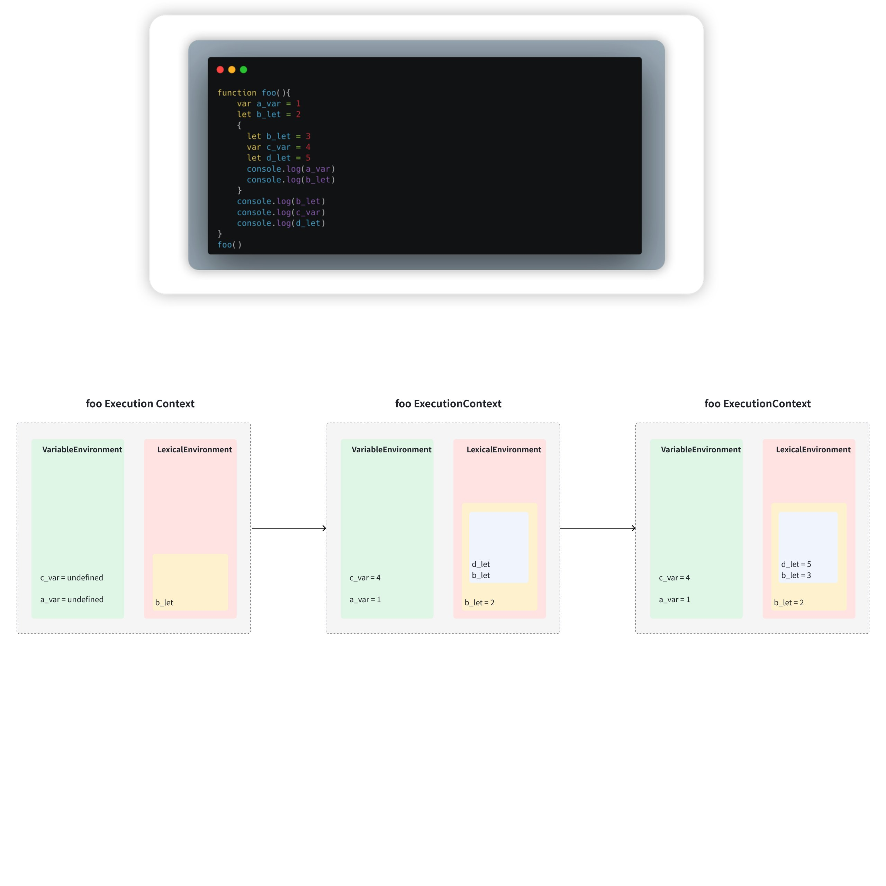
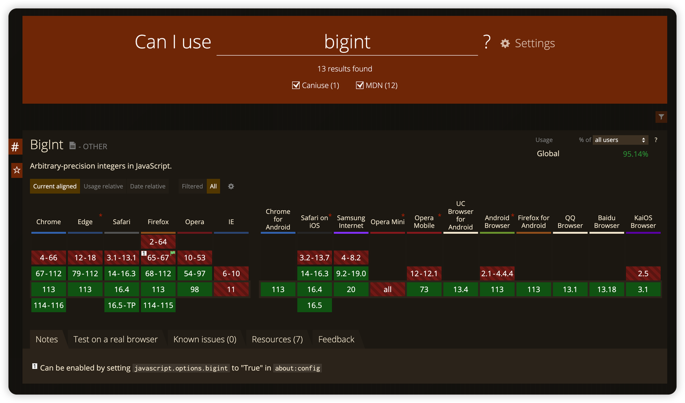

# 1.ECMAScript 核心特性详解

> 原文链接：[飞书原文](https://u19tul1sz9g.feishu.cn/docx/RAEedkOQ4ojOSJxHbBrcUFa5nMc)

[引用：20260207 随堂笔记与源码资料](https://www.feishu.cn/docx/HsQBdlBmsocCuExnY9Jcy99Sn2e)
[本地资源：1.ecma-notes](<../../20260207 随堂笔记与源码资料-压缩包/3.ECMAScript、Typescript 与编译原理详解/1.ecma-notes>)

## 课程目标

> **💡 提示**
>
> - 初中级：
>
>   1. **熟练使用新特性语法进行开发**：熟练掌握常用核心新特性语法，使用新特性语法提高代码可读性，简化代码编写
>   2. **深入理解常用语法**：熟练掌握新特性相关常用语法，例如：变量定义、Class、Proxy、Reflect、箭头函数、解构等
>   3. **了解新特性语法编译支持**：以 babel 为例，了解编译器在新特性语法支持场景下所发挥的作用
> - 高级：
>
>   1. **掌握新特性语法原理**：掌握新特性语法例如：let、解构、class、Proxy 等使用与实现原理
>   2. **掌握编译器特性语法支持**：通过箭头函数编译原理，初步了解 babel 编译，以及如何通过 `this` 的上下文绑定实现其语法特性。
>   3. **掌握标签函数**：掌握我们字符串模板语法，并了解标签函数（Tag Function），了解其在 **cssinjs**、**vine** 等场景的应用

## 补充资料

- Symbol 源码：https://chromium.googlesource.com/v8/v8.git/+/refs/tags/12.7.174/src/builtins/builtins-symbol.cc
- React 源码中 Symbol 应用：https://github.com/facebook/react/blob/d77dd31a329df55a051800fc76668af8da8332b4/packages/shared/ReactSymbols.js
- React 源码中 WeakMap 的使用：https://github.com/facebook/react/blob/d77dd31a329df55a051800fc76668af8da8332b4/packages/eslint-plugin-react-hooks/src/ExhaustiveDeps.js#L101
- Vue3 源码中 WeakMap 的使用：https://github.com/vuejs/core/blob/cf8cd1d97ec1de139a68ba9adfb207625cd2fe2d/packages/reactivity/src/reactive.ts#L26
- Tagged Template 在 styled-components 中的运用：https://github.com/styled-components/styled-components/blob/770d1fa2bc1a4bfe3eea1b14a0357671ba9407a4/packages/styled-components/src/constructors/constructWithOptions.ts
- Vue vine：https://vue-vine.dev/
- Proxy 源码：https://chromium.googlesource.com/v8/v8.git/+/refs/tags/12.7.174/src/builtins/proxy.tq
- Vue3 源码实现：https://github.com/vuejs/core/blob/48ccb3a5af9e5a6ba7f46b3092d698b335fb1bf5/packages/reactivity/src/reactive.ts#L277
- Reflect 源码：https://chromium.googlesource.com/v8/v8.git/+/refs/tags/12.7.174/src/builtins/reflect.tq
- 弱引用处理：https://chromium.googlesource.com/v8/v8.git/+/refs/tags/12.7.174/src/builtins/builtins-weak-refs.cc


## 相关面试真题

### 请说说你对箭头函数的理解？

#### 语法

箭头函数的基本语法如下：

```JavaScript
(param1, param2, ..., paramN) => expression
```

如果函数体只有一行表达式，并且返回该表达式的值，可以省略大括号和 `return` 关键字：

```JavaScript
const add = (a, b) => a + b;
```


#### 特点和优点

1. **简洁的语法**：

   - 箭头函数省去了 `function` 关键字，语法更加简洁。

   ```JavaScript
   // 普通函数
   function sum(a, b) {
     return a + b;
   }
   
   // 箭头函数
   const sum = (a, b) => a + b;
   ```


1. **没有自己的 `this`绑定**：

   - 箭头函数不会创建自己的 `this`，它会捕获其所在上下文的 `this` 值作为自己的 `this`。这在回调函数中尤其有用，可以避免常见的 `this` 绑定问题。

   ```JavaScript
   function Person() {
     this.age = 0;
   
     setInterval(() => {
       this.age++;
       console.log(this.age); // 正确输出 age，因为箭头函数绑定的是外部作用域的 this
     }, 1000);
   }
   
   const p = new Person();
   ```


1. **没有 `arguments`对象**：

   - 箭头函数没有自己的 `arguments` 对象，但可以通过 rest 参数语法获取参数。

   ```JavaScript
   const showArgs = (...args) => console.log(args);
   showArgs(1, 2, 3); // [1, 2, 3]
   ```


1. **不能用作构造函数**：

   - 箭头函数不能使用 `new` 关键字，因为它们没有 `[[Construct]]` 方法。

   ```JavaScript
   const Foo = () => {};
   const bar = new Foo(); // TypeError: Foo is not a constructor
   ```


#### 使用场景

箭头函数特别适用于需要简短函数表达式的场景，例如数组的操作（如 `map`、`filter`、`reduce` 等）和回调函数。

```JavaScript
const numbers = [1, 2, 3, 4, 5];

// 使用箭头函数求平方
const squares = numbers.map(n => n * n);
console.log(squares); // [1, 4, 9, 16, 25]

// 使用箭头函数过滤奇数
const oddNumbers = numbers.filter(n => n % 2 !== 0);
console.log(oddNumbers); // [1, 3, 5]
```


### 请说说你对 Proxy 的理解？

**答案**

详见 [引用：1.ECMAScript 核心特性详解](https://www.feishu.cn/docx/Ez0Nd8XixoC3plxVo6ScmIuynkf)


### 请详细说说你对 Symbol 的理解

**答案**

详见：[引用：1.ECMAScript 核心特性详解](https://www.feishu.cn/docx/Ez0Nd8XixoC3plxVo6ScmIuynkf)


## 变量定义新形式

从 ES6 开始，JavaScript 引入了 **let** 和 **const** 关键字来定义变量，这是 ECMAScript 新增的两种声明变量的方式，相较于 var 关键字具有更多的优势。下面是 let 和 const 关键字的定义和区别：

**⚽ 提示**

Q: var 定义变量有什么问题？
1. 变量提升
2. 无法形成词法作用域
3. 可以随意篡改变量值，重复声明

### let

let 关键字用于声明一个**块级作用域**的局部变量，可以将 let 声明的变量重新赋值。let 声明的变量只在代码块**内部**有效。举个例子，如下：


```TypeScript
if (true) {
    let i = 1;
    console.log(i); // 输出 1
}
console.log(i); // 报错，i 未定义
```

### const

const 关键字用于声明一个**块级作用域**的**只读常量**，一旦 const 声明了某个变量，就不能使用赋值语句改变它的值。常量必须在声明时进行初始化。举个例子，如下：


```TypeScript
const PI = 3.1415926535;
PI = 3; // 报错，无法修改常量
```

需要这些新增的变量定义形式主要原因如下：

1. 更加安全

使用 let 和 const 可以有效地避免一些变量作用域混淆的问题。通过使用块级作用域，我们可以让变量只在指定代码块内部有效，避免了不必要的变量污染和冲突。

1. 更加简洁

使用 let 和 const 可以大量减少代码量，并且更加易于维护。在使用 var 时，由于变量作用域问题，经常需要添加额外的语句进行变量定义、检查和清除等操作，而使用 let 和 const 可以直接在代码中进行定义和使用，更加简洁和高效。

1. 更加规范

使用 let 和 const 可以使代码更加规范，让代码更好读懂、易于维护。随着 JavaScript 的逐渐发展，代码规范性和可读性越来越重要，let 和 const 关键字的引入正是为了更好地实现这一目标。


综上所述，let 和 const 关键字可以使 JavaScript 更加安全、简洁和规范，有效地解决了以往 JavaScript 变量定义存在的一些问题，带来更佳的开发体验。

### 实际开发中如何使用

下面是使用 let 或者 const 的几个实例，以展示其好处：

1. 示例一：循环中使用 let 声明变量避免问题

```TypeScript
for (let i = 0; i < 5; i++) {
    setTimeout(function() {
        console.log(i); // 0, 1, 2, 3, 4
    }, 1000);
}
```

使用 let 声明的变量 i 有块级作用域，在每一次循环中都会重新定义并赋值，避免了使用 var 声明变量可能导致的变量共享问题。

1. 示例二：使用 const 声明常量

```TypeScript
const PI = 3.1415926;
const URL = "https://www.example.com";
```

使用 const 声明常量可以防止被修改，保证代码的可靠性和稳定性。

1. 示例三：使用 const 声明对象属性避免误修改

```TypeScript
const user = {
    name: "张三",
    age: 18,
    gender: "男"
};

user.name = "李四";
console.log(user); // { name: "李四", age: 18, gender: "男" }

Object.freeze(user);

user.age = 20;
console.log(user); // { name: "李四", age: 18, gender: "男" }
```

使用 const 声明对象属性可以避免误修改，同时使用 **Object.freeze()** 方法可以将对象冻结，防止意外修改对象属性。

总的来说，使用 let 或者 const 声明变量可以解决一些以往使用 var 变量定义存在的问题，例如变量作用域混乱，变量共享、变量易被修改等情况。使用 let 和 const 可以使代码更加健壮、可维护，提升开发效率和代码质量。

### 深入理解原理（重要）

底层实现上，let 和 const 的工作方式是通过 **JavaScript 引擎**来实现的。在 JavaScript 引擎中，每一个变量都会被封装在一个称为“变量对象”的容器中，这个对象包含了所有当前上下文中定义的变量与函数。变量对象类似于一个键/值对的容器，其中键是变量名，值是变量的值。在 JavaScript 引擎中，使用 let 和 const 定义变量，实际上是将该变量定义在了一个块级作用域中，而块级作用域是由编译器在编译阶段中实现的。

{

// 代码片段，在程序中，这就是一块儿作用域

}




具体过程如下：


#### let 的底层实现过程

1. 编译阶段

在代码编译阶段，编译器会扫描整个函数体（或全局作用域），查找所有使用 let 定义的变量，为这些变量生成一个初始值为 undefined 的词法环境（LexicalEnvironment）并将其保存在作用域链中。

1. 进入执行上下文

当进入执行块级作用域（包括 for、if、while 和 switch 等语句块）后，会创建一个新的词法环境。如果执行块级作用域中包含 let 变量声明语句，这些变量将被添加到这个词法环境的环境记录中。

1. 绑定变量值

运行到 let 定义的变量时，JavaScript 引擎会在当前词法环境中搜索该变量。首先在当前环境记录中找到这个变量，如果不存在变量，则向包含当前环境的外部环境记录搜索变量，直到全局作用域为止。如果变量值没有被绑定，JavaScript 引擎会将其绑定为 undefined，否则继续执行其他操作。

1. 实现块级作用域

使用 let 定义变量时，在运行时不会在当前作用域之外创建单独的执行上下文，而是会创建子遮蔽（shadowing）新环境。在子遮蔽的词法环境中，变量的值只在最接近的块级作用域内有效。

#### const 的底层实现过程

const 具有与 let 相同的底层实现原理，区别在于 const 定义的变量被视为常量（在赋值之后无法更改），因此变量声明时 必须初始化。此外，应该注意的是，使用 const 声明的对象是可以修改属性的。在定义 const 对象时，对象本身是常量，而不是对象的属性。只有对象本身不能被修改，而对象包含的属性可以任意修改。

**暂时性死区**

**🏖️ 提示**

面试一般如果问到，可能会这样出现：
一般用 var 来埋坑，让你去排坑，最后让你说说 const、let。

## Symbol

Symbol 是 ECMAScript 6 (ES6) 中引入的一种新的基本数据类型。它是一种唯一且不可变的数据类型，用于对象属性的标识符。

### 基础使用

#### 创建 Symbol

Symbol 可以通过 `Symbol()` 函数创建。每个 Symbol 都是唯一的，即使它们的描述（description）相同。

```JavaScript
const sym1 = Symbol();
const sym2 = Symbol('description');
const sym3 = Symbol('description');

console.log(sym2 === sym3); // false
```

创建 Symbol 时可以提供一个可选的字符串作为描述（description），主要用于调试和日志记录。这一描述不会影响 Symbol 的唯一性。

```JavaScript
const sym = Symbol('mySymbol');
console.log(sym.toString()); // Symbol(mySymbol)
```


#### 用作对象属性

Symbol 最常见的用途是用作对象属性的键。由于 Symbol 是唯一的，因此可以避免属性名冲突。

```JavaScript
const mySymbol = Symbol('mySymbol');

const obj = {
  [mySymbol]: 'value'
};

console.log(obj[mySymbol]); // 'value'
```


#### 隐藏属性

Symbol 定义的属性不会出现在普通的对象遍历操作中（例如 `for...in`、`Object.keys()`），但是可以使用 `Object.getOwnPropertySymbols()` 方法获取对象的 Symbol 属性。

```JavaScript
const mySymbol = Symbol('mySymbol');

const obj = {
  [mySymbol]: 'value',
  regularKey: 'value'
};

for (let key in obj) {
  console.log(key); // 'regularKey'
}

console.log(Object.keys(obj)); // ['regularKey']
console.log(Object.getOwnPropertySymbols(obj)); // [Symbol(mySymbol)]
```


### 进阶

#### 全局 Symbol 注册表

通过 `Symbol.for(key)` 和 `Symbol.keyFor(symbol)` 方法，可以创建和共享全局 Symbol。`Symbol.for(key)` 会检查是否已经存在以该 key 创建的 Symbol，如果存在则返回它，否则创建一个新的 Symbol 并注册到全局 Symbol 注册表中。

```JavaScript
const globalSym1 = Symbol.for('globalKey');
const globalSym2 = Symbol.for('globalKey');

console.log(globalSym1 === globalSym2); // true

const localSym = Symbol('localKey');
console.log(Symbol.keyFor(globalSym1)); // 'globalKey'
console.log(Symbol.keyFor(localSym)); // undefined
```


#### 内置 Symbol

ES6 还引入了一些内置的 Symbol，通常用于定义语言内部行为的钩子。例如：

- `Symbol.iterator`：定义对象的默认迭代器。
- `Symbol.asyncIterator`：定义对象的异步迭代器。
- `Symbol.hasInstance`：自定义 `instanceof` 操作符的行为。
- `Symbol.isConcatSpreadable`：定义数组在 `Array.prototype.concat` 中是否可展开。
- `Symbol.species`：定义派生对象时使用的构造函数。
- `Symbol.toPrimitive`：定义对象转换为原始值时的行为。
- `Symbol.toStringTag`：自定义对象的 `toString` 方法返回的字符串标签。
- `Symbol.unscopables`：定义对象在 `with` 语句中哪些属性不可用。


#### 使用内置 Symbol

以下是一些使用内置 Symbol 的示例：


##### Symbol.iterator

```JavaScript
const iterableObj = {
  [Symbol.iterator]() {
    let step = 0;
    return {
      next() {
        return { value: step++, done: step > 5 };
      }
    };
  }
};

for (const value of iterableObj) {
  console.log(value); // 0, 1, 2, 3, 4
}
```


##### Symbol.toStringTag

```JavaScript
const obj = {
  [Symbol.toStringTag]: 'CustomObject'
};

console.log(obj.toString()); // [object CustomObject]
```


### 总结

Symbol 提供了一种创建独特标识符的方法，用于避免对象属性名冲突。通过使用 Symbol，可以创建隐私性更强且更灵活的对象属性，增强代码的可维护性和安全性。此外，内置 Symbol 为 JavaScript 语言的可扩展性和定制化行为提供了强大的支持。Symbol 在库和框架开发中非常常见，用于创建内部属性和方法。

在 React 中，常见特性定义则是借助 Symbol，https://github.com/facebook/react/blob/d77dd31a329df55a051800fc76668af8da8332b4/packages/shared/ReactSymbols.js

```JavaScript
/**
 * Copyright (c) Meta Platforms, Inc. and affiliates.
 *
 * This source code is licensed under the MIT license found in the
 * LICENSE file in the root directory of this source tree.
 *
 * @flow
 */

import {renameElementSymbol} from 'shared/ReactFeatureFlags';

// ATTENTION
// When adding new symbols to this file,
// Please consider also adding to 'react-devtools-shared/src/backend/ReactSymbols'

// The Symbol used to tag the ReactElement-like types.
export const REACT_LEGACY_ELEMENT_TYPE: symbol = Symbol.for('react.element');
export const REACT_ELEMENT_TYPE: symbol = renameElementSymbol
  ? Symbol.for('react.transitional.element')
  : REACT_LEGACY_ELEMENT_TYPE;
export const REACT_PORTAL_TYPE: symbol = Symbol.for('react.portal');
export const REACT_FRAGMENT_TYPE: symbol = Symbol.for('react.fragment');
export const REACT_STRICT_MODE_TYPE: symbol = Symbol.for('react.strict_mode');
export const REACT_PROFILER_TYPE: symbol = Symbol.for('react.profiler');
export const REACT_PROVIDER_TYPE: symbol = Symbol.for('react.provider'); // TODO: Delete with enableRenderableContext
export const REACT_CONSUMER_TYPE: symbol = Symbol.for('react.consumer');
export const REACT_CONTEXT_TYPE: symbol = Symbol.for('react.context');
export const REACT_FORWARD_REF_TYPE: symbol = Symbol.for('react.forward_ref');
export const REACT_SUSPENSE_TYPE: symbol = Symbol.for('react.suspense');
export const REACT_SUSPENSE_LIST_TYPE: symbol = Symbol.for(
  'react.suspense_list',
);
export const REACT_MEMO_TYPE: symbol = Symbol.for('react.memo');
export const REACT_LAZY_TYPE: symbol = Symbol.for('react.lazy');
export const REACT_SCOPE_TYPE: symbol = Symbol.for('react.scope');
export const REACT_DEBUG_TRACING_MODE_TYPE: symbol = Symbol.for(
  'react.debug_trace_mode',
);
export const REACT_OFFSCREEN_TYPE: symbol = Symbol.for('react.offscreen');
export const REACT_LEGACY_HIDDEN_TYPE: symbol = Symbol.for(
  'react.legacy_hidden',
);
export const REACT_TRACING_MARKER_TYPE: symbol = Symbol.for(
  'react.tracing_marker',
);

export const REACT_MEMO_CACHE_SENTINEL: symbol = Symbol.for(
  'react.memo_cache_sentinel',
);

export const REACT_POSTPONE_TYPE: symbol = Symbol.for('react.postpone');

const MAYBE_ITERATOR_SYMBOL = Symbol.iterator;
const FAUX_ITERATOR_SYMBOL = '@@iterator';

export function getIteratorFn(maybeIterable: ?any): ?() => ?Iterator<any> {
  if (maybeIterable === null || typeof maybeIterable !== 'object') {
    return null;
  }
  const maybeIterator =
    (MAYBE_ITERATOR_SYMBOL && maybeIterable[MAYBE_ITERATOR_SYMBOL]) ||
    maybeIterable[FAUX_ITERATOR_SYMBOL];
  if (typeof maybeIterator === 'function') {
    return maybeIterator;
  }
  return null;
}

export const ASYNC_ITERATOR = Symbol.asyncIterator;
```


## Set、Map、WeakSet、WeakMap

ECMAScript 6 (ES6) 引入了新的数据结构 Set、Map、WeakSet 和 WeakMap。它们提供了比原始对象和数组更灵活和高效的存储方式。以下是对它们的详细理解和用例：

###  Set

Set 是一种类似于数组的数据结构，其所有成员都是唯一的。它的主要特点是：


- 不允许有重复的值。
- Set 对象可以存储任何类型的值，无论是原始值还是对象引用。


```JavaScript
const set = new Set([1, 2, 3, 4, 4]);
console.log(set); // Set { 1, 2, 3, 4 }

set.add(5);
console.log(set); // Set { 1, 2, 3, 4, 5 }

set.delete(1);
console.log(set); // Set { 2, 3, 4, 5 }

console.log(set.has(3)); // true

set.forEach(value => {
  console.log(value);
}); // 2, 3, 4, 5
```


### Map

Map 是一种键值对集合，其中键可以是任何类型的值。与普通对象不同，Map 的键可以是任何类型（包括对象、函数等）。

```JavaScript
const map = new Map();

map.set('name', 'John');
map.set(42, 'The answer');
map.set({ key: 'value' }, 'An object key');

console.log(map.get('name')); // John
console.log(map.get(42)); // The answer

map.delete(42);
console.log(map.has(42)); // false

map.forEach((value, key) => {
  console.log(key, value);
});
// 'name' 'John'
// { key: 'value' } 'An object key'
```


### WeakSet

WeakSet 是一种类似于 Set 的集合，但是它只能存储对象引用，且这些对象是弱引用。这意味着，如果没有其他对该对象的引用，垃圾回收器会自动回收该对象。

```JavaScript
const weakSet = new WeakSet();
const obj = {};

weakSet.add(obj);
console.log(weakSet.has(obj)); // true

weakSet.delete(obj);
console.log(weakSet.has(obj)); // false

// WeakSet 不能存储原始值
// weakSet.add(1); // TypeError: Invalid value used in weak set
```


###  WeakMap

WeakMap 是一种键值对集合，其中键是对象引用，值可以是任意类型。WeakMap 中的键是弱引用，即如果没有其他对该键的引用，垃圾回收器会自动回收该键和对应的值。

```JavaScript
const weakMap = new WeakMap();
const objKey = {};

// WeakMap 的键必须是对象
weakMap.set(objKey, 'value');
console.log(weakMap.get(objKey)); // 'value'

weakMap.delete(objKey);
console.log(weakMap.has(objKey)); // false

// WeakMap 不能存储原始值作为键
// weakMap.set(1, 'number'); // TypeError: Invalid value used as weak map key
```


### 总结

**Set**：

- 存储唯一值的集合。
- 允许任何类型的值。


**Map**：

- 键值对集合。
- 键可以是任何类型。


**WeakSet**：

- 只能存储对象引用的集合。
- 对象是弱引用，允许垃圾回收。


**WeakMap**：

- 键值对集合。
- 键必须是对象，键是弱引用，允许垃圾回收。


React 源码中 WeakMap 的使用：https://github.com/facebook/react/blob/d77dd31a329df55a051800fc76668af8da8332b4/packages/eslint-plugin-react-hooks/src/ExhaustiveDeps.js#L101

Vue 源码中：https://github.com/vuejs/core/blob/cf8cd1d97ec1de139a68ba9adfb207625cd2fe2d/packages/reactivity/src/reactive.ts#L26


## Class

详见：[引用：5.面向对象编程思想](https://www.feishu.cn/docx/WaSQdjfwUoENkjxcmGJc94AOnKd)

JavaScript 的**类最终也是一种函数**，JavaScript 的 class 语法只是**语法糖**，使用 class 关键字创建的类会被编译成一个函数，因此其底层原理与函数有一些相似之处。

### 类、构造函数

使用 class 关键字来定义类时，在内部会创建一个特殊的函数，称为**构造函数（constructor）**。构造函数用于在创建对象时初始化对象的属性，类似于传统的基于**原型**的代码中的构造函数。

我们可以通过下面的代码来理解类的构造函数：

```TypeScript
class Person {
    constructor(name, age) {
        this.name = name;
        this.age = age;
    }
}

const p = new Person("Tom", 20);
console.log(p.name, p.age); // Tom 20

// 如果直接用构造器的写法
function Person(name, age) {
    // 
}
```

class 中定义的属性和方法分别定义在这个构造函数的 prototype 属性中。并且与原型方式不同的是，类的方法是不可枚举的，因此无法使用 for...in 循环遍历类实例对象的属性和方法。

#### 解答可枚举问题

在 JavaScript 中，对象的属性分为两种类型：可枚举属性和不可枚举属性。可枚举属性是指那些可以通过 for...in 循环遍历到的属性，不可枚举属性则是指那些不能通过 for...in 循环遍历到的属性。

如果想要将某个属性设置为不可枚举属性，可以使用 Object.defineProperty() 方法或 Object.defineProperties() 方法，对属性的 enumerable 特征进行设置。示例如下：

```TypeScript
const obj = {};
Object.defineProperty(obj, 'prop1', {
  value: 'value1',
  enumerable: false
});

for(let key in obj) {
  console.log(key); // 不会输出 'prop1'
}
```

在这个示例中，我们使用 Object.defineProperty() 方法将 obj 对象的 prop1 属性设置为不可枚举属性。最终，for...in 循环语句只会输出 obj 对象中的可枚举属性。

通常情况下，对象的所有普通属性和方法都是可枚举的，例如：

```TypeScript
const obj = {
  prop1: 'value1',
  prop2: 'value2',
  func1: function() {}
};

for(let key in obj) {
  console.log(key); // 'prop1', 'prop2', 'func1'
}
```

在这个示例中，prop1 和 prop2 是 obj 对象的可枚举属性，而 func1 是 obj 对象的可枚举方法。

需要注意的是，在 ES6 中，通过 class 定义的对象默认不可枚举，就算没有显式地设置 enumerable 属性。这与使用 Object.defineProperty() 方法在 ES5 中设置不可枚举属性的方式不同。如果需要将 class 中的某个属性或方法设置为可枚举属性，需要使用 Object.defineProperty() 方法来进行设置。

### 继承

在 JavaScript 中，继承是通过类的 prototype 属性实现的。在定义类时，可以使用 extends 关键字来继承其他的类：

```TypeScript
class Student extends Person {
    constructor(name, age, grade) {
        super(name, age);
        this.grade = grade;
    }
}
```

这段代码中，子类 Student 继承了父类 Person 的构造函数方法并添加了自己的属性和方法。

### 静态方法和属性

类中的静态方法和属性可以使用 static 关键字来定义，它们不是类实例的属性，而是类本身的属性和方法。

```TypeScript
class Person {
    static species = "human";

    static saySpecies() {
        console.log(`We are ${this.species}.`);
    }
}
```

这段代码中定义了一个静态方法和一个静态属性，可以通过类本身直接调用静态方法和属性。

### getter 和 setter

在类中定义 getter 和 setter 方法可以让我们封装实例的内部数据属性，使得这些属性的读写行为更加的安全和合理。

```TypeScript
class Person {
    constructor(name, age) {
        this.name = name;
        this.age = age;
    }

    get name() {
        return this.name.toUpperCase();
    }

    set age(age) {
        if (age > 0 && age < 120) {
            this.age = age;
        } else {
            console.log("Invalid age value.");
        }
    }

    get age() {
        return this.age;
    }
}
```

在类的实现中，getter 和 setter 其实是被定义在构造函数的 prototype 属性上，从而可以被该类的所有实例对象访问。

### class 表达式

ES6 还引入了 class 表达式，可以通过这种表达式来创建函数对象。

```TypeScript
const Person = class {
    constructor(name, age) {
        this.name = name;
        this.age = age;
    }

    sayHi() {
        console.log(`Hi, my name is ${this.name}, I'm ${this.age} years old.`);
    }
};
```

总体来说，JavaScript 的类本质上是一个函数，使用 class 关键字来声明类只是伪代码，这些代码最终都会被转成函数，并存在函数对象的属性和原型属性上。

## 模板字符串

**💡 提示**

大家有用过 css in js 方案吗？

类名很容易重复冲突，解决这个问题的方法，react 可以使用 **emotion（开发项目）**、styled-components、stitches（组件库可以选他，针对组件变体非常方便）

JavaScript 模板字符串是 ES6 中新增的一种特殊的字符串语法，它允许嵌入表达式和变量，通过 \${} 拼接字符串和表达式，相比传统的字符串拼接来说，模板字符串更具可读性和可维护性。

### 模板字符串基础概念与用法

使用模板字符串时，需要使用反斜杠（\\\`）来定义字符串，并在字符串中使用 \${expression} 的方式来嵌入表达式和变量，可以使用多行方式来创建较长的字符串。

```TypeScript
const name = "Tom";
const age = 20;
const str = `My name is ${name}, I'm ${age} years old.
I'm from China.`;
console.log(str);
```

在这个示例中，使用了一个模板字符串来创建一个包括变量和表达式的字符串。

### 底层实现原理

模板字符串的实现原理，可以大致分为两个步骤：首先，JavaScript 引擎会将模板字符串**解析**成一个函数调用表达式；接着，这个表达式会被执行，并输出一个最终的字符串。

对于第一步，当 JavaScript 引擎解析模板字符串时，它会将特殊字符和变量值分割成多个参数，并将它们作为函数调用的参数传递给一个名为 **Tagged Template** 的函数。该函数的第一个参数是一个数组，其中包含原始模板字符串中的所有字符文字，除了所有插入字符。其余参数则是与模板字符串插值表达式相对应的插入值。

也就是说，上面的示例可以被解析为如下调用:

```TypeScript
const result = tagFn(["My name is ", ", I'm ", " years old.\nI'm from China."], name, age);
```

**⛱️ 提示**

提问：请实现这个 tagFn

```TypeScript
const tagFn = (temp, ...args) => {
    let str = ''
    for(let i = 0; i < temp.length; i++) {
        // 这里我就不考虑一些容错情况
        str += temp[i] + args[i]
    }
    return str
}
```

DSL 是不可能用 正则去处理的，必须用专业角度的编译原理去实现

其中，tagFn 是一个可被调用的函数，用于实现对模板字符串的自定义处理。我们可以通过这个函数对模板字符串和变量进行任意的处理和操作。也正是由于这种设计，模板字符串才能够像函数一样实现更加复杂的逻辑，比如计算计算、转换等操作。

### tagged template

大家有使用过 css in js 方案的同学，扣个2，具体使用的什么方案？？？

- styled-components
- emotion（mui 使用的）
- stitches：https://github.com/stitchesjs/stitches，如果之前使用过 styled-components 的同学，我推荐大家去看看这个

**🚅 提示**

作业：去了解一下为什么需要使用 css in js 的方案

```TypeScript
// styled-components or emotion
const StyledDiv = styled.div`
    background: pink
`
```

### 使用 tagged template

除了默认使用模板字符串外，我们还可以自定义 tagged template 来处理模板字符串。标记模板只需要定义一个函数，这个函数的第一个参数为一个标记数组，剩余其他参数是字符串中替换表达式的值，返回值是最终拼接好的字符串。这种模式在一些库中应用广泛，例如 styled-components。

```TypeScript
function upperCase(strings, ...values) {
  let result = '';
  strings.forEach((str, i) => {
    if (i > 0) {
      result += String(values[i - 1]).toUpperCase();
    }
    result += str;
  });
  return result;
}

const name = 'rocky';
const age = 18;
const str = upperCase`my name is ${name}, i'm ${age} years old.`;
console.log(str);
```

这里我们实现的 upperCase 函数，可以把字符串替换的内容转换成大写。

总的来说，JavaScript 的模板字符串是一种非常实用的语法，它在拼接复杂的字符串时，可以很好地保证代码的可读性和可维护性。其实现原理是利用函数的调用实现的，使得模板字符串可以与 JavaScript 中的函数交互，给程序员带来了更多的可能性。

```JavaScript

const styledFn = function (template, ...args) {
  console.log("🚀 ~ styledFn ~ template:", template);
  const styles = {};
  const reg = /\s|\n/gi;
  const templateStr = template.join("").replace(reg, "");
  const templateArr = templateStr.split(";");
  for (let i = 0; i < templateArr.length; i++) {
    if (!templateArr[i]) continue;
    const [key, val] = templateArr[i].split(":");
    styles[key] = val;
  }

  const dom = document.createElement("div");
  for (const k in styles) {
    dom.style[k] = styles[k];
  }
  document.body.appendChild(dom);

  return styles;
};
const styled = {
  div: styledFn,
  button: styledFn,
  span: styledFn,
};

// tagged template
const StyledHeader = styled.div`
  width: 100px;
  height: 100px;
  background-color: red;
  color: pink;
`;
console.log("🚀 ~ StyledHeader:", StyledHeader);
```

**💡 提示**

如果你一开始就预料到今后项目会往**服务端渲染**的方向走，那建议不要使用 css in js 的方案，建议 module css、tailwind css


## 解构语法

### 基础概念与原理

JavaScript 的解构是 ES6 中新增的一个语法特性，它可以将数组或对象中的元素提取出来并赋值给变量。解构语法使得对数组和对象的操作更加灵活和便捷。

**⛱️ 提示**

问题：什么数据符合使用解构语法？

#### 数组解构底层原理

对数组解构的底层实现分为两个过程：第一步是使用取值函数（getter）读取数组中对应位置的值，第二步是将取得的值赋值给目标变量。

以以下代码为例：

```TypeScript
const [a, b, c] = [1, 2, 3];
console.log(a, b, c); // 1 2 3
```

在这个例子中，JavaScript 引擎背后发生的事情如下：

```TypeScript
const tempArray = [1, 2, 3];
const a = tempArray[0];
const b = tempArray[1];
const c = tempArray[2];
console.log(a, b, c); // 1 2 3
```

对于数组解构而言，将每个目标变量赋值的过程是独立的，它们并不会相互影响。

#### 对象解构底层原理

解构对象变量的过程与解构数组变量非常类似。将会遍历对象中的每一个属性，然后在解构表达式中查找同名的变量。

```TypeScript
const {firstname: first, lastname: last, ...rest} = { firstname: 'John', lastname: 'Doe' };
console.log(first, last); // John Doe

// const {name, age, ...restProps} = props
```

在这个例子中，解构对象并赋值给变量的过程可以理解为：

```TypeScript
const tempObject = { firstname: 'John', lastname: 'Doe' };
const first = tempObject.firstname;
const last = tempObject.lastname;
console.log(first, last); // John Doe
```

需要注意的是，在对象解构语法中，目标变量的名称需与要求的属性名保持相同。当对象中有未定义的目标变量时会被设为 undefined。

#### 嵌套解构底层原理

嵌套解构是指解构表达式中还包含其他的数组或对象解构。嵌套解构的底层实现和单层解构类似，操作每个元素或属性时都需要依次使用取值函数（getter）进行操作。

例如：

```TypeScript
const [a, [b, [c]]] = [1, [2, [3]]];
console.log(a, b, c); // 1 2 3
```

在这个例子中，解构过程类似于如下代码：

```TypeScript
const tempArray = [1, [2, [3]]];
const a = tempArray[0];
const tempArray2 = tempArray[1];
const b = tempArray2[0];
const tempArray3= tempArray2[1];
const c = tempArray3[0];
console.log(a, b, c); // 1 2 3
```

#### 默认值

解构语法还支持给目标变量提供默认值，在无法解构出对应的值时会使用默认值。默认值可以是任何 JavaScript 表达式，包括函数调用、变量名、运算符等。

```TypeScript
const [a = 1, b = 2] = [];
console.log(a, b); // 1 2
```

在这个例子中，解构表达式的值为空数组，因此解构无法成功。但由于设置了默认值，a 和 b 的值会分别设为 1 和 2。

JavaScript 的解构语法的本质是利用 getter 函数和赋值操作将数组或对象的值按照指定的格式赋值给目标变量。这种语法简化了编程的流程，提高了代码的可读性和可维护性。

### JavaScript 引擎对于解构语法实现的细节

在 JavaScript 引擎处理解构语法时，会执行以下步骤：

1. 如果右边（要解构的对象）是一个具有 Iterator 接口的对象，则需要调用其 iterator 方法，为解构过程创建一个迭代器。迭代器可以让我们对要解构的对象进行遍历，并将其每个属性的取值传递给左边（解构的目标）中相应的变量。
2. 对要解构的目标进行判断，如果为无法解构的值（如 undefined 或 null），则抛出 TypeError。
3. 如果解构语法中指定了默认值，则在对象无法解构到值(undefined)时使用默认值。
4. 嵌套解构会在目标中继续求值以解构嵌套的变量。
5. 解构对于数组和字符串元素时，会按照索引顺序进行赋值；而对于对象中的元素时，会按照属性名进行赋值。
6. 对于对象的解构，会从对象中取出相应属性的值，然后复制到与解构表达式中相应的变量中。如果解构表达式中指定的变量名与属性名不同，需要使用 “key: value” 表示法进行定义。
7. 解构表达式是完全可以包含剩余运算符的，这样即可匹配对象或数组中剩余的属性，将其赋值到相应的变量上。
8. 如果解构表达式中不存在取值函数（getter）和设置函数（setter），则此时解构赋值可以在性能上比原生赋值语句快一些。

JavaScript 引擎在处理解构表达式时，会比使用常规的变量赋值语句多一些步骤。当我们使用解构表达式时，我们可以根据语法的特点编写更加简洁、易读的代码，JavaScript 引擎会自动为我们执行相应的处理过程。


## 箭头函数

JavaScript中的箭头函数新增的一种函数定义方式，它可以创建一个函数并赋值给变量，使用箭头语法'=>'。在箭头函数中，**this 关键字的作用域与它周围代码作用域相同**，因而有时也被称为“**词法作用域函数**”。

### 基础概念与使用

箭头函数的原理是基于JavaScript中的闭包、this和参数作用域。在箭头函数中，this关键字始终指向函数所在上下文的this指针，而不是所在作用域的this指针。

**💡 提示**

箭头函数与普通函数有哪些不同？
1. this 指向，箭头函数不能定义构造器
2. 不能 new 
3. 内部无 arguments 对象
4. this 绑定方法失效，比如：call apply bind

举个例子：

```TypeScript
const add = (a, b) => {
  return a + b;
};
console.log(add(2, 3));
```

在这个示例中，箭头函数会将a和b作为参数，并将其返回值赋值给add。箭头函数的this指针在这里是指向全局对象（即window，在浏览器中）的，而不是函数作用域。

### 箭头函数主要使用场景

箭头函数的使用场景有以下几个：

1. 当我们需要使用更简洁的语法来定义函数时，可以使用箭头函数代替传统的函数定义语法。箭头函数更为简洁、易读，可以使用单行语法来代替多行语法。

```TypeScript
// 传统函数定义
function multiply(x, y) {
  return x * y;
}
// 箭头函数
const multiply = (x, y) => x * y;
```

1. 当我们需要引用所在父级的this指针时，可以使用箭头函数，因为箭头函数中的this指向的是全局对象，而不是函数调用时的上下文对象。而不使用箭头函数时，这里会因为this指针指向的问题而带来一些不便。

```TypeScript
const obj = {
  name: 'Tom',
  age: 20,
  say: function() {
    console.log(`My name is ${this.name}, I'm ${this.age} years old`);
  }
};
setTimeout(obj.say, 1000);
```

在这个示例中，由于setTimeout中的this指针的问题，函数say中的name属性和age属性无法正常被引用。而使用箭头函数就能解决这个问题。

```TypeScript
const obj = {
  name: 'Tom',
  age: 20,
  say: function() {
    setTimeout(() => {
      console.log(`My name is ${this.name}, I'm ${this.age} years old`);
    }, 1000);
  }
};
obj.say();
```

1. 在函数式编程中，箭头函数用于编写函数式代码时，简化函数的定义和函数调用的过程。

总的来说，箭头函数在 JavaScript 中被广泛地使用，并在许多应用场景中表现出越来越好的优势。箭头函数简洁、易读，易于编写，同时和其他高级语法结合使用时也具有很高的灵活性。

### 不能使用箭头函数的场景

虽然箭头函数在许多应用场景中表现出极大的优势，但在某些情况下还是不能正常使用。常见的限制场景如下：

1. **不能用作构造函数**：箭头函数没有自己的this指针，所以不能作为构造函数来使用。因此，不能使用new关键字来调用箭头函数来创建一个新对象。

```TypeScript
const Person = (name, age) => {
  this.name = name;
  this.age = age;
};
const person1 = new Person('Tom', 20); // 报错，Person不是构造函数
```

1. **不能使用 arguments 关键字**：在箭头函数中，函数的参数为指定的参数，没有额外的 arguments 对象。如果需要使用 arguments 参数，必须使用常规的函数语法。

```TypeScript
const func1 = () => {
 console.log(arguments); // 报错，arguments未定义
};
func1(1, 2, 3);
```

如果需要使用 arguments，则需要使用function函数定义方式：

```TypeScript
const func2 = function() {
 console.log(arguments);
};
func2(1, 2, 3); // 输出[1, 2, 3]
```

1. **不能通过 call()、apply()方法修改this指向**：对于箭头函数，它的 this 指针指向词法作用域中的this值，无法通过call()、apply()方法来修改。

```TypeScript
const obj = {
  name: 'Tom',
  age: 20,
  say: () => {
    console.log(`My name is ${this.name}, I'm ${this.age} years old`);
  }
};
obj.say.call({ name: 'Bill', age: 30 }); // 输出 My name is undefined, I'm undefined years old
```

在这个示例中，虽然我们通过call()方法强制修改了say()的this值，但结果表明this值的实际结果并没有得到改变。这是因为箭头函数本身并没有自己的this值，在这里仍然使用的是上面全局对象的this值。

综上所述，尽管箭头函数在许多情况下都表现得非常优异，但仍然有一些限制场景需要我们关注。在处理这些限制场景时，我们可以使用传统的函数语法，或其他语法来满足我们的代码需求。


## Generator

具体应用课件异步编程部分，对于 generator 在异步处理场景下的应用，特别参考 **Redux-Saga**

[引用：4.前端异步编程](https://www.feishu.cn/docx/WYzEdYltCoDHfgxLgV6cutJYnMg)

**💡 提示**

生成器为了解决什么问题？
解决了**函数**的不可中断性
生成器是可中断函数，**yield** 关键字暂时中断函数执行，在合适的实际从中断位置继续执行。

JavaScript中的生成器（Generator）引入的一种函数类型，它与传统的函数不同之处在于，在生成器中，我们可以**中途停止函数的执行**，并保存相关的上下文信息，待下次继续执行时可以从保存的上下文信息处继续执行。

### 基本概念

生成器的定义与传统函数非常相似，不同之处在于生成器函数的关键字为“function\*”（注意是带星号的function），并使用 **yield** 操作符来指定生成器函数的执行步骤。yield 操作符可以看做是一个暂停器，它可以和外部程序交换数据，并在函数执行停滞时暂停函数的操作，并记录下执行状态信息以备之后恢复时使用。

下面是一个简单的生成器示例：

```TypeScript
function* generateSequence() {
  yield 1;
  yield 2;
  yield 3;
}

const sequence = generateSequence(); // 获取生成器实例
console.log(sequence.next().value); // 输出 1
console.log(sequence.next().value); // 输出 2
console.log(sequence.next().value); // 输出 3
```

在这个示例中，我们定义了一个 generateSequence 的生成器函数，并在其中使用 yield 停止程序的执行，生成器函数执行到 yield 的时候，就会停止执行并且将 yield 后面的值返回作为值，并记录下当前运行的上下文信息，等待下一次调用 next() 方法时恢复上下文信息和yield后面的值，并继续执行，直到生成器函数执行结束。

生成器可以看做是一种特殊的迭代器，它与普通迭代器不同之处在于，它的 yield 关键字可以返回多个值，并且它具备暂停及恢复执行状态的功能。通常情况下，我们可以使用生成器来处理那些状态化的问题，在文件读写、网络请求、流式计算等处理方式中都可以使用生成器的特性来优化代码效率。

### 使用场景

**🥖 提示**

dva、redux-saga

生成器的使用场景主要是在需要处理大量异步操作并保持状态的情况下。生成器不仅可以使代码简洁易懂，还可以避免**回调地狱**和 **Promise 降解**的问题。

生成器可以通过 yield （产出）操作暂停函数的执行，并返回一个值，等待下一次调用 next （下一个）方法重新启动函数的执行，并继续执行到下一个 yield 操作或函数退出。这样就可以在暂停和恢复的过程中，保持函数的状态，避免了频繁的创建/销毁该函数的内部变量，提高了性能。**（串行）**parallel

下面是一个使用生成器处理异步操作的示例：

```TypeScript
function* myGenerator() {
  const result1 = yield asyncOperation1(); // 发起异步操作1
  const result2 = yield asyncOperation2(result1); // 发起异步操作2，并将异步操作1的结果作为参数
  return result2; // 返回异步操作2的结果
}

function asyncOperation1() {
  return new Promise(resolve => setTimeout(() => resolve('result1'), 1000));
}

function asyncOperation2(arg) {
  return new Promise(resolve => setTimeout(() => resolve(`result2-${arg}`), 1000));
}

const gen = myGenerator(); // 获取生成器实例
const p1 = gen.next(); // 启动异步操作1
p1.value.then(result1 => {
  const p2 = gen.next(result1); // 启动异步操作2，将异步操作1 的结果作为参数传递
  p2.value.then(result2 => {
    console.log(result2); // 输出 result2-result1
  });
});

// while(!p.done) // 一直执行到 done
```

在这个示例中，我们定义了 myGenerator 生成器函数，它使用 yield 操作暂停执行，并在异步操作完成后恢复执行，并传递相应的参数。我们利用 Promise 实例来完成异步操作，并使用then() 方法来获取异步操作的结果，并将结果作为参数传递给下一个yield操作。

在上面这个示例中，我们使用生成器函数来方便地完成了两个异步操作的串联和参数传递。这种方式的优点在于代码可读性和可维护性都得到了大大的提高。同时，生成器自身的状态保持特性，也使得代码的性能得到了提升。


## 异步处理

主要方案：Callback、Promise、async & await

见异步编程 [引用：4.前端异步编程](https://www.feishu.cn/docx/CLiGdN7GzowQ4LxsuBncZK3unoD)


## Proxy

Proxy 是 ECMAScript 6 (ES6) 中引入的一种强大的工具，用于定义对象的基本操作（如属性访问、赋值、枚举、函数调用等）的自定义行为。通过 Proxy 对象，我们可以拦截并自定义对象的许多操作，从而实现许多高级功能。


### 基础语法

创建一个 Proxy 对象的基本语法如下：

```JavaScript
const proxy = new Proxy(target, handler);
```

- `target`：要包装的目标对象（可以是对象、数组、函数等）。
- `handler`：一个对象，其属性是当执行一个操作时定义代理行为的函数。


### 常用的捕获器（traps）

捕获器是代理对象在操作目标对象时触发的函数。常用的捕获器包括：


1. **get(target, property, receiver)**：拦截读取属性操作。

   ```JavaScript
   const handler = {
     get: function(target, property, receiver) {
       return property in target ? target[property] : `Property ${property} not found.`;
     }
   };
   
   const proxy = new Proxy({}, handler);
   console.log(proxy.name); // Property name not found.
   ```


1. **set(target, property, value, receiver)**：拦截属性设置操作。

   ```JavaScript
   const handler = {
     set: function(target, property, value, receiver) {
       if (property === 'age' && typeof value !== 'number') {
         throw new TypeError('The age must be a number.');
       }
       target[property] = value;
       return true;
     }
   };
   
   const proxy = new Proxy({}, handler);
   proxy.age = 30; // 正常
   // proxy.age = '30'; // 抛出 TypeError: The age must be a number.
   ```


1. **has(target, property)**：拦截 `in` 操作符。

   ```JavaScript
   const handler = {
     has: function(target, property) {
       return property === 'name' ? true : false;
     }
   };
   
   const proxy = new Proxy({}, handler);
   console.log('name' in proxy); // true
   console.log('age' in proxy); // false
   ```


1. **deleteProperty(target, property)**：拦截 `delete` 操作符。

   ```JavaScript
   const handler = {
     deleteProperty: function(target, property) {
       if (property === 'name') {
         return false;
       }
       delete target[property];
       return true;
     }
   };
   
   const proxy = new Proxy({ name: 'John', age: 30 }, handler);
   delete proxy.name; // 无效
   delete proxy.age;  // 有效
   ```


1. **apply(target, thisArg, argumentsList)**：拦截函数调用。

   ```JavaScript
   const handler = {
     apply: function(target, thisArg, argumentsList) {
       return target(argumentsList[0], argumentsList[1]) * 10;
     }
   };
   
   function sum(a, b) {
     return a + b;
   }
   
   const proxy = new Proxy(sum, handler);
   console.log(proxy(1, 2)); // 30
   ```


### 示例

Proxy 的应用非常广泛，可以用于很多高级场景，例如：


1. **数据绑定与观察**：

   - 通过 Proxy，可以实现对对象变化的监听，从而实现数据绑定或观察者模式。

   ```JavaScript
   const data = { name: 'John' };
   const handler = {
     set(target, property, value, receiver) {
       console.log(`Property ${property} changed to ${value}`);
       target[property] = value;
       return true;
     }
   };
   
   const proxy = new Proxy(data, handler);
   proxy.name = 'Doe'; // Property name changed to Doe
   ```


1. **虚拟化和延迟计算**：

   - 可以通过 Proxy 实现对象的虚拟化，延迟计算某些属性或方法的结果，直到需要时再进行计算。

   ```JavaScript
   const handler = {
     get(target, property, receiver) {
       if (property === 'heavyComputation') {
         return () => {
           console.log('Performing heavy computation...');
           return 42;
         };
       }
       return target[property];
     }
   };
   
   const proxy = new Proxy({}, handler);
   console.log(proxy.heavyComputation()); // Performing heavy computation... 42
   ```


1. **输入验证**：

   - 可以使用 Proxy 拦截对象属性的设置，进行输入验证。

   ```JavaScript
   const validator = {
     set: function(target, property, value) {
       if (property === 'age' && (typeof value !== 'number' || value < 0)) {
         throw new Error('Invalid age');
       }
       target[property] = value;
       return true;
     }
   };
   
   const person = new Proxy({}, validator);
   person.age = 25; // 有效
   // person.age = '25'; // 抛出错误 Invalid age
   ```


## Reflect

JavaScript 反射（reflection）是一种能够在**运行时检查、修改对象、类和函数等程序结构的能力**，通过反射，我们可以**读取**和**修改**对象属性、**调用**对象方法、**定义**新属性、**修改**原型等。

JavaScript 通过 Reflect 对象提供了一组**操作对象**的 API，可以访问、检查和修改对象上的属性和方法。Reflect API 方法与对应对象的同名方法具有相同的功能，例如 Reflect.get() 方法对应对象的 obj.get() 方法，Reflect.set() 方法对应对象 obj.set() 方法等。

在 Vue 中的使用：https://github.com/vuejs/core/blob/623ba514ec0f5adc897db90c0f986b1b6905e014/packages/reactivity/src/baseHandlers.ts#L161C1-L201C1

**💡 提示**

反射 Reflect 和代理 Proxy 通常是同时出现的

下面是一些反射 API 的常用示例：

```TypeScript
// 获取对象的属性名称列表
const obj = {a: 1, b: 2, c: 3};
console.log(Reflect.ownKeys(obj)); // 输出 ["a", "b", "c"]

// 验证属性存在
const obj2 = {a: 1};
console.log(Reflect.has(obj2, 'a')); // 输出 true

// 获取对象的原型
const obj3 = {a: 1};
console.log(Reflect.getPrototypeOf(obj3)); // 输出 {}

// 修改对象的原型
const obj4 = {a: 1};
const proto = {b: 2};
Reflect.setPrototypeOf(obj4, proto);
console.log(obj4.__proto__); // 输出 {b: 2}

// 代替call和apply方法
function myFunction(a, b, c) {
  console.log('My function is called with:', a, b, c);
}
Reflect.apply(myFunction, null, [1, 2, 3]); // 输出 My function is called with: 1, 2, 3

// 使用set函数和get函数来监视对象属性的读取和设置
const obj5 = {a: 1};
const handler = {
  get(target, key, receiver) {
    console.log(`Getting property ${key}`);
    return Reflect.get(target, key, receiver);
  },
  set(target, key, value, receiver) {
    console.log(`Setting property ${key} to ${value}`);
    return Reflect.set(target, key, value, receiver);
  }
};
const proxy = new Proxy(obj5, handler);
proxy.a; // 输出：Getting property a
proxy.a = 2; // 输出：Setting property a to 2
```

**💡 提示**

反射的优势：不关心传入需要变更对象的具体实现，只需要关注想要更改的属性


Reflect API 实现了对象的**反射、代理**等功能，它为我们提供了一些强大而便捷的工具，使得我们可以在运行时动态地查看、检查和修改对象的属性和行为。Reflect 反射在 JavaScript 中的应用非常广泛，可以用于类似响应式编程、面向对象编程等各种场景。

### 主要应用场景(简单先了解)

在 Nest.js 中，注解和 reflect 是紧密相关的，它们常常一起使用来解决一些实际问题。下面是一些常见的使用场景：

1. **定义控制器和路由**

在 Nest.js 中，控制器和路由的定义通常使用注解进行描述，而 reflect API 可以用于存储和读取控制器和路由的元数据。例如，@Controller() 注解表示一个控制器，@Get()、@Post() 等注解表示控制器的路由和请求方法。而 Reflect.getMetadata() 和 Reflect.defineMetadata() 则用于读取和存储它们的各种配置和元数据，例如路由地址、是否需要鉴权、权限等级等。

1. **实现拦截器**

Nest.js 中的拦截器通常使用注解和 reflect 进行实现。拦截器常用于实现请求的预处理和后处理，例如在请求发生之前，我们可以使用拦截器来检查用户是否已经登录，或者通过拦截器来记录请求生命周期中的各种日志等。而拦截器实际上就是一个装饰器，可以使用 @Injectable() 注解声明，并且可以实现某些拦截器特有的接口和方法。

1. **应用全局过滤器**

在 Nest.js 中，全局过滤器使用注解和 reflect 可以方便地实现请求和响应的统一过滤，例如过滤掉敏感信息、安全信息、非法请求等。全局过滤器使用 @UseFilters() 注解进行定义，可以通过 reflect API 来读写过滤器的元信息，例如过滤器的地址、请求头、状态码等。

总的来说，在 Nest.js 中，注解和 reflect 是紧密相关的，常常一起使用来实现控制器、路由、拦截器、过滤器等一些行为或功能。它们强调了代码的可维护性和可读性，可以使代码更加简单、灵活。


### 示例

好的！下面我会列举两份代码进行详细说明：

1. 使用注解和 reflect 实现全局过滤器

```TypeScript
import { Catch, ArgumentsHost } from '@nestjs/common';
import { BaseExceptionFilter } from '@nestjs/core';

@Catch()
export class MyGlobalFilter extends BaseExceptionFilter {
  catch(exception: unknown, host: ArgumentsHost) {
    console.log('MyGlobalFilter is running!');
    super.catch(exception, host);
  }
}

// 在 main.ts 中注册全局过滤器
app.useGlobalFilters(new MyGlobalFilter());
```

这个示例演示了如何使用注解和 reflect 实现全局过滤器。在这个示例中，我们定义了一个名为 MyGlobalFilter 的类，使用了 @Catch() 注解来标记这个类为一个过滤器类。这个类继承了 BaseExceptionFilter 类，实现了 catch() 方法。在 catch() 方法内部，我们调用了 super.catch() 方法来处理异常，并打印了一条日志。

当应用中发生任何异常时，都会自动触发 MyGlobalFilter 这个过滤器，让它来处理异常。这个过滤器会打印一条日志，然后调用基类 BaseExceptionFilter 中定义的处理方法进行异常处理。

2. 使用注解和 reflect 实现请求日志记录拦截器

```TypeScript
import { 
  Injectable,
  NestInterceptor,
  ExecutionContext,
  CallHandler 
} from '@nestjs/common';
import { Observable } from 'rxjs';
import { tap } from 'rxjs/operators';

@Injectable()
export class RequestLoggingInterceptor implements NestInterceptor {
  intercept(context: ExecutionContext, next: CallHandler): Observable<any> {
    console.log(`Request made to ${context.getClass().name}.${context.getHandler().name}`);
    return next.handle().pipe(
      tap(() => console.log(`Request response from ${context.getClass().name}`))
    );
  }
}

// 在控制器方法中使用 @UseInterceptors() 注解注入拦截器
@Controller()
@UseInterceptors(RequestLoggingInterceptor)
export class AppController {
  @Get()
  getData() {
    return 'Hello World!';
  }
}
```

这个示例演示了如何使用注解和 reflect 实现一个请求日志记录拦截器。在这个示例中，我们定义了一个名为 RequestLoggingInterceptor 的拦截器类，拦截器实现了 NestInterceptor 接口，它的主要作用是在每次请求发生时记录请求日志。

在 intercept() 方法内部，我们通过 ExecutionContext 和 CallHandler 参数获取当前请求的类名和方法名，并打印了一条请求日志。同时，我们将 CallHandler 对象传递给 pipe 中的 tap() 方法，从而在请求响应过程中打印响应信息。

在控制器中，我们使用了 @UseInterceptors() 注解将拦截器注入到 getData() 方法中。当控制器的 getData() 方法被调用时，这个拦截器就会自动被触发，从而记录请求日志。

以上这两个示例都证明了在 Nest.js 中，可以使用注解和 reflect 实现一些实用的功能，例如全局过滤器、拦截器等。在实际编程中，我们可以根据需要自行实现更多的注解和 reflect 功能，来增强程序的灵活性和可维护性。


## BigInt

前端的数据位数较大，并且不使用科学计数法

大家如果处理过**大数据**的场景，想必知道 JavaScript Number 类型的限制——2^53 - 1。

**BigInt** 是在 ES10 中引入的一种新类型，它可以用来表示任意大的整数，不受 JavaScript 中 Number 类型的 2^53 - 1 限制。

在 JavaScript 中，Number 类型使用 IEEE 754 标准表示，且占据 **64 位内存**。其中 1 位是符号位，11 位是指数位，剩余 52 位是有效数字位。因此，在 Number 类型中最大的安全整数为 2^53 - 1，超过这个值就会丢失精度。而 BigInt 类型则可以表示任意大的精度整数，其内存使用量要大于 Number 类型，但是比字符串表示更节省空间。

BigInt 类型的使用方法和 Number 类型相似，主要区别在于在数字后加 "n" 标志表示 Bigint 类型。BigInt 类型可以进行加、减、乘、除等基本数学运算，并且可以使用 BigInt() 构造方法将字符串或 Number 类型数据转换为 BigInt 类型。

以下是一个简单的 BigInt 示例：

```TypeScript
console.log(Number.MAX_SAFE_INTEGER); // 输出 9007199254740991
console.log(10000000100000001); // 输出 10000000100000000，丢失了精度

const bigNum1 = BigInt(Number.MAX_SAFE_INTEGER);
console.log(bigNum1 + 1n); // 输出 9007199254740992n，有效避免了精度丢失

const bigNum2 = BigInt('10000000100000001');
console.log(bigNum2); // 输出 10000000100000001n
```

需要注意的是，BigInt 类型和 Number 类型不能进行混合运算。如果试图在 BigInt 和 Number 之间进行算术运算，会抛出类型错误。

BigInt 类型在一些算法、加密等领域应用广泛，同时在一些科学计算、数据计算等方面也具有广泛的应用前景。



如果你需要考虑更高的兼容性：**big.js**


## Babel 编译器初探【预习，编译与 babel 详细介绍】

babel 可将 JavaScript 源代码转换生成新的目标代码，最早期他的作用是：

1. 支持 ECMAScript 新特性
2. 为平台兼容打 **polyfill** （core-js）

重点概念：babel preset、babel plugin、targets

https://babeljs.io/repl

- preset 基础预设
- 插件化
- targets 目标浏览器，借助 core-js 的 polyfill 实现


当然，使用 Babel 和内置的 `@babel/plugin-transform-arrow-functions` 插件来转换箭头函数是一个简单而高效的方法。下面是如何进行配置和转换的详细步骤。


### 安装 Babel 和插件


首先，我们需要安装 Babel 核心库和箭头函数转换插件：


```Bash
npm install --save-dev @babel/core @babel/cli @babel/plugin-transform-arrow-functions
```


### 创建 Babel 配置文件


接下来，我们创建一个 Babel 配置文件 `babel.config.json`，以便 Babel 使用我们安装的插件进行代码转换：


```JSON
{
  "plugins": ["@babel/plugin-transform-arrow-functions"]
}
```


### 编写待转换代码文件


假设我们有一个包含箭头函数的 JavaScript 文件 `input.js`：


```JavaScript
// input.js
const add = (a, b) => a + b;
const square = n => n * n;

const numbers = [1, 2, 3, 4, 5];
const squares = numbers.map(n => n * n);
console.log(squares);
```


### 执行编译


使用 Babel CLI 工具将 `input.js` 文件转换为普通函数。运行以下命令：


```Bash
npx babel input.js --out-file output.js
```


生成的 `output.js` 文件将包含转换后的代码：


```JavaScript
// output.js
const add = function (a, b) {
  return a + b;
};

const square = function (n) {
  return n * n;
};

const numbers = [1, 2, 3, 4, 5];
const squares = numbers.map(function (n) {
  return n * n;
});
console.log(squares);
```


### 插件与预设

Babel 插件用于增强 babel 转换能力，Preset 预设用于将插件组合到一起，让开发者更方便快捷地使用 babel 常用插件集。

Babel 部分，我们会在后面详细介绍
