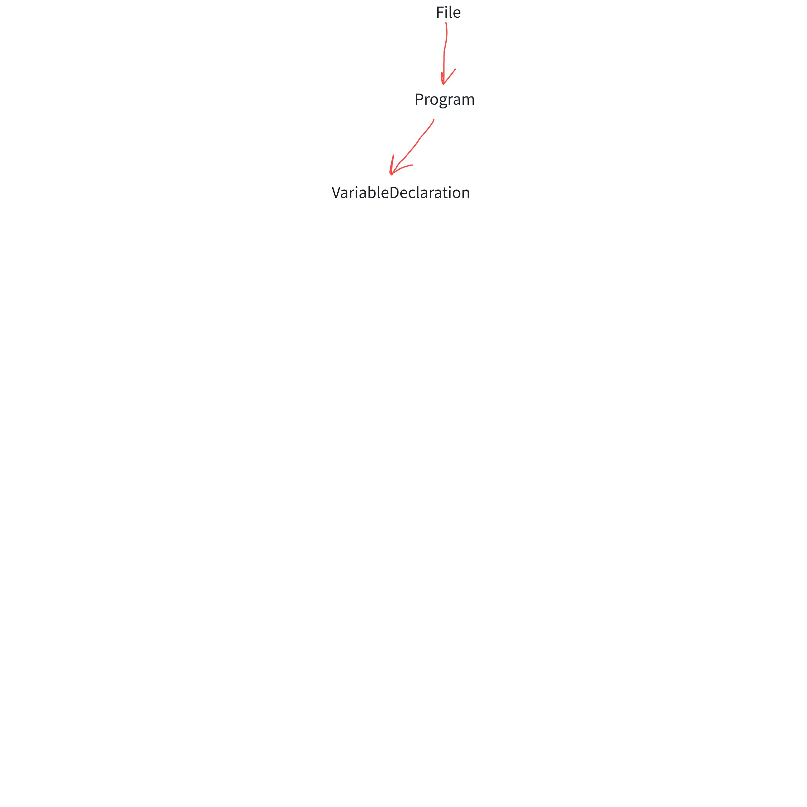
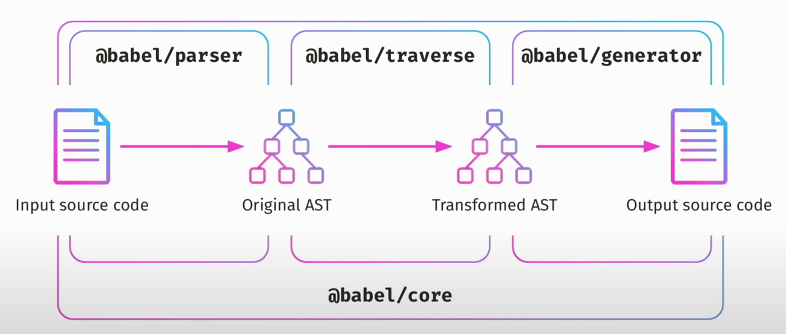
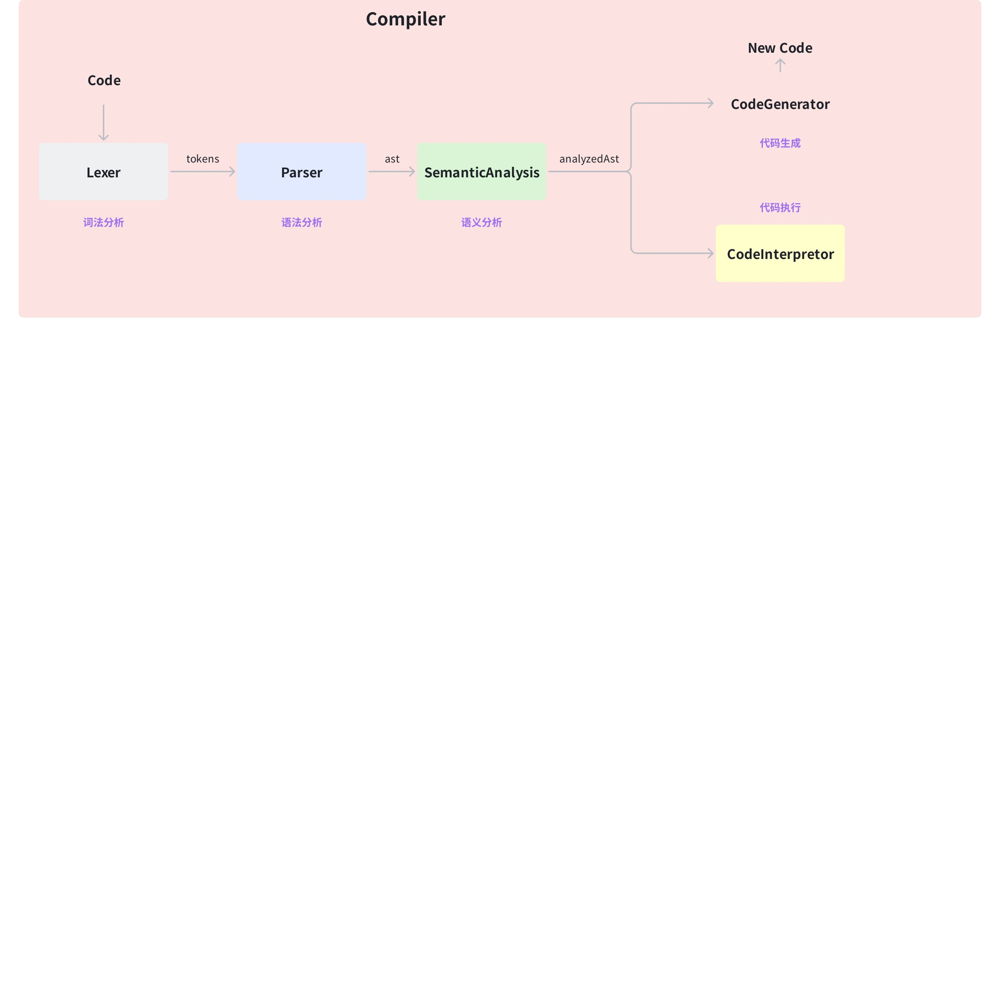
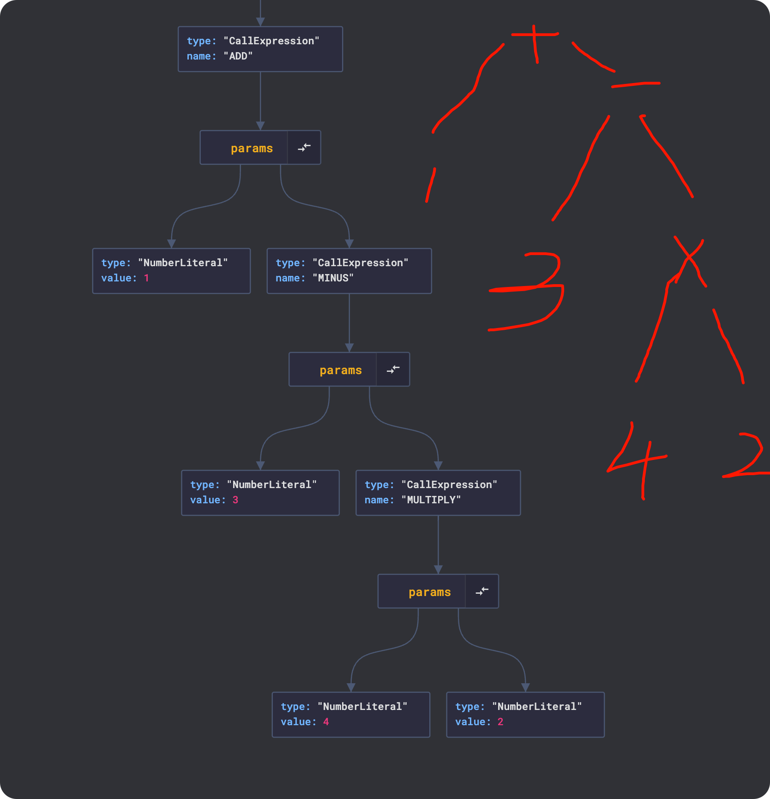
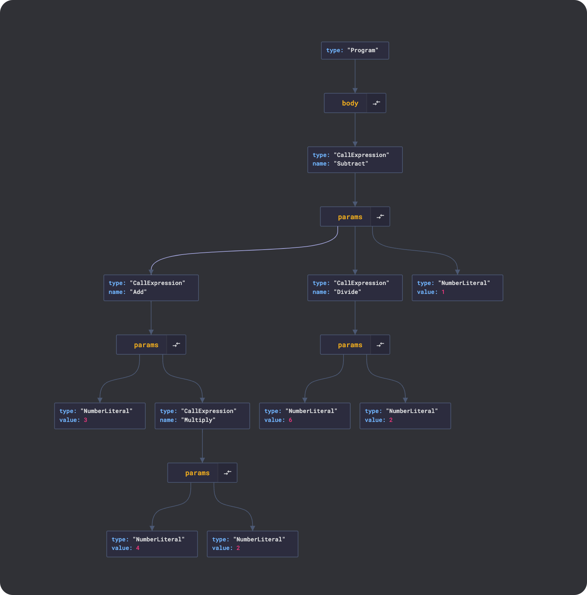

# 3.编译器原理详解

> 原文链接：[飞书原文](https://u19tul1sz9g.feishu.cn/docx/Vu3WdOMDMoy1LgxHgAPc4BGunRf)

[引用：20260207 随堂笔记与源码资料](https://www.feishu.cn/docx/HsQBdlBmsocCuExnY9Jcy99Sn2e)
[本地资源：3.babel-compiler-notes](<../../20260207 随堂笔记与源码资料-压缩包/3.ECMAScript、Typescript 与编译原理详解/3.babel-compiler-notes>)

## 课程目标

> **💡 提示**
>
> - 初中级：
>
>   - **Babel 的基本概念和作用**：学习 Babel 是什么，了解 Babel 的主要功能，如将 ES6+ 代码转化为 ES5 代码，支持插件扩展，提升跨平台的兼容性。
>   - **掌握 Babel 的安装与配置**：学习如何在项目中安装 Babel，掌握如何使用 NPM 或 Yarn 安装所需的 Babel 依赖。了解如何配置 Babel 的核心配置文件（`babel.config.js` 或 `.babelrc`），熟悉常见的 Babel 插件（Plugins）和预设（Presets）
>   - **了解编译原理**：了解编译原理的基本概念，学习编译的三个主要阶段：词法分析、语法分析和代码生成。通过理解这些基本概念，深入理解编译过程的每个阶段如何将源代码转化为目标代码。
> - 高级：
>
>   - **深入理解 Babel 插件与预设机制**：深入研究 Babel 插件和预设的工作原理，了解 Babel 如何通过插件和预设来实现不同的代码转换需求。
>   - **手写 Babel 编译插件**：掌握如何编写自定义 Babel 插件，以实现特定的代码转换需求。通过编写自定义插件，深入理解 Babel 编译的工作流程，并在此过程中学习 AST（抽象语法树）的操作技巧。
>   - **深入理解编译原理**：深入学习编译器的工作原理，特别是如何使用抽象语法树（AST）进行代码的解析、转换和生成。了解 AST 的结构和作用，学习如何通过操作 AST 来实现代码转换，并掌握 Babel 编译过程中如何利用 AST 完成代码的优化和转换。

## 补充资料

- ast 查看器：https://astexplorer.net/
- 强大的 parser 生成器：https://www.antlr.org/
- 官方 babel ast 结构：https://github.com/babel/babel/blob/main/packages/babel-parser/ast/spec.md
- v8 优化编译器：https://v8.dev/blog/maglev
- Chromium V8：https://chromium.googlesource.com/v8/v8.git
- the-super-tiny-compiler：https://github.com/jamiebuilds/the-super-tiny-compiler
- Babel 可选链语法插件：https://github.com/babel/babel/tree/main/packages/babel-plugin-transform-optional-chaining opt?.name
- Taro babel 转化编译过程：https://github.com/NervJS/taro/blob/851ba491d6ee77fbe530452d24029aae12b966d8/packages/taro-transformer-wx/src/index.ts#L368


```JavaScript
/**
 * FINALLY! We'll create our `compiler` function. Here we will link together
 * every part of the pipeline.
 *
 *   1. input  => tokenizer   => tokens
 *   2. tokens => parser      => ast
 *   3. ast    => transformer => newAst
 *   4. newAst => generator   => output
 */
```

## 相关面试真题

### Babel 是什么，它在 JavaScript 开发中的作用是什么？


**答案：**

Babel 是一个 JavaScript 编译器，主要用于将现代 JavaScript 代码（包括 ES6 及更高版本的语法）转换为向后兼容的 JavaScript 代码，以确保在旧版本的浏览器或环境中也能运行。它的作用包括：


1. **语法转换**：将现代 JavaScript 语法（如箭头函数、类、模板字符串等）转换为 ES5 兼容的语法。
2. **Polyfills**：通过使用工具如 `@babel/polyfill`，可以为缺失的 JavaScript 功能（如 `Promise`、`Array.includes` 等）添加兼容性支持。
3. **插件化架构**：Babel 使用插件来扩展其功能，可以根据项目需求加载不同的插件进行定制。
4. **代码优化和压缩**：虽然主要用于语法转换，Babel 也可以与其他工具（如 Terser）集成，以优化和压缩代码。


### 解释 Babel 插件和预设的区别，并举例说明如何在项目中使用它们。


**答案：**

Babel 插件和预设都用于配置 Babel 的行为，但它们有不同的用途和方式：


- **插件（Plugins）**：插件是 Babel 的基本转换单元，负责特定的代码转换任务。例如，将箭头函数转换为普通函数的插件 `@babel/plugin-transform-arrow-functions`。


- **预设（Presets）**：预设是多个插件的集合，用于简化配置。例如，`@babel/preset-env` 预设包含了一系列插件，能够根据目标环境自动选择和加载所需的插件，以实现 ES6+ 到 ES5 的转换。


**使用示例**：

在项目中，通常会创建一个 `.babelrc` 文件进行配置：


```JSON
{
  "presets": ["@babel/preset-env"],
  "plugins": ["@babel/plugin-transform-runtime"]
}
```


这里，`@babel/preset-env` 预设负责将现代 JavaScript 语法转换为兼容的版本，而 `@babel/plugin-transform-runtime` 插件则处理一些辅助代码的转换，避免全局污染。


### 什么是抽象语法树 abstract syntax tree（AST），它在 Babel 中的作用是什么？


**答案：**

抽象语法树（AST）是源代码的抽象语法结构的树状表示，其中每个节点都代表源代码中的一种结构。在编译器和 Babel 的工作流程中，AST 扮演着重要角色。


**AST 在 Babel 中的作用**：


1. **代码解析（Parsing）**：Babel 首先解析源代码，生成 AST。解析器（如 Babylon）将源代码转换为 AST，这是代码转换的第一步。
2. **代码转换（Transformation）**：Babel 插件对 AST 进行遍历和修改，根据需要转换特定的语法结构。例如，箭头函数插件会找到 AST 中的箭头函数节点，并将其转换为普通函数节点。
3. **代码生成（Code Generation）**：在完成所有转换后，Babel 将修改后的 AST 转换回 JavaScript 代码。这一步是通过生成器（如 Babel 的生成器）实现的。


**示例**：

考虑以下 ES6 箭头函数：


```JavaScript
const add = (a, b) => a + b;
```

babel parser 对应 ast 为：

```JSON
{
  "type": "File",
  "start": 0,
  "end": 28,
  "loc": {
    "start": {
      "line": 1,
      "column": 0,
      "index": 0
    },
    "end": {
      "line": 1,
      "column": 28,
      "index": 28
    }
  },
  "errors": [],
  "program": {
    "type": "Program",
    "start": 0,
    "end": 28,
    "loc": {
      "start": {
        "line": 1,
        "column": 0,
        "index": 0
      },
      "end": {
        "line": 1,
        "column": 28,
        "index": 28
      }
    },
    "sourceType": "module",
    "interpreter": null,
    "body": [
      {
        "type": "VariableDeclaration",
        "start": 0,
        "end": 28,
        "loc": {
          "start": {
            "line": 1,
            "column": 0,
            "index": 0
          },
          "end": {
            "line": 1,
            "column": 28,
            "index": 28
          }
        },
        "declarations": [
          {
            "type": "VariableDeclarator",
            "start": 6,
            "end": 27,
            "loc": {
              "start": {
                "line": 1,
                "column": 6,
                "index": 6
              },
              "end": {
                "line": 1,
                "column": 27,
                "index": 27
              }
            },
            "id": {
              "type": "Identifier",
              "start": 6,
              "end": 9,
              "loc": {
                "start": {
                  "line": 1,
                  "column": 6,
                  "index": 6
                },
                "end": {
                  "line": 1,
                  "column": 9,
                  "index": 9
                },
                "identifierName": "add"
              },
              "name": "add"
            },
            "init": {
              "type": "ArrowFunctionExpression",
              "start": 12,
              "end": 27,
              "loc": {
                "start": {
                  "line": 1,
                  "column": 12,
                  "index": 12
                },
                "end": {
                  "line": 1,
                  "column": 27,
                  "index": 27
                }
              },
              "id": null,
              "generator": false,
              "async": false,
              "params": [
                {
                  "type": "Identifier",
                  "start": 13,
                  "end": 14,
                  "loc": {
                    "start": {
                      "line": 1,
                      "column": 13,
                      "index": 13
                    },
                    "end": {
                      "line": 1,
                      "column": 14,
                      "index": 14
                    },
                    "identifierName": "a"
                  },
                  "name": "a"
                },
                {
                  "type": "Identifier",
                  "start": 16,
                  "end": 17,
                  "loc": {
                    "start": {
                      "line": 1,
                      "column": 16,
                      "index": 16
                    },
                    "end": {
                      "line": 1,
                      "column": 17,
                      "index": 17
                    },
                    "identifierName": "b"
                  },
                  "name": "b"
                }
              ],
              "body": {
                "type": "BinaryExpression",
                "start": 22,
                "end": 27,
                "loc": {
                  "start": {
                    "line": 1,
                    "column": 22,
                    "index": 22
                  },
                  "end": {
                    "line": 1,
                    "column": 27,
                    "index": 27
                  }
                },
                "left": {
                  "type": "Identifier",
                  "start": 22,
                  "end": 23,
                  "loc": {
                    "start": {
                      "line": 1,
                      "column": 22,
                      "index": 22
                    },
                    "end": {
                      "line": 1,
                      "column": 23,
                      "index": 23
                    },
                    "identifierName": "a"
                  },
                  "name": "a"
                },
                "operator": "+",
                "right": {
                  "type": "Identifier",
                  "start": 26,
                  "end": 27,
                  "loc": {
                    "start": {
                      "line": 1,
                      "column": 26,
                      "index": 26
                    },
                    "end": {
                      "line": 1,
                      "column": 27,
                      "index": 27
                    },
                    "identifierName": "b"
                  },
                  "name": "b"
                }
              }
            }
          }
        ],
        "kind": "const"
      }
    ],
    "directives": []
  },
  "comments": []
}
```

通过 Babel 和相关插件，该代码的 AST 会首先识别箭头函数的结构，然后插件会将其转换为 ES5 兼容的普通函数：


```JavaScript
const add = function(a, b) {
  return a + b;
};
```


在这个过程中，AST 是整个转换流程的核心，它使得 Babel 能够灵活而精确地对代码进行各种复杂的转换处理。


## Babel 基础使用

babel，一款流行的 JavaScript 编译器，它能将高版本 JavaScript 语法代码转化为低版本 JavaScript 语法代码，有很多 ECMAScript 新提案，都可以使用 babel 解析对应语法从而提前尝鲜。

Babel 的作用主要是：

- 对于高版本 ECMAScript 的解析并编译为低版本语法
- 解决低版本浏览器 js 兼容问题，polyfill 方案（core-js）


学习 babel 需要重点关注以下三个概念：

- Preset
- Plugin
- Target


Preset 是 Plugin 的集合，它将 babel 插件打包从而轻松支持多种转换场景，例如 preset-env 就包含了：`@babel/plugin-transform-arrow-functions` 、`@babel/plugin-transform-for-of` 等。


### 安装 Babel 和插件


首先，我们需要安装 Babel 核心库和箭头函数转换插件：


```Bash
npm install --save-dev @babel/core @babel/cli @babel/plugin-transform-arrow-functions
```


### 创建 Babel 配置文件


接下来，我们创建一个 Babel 配置文件 `babel.config.json`，以便 Babel 使用我们安装的插件进行代码转换：


```JSON
{
  "plugins": ["@babel/plugin-transform-arrow-functions"]
}
```


### 编写待转换代码文件


假设我们有一个包含箭头函数的 JavaScript 文件 `input.js`：


```JavaScript
// input.js
const add = (a, b) => a + b;
const square = n => n * n;

const numbers = [1, 2, 3, 4, 5];
const squares = numbers.map(n => n * n);
console.log(squares);
```


### 执行编译


使用 Babel CLI 工具将 `input.js` 文件转换为普通函数。运行以下命令：


```Bash
npx babel input.js --out-file output.js
```


生成的 `output.js` 文件将包含转换后的代码：


```JavaScript
// output.js
const add = function (a, b) {
  return a + b;
};

const square = function (n) {
  return n * n;
};

const numbers = [1, 2, 3, 4, 5];
const squares = numbers.map(function (n) {
  return n * n;
});
console.log(squares);
```


这样就完成编译啦，不过呢，通常我们在项目中使用 babel 其实不是直接使用，为什么呢？因为工程项目使用到的资源比较多，不止 JavaScript 文件需要处理，还有类似 image、css 等资源需要加工，因此我们就需要类似 Webpack 这类打包工具串联起整个构建工作流，而 babel 只是其中一环。

**💡 提示**

webpack 和 babel 的连接需要 babel-loader，这部分我们会在 webpack 章节详细介绍


### 插件与预设


Babel 插件用于增强 babel 转换能力，Preset 预设用于将插件组合到一起，让开发者更方便快捷地使用 babel 常用插件集。

上面的例子我们领略了 babel 插件的魅力，任何需要支持的功能，都是封装到插件里，然后在 babel 中进行配置。

多个支持不同功能的插件组合在一起，就形成了 babel 预设，其实你可以简单理解为：**babel 预设就是一组提前定好的 babel 插件**。


#### Preset-env

这是一系列基础插件的集合，`@babel/plugin-transform-arrow-functions` 就包含其中，另外还有类似 `@babel/plugin-transform-for-of` 。


使用也比较简单，在依赖安装后，修改配置文件即可。

修改 Babel 配置文件 `babel.config.json`，以便 Babel 使用我们安装的预设进行代码转换：


```JSON
{
  // "plugins": ["@babel/plugin-transform-arrow-functions"]
  "presets": ["@babel/preset-env"]
}
```


#### Preset-react

这个预设见名知意，用于将 react jsx 语法转换为 react 运行时 jsx 函数语法。这个预设包含一个插件：`@babel/plugin-transform-react-jsx`用于支持转换。


```JSON
{
  "presets": ["@babel/preset-react"]
}
```


这样就可以将原始 jsx 代码：

```JavaScript
const Head = () => {
   return <div>123</div>
}
```

转换为：

```JavaScript
import { jsx as _jsx } from "react/jsx-runtime";
var Head = function Head() {
  return /*#__PURE__*/ _jsx("div", {
    children: "123"
  });
};

```


#### Preset-typescript

用于转换 Typescript 为 JavaScript，同样先安装 `@babel/preset-typescript`，其中包含 `@babel/plugin-transform-typescript`。

```JSON
{
  "presets": ["@babel/preset-typescript"]
}
```


## Babel 进阶



babel 是一个非常流行的 JavaScript 编译器

babel 包含以下几个重要包，分别是：

1. @babel/core
2. @babel/parser
3. @babel/traverse 
4. 辅助相关，type polyfill temple 等

### 自定义 babel 插件

我们从零到一编写一个 babel 箭头函数语法转换插件，掌握 babel 插件设计思路与编写规范。

需求很简单就是将箭头函数转换为普通函数

例如：

```JavaScript
const test = () => {
  console.log("Hello, World!");
};

```

通过 babel 编译后，生成代码：

```JavaScript
const test = function () {
  console.log("Hello, World!");
};
```


#### 使用 types 辅助修改

首先定义箭头函数插件：`plugin-arrow-functions.js`

```JavaScript
const { types: t } = require("@babel/core");


module.exports = function () {
  return {
    visitor: {
      ArrowFunctionExpression(path) {
        // 我当前访问到的箭头函数节点
        const { node } = path;
        const body = t.isBlockStatement(node.body)
          ? node.body
          : t.blockStatement([t.returnStatement(node.body)]);
        const functionExpression = t.functionExpression(
          null,
          node.params,
          body,
          node.async
        );
        console.log(
          "🚀 ~ ArrowFunctionExpression ~ functionExpression:",
          functionExpression
        );

        // // 假设箭头函数表达式直接返回值，需要特殊处理
        // if (!t.isBlockStatement(node.body)) {
        //     functionExpression.body = t.blockStatement([
        //       t.returnStatement(node.body),
        //     ]);
        // }

        path.replaceWith(functionExpression);
      },
    },
  };
};
```

通过 types 辅助对象，可以判断当前访问 ast 节点的类型以及对其类型进行加工。

然后在 `babel.config.js` 中定义该插件

```JavaScript
module.exports = {
  plugins: ["./plugin-arrow-functions"],
};

```

最后修改 `package.json`，添加构建脚本命令

```JavaScript
  "scripts": {
    "build": "babel src -d dist"
  },
```


最后执行 `pnpm build` 执行 babel 编译，在 dist 中输出目标资源，经验证符合要求。


#### 使用 @babel/helper-plugin-utils

这个方案只是在 visitor 时有所差异，我们可以这样处理：

```JavaScript

const { declare } = require("@babel/helper-plugin-utils");

module.exports = declare((api, options) => {
  const noNewArrows = api.assumption("noNewArrows") ?? !options.spec;

  return {
    name: "transform-arrow-functions",

    visitor: {
      ArrowFunctionExpression(path) {
        // In some conversion cases, it may have already been converted to a function while this callback
        // was queued up.
        if (!path.isArrowFunctionExpression()) return;

        path.arrowFunctionToExpression({
          allowInsertArrow: false,
          noNewArrows,

          // This is only needed for backward compat with @babel/traverse <7.13.0
          // @ts-ignore(Babel 7 vs Babel 8) Removed in Babel 8
          specCompliant: !noNewArrows,
        });
        // }
      },
    },
  };
});

```


### Babel 编译过程



Babel 最核心的流程我们可以概括为上图所示，parser -> traverse -> generator


我们以一个问题来切入，请听题：

请将以下代码，转为 ES5 代码

```JavaScript
const a = 1;
let b = 2;
var c = "heyi";
```

转为

```JavaScript
var a = 1;
var b = 2;
var c = "heyi";
```


#### parser

借助 `@babel/parser` 将源代码转为 ast 结构，即：

```JavaScript
const parser = require('@babel/parser');

const ast = parser.parse(code);
```


#### traverse

借助 `@babel/traverse` 将 ast 进行处理生成新 ast，即：

```JavaScript
const traverse = require('@babel/traverse');

// 访问者对象
const visitor = {
// 遍历声明表达式 
// 可以直接通过节点的类型操作AST节点。
VariableDeclaration(path) {
    // 替换
    if (path.node.kind === 'var') {
      path.node.kind = 'let';
    }
},
};
traverse.default(ast, visitor);
```

或者

```JavaScript
const traverse = require('@babel/traverse');

traverse.default(ast, {
    enter(path) {
      if (path.isVariableDeclaration({ kind: 'var' })) {
        path.node.kind = 'let'
      }
    },
  })
```


#### generator

借助 `@babel/generator` 根据目标 ast 生成目标代码，示例：

```JavaScript
const generator = require('@babel/generator')

generator.default(ast, {}, code).code
```


#### 完整过程

```JavaScript
const parser = require('@babel/parser');
const traverse = require('@babel/traverse');
const generator = require('@babel/generator');

const trans = (code) => {
  const ast = parser.parse(code);
  // 访问者对象
  const visitor = {
    // 遍历声明表达式 
    // 可以直接通过节点的类型操作AST节点。
    VariableDeclaration(path) {
        // 替换
        if (path.node.kind === 'var') {
          path.node.kind = 'let';
        }
    },
  };
  traverse.default(ast, visitor);
  // 生成代码
  const newCode = generator.default(ast, {}, code).code;
  return newCode;
};

const code = `const a = 1
let b = 2
var c = 3`;
console.log(trans(code));
```


## 编译原理



**💡 提示**

1. 词法分析（Lexical Analysis）：将源代码转换成单词流，称为“词法单元”（tokens），每个词法单元包含一个标识符和一个属性值，比如变量名、数字、操作符等等。
2. 语法分析（Parsing）：将词法单元流转换成抽象语法树（Abstract Syntax Tree，简称AST），也就是标记所构成的数据结构，表示源代码的结构和规则。
3. 语义分析（Semantic Analysis）：在AST上执行类型检查、作用域检查等操作，以确保代码的正确性和安全性。
4. 代码生成（Code Generation）：基于AST生成目标代码，包括优化代码结构、生成代码文本、进行代码压缩等等。
下面是一个简单的JavaScript编译器示例代码：
其中：
`lexer` 是词法分析器，将源代码转换成词法单元流；
`parser` 是语法分析器，将词法单元流转换成抽象语法树；
`semanticAnalysis` 是语义分析器，对抽象语法树进行语义分析；
`codeGeneration` 是代码生成器，将分析后的AST生成目标代码。

### **词法分析(Lexical Analysis)**

#### **目的**

将文本分割成一个个的“token”，例如：init、main、init、x、;、x、=、3、;、}等等。同时它可以去掉一些注释、空格、回车等等无效字符；

#### **生成方式**

词法分析生成token的办法有2种：

- ~~正则匹配~~
- 状态机


##### 正则

很多同学可能遇到字符串匹配的操作，自然就想到正则匹配。在普通场景下，正则用来做字符串匹配没什么问题，但如果是在编译器场景下，就很不合适，因为正则模式首先需要写大量的正则表达式，正则之间还有冲突需要处理，另外正则不容易维护，并且性能不高。

正则只适合一些简单的模板语法，真正复杂的语言并不合适。并且有的语言并不一定自带正则引擎。


##### 状态机

自动机可以很好的生成 token；

有穷状态自动机（finite state machine）：在有限个输入的情况下，在这些状态中转移并期望最终达到终止状态。

有穷状态自动机根据确定性可以分为：

- “确定有穷状态自动机”（**DFA - Deterministic finite automaton**）

在输入一个状态时，只得到一个固定的状态。DFA 可以认为是一种特殊的 NFA；

- “非确定有穷自动机”（**NFA - Non-deterministic finite automaton**）

当输入一个字符或者条件得到一个状态机的集合。JavaScript 正则采用的是 **NFA** 引擎；


### **语法分析(Syntactic Analysis)**

我们日常所说的编译原理就是将一种语言转换为另一种语言。编译原理被称为形式语言，它是一类无需知道太多语言背景、无歧义的语言。而自然语言通常难以处理，主要是因为难以识别语言中哪些是名词哪些是动词哪些是形容词。例如：“进口汽车”这句话，“进口”到底是动词还是形容词？所以我们要解析一门语言，前提是这门语言有严格的语法规定。


1956年，乔姆斯基将文法按照规范的严格性分为0型、1型、2型和3型共4种文法，从0到3文法规则是逐渐增加严的。一般的计算机语言是2型，因为0和1型文法定义宽松，将大大增加解析难度、降低解析效率，而3型文法限制又多，不利于语言设计灵活性。2型文法也叫做上下文无关文法（CFG）。


 语法分析的目的就是通过**词法分析器**拿到的 **token** 流 + 结合文法规则，通过一定算法得到一颗抽象语法树（AST）。抽象语法树是非常重要的概念，尤其在前端领域应用很广。典型应用如babel插件，它的原理就是：es6 代码 → Babylon.parse → AST → babel-traverse → 新的AST → es5代码。


 从生成AST效率和实现难度上，前人总结主要有2种解析算法：

- 自顶向下的分析方法和自底向上的分析方法。自底向上算法分析文法范围广，但实现难度大。
- 自顶向下算法实现相对简单，并且能够解析文法的范围也不错，所以一般的 compiler 都是采用深度优先索引的方式。


### **代码转换（Transformation）**

在得到AST后，我们一般会先将AST转为另一种AST，目的是生成更符合预期的AST，这一步称为代码转换。


代码转换的优势：主要是产生工程上的意义


- 易移植：与机器无关，所以它作为中间语言可以为生成多种不同型号的目标机器码服务；
- 机器无关优化：对中间码进行机器无关优化，利于提高代码质量；
- 层次清晰：将AST映射成中间代码表示，再映射成目标代码的工作分层进行，使编译算法更加清晰 ；


对于一个Compiler而言，在转换阶段通常有两种形式：

- 同语言的AST转换；
- AST 转换为新语言的 AST；


这里有一种通用的做法是，对我们之前的AST从上至下的解析（称为traversal），然后会有个映射表（称为visitor），把对应的类型做相应的转换。


### **代码生成 (Code Generation)**

在实际的代码处理过程中，可能会递归的分析我们最终生成的AST，然后对于每种 type 都有个对应的函数处理。这部分我们会在编译实战具体看到，实现思路用到的设计模式就是**策略模式**。


### **完整链路(Compiler)**

至此，我们就完成了一个完整的compiler的所有过程：

```JavaScript
input => tokenizer => tokens; // 词法分析
tokens => parser => ast; // 语法分析，生成AST
ast => transformer => newAst; // 中间层代码转换
newAst => generator => output; // 生成目标代码
```


```JavaScript
const a = 1;
/**
 * const
 * a
 * =
 * 1
 * ;
 */

const  -> token
let -> token
var -> token
function -> token
for -> token
while -> token

```


### 公式编译执行器实战【放到业务重难点（低代码公式编辑器+公式执行）】

我们通过一个实战来进一步学习编译原理相关内容，并开发公式编译器与公式执行器。

假设我们的语法诸如：

> ADD(1, MINUS(3, 2))
> 
> Subtract(Add(3, Multiply(4, 2)), Divide(6, 2), 1)


#### 定义 Token

- /\d/
- /[a-zA-Z]/
- (
- )
- .


实现分词器 `Tokenizer`

```JavaScript
function tokenize(expression) {
  const tokens = [];
  let current = 0;

  while (current < expression.length) {
    let char = expression[current];

    // 匹配数字
    if (/\d/.test(char)) {
      let number = "";
      while (/\d/.test(char)) {
        number += char;
        char = expression[++current];
      }
      tokens.push({ type: "number", value: parseInt(number) });
      continue;
    }

    // 匹配函数名和操作符
    if (/[a-zA-Z]/.test(char)) {
      let fnName = "";
      while (/[a-zA-Z]/.test(char)) {
        fnName += char;
        char = expression[++current];
      }
      tokens.push({ type: "function", value: fnName });
      continue;
    }

    // 匹配括号和逗号
    if (char === "(" || char === ")" || char === ",") {
      tokens.push({ type: char, value: char });
      current++;
      continue;
    }

    // 跳过空格
    if (char === " ") {
      current++;
      continue;
    }

    throw new TypeError("Unknown character: " + char);
  }

  return tokens;
}
```

#### 实现 parser

parser 根据生成的 token 流进行转换，转化为我们预先预定好的 ast，生成的 ast 可供后续代码转换生成或者公式内容执行用。

重点有几个类型

- number
- function
- ）
- ,

```JavaScript
function parse(tokens) {
  let current = 0;

  function walk() {
    let token = tokens[current];

    // 处理数字
    if (token.type === "number") {
      current++;
      return { type: "NumberLiteral", value: token.value };
    }

    // 处理函数调用
    if (token.type === "function") {
      current++;
      let node = {
        type: "CallExpression",
        name: token.value,
        params: [],
      };

      token = tokens[++current]; // 跳过左括号

      // 循环，直到遇到右括号
      while (token.type !== ")") {
        node.params.push(walk());
        token = tokens[current];
        if (token.type === ",") {
          current++; // 跳过逗号
        }
      }

      current++; // 跳过右括号
      return node;
    }

    throw new TypeError("Unrecognized token type: " + token.type);
  }

  let ast = {
    type: "Program",
    body: [],
  };

  while (current < tokens.length) {
    ast.body.push(walk());
  }

  return ast;
}
```

```JavaScript
ADD(1, MINUS(3, MULTIPLY(4, 2)))
```

编译结果：ast



#### 定义执行器

根据 ast，编写遍历节点需要执行的运算

```JavaScript
function interpret(ast) {
  const operators = {
    Add: (a, b) => a + b,
    Subtract: (a, b, c) => a - b - c,
    Multiply: (a, b) => a * b,
    Divide: (a, b) => a / b,
  };

  function traverseNode(node) {
    switch (node.type) {
      case "NumberLiteral":
        return node.value;
      case "CallExpression":
        const args = node.params.map(traverseNode);
        const operator = operators[node.name];
        if (!operator) {
          throw new TypeError("Unknown function: " + node.name);
        }
        return operator(...args);
      default:
        throw new TypeError(node.type);
    }
  }

  return traverseNode(ast.body[0]);
}
```


#### 使用

```JavaScript
const expression = "Subtract(Add(3, Multiply(4, 2)), Divide(6, 2), 1)";
const tokens = tokenize(expression);
const ast = parse(tokens);
console.log(
  "🚀 ~ file: 3.base-formula-calculator.js:128 ~ ast:",
  JSON.stringify(ast)
);
const result = interpret(ast);
console.log(result);

```



#### 优化

其实可以优化的点有很多，主要包括：

1. 将运算功能设计为插件，通过插件注册方式拓展运算功能
2. 支持预设变量，在公式进行计算时，把预设变量对应值一起进行计算


最终完整代码

```JavaScript
// Tokenizer
function tokenize(expression) {
  const tokens = [];
  let current = 0;

  while (current < expression.length) {
      let char = expression[current];

      if (/\d/.test(char)) {
          let number = '';
          while (/\d/.test(char)) {
              number += char;
              char = expression[++current];
          }
          tokens.push({ type: 'number', value: parseInt(number) });
          continue;
      }

      if (/[a-zA-Z]/.test(char)) {
          let id = '';
          while (/[a-zA-Z]/.test(char)) {
              id += char;
              char = expression[++current];
          }

          // Skip spaces after identifier to check for '('
          while (expression[current] === ' ') {
              current++;
          }

          // Check if next character is '(', indicating a function
          if (expression[current] === '(') {
              tokens.push({ type: 'function', value: id });
          } else {
              tokens.push({ type: 'variable', value: id });
          }
          continue;
      }

      if (char === '(' || char === ')' || char === ',') {
          tokens.push({ type: char, value: char });
          current++;
          continue;
      }

      if (char === '.') {
          tokens.push({ type: 'dot', value: '.' });
          current++;
          continue;
      }

      if (char === ' ') {
          current++;
          continue;
      }

      throw new TypeError('Unknown character: ' + char);
  }

  return tokens;
}

// Parser
function parse(tokens) {
  let current = 0;

  function walk() {
      let token = tokens[current];

      if (token.type === 'number') {
          current++;
          return { type: 'NumberLiteral', value: token.value };
      }

      if (token.type === 'function') {
          current++;
          const node = {
              type: 'CallExpression',
              name: token.value,
              params: []
          };
          token = tokens[++current]; // Skip '('

          while (token.type !== ')') {
              node.params.push(walk());
              token = tokens[current];
              if (token.type === ',') {
                  current++; // Skip ','
              }
          }

          current++; // Skip ')'
          return node;
      }

      if (token.type === 'variable') {
          let value = token.value;
          current++;

          // Handle properties like 'person.age'
          while (tokens[current] && tokens[current].type === 'dot') {
              current++; // Skip '.'

              if (tokens[current] && tokens[current].type === 'variable') {
                  value += '.' + tokens[current].value;
                  current++;
              } else {
                  throw new TypeError('Expected variable after "."');
              }
          }

          return { type: 'Variable', value };
      }

      throw new TypeError('Unknown token type: ' + token.type);
  }

  const ast = {
      type: 'Program',
      body: []
  };

  while (current < tokens.length) {
      ast.body.push(walk());
  }

  return ast;
}

// Interpreter
function interpret(ast, context = {}) {
  const operators = {
      'Add': (a, b) => a + b,
      'Subtract': (a, b) => a - b,
      'Multiply': (a, b) => a * b,
      'Divide': (a, b) => a / b
  };

  function traverseNode(node) {
      if (node.type === 'NumberLiteral') {
          return node.value;
      }

      if (node.type === 'Variable') {
          const keys = node.value.split('.');
          let value = context;
          for (let key of keys) {
              if (!(key in value)) {
                  throw new TypeError('Unknown variable: ' + key);
              }
              value = value[key];
          }
          return value;
      }

      if (node.type === 'CallExpression') {
          const args = node.params.map(traverseNode);
          const func = operators[node.name];
          if (!func) {
              throw new TypeError('Unknown function: ' + node.name);
          }
          return func(...args);
      }

      throw new TypeError('Unknown node type: ' + node.type);
  }

  return traverseNode(ast.body[0]);
}

// 使用示例
const person = { age: 2 };
const expression = "Subtract(Add(3, Multiply(4, person.age)), Divide(6, person.age))";
const tokens = tokenize(expression);
console.log('🚀 ~ file: 6.with-variable-formula-calculator.js:175 ~ tokens:', tokens)
const ast = parse(tokens);
console.log('🚀 ~ file: 6.with-variable-formula-calculator.js:177 ~ ast:', JSON.stringify(ast))
const result = interpret(ast, { person });


console.log(result); // 应输出 8
```


## JavaScript/Typescript 编译器展望【了解】

### SWC (Speedy Web Compiler)


**简介**：

SWC 是一个用 Rust 编写的 JavaScript/TypeScript 编译器。它的设计目标是提供高性能和高效率，能够快速地将现代 JavaScript 和 TypeScript 代码编译为兼容的 JavaScript 代码。


**用法**：


1. **安装 SWC**：

   ```Bash
   npm install --save-dev @swc/core @swc/cli
   ```


1. **配置 SWC**：

创建一个 `.swcrc` 配置文件：

```JSON
{
  "jsc": {
    "parser": {
      "syntax": "typescript",
      "tsx": false
    },
    "target": "es5"
  }
}
```


1. **编写代码**：

创建一个包含 JavaScript 或 TypeScript 代码的文件，比如 `src/index.ts`：

```TypeScript
const add = (a: number, b: number): number => a + b;
console.log(add(2, 3));
```


1. **编译代码**：

   ```Bash
   npx swc src -d dist
   ```


**原理**：

SWC 使用 Rust 编写，具有高性能和高并发的特点。它解析源码，构建抽象语法树（AST），进行代码转换，并生成目标代码。由于使用了 Rust 语言的高效编译特性，SWC 比传统的 JavaScript 编译器速度更快。


### Esbuild


**简介**：

Esbuild 是一个用 Go 编写的超快 JavaScript 和 TypeScript 打包工具和编译器。它的设计目标是提供极快的编译速度和高效的打包性能。


**用法**：


1. **安装 Esbuild**：

   ```Bash
   npm install --save-dev esbuild
   ```


1. **编写代码**：

创建一个包含 JavaScript 或 TypeScript 代码的文件，比如 `src/index.ts`：

```TypeScript
const add = (a: number, b: number): number => a + b;
console.log(add(2, 3));
```


1. **编译代码**：

使用 Esbuild CLI 编译代码：

```Bash
npx esbuild src/index.ts --bundle --outfile=dist/bundle.js --target=es2015
```


   或者在脚本中配置：

```JavaScript
const esbuild = require('esbuild');

esbuild.build({
  entryPoints: ['src/index.ts'],
  bundle: true,
  outfile: 'dist/bundle.js',
  target: 'es2015'
}).catch(() => process.exit(1));
```


**原理**：

Esbuild 使用 Go 语言编写，利用 Go 的并发特性和高效的内存管理，实现了极快的编译和打包速度。它通过并行化处理、减少中间表示（IR）的转换步骤以及高效的算法来提升性能。Esbuild 可以将多种模块格式（如 ES6 模块、CommonJS 模块）打包成一个单独的文件，从而提高加载速度和性能。
