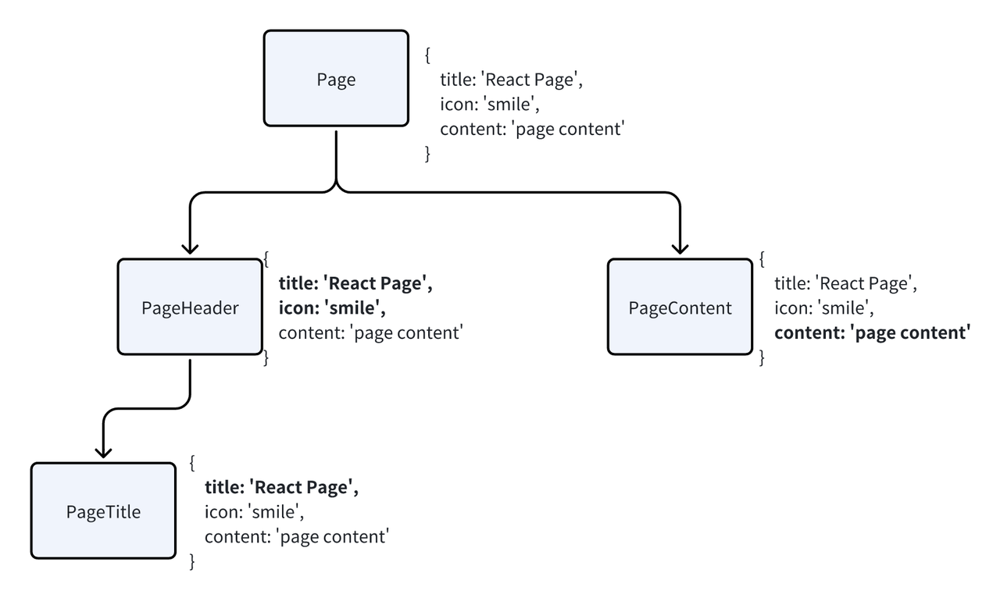
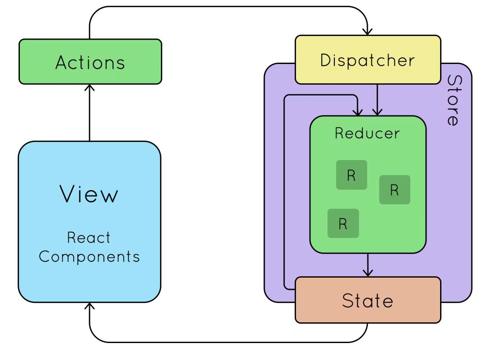
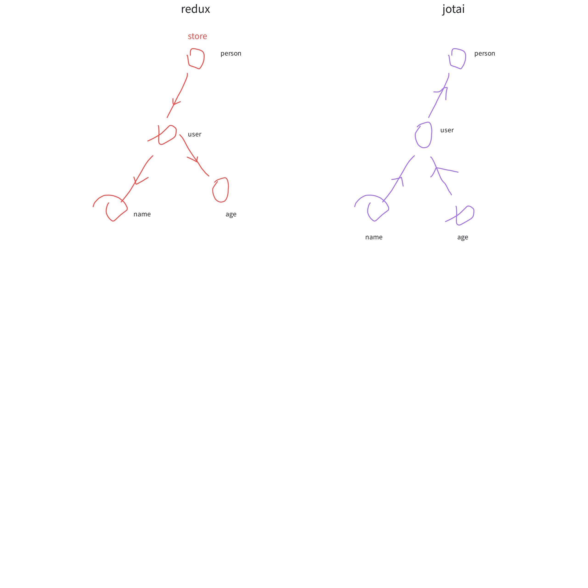

# 3.React19 状态管理方案与原理剖析

> 原文链接：[飞书原文](https://u19tul1sz9g.feishu.cn/docx/UDkrdjOZTovoCAxZIftcEsoFnKh)

[引用：20260207 随堂笔记与源码资料](https://www.feishu.cn/docx/HsQBdlBmsocCuExnY9Jcy99Sn2e)

## 课程目标

> **💡 提示**
>
> - 初中级：
>
>   1. **掌握 React 状态管理方案**： 熟悉 React 状态管理的基础概念与实现方法，涵盖 `useState`、`useReducer`、`useContext`、`useSyncExternalStore` 等常用钩子
>   2. **掌握常见的集中状态管理库**： 熟悉 Redux、Zustand、Jotai 等常见的 React 集中状态管理方案，能够根据项目需求选择使用
>   3. **了解 Redux 原理**： 理解 Redux 的核心概念，包括单一状态树、reducer、action 和 state flow，掌握其单向数据流的实现方式
> - 高级：
>
>   1. **深入理解 React 集中状态管理**： 精通 React 集中状态管理方案的实现原理，能根据项目需求深入分析并选择合适的解决方案
>   2. **手写 Redux**： 从零开始手写简化版 Redux，实现核心功能，如 `createStore`、`combineReducers`、`applyMiddleware` 等，理解底层实现原理
>   3. **浅析其他状态管理库原理**： 分析流行的其他状态管理库，如 Valtio、XState、MobX、Recoil、**Zustand**、**Jotai** 等，理解其设计理念、适用场景、优缺点，并能够在实际项目中根据需求选择最佳方案

## 补充资料

- 官方文档：https://react.dev/reference/react/useReducer
- useState 与 useReducer 的同一出处：https://github.com/facebook/react/blob/454fb35065053d5572689af1a7c125a41849604a/packages/react-reconciler/src/ReactFiberHooks.js#L1883
- useTransition 的定义：https://github.com/facebook/react/blob/454fb35065053d5572689af1a7c125a41849604a/packages/react-reconciler/src/ReactFiberHooks.js#L3245
- 基于 proxy 实现的状态管理：https://valtio.pmnd.rs/
- 原子状态 jotai：https://jotai.org/
- 新晋状态管理 zustand：https://docs.pmnd.rs/zustand/getting-started/introduction
- mantine 自定义状态实现：https://github.com/mantinedev/mantine/blob/master/packages/%40mantine/store/src/store.ts


## 相关面试真题


### 用过哪些状态管理方案，怎么选择？


**答案：**


我用过的状态管理方案主要包括以下几种：


1. **React 自带的状态管理工具**：

   - **useState**：用于管理简单的组件内部状态。适合用于管理不需要跨组件共享的小型状态。
   - **useReducer**：适合管理复杂的状态逻辑，尤其是状态的更新涉及多个子状态时。类似于 Redux 的工作方式。


1. **Context API**：

   - 用于跨组件树传递数据，适合在较小规模的项目中或者只有少量全局状态时使用。优点是配置简单，缺点是在频繁更新时可能会导致性能问题。


1. **Redux**：

   - 适合大型项目和状态复杂的应用。通过单一状态树和纯函数（reducer）来管理状态变化，提供了中间件机制（如 Redux Thunk、Redux Saga）来处理异步操作。


1. **MobX**：

   - 通过使用观察者模式来自动追踪状态和组件的依赖关系，简化了状态管理。适合那些需要响应式数据管理和直接操作状态的项目。


1. **Recoil**：

   - 由 Facebook 开发的新状态管理库，能够更好地与 React 的 Concurrent Mode 结合。适合需要细粒度状态管理和良好性能的项目。


1. **Zustand**：

   - 轻量级状态管理库，提供简单且直观的 API，适合中小型项目以及希望保持代码简洁的开发者。


**选择状态管理方案的原则**：

- **项目规模**：小型项目或状态不复杂时，useState 和 Context API 足够；大型项目或者状态复杂时，Redux 或 MobX 是更好的选择。
- **状态复杂度**：状态逻辑复杂且需要处理异步操作时，Redux 是较好的选择；状态简单且直观时，Zustand 或者 MobX 可能更方便。
- **性能需求**：需要高性能的应用可以考虑 Recoil 或者 MobX，它们在处理频繁状态变化时表现更好。
- **团队熟悉度**：选择团队熟悉且擅长的工具可以提高开发效率和代码质量。


### 说说你对 Redux 的理解？


**答案：**


redux 是一种用于 JavaScript 应用的状态管理工具，特别适用于 React 应用。它通过单一的状态树来管理整个应用的状态，使状态管理更加可预测和易于调试。首先注意，redux 跟 react 本身并没有任何关系，redux 和 react 的关系完全取决于 react-redux


- **单一状态树**：Redux 使用一个单一的状态树来存储应用的所有状态，这个状态树是一个不可变对象。这使得状态管理变得简单且直观，可以轻松地跟踪和调试应用的状态变化。


- **纯函数 reducer**：状态的变化通过纯函数 reducer 来处理。Reducer 接收当前状态和动作（action），返回新的状态。由于 reducer 是纯函数，这意味着相同的输入总是产生相同的输出，没有副作用，使得状态更新更加可预测和可测试。


- **动作（action）**：动作是一个描述状态变化的普通 JavaScript 对象，通常包含一个 `type` 属性和一些相关的数据。动作是触发状态变化的唯一方式。


- **中间件（middleware）**：Redux 提供了中间件机制，允许在动作被发送到 reducer 之前或之后执行一些逻辑。常见的中间件有 Redux Thunk 和 Redux Saga，用于处理异步操作和副作用。


- **数据流**：Redux 采用单向数据流，动作从组件派发（dispatch），经过中间件处理后，到达 reducer，生成新的状态，然后更新到组件。这种单向数据流简化了数据的跟踪和调试。


- **工具支持**：Redux 有强大的工具支持，如 Redux DevTools，可以方便地查看和调试应用的状态变化。


### 状态改变引发视图频繁更新，怎么优化？


**答案：**


优化状态改变引发的视图频繁更新可以从以下几个方面入手：


1. **避免不必要的状态更新**：

   - 仅在必要时更新状态，避免每次渲染都触发状态更新。
   - 使用 `shouldComponentUpdate` 或 `React.memo` 来控制组件是否需要重新渲染。
   - 在函数组件中，使用 `React.memo` 和 `useCallback` 来记忆组件和回调，防止不必要的重新渲染。


1. **拆分组件**：

   - 将大的组件拆分为多个小的组件，每个小组件只关心自身的状态和属性。这样，状态的变化只会影响相关的小组件，而不会导致整个大组件重新渲染。


1. **使用 React Context 的优化**：

   - 在使用 Context API 时，避免将整个应用状态放入一个 Context 中，可以拆分成多个 Context，每个 Context 只管理一部分状态。这样可以减少不相关状态变化引发的组件更新。


1. **优化 Redux**：

   - 使用 `reselect` 库来创建 memoized 选择器（selectors），避免每次状态变化都重新计算衍生状态。
   - 使用 `redux-thunk` 或 `redux-saga` 来处理复杂的异步逻辑，避免不必要的状态更新。
   - 确保 reducer 是纯函数且高效，避免复杂的计算放在 reducer 中进行。


1. **批量更新**：

   - React 在一个事件循环中会批量处理状态更新，确保多个状态更新操作在同一个事件循环中执行，可以减少不必要的渲染次数。例如，使用 `ReactDOM.unstable_batchedUpdates` 手动批量处理状态更新。


1. **避免过深的组件嵌套**：

   - 组件嵌套层次过深会导致状态传递和更新变得复杂，尽量保持组件层次的扁平化，减少层级嵌套带来的性能问题。


1. **使用合适的状态管理工具**：

   - 根据项目的复杂度和需求选择合适的状态管理工具，不要为了使用工具而增加不必要的复杂度。例如，小型项目中不必使用 Redux，可以使用更简单的 **Context API** 或者 **Zustand** 等轻量级工具。
2. **细颗粒度更新**

   - 例如使用 Zustand `useSelector` api **细粒度订阅**
   - Immer ，基于 proxy，实现细粒度


## 基础状态管理方案


**💡 提示**

状态方案选型依据
1. 如果是基础简单场景，考虑选用 useState
2. 状态相对复杂，但是不需要全局存储的话，useReducer
3. 如果状态跨层级消费，那么就需要使用，useContext
4. 状态在跨组件间使用，并且相对复杂，我们就考虑使用集中状态管理方案（redux、zustand、jotai）


### useState


`useState` 是 React 提供的最基本的 Hook，用于在函数组件中添加状态管理。它返回一个状态变量和一个更新状态的函数。


#### **使用场景**


- 适合管理简单的状态。
- 适合管理组件内部的局部状态。


#### 示**例代码**


```JavaScript
import React, { useState } from 'react';

function Counter() {
  const [count, setCount] = useState(0);

  return (
    <div>
      <p>Count: {count}</p>
      <button onClick={() => setCount(count + 1)}>Increment</button>
      <button onClick={() => setCount(count - 1)}>Decrement</button>
    </div>
  );
}
```


### useReducer


`useReducer` 是 `useState` 的替代方案，适合用于管理更复杂的状态逻辑。它通过 reducer 函数来管理状态，类似于 Redux。

如果我们组件内部状态足够过，那么状态会逐渐趋于复杂，这时，我们需要更好的编程范式来解决状态存储与更新。相信之前有同学使用过 `redux`，react 单向数据流告诉了我们，状态的管理需要注意以下几点：

1. 使用一个对象存储变量 （**state**）
2. 订阅模式实现对于该对象的变更响应处理 （**reducer**）
3. 定义更改对象变更的动作 （**action**）
4. 订阅该对象的变更，完成状态到视图的映射（**ui = fx(state)**）

用一句话来概括：状态由 useReducer 借助 reducer 生发，状态的变更由 dispach 发起，最终状态变更驱动视图更新


#### 使用场景


- 适合管理复杂的状态逻辑。
- 状态更新依赖于先前状态。


#### 示例代码


```JavaScript
import React, { useReducer } from 'react';

const initialState = { count: 0 };

function reducer(state, action) {
  switch (action.type) {
    case 'INCREMENT':
      return { count: state.count + 1 };
    case 'DECREMENT':
      return { count: state.count - 1 };
    default:
      return state;
  }
}

function Counter() {
  const [state, dispatch] = useReducer(reducer, initialState);

  return (
    <div>
      <p>Count: {state.count}</p>
      <button onClick={() => dispatch({ type: 'INCREMENT' })}>Increment</button>
      <button onClick={() => dispatch({ type: 'DECREMENT' })}>Decrement</button>
    </div>
  );
}
```


### useContext


`useContext` 用于共享全局状态，避免了通过多层组件传递 props。它通过 Context 对象提供全局状态管理。


#### 使用场景


- 适合管理跨组件树的全局状态。
- 避免多层组件传递 props。


在使用前，我们需要先明确两个核心的概念，这样能帮助大家使用

1. 提供者，Provider
2. 消费者，Consumer


#### 示例代码


```JavaScript
import React, { createContext, useContext, useState } from 'react';

const CountContext = createContext();

function CounterProvider({ children }) {
  const [count, setCount] = useState(0);
  return (
    <CountContext.Provider value={{ count, setCount }}>
      {children}
    </CountContext.Provider>
  );
}

function CounterDisplay() {
  const { count } = useContext(CountContext);
  return <p>Count: {count}</p>;
}

function CounterControls() {
  const { count, setCount } = useContext(CountContext);
  return (
    <div>
      <button onClick={() => setCount(count + 1)}>Increment</button>
      <button onClick={() => setCount(count - 1)}>Decrement</button>
    </div>
  );
}

function App() {
  return (
    <CounterProvider>
      <CounterDisplay />
      <CounterControls />
    </CounterProvider>
  );
}
```


假设我们有更复杂的场景




首先定义 react context：

```TypeScript
import React from "react";

export const PageContext = React.createContext({
  title: "Page Title"
});

```

提供者将数据提供给后代元素，像这样：

```HTML
<PageContext.Provider value={{ title: "Page Title" }}>
  <PageTitle />
</PageContext.Provider>
```

在后代组件中，就可以消费其提供的数据啦：

```HTML
<PageContext.Consumer>{({ title }) => title}</PageContext.Consumer>
```

当然，通常我们很少使用 `Consumer` 进行数据消费，而是我们会借助 hook 来完成，我们改造一下 `PageTitle`

```TypeScript
import { useContext } from "react";
import { PageContext } from "./PageContext";

export const PageTitle = () => {
  const { title } = useContext(PageContext);
  return (
    <div>
      {/* <PageContext.Consumer>{({ title }) => title}</PageContext.Consumer> */}
      {title}
    </div>
  );
};

```


### 综合示例


#### 场景描述


假设我们有一个复杂的应用，需要管理用户的登录状态、主题设置和计数器状态。我们可以结合 `useState`、`useReducer` 和 `useContext` 来实现。


#### 示例代码


```JavaScript
import React, { createContext, useContext, useReducer, useState } from 'react';

// 创建 Context
const AppContext = createContext();

// 定义初始状态和 reducer
const initialState = { count: 0 };
function reducer(state, action) {
  switch (action.type) {
    case 'INCREMENT':
      return { count: state.count + 1 };
    case 'DECREMENT':
      return { count: state.count - 1 };
    default:
      return state;
  }
}

// 定义 Context 提供者组件
function AppProvider({ children }) {
  const [countState, dispatch] = useReducer(reducer, initialState);
  const [user, setUser] = useState(null);
  const [theme, setTheme] = useState('light');

  return (
    <AppContext.Provider value={{ countState, dispatch, user, setUser, theme, setTheme }}>
      {children}
    </AppContext.Provider>
  );
}

// 计数器组件
function Counter() {
  const { countState, dispatch } = useContext(AppContext);
  return (
    <div>
      <p>Count: {countState.count}</p>
      <button onClick={() => dispatch({ type: 'INCREMENT' })}>Increment</button>
      <button onClick={() => dispatch({ type: 'DECREMENT' })}>Decrement</button>
    </div>
  );
}

// 用户组件
function User() {
  const { user, setUser } = useContext(AppContext);
  return (
    <div>
      <p>User: {user ? user.name : 'No user logged in'}</p>
      <button onClick={() => setUser({ name: 'John Doe' })}>Log in</button>
      <button onClick={() => setUser(null)}>Log out</button>
    </div>
  );
}

// 主题组件
function Theme() {
  const { theme, setTheme } = useContext(AppContext);
  return (
    <div>
      <p>Current theme: {theme}</p>
      <button onClick={() => setTheme(theme === 'light' ? 'dark' : 'light')}>Toggle Theme</button>
    </div>
  );
}

// 主应用组件
function App() {
  return (
    <AppProvider>
      <Counter />
      <User />
      <Theme />
    </AppProvider>
  );
}

// 渲染应用
import { createRoot } from 'react-dom/client';

const container = document.getElementById('root');
const root = createRoot(container);
root.render(<App />);
```


#### 解释


- **AppProvider**：将所有全局状态通过 Context 提供给子组件。
- **Counter**、\*\*User\*\*、\*\*Theme\*\*：各自管理不同的状态，并从 Context 获取和更新状态。


#### 优化

本示例中，Context 的使用一定要做优化处理，准则为：

1. 拆分 Context，例如 AppContext 拆分为：AppContext、UserContext、ThemeContext 等
2. 使用 XXXProvider 包裹

**💡 提示**

面试官会问：Context 有什么缺点，怎么改进？
Context 因为是整个大对象，只要数据变更，以下所有内容有可能会需要 rerender。
1. 细化 context value，拆分，PageContext、WorkSpaceContext
2. 通过定义 **xxxProvider**，将数据更新局限在 children 层，不再是 PageContext.Provider，而是 PageProvider


**建议实践**：

- 在小型项目中尝试使用 `useState` 和 `useContext` 来管理状态。
- 在复杂逻辑和状态依赖较多的项目中使用 `useReducer`。
- 将这些 Hook 结合使用，实现更强大的状态管理方案。


## 集中状态管理方案


上小节我们介绍了 React 基础状态管理方案，React 内部提供了基础状态管理的办法，但是，如果我们的项目逐渐趋于复杂，以上普通状态管理方案可能就略显单薄，这是我们需要需求更好的状态管理方案——集中状态管理。

集中状态其初衷是在不同组件模块中复用（共享）状态，比如以下状态适合放在集中状态里：

1. 用户登录信息数据
2. 页面数据希望在页面中各个组件中修改
3. 路由状态


以下状态不适合放在集中状态里：

1. Input 框组件聚焦状态
2. Modal 组件的打开状态


React 应用中的状态管理是一个关键问题，尤其是在应用变得复杂时。集中状态管理方案可以帮助我们更好地管理状态变化和数据流。下面详细介绍三种常用的 React 状态管理方案：Redux、Zustand 和 Jotai。


在日常开发中，集中状态管理的选择很多，例如：

- Redux
- Zustand
- Jotai

我们这里暂时只介绍这三个方案，其他更多方案我们在最后给大家展开


### Redux（大家使用的话，使用 redux-toolkit）

Redux 是一个非常棒的状态管理库，他提出了单向数据流，中间件等概念，能很好地进行状态结构设计。前面存储变量的对象，我们给他一个确切的定义——状态仓库（store），不同于对象操作的是：任何时候你都不能直接去更改状态仓库（store）中的值，而是需要使用**纯函数**进行状态修改。

**💡 提示**

什么是纯函数？（我们在第一章详细讲过函数式编程思想）
1. 如果函数的调用参数相同，则永远返回相同的结果。它不依赖于程序执行期间函数外部任何状态或数据的变化，必须只依赖于其输入参数。
2. 该函数不会产生任何可观察的副作用





#### 用法

Redux 是一个流行的状态管理库，使用单一状态树来管理整个应用的状态。以下是 Redux 的基本用法：


1. **安装 Redux 和 React-Redux**

   ```Bash
   npm install redux react-redux
   ```


1. **创建 Action**

   ```JavaScript
   // actions.js
   export const increment = () => ({ type: 'INCREMENT' });
   export const decrement = () => ({ type: 'DECREMENT' });
   ```


1. **创建 Reducer**

   ```JavaScript
   // reducer.js
   const initialState = { count: 0 };
   
   const counterReducer = (state = initialState, action) => {
     switch (action.type) {
       case 'INCREMENT':
         return { ...state, count: state.count + 1 };
       case 'DECREMENT':
         return { ...state, count: state.count - 1 };
       default:
         return state;
     }
   };
   
   export default counterReducer;
   ```


1. **创建 Store**

   ```JavaScript
   // store.js
   import { createStore } from 'redux';
   import counterReducer from './reducer';
   
   const store = createStore(counterReducer);
   
   export default store;
   ```


1. **使用 Provider 提供 Store**

   ```JavaScript
   // index.js
   import React from 'react';
   import ReactDOM from 'react-dom';
   import { Provider } from 'react-redux';
   import store from './store';
   import App from './App';
   
   ReactDOM.render(
     <Provider store={store}>
       <App />
     </Provider>,
     document.getElementById('root')
   );
   ```


1. **连接组件**

   ```JavaScript
   // Counter.js
   import React from 'react';
   import { useSelector, useDispatch } from 'react-redux';
   import { increment, decrement } from './actions';
   
   const Counter = () => {
     const count = useSelector((state) => state.count);
     const dispatch = useDispatch();
   
     return (
       <div>
         <h1>{count}</h1>
         <button onClick={() => dispatch(increment())}>Increment</button>
         <button onClick={() => dispatch(decrement())}>Decrement</button>
       </div>
     );
   };
   
   export default Counter;
   ```


#### 原理

Redux 的核心概念包括：


- **单一数据源**：整个应用的状态存储在一个对象树中，这个对象树仅存在于一个 store 中。
- **状态是只读的**：唯一改变状态的方法是触发 action，action 是一个描述发生什么的对象。
- **使用纯函数来执行修改**：为了描述 action 如何改变状态树，你需要编写 reducers。


Redux 的 store 是由 `createStore` 创建的，它包含以下几个方法：


- `getState`：获取当前状态。
- `dispatch`：触发 action。
- `subscribe`：添加监听器。
- `replaceReducer`：替换当前 reducer。


学习 redux，或者说学习任何框架源码，你都需要着眼于流程，我们先掌握框架基本使用，熟悉 api，然后顺着 api 调用顺序来阅读对应源码。


Redux 的源码入口很显然是：`createStore`，https://github.com/reduxjs/redux/blob/master/src/createStore.ts，我们的突破口就是这个函数的参数、基本处理逻辑、返回值。


源码原理，我们在 redux 手写部分详细讲解。


### Zustand


#### 用法

Zustand 是一个轻量级的状态管理库，使用简单、灵活且性能好。以下是 Zustand 的基本用法：


1. **安装 Zustand**

   ```Bash
   npm install zustand
   ```


1. **创建 Store**

   ```JavaScript
   // useStore.js
   import { create } from 'zustand';
   
   const useStore = create((set) => ({
     count: 0,
     increment: () => set((state) => ({ count: state.count + 1 })),
     decrement: () => set((state) => ({ count: state.count - 1 }))
   }));
   
   export default useStore;
   ```


1. **使用 Store**

   ```JavaScript
   // Counter.js
   import React from 'react';
   import useStore from './useStore';
   
   const Counter = () => {
     const { count, increment, decrement } = useStore();
   
     return (
       <div>
         <h1>{count}</h1>
         <button onClick={increment}>Increment</button>
         <button onClick={decrement}>Decrement</button>
       </div>
     );
   };
   
   export default Counter;
   ```


#### 原理

Zustand 的核心在于使用了 Hooks 来创建一个状态容器，它使用简单的 API 来定义状态和动作。它的实现基于 hooks 和中间件，轻量且灵活。

我们上面提到研究原理一定要从主入口出发，Zustand 入口函数：https://github.com/pmndrs/zustand/blob/main/src/vanilla.ts


简单理解就是 `create` 方法将初始化 store 中对应的 state，然后在应用中通过 `useStore` 消费。


框架优化的思路借助 `shallow` 实现：https://github.com/pmndrs/zustand/blob/main/src/vanilla/shallow.ts


### Jotai


#### 用法

Jotai 是一个基于 Atom 的状态管理库，具有简洁的 API 和优异的性能。以下是 Jotai 的基本用法：


1. **安装 Jotai**

   ```Bash
   npm install jotai
   ```


1. **创建 Atom**

   ```JavaScript
   // store.js
   import { atom } from 'jotai';
   
   export const countAtom = atom(0);
   ```


1. **使用 Atom**

   ```JavaScript
   // Counter.js
   import React from 'react';
   import { useAtom } from 'jotai';
   import { countAtom } from './store';
   
   const Counter = () => {
     const [count, setCount] = useAtom(countAtom);
   
     return (
       <div>
         <h1>{count}</h1>
         <button onClick={() => setCount((c) => c + 1)}>Increment</button>
         <button onClick={() => setCount((c) => c - 1)}>Decrement</button>
       </div>
     );
   };
   
   export default Counter;
   ```


#### 原理

Jotai 的核心概念是 Atom，它是一个独立的状态单元，可以被多个组件共享。使用 Jotai 时，每个 Atom 都是一个状态单元，通过 `useAtom` hook 来获取和更新状态。Jotai 的实现灵活且性能高，适合于复杂的应用。


Jotai 的实现思路借鉴了 recoil，他们都是通过原子思路组织状态，因此称之为 atom state，原子状态自底向上组合派生，这和 redux 是完全相反的。





### 深入实现原理


##### Redux

Redux 的实现基于三大原则：


1. **单一状态树**：整个应用的状态存储在一个对象树中，只存在于唯一的 store 中。
2. **状态是只读的**：改变状态的唯一方法是触发 action，action 是一个描述发生什么的普通对象。
3. **使用纯函数来执行修改**：编写 reducers 来描述 action 如何改变状态树。


Redux 的 store 是由 `createStore` 创建的，它包含以下几个方法：


- `getState`：获取当前状态。
- `dispatch`：触发 action。
- `subscribe`：添加监听器。
- `replaceReducer`：替换当前 reducer。


##### Zustand

Zustand 的实现基于 hooks，核心是 `create` 函数，它接受一个 setter 函数，返回一个自定义的 hook 用于状态管理。状态和动作都在这个 hook 内部定义。


Zustand 的状态是由一个全局对象管理的，每次状态变化时，会更新这个对象并触发相关组件的重新渲染。


##### Jotai

Jotai 的实现基于 Atom，每个 Atom 都是一个状态单元。通过 `useAtom` hook 来连接 Atom 和组件，从而实现状态的读写。Jotai 的状态管理方式类似于 Recoil，但 API 更加简洁。


Jotai 的 Atom 是一个独立的状态容器，可以被多个组件共享。每次 Atom 的状态变化时，相关组件会自动重新渲染。


### 总结

Redux、Zustand 和 Jotai 各有优劣：


- **Redux(redux-toolkit)**：适合大型应用，社区成熟，生态丰富，但使用较复杂。
- **Zustand**：轻量简单，适合中小型应用，使用简单灵活。
- **Jotai**：基于 Atom 的状态管理，API 简洁，性能优异，适合各种规模的应用。


选择合适的状态管理库需要根据应用的复杂度和需求来决定。每种方案都有其独特的优势，关键在于找到最适合自己项目的解决方案。


## Redux 原理深度剖析


- 学习如何实现一个简化版的 Redux。
- 了解如何将 Redux 与 React 结合。
- 掌握使用 `useSyncExternalStore` 订阅外部状态变化的方法。


### Redux 实现


#### 定义 Action 和 Reducer 类型

我们为了简便，课上我们暂时使用 js 来实现，但是我会配以 jsdoc 注解，后续大家可以自行迁至 typescript 写法。


```JavaScript
// 定义 Action 类型
/**
 * @typedef {Object} Action
 * @property {string} type
 */

// 定义 Reducer 类型
/**
 * @callback Reducer
 * @param {any} state
 * @param {Action} action
 * @returns {any}
 */
```

**解释**：

- Action 对象包含一个 `type` 属性，用于描述要执行的操作。
- Reducer 是一个函数，接收当前状态和 Action，并返回新的状态。


#### 创建 Store


```JavaScript
// 创建 store
/**
 * @type {CreateStore}
 */
function createStore(reducer, initialState, enhancer) {
  if (enhancer) {
    return enhancer(createStore)(reducer, initialState);
  }

  let state = initialState;
  let listeners = [];

  function getState() {
    return state;
  }

  function dispatch(action) {
    state = reducer(state, action);
    listeners.forEach(listener => listener());
  }

  function subscribe(listener) {
    listeners.push(listener);
    return () => {
      listeners = listeners.filter(l => l !== listener);
    };
  }

  return { getState, dispatch, subscribe };
}
```

**解释**：

- `createStore` 函数用于创建 Redux store。
- `getState` 方法返回当前状态。
- `dispatch` 方法接收一个 Action，并使用 reducer 计算新状态。
- `subscribe` 方法用于订阅状态变化。


#### 合并多个 Reducer


```JavaScript
// 合并多个 reducer
/**
 * @param {Object<string, Reducer>} reducers
 * @returns {Reducer}
 */
function combineReducers(reducers) {
  return (state = {}, action) => {
    const newState = {};
    for (const key in reducers) {
      newState[key] = reducers[key](state[key], action);
    }
    return newState;
  };
}
```

**解释**：

- `combineReducers` 函数将多个 reducer 合并成一个，以便管理复杂的状态结构。


#### 组合函数


```JavaScript
// 组合函数
/**
 * @param  {...function} funcs
 * @returns {function}
 */
function compose(...funcs) {
  if (funcs.length === 0) {
    return arg => arg;
  }

  if (funcs.length === 1) {
    return funcs[0];
  }

  return funcs.reduce((a, b) => (...args) => a(b(...args)));
}
```

**解释**：

- `compose` 函数用于组合多个函数，从右到左依次执行。


#### 应用中间件


```JavaScript
// 应用中间件
/**
 * @param {...Middleware} middlewares
 * @returns {function(CreateStore): CreateStore}
 */
function applyMiddleware(...middlewares) {
  return createStore => (reducer, initialState) => {
    const store = createStore(reducer, initialState);
    let dispatch = store.dispatch;

    const middlewareAPI = {
      getState: store.getState,
      dispatch: action => dispatch(action),
    };

    const chain = middlewares.map(middleware => middleware(middlewareAPI));
    dispatch = compose(...chain)(store.dispatch);

    return {
      ...store,
      dispatch,
    };
  };
}
```

**解释**：

- `applyMiddleware` 函数用于应用中间件，增强 `dispatch` 方法。


#### Redux 整体实现代码

```JavaScript
// 定义 Action 类型
/**
 * @typedef {Object} Action
 * @property {string} type
 */

// 定义 Reducer 类型
/**
 * @callback Reducer
 * @param {any} state
 * @param {Action} action
 * @returns {any}
 */

// 定义 Store 类型
/**
 * @typedef {Object} Store
 * @property {function(): any} getState
 * @property {function(Action): void} dispatch
 * @property {function(function(): void): function(): void} subscribe
 */

// 创建 store
/**
 * @type {CreateStore}
 */
function createStore(reducer, initialState, enhancer) {
  if (enhancer) {
    return enhancer(createStore)(reducer, initialState);
  }

  let state = initialState;
  let listeners = [];

  function getState() {
    return state;
  }

  function dispatch(action) {
    state = reducer(state, action);
    listeners.forEach(listener => listener());
  }

  function subscribe(listener) {
    listeners.push(listener);
    return () => {
      listeners = listeners.filter(l => l !== listener);
    };
  }

  return { getState, dispatch, subscribe };
}

// 合并多个 reducer
/**
 * @param {Object<string, Reducer>} reducers
 * @returns {Reducer}
 */
function combineReducers(reducers) {
  return (state = {}, action) => {
    const newState = {};
    for (const key in reducers) {
      newState[key] = reducers[key](state[key], action);
    }
    return newState;
  };
}

// 组合函数
/**
 * @param  {...function} funcs
 * @returns {function}
 */
function compose(...funcs) {
  if (funcs.length === 0) {
    return arg => arg;
  }

  if (funcs.length === 1) {
    return funcs[0];
  }

  return funcs.reduce((a, b) => (...args) => a(b(...args)));
}

// 应用中间件
/**
 * @param {...Middleware} middlewares
 * @returns {function(CreateStore): CreateStore}
 */
function applyMiddleware(...middlewares) {
  return createStore => (reducer, initialState) => {
    const store = createStore(reducer, initialState);
    let dispatch = store.dispatch;

    const middlewareAPI = {
      getState: store.getState,
      dispatch: action => dispatch(action),
    };

    const chain = middlewares.map(middleware => middleware(middlewareAPI));
    dispatch = compose(...chain)(store.dispatch);

    return {
      ...store,
      dispatch,
    };
  };
}

// 示例代码
const initialState = { count: 0 };

const counterReducer = (state = initialState, action) => {
  switch (action.type) {
    case 'INCREMENT':
      return { count: state.count + 1 };
    case 'DECREMENT':
      return { count: state.count - 1 };
    default:
      return state;
  }
};

const loggerMiddleware = ({ getState }) => next => action => {
  console.log('will dispatch', action);
  next(action);
  console.log('state after dispatch', getState());
};

const store = createStore(
  counterReducer,
  initialState,
  applyMiddleware(loggerMiddleware)
);

store.subscribe(() => {
  console.log('State updated:', store.getState());
});

store.dispatch({ type: 'INCREMENT' });
store.dispatch({ type: 'DECREMENT' });


/**
 * ----------------------------------------
 * ----------------------------------------
 * ----------------------------------------
 */


import React from "react";
import { useSyncExternalStore } from "react";

// 自定义 Hook
function useReduxStore(store) {
  return useSyncExternalStore(store.subscribe, store.getState, store.getState);
}

// 示例组件
function Counter() {
  const state = useReduxStore(store);

  return (
    <div>
      <p>Count: {state.count}</p>
      <button onClick={() => store.dispatch({ type: "INCREMENT" })}>
        Increment
      </button>
      <button onClick={() => store.dispatch({ type: "DECREMENT" })}>
        Decrement
      </button>
    </div>
  );
}

// 渲染组件
import { createRoot } from "react-dom/client";

const container = document.getElementById("root");
const root = createRoot(container);
root.render(<Counter />);
```


### 示例代码


#### 定义 Reducer 和初始状态


```JavaScript
const initialState = { count: 0 };

const counterReducer = (state = initialState, action) => {
  switch (action.type) {
    case 'INCREMENT':
      return { count: state.count + 1 };
    case 'DECREMENT':
      return { count: state.count - 1 };
    default:
      return state;
  }
};
```

**解释**：

- `counterReducer` 是一个简单的 reducer，处理 `INCREMENT` 和 `DECREMENT` 两种 action。


#### 定义中间件


```JavaScript
const loggerMiddleware = ({ getState }) => next => action => {
  console.log('will dispatch', action);
  next(action);
  console.log('state after dispatch', getState());
};
```

**解释**：

- `loggerMiddleware` 是一个日志中间件，用于在 action 分发前后打印日志。


#### 创建 Store 并应用中间件


```JavaScript
const store = createStore(
  counterReducer,
  initialState,
  applyMiddleware(loggerMiddleware)
);

store.subscribe(() => {
  console.log('State updated:', store.getState());
});

store.dispatch({ type: 'INCREMENT' });
store.dispatch({ type: 'DECREMENT' });
```

**解释**：

- 创建 store 并应用 `loggerMiddleware` 中间件。
- 订阅状态变化并分发两个 action。


### 将 Redux 与 React 结合


#### 创建自定义 Hook


```JavaScript
import React from 'react';
import { useSyncExternalStore } from 'react';

/**
 * 自定义 Hook，使用 useSyncExternalStore 订阅 Redux store 的状态变化
 * @param {Store} store
 * @returns {any} 当前状态
 */
function useReduxStore(store) {
  return useSyncExternalStore(
    store.subscribe, // 订阅状态变化
    store.getState,  // 获取当前状态
    store.getState   // SSR 期间获取当前状态（此处简化处理）
  );
}
```

**解释**：

- `useReduxStore` 是一个自定义 Hook，利用 `useSyncExternalStore` 订阅 Redux store 的状态变化。


#### 编写示例组件


```JavaScript
function Counter() {
  const state = useReduxStore(store); // 使用自定义 Hook 获取 Redux 状态

  return (
    <div>
      <p>Count: {state.count}</p>
      <button onClick={() => store.dispatch({ type: 'INCREMENT' })}>Increment</button>
      <button onClick={() => store.dispatch({ type: 'DECREMENT' })}>Decrement</button>
    </div>
  );
}
```

**解释**：

- `Counter` 组件使用 `useReduxStore` Hook 获取当前状态，并通过 Redux store 分发动作。


#### 渲染组件


```JavaScript
import { createRoot } from 'react-dom/client';

const container = document.getElementById('root');
const root = createRoot(container);
root.render(<Counter />); // 将 Counter 组件渲染到页面
```

**解释**：

- 使用 `createRoot` 渲染 `Counter` 组件到页面上的 DOM 节点中。


### Mantine 的状态 ts 实现

```JavaScript
import { useSyncExternalStore } from 'react';

export type MantineStoreSubscriber<Value> = (value: Value) => void;
type SetStateCallback<Value> = (value: Value) => Value;

export interface MantineStore<Value> {
  getState: () => Value;
  setState: (value: Value | SetStateCallback<Value>) => void;
  updateState: (value: Value | SetStateCallback<Value>) => void;
  initialize: (value: Value) => void;
  subscribe: (callback: MantineStoreSubscriber<Value>) => () => void;
}

export type MantineStoreValue<Store extends MantineStore<any>> = ReturnType<Store['getState']>;

export function createStore<Value extends Record<string, any>>(
  initialState: Value
): MantineStore<Value> {
  let state = initialState;
  let initialized = false;
  const listeners = new Set<MantineStoreSubscriber<Value>>();

  return {
    getState() {
      return state;
    },

    updateState(value) {
      state = typeof value === 'function' ? value(state) : value;
    },

    setState(value) {
      this.updateState(value);
      listeners.forEach((listener) => listener(state));
    },

    initialize(value) {
      if (!initialized) {
        state = value;
        initialized = true;
      }
    },

    subscribe(callback) {
      listeners.add(callback);
      return () => listeners.delete(callback);
    },
  };
}

export function useStore<Store extends MantineStore<any>>(store: Store) {
  return useSyncExternalStore<MantineStoreValue<Store>>(
    store.subscribe,
    () => store.getState(),
    () => store.getState()
  );
}
```


### Redux 的其他概念

异步的支持，因为 reducer 的设计，导致处理过程是依照纯函数和同步函数处理的，所以我们需要额外考虑异步的事情，使用 redux-thunk、redux-sage（generator 生成器实现的） 的方案


## 其他状态库使用与原理浅析


### Valtio


**设计理念**

Valtio 采用的是代理（**Proxy**）模式，通过代理对象实现响应式状态管理。其核心思想是使状态对象本身成为响应式对象，当状态变化时自动触发相应的更新。


**使用场景**


- 适合中小型项目。
- 需要简单、直观的**响应式状态**管理。


**优势**


- 简单易用，学习曲线低。
- 无需特殊的 API 或复杂的配置。
- 支持深度响应式，可以自动追踪嵌套属性的变化。


**不足**


- 在大型项目中可能不够灵活。
- 生态系统相对较小，社区支持和扩展性较弱。


**示例代码**


```JavaScript
import { proxy, useSnapshot } from 'valtio';

const state = proxy({ count: 0 });

function Counter() {
  const snapshot = useSnapshot(state);

  return (
    <div>
      <p>Count: {snapshot.count}</p>
      <button onClick={() => state.count++}>Increment</button>
    </div>
  );
}
```


### XState


**设计理念**


XState 基于**有限状态机**和状态图（Statechart），提供了一种更结构化的方式来管理复杂的状态逻辑。其设计理念是通过状态和事件的组合来描述系统的行为。


**使用场景**


- 适合复杂状态管理和业务逻辑的项目。
- 需要清晰的状态转移和状态机图示的场景。


**优势**


- 强大的状态机和状态图支持，适合复杂状态逻辑。
- 可视化工具，便于设计和调试。
- 支持并发状态、层次状态、历史状态等高级功能。


**不足**


- 学习曲线较陡，需要对状态机有一定理解。
- 初期配置和集成相对复杂。


**示例代码**


```JavaScript
import { createMachine, interpret } from 'xstate';

const toggleMachine = createMachine({
  id: 'toggle',
  initial: 'inactive',
  states: {
    inactive: {
      on: { TOGGLE: 'active' }
    },
    active: {
      on: { TOGGLE: 'inactive' }
    }
  }
});

const service = interpret(toggleMachine).start();

service.onTransition(state => {
  console.log(state.value);
});

service.send('TOGGLE');
```


### MobX


**设计理念**


MobX 基于观察者模式，提供了自动追踪和响应式的数据管理。其核心思想是通过可观察状态、计算属性和动作来实现状态管理的自动更新。


**使用场景**


- 适合需要响应式数据管理和自动化状态更新的项目。
- 适合中大型项目。


**优势**


- 强大的响应式和自动化能力。
- 简单的 API，易于理解和使用。
- 良好的性能，支持复杂的状态管理。


**不足**


- 在大型项目中可能导致调试困难。
- 对状态变化的自动追踪需要谨慎使用，可能导致意外的更新和性能问题。


**示例代码**


```JavaScript
import { makeAutoObservable } from 'mobx';
import { observer } from 'mobx-react';

class CounterStore {
  count = 0;

  constructor() {
    makeAutoObservable(this);
  }

  increment() {
    this.count++;
  }
}

const counterStore = new CounterStore();

const Counter = observer(() => (
  <div>
    <p>Count: {counterStore.count}</p>
    <button onClick={() => counterStore.increment()}>Increment</button>
  </div>
));
```


### Recoil（jotai 是借鉴的他，我们推荐用 jotai）


**设计理念**


Recoil 是 Facebook 开发的一种状态管理库，专为 React 设计。其设计理念是通过原子（atom）和选择器（selector）来管理状态和派生状态，使状态管理更加模块化和高效。


**使用场景**


- 适合中大型 React 项目。
- 需要细粒度状态管理和高效性能的场景。


**优势**


- 与 React 紧密集成，使用简单。
- 支持状态的细粒度更新和派生。
- 良好的性能，适合大型应用。


**不足**


- 尚处于发展阶段，生态系统和社区支持相对较弱。
- 在某些复杂场景下，可能需要额外的配置和处理。


**示例代码**


```JavaScript
import { atom, selector, useRecoilState, useRecoilValue } from 'recoil';

const countState = atom({
  key: 'countState',
  default: 0,
});

const doubledCountState = selector({
  key: 'doubledCountState',
  get: ({ get }) => {
    const count = get(countState);
    return count * 2;
  },
});

function Counter() {
  const [count, setCount] = useRecoilState(countState);
  const doubledCount = useRecoilValue(doubledCountState);

  return (
    <div>
      <p>Count: {count}</p>
      <p>Doubled Count: {doubledCount}</p>
      <button onClick={() => setCount(count + 1)}>Increment</button>
    </div>
  );
}
```


### Zustand


**设计理念**


Zustand 是一个轻量级的状态管理库，强调简洁和灵活性。其设计理念是通过简单的 API 和灵活的配置来实现状态管理，使状态管理变得更加轻松和直观。


**使用场景**


- 适合中小型项目。
- 需要简单、灵活的状态管理方案。


**优势**


- 简单易用，学习曲线低。
- 轻量级，无需复杂的配置和依赖。
- 支持多种使用模式，包括中间件和持久化等。


**不足**


- 在大型项目中可能不够强大。
- 生态系统相对较小，社区支持和扩展性较弱。


**示例代码**


```JavaScript
import create from 'zustand';

const useStore = create(set => ({
  count: 0,
  increment: () => set(state => ({ count: state.count + 1 })),
}));

function Counter() {
  const { count, increment } = useStore();

  return (
    <div>
      <p>Count: {count}</p>
      <button onClick={increment}>Increment</button>
    </div>
  );
}
```


通过对 Valtio、XState、MobX、Recoil 和 Zustand 等流行状态管理库的设计理念、使用场景、优势和不足的分析，可以帮助我们在实际项目中根据需求选择合适的状态管理方案。每种状态管理库都有其独特的特点和适用场景，理解这些差异可以更好地应用到我们的开发工作中。


**建议实践**：

- 在小型项目中尝试 Valtio 和 Zustand，以体验其简单和轻量的特性。
- 在中大型项目中使用 MobX 或 Recoil，充分利用其响应式和高效的状态管理能力。
- 在复杂业务逻辑和状态管理中尝试 XState，利用状态机的强大功能进行管理。
