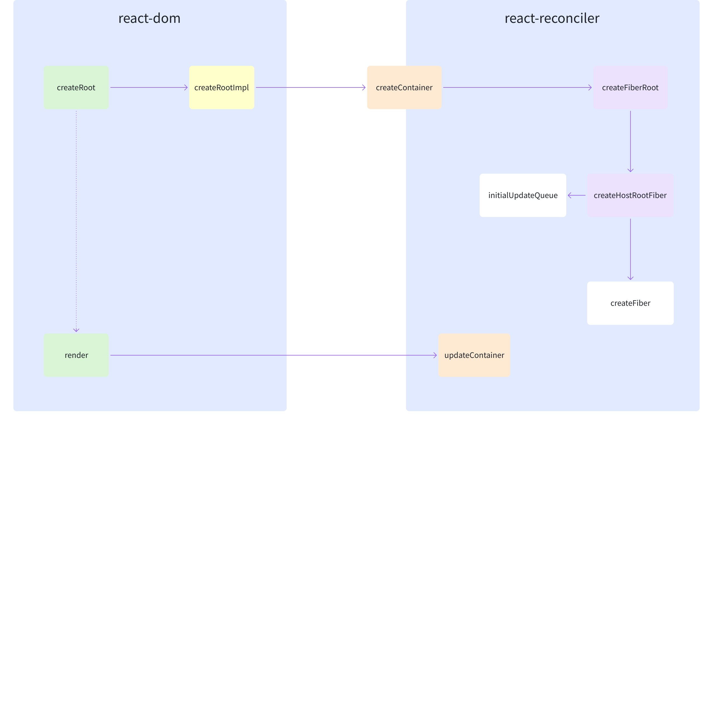
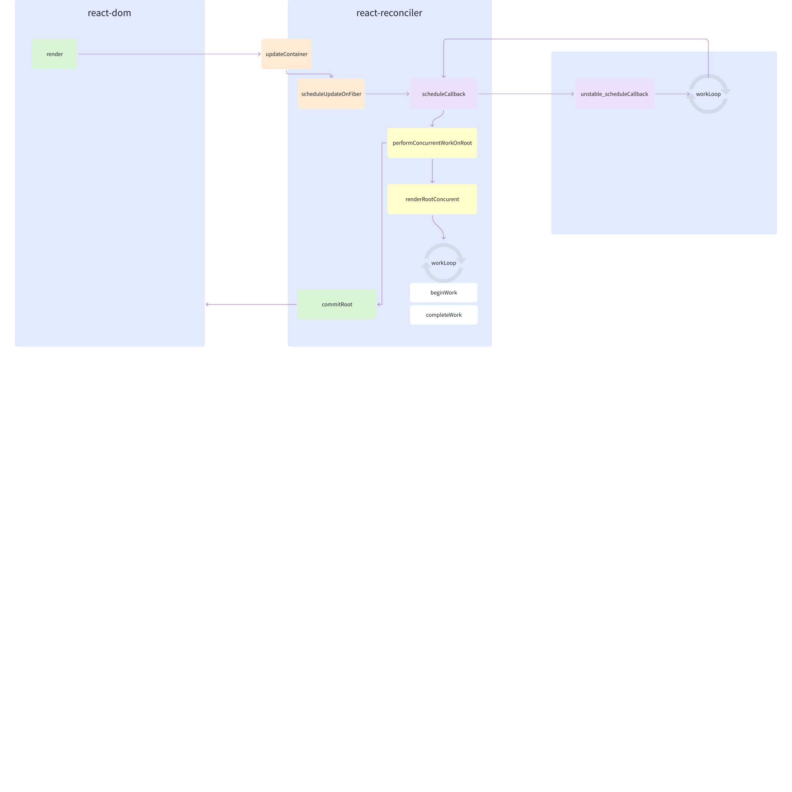
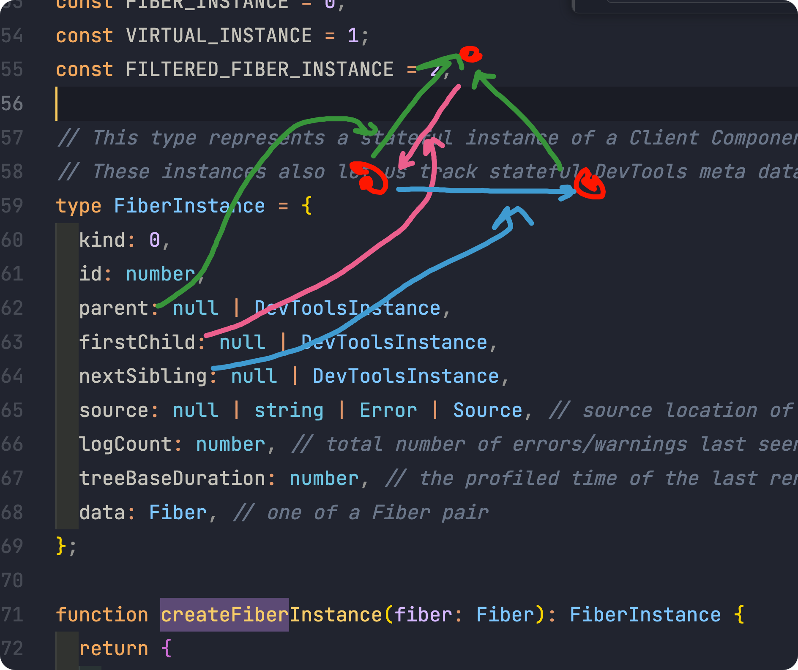
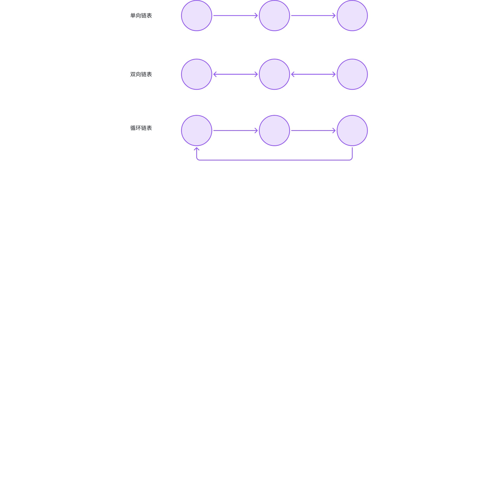
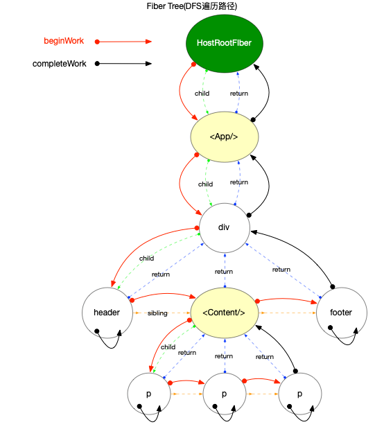

# 5.React 源码解读【一】

> 原文链接：[飞书原文](https://u19tul1sz9g.feishu.cn/docx/TICyd8KDmoCexoxqYIIcUrsDnCf)

[引用：20260207 随堂笔记与源码资料](https://www.feishu.cn/docx/HsQBdlBmsocCuExnY9Jcy99Sn2e)

## 课程目标

> **💡 提示**
>
> - 初中级：
>
>   1. **了解 React 项目架构与核心包**：掌握 monorepo 架构，熟悉 React 的核心流程及相关核心包
>   2. **理解 React JSX 编译过程**：掌握 JSX 编译的具体流程，并了解 React 运行时机制
>   3. **掌握 React 源码中的常见数据结构与算法**：掌握如 Fiber、链表、小根堆等常见数据结构，并熟悉 reconcile、schedule 等算法的实现与应用
> - 高级：
>
>   1. **深入解析 JSX 编译过程**：深入理解 JSX 从源代码到 JSX-runtime 的编译过程
>   2. **精通 React 核心执行流程**：全面掌握 React 从创建 ReactElement 到 Fiber 的构建、调和、提交更新，直至视图渲染的完整执行流程
>   3. **熟练掌握 React 源码调试技巧**：能够使用 Google DevTools 调试 React 应用，精确跟踪更新过程中的各个步骤

## 补充资料

- 补充 Babel 编译 jsx：[Babel · The compiler for next generation JavaScript](https://babeljs.io/repl#?browsers=%20&build=&builtIns=false&corejs=3.21&spec=false&loose=false&code_lz=MYewdgzgLgBApgGzgWzmWBeGAeAFgRgD4AJRBEAGhgHcQAnBAEwEJsB6AwgbiA&debug=false&forceAllTransforms=false&modules=false&shippedProposals=false&circleciRepo=&evaluate=false&fileSize=false&timeTravel=false&sourceType=module&lineWrap=true&presets=env%2Creact&prettier=true&targets=&version=7.24.7&externalPlugins=&assumptions=%7B%7D)
- Min Heap 可视化：https://www.cs.usfca.edu/\~galles/visualization/Heap.html
- 关于 monorepo：https://pnpm.io/workspaces
- 核心包：https://github.com/facebook/react/tree/main/packages/react
- 调和：https://github.com/facebook/react/tree/main/packages/react-reconciler
- 调度：https://github.com/facebook/react/tree/main/packages/scheduler
- 视图：https://github.com/facebook/react/tree/main/packages/react-dom


## 相关面试真题


### React 中, “setState” 是同步还是异步？


**答案：**

在 React 中，`setState` 是一种伪异步操作，这意味着它的执行顺序并不总是立即反映在组件的状态和渲染上。在 React 18 中，`setState` 的行为有一些细微的变化，主要是由于引入了并发特性（Concurrent Mode）。


1. **伪异步行为**: 在 React 18 中，`setState` 在某些情况下是同步的，而在其他情况下是异步的。这取决于 `setState` 是在一个批量更新（batch updates）中调用的还是在一个独立的事件处理器中调用的。


1. **批量更新**:

   - React 会在事件处理器中对 `setState` 调用进行批量处理，以提高性能。这意味着多个 `setState` 调用会被合并到一次重新渲染中。在这种情况下，`setState` 是异步的，因为状态更新会在事件处理器完成之后才会进行实际的重新渲染。
   - 在 React 18 中，即使在原生事件处理器中（如 `setTimeout` 或 `Promise.then`）也会进行批量处理，这是 React 18 新引入的特性。


1. **并发模式（Concurrent Mode）**:

   - 在并发模式下，React 会智能地调度状态更新以确保应用的响应性。在这种模式下，`setState` 的调用通常是异步的，以便 React 能够在空闲时间处理其他高优先级的更新任务。


1. **同步更新**：

   -  React 18 中，`ReactDOM.flushSync` 提供了一种强制同步更新的方法。当你需要立即更新组件并在下一行代码中获取最新的状态时，可以使用 `flushSync`。

   ```JavaScript
   import { flushSync } from 'react-dom';
   
   function handleClick() {
     flushSync(() => {
       this.setState({ key: 'value' });
     });
     console.log(this.state.key); // 'value'
   }
   ```


#### 源码分析


在 React 18 中，`setState` 的实现涉及到调度和批量处理机制。以下是相关的源码解析：


- **`setState`**\*\* 实现\*\*：

`setState` 实际上是通过 `enqueueSetState` 函数来实现的：


```JavaScript
class Component {
  setState(partialState, callback) {
    this.updater.enqueueSetState(this, partialState, callback, 'setState');
  }
}
```


- **调度和批量处理**：

在 React 内部，更新会被添加到一个更新队列中，并由调度器（Scheduler）进行批量处理。调度器会根据优先级来处理这些更新任务。


```JavaScript
const classComponentUpdater = {
  isMounted,
  enqueueSetState(inst, payload, callback) {
    const fiber = getInstance(inst);
    const eventTime = requestEventTime();
    const lane = requestUpdateLane(fiber);

    const update = createUpdate(eventTime, lane);
    update.payload = payload;
    if (callback !== undefined && callback !== null) {
      if (__DEV__) {
        warnOnInvalidCallback(callback, 'setState');
      }
      update.callback = callback;
    }

    const root = enqueueUpdate(fiber, update, lane);
    if (root !== null) {
      scheduleUpdateOnFiber(root, fiber, lane, eventTime);
      entangleTransitions(root, fiber, lane);
    }

    if (__DEV__) {
      if (enableDebugTracing) {
        if (fiber.mode & DebugTracingMode) {
          const name = getComponentNameFromFiber(fiber) || 'Unknown';
          logStateUpdateScheduled(name, lane, payload);
        }
      }
    }

    if (enableSchedulingProfiler) {
      markStateUpdateScheduled(fiber, lane);
    }
  },
  // .....
}
```


  这个 `enqueueSetState` 函数会创建一个更新对象，并将其加入到对应组件的更新队列中。然后通过 `scheduleUpdateOnFiber` 进行调度。


- **批量更新机制**：

React 通过 `batchedUpdates` 来实现批量更新：


```JavaScript
export function batchedUpdates<A, R>(fn: A => R, a: A): R {
  const prevExecutionContext = executionContext;
  executionContext |= BatchedContext;
  try {
    return fn(a);
  } finally {
    executionContext = prevExecutionContext;
    // If there were legacy sync updates, flush them at the end of the outer
    // most batchedUpdates-like method.
    if (
      executionContext === NoContext &&
      // Treat `act` as if it's inside `batchedUpdates`, even in legacy mode.
      !(__DEV__ && ReactCurrentActQueue.isBatchingLegacy)
    ) {
      resetRenderTimer();
      flushSyncCallbacksOnlyInLegacyMode();
    }
  }
}
```


  在 `batchedUpdates` 中，所有的状态更新会被合并到一起，直到 `executionContext` 被重置时才会真正进行渲染。


### React 中 key 的作用是什么？


**答案**：


在 React 中，`key` 是一个特殊的属性，用于帮助 React 识别哪些元素是变化、添加或删除的。在列表渲染中，`key` 尤其重要，因为它能提高渲染性能和确保组件状态的一致性。


代码主要在：**`react-reconciler/src/ReactChildFiber.new.js`**


#### `key` 的作用


1. **唯一性标识**: `key` 用于唯一标识每一个组件实例。在同一级别的组件中，`key` 必须是唯一的。这样，React 能够精确地确定每个组件的变化。


1. **高效的 Diff 算法**: 在列表中使用 `key` 属性，React 可以通过 Diff 算法快速比较新旧元素，确定哪些元素需要重新渲染，哪些元素可以复用。这减少了不必要的 DOM 操作，从而提高渲染性能。


1. **保持组件状态**: 使用 `key` 能确保组件在更新过程中状态的一致性。不同的 `key` 会使 React 认为它们是不同的组件实例，因而会创建新的组件实例，而不是重用现有实例。这对于有状态的组件尤为重要。


#### 源码解析


以下是 React 源码中与 `key` 相关的关键部分：


##### 1. 生成 Fiber 树


在生成 Fiber 树时，React 使用 `key` 来匹配新旧节点。代码示例如下：


```JavaScript
function reconcileChildFibers(
  returnFiber,
  currentFirstChild,
  newChild,
  expirationTime
) {
  // 如果 newChild 是一个数组（即多个子节点）
  if (isArray(newChild)) {
    return reconcileChildrenArray(
      returnFiber,
      currentFirstChild,
      newChild,
      expirationTime
    );
  }
  // 处理其他情况...
}

function reconcileChildrenArray(
  returnFiber,
  currentFirstChild,
  newChildren,
  expirationTime
) {
  // 创建一个哈希表，用于存储当前子节点的 key
  let existingChildren = mapRemainingChildren(returnFiber, currentFirstChild);

  // 遍历新的子节点
  for (let i = 0; i < newChildren.length; i++) {
    let newFiber = updateSlot(
      returnFiber,
      existingChildren,
      newChildren[i],
      expirationTime
    );

    // 将 newFiber 添加到 returnFiber 的子链表中
    placeChild(newFiber, lastPlacedIndex, newIndex);
  }

  // 删除未匹配的旧子节点
  deleteRemainingChildren(returnFiber, existingChildren);
}
```


##### 2. 比较新旧节点


在比较新旧节点时，React 通过 `key` 来确定节点是否相同：


```JavaScript
function updateSlot(
    returnFiber: Fiber,
    oldFiber: Fiber | null,
    newChild: any,
    lanes: Lanes,
  ): Fiber | null {
    // Update the fiber if the keys match, otherwise return null.

    const key = oldFiber !== null ? oldFiber.key : null;

    if (
      (typeof newChild === 'string' && newChild !== '') ||
      typeof newChild === 'number'
    ) {
      // Text nodes don't have keys. If the previous node is implicitly keyed
      // we can continue to replace it without aborting even if it is not a text
      // node.
      if (key !== null) {
        return null;
      }
      return updateTextNode(returnFiber, oldFiber, '' + newChild, lanes);
    }

    if (typeof newChild === 'object' && newChild !== null) {
      switch (newChild.$$typeof) {
        case REACT_ELEMENT_TYPE: {
          if (newChild.key === key) {
            return updateElement(returnFiber, oldFiber, newChild, lanes);
          } else {
            return null;
          }
        }
        case REACT_PORTAL_TYPE: {
          if (newChild.key === key) {
            return updatePortal(returnFiber, oldFiber, newChild, lanes);
          } else {
            return null;
          }
        }
        case REACT_LAZY_TYPE: {
          const payload = newChild._payload;
          const init = newChild._init;
          return updateSlot(returnFiber, oldFiber, init(payload), lanes);
        }
      }

      if (isArray(newChild) || getIteratorFn(newChild)) {
        if (key !== null) {
          return null;
        }

        return updateFragment(returnFiber, oldFiber, newChild, lanes, null);
      }

      throwOnInvalidObjectType(returnFiber, newChild);
    }

    if (__DEV__) {
      if (typeof newChild === 'function') {
        warnOnFunctionType(returnFiber);
      }
    }

    return null;
  }
```


#### 实际例子


假设我们有一个简单的列表：


```JavaScript
const items = this.state.items.map((item) =>
  <li key={item.id}>{item.text}</li>
);
```


在上述代码中，每个 `<li>` 元素都有一个唯一的 `key`。如果 `items` 数组发生变化（如添加或删除元素），React 将根据 `key` 来高效地更新 DOM：


- 当一个元素被删除时，React 仅删除对应 `key` 的 DOM 节点。
- 当一个元素被添加时，React 仅在相应的位置插入新的 DOM 节点。
- 当一个元素被移动时，React 会识别到位置变化并重新排列 DOM 节点。


## 开场白

学习源码，我们到底应该怎么学？

很多同学学习源码都是背八股文，都是逐个方法文件去看，这是错误的。就像我们看书，为的是从书中汲取养分，我们要领悟作者传达的思想。

我们的源码课，正式从宏观角度出发，先将自己假定为专家，作为专家，设计 React 这样的框架我们需要考虑一些什么问题？设计 React 这样的框架我们需要使用哪些数据结构与算法来整体提升框架源码可读性与性能？

所以，大家尝试着将自己带入，从一下角度来重学 React 源码

1. 从源码中学数据结构与算法
2. 理解从无 React 到有 React 的演变
3. 了解 React 整体执行过程
4. 逐环节击破，各个包职责与联系、特性功能原理（Concurrent、Suspense 等）


## React 工程架构

React 工程项目使用 monorepo 架构进行管理，因为 React 团队为了将不同职责包拆分，使得源码更具可读性与维护性。所以我们在开始看 React 源码之前，需要先稍微熟悉一下 monorepo 架构，与 React 整体分包设计。


### react

React 工程的基础包，也叫入口包，我们使用 React 的相关 api 都是从它导出的。

该包定义了 react 对外 api 协议，并且这个包也仅仅是暴露协议，真正的实现并不在它里面。如果是浏览器端，核心 dom 相关实现在 react-dom，如果是在手机端，核心元素操作是在 react-native 中。(react-three-fiber)


### react-dom

针对于 web 应用的渲染器实现，完成 react 与 web 的桥接。该包主要提供应用初始化挂载 api，例如：`createRoot`。

```JavaScript
function createRoot(
  container: Element | Document | DocumentFragment,
  options?: CreateRootOptions,
): RootType {
  // 创建根节点实例
  return createRootImpl(container, options);
}
```


### react-reconciler

react 的大总管，负责整体协调 react-dom、react、scheduler 之间的调用和职责交接。

主要包括：

- `/react-reconciler/src/ReactFiberBeginWork.new.js` 
- `/react-reconciler/src/ReactFiberHooks.new.js`
- `/react-reconciler/src/ReactFiberClassComponent.new.js`
- `/react-reconciler/src/ReactFiberReconciler.new.js`


整个与 scheduler 的联系，发生在：`/react-reconciler/src/ReactFiberWorkLoop.new.js`


### scheduler

react 整体调度机制的核心实现，控制上面提到的 react-reconciler 包推入的执行任务的具体执行时机。

concurrent 模式下，任务切片、可中断更新等都是该包的功劳\~

> requestIdleCallback


### react-noop-renderer

react 的演示渲染器，没有渲染目标输出，用来单独演示调和器的内部结构。不过有一点需要强调，我们可以依照这个包，写一个自定义渲染器哦。

```JavaScript

const hostConfig = {
  getRootHostContext: () => {
    return rootHostContext;
  },
  getChildHostContext: () => {
    return childHostContext;
  },
  shouldSetTextContent: (type, props) => {
    return (
      typeof props.children === "string" || typeof props.children === "number"
    );
  },
  prepareForCommit: () => {},
  resetAfterCommit: () => {},
  createTextInstance: (text) => {
    return document.createTextNode(text);
  },
  createInstance: (
    type,
    newProps,
    rootContainerInstance,
    _currentHostContext,
    workInProgress
  ) => {
    const domElement = document.createElement(type);
    Object.keys(newProps).forEach((propName) => {
      const propValue = newProps[propName];
      if (propName === "children") {
        if (typeof propValue === "string" || typeof propValue === "number") {
          domElement.textContent = propValue;
        }
      } else if (propName === "onClick") {
        domElement.addEventListener("click", propValue);
      } else if (propName === "className") {
        domElement.setAttribute("class", propValue);
      } else if (propName === "style") {
        const propValue = newProps[propName];
        const propValueKeys = Object.keys(propValue)
        const propValueStr = propValueKeys.map(k => `${k}: ${propValue[k]}`).join(';')
        domElement.setAttribute(propName, propValueStr);
      } else {
        const propValue = newProps[propName];
        domElement.setAttribute(propName, propValue);
      }
    });
    return domElement;
  },
  appendInitialChild: (parent, child) => {
    parent.appendChild(child);
  },
  appendChild(parent, child) {
    parent.appendChild(child);
  },
  finalizeInitialChildren: (domElement, type, props) => {},
  supportsMutation: true,
  appendChildToContainer: (parent, child) => {
    parent.appendChild(child);
  },
  prepareUpdate(domElement, oldProps, newProps) {
    return true;
  },
  commitUpdate(domElement, updatePayload, type, oldProps, newProps) {
    Object.keys(newProps).forEach((propName) => {
      const propValue = newProps[propName];
      if (propName === "children") {
        if (typeof propValue === "string" || typeof propValue === "number") {
          domElement.textContent = propValue;
        }
        // TODO 还要考虑数组的情况
      } else if (propName === "style") {
        const propValue = newProps[propName];
        const propValueKeys = Object.keys(propValue)
        const propValueStr = propValueKeys.map(k => `${k}: ${propValue[k]}`).join(';')
        domElement.setAttribute(propName, propValueStr);
      } else {
        const propValue = newProps[propName];
        domElement.setAttribute(propName, propValue);
      }
    });
  },
  commitTextUpdate(textInstance, oldText, newText) {
    textInstance.text = newText;
  },
  removeChild(parentInstance, child) {
    parentInstance.removeChild(child);
  },
};
```


## jsx 编译

jsx 我们在前面基础内容中讲过，react 最初引入 jsx 就是为了能够追求更好的开发体验，同学们对比过 react 和 vue 开发模式的可能都会认同——react 写代码好爽。

学习 jsx 编译，是我们迈出学习 react 源码的第一步，为什么呢？因为如果不了解 jsx 的编译，你连 ReactElement 怎么产生、生么时候创建可能都是一头雾水。那我们先重点来看，ReactElement 是怎么从我们编写的 jsx 转换而来的。


### 编译器

可以转化 jsx 的编译工具有很多，我们最熟知的是：babel，在后续的学习中，我们会介绍更多编译构建相关工具，例如 esbuild、swc 等，他们都可以将 jsx 转为 react 运行时代码。我们以 babel 为例，探讨 jsx 编译过程。


### 编译配置与编译过程

Babel 是一个 JavaScript 编译器，它可以将 JSX 代码转换为纯 JavaScript 代码。这个转换过程涉及几个步骤，从解析 JSX 到生成等效的 JavaScript。以下是详细的转换过程及其对应的代码示例：


#### JSX 代码


假设我们有一段简单的 JSX 代码：


```JavaScript
const element = <h1 className="greeting">Hello, world!</h1>;
```


#### Babel 的 JSX 转换


Babel 将 JSX 代码转换为 `React.createElement` 调用。我们来看一下具体的转换过程。


##### 解析 JSX


Babel 解析器首先将 JSX 代码解析成抽象语法树（AST）。这个步骤中，JSX 被识别为特定的节点类型。


##### 转换 JSX 元素


Babel 插件 `@babel/plugin-transform-react-jsx` 会将 JSX 元素转换为 `React.createElement` 调用。


具体的转换规则是：


- JSX 标签名被转换为 `React.createElement` 的第一个参数。
- JSX 属性被转换为一个对象，作为 `React.createElement` 的第二个参数。
- JSX 子元素被转换为 `React.createElement` 的后续参数。


对于我们的示例代码，转换后的 JavaScript 代码如下：


```JavaScript
const element = React.createElement(
  'h1', 
  { className: 'greeting' }, 
  'Hello, world!'
);
```


#### Babel 配置


为了进行这个转换，我们需要配置 Babel。以下是一个示例配置文件 `.babelrc`：


```JSON
{
  "presets": ["@babel/preset-react"]
}
```


这个配置使用了 `@babel/preset-react` 预设，它包含了用于转换 JSX 的插件。


#### 示例代码


我们通过一个完整例子，了解 babel 的配置与转换过程。


##### 原始 JSX 文件 `App.jsx`


```JavaScript
// App.jsx
import React from 'react';

const App = () => {
  return (
    <div>
      <h1 className="greeting">Hello, world!</h1>
      <p>This is a JSX example.</p>
    </div>
  );
};

export default App;
```


##### 使用 Babel CLI 转换 JSX


安装 babel、预设以及 babel cli

```Bash
pnpm add -D @babel/core @babel/preset-react
```


可以使用 Babel CLI 来转换这个文件：


```Bash
babel App.jsx --out-file App.js
```


##### 转换后的文件 `App.js`


```JavaScript
// App.js
import React from 'react';

const App = () => {
  return React.createElement(
    'div', 
    null, 
    React.createElement(
      'h1', 
      { className: 'greeting' }, 
      'Hello, world!'
    ), 
    React.createElement(
      'p', 
      null, 
      'This is a JSX example.'
    )
  );
};

export default App;
```


## React 核心流程

React 执行流程我们拆解为两部分，分别为：创建与更新。

创建阶段，主要完成的工作包含：容器创建、元素对应 Fiber 创建、更新队列初始化等操作。

更新阶段，主要包含：状态更新触发任务入队、scheduler 调度、重新构建 fiber、完成 fiber 到元素映射更新视图


### 创建

> 注：此处包含飞书只读块（type=isv），当前导出接口未返回可展开正文。

本小节，我们只先探讨 concurrent 模式启动，这也是最最常用的模式。

完整执行顺序（方法名）及核心文件：

1. react-dom

   1. ReactDOM.createRoot
   2. createRootImpl
2. react-reconciler

   1. createContainer
   2. createFiberRoot
   3. createHostRootFiber
   4. createFiber
   5. initializeUpdateQueue
3. react-dom

   1. ReactDOMRoot.prototype.render
   2. markContainerAsRoot
   3. updateContainer
   4. ... 此处省略，我们在更新处探讨



### 更新

上文提到，react 应用创建会先初始化所需数据，包含 fiberRoot、rootFiber、updateQueue 等，然后调用 render 方法，我们可以看到在 render 时，却是调用了与状态更新时所调用的同一方法——updateContainer，这正是其设计的精妙之处。

```JavaScript
ReactDOMHydrationRoot.prototype.render = ReactDOMRoot.prototype.render = function(
  children: ReactNodeList,
): void {
  const root = this._internalRoot;
  if (root === null) {
    throw new Error('Cannot update an unmounted root.');
  }

  // ...
  updateContainer(children, root, null, null);
};
```


完整执行顺序（方法名）及核心文件：

- react-reconciler

  - updateContainer
  - requestUpdateLane
  - enqueueUpdate
  - scheduleUpdateOnFiber
- scheduler

  - unstable_scheduleCallback
  - workloop
- react-reconciler

  - performConcurrentWorkOnRoot
  - renderRootConcurrent
  - workLoop
  - performUnitOfWork
  
    - beginWork
    - completeWork
  - commitRoot




详细过程，以及同步更新、异步更新处理我们在下一小节详细展开。


## 数据结构与算法导引

### 数据结构

- 堆
- 链表
- 栈


在 React 源码中，主要有以上数据结构，这些数据结构完成了 React 执行环节中重要部分。





#### 堆

堆这个数据结构运用在 `scheduler` 中，用来排序任务，堆顶元素数值最小，所以我们一般称为小顶堆，我们从中提取元素时，只需要从堆顶提取即可。

堆排序是利用二叉堆的特性, 对根节点(最大或最小)进行循环提取, 从而达到排序目的(堆排序本质上是一种选择排序), 时间复杂度为`O(nlog n)`.


##### **特性**


1. 父节点的值>=子节点的值(最大堆), 父节点的值<=子节点的值(最小堆). 每个节点的左子树和右子树都是一个二叉堆.
2. 假设一个数组`[k0, k1, k2, ...kn]`下标从 0 开始. 则`ki <= k2i+1,ki <= k2i+2` 或者 `ki >= k2i+1,ki >= k2i+2` (i = 0,1,2,3 .. n/2)


##### React 中的应用


```JavaScript
/**
 * Copyright (c) Facebook, Inc. and its affiliates.
 *
 * This source code is licensed under the MIT license found in the
 * LICENSE file in the root directory of this source tree.
 *
 * @flow strict
 */

type Heap = Array<Node>;
type Node = {|
  id: number,
  sortIndex: number,
|};

export function push(heap: Heap, node: Node): void {
  const index = heap.length;
  heap.push(node);
  siftUp(heap, node, index);
}

export function peek(heap: Heap): Node | null {
  return heap.length === 0 ? null : heap[0];
}

export function pop(heap: Heap): Node | null {
  if (heap.length === 0) {
    return null;
  }
  const first = heap[0];
  const last = heap.pop();
  if (last !== first) {
    heap[0] = last;
    siftDown(heap, last, 0);
  }
  return first;
}

function siftUp(heap, node, i) {
  let index = i;
  while (index > 0) {
    const parentIndex = (index - 1) >>> 1;
    const parent = heap[parentIndex];
    if (compare(parent, node) > 0) {
      // The parent is larger. Swap positions.
      heap[parentIndex] = node;
      heap[index] = parent;
      index = parentIndex;
    } else {
      // The parent is smaller. Exit.
      return;
    }
  }
}

function siftDown(heap, node, i) {
  let index = i;
  const length = heap.length;
  const halfLength = length >>> 1;
  while (index < halfLength) {
    const leftIndex = (index + 1) * 2 - 1;
    const left = heap[leftIndex];
    const rightIndex = leftIndex + 1;
    const right = heap[rightIndex];

    // If the left or right node is smaller, swap with the smaller of those.
    if (compare(left, node) < 0) {
      if (rightIndex < length && compare(right, left) < 0) {
        heap[index] = right;
        heap[rightIndex] = node;
        index = rightIndex;
      } else {
        heap[index] = left;
        heap[leftIndex] = node;
        index = leftIndex;
      }
    } else if (rightIndex < length && compare(right, node) < 0) {
      heap[index] = right;
      heap[rightIndex] = node;
      index = rightIndex;
    } else {
      // Neither child is smaller. Exit.
      return;
    }
  }
}

function compare(a, b) {
  // Compare sort index first, then task id.
  const diff = a.sortIndex - b.sortIndex;
  return diff !== 0 ? diff : a.id - b.id;
}
```


- `peek`函数: 查看堆顶元素, 也就是优先级最高的`task`或`timer`
- `pop`函数: 将堆顶元素弹出 并删除, 随后需调用`siftDown`函数向下调整堆
- `push`函数: 添加新节点, 添加之后, 需要调用`siftUp`函数向上调整堆.
- `siftDown`函数: 向下调整堆结构, 保证数组是一个最小堆.
- `siftUp`函数: 当插入节点之后, 需要向上调整堆结构, 保证数组是一个最小堆.


#### 链表

链表（Linked list）是一种常见的基础数据结构, 是一种线性表, 但是并不会按线性的顺序存储数据, 而是在每一个节点里存到下一个节点的指针(Pointer).由于不必须按顺序存储，链表在插入的时候可以达到 O(1)的复杂度, 但是查找一个节点或者访问特定编号的节点则需要 O(n)的时间.

链表我们按照其指针指向特点可分为：

- 单向链表
- 双向链表
- 循环链表




##### 基本使用

```JavaScript
// 定义Node节点类型
function Node(name) {
  this.name = name;
  this.next = null;
}

// 链表
function LinkedList() {
  this.head = new Node('head');

  // 查找node节点的前一个节点
  this.findPrevious = function (node) {
    let currentNode = this.head;
    while (currentNode && currentNode.next !== node) {
      currentNode = currentNode.next;
    }
    return currentNode;
  };

  // 在node后插入新节点newElement
  this.insert = function (name, node) {
    const newNode = new Node(name);
    newNode.next = node.next;
    node.next = newNode;
  };

  // 删除节点
  this.remove = function (node) {
    const previousNode = this.findPrevious(node);
    if (previousNode) {
      previousNode.next = node.next;
    }
  };

  // 反转链表
  this.reverse = function () {
    let prev = null;
    let current = this.head;
    while (current) {
      const tempNode = current.next;
      // 重新设置next指针, 使其指向前一个节点
      current.next = prev;
      // 游标后移
      prev = current;
      current = tempNode;
    }
    // 重新设置head节点
    this.head = prev;
  };
}
```


1. 节点插入, 时间复杂度`O(1)`
2. 节点查找, 时间复杂度`O(n)`
3. 节点删除, 时间复杂度`O(1)`
4. 反转链表, 时间复杂度`O(n)`


##### React 中的应用

在 React 源码中，要大量使用链表的场景，包含：fiber、hook、更新队列


###### fiber

```TypeScript
// 一个Fiber对象代表一个即将渲染或者已经渲染的组件(ReactElement), 一个组件可能对应两个fiber(current和WorkInProgress)
// 单个属性的解释在后文(在注释中无法添加超链接)
export type Fiber = {|
  tag: WorkTag,
  key: null | string,
  elementType: any,
  type: any,
  stateNode: any,
  return: Fiber | null,
  child: Fiber | null,
  sibling: Fiber | null,
  index: number,
  ref:
    | null
    | (((handle: mixed) => void) & { _stringRef: ?string, ... })
    | RefObject,
  pendingProps: any, // 从`ReactElement`对象传入的 props. 用于和`fiber.memoizedProps`比较可以得出属性是否变动
  memoizedProps: any, // 上一次生成子节点时用到的属性, 生成子节点之后保持在内存中
  updateQueue: mixed, // 存储state更新的队列, 当前节点的state改动之后, 都会创建一个update对象添加到这个队列中.
  memoizedState: any, // 用于输出的state, 最终渲染所使用的state
  dependencies: Dependencies | null, // 该fiber节点所依赖的(contexts, events)等
  mode: TypeOfMode, // 二进制位Bitfield,继承至父节点,影响本fiber节点及其子树中所有节点. 与react应用的运行模式有关(有ConcurrentMode, BlockingMode, NoMode等选项).

  // Effect 副作用相关
  flags: Flags, // 标志位
  subtreeFlags: Flags, //替代16.x版本中的 firstEffect, nextEffect. 当设置了 enableNewReconciler=true才会启用
  deletions: Array<Fiber> | null, // 存储将要被删除的子节点. 当设置了 enableNewReconciler=true才会启用

  nextEffect: Fiber | null, // 单向链表, 指向下一个有副作用的fiber节点
  firstEffect: Fiber | null, // 指向副作用链表中的第一个fiber节点
  lastEffect: Fiber | null, // 指向副作用链表中的最后一个fiber节点

  // 优先级相关
  lanes: Lanes, // 本fiber节点的优先级
  childLanes: Lanes, // 子节点的优先级
  alternate: Fiber | null, // 指向内存中的另一个fiber, 每个被更新过fiber节点在内存中都是成对出现(current和workInProgress)

  // 性能统计相关(开启enableProfilerTimer后才会统计)
  // react-dev-tool会根据这些时间统计来评估性能
  actualDuration?: number, // 本次更新过程, 本节点以及子树所消耗的总时间
  actualStartTime?: number, // 标记本fiber节点开始构建的时间
  selfBaseDuration?: number, // 用于最近一次生成本fiber节点所消耗的时间
  treeBaseDuration?: number, // 生成子树所消耗的时间的总和
|};
```


###### UpdateQueue

```TypeScript
export type Update<State> = {|
  eventTime: number, // 发起update事件的时间(17.0.2中作为临时字段, 即将移出)
  lane: Lane, // update所属的优先级

  tag: 0 | 1 | 2 | 3, //
  payload: any, // 载荷, 根据场景可以设置成一个回调函数或者对象
  callback: (() => mixed) | null, // 回调函数

  next: Update<State> | null, // 指向链表中的下一个, 由于UpdateQueue是一个环形链表, 最后一个update.next指向第一个update对象
|};

// =============== UpdateQueue ==============
type SharedQueue<State> = {|
  pending: Update<State> | null,
|};

export type UpdateQueue<State> = {|
  baseState: State,
  firstBaseUpdate: Update<State> | null,
  lastBaseUpdate: Update<State> | null,
  shared: SharedQueue<State>,
  effects: Array<Update<State>> | null,
|};
```


#### 栈

栈，这个数据结构很普遍了，只允许在有序的线性资料集合的一端(称为堆栈顶端`top`)进行加入数据(`push`)和移除数据(`pop`)的运算. 因而按照**后进先出**(`LIFO, Last In First Out`)的原理运作，通常用在匹配逻辑（括号匹配）等问题。


##### 基本使用

```JavaScript
class Stack {
  constructor() {
    this.dataStore = [];
    this.top = 0;
  }

  // 压栈
  push(element) {
    this.dataStore[this.top++] = element;
  }

  // 弹栈
  pop() {
    return this.dataStore[--this.top];
  }

  // 预览栈顶元素
  peek() {
    return this.dataStore[this.top - 1];
  }

  // 检测栈内存储了多少个元素
  length() {
    return this.top;
  }

  // 清空栈
  clear() {
    this.top = 0;
  }
}
```


##### React 中的应用


###### **Context 状态管理**

`react`内部会维护一个`栈`来保存提供者(`Context.Provider`)的状态, 供给消费者(`Context.Consumer`)使用.

```TypeScript
/**
 * Copyright (c) Facebook, Inc. and its affiliates.
 *
 * This source code is licensed under the MIT license found in the
 * LICENSE file in the root directory of this source tree.
 *
 * @flow
 */

import type {Fiber} from './ReactInternalTypes';

export type StackCursor<T> = {|current: T|};

const valueStack: Array<any> = [];

let fiberStack: Array<Fiber | null>;

if (__DEV__) {
  fiberStack = [];
}

let index = -1;

function createCursor<T>(defaultValue: T): StackCursor<T> {
  return {
    current: defaultValue,
  };
}

function isEmpty(): boolean {
  return index === -1;
}

function pop<T>(cursor: StackCursor<T>, fiber: Fiber): void {
  if (index < 0) {
    if (__DEV__) {
      console.error('Unexpected pop.');
    }
    return;
  }

  if (__DEV__) {
    if (fiber !== fiberStack[index]) {
      console.error('Unexpected Fiber popped.');
    }
  }

  cursor.current = valueStack[index];

  valueStack[index] = null;

  if (__DEV__) {
    fiberStack[index] = null;
  }

  index--;
}

function push<T>(cursor: StackCursor<T>, value: T, fiber: Fiber): void {
  index++;

  valueStack[index] = cursor.current;

  if (__DEV__) {
    fiberStack[index] = fiber;
  }

  cursor.current = value;
}

function checkThatStackIsEmpty() {
  if (__DEV__) {
    if (index !== -1) {
      console.error(
        'Expected an empty stack. Something was not reset properly.',
      );
    }
  }
}

function resetStackAfterFatalErrorInDev() {
  if (__DEV__) {
    index = -1;
    valueStack.length = 0;
    fiberStack.length = 0;
  }
}

export {
  createCursor,
  isEmpty,
  pop,
  push,
  // DEV only:
  checkThatStackIsEmpty,
  resetStackAfterFatalErrorInDev,
};

```

结合 Context 的逻辑处理


```TypeScript
// packages/react-reconciler/src/ReactFiberNewContext.old.js
export function pushProvider<T>(
  providerFiber: Fiber,
  context: ReactContext<T>,
  nextValue: T,
): void {
  if (isPrimaryRenderer) {
    push(valueCursor, context._currentValue, providerFiber);

    context._currentValue = nextValue;
    if (__DEV__) {
      if (
        context._currentRenderer !== undefined &&
        context._currentRenderer !== null &&
        context._currentRenderer !== rendererSigil
      ) {
        console.error(
          'Detected multiple renderers concurrently rendering the ' +
            'same context provider. This is currently unsupported.',
        );
      }
      context._currentRenderer = rendererSigil;
    }
  } else {
    push(valueCursor, context._currentValue2, providerFiber);

    context._currentValue2 = nextValue;
    if (__DEV__) {
      if (
        context._currentRenderer2 !== undefined &&
        context._currentRenderer2 !== null &&
        context._currentRenderer2 !== rendererSigil
      ) {
        console.error(
          'Detected multiple renderers concurrently rendering the ' +
            'same context provider. This is currently unsupported.',
        );
      }
      context._currentRenderer2 = rendererSigil;
    }
  }
}
```


### 算法

- diff
- 位运算
- 图深度优先遍历


#### diff 过程（调和）


#### 位运算

位运算用在任务的优先级判断、执行上下文判断上，通过位运算可以轻松得出给定某个对象是否具有某项约定特征。


##### 位运算基础

| 按位与(&) | a & b | 对于每一个比特位,两个操作数都为 1 时, 结果为 1, 否则为 0 |
|-|-|-|
| 按位或(\|) | a \| b | 对于每一个比特位,两个操作数都为 0 时, 结果为 0, 否则为 1 |
| 按位异或(^) | a ^ b | 对于每一个比特位,两个操作数相同时, 结果为 0, 否则为 1 |
| 按位非(\~) | \~ a | 反转操作数的比特位, 即 0 变成 1, 1 变成 0 |
| 左移(<<) | a << b | 将 a 的二进制形式向左移 b (< 32) 比特位, 右边用 0 填充 |
| 有符号右移(>>) | a >> b | 将 a 的二进制形式向右移 b (< 32) 比特位, 丢弃被移除的位, 左侧以最高位来填充 |
| 无符号右移(>>>) | a >>> b | 将 a 的二进制形式向右移 b (< 32) 比特位, 丢弃被移除的位, 并用 0 在左侧填充 |


##### 位运算求解

位运算求解非常简单，我们一般的方式是按位与求得当下某个参数是否蕴含着某项特征，例如在 React 优先级判断中按位与可直接计算出 lanes 是否包含给定 xxxLane。

```JavaScript
export const NoLanes: Lanes = /*                        */ 0b0000000000000000000000000000000;
export const NoLane: Lane = /*                          */ 0b0000000000000000000000000000000;

export const SyncLane: Lane = /*                        */ 0b0000000000000000000000000000001;


// 早期版本
function getHighestPriorityLanes(lanes: Lanes | Lane): Lanes {
  // 判断 lanes中是否包含 SyncLane
  if ((SyncLane & lanes) !== NoLanes) {
    return_highestLanePriority = SyncLanePriority;
    return SyncLane;
  }
  // ...
  // ... 省略其他代码
  return lanes;
}

// 18.3.1
export function getHighestPriorityLane(lanes: Lanes): Lane {
  return lanes & -lanes;
}
function getHighestPriorityLanes(lanes: Lanes | Lane): Lanes {
  switch (getHighestPriorityLane(lanes)) {
    case SyncLane:
      return SyncLane;
  }
}
```


##### React 中的应用


**在优先级管理中的应用**

文件：`/react-reconciler/src/ReactFiberLane.new.js`

核心代码：

```JavaScript
export const TotalLanes = 31;

export const NoLanes: Lanes = /*                        */ 0b0000000000000000000000000000000;
export const NoLane: Lane = /*                          */ 0b0000000000000000000000000000000;

export const SyncLane: Lane = /*                        */ 0b0000000000000000000000000000001;

export const InputContinuousHydrationLane: Lane = /*    */ 0b0000000000000000000000000000010;
export const InputContinuousLane: Lane = /*             */ 0b0000000000000000000000000000100;

export const DefaultHydrationLane: Lane = /*            */ 0b0000000000000000000000000001000;
export const DefaultLane: Lane = /*                     */ 0b0000000000000000000000000010000;

const TransitionHydrationLane: Lane = /*                */ 0b0000000000000000000000000100000;
const TransitionLanes: Lanes = /*                       */ 0b0000000001111111111111111000000;
const TransitionLane1: Lane = /*                        */ 0b0000000000000000000000001000000;
const TransitionLane2: Lane = /*                        */ 0b0000000000000000000000010000000;
const TransitionLane3: Lane = /*                        */ 0b0000000000000000000000100000000;
const TransitionLane4: Lane = /*                        */ 0b0000000000000000000001000000000;
const TransitionLane5: Lane = /*                        */ 0b0000000000000000000010000000000;
const TransitionLane6: Lane = /*                        */ 0b0000000000000000000100000000000;
const TransitionLane7: Lane = /*                        */ 0b0000000000000000001000000000000;
const TransitionLane8: Lane = /*                        */ 0b0000000000000000010000000000000;
const TransitionLane9: Lane = /*                        */ 0b0000000000000000100000000000000;
const TransitionLane10: Lane = /*                       */ 0b0000000000000001000000000000000;
const TransitionLane11: Lane = /*                       */ 0b0000000000000010000000000000000;
const TransitionLane12: Lane = /*                       */ 0b0000000000000100000000000000000;
const TransitionLane13: Lane = /*                       */ 0b0000000000001000000000000000000;
const TransitionLane14: Lane = /*                       */ 0b0000000000010000000000000000000;
const TransitionLane15: Lane = /*                       */ 0b0000000000100000000000000000000;
const TransitionLane16: Lane = /*                       */ 0b0000000001000000000000000000000;

const RetryLanes: Lanes = /*                            */ 0b0000111110000000000000000000000;
const RetryLane1: Lane = /*                             */ 0b0000000010000000000000000000000;
const RetryLane2: Lane = /*                             */ 0b0000000100000000000000000000000;
const RetryLane3: Lane = /*                             */ 0b0000001000000000000000000000000;
const RetryLane4: Lane = /*                             */ 0b0000010000000000000000000000000;
const RetryLane5: Lane = /*                             */ 0b0000100000000000000000000000000;

export const SomeRetryLane: Lane = RetryLane1;

export const SelectiveHydrationLane: Lane = /*          */ 0b0001000000000000000000000000000;

const NonIdleLanes: Lanes = /*                          */ 0b0001111111111111111111111111111;

export const IdleHydrationLane: Lane = /*               */ 0b0010000000000000000000000000000;
export const IdleLane: Lane = /*                        */ 0b0100000000000000000000000000000;

export const OffscreenLane: Lane = /*                   */ 0b1000000000000000000000000000000;


function getHighestPriorityLanes(lanes: Lanes | Lane): Lanes {
  switch (getHighestPriorityLane(lanes)) {
    case SyncLane:
      return SyncLane;
    case InputContinuousHydrationLane:
      return InputContinuousHydrationLane;
    case InputContinuousLane:
      return InputContinuousLane;
    case DefaultHydrationLane:
      return DefaultHydrationLane;
    case DefaultLane:
      return DefaultLane;
    case TransitionHydrationLane:
      return TransitionHydrationLane;
    case TransitionLane1:
    case TransitionLane2:
    case TransitionLane3:
    case TransitionLane4:
    case TransitionLane5:
    case TransitionLane6:
    case TransitionLane7:
    case TransitionLane8:
    case TransitionLane9:
    case TransitionLane10:
    case TransitionLane11:
    case TransitionLane12:
    case TransitionLane13:
    case TransitionLane14:
    case TransitionLane15:
    case TransitionLane16:
      return lanes & TransitionLanes;
    case RetryLane1:
    case RetryLane2:
    case RetryLane3:
    case RetryLane4:
    case RetryLane5:
      return lanes & RetryLanes;
    case SelectiveHydrationLane:
      return SelectiveHydrationLane;
    case IdleHydrationLane:
      return IdleHydrationLane;
    case IdleLane:
      return IdleLane;
    case OffscreenLane:
      return OffscreenLane;
    default:
      if (__DEV__) {
        console.error(
          'Should have found matching lanes. This is a bug in React.',
        );
      }
      // This shouldn't be reachable, but as a fallback, return the entire bitmask.
      return lanes;
  }
}
```


**workLoop 上下文**

文件：`/react-reconciler/src/ReactFiberWorkLoop.new.js`

核心代码：

```JavaScript
export const NoContext = /*             */ 0b000;
const BatchedContext = /*               */ 0b001;
const RenderContext = /*                */ 0b010;
const CommitContext = /*                */ 0b100;

type RootExitStatus = 0 | 1 | 2 | 3 | 4 | 5 | 6;
const RootInProgress = 0;
const RootFatalErrored = 1;
const RootErrored = 2;
const RootSuspended = 3;
const RootSuspendedWithDelay = 4;
const RootCompleted = 5;
const RootDidNotComplete = 6;


export function batchedUpdates<A, R>(fn: A => R, a: A): R {
  const prevExecutionContext = executionContext;
  executionContext |= BatchedContext;
  try {
    return fn(a);
  } finally {
    executionContext = prevExecutionContext;
    // If there were legacy sync updates, flush them at the end of the outer
    // most batchedUpdates-like method.
    if (
      executionContext === NoContext &&
      // Treat `act` as if it's inside `batchedUpdates`, even in legacy mode.
      !(__DEV__ && ReactCurrentActQueue.isBatchingLegacy)
    ) {
      resetRenderTimer();
      flushSyncCallbacksOnlyInLegacyMode();
    }
  }
}
```

注意这里的 `executionContext |= BatchedContext;` 按位或然后将值付给 executionContext，这样进来的 context 自动打上批处理标记。比如：

```JavaScript
let A = 0b001;

const BC = 0b010;

A |= BC

// 此时 A 的值为：0b011
```


#### 图遍历


对于树或图结构的搜索(或遍历)来讲, 分为深度优先(DFS)和广度优先(BFS).


##### **概念**


深度优先遍历: DFS(英语:Depth-First-Search,DFS)是一种用于遍历或搜索树或图的算法.


来自 wiki 上的解释(更权威): 当`节点v`的所在边都己被探寻过, 搜索将回溯到发现`节点v`的那条边的起始节点. 这一过程一直进行到已发现从源节点可达的所有节点为止. 如果还存在未被发现的节点, 则选择其中一个作为源节点并重复以上过程, 整个进程反复进行直到所有节点都被访问为止.


##### **实现方式**


DFS 的主流实现方式有 2 种.


1. 递归(简单粗暴)
2. 利用`栈`存储遍历路径


```TypeScript
function Node() {
  this.name = '';
  this.children = [];
}

function dfs(node) {
  console.log('探寻阶段: ', node.name);
  node.children.forEach((child) => {
    dfs(child);
  });
  console.log('回溯阶段: ', node.name);
}
```

```JavaScript
function Node() {
  this.name = '';
  this.children = [];

  // 因为要分辨探寻阶段和回溯阶段, 所以必须要一个属性来记录是否已经访问过该节点
  // 如果不打印探寻和回溯, 就不需要此属性
  this.visited = false;
}

function dfs(node) {
  const stack = [];
  stack.push(node);
  // 栈顶元素还存在, 就继续循环
  while ((node = stack[stack.length - 1])) {
    if (node.visited) {
      console.log('回溯阶段: ', node.name);
      // 回溯完成, 弹出该元素
      stack.pop();
    } else {
      console.log('探寻阶段: ', node.name);
      node.visited = true;
      // 利用栈的先进后出的特性, 倒序将节点送入栈中
      for (let i = node.children.length - 1; i >= 0; i--) {
        stack.push(node.children[i]);
      }
    }
  }
}
```


##### React 中的应用


###### **fiber 树的构造**


在`ReactElement`的构造过程中, 同时伴随着`fiber`树的构造, `fiber`树同样也是在`beginWork`阶段生成的.


绘制出遍历路径如下:




###### **查找 context 的消费节点**

在 React 应用中，当`context`改变之后, 需要找出依赖该`context`的所有子节点


```JavaScript
function propagateContextChanges<T>(
  workInProgress: Fiber,
  contexts: Array<any>,
  renderLanes: Lanes,
  forcePropagateEntireTree: boolean,
): void {
  // Only used by lazy implementation
  if (!enableLazyContextPropagation) {
    return;
  }
  let fiber = workInProgress.child;
  if (fiber !== null) {
    // Set the return pointer of the child to the work-in-progress fiber.
    fiber.return = workInProgress;
  }
  while (fiber !== null) {
    let nextFiber;

    // Visit this fiber.
    const list = fiber.dependencies;
    if (list !== null) {
      nextFiber = fiber.child;

      let dep = list.firstContext;
      findChangedDep: while (dep !== null) {
        // Assigning these to constants to help Flow
        const dependency = dep;
        const consumer = fiber;
        findContext: for (let i = 0; i < contexts.length; i++) {
          const context: ReactContext<T> = contexts[i];
          // Check if the context matches.
          // TODO: Compare selected values to bail out early.
          if (dependency.context === context) {
            // Match! Schedule an update on this fiber.

            // In the lazy implementation, don't mark a dirty flag on the
            // dependency itself. Not all changes are propagated, so we can't
            // rely on the propagation function alone to determine whether
            // something has changed; the consumer will check. In the future, we
            // could add back a dirty flag as an optimization to avoid double
            // checking, but until we have selectors it's not really worth
            // the trouble.
            consumer.lanes = mergeLanes(consumer.lanes, renderLanes);
            const alternate = consumer.alternate;
            if (alternate !== null) {
              alternate.lanes = mergeLanes(alternate.lanes, renderLanes);
            }
            scheduleContextWorkOnParentPath(
              consumer.return,
              renderLanes,
              workInProgress,
            );

            if (!forcePropagateEntireTree) {
              // During lazy propagation, when we find a match, we can defer
              // propagating changes to the children, because we're going to
              // visit them during render. We should continue propagating the
              // siblings, though
              nextFiber = null;
            }

            // Since we already found a match, we can stop traversing the
            // dependency list.
            break findChangedDep;
          }
        }
        dep = dependency.next;
      }
    } else if (fiber.tag === DehydratedFragment) {
      // If a dehydrated suspense boundary is in this subtree, we don't know
      // if it will have any context consumers in it. The best we can do is
      // mark it as having updates.
      const parentSuspense = fiber.return;

      if (parentSuspense === null) {
        throw new Error(
          'We just came from a parent so we must have had a parent. This is a bug in React.',
        );
      }

      parentSuspense.lanes = mergeLanes(parentSuspense.lanes, renderLanes);
      const alternate = parentSuspense.alternate;
      if (alternate !== null) {
        alternate.lanes = mergeLanes(alternate.lanes, renderLanes);
      }
      // This is intentionally passing this fiber as the parent
      // because we want to schedule this fiber as having work
      // on its children. We'll use the childLanes on
      // this fiber to indicate that a context has changed.
      scheduleContextWorkOnParentPath(
        parentSuspense,
        renderLanes,
        workInProgress,
      );
      nextFiber = null;
    } else {
      // Traverse down.
      nextFiber = fiber.child;
    }

    if (nextFiber !== null) {
      // Set the return pointer of the child to the work-in-progress fiber.
      nextFiber.return = fiber;
    } else {
      // No child. Traverse to next sibling.
      nextFiber = fiber;
      while (nextFiber !== null) {
        if (nextFiber === workInProgress) {
          // We're back to the root of this subtree. Exit.
          nextFiber = null;
          break;
        }
        const sibling = nextFiber.sibling;
        if (sibling !== null) {
          // Set the return pointer of the sibling to the work-in-progress fiber.
          sibling.return = nextFiber.return;
          nextFiber = sibling;
          break;
        }
        // No more siblings. Traverse up.
        nextFiber = nextFiber.return;
      }
    }
    fiber = nextFiber;
  }
}
```


## React 调试技巧

我们可以直接在浏览器进行 React 调试，调试整个过程可以看到 React 完整执行过程。

在应用中，打上 debugger 标记，打开谷歌浏览器调试工具，进行调试。
