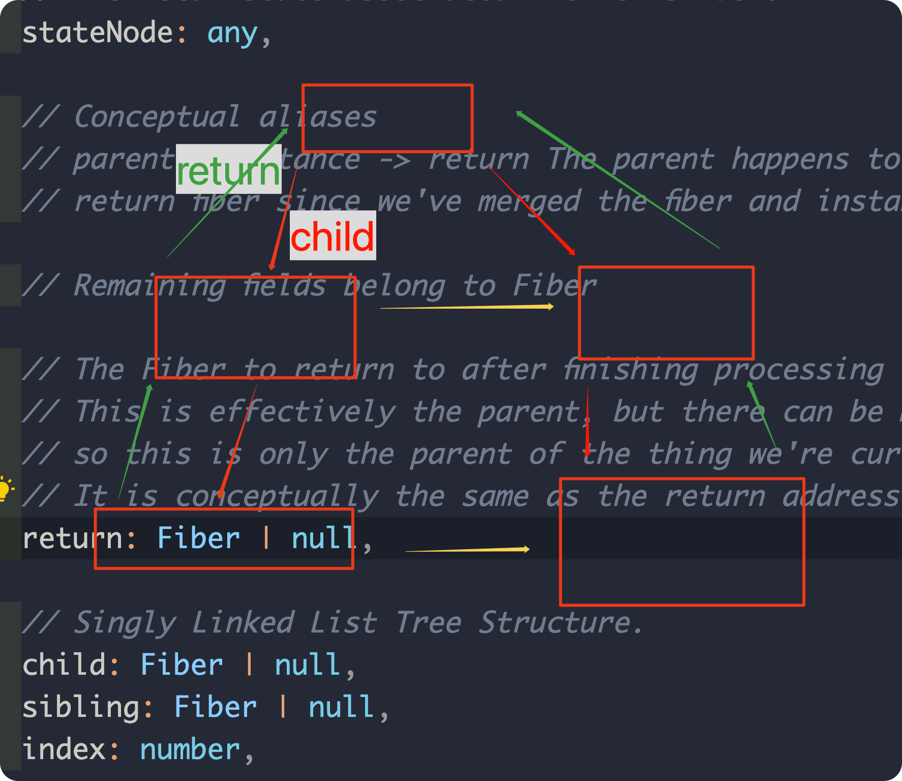
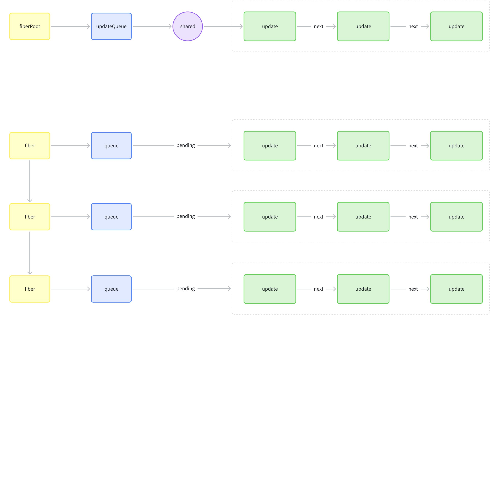
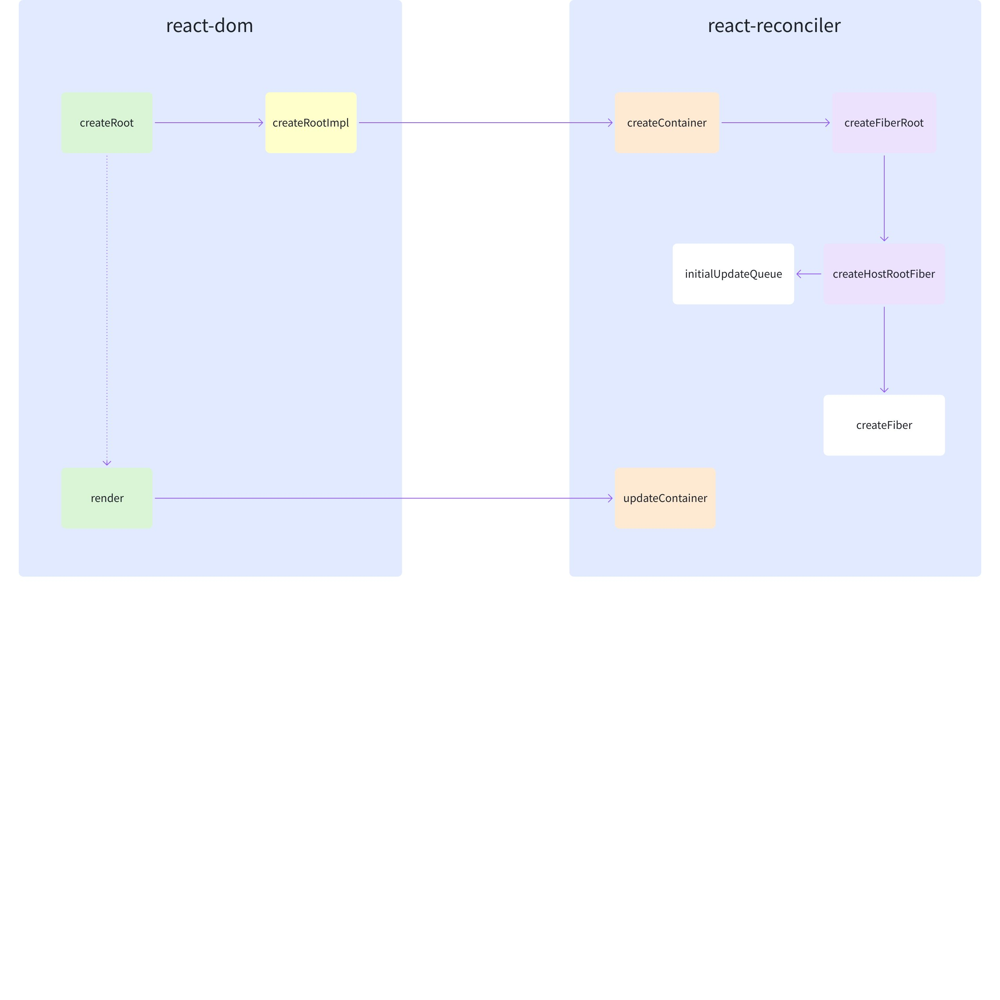
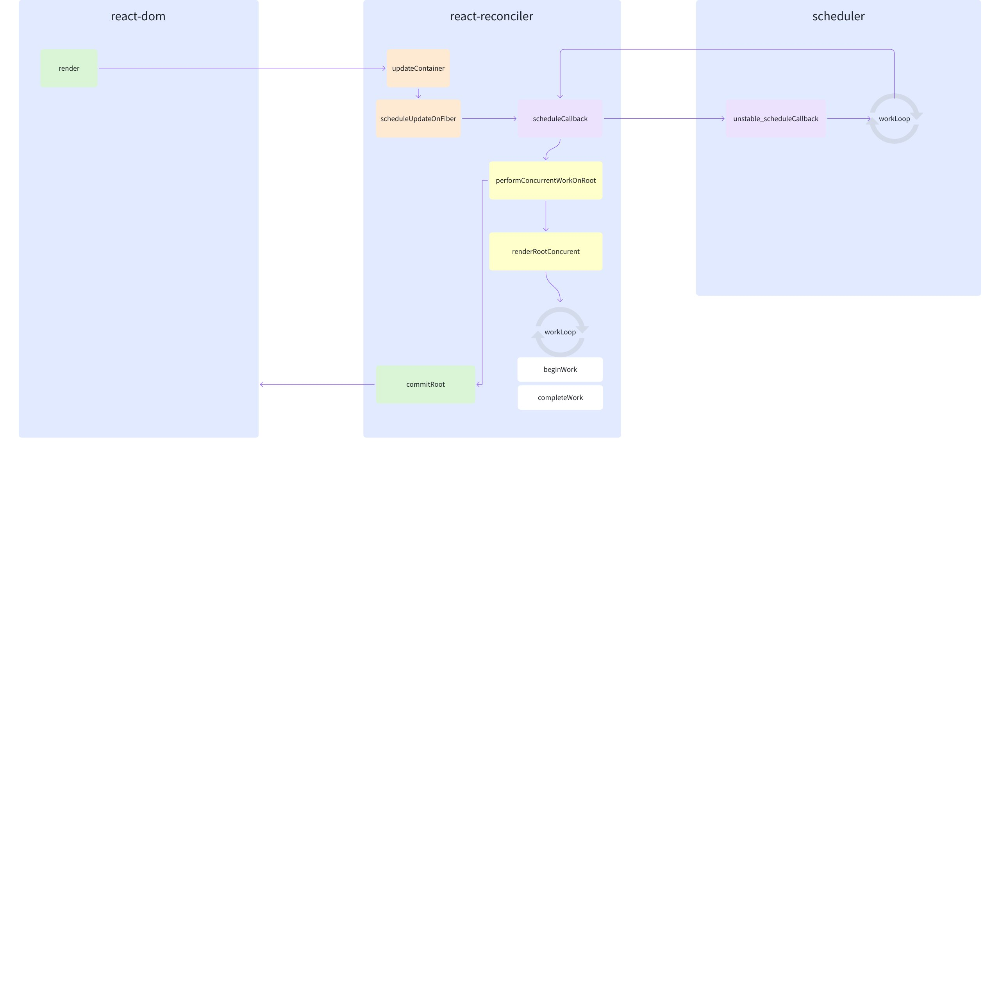
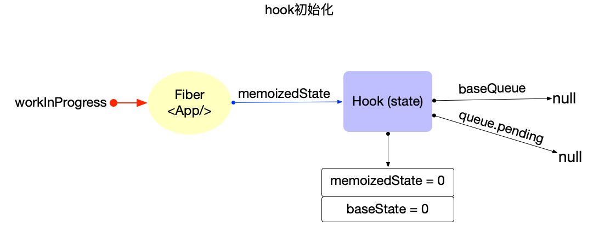
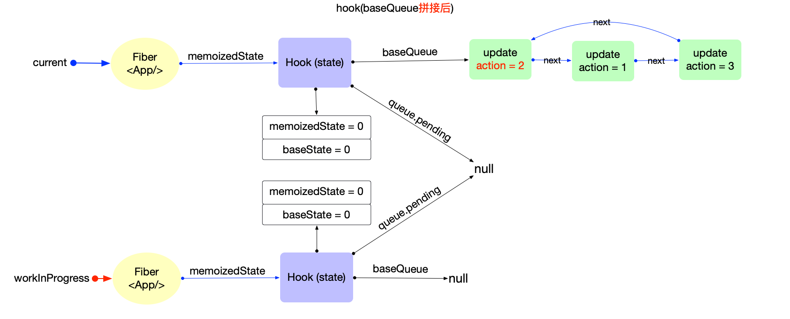
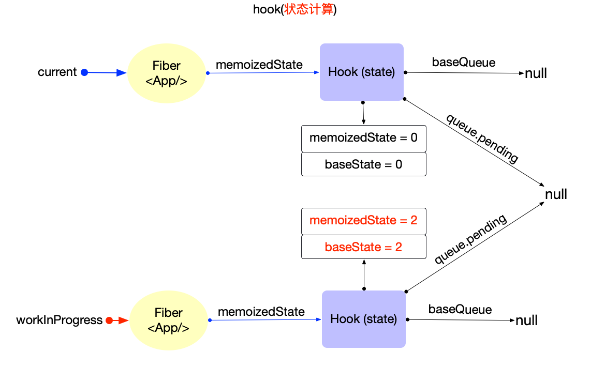
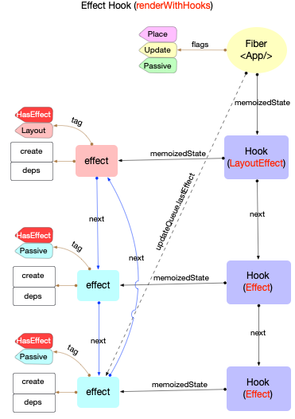
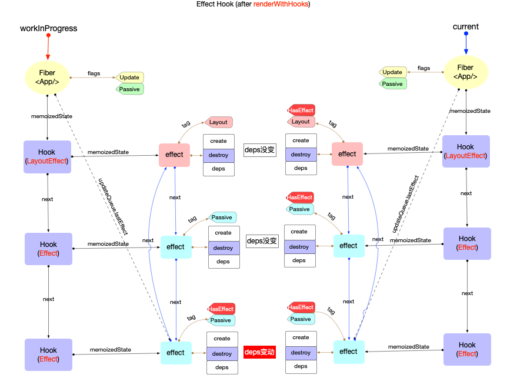

# 6.React 源码解读【二】

> 原文链接：[飞书原文](https://u19tul1sz9g.feishu.cn/docx/LZwJdQqi9o4L8kxub7Ncecumn5t)

[引用：20260207 随堂笔记与源码资料](https://www.feishu.cn/docx/HsQBdlBmsocCuExnY9Jcy99Sn2e)

## 课程目标 

> **💡 提示**
>
> - 初中级：
>
>   1. **深入理解 React 执行全过程**：以 React 19 为例，全面了解 React 应用的创建、更新与销毁流程，掌握其核心关键节点
>   2. **精通 Scheduler 原理**：掌握从早期的 expirationTime 时间切片机制到 lanes 机制的演进，理解其设计目的与实际应用
>   3. **理解 Reconciler 原理**：掌握从早期的 stack reconciler 到 Fiber 的演进，深入理解其重构的目的和优化方向
>   4. **了解 Hooks 原理**：理解 React Hooks 的设计理念，并掌握代数效应在 React 整体架构中的关键作用
> - 高级：
>
>   1. **深入探讨 Scheduler 与 Reconciler 细节**：精通优先级中断更新的实现，理解更新中断与恢复机制，掌握双缓存的构建与优化
>   2. **手写 React**：从零开始实现一个简化版的核心 React，深入理解其底层原理与实现细节

## 补充资料

- 时间切片重构（Lanes）：https://github.com/facebook/react/pull/18796
- React 自定义渲染器相关项目：https://github.com/chentsulin/awesome-react-renderer?tab=readme-ov-file
- 代数效应：https://www.tangshuang.net/7899.html
- 代数效应设计：https://overreacted.io/algebraic-effects-for-the-rest-of-us/
- react+three 的自定义渲染器：https://github.com/pmndrs/react-three-fiber/blob/5f7e9452abeff9a1a3cd9467a878462227f5fdc8/packages/fiber/src/core/reconciler.tsx#L120


## 相关面试真题


### context 有什么作用，原理是?


**答案：**


React 中的 Context 提供了一种在组件树中传递数据的方法，而无需手动通过每个层级的 props 传递。它特别适合于全局状态的管理，如**用户认证信息**、**主题设置**或**语言选择**等。


#### 作用

1. **避免“props drilling”**：当一些数据需要通过多层嵌套组件传递时，使用 Context 可以避免每一层都通过 props 传递这些数据。
2. **全局状态管理**：Context 提供了一种轻量级的全局状态管理方案，可以在应用的任何地方访问和更新状态。
3. **提高代码可读性和维护性**：通过减少不必要的 props 传递，使代码更加简洁和易于维护。


#### 基础使用

React 的 Context 包括两个主要部分：`Provider` 和 `Consumer`。


1. **创建 Context**：

   ```JavaScript
   import React, { createContext } from 'react';
   
   const MyContext = createContext();
   ```


1. **Provider**：用于在组件树中提供 Context 的值。

   ```JavaScript
   import React, { useState } from 'react';
   import MyContext from './MyContext';
   
   const MyProvider = ({ children }) => {
     const [value, setValue] = useState('default value');
   
     return (
       <MyContext.Provider value={{ value, setValue }}>
         {children}
       </MyContext.Provider>
     );
   };
   ```


1. **Consumer**：用于在需要的地方消费 Context 的值。

   ```JavaScript
   import React, { useContext } from 'react';
   import MyContext from './MyContext';
   
   const MyComponent = () => {
     const { value, setValue } = useContext(MyContext);
   
     return (
       <div>
         <p>Context Value: {value}</p>
         <button onClick={() => setValue('new value')}>Change Value</button>
       </div>
     );
   };
   ```


1. **使用 Provider 包装组件树**：

   ```JavaScript
   import React from 'react';
   import ReactDOM from 'react-dom';
   import MyProvider from './MyProvider';
   import MyComponent from './MyComponent';
   
   const App = () => (
     <MyProvider>
       <MyComponent />
     </MyProvider>
   );
   
   ReactDOM.render(<App />, document.getElementById('root'));
   ```


#### 原理分析


##### 创建 Context


在 React 中，`createContext` 函数用于创建一个 Context 对象。这个函数的实现位于 `packages/react/src/ReactContext.js` 文件中。


```JavaScript
import { createContext } from 'react';

const MyContext = createContext(defaultValue);
```


```JavaScript
// ReactContext.js
export function createContext(defaultValue) {
  const context = {
    $$typeof: REACT_CONTEXT_TYPE,
    _currentValue: defaultValue,
    _currentValue2: defaultValue,
    _threadCount: 0,
    Provider: null,
    Consumer: null,
  };

  context.Provider = {
    $$typeof: REACT_PROVIDER_TYPE,
    _context: context,
  };

  context.Consumer = context;

  return context;
}
```


`createContext` 返回的对象包含 `Provider` 和 `Consumer` 属性。`Provider` 用于提供值，而 `Consumer` 用于消费值。


##### Provider 提供值


`Provider` 组件用于在组件树中提供 Context 的值。其实现涉及到 `ReactFiberHooks`，该文件位于 `packages/react-reconciler/src/ReactFiberHooks.js`。


```JavaScript
function updateContextProvider(current, workInProgress, renderLanes) {
  const providerType = workInProgress.type;
  const context = providerType._context;

  const newProps = workInProgress.pendingProps;
  const oldProps = workInProgress.memoizedProps;

  const newValue = newProps.value;

  pushProvider(workInProgress, newValue);

  return workInProgress.child;
}
```


`updateContextProvider` 函数用于更新 Provider 组件的值，并将新值推入 Context 中。`pushProvider` 函数会将新值存储在 Context 对象的 `_currentValue` 属性中。


##### Consumer 消费值


`Consumer` 组件用于在组件树中消费 Context 的值。其实现涉及到 `ReactFiberNewContext` 文件，位于 `packages/react-reconciler/src/ReactFiberNewContext.js`。


```JavaScript
function readContext(context, observedBits) {
  const value = isPrimaryRenderer ? context._currentValue : context._currentValue2;
  return value;
}
```


`readContext` 函数用于读取 Context 的值。根据当前的渲染器（primary 或 secondary），它会读取 `_currentValue` 或 `_currentValue2` 属性的值。


##### useContext Hook


`useContext` 是 React 16.8 引入的 Hook，使得函数组件能够方便地使用 Context。其实现位于 `packages/react-reconciler/src/ReactFiberHooks.js` 文件中。


```JavaScript
function useContext(Context) {
  const dispatcher = resolveDispatcher();
  return dispatcher.useContext(Context);
}
```


`useContext` 函数调用 `resolveDispatcher` 来获取当前的 Hook dispatcher，然后调用 dispatcher 的 `useContext` 方法。


```JavaScript
function readContext(Context, observedBits) {
  const value = Context._currentValue;
  return value;
}
```


##### 订阅更新


当 `Provider` 的 `value` 发生变化时，React 会通过其内部机制通知所有订阅了该 Context 的 `Consumer` 组件，从而触发重新渲染。


```JavaScript
function scheduleUpdateOnFiber(fiber, lane, eventTime) {
  // Schedule the update on the fiber and its alternate
  const root = markUpdateLaneFromFiberToRoot(fiber, lane);
  if (root === null) {
    warnAboutUpdateOnUnmountedFiberInDEV(fiber);
    return;
  }

  markRootUpdated(root, lane, eventTime);
  ensureRootIsScheduled(root, eventTime);
}
```


`scheduleUpdateOnFiber` 函数用于调度更新操作，当 Context 的值发生变化时，会调用此函数来通知相关组件进行重新渲染。


##### 小结


通过以上源码分析，我们可以看到 React 中 Context 的实现涉及到多个核心模块和函数：


1. **创建 Context**：`createContext` 函数用于创建 Context 对象，包括 `Provider` 和 `Consumer`。
2. **提供值**：`updateContextProvider` 函数用于更新 Provider 的值，并将其存储在 Context 对象中。
3. **消费值**：`readContext` 函数用于读取 Context 的值，`useContext` Hook 使函数组件能够方便地使用 Context。
4. **订阅更新**：当 Context 的值变化时，React 通过 `scheduleUpdateOnFiber` 函数调度相关组件的重新渲染。


#### 注意事项

1. **性能优化**：过度使用 Context 可能会导致性能问题，特别是在高频率更新的情况下。可以通过分割 Context 或使用其他状态管理工具来优化性能。
2. **层级结构**：尽量在需要的最小组件树范围内使用 Provider，以避免不必要的重新渲染。


### 请说说可中断更新？


**答案：**


在 React 中，可中断渲染（interruptible rendering）是指 React 能够在处理较长渲染任务时暂时中断当前的渲染工作，去处理更高优先级任务，高优先级任务执行完后，再回来继续完成之前未完成的渲染。

这是 React 的一种优化技术，旨在提高应用的响应速度和用户体验。


这是由 Fiber 与 Lanes 架构实现的。Fiber 允许 React 更好地控制渲染过程，包括以下几个方面：


1. **时间分片**：React 可以将渲染任务分割成多个小的任务片段（units of work），在每个任务片段之间检查是否有更高优先级的任务需要处理。如果有，它会先处理这些高优先级的任务。


1. **优先级调度**：不同的任务被赋予不同的优先级。例如，用户输入或动画等交互任务会被视为高优先级，而后台数据加载等任务则可能被视为低优先级。


1. **任务中断和恢复**：当一个高优先级任务需要处理时，React 可以中断当前的渲染任务，去处理高优先级任务，之后再恢复并继续处理被中断的任务。


通过这些特性，React 可以在长时间渲染过程中保持应用的流畅性和响应速度，避免由于一次性处理大量渲染任务导致的卡顿现象。


**示例**

假设有一个复杂的组件树需要渲染，如果没有可中断渲染，浏览器可能会在渲染过程中冻结，直到渲染完成。而有了可中断渲染，React 可以在渲染过程中暂停，处理用户的输入或其他更紧急的任务，然后再继续未完成的渲染工作。


```JavaScript
// 这是一个简单的例子，展示 React 如何处理优先级较高的任务
import React, { useState } from 'react';

function App() {
  const [count, setCount] = useState(0);

  const handleClick = () => {
    setCount(count + 1);
  };

  return (
    <div>
      <button onClick={handleClick}>Click me</button>
      <SlowComponent />
    </div>
  );
}

function SlowComponent() {
  // 模拟一个需要长时间渲染的组件
  let now = performance.now();
  while (performance.now() - now < 1000) {
    // Do nothing for 1000ms to simulate a slow component
  }
  return <div>I'm a slow component</div>;
}

export default App;
```


在这个示例中，`SlowComponent` 模拟了一个需要长时间渲染的组件。如果没有可中断渲染，当用户点击按钮时，可能会感到明显的卡顿。但有了可中断渲染，React 可以先处理按钮点击事件，然后再继续渲染 `SlowComponent`。


### 为什么不能在判断语句中写 hooks？


**答案：**

代数效应整体设计，不允许你 Hooks 组织出现断层。


## 定义对象

在 React 中，定义了很多对象用于辅助整体流程，按照执行顺序，包括：

1. react

   1. ReactElement
2. react-reconciler

   1. Fiber
   2. FiberRoot
   3. Update
   4. UpdateQueue
   5. Hook
3. scheduler

   1. Task


### ReactElement

packages/shared/ReactElementType.js

```JavaScript
export type ReactElement = {|
  $$typeof: any,
  type: any,
  key: any,
  ref: any,
  props: any,
  // ReactFiber
  _owner: any,

  // __DEV__
  _store: {validated: boolean, ...},
  _self: React$Element<any>,
  _shadowChildren: any,
  _source: Source,
|};
```

```JavaScript
/**
 * Factory method to create a new React element. This no longer adheres to
 * the class pattern, so do not use new to call it. Also, instanceof check
 * will not work. Instead test $$typeof field against Symbol.for('react.element') to check
 * if something is a React Element.
 *
 * @param {*} type
 * @param {*} props
 * @param {*} key
 * @param {string|object} ref
 * @param {*} owner
 * @param {*} self A *temporary* helper to detect places where `this` is
 * different from the `owner` when React.createElement is called, so that we
 * can warn. We want to get rid of owner and replace string `ref`s with arrow
 * functions, and as long as `this` and owner are the same, there will be no
 * change in behavior.
 * @param {*} source An annotation object (added by a transpiler or otherwise)
 * indicating filename, line number, and/or other information.
 * @internal
 */
const ReactElement = function(type, key, ref, self, source, owner, props) {
  const element = {
    // This tag allows us to uniquely identify this as a React Element
    $$typeof: REACT_ELEMENT_TYPE,

    // Built-in properties that belong on the element
    type: type,
    key: key,
    ref: ref,
    props: props,

    // Record the component responsible for creating this element.
    _owner: owner,
  };

  return element;
};
```

这里的 `$$typeof`，用于指定元素类型：

```JavaScript
// The Symbol used to tag the ReactElement-like types.
export const REACT_ELEMENT_TYPE = Symbol.for('react.element');
export const REACT_PORTAL_TYPE = Symbol.for('react.portal');
export const REACT_FRAGMENT_TYPE = Symbol.for('react.fragment');
export const REACT_STRICT_MODE_TYPE = Symbol.for('react.strict_mode');
export const REACT_PROFILER_TYPE = Symbol.for('react.profiler');
export const REACT_PROVIDER_TYPE = Symbol.for('react.provider');
export const REACT_CONTEXT_TYPE = Symbol.for('react.context');
```


### Fiber

packages/react-reconciler/src/ReactInternalTypes.js

以下是注释的中文翻译：


```TypeScript
// 一个 Fiber 是一个需要完成或已经完成的组件上的工作。每个组件可能有多个 Fiber。
export type Fiber = {|
  // 这些首字段在概念上是一个实例的成员。这些字段曾经被分割成一个单独的类型并与其他 Fiber 字段交叉，但在 Flow 修复其交叉类型的错误之前，我们将它们合并为一个单一类型。

  // 一个实例在所有版本的组件之间共享。我们可以轻松地将其分解为一个单独的对象，以避免在树的备用版本中复制太多内容。我们现在将它放在一个单一对象上，以尽量减少在初始渲染期间创建的对象数量。

  // 标识 Fiber 类型的标签。
  tag: WorkTag,

  // 此子组件的唯一标识符。
  key: null | string,

  // element.type 的值，用于在调和该子组件时保持其身份。
  elementType: any,

  // 与此 Fiber 关联的已解析函数/类/。
  type: any,

  // 与此 Fiber 关联的本地状态。
  stateNode: any,

  // 概念上的别名
  // parent : Instance -> return 父组件恰好与返回的 fiber 相同，因为我们已经将 fiber 和实例合并了。

  // 剩余字段属于 Fiber

  // 完成处理此 Fiber 后要返回的 Fiber。
  // 这实际上是父组件，但可以有多个父组件（两个），所以这只是我们当前正在处理的东西的父组件。
  // 在概念上，它与堆栈帧的返回地址相同。
  return: Fiber | null,

  // 单链表树结构。
  child: Fiber | null,
  sibling: Fiber | null,
  index: number,

  // 上次用来附加此节点的引用。
  // 我会避免在生产中添加一个 owner 字段，并将其建模为函数。
  ref:
    | null
    | (((handle: mixed) => void) & {_stringRef: ?string, ...})
    | RefObject,

  // 输入是处理此 fiber 的数据。参数。props。
  pendingProps: any, // 一旦我们重载标签，这个类型将更具体。
  memoizedProps: any, // 用于创建输出的 props。

  // 状态更新和回调的队列。
  updateQueue: mixed,

  // 用于创建输出的状态
  memoizedState: any,

  // 此 fiber 的依赖关系（上下文、事件），如果有的话
  dependencies: Dependencies | null,

  // 描述关于 fiber 及其子树的属性的位字段。例如，ConcurrentMode 标志指示子树是否应默认异步。
  // 创建 fiber 时，它继承其父组件的模式。可以在创建时设置其他标志，但之后该值在 fiber 的生命周期中应保持不变，特别是在其子 fiber 被创建之前。
  mode: TypeOfMode,

  // Effect
  flags: Flags,
  subtreeFlags: Flags,
  deletions: Array<Fiber> | null,

  // 快速路径到下一个具有副作用的 fiber 的单链表。
  nextEffect: Fiber | null,

  // 此子树内具有副作用的第一个和最后一个 fiber。这允许我们在重用此 fiber 内的工作时重用链表的一部分。
  firstEffect: Fiber | null,
  lastEffect: Fiber | null,

  lanes: Lanes,
  childLanes: Lanes,

  // 这是一个 Fiber 的池化版本。每个更新的 fiber 最终都会有一对。如果需要，我们可以清理对以节省内存。
  alternate: Fiber | null,

  // 当前更新中渲染此 Fiber 及其后代所花费的时间。
  // 这告诉我们树在 memoization 方面的表现如何。
  // 每次渲染时都会重置为 0，并且只有在我们不 bailout 时才会更新。
  // 仅在启用 enableProfilerTimer 标志时设置此字段。
  actualDuration?: number,

  // 如果 Fiber 当前处于“渲染”阶段，这标志着工作开始的时间。
  // 仅在启用 enableProfilerTimer 标志时设置此字段。
  actualStartTime?: number,

  // 此 Fiber 最近一次渲染的持续时间。
  // 为了 memoization 目的，在我们 bailout 时不会更新此值。
  // 仅在启用 enableProfilerTimer 标志时设置此字段。
  selfBaseDuration?: number,

  // 此 Fiber 的所有后代的基础时间总和。
  // 此值在“完成”阶段向上传递。
  // 仅在启用 enableProfilerTimer 标志时设置此字段。
  treeBaseDuration?: number,

  // 概念上的别名
  // workInProgress : Fiber -> alternate 重用的备用组件恰好与正在进行的工作相同。
  // 仅 __DEV__

  _debugSource?: Source | null,
  _debugOwner?: Fiber | null,
  _debugIsCurrentlyTiming?: boolean,
  _debugNeedsRemount?: boolean,

  // 用于验证 hooks 的顺序在渲染之间没有变化。
  _debugHookTypes?: Array<HookType> | null,
|};
```



### FiberRoot


### Update

packages/react-reconciler/src/ReactFiberClassUpdateQueue.new.js

```TypeScript
export type Update<State> = {|
  // TODO: 临时字段。将通过在根节点上存储一个 transition -> event time 的映射来移除它。
  eventTime: number,
  lane: Lane,

  tag: 0 | 1 | 2 | 3,
  payload: any,
  callback: (() => mixed) | null,

  next: Update<State> | null,
|};
```

- `eventTime`: 发起`update`事件的时间(17.0.2 中作为临时字段, 即将移出)
- `lane`: `update`所属的优先级
- `tag`: 表示`update`种类, 共 4 种. [`UpdateState,ReplaceState,ForceUpdate,CaptureUpdate`](https://github.com/facebook/react/blob/v17.0.2/packages/react-reconciler/src/ReactUpdateQueue.old.js#L131-L134)
- `payload`: 载荷, `update`对象真正需要更新的数据, 可以设置成一个回调函数或者对象.
- `callback`: 回调函数. `commit`完成之后会调用.
- `next`: 指向链表中的下一个, 由于`UpdateQueue`是一个环形链表, 最后一个`update.next`指向第一个`update`对象.

### UpdateQueue

packages/react-reconciler/src/ReactFiberClassUpdateQueue.new.js

```JavaScript
export type UpdateQueue<State> = {|
  baseState: State,
  firstBaseUpdate: Update<State> | null,
  lastBaseUpdate: Update<State> | null,
  shared: SharedQueue<State>,
  effects: Array<Update<State>> | null,
|};
```

- `baseState`: 表示此队列的基础 state
- `firstBaseUpdate`: 指向基础队列的队首
- `lastBaseUpdate`: 指向基础队列的队尾
- `shared`: 共享队列
- `effects`: 用于保存有`callback`回调函数的 update 对象, 在`commit`之后, 会依次调用这里的回调函数.





### Hook

packages/react-reconciler/src/ReactFiberHooks.new.js

```JavaScript
export type Hook = {|
  memoizedState: any,
  baseState: any,
  baseQueue: Update<any, any> | null,
  queue: any,
  next: Hook | null,
|};
```

- `memoizedState`: 内存状态, 用于输出成最终的`fiber`树
- `baseState`: 基础状态, 当`Hook.queue`更新过后, `baseState`也会更新.
- `baseQueue`: 基础状态队列, 在`reconciler`阶段会辅助状态合并.
- `queue`: 指向一个`Update`队列
- `next`: 指向该`function`组件的下一个`Hook`对象, 使得多个`Hook`之间也构成了一个链表


### Effect

packages/react-reconciler/src/ReactFiberHooks.new.js

```JavaScript
export type Effect = {|
  tag: HookFlags,
  create: () => (() => void) | void,
  destroy: (() => void) | void,
  deps: Array<mixed> | null,
  next: Effect,
|};
```

- `tag`：标识 effect 的类型。
- `create`：是创建 effect 的函数，在组件渲染后执行。
- `destroy`：是清理函数，在组件卸载或 effect 重新执行前执行。
- `deps`：是依赖项数组，决定 effect 何时重新执行。
- `next`：指向下一个 effect，形成 effect 链表。


### Task（稍微了解）

packages/react-server/src/ReactFizzServer.js

```JavaScript
export type Task = {
  node: ReactNodeList,
  ping: () => void,
  blockedBoundary: Root | SuspenseBoundary,
  blockedSegment: Segment, // the segment we'll write to
  abortSet: Set<Task>, // the abortable set that this task belongs to
  legacyContext: LegacyContext, // the current legacy context that this task is executing in
  context: ContextSnapshot, // the current new context that this task is executing in
  treeContext: TreeContext, // the current tree context that this task is executing in
  componentStack: null | ComponentStackNode, // DEV-only component stack
};
```

- `node`: 要渲染的 React 节点列表。
- `ping`: 用于通知任务调度器当前任务可以继续执行的函数。
- `blockedBoundary`: 当前任务被阻塞的边界，可以是根节点或 Suspense 边界。
- `blockedSegment`: 当前任务正在写入的段。
- `abortSet`: 当前任务所属的可中止任务集合。
- `legacyContext`: 当前任务执行时使用的旧版（传统）上下文。
- `context`: 当前任务执行时使用的新上下文的快照。
- `treeContext`: 当前任务执行时使用的树上下文。
- `componentStack`: 仅在开发环境中使用的组件堆栈节点，用于调试。


## React 核心流程

React 执行流程我们拆解为两部分，分别为：创建与更新。

创建阶段，主要完成的工作包含：容器创建、元素对应 Fiber 创建、更新队列初始化等操作。

更新阶段，主要包含：状态更新触发任务入队、scheduler 调度、重新构建 fiber、完成 fiber 到元素映射更新视图


### 创建

上一小节，我们探讨了 concurrent 模式启动，也是最常用的模式。

完整执行顺序（方法名）及核心文件：

1. react-dom

   1. ReactDOM.createRoot
   2. createRootImpl
2. react-reconciler

   1. createContainer
   2. createFiberRoot
   3. createHostRootFiber
   4. createFiber
   5. initializeUpdateQueue
3. react-dom

   1. ReactDOMRoot.prototype.render
   2. markContainerAsRoot
   3. updateContainer
   4. ... 此处省略，我们在更新处探讨




#### 更多启动方式

1. `legacy` 模式: `ReactDOM.render(<App />, rootNode)`。

```JavaScript
export function render(
  element: React$Element<any>,
  container: Container,
  callback: ?Function,
) {
  if (__DEV__) {
    console.error(
      'ReactDOM.render is no longer supported in React 19. Use createRoot ' +
        'instead. Until you switch to the new API, your app will behave as ' +
        "if it's running React 17. Learn " +
        'more: https://reactjs.org/link/switch-to-createroot',
    );
  }

  if (!isValidContainerLegacy(container)) {
    throw new Error('Target container is not a DOM element.');
  }

  if (__DEV__) {
    const isModernRoot =
      isContainerMarkedAsRoot(container) &&
      container._reactRootContainer === undefined;
    if (isModernRoot) {
      console.error(
        'You are calling ReactDOM.render() on a container that was previously ' +
          'passed to ReactDOMClient.createRoot(). This is not supported. ' +
          'Did you mean to call root.render(element)?',
      );
    }
  }
  return legacyRenderSubtreeIntoContainer(
    null,
    element,
    container,
    false,
    callback,
  );
}
```

1. `Concurrent` 模式: `ReactDOM.createRoot(rootNode).render(<App />)`。

```JavaScript
// ConcurrentRoot
// 1. 创建ReactDOMRoot对象
const reactDOMRoot = ReactDOM.createRoot(document.getElementById('root'));
// 2. 调用render
reactDOMRoot.render(<App />); // 不支持回调
```

Concurrent 模式启动我们上一小节详细介绍了，我们来看看 `legacy` 模式启动。


#### Legacy

- render
- legacyRenderSubtreeIntoContainer
- legacyCreateRootFromDOMContainer
- updateContainer
- ...


### 更新


React 的设计精妙之处在于**统一性**：无论是应用首次启动的初始化渲染（Mount），还是后续的状态更新（Update），在底层最终都会殊途同归，进入同一个更新调度流程。

我们将整个过程拆解为以下四个核心阶段：

1. **触发阶段 (Trigger):** `updateContainer`
2. **调度阶段 (Schedule):** `scheduleUpdateOnFiber`
3. **渲染阶段 (Render/WorkLoop):** `performSyncWorkOnRoot`
4. **提交阶段 (Commit):** `commitRoot`


完整执行顺序（方法名）及核心文件：

- react-reconciler

  - updateContainer
  - requestUpdateLane
  - enqueueUpdate
  - scheduleUpdateOnFiber
- scheduler

  - unstable_scheduleCallback
  - workloop
- react-reconciler

  - performConcurrentWorkOnRoot
  - renderRootConcurrent
  - workLoop
  - performUnitOfWork
  
    - beginWork
    - completeWork
  - commitRoot





> 注：此处包含飞书只读块（type=isv），当前导出接口未返回可展开正文。


#### 触发阶段：统一的入口 (updateContainer)

正如你所提到的，`ReactDOMRoot.prototype.render`（初始化）和状态更新最终调用的都是 `updateContainer`。这个函数的主要职责是**创建一个更新对象（Update），计算其优先级（Lane），并将其放入队列**。

##### 核心流程

`App.render(...)`  ->  `updateContainer` ->  `requestUpdateLane`  ->  `enqueueUpdate` -> `scheduleUpdateOnFiber`


##### 源码解析

```TypeScript
/**
 * updateContainer: 更新的统一入口
 * 作用：计算优先级，创建 Update 对象，入队，并开始调度
 */
export function updateContainer(
  element: ReactNodeList,
  container: OpaqueRoot,
  parentComponent: ?React$Component<any, any>,
  callback: ?Function,
): Lane {
  // 1. 获取当前 Fiber 节点
  const current = container.current;
  
  // 2. 获取当前时间与计算本次更新的优先级 (Lane)
  const eventTime = requestEventTime();
  const lane = requestUpdateLane(current);

  // 3. 处理 Context (针对服务端渲染或旧版 Context api)
  const context = getContextForSubtree(parentComponent);
  if (container.context === null) {
    container.context = context;
  } else {
    container.pendingContext = context;
  }

  // 4. 创建 Update 对象
  // createUpdate 会根据 lane 初始化一个对象，用于存储更新内容(payload)
  const update = createUpdate(eventTime, lane);
  
  // 注意：DevTools 依赖 "element" 这个属性名
  update.payload = { element };

  // 处理回调函数 (如 setState 的第二个参数)
  if (callback !== null && callback !== undefined) {
    update.callback = callback;
  }

  // 5. 将 Update 加入 Fiber 的更新队列 (UpdateQueue)
  const root = enqueueUpdate(current, update, lane);
  
  // 6. 调度更新
  if (root !== null) {
    scheduleUpdateOnFiber(root, current, lane, eventTime);
    // 处理 Transition 相关的优先级纠缠
    entangleTransitions(root, current, lane);
  }

  return lane;
}
```


#### 调度阶段：注册与决策 (scheduleUpdateOnFiber)

一旦更新被加入队列，React 需要决定**何时**处理它。`scheduleUpdateOnFiber` 是连接 React Reconciler（协调器）和 Scheduler（调度器）的桥梁。它会标记根节点有待处理的更新，并根据当前环境（是否在渲染中、是否是同步更新等）决定是立即执行还是交给调度器。

##### 源码解析

```TypeScript
// packages/react-reconciler/src/ReactFiberWorkLoop.new.js

export function scheduleUpdateOnFiber(
  root: FiberRoot,
  fiber: Fiber,
  lane: Lane,
  eventTime: number,
) {
  // 检查是否存在无限循环的嵌套更新
  checkForNestedUpdates(); 

  // 1. 标记根节点（FiberRoot）上有待处理的更新 Lane
  // 这让 React 知道树的哪个部分“脏”了
  markRootUpdated(root, lane, eventTime);

  // 2. 判断当前执行上下文
  if (
    (executionContext & RenderContext) !== NoLanes &&
    root === workInProgressRoot
  ) {
    // 情况 A: 在渲染阶段触发的更新 (Render Phase Update)
    // 通常是错误的，或者是由于某些内部机制（如 selective hydration）
    warnAboutRenderPhaseUpdatesInDEV(fiber);

    // 记录这些在渲染期间产生的 Lanes，后续合并处理
    workInProgressRootRenderPhaseUpdatedLanes = mergeLanes(
      workInProgressRootRenderPhaseUpdatedLanes,
      lane,
    );
  } else {
    // 情况 B: 正常的外部更新 (如点击事件、网络请求回调)
    
    // ... (省略部分 DevTools 和 Profiler 的追踪代码)

    if (root === workInProgressRoot) {
      // 如果收到更新时，React 正在渲染这棵树：
      // 标记为“交错更新”(Interleaved Update)。
      // 如果当前渲染被挂起（Suspended），可能需要中断并重新开始。
      if (
        deferRenderPhaseUpdateToNextBatch ||
        (executionContext & RenderContext) === NoContext
      ) {
        workInProgressRootInterleavedUpdatedLanes = mergeLanes(
          workInProgressRootInterleavedUpdatedLanes,
          lane,
        );
      }
      if (workInProgressRootExitStatus === RootSuspendedWithDelay) {
        markRootSuspended(root, workInProgressRootRenderLanes);
      }
    }

    // 3. 核心：确保根节点被调度
    // 这里会调用 Scheduler 的 scheduleCallback 或微任务
    ensureRootIsScheduled(root, eventTime); 

    // 4. 特殊处理：同步更新的立即刷新
    // 如果是同步优先级 (SyncLane) 且不在任何 React 工作上下文中 (NoContext)
    if (
      lane === SyncLane &&
      executionContext === NoContext &&
      (fiber.mode & ConcurrentMode) === NoMode &&
      !(__DEV__ && ReactCurrentActQueue.isBatchingLegacy)
    ) {
      // 这里的逻辑主要是为了保留 Legacy 模式的同步行为
      // 立即刷新同步回调，而不是等到下一个 Tick
      resetRenderTimer(); 
      flushSyncCallbacksOnlyInLegacyMode(); 
    }
  }
}
```


#### 渲染执行：同步任务回调 (performSyncWorkOnRoot)

当调度器决定执行任务时，会调用相应的回调函数。对于同步任务，入口是 `performSyncWorkOnRoot`。这里开始了著名的 **Work Loop**（工作循环），即构建 Fiber 树的过程。

##### 核心流程

1. 刷新 `useEffect` (Passive Effects)。
2. 调用 `renderRootSync` 开始构建 Fiber 树 (`beginWork` / `completeWork`)。
3. 如果成功，生成 `finishedWork`，进入 `commitRoot`。

##### 源码解析

```TypeScript
// 这是不通过 Scheduler 的同步任务入口点
function performSyncWorkOnRoot(root) {
  // 检查：如果已经在渲染或提交阶段，不应再次进入
  if ((executionContext & (RenderContext | CommitContext)) !== NoContext) {
    throw new Error('Should not already be working.');
  }

  // 1. 在开始新的渲染前，必须先刷新上一轮遗留的副作用 (useEffect)
  flushPassiveEffects(); 

  // 2. 获取待处理的优先级 Lanes
  let lanes = getNextLanes(root, NoLanes); 
  if (!includesSomeLane(lanes, SyncLane)) {
    // 如果没有同步工作要做，确保根节点被调度以处理剩余工作，然后退出
    ensureRootIsScheduled(root, now()); 
    return null;
  }

  // 3. 执行同步渲染循环 (Render Phase)
  // 这里面包含了 workLoop -> performUnitOfWork -> beginWork/completeWork
  let exitStatus = renderRootSync(root, lanes); 

  // 4. 错误处理
  if (root.tag !== LegacyRoot && exitStatus === RootErrored) {
    // 并发模式下出错，尝试同步恢复
    const errorRetryLanes = getLanesToRetrySynchronouslyOnError(root);
    if (errorRetryLanes !== NoLanes) {
      lanes = errorRetryLanes;
      exitStatus = recoverFromConcurrentError(root, errorRetryLanes);
    }
  }

  // 严重错误处理
  if (exitStatus === RootFatalErrored) {
    const fatalError = workInProgressRootFatalError;
    prepareFreshStack(root, NoLanes); 
    markRootSuspended(root, lanes); 
    ensureRootIsScheduled(root, now());
    throw fatalError;
  }

  // 5. 渲染完成，准备提交
  // 这里生成了一棵完整的“新树”，存储在 root.finishedWork
  const finishedWork: Fiber = (root.current.alternate: any); 
  root.finishedWork = finishedWork;
  root.finishedLanes = lanes;
  
  // 6. 进入 Commit 阶段：将变更应用到 DOM
  commitRoot(
    root,
    workInProgressRootRecoverableErrors,
    workInProgressTransitions,
  ); 

  // 退出前，确保还有剩余任务的话继续被调度
  ensureRootIsScheduled(root, now());

  return null;
}
```


#### 提交阶段：变更落地 (commitRoot)

这是 React 更新的最后阶段。此时，Fiber 树已经构建完成，DOM Diff 已经计算完毕。`commitRoot` 负责将这些变化“一次性”写入 DOM，并触发 `componentDidMount` 等生命周期。

##### 源码解析

```TypeScript
function commitRoot(
  root: FiberRoot,
  recoverableErrors: null | Array<CapturedValue<mixed>>,
  transitions: Array<Transition> | null,
) {
  // 保存之前的更新优先级，以便执行完 Commit 后恢复
  const previousUpdateLanePriority = getCurrentUpdatePriority(); 
  const prevTransition = ReactCurrentBatchConfig.transition; 

  try {
    // Commit 阶段是同步且不可中断的，通常不需要 Transition 上下文
    ReactCurrentBatchConfig.transition = null; 
    
    // 将优先级设置为 Discrete (离散事件优先级)，通常用于处理点击等用户交互
    setCurrentUpdatePriority(DiscreteEventPriority); 
    
    // 调用实际的实现函数
    // 包含三个子阶段：BeforeMutation, Mutation (操作DOM), Layout (操作后)
    commitRootImpl(
      root,
      recoverableErrors,
      transitions,
      previousUpdateLanePriority,
    ); 
  } finally {
    // 恢复之前的上下文环境
    ReactCurrentBatchConfig.transition = prevTransition; 
    setCurrentUpdatePriority(previousUpdateLanePriority); 
  }

  return null;
}
```


### 完整调用栈视图

整个 React 更新的完整执行路径如下：

1. **触发 (Trigger)**

   - `updateContainer` (在 `ReactDOM.render` 或 `setState` 时调用)
   - `requestUpdateLane` (计算优先级)
   - `enqueueUpdate` (加入队列)
   - `scheduleUpdateOnFiber` (请求调度)
2. **调度 (Scheduler Interaction)**

   - `ensureRootIsScheduled`
   - `scheduler.unstable_scheduleCallback` (告诉 Scheduler 有任务)
3. **执行 (Execution / Render Phase)**

   - `scheduler.workloop` (Scheduler 触发回调)
   - `performConcurrentWorkOnRoot` 或 `performSyncWorkOnRoot`
   - `renderRootConcurrent` / `renderRootSync`
   - `workLoop` (核心循环)
   - `performUnitOfWork` \$\rightarrow\$ `beginWork` (向下遍历) \$\rightarrow\$ `completeWork` (向上回溯)
4. **提交 (Commit Phase)**

   - `commitRoot`
   - `commitRootImpl` (DOM 变更、生命周期执行)


## 两个核心调度过程

在 React 源码中，有两个核心调度过程非常重要，我们单独将它们拧出来详细说明一下。

- Scheduler workLoop
- Reconciler workLoop


React 的 `Scheduler` 和 `Reconciler` 是其内部两个重要的子系统，它们共同合作来处理更新、调度任务和协调组件。`workLoop` 是这两个子系统中一个重要的概念，用于处理工作循环。在详细说明之前，先简要介绍这两个子系统的作用：


- **Scheduler**: 负责任务的调度和优先级管理，确保高优先级任务优先执行，低优先级任务在空闲时间执行。
- **Reconciler**: 负责协调组件的更新，找出组件树中的变化，并生成更新。


### Scheduler 的 `workLoop`


Scheduler 的 `workLoop` 是一个用于调度任务的循环。它会根据任务的优先级决定执行哪些任务，并在适当的时候暂停或中断，以确保用户体验的流畅性。下面是一个简化版的 `workLoop` 实现，并解释其工作原理：


```JavaScript
function workLoop(hasTimeRemaining, initialTime) {
  let currentTime = initialTime;
  let currentTask = firstTask;

  while (currentTask !== null && !shouldYieldToHost()) {
    // 判断是否应该放弃控制权回到浏览器，以确保不会阻塞主线程
    if (currentTask.expirationTime <= currentTime) {
      // 任务过期，立即执行
      currentTask.callback();
      currentTask = currentTask.next;
    } else {
      // 任务未过期，继续执行下一个任务
      currentTask = currentTask.next;
    }
  }

  // 将剩余的任务保存在队列中
  firstTask = currentTask;
}
```


### Reconciler 的 `workLoop`


Reconciler 的 `workLoop` 是协调组件更新的核心循环。它遍历组件树，找出需要更新的组件，并生成更新。这是一个递归的过程，通过 Fiber 数据结构来实现。下面是一个简化版的 Reconciler `workLoop`，并解释其工作原理：


```JavaScript
function workLoop() {
  while (workInProgress !== null) {
    // 处理当前 fiber
    performUnitOfWork(workInProgress);
    // 移动到下一个 fiber
    workInProgress = getNextWorkInProgress();
  }
}

function performUnitOfWork(fiber) {
  const next = beginWork(fiber);
  if (next === null) {
    completeUnitOfWork(fiber);
  } else {
    workInProgress = next;
  }
}

function completeUnitOfWork(fiber) {
  // 完成当前 fiber 的工作，并移动到父 fiber
  let returnFiber = fiber.return;
  let siblingFiber = fiber.sibling;
  if (siblingFiber !== null) {
    workInProgress = siblingFiber;
  } else {
    workInProgress = returnFiber;
  }
}

function getNextWorkInProgress() {
  // 返回下一个需要处理的 fiber
  return workInProgress.child;
}
```


### 对比

我们详细对比一下这两大工作循环的原理、

#### 工作原理


1. **Scheduler 的 `workLoop`**:

   - 主要用于调度任务，并根据任务的优先级执行。
   - 使用 `shouldYieldToHost` 方法判断是否需要将控制权交还给浏览器，确保不会阻塞主线程，从而保持用户界面的流畅性。


1. **Reconciler 的 `workLoop`**:

   - 主要用于协调组件的更新。
   - 通过 `performUnitOfWork` 方法递归地遍历 Fiber 树，找出需要更新的组件并生成更新。
   - 使用 `beginWork` 方法开始处理一个 Fiber 节点，并通过 `completeUnitOfWork` 方法完成处理。


#### 详细说明


1. **Scheduler 的 `workLoop`**:

   - `shouldYieldToHost()`: 该方法用于检查当前时间片是否已经用完，如果用完则将控制权交还给浏览器，让浏览器有时间处理用户输入和其他高优先级任务。
   - `expirationTime`: 任务的过期时间，用于判断任务的优先级，过期时间越短优先级越高。


1. **Reconciler 的 `workLoop`**:

   - `workInProgress`: 当前正在处理的 Fiber 节点。
   - `beginWork(fiber)`: 处理 Fiber 节点的开始部分，负责协调更新并生成新的 Fiber 节点。
   - `completeUnitOfWork(fiber)`: 处理 Fiber 节点的完成部分，将控制权交给父节点或兄弟节点。
   - `getNextWorkInProgress()`: 获取下一个需要处理的 Fiber 节点。


#### 主要区别


- **Scheduler 的 `workLoop`** 主要关注任务调度和优先级管理，确保高优先级任务优先执行，并在适当的时候暂停或中断任务，以保持用户界面的流畅性。
- **Reconciler 的 `workLoop`** 主要关注组件更新的协调，通过递归遍历 Fiber 树找出需要更新的组件，并生成更新。


## 状态 Hooks 原理

研究 Hook，我们将与之相关的流程分为两个阶段，分别为：**创建**、**更新**。


### 创建

在`fiber`初次构造阶段, 涉及 mountState 或 mountReducer 处理，分别对应于：

```JavaScript
function mountState<S>(
  initialState: (() => S) | S,
): [S, Dispatch<BasicStateAction<S>>] {
  const hook = mountWorkInProgressHook();
  if (typeof initialState === 'function') {
    // $FlowFixMe: Flow doesn't like mixed types
    initialState = initialState();
  }
  hook.memoizedState = hook.baseState = initialState;
  const queue: UpdateQueue<S, BasicStateAction<S>> = {
    pending: null,
    lanes: NoLanes,
    dispatch: null,
    lastRenderedReducer: basicStateReducer,
    lastRenderedState: (initialState: any),
  };
  hook.queue = queue;
  const dispatch: Dispatch<
    BasicStateAction<S>,
  > = (queue.dispatch = (dispatchSetState.bind(
    null,
    currentlyRenderingFiber,
    queue,
  ): any));
  return [hook.memoizedState, dispatch];
}
```

```JavaScript
function mountReducer<S, I, A>(
  reducer: (S, A) => S,
  initialArg: I,
  init?: I => S,
): [S, Dispatch<A>] {
  const hook = mountWorkInProgressHook();
  let initialState;
  if (init !== undefined) {
    initialState = init(initialArg);
  } else {
    initialState = ((initialArg: any): S);
  }
  hook.memoizedState = hook.baseState = initialState;
  const queue: UpdateQueue<S, A> = {
    pending: null,
    lanes: NoLanes,
    dispatch: null,
    lastRenderedReducer: reducer,
    lastRenderedState: (initialState: any),
  };
  hook.queue = queue;
  const dispatch: Dispatch<A> = (queue.dispatch = (dispatchReducerAction.bind(
    null,
    currentlyRenderingFiber,
    queue,
  ): any));
  return [hook.memoizedState, dispatch];
}
```

细心的同学会发现，两部分逻辑高度相似，这也是我之前跟同学们常提起的，`useState` 本身就是 `useReducer` 的拓展，或者说二次封装。以上示例的区别点在于：`lastRenderedReducer`，`mountState` 使用了预定义的 `basicStateReducer`。


### 状态初始化

状态初始化逻辑已经呈现在前面部分源码中，状态初始化逻辑比较简单：

```JavaScript
  hook.memoizedState = hook.baseState = initialState;
```

在 React 的 Hooks 实现中，`memoizedState`、`baseState` 和 `initialState` 都与状态管理有关。理解它们的关系有助于理解 React 如何管理组件的状态，特别是在使用 `useState` Hook 时。


#### `initialState`


`initialState` 是初始状态，是在首次调用 `useState` 时传递给它的参数。它用于为组件设置初始状态。


```JavaScript
const [state, setState] = useState(initialState);
```


#### `memoizedState`


`memoizedState` 是 Hook 当前的状态值。每当组件重新渲染时，React 会使用 `memoizedState` 来保持状态值的一致性。它是在内部链表中存储的，用于在组件的多次渲染之间保持状态。


```JavaScript
hook.memoizedState = initialState;
```


在初次渲染时，`memoizedState` 会被设置为 `initialState`。


#### `baseState`


`baseState` 是状态更新过程中的基线状态。在有复杂的状态更新（比如批量更新或基于函数的更新）时，它用于存储一个基础状态，确保状态更新的正确性。`baseState` 通常在处理多个状态更新时起作用。


```JavaScript
hook.baseState = initialState;
```


在初次渲染时，`baseState` 也会被设置为 `initialState`。


#### 关系


1. **初次渲染**:

   - `initialState` 是由用户传递给 `useState` 的初始状态。
   - `memoizedState` 和 `baseState` 都会被初始化为 `initialState`。


```JavaScript
const initialState = { count: 0 };
const [state, setState] = useState(initialState);
```


在初次渲染时，`hook.memoizedState` 和 `hook.baseState` 都会被设置为 `initialState`（即 `{ count: 0 }`）。


1. **状态更新**:

   - 当调用 `setState` 更新状态时，`memoizedState` 会被更新为新的状态值。
   - `baseState` 在某些复杂情况下（例如批量更新或基于函数的更新）用于保持正确的基线状态。

例如，当状态通过多次更新变化时：


```JavaScript
setState(prevState => ({ count: prevState.count + 1 }));
setState(prevState => ({ count: prevState.count + 1 }));
```


`baseState` 可能会被用来确保每一步的更新都基于正确的前一个状态，而 `memoizedState` 则是最终呈现的状态。


1. **保持一致性**:

   - `memoizedState` 是每次渲染时 Hook 的当前状态值，用于在组件的多次渲染之间保持一致性。
   - `baseState` 确保状态更新的基线，特别是在处理批量更新时，提供一个可靠的基础状态。


总结一下：


- **`initialState`**: 初始状态，由用户传递给 `useState`，用于初始化状态。
- **`memoizedState`**: 当前的状态值，在每次渲染时保持一致，用于保存和展示状态。
- **`baseState`**: 基线状态，在复杂状态更新过程中提供一个可靠的基础，确保状态更新的正确性。


在初次渲染时，`memoizedState` 和 `baseState` 都被设置为 `initialState`。在后续渲染中，`memoizedState` 保存当前的状态值，而 `baseState` 在处理复杂更新时作为基线状态使用。


### 状态更新

假设有一个状态 `count`，初始化值为 0，那么经过 Hook 初始化后，整体结构我们可以像下图这样来表示：



如果此时我们更新了 `count` 的值，那么就需要先走 scheduler 调度，然后走 reconciler 逻辑。

更新调用了 `updateState`，不过这依然是语法糖，其实调用的是 `updateReducer`。代码如下：

```JavaScript
function updateState<S>(
  initialState: (() => S) | S,
): [S, Dispatch<BasicStateAction<S>>] {
  return updateReducer(basicStateReducer, (initialState: any));
}
```

我们重点关注 `updateReducer` 的实现。

以下是注释翻译成中文后的代码，并对未注释但比较重要的内容进行了补充注释：


```JavaScript
function updateReducer<S, I, A>(
  reducer: (S, A) => S,
  initialArg: I,
  init?: I => S,
): [S, Dispatch<A>] {
  const hook = updateWorkInProgressHook(); // 获取当前工作的 Hook
  const queue = hook.queue;

  if (queue === null) {
    throw new Error(
      'Should have a queue. This is likely a bug in React. Please file an issue.',
    );
  }

  queue.lastRenderedReducer = reducer; // 更新最后渲染的 reducer

  const current: Hook = (currentHook: any);

  // 最后一个不是基础状态的一部分的重新基线更新。
  let baseQueue = current.baseQueue;

  // 尚未处理的最后一个待处理更新。
  const pendingQueue = queue.pending;
  if (pendingQueue !== null) {
    // 我们有尚未处理的新更新。
    // 我们会将它们添加到基础队列中。
    if (baseQueue !== null) {
      // 合并待处理队列和基础队列。
      const baseFirst = baseQueue.next;
      const pendingFirst = pendingQueue.next;
      baseQueue.next = pendingFirst;
      pendingQueue.next = baseFirst;
    }
    if (__DEV__) {
      if (current.baseQueue !== baseQueue) {
        // 内部不变性，这不应该发生，但在将来实现恢复或某种形式时可能会发生。
        console.error(
          'Internal error: Expected work-in-progress queue to be a clone. ' +
            'This is a bug in React.',
        );
      }
    }
    current.baseQueue = baseQueue = pendingQueue;
    queue.pending = null; // 清空待处理队列
  }

  if (baseQueue !== null) {
    // 我们有一个队列要处理。
    const first = baseQueue.next;
    let newState = current.baseState;

    let newBaseState = null;
    let newBaseQueueFirst = null;
    let newBaseQueueLast = null;
    let update = first;
    do {
      // 对于更新到隐藏树的更新，添加一个额外的 OffscreenLane 位，以便我们可以区分它们与树被隐藏时已经存在的更新。
      const updateLane = removeLanes(update.lane, OffscreenLane);
      const isHiddenUpdate = updateLane !== update.lane;

      // 检查此更新是否在树隐藏时进行。如果是，那么它不是一个“基础”更新，我们应该忽略进入 Offscreen 树时添加的额外基础 lanes。
      const shouldSkipUpdate = isHiddenUpdate
        ? !isSubsetOfLanes(getWorkInProgressRootRenderLanes(), updateLane)
        : !isSubsetOfLanes(renderLanes, updateLane);

      if (shouldSkipUpdate) {
        // 优先级不足。跳过此更新。如果这是第一个被跳过的更新，则前一个更新/状态是新的基础更新/状态。
        const clone: Update<S, A> = {
          lane: updateLane,
          action: update.action,
          hasEagerState: update.hasEagerState,
          eagerState: update.eagerState,
          next: (null: any),
        };
        if (newBaseQueueLast === null) {
          newBaseQueueFirst = newBaseQueueLast = clone;
          newBaseState = newState;
        } else {
          newBaseQueueLast = newBaseQueueLast.next = clone;
        }
        // 更新队列中的剩余优先级。
        // TODO：不需要积累这个。相反，我们可以从原始 lanes 中删除 renderLanes。
        currentlyRenderingFiber.lanes = mergeLanes(
          currentlyRenderingFiber.lanes,
          updateLane,
        );
        markSkippedUpdateLanes(updateLane);
      } else {
        // 该更新确实具有足够的优先级。

        if (newBaseQueueLast !== null) {
          const clone: Update<S, A> = {
            // 这个更新将被提交，所以我们不希望取消提交它。使用 NoLane 有效，因为 0 是所有位掩码的子集，因此不会被上面的检查跳过。
            lane: NoLane,
            action: update.action,
            hasEagerState: update.hasEagerState,
            eagerState: update.eagerState,
            next: (null: any),
          };
          newBaseQueueLast = newBaseQueueLast.next = clone;
        }

        // 处理此更新。
        if (update.hasEagerState) {
          // 如果这是一个状态更新（不是 reducer），并且被快速处理过，我们可以使用快速计算的状态
          newState = ((update.eagerState: any): S);
        } else {
          const action = update.action;
          newState = reducer(newState, action);
        }
      }
      update = update.next;
    } while (update !== null && update !== first);

    if (newBaseQueueLast === null) {
      newBaseState = newState;
    } else {
      newBaseQueueLast.next = (newBaseQueueFirst: any);
    }

    // 标记 fiber 执行了工作，但仅当新状态与当前状态不同。
    if (!is(newState, hook.memoizedState)) {
      markWorkInProgressReceivedUpdate();
    }

    hook.memoizedState = newState; // 更新 memoizedState
    hook.baseState = newBaseState; // 更新 baseState
    hook.baseQueue = newBaseQueueLast; // 更新 baseQueue

    queue.lastRenderedState = newState; // 更新最后渲染的状态
  }

  if (baseQueue === null) {
    // `queue.lanes` 用于纠缠过渡。一旦队列为空，我们可以将其设置为零。
    queue.lanes = NoLanes;
  }

  const dispatch: Dispatch<A> = (queue.dispatch: any);
  return [hook.memoizedState, dispatch];
}
```


#### 重点提要：


1. **`updateWorkInProgressHook()`**: 获取当前正在处理的 Hook。这是 Hook 工作流的一个重要部分，确保我们处理的是正确的 Hook。


1. **`queue`**: Hook 的更新队列，包含所有挂起的状态更新。


1. **`queue.lastRenderedReducer`**: 存储最后一次渲染使用的 reducer 函数。


1. **`current.baseQueue`**: 当前 Hook 的基础更新队列，包含所有已经处理的更新。


1. **`queue.pending`**: 挂起的更新队列，包含所有尚未处理的更新。


1. **`removeLanes`**: 从给定的更新中移除特定的 lane（优先级）。


1. **`isSubsetOfLanes`**: 检查一个 lane 是否是另一个 lane 的子集，用于确定更新的优先级是否足够高。


1. **`currentlyRenderingFiber.lanes`**: 当前正在渲染的 Fiber 的 lanes，用于跟踪更新的优先级。


1. **`markSkippedUpdateLanes`**: 标记被跳过的更新 lanes，确保它们在未来的更新中得到处理。


1. **`NoLane`**: 特殊的 lane 值，表示更新不应被跳过。


1. **`markWorkInProgressReceivedUpdate()`**: 标记当前工作的 Fiber 收到了更新，这会影响 React 的调度和渲染决策。


1. **`hook.memoizedState`**: 当前 Hook 的 memoizedState，表示最终确定的状态值。


1. **`hook.baseState`**: 当前 Hook 的 baseState，表示基础状态值。


1. **`hook.baseQueue`**: 当前 Hook 的 baseQueue，表示基础更新队列。


#### 流转流程：

首先 `hook.queue.pending` 与 `current.baseQueue`拼接



而后进行状态计算，主要是检测优先级，如果优先级更高，则将**状态合并**，否则加入到 baseQueue 中，等待下一次渲染。




## 副作用 Hooks 原理

我们重点关注两个与副作用相关的 Hook，分别为：`mountEffect` 和 `mountLayoutEffect`。

### 初始化

```JavaScript
function mountEffectImpl(fiberFlags, hookFlags, create, deps): void {
  const hook = mountWorkInProgressHook();
  const nextDeps = deps === undefined ? null : deps;
  currentlyRenderingFiber.flags |= fiberFlags;
  hook.memoizedState = pushEffect(
    HookHasEffect | hookFlags,
    create,
    undefined,
    nextDeps,
  );
}
```

```JavaScript
function mountLayoutEffect(
  create: () => (() => void) | void,
  deps: Array<mixed> | void | null,
): void {
  let fiberFlags: Flags = UpdateEffect;
  if (enableSuspenseLayoutEffectSemantics) {
    fiberFlags |= LayoutStaticEffect;
  }
  if (
    __DEV__ &&
    enableStrictEffects &&
    (currentlyRenderingFiber.mode & StrictEffectsMode) !== NoMode
  ) {
    fiberFlags |= MountLayoutDevEffect;
  }
  return mountEffectImpl(fiberFlags, HookLayout, create, deps);
}
```



### 更新

```JavaScript
function updateEffectImpl(fiberFlags, hookFlags, create, deps): void {
  const hook = updateWorkInProgressHook();
  const nextDeps = deps === undefined ? null : deps;
  let destroy = undefined;

  if (currentHook !== null) {
    const prevEffect = currentHook.memoizedState;
    destroy = prevEffect.destroy;
    if (nextDeps !== null) {
      const prevDeps = prevEffect.deps;
      if (areHookInputsEqual(nextDeps, prevDeps)) {
        hook.memoizedState = pushEffect(hookFlags, create, destroy, nextDeps);
        return;
      }
    }
  }

  currentlyRenderingFiber.flags |= fiberFlags;

  hook.memoizedState = pushEffect(
    HookHasEffect | hookFlags,
    create,
    destroy,
    nextDeps,
  );
}
```

### 提交

提交副作用处理，需要重点关注三部分内容，分别为：

- commitBeforeMutationEffects
- commitMutationEffects
- commitLayoutEffects




## 手写简版 React

我们会实现一个精简版 React，其中会包含 React 核心内容，就是我们这两节课一直强调的三大核心：scheduler、reconciler、render。

当然我们在日常开发中，如果需要定制 React 渲染器，我们还可以使用 React 提供的 Reconciler 封装机制来实现，即为：`react-custom-reconciler`


### Dom 时代的编写范式

在传统的 DOM 操作中，我们通常直接通过操作 DOM 元素来更新界面。而在 React 中，我们通过声明式的方式来描述界面以及其随状态变化的关系。这种方法不仅使代码更易于维护和理解，也能更好地处理复杂的交互和状态管理。


下面是一个简单的示例，展示从传统 DOM 操作到 React 的转换过程。

在这个示例中，我们会实现一个按钮点击后计数加一的功能。


#### 传统 DOM 操作


```HTML
<!DOCTYPE html>
<html lang="en">
<head>
  <meta charset="UTF-8">
  <meta name="viewport" content="width=device-width, initial-scale=1.0">
  <title>DOM Example</title>
</head>
<body>
  <div id="counter">0</div>
  <button id="incrementBtn">Increment</button>

  <script>
    const counter = document.getElementById('counter');
    const incrementBtn = document.getElementById('incrementBtn');

    incrementBtn.addEventListener('click', () => {
      let count = parseInt(counter.innerText, 10);
      count += 1;
      counter.innerText = count;
    });
  </script>
</body>
</html>
```


在这个例子中，我们直接操作 DOM 元素，通过点击按钮来更新计数显示。这种方法简单直接，但随着应用复杂度的增加，维护和管理状态变得困难。


#### 使用 React


下面是相同功能的 React 实现：


```JavaScript
import React, { useState } from 'react';
import ReactDOM from 'react-dom';

function Counter() {
  const [count, setCount] = useState(0);

  return (
    <div>
      <div>{count}</div>
      <button onClick={() => setCount(count + 1)}>Increment</button>
    </div>
  );
}

ReactDOM.render(<Counter />, document.getElementById('root'));
```


#### 详细对比


##### 传统 DOM 操作


1. **HTML 结构**：

   - 包含一个显示计数的 `<div>` 和一个按钮。
2. **JavaScript**：

   - 使用 `document.getElementById` 获取 DOM 元素。
   - 添加点击事件监听器，点击按钮时更新计数并修改 DOM。


##### React 实现


1. **组件化**：

   - 将逻辑封装在一个 `Counter` 组件中，保持代码模块化和可复用。
2. **状态管理**：

   - 使用 `useState` Hook 来管理组件的状态。`useState` 返回一个状态值和一个更新状态的函数。
   - 通过 `setCount` 更新状态，React 会自动重新渲染组件，更新 DOM。


1. **事件处理**：

   - 使用 `onClick` 属性将事件处理器绑定到按钮。
   - 当按钮被点击时，调用 `setCount` 更新状态。


##### 理念对比


- **声明式 vs 命令式**：

  - 传统 DOM 操作是命令式的，你必须明确告诉浏览器每一步操作：获取元素、添加事件、更新内容。
  - React 是声明式的，你只需描述界面随状态变化的样子，React 会处理具体的 DOM 操作。


- **状态管理**：

  - 在传统方法中，状态存储在 DOM 中（如 `innerText`），你必须手动同步状态和界面。
  - 在 React 中，状态与界面分离，通过 `useState` 统一管理，状态变化时自动触发界面更新。


- **组件化**：

  - React 组件使得代码更加模块化和可复用，逻辑与界面紧密结合，易于维护。
  - 传统方法通常难以模块化，逻辑分散在多个地方，维护复杂。


### 实现简版 React

```JavaScript
function createElement(type, props, ...children) {
  return {
    type,
    props: {
      ...props,
      children: children.map(child =>
        typeof child === "object" ? child : createTextElement(child)
      )
    }
  };
}

function createTextElement(text) {
  return {
    type: "TEXT_ELEMENT",
    props: {
      nodeValue: text,
      children: []
    }
  };
}

function createDom(fiber) {
  const dom =
    fiber.type == "TEXT_ELEMENT"
      ? document.createTextNode("")
      : document.createElement(fiber.type);

  updateDom(dom, {}, fiber.props);

  return dom;
}

const isEvent = key => key.startsWith("on");
const isProperty = key => key !== "children" && !isEvent(key);
const isNew = (prev, next) => key => prev[key] !== next[key];
const isGone = (prev, next) => key => !(key in next);
function updateDom(dom, prevProps, nextProps) {
  //Remove old or changed event listeners
  Object.keys(prevProps)
    .filter(isEvent)
    .filter(key => !(key in nextProps) || isNew(prevProps, nextProps)(key))
    .forEach(name => {
      const eventType = name.toLowerCase().substring(2);
      dom.removeEventListener(eventType, prevProps[name]);
    });

  // Remove old properties
  Object.keys(prevProps)
    .filter(isProperty)
    .filter(isGone(prevProps, nextProps))
    .forEach(name => {
      dom[name] = "";
    });

  // Set new or changed properties
  Object.keys(nextProps)
    .filter(isProperty)
    .filter(isNew(prevProps, nextProps))
    .forEach(name => {
      dom[name] = nextProps[name];
    });

  // Add event listeners
  Object.keys(nextProps)
    .filter(isEvent)
    .filter(isNew(prevProps, nextProps))
    .forEach(name => {
      const eventType = name.toLowerCase().substring(2);
      dom.addEventListener(eventType, nextProps[name]);
    });
}

function commitRoot() {
  deletions.forEach(commitWork);
  commitWork(wipRoot.child);
  currentRoot = wipRoot;
  wipRoot = null;
}

function commitWork(fiber) {
  if (!fiber) {
    return;
  }

  let domParentFiber = fiber.parent;
  while (!domParentFiber.dom) {
    domParentFiber = domParentFiber.parent;
  }
  const domParent = domParentFiber.dom;

  if (fiber.effectTag === "PLACEMENT" && fiber.dom != null) {
    domParent.appendChild(fiber.dom);
  } else if (fiber.effectTag === "UPDATE" && fiber.dom != null) {
    updateDom(fiber.dom, fiber.alternate.props, fiber.props);
  } else if (fiber.effectTag === "DELETION") {
    commitDeletion(fiber, domParent);
  }

  commitWork(fiber.child);
  commitWork(fiber.sibling);
}

function commitDeletion(fiber, domParent) {
  if (fiber.dom) {
    domParent.removeChild(fiber.dom);
  } else {
    commitDeletion(fiber.child, domParent);
  }
}

function render(element, container) {
  wipRoot = {
    dom: container,
    props: {
      children: [element]
    },
    alternate: currentRoot
  };
  deletions = [];
  nextUnitOfWork = wipRoot;
}

let nextUnitOfWork = null;
let currentRoot = null;
let wipRoot = null;
let deletions = null;

function workLoop(deadline) {
  let shouldYield = false;
  while (nextUnitOfWork && !shouldYield) {
    nextUnitOfWork = performUnitOfWork(nextUnitOfWork);
    shouldYield = deadline.timeRemaining() < 1;
  }

  if (!nextUnitOfWork && wipRoot) {
    commitRoot();
  }

  requestIdleCallback(workLoop);
}

requestIdleCallback(workLoop);

function performUnitOfWork(fiber) {
  const isFunctionComponent = fiber.type instanceof Function;
  if (isFunctionComponent) {
    updateFunctionComponent(fiber);
  } else {
    updateHostComponent(fiber);
  }
  if (fiber.child) {
    return fiber.child;
  }
  let nextFiber = fiber;
  while (nextFiber) {
    if (nextFiber.sibling) {
      return nextFiber.sibling;
    }
    nextFiber = nextFiber.parent;
  }
}

let wipFiber = null;
let hookIndex = null;

function updateFunctionComponent(fiber) {
  wipFiber = fiber;
  hookIndex = 0;
  wipFiber.hooks = [];
  const children = [fiber.type(fiber.props)];
  reconcileChildren(fiber, children);
}

function useState(initial) {
  const oldHook =
    wipFiber.alternate &&
    wipFiber.alternate.hooks &&
    wipFiber.alternate.hooks[hookIndex];
  const hook = {
    state: oldHook ? oldHook.state : initial,
    queue: []
  };

  const actions = oldHook ? oldHook.queue : [];
  actions.forEach(action => {
    hook.state = action(hook.state);
  });

  const setState = action => {
    hook.queue.push(action);
    wipRoot = {
      dom: currentRoot.dom,
      props: currentRoot.props,
      alternate: currentRoot
    };
    nextUnitOfWork = wipRoot;
    deletions = [];
  };

  wipFiber.hooks.push(hook);
  hookIndex++;
  return [hook.state, setState];
}

function updateHostComponent(fiber) {
  if (!fiber.dom) {
    fiber.dom = createDom(fiber);
  }
  reconcileChildren(fiber, fiber.props.children);
}

function reconcileChildren(wipFiber, elements) {
  let index = 0;
  let oldFiber = wipFiber.alternate && wipFiber.alternate.child;
  let prevSibling = null;

  while (index < elements.length || oldFiber != null) {
    const element = elements[index];
    let newFiber = null;

    const sameType = oldFiber && element && element.type == oldFiber.type;

    if (sameType) {
      newFiber = {
        type: oldFiber.type,
        props: element.props,
        dom: oldFiber.dom,
        parent: wipFiber,
        alternate: oldFiber,
        effectTag: "UPDATE"
      };
    }
    if (element && !sameType) {
      newFiber = {
        type: element.type,
        props: element.props,
        dom: null,
        parent: wipFiber,
        alternate: null,
        effectTag: "PLACEMENT"
      };
    }
    if (oldFiber && !sameType) {
      oldFiber.effectTag = "DELETION";
      deletions.push(oldFiber);
    }

    if (oldFiber) {
      oldFiber = oldFiber.sibling;
    }

    if (index === 0) {
      wipFiber.child = newFiber;
    } else if (element) {
      prevSibling.sibling = newFiber;
    }

    prevSibling = newFiber;
    index++;
  }
}

const Miaoct = {
  createElement,
  render,
  useState
};

/** @jsx Miaoct.createElement */
function Counter() {
  const [state, setState] = Miaoct.useState(1);
  return (
    <h1 onClick={() => setState(c => c + 1)} style="user-select: none">
      <span>{state}</span>
      Count: {state}
    </h1>
  );
}
const element = <Counter />;
const container = document.getElementById("app");
Miaoct.render(element, container);
```
