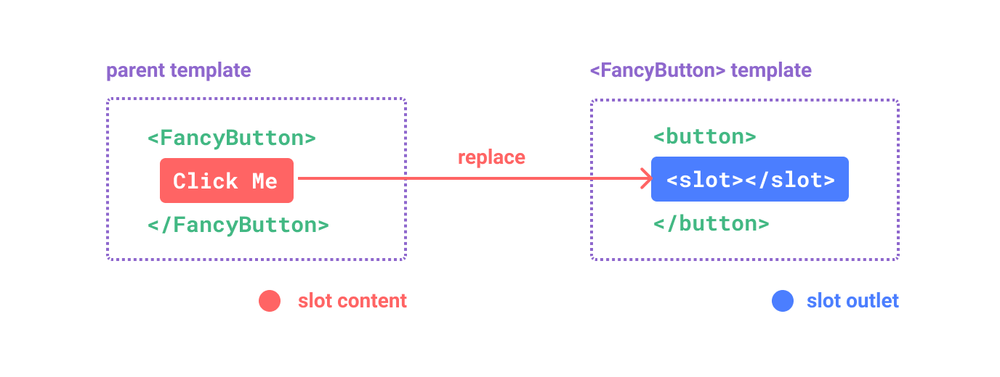
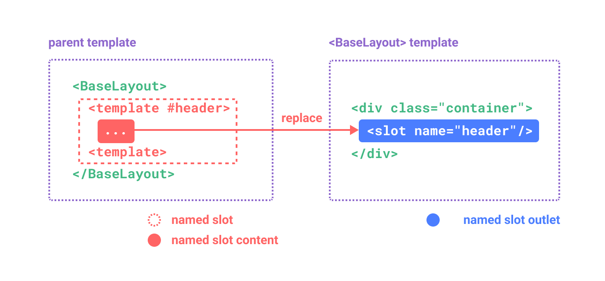
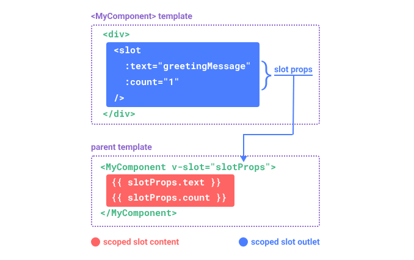

# 1.Vue3 基础夯实

> 原文链接：[飞书原文](https://u19tul1sz9g.feishu.cn/docx/S697dRupwoUue1xlJ2pc0Iscnhe)

[引用：20260207 随堂笔记与源码资料](https://www.feishu.cn/docx/HsQBdlBmsocCuExnY9Jcy99Sn2e)
[本地资源：1.vue-basic-notes](<../../20260207 随堂笔记与源码资料-压缩包/5.Vue 核心知识进阶与源码剖析/1.vue-basic-notes>)

## 课程目标

> **💡 提示**
>
> - 初中级：
>
>   1. **了解 Vue 项目基础架构**：了解 Vue 项目基础架构，学习 Vue 工程初始化方式，掌握如何使用 Vue CLI 或 Vite 等工具创建和配置 Vue 项目，熟悉项目的目录结构和常见的配置文件（如 `package.json`、`vue.config.js`）。
>   2. **掌握 Vue 基础知识**：掌握 Vue 常用基础知识，包含基础模板语法、数据绑定、事件处理、生命周期等。了解 Vue 中常用的内置指令（如 `v-if`、`v-for`、`v-bind`、`v-model`）以及如何在模板中使用它们进行动态渲染和双向数据绑定。
>   3. **掌握组件设计与通信**：掌握 Vue 组件设计的基本思路，学习如何拆分组件以提高可复用性和维护性。掌握父子组件间的通信方式，学习如何使用 `props` 向子组件传递数据，并通过自定义事件实现子组件向父组件传值。
> - 高级：
>
>   1. **深入理解组件设计**：深入理解 Vue 组件的设计模式与状态管理，学习如何合理设计组件的 `data`、`computed`、`methods` 等，优化组件的内部状态和交互逻辑，提升代码的可维护性与性能。
>   2. **深入理解 Vue 特性基本原理**：深入理解 Vue 模板引擎的工作原理，掌握 Vue 响应式系统的实现机制。学习如何使用 Vue 的插槽、动态组件和自定义指令等高级特性，提升组件的灵活性与扩展性。
>   3. **深入 Vue 内置组件用法与原理**：深入了解 Vue 内置组件（如 `transition`、`keep-alive`、`suspense` 等）的使用方法及其实现原理，掌握如何优化组件的渲染性能，并灵活运用 Vuex 和 Vue Router 等工具解决复杂的应用状态管理和路由控制问题。

## 补充资料

- Vue3 官方文档：https://cn.vuejs.org/
- Vue3 工程源码地址：https://github.com/vuejs/core
- 相关生态：https://github.com/sonicoder86/awesome-vue-3
- vue3 cli：https://github.com/vuejs/create-vue
- Vue3 宏定义：https://vue-macros.dev/


## 相关面试真题


### 说说 Vue 数据双向绑定？


**答案：**

Vue3 的数据双向绑定是通过响应式系统（reactivity system）来实现的。相比于 Vue2，Vue3 在响应式系统上做了很多改进，主要使用了 Proxy 对象来替代原来的 Object.defineProperty。以下是 Vue3 数据双向绑定的主要特点和实现方式：


#### 响应式系统


1. **Proxy 对象**：

   - Vue3 使用 JavaScript 的 Proxy 对象来实现响应式数据。Proxy 可以监听对象的所有操作，包括读取、写入、删除属性等，从而实现更加灵活和高效的响应式数据。


1. **reactive 函数**：

   - Vue3 提供了一个 `reactive` 函数来创建响应式对象。通过 `reactive` 函数包装的对象会变成响应式数据，Vue 会自动跟踪这些数据的变化。

   ```JavaScript
   import { reactive } from 'vue';
   
   const state = reactive({
     message: 'Hello Vue3'
   });
   ```


1. **ref 函数**：

   - 对于基本数据类型（如字符串、数字等），Vue3 提供了 `ref` 函数来创建响应式数据。使用 `ref` 包装的值可以在模板中进行双向绑定。

   ```JavaScript
   import { ref } from 'vue';
   
   const count = ref(0);
   ```


#### 双向绑定


Vue3 中的双向绑定主要通过 `v-model` 指令来实现，适用于表单元素（如输入框、复选框等）。以下是一个简单的示例：


```HTML
<template>
  <input v-model="message" />
  <p>{{ message }}</p>
</template>

<script>
import { ref } from 'vue';

export default {
  setup() {
    const message = ref('');

    return {
      message
    };
  }
};
</script>
```


#### v-model 的改进


在 Vue3 中，`v-model` 的使用更加灵活，可以支持自定义组件的双向绑定：


```HTML
<template>
  <CustomInput v-model:value="message" />
</template>

<script>
import { ref } from 'vue';
import CustomInput from './CustomInput.vue';

export default {
  components: {
    CustomInput
  },
  setup() {
    const message = ref('');

    return {
      message
    };
  }
};
</script>
```


在 `CustomInput` 组件中：


```HTML
<template>
  <input :value="modelValue" @input="$emit('update:modelValue', $event.target.value)" />
</template>

<script>
export default {
  props: {
    modelValue: String
  }
};
</script>
```

好的，我们来深入了解 Vue3 如何通过源码实现数据的双向绑定。


#### 源码实现

##### Proxy 实现响应式


Vue3 使用 `Proxy` 对象来实现响应式数据。`Proxy` 允许我们定义基本操作的自定义行为（如读、写、删除、枚举等）。


以下是 Vue3 响应式系统的核心代码片段：


```JavaScript
function reactive(target) {
  return createReactiveObject(target, mutableHandlers);
}

const mutableHandlers = {
  get(target, key, receiver) {
    // 依赖收集
    track(target, key);
    const res = Reflect.get(target, key, receiver);
    // 深度响应式处理
    if (isObject(res)) {
      return reactive(res);
    }
    return res;
  },
  set(target, key, value, receiver) {
    const oldValue = target[key];
    const result = Reflect.set(target, key, value, receiver);
    // 触发更新
    if (oldValue !== value) {
      trigger(target, key);
    }
    return result;
  },
  // 其他处理函数（deleteProperty, has, ownKeys 等）
};

function createReactiveObject(target, handlers) {
  if (!isObject(target)) {
    return target;
  }
  const proxy = new Proxy(target, handlers);
  return proxy;
}
```


##### 依赖收集与触发更新


在响应式系统中，依赖收集和触发更新是两个核心概念。Vue3 使用 `track` 和 `trigger` 函数来实现这两个功能。


```JavaScript
const targetMap = new WeakMap();

function track(target, key) {
  const effect = activeEffect;
  if (effect) {
    let depsMap = targetMap.get(target);
    if (!depsMap) {
      targetMap.set(target, (depsMap = new Map()));
    }
    let dep = depsMap.get(key);
    if (!dep) {
      depsMap.set(key, (dep = new Set()));
    }
    if (!dep.has(effect)) {
      dep.add(effect);
      effect.deps.push(dep);
    }
  }
}

function trigger(target, key) {
  const depsMap = targetMap.get(target);
  if (!depsMap) return;
  const effects = new Set();
  const add = effectsToAdd => {
    if (effectsToAdd) {
      effectsToAdd.forEach(effect => effects.add(effect));
    }
  };
  add(depsMap.get(key));
  effects.forEach(effect => effect());
}
```


##### ref 实现


对于基本数据类型，Vue3 提供了 `ref` 函数来创建响应式数据。`ref` 使用一个对象来包装值，并通过 `getter` 和 `setter` 来实现响应式。


```JavaScript
function ref(value) {
  return createRef(value);
}

function createRef(rawValue) {
  if (isRef(rawValue)) {
    return rawValue;
  }
  const r = {
    __v_isRef: true,
    get value() {
      track(r, 'value');
      return rawValue;
    },
    set value(newVal) {
      if (rawValue !== newVal) {
        rawValue = newVal;
        trigger(r, 'value');
      }
    }
  };
  return r;
}

function isRef(r) {
  return r ? r.__v_isRef === true : false;
}
```


##### v-model 实现


Vue3 中的 `v-model` 实现依赖于响应式系统。对于自定义组件，可以通过 `update:modelValue` 事件和 `props` 来实现。


示例组件 `CustomInput`：


```JavaScript
<template>
  <input :value="modelValue" @input="$emit('update:modelValue', $event.target.value)" />
</template>

<script>
export default {
  props: {
    modelValue: String
  }
};
</script>
```


在使用该组件时：


```JavaScript
<template>
  <CustomInput v-model:value="message" />
</template>

<script>
import { ref } from 'vue';
import CustomInput from './CustomInput.vue';

export default {
  components: {
    CustomInput
  },
  setup() {
    const message = ref('');
    return { message };
  }
};
</script>
```


### 说说你对slot的理解？slot使用场景有哪些？


**答案：**

`slot` 是 Vue 中用于在组件内分发内容的一种机制。它允许开发者在组件外部传递任意内容，并在组件内部进行渲染。`slot` 的主要功能是提高组件的复用性和灵活性。以下是对 `slot` 的详细理解以及常见的使用场景。


#### 基本概念


在 Vue 中，`slot` 用于定义组件中的插槽位置，外部的内容会被插入到组件内部的这个位置。插槽的内容是动态的，可以根据需要进行传递和渲染。

最基本的插槽用法是未命名插槽。在组件模板中定义 `slot`，在组件使用时传递内容：


**子组件（MyComponent.vue）：**

```HTML
<template>
  <div>
    <slot></slot>
  </div>
</template>
```


**父组件：**

```HTML
<template>
  <MyComponent>
    <p>This is some content passed to the slot.</p>
  </MyComponent>
</template>

<script>
import MyComponent from './MyComponent.vue';

export default {
  components: {
    MyComponent
  }
};
</script>
```


#### 具名插槽


有时需要在一个组件中使用多个插槽，这时可以使用命名插槽：


**子组件（MyComponent.vue）：**

```Plain Text
<template>
  <div>
    <header>
      <slot name="header"></slot>
    </header>
    <main>
      <slot></slot> <!-- 默认插槽 -->
    </main>
    <footer>
      <slot name="footer"></slot>
    </footer>
  </div>
</template>
```


**父组件：**

```Plain Text
<template>
  <MyComponent>
    <template v-slot:header>
      <h1>Header Content</h1>
    </template>
    <template v-slot:footer>
      <p>Footer Content</p>
    </template>
    <p>Main Content</p>
  </MyComponent>
</template>

<script>
import MyComponent from './MyComponent.vue';

export default {
  components: {
    MyComponent
  }
};
</script>
```


#### 作用域插槽


作用域插槽（Scoped Slots）允许子组件将数据传递给插槽内容的父组件。这在需要在插槽内容中使用子组件数据时非常有用。


**子组件（MyComponent.vue）：**

```Plain Text
<template>
  <div>
    <slot :user="user"></slot>
  </div>
</template>

<script>
export default {
  data() {
    return {
      user: {
        name: 'John Doe',
        age: 30
      }
    };
  }
};
</script>
```


**父组件：**

```Plain Text
<template>
  <MyComponent>
    <template v-slot:default="slotProps">
      <p>User Name: {{ slotProps.user.name }}</p>
      <p>User Age: {{ slotProps.user.age }}</p>
    </template>
  </MyComponent>
</template>

<script>
import MyComponent from './MyComponent.vue';

export default {
  components: {
    MyComponent
  }
};
</script>
```


#### 使用场景


- **复用组件结构**：插槽允许开发者在不同的上下文中复用相同的组件结构，而改变内容。比如模态框、卡片组件等。
- **动态内容插入**：在一些布局组件中，可以通过插槽动态插入不同的内容，而不需要修改组件本身。
- **自定义渲染逻辑**：在复杂组件中，通过作用域插槽可以将一些数据传递给父组件，从而让父组件来决定如何渲染这些数据。
- **嵌套组件**：在多层嵌套组件中，插槽可以让外层组件将内容传递给内层组件，从而实现复杂的嵌套布局。


## Vue3 基础


### 项目创建


Vue CLI 提供了一种快速创建 Vue3 项目的方法。


#### Vue3 脚手架创建的方式（推荐）


#### **新的基于 vite 的创建方式（推荐）**


1. 创建新项目：

`pnpm create vite vue-demo --template vue-ts`


1. 启动项目：

`pnpm dev`


1. 构建项目：

`pnpm build`


1. 预览构建后的产物：

`pnpm preview`


#### 老脚手架创建方式（看一眼就行，不推荐了）


1. 安装 Vue CLI：


```Bash
npm install -g @vue/cli
```


1. 创建新项目：


```Bash
vue create my-vue-app
```


1. 选择 Vue 3.x 版本并完成项目创建：


```Bash
cd my-vue-app
npm run serve
```


1. 打开浏览器访问 `http://localhost:8080`，可以看到默认的 Vue3 项目主页。


### 模板语法基础使用


#### 数据绑定


数据绑定允许你在模板中使用组件的数据：


##### Option API 写法


```HTML
<template>
  <div>
    <p>{{ message }}</p>
  </div>
</template>

<script>
export default {
  data() {
    return {
      message: 'Hello Vue3!'
    };
  }
};
</script>
```


##### Composition API 写法


```HTML
<template>
  <div>
    <p>{{ message }}</p>
  </div>
</template>

<script setup>
import { ref } from 'vue';

const message = ref('Hello Vue3!');
</script>
```


#### 属性绑定


通过 `v-bind` 或简写 `:` 绑定 HTML 属性：


##### Option API 写法


```HTML
<template>
  
</template>

<script>
export default {
  data() {
    return {
      imageSrc: 'https://vuejs.org/images/logo.png'
    };
  }
};
</script>
```


##### Composition API 写法


```HTML
<template>
  
</template>

<script setup>
import { ref } from 'vue';

const imageSrc = ref('https://vuejs.org/images/logo.png');
</script>
```


#### 计算属性


计算属性用于基于组件数据计算新的值，并在数据变化时自动更新：


##### Option API 写法


```HTML
<template>
  <div>
    <p>Reversed message: {{ reversedMessage }}</p>
  </div>
</template>

<script>
export default {
  data() {
    return {
      message: 'Hello Vue3!'
    };
  },
  computed: {
    reversedMessage() {
      return this.message.split('').reverse().join('');
    }
  }
};
</script>
```


##### Composition API 写法


```HTML
<template>
  <div>
    <p>Reversed message: {{ reversedMessage }}</p>
  </div>
</template>

<script setup>
import { ref, computed } from 'vue';

const message = ref('Hello Vue3!');
const reversedMessage = computed(() => message.value.split('').reverse().join(''));
</script>
```


#### 条件与列表渲染


##### 条件渲染


使用 `v-if` 和 `v-else` 进行条件渲染：


###### Option API 写法


```HTML
<template>
  <div>
    <p v-if="isVisible">This is visible</p>
    <p v-else>This is hidden</p>
  </div>
</template>

<script>
export default {
  data() {
    return {
      isVisible: true
    };
  }
};
</script>
```


###### Composition API 写法


```HTML
<template>
  <div>
    <p v-if="isVisible">This is visible</p>
    <p v-else>This is hidden</p>
  </div>
</template>

<script setup>
import { ref } from 'vue';

const isVisible = ref(true);
</script>
```


##### 列表渲染


使用 `v-for` 渲染列表项：


###### Option API 写法


```HTML
<template>
  <ul>
    <li v-for="item in items" :key="item.id">{{ item.name }}</li>
  </ul>
</template>

<script>
export default {
  data() {
    return {
      items: [
        { id: 1, name: 'Item 1' },
        { id: 2, name: 'Item 2' },
        { id: 3, name: 'Item 3' }
      ]
    };
  }
};
</script>
```


###### Composition API 写法


```HTML
<template>
  <ul>
    <li v-for="item in items" :key="item.id">{{ item.name }}</li>
  </ul>
</template>

<script setup>
import { ref } from 'vue';

const items = ref([
  { id: 1, name: 'Item 1' },
  { id: 2, name: 'Item 2' },
  { id: 3, name: 'Item 3' }
]);
</script>
```


#### 生命周期


Vue 实例在不同阶段会触发不同的生命周期钩子：


##### Option API 写法


```HTML
<template>
  <div>
    <p>{{ message }}</p>
  </div>
</template>

<script>
export default {
  data() {
    return {
      message: 'Hello Vue3!'
    };
  },
  created() {
    console.log('Component is created');
  },
  mounted() {
    console.log('Component is mounted');
  }
};
</script>
```


##### Composition API 写法


```HTML
<template>
  <div>
    <p>{{ message }}</p>
  </div>
</template>

<script setup>
import { ref, onMounted, onCreated } from 'vue';

const message = ref('Hello Vue3!');

onCreated(() => {
  console.log('Component is created');
});

onMounted(() => {
  console.log('Component is mounted');
});
</script>
```


#### 侦听器


侦听器用于监听数据的变化并执行相应的操作：


##### Option API 写法


```HTML
<template>
  <div>
    <p>{{ message }}</p>
    <input v-model="message" />
  </div>
</template>

<script>
export default {
  data() {
    return {
      message: 'Hello Vue3!'
    };
  },
  watch: {
    message(newVal, oldVal) {
      console.log(`Message changed from ${oldVal} to ${newVal}`);
    }
  }
};
</script>
```


##### Composition API 写法


```HTML
<template>
  <div>
    <p>{{ message }}</p>
    <input v-model="message" />
  </div>
</template>

<script setup>
import { ref, watch } from 'vue';

const message = ref('Hello Vue3!');

watch(message, (newVal, oldVal) => {
  console.log(`Message changed from ${oldVal} to ${newVal}`);
});
</script>
```


#### ref


`ref` 用于引用 DOM 元素或组件实例，适用于操作 DOM 或获取组件实例的方法和属性：


##### Option API 写法


```HTML
<template>
  <div>
    <p ref="paragraph">Hello Vue3!</p>
    <button @click="changeText">Change Text</button>
  </div>
</template>

<script>
export default {
  methods: {
    changeText() {
      this.$refs.paragraph.textContent = 'Text changed!';
    }
  }
};
</script>
```


##### Composition API 写法


```HTML
<template>
  <div>
    <p ref="paragraph">Hello Vue3!</p>
    <button @click="changeText">Change Text</button>
  </div>
</template>

<script setup>
import { ref, onMounted } from 'vue';

const paragraph = ref(null);

const changeText = () => {
  paragraph.value.textContent = 'Text changed!';
};

onMounted(() => {
  console.log(paragraph.value); // DOM element
});
</script>
```


## 属性声明与事件定义（宏定义）

一个组件需要显式声明它所接受的 props，这样 Vue 才能知道外部传入的哪些是 props，哪些是透传 attribute (关于透传 attribute，我们会在[专门的章节](https://cn.vuejs.org/guide/components/attrs.html)中讨论)。

在使用 `<script setup>` 的单文件组件中，props 可以使用 `defineProps()` 宏来声明：

```HTML
<script setup>
const props = defineProps(['foo'])

console.log(props.foo)
</script>
```

在没有使用 `<script setup>` 的组件中，props 可以使用 [`props`](https://cn.vuejs.org/api/options-state.html#props) 选项来声明：

```JavaScript
export default {
  props: ['foo'],
  setup(props) {
    // setup() 接收 props 作为第一个参数
    console.log(props.foo)
  }
}
```

注意传递给 `defineProps()` 的参数和提供给 `props` 选项的值是相同的，两种声明方式背后其实使用的都是 props 选项。

除了使用字符串数组来声明 props 外，还可以使用对象的形式：

```JavaScript
// 使用 <script setup>
defineProps({
  title: String,
  likes: Number
})
```

```JavaScript
// 非 <script setup>
export default {
  props: {
    title: String,
    likes: Number
  }
}
```

对于以对象形式声明的每个属性，key 是 prop 的名称，而值则是该 prop 预期类型的构造函数。比如，如果要求一个 prop 的值是 `number` 类型，则可使用 `Number` 构造函数作为其声明的值。

对象形式的 props 声明不仅可以一定程度上作为组件的文档，而且如果其他开发者在使用你的组件时传递了错误的类型，也会在浏览器控制台中抛出警告。我们将在本章节稍后进一步讨论有关 [prop 校验](https://cn.vuejs.org/guide/components/props.html#prop-validation)的更多细节。

如果你正在搭配 TypeScript 使用 `<script setup>`，也可以使用类型标注来声明 props：

```HTML
<script setup lang="ts">
defineProps<{
  title?: string
  likes?: number
}>()
</script>
```

更多关于基于类型的声明的细节请参考[组件 props 类型标注](https://cn.vuejs.org/guide/typescript/composition-api.html#typing-component-props)。


### 传递 prop 的细节

#### Prop 名字格式

如果一个 prop 的名字很长，应使用 camelCase 形式，因为它们是合法的 JavaScript 标识符，可以直接在模板的表达式中使用，也可以避免在作为属性 key 名时必须加上引号。

```JavaScript
defineProps({
  greetingMessage: String
})
```

```HTML
<span{{ greetingMessage }}</span>
```

虽然理论上你也可以在向子组件传递 props 时使用 camelCase 形式 (使用 [DOM 内模板](https://cn.vuejs.org/guide/essentials/component-basics.html#in-dom-template-parsing-caveats)时例外)，但实际上为了和 HTML attribute 对齐，我们通常会将其写为 kebab-case 形式：

```HTML
<MyComponent greeting-message="hello" />
```

对于组件名我们推荐使用 [PascalCase](https://cn.vuejs.org/guide/components/registration.html#component-name-casing)，因为这提高了模板的可读性，能帮助我们区分 Vue 组件和原生 HTML 元素。然而对于传递 props 来说，使用 camelCase 并没有太多优势，因此我们推荐更贴近 HTML 的书写风格。


#### 静态 vs. 动态 Props

至此，你已经见过了很多像这样的静态值形式的 props：

```HTML
<BlogPost title="My journey with Vue" />
```

相应地，还有使用 `v-bind` 或缩写 `:` 来进行动态绑定的 props：

```HTML
<!-- 根据一个变量的值动态传入 -->
<BlogPost :title="post.title" />

<!-- 根据一个更复杂表达式的值动态传入 -->
<BlogPost :title="post.title + ' by ' + post.author.name" />
```


#### 传递不同的值类型

在上述的两个例子中，我们只传入了字符串值，但实际上任何类型的值都可以作为 props 的值被传递。

##### Number

```HTML
<!-- 虽然 `42` 是个常量，我们还是需要使用 v-bind -->
<!-- 因为这是一个 JavaScript 表达式而不是一个字符串 -->
<BlogPost :likes="42" />

<!-- 根据一个变量的值动态传入 -->
<BlogPost :likes="post.likes" />
```

##### Boolean

```HTML
<!-- 仅写上 prop 但不传值，会隐式转换为 `true` -->
<BlogPost is-published />

<!-- 虽然 `false` 是静态的值，我们还是需要使用 v-bind -->
<!-- 因为这是一个 JavaScript 表达式而不是一个字符串 -->
<BlogPost :is-published="false" />

<!-- 根据一个变量的值动态传入 -->
<BlogPost :is-published="post.isPublished" />
```

##### Array

```HTML
<!-- 虽然这个数组是个常量，我们还是需要使用 v-bind -->
<!-- 因为这是一个 JavaScript 表达式而不是一个字符串 -->
<BlogPost :comment-ids="[234, 266, 273]" />

<!-- 根据一个变量的值动态传入 -->
<BlogPost :comment-ids="post.commentIds" />
```

##### Object

```HTML
<!-- 虽然这个对象字面量是个常量，我们还是需要使用 v-bind -->
<!-- 因为这是一个 JavaScript 表达式而不是一个字符串 -->
<BlogPost
  :author="{
    name: 'Veronica',
    company: 'Veridian Dynamics'
  }"
 />

<!-- 根据一个变量的值动态传入 -->
<BlogPost :author="post.author" />
```


#### 使用一个对象绑定多个 prop

如果你想要将一个对象的所有属性都当作 props 传入，你可以使用[没有参数的 ](https://cn.vuejs.org/guide/essentials/template-syntax.html#dynamically-binding-multiple-attributes)[`v-bind`](https://cn.vuejs.org/guide/essentials/template-syntax.html#dynamically-binding-multiple-attributes)，即只使用 `v-bind` 而非 `:prop-name`。例如，这里有一个 `post` 对象：

```JavaScript
const post = {
  id: 1,
  title: 'My Journey with Vue'
}
```

以及下面的模板：

```HTML
<BlogPost v-bind="post" />
```

而这实际上等价于：

```HTML
<BlogPost :id="post.id" :title="post.title" />
```


### 单向数据流

所有的 props 都遵循着单向绑定原则，props 因父组件的更新而变化，自然地将新的状态向下流往子组件，而不会逆向传递。这避免了子组件意外修改父组件的状态的情况，不然应用的数据流将很容易变得混乱而难以理解。

另外，每次父组件更新后，所有的子组件中的 props 都会被更新到最新值，这意味着你不应该在子组件中去更改一个 prop。若你这么做了，Vue 会在控制台上向你抛出警告：

```JavaScript
const props = defineProps(['foo'])

// ❌ 警告！prop 是只读的！
props.foo = 'bar'
```

导致你想要更改一个 prop 的需求通常来源于以下两种场景：

1. prop 被用于传入初始值；而子组件想在之后将其作为一个局部数据属性。在这种情况下，最好是新定义一个局部数据属性，从 props 上获取初始值即可：

   ```JavaScript
   const props = defineProps(['initialCounter'])
   
   // 计数器只是将 props.initialCounter 作为初始值
   // 像下面这样做就使 prop 和后续更新无关了
   const counter = ref(props.initialCounter)
   ```
2. 需要对传入的 prop 值做进一步的转换。在这种情况中，最好是基于该 prop 值定义一个计算属性：

   ```JavaScript
   const props = defineProps(['size'])
   
   // 该 prop 变更时计算属性也会自动更新
   const normalizedSize = computed(() => props.size.trim().toLowerCase())
   ```


#### 更改对象 / 数组类型的 props

当对象或数组作为 props 被传入时，虽然子组件无法更改 props 绑定，但仍然可以更改对象或数组内部的值。这是因为 JavaScript 的对象和数组是按引用传递，对 Vue 来说，阻止这种更改需要付出的代价异常昂贵。

这种更改的主要缺陷是它允许了子组件以某种不明显的方式影响父组件的状态，可能会使数据流在将来变得更难以理解。在最佳实践中，你应该尽可能避免这样的更改，除非父子组件在设计上本来就需要紧密耦合。在大多数场景下，子组件应该[抛出一个事件](https://cn.vuejs.org/guide/components/events.html)来通知父组件做出改变。


### Prop 校验

Vue 组件可以更细致地声明对传入的 props 的校验要求。比如我们上面已经看到过的类型声明，如果传入的值不满足类型要求，Vue 会在浏览器控制台中抛出警告来提醒使用者。这在开发给其他开发者使用的组件时非常有用。

要声明对 props 的校验，你可以向 `defineProps()` 宏提供一个带有 props 校验选项的对象，例如：

```JavaScript
defineProps({
  // 基础类型检查
  // （给出 `null` 和 `undefined` 值则会跳过任何类型检查）
  propA: Number,
  // 多种可能的类型
  propB: [String, Number],
  // 必传，且为 String 类型
  propC: {
    type: String,
    required: true
  },
  // 必传但可为 null 的字符串
  propD: {
    type: [String, null],
    required: true
  },
  // Number 类型的默认值
  propE: {
    type: Number,
    default: 100
  },
  // 对象类型的默认值
  propF: {
    type: Object,
    // 对象或数组的默认值
    // 必须从一个工厂函数返回。
    // 该函数接收组件所接收到的原始 prop 作为参数。
    default(rawProps) {
      return { message: 'hello' }
    }
  },
  // 自定义类型校验函数
  // 在 3.4+ 中完整的 props 作为第二个参数传入
  propG: {
    validator(value, props) {
      // The value must match one of these strings
      return ['success', 'warning', 'danger'].includes(value)
    }
  },
  // 函数类型的默认值
  propH: {
    type: Function,
    // 不像对象或数组的默认，这不是一个
    // 工厂函数。这会是一个用来作为默认值的函数
    default() {
      return 'Default function'
    }
  }
})
```

**🚅 提示**

`defineProps()` 宏中的参数不可以访问 `<script setup>` 中定义的其他变量，因为在编译时整个表达式都会被移到外部的函数中。

一些补充细节：

- 所有 prop 默认都是可选的，除非声明了 `required: true`。
- 除 `Boolean` 外的未传递的可选 prop 将会有一个默认值 `undefined`。
- `Boolean` 类型的未传递 prop 将被转换为 `false`。这可以通过为它设置 `default` 来更改——例如：设置为 `default: undefined` 将与非布尔类型的 prop 的行为保持一致。
- 如果声明了 `default` 值，那么在 prop 的值被解析为 `undefined` 时，无论 prop 是未被传递还是显式指明的 `undefined`，都会改为 `default` 值。

当 prop 的校验失败后，Vue 会抛出一个控制台警告 (在开发模式下)。

如果使用了[基于类型的 prop 声明](https://cn.vuejs.org/api/sfc-script-setup.html#type-only-props-emit-declarations) ()，Vue 会尽最大努力在运行时按照 prop 的类型标注进行编译。举例来说，`defineProps<{ msg: string }>` 会被编译为 `{ msg: { type: String, required: true }}`。


#### 运行时类型检查

校验选项中的 `type` 可以是下列这些原生构造函数：

- `String`
- `Number`
- `Boolean`
- `Array`
- `Object`
- `Date`
- `Function`
- `Symbol`
- `Error`

另外，`type` 也可以是自定义的类或构造函数，Vue 将会通过 `instanceof` 来检查类型是否匹配。例如下面这个类：

```JavaScript
class Person {
  constructor(firstName, lastName) {
    this.firstName = firstName
    this.lastName = lastName
  }
}
```

你可以将其作为一个 prop 的类型：

```JavaScript
defineProps({
  author: Person
})
```

Vue 会通过 `instanceof Person` 来校验 `author` prop 的值是否是 `Person` 类的一个实例。


#### 可为 null 的类型

如果该类型是必传但可为 null 的，你可以用一个包含 `null` 的数组语法：

```JavaScript
defineProps({
  id: {
    type: [String, null],
    required: true
  }
})
```

注意如果 `type` 仅为 `null` 而非使用数组语法，它将允许任何类型。


### Boolean 类型转换

为了更贴近原生 boolean attributes 的行为，声明为 `Boolean` 类型的 props 有特别的类型转换规则。以带有如下声明的 `<MyComponent>` 组件为例：

```JavaScript
defineProps({
  disabled: Boolean
})
```

该组件可以被这样使用：

```JavaScript
<!-- 等同于传入 :disabled="true" -->
<MyComponent disabled />

<!-- 等同于传入 :disabled="false" -->
<MyComponent />
```

当一个 prop 被声明为允许多种类型时，`Boolean` 的转换规则也将被应用。然而，当同时允许 `String` 和 `Boolean` 时，有一种边缘情况——只有当 `Boolean` 出现在 `String` 之前时，`Boolean` 转换规则才适用：

```JavaScript
// disabled 将被转换为 true
defineProps({
  disabled: [Boolean, Number]
})

// disabled 将被转换为 true
defineProps({
  disabled: [Boolean, String]
})

// disabled 将被转换为 true
defineProps({
  disabled: [Number, Boolean]
})

// disabled 将被解析为空字符串 (disabled="")
defineProps({
  disabled: [String, Boolean]
})
```


### 子到父的事件定义


```HTML
<!-- js 逻辑 -->
<script setup lang="ts">
// Vue3 生命周期
// defineProps 不用导入
defineProps({
  count: Number,
});

// defineEmits 不用导入
const emit = defineEmits(["update", "remove"]);
</script>

<!-- 视图逻辑 -->
<template>
  <div @click="() => emit('update', Math.random())">{{ count }}</div>
</template>

<!-- 样式逻辑 -->
<style scoped></style>

```


其实还有很多宏定义的内容，我们可以 https://vue-macros.dev/


## 插槽


### 插槽内容与出口

在之前的章节中，我们已经了解到组件能够接收任意类型的 JavaScript 值作为 props，但组件要如何接收模板内容呢？在某些场景中，我们可能想要为子组件传递一些模板片段，让子组件在它们的组件中渲染这些片段。

举例来说，这里有一个 `<FancyButton>` 组件，可以像这样使用：


```HTML
<FancyButton>
  Click me! <!-- 插槽内容 -->
</FancyButton>
```

而 `<FancyButton>` 的模板是这样的：

```HTML
<button class="fancy-btn">
  <slot></slot> <!-- 插槽出口 -->
</button>
```

`<slot>` 元素是一个插槽出口 (slot outlet)，标示了父元素提供的插槽内容 (slot content) 将在哪里被渲染。



最终渲染出的 DOM 是这样：

```HTML
<button class="fancy-btn"Click me!</button>
```

通过使用插槽，`<FancyButton>` 仅负责渲染外层的 `<button>` (以及相应的样式)，而其内部的内容由父组件提供。

理解插槽的另一种方式是和下面的 JavaScript 函数作类比，其概念是类似的：

```JavaScript
// 父元素传入插槽内容
FancyButton('Click me!')

// FancyButton 在自己的模板中渲染插槽内容
function FancyButton(slotContent) {
  return `<button class="fancy-btn">
      ${slotContent}
    </button>`
}
```

插槽内容可以是任意合法的模板内容，不局限于文本。例如我们可以传入多个元素，甚至是组件：

```HTML
<FancyButton>
  <span style="color:red">Click me!</span>
  <AwesomeIcon name="plus" />
</FancyButton>
```

通过使用插槽，`<FancyButton>` 组件更加灵活和具有可复用性。现在组件可以用在不同的地方渲染各异的内容，但同时还保证都具有相同的样式。

Vue 组件的插槽机制是受[原生 Web Component ](https://developer.mozilla.org/en-US/docs/Web/HTML/Element/slot)[`<slot>`](https://developer.mozilla.org/en-US/docs/Web/HTML/Element/slot)[ 元素](https://developer.mozilla.org/en-US/docs/Web/HTML/Element/slot)的启发而诞生，同时还做了一些功能拓展，这些拓展的功能我们后面会学习到。


### 渲染作用域

插槽内容可以访问到父组件的数据作用域，因为插槽内容本身是在父组件模板中定义的。举例来说：

```HTML
<span>{{ message }}</span>
<FancyButton>{{ message }}</FancyButton>
```

这里的两个 `{{ message }}` 插值表达式渲染的内容都是一样的。

> 插槽内容无法访问子组件的数据。Vue 模板中的表达式只能访问其定义时所处的作用域，这和 JavaScript 的词法作用域规则是一致的。换言之：
> 
> 父组件模板中的表达式只能访问父组件的作用域；子组件模板中的表达式只能访问子组件的作用域。


### 默认内容

在外部没有提供任何内容的情况下，可以为插槽指定默认内容。比如有这样一个 `<SubmitButton>` 组件：

```HTML
<button type="submit">
  <slot></slot>
</button>
```

如果我们想在父组件没有提供任何插槽内容时在 `<button>` 内渲染“Submit”，只需要将“Submit”写在 `<slot>` 标签之间来作为默认内容：

```HTML
<button type="submit">
  <slot>
    Submit <!-- 默认内容 -->
  </slot>
</button>
```

现在，当我们在父组件中使用 `<SubmitButton>` 且没有提供任何插槽内容时：

```HTML
<SubmitButton />
```

“Submit”将会被作为默认内容渲染：

```HTML
<button type="submit"Submit</button>
```

但如果我们提供了插槽内容：

```HTML
<SubmitButton>Save</SubmitButton>
```

那么被显式提供的内容会取代默认内容：

```HTML
<button type="submit"Save</button>
```


### 具名插槽

有时在一个组件中包含多个插槽出口是很有用的。举例来说，在一个 `<BaseLayout>` 组件中，有如下模板：

```HTML
<div class="container">
  <header>
    <!-- 标题内容放这里 -->
  </header>
  <main>
    <!-- 主要内容放这里 -->
  </main>
  <footer>
    <!-- 底部内容放这里 -->
  </footer>
</div>
```

对于这种场景，`<slot>` 元素可以有一个特殊的 attribute `name`，用来给各个插槽分配唯一的 ID，以确定每一处要渲染的内容：

```HTML
<div class="container">
  <header>
    <slot name="header"></slot>
  </header>
  <main>
    <slot></slot>
  </main>
  <footer>
    <slot name="footer"></slot>
  </footer>
</div>
```

这类带 `name` 的插槽被称为具名插槽 (named slots)。没有提供 `name` 的 `<slot>` 出口会隐式地命名为“default”。

在父组件中使用 `<BaseLayout>` 时，我们需要一种方式将多个插槽内容传入到各自目标插槽的出口。此时就需要用到具名插槽了：

要为具名插槽传入内容，我们需要使用一个含 `v-slot` 指令的 `<template>` 元素，并将目标插槽的名字传给该指令：

```HTML
<BaseLayout>
  <template v-slot:header>
    <!-- header 插槽的内容放这里 -->
  </template>
</BaseLayout>
```

`v-slot` 有对应的简写 `#`，因此 `<template v-slot:header>` 可以简写为 `<template #header>`。其意思就是“将这部分模板片段传入子组件的 header 插槽中”。



下面我们给出完整的、向 `<BaseLayout>` 传递插槽内容的代码，指令均使用的是缩写形式：

```HTML
<BaseLayout>
  <template #header>
    <h1>Here might be a page title</h1>
  </template>

  <template #default>
    <p>A paragraph for the main content.</p>
    <p>And another one.</p>
  </template>

  <template #footer>
    <p>Here's some contact info</p>
  </template>
</BaseLayout>
```

当一个组件同时接收默认插槽和具名插槽时，所有位于顶级的非 `<template>` 节点都被隐式地视为默认插槽的内容。所以上面也可以写成：

```HTML
<BaseLayout>
  <template #header>
    <h1>Here might be a page title</h1>
  </template>

  <!-- 隐式的默认插槽 -->
  <p>A paragraph for the main content.</p>
  <p>And another one.</p>

  <template #footer>
    <p>Here's some contact info</p>
  </template>
</BaseLayout>
```

现在 `<template>` 元素中的所有内容都将被传递到相应的插槽。最终渲染出的 HTML 如下：

```HTML
<div class="container">
  <header>
    <h1>Here might be a page title</h1>
  </header>
  <main>
    <p>A paragraph for the main content.</p>
    <p>And another one.</p>
  </main>
  <footer>
    <p>Here's some contact info</p>
  </footer>
</div>
```


使用 JavaScript 函数来类比可能更有助于你来理解具名插槽：

```HTML
// 传入不同的内容给不同名字的插槽
BaseLayout({
  header: `...`,
  default: `...`,
  footer: `...`
})

// <BaseLayout> 渲染插槽内容到对应位置
function BaseLayout(slots) {
  return `<div class="container">
      <header>${slots.header}</header>
      <main>${slots.default}</main>
      <footer>${slots.footer}</footer>
    </div>`
}
```


### 条件插槽

有时你需要根据插槽是否存在来渲染某些内容。

你可以结合使用 [\$slots](https://cn.vuejs.org/api/component-instance.html#slots) 属性与 [v-if](https://cn.vuejs.org/guide/essentials/conditional.html#v-if) 来实现。

在下面的示例中，我们定义了一个卡片组件，它拥有三个条件插槽：`header`、`footer` 和 `default`。 当 header、footer 或 default 存在时，我们希望包装它们以提供额外的样式：

```HTML
<template>
  <div class="card">
    <div v-if="$slots.header" class="card-header">
      <slot name="header" />
    </div>
    
    <div v-if="$slots.default" class="card-content">
      <slot />
    </div>
    
    <div v-if="$slots.footer" class="card-footer">
      <slot name="footer" />
    </div>
  </div>
</template>
```


### 动态插槽名

[动态指令参数](https://cn.vuejs.org/guide/essentials/template-syntax.html#dynamic-arguments)在 `v-slot` 上也是有效的，即可以定义下面这样的动态插槽名：

```HTML
<base-layout>
  <template v-slot:[dynamicSlotName]>
    ...
  </template>

  <!-- 缩写为 -->
  <template #[dynamicSlotName]>
    ...
  </template>
</base-layout>
```

注意这里的表达式和动态指令参数受相同的[语法限制](https://cn.vuejs.org/guide/essentials/template-syntax.html#dynamic-argument-syntax-constraints)。


### 作用域插槽

在上面的[渲染作用域](https://cn.vuejs.org/guide/components/slots.html#render-scope)中我们讨论到，插槽的内容无法访问到子组件的状态。

然而在某些场景下插槽的内容可能想要同时使用父组件域内和子组件域内的数据。要做到这一点，我们需要一种方法来让子组件在渲染时将一部分数据提供给插槽。

我们也确实有办法这么做！可以像对组件传递 props 那样，向一个插槽的出口上传递 attributes：

```HTML
<!-- <MyComponent> 的模板 -->
<div>
  <slot :text="greetingMessage" :count="1"></slot>
</div>
```

当需要接收插槽 props 时，默认插槽和具名插槽的使用方式有一些小区别。下面我们将先展示默认插槽如何接受 props，通过子组件标签上的 `v-slot` 指令，直接接收到了一个插槽 props 对象：

```HTML
<MyComponent v-slot="slotProps">
  {{ slotProps.text }} {{ slotProps.count }}
</MyComponent>
```




子组件传入插槽的 props 作为了 `v-slot` 指令的值，可以在插槽内的表达式中访问。

你可以将作用域插槽类比为一个传入子组件的函数。子组件会将相应的 props 作为参数传给它：

```JavaScript
MyComponent({
  // 类比默认插槽，将其想成一个函数
  default: (slotProps) => {
    return `${slotProps.text} ${slotProps.count}`
  }
})

function MyComponent(slots) {
  const greetingMessage = 'hello'
  return `<div>${
    // 在插槽函数调用时传入 props
    slots.default({ text: greetingMessage, count: 1 })
  }</div>`
}
```

实际上，这已经和作用域插槽的最终代码编译结果、以及手动编写[渲染函数](https://cn.vuejs.org/guide/extras/render-function.html)时使用作用域插槽的方式非常类似了。

`v-slot="slotProps"` 可以类比这里的函数签名，和函数的参数类似，我们也可以在 `v-slot` 中使用解构：

```HTML
<MyComponent v-slot="{ text, count }">
  {{ text }} {{ count }}
</MyComponent>
```


#### 具名作用域插槽

具名作用域插槽的工作方式也是类似的，插槽 props 可以作为 `v-slot` 指令的值被访问到：`v-slot:name="slotProps"`。当使用缩写时是这样：

```HTML
<MyComponent>
  <template #header="headerProps">
    {{ headerProps }}
  </template>

  <template #default="defaultProps">
    {{ defaultProps }}
  </template>

  <template #footer="footerProps">
    {{ footerProps }}
  </template>
</MyComponent>
```

向具名插槽中传入 props：

```HTML
<slot name="header" message="hello"</slot>
```

注意插槽上的 `name` 是一个 Vue 特别保留的 attribute，不会作为 props 传递给插槽。因此最终 `headerProps` 的结果是 `{ message: 'hello' }`。

如果你同时使用了具名插槽与默认插槽，则需要为默认插槽使用显式的 `<template>` 标签。尝试直接为组件添加 `v-slot` 指令将导致编译错误。这是为了避免因默认插槽的 props 的作用域而困惑。举例：

```HTML
<!-- <MyComponent> template -->
<div>
  <slot :message="hello"></slot>
  <slot name="footer" />
</div>
```

```HTML
<!-- 该模板无法编译 -->
<MyComponent v-slot="{ message }">
  <p>{{ message }}</p>
  <template #footer>
    <!-- message 属于默认插槽，此处不可用 -->
    <p>{{ message }}</p>
  </template>
</MyComponent>
```

为默认插槽使用显式的 `<template>` 标签有助于更清晰地指出 `message` 属性在其他插槽中不可用：

```HTML
<MyComponent>
  <!-- 使用显式的默认插槽 -->
  <template #default="{ message }">
    <p>{{ message }}</p>
  </template>

  <template #footer>
    <p>Here's some contact info</p>
  </template>
</MyComponent>
```


#### 高级列表组件示例

你可能想问什么样的场景才适合用到作用域插槽，这里我们来看一个 `<FancyList>` 组件的例子。它会渲染一个列表，并同时会封装一些加载远端数据的逻辑、使用数据进行列表渲染、或者是像分页或无限滚动这样更进阶的功能。然而我们希望它能够保留足够的灵活性，将对单个列表元素内容和样式的控制权留给使用它的父组件。我们期望的用法可能是这样的：

```HTML
<FancyList :api-url="url" :per-page="10">
  <template #item="{ body, username, likes }">
    <div class="item">
      <p>{{ body }}</p>
      <p>by {{ username }} | {{ likes }} likes</p>
    </div>
  </template>
</FancyList>
```

在 `<FancyList>` 之中，我们可以多次渲染 `<slot>` 并每次都提供不同的数据 (注意我们这里使用了 `v-bind` 来传递插槽的 props)：

```HTML
<ul>
  <li v-for="item in items">
    <slot name="item" v-bind="item"></slot>
  </li>
</ul>
```


#### 无渲染组件

上面的 `<FancyList>` 案例同时封装了可重用的逻辑 (数据获取、分页等) 和视图输出，但也将部分视图输出通过作用域插槽交给了消费者组件来管理。

如果我们将这个概念拓展一下，可以想象的是，一些组件可能只包括了逻辑而不需要自己渲染内容，视图输出通过作用域插槽全权交给了消费者组件。我们将这种类型的组件称为无渲染组件。

这里有一个无渲染组件的例子，一个封装了追踪当前鼠标位置逻辑的组件：

```HTML
<MouseTracker v-slot="{ x, y }">
  Mouse is at: {{ x }}, {{ y }}
</MouseTracker>
```


## 内置组件

Vue 提供了 5 个内置组件供开发者开箱即用，分别为：

- Transition
- TransitionGroup
- KeepAlive
- Teleport
- Suspense


本小节我们重点介绍前两个内置组件，下一节我们介绍后三个内置组件的使用与原理。

他俩都定义在 runtime-dom 包中，属于运行时组件定义。


### Transition


`Transition` 组件用于为单个元素/组件的进入和离开添加过渡效果。常见的使用场景包括模态框的显示和隐藏、列表项的增删等。


#### 基本用法


以下是一个简单的 `Transition` 用法示例：


```HTML
<template>
  <div>
    <button @click="show = !show">Toggle</button>
    <transition name="fade">
      <p v-if="show">Hello Vue3 Transition!</p>
    </transition>
  </div>
</template>

<script setup>
import { ref } from 'vue';

const show = ref(true);
</script>

<style>
.fade-enter-active, .fade-leave-active {
  transition: opacity 0.5s;
}
.fade-enter-from, .fade-leave-to {
  opacity: 0;
}
</style>
```


#### 使用场景


- 模态框的显示/隐藏
- 通知的出现/消失
- 路由切换时的页面过渡


#### 源码分析


`Transition` 组件的核心在于使用 Vue 的指令系统来监听元素的插入和移除，并在这些事件发生时添加和移除相应的 CSS 类名。


##### Vue 3 `Transition` 组件实现分析


Vue 3 的 `Transition` 组件是一个基于 `@vue/runtime-core` 的 `BaseTransition` 组件构建的高阶组件，添加了处理基于 DOM 的 CSS 过渡和动画的逻辑。以下是其实现的详细分析：


##### 导入和类型定义


1. **导入**：

   - 从 `@vue/runtime-core` 导入核心功能和类型定义。
   - 从 `@vue/shared` 导入工具函数。


1. **常量**：

   - `TRANSITION` 和 `ANIMATION` 是表示动画类型的常量。


1. **类型**：

   - `AnimationTypes`：表示 `transition` 或 `animation` 的联合类型。
   - `TransitionProps`：扩展 `BaseTransitionProps`，增加了用于 CSS 过渡的额外属性，如自定义类名和持续时间。


##### Transition 组件定义


1. **ElementWithTransition**：

   - 扩展 `HTMLElement`，包括 `_vtc` 键用于存储临时的过渡类，防止在过渡期间被覆盖。


1. **Transition 组件**：

   - 函数组件，使用解析后的 props 和 slots 渲染 `BaseTransition`。
   - 包含对过时过渡类的兼容性检查。


##### Prop 验证器


1. **DOMTransitionPropsValidators**：

   - 过渡 props 的验证器，确保类型正确并提供默认值。


1. **TransitionPropsValidators**：

   - 将 `BaseTransitionPropsValidators` 和 `DOMTransitionPropsValidators` 结合起来，验证 `Transition` 组件的 props。


##### 钩子函数


1. **callHook**：

   - 工具函数，用于调用钩子，处理单个函数和函数数组。


1. **hasExplicitCallback**：

   - 检查钩子是否需要回调，表示明确控制过渡结束。


##### 解析过渡属性


1. **resolveTransitionProps**：

   - 将 `BaseTransitionProps` 与其他属性合并。
   - 设置过渡的默认类名和持续时间。
   - 如果启用了兼容模式，处理过时的类名。
   - 定义过渡钩子（`onBeforeEnter`、`onEnter`、`onLeave` 等）来管理 CSS 类并确保过渡顺利进行。


##### 工具函数


1. **normalizeDuration**：

   - 将持续时间属性标准化为 `[enter, leave]` 元组。


1. **NumberOf**：

   - 将值转换为数字，带有开发时断言。


1. **addTransitionClass** 和 \*\*removeTransitionClass\*\*：

   - 向元素添加或移除过渡类，管理 `_vtc` 以跟踪它们。


1. **nextFrame**：

   - 在两个动画帧后调用回调，确保更改生效。


1. **whenTransitionEnds**：

   - 处理过渡结束事件，确保一旦所有过渡属性结束就调用回调。


1. **getTransitionInfo**：

   - 从元素的计算样式中检索过渡信息，如类型、超时和属性数量。


1. **getTimeout**：

   - 从过渡或动画的延迟和持续时间中计算最大超时。


1. **toMs**：

   - 将 CSS 时间值（例如 `0.5s`）转换为毫秒，处理特定区域格式。


1. **forceReflow**：

   - 强制重新布局以确保样式应用，通常用于开始过渡。


### TransitionGroup


`TransitionGroup` 组件用于为列表中的元素添加过渡效果。当列表中的元素发生增删或位置变化时，`TransitionGroup` 可以为每个元素应用过渡效果。


#### 基本用法


以下是一个简单的 `TransitionGroup` 用法示例：


```HTML
<template>
  <div>
    <button @click="addItem">Add Item</button>
    <transition-group name="list" tag="ul">
      <li v-for="item in items" :key="item">{{ item }}</li>
    </transition-group>
  </div>
</template>

<script setup>
import { ref } from 'vue';

const items = ref(['Item 1', 'Item 2', 'Item 3']);

const addItem = () => {
  items.value.push(`Item ${items.value.length + 1}`);
};
</script>

<style>
.list-enter-active, .list-leave-active {
  transition: all 0.5s;
}
.list-enter-from, .list-leave-to {
  opacity: 0;
  transform: translateY(30px);
}
</style>
```


#### 使用场景


- 动态列表的增删
- 拖放排序
- 列表项的更新动画


#### 源码分析


`TransitionGroup` 组件通过监控列表项的增删和位置变化，在这些事件发生时添加和移除相应的 CSS 类名。

它用于处理**一组元素**的过渡效果。它在 `BaseTransition` 基础上，添加了特定的 DOM 操作逻辑来处理元素的进入和离开动画。以下是对其源码的详细分析：


##### 导入和类型定义


1. **导入**：

   - 从 `./Transition` 导入过渡相关的功能和类型。
   - 从 `@vue/runtime-core` 导入 Vue 核心功能和类型。


1. **常量**：

   - `positionMap` 和 `newPositionMap`：用于存储元素的旧位置信息和新位置信息。
   - `moveCbKey` 和 `enterCbKey`：用于存储元素的回调函数键。


1. **类型**：

   - `TransitionGroupProps`：定义 `TransitionGroup` 的属性类型，继承自 `TransitionProps` 并移除了 `mode` 属性。


##### TransitionGroup 组件实现


1. **TransitionGroupImpl**：

   - `name`: 组件名为 `TransitionGroup`。
   - `props`：定义组件的属性，包括继承的 `TransitionProps` 和新增的 `tag` 和 `moveClass`。
   - `setup`：组件的设置函数，主要逻辑如下：


###### setup 函数


1. **初始化和状态管理**：

   - `instance`：获取当前组件实例。
   - `state`：使用 `useTransitionState` 管理过渡状态。
   - `prevChildren` 和 `children`：用于存储前一个和当前的子节点。


1. **onUpdated Hook**：

   - 组件更新时执行，主要处理元素的移动过渡。
   - 检查是否有旧子节点和 `moveClass`。
   - 分三步操作 DOM，避免布局抖动：
   
     1. 调用待处理的回调函数。
     2. 记录每个子节点的位置。
     3. 应用平移（translation），强制重绘以确保元素处于正确位置，并设置过渡结束的回调函数。


1. **返回渲染函数**：

   - 解析过渡属性并设置过渡钩子。
   - 处理插槽中的子节点，确保每个子节点都有键（key）。
   - 返回 `createVNode`，生成虚拟节点树。


##### 其他函数


1. **callPendingCbs**：

   - 调用待处理的回调函数（`moveCbKey` 和 `enterCbKey`）。


1. **recordPosition**：

   - 记录每个子节点的新位置信息。


1. **applyTranslation**：

   - 计算并应用平移，将子节点从旧位置移动到新位置。


1. **hasCSSTransform**：

   - 检查带有 `moveClass` 的元素是否具有 CSS 变换，克隆元素并移除其他过渡类，确保只应用 `moveClass`。
