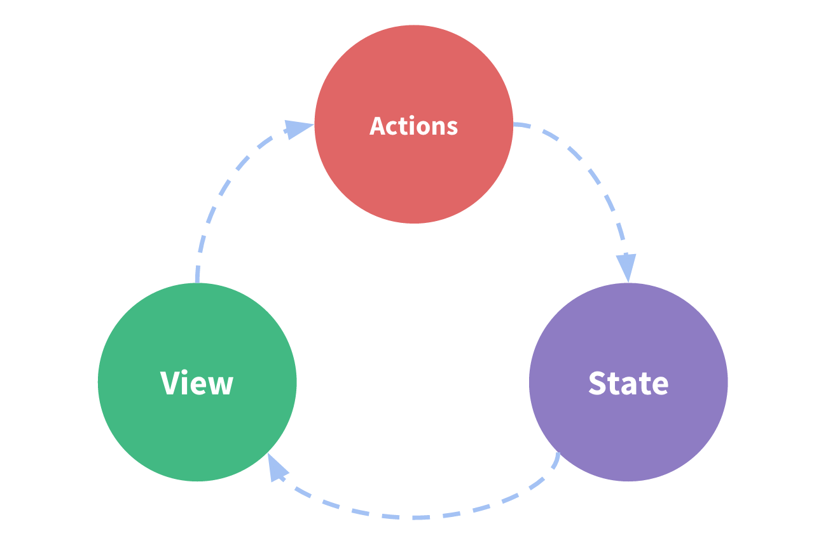
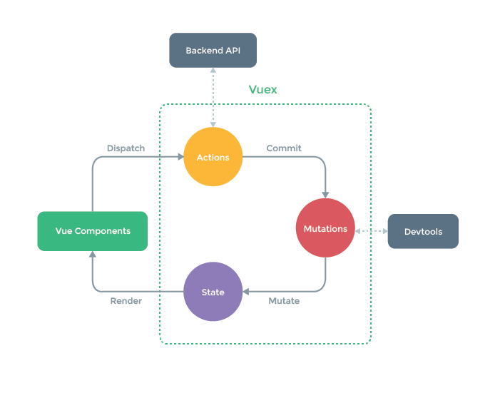

# 3.Vue3 状态管理方案与原理剖析

> 原文链接：[飞书原文](https://u19tul1sz9g.feishu.cn/docx/Z4eRd7PXsopCbRxxkuicAzQxnxd)

[引用：20260207 随堂笔记与源码资料](https://www.feishu.cn/docx/HsQBdlBmsocCuExnY9Jcy99Sn2e)
[本地资源：3.vue-state-notes](<../../20260207 随堂笔记与源码资料-压缩包/5.Vue 核心知识进阶与源码剖析/3.vue-state-notes>)

## 课程目标

> **💡 提示**
>
> - 初中级：
>
>   1. **掌握 Vue 基础状态管理方案**：掌握 Vue Composition API 中的基本状态管理方法，熟练使用 `ref` 和 `reactive` 管理组件内部或父子组件间的状态。
>   2. **掌握自定义 Composition API 管理方案**：理解并掌握如何通过自定义 Composition API 函数来封装和管理状态，具备在实际项目中创建可复用逻辑（如拖拽、动画等）的能力
>   3. **掌握深层状态传递方案**：掌握使用 Vue 提供的 `provide` 和 `inject` API 进行跨组件深层状态传递，并了解其应用场景和优势，能够在不使用 Vuex 的情况下进行状态共享
>   4. **掌握集中状态管理方案**：掌握 Pinia 状态管理方案的基础使用，理解其与 Vuex 的区别，能够实现简单的全局状态管理，并使用 `defineStore` 创建与管理状态
>   5. **了解 Vuex 状态管理方案**：了解 Vuex 的核心概念和 API，掌握其在较复杂项目中的使用，不过仅了解，不建议新项目使用了
> - 高级：
>
>   1. **深入 Vue 状态方案**：深入理解 Vue 中各种状态管理方案，能够根据项目需求与不同场景选择合适的方案，并优化状态管理策略
>   2. **掌握 Pinia 实现原理**：理解并掌握 Pinia 的核心实现原理，能够根据项目需求自定义状态定义和使用方法，并掌握 Pinia 的插件机制及其扩展能力
>   3. **简单了解 vue-demi**：了解 vue-demi，并能在轻量化场景（UI 库或 Hooks 库）熟练运用

## 补充资料

- Composition API 最佳实践：https://dev.to/delia_code/the-ultimate-guide-to-vue-3-composition-api-tips-and-best-practices-54a6
- provide 实现：https://github.com/vuejs/vue/blob/73486cb5f5862a443b42c2aff68b82320218cbcd/src/v3/apiInject.ts#L8
- Pinia：https://github.com/vuejs/pinia
- 轻量状态管理：https://github.com/vueuse/vue-demi
- Pinia 响应式：https://github.com/vuejs/pinia/blob/2ba1a08bbc4f749b9a0dedabfe672bb1e8f8569b/packages/pinia/src/store.ts#L471C37-L471C45
- 演示 pinia 插件设计，将状态自动同步到 localstorage 数据持久化：https://github.com/prazdevs/pinia-plugin-persistedstate


## 相关面试真题


### 说说 Vuex 与 Pinia 的区别？


**答案：**

Vuex 和 Pinia 都是用于管理 Vue 应用状态的库，但它们有一些显著的区别：


#### 1. **设计和理念**

- **Vuex**：flux  -> redux

  - Vuex 是一个专为 Vue.js 应用设计的状态管理模式，使用单一状态树，意味着整个应用的状态被存储在一个对象中。
  - 它的设计灵感来自于 Flux 架构，包含四个核心概念：**State**、**Getter**、**Mutation** 和 **Action**。
- **Pinia**：

  - Pinia 是 Vuex 的替代品，设计上更轻量、更灵活。
  - 它支持模块化，每个状态模块可以作为独立的“store”存在。
  - 设计上借鉴了 Vue Composition API，更加现代化。


#### 2. **API 和使用方式**

- **Vuex**：

  - 使用 `mapState`、`mapGetters`、`mapMutations` 和 `mapActions` 进行状态映射。
  - 需要定义严格的 Mutation 来更新状态，必须同步执行。
  - Action 可以包含异步逻辑，但最终需要通过 Mutation 来改变状态。
- **Pinia**：

  - 使用更加简洁的 API，直接通过 `useStore` 函数访问 store。
  - 状态、Getter 和 Actions 都定义在同一个 store 文件中，更加直观。
  - 允许直接在 Action 中修改状态，无需通过 Mutation。


#### 3. **TypeScript 支持**

- **Vuex**：

  - Vuex 4 提供了一些 TypeScript 支持，但类型定义较为复杂，使用起来可能不太友好。
- **Pinia**：

  - 从设计上就对 TypeScript 有良好的支持，类型推断和代码提示更加智能和方便。


#### 4. **性能**

- **Vuex**：

  - 性能稳定，但由于单一状态树和严格的 Mutation 规则，可能在大型应用中带来一些性能开销。
- **Pinia**：

  - 更加轻量，性能优化更好，适合大型应用。


#### 5. **开发者体验**

- **Vuex**：

  - 已经成熟，社区资源丰富，许多现有的 Vue 项目和插件依赖于 Vuex。
- **Pinia**：

  - 开发体验更加现代化，特别是对 Vue 3 和 Composition API 的深度集成。
  - 文档和生态系统正在不断发展。


### 复杂状态你一般如何管理？


**答案**：


在 Vue 3 中管理复杂状态通常涉及以下几个关键步骤和工具：


#### Composition API

Composition API 提供了更灵活和模块化的方式来组织和管理状态。你可以利用 `reactive`、`ref`、`computed` 和 `watch` 等 API 来管理局部和全局状态。


```JavaScript
import { reactive, ref, computed, watch } from 'vue';

export default {
  setup() {
    const state = reactive({
      count: 0,
      name: 'Vue3'
    });

    const doubleCount = computed(() => state.count * 2);

    const increment = () => {
      state.count++;
    };

    watch(() => state.count, (newCount, oldCount) => {
      console.log(`count changed from ${oldCount} to ${newCount}`);
    });

    return {
      state,
      doubleCount,
      increment
    };
  }
};
```


#### provide 与 inject


确实，`provide` 和 `inject` 是 Vue 3 中非常重要的 API，用于在组件树中共享状态，尤其在处理复杂状态时非常有用。以下是关于如何使用 `provide` 和 `inject` 的详细说明：


##### **`provide`**


`provide` 用于将数据或方法提供给子组件，子组件可以通过 `inject` 获取这些数据或方法。


```JavaScript
import { provide, ref } from 'vue';

export default {
  setup() {
    const state = ref({ count: 0, name: 'Vue3' });
    const increment = () => {
      state.value.count++;
    };

    provide('state', state);
    provide('increment', increment);

    return {
      state,
      increment
    };
  }
};
```


##### **`inject`**


`inject` 用于在子组件中获取父组件提供的数据或方法。


```JavaScript
import { inject } from 'vue';

export default {
  setup() {
    const state = inject('state');
    const increment = inject('increment');

    return {
      state,
      increment
    };
  }
};
```


##### 场景总结


- **全局状态共享**：当多个组件需要共享某些状态时，可以使用 `provide` 和 `inject` 在父组件中提供状态，子组件中注入状态。
- **依赖注入**：对于一些通用的功能或服务，可以在根组件中提供这些服务，子组件通过 `inject` 获取并使用。
- **避免 Prop drilling**：当需要将状态从祖先组件传递到深层次的子组件时，使用 `provide` 和 `inject` 可以避免逐层传递 props 的繁琐。


#### Pinia

Pinia 是一个现代的状态管理库，设计上更轻量且灵活，是 Vuex 的替代品。使用 Pinia，可以轻松地管理复杂状态，并且它有很好的 TypeScript 支持。


```JavaScript
import { defineStore } from 'pinia';

export const useMainStore = defineStore('main', {
  state: () => ({
    count: 0,
    name: 'Pinia'
  }),
  getters: {
    doubleCount: (state) => state.count * 2
  },
  actions: {
    increment() {
      this.count++;
    }
  }
});
```


#### 中间件

在管理复杂状态时，插件和中间件可以帮助简化和优化代码。例如，使用 `pinia-plugin-persist` 插件来持久化状态。

```JavaScript
import { createPinia } from 'pinia';
import { createApp } from 'vue';
import piniaPluginPersistedstate from 'pinia-plugin-persistedstate';
import App from './App.vue';

const app = createApp(App);
const pinia = createPinia();

pinia.use(piniaPluginPersistedstate);
app.use(pinia);
app.mount('#app');
```

```JavaScript
import { defineStore } from 'pinia';

export const useMainStore = defineStore('main', {
  state: () => ({
    count: 0,
    name: 'Pinia'
  }),
  persist: true
});
```


#### 组合 API 和外部库

在某些情况下，可以使用第三方库（如 **RxJS**）来处理复杂的异步操作和状态管理，特别是在处理流和事件的情况下。


## Composition API 基础状态管理方案

前面基础课我们提到，状态的管理可以使用 Vue 提供的 api 来完成，最常用的就是：

- ref
- reactive


并且在这两个方法中，我们建议一般情况下使用 ref，使用更简单灵活。


### 基础使用

Composition API 状态状态管理方案适合组件内或者父子组件状态的管理场景。


```HTML
<script setup lang="ts">
const count = ref(0)

const age = reactive({ value: 18 })
</script>
```


### 自定义 Composition API 状态管理

自定义 Composition API 用于状态管理，我们上一节课给大家简单介绍过，先明确一个思路，就是 Composition API 封装的目的是将视图与状态解耦，所以状态解耦合使我们封装的第一目标，首先我们需要分析有哪些必要状态、有哪些必要处理函数，进而在组件中使用即可。

我们举两个例子来重点说明 Composition API 自定义状态管理的技巧。


在 Vue 3 中，自定义 Composition API 通过组合函数（Composition Functions）来封装逻辑，提供了一种更灵活和可重用的方式来管理组件状态。下面是两个详细的例子，分别展示了如何封装拖拽逻辑和动画逻辑。


#### 封装拖拽逻辑 `useDrag`


##### 创建 `useDrag`

```JavaScript
import { ref, onMounted, onUnmounted } from 'vue';

export function useDrag() {
  const position = ref({ x: 0, y: 0 });
  const isDragging = ref(false);

  const onMouseDown = (event) => {
    isDragging.value = true;
    position.value = { x: event.clientX, y: event.clientY };
  };

  const onMouseMove = (event) => {
    if (isDragging.value) {
      const deltaX = event.clientX - position.value.x;
      const deltaY = event.clientY - position.value.y;
      position.value = { x: event.clientX, y: event.clientY };
      document.documentElement.style.setProperty('--drag-x', `${deltaX}px`);
      document.documentElement.style.setProperty('--drag-y', `${deltaY}px`);
    }
  };

  const onMouseUp = () => {
    isDragging.value = false;
  };

  onMounted(() => {
    window.addEventListener('mousemove', onMouseMove);
    window.addEventListener('mouseup', onMouseUp);
  });

  onUnmounted(() => {
    window.removeEventListener('mousemove', onMouseMove);
    window.removeEventListener('mouseup', onMouseUp);
  });

  return {
    position,
    onMouseDown
  };
}
```


##### 使用 `useDrag`

```HTML
<template>
  <div class="draggable" @mousedown="onMouseDown">
    Drag me!
  </div>
</template>

<script>
import { useDrag } from './useDrag';

export default {
  setup() {
    const { onMouseDown } = useDrag();

    return {
      onMouseDown
    };
  }
};
</script>

<style>
.draggable {
  position: absolute;
  top: calc(50% + var(--drag-y, 0px));
  left: calc(50% + var(--drag-x, 0px));
  transform: translate(-50%, -50%);
  background-color: lightblue;
  padding: 20px;
  cursor: grab;
}
</style>
```


##### 总结


1. **状态管理**：`position` 用于跟踪拖拽元素的位置，`isDragging` 用于指示是否正在拖拽。
2. **事件处理**：

   - `onMouseDown`：记录初始位置并设置拖拽状态。
   - `onMouseMove`：根据鼠标移动更新位置，并通过 CSS 变量更新元素位置。
   - `onMouseUp`：结束拖拽。
3. **生命周期管理**：在组件挂载和卸载时分别添加和移除事件监听器。


#### 封装动画逻辑 `useAnimation`


##### 创建 `useAnimation`

```JavaScript
import { ref, onMounted, onUnmounted } from 'vue';

export function useAnimation(animationName, duration) {
  const isAnimating = ref(false);
  
  const startAnimation = () => {
    isAnimating.value = true;
    setTimeout(() => {
      isAnimating.value = false;
    }, duration);
  };

  return {
    isAnimating,
    startAnimation
  };
}
```


##### 使用 `useAnimation`

```HTML
<template>
  <div :class="{ animated: isAnimating }" @click="startAnimation">
    Click me to animate!
  </div>
</template>

<script>
import { useAnimation } from './useAnimation';

export default {
  setup() {
    const { isAnimating, startAnimation } = useAnimation('fade', 1000);

    return {
      isAnimating,
      startAnimation
    };
  }
};
</script>

<style>
.animated {
  animation: fade 1s;
}

@keyframes fade {
  0% { opacity: 0; }
  100% { opacity: 1; }
}
</style>
```


##### 总结


1. **状态管理**：`isAnimating` 用于指示动画状态。
2. **动画控制**：`startAnimation` 函数用于触发动画，并在动画结束后重置状态。


## provide


`provide` 和 `inject` 是 Vue 中用于跨组件传递数据的一对 API。`provide` 用于在祖先组件中提供数据，而 `inject` 用于在后代组件中注入这些数据。这种机制使得不需要通过一层一层的 props 传递数据，就可以在任何后代组件中获取祖先组件提供的数据。


在状态管理中，`provide` 和 `inject` 适用于一些全局或跨组件的数据共享场景，例如换肤（主题切换）和国际化（语言切换）。通过这对 API，可以在不依赖 Vuex 等状态管理工具的情况下，实现数据的全局共享和响应式更新。


### 基础语法

```JavaScript
<script setup>
import { ref, provide } from 'vue'
import { countSymbol } from './injectionSymbols'

// 提供静态值
provide('path', '/project/')

// 提供响应式的值
const count = ref(0)
provide('count', count)

// 提供时将 Symbol 作为 key
provide(countSymbol, count)
</script>
```

```JavaScript
<script setup>
import { inject } from 'vue'
import { countSymbol } from './injectionSymbols'

// 注入不含默认值的静态值
const path = inject('path')

// 注入响应式的值
const count = inject('count')

// 通过 Symbol 类型的 key 注入
const count2 = inject(countSymbol)

// 注入一个值，若为空则使用提供的默认值
const bar = inject('path', '/default-path')

// 注入一个值，若为空则使用提供的函数类型的默认值
const fn = inject('function', () => {})

// 注入一个值，若为空则使用提供的工厂函数
const baz = inject('factory', () => new ExpensiveObject(), true)
</script>
```


### 补充示例

假设现在有三个组件，存在了深层关系

在不使用 provide 时，我们可能需要这样来实现，中间的组件其实只是充当了传递状态的中介

```JavaScript
// 3.ProvideDemo.vue
<script setup lang="ts">
import ProvideLevel1 from "./3.ProvideLevel1.vue";
</script>

<template>
  <div>
    <ProvideLevel1 :count="0" />
  </div>
</template>

<style scoped></style>

```

```JavaScript
// 3.ProvideLevel1.vue
<script setup lang="ts">
import ProvideLevel2 from "./3.ProvideLevel2.vue";

defineProps({
  count: Number,
});
</script>

<template>
  <div>
    <ProvideLevel2 :count="count" />
  </div>
</template>

<style scoped></style>

```

```JavaScript
// 3.ProvideLevel2.vue
<script setup lang="ts">
defineProps({
  count: Number,
});
</script>

<template>
  <div>
    {{ count }}
  </div>
</template>

<style scoped></style>

```


通过 provide 改造之后


### 换肤（主题切换）示例


#### 提供主题


在祖先组件中使用 `provide` 提供主题数据：


```JavaScript
// App.vue
<template>
  <div :class="currentTheme">
    <button @click="toggleTheme">Toggle Theme</button>
    <ChildComponent />
  </div>
</template>

<script>
export default {
  data() {
    return {
      theme: 'light' // 默认主题
    };
  },
  computed: {
    currentTheme() {
      return this.theme === 'light' ? 'theme-light' : 'theme-dark';
    }
  },
  methods: {
    toggleTheme() {
      this.theme = this.theme === 'light' ? 'dark' : 'light';
    }
  },
  provide() {
    return {
      theme: this.theme
    };
  }
};
</script>

<style>
.theme-light {
  background-color: white;
  color: black;
}

.theme-dark {
  background-color: black;
  color: white;
}
</style>
```


#### 使用主题


在后代组件中使用 `inject` 注入主题数据：


```JavaScript
// ChildComponent.vue
<template>
  <div>
    <p>Current theme: {{ theme }}</p>
  </div>
</template>

<script>
export default {
  inject: ['theme']
};
</script>
```


#### 更新主题


为了使主题数据响应式，可以使用 Vue 的响应式机制，如 `reactive` 或 `ref`。下面是一个使用 `ref` 的例子：


```JavaScript
// App.vue
<template>
  <div :class="currentTheme">
    <button @click="toggleTheme">Toggle Theme</button>
    <ChildComponent />
  </div>
</template>

<script>
import { ref, provide, computed } from 'vue';

export default {
  setup() {
    const theme = ref('light');

    const toggleTheme = () => {
      theme.value = theme.value === 'light' ? 'dark' : 'light';
    };

    const currentTheme = computed(() => (theme.value === 'light' ? 'theme-light' : 'theme-dark'));

    provide('theme', theme);

    return {
      theme,
      toggleTheme,
      currentTheme
    };
  }
};
</script>

<style>
.theme-light {
  background-color: white;
  color: black;
}

.theme-dark {
  background-color: black;
  color: white;
}
</style>
```


```JavaScript
// ChildComponent.vue
<template>
  <div>
    <p>Current theme: {{ theme }}</p>
  </div>
</template>

<script>
import { inject } from 'vue';

export default {
  setup() {
    const theme = inject('theme');
    return {
      theme
    };
  }
};
</script>
```


### 国际化（语言切换）示例


#### 提供语言


在祖先组件中使用 `provide` 提供语言数据：


```JavaScript
// App.vue
<template>
  <div>
    <button @click="toggleLanguage">Toggle Language</button>
    <ChildComponent />
  </div>
</template>

<script>
export default {
  data() {
    return {
      language: 'en' // 默认语言
    };
  },
  methods: {
    toggleLanguage() {
      this.language = this.language === 'en' ? 'fr' : 'en';
    }
  },
  provide() {
    return {
      language: this.language,
      translations: {
        en: {
          greeting: 'Hello'
        },
        fr: {
          greeting: 'Bonjour'
        }
      }
    };
  }
};
</script>
```


#### 使用语言


在后代组件中使用 `inject` 注入语言数据：


```JavaScript
// ChildComponent.vue
<template>
  <div>
    <p>{{ translation.greeting }}</p>
  </div>
</template>

<script>
export default {
  inject: ['language', 'translations'],
  computed: {
    translation() {
      return this.translations[this.language];
    }
  }
};
</script>
```


#### 更新语言


为了使语言数据响应式，可以使用 Vue 的响应式机制，如 `reactive` 或 `ref`。下面是一个使用 `ref` 的例子：


```JavaScript
// App.vue
<template>
  <div>
    <button @click="toggleLanguage">Toggle Language</button>
    <ChildComponent />
  </div>
</template>

<script>
import { ref, provide } from 'vue';

export default {
  setup() {
    const language = ref('en');

    const toggleLanguage = () => {
      language.value = language.value === 'en' ? 'fr' : 'en';
    };

    const translations = {
      en: {
        greeting: 'Hello'
      },
      fr: {
        greeting: 'Bonjour'
      }
    };

    provide('language', language);
    provide('translations', translations);

    return {
      language,
      toggleLanguage
    };
  }
};
</script>
```


```JavaScript
// ChildComponent.vue
<template>
  <div>
    <p>{{ translation.greeting }}</p>
  </div>
</template>

<script>
import { inject, computed } from 'vue';

export default {
  setup() {
    const language = inject('language');
    const translations = inject('translations');

    const translation = computed(() => translations[language.value]);

    return {
      translation
    };
  }
};
</script>
```


## Vuex 状态管理方案【仅老项目使用】

首先声明一点，我们新的项目直接选用 Pinia，Pinia，Pinia！

为什么推荐 Pinia 呢？有以下几点：

**❤️ 提示**

- *mutation* 已被弃用。我们认为它极其冗余。它们初衷是带来 devtools 的集成方案，但这已不再是一个问题了。
- 更好的 TS 支持。无需要创建自定义的复杂包装器来支持 TypeScript，一切都可标注类型，API 的设计方式是尽可能地利用 TS 类型推理。
- 无过多的魔法字符串注入，只需要导入函数并调用它们，然后享受自动补全的乐趣就好。
- 无需要动态添加 Store，它们默认都是动态的，甚至你可能都不会注意到这点。注意，你仍然可以在任何时候手动使用一个 Store 来注册它，但因为它是自动的，所以你不需要担心它。
- 不再有嵌套结构的模块。你仍然可以通过导入和使用另一个 Store 来隐含地嵌套 stores 空间。虽然 Pinia 从设计上提供的是一个扁平的结构，但仍然能够在 Store 之间进行交叉组合。你甚至可以让 Stores 有循环依赖关系。
- 不再有可命名的模块。考虑到 Store 的扁平架构，Store 的命名取决于它们的定义方式，你甚至可以说所有 Store 都应该命名。


状态管理应用包含以下几个部分：

- **状态**：驱动应用的数据源；
- **视图**：以声明方式将状态映射到视图；
- **操作**：响应在视图上的用户输入导致的状态变化。





在 Vue 中，数据驱动和组件化是最重要的，每个组件都有自己的 `data`、`template` 和 `methods`。`data` 是数据，我们也叫做状态，通过 `methods` 中的方法改变状态来更新视图。在单个组件中修改状态更新视图是很方便的。


然而，当应用遇到多个组件共享状态时，单向数据流的简洁性很容易被破坏：

1. 多个视图依赖于同一状态。
2. 来自不同视图的行为需要变更同一状态。


对于第一个问题，传参的方法对于多层嵌套的组件将会非常繁琐，并且对于兄弟组件间的状态传递无能为力。对于第二个问题，我们经常会采用父子组件直接引用或者通过事件来变更和同步状态的多份拷贝。这些模式非常脆弱，通常会导致难以维护的代码。


因此，为什么不把组件的共享状态抽取出来，以全局单例模式管理呢？在这种模式下，我们的组件树构成了一个巨大的“视图”，任何组件都能获取状态或者触发行为！


通过定义和隔离状态管理中的各种概念并通过强制规则维持视图和状态间的独立性，代码将会变得更结构化且易维护。这就是 Vuex 背后的基本思想。





如果你的项目不复杂，我建议不使用 Vuex，因为传统的组件状态管理方式已经足够；但如果你的项目涉及复杂的数据交互，并且这些数据状态分散在不同组件中且在 UI 上的位置相隔甚远，可以尝试使用 Vuex。


### Vuex 介绍及深入


#### 安装

通过 `yarn create vite` 创建 Vue 工程，安装 Vuex：

```Bash
yarn add vuex
```

每一个 Vuex 应用的核心就是 store（仓库）。"store" 基本上是一个容器，包含了应用中大部分的状态（state）。Vuex 和全局对象有以下两点不同：

1. Vuex 的状态存储是响应式的。当 Vue 组件从 store 中读取状态时，若 store 中的状态发生变化，相应的组件也会高效更新。
2. 你不能直接改变 store 中的状态。改变 store 中的状态的唯一途径是显式地提交（commit） mutation。这样可以方便地跟踪每一个状态的变化。


#### 最简单的 Store


```JavaScript
import { createStore } from 'vuex';

const defaultState = {
  count: 0,
};

export default createStore({
  state() {
    return defaultState;
  },
  mutations: {
    increment(state) {
      state.count++;
    },
  },
  actions: {
    increment(context) {
      context.commit('increment');
    },
  },
});

import { createApp } from 'vue';
import App from './App.vue';
import store from './store';

createApp(App).use(store).mount('#app');
```


#### 单一状态树

Vuex 使用单一状态树，一个对象包含全部的应用层级状态。这样每个应用仅包含一个 store 实例，可以直接定位任一特定状态片段，调试时也能轻易获取当前应用状态的快照。


#### 在 Vue 组件中获得 Vuex 状态

最简单的方法是在计算属性中返回某个状态：

```JavaScript
const Counter = {
  template: `<div>{{ count }}</div>`,
  computed: {
    count() {
      return this.$store.state.count;
    }
  }
}
```


#### mapState 辅助函数

当一个组件需要获取多个状态时，可以使用 `mapState` 辅助函数生成计算属性：

```JavaScript
import { mapState } from 'vuex';

export default {
  computed: mapState({
    count: state => state.count,
    countAlias: 'count',
    countPlusLocalState(state) {
      return state.count + this.localCount;
    }
  })
}
```


#### 组件仍然保有局部状态

使用 Vuex 并不意味着需要将所有状态放入 Vuex。如果状态严格属于单个组件，最好作为组件的局部状态。根据应用开发需要进行权衡。


### Vuex 核心概念


#### Getter

从 store 中派生状态：

```JavaScript
const store = createStore({
  state: {
    todos: [
      { id: 1, text: '...', done: true },
      { id: 2, text: '...', done: false }
    ]
  },
  getters: {
    doneTodos(state) {
      return state.todos.filter(todo => todo.done);
    }
  }
});
```


#### Mutation

更改 Vuex 的 store 中的状态的唯一方法是提交 mutation：

```JavaScript
const store = createStore({
  state: {
    count: 1
  },
  mutations: {
    increment(state) {
      state.count++;
    }
  }
});

store.commit('increment');
```


#### Actions


Actions存在的意义是假设你在修改state的时候有异步操作，vuex作者不希望你将异步操作放在Mutations中，所以就给你设置了一个区域，让你放异步操作，这就是Actions。

```JavaScript
const store = createStore({
  state: {
    count: 0
  },
  mutations: {
    increment (state) {
      state.count++
    }
  },
  actions: {
    increment (context) {
      context.commit('increment')
    }
  }
})
```

Action 函数接受一个与 store 实例具有相同方法和属性的 context 对象，因此你可以调用 context.commit 提交一个 mutation，或者通过 context.state 和 context.getters 来获取 state 和 getters。当我们在之后介绍到 [Modules](https://vuex.vuejs.org/zh/guide/modules.html) 时，你就知道 context 对象为什么不是 store 实例本身了。  
实践中，我们会经常用到 ES2015 的[参数解构](https://github.com/lukehoban/es6features#destructuring)来简化代码（特别是我们需要调用 commit 很多次的时候）：

```JavaScript
actions: {
  increment ({ commit }) {
    commit('increment')
  }
}
```

##### 分发 Action

Action 通过 store.dispatch 方法触发：

```JavaScript
store.dispatch('increment')
```

乍一眼看上去感觉多此一举，我们直接分发 mutation 岂不更方便？实际上并非如此，还记得 **mutation 必须同步执行**这个限制么？Action 就不受约束！我们可以在 action 内部执行**异步**操作：

```JavaScript
actions: {
  incrementAsync ({ commit }) {
    setTimeout(() => {
      commit('increment')
    }, 1000)
  }
}
```

Actions 支持同样的载荷方式和对象方式进行分发：

```JavaScript
// 以载荷形式分发
store.dispatch('incrementAsync', {
  amount: 10
})

// 以对象形式分发
store.dispatch({
  type: 'incrementAsync',
  amount: 10
})
```


##### 在组件中分发 Action

你在组件中使用 this.\$store.dispatch('xxx') 分发 action，或者使用 mapActions 辅助函数将组件的 methods 映射为 store.dispatch 调用（需要先在根节点注入 store）：

```JavaScript
import { mapActions } from 'vuex'

export default {
  // ...
  methods: {
    ...mapActions([
      'increment', // 将 `this.increment()` 映射为 `this.$store.dispatch('increment')`

      // `mapActions` 也支持载荷：
      'incrementBy' // 将 `this.incrementBy(amount)` 映射为 `this.$store.dispatch('incrementBy', amount)`
    ]),
    ...mapActions({
      add: 'increment' // 将 `this.add()` 映射为 `this.$store.dispatch('increment')`
    })
  }
}
```


#### Module

由于使用单一状态树，应用的所有状态会集中到一个比较大的对象。当应用变得非常复杂时，store 对象就有可能变得相当臃肿。  
为了解决以上问题，Vuex 允许我们将 store 分割成**模块（module）**。每个模块拥有自己的 state、mutation、action、getter、甚至是嵌套子模块——从上至下进行同样方式的分割：

```JavaScript
const moduleA = {
  state: () => ({ count: 0 }),
  mutations: { increment(state) { state.count++; } },
  getters: { doubleCount(state) { return state.count * 2; } }
};

const moduleB = {
  state: () => ({ count: 0 }),
  mutations: { increment(state) { state.count++; } },
  actions: { incrementIfOddOnRootSum({ state, commit, rootState }) { if ((state.count + rootState.count) % 2 === 1) { commit('increment'); } } }
};

const store = createStore({
  modules: {
    a: moduleA,
    b: moduleB
  }
});

store.state.a;
store.state.b;
```


#### 命名空间

默认情况下，模块内部的 action 和 mutation 仍然是注册在**全局命名空间**的——这样使得多个模块能够对同一个 action 或 mutation 作出响应。Getter 同样也默认注册在全局命名空间，但是目前这并非出于功能上的目的（仅仅是维持现状来避免非兼容性变更）。必须注意，不要在不同的、无命名空间的模块中定义两个相同的 getter 从而导致错误。  
如果希望你的模块具有更高的封装度和复用性，你可以通过添加 namespaced: true 的方式使其成为带命名空间的模块。当模块被注册后，它的所有 getter、action 及 mutation 都会自动根据模块注册的路径调整命名。


```JavaScript
const moduleA = {
  namespaced: true,
  state: () => ({ count: 0 }),
  mutations: { increment(state) { state.count++; } },
  getters: { doubleCount(state) { return state.count * 2; } }
};

const store = createStore({
  modules: {
    a: moduleA
  }
});
```


## Pinia 状态管理方案


### Pinia 与 Vuex 的对比


#### API 简洁性

- **Vuex**: 使用较为复杂的四大概念（State, Getters, Mutations, Actions）。
- **Pinia**: 提供了更简单、更直观的 API，去掉了 Mutations，仅保留 State 和 Actions，减少了心智负担。


#### TypeScript 支持

- **Vuex**: TypeScript 支持较为复杂，需要大量的类型定义和配置。
- **Pinia**: 内置了对 TypeScript 的良好支持，类型推断更加友好。


#### DevTools 支持

- **Vuex**: DevTools 支持较好，可以方便地进行状态的调试和时间旅行。
- **Pinia**: 同样支持 Vue DevTools，并提供了更好的插件机制，增强了调试能力。


#### 插件机制

- **Vuex**: 插件机制较为有限，扩展性不如 Pinia。
- **Pinia**: 提供了灵活的插件机制，可以方便地添加中间件、日志等功能。


#### 状态持久化

- **Vuex**: 需要手动配置插件实现状态持久化。
- **Pinia**: 内置了状态持久化支持，通过简单配置即可实现。


### Pinia 的设计理念


#### 单一状态树

Pinia 和 Vuex 一样，采用单一状态树的设计，将应用的所有状态集中管理。这种设计方式有助于维护状态的一致性和可预测性。


#### 响应式

Pinia 利用 Vue 3 的响应式系统，将状态声明为响应式对象，使得状态变化能够自动触发视图更新。


#### 模块化

Pinia 提供了模块化的状态管理方式，可以根据需要将状态划分为多个 store，使得状态管理更加清晰和可维护。


#### 插件友好

Pinia 提供了丰富的插件接口，可以方便地扩展状态管理的功能，如持久化、日志记录、性能监控等。


### Pinia 核心概念


#### State

与 Vue 的选项式 API 类似，我们也可以传入一个带有 `state`、`actions` 与 `getters` 属性的 Option 对象

```Bash
export const useCounterStore = defineStore('counter', {
  state: () => ({ count: 0 }),
  getters: {
    double: (state) => state.count * 2,
  },
  actions: {
    increment() {
      this.count++
    },
  },
})
```


**推荐这种写法**

也存在另一种定义 store 的可用语法。与 Vue 组合式 API 的 [setup 函数](https://cn.vuejs.org/api/composition-api-setup.html) 相似，我们可以传入一个函数，该函数定义了一些响应式属性和方法，并且返回一个带有我们想暴露出去的属性和方法的对象。

```Bash
export const useCounterStore = defineStore('counter', () => {
  const count = ref(0)
  function increment() {
    count.value++
  }

  return { count, increment }
})
```


这样理解：

在 *Setup Store* 中

- `ref()` 就是 `state` 属性
- `computed()` 就是 `getters`
- `function()` 就是 `actions`

使用 Store 也很简单

```TypeScript
<script setup>
import { useCounterStore } from '@/stores/counter'
// 可以在组件中的任意位置访问 `store` 变量 ✨
const store = useCounterStore()
</script>
```


#### Getter

跟 Vuex 的写法类似

```TypeScript
// 示例文件路径：
// ./src/stores/counter.js

import { defineStore } from 'pinia'

export const useCounterStore = defineStore('counter', {
  state: () => ({
    count: 0,
  }),
  getters: {
    doubleCount(state) {
      return state.count * 2
    },
  },
})
```

当然我们推荐用组合式的写法

```TypeScript
<script>
import { useCounterStore } from '../stores/counter'

export default defineComponent({
  setup() {
    const counterStore = useCounterStore()

    return { counterStore }
  },
  computed: {
    quadrupleCounter() {
      return this.counterStore.doubleCount * 2
    },
  },
})
</script>
```

除此以外，你也可以使用 mapState 去结构内容到 getter 

```TypeScript
import { mapState } from 'pinia'
import { useCounterStore } from '../stores/counter'

export default {
  computed: {
    // 允许在组件中访问 this.doubleCount
    // 与从 store.doubleCount 中读取的相同
    ...mapState(useCounterStore, ['doubleCount']),
    // 与上述相同，但将其注册为 this.myOwnName
    ...mapState(useCounterStore, {
      myOwnName: 'doubleCount',
      // 你也可以写一个函数来获得对 store 的访问权
      double: store => store.doubleCount,
    }),
  },
}
```


#### Action

Action 相当于组件中的 [method](https://v3.vuejs.org/guide/data-methods.html#methods)。它们可以通过 `defineStore()` 中的 `actions` 属性来定义，并且它们也是定义业务逻辑的完美选择。

```TypeScript
export const useCounterStore = defineStore('main', {
  state: () => ({
    count: 0,
  }),
  actions: {
    increment() {
      this.count++
    },
    randomizeCounter() {
      this.count = Math.round(100 * Math.random())
    },
  },
})
```


类似 [getter](https://pinia.vuejs.org/zh/core-concepts/getters.html)，action 也可通过 `this` 访问整个 store 实例，并支持完整的类型标注(以及自动补全✨)。不同的是，`action` 可以是异步的，你可以在它们里面 `await` 调用任何 API，以及其他 action！下面是一个使用 [Mande](https://github.com/posva/mande) 的例子。请注意，你使用什么库并不重要，只要你得到的是一个`Promise`，你甚至可以 (在浏览器中) 使用原生 `fetch` 函数：


```TypeScript
import { mande } from 'mande'

const api = mande('/api/users')

export const useUsers = defineStore('users', {
  state: () => ({
    userData: null,
    // ...
  }),

  actions: {
    async registerUser(login, password) {
      try {
        this.userData = await api.post({ login, password })
        showTooltip(`Welcome back ${this.userData.name}!`)
      } catch (error) {
        showTooltip(error)
        // 让表单组件显示错误
        return error
      }
    },
  },
})
```


#### 使用

推荐大家直接用 composition api 的写法，来消费对应数据

```JavaScript
<!-- 使用选项式 api 的 Pinia 写法 -->
<script setup lang="ts">
// 始终注意 Pinia 定义的装填，那依然是接近 composition api
import { useCounterStore } from "../store";

// 通过 useStore 获取 store 实例
const store = useCounterStore();
</script>

<template>
  <div>
    {{ store.count }}
    <button @click="store.increment">+1</button>
    <button @click="store.decrement">-1</button>
  </div>
</template>

<style scoped></style>

```


### Pinia 插件


Pinia 提供了灵活的插件机制，可以方便地定义自定义插件。下面是一个简单的日志插件示例：


```JavaScript
import { PiniaPluginContext } from 'pinia';

function createLogger() {
  return (context: PiniaPluginContext) => {
    const store = context.store;
    store.$onAction(({ name, args, after, onError }) => {
      console.log(`Action ${name} was called with args: `, args);

      after((result) => {
        console.log(`Action ${name} ended with result: `, result);
      });

      onError((error) => {
        console.error(`Action ${name} failed with error: `, error);
      });
    });
  };
}

export default createLogger;
```


在 Pinia 实例中使用该插件：


```JavaScript
import { createPinia } from 'pinia';
import createLogger from './loggerPlugin';

const pinia = createPinia();
pinia.use(createLogger);

app.use(pinia);
```


额外示例，将状态自动同步到 localstorage，https://github.com/prazdevs/pinia-plugin-persistedstate


### 最佳实践（非常重要）

尽可能拆分 composition api 的子逻辑，这样能够在更多的场景下进行复用。

```JavaScript
const useDouble = (count: number) => {
  return count * 2;
};

const useIncrement = (count: number) => {
  return {
    increment: () => {
      count++;
    },
  };
};

const useDecrement = (count: number) => {
  return {
    decrement: () => {
      count--;
    },
  };
};

// 第二种 composition api ✅
export const useCounterStore = defineStore("counter", () => {
  // state
  const count = ref(0);

  // getters
  // const double = computed(() => count.value * 2);
  const double = useDouble(count.value);

  // actions
  const increment = useIncrement(count.value);
  // const increment = () => {
  //   count.value++;
  // };
  const decrement = useDecrement(count.value);
  // const decrement = () => {
  //   count.value--;
  // };

  return {
    count,
    double,
    increment,
    decrement,
  };
});
```


## Pinia 源码浅析

我们之前就给大家提示过，阅读源码，一定要从核心 api 实现触发，我们再次回顾 Pinia 的基础使用，然后在此基础上浅浅了解一下 Pinia 核心 api 的实现细节


### 安装和创建 Pinia


在使用 Pinia 之前，需要先安装并在 Vue 应用中注册 Pinia。


```JavaScript
import { createApp } from 'vue';
import { createPinia } from 'pinia';

const app = createApp(App);
const pinia = createPinia();

app.use(pinia);
app.mount('#app');
```


#### 创建 Store


Pinia 的 Store 是用 `defineStore` 函数创建的。每个 Store 都是一个独立的模块，包含 `state`、`getters` 和 `actions`。


```JavaScript
import { defineStore } from 'pinia';

export const useCounterStore = defineStore('counter', {
  state: () => ({
    count: 0
  }),
  getters: {
    doubleCount: (state) => state.count * 2
  },
  actions: {
    increment() {
      this.count++;
    }
  }
});
```


### 核心实现


下面我们从源码角度探讨 Pinia 的核心实现。


#### 创建 Pinia 实例


`createPinia` 函数返回一个 Pinia 实例，这个实例在注册到 Vue 应用时会被注入到组件上下文中。


```JavaScript
export function createPinia() {
  const pinia = {
    install(app) {
      pinia._a = app;
      app.provide(piniaSymbol, pinia);
    },
    use(plugin) {
      // 插件机制
    },
    _a: null,
    _p: []
  };
  return pinia;
}
```


#### 定义 Store


`defineStore` 函数用于创建一个 Store。它接受两个参数：Store 的唯一标识符和一个配置对象。


```JavaScript
export function defineStore(idOrOptions, setup) {
  const id = typeof idOrOptions === 'string' ? idOrOptions : idOrOptions.id;
  const store = function useStore(pinia) {
    if (!pinia) {
      // 获取当前上下文中的 pinia 实例
      pinia = getCurrentInstance()?.proxy.$pinia;
    }

    if (!pinia._s.has(id)) {
      pinia._s.set(id, createSetupStore(id, setup, pinia));
    }

    return pinia._s.get(id);
  };
  
  return store;
}
```


#### 创建 Store 实例


`createSetupStore` 函数负责创建具体的 Store 实例。它使用 Vue 的 `reactive` 函数将 `state` 变为响应式，并使用 `computed` 函数处理 `getters`。


```JavaScript
function createSetupStore(id, setup, pinia) {
  const store = reactive({
    _p: pinia,
    // 状态
    $state: setup.state ? reactive(setup.state()) : reactive({}),
    // 获取器
    ...Object.keys(setup.getters || {}).reduce((getters, key) => {
      getters[key] = computed(() => setup.getters[key](store.$state));
      return getters;
    }, {}),
    // 动作
    ...Object.keys(setup.actions || {}).reduce((actions, key) => {
      actions[key] = setup.actions[key].bind(store);
      return actions;
    }, {})
  });

  return store;
}
```


#### 状态响应


Pinia 使用 Vue 的响应式系统来处理状态和获取器。在 `createSetupStore` 中，`state` 是通过 Vue 的 `reactive` 函数创建的，这使得状态变得响应式。


```JavaScript
const $state = reactive(setup.state ? setup.state() : {});
```


#### 获取器


获取器 (`getters`) 是通过 Vue 的 `computed` 函数实现的，这确保了它们在依赖发生变化时自动更新。


```JavaScript
const getters = Object.keys(setup.getters || {}).reduce((getters, key) => {
  getters[key] = computed(() => setup.getters[key](store.$state));
  return getters;
}, {});
```


#### 动作


动作 (`actions`) 是普通的函数，但它们被绑定到 Store 实例，以便能够直接访问 `state` 和 `getters`。


```JavaScript
const actions = Object.keys(setup.actions || {}).reduce((actions, key) => {
  actions[key] = setup.actions[key].bind(store);
  return actions;
}, {});
```


### 使用 Store


创建好 Store 后，可以在组件中使用它。


```HTML
<script setup lange="ts">
import { useCounterStore } from '@/stores/counter';

const counterStore = useCounterStore();
</script>
```


在模板中，可以直接使用 Store 中的 `state`、`getters` 和 `actions`。


```HTML
<template>
  <div>
    <p>{{ counterStore.count }}</p>
    <p>{{ counterStore.doubleCount }}</p>
    <button @click="counterStore.increment">Increment</button>
  </div>
</template>
```


### 补充拓展

我们可以看到 pinia 的封装，状态维护依赖了 **vue-demi**，在很多库封装场景下，我们也可以借助 vue-demi 维护状态。
