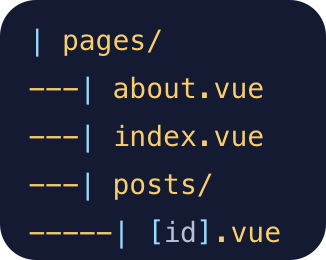
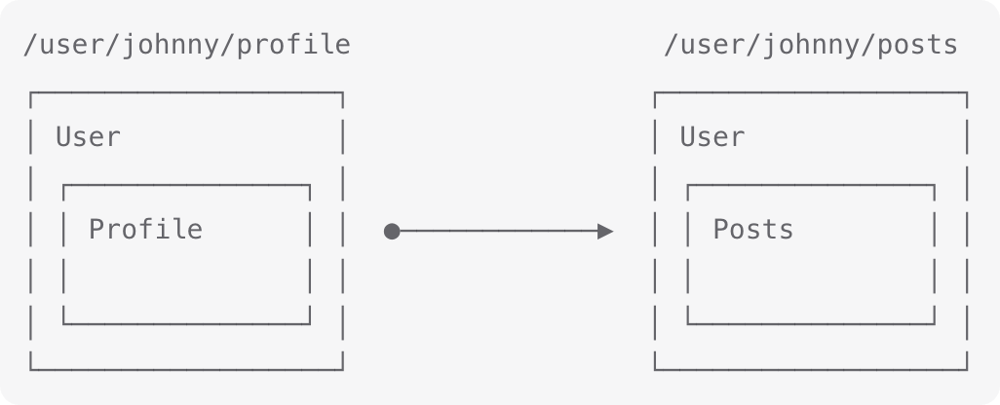

# 4.Vue3 路由方案与原理剖析

> 原文链接：[飞书原文](https://u19tul1sz9g.feishu.cn/docx/QM8Adehl4o7fVUxM6I5cJFbEnWr)

[引用：20260207 随堂笔记与源码资料](https://www.feishu.cn/docx/HsQBdlBmsocCuExnY9Jcy99Sn2e)
[本地资源：4.vue-router-notes](<../../20260207 随堂笔记与源码资料-压缩包/5.Vue 核心知识进阶与源码剖析/4.vue-router-notes>)

## 课程目标

> **💡 提示**
>
> - 初中级：
>
>   1. **掌握 Vue-Router 路由方案**：熟悉并掌握 Vue-Router 的基本使用，包括路由配置、动态路由、嵌套路由等，通过实例学习如何使用 `RouterView` 和 `RouterLink` 等组件来实现视图渲染和导航
>   2. **了解路由库实现原理**：了解 Vue-Router 的工作原理，掌握路由历史记录栈的管理机制，熟悉不同类型的历史记录（如 `createWebHashHistory`、`createWebHistory` 和 `createMemoryHistory`）及其应用场景
> - 高级：
>
>   1. **深入理解路由体系**：深入理解 Vue-Router 的路由体系，包括声明式路由、配置式路由与约定式路由，能够根据不同的项目需求选择合适的路由方案并实现
>   2. **掌握 Vue-Router 常用 api**：掌握 Vue-Router 的常用 API，包括路由守卫、路由懒加载、导航守卫等，能够灵活使用这些 API 处理路由相关的需求，如认证、数据加载等
>   3. **手写 Vue-Router**：实现 Vue-Router 的核心功能，包含路由处理、历史记录管理、路由变更监听等，深入理解 Vue-Router 的实现原理并通过手写代码加深对路由原理的理解

## 补充资料

- vue-router 官方文档：https://router.vuejs.org/zh/introduction.html
- vue-router 相关 api 速查：https://router.vuejs.org/zh/api/
- 源码：https://github.com/vuejs/router
- 浏览器历史记录协议：https://developer.mozilla.org/en-US/docs/Web/API/History_API
- 路由库实现：https://github.com/vuejs/router/blob/v4.3.3/packages/router/src/history/html5.ts


## 相关面试真题


### 说说 Vue-Router 路由历史的几种模式，并说说其实现原理？


**答案：**


你提到的 Vue-Router 历史模式主要有 memory 模式、hash 模式和 web（history）模式。下面是这三种模式的详细介绍及其实现原理：


#### Hash 模式


**原理**：

- 使用 URL 的 hash (`#`) 部分来模拟不同的路径。
- 这种模式下的 URL 形如 `http://example.com/#/path`。
- 因为 hash 部分不会被发送到服务器，所以服务器端不需要特别处理。


**实现**：

- Vue-Router 通过监听 `window.onhashchange` 事件来检测 URL 的变化。
- 当 hash 值变化时，Vue-Router 会解析 hash 部分并更新视图。


**优点**：

- 简单易用，不需要服务器配置。
- 浏览器支持良好。


**缺点**：

- URL 不美观，带有 `#` 符号。
- 对 SEO 不友好，因为 hash 不会被搜索引擎索引。


#### Web (History) 模式


**原理**：

- 利用 HTML5 History API（`pushState` 和 `replaceState`）来管理历史记录。
- URL 形如 `http://example.com/path`，没有 `#` 符号。
- 这种模式需要服务器支持，因为浏览器在请求 URL 时会直接向服务器发送请求。


**实现**：

- Vue-Router 通过监听 `window.onpopstate` 事件来检测 URL 的变化。
- 使用 `router.push` 或 `router.replace` 方法时会调用 `history.pushState` 或 `history.replaceState` 方法改变 URL。


**优点**：

- URL 美观，结构清晰。
- 更加符合现代单页应用的路由需求。


**缺点**：

- 需要服务器配置，确保所有路径都指向同一个 HTML 文件，以便客户端路由处理。


**服务器配置示例（例如 Nginx）**：

```Nginx
location / {
  try_files $uri $uri/ /index.html;
}
```


#### Memory 模式


**原理**：

- 这种模式主要用于非浏览器环境，比如 Node.js 服务器端渲染时。
- 不依赖于浏览器的 History API 或 hash 变化。


**实现**：

- Vue-Router 使用内存中存储的路由状态来模拟路由行为。
- 没有实际的 URL 变化，完全在代码中管理路由状态。


**优点**：

- 适用于没有浏览器环境的场景，比如服务器端渲染或自动化测试。


**缺点**：

- 只能用于特定场景，不适合普通的前端开发。


#### 总结


- **Hash 模式**：适合简单项目和不需要 SEO 的场景，使用 hash 部分来管理路由。
- **Web (History) 模式**：适合需要美观 URL 和 SEO 的场景，需要服务器支持，使用 HTML5 History API。
- **Memory 模式**：适合非浏览器环境，比如服务器端渲染或自动化测试，使用内存管理路由。


### Vue-Router 动态路由的使用和实现原理


Vue-Router 动态路由允许你定义带参数的路径并在组件中访问这些参数。这对于构建灵活和可扩展的应用程序非常有用，例如用户详情页、文章详情页等。


#### 使用动态路由


1. **定义动态路由**：


在 `routes` 配置中，可以使用 `:` 来定义动态路由参数：


```JavaScript
const routes = [
  { path: '/user/:id', component: User }
];
```


这里，`/user/:id` 定义了一个动态路由，`:id` 是一个路由参数。


1. **访问路由参数**：


在组件中，可以通过 `this.$route.params` 访问路由参数：


```JavaScript
export default {
  name: 'User',
  computed: {
    userId() {
      return this.$route.params.id;
    }
  },
  watch: {
    '$route' (to, from) {
      // 当路由变化时重新获取数据
      this.fetchData();
    }
  },
  methods: {
    fetchData() {
      // 使用 this.userId 获取用户数据
      console.log('Fetching data for user:', this.userId);
    }
  }
}
```


1. **导航到动态路由**：


可以使用 `router.push` 或 `<router-link>` 导航到带有参数的路径：


```JavaScript
// 使用 router.push
this.$router.push({ path: `/user/${userId}` });

// 使用 <router-link>
<router-link :to="`/user/${userId}`">Go to User</router-link>
```


#### 实现原理


1. **匹配路由**：


Vue-Router 在初始化时会创建一棵路由树。在导航时，它会根据当前 URL 解析出路径，然后逐层匹配路由树，直到找到对应的路由。如果遇到动态路由参数，会将实际的 URL 片段解析并存储在 `this.$route.params` 中。


1. **解析参数**：


当定义一个路径包含动态参数时，Vue-Router 会将这些参数解析为正则表达式。例如，路径 `/user/:id` 会被解析为 `/user/([^\/]+)`。当 URL 匹配该路径时，Vue-Router 会将实际的 URL 片段提取并赋值给 `this.$route.params`。


1. **更新组件**：


当路由参数变化时，Vue-Router 会触发组件的重新渲染。如果组件是复用的（例如从 `/user/1` 导航到 `/user/2`），组件实例不会被销毁和重新创建，而是调用 `beforeRouteUpdate` 钩子或触发 `watch` 监听 `$route` 的变化，以便在参数变化时更新组件内容。


## Vue-Router 基础使用

Vue Router 是 Vue 官方的客户端路由解决方案。


客户端路由的作用是在单页应用 (SPA) 中将浏览器的 URL 和用户看到的内容绑定起来。当用户在应用中浏览不同页面时，URL 会随之更新，但页面不需要从服务器重新加载。


Vue Router 基于 Vue 的组件系统构建，你可以通过配置路由来告诉 Vue Router 为每个 URL 路径显示哪些组件。


### 基础入门原理与示例


#### 初识Vue-Router

- Vue-Router 是Vue.js官方的路由管理器
- 它能够创建单页应用（SPA），通过在应用中创建不同的视图和路径


#### 安装与配置

- 使用npm安装：`npm install vue-router`
- 配置Vue-Router：

  ```JavaScript
  import Vue from 'vue';
  import Home from './views/Home.vue';
  import About from './views/About.vue';
  
  Vue.use(router);
  
  const routes = [
    { path: '/', component: Home },
    { path: '/about', component: About }
  ];
  
  const router = new VueRouter({
    routes
  });
  
  new Vue({
    router,
    render: h => h(App)
  }).$mount('#app');
  ```


配置式路由




#### 基本示例

- 创建两个简单的组件并设置路由
- 在Vue实例中使用`<router-view>`来显示路由对应的组件

  ```HTML
  <div id="app">
    <router-link to="/">Home</router-link>
    <router-link to="/about">About</router-link>
    <router-view></router-view>
  </div>
  ```
- 我们还可以在组件中通过访问实例，使用方法进行路由跳转

  ```JavaScript
  export default {
    methods: {
      goToAbout() {
        this.$router.push('/about')
      },
    },
  }
  ```
- 如果是 Composition API，则可以使用

  ```JavaScript
  <script setup>
  import { computed } from 'vue'
  import { useRoute, useRouter } from 'vue-router'
  
  const router = useRouter()
  const route = useRoute()
  
  const search = computed({
    get() {
      return route.query.search ?? ''
    },
    set(search) {
      router.replace({ query: { search } })
    }
  })
  </script>
  ```


### 动态路由


很多时候，我们需要将给定匹配模式的路由映射到同一个组件。例如，我们可能有一个 User 组件，它应该对所有用户进行渲染，但用户 ID 不同。在 Vue Router 中，我们可以在路径中使用一个动态字段来实现，我们称之为 路径参数 ：


```JavaScript
import User from './User.vue'

// 这些都会传递给 `createRouter`
const routes = [
  // 动态字段以冒号开始
  { path: '/users/:id', component: User },
]
```

现在像 /users/johnny 和 /users/jolyne 这样的 URL 都会映射到同一个路由。


路径参数 用冒号 : 表示。当一个路由被匹配时，它的 params 的值将在每个组件中以 route.params 的形式暴露出来。因此，我们可以通过更新 User 的模板来呈现当前的用户 ID：


```HTML
<template>
  <div>
    <!-- 当前路由可以通过 $route 在模板中访问 -->
    User {{ $route.params.id }}
  </div>
</template>
```


#### 获取路由参数

获取路由参数的方式有几种，通常我们分为模板中获取和 js 逻辑中获取，分别为：


在模板中消费参数

```JavaScript
const User = {
  template: '<div>User {{ $route.params.id }}</div>'
};
```


在 js 中使用参数

```HTML
<script setup>
import { watch } from 'vue'
import { useRoute } from 'vue-router'

const route = useRoute()

watch(() => route.params.id, (newId, oldId) => {
  // 对路由变化做出响应...
})
</script>
```


#### 捕获所有路由或 404 Not found 路由

常规参数只匹配 url 片段之间的字符，用 / 分隔。如果我们想匹配任意路径，我们可以使用自定义的 路径参数 正则表达式，在 路径参数 后面的括号中加入 正则表达式 :

```JavaScript
const routes = [
  // 将匹配所有内容并将其放在 `route.params.pathMatch` 下
  { path: '/:pathMatch(.*)*', name: 'NotFound', component: NotFound },
  // 将匹配以 `/user-` 开头的所有内容，并将其放在 `route.params.afterUser` 下
  { path: '/user-:afterUser(.*)', component: UserGeneric },
]
```


### 路由嵌套

一些应用程序的 UI 由多层嵌套的组件组成。在这种情况下，URL 的片段通常对应于特定的嵌套组件结构，例如：




#### 配置嵌套路由

- 配置子路由

  ```JavaScript
  const routes = [
    { path: '/user/:id', component: User,
      children: [
        {
          path: 'profile',
          component: UserProfile
        },
        {
          path: 'posts',
          component: UserPosts
        }
      ]
    }
  ];
  ```


#### 使用嵌套路由组件

- 在父组件中使用`<router-view>`来显示子路由组件

  ```HTML
  <div>
    <h2>User {{ $route.params.id }}</h2>
    <router-link to="profile">Profile</router-link>
    <router-link to="posts">Posts</router-link>
    <router-view></router-view>
  </div>
  ```


#### 嵌套路由命名

嵌套路由可以进行命名，方便在后续使用中管理。

```JavaScript
const routes = [
  {
    path: '/user/:id',
    component: User,
    // 请注意，只有子路由具有名称
    children: [{ path: '', name: 'user', component: UserHome }],
  },
]
```


### 路由跳转

路由的跳转方式有很多种，我们总结如下：

- RouterLink，`<RouterLink to="/about">Go to About</RouterLink>`
- 实例方法跳转

  ```JavaScript
  export default {
    methods: {
      goToAbout() {
        this.$router.push('/about')
      },
    },
  }
  ```
- Composition API

  ```HTML
  <script setup>
  import { computed } from 'vue'
  import { useRoute, useRouter } from 'vue-router'
  
  const router = useRouter()
  
  router.push('/about')
  
  // 命名的路由，并加上参数，让路由建立 url
  router.push({ name: 'user', params: { username: 'eduardo' } })
  
  router.go(1)
  </script>
  ```


## 进阶使用


### 路由导航守卫


#### 全局前置守卫


Vue-Router 提供的导航守卫主要用来守卫路由的跳转或取消。它们可以植入到全局、单个路由或组件级别。


- **全局前置守卫**可以使用 `router.beforeEach` 注册:

  ```JavaScript
  const router = createRouter({ ... });
  
  router.beforeEach((to, from) => {
    // 返回 false 以取消导航
    return false;
  });
  ```


当导航触发时，全局前置守卫按照创建顺序调用。守卫是异步解析执行，导航会等待所有守卫解析完成后才会继续。


- **守卫方法参数**：

  - `to`: 即将要进入的目标路由对象
  - `from`: 当前导航正要离开的路由对象


- **返回值**：

  - `false`: 取消当前导航。如果浏览器的 URL 改变了，URL 会重置到 `from` 路由对应的地址。
  - 路由地址: 重定向到一个不同的地址，如同调用 `router.push()`。
  - `undefined` 或 `true`: 导航有效，继续下一步。


示例：

```JavaScript
router.beforeEach(async (to, from) => {
  if (!isAuthenticated && to.name !== 'Login') {
    // 将用户重定向到登录页面
    return { name: 'Login' };
  }
});
```


#### 全局解析守卫


全局解析守卫在导航被确认之前调用，可以使用 `router.beforeResolve` 注册。这适用于获取数据或执行其他操作的场景：


```JavaScript
router.beforeResolve(async to => {
  if (to.meta.requiresCamera) {
    try {
      await askForCameraPermission();
    } catch (error) {
      if (error instanceof NotAllowedError) {
        // 处理错误并取消导航
        return false;
      } else {
        // 抛出意料之外的错误并取消导航
        throw error;
      }
    }
  }
});
```


#### 全局后置钩子


全局后置钩子不会改变导航，只执行一些辅助功能，如分析、改变页面标题等：


```JavaScript
router.afterEach((to, from) => {
  sendToAnalytics(to.fullPath);
});
```


#### 路由独享守卫


可以在路由配置中直接定义 `beforeEnter` 守卫，仅在进入路由时触发：


```JavaScript
const routes = [
  {
    path: '/users/:id',
    component: UserDetails,
    beforeEnter: (to, from) => {
      // 拒绝导航
      return false;
    },
  },
];
```


#### 组件内的守卫


在路由组件内直接定义守卫，包括 `beforeRouteEnter`、`beforeRouteUpdate` 和 `beforeRouteLeave`：


```JavaScript
export default {
  beforeRouteEnter(to, from, next) {
    // 在路由改变前调用，无法访问组件实例
  },
  beforeRouteUpdate(to, from) {
    // 在当前路由改变时调用，实例已挂载
  },
  beforeRouteLeave(to, from) {
    // 在导航离开前调用
  },
};
```


使用 `beforeRouteEnter` 守卫访问组件实例，可以通过传递回调给 `next`：

```JavaScript
beforeRouteEnter (to, from, next) {
  next(vm => {
    // 通过 `vm` 访问组件实例
  });
}
```


#### 使用组合 API


如果使用组合式 API，可以通过 `onBeforeRouteUpdate` 和 `onBeforeRouteLeave` 添加 update 和 leave 守卫。


### 完整的导航解析流程


1. 导航被触发。
2. 调用失活组件的 `beforeRouteLeave` 守卫。
3. 调用全局的 `beforeEach` 守卫。
4. 调用重用组件的 `beforeRouteUpdate` 守卫。
5. 调用路由配置中的 `beforeEnter`。
6. 解析异步路由组件。
7. 调用被激活组件的 `beforeRouteEnter` 守卫。
8. 调用全局的 `beforeResolve` 守卫。
9. 导航被确认。
10. 调用全局的 `afterEach` 钩子。
11. 触发 DOM 更新。
12. 调用 `beforeRouteEnter` 守卫中传递给 `next` 的回调函数，访问组件实例。


### 路由元信息

有时，你可能希望将任意信息附加到路由上，如过渡名称、谁可以访问路由等。这些事情可以通过接收属性对象的meta属性来实现，并且它可以在路由地址和导航守卫上都被访问到。定义路由的时候你可以这样配置 meta 字段：

```JavaScript
const routes = [
  {
    path: '/posts',
    component: PostsLayout,
    children: [
      {
        path: 'new',
        component: PostsNew,
        // 只有经过身份验证的用户才能创建帖子
        meta: { requiresAuth: true },
      },
      {
        path: ':id',
        component: PostsDetail
        // 任何人都可以阅读文章
        meta: { requiresAuth: false },
      }
    ]
  }
]
```

那么如何访问这个 meta 字段呢？


首先，我们称呼 routes 配置中的每个路由对象为 路由记录。路由记录可以是嵌套的，因此，当一个路由匹配成功后，它可能匹配多个路由记录。


例如，根据上面的路由配置，/posts/new 这个 URL 将会匹配父路由记录 (path: '/posts') 以及子路由记录 (path: 'new')。


一个路由匹配到的所有路由记录会暴露为 route 对象(还有在导航守卫中的路由对象)的route.matched 数组。我们需要遍历这个数组来检查路由记录中的 meta 字段，但是 Vue Router 还为你提供了一个 route.meta 方法，它是一个非递归合并所有 meta 字段（从父字段到子字段）的方法。这意味着你可以简单地写

```JavaScript
router.beforeEach((to, from) => {
  // 而不是去检查每条路由记录
  // to.matched.some(record => record.meta.requiresAuth)
  if (to.meta.requiresAuth && !auth.isLoggedIn()) {
    // 此路由需要授权，请检查是否已登录
    // 如果没有，则重定向到登录页面
    return {
      path: '/login',
      // 保存我们所在的位置，以便以后再来
      query: { redirect: to.fullPath },
    }
  }
})
```


### 路由懒加载

当打包构建应用时，JavaScript 包会变得非常大，影响页面加载。如果我们能把不同路由对应的组件分割成不同的代码块，然后当路由被访问的时候才加载对应组件，这样就会更加高效。


Vue Router 支持开箱即用的动态导入，这意味着你可以用动态导入代替静态导入：


```JavaScript
// 将
// import UserDetails from './views/UserDetails.vue'
// 替换成
const UserDetails = () => import('./views/UserDetails.vue')

const router = createRouter({
  // ...
  routes: [
    { path: '/users/:id', component: UserDetails }
    // 或在路由定义里直接使用它
    { path: '/users/:id', component: () => import('./views/UserDetails.vue') },
  ],
})
```


## 多类型历史记录栈

在最新版的 Vue-Router 中（Vue Router 4.x，适用于 Vue 3），创建不同类型的历史记录栈方式有所变化。我们使用 `createRouter` 和 `createWebHashHistory`、`createWebHistory`、`createMemoryHistory` 等方法来配置路由。下面详细介绍这几种历史记录栈的使用与场景，并结合实际代码说明。


### `createWebHashHistory`


#### 使用场景

`createWebHashHistory` 使用 URL 的 hash (`#`) 部分来模拟完整的 URL。这种模式兼容性最好，适用于所有浏览器。


#### 代码示例


```JavaScript
import { createRouter, createWebHashHistory } from 'vue-router';
import Home from '@/components/Home.vue';
import About from '@/components/About.vue';

const routes = [
  { path: '/', component: Home },
  { path: '/about', component: About }
];

const router = createRouter({
  history: createWebHashHistory(),
  routes
});

export default router;
```


### `createWebHistory`


#### 使用场景

`createWebHistory` 使用 HTML5 History API 和服务器配置来避免使用 hash，使 URL 更加美观和符合标准。这种模式要求服务器进行配置，以防止在用户直接访问页面或刷新时出现 404 错误。


#### 代码示例


```JavaScript
import { createRouter, createWebHistory } from 'vue-router';
import Home from '@/components/Home.vue';
import About from '@/components/About.vue';

const routes = [
  { path: '/', component: Home },
  { path: '/about', component: About }
];

const router = createRouter({
  history: createWebHistory(),
  routes
});

export default router;
```


#### 服务器配置示例 (以 Nginx 为例)

需要注意的是，使用 `webHistory` 


```Nginx
location / {
  try_files $uri $uri/ /index.html;
}
```


### `createMemoryHistory`


#### 使用场景

`createMemoryHistory` 主要用于非浏览器环境，如 Node.js 服务端渲染。它不会对浏览器的 URL 进行任何修改，因此不适用于实际的浏览器应用。


#### 代码示例


```JavaScript
import { createRouter, createMemoryHistory } from 'vue-router';
import Home from '@/components/Home.vue';
import About from '@/components/About.vue';

const routes = [
  { path: '/', component: Home },
  { path: '/about', component: About }
];

const router = createRouter({
  history: createMemoryHistory(),
  routes
});

export default router;
```


### 完整示例应用


为了更好地理解这些不同的历史记录模式，我们可以创建一个完整的 Vue 3 应用，并根据需要切换不同的历史记录模式。下面是一个完整的示例应用：


```JavaScript
// main.js
import { createApp } from 'vue';
import App from './App.vue';
import router from './router'; // 路由配置在 router.js 文件中

createApp(App).use(router).mount('#app');

// router.js
import { createRouter, createWebHistory, createWebHashHistory, createMemoryHistory } from 'vue-router';
import Home from '@/components/Home.vue';
import About from '@/components/About.vue';

const routes = [
  { path: '/', component: Home },
  { path: '/about', component: About }
];

// 选择不同的历史记录模式
const history = createWebHistory(); // 或者 createWebHashHistory() / createMemoryHistory()

const router = createRouter({
  history,
  routes
});

export default router;

// App.vue
<template>
  <div id="app">
    <router-link to="/">Home</router-link>
    <router-link to="/about">About</router-link>
    <router-view></router-view>
  </div>
</template>

<script>
export default {
  name: 'App'
};
</script>
```

在最新版 Vue-Router 中，`createWebHashHistory`、`createWebHistory` 和 `createMemoryHistory` 提供了不同的历史记录模式选择，以满足不同场景的需求：


- `createWebHashHistory`：适用于所有浏览器，URL 中包含 `#`。
- `createWebHistory`：使 URL 更加美观，适用于现代浏览器，但需要服务器配置。
- `createMemoryHistory`：用于非浏览器环境，如服务端渲染。


## Vue-Router 实现原理剖析(v4.5.1)


我们以 Vue-Router v4.5.1 为例，简单介绍 Vue-Router 实现原理。

在 Vue-Router v4.5.1 中，Vue Router 的实现围绕几个核心组件和函数展开，包括 `RouterView`、`RouterLink` 和 `useRouter`。下面我们将详细介绍这些部分的源码实现和其工作原理。


### `RouterView`


`RouterView` 组件是 Vue-Router 的核心组件之一，用于渲染匹配的路由组件。


#### 核心源码


```JavaScript
import { inject, computed, h } from 'vue';
import { matchedRouteKey, viewDepthKey } from './injectionSymbols';

export const RouterView = {
  name: 'RouterView',
  setup(props, { attrs, slots }) {
    const depth = inject(viewDepthKey, 0);
    const matchedRoute = inject(matchedRouteKey);
    const route = computed(() => matchedRoute.value[depth]);

    return () => {
      const Component = route.value && route.value.component;
      return Component ? h(Component, attrs, slots) : null;
    };
  }
};
```


#### 实现原理


- `RouterView` 通过 `inject` 获取当前路由的匹配信息 (`matchedRouteKey`) 和视图的深度 (`viewDepthKey`)。
- 通过 `computed` 计算当前深度匹配的路由组件。
- 渲染匹配的路由组件，如果没有匹配到则渲染 `null`。


### `RouterLink`


`RouterLink` 组件用于生成导航链接。


#### 核心源码


```JavaScript
import { computed, h } from 'vue';
import { useLink } from './useLink';

export const RouterLink = {
  name: 'RouterLink',
  props: {
    to: {
      type: [String, Object],
      required: true
    },
    replace: Boolean,
    activeClass: String,
    exactActiveClass: String
  },
  setup(props, { slots }) {
    const link = useLink(props);

    return () => {
      const children = slots.default ? slots.default(link) : null;
      return h('a', {
        href: link.href,
        onClick: link.navigate,
        class: link.classes
      }, children);
    };
  }
};
```


#### 实现原理


- `RouterLink` 使用 `useLink` 钩子处理导航逻辑。
- 生成 `a` 标签，并设置 `href`、`onClick` 事件以及 CSS 类名。


### `useRouter`


`useRouter` 钩子函数提供访问 `router` 实例的方法。


#### 核心源码


```JavaScript
import { inject } from 'vue';
import { routerKey } from './injectionSymbols';

export function useRouter() {
  return inject(routerKey);
}
```


#### 实现原理


- `useRouter` 通过 `inject` 获取全局注入的 `router` 实例 (`routerKey`)。
- 返回 `router` 实例以供组件使用。


### Vue Router 整体实现


#### 核心源码解析


```JavaScript
import { ref, computed, inject, provide } from 'vue';
import { createRouterMatcher } from './matcher';
import { routerKey, matchedRouteKey, viewDepthKey } from './injectionSymbols';

export function createRouter(options) {
  const matcher = createRouterMatcher(options.routes, options);

  const currentRoute = ref({ path: '/' });

  function push(to) {
    const route = matcher.resolve(to);
    currentRoute.value = route;
    // 更新浏览器 URL
    window.history.pushState({}, '', route.fullPath);
  }

  function replace(to) {
    const route = matcher.resolve(to);
    currentRoute.value = route;
    // 替换浏览器 URL
    window.history.replaceState({}, '', route.fullPath);
  }

  const router = {
    currentRoute,
    push,
    replace,
    matcher
  };

  provide(routerKey, router);

  return router;
}
```


#### 实现原理


- `createRouter` 函数创建路由实例，包括路由匹配器 `matcher` 和当前路由状态 `currentRoute`。
- 提供 `push` 和 `replace` 方法来更新当前路由并修改浏览器 URL。
- 使用 `provide` 注入 `routerKey`，使得应用中可以通过 `useRouter` 获取路由实例。


Vue-Router v4.5.1 版本通过 `RouterView`、`RouterLink` 和 `useRouter` 等核心组件和函数实现了灵活而强大的路由功能：


- `RouterView` 用于渲染匹配的路由组件，基于深度动态更新视图。
- `RouterLink` 用于生成导航链接，处理导航逻辑和样式。
- `useRouter` 用于获取全局的 `router` 实例，方便组件间共享路由信息。


### 整体流程


## 手写简版 Vue-Router

好的，下面是将上述简化版 Vue Router 库修改为 TypeScript 版本的完整实现。


### 路由库工程设计


首先，我们需要创建几个核心文件来组织我们的路由库：


```Plain Text
src/
  router/
    index.ts
    RouterView.ts
    RouterLink.ts
    useRouter.ts
    injectionSymbols.ts
    history.ts
```


### `injectionSymbols.ts`


定义一些注入符号来在应用中共享状态：


```TypeScript
import { inject, provide, InjectionKey, Ref } from 'vue';

export interface Router {
  currentRoute: Ref<Route>;
  push: (to: string) => void;
  replace: (to: string) => void;
  resolve: (to: string) => string;
}

export interface Route {
  path: string;
  component: any;
}

export const routerKey: InjectionKey<Router> = Symbol('router');
export const matchedRouteKey: InjectionKey<Ref<Route>> = Symbol('matchedRoute');
export const viewDepthKey: InjectionKey<number> = Symbol('viewDepth');

export function provideRouter(router: Router) {
  provide(routerKey, router);
}

export function useRouter(): Router {
  return inject(routerKey)!;
}

export function useMatchedRoute(): Ref<Route> {
  return inject(matchedRouteKey)!;
}

export function provideMatchedRoute(route: Ref<Route>) {
  provide(matchedRouteKey, route);
}

export function useViewDepth(): number {
  return inject(viewDepthKey, 0)!;
}

export function provideViewDepth(depth: number) {
  provide(viewDepthKey, depth);
}
```


### `RouterView.ts`


实现 `RouterView` 组件：


```TypeScript
import { defineComponent, h, computed } from 'vue';
import { useMatchedRoute, useViewDepth, provideViewDepth } from './injectionSymbols';

export const RouterView = defineComponent({
  name: 'RouterView',
  setup() {
    const depth = useViewDepth();
    const matchedRoute = useMatchedRoute();
    const route = computed(() => matchedRoute.value[depth]);

    provideViewDepth(depth + 1);

    return () => {
      const Component = route.value && route.value.component;
      return Component ? h(Component) : null;
    };
  }
});
```


### `RouterLink.ts`


实现 `RouterLink` 组件：


```TypeScript
import { defineComponent, h } from 'vue';
import { useRouter } from './injectionSymbols';

export const RouterLink = defineComponent({
  name: 'RouterLink',
  props: {
    to: {
      type: [String, Object],
      required: true
    },
    replace: Boolean
  },
  setup(props, { slots }) {
    const router = useRouter();

    const navigate = (event: Event) => {
      event.preventDefault();
      if (props.replace) {
        router.replace(props.to as string);
      } else {
        router.push(props.to as string);
      }
    };

    return () => {
      return h('a', {
        href: router.resolve(props.to as string),
        onClick: navigate
      }, slots.default ? slots.default() : '');
    };
  }
});
```


### `useRouter.ts`


实现 `useRouter` 函数：


```TypeScript
import { inject } from 'vue';
import { routerKey, Router } from './injectionSymbols';

export function useRouter(): Router {
  return inject(routerKey)!;
}
```


### `index.ts`


实现 `createRouter` 函数：


```TypeScript
import { ref, reactive, watch, Ref } from 'vue';
import { provideRouter, provideMatchedRoute, Route, Router } from './injectionSymbols';

export function createRouter({ history, routes }: { history: any, routes: Route[] }): Router {
  const currentRoute: Ref<Route> = ref({ path: '/', component: null });

  function createMatcher(routes: Route[]) {
    const matchers = routes.map(route => ({
      ...route,
      regex: new RegExp(`^${route.path}$`)
    }));
    return (path: string) => matchers.find(route => route.regex.test(path))!;
  }

  const matcher = createMatcher(routes);

  function push(to: string) {
    const route = matcher(to);
    if (route) {
      currentRoute.value = route;
      history.push(to);
    }
  }

  function replace(to: string) {
    const route = matcher(to);
    if (route) {
      currentRoute.value = route;
      history.replace(to);
    }
  }

  const router: Router = {
    currentRoute,
    push,
    replace,
    resolve: (to: string) => to
  };

  watch(currentRoute, (route) => {
    provideMatchedRoute(ref(route));
  });

  provideRouter(router);

  return router;
}
```


### `history.ts`


实现 `createWebHistory` 函数：


```TypeScript
export function createWebHistory() {
  const listeners: ((path: string) => void)[] = [];

  window.addEventListener('popstate', () => {
    listeners.forEach(listener => listener(window.location.pathname));
  });

  function push(path: string) {
    window.history.pushState({}, '', path);
    listeners.forEach(listener => listener(path));
  }

  function replace(path: string) {
    window.history.replaceState({}, '', path);
    listeners.forEach(listener => listener(path));
  }

  function listen(callback: (path: string) => void) {
    listeners.push(callback);
  }

  return {
    push,
    replace,
    listen
  };
}
```


### 示例应用


最后，我们可以在一个简单的 Vue 应用中使用我们的自定义路由库：


```TypeScript
// main.ts
import { createApp } from 'vue';
import App from './App.vue';
import { createRouter } from './router';
import { createWebHistory } from './router/history';

const routes = [
  { path: '/', component: () => import('./components/Home.vue') },
  { path: '/about', component: () => import('./components/About.vue') }
];

const history = createWebHistory();
const router = createRouter({ history, routes });

createApp(App).use(router).mount('#app');
```


```TypeScript
// App.vue
<template>
  <div id="app">
    <router-link to="/">Home</router-link>
    <router-link to="/about">About</router-link>
    <router-view></router-view>
  </div>
</template>

<script lang="ts">
import { defineComponent } from 'vue';

export default defineComponent({
  name: 'App'
});
</script>
```


这个简化版的 Vue Router 库的 TypeScript 版本包含了核心组件 `RouterView`、`RouterLink` 以及核心 API `createRouter` 和 `useRouter`，实现了基本的路由功能。通过这个实现，你可以了解 Vue Router 的基本工作原理和核心概念。
