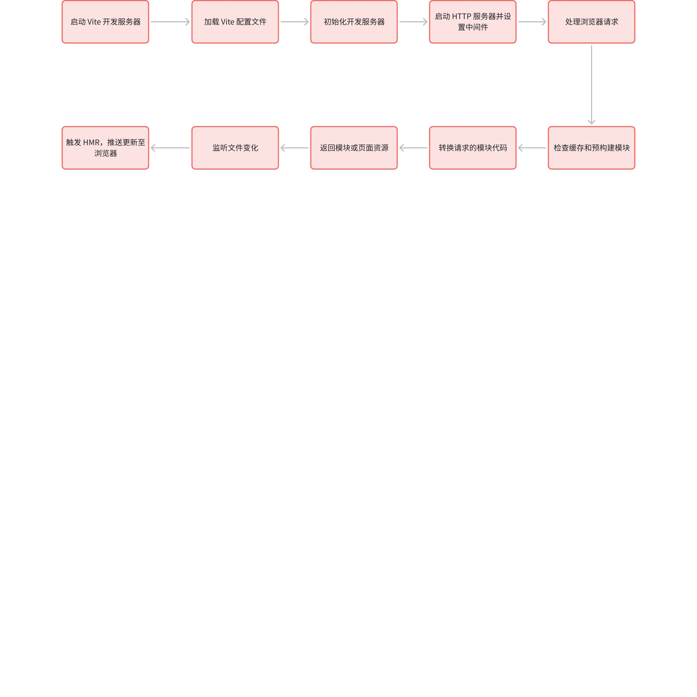
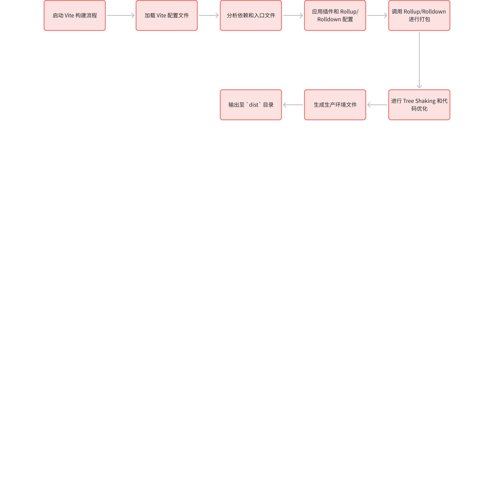

# 1.Vite 基础进阶与原理剖析

> 原文链接：[飞书原文](https://u19tul1sz9g.feishu.cn/docx/QehadVd5aodoIhxqO33cxpuhnIb)

[引用：20260207 随堂笔记与源码资料](https://www.feishu.cn/docx/HsQBdlBmsocCuExnY9Jcy99Sn2e)
[本地资源：1.vite-notes](<../../20260207 随堂笔记与源码资料-压缩包/6.前端工程化设计/1.vite-notes>)

## 课程目标

> **💡 提示**
>
> - 初中级：
>
>   1. **掌握 Vite 基础使用**：掌握 Vite 基础使用，掌握其常见配置参数
>   2. **掌握 Vite 工作原理**：掌握 Vite 工作原理，了解，掌握 Vite 打包处理过程
>   3. **掌握常见 plugin，并能自定义**：掌握常见 plugin，并了解其原理，能根据需要自定义 plugin，并理解封装实现原理
>   4. **了解 bundleless 原理**：了解 bundleless 实现原理
>   5. **了解 vite8 新特性**：rolldown 默认引入，构建与启动全面优化
> - 高级：
>
>   1. **深入 Vite 工作原理**：深入理解 Vite 执行过程与工作原理
>   2. **深入理解 Vite 插件机制**：理解 Vite 插件机制，并能根据需要封装自定义 plugin
>   3. **实现简版 Vite**：实现最核心 Vite 代码，包括基础参数处理、构建过程、优化等

## 补充资料

- Vite 官方文档：https://vitejs.dev/
- Vite 对比 Webpack等：https://vitejs.dev/guide/comparisons.html
- Vite 相关库：https://github.com/vitejs/awesome-vite
- 配置详解：https://vitejs.dev/config/
- 官方 plugin：https://vitejs.dev/plugins/
- 插件机制实现：https://github.com/vitejs/vite/tree/main/packages/vite/src/node/plugins


## 相关面试真题


### 请说说 Vite 核心概念？


**答案：**

Vite 是一种现代化的前端开发构建工具，旨在优化开发体验和构建性能。以下是 Vite 的核心概念及其详细说明，并配有示例代码以便更好地理解其工作原理。


#### **快速启动**

Vite 的设计初衷是加速开发服务器的启动过程。传统的构建工具在启动时通常需要预先构建整个项目，这会导致启动时间长，特别是对于大型项目。Vite 则利用浏览器的原生 ES 模块支持，按需加载模块。


#### **即时热更新 (HMR)**

模块热替换 (Hot Module Replacement, HMR) 是 Vite 提供的一项关键功能，当代码发生变化时，它可以在不刷新整个页面的情况下，只替换修改的模块。


#### **原生 ESM**

Vite 利用了现代浏览器对 ES 模块（ESM）的原生支持，在开发模式下直接使用 ESM 来加载模块，而不需要打包。这不仅提高了开发速度，还简化了模块化开发的复杂性。


##### 示例

在项目中直接使用 ES 模块：

```JavaScript
// main.js
import { createApp } from 'vue';
import App from './App.vue';

createApp(App).mount('#app');
```


此时，浏览器直接从 `./App.vue` 解析并加载模块，而不需要额外的打包步骤。


#### **插件体系**

Vite 拥有基于 Rollup 的插件系统，插件可以用来扩展 Vite 的功能，如处理不同类型的文件、引入额外的编译步骤等。


##### 示例

安装并使用 Vue 插件：

```Bash
npm install @vitejs/plugin-vue
```


在 `vite.config.js` 中配置插件：

```JavaScript
import { defineConfig } from 'vite';
import vue from '@vitejs/plugin-vue';

export default defineConfig({
  plugins: [vue()]
});
```


这段代码启用了 Vue 的支持，使得 Vite 可以处理 `.vue` 文件，并提供相应的热更新等功能。


#### **按需编译**

Vite 在开发模式下仅在模块被实际请求时才进行编译，这种按需编译的策略避免了不必要的工作，进一步加快了开发体验。


##### 示例

如果你有如下两个模块：

```JavaScript
// moduleA.js
export const hello = 'Hello from A';

// moduleB.js
export const hello = 'Hello from B';
```


在 `main.js` 中只引入了 `moduleA`：

```JavaScript
import { hello } from './moduleA.js';
console.log(hello);
```


在开发环境中，Vite 只会编译并加载 `moduleA.js`，而不会编译 `moduleB.js`，除非你在后续代码中实际使用了它。


#### **生产构建优化**

虽然 Vite 主要优化了开发体验，但在生产模式下，它使用 Rollup 进行打包。Rollup 是一个强大的模块打包工具，专注于优化输出文件的大小和性能。


#### **环境变量**

Vite 支持使用 `.env` 文件来管理环境变量，开发者可以根据不同的环境配置变量，并在代码中引用。


##### 示例

创建 `.env` 文件：

```Plain Text
VITE_APP_TITLE=My Vite App
```


在代码中使用：

```JavaScript
console.log(import.meta.env.VITE_APP_TITLE);  // 输出 'My Vite App'
```


Vite 会自动加载这些环境变量，并通过 `import.meta.env` 提供给代码使用。


#### **现代浏览器支持**

Vite 专注于支持现代浏览器，而不是花费大量精力去支持老旧的浏览器如 IE11。这使得它能够利用现代浏览器的最新特性，进一步提升性能和开发体验。


#### 总结

Vite 通过快速启动、即时热更新、原生 ESM、强大的插件体系、按需编译等核心概念，显著提高了前端开发效率。它专注于现代开发流程，提供了灵活的配置和优化的生产构建，是现代前端开发的理想工具。


### 说说 Vite 为什么会开发环境用 esbuild，线上构建用 rollup？


**答案：**

Vite 在开发环境使用 `esbuild`，而在生产环境使用 `Rollup`，这是基于两者的特性和设计目标所做的权衡和选择。


#### **esbuild 的速度优势**


`esbuild` 是一个极其快速的 JavaScript 和 TypeScript 打包工具，它的主要特点是使用 Go 语言编写，速度比传统的 JavaScript 打包工具（如 Webpack 和 Rollup）快数十倍。这种速度优势主要体现在以下几个方面：


- **并行编译**：`esbuild` 利用 Go 语言的并发性，可以在多核 CPU 上高效地并行编译代码。
- **优化算法**：`esbuild` 采用了高度优化的算法，在处理代码的解析和转换时更加高效。


在开发环境中，速度是关键，因为开发者频繁地修改代码，期待能即时看到变化。`esbuild` 的极致速度能够显著提升开发体验，减少等待时间。因此，Vite 选择在开发环境中使用 `esbuild` 进行模块的快速解析和转换。


#### **Rollup 的灵活性和生产构建优化**


尽管 `esbuild` 在速度上有显著优势，但在生产环境中，代码的质量和优化程度通常比构建速度更为重要。`Rollup` 在这些方面有着独特的优势：


- **Tree-shaking**：`Rollup` 以其卓越的 tree-shaking 功能而闻名。它能够准确地分析代码的依赖关系，并移除未使用的代码，这对于生成更小、更高效的生产包至关重要。
- **插件生态**：`Rollup` 拥有一个成熟且广泛的插件生态系统，允许开发者进行各种复杂的构建任务，如代码拆分、静态资源处理、环境变量注入等。它的插件机制非常灵活，能够满足不同项目的需求。
- **代码拆分**：在生产环境中，代码拆分（Code Splitting）是一个重要的优化策略。`Rollup` 对于代码拆分的支持更加成熟，可以更好地为现代应用程序生成优化的 bundle。


这些特性使得 `Rollup` 成为生成生产环境最终构建包的理想选择。尽管构建速度可能稍慢，但在生产环境下，构建过程只需要执行一次，因此速度不是首要考虑因素。


#### **平衡速度与功能**


Vite 通过在开发环境使用 `esbuild` 和在生产环境使用 `Rollup`，在开发速度和生产构建质量之间达成了良好的平衡：


- **开发环境**：`esbuild` 提供极致的构建速度，允许开发者快速迭代和调试，体验几乎即时的反馈。
- **生产环境**：`Rollup` 提供了更好的优化能力和灵活性，确保生成的代码在生产环境中性能最佳。


#### **构建流程的分离**


Vite 选择在开发和生产环境使用不同的构建工具，这也反映了一种现代前端开发工具的设计趋势，即将开发流程和生产流程分离开来。开发阶段重视速度和反馈，而生产阶段重视优化和性能，这种分离使得 Vite 能够充分利用各自工具的优势，提供最优的开发和构建体验。


#### 总结


总结来说，Vite 在开发环境中使用 `esbuild` 主要是为了利用其极快的编译速度，提升开发体验；而在生产环境中使用 `Rollup`，则是为了利用其成熟的插件体系和优化能力，确保最终构建包的质量和性能。通过结合这两种工具，Vite 在保持高效开发的同时，也能生成高度优化的生产代码。


### 说说你对 bundleless 的理解


**答案：**


“Bundleless” 是一种新兴的前端开发趋势，它的核心思想是减少或完全去除传统的打包（bundling）步骤，直接利用浏览器对现代 JavaScript 特性（尤其是 ES 模块）的原生支持。这一趋势背后的推动力包括现代浏览器的进步、开发者对更快开发反馈的需求以及更简单的开发流程。以下是对 `bundleless` 的详细理解：


#### **传统 Bundle 的问题**

传统的前端开发通常依赖于打包工具，如 Webpack、Rollup 等，将多个模块和资源打包成一个或多个文件。这些工具解决了早期浏览器无法直接处理模块化代码的问题，并优化了生产环境的资源加载。然而，随着项目规模的扩大，打包过程变得越来越复杂和缓慢，尤其是在开发阶段，开发者频繁地需要等待打包完成，影响了开发体验。


#### **ES 模块的原生支持**

现代浏览器（如 Chrome、Firefox、Safari 等）已经原生支持 ES 模块（ESM），允许开发者直接在浏览器中通过 `<script type="module">` 标签加载模块。这种原生支持使得浏览器能够直接解析和加载模块文件，无需预先打包。这种能力为 `bundleless` 提供了技术基础。


##### 示例

使用原生 ES 模块的简单示例：

```HTML
<script type="module">
  import { greet } from './greet.js';
  greet('Hello, bundleless world!');
</script>
```


在这种情况下，浏览器会自动处理 `greet.js` 模块的加载，而不需要通过打包工具将它与其他模块打包在一起。


#### **Bundleless 的优势**

- **即时开发反馈**：由于没有传统的打包步骤，开发者的代码改动可以立即反映在浏览器中，从而显著缩短反馈时间，提升开发效率。
- **简单的开发流程**：减少打包配置的复杂性，尤其适合现代的前端框架和工具，这些工具可以更轻松地与浏览器的原生模块系统集成。
- **模块按需加载**：浏览器只会在实际需要时请求模块，从而减少了不必要的代码加载，特别是在开发阶段，避免了全量打包所带来的负担。


#### **Bundleless 的挑战**

尽管 `bundleless` 模式在开发阶段有诸多优势，但在生产环境中仍面临一些挑战：

- **加载性能**：在生产环境中，直接加载多个小模块可能会导致更多的 HTTP 请求，增加了页面加载时间。为了解决这一问题，通常需要在生产环境中仍然进行某种形式的优化，例如通过 HTTP/2 多路复用或动态打包策略来减轻这一负担。
- **兼容性问题**：虽然现代浏览器都支持 ES 模块，但一些较旧的浏览器（如 IE11）不支持，这要求开发者在应用 `bundleless` 时需要确保应用只在现代浏览器中运行，或提供额外的降级方案。


#### **典型场景：开发 vs. 生产**

- **开发环境**：`bundleless` 模式非常适合开发环境。开发工具（如 Vite）通过使用 `esbuild` 等工具来提供按需加载的体验，结合浏览器的原生模块支持，实现快速的开发反馈和模块热更新。
- 
- **生产环境**：虽然开发过程中使用了 `bundleless`，但在生产环境中通常仍会进行打包优化，以减少 HTTP 请求、优化加载速度。这通常由像 Rollup 这样的工具完成。也就是说，`bundleless` 不完全排除打包，而是根据场景动态选择是否进行打包。


#### **实际应用中的 bundleless**

现代的前端开发工具如 Vite 采用了部分 `bundleless` 的理念。在开发环境中，Vite 直接使用 ES 模块系统，不进行传统的打包，而是按需加载模块；在生产环境中，它则利用 Rollup 进行优化打包，确保最终的输出包在性能和大小上达到最佳状态。这种做法结合了 `bundleless` 的即时性和打包工具的优化能力。


#### 总结

`bundleless` 是对前端开发工具和流程的一种现代化改进，旨在利用浏览器的原生特性简化开发过程，提升开发效率。然而，它并不是一个完全取代打包的模式，而是通过灵活地选择是否打包来优化不同阶段的开发体验和性能。随着浏览器技术的进步和前端开发需求的变化，`bundleless` 代表了前端开发的一种趋势，它体现了更轻量、更灵活的开发方式。


## Vite 核心与基础使用


Vite 是一个新型的前端构建工具，它在开发和构建过程中都显著提高了效率。它的核心思想是“bundleless”，即在开发阶段不进行打包操作，而是利用浏览器的原生 ES 模块（ESM）支持来实现模块加载。


- **模块化规范演进**，这就说明为啥 2015 年以前，文件满天飞，毫无工程化可言
- **浏览器 ESM**：这就说明为啥 2015 年没有 bundleless，偏偏到 2020 年
- **本地开发处理**：本地开发只打包必须要打的内容，例如：commonjs 的内容、jsx、vue （esbuild 来打）等，并存入缓存
- **产物构建处理**：产物构建使用 rollup 进行构建


Vite 的出现迎合了时代，vite 旨在提供极快的开发体验。它利用了原生的 ES 模块加载，避免了传统打包工具的预处理过程，从而极大地提高了开发速度。

以下是如何使用 Vite 从零开始初始化 React 和 Vue 项目的详细步骤，以及 Vite 常见的配置项说明。


### Vite 项目初始化


要从零到一手动搭建一个使用 Vite 的 React 或 Vue 项目，而不使用任何脚手架工具，可以按照以下步骤进行。这个过程包括创建项目目录、安装必要的依赖、配置 Vite 等等。


#### 创建项目目录


首先，创建一个新的项目目录并进入该目录：


```Bash
mkdir my-react-app
cd my-react-app
```


或者 vue 项目：


```Bash
mkdir my-vue-app
cd my-vue-app
```


#### 初始化 `package.json`


在项目目录中，初始化一个新的 Node.js 项目，这会生成一个基础的 `package.json` 文件：

```Bash
pnpm init
```


#### 安装 Vite 和开发依赖


接下来，安装 Vite 及其相关依赖。在这个步骤中，你将根据项目类型（React 或 Vue）安装相应的库。


##### React 项目

```Bash
pnpm add vite react react-dom
```


##### Vue 项目

```Bash
pnpm add vite vue
```


#### 创建项目结构


手动创建项目的基本目录结构和文件。


##### React 项目


在项目根目录下，创建 `index.html`、`src` 目录以及 `main.jsx` 和 `App.jsx` 文件：


```Bash
mkdir src
touch index.html src/main.jsx src/App.jsx
```


##### Vue 项目


在项目根目录下，创建 `index.html`、`src` 目录以及 `main.js` 和 `App.vue` 文件：


```Bash
mkdir src
touch index.html src/main.js src/App.vue
```


#### 编写基础文件


为 React 项目编写基础文件内容：


- `index.html` 文件：


```HTML
<!DOCTYPE html>
<html lang="en">
<head>
  <meta charset="UTF-8">
  <meta name="viewport" content="width=device-width, initial-scale=1.0">
  <title>My React App</title>
</head>
<body>
  <div id="root"></div>
  <script type="module" src="/src/main.jsx"></script>
</body>
</html>
```


- `src/main.jsx` 文件：


```JavaScript
import React from 'react';
import ReactDOM from 'react-dom';
import App from './App';

ReactDOM.render(<App />, document.getElementById('root'));
```


- `src/App.jsx` 文件：


```JavaScript
import React from 'react';

function App() {
  return (
    <div>
      <h1>Hello, React with Vite!</h1>
    </div>
  );
}

export default App;
```


为 Vue 项目编写基础文件内容：


- `index.html` 文件：


```HTML
<!DOCTYPE html>
<html lang="en">
<head>
  <meta charset="UTF-8">
  <meta name="viewport" content="width=device-width, initial-scale=1.0">
  <title>My Vue App</title>
</head>
<body>
  <div id="app"></div>
  <script type="module" src="/src/main.js"></script>
</body>
</html>
```


- `src/main.js` 文件：


```JavaScript
import { createApp } from 'vue';
import App from './App.vue';

createApp(App).mount('#app');
```


- `src/App.vue` 文件：


```Plain Text
<template>
  <div>
    <h1>Hello, Vue with Vite!</h1>
  </div>
</template>

<script>
export default {
  name: 'App'
};
</script>
```


#### 配置 Vite


在项目根目录下创建 `vite.config.js` 文件，并编写基本的配置：


```Bash
touch vite.config.js
```


- 对于 React 项目：


```JavaScript
import { defineConfig } from 'vite';
import react from '@vitejs/plugin-react';

export default defineConfig({
  plugins: [react()]
});
```


- 对于 Vue 项目：


```JavaScript
import { defineConfig } from 'vite';
import vue from '@vitejs/plugin-vue';

export default defineConfig({
  plugins: [vue()]
});
```


#### 修改 `package.json`


在 `package.json` 文件中添加 `scripts` 部分，以便于启动开发服务器和构建项目：


```JSON
{
  "name": "my-react-app",
  "version": "1.0.0",
  "scripts": {
    "dev": "vite",
    "build": "vite build",
    "serve": "vite preview"
  },
  "dependencies": {
    "react": "^17.0.2",
    "react-dom": "^17.0.2",
    "vite": "^4.0.0"
  }
}
```


或者对于 Vue 项目：


```JSON
{
  "name": "my-vue-app",
  "version": "1.0.0",
  "scripts": {
    "dev": "vite",
    "build": "vite build",
    "serve": "vite preview"
  },
  "dependencies": {
    "vue": "^3.2.0",
    "vite": "^4.0.0"
  }
}
```


#### 启动开发服务器


使用以下命令启动开发服务器：

```Bash
pnpm run dev
```


此时，你可以打开浏览器并访问 `http://localhost:3000`，你应该会看到一个基本的 React 或 Vue 应用。


#### 总结


通过以上步骤，你已经手动从零开始搭建了一个使用 Vite 的 React 或 Vue 项目。虽然相比于使用脚手架工具，手动搭建的步骤稍显繁琐，但这有助于理解项目的结构和配置的基本原理。


### Vite 常见配置


Vite 的配置文件通常是 `vite.config.js` 或 `vite.config.ts`，并且采用导出一个配置对象的形式。以下是 Vite 常见的配置选项说明：


#### `plugins`


`plugins` 用于扩展 Vite 功能的插件配置。


```JavaScript
import { defineConfig } from 'vite';
import vue from '@vitejs/plugin-vue';

export default defineConfig({
  plugins: [
    vue(), // Vue 支持
  ]
});
```


- `vue()`：启用 Vue.js 支持的插件。
- `react()`：启用 React 支持的插件（需要额外安装 `@vitejs/plugin-react`）。
- 其他插件：可以根据项目需求添加更多插件，比如 `vite-plugin-pwa`、`vite-plugin-compress` 等。


#### `resolve`


`resolve` 用于设置模块解析的相关选项。


```JavaScript
import { defineConfig } from 'vite';

export default defineConfig({
  resolve: {
    alias: {
      '@': '/src', // 设置 `@` 为 `/src` 的别名
    },
    extensions: ['.js', '.jsx', '.ts', '.tsx'], // 自动解析指定后缀
  }
});
```


- `alias`：用于配置模块路径的别名。可以帮助减少导入路径的复杂性。
- `extensions`：设置模块默认解析的扩展名，导入时可以省略这些扩展名。


#### `server`


`server` 用于配置开发服务器。


```JavaScript
import { defineConfig } from 'vite';

export default defineConfig({
  server: {
    host: '0.0.0.0', // 允许通过 IP 访问
    port: 3000, // 指定开发服务器的端口
    open: true, // 启动项目时自动打开浏览器
    proxy: {
      '/api': {
        target: 'https://example.com',
        changeOrigin: true,
        rewrite: (path) => path.replace(/^\/api/, '')
      }
    }
  }
});
```


- `host`：配置服务器监听的主机地址。
- `port`：设置开发服务器的端口号。
- `open`：自动打开浏览器。
- `proxy`：配置代理。当项目需要与后端 API 进行通信时，可以使用代理来解决跨域问题。


#### `build`


`build` 用于配置构建选项。


```JavaScript
import { defineConfig } from 'vite';

export default defineConfig({
  build: {
    outDir: 'dist', // 指定输出目录
    assetsDir: 'assets', // 静态资源存放目录
    sourcemap: true, // 生成 source map 文件
    rollupOptions: {
      output: {
        manualChunks(id) {
          if (id.includes('node_modules')) {
            return id.toString().split('node_modules/')[1].split('/')[0].toString();
          }
        }
      }
    },
    minify: 'terser', // 压缩选项，可以是 'terser' 或 'esbuild'
    terserOptions: {
      compress: {
        drop_console: true,
        drop_debugger: true
      }
    }
  }
});
```


- `outDir`：构建后生成文件的目录。
- `assetsDir`：静态资源（如图片、字体等）存放的目录。
- `sourcemap`：是否生成 `sourcemap` 文件，便于调试。
- `rollupOptions`：Rollup 的配置项，用于自定义打包行为。
- `minify`：压缩选项，可以选择 `terser` 或 `esbuild`。
- `terserOptions`：Terser 的配置，用于更细粒度的压缩控制。


#### `css`


`css` 用于配置 CSS 相关的选项。


```JavaScript
import { defineConfig } from 'vite';

export default defineConfig({
  css: {
    modules: {
      scopeBehaviour: 'local', // 设置全局或模块化作用域，'global' 或 'local'
    },
    preprocessorOptions: {
      scss: {
        additionalData: `@import "src/styles/variables.scss";`
      }
    }
  }
});
```


- `modules`：CSS 模块化配置。
- `preprocessorOptions`：为 CSS 预处理器提供额外的选项，例如全局导入 SCSS 变量。


#### `define`


`define` 用于定义全局常量，这些常量会在编译时被替换。


```JavaScript
import { defineConfig } from 'vite';

export default defineConfig({
  define: {
    'process.env.NODE_ENV': JSON.stringify(process.env.NODE_ENV)
  }
});
```


- `process.env.NODE_ENV`：定义全局环境变量。


#### `json`


`json` 用于配置 JSON 的处理选项。


```JavaScript
import { defineConfig } from 'vite';

export default defineConfig({
  json: {
    namedExports: true, // 支持命名导出
    stringify: false // 不自动将 JSON 转为字符串
  }
});
```


- `namedExports`：是否允许从 JSON 文件中导出命名变量。
- `stringify`：是否将 JSON 自动转换为字符串。


#### `esbuild`


`esbuild` 是 Vite 的默认打包器，你可以通过配置 `esbuild` 来自定义编译行为。


```JavaScript
import { defineConfig } from 'vite';

export default defineConfig({
  esbuild: {
    jsxInject: `import React from 'react'`, // 自动引入 React (React 17+)
    minify: true, // 启用压缩
    target: 'es2015' // 编译目标
  }
});
```


- `jsxInject`：自动注入 React 对象，无需在每个文件手动导入。
- `minify`：启用代码压缩。
- `target`：设置编译目标，如 `es2015`。


## Vite 插件配置与开发


Vite 插件扩展了 Rollup 的插件接口，并带有一些 Vite 独有的配置项。借助这些插件，你可以同时为开发和生产环境提供支持。在开始开发 Vite 插件之前，建议先了解 Rollup 插件的工作原理，尤其是它的生命周期钩子。


Vite 强调开箱即用的体验，因此在创建插件之前，先检查是否已有现成的插件或功能可以满足需求，避免重复工作。


**⛱️ 提示**

**提示：** 在开发或调试插件时，建议使用 `vite-plugin-inspect`，该插件可以帮助检查 Vite 插件的中间状态。


### 插件配置


插件通常被添加到项目的 `devDependencies` 中，并通过 `vite.config.js` 中的 `plugins` 数组进行配置。插件的配置示例如下：


```JavaScript
// vite.config.js
import vitePlugin from 'vite-plugin-feature'
import rollupPlugin from 'rollup-plugin-feature'

export default defineConfig({
  plugins: [vitePlugin(), rollupPlugin()],
})
```


Vite 的 `plugins` 配置项还支持预设多个插件组合成单个插件元素，这对实现复杂功能（如框架集成）非常有用：


```JavaScript
// 框架插件组合
import frameworkRefresh from 'vite-plugin-framework-refresh'
import frameworkDevtools from 'vite-plugin-framework-devtools'

export default function framework(config) {
  return [frameworkRefresh(config), frameworkDevtools(config)]
}

// vite.config.js
import { defineConfig } from 'vite'
import framework from 'vite-plugin-framework'

export default defineConfig({
  plugins: [framework()],
})
```


### 插件开发示例


#### 简单示例：自定义文件类型转换


一个简单的插件示例，针对特定扩展名的文件进行转换：


```JavaScript
const fileRegex = /\.(my-file-ext)$/

export default function myPlugin() {
  return {
    name: 'transform-file',

    transform(src, id) {
      if (fileRegex.test(id)) {
        return {
          code: compileFileToJS(src),
          map: null // 提供 source map（如果可行）
        }
      }
    },
  }
}
```


#### 示例：引入虚拟文件


虚拟模块是 Vite 和 Rollup 中的一种实用模式，用于在编译时传递信息。以下是创建一个虚拟模块的示例：


```JavaScript
export default function myPlugin() {
  const virtualModuleId = 'virtual:my-module'
  const resolvedVirtualModuleId = '\0' + virtualModuleId

  return {
    name: 'my-plugin',

    resolveId(id) {
      if (id === virtualModuleId) {
        return resolvedVirtualModuleId
      }
    },

    load(id) {
      if (id === resolvedVirtualModuleId) {
        return `export const msg = "from virtual module"`
      }
    },
  }
}

// 在代码中使用虚拟模块
import { msg } from 'virtual:my-module'

console.log(msg)
```


### 通用钩子与 Vite 独有钩子


插件的钩子定义集合

```JavaScript

export type OutputPluginHooks =
  | 'augmentChunkHash'
  | 'generateBundle'
  | 'outputOptions'
  | 'renderChunk'
  | 'renderDynamicImport'
  | 'renderError'
  | 'renderStart'
  | 'resolveFileUrl'
  | 'resolveImportMeta'
  | 'writeBundle';

export type InputPluginHooks = Exclude<keyof FunctionPluginHooks, OutputPluginHooks>;

export type SyncPluginHooks =
  | 'augmentChunkHash'
  | 'onLog'
  | 'outputOptions'
  | 'renderDynamicImport'
  | 'resolveFileUrl'
  | 'resolveImportMeta';

export type AsyncPluginHooks = Exclude<keyof FunctionPluginHooks, SyncPluginHooks>;

export type FirstPluginHooks =
  | 'load'
  | 'renderDynamicImport'
  | 'resolveDynamicImport'
  | 'resolveFileUrl'
  | 'resolveId'
  | 'resolveImportMeta'
  | 'shouldTransformCachedModule';

export type SequentialPluginHooks =
  | 'augmentChunkHash'
  | 'generateBundle'
  | 'onLog'
  | 'options'
  | 'outputOptions'
  | 'renderChunk'
  | 'transform';

export type ParallelPluginHooks = Exclude<
  keyof FunctionPluginHooks | AddonHooks,
  FirstPluginHooks | SequentialPluginHooks
>;

export type AddonHooks = 'banner' | 'footer' | 'intro' | 'outro';
```


#### 通用钩子


Vite 插件在开发服务器启动时会调用 Rollup 的构建钩子。以下是一些常见钩子：


- **options**：服务器启动时调用。
- **buildStart**：构建开始时调用。
- **resolveId**、**load** 、**transform** ：每个传入模块请求时调用。


注意：在开发环境中，`moduleParsed` 和 `Output Generation Hooks` 不会被调用。


#### Vite 独有钩子


Vite 还提供了独有的钩子，用于处理特定的 Vite 目标：


- **config**：在解析 Vite 配置前调用。可以返回一个部分配置对象。

  ```JavaScript
  const partialConfigPlugin = () => ({
    name: 'return-partial',
    config: () => ({
      resolve: {
        alias: {
          foo: 'bar',
        },
      },
    }),
  })
  ```


- **configResolved**：在解析 Vite 配置后调用，适合根据命令做不同处理。


```JavaScript
const examplePlugin = () => {
  let config

  return {
    name: 'read-config',
    configResolved(resolvedConfig) {
      config = resolvedConfig
    },

    transform(code, id) {
      if (config.command === 'serve') {
        // 开发环境处理
      } else {
        // 生产环境处理
      }
    },
  }
}
```


- **configureServer**：用于配置开发服务器，常用于添加自定义中间件。


```JavaScript
const myPlugin = () => ({
  name: 'configure-server',
  configureServer(server) {
    server.middlewares.use((req, res, next) => {
      // 自定义请求处理...
    })
  },
})
```


- **transformIndexHtml**：用于转换 `index.html`。


```JavaScript
const htmlPlugin = () => {
  return {
    name: 'html-transform',
    transformIndexHtml(html) {
      return html.replace(
        /<title>(.*?)<\/title>/,
        `<title>Title replaced!</title>`,
      )
    },
  }
}
```


### 复杂示例：构建产物统计输出到 Markdown 文档


以下示例展示了如何在构建完成后，输出构建产物的统计信息到 Markdown 文档中：


```JavaScript
import { writeFileSync } from 'fs'
import { resolve } from 'path'

// 新版本

export const pluginState = (): Plugin => {
  return {
    name: "plugin-stats",

    generateBundle(options, bundle) {
      const stats = [];
      for (const fileName in bundle) {
        const { code, source, ...rest } = bundle[fileName];
        console.log("🚀 ~ pluginState ~ rest:", rest);
        const { modules } = rest;
        let len = 0;
        for (const k in modules) {
          if (!Object.hasOwn(modules, k)) continue;

          const m = modules[k];
          len += m.renderedLength;
        }
        stats.push(`- **${fileName}**: ${len} bytes`);
      }

      const markdown = `# Build Stats\n\n${stats.join("\n")}\n`;
      writeFileSync(resolve(__dirname, "../dist/build-stats.md"), markdown);
    },
  };
};

// 老版本
export default function buildStatsPlugin() {
  return {
    name: 'build-stats',

    generateBundle(options, bundle) {
      const stats = []
      for (const fileName in bundle) {
        const { code, source, ...rest } = bundle[fileName]
        stats.push(`- **${fileName}**: ${rest.size} bytes`)
      }

      const markdown = `# Build Stats\n\n${stats.join('\n')}\n`
      writeFileSync(resolve(__dirname, 'build-stats.md'), markdown)
    },
  }
}

// vite.config.js
import { defineConfig } from 'vite'
import buildStatsPlugin from './build-stats-plugin'

export default defineConfig({
  plugins: [buildStatsPlugin()],
})
```


运行构建命令后，将生成一个 `build-stats.md` 文件，其中包含构建产物的统计信息。


### 插件开发中的注意事项


- **插件名称规范**：Vite 专属插件应该以 `vite-plugin-` 前缀命名，并在 `package.json` 中包含 `vite-plugin` 关键字。如果插件兼容 Rollup，建议同时包含 `rollup-plugin` 关键字。


- **插件顺序与情景应用**：通过 `enforce` 属性调整插件的执行顺序，并使用 `apply` 属性指定插件在特定模式下（如 `build` 或 `serve`）生效。


- **路径规范化**：在处理路径时，建议使用 Vite 提供的 `normalizePath` 函数，以确保路径处理在不同平台上的一致性。


- **通信与事件**：在插件中可以通过 `server.ws` 实现服务端与客户端之间的通信，支持自定义事件的发送与接收。


## Vite 原理剖析


### 整体架构设计


Vite 的整体架构由几个关键模块组成，每个模块都对应具体的源码文件：


- **开发服务器**：用于处理浏览器请求、模块解析和热更新。开发服务器的代码主要位于 `src/node/server/index.ts`。
- **模块解析与热更新**：通过模块中间件拦截请求，处理代码转换与 HMR（热模块替换）。相关代码在 `src/node/server/middlewares/moduleRewrite.ts` 和 `src/node/server/hmr.ts` 中。
- **构建工具链**：在生产环境下使用 Rollup 进行打包构建。构建相关的逻辑主要在 `src/node/build.ts` 中。
- **插件系统**：Vite 拥有插件机制，允许扩展功能，插件系统的核心逻辑位于 `src/node/plugins/index.ts`。


### 核心源码细节与对应文件


#### 开发服务器


Vite 的开发服务器是基于 Node.js 的原生 `http` 模块构建的。相关代码位于 `src/node/server/index.ts`。


- **启动 HTTP 服务器**：`createServer` 函数是启动开发服务器的入口，它调用 Node.js 的 `http.createServer` 来创建 HTTP 服务器，并注册中间件以处理各种请求。
- **处理请求**：`src/node/server/middlewares/index.ts` 负责添加中间件，其中包括模块重写、静态资源服务、热更新等功能的中间件。


#### 模块解析与转换


模块解析与转换是 Vite 的核心功能之一。它使用多个中间件来处理不同类型的模块请求。


- **模块解析**：Vite 使用 `es-module-lexer` 解析 JavaScript 中的 `import` 语句，并替换为正确的模块路径。这个过程由 `src/node/server/middlewares/moduleRewrite.ts` 处理。
- 
- **文件类型处理**：例如，`.vue` 文件的处理是在 `src/node/plugins/vue.ts` 中实现的。Vite 通过解析 `.vue` 文件并生成对应的 JavaScript 和 CSS 代码，然后将其作为 ES 模块返回给浏览器。


#### 构建工具链


生产构建使用 Rollup 进行打包，相关逻辑主要集中在 `src/node/build.ts` 中。


- **构建与 Tree Shaking**：在构建阶段，Vite 会分析项目的依赖关系，通过 Rollup 进行代码打包。Tree Shaking 是 Rollup 内置的功能，能够自动移除未使用的代码。
- 
- **优化和代码输出**：构建过程中的优化（如代码压缩、代码分割）也是在 `src/node/build.ts` 中处理的，最终生成的文件会输出到 `dist` 目录中。


### 插件化机制


Vite 的插件机制允许开发者通过插件扩展其功能。插件系统与 Rollup 的插件系统高度兼容，并在此基础上提供了一些 Vite 特有的开发时功能。


- **插件加载与执行**：插件的加载和执行在 `src/node/plugins/index.ts` 中实现。Vite 会在启动时读取配置文件中的插件列表，并在 `resolvePlugins` 函数中对其进行初始化和执行。


- **插件生命周期管理**：Vite 插件的生命周期管理函数位于 `src/node/plugins/pluginUtils.ts` 中。这里定义了 `transform`, `resolveId`, `load` 等钩子，允许插件在不同的阶段介入构建过程。


### 开发编译优化与 optimizer 处理


#### 预构建机制


Vite 在开发阶段使用预构建机制来加速模块加载，这个机制主要通过 `src/node/optimizer/index.ts` 中的代码实现。


- **依赖扫描**：Vite 会扫描项目中的依赖项，找到需要预构建的第三方模块（如 npm 包）。这由 `optimizeDeps` 函数负责，它会识别哪些模块需要进行预构建。


- **esbuild 预构建**：`src/node/optimizer/index.ts` 中的 `runOptimizer` 函数使用 esbuild 对这些模块进行打包。esbuild 的快速编译特性使得预构建能够在极短的时间内完成。


- **缓存预构建结果**：预构建的结果会被缓存到 `node_modules/.vite` 目录中。缓存逻辑在 `src/node/optimizer/esbuildDepPlugin.ts` 中处理，以避免重复构建相同的依赖项。


#### 按需加载


Vite 支持在开发过程中按需加载模块，这由 `src/node/server/middlewares/transform.ts` 中的 `transformRequest` 函数实现。


- **动态编译和加载**：当浏览器请求某个模块时，Vite 会实时编译这个模块，并将编译后的代码作为 ES 模块返回。这个过程确保了开发时的快速响应，同时避免了不必要的模块编译。


### Vite 本地开发和生产构建流程详述


#### 本地开发流程





**本地开发流程**：

- Vite 启动一个基于 Node.js `http` 模块的服务器。
- 加载配置文件，并初始化开发服务器，设置各种中间件。
- 当浏览器请求模块时，服务器检查是否已预构建该模块，若无，则实时编译并返回代码。
- 通过 WebSocket 连接，Vite 实现了热模块替换（HMR），在文件变化时通知浏览器更新相应模块。


#### 生产构建流程





**生产构建流程**：

- Vite 会先加载配置文件，并分析项目的依赖关系和入口文件。
- 应用必要的插件和 Rollup 配置后，调用 Rollup 进行打包。
- 在打包过程中，Vite 会利用 Tree Shaking 和代码分割等技术对代码进行优化。
- 最终生成优化后的生产环境文件，并输出至 `dist` 目录。


## 手写简版 Vite


要实现一个简版的 Vite 工具，我们需要分解任务，包括参数解析、代码转换、模块解析和插件机制。开发环境使用 esbuild，构建使用 rollup，同时使用 postcss 处理 CSS。下面是一个简化版的实现步骤：


### 1. 项目结构


```Plain Text
my-vite/
│
├── src/                   # 项目源码目录
│   └── main.js            # 入口文件
├── public/                # 静态文件目录
│   └── index.html         # HTML 文件
├── vite.config.js         # Vite 配置文件
├── package.json           # npm 配置文件
├── index.js               # 简版 Vite 实现入口
├── dev.js                 # 开发服务器入口
├── build.js               # 构建入口
└── plugins/               # 插件目录
    ├── plugin-esbuild.js  # esbuild 插件
    ├── plugin-postcss.js  # postcss 插件
    └── plugin-rollup.js   # rollup 插件
```


### 2. 参数解析


使用 `commander` 来解析命令行参数。你可以在 `index.js` 中初始化命令行解析。


```JavaScript
const { Command } = require('commander');
const program = new Command();

program
  .option('-m, --mode <mode>', 'Set mode (development or production)', 'development')
  .option('-e, --entry <entry>', 'Set entry file', 'src/main.js')
  .option('-c, --config <config>', 'Set config file', 'vite.config.js')
  .parse(process.argv);

const options = program.opts();

module.exports = options;
```


### 3. 开发环境使用 esbuild


在 `dev.js` 中实现一个简单的开发服务器。


```JavaScript
const esbuild = require('esbuild');
const http = require('http');
const fs = require('fs');
const path = require('path');
const options = require('./index');

const serve = async () => {
  const { entry } = options;

  const result = await esbuild.build({
    entryPoints: [entry],
    bundle: true,
    write: false,
    plugins: [require('./plugins/plugin-esbuild')()],
  });

  const server = http.createServer((req, res) => {
    if (req.url === '/') {
      const html = fs.readFileSync(path.join(__dirname, 'public', 'index.html'), 'utf8');
      res.setHeader('Content-Type', 'text/html');
      res.end(html);
    } else if (req.url.endsWith('.js')) {
      res.setHeader('Content-Type', 'application/javascript');
      res.end(result.outputFiles[0].contents);
    }
  });

  server.listen(3000, () => {
    console.log('Dev server is running at http://localhost:3000');
  });
};

serve();
```


### 4. 构建环境使用 rollup


在 `build.js` 中实现构建功能。


```JavaScript
const rollup = require('rollup');
const options = require('./index');

async function build() {
  const { entry } = options;

  const bundle = await rollup.rollup({
    input: entry,
    plugins: [require('./plugins/plugin-rollup')()],
  });

  await bundle.write({
    file: 'dist/bundle.js',
    format: 'es',
    sourcemap: true,
  });

  console.log('Build completed!');
}

build();
```


### 5. 插件机制


我们定义一个插件接口来支持 esbuild、rollup 和 postcss。


#### plugin-esbuild.js


```JavaScript
module.exports = () => {
  return {
    name: 'esbuild-plugin',
    setup(build) {
      build.onLoad({ filter: /\.css$/ }, async (args) => {
        const fs = require('fs');
        const postcss = require('postcss');
        const css = fs.readFileSync(args.path, 'utf8');
        const result = await postcss([require('autoprefixer')]).process(css, { from: undefined });
        return { contents: result.css, loader: 'css' };
      });
    },
  };
};
```


#### plugin-postcss.js


```JavaScript
const postcss = require('postcss');
const autoprefixer = require('autoprefixer');

module.exports = () => {
  return {
    name: 'postcss-plugin',
    setup(build) {
      build.onLoad({ filter: /\.css$/ }, async (args) => {
        const fs = require('fs');
        const css = fs.readFileSync(args.path, 'utf8');
        const result = await postcss([autoprefixer]).process(css, { from: undefined });
        return { contents: result.css, loader: 'css' };
      });
    },
  };
};
```


#### plugin-rollup.js


```JavaScript
const postcss = require('rollup-plugin-postcss');

module.exports = () => {
  return {
    name: 'rollup-plugin',
    plugins: [
      postcss({
        plugins: [require('autoprefixer')()],
      }),
    ],
  };
};
```


### 6. Vite 配置文件


在 `vite.config.js` 中配置 Vite。


```JavaScript
module.exports = {
  plugins: [],
};
```


### 7. 使用


```JSON
{
  "scripts": {
    "dev": "node dev.js",
    "build": "node build.js"
  },
  "devDependencies": {
    "esbuild": "^0.12.15",
    "rollup": "^2.56.3",
    "postcss": "^8.3.5",
    "autoprefixer": "^10.2.6",
    "commander": "^7.2.0"
  }
}
```


通过执行 `npm run dev` 启动开发服务器，执行 `npm run build` 进行项目构建。

当然真正 Vite 的整体内容更为复杂，可以通过以上所述，掌握最精简版 Vite 实现。
