# 3.多场景构建工具选型与原理剖析

> 原文链接：[飞书原文](https://u19tul1sz9g.feishu.cn/docx/Al7CdLA8XoRhH3xAZ96cPZjDnPd)

[引用：20260207 随堂笔记与源码资料](https://www.feishu.cn/docx/HsQBdlBmsocCuExnY9Jcy99Sn2e)
[本地资源：3.multi-bundler-notes](<../../20260207 随堂笔记与源码资料-压缩包/6.前端工程化设计/3.multi-bundler-notes>)

miaoma_rsbuild 相关 rs 依赖已更新至 0.96.0

```TypeScript
oxc_parser = "0.96.0"
oxc_allocator = "0.96.0"
oxc_ast_visit = "0.96.0"
oxc_span = "0.96.0"
```

## 课程目标

> **💡 提示**
>
> - 初中级：
>
>   1. **掌握构建工具发展史**：掌握构建工具与模块化规范发展史
>   2. **掌握 rollup 工作原理**：掌握 rollup 工作原理，并理解其核心实现
>   3. **掌握 esbuild 基础使用**：掌握 esbuild 基础使用，并能在项目构建环节引入 esbuild 进行处理
>   4. **掌握构建工具选型**：能根据不同场景，选择合适构建工具完成产物构建输出
> - 高级：
>
>   1. **掌握 esbuild 上层封装思路**：掌握 esbuild 封装思路，了解 esbuild 构建劣势以及补益办法
>   2. **了解字节 rspack 设计思路**：了解字节开源基于 rust 的构建工具 rspack，并了解其设计思路
>   3. **了解基于 rust 的工具链设计**：了解基于 rust/go 的前端工具链重构思路

## 补充资料

- 模块化规范：https://developer.mozilla.org/zh-CN/docs/Web/JavaScript/Guide/Modules
- 不同模块化规范详解：https://zh.javascript.info/modules-intro
- 早期的构建工具 grunt、gulp：https://gruntjs.com、https://gulpjs.com
- rollup、parcel：https://rollupjs.org、https://parceljs.org/
- Rollup awesome：https://github.com/rollup/awesome
- swc：https://swc.rs/
- esbuild：https://esbuild.github.io/
- esbuild 上层封装：https://tsup.egoist.dev
- tsup 处理 dts 问题：https://github.com/egoist/tsup/blob/49c11c3073ce977a01c84e7848fc070d5de0a652/src/api-extractor.ts#L27C10-L27C23
- rust 基础语法：https://doc.rust-lang.org/book/
- rspack：https://rspack.dev/zh/
- 了解 rolldown：https://github.com/rolldown/rolldown
- rust js ast parser：https://docs.rs/oxc_parser/latest/oxc_parser/#
- Trae + Lynx：https://www.trae.ai/home


## 相关面试真题


### 请说说你使用过的打包构建工具，并将他们做一个详细对比？


**答案：**


打包构建工具是现代软件开发中必不可少的，它们帮助开发者自动化构建、打包、部署等流程，提升开发效率。

不过，不同时期，构建工具略有差异，我们使用较多的构建工具包含：


1. **Gulp**
2. **Webpack**
3. **Rollup**
4. **Parcel**
5. **Vite**


每个构建工具都有其擅长的领域，我们需要知道其优势，才能在我们实际开发中选择合适的构建工具进行构建处理。


#### Gulp


**概述**:

Gulp 是一个基于流的自动化构建工具，常用于任务运行器而非模块打包。它适合处理构建流程中的多任务，例如压缩图片、编译 Sass、刷新浏览器等。


**优点**:

- **灵活性高**: Gulp 的任务系统非常灵活，能够定制化工作流。
- **广泛使用**: 在 Web 开发中广泛使用，社区和插件数量庞大。
- **流处理**: 使用 Node.js 流，实现了高效的文件处理。


**缺点**:

- **需要配置**: 与 Parcel 和 Vite 相比，Gulp 需要更多的配置来实现同样的功能。
- **不负责打包**: Gulp 更适合任务自动化，而非模块打包，通常需要配合 Webpack 或 Rollup 等工具使用。


**适用场景**:

- 自动化任务，如编译 CSS、压缩图片、热重载等。
- 项目中有特定构建任务需求，但不需要复杂的打包方案。


#### Webpack


**概述**:

Webpack 是一个高度可配置的模块打包器，广泛用于现代 JavaScript 应用程序开发。它支持代码拆分、懒加载和热模块替换等功能。


**优点**:

- **高度可定制**: 几乎可以配置任何需求，支持多种文件类型的打包，如 JS、CSS、图片、字体等。
- **生态系统完善**: 拥有丰富的插件和加载器，能够处理各种复杂需求。
- **社区支持**: 由于广泛使用，Webpack 拥有一个庞大的用户和开发者社区，文档丰富。


**缺点**:

- **配置复杂**: 初学者容易被复杂的配置文件吓到，需要花时间理解其核心概念，如入口、输出、加载器、插件等。
- **打包速度较慢**: 尤其是在大型项目中，初次打包和构建时间较长。


**适用场景**:

- 大型、复杂的单页应用程序（SPA）。
- 需要定制化打包过程的项目。


#### Rollup


**概述**:

Rollup 是一个 JavaScript 模块打包工具，专注于 ES 模块的打包，通常用于构建库和较轻量的应用。


**优点**:

- **支持 ES 模块**: Rollup 天生支持 ES6 模块，生成的代码更符合现代规范。
- **输出优化**: 生成更简洁的代码，移除无用代码（tree-shaking），减少包的大小。
- **易于配置**: 配置相对简单，不像 Webpack 那么复杂。


**缺点**:

- **生态系统较小**: 相对于 Webpack，Rollup 的插件和加载器较少，处理非 JS 资源时可能需要额外配置。
- **适合库的构建**: 主要适用于库的打包，而不是大型应用的开发和构建。


**适用场景**:

- 构建 JavaScript 库或模块。
- 小型或中型的前端项目，特别是那些依赖 ES6 模块的项目。


#### Parcel


**概述**:

Parcel 是一个零配置的打包器，目标是为开发者提供开箱即用的体验。它支持多种文件类型，并自动处理大部分构建任务。


**优点**:

- **零配置**: 几乎不需要配置即可使用，非常适合初学者。
- **速度快**: Parcel 内置了多核处理和文件系统缓存，打包速度快。
- **自动处理依赖**: Parcel 自动检测并处理各种依赖，减少开发者的配置工作。


**缺点**:

- **定制性有限**: 相比 Webpack，Parcel 的配置能力有限，不适合需要复杂定制的项目。
- **社区和插件相对较少**: 相对于 Webpack 和 Rollup，Parcel 的社区和插件数量相对较少。


**适用场景**:

- 个人项目、原型开发、小型应用。
- 需要快速上手，不愿花时间在配置上的项目。


#### Vite


**概述**:

Vite 是一个新兴的前端构建工具，采用 ES 模块来加快开发时的热重载，特别适用于现代前端框架，如 Vue、React。


**优点**:

- **极快的开发体验**: Vite 利用 ES 模块，减少了打包过程中的瓶颈，实现了极快的开发服务器启动和更新速度。
- **现代化的打包方式**: 支持对现代浏览器的优化，减少代码冗余。
- **易于使用**: 相比 Webpack 配置更加简单直观。


**缺点**:

- **生态系统较新**: 由于相对较新，Vite 的生态系统和插件数量还在发展中。
- **生产环境的优化**: 对于非常复杂的项目，可能需要结合其他工具进行优化。


**适用场景**:

- 使用 Vue.js 或 React.js 的现代前端开发。
- 需要快速迭代、开发速度敏捷的项目。


#### 总结


- **Gulp**：适合构建流程自动化，执行特定任务，而非模块打包。
- **Webpack**：适合大型、复杂应用，尤其是需要高度自定义的项目。
- **Rollup**：适合构建 JavaScript 库和模块，生成代码简洁、优化良好。
- **Parcel**：适合快速开发、个人项目，零配置上手简单。
- **Vite**：适合现代前端开发，特别是使用 Vue 或 React 的项目，提供极快的开发体验。


### 在项目架构时，怎么选择打包构建工具？


**答案：**


在选择打包构建工具时，项目的具体需求、团队的技术栈、开发者的熟悉程度、以及项目的复杂度都是需要考虑的重要因素。


#### **项目规模与复杂度**

- **大型复杂项目**：如果你的项目是一个大型复杂的单页应用程序（SPA），例如企业级应用，建议使用 **Webpack** 或 **Vite**。Webpack 的强大配置能力和丰富的插件生态系统能够满足复杂项目的各种需求，如代码拆分、缓存优化、懒加载等。
- **中小型项目或库**：如果是中小型项目或开发一个 JavaScript 库，**Rollup** 是一个理想的选择。它能够生成简洁高效的代码，特别适合库的打包和发布。
- **快速原型开发或小型项目**：如果你需要快速启动并开发一个小型项目或原型，可以选择 **Parcel** 或 **Vite** 。它们提供开箱即用的体验，减少了配置时间。


#### **开发体验**

- **快速开发迭代**：如果你的项目需要频繁迭代并要求快速响应的开发体验，**Vite** 是一个不错的选择。它在开发模式下的性能非常出色，特别适合使用现代前端框架如 Vue.js 或 React.js 的项目。
- **零配置开发**：对于不想在打包工具配置上花费太多时间的项目，**Parcel** 提供了极简的配置体验，非常适合初学者和快速原型开发。


#### **团队技术栈与经验**

- **团队的熟悉程度**：如果你的团队对某个工具已经非常熟悉，那么选择这个工具通常是明智的。比如，如果团队已经对 **Webpack** 有深入了解，那么使用 Webpack 可以更快地解决问题，避免学习曲线带来的生产力损失。
- **特定框架支持**：某些构建工具对特定框架有更好的支持。例如，**Vite** 对 Vue 和 React 提供了开箱即用的支持，使用这些框架的团队会在 Vite 上获得更好的开发体验。


#### **项目需求**

- **多页面应用**：如果你的项目是一个多页面应用程序（MPA），可能需要选择能够处理多个入口文件的工具，如 **Webpack** ，它可以轻松处理多页面打包需求。
- **现代化与未来兼容性**：如果你希望项目的打包过程尽可能现代化，并希望代码能够最大程度地兼容未来的浏览器功能，那么**Rollup 和 Vite** 可能更符合需求，它们天生支持 ES 模块，并且生成的代码更现代化。


#### **性能与优化**

- **打包体积优化**：如果你对最终打包的体积有严格的要求，例如需要生成尽可能小的 JavaScript 文件，那么 **Rollup** 的 tree-shaking 和 ES 模块支持可以帮助你最大程度地减少打包后的体积。
- **打包速度**：对于大型项目的构建速度优化，**Vite** 的开发服务器启动速度非常快，但如果是生产环境的打包优化，**Webpack** 的高级功能（如持久缓存、代码分割）仍然是一个强有力的选择。


#### **生态系统与社区支持**

- **社区与插件支持**：如果你的项目可能会有较为特殊的需求，选择一个有丰富插件生态系统的工具会更安全。**Webpack** 在这方面有比较大优势。
- **未来发展**：考量工具的未来发展方向和维护状况也很重要。**Vite** 是一个快速发展的工具，尤其适合新项目年轻团队。


#### **自动化构建与任务管理**

- **任务自动化需求**：如果项目中有大量自动化任务，比如图片压缩、文件监听、浏览器同步刷新等，可以考虑**Gulp** 。Gulp 更适合定制化的构建流程管理，而非纯粹的模块打包。


#### 综合考虑：

在选择打包构建工具时，你可以从以下几个问题出发：

1. 项目的规模和复杂度如何？
2. 团队对哪个工具最为熟悉？
3. 你的项目是否需要高度自定义的打包流程？
4. 你希望实现怎样的开发体验？
5. 项目中是否有特殊的任务自动化需求？


## 模块化规范

### 模块化雏形

在JavaScript发展初期就是为了实现简单的页面交互逻辑，而如今CPU、浏览器性能得到了极大的提升，很多页面逻辑迁移到了客户端（表单验证等），随着web2.0时代的到来，Ajax技术得到广泛应用，jQuery等前端库层出不穷，前端代码日益膨胀，此时在JS方面就会考虑使用模块化规范去管理。模块化已经发展了有十余年了，不同的工具和轮子层出不穷，但总结起来，它们解决的问题主要有三个：

1. 外部模块的管理；
2. 内部模块的组织；
3. 模块源码到目标代码的编译和转换；


#### 模块化的目的

- 将一个复杂的程序依据一定的规则(规范)封装成几个块(文件)，并进行组合在一起；
- 块的内部数据与实现是私有的, 只是向外部暴露一些接口(方法)与外部其它模块通信；

#### 模块化的进化过程

##### 全局function模式

将不同的功能封装成不同的全局函数

- 编码：将不同的功能封装成不同的全局函数
- 问题：污染全局命名空间, 容易引起命名冲突或数据不安全，而且模块成员之间看不出直接关系

```JavaScript
function m1(){
  //...
}
function m2(){
  //...
}
```

##### namespace模式

 简单对象封装

- 作用：减少了全局变量，解决命名冲突
- 问题：数据不安全(外部可以直接修改模块内部的数据)

```JavaScript
let myModule = {
  data: 'www.baidu.com',
  foo() {
    console.log(`foo() ${this.data}`)
  },
  bar() {
    console.log(`bar() ${this.data}`)
  }
}
myModule.data = 'other data' //能直接修改模块内部的数据
myModule.foo() // foo() other data
```

这样的写法会暴露所有模块成员，内部状态可以被外部改写。

##### IIFE模式

匿名函数自调用(闭包)

- 作用：数据是私有的, 外部只能通过暴露的方法操作
- 编码：将数据和行为封装到一个函数内部, 通过给window添加属性来向外暴露接口
- 问题：如果当前这个模块依赖另一个模块怎么办?

```JavaScript
// index.html文件
<script type="text/javascript" src="module.js"></script>
<script type="text/javascript">
    myModule.foo()
    myModule.bar()
    console.log(myModule.data) //undefined 不能访问模块内部数据
    myModule.data = 'xxxx' //不是修改的模块内部的data
    myModule.foo() //没有改变
</script>

// module.js文件
(function(window) {
  let data = 'www.miaomaedu.com'
  //操作数据的函数
  function foo() {
    //用于暴露有函数
    console.log(`foo() ${data}`)
  }
  function bar() {
    //用于暴露有函数
    console.log(`bar() ${data}`)
    otherFun() //内部调用
  }
  function otherFun() {
    //内部私有的函数
    console.log('otherFun()')
  }
  //暴露行为
  window.myModule = { foo, bar } //ES6写法
})(window)
```

最后得到的结果：

```JavaScript
foo() www.miaomaedu.com
bar() www.miaomaedu.com
otehrFun()
undefined
foo() www.miaomaedu.com
```


##### IIFE模式增强

这就是现代模块实现的基石

```JavaScript
// module.js文件
(function(window, $) {
  let data = 'www.baidu.com'
  //操作数据的函数
  function foo() {
    //用于暴露有函数
    console.log(`foo() ${data}`)
    $('body').css('background', 'red')
  }
  function bar() {
    //用于暴露有函数
    console.log(`bar() ${data}`)
    otherFun() //内部调用
  }
  function otherFun() {
    //内部私有的函数
    console.log('otherFun()')
  }
  //暴露行为
  window.myModule = { foo, bar }
})(window, jQuery)

 // index.html文件
<!-- 引入的js必须有一定顺序 -->
<script type="text/javascript" src="jquery-1.10.1.js"></script>
<script type="text/javascript" src="module.js"></script>
<script type="text/javascript">
  myModule.foo()
</script>
```

上例子通过jquery方法将页面的背景颜色改成红色，所以必须先引入jQuery库，就把这个库当作参数传入。这样做除了保证模块的独立性，还使得模块之间的依赖关系变得明显。


#### 模块化的好处

- 避免命名冲突(减少命名空间污染)；
- 更好的分离, 按需加载；
- 更高复用性；
- 高可维护性；


#### 引入多个<script>后出现出现问题

- 请求过多

首先我们要依赖多个模块，那样就会发送多个请求，导致请求过多；

- 依赖模糊

我们不知道他们的具体依赖关系是什么，也就是说很容易因为不了解他们之间的依赖关系导致加载先后顺序出错；

- 难以维护

以上两种原因就导致了很难维护，很可能出现牵一发而动全身的情况导致项目出现严重的问题。  
模块化固然有多个好处，然而一个页面需要引入多个js文件，就会出现以上这些问题。而这些问题可以通过模块化规范来解决，因此才有了后续的commonjs, AMD, ES6, CMD规范。


### 模块化发展时间线

构建其实是工程化、自动化思想在前端开发中的体现（个人认为狭义的工程化就是构建工具+CI/CD），将一系列流程用代码去实现，让代码自动化地执行这一系列复杂的流程。构建为前端开发注入了更大的活力，解放了我们的生产力。


1. 2009 年，Kevin Dangoor 发起了 ServerJS 项目，后更名为 **CommonJS**，其目标是指定浏览器外的 JS API 规范（例如 FS、Stream、Buffer 等）以及模块规范 Modules/1.0。这一规范也成为同年发布的 NodeJS 中的模块定义的参照规范；
2. 2011 年，RequireJS 1.0 版本发布，作为客户端的模块加载器，提供了**异步加载模块**的能力。作者在之后提交了 CommonJS 的 Module/Transfer/C 提案，这一提案最终发展为了独立的 **AMD** 规范；
3. 2013 年，Grunt、Gulp第一版相继发布，同年，面向浏览器端模块的打包工具Browserify发布；
4. 2014 年，跨平台的前后端兼容的模块化定义语法 **UMD**发布；
5. 2014 年，Sebastian McKenzie 发布了将 ES6 语法转换为 ES5 语法的工具 6to5，并在之后更名为Babel；
6. 2014 年，Guy Bedford 对外发布了 **SystemJS** 和 jspm 工具，用于简化模块加载和处理包管理；
7. 2014 年，打包工具 Webpack 发布了第一个稳定版本；
8. 2015 年，ES6（ES2015）规范正式发布，第一次从语言规范上定义了 JS 中的模块化；
9. 2015 年，Rich Harris 发布的 Rollup 项目，基于 **ES6 模块化**，提供了 Tree Shaking 的功能；
10. 2017年，鉴于当时的Webpack使用上过于繁琐，官方文档也不是很清晰明了。所以Parcel一发布就被推上了风口浪尖；
11. 2019年，snowpack将node_modules转为ESM的构建工具开始出现；
12. 2020年，随着浏览器对ESM和HTTP2的支持，bundleless思路也开始出现，esbuild此时开始出现在视野里，同时snowpack也开始内置使用esbuild；
13. 2021年，Vite出现；


由此，随着前端技术的演进，整体的构建工具也随之演进，后文主要对目前为止比较流行的构建工具进行分析，主要包括以下几类：

1. 初版构建工具；
2. 现代打包构建工具基石--webpack；
3. 基于webpack改进的构建工具；
4. 突破 JS 语言的构建工具；
5. 基于ES Module的bundleless构建工具；


### 模块化规范

#### CommonJS

##### 概念

Node 应用由模块组成，采用 CommonJS 模块规范。每个文件就是一个模块，有自己的作用域。在一个文件里面定义的变量、函数、类，都是私有的，对其他文件不可见。在服务器端，模块的加载是运行时同步加载的；在浏览器端，模块需要提前编译打包处理。

##### 特点

- 所有代码都运行在模块作用域，不会污染全局作用域；
- 模块可以多次加载，但是只会在第一次加载时运行一次，然后运行结果就被缓存了，以后再加载，就直接读取缓存结果。要想让模块再次运行，必须清除缓存；
- 模块加载的顺序，按照其在代码中出现的顺序；

##### 基本语法

- 暴露模块：`module.exports = value`或`exports.xxx = value`
- 引入模块：`require(xxx)`,如果是第三方模块，xxx为模块名；如果是自定义模块，xxx为模块文件路径


此处我们有个疑问：CommonJS暴露的模块到底是什么? CommonJS规范规定，每个模块内部，module变量代表当前模块。这个变量是一个对象，它的exports属性（即module.exports）是对外的接口。加载某个模块，其实是加载该模块的module.exports属性。

```JavaScript
// example.js
var x = 5;
var addX = function (value) {
  return value + x;
};
module.exports.x = x;
module.exports.addX = addX;
```

上面代码通过module.exports输出变量x和函数addX。

```JavaScript
var example = require('./example.js');//如果参数字符串以“./”开头，则表示加载的是一个位于相对路径
console.log(example.x); // 5
console.log(example.addX(1)); // 6
```

require命令用于加载模块文件。require命令的基本功能是，读入并执行一个JavaScript文件，然后返回该模块的exports对象。如果没有发现指定模块，会报错。


##### 模块的加载机制

CommonJS模块的加载机制是，输入的是被输出的值的拷贝。也就是说，一旦输出一个值，模块内部的变化就影响不到这个值。这点与ES6模块化有重大差异（下文会介绍），请看下面这个例子：

```JavaScript
// lib.js
var counter = 3;
function incCounter() {
  counter++;
}
module.exports = {
  counter: counter,
  incCounter: incCounter,
};
```

 

上面代码输出内部变量counter和改写这个变量的内部方法incCounter。

```JavaScript
// main.js
var counter = require('./lib').counter;
var incCounter = require('./lib').incCounter;

console.log(counter);  // 3
incCounter();
console.log(counter); // 3
```

上面代码说明，counter输出以后，lib.js模块内部的变化就影响不到counter了。这是因为counter是一个原始类型的值，会被缓存。除非写成一个函数，才能得到内部变动后的值。


##### 服务器端实现

1. 安装node
2. npm init

```JavaScript
|-modules
  |-module1.js
  |-module2.js
  |-module3.js
|-app.js
|-package.json
  {
    "name": "commonJS-node",
    "version": "1.0.0"
  }
```

1. 下载第三方模块

```JavaScript
npm install uniq --save // 用于数组去重
```

1. 定义模块代码

```JavaScript
//module1.js
module.exports = {
  msg: 'module1',
  foo() {
    console.log(this.msg)
  }
}

//module2.js
module.exports = function() {
  console.log('module2')
}

//module3.js
exports.foo = function() {
  console.log('foo() module3')
}
exports.arr = [1, 2, 3, 3, 2]

// app.js文件
// 引入第三方库，应该放置在最前面
let uniq = require('uniq')
let module1 = require('./modules/module1')
let module2 = require('./modules/module2')
let module3 = require('./modules/module3')

module1.foo() //module1
module2() //module2
module3.foo() //foo() module3
console.log(uniq(module3.arr)) //[ 1, 2, 3 ]
```

1. node app.js


##### 浏览器端实现

使用Browserify：Browserify 会对代码进行解析，整理出代码中的所有模块依赖关系，然后把相关的模块代码都打包在一起，形成一个完整的JS文件，这个文件中不会存在 require 这类的模块化语法，变成可以在浏览器中运行的普通JS

1. 创建项目结构

```JavaScript
|-js
  |-dist //打包生成文件的目录
  |-src //源码所在的目录
    |-module1.js
    |-module2.js
    |-module3.js
    |-app.js //应用主源文件
|-index.html //运行于浏览器上
|-package.json
  {
    "name": "browserify-test",
    "version": "1.0.0"
  }
```

1. 下载browserify

- 全局: `npm install browserify -g`
- 局部: `npm install browserify --save-dev`

1. 定义模块代码

注意：index.html文件要运行在浏览器上，需要借助browserify将app.js文件打包编译，如果直接在index.html引入app.js就会报错！

1. 打包处理js

根目录下运行

```JavaScript
browserify js/src/app.js -o js/dist/bundle.js
```

1. 页面使用引入

在index.html文件中引入

```JavaScript
<script type="text/javascript" src="js/dist/bundle.js"></script>
```

#### AMD（Asynchronous Module Definition）

##### 概念

CommonJS规范加载模块是同步的，也就是说，只有加载完成，才能执行后面的操作。AMD规范则是非同步加载模块，允许指定回调函数。由于Node.js主要用于服务器编程，模块文件一般都已经存在于本地硬盘，所以加载起来比较快，不用考虑非同步加载的方式，所以CommonJS规范比较适用。但是，如果是浏览器环境，要从服务器端加载模块，这时就必须采用非同步模式，因此浏览器端一般采用AMD规范。此外AMD规范比CommonJS规范在浏览器端实现要来着早。

##### 基本语法

定义暴露模块：

```JavaScript
//定义没有依赖的模块
define(function(){
   return 模块
})

//定义有依赖的模块
define(['module1', 'module2'], function(m1, m2){
   return 模块
})
```

引入使用模块：

```JavaScript
require(['module1', 'module2'], function(m1, m2){
   使用m1/m2
})
```


##### AMD实现

通过比较是否使用AMD，来说明使用AMD实际使用的效果。

###### 未使用AMD规范

```JavaScript
// dataService.js文件
(function (window) {
  let msg = 'www.miaomaedu.com'
  function getMsg() {
    return msg.toUpperCase()
  }
  window.dataService = {getMsg}
})(window)

// alerter.js文件
(function (window, dataService) {
  let name = 'miaomaedu'
  function showMsg() {
    alert(dataService.getMsg() + ', ' + name)
  }
  window.alerter = {showMsg}
})(window, dataService)

// main.js文件
(function (alerter) {
  alerter.showMsg()
})(alerter)

// index.html文件
<div><h1>Modular Demo 1: 未使用AMD(require.js)</h1></div>
<script type="text/javascript" src="js/modules/dataService.js"></script>
<script type="text/javascript" src="js/modules/alerter.js"></script>
<script type="text/javascript" src="js/main.js"></script>
```

最后得到如下结果：

```JavaScript
'WWW.miaomaedu.COM', 'miaomaedu'
```

这种方式缺点很明显：首先会发送多个请求，其次引入的js文件顺序不能搞错，否则会报错


###### 使用require.js

RequireJS是一个工具库，主要用于客户端的模块管理。它的模块管理遵守AMD规范，RequireJS的基本思想是，通过define方法，将代码定义为模块；通过require方法，实现代码的模块加载。

  
接下来介绍AMD规范在浏览器实现的步骤：

1. 下载require.js, 并引入

- 官网: http://www.requirejs.cn/
- github : https://github.com/requirejs/requirejs

然后将require.js导入项目: `js/libs/require.js`

1. 创建项目结构

```JavaScript
|-js
  |-libs
    |-require.js
  |-modules
    |-alerter.js
    |-dataService.js
  |-main.js
|-index.html
```

1. 定义require.js的模块代码

```JavaScript
// dataService.js文件
// 定义没有依赖的模块
define(function() {
  let msg = 'www.miaomaedu.com'
  function getMsg() {
    return msg.toUpperCase()
  }
  return { getMsg } // 暴露模块
})

//alerter.js文件
// 定义有依赖的模块
define(['dataService'], function(dataService) {
  let name = 'miaomaedu'
  function showMsg() {
    alert(dataService.getMsg() + ', ' + name)
  }
  // 暴露模块
  return { showMsg }
})

// main.js文件
(function() {
  require.config({
    baseUrl: 'js/', //基本路径 出发点在根目录下
    paths: {
      //映射: 模块标识名: 路径
      alerter: './modules/alerter', //此处不能写成alerter.js,会报错
      dataService: './modules/dataService'
    }
  })
  require(['alerter'], function(alerter) {
    alerter.showMsg()
  })
})()

// index.html文件
<!DOCTYPE html>
<html>
  <head>
    <title>Modular Demo</title>
  </head>
  <body>
    <!-- 引入require.js并指定js主文件的入口 -->
    <script data-main="js/main" src="js/libs/require.js"></script>
  </body>
</html>
```

1. 页面引入require.js模块

在index.html引入

```JavaScript
<script data-main="js/main" src="js/libs/require.js"></script>
```

1. 引入第三方库

```JavaScript
// alerter.js文件
define(['dataService', 'jquery'], function(dataService, $) {
  let name = 'Tom'
  function showMsg() {
    alert(dataService.getMsg() + ', ' + name)
  }
  $('body').css('background', 'green')
  // 暴露模块
  return { showMsg }
})
```

```JavaScript
// main.js文件
(function() {
  require.config({
    baseUrl: 'js/', //基本路径 出发点在根目录下
    paths: {
      //自定义模块
      alerter: './modules/alerter', //此处不能写成alerter.js,会报错
      dataService: './modules/dataService',
      // 第三方库模块
      jquery: './libs/jquery-1.10.1' //注意：写成jQuery会报错
    }
  })
  require(['alerter'], function(alerter) {
    alerter.showMsg()
  })
})()
```

上例是在alerter.js文件中引入jQuery第三方库，main.js文件也要有相应的路径配置。


###### 总结

 通过两者的比较，可以得出AMD模块定义的方法非常清晰，不会污染全局环境，能够清楚地显示依赖关系。AMD模式可以用于浏览器环境，并且允许非同步加载模块，也可以根据需要动态加载模块。


#### CMD（Common Module Definition）

##### 概念

CMD规范专门用于浏览器端，模块的加载是异步的，模块使用时才会加载执行。CMD规范整合了CommonJS和AMD规范的特点。在 Sea.js 中，所有 JavaScript 模块都遵循 CMD模块定义规范。

##### 基本语法

```JavaScript
//定义没有依赖的模块
define(function(require, exports, module){
  exports.xxx = value
  module.exports = value
})
```

```JavaScript
//定义有依赖的模块
define(function(require, exports, module){
  //引入依赖模块(同步)
  var module2 = require('./module2')
  //引入依赖模块(异步)
    require.async('./module3', function (m3) {
    })
  //暴露模块
  exports.xxx = value
})
```

```JavaScript
// 引入使用的模块
define(function (require) {
  var m1 = require('./module1')
  var m4 = require('./module4')
  m1.show()
  m4.show()
})
```


##### CMD实现

1. 下载sea.js, 并引入

- 官网: [http://seajs.org/](http://seajs.org/)
- github : [https://github.com/seajs/seajs](https://github.com/seajs/seajs)

然后将sea.js导入项目：`js/libs/sea.js`

1. 创建项目结构

```JavaScript
|-js
  |-libs
    |-sea.js
  |-modules
    |-module1.js
    |-module2.js
    |-module3.js
    |-module4.js
    |-main.js
|-index.html
```

1. 定义sea.js的模块代码

```JavaScript
// module1.js文件
define(function (require, exports, module) {
  //内部变量数据
  var data = 'miaomaedu.com'
  //内部函数
  function show() {
    console.log('module1 show() ' + data)
  }
  //向外暴露
  exports.show = show
})

// module2.js文件
define(function (require, exports, module) {
  module.exports = {
    msg: 'I am miaomaedu'
  }
})

// module3.js文件
define(function(require, exports, module) {
  const API_KEY = 'abc123'
  exports.API_KEY = API_KEY
})

// module4.js文件
define(function (require, exports, module) {
  //引入依赖模块(同步)
  var module2 = require('./module2')
  function show() {
    console.log('module4 show() ' + module2.msg)
  }
  exports.show = show
  //引入依赖模块(异步)
  require.async('./module3', function (m3) {
    console.log('异步引入依赖模块3  ' + m3.API_KEY)
  })
})

// main.js文件
define(function (require) {
  var m1 = require('./module1')
  var m4 = require('./module4')
  m1.show()
  m4.show()
})
```

1. 在index.html中引入

```JavaScript
<script type="text/javascript" src="js/libs/sea.js"></script>
<script type="text/javascript">
  seajs.use('./js/modules/main')
</script>
```

最后得到结果如下：

```JavaScript
module1 show(), miaomaedu
module4 show() I am miaomaedu
异步引入依赖模块3 abc123
```


##### AMD与CMD区别

```JavaScript
// CMD
define(function (requie, exports, module) {
    //依赖就近书写
    var module1 = require('Module1');
    var result1 = module1.exec();
    module.exports = {
      result1: result1,
    }
});

// AMD
define(['Module1'], function (module1) {
    var result1 = module1.exec();
    return {
      result1: result1,
    }
});
```

从上面的代码比较中我们可以得出AMD规范和CMD规范的区别

1. 对依赖的处理：

- AMD推崇依赖前置，即通过依赖数组的方式提前声明当前模块的依赖；
- CMD推崇依赖就近，在编程需要用到的时候通过调用require方法动态引入；

1. 在本模块的对外输出：

- AMD推崇通过返回值的方式对外输出；
- CMD推崇通过给module.exports赋值的方式对外输出；


#### ESModule

##### 概念

ES6 模块的设计思想是尽量的静态化，使得编译时就能确定模块的依赖关系，以及输入和输出的变量。`CommonJS` 和 `AMD` 模块，都只能在运行时确定这些东西。比如，CommonJS 模块就是对象，输入时必须查找对象属性。


##### 基本使用

export命令用于规定模块的对外接口，import命令用于输入其他模块提供的功能。

```JavaScript
/** 定义模块 math.js /
var basicNum = 0;
var add = function (a, b) {
    return a + b;
};
export { basicNum, add };
/ 引用模块 **/
import { basicNum, add } from './math';
function test(ele) {
    ele.textContent = add(99 + basicNum);
}
```

如上例所示，使用import命令的时候，用户需要知道所要加载的变量名或函数名，否则无法加载。为了给用户提供方便，让他们不用阅读文档就能加载模块，就要用到export default命令，为模块指定默认输出。

```JavaScript
// export-default.js
export default function () {
  console.log('foo');
}

// import-default.js
import customName from './export-default';
customName(); // 'foo'
```

模块默认输出, 其他模块加载该模块时，import命令可以为该匿名函数指定任意名字。


ES6 模块与 CommonJS 模块的差异

1.  CommonJS 模块输出的是一个值的拷贝，ES6 模块输出的是值的引用；
2. CommonJS 模块是运行时加载，ES6 模块是编译时输出接口；


第二个差异是因为 CommonJS 加载的是一个对象（即module.exports属性），该对象只有在脚本运行完才会生成。而 ES6 模块不是对象，它的对外接口只是一种静态定义，在代码静态解析阶段就会生成。

下面重点解释第一个差异，我们还是举上面那个CommonJS模块的加载机制例子:

```JavaScript
// lib.js
export let counter = 3;
export function incCounter() {
  counter++;
}
// main.js
import { counter, incCounter } from './lib';
console.log(counter); // 3
incCounter();
console.log(counter); // 4
```

ES6 模块的运行机制与 CommonJS 不一样。ES6 模块是动态引用，并且不会缓存值，模块里面的变量绑定其所在的模块。


##### ES6实现

简单来说就一句话：使用Babel将ES6编译为ES5代码，使用Browserify编译打包js。

1. 定义package.json文件

```JavaScript
 {
   "name" : "es6-babel-browserify",
   "version" : "1.0.0"
 }
```

1. 安装babel-cli, babel-preset-es2015和browserify

```Bash
npm install babel-cli browserify -g
npm install babel-preset-es2015 --save-dev
```

1. 定义.babelrc文件

```JavaScript
  {
    "presets": ["es2015"]
  }
```

1. 定义模块代码

```JavaScript
//module1.js文件
// 分别暴露
export function foo() {
  console.log('foo() module1')
}
export function bar() {
  console.log('bar() module1')
}

//module2.js文件
// 统一暴露
function fun1() {
  console.log('fun1() module2')
}
function fun2() {
  console.log('fun2() module2')
}
export { fun1, fun2 }

//module3.js文件
// 默认暴露 可以暴露任意数据类项，暴露什么数据，接收到就是什么数据
export default () => {
  console.log('默认暴露')
}

// app.js文件
import { foo, bar } from './module1'
import { fun1, fun2 } from './module2'
import module3 from './module3'
foo()
bar()
fun1()
fun2()
module3()
```

1. 编译并在index.html中引入

- 使用Babel将ES6编译为ES5代码(但包含CommonJS语法) :` babel js/src -d js/lib`
- 使用Browserify编译js : `browserify js/lib/app.js -o js/lib/bundle.js`


然后在index.html文件中引入

```JavaScript
 <script type="text/javascript" src="js/lib/bundle.js"></script> 
```

最后得到如下结果：

```JavaScript
foo() module1
bar() module1
fun1() module2
fun2() module2
默认暴露
```

1. 引入第三方库  
首先安装依赖`npm install jquery@1`，然后在app.js文件中引入

```JavaScript
//app.js文件
import { foo, bar } from './module1'
import { fun1, fun2 } from './module2'
import module3 from './module3'
import $ from 'jquery'

foo()
bar()
fun1()
fun2()
module3()
$('body').css('background', 'green')
```


#### UMD（Universal Module Definition）

是一种javascript通用模块定义规范，让你的模块能在javascript所有运行环境中发挥作用。

意味着要同时满足CommonJS, AMD, CMD的标准，以下为实现：

```JavaScript
(function(root, factory) {
    if (typeof module === 'object' && typeof module.exports === 'object') {
        console.log('是commonjs模块规范，nodejs环境')
        module.exports = factory();
    } else if (typeof define === 'function' && define.amd) {
        console.log('是AMD模块规范，如require.js')
        define(factory)
    } else if (typeof define === 'function' && define.cmd) {
        console.log('是CMD模块规范，如sea.js')
        define(function(require, exports, module) {
            module.exports = factory()
        })
    } else {
        console.log('没有模块环境，直接挂载在全局对象上')
        root.umdModule = factory();
    }
}(this, function() {
    return {
        name: '我是一个umd模块'
    }
}))
```


#### 构建产物模块化标准【面试重点】

1. CommonJS 规范主要用于服务端编程，加载模块是同步的，这并不适合在浏览器环境，因为同步意味着阻塞加载，浏览器资源是异步加载的，因此有了AMD CMD解决方案；
2. AMD 规范在浏览器环境中异步加载模块，而且可以并行加载多个模块。不过，AMD规范开发成本高，代码的阅读和书写比较困难，模块定义方式的语义不顺畅；
3. CMD 规范与AMD 规范很相似，都用于浏览器编程，**依赖就近**，延迟执行，可以很容易在 Node.js 中运行；
4. ES6 在语言标准的层面上，实现了模块功能，而且实现得相当简单，完全可以取代 CommonJS 和 AMD 规范，成为浏览器和服务器通用的模块解决方案；
5. UMD 可同时满足 CommonJS, AMD, CMD  标准的实现；


## 常见构建工具使用与原理浅析


### 初版构建工具

#### [Grunt](https://github.com/gruntjs/grunt)

Grunt 是前端（JS语言）中第一个正式的构建工具，它基于 Node.js 开发。Grunt 同样是基于插件实现功能拓展增强，但对于像webpack上很多能力，如HMR、Scope Hoist等都是不支持的，可以作为学习webpack前的了解。

Grunt 更像是一种自动化的配置工具集，就如官方所说，Grunt 是`The JavaScript Task Runner`，每个 Grunt 任务通常必须创建中间文件将结果传递给其他任务。

所能实现的功能包括：检查每个 JS 文件语法、合并两个 JS 文件、将合并后的 JS 文件压缩、将 SCSS 文件编译等，包括我们上面提到的试用gulp将.less文件转换为.css文件等等。


Gruntfile.js

```JavaScript
module.exports = function(grunt) {

  grunt.initConfig({
    pkg: grunt.file.readJSON('package.json'),
    concat: {
      options: {
        separator: ';'
      },
      dist: {
        src: ['src/**/*.js'],
        dest: 'dist/<%= pkg.name %>.js'
      }
    },
    uglify: {
      options: {
        banner: '/*! <%= pkg.name %> <%= grunt.template.today("dd-mm-yyyy") %> */\n'
      },
      dist: {
        files: {
          'dist/<%= pkg.name %>.min.js': ['<%= concat.dist.dest %>']
        }
      }
    },
    qunit: {
      files: ['test/**/*.html']
    },
    jshint: {
      files: ['Gruntfile.js', 'src/**/*.js', 'test/**/*.js'],
      options: {
        // options here to override JSHint defaults
        globals: {
          jQuery: true,
          console: true,
          module: true,
          document: true
        }
      }
    },
    watch: {
      files: ['<%= jshint.files %>'],
      tasks: ['jshint', 'qunit']
    }
  });

  grunt.loadNpmTasks('grunt-contrib-uglify');
  grunt.loadNpmTasks('grunt-contrib-jshint');
  grunt.loadNpmTasks('grunt-contrib-qunit');
  grunt.loadNpmTasks('grunt-contrib-watch');
  grunt.loadNpmTasks('grunt-contrib-concat');

  grunt.registerTask('test', ['jshint', 'qunit']);

  grunt.registerTask('default', ['jshint', 'qunit', 'concat', 'uglify']);

};
```


#### [Gulp](https://github.com/gulpjs/gulp)

Gulp跟Grunt类似，都是基于task驱动执行的，可以完成javascript/coffee/sass/less/html/image/css 等文件的的测试、检查、合并、压缩、格式化、浏览器自动刷新、部署文件生成。Gulp的优点在于Gulp更倾向于写代码的方式，但相关的插件资源不如Grunt。

同样的，现代的构建工具基本不使用Gulp了，有兴趣看官网自行学习，这里不详细介绍。


gulpfile.js

```JavaScript
const { series, parallel } = require('gulp');

function clean(cb) {
  // body omitted
  cb();
}

function css(cb) {
  // body omitted
  cb();
}

function javascript(cb) {
  // body omitted
  cb();
}

exports.build = series(clean, parallel(css, javascript));
```


### 现代构建打包工具基石

[引用：2.Webpack 基础进阶与原理剖析](https://www.feishu.cn/docx/Ng5TdoSNjoh1NExjDnFcCyjxnyh)


### 基于webpack改进的构建工具

#### [rollup](https://github.com/rollup/rollup)

Rollup 和 Webpack 都通过解析 JavaScript 的依赖树，将代码打包成适合浏览器或 Node.js 执行的指定版本 JavaScript。然而，Rollup 更轻量化，生成的代码不会像 Webpack 那样包含大量的内部结构，而是尽可能保持代码的原始状态。配置方面，Rollup 相对简单，但由于缺乏 devServer 和 HMR（热模块替换）功能，因此通常用于 JavaScript 库的开发，而非应用开发。


Rollup 主要负责将代码转码为目标 JavaScript，并且可以根据需要生成支持 UMD、CommonJS 和 ES 模块格式的代码。Vue、React、Angular 等框架的源码打包工具中都能看到 Rollup 的应用痕迹。


##### rollup使用

###### 浏览器环境使用的应用程序：


1. **无需考虑浏览器兼容问题：**

   - 开发者编写 ESM（ES模块）代码 -> Rollup 通过入口文件递归识别 ESM 模块 -> 最终生成一个或多个 `bundle.js` -> 浏览器可以直接通过 `<script type="module">` 引入并运行。


1. **需考虑浏览器兼容问题：**

   - 这种情况下会复杂一些，需要额外使用 polyfill 库，或者与 Webpack 结合使用，以确保兼容性。


###### 打包成 npm 包：


1. **ESM 模块打包：**

   - 开发者编写 ESM 代码 -> Rollup 通过入口文件递归识别 ESM 模块 -> 可以配置输出多种模块格式（如 ESM、CJS、UMD、AMD）-> 最终打包成一个或多个 `bundle.js`。


- 如果需要生成 CJS（CommonJS）格式的模块，开发者可以使用 `@rollup/plugin-commonjs` 插件。


1. **Rollup 更适合打包 JS 库：**

   - 由于 Rollup 生成的库支持 ESM 的 tree shaking（树摇优化），这有助于将库的体积最小化。因此，许多像 React、Vue 等库的源码都是用 Rollup 打包的。


###### Webpack 与 Rollup 打包的差异：


- **历史背景：** Webpack 诞生于 ESM 标准出台之前，当时浏览器只能通过 `script` 标签加载模块，且没有作用域。为了实现模块的作用域隔离，Webpack 使用了 IIFE（立即执行函数表达式），这也是为什么 Webpack 打包后的代码结构看起来比较复杂，模块之间需要通过函数来隔离作用域。


- **CJS 兼容性：** Webpack 需要在浏览器中模拟 CommonJS（CJS）的 `require` 和 `module.exports` 方法，因此注入了大量代码来实现这一功能，这也是 Webpack 打包后代码混乱的原因之一。


- **浏览器不支持 CJS 的原因：**

  1. CJS 是同步的，在 Node.js 环境下运行速度快，因为无需等待网络响应。
  2. 浏览器是客户端，需要等待服务器响应，因此不能同步执行，否则会影响用户体验。
  3. Webpack 为了兼容早期发布到 npm 的 CJS 包，保留了 IIFE 结构和代码注入，导致打包后的代码结构复杂且混乱。


- **Rollup 的优势：** Rollup 诞生于 ESM 标准出台之后，专为 ESM 设计，没有历史包袱，因此能够生成精简且没有额外注入的代码。


##### 总结

rollup在构建JavaScript方面比webpack有更大的优势：

1. 构建速度明显快于webpack；
2. 生成的代码量很小；
3. 配置方式其实非常简单；


#### [Parcel](https://github.com/parcel-bundler/parcel)

##### Parcel 介绍


Parcel 的主要特点包括：


- **零配置**：无需复杂配置，开箱即用。
- **更快的构建速度**：利用多核处理和文件系统缓存，提升构建效率。
- **自动安装依赖**：简化开发流程，提升便捷性。


与 Webpack 相比，Parcel 采用 assets 方式组织文件，可以直接构建任何类型的文件，而 Webpack 则必须以 JS 为入口组织其他文件，这在使用体验上是一种提升。


Parcel 的速度优势来自于多核处理和文件系统缓存技术，这使得二次构建更快。其缓存机制使用 C++ 编写，效率更高，类似于 Webpack 的 dll 插件。此外，虽然 Parcel 本身是零配置的，但针对 HTML、JS 和 CSS 文件的处理仍需配置 `.posthtmlrc`、`.babelrc` 和 `.postcssrc` 文件。因此，Parcel 更适合小型、简单的项目，对于定制化需求较高的项目，建议使用 Webpack，因为其社区资源更为丰富。


##### 基础使用

Parcel 以零配置著称，所以在使用方面非常方便，几乎不用配置就可以打包简单场景的代码。


##### 总结


Parcel 是一种顺应时代需求的构建工具，提供了 code splitting、HMR、sourcemap、publicPath、tree shaking、scope hoist、共享模块、UMD 等基本功能，并且官方也在持续维护。对于简单项目，Parcel 是一个值得尝试的工具。


### 突破 JavaScript 语言的构建工具

#### [Esbuild](https://github.com/evanw/esbuild)【重点了解】

可能很多同学对于Esbuild的了解停留在Vite是使用Esbuild进行预构建依赖的，这也是为什么vite编译那么快的原因之一，下文将详细介绍下Esbuild的使用。


##### 简介

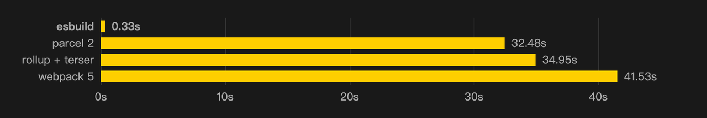

1. **使用 Go 语言**

   - JavaScript 是一种解释型语言，每次执行时，代码都需要由解释器逐行翻译成机器语言并执行。而 Go 是编译型语言，在编译阶段就将源码转译为机器码，启动时直接执行这些机器码即可。这意味着，用 Go 语言编写的程序不需要经历 JavaScript 那样的动态翻译过程，执行效率更高。


1. **多线程支持**

   - Go 天生支持多线程，在打包过程中能更高效地解析和生成代码。相比之下，JavaScript 本质上是单线程语言，即使引入了 WebWorker 规范，也只能在特定环境中实现多线程操作。此外，Go 的多个线程可以共享相同的内存空间，而 JavaScript 的线程则各自拥有独立的内存堆。这种设计使得 Go 能够在多个处理单元间直接共享数据，进一步提升运行性能。


1. **全量定制**

   - 在传统的构建工具如 Webpack 和 Rollup 中，许多功能依赖插件实现，如 Babel 用于 ES 版本转译，ESLint 用于代码检查，TSC 用于 TypeScript 转译等。Esbuild 则选择了完全重写所有编译流程中的工具，包括 JS、TS、JSX、JSON 等文件的加载、解析、链接和代码生成逻辑。这种方法虽然开发成本高，且可能带来封闭的风险，但通过从头定制，Esbuild 能够始终优先考虑性能优化。例如：
   
     - 重写 TypeScript 转译工具，放弃类型检查，仅做代码转换；
     - 将传统构建工具中多个高内聚低耦合的处理单元合并，减少数据流转，降低性能损耗；
     - 保持一致的数据结构和高效缓存策略。
   - 这种深度定制使得编译链条保持一致，并优化了各个环节的性能。尽管在功能、可读性和可维护性上有所牺牲，但 Esbuild 几乎达到了极致的编译性能。


1. **结构一致性**

   - 在 Webpack 中，使用 babel-loader 处理 JavaScript 代码时，源码可能需要多次转换：
   
     - Webpack 读取源码时是字符串形式；
     - Babel 将源码解析为 AST（抽象语法树）；
     - Babel 将高版本 AST 转换为低版本 AST；
     - Babel 再将低版本 AST 生成低版本源码（字符串形式）；
     - Webpack 解析低版本源码；
     - Webpack 将多个模块打包成最终产物。
   - 这个过程中，源码在字符串和 AST 之间反复转换，效率较低。而 Esbuild 通过重写大多数转译工具，在编译的各个阶段共享相似的 AST 结构，减少了字符串与 AST 之间的转换，提升了内存使用效率。
   - 不过，由于 Esbuild 对某些功能（如 Vue、Angular 等）的支持仍在逐步实现中，目前还不适合直接用于生产环境。但从编译性能来看，Esbuild 极具竞争力，这也是 Vite 和 Snowpack 选择 Esbuild 作为编译工具的原因之一。


##### **Esbuild 特性**


Esbuild 特性主要包括：

- 极快的构建速度，无需缓存；
- 支持 ES6 和 CommonJS 模块；
- 支持对 ES6 模块进行 tree shaking；
- API 可用于 JavaScript 和 Go；
- 兼容 TypeScript 和 JSX 语法；
- 支持 Source maps 和代码压缩；
- 支持插件系统。


Esbuild 的官方文档详细介绍了 API 的使用方法，涉及不同文件类型的 loader 配置和插件的使用。Esbuild 的插件配置相对简单，仅有四个钩子：onResolve、onLoad、onStart、onEnd，使用起来比 Webpack 更加简洁。


##### 使用示例

###### 安装 esbuild


首先，使用 npm 下载并本地安装 esbuild。esbuild 提供了预构建的本地可执行文件，可以通过以下命令安装（npm 会在安装 Node.js 运行时后自动安装）：


```Bash
npm install --save-exact --save-dev esbuild
```


这个命令会将 esbuild 安装到本地的 `node_modules` 文件夹中。你可以通过运行以下命令来验证安装是否成功：


```Bash
./node_modules/.bin/esbuild --version
```


推荐使用 npm 安装 esbuild 的本地可执行文件，但如果你不想使用 npm 进行安装，还有其他安装方式可供选择。


###### 创建第一个打包示例


以下是一个使用 esbuild 的简单示例，展示了它的基本功能。首先，安装 `react` 和 `react-dom` 包：


```Bash
npm install react react-dom
```


接着，创建一个名为 `app.jsx` 的文件，并添加以下代码：


```JavaScript
import * as React from 'react'
import * as Server from 'react-dom/server'

let Greet = () => <h1>Hello, world!</h1>
console.log(Server.renderToString(<Greet />))
```


然后，使用 esbuild 打包这个文件：


```Bash
./node_modules/.bin/esbuild app.jsx --bundle --outfile=out.js
```


此时，esbuild 会生成一个名为 `out.js` 的文件，其中包含了你的代码和 React 库的打包内容。该文件是完全自包含的，不再依赖 `node_modules` 目录。如果你使用 `node out.js` 运行该代码，你应该会看到如下输出：


```HTML
<h1 data-reactroot="">Hello, world!</h1>
```


注意，esbuild 自动将 JSX 语法转换为了 JavaScript，且无需进行任何配置。虽然 esbuild 支持配置，但它默认的配置已经足够处理许多常见场景。如果你希望在 `.js` 文件中使用 JSX 语法，可以通过 `--loader:.js=jsx` 选项来实现。更多配置选项可以参考 API 文档。


###### 构建脚本


你可能会频繁地运行构建命令，因此自动化这个过程非常有必要。可以在 `package.json` 文件中添加一个构建脚本，如下所示：


```JSON
{
  "scripts": {
    "build": "esbuild app.jsx --bundle --outfile=out.js"
  }
}
```


这个脚本直接使用 esbuild 命令，而不需要指定相对路径。因为在 `scripts` 部分中的命令会自动包含在路径中（前提是你已经安装了 esbuild）。


你可以通过以下命令运行构建脚本：


```Bash
npm run build
```


然而，当你需要为 esbuild 传递多个选项时，使用命令行界面可能会变得繁琐。对于更复杂的使用场景，建议使用 esbuild 的 JavaScript API 编写构建脚本。例如，以下代码展示了如何使用 esbuild 的 JavaScript API（注意，这段代码需要保存在 `.mjs` 扩展名的文件中，因为它使用了 `import` 关键字）：


```JavaScript
import * as esbuild from 'esbuild'

await esbuild.build({
  entryPoints: ['app.jsx'],
  bundle: true,
  outfile: 'out.js',
})
```


`build` 函数在子进程中运行 esbuild 可执行文件，并返回一个 Promise，当构建完成时该 Promise 会被解析。esbuild 还提供了同步 API `buildSync`，但异步 API 更适合构建脚本，因为插件仅在异步 API 中可用。更多关于构建 API 的配置选项可以参考 API 文档。


###### 为浏览器进行打包


esbuild 默认输出适用于浏览器的代码，因此无需额外配置即可开始。如果是开发环境，建议启用源码映射（`--sourcemap`），而在生产环境中，则建议启用代码压缩（`--minify`）。你还可以配置目标浏览器环境，以便将较新的 JavaScript 语法转换为较旧的语法。命令可能如下所示：


```Bash
esbuild app.jsx --bundle --minify --sourcemap --target=chrome58,firefox57,safari11,edge16
```


有些 npm 包可能并未设计用于浏览器环境。对于这种情况，你可以使用 esbuild 的配置选项来解决问题。例如，对于未定义的全局变量，可以使用 `define` 特性或在更复杂的情况下使用 `inject` 特性。


##### 性能对比 babel vs esbuild【重点看看】

**🍰 提示**

对比 esbuild 与 babel 的构建速度。
可以详见下图，速度相差了 200 多倍\~

构建相同内容


```JavaScript
// index.ts
import { sum } from "./sum";

interface Person {
  name: string;
  age: number;
}

export const name: string = "banner";

const say = () => {
  console.log("🚀 ~ hello 妙码");
};

say();

sum();


// sum.ts
export const sum = () => {
  console.log("🚀 ~ sum");
};

```

###### babel

```JavaScript
// babel
// package.json
{
      "scripts": {
            "build": "babel --extensions .ts src --out-dir dist"
      }
}
```

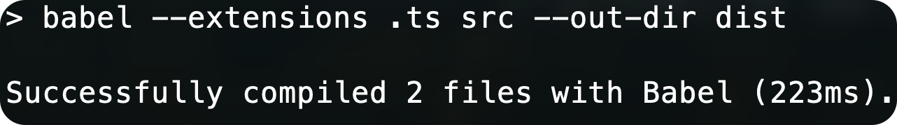


###### esbuild

```JavaScript
// package.json
{
      "scripts": {
            "build": "esbuild src/main.ts --bundle --outfile=dist/index.js"
      },
}

```

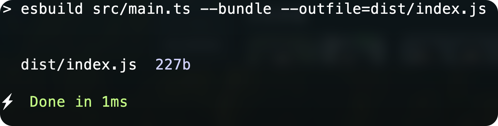


#### [SWC](https://github.com/swc-project/swc)（Speedy Web Compiler）【简单了解】

##### SWC介绍


SWC（Speedy Web Compiler）是一个由 rust 实现的快速Web编译器，主要通过多线程技术提升了JavaScript的编译性能。


在前端构建工具中，Webpack和Babel的性能瓶颈多源于JavaScript的单线程处理。为了解决这一问题，市场上出现了诸如用Go语言实现的Esbuild和用Rust语言实现的SWC等工具。其中，SWC的目标是替代Babel，其设计初衷就是对标Babel。因此，SWC实现了大多数Babel的功能。


SWC的配置方式与Babel相似。在Webpack中，SWC也提供了类似于babel-loader的swc-loader。我们可以在项目根目录下创建`.swcrc`文件，来指定常见的编译任务，如浏览器兼容性、模块化、代码压缩以及打包等，具体配置可以参考官方文档。


此外，SWC还支持插件机制，基本上能够覆盖Babel的功能。然而，目前SWC仍在不断完善中，某些功能（如@babel/types类似的功能、对TypeScript的支持等）尚不完善。因此，建议在生产环境中暂时保持观望，待功能更为成熟后再考虑全面使用。


##### SWC使用


swc 与 babel 一样，将命令行工具、编译核心模块分化为两个包。

- @swc/cli 类似于 @babel/cli；
- @swc/core 类似于 @babel/core；

```JavaScript
npm i -D @swc/cli @swc/core
```

通过如下命令，可以将一个 ES6 的 JS 文件转化为 ES5。

```JavaScript
npx swc source.js -o dist.js

const start = () => {
  console.log('app started')
}

// 转为
var start = function() {
    console.log("app started");
};
```


**配置的格式**

与babel类似，在根目录下使用.swcrc

swc 与 babel 一样，支持类似于 .babelrc 的配置文件：.swcrc，配置的格式为 JSON。

```JavaScript
{
  "$schema": "https://json.schemastore.org/swcrc",
  "jsc": {
    "parser": {
      "syntax": "ecmascript", // 还支持TS
      "jsx": false,
      "dynamicImport": false,
      "privateMethod": false,
      "functionBind": false,
      "exportDefaultFrom": false,
      "exportNamespaceFrom": false,
      "decorators": false,
      "decoratorsBeforeExport": false,
      "topLevelAwait": false,
      "importMeta": false
    },
    "transform": null,
    "target": "es5",
    "loose": false,
    "externalHelpers": false,
    // Requires v1.2.50 or upper and requires target to be es2016 or upper.
    "keepClassNames": false
  },
  "minify": false
}
```

babel 的插件系统被 swc 整合成了 jsc.parser 内的配置，基本上大部分插件都能照顾到。而且，swc 还继承了压缩的能力，通过 minify 属性开启，jsc.minify 用于配置压缩相关的规则。


**API的使用**

导入 `@swc/core` 模块，可以在 node.js 中调用 api 直接进行代码的编译

```JavaScript
import { readFileSync } from 'fs'
import { transform } from '@swc/core'

const run = async () => {
  const code = readFileSync('./source.js', 'utf-8')
        const result = await transform(code, {
    filename: "source.js",
  })
  // 输出编译后代码
  console.log(result.code)
}

run()
```

**打包**

打包的能力在V1中称为`spack`，但在 V2 中将重命名为 `swcpack`。 `spack.config.js` 将被 `swcpack.config.js `取代，但目前还没发布V2，所以目前还是使用spack。

```JavaScript
// spack.config.js
const { config } = require('@swc/core/spack')


module.exports = config({
    entry: {
        'web': __dirname + '/src/index.ts',
    },
    output: {
        path: __dirname + '/lib',
        name: 'index.js' // name可选
    },
    module: {},
});
```

其中，配置项为`spack.config.js`，接受

- mode：production | debug | none，目前还没有使用；
- entry：入口文件，可以指定文件或者文件夹映射；
- output：出口文件；

引入的文件为：

```JavaScript
// index.ts
import { B } from "./common";

console.log(B)

// common.ts
export const A = 'foo';
export const B = 'bar';
```


### 基于 ES Module 的 bundleless 构建工具

browserify、webpack、rollup、parcel这些工具的思想都是递归循环依赖，然后组装成依赖树，优化完依赖树后生成代码。  
但是这样做的缺点就是慢，需要遍历完所有依赖，即使 parcel 利用了多核，webpack 也支持多线程，在打包大型项目的时候依然慢可能会用上几分钟，存在性能瓶颈。

所以基于浏览器原生 ESM 的运行时打包工具出现：

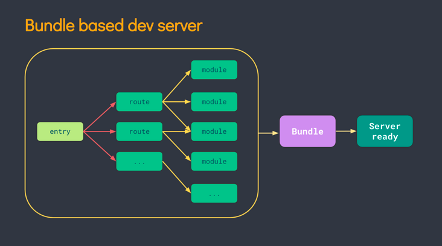

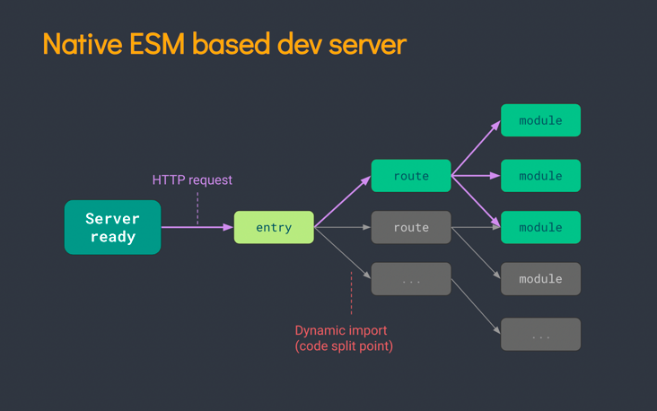

可以看到，我们只需要打包当前所需要的资源，对于而不用打包整个项目，开发时的体验相比于 bundle类的工具只能用极速来形容。bundleless类运行时打包工具的启动速度是毫秒级的，因为不需要打包任何内容，只需要起两个server，一个用于页面加载，另一个用于HMR的WebSocket，当浏览器发出原生的ES module请求，server收到请求只需编译当前文件后返回给浏览器不需要管依赖。


#### bundleless 诞生背景

bundleless 的诞生取决于客户端模块化特性支持以及网络层新特性。


##### HTTP2

因为http1.x不支持多路服用， HTTP 1.x 中，如果想并发多个请求，必须使用多个 TCP 链接，且浏览器为了控制资源，还会对单个域名有 6-8个的TCP链接请求的限制。因此我们需要做的就是将同域的一些静态资源比如js等，做一个资源合并，将多次请求不同的js文件，合并成单次请求一个合并后的大js文件。其实这也就是webpack的bundle由来。

而HTTP2实现了TCP链接的多路复用，因此同域名下不再有请求并发数的限制，我们可以同时请求同域名的多个资源，这个并发数可以很大，比如并发10，50，100个请求同时去请求同一个服务下的多个资源。（虽然实际效果有待考量），因为http2实现了多路复用，因此一定程度上，将多个静态文件打包到一起，从而减少请求次数，就不是必须的。

主流浏览器对HTTP2的支持情况如下：

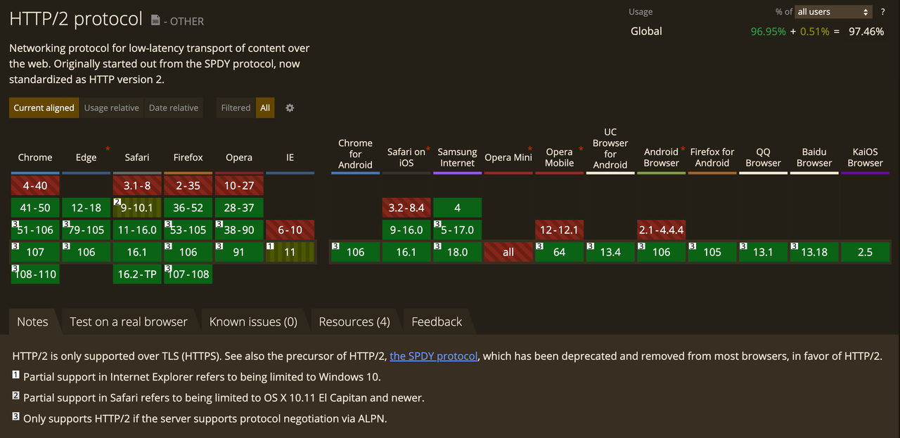

除了IE以外，大部分浏览器对HTTP2的支持程度都很好，所以如果不用考虑兼容IE低版本，同时也不需要兼容低版本浏览器，不需要考虑不支持HTTP2的场景，所以在此情况下，让我们在使用bundleless上成为了可能。


##### 浏览器ESM

先来简单看下ESM的代码例子：

```JavaScript
//main.j
import a from 'a.js'
console.log(a)
//a.js
export let  a = 1
```

上述的ESM就是我们经常在项目中使用的ESM，在支持es6的浏览器中是可以直接使用的。

```JavaScript
<html  lang="en">
    <body>
        <div id="container">my name is {name}</div>
        <script type="module">
           import Vue from 'https://cdn.jsdelivr.net/npm/vue@2.6.12/dist/vue.esm.browser.js'
           new Vue({
             el: '#container',
             data:{
                name: 'Bob'
             }
           })
        </script>
    </body>
</html>
```

上述的代码中我们直接可以运行，我们根据script的`type="module"`可以判断浏览器支不支持ESM,如果不支持，该script里面的内容就不会运行。

首先我们来看主流浏览器对于ESM的支持情况：

 

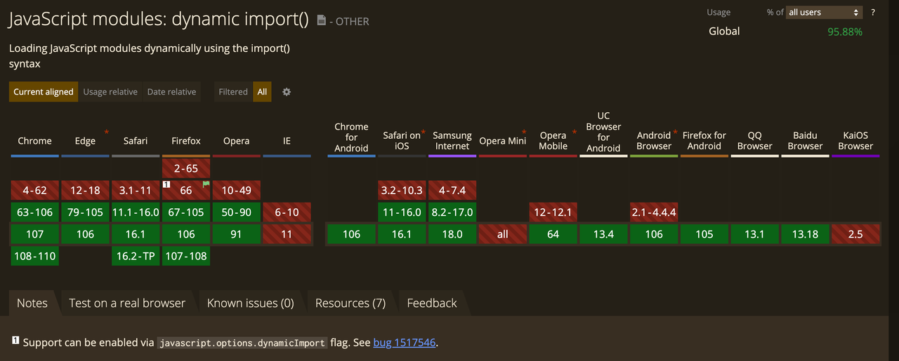

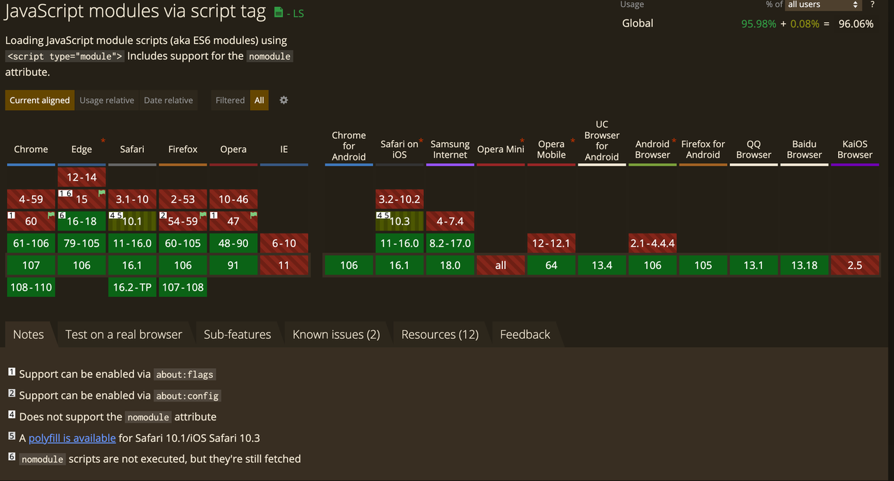

从上图可以看出来，主流的Edge, Chrome, Safari, and Firefox (+60)等浏览器都已经开始支持ESM。


##### 总结

浏览器对于HTTP2和ESM的支持，使得我们可以减少模块的合并，以及减少对于js模块化的处理。

- 如果浏览器支持HTTP2，那么一定程度上，我们不需要合并静态资源；
- 如果浏览器支持ESM，那么我们就不需要通过构建工具去维护复杂的模块依赖和加载关系；


#### [Snowpack](https://github.com/FredKSchott/snowpack)【仅了解】

##### Snowpack介绍

Snowpack 是一个用于提升 Web 开发效率的轻量级新型构建工具。

在开发过程中，Snowpack 为你的项目提供了免打包式(unbundled development) 的服务。每个文件只需构建一次就被永远缓存起来。当文件发生变化时，Snowpack 重新构建发生变化的文件然后在浏览器中直接更新，而没有在重新打包上浪费时间(通过模块热替换(HMR)实现)。

Snowpack 为你带来了两全其美的效果: 快速、免打包式的开发，以及打包式生产构建中的优化性能。

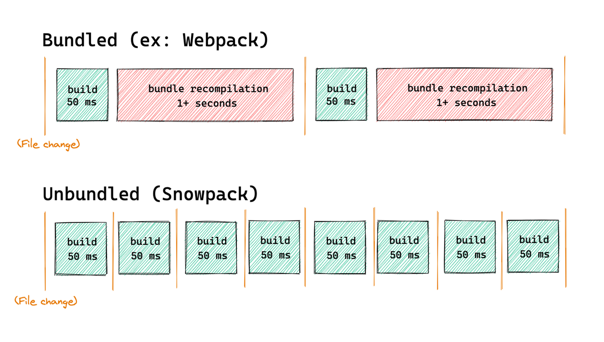

针对npm依赖，NPM 包主要是使用模块语法（Common.js，或 CJS）发布的，如果没有一些构建处理，就不能在浏览器上运行。虽然用浏览器原生的 ESMimport和export语句编写的代码会直接在浏览器中运行，但在导入 npm 包后你都会退回到打包式开发时代。

Snowpack 采取了一种不同的方法： Snowpack 没有因为这个打包整个应用程序，而是单独处理 npm 依赖。以下是它的工作原理。

```JavaScript
node_modules/react//*     -> http://localhost:3000/web_modules/react.js
node_modules/react-dom//* -> http://localhost:3000/web_modules/react-dom.js
```

1. Snowpack 扫描网站/应用程序引入的所有 npm 包；
2. Snowpack 从node_modules目录中读取这些已安装的依赖包；
3. Snowpack 将所有 npm 依赖分别打包到单个 JavaScript 文件中，例如：react和react-dom分别转换为react.js和react-dom.js；
4. 每个转换来的文件在经过 ESM 的import语句导入后，都可以直接在浏览器中运行；
5. 因为 npm 依赖很少改变，Snowpack 很少需要重建它们；

在 Snowpack 执行完对 npm 依赖的处理后，任何包都可以被导入并直接在浏览器中运行，不需要额外的打包或工具。这种在浏览器中原生导入 npm 包的能力（无需打包器）是所有免打包式开发工具和 Snowpack 建立的基础。


##### Snowpack原理

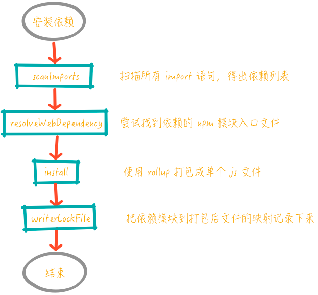

1. snowpack 会扫描工作目录下所有源码，得出所有的依赖列表。具体来说，对于 css、less、sass、scss 文件，会扫描所有的 @import 语句，对于 html、svelte、vue 文件，会扫描所有 <script> 标签内的 import 语句；对于 js、jsx、mjs、ts、tsx 文件，会解析所有的 import 语句，得到依赖的 npm 模块名称。
2. 接下来，根据依赖模块名称，尝试去找 npm 模块入口文件。采用的策略和 node 依赖查找机制类似，找到 package.json 文件后，先找 export map 指定的入口文件，再依次找 browser:module、module、main:esnext、browser、main 等字段，保证优先使用 ESM 入口。
3. 使用 rollup 打包，将依赖的模块打包成一个个 ESM，从而可以直接在浏览器运行，输出到缓存目录（默认是 ./node_modules/.cache/snowpack/dev）下。这一步打包操作也可以同时避免 ESM 依赖地狱的问题。（试想一下，如果不对依赖模块提前打包，而是通过一个个 HTTP 请求来加载 node_modules 下所有模块的场景）
4. 最后把依赖的模块与打包后文件绝对路径的映射记录下来，后面构建文件阶段根据这个映射对业务代码中原有的 import 语句进行改写。

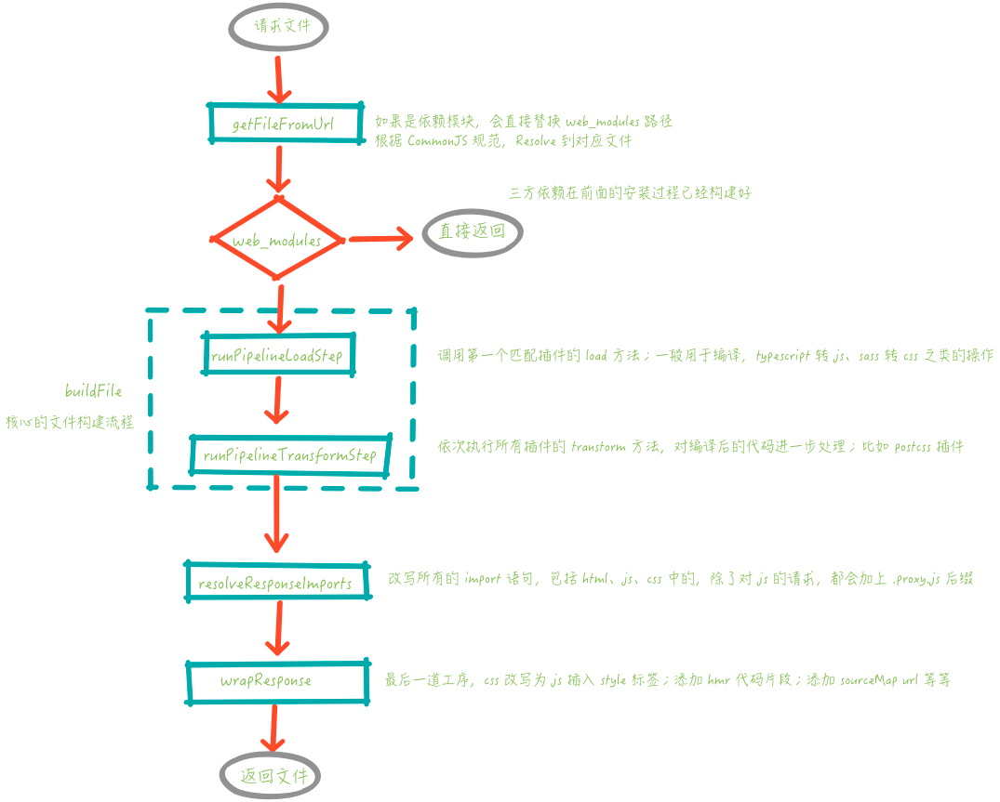

首先，如果是对依赖模块的请求，会直接返回之前构建好的 ESM。

接下来，对于业务代码的处理，则会先经过文件的编译过程。这一过程是由不同的插件来实现，分为 load 和 transform 两个阶段。load 阶段是将业务代码编译成为浏览器可以直接运行的代码，比如 TypeScript、JSX 到 JS，Sass 到 CSS。transform 是对编译后代码做进一步的处理，典型的比如 PostCss


##### 使用esbuild

mjs、jsx、ts、tsx 这几种格式的脚本文件浏览器是无法直接执行的，为此，snowpack 内置了一个 esbuild 插件，如果用户没有显式指定用于处理 mjs、jsx、ts、tsx 的插件，那么这个内置的插件就会生效，用 esbuild 进行这几类文件的编译，从而默认支持 TypeScript、JSX：

```JavaScript
// add internal JS handler plugin if none specified
const needsDefaultPlugin = new Set(['.mjs', '.jsx', '.ts', '.tsx']);
plugins
  .filter(({resolve}) => !!resolve)
  .reduce((arr, a) => arr.concat(a.resolve!.input), [] as string[])
  .forEach((ext) => needsDefaultPlugin.delete(ext));
if (needsDefaultPlugin.size > 0) {
  plugins.unshift(execPluginFactory(esbuildPlugin, {input: [...needsDefaultPlugin]}));
}
```

esbuild 插件的实现，其实就是在 load 阶段使用 esbuild 进行编译：

```JavaScript
export function esbuildPlugin(config: SnowpackConfig, {input}: {input: string[]}): SnowpackPlugin {
  return {
    name: '@snowpack/plugin-esbuild',
    resolve: {
      input,
      output: ['.js'],
    },
    async load({filePath}) {
      esbuildService = esbuildService || (await startService());
      const contents = await fs.readFile(filePath, 'utf-8');
      const isPreact = checkIsPreact(filePath, contents);
      const {js, jsSourceMap, warnings} = await esbuildService!.transform(contents, {
        loader: getLoader(filePath),
        jsxFactory: isPreact ? 'h' : undefined,
        jsxFragment: isPreact ? 'Fragment' : undefined,
        sourcefile: filePath,
        sourcemap: config.buildOptions.sourceMaps,
      });
      return {
        '.js': {
          code: js || '',
          map: jsSourceMap,
        },
      };
    },
    cleanup() {
      esbuildService && esbuildService.stop();
    },
  };
}
```


#### [Vite](https://github.com/vitejs/vite)

[引用：1.Vite 基础进阶与原理剖析](https://www.feishu.cn/docx/QehadVd5aodoIhxqO33cxpuhnIb)


#### rspack

`rspack` 是一个快速的 JavaScript 和 TypeScript 构建工具，它的设计灵感来源于 Webpack，但使用了 Rust 编写，因而在性能上有很大的提升。`rspack` 支持 React 应用的打包，在构建速度和体积优化上都有显著优势。下面介绍 `rspack` 在 React 应用中的基础使用及其工作原理。


##### 基础使用


1. **安装 rspack**


   首先需要在项目中安装 `rspack` 及其相关插件：


```Bash
npm install --save-dev @rspack/core @rspack/cli @rspack/plugin-react
```


1. **配置 rspack**


   在项目根目录下创建 `rspack.config.js` 文件，配置 `rspack` 打包规则：


```JavaScript
const path = require('path');
const ReactPlugin = require('@rspack/plugin-react').default;

module.exports = {
  entry: './src/index.jsx',  // 入口文件
  output: {
    path: path.resolve(__dirname, 'dist'),  // 输出目录
    filename: 'bundle.js',  // 输出文件名
  },
  module: {
    rules: [
      {
        test: /\.jsx?$/,  // 处理 .js 和 .jsx 文件
        exclude: /node_modules/,
        use: 'babel-loader',
      },
      {
        test: /\.css$/,  // 处理 CSS 文件
        use: ['style-loader', 'css-loader'],
      },
    ],
  },
  plugins: [
    new ReactPlugin(),  // 使用 React 插件
  ],
  resolve: {
    extensions: ['.js', '.jsx'],  // 解析文件扩展名
  },
  mode: 'development',  // 开发模式
};
```


1. **添加脚本命令**


   在 `package.json` 中添加构建命令：


```JSON
{
  "scripts": {
    "build": "rspack"
  }
}
```


1. **运行构建**


   使用命令进行构建：


```Bash
npm run build
```


   运行后，`rspack` 会在 `dist` 目录下生成打包后的文件。


##### 原理分析


`rspack` 的核心思想与 Webpack 类似，通过模块化的方式将应用的各个部分进行打包，但 `rspack` 通过以下几个关键点提升了性能：


1. **Rust 的高性能优势**：`rspack` 使用 Rust 语言实现，Rust 的编译器优化和内存安全特性，使得构建过程更加高效，并减少了内存泄漏的可能性。


1. **多线程并行处理**：`rspack` 天生支持多线程并行处理，这在大型项目中表现尤为明显，能够显著减少构建时间。


1. **依赖分析与缓存优化**：`rspack` 通过高效的依赖分析和缓存机制，减少了重复构建的时间，使得增量构建更为迅速。


1. **与 Webpack 高度兼容**：`rspack` 的配置和插件机制与 Webpack 类似，大多数 Webpack 插件可以直接使用，这降低了迁移成本。


## esbuild 封装【进阶，较难】


我们的目标是，通过 `esbuild` 封装一个类似 `tsup` 的工具，我们主要需要处理一下问题：

1. 工程化设计
2. 基础 api 封装
3. Typescript 支持
4. dts 生成（esbuild 没这个能力，需借助 tsc，可以看看 tsup 实现思路）
5. css 等静态资源处理
6. chunk 与 tree shaking
7. 落地优化与发布


### 项目初始化


首先，我们创建一个新的 Node.js 项目，并初始化 `package.json`：


```Bash
mkdir miaoma-esbuilder
cd miaoma-esbuilder
npm init -y
```


接下来，我们安装必需的依赖：


```Bash
npm install esbuild react react-dom --save
npm install typescript @types/react @types/react-dom --save-dev
```


### 配置 TypeScript


我们需要为 TypeScript 项目设置 `tsconfig.json`，以确保项目的类型检查和构建配置正确：


```JSON
// tsconfig.json
{
  "compilerOptions": {
    "target": "ESNext",
    "module": "ESNext",
    "jsx": "react-jsx",
    "strict": true,
    "esModuleInterop": true,
    "skipLibCheck": true,
    "forceConsistentCasingInFileNames": true,
    "moduleResolution": "node",
    "resolveJsonModule": true,
    "isolatedModules": true,
    "noEmit": true
  },
  "include": ["src"]
}
```


### 编写基本的 `esbuild` 封装


创建 `build.ts` 文件，开始编写 `esbuild` 的封装逻辑。


```TypeScript
// build.ts
import esbuild from 'esbuild';

async function build() {
  await esbuild.build({
    entryPoints: ['src/index.tsx'],
    outdir: 'dist',
    bundle: true,
    minify: true,
    sourcemap: true,
    format: 'esm',
    target: ['esnext', 'chrome58', 'firefox57'],
    jsxFactory: 'React.createElement',
    jsxFragment: 'React.Fragment',
    define: {
      'process.env.NODE_ENV': JSON.stringify(process.env.NODE_ENV || 'development'),
    },
    loader: {
      '.png': 'file',
      '.svg': 'file',
      '.css': 'css',
    },
    splitting: true,
    watch: process.env.NODE_ENV === 'development',
  });
}

build().catch(() => process.exit(1));
```


### 增加 TypeScript 支持


虽然 `esbuild` 自带 TypeScript 支持，但我们也需要添加类型检查步骤。可以在 `package.json` 的 `scripts` 部分添加一个 TypeScript 类型检查的命令：


```JSON
// package.json
{
  "scripts": {
    "type-check": "tsc --noEmit",
    "build": "node build.js",
    "start": "npm run type-check && npm run build"
  }
}
```


### dts 生成

通常使用 esbuild，都需要额外编写逻辑以支持 dts 的生成，`tsup` 选用的是 `rollup` 来实现，我们可以借助 `rollup-plugin-flat-dts` 来实现。

```JavaScript
const css = require("rollup-plugin-import-css");
const swc = require("@rollup/plugin-swc");
const { dts } = require("rollup-plugin-dts");
const flatDts = require("rollup-plugin-flat-dts");

module.exports = [
  {
    input: "src/main.ts",
    output: {
      clean: true,
      file: "es/bundle.js",
      format: "es", // "amd", "cjs", "system", "es", "iife" or "umd"
      plugins: [
        flatDts({
          compilerOptions: {
            declarationMap: true /* Generate declaration maps */,
          },
        }),
      ],
    },
  }
];

```


###  增加 CSS 和静态资源支持


如果项目中包含 CSS 或其他静态资源文件，你可以利用 `esbuild` 的 `loader` 选项来处理这些文件。在前面的 `build.ts` 中已经展示了这个功能。可以使用 `esbuild-css-modules-plugin` 来实现


### 实现代码拆分和 Tree Shaking


通过配置 `splitting: true` 和 `format: 'esm'`，你可以启用代码拆分。

`esbuild` 会自动执行 Tree Shaking，所以未使用的代码不会被打包到最终构建产物中。


### 完整工程化流程


到此为止，你已经创建了一个基本的类似 `tsup` 的工具，并且支持 React 项目构建、TypeScript、静态资源、代码拆分、Tree Shaking 等关键功能。这个工具可以通过命令行或配置文件灵活配置，以适应不同项目的需求。通过持续迭代和增加更多功能（如插件系统），你可以将其打造成一个强大的构建工具。


为了将你的工具工程化并且命名为 `miaoma-esbuilder`，我们可以设计一个合理的文件夹结构，使得项目结构清晰、易于维护和扩展。以下是建议的文件夹结构：


```Plain Text
miaoma-esbuilder/
│
├── src/
│   ├── cli.ts             # 命令行入口文件
│   ├── builder.ts         # 核心构建逻辑封装
│   ├── config.ts          # 配置文件解析和默认配置
│   ├── plugins/           # 插件系统目录（未来扩展用）
│   │   ├── index.ts       # 插件系统入口
│   │   └── examplePlugin.ts # 示例插件
│   └── utils.ts           # 工具函数
│
├── bin/
│   └── miaoma-esbuilder.js # CLI 可执行文件（构建后的）
│
├── dist/                  # 构建输出目录（可忽略）
│
├── examples/              # 示例项目目录
│   └── basic-react-app/   # 示例 React 应用
│       ├── src/
│       │   ├── index.tsx
│       │   └── App.tsx
│       ├── public/
│       └── .miaoma-esbuilderrc.js # 示例配置文件
│
├── .gitignore             # Git 忽略文件
├── package.json           # npm 包信息
├── README.md              # 项目说明文档
├── tsconfig.json          # TypeScript 配置
└── .eslintrc.js           # ESLint 配置（可选）
```


#### 详细说明


1. **`src/` 目录**

   - `cli.ts`: 负责解析命令行参数和启动构建流程。
   - `builder.ts`: 核心构建逻辑的实现，包括 `esbuild` 的配置和调用。
   - `config.ts`: 负责解析用户的配置文件 `.miaoma-esbuilderrc.js`，并提供默认配置。
   - `plugins/`: 插件系统的目录，未来可以扩展你的工具，允许用户编写自定义插件。
   
     - `index.ts`: 插件系统的入口，可以加载和管理插件。
     - `examplePlugin.ts`: 示例插件，实现一些自定义构建逻辑。
   - `utils.ts`: 存放一些通用的工具函数，比如路径处理、日志输出等。


1. **`bin/` 目录**

   - `miaoma-esbuilder.js`: 最终打包的 CLI 可执行文件，这个文件会通过 npm `bin` 字段指定为可执行文件，用户可以通过全局命令 `miaoma-esbuilder` 来使用。


1. **`dist/` 目录**

   - `dist/`: 构建输出目录，通常用于存放生成的文件。这个目录会被自动生成，一般会添加到 `.gitignore` 中以防止提交到版本控制系统中。


1. **`examples/` 目录**

   - `basic-react-app/`: 一个基本的 React 示例应用，用来展示和测试 `miaoma-esbuilder` 的构建功能。包含 `src/` 代码、`public/` 静态资源目录和一个 `.miaoma-esbuilderrc.js` 配置文件。


1. **根目录文件**

   - `.gitignore`: 忽略不需要的文件和目录（例如 `node_modules/`、`dist/`）。
   - `package.json`: 包含项目的元数据，如包名、版本、依赖、脚本等。
   - `README.md`: 项目说明文档，用于描述项目的用途、安装、使用方法等。
   - `tsconfig.json`: TypeScript 配置文件，定义了 TypeScript 编译选项。
   - `.eslintrc.js`: 可选的 ESLint 配置文件，用于保持代码风格的一致性。


#### 核心代码示例


为了更好地理解这个文件夹结构，我们可以看几个核心文件的内容：


##### `src/cli.ts`


```TypeScript
#!/usr/bin/env node

import { build } from './builder';
import { loadConfig } from './config';

async function run() {
  const config = loadConfig();
  await build(config);
}

run().catch(err => {
  console.error(err);
  process.exit(1);
});
```


##### `src/builder.ts`


```TypeScript
import esbuild from 'esbuild';
import { Config } from './config';

export async function build(config: Config) {
  for (const fmt of config.format) {
    await esbuild.build({
      entryPoints: [config.entry],
      outdir: config.outDir,
      bundle: true,
      minify: config.minify,
      sourcemap: config.sourcemap,
      format: fmt,
      splitting: config.splitting,
      target: ['esnext', 'chrome58', 'firefox57'],
      jsxFactory: 'React.createElement',
      jsxFragment: 'React.Fragment',
      define: {
        'process.env.NODE_ENV': JSON.stringify(process.env.NODE_ENV || 'development'),
      },
      loader: {
        '.png': 'file',
        '.svg': 'file',
        '.css': 'css',
      },
      watch: process.env.NODE_ENV === 'development',
    });
  }
}
```


##### `src/config.ts`


```TypeScript
import path from 'path';
import fs from 'fs';

export interface Config {
  entry: string;
  outDir: string;
  format: ('esm' | 'cjs')[];
  minify: boolean;
  sourcemap: boolean;
  splitting: boolean;
}

export function loadConfig(): Config {
  const configPath = path.resolve(process.cwd(), '.miaoma-esbuilderrc.js');
  if (fs.existsSync(configPath)) {
    return require(configPath);
  }
  throw new Error('Config file .miaoma-esbuilderrc.js not found');
}
```


##### `bin/miaoma-esbuilder.js`


这将是通过 `tsc` 编译后的 `src/cli.ts`，并设置为可执行文件。


#### 最后步骤


1. **创建可执行文件**在 `package.json` 中的 `bin` 字段设置 `miaoma-esbuilder` 的路径：


```JSON
{
  "bin": {
    "miaoma-esbuilder": "./bin/miaoma-esbuilder.js"
  }
}
```


1. **打包和发布**编译 TypeScript 代码，并将最终的可执行文件放置在 `bin/` 目录中。你可以使用 `tsc` 编译整个项目：


```Bash
tsc
```


### 添加插件支持（可选）


为了让用户可以扩展工具功能，你可以设计一个插件系统。插件可以在构建前或构建后执行自定义逻辑，或通过 `esbuild` 的插件 API 扩展其功能。

插件系统的实现可以在后续版本中逐步添加，增强工具的可扩展性和灵活性。


## 基于 rust 的前端工具链重构【浅浅了解】


### Rust 环境安装


#### 安装 Rust

Rust 提供了一个非常方便的安装工具 `rustup`，可以通过以下命令安装 Rust：


```Bash
curl --proto '=https' --tlsv1.2 -sSf https://sh.rustup.rs | sh
```


这个命令会安装 Rust 编译器 `rustc`、包管理工具 `cargo` 以及其他相关工具。


#### 配置环境变量

安装完成后，确保将 Rust 的路径添加到系统的 `PATH` 环境变量中。一般情况下，Rust 安装程序会自动配置这个变量。如果没有配置好，可以手动添加：


```Bash
export PATH="$HOME/.cargo/bin:$PATH"
```


#### 验证安装

通过以下命令验证 Rust 是否安装成功：


```Bash
rustc --version
```


输出的版本号表明 Rust 已成功安装。


### 初始化 Rust 项目


#### 使用 Cargo 创建项目

`cargo` 是 Rust 的包管理和构建工具。我们可以使用 `cargo` 来创建一个新的 Rust 项目。


在终端中执行以下命令：


```Bash
cargo new miaoma_rsbuild --bin
```


`--bin` 参数表示创建的是一个二进制项目，而不是库项目。


#### 进入项目目录

创建完成后，进入项目目录：


```Bash
cd miaoma_rsbuild
```


此时，项目结构如下：


```Plain Text
miaoma_rsbuild
├── Cargo.toml
└── src
    └── main.rs
```


`Cargo.toml` 文件是项目的配置文件，`src/main.rs` 是项目的入口文件。


### 编写 JS 编译工具


#### 编辑 `Cargo.toml`

首先，打开 `Cargo.toml` 文件，添加我们可能需要的依赖项。对于简单的字符串操作，我们可以先不添加额外的依赖：


```TOML
[package]
name = "miaoma_rsbuild"
version = "0.1.0"
edition = "2021"

[dependencies]
```


#### 编写核心逻辑


打开 `src/main.rs` 文件，编写将 `let` 关键字转换为 `var` 的逻辑。


```Rust
use std::fs;

fn main() {
    // 要转换的 JavaScript 文件路径
    let file_path = "input.js";

    // 读取文件内容
    let content = fs::read_to_string(file_path)
        .expect("无法读取文件");

    // 调用函数进行转换
    let converted_content = convert_let_to_var(&content);

    // 输出转换后的内容到文件
    let output_path = "output.js";
    fs::write(output_path, converted_content)
        .expect("无法写入文件");

    println!("转换完成，输出文件路径: {}", output_path);
}

fn convert_let_to_var(content: &str) -> String {
    // 使用简单的字符串替换将 let 转换为 var
    content.replace("let ", "var ")
}
```


#### 创建测试文件


在项目根目录创建一个名为 `input.js` 的测试文件，内容如下：


```JavaScript
let a = 10;
let b = 20;
let c = a + b;
```


#### 运行项目


在终端中执行以下命令编译并运行项目：


```Bash
cargo run
```


运行完成后，你将在项目目录下看到一个 `output.js` 文件，内容如下：


```JavaScript
var a = 10;
var b = 20;
var c = a + b;
```


这说明 `let` 已经成功被转换为 `var`。


### 进一步优化


#### 处理更复杂的情况


当前的实现是一个非常基础的字符串替换。为了处理更复杂的情况，如多行声明、`let` 作为变量名等，我们可以使用更复杂的正则表达式或者直接使用 Rust 的 AST（抽象语法树）库来分析和转换代码。


#### 错误处理

可以增强错误处理能力，确保工具在面对不同错误场景时有合理的输出。


#### 命令行参数支持


我们可以使用 `structopt` 或者 `clap` crate 添加对命令行参数的支持，以使用户可以通过命令行指定输入和输出文件。


```TOML
[dependencies]
clap = { version = "4.0", features = ["derive"] }
```


在代码中使用 `clap` 来处理命令行参数：


```Rust
use clap::Parser;
use std::fs;

#[derive(Parser)]
struct Args {
    /// 输入文件路径
    input: String,

    /// 输出文件路径
    output: String,
}

fn main() {
    let args = Args::parse();

    let content = fs::read_to_string(&args.input)
        .expect("无法读取输入文件");

    let converted_content = convert_let_to_var(&content);

    fs::write(&args.output, converted_content)
        .expect("无法写入输出文件");

    println!("转换完成，输出文件路径: {}", args.output);
}

fn convert_let_to_var(content: &str) -> String {
    content.replace("let ", "var ")
}
```


运行方式：


```Bash
cargo run -- input.js output.js
```


#### 通过 ast 进行处理（oxc_parser）

我们可以借助 oxc_parser 来实现


`oxc_parser` 是一个 Rust 库，用于解析 JavaScript 和 TypeScript 代码并生成抽象语法树 (AST)。使用 `oxc_parser`，我们可以更容易地操作 JavaScript 代码的结构，而不是依赖于手工字符串替换。


以下是一个基于 `oxc_parser` 的 `let` 转 `var` 的简单示例。


##### 添加 `oxc_parser` 依赖


首先，在 `Cargo.toml` 文件中添加 `oxc_parser` 依赖：


```TOML
[dependencies]
oxc_ast = "0.24.0"
oxc_allocator = "0.24.0"
oxc_parser = "0.24.0"
oxc_span = "0.24.0"
serde_json = "1.0.122"
```


##### 基础使用


```Rust
#![allow(clippy::print_stdout)]
use std::{env, path::Path};

use oxc_allocator::Allocator;
use oxc_parser::Parser;
use oxc_span::SourceType;

// Instruction:
// create a `test.js`,
// run `cargo run -p oxc_parser --example parser`
// or `cargo watch -x "run -p oxc_parser --example parser"`

fn main() -> Result<(), String> {
    let name = env::args().nth(1).unwrap_or_else(|| "test.js".to_string());
    let path = Path::new(&name);
    let source_text = std::fs::read_to_string(path).map_err(|_| format!("Missing '{name}'"))?;
    let allocator = Allocator::default();
    let source_type = SourceType::from_path(path).unwrap();
    let now = std::time::Instant::now();
    let ret = Parser::new(&allocator, &source_text, source_type).parse();
    let elapsed_time = now.elapsed();
    println!("{}ms.", elapsed_time.as_millis());

    println!("AST:");
    println!("{}", serde_json::to_string_pretty(&ret.program).unwrap());

    println!("Comments:");
    let comments = ret
        .trivias
        .comments()
        .map(|comment| comment.span.source_text(&source_text))
        .collect::<Vec<_>>();
    println!("{comments:?}");

    if ret.errors.is_empty() {
        println!("Parsed Successfully.");
    } else {
        for error in ret.errors {
            let error = error.with_source_code(source_text.clone());
            println!("{error:?}");
            println!("Parsed with Errors.");
        }
    }

    Ok(())
}

```


##### 代码解析


这段代码是一个用 Rust 编写的程序，旨在解析 JavaScript 文件，并生成其抽象语法树（AST）和注释，同时还会输出解析过程中的错误（如果有）。它使用了 `oxc_parser` 库来处理 JavaScript 源代码的解析，`serde_json` 用于将解析得到的 AST 以 JSON 格式输出。以下是对代码的详细解析：


```Rust
#![allow(clippy::print_stdout)]
use std::{env, path::Path};

use oxc_allocator::Allocator;
use oxc_parser::Parser;
use oxc_span::SourceType;
use serde_json;
```


- **`#![allow(clippy::print_stdout)]`**: 这是一条编译器指令，告诉编译器忽略 Clippy 对 `print_stdout` 的警告。Clippy 是一个 Rust 的代码审查工具。
- **`use`**\*\* 声明\*\*: 引入了几个 Rust 标准库模块和几个第三方库的模块：

  - `std::env` 和 `std::path::Path` 用于处理命令行参数和文件路径。
  - `oxc_allocator::Allocator`、`oxc_parser::Parser` 和 `oxc_span::SourceType` 是 `oxc` 系列库中的核心模块，用于解析和管理源代码的内存分配。
  - `serde_json` 是用于处理 JSON 序列化和反序列化的库。


```Rust
fn main() -> Result<(), String> {
    let name = env::args().nth(1).unwrap_or_else(|| "test.js".to_string());
    let path = Path::new(&name);
    let source_text = std::fs::read_to_string(path).map_err(|_| format!("Missing '{name}'"))?;
```


- **获取文件路径**:

  - `env::args().nth(1)` 获取命令行传入的第一个参数，作为要解析的 JavaScript 文件名。如果没有提供参数，默认使用 `"test.js"`。
  - `Path::new(&name)` 将文件名转换为 `Path` 对象。
  - `std::fs::read_to_string(path)` 读取指定路径的文件内容，并将其存储为字符串 `source_text`。如果读取失败，会返回一个错误信息 `"Missing '{name}'"`。


```Rust
    let allocator = Allocator::default();
    let source_type = SourceType::from_path(path).unwrap();
    let now = std::time::Instant::now();
    let ret = Parser::new(&allocator, &source_text, source_type).parse();
    let elapsed_time = now.elapsed();
    println!("{}ms.", elapsed_time.as_millis());
```


- **初始化解析器**:

  - `Allocator::default()` 创建一个默认的内存分配器实例，用于 AST 的内存管理。
  - `SourceType::from_path(path).unwrap()` 根据文件路径推断文件类型（例如 `.js`）。
  - `Parser::new(&allocator, &source_text, source_type).parse()` 使用分配器、源代码文本和文件类型初始化解析器，并解析源代码，返回一个包含解析结果的结构 `ret`。


- **时间测量**:

  - 使用 `std::time::Instant` 记录解析过程的时间，并输出解析所用的时间。


```Rust
    println!("AST:");
    println!("{}", serde_json::to_string_pretty(&ret.program).unwrap());
```


- **输出 AST**:

  - `serde_json::to_string_pretty(&ret.program).unwrap()` 将解析得到的 AST 转换为 JSON 格式并美化输出。
  - `println!` 打印输出美化后的 AST。


```Rust
    println!("Comments:");
    let comments = ret
        .trivias
        .comments()
        .map(|comment| comment.span.source_text(&source_text))
        .collect::<Vec<_>>();
    println!("{comments:?}");
```


- **处理注释**:

  - `ret.trivias.comments()` 获取解析过程中收集到的注释。
  - `comment.span.source_text(&source_text)` 提取每个注释的源文本。
  - 使用 `collect` 将所有注释收集到一个向量中，并打印出来。


```Rust
    if ret.errors.is_empty() {
        println!("Parsed Successfully.");
    } else {
        for error in ret.errors {
            let error = error.with_source_code(source_text.clone());
            println!("{error:?}");
            println!("Parsed with Errors.");
        }
    }

    Ok(())
}
```


- **错误处理**:

  - 检查 `ret.errors` 是否为空。如果为空，表示解析成功，并输出 "Parsed Successfully."。
  - 如果存在错误，将每个错误与源代码关联，并输出详细的错误信息。
  - `Ok(())` 表示程序成功完成。


### 构建发布版本


在开发和调试完成后，我们可以通过 `cargo build --release` 命令来构建项目的发布版本。这会启用优化选项，使生成的二进制文件更加高效。


#### 构建发布版本


在终端中执行以下命令：


```Bash
cargo build --release
```


这个命令会在项目目录下生成一个优化后的可执行文件，路径为 `target/release/miaoma_rsbuild`。


#### 运行发布版本


发布版本的可执行文件可以直接在命令行中运行。我们可以使用以下命令运行并指定输入输出文件：


```Bash
./target/release/miaoma_rsbuild input.js output.js
```


假设 `input.js` 文件内容为：


```JavaScript
let x = 5;
let y = 10;
let result = x + y;
```


执行上述命令后，`output.js` 文件的内容将变为：


```JavaScript
var x = 5;
var y = 10;
var result = x + y;
```


#### 直接在命令行中使用 `miaoma_rsbuild`


为了更方便地使用 `miaoma_rsbuild`，你可以将生成的可执行文件路径添加到系统的 `PATH` 环境变量中，或者将可执行文件移动到系统的常用可执行路径（如 `/usr/local/bin/` 或 `C:\Windows\System32\`）。


在 UNIX 系统上，可以使用以下命令将可执行文件移动到 `/usr/local/bin/`：


```Bash
sudo mv target/release/miaoma_rsbuild /usr/local/bin/miaoma_rsbuild
```


在 Windows 系统上，你可以手动将 `target/release/miaoma_rsbuild.exe` 复制到 `C:\Windows\System32\`。


之后，你可以在命令行的任何地方通过以下方式直接运行 `miaoma_rsbuild`：


```Bash
miaoma_rsbuild input.js output.js
```


#### 使用示例


假设我们有一个 `input.js` 文件，其中包含以下内容：


```JavaScript
let name = "miaoma";
let age = 25;
```


在命令行中运行 `miaoma_rsbuild`：


```Bash
miaoma_rsbuild input.js output.js
```


生成的 `output.js` 文件将包含以下内容：


```JavaScript
var name = "miaoma";
var age = 25;
```
