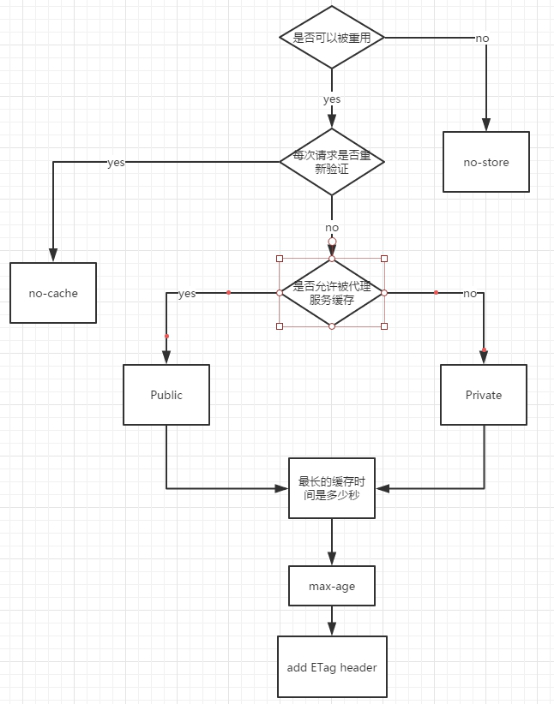
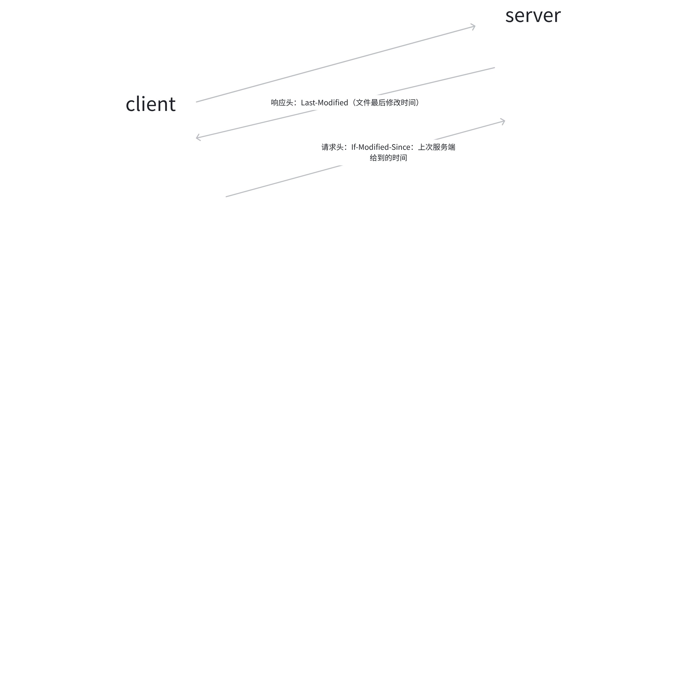
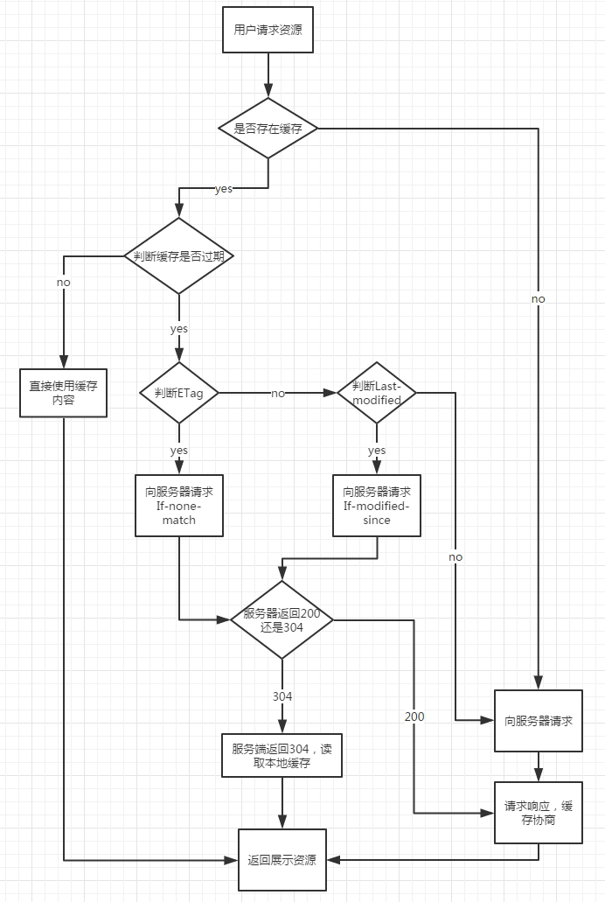
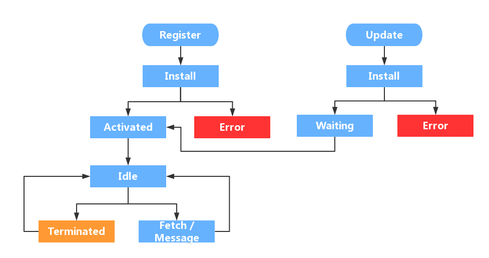
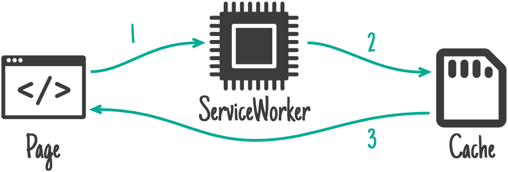
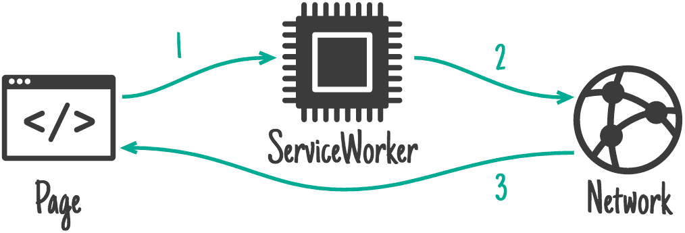
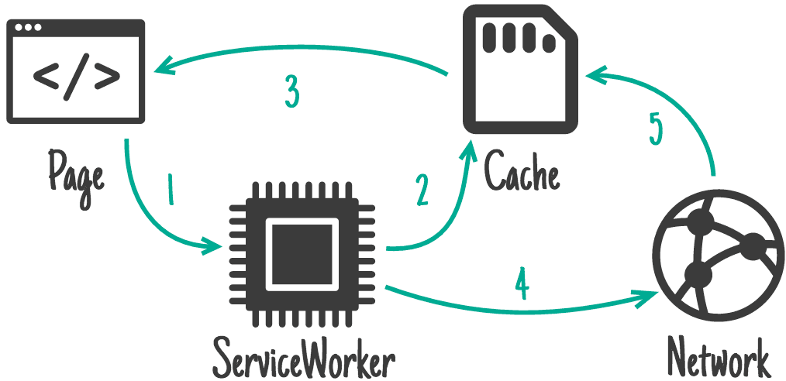
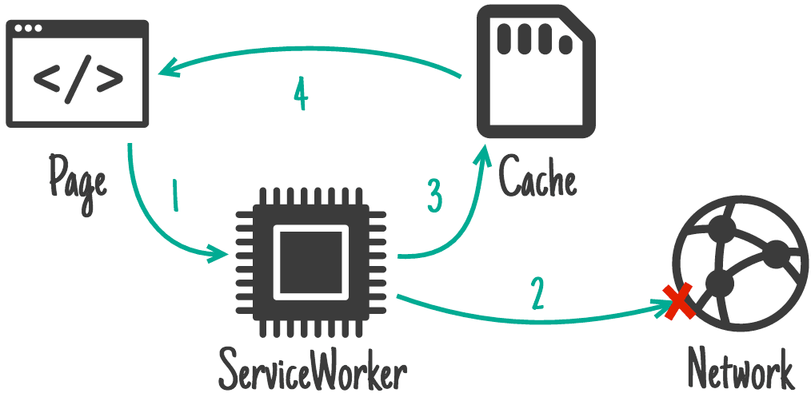

# 1.资源优化实战

> 原文链接：[飞书原文](https://u19tul1sz9g.feishu.cn/docx/S4bGdz1JWotr2Dxxi44cphFNnKc)

[引用：20260207 随堂笔记与源码资料](https://www.feishu.cn/docx/HsQBdlBmsocCuExnY9Jcy99Sn2e)
[本地资源：1.assets-perf-notes](<../../20260207 随堂笔记与源码资料-压缩包/7.AI大前端全栈架构之性能专项优化/1.assets-perf-notes>)

## 课程目标

> **💡 提示**
>
> - 初中级：
>
>   1. **掌握前端资源压缩与请求优化**：掌握不同资源压缩与请求优化处理细节，主要包含：js、img、font 等
>   2. **掌握资源缓存策略**：掌握强缓存、协商缓存、策略缓存原理与实现思路
>   3. **熟悉数据离线存储方案**：前端数据离线存储方案细化，包含 localstorage、service-worker、indexedDB 等
>   4. **了解在编辑器场景下的字体文件优化方案**：了解在丰富字体类型产品中，对于字体子集化优化处理细节
> - 高级：
>
>   1. **深入构建与工程化资源压缩任务**：能在构建环节，通过构建工具实现资源压缩处理
>   2. **掌握产品弱网环境支持**：借助本地离线存储方案，支持产品弱网环境的完美体验
>   3. **掌握字体子集化方案**：掌握字体子集化原理，了解 fontmin 实现原理

## 补充资料

- Cache-Control：https://developer.mozilla.org/en-US/docs/Web/HTTP/Headers/Cache-Control
- Last-Modified：https://developer.mozilla.org/en-US/docs/Web/HTTP/Headers/Last-Modified
- etag：https://developer.mozilla.org/en-US/docs/Web/HTTP/Headers/ETag
- indexedDB：https://developer.mozilla.org/en-US/docs/Web/API/IndexedDB_API
- **Dexie**：https://github.com/dexie/Dexie.js
- service-worker：https://developer.mozilla.org/en-US/docs/Web/API/Service_Worker_API
- workbox：https://developer.chrome.com/docs/workbox?hl=zh-cn
- 字体子集化 fontmin：https://github.com/ecomfe/fontmin#readme
- font-spider：https://github.com/aui/font-spider
- 预加载与预请求：https://developer.mozilla.org/en-US/docs/Glossary/Prefetch
- PWA：https://web.dev/explore/progressive-web-apps?hl=zh-cn
- 针对浏览器请求响应的压缩：https://nodejs.org/api/zlib.html#compressing-http-requests-and-responses


## 相关面试真题


### **请说说你做过的关于资源方面的优化？**


**答案：**


在资源优化方面，我主要做了以下几个工作：


- **资源压缩**：使用工具如 `uglify-js`、`CSSNano` 对 JavaScript 和 CSS 文件进行压缩，以减少文件体积。图片则采用 `imagemin` 进行压缩优化。
- **文件合并**：通过 Webpack 等构建工具将多个 CSS 和 JS 文件合并，减少 HTTP 请求数量。
- **资源懒加载与异步加载**：对于非关键资源（如图片和次要 JavaScript 文件），我采用了懒加载策略，只有在需要时才加载这些资源。同时，关键的 JS 脚本采用异步加载（如 `async` 或 `defer`），以提高页面的首屏渲染速度。
- **字体优化**：使用字体子集化工具（如 `Fontmin`）减少字体文件的体积，并使用 `woff2` 格式的字体文件以获得更好的压缩效果。
- **缓存策略**：配置 `Cache-Control`、`ETag` 和 `Last-Modified` 等 HTTP 头来优化浏览器缓存，并使用 Service Worker 进行更细粒度的缓存控制。对于长时间不变的资源，设置了较长的缓存时间。
- **预加载与预请求**：使用 `link` 标签的 `rel="preload"` 和 `rel="prefetch"` 属性来预加载和预请求关键资源，从而提升页面加载速度。
- **CDN**：将静态资源部署到 CDN（内容分发网络）上，利用其多节点分布的优势，降低请求延迟。


### **前端如果想本地化存储数据，有什么方案？**


**答案：**


我在本地化存储数据方面，了解过以下方案：


- **LocalStorage**：一种同步 API，用于存储少量的键值对数据（通常不超过 5MB）。数据没有过期时间，除非手动删除，否则会一直存在。
- **SessionStorage**：与 LocalStorage 类似，但数据仅在页面会话期间存储，即浏览器窗口关闭后数据会被清除。
- **IndexedDB**：一种低级 API，提供了更大的存储空间和更强的查询能力，适用于需要存储结构化数据或大量数据的场景。IndexedDB 是异步的，性能较好，适合复杂的存储需求。
- **Cookies**：用于在客户端存储少量数据，并且可以在客户端与服务器之间传递。通常用于会话管理，但由于大小限制（约 4KB）和安全问题，不推荐大量使用。
- **Service Worker Cache**：通过 Service Worker，可以在浏览器缓存中存储网络请求的结果，便于离线访问和提升页面加载性能。适用于 PWA（渐进式 Web 应用）场景。


## 资源压缩与请求优化


在现代 Web 开发中，资源压缩与请求优化是提升页面加载速度、提高用户体验的关键步骤。通过减少资源大小和 HTTP 请求次数，可以显著缩短页面的加载时间。

以下将详细介绍资源压缩和请求优化的常用方法和最佳实践


### 资源压缩


资源压缩是指对 JavaScript、CSS、图片等资源进行压缩处理，以减少文件大小，从而提高页面加载速度。常见的资源压缩技术包括代码压缩和传输压缩。


#### JavaScript 和 CSS 文件压缩


对 JavaScript 和 CSS 文件进行压缩可以显著减少文件大小。常用的工具包括：


- **JavaScript 压缩工具**:

  - [UglifyJS](https://github.com/mishoo/UglifyJS): 可以删除代码中的空白字符、注释、简化代码逻辑、重命名变量等。
  - [Terser](https://github.com/terser/terser): 是 UglifyJS 的分支，支持 ES6+ 代码压缩。


- **CSS 压缩工具**:

  - [cssnano](https://cssnano.co/): 一个模块化的 CSS 压缩工具，支持去除无用的 CSS 代码，压缩 CSS 文件大小。
  - [Clean-CSS](https://github.com/jakubpawlowicz/clean-css): 一个快速的 CSS 压缩工具，可以通过命令行或 API 使用。


##### 使用 Terser 压缩 JavaScript 文件


```Bash
npx terser src/app.js -o dist/app.min.js --compress --mangle
```


##### 使用 cssnano 压缩 CSS 文件【新版本，使用命令行方式+postcss】


安装 postcss

```JSON
"cssnano": "7.1.2",
"postcss": "8.5.6",
"postcss-cli": "11.0.1"
```

定义执行命令：

```TypeScript
"zip:css": "postcss src/app.css > dist/app.min.css"
```

修改 postcss 配置用来支持 nanocss 的压缩特性

```TypeScript
import cssnano from "cssnano";

export default {
  plugins: [
    cssnano({
      preset: "default",
    }),
  ],
};

```

```Bash
npx cssnano src/styles.css dist/styles.min.css
```


#### 图片压缩


图片通常是网页中最占资源的部分，使用适当的工具压缩图片可以显著减少文件大小。常用的图片压缩工具包括：


- **JPEG/PNG 压缩**:

  - [ImageOptim](https://imageoptim.com/): 支持无损压缩 JPEG、PNG 和 GIF 格式的图片。
  - [TinyPNG](https://tinypng.com/): 一个流行的在线工具，支持 JPEG 和 PNG 图片的压缩。
- **WebP 格式**:

  - [cwebp](https://developers.google.com/speed/webp/docs/cwebp): 将图片转换为 WebP 格式，WebP 通常比 JPEG 和 PNG 更小。 https://developers.google.com/speed/webp/download?hl=zh-cn


##### 使用 cwebp 将图片转换为 WebP 格式


```Bash
cwebp src/image.png -o dist/image.webp
```


#### 文本文件压缩


在传输文本文件（如 HTML、CSS、JavaScript）时，可以使用服务器端压缩技术，如 Gzip 或 Brotli，以减少传输的字节数。


- **Gzip 压缩**: 是最常见的压缩算法，广泛支持且配置简单。
- **Brotli 压缩**: 由 Google 开发的压缩算法，压缩率比 Gzip 更高，特别适合静态资源的压缩。


##### Node API 来处理 gzip、brotli 压缩

https://nodejs.org/api/zlib.html#class-zlibgzip

https://nodejs.org/api/zlib.html#compressing-http-requests-and-responses


##### 配置 Nginx 以使用 Gzip 和 Brotli 压缩


```Nginx
# Nginx 配置示例

# 启用 Gzip 压缩
gzip on;
gzip_types text/plain text/css application/javascript application/json image/svg+xml;
gzip_min_length 256;

# 启用 Brotli 压缩
brotli on;
brotli_types text/plain text/css application/javascript application/json image/svg+xml;
brotli_min_length 256;
```


### 请求优化


请求优化是指通过减少 HTTP 请求次数、合并文件、优化资源加载顺序等手段，提高页面加载速度。以下是一些常见的请求优化策略。


#### 减少 HTTP 请求数


每次 HTTP 请求都会消耗时间，因此减少 HTTP 请求数可以显著提升页面性能。常见的方法包括：


- **合并文件**: 将多个 CSS 或 JavaScript 文件合并为一个文件，减少请求次数。
- **内联关键 CSS 和 JavaScript**: 将关键的 CSS 和 JavaScript 内联到 HTML 文件中，减少外部请求。


这个点，我们一般都是通过打包构建工具来完成的。

```JavaScript
// Webpack 配置示例
module.exports = {
  entry: './src/index.js',
  output: {
    filename: 'bundle.js',
    path: __dirname + '/dist'
  },
  mode: 'production'
};
```


#### 使用懒加载、预加载、预请求


优化资源加载顺序，可以减少首次渲染时间和整体加载时间。


- **懒加载**: 对于图片、视频等资源，只有当它们进入视口时才加载，以减少初始页面加载时间。


```HTML

<script>
  document.addEventListener("DOMContentLoaded", function() {
    var lazyImages = document.querySelectorAll('.lazyload');
    lazyImages.forEach(function(image) {
      image.src = image.getAttribute('data-src');
    });
  });
</script>
```


- **预加载**: 提前加载即将使用的资源，例如字体、关键 CSS、JavaScript 等。


```HTML
<link rel="preload" href="styles.css" as="style">
<link rel="preload" href="app.js" as="script">
```


- **预请求**: 提前进行 DNS 解析或连接建立，以减少后续请求的延迟。


```HTML
<link rel="dns-prefetch" href="//example.com">
<link rel="preconnect" href="//example.com">
```


#### 使用 HTTP/2 多路复用


HTTP/2 是一种可以显著减少延迟、提高网页加载速度的协议。它支持多路复用（Multiplexing），允许多个请求和响应在一个连接中同时进行。


配置 nginx

```Nginx
server {
    listen 443 ssl http2;
    server_name example.com;

    # 其他 SSL 配置...
}
```


#### 优化服务器响应时间


优化服务器的响应时间可以减少浏览器等待时间，从而加快页面加载速度。常见的方法包括：


- **启用服务器缓存**: 使用 HTTP 缓存头，如 `Cache-Control`、`ETag` 等，减少不必要的服务器请求。
- **使用 CDN**: 利用内容分发网络（CDN）将静态资源分发到全球多个服务器节点，减少用户请求的延迟。
- **优化数据库查询**: 缓存频繁访问的数据，减少数据库查询时间。


## 资源缓存


资源缓存用于缓存静态资源，上面已经提到。良好的缓存策略可以减少资源重复加载进而提高网页的整体加载速度。

通常浏览器缓存策略分为两种：强缓存和协商缓存，当然还包括 service worker。

- 浏览器在资源加载时，根据请求头中的 `expires` 和 `cache-control` 值来判断是否命中强缓存，命中则直接从本地缓存中读取资源，这一过程不需请求服务器；
- 如果未命中强缓存，浏览器则会发送请求到服务器，服务器通过 `last-modified` 和 `etag` 值来验证资源是否命中协商缓存，若命中，则服务器会将这个请求返回，但是不会返回这个资源的数据，浏览器接收到该请求响应后依然从本地缓存中读取资源；
- 若**强缓存**和**策略缓存**都未命中，那么浏览器将请求服务器获得资源并加载。

**强缓存**和**策略缓存**如果命中，都是直接从客户端缓存加载对应资源。但不同点是：**强缓存**自比较开始至缓存命中不会请求服务端，而**策略缓存**的是否使用本地缓存这一决定是需要服务端参与的，换言之策略缓存需要请求服务端来完成的。


### 强缓存

强缓存通过 `Expires` 和 `Cache-Control` 响应头实现。两者详细说明如下：

#### Expire

中文释义为：到期，表示缓存的过期时间。**expire** 是 HTTP 1.0 提出的，它描述的是一个绝对时间，该时间由服务端返回。因为 **expire** 值是一个固定时间，因此会受本地时间的影响，如果在缓存期间我们修改了本地时间，可能会导致缓存失效。

通常表示如下：

Expires: Wed, 11 May 2018 07:20:00 GMT


#### Cache-Control

中文释义为：缓存控制。**cache-control** 是 HTTP 1.1 提出的，它描述的是一个相对时间，该相对时间由服务端返回。

表示如下：

Cache-Control: max-age=315360000

该属性还包括访问性及缓存方式设置，列举如下：

- **no-cache** 存储在本地缓存取中，只是在与服务器进行新鲜度再验证之前，缓存无法使用。
- **no-store** 不缓存资源到本地
- **public** 可被所有用户缓存，多用户进行共享，包括终端或 CDN 等中间代理服务器
- **private** 仅能被浏览器客户端缓存，属于私有缓存，不允许中间代理服务器缓存相关资源

缓存与使用缓存流程说明如下：



### 协商缓存

浏览器加载资源时，若强缓存未命中，将发送资源请求至服务器。若协商缓存命中，请求响应返回 304 状态码。

协商缓存主要使用到两对请求响应头字段，分别是：

- Last-Modified 和 If-Modified-Since
- Etag 和 If-None-Match



#### Last-Modified 与 If-Modified-Since

**Last-Modified** 由上一次请求的响应头返回，且该值会在本次请求中，通过请求头 **If-Modified-Since** 传递给服务端，服务端通过 If-Modified-Since 与资源的修改时间进行对比，若在此日期后资源有更新，则将新的资源发送给客户端。

不过，通过文件的修改时间来判断资源是否更新是不明智的，因为很多时候文件更新时间变了，但文件内容未发生更改。

这样一来，就出现了 **ETag** 与 **If-None-Match**。


#### ETag 与 If-None-Match

不同于 **Last-Modified**，Etag 通过计算文件指纹，与请求传递过来的 **If-None-Match** 进行对比，若值不等，则将新的资源发送给客户端。

值得一提的是，通常为了减轻服务器压力，并不会完整计算文件 hash 值作为 Etag，并且有些时候 Etag 的表现会退化为 Last-Modified （当指纹计算为文件更新时间时）。那为什么我们通常还是要选用 Etag 呢？原因有一下几点：

- 文件也许会发生周期性的更改，但内容并无变化，这时我们希望客户端认为这个文件是未变的；
- 文件修改频繁，比如在秒以内的时间进行修改，由于 If-Modified-Since 能读取到的时间精度为 s，因此这种场景下 If-Modified-Since 无法正常使用；
- 某些服务器不能精确获得文件的最后修改时间。




> 💡 ETag 的优先级比 Last-Modified 更高！


#### 状态码

- 200：强缓存 Expires / Cache-Control 失效时，返回新资源文件
- 200（from disk cache）Expires / Cache-Control 两者都存在且有效，Cache-Control 优先 Expires 时，浏览器从本地获取资源成功。
- 200（from memory cache）
- 304（Not Modified）协商缓存 Last-modified / Etag 有效，则服务端返回该状态码。


### 如何缓存

缓存启用的顺序可列举如下：

1. Cache-Control —— 请求服务器之前
2. Expires —— 请求服务器之前
3. **If-None-Match (Etag)** —— 请求服务器
4. **If-Modified-Since (Last-Modified)** —— 请求服务器

需要注意的是协商缓存需要配合强缓存使用，如果不启用强缓存那么协商缓存就失去了意义。大部分 web 服务器都默认开启了协商缓存，而且是同时启用（Last-Modified、If-Modified-Since）和（ETag、If-None-Match）。但当我们的系统选用分布式部署时，则需要注意以下问题：

- 分布式系统里多台机器间文件的 Last-Modified 必须保持完全一致，否则在请求负载均衡到不同机器时，会导致比对失败的情况；
- 分布式系统尽量关闭掉 ETag，因为每台机器生成的 ETag 都不同。


部分源码

```JavaScript
const http = require("http");
const fs = require("fs");
const url = require("url");
const path = require("path");
const etag = require("etag");
const fresh = require("fresh");

const server = http.createServer(function (req, res) {
  let filePath, isHtml, isFresh;
  const pathname = url.parse(req.url, true).pathname;
  //根据请求路径取文件绝对路径
  if (pathname === "/") {
    filePath = path.join(__dirname, "public", "/index.html");
    isHtml = true;
  } else {
    filePath = path.join(__dirname, "public", pathname);
    isHtml = false;
  }

  // 读取文件描述信息，用于计算etag及设置Last-Modified
  fs.stat(filePath, function (err, stat) {
    if (err) {
      res.writeHead(404, "not found");
      res.end("<h1>404 Not Found</h1>");
    } else {
      if (isHtml) {
        // html文件使用协商缓存
        const lastModified = stat.mtime.toUTCString();
        const fileEtag = etag(stat);
        res.setHeader("Cache-Control", "public, max-age=0");
        res.setHeader("Last-Modified", lastModified);
        res.setHeader("ETag", fileEtag);

        // 根据请求头判断缓存是否是最新的
        isFresh = fresh(req.headers, {
          etag: fileEtag,
          "last-modified": lastModified,
        });
      } else {
        // 其他静态资源使用强缓存
        res.setHeader("Cache-Control", "public, max-age=3600");
      }

      fs.readFile(filePath, "utf-8", function (err, fileContent) {
        if (err) {
          res.writeHead(404, "not found");
          res.end("<h1>404 Not Found</h1>");
        } else {
          if (isHtml && isFresh) {
            //如果缓存是最新的 则返回304状态码
            //由于其他资源使用了强缓存 所以不会出现304
            res.writeHead(304, "Not Modified");
          } else {
            res.write(fileContent, "utf-8");
          }

          res.end();
        }
      });
    }
  });
});
server.listen(8080);
console.log("server is running on http://localhost:8080/");
```


```TypeScript
// if-none-match
  if (noneMatch && noneMatch !== '*') {
    var etag = resHeaders.etag

    if (!etag) {
      return false
    }

    var etagStale = true
    var matches = parseTokenList(noneMatch)
    for (var i = 0; i < matches.length; i++) {
      var match = matches[i]
      if (match === etag || match === 'W/' + etag || 'W/' + match === etag) {
        etagStale = false
        break
      }
    }

    if (etagStale) {
      return false
    }
  }

  // if-modified-since
  if (modifiedSince) {
    var lastModified = resHeaders['last-modified']
    var modifiedStale = !lastModified || !(parseHttpDate(lastModified) <= parseHttpDate(modifiedSince))

    if (modifiedStale) {
      return false
    }
  }
```


### service worker

为了更灵活配置缓存策略，引入了 service worker 技术，关于该技术的应用我们在后续结合 workbox 介绍




#### **注册**

要使用Service Worker，首先需要注册一个sw，通知浏览器为该页面分配一块内存，然后sw就会进入安装阶段。一个简单的注册方式：

```JavaScript
;(function () {
    if ('serviceWorker' in navigator) {
        navigator.serviceWorker.register('./sw.js')
    }
})()
```

前面提到过，由于sw会监听和代理所有的请求，所以sw的作用域就显得额外的重要了，比如说我们只想监听我们专题页的所有请求，就在注册时指定路径：

```JavaScript
navigator.serviceWorker.register('/topics/sw.js');
```

这样就只会对topics/下面的路径进行优化。


#### **installing**

我们注册后，浏览器就会开始安装sw，可以通过事件监听：

```JavaScript
//service worker安装成功后开始缓存所需的资源
var CACHE_PREFIX = 'cms-sw-cache';
var CACHE_VERSION = '0.0.20';
var CACHE_NAME = CACHE_PREFIX+'-'+CACHE_VERSION;
var allAssets = [
    './main.css'
];
self.addEventListener('install', function(event) {

    //调试时跳过等待过程
    self.skipWaiting();

    // Perform install steps
    //首先 event.waitUntil 你可以理解为 new Promise，
    //它接受的实际参数只能是一个 promise，因为,caches 和 cache.addAll 返回的都是 Promise，
    //这里就是一个串行的异步加载，当所有加载都成功时，那么 SW 就可以下一步。
    //另外，event.waitUntil 还有另外一个重要好处，它可以用来延长一个事件作用的时间，
    //这里特别针对于我们 SW 来说，比如我们使用 caches.open 是用来打开指定的缓存，但开启的时候，
    //并不是一下就能调用成功，也有可能有一定延迟，由于系统会随时睡眠 SW，所以，为了防止执行中断，
    //就需要使用 event.waitUntil 进行捕获。另外，event.waitUntil 会监听所有的异步 promise
    //如果其中一个 promise 是 reject 状态，那么该次 event 是失败的。这就导致，我们的 SW 开启失败。
    event.waitUntil(
        caches.open(CACHE_NAME)
            .then(function(cache) {
                console.log('[SW]: Opened cache');
                return cache.addAll(allAssets);
            })
    );

});
```

安装时，sw就开始缓存文件了，会检查所有文件的缓存状态，如果都已经缓存了，则安装成功，进入下一阶段。


#### **activated**

如果是第一次加载sw，在安装后，会直接进入activated阶段，而如果sw进行更新，情况就会显得复杂一些。流程如下：  
首先老的sw为A，新的sw版本为B。B进入install阶段，而A还处于工作状态，所以B进入waiting阶段。只有等到A被terminated后，B才能正常替换A的工作。


这个terminated的时机有如下几种方式：

- 关闭浏览器一段时间；
- 手动清除Service Worker；
- 在sw安装时直接跳过waiting阶段.

```JavaScript
//service worker安装成功后开始缓存所需的资源
self.addEventListener('install', function (event) {
    //跳过等待过程
    self.skipWaiting()
})
```

然后就进入了activated阶段，激活sw工作。activated阶段可以做很多有意义的事情，比如更新存储在 Cache 中的key 和 value：

```JavaScript
var CACHE_PREFIX = 'cms-sw-cache';
var CACHE_VERSION = '0.0.20';
/**
 * 找出对应的其他key并进行删除操作
 * @returns {*}
 */
function deleteOldCaches() {
    return caches.keys().then(function (keys) {
        var all = keys.map(function (key) {
            if (key.indexOf(CACHE_PREFIX) !== -1 && key.indexOf(CACHE_VERSION) === -1){
                console.log('[SW]: Delete cache:' + key);
                return caches.delete(key);
            }
        });
        return Promise.all(all);
    });
}
//sw激活阶段,说明上一sw已失效
self.addEventListener('activate', function(event) {

    event.waitUntil(
        // 遍历 caches 里所有缓存的 keys 值
        caches.keys().then(deleteOldCaches)
    );
});
```


#### **idle**

这个空闲状态一般是不可见的，这种一般说明sw的事情都处理完毕了，然后处于闲置状态了。浏览器会周期性的轮询，去释放处于idle的sw占用的资源。


#### **fetch**

该阶段是sw最为关键的一个阶段，用于拦截代理所有指定的请求，并进行对应的操作。所有的缓存部分，都是在该阶段，这里举一个简单的例子：

```JavaScript
//监听浏览器的所有fetch请求，对已经缓存的资源使用本地缓存回复
self.addEventListener('fetch', function(event) {
    event.respondWith(
        caches.match(event.request)
            .then(function(response) {
                //该fetch请求已经缓存
                if (response) {
                    return response;
                }
                return fetch(event.request);
                }
            )
    );
});
```

生命周期就给大家介绍到这里啦。


四大缓存策略

##### 仅缓存




##### 仅限网络



##### 先缓存，然后回退到网络




##### 网络优先，回退到缓存




### 缓存技术方案实践


#### 静态资源优化方案与思考

- 配置超长时间的本地缓存 —— 节省带宽，提高性能
- 采用内容摘要作为缓存更新依据 —— 精确的缓存控制
- 静态资源 CDN 部署 —— 优化网络请求
- 更资源发布路径实现非覆盖式发布 —— 平滑升级


#### 充分利用浏览器缓存机制

- 对于某些不需要缓存的资源，可以使用 Cache-control: no-store ，表示该资源不需要缓存
- 对于频繁变动的资源（比如经常需要刷新的首页，资讯论坛新闻类），可以使用 Cache-Control: no-cache 并配合 ETag 使用，表示该资源已被缓存，但是每次都会发送请求询问资源是否更新。
- 对于代码文件来说，通常使用 Cache-Control: max-age=31536000 并配合策略缓存使用，然后对文件进行指纹处理，一旦文件名变动就会立刻下载新的文件。
- 静态资源文件通过 Service Worker 进行缓存控制和离线化加载


## 数据缓存


一般我们为了解决以下问题，考虑通过缓存数据来提升整体应用性能，包含：

- 频繁的网络请求会影响应用性能
- 离线状态下无法访问数据
- 大量数据的本地存储和快速检索需求


常见的前端数据缓存方案有：

- localstorage
- indexedDB
- service worker


### Localstorage

`localStorage` 是 HTML5 引入的一种 Web 存储方式，它允许在浏览器中以键值对的形式存储数据。`localStorage` 的数据存储是持久化的，即使浏览器关闭后数据也不会丢失，除非手动删除。

面试经常会被问到，用户信息存储在哪里呀？这样我们也能体会得到，localstorage 的作用就是暂存一些关键数据在本地，为下次访问与使用做前置准备。


#### 基本用法


```JavaScript
// 存储数据
localStorage.setItem('username', 'Alice');

// 获取数据
const username = localStorage.getItem('username');
console.log(username); // 输出: Alice

// 删除特定数据
localStorage.removeItem('username');

// 清除所有数据
localStorage.clear();
```


#### 特征


- 每个域名最多可以存储 5MB 左右的数据
- 数据以纯文本形式存储，主要用于存储简单的字符串类型的数据
- 数据没有过期时间，所以需要自己实现过期时间处理或者借助后端实现
- 数据在同域下共享


#### 实际应用举例


##### 用户偏好设置

存储用户偏好设置、主题选择等需要持久化的简单数据


```JavaScript
// 保存用户选择的主题
function saveThemePreference(theme) {
    localStorage.setItem('theme', theme);
    applyTheme(theme);
}

// 应用用户选择的主题
function applyTheme(theme) {
    if (theme === 'dark') {
        document.body.classList.add('dark-theme');
    } else {
        document.body.classList.remove('dark-theme');
    }
}

// 页面加载时，检查并应用存储的主题
window.onload = function() {
    const savedTheme = localStorage.getItem('theme');
    if (savedTheme) {
        applyTheme(savedTheme);
    }
};

// 示例：用户选择主题
document.getElementById('themeToggle').addEventListener('click', function() {
    const currentTheme = document.body.classList.contains('dark-theme') ? 'light' : 'dark';
    saveThemePreference(currentTheme);
});

```


##### 表单数据缓存

存储表单数据，防止页面刷新后数据丢失


```JavaScript
// 实时保存表单数据
document.getElementById('userForm').addEventListener('input', function() {
    const formData = {
        name: document.getElementById('name').value,
        email: document.getElementById('email').value
    };
    localStorage.setItem('formData', JSON.stringify(formData));
});

// 页面加载时，恢复表单数据
window.onload = function() {
    const savedFormData = localStorage.getItem('formData');
    if (savedFormData) {
        const formData = JSON.parse(savedFormData);
        document.getElementById('name').value = formData.name || '';
        document.getElementById('email').value = formData.email || '';
    }
};

// 示例：用户提交表单时清除保存的数据
document.getElementById('userForm').addEventListener('submit', function() {
    localStorage.removeItem('formData');
});

```


##### 筛选数据缓存

缓存少量且不频繁变动的静态数据。


```JavaScript
// 检查缓存是否存在静态数据
function loadCategories() {
    const categories = localStorage.getItem('categories');
    if (categories) {
        renderCategories(JSON.parse(categories));
    } else {
        fetchCategoriesFromServer();
    }
}

// 从服务器获取数据并缓存
function fetchCategoriesFromServer() {
    fetch('/api/categories')
        .then(response => response.json())
        .then(data => {
            localStorage.setItem('categories', JSON.stringify(data));
            renderCategories(data);
        })
        .catch(error => {
            console.error('Error fetching categories:', error);
        });
}

// 将数据渲染到页面
function renderCategories(categories) {
    const categoryList = document.getElementById('categoryList');
    categories.forEach(category => {
        const listItem = document.createElement('li');
        listItem.textContent = category.name;
        categoryList.appendChild(listItem);
    });
}

// 页面加载时调用函数
window.onload = function() {
    loadCategories();
};

```


### IndexedDB


`IndexedDB` 用于在用户的浏览器中存储大量的结构化数据。它是基于事务的数据库系统，可以存储大量的对象，并支持索引、检索、事务等功能。需要注意的是，IndexedDB 数据库属于非关系型数据库。

IndexedDB 是一个事务型（非关系型）数据库。 它是浏览器提供的本地数据库，可以被网页脚本创建和操作，允许存贮大量数据，提供查找接口，能建立索引，用于在客户端存储大量的结构化数据（也包括文件/二进制大型对象（blobs））。


#### 基本用法


##### 打开数据库


```JavaScript
var request = indexedDB.open('myDatabase', 1);

request.onupgradeneeded = function(event) {
    var db = event.target.result;
    db.createObjectStore('myObjectStore', { keyPath: 'id' });
};

request.onsuccess = function(event) {
    var db = event.target.result;
    console.log('Database opened successfully');
};

request.onerror = function(event) {
    console.log('Database error: ' + event.target.errorCode);
};
```


##### 添加数据

```JavaScript
var transaction = db.transaction(['myObjectStore'], 'readwrite');
var objectStore = transaction.objectStore('myObjectStore');
var request = objectStore.add({ id: 1, name: 'John Doe', age: 30 });

request.onsuccess = function(event) {
    console.log('Data added successfully');
};

request.onerror = function(event) {
    console.log('Data add error: ' + event.target.errorCode);
};

```


##### 读取数据

```JavaScript
var transaction = db.transaction(['myObjectStore']);
var objectStore = transaction.objectStore('myObjectStore');
var request = objectStore.get(1);

request.onsuccess = function(event) {
    if (request.result) {
        console.log('Name: ' + request.result.name);
    } else {
        console.log('No data found');
    }
};

request.onerror = function(event) {
    console.log('Data retrieve error: ' + event.target.errorCode);
};
```


#### 特征


- 可以存储大量数据，不像 `localStorage` 受 5MB 限制
- 数据以对象存储，可以存储复杂的数据结构（如对象、数组）
- 支持异步操作和**事务**处理，确保数据的一致性和完整性
- 可以通过索引快速检索数据，适用于需要高效查询的大量数据


#### 实际应用举例


对于需要存储大量数据或进行复杂查询的应用场景，可以使用 `IndexedDB` 来管理这些数据。`IndexedDB` 适合用于离线应用的数据缓存、大型数据的本地存储、用户生成内容的缓存等。以下是一些示例代码，展示如何在这些场景中使用 `IndexedDB`。


##### 离线应用的数据缓存


假设我们有一个离线阅读应用，需要缓存文章内容以便在没有网络连接时仍然可以访问。我们可以使用 `IndexedDB` 来存储这些文章。


```JavaScript
// 打开数据库并创建对象存储
function openDatabase() {
    return new Promise((resolve, reject) => {
        const request = indexedDB.open('offlineReadingApp', 1);
        
        request.onupgradeneeded = function(event) {
            const db = event.target.result;
            db.createObjectStore('articles', { keyPath: 'id' });
        };

        request.onsuccess = function(event) {
            resolve(event.target.result);
        };

        request.onerror = function(event) {
            reject('Database error: ' + event.target.errorCode);
        };
    });
}

// 缓存文章到 IndexedDB
function cacheArticle(article) {
    openDatabase().then(db => {
        const transaction = db.transaction(['articles'], 'readwrite');
        const objectStore = transaction.objectStore('articles');
        objectStore.put(article);
    }).catch(error => {
        console.error(error);
    });
}

// 从 IndexedDB 中获取文章
function getArticleById(id) {
    return openDatabase().then(db => {
        return new Promise((resolve, reject) => {
            const transaction = db.transaction(['articles']);
            const objectStore = transaction.objectStore('articles');
            const request = objectStore.get(id);

            request.onsuccess = function(event) {
                resolve(event.target.result);
            };

            request.onerror = function(event) {
                reject('Error retrieving article: ' + event.target.errorCode);
            };
        });
    });
}

// 示例：使用缓存文章
const exampleArticle = {
    id: 1,
    title: 'How to Use IndexedDB',
    content: 'This is a detailed guide on how to use IndexedDB...'
};

cacheArticle(exampleArticle); // 缓存文章

// 稍后在离线状态下获取文章
getArticleById(1).then(article => {
    if (article) {
        console.log('Article retrieved from cache:', article);
    } else {
        console.log('Article not found in cache.');
    }
});
```


##### 大型数据的本地存储（例如：用户生成内容的缓存）


假设我们有一个允许用户上传和编辑图片的应用，需要将这些图片数据本地存储以提高性能和用户体验。


```JavaScript
// 打开数据库并创建对象存储
function openDatabase() {
    return new Promise((resolve, reject) => {
        const request = indexedDB.open('userContentApp', 1);

        request.onupgradeneeded = function(event) {
            const db = event.target.result;
            db.createObjectStore('userImages', { keyPath: 'id', autoIncrement: true });
        };

        request.onsuccess = function(event) {
            resolve(event.target.result);
        };

        request.onerror = function(event) {
            reject('Database error: ' + event.target.errorCode);
        };
    });
}

// 缓存用户图片到 IndexedDB
function cacheUserImage(imageData) {
    openDatabase().then(db => {
        const transaction = db.transaction(['userImages'], 'readwrite');
        const objectStore = transaction.objectStore('userImages');
        objectStore.add({ imageData: imageData });
    }).catch(error => {
        console.error(error);
    });
}

// 获取所有用户图片
function getAllUserImages() {
    return openDatabase().then(db => {
        return new Promise((resolve, reject) => {
            const transaction = db.transaction(['userImages']);
            const objectStore = transaction.objectStore('userImages');
            const request = objectStore.getAll();

            request.onsuccess = function(event) {
                resolve(event.target.result);
            };

            request.onerror = function(event) {
                reject('Error retrieving images: ' + event.target.errorCode);
            };
        });
    });
}

// 示例：使用缓存用户图片
const exampleImage = 'data:image/png;base64,iVBORw0KGgoAAAANSUhEUgAAA...'; // 示例图片数据
cacheUserImage(exampleImage); // 缓存图片

// 稍后获取所有图片
getAllUserImages().then(images => {
    console.log('User images retrieved from cache:', images);
});
```


##### Web 应用中的数据持久化（如客户信息、用户活动记录）


假设我们有一个客户管理系统，需要持久化存储客户信息。


```JavaScript
// 打开数据库并创建对象存储
function openDatabase() {
    return new Promise((resolve, reject) => {
        const request = indexedDB.open('customerManagementApp', 1);

        request.onupgradeneeded = function(event) {
            const db = event.target.result;
            db.createObjectStore('customers', { keyPath: 'id', autoIncrement: true });
        };

        request.onsuccess = function(event) {
            resolve(event.target.result);
        };

        request.onerror = function(event) {
            reject('Database error: ' + event.target.errorCode);
        };
    });
}

// 添加或更新客户信息
function saveCustomer(customer) {
    openDatabase().then(db => {
        const transaction = db.transaction(['customers'], 'readwrite');
        const objectStore = transaction.objectStore('customers');
        objectStore.put(customer);
    }).catch(error => {
        console.error(error);
    });
}

// 获取所有客户信息
function getAllCustomers() {
    return openDatabase().then(db => {
        return new Promise((resolve, reject) => {
            const transaction = db.transaction(['customers']);
            const objectStore = transaction.objectStore('customers');
            const request = objectStore.getAll();

            request.onsuccess = function(event) {
                resolve(event.target.result);
            };

            request.onerror = function(event) {
                reject('Error retrieving customers: ' + event.target.errorCode);
            };
        });
    });
}

// 示例：添加或更新客户
const exampleCustomer = { id: 1, name: 'John Doe', email: 'john.doe@example.com' };
saveCustomer(exampleCustomer); // 保存客户信息

// 稍后获取所有客户信息
getAllCustomers().then(customers => {
    console.log('Customers retrieved from cache:', customers);
});
```


### Service Worker


`Service Worker` 是一种独立于网页运行的脚本，它主要用于控制页面或网站的缓存，支持离线功能、消息推送等。`Service Worker` 可以拦截网络请求，并决定是从缓存中取数据还是从网络获取数据，因此它是实现渐进式 Web 应用（PWA）的核心技术之一。

国外 PWA 技术非常流行，但是在国内相对较少，PWA 应用接近原生应用，而又足够轻量。


#### 基本用法


##### 注册 service worker


在主文件中 `main.js` 注册 `sw.js`


```JavaScript
if ('serviceWorker' in navigator) {
    navigator.serviceWorker.register('/sw.js')
    .then(function(registration) {
        console.log('Service Worker registered with scope:', registration.scope);
    })
    .catch(function(error) {
        console.log('Service Worker registration failed:', error);
    });
}
```


##### 编写 sw.js


service worker 的处理逻辑在 `sw.js` 文件中定义，包括监听、资源拦截、请求拦截等处理


```JavaScript
self.addEventListener('install', function(event) {
    event.waitUntil(
        caches.open('my-cache').then(function(cache) {
            return cache.addAll([
                '/',
                '/index.html',
                '/styles.css',
                '/script.js',
                '/image.png'
            ]);
        })
    );
});
```


```JavaScript
self.addEventListener('fetch', function(event) {
    event.respondWith(
        caches.match(event.request).then(function(response) {
            return response || fetch(event.request);
        })
    );
});
```


#### 特征


- 不依赖网页或用户交互，在后台运行
- 能够拦截和处理网络请求，支持缓存控制和离线访问
- 通过 `Cache API` 缓存资源，并实现对缓存的灵活管理
- 支持消息推送和后台同步


#### 实际应用举例


#### Service Worker 的具体应用


##### 实现离线访问（如离线网页、离线应用）


这个示例展示了如何使用 Service Worker 缓存网站的静态资源，并在用户离线时提供这些缓存的资源。


###### `service-worker.js` 文件


```JavaScript
// 定义缓存的名称和要缓存的资源
const CACHE_NAME = 'offline-cache-v1';
const CACHE_URLS = [
    '/',
    '/index.html',
    '/styles.css',
    '/script.js',
    '/offline.html'
];

// 在 install 事件中缓存静态资源
self.addEventListener('install', event => {
    event.waitUntil(
        caches.open(CACHE_NAME)
            .then(cache => {
                console.log('Opened cache');
                return cache.addAll(CACHE_URLS);
            })
    );
});

// 在 fetch 事件中拦截请求，提供缓存资源或回退到离线页面
self.addEventListener('fetch', event => {
    event.respondWith(
        fetch(event.request)
            .catch(() => {
                return caches.match(event.request)
                    .then(response => {
                        return response || caches.match('/offline.html');
                    });
            })
    );
});

// 激活 Service Worker 并清除旧的缓存
self.addEventListener('activate', event => {
    const cacheWhitelist = [CACHE_NAME];
    event.waitUntil(
        caches.keys().then(cacheNames => {
            return Promise.all(
                cacheNames.map(cacheName => {
                    if (!cacheWhitelist.includes(cacheName)) {
                        return caches.delete(cacheName);
                    }
                })
            );
        })
    );
});
```


###### 主 JavaScript 文件 (`main.js`)


```JavaScript
// 注册 Service Worker
if ('serviceWorker' in navigator) {
    navigator.serviceWorker.register('/service-worker.js')
        .then(registration => {
            console.log('Service Worker registered with scope:', registration.scope);
        })
        .catch(error => {
            console.error('Service Worker registration failed:', error);
        });
}
```


###### HTML 文件示例 (`index.html`)


```HTML
<!DOCTYPE html>
<html lang="en">
<head>
    <meta charset="UTF-8">
    <meta name="viewport" content="width=device-width, initial-scale=1.0">
    <title>Offline Example</title>
    <link rel="stylesheet" href="styles.css">
</head>
<body>
    <h1>Offline Example</h1>
    <p>This is an example of a website that works offline.</p>
    <script src="script.js"></script>
    <script src="main.js"></script>
</body>
</html>
```


###### 离线页面 (`offline.html`)


```HTML
<!DOCTYPE html>
<html lang="en">
<head>
    <meta charset="UTF-8">
    <meta name="viewport" content="width=device-width, initial-scale=1.0">
    <title>Offline</title>
</head>
<body>
    <h1>You are offline</h1>
    <p>It seems you have lost your internet connection. Please check your connection and try again.</p>
</body>
</html>
```


##### 控制网络请求的缓存策略，实现智能缓存


这个示例展示了如何通过 Service Worker 实现缓存优先的策略，并在需要时从网络获取数据更新缓存。


###### `service-worker.js` 文件


```JavaScript
// 定义缓存的名称
const CACHE_NAME = 'dynamic-cache-v1';
const STATIC_CACHE_URLS = [
    '/',
    '/index.html',
    '/styles.css',
    '/script.js'
];

// 在 install 事件中缓存静态资源
self.addEventListener('install', event => {
    event.waitUntil(
        caches.open(CACHE_NAME).then(cache => {
            return cache.addAll(STATIC_CACHE_URLS);
        })
    );
});

// 在 fetch 事件中实现缓存优先策略
self.addEventListener('fetch', event => {
    event.respondWith(
        caches.match(event.request)
            .then(response => {
                if (response) {
                    return response; // 返回缓存中的响应
                }
                return fetch(event.request).then(networkResponse => {
                    return caches.open(CACHE_NAME).then(cache => {
                        cache.put(event.request, networkResponse.clone()); // 更新缓存
                        return networkResponse;
                    });
                });
            })
    );
});

// 激活 Service Worker 并清除旧的缓存
self.addEventListener('activate', event => {
    const cacheWhitelist = [CACHE_NAME];
    event.waitUntil(
        caches.keys().then(cacheNames => {
            return Promise.all(
                cacheNames.map(cacheName => {
                    if (!cacheWhitelist.includes(cacheName)) {
                        return caches.delete(cacheName);
                    }
                })
            );
        })
    );
});
```


###### 主 JavaScript 文件 (`main.js`)


```JavaScript
// 注册 Service Worker
if ('serviceWorker' in navigator) {
    navigator.serviceWorker.register('/service-worker.js')
        .then(registration => {
            console.log('Service Worker registered with scope:', registration.scope);
        })
        .catch(error => {
            console.error('Service Worker registration failed:', error);
        });
}
```


###### HTML 文件示例 (`index.html`)


```HTML
<!DOCTYPE html>
<html lang="en">
<head>
    <meta charset="UTF-8">
    <meta name="viewport" content="width=device-width, initial-scale=1.0">
    <title>Smart Cache Example</title>
    <link rel="stylesheet" href="styles.css">
</head>
<body>
    <h1>Smart Cache Example</h1>
    <p>This example demonstrates a cache-first strategy with dynamic updates.</p>
    <script src="script.js"></script>
    <script src="main.js"></script>
</body>
</html>
```


#### 高级进阶【了解即可】


Service Worker 一般在实际工作中，可以借助 Workbox 来使用。

Workbox 是由 Google 开发的一个库，旨在简化 Service Worker 的开发。它封装了复杂的 Service Worker API，使开发者更轻松地实现诸如离线缓存、智能缓存更新、预缓存、运行时缓存等功能。Workbox 提供了一系列工具和模块，帮助开发者高效地管理缓存并提升 Web 应用的性能和可靠性。


##### 核心概念


###### **Pre-caching（预缓存）**

- **概念**: Pre-caching 是在 Service Worker 安装阶段就将某些资源（如 HTML、CSS、JavaScript 文件等）缓存起来。这样即使用户离线，也可以访问这些缓存资源。
- **使用场景**: 适用于需要快速加载的核心资源或关键页面。


###### **Runtime-caching（运行时缓存）**

- **概念**: 运行时缓存是在 Service Worker 拦截网络请求时，根据特定的策略缓存资源。与预缓存不同，运行时缓存通常是动态的，根据用户的行为和应用的需求进行缓存。
- **使用场景**: 适用于用户动态加载的资源，如 API 请求结果、用户上传的图片等。


###### **Cache Strategies（缓存策略）**

- **概念**: 缓存策略决定了 Service Worker 如何处理网络请求及其缓存。Workbox 提供了多种常见的缓存策略：

  - **Network First**: 先尝试网络请求，如果失败则从缓存中获取。
  - **Cache First**: 先从缓存中获取，如果缓存中没有再发起网络请求。
  - **Stale While Revalidate**: 先返回缓存中的资源，同时在后台进行网络请求更新缓存。
  - **Network Only**: 只使用网络请求，不涉及缓存。
  - **Cache Only**: 只使用缓存，不发起网络请求。


###### **Workbox Plugins（插件）**

- **概念**: Workbox 插件可以用于扩展或修改默认的缓存行为。通过插件，开发者可以自定义缓存时间、限制缓存大小、处理特定类型的请求等。


##### Workbox 使用示例


以下是一个使用 Workbox 实现离线缓存和运行时缓存的示例。


###### 安装 Workbox


你可以通过 npm 安装 Workbox：


```Bash
npm install workbox-cli --global
```


或者使用 CDN 直接引入 Workbox：


```HTML
<script src="https://storage.googleapis.com/workbox-cdn/releases/6.5.4/workbox-sw.js"></script>
```


###### 创建 `service-worker.js`


```JavaScript
import { precacheAndRoute } from 'workbox-precaching';
import { registerRoute } from 'workbox-routing';
import { CacheFirst, NetworkFirst, StaleWhileRevalidate } from 'workbox-strategies';

// 预缓存
precacheAndRoute(self.__WB_MANIFEST);

// 运行时缓存策略：Cache First
registerRoute(
  ({ request }) => request.destination === 'image',
  new CacheFirst({
    cacheName: 'images-cache',
    plugins: [
      // 限制缓存大小，最多缓存 50 个条目
      new ExpirationPlugin({
        maxEntries: 50,
      }),
    ],
  })
);

// 运行时缓存策略：Network First
registerRoute(
  ({ url }) => url.pathname.startsWith('/api/'),
  new NetworkFirst({
    cacheName: 'api-cache',
    plugins: [
      // 可以添加其他插件
    ],
  })
);

// 运行时缓存策略：Stale While Revalidate
registerRoute(
  ({ url }) => url.pathname.endsWith('.css') || url.pathname.endsWith('.js'),
  new StaleWhileRevalidate({
    cacheName: 'static-resources-cache',
  })
);
```


###### 使用 Workbox CLI 生成预缓存清单


使用 Workbox CLI 工具生成 `service-worker.js` 所需的预缓存清单：


```Bash
workbox generateSW
```


这条命令将生成一个包含预缓存清单的 `service-worker.js` 文件，Workbox 会自动将你指定的文件（如 HTML、CSS、JS）进行预缓存。


###### 注册 Service Worker


在主 JavaScript 文件中注册 Service Worker：


```JavaScript
if ('serviceWorker' in navigator) {
  window.addEventListener('load', () => {
    navigator.serviceWorker.register('/service-worker.js')
      .then(registration => {
        console.log('Service Worker registered with scope:', registration.scope);
      })
      .catch(error => {
        console.error('Service Worker registration failed:', error);
      });
  });
}
```


##### Workbox 核心模块


- **workbox-precaching**: 用于处理预缓存，帮助开发者在 Service Worker 安装时预缓存指定的资源。
- **workbox-routing**: 提供路由机制，用于拦截和处理请求。
- **workbox-strategies**: 提供各种缓存策略，如 Cache First、Network First 等。
- **workbox-cacheable-response**: 用于控制哪些响应可以被缓存。
- **workbox-expiration**: 用于控制缓存的过期策略和大小。


## 字体子集化


**字体子集化**（Font Subsetting）是指从一个完整的字体文件中提取出页面实际使用的字符，并生成一个包含这些字符的精简字体文件。这种技术可以大幅减少字体文件的大小，从而提高网页加载速度，特别是在多语言网站中，子集化可以显著优化资源加载效率。


在现代 Web 开发中，字体优化是提升性能的关键步骤之一。在很多设计或者文档网站，字体都是可以灵活设置的，那就导致有一个问题——字体文件的加载。字体文件加载会非常消耗性能，所以我们需要借助字体子集化技术，充分减少需要加载的字体文件体积，从而达到优化目的。

接下来，我们将详细介绍字体子集化的概念、常见的字体优化策略，以及如何使用 `fontmin` 进行字体子集化与优化。


### 字体子集化的概念


1. **为什么需要字体子集化？**

   - 字体文件通常包含数千个字符，涵盖多种语言、符号和特殊字符，但网页实际使用的字符通常只有一小部分。加载完整的字体文件会占用大量网络资源，尤其是在移动设备上会影响页面的加载速度。
   - 子集化可以生成仅包含页面实际使用字符的字体文件，从而显著减少文件大小。


1. **字体子集化的基本流程**

   - **提取字符**：从网页内容中提取实际使用的字符集合。
   - **生成子集字体**：使用工具生成仅包含这些字符的精简字体文件。
   - **加载优化字体**：在网页中加载这些精简后的字体文件。


### 字体优化策略


为了进一步提升网页性能，除了字体子集化外，还可以采取以下字体优化策略：


1. **使用字体子集化**：

   - 通过生成子集字体，确保仅加载页面实际使用的字符，减少字体文件的体积。


1. **使用字体格式的压缩版**：

   - 使用 WOFF2 格式（Web Open Font Format 2），它相比 TTF、OTF 等传统格式具有更高的压缩率，文件更小。


1. **字体懒加载**：

   - 延迟加载非关键字体资源（如次要语言或图标字体），只有在用户实际需要时才加载。


1. **字体的预加载与预连接**：

   - 通过 `<link rel="preload">` 和 `<link rel="dns-prefetch">` 指令，提前加载关键字体资源，减少首次渲染延迟。


1. **合并字体请求**：

   - 如果可能，合并多个字体文件为一个，减少 HTTP 请求次数。


1. **合理设置字体回退机制**：

   - 使用 `font-display: swap;` 等 CSS 属性设置字体的加载和替换行为，避免页面出现“闪烁的无样式文本”（FOIT）。


### 使用 Fontmin 进行字体子集化


`Fontmin` 是一个基于 Node.js 的开源工具，用于对字体文件进行子集化、压缩和优化。它支持多种字体格式，并提供了高效的子集化和压缩功能。

**👍 提示**

一定要注意，字体源文件需要时 ttf 格式，fontmin 是基于 TTFRender、TTFWriter 进行字体优化处理的。

关于 fontmin 源码，有详细判断：https://github.com/ecomfe/fontmin/blob/21807cad8b31bcf3abc61f5f3d248b10a3c8427a/plugins/glyph.js#L145，同学们也需要注意，源字体一定一定要是 `ttf` 格式！


#### 安装 Fontmin


首先，需要安装 `Fontmin` 和相关插件：


```Bash
npm install fontmin --save-dev
```


#### 使用 Fontmin 进行字体子集化


以下是一个使用 `Fontmin` 进行字体子集化的完整示例。


##### 示例：提取网页实际使用的字符并生成子集字体


假设我们有一个网页使用了 `NotoSans` 字体，但只需要其中的英文字母、数字和一些特殊符号。


```JavaScript
const Fontmin = require('fontmin');

// 定义要提取的字符集
const text = 'Hello World! 1234567890';

// 初始化 Fontmin
const fontmin = new Fontmin()
    .src('src/fonts/NotoSans-Regular.ttf')   // 源字体文件路径
    .use(Fontmin.glyph({ text }))            // 提取实际使用的字符
    .use(Fontmin.ttf2woff2())                // 转换为 WOFF2 格式
    .dest('dist/fonts');                     // 输出子集字体文件路径

// 运行 Fontmin
fontmin.run((err, files) => {
    if (err) {
        console.error(err);
    } else {
        console.log('Font subsetting and optimization completed.');
    }
});
```


#### 进一步优化字体


使用 Fontmin 插件进行额外的字体优化，如压缩字体文件或生成多种格式。


##### 示例：压缩字体文件并生成多种格式


```JavaScript
const Fontmin = require('fontmin');

const fontmin = new Fontmin()
    .src('src/fonts/NotoSans-Regular.ttf')
    .use(Fontmin.glyph({ text: 'Hello World! 1234567890' }))  // 提取字符
    .use(Fontmin.ttf2woff())                                  // 转换为 WOFF 格式
    .use(Fontmin.ttf2woff2())                                 // 转换为 WOFF2 格式
    .use(Fontmin.ttf2eot())                                   // 转换为 EOT 格式
    .use(Fontmin.ttf2svg())                                   // 转换为 SVG 格式
    .use(Fontmin.css())                                       // 生成 CSS 文件
    .dest('dist/fonts');

fontmin.run((err, files) => {
    if (err) {
        console.error(err);
    } else {
        console.log('Fontmin optimization completed.');
    }
});
```


#### 在网页中使用优化后的字体


将生成的字体文件和 CSS 引入网页：


```HTML
<!DOCTYPE html>
<html lang="en">
<head>
    <meta charset="UTF-8">
    <meta name="viewport" content="width=device-width, initial-scale=1.0">
    <title>Font Optimization Example</title>
    <link rel="stylesheet" href="dist/fonts/fonts.css">
</head>
<body>
    <h1>Hello World!</h1>
    <p>This is an example of font optimization using Fontmin.</p>
</body>
</html>
```
