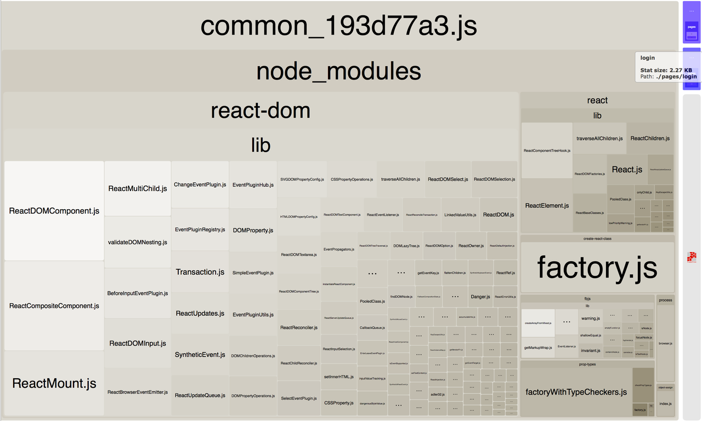

# 2.编译构建与打包全面优化

> 原文链接：[飞书原文](https://u19tul1sz9g.feishu.cn/docx/CPOIdWs5QodG2RxLubXcmhmnnWe)

[引用：20260207 随堂笔记与源码资料](https://www.feishu.cn/docx/HsQBdlBmsocCuExnY9Jcy99Sn2e)

## 课程目标

> **💡 提示**
>
> - 初中级：
>
>   1. **熟悉 webpack5 开发构建配置优化**：熟悉 webpack5 开发构建配置优化，包括 sourcemap、模块解析、构建缓存
>   2. **熟悉 webpack5 产物构建优化**：熟悉 webpack5 产物构建优化，包含 资源优化、chunk、产物分析等
>   3. **熟悉 vite 开发构建配置优化**：熟悉 vite 开发构建配置优化，回顾 bundleless，了解 optimizeDeps 配置
>   4. **熟悉 vite 产物构建优化**：熟悉 vite 产物构建优化细节，包含 chunk、公共资源提取、产物分析等
> - 高级：
>
>   1. **深入 webpack5 开发与生产构建优化**：能根据不同需求，配置以优化构建过程与构建输出产物
>   2. **深入 vite 开发与生产构建优化**：深入掌握并灵活配置 vite 及 灵活使用 vite plugin，优化构建与产物输出

## 补充资料

- sourcemap：https://developer.mozilla.org/en-US/docs/Web/HTTP/Headers/SourceMap
- sourcemap 在监控平台的处理：https://docs.sentry.io/platforms/javascript/sourcemaps/uploading/webpack/
- webpack 优化：https://webpack.js.org/guides/build-performance/
- webpack code-split：https://webpack.js.org/guides/code-splitting/
- webpack dll：https://webpack.js.org/plugins/dll-plugin/
- esbuild 插件列表：https://github.com/esbuild/community-plugins?tab=readme-ov-file


## 相关面试真题


### **关于 webpack 打包构建优化，之前做过哪些？**


**答案：**


我在过往项目中，在使用 Webpack 进行打包构建优化时，常见的优化包括：


1. **代码分割（Code Splitting）：** 使用 Webpack 的 `SplitChunksPlugin` 进行代码分割，将第三方库、公共代码与业务代码分离，提高缓存利用率和加载速度。
2. **Tree Shaking：** 通过配置 `mode: 'production'` 或使用 `TerserPlugin`，移除未引用的代码，减少包体积。
3. **Lazy Loading（懒加载）：** 使用 `import()` 动态加载模块，实现按需加载，减少初始加载时间。
4. **使用 CDN:** 配置 externals，将常用的库如 React、Vue 等通过 CDN 引入，减少打包体积。
5. **缓存优化：** 通过配置 `output.filename` 和 `output.chunkFilename` 中的 `[contenthash]`，生成基于文件内容的哈希值，避免不必要的缓存失效。
6. **开启持久化缓存（Persistent Caching）：** 配置 `cache: { type: 'filesystem' }`，提高二次构建速度。
7. **优化 Loader：** 使用多进程和缓存（如 `thread-loader` 和 `cache-loader`），提升构建速度。还可以通过限制 `babel-loader` 等处理范围来加速构建。
8. **优化开发体验：** 使用 `webpack-dev-server` 的 HMR（热模块替换）功能，提高开发效率；或者通过配置 `resolve.alias` 缩短模块查找路径。


### **你认为 Vite 相对于 Webpack 有哪些优势？**


**答案：**


Vite 相较于 Webpack 的主要优势包括：


1. **极速启动：** Vite 使用原生 ES 模块进行开发时的依赖加载，无需像 Webpack 一样对整个项目进行预打包。因此，Vite 的冷启动速度非常快，尤其是在大型项目中尤为明显。
2. **即时热更新（HMR）：** Vite 的 HMR 速度更快更灵敏，因为它基于 ES 模块，仅更新受影响的模块，而不需要重新构建整个包。
3. **更少的配置：** Vite 的默认配置已经足够健全，开箱即用，开发者通常不需要像使用 Webpack 一样编写大量的配置文件。
4. **现代化浏览器支持：** Vite 针对现代浏览器优化，默认使用 ES6+ 语法，省去了对旧浏览器的兼容配置。
5. **插件生态：** 虽然 Vite 插件生态相对年轻，但其设计简单且功能强大，能够满足大多数场景的需求。
6. **构建速度快：** Vite 使用 esbuild 进行预构建，极大提高了依赖解析和打包的速度。此外，Vite 还使用 Rollup 作为生产环境打包工具，具有较好的打包优化能力。
7. **调试友好：** Vite 生成的源码更接近开发者的源码，调试体验更好，错误追踪更准确。


## Webpack 5 开发构建优化详解


### 开发模式配置


#### 使用 `mode: 'development'`

在开发环境中，配置 `mode: 'development'` 可以启用 Webpack 的内置优化，比如更快的构建速度和未压缩的输出代码，这有助于开发调试。


```JavaScript
module.exports = {
  mode: 'development',
  // 其他配置...
};
```


#### 配置 `devtool: 'eval-cheap-module-source-map'`

`devtool` 配置项控制是否生成 source map 以及生成哪种类型的 source map。`eval-cheap-module-source-map` 是开发模式下的推荐配置，它在构建速度和调试体验之间取得了良好的平衡。


```JavaScript
module.exports = {
  mode: 'development',
  devtool: 'eval-cheap-module-source-map',
  // 其他配置...
};
```


#### 启用 HMR（Hot Module Replacement）

HMR 允许在不刷新整个页面的情况下替换、添加或删除模块。通过 `webpack-dev-server` 的 `hot: true` 配置，可以轻松启用 HMR。


```JavaScript
const webpack = require('webpack');
const WebpackDevServer = require('webpack-dev-server');

module.exports = {
  mode: 'development',
  devtool: 'eval-cheap-module-source-map',
  devServer: {
    contentBase: './dist',
    hot: true,
  },
  plugins: [
    new webpack.HotModuleReplacementPlugin(),
  ],
  // 其他配置...
};
```


### 模块解析优化


#### 使用 `resolve.alias`

通过为常用模块设置路径别名，可以减少解析路径的时间，从而加快构建速度。


```JavaScript
module.exports = {
  mode: 'development',
  resolve: {
    alias: {
      '@components': path.resolve(__dirname, 'src/components/'),
      '@utils': path.resolve(__dirname, 'src/utils/'),
    },
  },
  // 其他配置...
};
```


#### 优化模块路径解析：配置 `resolve.extensions`

通过明确 `resolve.extensions` 中包含的文件扩展名，可以减少 Webpack 在解析模块时的尝试次数，优化构建性能。


```JavaScript
module.exports = {
  mode: 'development',
  resolve: {
    extensions: ['.js', '.jsx', '.json'], // 只包含需要解析的扩展名
  },
  // 其他配置...
};
```


#### 使用 `resolve.modules`

通过配置 `resolve.modules` 明确模块路径，可以避免递归查找，加速模块解析。


```JavaScript
module.exports = {
  mode: 'development',
  resolve: {
    modules: [path.resolve(__dirname, 'src'), 'node_modules'],
  },
  // 其他配置...
};
```


### 缓存优化


#### 持久化缓存：启用文件系统缓存

Webpack 5 引入了文件系统缓存机制，通过启用 `cache: { type: 'filesystem' }` 可以显著减少二次构建时间。


```JavaScript
module.exports = {
  mode: 'development',
  cache: {
    type: 'filesystem',
  },
  // 其他配置...
};
```


#### 使用 `babel-loader` 的 `cacheDirectory` 选项

`babel-loader` 的 `cacheDirectory` 选项可以缓存 Babel 转换结果，以加速重新构建。


```JavaScript
module.exports = {
  mode: 'development',
  module: {
    rules: [
      {
        test: /\.js$/,
        exclude: /node_modules/,
        use: {
          loader: 'babel-loader',
          options: {
            cacheDirectory: true,
          },
        },
      },
    ],
  },
  // 其他配置...
};
```


### 其他优化


#### 减少监听文件

通过 `watchOptions` 配置，可以排除不必要的文件或文件夹，减少文件监听数量，降低系统资源消耗。


```JavaScript
module.exports = {
  mode: 'development',
  watchOptions: {
    ignored: /node_modules/, // 排除 node_modules 目录
  },
  // 其他配置...
};
```


#### 使用多进程并行构建

通过 `thread-loader` 或 `webpack-parallel-uglify-plugin` 等插件，可以利用多核 CPU 的优势，加快构建速度。


```JavaScript
const ThreadLoader = require('thread-loader');

module.exports = {
  mode: 'development',
  module: {
    rules: [
      {
        test: /\.js$/,
        use: [
          {
            loader: 'thread-loader',
            options: {
              workers: 2,
            },
          },
          'babel-loader',
        ],
      },
    ],
  },
  // 其他配置...
};
```


#### 合理使用 `DllPlugin` 和 `DllReferencePlugin`

对于不常变化的第三方库，可以使用 `DllPlugin` 和 `DllReferencePlugin` 将它们打包为独立的 DLL 文件，减少每次构建时的打包时间。


```JavaScript
const webpack = require('webpack');

module.exports = {
  mode: 'development',
  plugins: [
    new webpack.DllPlugin({
      name: '[name]',
      path: path.join(__dirname, 'dist', '[name]-manifest.json'),
    }),
  ],
  // 其他配置...
};
```


使用 `DllReferencePlugin` 引用之前打包的 DLL 文件：


```JavaScript
const webpack = require('webpack');

module.exports = {
  mode: 'development',
  plugins: [
    new webpack.DllReferencePlugin({
      manifest: require('./dist/vendor-manifest.json'),
    }),
  ],
  // 其他配置...
};
```


## Webpack 5 产物构建优化详解


在生产环境中，Webpack 5 提供了多种优化功能，以确保最终的打包结果尽可能小，并具有良好的性能

以下是如何配置生产模式的详细说明：


### 生产模式配置


#### 使用 `mode: 'production'`

Webpack 5 提供了 `production` 模式，该模式会自动启用多种优化选项，例如代码压缩、Tree Shaking、作用域提升等，以减少输出文件的体积并提高运行时性能。


```JavaScript
module.exports = {
  mode: 'production',
  // 其他配置...
};
```


使用 `mode: 'production'` 时，Webpack 会自动启用以下功能：

- **代码压缩**：通过 TerserPlugin 来压缩 JavaScript 代码。
- **Tree Shaking**：删除未使用的模块。
- **作用域提升（Scope Hoisting）**：将模块合并到一个函数中以减少闭包的数量。
- **自动代码分割**：Webpack 会自动分析模块依赖，并进行代码分割。


#### 使用 `optimization.splitChunks`

`splitChunks` 选项可以将公共代码和第三方库分离出来，从而减少代码冗余，优化缓存。


```JavaScript
module.exports = {
  mode: 'production',
  optimization: {
    splitChunks: {
      chunks: 'all',
      cacheGroups: {
        vendor: {
          test: /[\\/]node_modules[\\/]/,
          name: 'vendors',
          chunks: 'all',
        },
      },
    },
  },
  // 其他配置...
};
```


#### 启用 `optimization.minimize`

`minimize` 选项启用代码压缩，默认使用 TerserPlugin。如果需要自定义压缩行为，可以手动配置 TerserPlugin。


```JavaScript
const TerserPlugin = require('terser-webpack-plugin');

module.exports = {
  mode: 'production',
  optimization: {
    minimize: true,
    minimizer: [
      new TerserPlugin({
        terserOptions: {
          compress: {
            drop_console: true,
          },
        },
      }),
    ],
  },
  // 其他配置...
};
```


### Tree Shaking


#### 确保使用 ES6 模块

Tree Shaking 依赖于 ES6 模块语法，因此需要确保项目中的模块使用 `import` 和 `export` 语法。


```JavaScript
// Example of ES6 Module
import { foo } from './module';

export function bar() {
  return foo();
}
```


#### 清理无用代码：配置 `sideEffects`

通过设置 `sideEffects` 选项，可以告知 Webpack 哪些模块具有副作用，从而移除未使用的代码。


```JavaScript
module.exports = {
  mode: 'production',
  optimization: {
      // 如果整个项目没有副作用，直接设置为 false
      sideEffects: false,
      // 如果有些文件具有副作用，可以指定数组
      sideEffects: ['*.css', '*.scss'],
      // 其他配置...
  }
};
```


`sideEffects: false` 表示所有模块都可以安全地进行 Tree Shaking。如果某些模块确实存在副作用（如修改全局变量），则需要在数组中指定这些文件。


### 图片和资源优化


#### 使用 `image-webpack-loader` 压缩图片

`image-webpack-loader` 是一个图片优化工具，可以在打包过程中自动压缩图片资源。


```JavaScript
const ImageMinimizerPlugin = require('image-minimizer-webpack-plugin');

module.exports = {
  mode: 'production',
  module: {
    rules: [
      {
        test: /\.(png|jpe?g|gif|svg)$/i,
        use: [
          {
            loader: 'file-loader',
          },
          {
            loader: 'image-webpack-loader',
            options: {
              mozjpeg: {
                progressive: true,
                quality: 75,
              },
              optipng: {
                enabled: true,
              },
              pngquant: {
                quality: [0.65, 0.90],
                speed: 4,
              },
              gifsicle: {
                interlaced: false,
              },
              webp: {
                quality: 75,
              },
            },
          },
        ],
      },
    ],
  },
  // 其他配置...
};
```


#### 使用 `url-loader` 和 `file-loader`

`url-loader` 和 `file-loader` 允许根据文件大小决定是否将文件内联到代码中，或输出为单独的文件。


```JavaScript
module.exports = {
  mode: 'production',
  module: {
    rules: [
      {
        test: /\.(png|jpe?g|gif|svg)$/i,
        use: [
          {
            loader: 'url-loader',
            options: {
              limit: 8192, // 小于 8KB 的文件将会被转换成 base64 内联到代码中
              fallback: 'file-loader', // 否则调用 file-loader
              name: '[name].[hash:8].[ext]',
              outputPath: 'images/',
            },
          },
        ],
      },
    ],
  },
  // 其他配置...
};
```


### 代码分割和懒加载


#### 使用 `import()` 动态导入实现代码懒加载

通过 `import()` 语法可以动态导入模块，从而实现代码懒加载。这有助于减小初始加载的代码体积，提高应用加载速度。


```JavaScript
// Example of dynamic import
function loadComponent() {
  return import('./component').then(module => {
    const component = module.default;
    // 使用 component
  });
}
```


动态导入的模块将会被分割成一个单独的包，并在需要时加载。


#### 通过 `splitChunks` 进行代码分割

除了在生产模式下自动启用的代码分割机制之外，还可以通过手动配置 `splitChunks` 选项进一步优化代码分割。


```JavaScript
module.exports = {
  mode: 'production', // 将 Webpack 模式设置为 'production'，启用优化（如压缩、树摇等）以缩小输出的文件体积。
  
  optimization: {
    splitChunks: {
      chunks: 'all', // 对所有类型的 chunks 进行代码分割，包括同步和异步 chunks。
      minSize: 20000, // 生成的 chunk 的最小大小（以字节为单位）。小于此大小的 chunk 不会被分割。
      maxSize: 0, // 如果设置了 maxSize，Webpack 将尝试将 chunk 分割成更小的部分。0 表示不限制 chunk 的最大大小。
      minChunks: 1, // 最少有多少个 chunks（模块）共享此模块时才会分割代码。
      maxAsyncRequests: 30, // 对于异步加载（动态 import）的最大并行请求数。
      maxInitialRequests: 30, // 入口点的最大并行请求数。
      automaticNameDelimiter: '~', // 自动生成的 chunk 名称的分隔符。
      
      cacheGroups: { // 用于控制如何形成块的缓存组
        defaultVendors: {
          test: /[\\/]node_modules[\\/]/, // 过滤条件，匹配 node_modules 文件夹下的模块。
          priority: -10, // 优先级，决定了一个模块可以属于多个缓存组时的优先选择。数值越高，优先级越高。
          reuseExistingChunk: true, // 如果当前 chunk 中已有这个模块，则重用，而不是创建一个新的 chunk。
        },
        default: {
          minChunks: 2, // 至少有 2 个 chunk 引用时才会生成一个新的 chunk。
          priority: -20, // 优先级较低的默认组。
          reuseExistingChunk: true, // 重用已经存在的 chunk 而不是创建新的 chunk。
        },
      },
    },
  },

  // 其他配置...
};
```


### 输出产物分析【重要】


构建出的产物，我们需要进行分析，分析的几个要点分别为：

- 有没有体积过大的资源
- 有没有按需将资源切分 chunk


要分析 webpack 构建产物情况，我们需要先了解一下 webpack 构建输出的指标数据。


在启动 Webpack 时，支持两个参数，分别是：


- --profile：记录下构建过程中的耗时信息；
- --json：以 JSON 的格式输出构建结果，最后只输出一个 .json 文件，这个文件中包括所有构建相关的信息；


在启动 Webpack 时带上以上两个参数，启动命令如下 `webpack --profile --json > stats.json`，你会发现项目中多出了一个 `stats.json` 文件。 这个 stats.json 文件是给后面介绍的可视化分析工具使用的。


`webpack --profile --json` 会输出字符串形式的 JSON，`> stats.json` 是 UNIX/Linux 系统中的管道命令、含义是把 `webpack --profile --json` 输出的内容通过管道输出到 stats.json 文件中。


通常，我们会直接选择使用分析插件来完成以上工作，首选 webpack-bundle-analyzer。

[webpack-bundle-analyzer](https://www.npmjs.com/package/webpack-bundle-analyzer) 是一个可视化分析工具，可以非常直观分析出构建产物情况

先来看下它的效果图：




它能方便的让你知道：

- 打包出的文件中都包含了什么；
- 每个文件的尺寸在总体中的占比，一眼看出哪些文件尺寸大；
- 模块之间的包含关系；
- 每个文件的 Gzip 后的大小；


`webpack-bundle-analyzer` 是一个强大的工具，帮助开发者可视化 Webpack 打包后生成的 bundle 文件结构。它可以显示各个模块所占的大小，从而帮助你优化代码和减小 bundle 体积。以下是详细的安装与使用步骤。


#### 安装 `webpack-bundle-analyzer`


首先，需要在你的项目中安装 `webpack-bundle-analyzer`。你可以使用 npm 或 yarn 进行安装：


```Bash
npm install --save-dev webpack-bundle-analyzer
```


或者


```Bash
yarn add --dev webpack-bundle-analyzer
```


#### 在 Webpack 配置中使用


`webpack-bundle-analyzer` 可以通过两种方式使用：作为 Webpack 插件或通过 CLI 命令。


##### 作为 Webpack 插件使用


你可以在 `webpack.config.js` 文件中配置 `webpack-bundle-analyzer` 插件：


```JavaScript
const BundleAnalyzerPlugin = require('webpack-bundle-analyzer').BundleAnalyzerPlugin;

module.exports = {
  // 你的其他 webpack 配置...
  plugins: [
    new BundleAnalyzerPlugin({
      analyzerMode: 'server', // 可选值：'server', 'static', 'disabled'
      analyzerHost: '127.0.0.1',
      analyzerPort: 8888,
      reportFilename: 'report.html',
      defaultSizes: 'parsed', // 可选值：'parsed', 'gzip'
      openAnalyzer: true,
      generateStatsFile: false,
      statsFilename: 'stats.json',
      statsOptions: null,
      logLevel: 'info'
    })
  ]
};
```


##### 配置参数说明：


- `analyzerMode`: 决定报告的输出方式。有以下几种模式：

  - `server`: 启动一个 HTTP 服务器，展示报告。
  - `static`: 生成一个静态的 HTML 文件，可以在 `reportFilename` 中指定文件名。
  - `json`: 生成 JSON 格式的报告。
  - `disabled`: 不生成报告。


- `analyzerHost` 和 `analyzerPort`: 在 `server` 模式下，配置 HTTP 服务器的主机和端口。


- `reportFilename`: 在 `static` 模式下，生成的报告文件名。


- `defaultSizes`: 显示文件大小的方式，`parsed` 为解析后的大小，`gzip` 为 gzip 压缩后的大小。


- `openAnalyzer`: 构建完成后是否自动打开浏览器展示报告。


- `generateStatsFile`: 是否生成 `stats.json` 文件，可以通过该文件查看更详细的打包信息。


- `statsFilename`: `stats.json` 文件名。


- `logLevel`: 输出日志的级别，有 `info`, `warn`, `error`, `silent` 可选。


##### 通过 CLI 命令使用


你也可以使用 Webpack 的 `--profile` 和 `--json` 选项生成 `stats.json` 文件，然后使用 `webpack-bundle-analyzer` 命令来分析该文件。


```Bash
webpack --profile --json > stats.json
```


然后运行：


```Bash
npx webpack-bundle-analyzer stats.json
```


#### 使用 `webpack-bundle-analyzer` 分析 Bundle


当你配置好后，在运行 `webpack` 时，如果设置了 `analyzerMode: 'server'`，Webpack 会启动一个本地服务器（默认地址为 `http://127.0.0.1:8888`），并自动在浏览器中打开 bundle 分析报告。


你可以在报告中查看每个模块所占的大小、依赖关系，以及识别哪些模块占用了过多的空间，从而可以针对性地优化代码，例如分离出共享模块、移除未使用的代码、或者引入懒加载等。


## Vite 开发构建优化详解


### 开发模式优化


#### 启用模块热替换（HMR）

模块热替换（HMR, Hot Module Replacement）是 Vite 开发服务器的一项核心功能，它允许你在不完全刷新页面的情况下，实时更新模块的内容。Vite 默认启用 HMR，你只需要在开发过程中编写代码，HMR 将自动处理模块的更新，保持状态不变，提升开发效率。


- **HMR 机制原理**：HMR 是通过 WebSocket 与浏览器进行通信，当模块文件发生变化时，Vite 服务器将重新编译该模块，并通过 WebSocket 通知客户端进行热替换。与传统的完全刷新不同，HMR 仅更新变化的部分，大大提高了调试体验。


- **示例**：

假设你在开发一个 React 应用，有一个组件 `HelloWorld`。在你修改组件内容后，HMR 会自动更新浏览器中的组件实例，而不刷新页面。


```JavaScript
import React from 'react';

function HelloWorld() {
  return <h1>Hello, World!</h1>;
}

export default HelloWorld;
```


  当你修改 `Hello, World!` 为其他内容时，浏览器中对应的部分会自动更新，而页面不会重新加载。


#### 调整 optimizeDeps 选项

Vite 使用 `esbuild` 预构建依赖，默认情况下，它会自动扫描你的项目并优化依赖。但你可以通过 `optimizeDeps` 选项更细粒度地控制这些行为，提升开发启动速度。


- **optimizeDeps.include**：指定要提前预构建的依赖包，这些依赖在首次启动时会被 Vite 优化为较小的模块，以减少后续加载时间。


- **optimizeDeps.exclude**：指定不需要预构建的依赖包，这可以减少无用的预构建操作，提升性能。


- **示例**：

在 `vite.config.js` 中配置 `optimizeDeps`：


```JavaScript
import { defineConfig } from 'vite';

export default defineConfig({
  optimizeDeps: {
    include: ['react', 'react-dom'],
    exclude: ['some-large-lib'],
  },
});
```


#### 使用 esbuild 进行依赖预构建

Vite 默认使用 `esbuild` 进行依赖预构建。相比传统的 JavaScript 构建工具（如 Babel 或 Terser），`esbuild` 的速度非常快，因为它是用 Go 语言编写并且专为速度优化设计。

通过高效的依赖解析和并行化编译，`esbuild` 能够在极短的时间内完成对模块的预构建，显著减少开发服务器的启动时间。 


esbuild 详细内容可以查看：[引用：3.多场景构建工具选型与原理剖析](https://www.feishu.cn/docx/Al7CdLA8XoRhH3xAZ96cPZjDnPd)


### 环境变量


#### 使用 .env 文件配置环境变量

在开发和部署过程中，使用 `.env` 文件来管理环境变量是最佳实践之一。Vite 支持 `.env` 文件，可以为不同环境（如开发、测试、生产）设置不同的配置。


- **示例**：

在项目根目录创建 `.env` 文件，并定义一些变量：


```Plain Text
VITE_API_URL=https://api.example.com
VITE_API_KEY=your_api_key
```


  然后，在代码中访问这些变量：


```JavaScript
const apiUrl = import.meta.env.VITE_API_URL;
const apiKey = import.meta.env.VITE_API_KEY;

console.log(`API URL: ${apiUrl}, API Key: ${apiKey}`);
```


在 index.html 中使用：


```HTML
%VITE_API_URL%
```


- **多环境支持**：你可以为不同的环境创建不同的 `.env` 文件，例如 `.env.development`、`.env.production` 等。Vite 会根据当前的环境（通过 `--mode` 指定）加载相应的 `.env` 文件。


#### 通过 define 选项注入全局变量

你可以使用 Vite 的 `define` 选项来注入全局变量。这个选项允许你在构建过程中将指定的字符串替换为具体的值，类似于 Webpack 中的 `DefinePlugin`。


- **示例**：

在 `vite.config.js` 中配置 `define` 选项：


```JavaScript
export default defineConfig({
  define: {
    'process.env.NODE_ENV': JSON.stringify(process.env.NODE_ENV),
  },
});
```


  这将使得代码中所有出现 `process.env.NODE_ENV` 的地方在构建时被替换为对应的值。但我们一般在开发时，基于 import.meta 配置的变量居多。


### 文件监听


#### 调整 server.watch 选项

Vite 在开发模式下会监听文件的变化，以便进行热更新。但在某些情况下，项目中可能有一些不需要监听的大量文件，这会增加文件监听的负担并降低构建速度。


- **示例**：

你可以通过 `server.watch` 选项来调整监听的行为，例如忽略某些文件或目录：


```JavaScript
export default defineConfig({
  server: {
    watch: {
      ignored: ['**/large-static-files/**'],
    },
  },
});
```


  这样，Vite 将忽略 `large-static-files` 目录中的文件变化，不会对其进行监听，从而减少资源消耗。


#### 优化开发体验的关键点

- **减少不必要的监听**：通过合理配置 `server.watch`，你可以大大减少 Vite 的监听工作量，提升开发体验。
- **适当的预构建**：通过配置 `optimizeDeps` 来减少启动时间和构建时间，同时确保常用依赖被预先优化。


## Vite 产物构建优化详解


### 生产模式优化


在 Vite 中，生产模式的优化是为了确保构建产物体积小且性能好。可以通过以下方法来优化：


#### 使用 `build.minify` 选项

`build.minify` 用于选择代码压缩工具。Vite 支持两种压缩工具：


- **Terser**: 压缩效果较好，但构建速度较慢。适用于对产物体积要求较高的项目。
- **esbuild**: 压缩速度极快，但压缩率较低。适用于需要快速构建的项目。


**配置示例：**


```JavaScript
// vite.config.js
export default {
  build: {
    minify: 'terser', // 或 'esbuild'
    terserOptions: {
      compress: {
        drop_console: true, // 移除 console 语句
        drop_debugger: true, // 移除 debugger 语句
      },
    },
  },
}
```


#### 配置 `build.rollupOptions`

通过配置 Rollup 的选项，可以进一步优化代码输出。具体方法包括：


- **代码分割**: 自动或手动拆分代码，减少单个模块的体积。
- **手动拆分模块**: 对于一些较大的第三方库或业务模块，可以手动进行拆分，以便按需加载。


**配置示例：**


```JavaScript
// vite.config.js
export default {
  build: {
    rollupOptions: {
      output: {
        // 自动代码分割
        manualChunks(id) {
          if (id.includes('node_modules')) {
            return id.toString().split('node_modules/')[1].split('/')[0].toString();
          }
        }
      }
    }
  }
}
```


### 代码分割和懒加载


代码分割和懒加载有助于优化页面的初始加载性能。通过按需加载和延迟加载，减少首次加载所需的资源。


#### 使用 `manualChunks` 进行手动分割


通过 `manualChunks` 选项，可以手动将一些模块分离到单独的文件中，从而实现更灵活的代码分割。


**配置示例：**


```JavaScript
// vite.config.js
export default {
  build: {
    rollupOptions: {
      output: {
        manualChunks: {
          'vendor': ['react', 'react-dom'], // 手动将 React 库拆分到一个独立的模块中
        }
      }
    }
  }
}
```


#### 动态导入模块


动态导入 (`import()`) 是实现懒加载的核心技术。Vite 支持在代码中使用动态导入，将某些资源延迟加载。


**代码示例：**


```JavaScript
// 假设有一个大型组件或模块 MyComponent.js
// 通过动态导入实现懒加载
const MyComponent = () => import('./components/MyComponent.vue');

// 在组件中使用时
export default {
  components: {
    MyComponent
  },
  // ...其他选项
}
```


### 资源优化


静态资源（如图片、字体等）的优化也是提升性能的重要手段。通过插件和配置，可以减小资源体积并优化加载速度。


#### 图片和字体资源优化【如果是转为 webp，选择 cwebp，否则以下给出的是很早之前的库，已停止维护】


可以使用 `vite-plugin-imagemin` 等插件来压缩图片资源，从而减小资源文件的体积。


**配置示例：**


```JavaScript
// vite.config.js
import viteImagemin from 'vite-plugin-imagemin';

export default {
  plugins: [
    viteImagemin({
      gifsicle: {
        optimizationLevel: 7,
        interlaced: false,
      },
      optipng: {
        optimizationLevel: 7,
      },
      mozjpeg: {
        quality: 20,
      },
      svgo: {
        plugins: [
          {
            name: 'removeViewBox',
          },
          {
            name: 'removeEmptyAttrs',
            active: false,
          },
        ],
      },
    }),
  ],
};
```


> 对于 imagemin 的报错问题，属于本地执行二进制问题，因为我是 apple arm 芯片架构，需要重建 pngquant-bin 相关内容
> 
> - brew install libimagequant libpng pngquant
> - 之后再执行 pnpm rebuild pngquant-bin 或重新安装依赖，让 pngquant-bin 的“预构建测试/编译”能通过
> 
> 不过这个大家了解就好，也提到图片处理最优解 open-cv、视频 FFmpeg


#### 控制资源内联


`build.assetsInlineLimit` 选项可以设置一个阈值，控制小于该值的资源是否直接内联到 JavaScript 文件中。这对于减少 HTTP 请求数量有帮助。


**配置示例：**


```JavaScript
// vite.config.js
export default {
  build: {
    assetsInlineLimit: 4096, // 默认 4KB，超过该值的资源会以独立文件形式输出
  }
}
```


### 分析工具


为了更好地理解和优化构建产物的体积，可以使用可视化分析工具。


#### 使用 `rollup-plugin-visualizer` 插件


`rollup-plugin-visualizer` 可以生成一张模块体积的可视化图表，帮助开发者找出体积较大的模块，并针对性地优化。


**配置示例：**


```JavaScript
// vite.config.js
import { visualizer } from 'rollup-plugin-visualizer';

export default {
  build: {
    rollupOptions: {
      plugins: [
        visualizer({
          filename: './dist/stats.html', // 生成的分析文件
          open: true, // 构建完成后自动打开分析图表
        }),
      ],
    },
  },
}
```


### 补充概念和官方文档参考


Vite 的构建优化基于 Rollup，因此可以充分利用 Rollup 的插件生态和配置选项。通过灵活地使用代码分割、懒加载、资源优化等策略，Vite 可以显著减少生产环境下的包体积，提升加载性能。对于进一步的优化建议和最佳实践，可以参考 [Vite 官方文档](https://vitejs.dev/guide/dep-pre-bundling.html) 以及 [Rollup 官方文档](https://rollupjs.org/)。
