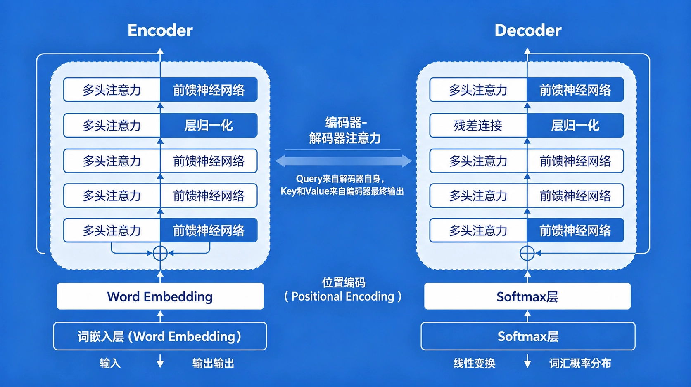
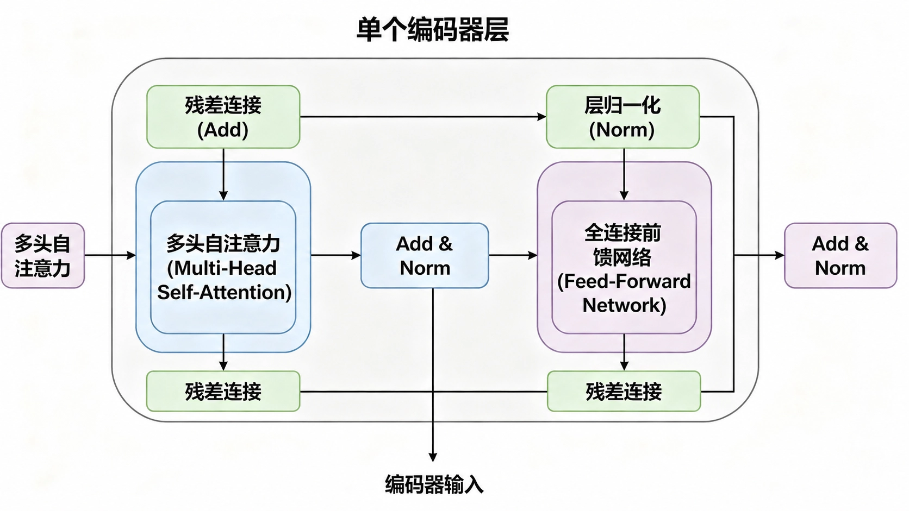
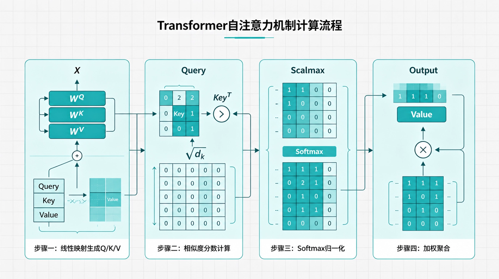

# 1.团队 AI 提效方案与实践

> 原文链接：[飞书原文](https://u19tul1sz9g.feishu.cn/docx/X8NMd1TfaovHcbxEqIocFl6tnxe)

[引用：20260207 随堂笔记与源码资料](https://www.feishu.cn/docx/HsQBdlBmsocCuExnY9Jcy99Sn2e)
[本地资源：1.ai-team-notes](<../../20260207 随堂笔记与源码资料-压缩包/8.AI 提效与 AI Agent 开发进阶/1.ai-team-notes>)

## 课程目标

> **💡 提示**
>
> - 初中级
>
>   1. **理解AI编程的底层原理**：掌握Transformer架构和自注意力机制的核心思想，能够解释为什么AI能理解代码上下文，以及编程AI从静态补全到自主编程的四代演进路径。
>   2. **熟练使用高级提示词工程**：能够独立编写结构化提示词（遵循角色设定、清晰明确、分步拆解、反馈迭代四大原则），并灵活运用团队沉淀的前端专属模板库（组件生成、代码审查、调试排错、代码重构），显著提升日常开发效率。
>   3. **独立安装配置Codex CLI**：掌握npm/brew安装、API Key认证方式，能够使用CC Switch统一管理多个AI供应商（如GPT-5.5、DeepSeek V4），并熟练运用`/init`、`/model`、`/plan`、`/skills`、`/mcp`、`/compact`、`@`、`/plugins`等核心命令完成日常开发任务。
>   4. **理解AI核心能力体系**：能够清晰区分提示词、工具、MCP、技能、CLI五个概念，并画出层级关系图（提示词→技能→工具→MCP→CLI），理解为什么CLI是团队规模化接入的最佳形式。
>   5. **应用Spec驱动开发进行个人项目**：能够独立完成从需求描述到代码生成的SDD五步流程（规则→规范→方案→任务→实现），在个人小项目或功能模块中实现40%-60%的编码效率提升。
> - 高级
>
>   1. **设计团队级AI提效落地路线**：根据团队现状（规模、技术栈、成熟度），制定包含基础设施搭建、试点项目验证、全面推广、规模化自动化的四阶段落地计划，并预估各阶段时间投入和预期收益。
>   2. **主导Spec驱动开发的团队实施**：能够组织团队编写`constitution.md`（团队规则），建立可复用的规范模板库（组件规范、API规范、测试规范），设计AI代码审查的质量门禁机制（测试覆盖率、lint通过率、规范一致性），确保AI生成代码的质量和一致性。
>   3. **搭建团队AI工具链与自动化流水线**：能够组合使用Trae、Codex、Claude、DeepSeek等多工具，构建从设计稿到可部署代码的自动化流程；能够通过MCP连接内部组件库、设计系统和API文档；能够将AI能力封装为团队共享的Skills，并通过`/skills`命令实现一键复用。
>   4. **建立效果度量与持续优化体系**：能够从效率、质量、采纳率、满意度四个维度设立AI提效指标（如功能交付周期、线上bug率、AI生成代码占比），并基于数据驱动的方式迭代团队AI规范和提示词模板。
>   5. **引领团队应对AI时代的能力转型**：能够重新定义前端工程师的能力模型（从代码编写者转向系统设计者+规范制定者+结果审查者），组织内部培训与知识分享机制，消除团队成员间的能力差异。

## 补充资料


- AI 技术演进（Transformer 开山之作）：https://arxiv.org/abs/1706.03762
- AI 智能体 (Agent) 深度解析 (Lilian Weng)：https://lilianweng.github.io/posts/2023-06-23-agent/
- 本地化大模型运行工具 Ollama：https://ollama.com/
- OpenAI 提示词工程指南：https://platform.openai.com/docs/guides/prompt-engineering
- 综合性提示词工程指南 (DAIR.AI)：https://www.promptingguide.ai/zh
- 高级提示词思维链 (CoT) 论文：https://arxiv.org/abs/2201.11903
- 前端提示词工程实践指南：https://developer.baidu.com/article/detail.html?id=3427614
- GitHub Copilot 官方文档：https://docs.github.com/zh/copilot
- Claude (Anthropic) 开发者文档：https://docs.anthropic.com/zh-CN/docs/intro-to-claude
- MCP 核心概念、接入与实战指南：https://developer.baidu.com/article/sdarticle-3
- MCP 实战开发完整教程：https://developer.baidu.com/article/detail.html?id=3472983
- LangChain.js (JavaScript RAG 框架)：https://js.langchain.com/docs/introduction/
- LlamaIndex.TS (RAG 数据框架)：https://ts.llamaindex.ai/
- Mastra (TypeScript AI 工程框架)：https://mastra.ai/
- GitHub Spec Kit 官方框架：https://github.com/github/spec-kit
- Spec Kit 理论入门（Microsoft Learn）：https://learn.microsoft.com/zh-cn/training/modules/implement-spec-driven-development/
- Spec Kit 工作流深度解析（Thoughtworks Radar）：https://www.thoughtworks.com/radar/languages-and-frameworks/github-spec-kit
- 敏捷人工智能驱动开发（BMAD Method）：https://github.com/bmad-code-org/BMAD-METHOD
- AI 驱动的 Code Review 工具 (PR-Agent)：https://github.com/Codium-ai/pr-agent


## 相关面试真题


### 团队规模化 AI 提效


**题目：**  

你们前端团队计划全面引入 AI 辅助编程，但成员能力参差不齐，且担心 AI 生成的代码质量不可控、不符合团队规范。作为技术负责人，请结合 Spec‑Driven Development（SDD）方法论，设计一套从零到一的落地实施方案，并说明如何保证代码质量和规范一致性。


**解答要点：**


#### 1. 整体思路：以 SDD 为核心，分阶段推进


SDD（规范驱动开发）是目前唯一经大规模生产验证的团队级方案，核心理念是“先写规范，AI 按图施工”。通过将团队约定和需求转化为可执行的规范，让 AI 在约束下生成代码，人类则聚焦于规范审查和结果验收。


#### 2. 四阶段落地路线


- **第一阶段（1周）：基础设施 + 团队规则**  

  - 为骨干成员安装 Codex CLI 和 CC Switch，统一 API 管理。  
  - 组织编写 `constitution.md`（团队规则），明确技术栈（React+TS）、状态管理方案、样式规范（Tailwind）、测试框架（Jest+RTL）以及 AI 开发红线（例如“不得修改核心架构文件”“必须包含 JSDoc 注释”）。  
  - 提供 1 小时入门培训，让每个人都跑通一个最简单的 SDD 示例（如表单组件）。
- **第二阶段（2-3周）：试点项目验证**  

  - 选择一个 1-2 周工作量的 CRUD 类功能作为试点。  
  - 严格遵循 SDD 五步法：规则 → 功能规范（`spec.md`） → 技术方案（`plan.md`） → 任务拆解（`tasks.md`） → AI 实现 + 自我验证 → 人工审查。  
  - 记录每个环节的实际耗时、AI 生成代码的一次通过率、不符合规范的地方，复盘后优化规则和模板。
- **第三阶段（1个月）：全面推广**  

  - 制定团队 AI 使用规范（例如“新增复杂组件必须先写 spec”“AI 生成的 PR 必须附带测试报告”）。  
  - 建立公共提示词库和规范模板库（`spec-templates/`），降低编写规范的门槛。  
  - 设立“AI 采纳率”指标（如 AI 生成代码行数占比），每月分享优秀案例和踩坑经验。
- **第四阶段（持续）：规模化与自动化**  

  - 将 SDD 流程与 Jira/GitHub Issues 集成，需求描述自动触发规范生成。  
  - 封装团队专属 Skills（如“设计图 转 React 组件”“API 接口类型生成”），通过 `/skills` 共享。  
  - 探索无人值守的夜间自动化重构或测试生成。

#### 3. 保证代码质量和规范一致性的具体措施


- **强制代码审查**：所有 AI 生成的 PR 必须至少一名人类 Reviewer 确认。审查重点不是逐行读代码，而是：  

  - 规范与实现是否一致（对照 `spec.md`）。  
  - 边界条件和异常处理是否完备。  
  - 性能和安全性是否达标。  
- **自我验证机制**：在给 AI 的任务中强制要求执行 `npm run test && npm run lint`，并修复所有失败。只有当测试覆盖率 ≥80%、lint 零错误时，AI 才能标记任务完成。  
- **规则版本控制**：`constitution.md` 纳入 Git 仓库，变更需经过团队评审。AI 在 `/init` 后会读取该文件，后续所有生成都受其约束。  
- **持续度量**：每周统计“AI 生成代码的审查通过率”“规范偏差率”，发现问题立即回溯到规则或模板的不足。


### Codex CLI 高级使用与复杂任务拆解


**题目：**  

你正在使用 Codex TUI 开发一个大型前端项目，需要将多个遗留的 JavaScript 类组件重构为 TypeScript 函数式组件，并且这些组件依赖一个内部的设计系统。请结合 `/plan`、`/mcp`、`@` 等命令，详细描述你会如何指挥 Codex 完成这一复杂任务，并解释每个命令的作用。


**解答要点：**


#### 1. 任务分析


- **复杂性**：涉及多个文件、跨组件依赖、从 JS 到 TS 的转换、样式需要与设计对齐。  
- **目标**：让 AI 自主规划、执行、验证，尽量减少人工干预。

#### 2. 操作步骤（在 Codex TUI 中依次执行）


##### Step 1: 项目初始化与模型选择


```Bash
cd legacy-project
codex
/init                     # 让 Codex 扫描 package.json/tsconfig.json，识别当前为 React + JS 项目
/model gpt-5.5-codex      # 切换为高精度模型（重构任务复杂度高）
```


##### Step 2: 连接 Pencil MCP 服务（或者 figma）


作用：让 Codex 获得读取 Pencil 设计稿的能力，后续可以在提示词中引用具体设计稿的 Frame URL。


##### Step 3: 使用 `/plan` 生成详细重构计划


```Bash
/plan 将 src/legacy/components 目录下所有 .js 类组件重构为 TypeScript 函数式组件。
要求：
- 保留原有 props 和 state 逻辑，转换为 useState/useEffect。
- 为每个组件生成对应的 .tsx 文件及类型定义（interface Props）。
- 样式需要与设计稿 （frame id） 保持一致。
- 重构后运行 `npm run type-check` 和 `npm test` 并确保通过。
```


Codex 会输出一个结构化计划，例如：

```Plain Text
计划 ID: plan_20260528_002
步骤1: 分析组件列表及依赖关系 (影响文件: Button, Modal, Table...)
步骤2: 为每个组件生成 TypeScript 接口定义
步骤3: 逐个转换组件：Button → Button.tsx
步骤4: 对照设计图更新 CSS 类名和样式变量
步骤5: 运行类型检查和单元测试，修复错误
是否执行？[y/n]
```


作用：`/plan` 强制 AI 先思考再行动，避免盲目修改。人类可以在执行前审查计划是否合理。


##### Step 4: 执行计划并利用 `@` 引用特定文件


```Bash
y   # 同意执行计划

# 在转换过程中，如果某个组件特别复杂，可以用 @ 精准提问
> @src/legacy/components/DataTable.js 这个组件依赖外部 window 对象，重构时如何保持兼容？
```


作用：`@` 告诉 Codex 只关注该文件，减少上下文噪声，提高回答准确性。


##### Step 5: 样式对齐 – 结合 MCP


```Bash
> 请检查 DataTable 组件的表头样式与设计稿的差异，并给出调整后的 Tailwind 类名
```


Codex 会通过 MCP 拉取 Pencil 节点信息，对比当前代码，输出具体的样式修改建议。


##### Step 6: 验证与迭代


```Bash
> 运行 npm run type-check 并修复所有错误
> 运行 npm test -- --coverage --changedSince=HEAD
```


如果测试失败，Codex 会自动分析失败原因并修改代码，直到全部通过。


### 提示词工程与工具组合实战


**题目：**  

你正在开发一个 React 组件库，需要根据 UI 设计师提供的 Pencil/Figma 设计稿快速生成一个“数据统计卡片”组件，该组件需支持暗色主题、响应式布局，并与后端 API 集成。请写出你向 AI 发送的**完整提示词**，并说明你会如何组合使用 Trae、Codex、MCP 等工具来最大化效率。


**解答要点：**


#### 1. 完整提示词（可直接复制使用）


```Markdown
你是一位资深前端工程师，遵循团队规则（TypeScript + React函数组件 + Tailwind CSS + 暗色主题支持）。

任务：根据以下设计稿链接，生成一个“数据统计卡片”组件。
设计稿：https://pencil.com/file/abc123/dashboard-card

功能需求：
- 卡片展示标题、数值、趋势图标（上升/下降）、环比百分比。
- 数值和趋势通过 props 传入（value: number, trend: 'up' | 'down', percent: number）。
- 支持暗色主题：通过 CSS 变量或 `dark:` 修饰符自动适配。
- 响应式：在移动端卡片宽度 100%，PC 端最大宽度 320px。
- 鼠标悬停时有轻微阴影动画。

技术约束：
- 使用 Tailwind CSS 实现样式，遵循移动优先原则。
- 组件文件命名为 StatsCard.tsx，包含 TypeScript 接口定义。
- 生成对应的单元测试（Jest + React Testing Library），覆盖正常渲染、暗色主题 class、点击事件（若有）。

额外要求：
- 如果设计稿中缺少某些状态（如加载态），请自行补充 skeleton loading 效果。
- 输出完整的文件内容，包括组件、类型定义、测试文件和 JSDoc 注释。
```


#### 2. 工具组合使用流程


##### 阶段一：快速原型 – 使用 Trae AI


- **操作**：将上述提示词直接粘贴到 Trae 的输入框，点击生成。  
- **产出**：Trae 会在 1-2 分钟内生成 `StatsCard.tsx`、`StatsCard.test.tsx` 和一个简单的预览页面。  
- **优势**：Trae 专为端到端生成设计，可以边写边看，适合快速验证组件外观。

##### 阶段二：精细化调整 – 使用 Codex CLI


- **操作**：在项目目录执行 `codex`，利用 `@` 引用设计稿和现有代码，继续优化。  

  ```Bash
  > @StatsCard.tsx 请根据设计稿 xxx 调整圆角和阴影，并添加 dark 模式的 hover 效果
  > 运行 npm test StatsCard -- --watch
  ```
- **优势**：Codex 支持多文件编辑和测试驱动，可以自动修复测试失败，适合迭代优化。

##### 阶段三：连接 MCP 自动同步设计变更


- **操作**：安装 pencil 后，启动 pencil 可以自动启动 mcp 让 Codex 持续监听设计稿变更。  

  ```Bash
  > 当设计稿中的卡片圆角从 8px 改为 12px 时，自动更新 StatsCard.tsx 的 Tailwind 类名
  ```
- **优势**：MCP 使 AI 与设计工具实时联动，设计师改稿后无需人工同步。

##### 阶段四：沉淀为团队技能（Skill）


- **操作**：将这套流程封装为一个 Skill，供团队复用。  

  ```Bash
  /skills create pencil-to-card --from-last-session
  /skills share pencil-to-card --team my-team
  ```
- **效果**：其他成员以后只需输入 `/skills pencil-to-card <pencil-url>`，即可自动完成上述全部步骤。


### 有哪些前端框架用来开发大模型应用，有了解过吗？


在大模型应用爆发的背景下，前端生态也涌现出了很多专门的框架和库，主要分为“应用层 SDK”和“编排层框架”两类：

**1. 应用层 SDK (主要用于快速构建 AI UI)**

这是前端最常接触的一层，核心解决的是流式数据（Streaming）处理、UI 状态管理和 Hook 封装。

- **Vercel AI SDK**: 目前 React/Next.js 生态中最主流的选择。它提供了极其优秀的开发体验（DX），核心的 `useChat` 和 `useCompletion` hooks 完美封装了从前端发请求到处理 SSE（Server-Sent Events）流式响应的全过程，让开发者可以像写普通接口一样写 AI 对话应用。
- **LangChain.js (UI 部分)**: 虽然它更多是逻辑编排，但它也提供了一些用于处理流和结构化输出的工具。

**2. 编排层/逻辑层框架 (在 Node.js/Edge 端运行)**

这一层主要在 BFF (Backend for Frontend) 或边缘计算节点运行，负责与 LLM 进行真正的交互、编排复杂的任务流。

- **LangChain.js**: 可能是最知名的框架，功能极其丰富。它不仅能调用 LLM，还能实现复杂的 RAG（检索增强生成）、Agent（智能体）逻辑。作为前端，如果要在 Node.js 环境下做私有知识库问答，它是首选。
- **LlamaIndex.TS**: 如果应用的核心是重数据处理和复杂的索引策略（比如要从巨量的非结构化 JSON 数据中检索信息），LlamaIndex 在数据摄取和索引方面更专业。
- **Mastra**: 一个比较新的、专门面向 TypeScript 的全栈 AI 框架。


## AI大模型技术基础与前端行业演进


> **模块概览**
> 
> - Transformer与自注意力机制：AI理解代码的底层原理
> - 编程AI的四代演进：从静态补全到自主编程闭环
> - 前端领域现状：92%团队采用AI，交付周期缩短62%
> - 团队战略应对：拥抱AI、重新定义能力模型、统一规范


### Transformer：AI编程的底层技术革命


#### 自注意力机制的本质


我们先从根基聊起。为什么这两年AI编程能力突然“开窍”了？答案藏在2017年Google那篇《Attention Is All You Need》论文中——Transformer架构。


传统RNN就像一个人逐行读代码，上一行看不完就没法看下一行，而且越往后越容易忘记前面。而Transformer允许模型一次性“扫视”整段代码，同时计算每一个词与所有其他词之间的关联权重。正是这种全局理解能力，让AI能够把握函数之间的调用关系、变量的作用域以及复杂的条件分支逻辑。


#### 核心架构精析与图示


##### Transformer 整体架构图





这张图展示的是Transformer最经典的编码器-解码器对称结构，出自《**Attention Is All You Need**》论文。


**架构解读：**

- **整体结构呈左右对称，左侧是编码器（Encoder），右侧是解码器（Decoder）** 。论文中编码器和解码器各由6层相同的子结构堆叠而成，每层内部都包含多头注意力和前馈神经网络两大核心子层，并配有残差连接和层归一化。
- **编码器-解码器之间通过注意力桥接**：解码器中增加了一个额外的“编码器-解码器注意力”子层，其Query来自解码器自身，Key和Value来自编码器的最终输出。这使得解码器在生成时能够动态关注源序列中最相关的部分，这也是机器翻译等任务成功的关键。
- **输入输出处理对称**：Input和Output都先经过词嵌入层（Word Embedding），再叠加位置编码（Positional Encoding），然后进入编码器或解码器。最终输出经过线性变换和Softmax层转换为词汇概率分布。


##### 单个编码器层内部结构




这张图聚焦于编码器内部，展示了一个标准编码器层的完整数据处理流程。


**内部结构解读：**

- **每个编码器层由两个子层堆叠构成**：第一个子层是多头自注意力（Multi-Head Self-Attention），第二个子层是全连接前馈网络（Feed-Forward Network）。
- **每个子层周围都有一个残差连接（Add），随后紧跟层归一化（Norm）** 。这种“Add & Norm”设计有两个目的：残差连接解决深层网络中的梯度消失问题，层归一化对激活值进行标准化处理，保证训练稳定性。
- **数据流解析**：输入首先进入多头自注意力层，捕捉序列内各位置之间的依赖关系；输出经过Add & Norm后进入前馈网络做非线性变换；最终输出再次经过Add & Norm后，作为下一层编码器的输入。所有子层之间保持相同的维度，便于残差连接。


##### 自注意力机制核心原理


这是Transformer的“心脏”——自注意力（Self-Attention）机制的完整计算流程。





**核心机制拆解：**

- **步骤一 - 线性映射生成Q/K/V**：输入序列X先通过三个可学习的权重矩阵W^Q、W^K、W^V，分别映射为Query、Key、Value三个向量矩阵。其中Query代表“我要找什么”，Key代表“我有什么特征”，Value代表“我携带的信息”。
- **步骤二 - 相似度分数计算**：将Query矩阵与Key矩阵的转置进行点积运算，得到原始注意力分数矩阵，该矩阵中的每个元素表示序列中任意两个位置之间的相似度。之后除以√d_k进行缩放，防止点积结果过大导致Softmax梯度消失。整个并行计算架构突破了传统RNN依赖时间步的串行限制，训练速度呈倍数提升。
- **步骤三 - Softmax归一化**：对缩放后的分数矩阵每行应用Softmax，得到归一化的注意力权重矩阵。每一行的权重之和为1，表示该位置对其他所有位置的关注程度分布。
- **步骤四 - 加权聚合**：将归一化的权重矩阵与Value矩阵相乘，得到最终的注意力输出。每个位置的输出是所有位置Value的加权和，权重反映了该位置与全局的关联程度。


#### 并行计算能力


Transformer天然支持并行计算，这让训练千亿参数级别的模型成为可能。从GPT-1的1.17亿参数到GPT-5.5的万亿级参数，代码能力的提升不是线性的，而是指数级的。


#### 代码的双重性质


代码非常特殊：它既是自然语言（变量名、注释、文档字符串），又是形式语言（语法严格、逻辑精确）。Transformer恰好能同时处理这两种性质，这就是它成为编程AI基石的根本原因。


### 编程AI的四代演进与能力边界


回顾编程AI的演进，我们可以清晰地看到四个代际。


#### 第一代：静态补全时代（\~2020）


IDE只能基于语法树和静态分析，提示你已定义的变量或方法。能力边界非常有限，提效幅度不足10%，主要就是减少一点键盘敲击。


#### 第二代：语言模型补全时代（2021-2023）


以2021年GitHub Copilot发布为标志，基于初代Codex模型，能够预测下一行甚至下一段代码，但本质上还是一个被动的“建议者”。提效20%-30%，样板代码的编写压力明显减轻。


#### 第三代：对话式编程时代（2023-2024）


ChatGPT和Claude Code引入了真正的对话交互。开发者可以用自然语言描述需求，让AI生成完整的函数或组件。角色开始从“写代码”转向“改代码”，效率提升50%-100%。


#### 第四代：自主编程时代（2025-至今）


25 年 7 月

GPT-5.5 Codex和Claude 4.7 Opus具备了完整的工具调用能力：读取文件、修改代码、运行终端命令、执行测试并根据结果自我修复。形成“计划-执行-验证-修复”的闭环。效率提升300%-500%，开发者真正解放出来关注系统设计和复杂问题解决。


**四代演进对比表**


| 代际 | 时间 | 代表能力 | 提效幅度 | 开发者角色 |
|-|-|-|-|-|
| 第一代 | \~2020 | 基于AST的静态补全 | <10% | 纯手工编码 |
| 第二代 | 2021-2023 | GitHub Copilot，行/块补全 | 20-30% | 被动接受建议 |
| 第三代 | 2023-2024 | 对话式生成完整函数/组件 | 50-100% | 从“写”转向“改” |
| 第四代 | 2025-至今 | 自主计划-执行-验证-修复 | 300-500% | 系统设计+结果审查 |


### 前端开发领域的AI变革与战略应对


#### 行业数据洞察


2026年，全球92%的前端团队已全面采用AI辅助开发，平均交付周期缩短62%。更重要的变化是能力边界的拓展——以前前端工程师主要写UI和交互，现在借助AI可以快速覆盖全栈开发、UI设计、自动化测试甚至部分DevOps工作。


#### 工作模式重构


开发模式正在从“手工作坊式”转向“AI辅助工业化”开发。我们不再逐行敲代码，而是用自然语言描述意图，AI生成初稿，我们审查、调整、合并。


#### 团队战略建议


面对这种变革，我给团队的战略建议有三条：

- 第一，不要抵制AI，也不要把AI仅仅当成一个“好玩的玩具”，而要把它作为核心生产力工具，像对待Git和CI/CD一样纳入日常工作流。
- 第二，重新定义前端工程师的能力模型——系统设计能力、需求拆解能力、代码审查能力的重要性将远远超过手写代码的速度。
- 第三，建立团队统一的AI能力体系，避免出现“会用AI的人效率起飞，不会用的人还在手工搬砖”的巨大差异。


## 高级提示词工程：前端专属方法论


> **模块概览**
> 
> - 提示词四条核心原则：角色设定、清晰明确、分步拆解、反馈迭代
> - 前端专属模板库：组件生成、代码审查、调试排错、代码重构
> - 三个进阶技巧：思维链(CoT)、少样本学习、自我一致性
> - 典型反模式与实战演示


### 提示词工程的核心原则


很多人问过我同一个问题：“为什么同样的AI，别人用起来像资深架构师，我用起来像个实习生？”答案不在模型本身，而在于提示词的质量。提示词工程不是玄学，它有清晰的原则和可复用的模板。


#### 原则一：角色设定


AI是一个极其擅长角色扮演的引擎，你需要明确告诉它“你是谁”。例如：“你是一位拥有10年经验的资深前端架构师，精通React、TypeScript和性能优化。你编写的代码必须符合行业最佳实践，具有良好的可读性、可维护性和性能。”这个简单的设定会让AI在输出风格、代码结构和注释习惯上发生显著变化。


#### 原则二：清晰明确


不要只说“帮我写个登录表单”，而要具体说明：表单包含哪些字段？验证规则是什么？提交后如何处理？是否需要加载状态和错误提示？最好同时给出输出格式要求，比如“输出完整的.tsx文件，包含JSDoc注释”。


#### 原则三：分步拆解


当你需要AI完成一个复杂任务时，不要一次性抛出所有要求。可以先让它分析问题，再设计技术方案，最后生成代码。每一步都可以单独审查和调整。


#### 原则四：反馈迭代


AI的输出很少能第一次就完美，你要像指导一个聪明的实习生那样，指出哪里不对、期望改成什么样，然后让它重新生成。经过两三轮迭代，质量通常会大幅提升。


### 前端专属提示词模板库


基于这些原则，我们团队沉淀了一套前端专属的提示词模板库。


#### 组件生成模板


```Plain Text
生成一个React函数式组件，要求：
- 组件名称：[组件名]
- 功能描述：[详细功能]
- Props定义：[列出所有Props及其类型和默认值]
- 样式要求：使用Tailwind CSS，遵循团队设计规范
- 必须包含：错误处理、加载状态、TypeScript类型定义
- 输出格式：完整的.tsx文件，包含JSDoc注释
```


#### 代码审查模板


```Plain Text
审查以下代码，从以下几个方面给出改进建议：
1. 代码规范和可读性
2. 性能优化点
3. 潜在的bug和安全问题
4. 可维护性和可扩展性
5. 最佳实践遵循情况

代码：[粘贴代码]
```


#### 调试排错模板


```Plain Text
分析以下错误信息和相关代码，找出问题原因并提供修复方案：
错误信息：[粘贴完整错误信息]
相关代码：[粘贴相关代码片段]
运行环境：Node.js 20, React 18, TypeScript 5.4
```


#### 代码重构模板（类组件→函数式）


```Plain Text
将以下类组件重构为函数式组件，使用React Hooks。
要求：
- 保持原有功能不变
- 使用useState、useEffect等合适的Hook
- 优化代码结构，提高可读性
- 添加TypeScript类型定义

原代码：[粘贴代码]
```


### 高级提示词技巧


#### 思维链（CoT）技巧


要求AI“一步步思考并解决这个问题，先分析问题，再给出解决方案，最后写出代码”。这能显著提升复杂逻辑问题的解决率。


#### 少样本学习（Few-shot）技巧


提供1-2个输入输出的示例，让AI模仿你的风格和格式。


#### 自我一致性技巧


适用于算法或复杂逻辑问题：让AI生成多个版本，然后人工或自动选出最优解。


### 提示词工程反模式与实战演示


#### 典型反模式


| 反模式 | 示例 | 问题 |
|-|-|-|
| 模糊描述 | “写一个好的组件” | AI不知道“好”的标准 |
| 一次性要求过多 | “写一个完整的电商网站” | 超出单次生成能力，质量差 |
| 缺乏约束 | “随便写” | 输出风格不可控 |


#### 实战演示：生成完整React表单组件


输入以下提示词：


```Plain Text
生成一个React表单组件，用于用户注册，包含用户名、邮箱、密码三个字段。
用户名要求非空且长度3-20字符；邮箱需要符合标准格式；密码长度8-16，且必须包含大小写字母和数字。
表单需要实时验证，错误信息显示在字段下方。提交时显示加载状态，成功后alert提示“注册成功”，失败则显示后端错误。
使用Tailwind CSS，输出完整的TypeScript组件代码。
```


AI在几十秒内就能生成一份包含状态管理、验证逻辑、提交处理和样式的高质量组件。这就是好的提示词带来的效率飞跃。


## 2026年前端AI提效工具矩阵全景


> **模块概览**
> 
> - 闭源旗舰大模型对比：GPT-5.5 Codex / Claude 4.7 Opus / DeepSeek V4 / GLM-5.1 / MiniMax  2.7
> - 开源模型选型：Llama4 / Qwen3.6
> - Trae AI深度介绍：端到端全栈神器
> - 工具组合策略与选型决策框架
> - 现场演示：2分钟生成待办应用并部署


### 核心大模型深度对比


前端可用的AI工具琳琅满目，但选对工具比多学工具更重要。我从模型层和平台层两个维度为你梳理。


#### 闭源旗舰大模型


| 模型 | 核心优势 | 前端最佳场景 | 局限性 | 团队建议 |
|-|-|-|-|-|
| **GPT-5.5 Codex** | 代码精度最高、逻辑最强 | 核心业务逻辑、疑难问题 | 费用较高 | 主力模型 |
| **Claude 4.7 Opus** | 项目级理解、长上下文 | 大型重构、代码审查 | 速度较慢 | 辅助模型 |
| **DeepSeek V4** | 1M上下文、中文强、极低价 | 文档生成、长文本审查 | 精度略低于GPT | 文档/审查专用 |


#### 开源主力模型


| 模型 | 核心优势 | 前端最佳场景 | 局限性 | 团队建议 |
|-|-|-|-|-|
| **Llama4:128x17b** | 开源最强、可私有化 | 敏感项目、离线环境 | 复杂任务有差距 | 数据安全要求高时使用 |
| **Qwen3.6:35B** | 国产开源、前端能力好 | 国内私有化部署 | 生态不如Llama | 国内企业首选 |


#### 选型建议


**成本敏感组合**：日常编码用DeepSeek V4（约GPT-5.5的1%费用），复杂逻辑切GPT-5.5。


### Trae AI：前端全栈开发神器


#### 核心能力


Trae是字节跳动推出的AI原生IDE，专为全栈开发设计。它的核心能力有三个：端到端全栈开发，从需求描述直接生成可运行的应用；实时预览，边写边看，即时反馈；自动部署，一键发布到Vercel或Netlify。


#### 前端专属特性


Trae对前端生态有深度定制：原生支持React、Vue、Svelte，深度集成Tailwind CSS，并且适配Ant Design、Element Plus等主流组件库。


#### 最佳使用场景


快速原型开发、完整页面生成、MVP验证、演示项目制作。


### 工具组合策略


| 工具 | 职责 |
|-|-|
| Trae | 页面骨架 + 样式 |
| Codex | 复杂业务逻辑 + 状态管理 |
| Claude | 重构 + 审查 |
| DeepSeek | 文档 + 注释 |


每种工具各司其职，整体效率远远超过只用单个工具。


### 现场演示


演示内容：用Trae AI生成一个待办事项应用（增删改查 + localStorage + 响应式），并一键部署到Vercel。


**需求输入**：“创建一个待办事项应用，支持添加、完成、删除任务，任务数据保存到localStorage，界面需要响应式设计，使用Tailwind CSS。”


**预期结果**：约两分钟后，Trae生成完整的React组件代码，包含状态管理、localStorage读写、添加和删除逻辑，自动适配手机和桌面布局。再点部署按钮，一分钟后获得公网可访问的链接。手工做这个流程至少需要半小时到一小时。


## Codex（GPT-5.5）命令行完全指南


> **模块概览**
> 
> - 为什么选择Codex CLI：更快、可脚本化、无缝集成
> - 安装与认证：npm/brew安装 + 扫码/API Key两种方式
> - CC Switch配置管理：多供应商统一管理、自动故障转移
> - TUI常用命令大全：`/init`, `/model`, `/plan`, `/skills`, `/mcp`, `/compact`, `@`, `/plugins` 等
> - 前端实战指令与完整工作流示例
> - 命令速查表


### 为什么选择Codex CLI


Codex CLI的核心能力包括：文件系统操作（读取、写入、修改文件）、终端命令执行（运行npm脚本、测试、构建）、多文件编辑（支持完整项目结构）以及自我验证（运行测试并修复错误）。


后续同学们也可以使用 Codex App 桌面版。


### 完整安装流程


#### 安装命令


```Bash
# Node.js生态（推荐）
npm install -g @openai/codex

# macOS用户也可使用brew
brew install --cask codex

# 验证安装
codex --version
# 输出示例：codex/0.9.2 darwin-x64 node-v20.12.2
```


#### 认证方式


| 方式 | 适用人群 | 命令/配置 |
|-|-|-|
| 官方认证（扫码登录） | 个人ChatGPT Plus用户 | `codex auth`，终端显示二维码，扫码登录 |
| **API Key认证** | **企业用户、成本可控** | **`export OPENAI_API_KEY="sk-xxx"` 或写入 `~/.codex/auth.json`** |


### CC Switch：多供应商配置管理


很多团队会同时使用多个AI供应商——比如官方的GPT-5.5、中转代理的DeepSeek、甚至自建的Llama。CC Switch桌面版提供了统一管理的能力。


#### 核心价值


- 统一管理多个API供应商，一键切换
- 自动故障转移（Auto Failover），提高可用性
- 请求日志查看和分析，便于成本追踪
- MCP服务统一管理

#### 使用流程


1. 从官方网站下载对应系统版本并安装
2. 添加Provider：填写名称（如“官方-Codex”）、Base URL（如`https://api.openai.com/v1`）、API Key
3. 点击“Enable”，CC Switch自动更新Codex配置文件
4. （可选）配置Auto Failover顺序和MCP服务

### Codex TUI常用命令详解


安装配置完成后，进入项目目录，输入`codex`启动TUI（文本用户界面）。下面按功能分类详细讲解每个命令。


#### 项目初始化与模型选择


| 命令 | 作用 | 使用场景 |
|-|-|-|
| **`/init`** | 初始化当前项目，生成`.codex/config.json`配置文件，记录项目技术栈、编码规范等元信息 | 首次进入项目时运行，让AI记住项目特点 |
| **`/model [模型名]`** | 切换当前会话使用的底层模型（如`/model gpt-5.5-codex`、`/model deepseek-v4`） | 根据任务类型选择性价比最高的模型 |


**`/init` 的典型输出**：AI会扫描`package.json`、`tsconfig.json`等文件，自动识别项目框架（React/Vue）、测试框架（Jest/Vitest）、代码规范（ESLint/Prettier），并生成配置文件。此后AI在生成代码时会自动遵循这些约定。


**`/model` 的使用建议**：

- 简单任务（写注释、生成文档）→ DeepSeek V4（成本极低）
- 复杂业务逻辑、算法 → GPT-5.5 Codex（精度最高）
- 大型重构、多文件分析 → Claude 4.7 Opus（长上下文）

#### 任务规划与技能管理


| 命令 | 作用 | 使用场景 |
|-|-|-|
| **`/plan`** | 让AI对当前任务生成详细的执行计划（步骤拆解、文件修改清单、预估影响范围） | 复杂任务或多人协作前，先确认计划再执行 |
| **`/skills`** | 列出当前可用的所有技能（Skill），支持安装、卸载、更新技能 | 查看团队已封装的自动化能力，或管理个人技能库 |
| **`/mcp`** | 管理MCP服务器：列出已连接的MCP服务、添加/移除服务、查看服务状态 | 需要让AI访问 Pencil 、数据库、内部API等外部系统时 |
| **`/compact`** | 压缩当前会话的上下文，保留关键信息，丢弃冗余对话历史 | 会话过长导致token消耗过大或AI响应变慢时 |


**`/plan` 实战示例**：

```Plain Text
> /plan 将用户登录模块从类组件重构为函数式组件，使用React Query管理状态
AI输出：
计划ID: plan_20260528_001
步骤1: 分析现有LoginComponent类的props和state结构
步骤2: 创建新的LoginComponent函数组件，替换为useState/useEffect
步骤3: 集成@tanstack/react-query，替换本地状态管理
步骤4: 更新父组件中的引用
步骤5: 迁移单元测试
是否执行？[y/n]
```


**`/mcp` 常见MCP服务示例**：

- `mcp-pencil`：读取pencil设计稿，转换为代码
- `MCP PostgreSQL Server`：连接数据库，执行只读查询
- `github-mcp-server`：操作GitHub issues、PR等，https://github.com/github/github-mcp-server

**`/compact` 的使用时机**：当你发现Codex响应变慢或者token消耗异常快时，执行`/compact`，AI会总结当前任务状态、已完成的修改、剩余待办事项，然后清空冗长的对话历史，用精简的摘要重新开始。


#### 上下文引用与插件扩展


| 命令/符号 | 作用 | 使用场景 |
|-|-|-|
| **`@`** | 引用特定文件、符号或技能，格式：`@path/to/file` 或 `@functionName` | 告诉AI重点关注某个文件或函数，提高回答准确性 |
| **`/plugins`** | 管理Codex插件：列表、安装、启用、禁用插件 | 扩展Codex功能，比如集成Jira、Notion、Slack等 |


**`@` 的典型用法**：

- `@src/utils/validation.ts 请为这个文件中的所有函数生成单元测试`
- `@LoginForm 解释这个组件的渲染逻辑`
- `@skill:react-component-generator 生成一个数据表格组件，带排序和筛选`

**`/plugins` 支持的插件类型**：

- 集成类插件：Jira（同步任务）、Slack（发送通知）、Notion（更新文档）
- 分析类插件：代码复杂度分析、依赖图谱生成
- 自定义脚本插件：团队内部部署的自动化工具

安装插件示例：

```Plain Text
/plugins install codex-plugin-jira
/plugins enable jira
```


#### 前端常用自然语言指令


除了斜杠命令，直接输入自然语言即可执行任务。以下是我日常最常用的指令：


```Plain Text
"分析当前项目结构，给出技术栈和架构说明"
"生成一个React数据可视化组件，使用ECharts"
"运行npm run dev，查看错误并修复"
"重构src/utils/request.ts，添加错误处理和超时机制"
"为src/components/Button.tsx生成单元测试"
"根据设计稿 （pencil frame id） 生成对应的React组件"
"解释一下这个useEffect为什么会无限循环 @src/components/ProductList.tsx"
"将这个class组件改为函数式组件，并添加必要的类型 @src/components/OldComponent.jsx"
```


### 完整 Codex 作流示例


假设你要开发一个新的用户资料卡片组件，完整流程如下：


```Bash
cd my-react-project
codex

# 1. 初始化项目（首次）
/init
# AI自动识别项目使用React 18 + TypeScript + Tailwind CSS

# 2. 切换到高性价比模型（简单任务）
/model gpt-5.5

# 3. 生成组件规范
> 创建一份UserProfile组件的规范文档，包含头像、用户名、邮箱、个人简介字段，支持编辑模式

# 4. 生成实现计划
/plan 根据上面的规范实现UserProfile组件

# 5. 执行计划（AI自动编码）
> 开始执行计划

# 6. 如果需要访问设计稿，先连接MCP，pencil 会自动注册 mcp
> 请根据这个设计稿调整样式

# 7. 中间如果上下文太长，压缩一下
/compact

# 8. 生成单元测试
> 为UserProfile组件生成Jest测试用例

# 9. 运行测试并修复
> 运行npm test -- UserProfile --fix

# 10. 最后，如果满意，退出
/exit
```


### 命令速查表


| 分类 | 命令 | 作用 |
|-|-|-|
| **会话** | `/help`, `/clear`, `/exit` | 帮助、清屏、退出 |
| **初始化** | `/init` | 项目初始化，生成配置文件 |
| **模型** | `/model [name]` | 切换底层AI模型 |
| **规划** | `/plan` | 生成详细执行计划 |
| **技能** | `/skills` | 管理AI技能包 |
| **MCP** | `/mcp` | 管理MCP服务器 |
| **上下文** | `/compact` | 压缩会话上下文，减少token |
| **引用** | `@` | 引用文件、符号或技能 |
| **插件** | `/plugins` | 管理Codex插件 |


掌握这些命令后，你就能像使用专业IDE一样高效地驾驭Codex。


## AI核心能力体系：提示词/Tools/MCP/Skill/CLI概念解析


> **模块概览**
> 
> - 五个概念的准确定义与类比
> - 层级关系：提示词→技能→工具→MCP→CLI
> - 为什么CLI是未来接入主流
> - 前端团队如何利用这套体系


### 五大核心概念详解


聊完了具体工具，我们有必要拉高视角，理解AI编程能力的底层架构。我把这套体系归纳为五个核心概念，它们层层递进，共同构成了当前AI驱动开发的基础设施。


#### 提示词（Prompt）


提示词是所有能力的入口。它是与AI交互的自然语言指令。好的提示词能显著提高AI输出质量，差的提示词得到平庸甚至错误的结果。


**类比**：用户的“说话”。


#### 工具（Tools）


工具让AI从“只能说”变成“能做事”。它是AI调用外部能力的接口，比如文件读写、网络搜索、代码执行、Git操作等。没有工具，AI只能输出文本；有了工具，AI才能真正修改代码、运行测试、部署应用。从第三代到第四代的跨越，本质上就是工具调用能力的成熟。


**类比**：AI的“手脚”。


#### MCP（模型控制协议）


MCP是一个容易被忽视但极其重要的基础设施。它统一了不同AI模型之间的接口标准，使得同样的工具和技能可以在GPT、Claude、DeepSeek等不同模型之间复用。MCP是未来AI编程生态的核心，它会大大降低工具开发者的门槛，加速整个生态的繁荣。


**类比**：AI世界的“USB-C”接口。


#### 技能（Skill）


技能是预定义的复杂任务处理能力，是可安装、可共享、可组合的AI功能模块。比如一个“React组件生成”技能，内部封装了提示词模板、工具调用逻辑、代码格式化流程和测试生成规则。用户只需要调用这个技能，不用关心内部细节。团队可以像搭建乐高一样，组合不同的技能来完成完整的开发流程。


**类比**：应用的“快捷方式”或“宏”。


#### CLI（命令行界面）


CLI是AI能力接入开发工作流的最佳形式。因为CLI与现有工具链天然兼容，你可以在任何脚本中调用AI能力，可以实现自动化批处理，可以统一团队的操作标准，还可以做精细的权限管理和审计日志。


**类比**：统一的“遥控器”。


### 五大能力的关系与生态


#### 层级关系图


```Plain Text
提示词 → 调用技能 → 技能使用工具 → 工具通过MCP与模型通信 → CLI提供统一入口
```


- 提示词是用户与AI交互的方式
- 技能是预定义的复杂任务，封装了提示词和工具调用逻辑
- 工具是AI与外部世界交互的接口
- MCP是连接不同模型和工具的标准协议
- CLI是所有能力的统一入口

#### 前端团队的利用方式


理解了这个模型，你就能够系统地设计团队的AI工作流，而不是零散地尝试各种提示词。例如：

- 将高频任务（如Pencil转代码）封装成**技能**，团队共享
- 通过**MCP**连接内部组件库和设计系统
- 用**CLI**统一所有AI操作，便于脚本化和CI集成

### CLI：AI能力接入的未来


你的团队，未来很可能出现一个类似飞书CLI的`ai`命令，通过子命令访问所有AI能力：


```Bash
# 生成组件
ai component generate Button --type primary --with-stories --with-tests

# 代码审查
ai review src/components/Button.tsx

# 运行测试并修复
ai test run --fix

# 部署预览
ai deploy preview
```


这种统一入口的形式，对于团队标准化、权限管理和审计日志都非常友好。Codex TUI已经走在了这条路上，未来会有更多团队级的CLI工具出现。


## 团队规模化落地：全周期AI驱动与Spec驱动开发体系


> **模块概览**
> 
> - 六种主流AI编程方法论对比与选型
> - Spec驱动开发(SDD)的核心工作流：规则→规范→方案→任务→实现→审查
> - 产品全周期AI赋能：需求→设计→开发→测试→部署→运维
> - 团队落地四阶段路线图：基础设施→试点→推广→规模化
> - 核心最佳实践与效果衡量指标
> - 常见问题与解决方案


### 主流AI编程方法论对比与选择


2026年，业界有六种不同的AI编程方法论。了解它们的定位和适用场景，有助于我们做出正确的技术选型。


#### 方法论全景对比


| 方法论 | 核心思想 | 适用规模 | 提效幅度 | 成熟度 | 与SDD的关系 |
|-|-|-|-|-|-|
| **Vibe Coding** | 边聊边写，直觉式编程 | 个人 | 2-3倍 | ★★★★★ | 互补，用于快速验证 |
| **Agentic Engineering** | 人类定义目标，AI自主执行 | 2-5人 | 3-5倍 | ★★★★☆ | 基础，SDD是其结构化版本 |
| **BMAD方法** | 角色化Agent团队协作 | 5-20人 | 4-6倍 | ★★★☆☆ | 互补 |
| **Spec-Driven Development** | 先写规范，AI按图施工 | 任意规模 | 5-8倍 | ★★★★★ | **核心** |
| **Harness Engineering** | 为AI构建受控运行环境 | 20+人 | 6-10倍 | ★★★☆☆ | SDD的延伸 |
| **多智能体团队模式** | 多个专业AI Agent协同 | 任意规模 | 7-12倍 | ★★☆☆☆ | 未来方向，基于SDD |


#### 关键结论与演进路径


- **Spec驱动开发(SDD)是目前唯一经过大规模生产验证的团队级AI提效方法论**。GitHub Spec-Kit、Thoughtworks的技术雷达都验证了它的成熟度。
- **Harness Engineering**是SDD的延伸：SDD解决“做什么”，Harness解决“如何让AI持续可靠地做”。
- **多智能体团队模式**是未来方向，但必须建立在完善的SDD和Harness基础之上。
- 最佳实践：**以SDD为核心，逐步引入Harness工程，最终演进到多智能体协作**。

**演进关系**：

```Plain Text
提示词工程 → 上下文工程 → Spec驱动开发 → Harness工程 → 多智能体团队
```


### Spec驱动开发核心工作流（基于Codex TUI演示）


现在，我基于Codex TUI，完整演示一遍Spec驱动开发的五个步骤。我们不需要任何第三方工具，纯命令行操作。


#### Step 1：初始化团队规则（一次性）


在项目根目录下运行`codex`进入TUI，输入以下提示词：


```Plain Text
创建前端团队开发规则文件constitution.md，包含：
- TypeScript严格模式
- React函数式组件+Hooks
- Zustand状态管理
- Ant Design v5 + Tailwind CSS
- 单元测试要求（Jest+RTL）
- AI开发规则：不能修改核心框架、必须写注释、遇到不确定的需求先提问
```


AI会生成一个结构清晰的规则文档，我们把它提交到Git仓库。从此，所有AI生成的代码都必须遵守这部规则。


#### Step 2：生成功能规范【基于 spec-kit、openspec】


假设我们要开发一个用户登录表单。输入：


```Plain Text
根据团队规则，创建用户登录表单组件规范specs/login-form.md。包含：
- 功能需求：用户名和密码输入、登录按钮、忘记密码链接、第三方登录入口
- Props定义：onSuccess回调、redirectUrl参数
- 事件定义：onLoginStart、onLoginEnd
- 样式要求：表单居中、响应式、支持深色模式
- 交互逻辑：实时验证、防抖提交、错误提示
- 测试要求：覆盖正常登录、密码错误、网络超时
- 验收标准：所有测试通过，无控制台错误
```


AI会生成一份非常详细的规范文档，这将是后续所有开发活动的“合同”。


#### Step 3：生成技术方案与任务


```Plain Text
根据specs/login-form.md生成技术方案plans/login-form.md。包含：
- 组件结构图
- 状态管理设计
- API接口定义
- 错误处理策略
- 性能优化方案

然后将方案拆解为可执行的任务清单tasks/login-form.md，每个任务需要包含预估耗时和验收标准。
```


AI会输出一个任务清单，例如：

- Task 1：搭建组件骨架和TS类型定义（10分钟）
- Task 2：实现表单UI和Tailwind样式（15分钟）
- Task 3：添加验证逻辑（20分钟）
- Task 4：集成登录API（15分钟）
- Task 5：编写单元测试（15分钟）

#### Step 4：AI按规范实现并自我验证


输入：


```Plain Text
严格按照login-form.md规范和tasks/login-form.md的任务清单实现组件。
每完成一个任务就提交一次Git。
创建所有必要文件，包括组件、样式、类型定义、API服务。
编写单元测试覆盖正常流程和异常流程。
然后运行npm run test和npm run lint，修复所有错误。
如果遇到不确定的地方，请先提问。
```


接下来，AI会开始自主工作：读取规范文档，创建文件，编写代码，运行测试，根据失败的测试修复代码，然后继续下一个任务。整个过程可能持续几分钟到十几分钟，你只需要在旁边观察，直到它报告所有任务完成且测试通过。


#### Step 5：人工审查与合并


AI完成实现后，你需要做的不是逐行阅读代码——那太耗时了，而是重点审查三个部分：

- 规范与实现是否一致
- 边界条件是否处理正确
- 性能和安全性有无隐患

确认无误后，合并到主分支。整个流程中，你从“写代码的人”变成了“设计规范+审查结果的人”，角色升维，但产出的质量和速度都大幅提升。


### 产品开发全周期的AI赋能


Spec驱动开发不只覆盖编码阶段，它可以从需求一直延伸到运维。


#### 各阶段AI赋能表


| 阶段 | AI辅助内容 | 输出产物 |
|-|-|-|
| **需求** | 将自然语言需求转化为结构化用户故事+验收标准 | `requirements/feature-x.md` |
| **设计** | 生成技术方案：组件结构、状态管理、API、路由 | `design/feature-x.md` |
| **开发** | 按Spec生成代码，自动运行测试并修复 | 完整功能代码+测试 |
| **测试** | 生成单元测试和集成测试，运行并修复失败 | 测试报告 |
| **部署** | 生成部署配置，检查CI/CD流水线状态 | 部署脚本 |
| **运维** | 分析错误日志，给出问题建议和修复方案 | 监控告警分析 |


#### 完整闭环


```Plain Text
产品需求 → AI生成需求规范 → 团队审查 → AI生成技术方案 → 团队审查 → 
AI实现代码 → AI生成测试 → AI运行测试并修复 → 团队代码审查 → 
AI辅助部署 → AI监控运行状态 → 反馈迭代
```


闭环中的每一个环节都有AI的深度参与，但每个环节又保留了人类审查的关键节点，确保质量和安全。


### 团队落地四阶段路线图


光有方法论还不够，我们需要一个清晰的落地路线图。


#### 第一阶段（1周）：基础设施搭建


- 为团队核心成员安装配置Codex CLI和CC Switch
- 建立团队规则和基础规范模板
- 组织入门培训，让大家都能跑通第一个示例

#### 第二阶段（2-3周）：试点项目验证


- 选择1-2个简单的CRUD类项目作为试点
- 完整应用Spec驱动开发工作流
- 记录实际耗时、遇到的问题和发现的改进点
- 组织复盘，优化流程和模板

#### 第三阶段（1个月）：团队全面推广


- 制定团队AI使用规范（哪些场景必须用AI、哪些场景禁止用AI）
- 建立共享的提示词库和规范模板库
- 组织进阶培训和经验分享会
- 设定“AI使用率”指标，如新增代码中AI生成占比不低于50%

#### 第四阶段（持续）：规模化与自动化


- 将AI工作流与Jira、GitHub等工具集成，实现需求到代码的自动关联
- 建立团队专属技能库，把高频场景封装成团队Skill
- 探索无人值守编程在更复杂场景的应用，如自动化重构、自动化性能优化

### 核心最佳实践


根据我辅导多个团队的经验，总结了五条最核心的最佳实践。


#### 从简单任务开始


不要一开始就让AI重构整个系统，先从CRUD页面、通用组件、单元测试这些确定性高、风险低的场景入手，积累信心和经验。


#### 建立规范模板库


把团队常用的规范模板（组件规范、API规范、测试规范）沉淀为Markdown文件，每次新需求只需要复制模板并填充内容，大幅减少重复工作。


#### 强制代码审查


无论AI生成的代码多么完美，都必须经过至少一位人类审查者的确认。审查的重点不是找语法错误，而是检查业务逻辑、边界条件和安全隐患。


#### 知识沉淀与分享


每个月组织一次AI使用经验分享会，让成员轮流分享他们发现的“神仙提示词”或踩过的坑，这些内容要整理成团队知识库。


#### 持续优化流程


定期回顾AI在整个开发流程中的表现，找出瓶颈和低效环节，调整规范模板或提示词策略。


### 效果衡量指标


为了衡量AI提效的效果，我建议从四个维度设立指标。


| 维度 | 指标示例 |
|-|-|
| **效率** | 功能交付周期、人均代码提交量、任务完成时间 |
| **质量** | 线上bug率、代码审查通过率、测试覆盖率 |
| **采纳** | AI生成代码占比、团队成员每周使用AI的天数 |
| **满意度** | 匿名问卷评分 |


需要注意的是，不要只看单次任务的效率提升，要关注端到端的周期缩短和缺陷减少。


### 常见问题与解决方案


我预判大家在实际落地中会遇到一些典型问题，提前给出解决方案。


| 问题 | 原因 | 解决方案 |
|-|-|-|
| AI生成的代码不符合规范 | 规范描述不清晰或AI未正确理解 | 细化规则和规范文档，增加示例和反例；提示词中强调“严格遵循constitution.md” |
| 团队成员不愿意使用AI | 学习成本高、担心被替代 | 从简单场景切入，让大家获得即时满足感；管理层明确表态AI是辅助工具，不会因此裁员 |
| AI生成的代码有隐藏bug | 缺乏验证机制 | 强制TDD模式（先写测试再实现），保持人工审查关键节点 |
| 规范编写耗时太长 | 从零开始写规范 | 建立模板库，AI辅助生成初稿；前期投入后期几倍回收 |


## 课程总结


### 核心要点回顾


1. **AI技术演进**：AI已进入第四代自主编程时代，开发者角色从“写代码”转向“设计规范+审查结果”
2. **提示词工程**：角色设定、清晰明确、分步拆解、反馈迭代——四条原则让你用好AI
3. **工具矩阵**：Codex主力 + DeepSeek文档 + Claude重构 + Trae原型，各司其职
4. **Codex CLI**：掌握`/init`、`/plan`、`/skills`、`/mcp`等命令，让命令行成为AI入口
5. **能力体系**：提示词→技能→工具→MCP→CLI，理解层级才能系统设计
6. **Spec驱动开发**：规则→规范→方案→任务→实现→审查，当前最成熟的团队方案
7. **落地路线**：基础设施→试点→推广→规模化，四阶段稳步推进
