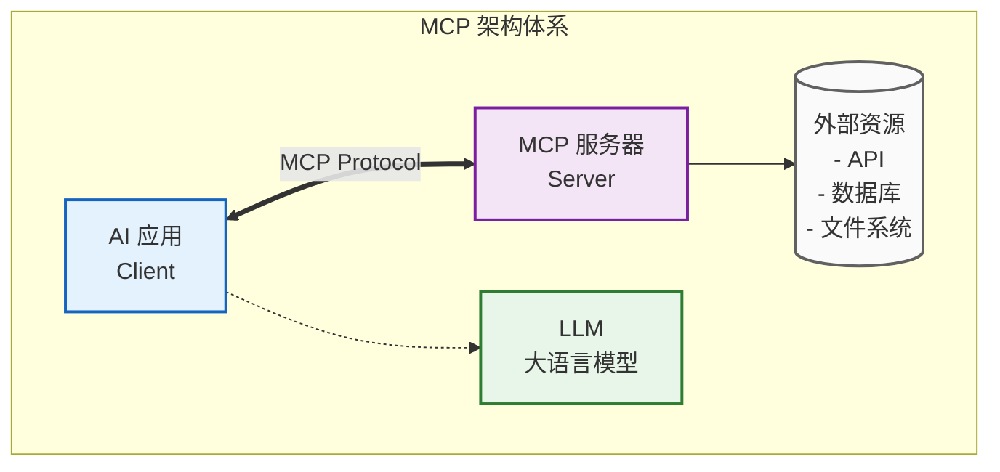
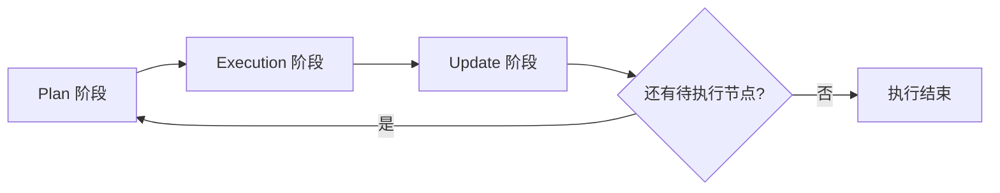

# 3. LangChain.js、LangGraph.js 开发与原理剖析


- **来源**：https://u19tul1sz9g.feishu.cn/docx/Jw9jdMmVHojhRtxCz3Ac0gGqn3d
- **关联资料**：[20260207 随堂笔记与源码资料](https://u19tul1sz9g.feishu.cn/docx/HsQBdlBmsocCuExnY9Jcy99Sn2e#share-IHBzdxH0movBR3xcQBEc1sLZnDc)

---

## 课程目标

> [!TIP]
> - 初中级
>   1. **建立框架体系认知**：理解 LangChain.js 的框架定位、设计思想与四大核心能力，理清分层模块化包结构与依赖关系。
>   2. **熟练模型基础开发**：掌握模型初始化、核心参数配置与基础调用方法，能根据业务场景调优推理行为。
>   3. **实现多模态与结构化输出**：独立完成图片理解类多模态调用，掌握 Zod 绑定结构化输出方案，打通 AI 与程序逻辑的衔接。
>   4. **掌握消息与工具系统**：熟悉四类核心消息类型与对话历史管理规范，能独立完成工具定义、绑定与全链路调用开发。
>   5. **搭建基础智能 Agent**：理解 ReAct 范式核心逻辑，能使用 createAgent 构建带工具能力的 Agent，实现流式响应交互。
> - 中高级
>   1. **精通 LangGraph 图编排**：熟练使用 StateGraph 构建复杂工作流，掌握条件分支、并行分发聚合、循环执行与子图嵌套的落地实现。
>   2. **掌握长运行工作流能力**：深入理解中断机制与检查点架构，能基于 MemorySaver 实现人机协作、断点续跑的长周期 AI 流程。
>   3. **全栈 MCP 协议开发**：能独立开发 Stdio 本地与 HTTP 远程两类 MCP 服务端，完成多服务客户端接入与 Agent 生态无缝集成。
>   4. **吃透框架底层原理**：从源码层面掌握 Runnable 抽象、LCEL 流水线、Pregel 运行时、通道 Reducer 等核心机制的设计与实现逻辑。
>   5. **构建企业级 AI 应用架构**：具备 LangChain + LangGraph + MCP 的整合设计能力，能按需选型技术方案，搭建标准化、可扩展的 AI Agent 系统。
>

## 补充资料

- AI 技术演进（Transformer 开山之作）：[https://arxiv.org/abs/1706.03762](https://arxiv.org/abs/1706.03762)
- OpenAI GPT-4o 技术概览：[https://openai.com/index/hello-gpt-4o/](https://openai.com/index/hello-gpt-4o/)
- GitHub Copilot 官方文档： [https://docs.github.com/zh/copilot](https://docs.github.com/zh/copilot)
- Claude (Anthropic) 开发者文档： [https://docs.anthropic.com/zh-CN/docs/intro-to-claude](https://docs.anthropic.com/zh-CN/docs/intro-to-claude)
- OpenAI 提示词工程指南: [https://platform.openai.com/docs/guides/prompt-engineering](https://platform.openai.com/docs/guides/prompt-engineering)
- 本地化大模型运行工具 Ollama：Get up and running with Llama 3.2, Mistral, Gemma 2, and other large language models: [https://ollama.com/](https://ollama.com/)
- 高级提示词思维链 (CoT) 论文：[https://arxiv.org/abs/2201.11903](https://arxiv.org/abs/2201.11903)
- 综合性提示词工程指南 (DAIR.AI)：[https://www.promptingguide.ai/zh](https://www.promptingguide.ai/zh)
- **AI 驱动的 Code Review 工具 (PR-Agent)**：[https://github.com/Codium-ai/pr-agent](https://github.com/Codium-ai/pr-agent)
- **LangChain.js (JavaScript RAG 框架)**：[https://js.langchain.com/docs/introduction/](https://js.langchain.com/docs/introduction/)
- Mastra (TypeScript AI 工程框架)：[https://mastra.ai/](https://mastra.ai/)
- LlamaIndex.TS (RAG 数据框架)：[https://ts.llamaindex.ai/](https://ts.llamaindex.ai/)
- AI 智能体 (Agent) 深度解析 (Lilian Weng)：[https://lilianweng.github.io/posts/2023-06-23-agent/](https://lilianweng.github.io/posts/2023-06-23-agent/)
- **敏捷人工智能驱动开发**：https://github.com/bmad-code-org/BMAD-METHOD

## 相关面试真题

### 相比 LangChain 原生的 ReAct Agent，LangGraph.js 在构建复杂 AI 工作流时有哪些核心优势？请结合 Pregel 运行时的超级步执行机制说明其底层工作逻辑。

**考察方向**：LangGraph 核心设计理念、Pregel 运行时原理、框架选型的架构思维
**参考答案**：
1. **核心优势**
 - 原生支持**状态驱动**，全局状态唯一且可追溯，解决了原生 Agent 消息历史管理混乱、状态分散的问题；
 - 支持丰富的**控制流原语**：条件分支、循环、Fan-out/Fan-in 并行、子图嵌套，可实现任意复杂的工作流拓扑，原生 Agent 仅支持简单的线性循环；
 - 内置**检查点与中断机制**，支持断点续跑、人机协作、长任务持久化，原生 Agent 无原生持久化能力；
 - 执行过程可观测性更强，每一步状态都可追踪，便于调试和排错。

1. **Pregel 超级步执行机制**Pregel 是 LangGraph 的核心执行引擎，以「超级步」为基本执行单位，每个超级步分为三个阶段：
 - **Plan 阶段**：根据当前状态，确定本轮需要执行的所有节点；
 - **Execution 阶段**：并行执行所有选中的节点，节点读取状态并返回更新结果，本轮更新对其他节点不可见；
 - **Update 阶段**：按通道的 Reducer 策略合并所有节点的状态更新，保存检查点，计算下一轮待执行节点；循环上述步骤，直到无待执行节点，工作流结束。

### 企业计划搭建内部 AI Agent 平台，要求：① 工具能力统一封装，多业务线可复用；② 支持复杂多步骤任务编排，可中途人工审批；③ 兼容本地部署与云端服务两种部署形态。请结合 LangChain.js、LangGraph.js 与 MCP 协议设计整体技术架构，并说明各模块的职责与协作流程。

**考察方向**：技术整合能力、企业级架构设计能力、业务场景落地思维
**参考答案**：整体采用四层分层架构，从下到上依次为：
1. **MCP 能力服务层**
 - 职责：统一封装所有外部工具、数据源与业务接口，按领域拆分独立 MCP 服务（如数据查询服务、文件处理服务、业务系统操作服务）；
 - 实现：内部工具通过 Stdio 模式本地部署，跨团队、跨网络的工具通过 HTTP/SSE 模式部署为云端服务；
 - 价值：实现「一次开发、多端复用」，业务线无需重复封装工具，统一协议标准。

1. **LangChain 核心适配层**
 - 职责：统一模型接入、消息体系管理、MCP 工具协议适配；
 - 实现：基于 `MultiServerMCPClient` 对接所有 MCP 服务，自动转换为 LangChain 标准工具；统一封装多模型调用接口，屏蔽不同模型厂商的差异。

1. **LangGraph 编排层**
 - 职责：负责复杂任务的流程编排、状态管理与人机交互；
 - 实现：基于 StateGraph 搭建各业务 Agent 工作流，通过条件边、并行节点实现复杂业务逻辑；配置 MemorySaver / 数据库检查点，通过 interrupt 实现人工审批中断节点，支持断点续跑。

1. **业务接入层**
 - 职责：对外提供 API 与前端交互能力，承接业务方请求；
 - 实现：基于 LangGraph API 部署 HTTP 服务，提供流式调用、线程管理、历史回溯等能力，前端通过 SDK 接入实现实时交互。

**协作流程**：业务发起请求 → 编排层启动工作流 → 调用模型判断意图 → 通过 MCP 客户端调用对应工具服务 → 执行到审批节点触发中断等待人工确认 → 确认后恢复执行直至任务结束，返回最终结果。

## LangChain.js 基础与进阶

### LangChain.js 概述

#### 框架定位

LangChain.js 是 LangChain 框架的官方 JavaScript/TypeScript 实现，专为 Node.js 和浏览器环境设计，是构建 LLM 驱动应用的事实标准框架。它通过**抽象化、模块化、可组合**的设计思想，将大语言模型的通用能力封装为可复用的组件，极大降低了 AI 应用的开发门槛。

LangChain.js 核心提供四大能力：
- **模型抽象层**：统一的模型调用接口，屏蔽不同厂商（OpenAI、Anthropic、Ollama 等）的 API 差异，实现模型的无缝切换
- **工具系统**：标准化的工具定义与调用机制，扩展 LLM 与外部世界交互的能力
- **Agent 框架**：基于 ReAct 等范式的智能代理实现，支持自主思考、规划与任务执行
- **RAG 支持**：完整的检索增强生成工具链，涵盖文档加载、文本分割、向量化、检索与生成全流程

#### 核心包结构

LangChain.js 采用**分层模块化架构**，包职责清晰，支持按需引入，避免不必要的依赖：

```plaintext
@langchain/core        # 核心抽象层（所有包的基础，定义接口、基类、消息结构）
├─ @langchain/ollama      # Ollama 模型集成
├─ @langchain/openai      # OpenAI 模型集成
├─ @langchain/anthropic   # Anthropic 模型集成
├─ @langchain/community   # 社区贡献的第三方集成（向量库、工具、文档加载器等）
├─ @langchain/textsplitters # 文本分割器组件
├─ @langchain/vectorstores # 向量数据库抽象与实现
└─ langchain              # 高层应用 API（Agent、高阶 Chain、快捷方法）
```

**包依赖关系说明**：
- `@langchain/core` 是唯一的基础依赖，不包含任何第三方集成
- 所有模型集成包（如 `@langchain/ollama`）仅依赖 `@langchain/core`
- `langchain` 包依赖所有核心组件，提供开箱即用的完整能力
- 生产环境推荐按需引入最小依赖集，减小包体积

### 模型基础使用

#### Hello World

这是 LangChain.js 最简单的完整示例，演示了如何调用本地 Ollama 模型进行对话：

```typescript
// langchainjs-demo/src/1.hello-world/index.ts
// 从 Ollama 集成包导入 ChatOllama 类
import { ChatOllama } from "@langchain/ollama";

// 初始化模型实例，指定使用的模型名称
const llm = new ChatOllama({
  model: "qwen3:0.6b", // 使用通义千问3 0.6B参数轻量模型，适合本地快速测试
});

// 定义异步调用函数
const invoke = async () => {
  // 调用模型，传入用户输入文本
  const res = await llm.invoke("你好");
  // 打印完整的 AIMessage 响应对象
  console.log(res);
};

// 执行调用
invoke();
```

**代码深度解析：**

1. **ChatOllama 类**：Ollama 模型的官方包装类，实现了 `BaseChatModel` 抽象接口。它负责将 LangChain 的标准消息格式转换为 Ollama API 要求的格式，并将返回结果解析为 LangChain 的 `AIMessage` 对象。
2. **invoke 方法**：模型的同步调用方法，接收字符串或消息数组作为输入，返回一个 Promise，解析完成后得到 `AIMessage` 对象。这是最基础也是最常用的模型调用方式。
3. **模型配置**：除了必填的 `model` 参数外，还可以配置 `baseUrl`、`temperature`、`maxTokens` 等参数，控制模型的行为。

**完整执行流程：**

```plaintext
用户输入字符串 → ChatOllama.invoke() 内部转换为 HumanMessage
→ 构建符合 Ollama API 规范的 HTTP 请求体
→ 发送 POST 请求到 http://localhost:11434/api/chat
→ Ollama 服务加载模型并执行推理
→ 返回 JSON 格式的响应结果
→ ChatOllama 解析响应，封装为 AIMessage 对象
→ 返回给调用者
```

#### 模型配置选项

ChatOllama 支持丰富的配置参数，用于精确控制模型的推理行为：

```typescript
const llm = new ChatOllama({
  model: "qwen3:0.6b",
  baseUrl: "http://localhost:11434",  // Ollama 服务地址，默认本地 11434 端口
  temperature: 0.7,                    // 创造性参数，0-1 范围
                                       // 0 = 确定性输出，适合代码、结构化数据
                                       // 1 = 最大创造性，适合创意写作
  topK: 40,                            // Top-K 采样：从概率最高的前 K 个 Token 中选择
  topP: 0.9,                           // Top-P 采样：从累计概率达到 P 的 Token 集合中选择
  repeatPenalty: 1.1,                  // 重复惩罚系数，>1 抑制重复内容
  numCtx: 4096,                        // 上下文窗口大小，单位 Token
  maxTokens: 1024,                     // 最大生成 Token 数
  stop: ["\n\n"],                      // 停止序列，遇到这些字符串时停止生成
});
```

**参数最佳实践：**
- 结构化输出、代码生成：`temperature=0`，保证结果确定性
- 创意写作、头脑风暴：`temperature=0.7-0.9`，增加多样性
- 对话系统：`temperature=0.5-0.7`，平衡创造性与一致性
- 长文本处理：根据模型能力适当增大 `numCtx`

### 多模态能力

#### 图片理解

LangChain.js 原生支持多模态模型调用，能够处理包含图片和文本的混合输入：

```typescript
// langchainjs-demo/src/2.model/2.image.ts
import { ChatOllama } from "@langchain/ollama";
import { HumanMessage } from "@langchain/core/messages";
import fs from "node:fs";
import path from "node:path";

// 必须使用支持视觉能力的模型
const llm = new ChatOllama({
  model: "qwen3-vl:2b",  // 通义千问3视觉模型，2B参数
});

const invoke = async () => {
  // 读取本地图片文件，转换为 Base64 编码
  const imagePath = path.resolve(import.meta.dirname, "../../public/miaoma-logo.png");
  const imageBuffer = fs.readFileSync(imagePath);
  const base64Image = imageBuffer.toString("base64");

  // 调用模型，传入多模态消息
  const res = await llm.invoke([
    new HumanMessage({
      content: [
        // 图片内容块
        {
          type: "image_url",
          image_url: {
            url: `data:image/jpeg;base64,${base64Image}`,
            // 可选：指定图片细节级别，"low"、"high" 或 "auto"
            detail: "auto"
          },
        },
        // 文本内容块
        {
          type: "text",
          text: "帮我看看图片里面有什么，请使用中文详细描述",
        },
      ],
    }),
  ]);
  
  console.log(res.content);
};

invoke();
```

**技术要点深度解析：**

1. **多模态消息结构**：`HumanMessage` 的 `content` 字段可以是一个数组，包含多个不同类型的内容块。目前支持 `text` 和 `image_url` 两种类型。
2. **图片传输方式**：
 - **Base64 编码**：将图片数据直接嵌入请求体，适合小图片（<1MB）
 - **URL 引用**：传入可公开访问的图片 URL，适合大图片或网络图片
 - 注意：Ollama 目前仅支持 Base64 编码的本地图片

3. **模型选择**：必须使用支持视觉能力的多模态模型，如 `qwen3-vl`、`llava`、`gemma3:12b-it` 等。纯文本模型无法处理图片输入。

**多模态消息内部结构：**

```plaintext
HumanMessage {
  content: [
    { 
      type: "image_url", 
      image_url: { 
        url: "data:image/jpeg;base64,/9j/4AAQSkZJRgABAQEAAAAAAAD/...",
        detail: "auto"
      } 
    },
    { 
      type: "text", 
      text: "描述这张图片" 
    }
  ],
  role: "user"
}
```

### 结构化输出

#### 使用 Zod Schema

结构化输出是连接 AI 与程序的关键技术，它让 LLM 输出符合预定义格式的 JSON 数据，而不是自由文本。LangChain.js 与 Zod 深度集成，提供类型安全的结构化输出能力：

```typescript
// langchainjs-demo/src/2.model/3.structured-output.ts
// 导入 Zod 库，用于定义数据结构
import * as z from "zod";
import { ChatOllama } from "@langchain/ollama";

// 初始化模型，结构化输出建议将 temperature 设置为 0
const llm = new ChatOllama({
  model: "qwen3:0.6b",
  temperature: 0,  // 降低随机性，保证输出格式稳定
});

// 定义输出结构，使用 Zod 的 describe 方法添加字段说明
// 这些说明会被转换为 Prompt 告诉模型
const User = z.object({
  name: z.string().describe("用户的真实姓名，必须是中文"),
  age: z.number().int().min(0).max(150).describe("用户的年龄，必须是整数"),
  gender: z.enum(["男", "女", "未知"]).describe("用户的性别"),
  email: z.string().email().optional().describe("用户的电子邮箱地址"),
});

// 将模型与结构化输出绑定
const modelWithStructure = llm.withStructuredOutput(User, {
  includeRaw: true,  // 同时返回原始 AIMessage 和解析后的结构化对象
  method: "function_call",  // 使用函数调用模式实现结构化输出
  // 可选：method: "json_mode"，直接让模型输出 JSON
});

const invoke = async () => {
  const response = await modelWithStructure.invoke(
    "我是合一，年龄是25岁，性别是男，我的邮箱是 heyi@example.com"
  );
  
  // response 包含 parsed 和 raw 两个字段（当 includeRaw: true 时）
  console.log("解析后的结构化数据:", response.parsed);
  // 输出: { name: "合一", age: 25, gender: "男", email: "heyi@example.com" }
  
  console.log("原始模型响应:", response.raw);
};

invoke();
```

**实现原理深度解析：**

1. **Zod Schema 转换**：`withStructuredOutput` 方法会将 Zod Schema 自动转换为一个函数定义，包含函数名、描述和参数结构。
2. **Prompt 注入**：框架会自动将这个函数定义注入到 Prompt 中，告诉模型："你必须调用这个函数，参数必须符合这个结构"。
3. **函数调用模式**：模型被约束为只输出函数调用，而不是自由文本。函数的参数就是我们需要的结构化数据。
4. **自动解析与验证**：框架接收模型输出的 `tool_calls`，提取参数部分，然后使用 Zod Schema 进行类型验证。如果验证失败，会自动重试。

**完整输出保证流程：**

```plaintext
用户输入 → 框架将 Zod Schema 转换为函数定义
→ 注入到系统 Prompt 中
→ LLM 调用 → 模型输出标准 tool_calls 结构
→ 框架提取参数 → Zod 验证参数类型和约束
→ 验证通过 → 返回结构化对象
→ 验证失败 → 自动重试（最多3次）
```

### 工具系统

工具系统是 LLM 能力的延伸，它让模型能够调用外部函数，获取实时信息、执行计算或操作外部系统。

#### 定义和绑定工具

```typescript
// langchainjs-demo/src/3.tools/1.model-tools.ts
import { ChatOllama } from "@langchain/ollama";
import { tool } from "@langchain/core/tools";
import * as z from "zod";

// 初始化模型
const llm = new ChatOllama({
  model: "qwen3:0.6b",
});

// 定义工具：使用 tool 高阶函数
const getWeather = tool(
  // 工具的实际执行函数
  async (input) => {
    console.log(`正在查询 ${input.location} 的天气...`);
    // 这里可以调用真实的天气 API
    return `${input.location}今天天气很好，气温25度，晴天，微风。`;
  },
  {
    // 工具元数据
    name: "get_weather",  // 工具唯一标识，不能有空格或特殊字符
    description: "获取给定城市的实时天气信息",  // 工具功能描述，供模型理解
    // 参数 Schema，定义工具接受的参数
    schema: z.object({
      location: z.string().describe("要查询天气的城市名称，例如：北京、上海"),
    }),
  }
);

// 将工具绑定到模型
// 绑定后，模型知道可以使用这些工具
const modelWithTools = llm.bindTools([getWeather]);

const invoke = async () => {
  // 调用模型，传入用户问题
  const res = await modelWithTools.invoke("北京今天天气怎么样？");
  console.log("模型响应:", res);

  // 检查模型是否要求调用工具
  if (res.tool_calls && res.tool_calls.length > 0) {
    // 遍历所有工具调用
    for (const tc of res.tool_calls) {
      console.log(`调用工具: ${tc.name}, 参数:`, tc.args);
      
      // 执行工具
      if (tc.name === getWeather.name) {
        const toolResult = await getWeather.invoke(tc);
        console.log("工具执行结果:", toolResult);
        
        // 将工具结果返回给模型，生成最终回答
        const finalResponse = await modelWithTools.invoke([
          new HumanMessage("北京今天天气怎么样？"),
          res,
          new ToolMessage({
            tool_call_id: tc.id,
            content: toolResult,
          }),
        ]);
        
        console.log("最终回答:", finalResponse.content);
      }
    }
  }
};

invoke();
```

**工具定义三要素深度解析：**

| 要素 | 说明 | 重要性 |
| --- | --- | --- |
| **执行函数** | 工具的实际业务逻辑，接收模型传入的参数，返回执行结果 | 核心 |
| **name** | 工具的唯一标识符，用于模型识别和框架路由 | 必须唯一 |
| **description** | 工具的功能描述，是模型决定是否调用该工具的关键依据 | 描述越清晰准确，模型调用越正确 |
| **schema** | 参数的类型定义和约束，保证模型传入的参数合法 | 避免工具执行错误 |

**完整工具调用流程：**

```plaintext
sequenceDiagram
    participant User as 用户
    participant LLM as LLM (大模型)
    participant App as 应用层/工具系统

    User->>LLM: 提问："北京今天天气怎么样？"
    Note over LLM: 分析意图，判断需要调用天气工具
    
    LLM->>App: 返回 tool_calls 数组
    Note over App: 解析 tool_calls，匹配到 getWeather 工具
    
    App->>App: 执行 getWeather 工具，调用天气 API
    App-->>LLM: 返回工具结果 (ToolMessage)
    
    LLM->>User: 根据工具结果生成最终自然语言回答
```

### 消息系统

消息系统是 LangChain 的核心数据结构，用于表示对话中的不同角色和内容类型。

#### 消息类型

LangChain 定义了四种核心消息类型，分别对应对话中的不同角色：

```typescript
import {
  HumanMessage,    // 用户发送的消息
  AIMessage,       // AI 生成的响应消息
  SystemMessage,   // 系统提示消息，用于设定 AI 的身份和行为
  ToolMessage,     // 工具执行结果消息
} from "@langchain/core/messages";
```

**各消息类型详解：**

1. **SystemMessage**：对话开始时发送，用于设定 AI 的身份、行为准则、输出格式等。它会影响整个对话的风格和行为。
2. **HumanMessage**：用户输入的消息，可以是纯文本或多模态内容。
3. **AIMessage**：AI 生成的响应消息，包含文本内容、工具调用信息等。
4. **ToolMessage**：工具执行的结果消息，必须与对应的 AIMessage 中的 tool_call 关联。

#### 消息构建示例

```typescript
// langchainjs-demo/src/4.messages/1.role.ts
import { ChatOllama } from "@langchain/ollama";
import {
  HumanMessage,
  SystemMessage,
  AIMessage
} from "@langchain/core/messages";

const llm = new ChatOllama({ model: "qwen3:0.6b" });

// 构建多轮对话历史
const messages = [
  // 系统提示：设定 AI 身份
  new SystemMessage("你是一个专业的翻译助手，只负责中英互译，不要回答其他问题。翻译结果要准确、自然。"),
  // 第一轮用户输入
  new HumanMessage("Hello World"),
  // 第一轮 AI 响应
  new AIMessage("你好，世界"),
  // 第二轮用户输入
  new HumanMessage("LangChain is a framework for building applications with LLMs"),
];

// 调用模型，传入完整对话历史
const response = await llm.invoke(messages);
console.log(response.content);
// 输出: "LangChain 是一个用于构建大语言模型应用的框架"
```

**消息历史管理最佳实践：**
- 始终将 SystemMessage 放在消息数组的第一个位置
- 消息按时间顺序排列，最新的消息在最后
- 工具调用必须遵循：HumanMessage → AIMessage(tool_calls) → ToolMessage 的顺序
- 定期清理过长的消息历史，避免超出模型上下文窗口

### Agent 智能代理（ReAct）

如果说 LLM 是一个只有"大脑"的百科全书，那么 **Agent** 就是给这个大脑装上了"手脚"（Tools）和"耳朵"（Sensors）。它不仅能**思考**（Reasoning），还能**规划**（Planning）并**执行任务**（Acting）。

- **LLM 的局限性**：模型训练完成后，知识就截止了（无法获取实时信息）；且模型无法直接操作现实世界（如查天气、写数据库、调用 API）。
- **ReAct 范式**：为了解决上述问题，引入了 **"ReAct" (Reason + Act)** 范式，即让模型在执行行动之前先进行思考推理，明确下一步要做什么、为什么要做，然后再执行相应的工具调用。这种"思考-行动-观察"的循环，让 Agent 具备了解决复杂问题的能力。

#### 创建基础 Agent

```typescript
// langchainjs-demo/src/5.agent/1.basic.ts
import { ChatOllama } from "@langchain/ollama";
import { createAgent } from "langchain";

// 创建一个最简单的 Agent，没有工具
const agent = createAgent({
  model: new ChatOllama({
    model: "qwen3:0.6b",
  }),
});

const invoke = async () => {
  const res = await agent.invoke({
    messages: [
      {
        role: "user",
        content: "你好，请介绍一下你自己",
      },
    ],
  });
  
  console.log("Agent 响应:", res.messages.at(-1).content);
};

invoke();
```

#### 带工具的 Agent

这是最常用的 Agent 形式，能够根据用户问题自主决定是否调用工具：

```typescript
// langchainjs-demo/src/5.agent/2.zod.ts
import { ChatOllama } from "@langchain/ollama";
import { createAgent } from "langchain/agents";
import { tool } from "@langchain/core/tools";
import * as z from "zod";

// 定义天气工具
const getWeather = tool(
  async (input) => {
    return `${input.city}今天天气晴朗，气温22-28度，适合外出。`;
  },
  {
    name: "get_weather",
    description: "获取给定城市的天气信息",
    schema: z.object({
      city: z.string().describe("城市名称"),
    }),
  }
);

// 定义计算器工具
const calculator = tool(
  async (input) => {
    const result = eval(input.expression);
    return String(result);
  },
  {
    name: "calculator",
    description: "执行数学计算，支持加减乘除和括号",
    schema: z.object({
      expression: z.string().describe("数学表达式，例如：(3 + 5) * 2"),
    }),
  }
);

// 创建带工具的 Agent
const agent = createAgent({
  model: new ChatOllama({
    model: "qwen3:0.6b",
    temperature: 0,
  }),
  tools: [getWeather, calculator],
});

const invoke = async () => {
  const res = await agent.invoke({
    messages: [{ role: "user", content: "北京今天天气怎么样？如果温度超过25度，计算一下25度比22度高多少百分比" }],
  });
  
  // 打印完整的对话历史
  console.log("完整对话:");
  res.messages.forEach((msg, i) => {
    console.log(`[${i}] ${msg.role}: ${msg.content}`);
    if (msg.tool_calls) {
      console.log(`  工具调用:`, msg.tool_calls);
    }
  });
  
  // 打印最终回答
  console.log("\n最终回答:", res.messages.at(-1).content);
};

invoke();
```

**Agent 工作原理深度解析：**

```plaintext
flowchart TD
    classDef llm fill:#e3f2fd,stroke:#1565c0,stroke-width:2px;
    classDef decision fill:#fff9c4,stroke:#fbc02d,stroke-width:2px;
    classDef tool fill:#e8f5e9,stroke:#2e7d32,stroke-width:2px;
    classDef output fill:#f3e5f5,stroke:#7b1fa2,stroke-width:2px;

    subgraph Core [Agent 循环核心逻辑]
        direction TB
        User([用户输入])
        
        Think[LLM 思考：我需要做什么？]:::llm
        Check{需要调用工具?}:::decision
        
        Exec[并行执行所有工具调用]:::tool
        Reply[生成最终回答]:::output
        Result((输出结果)):::output

        User --> Think
        Think --> Check
        
        %% 决策路径
        Check -- 是 --> Exec
        Check -- 否 --> Reply
        
        Reply --> Result
        
        %% 闭环：工具执行结果返回给 LLM 继续思考
        Exec -.-> |工具结果加入上下文| Think
    end
```

#### 结构化响应 Agent

LLM 本质上输出的是字符串（自然语言），但程序代码（如 API 调用、数据库操作）需要的是严格的结构化数据（JSON）。Zod 结构化输出是连接 AI 模糊语言与程序精确代码的桥梁。

```typescript
// langchainjs-demo/src/5.agent/3.format-res.ts
import { ChatOllama } from "@langchain/ollama";
import { createAgent } from "langchain/agents";
import * as z from "zod";

// 定义输出结构
const PersonInfo = z.object({
  name: z.string().describe("人物的真实姓名"),
  age: z.number().int().describe("人物的年龄，整数"),
  occupation: z.string().describe("人物的职业"),
  hobbies: z.array(z.string()).describe("人物的爱好列表"),
});

// 创建结构化响应 Agent
const agent = createAgent({
  model: new ChatOllama({
    model: "qwen3:0.6b",
    temperature: 0,
  }),
  responseFormat: PersonInfo,  // 指定响应格式
});

const invoke = async () => {
  const res = await agent.invoke({
    messages: [{ role: "user", content: "我是合一，今年25岁，是一名软件工程师，喜欢编程、读书和跑步" }],
  });
  
  // 结构化响应会自动解析到 structuredResponse 字段
  console.log("结构化数据:", res.structuredResponse);
  // 输出: { name: "合一", age: 25, occupation: "软件工程师", hobbies: ["编程", "读书", "跑步"] }
  
  // 也可以访问原始消息
  console.log("原始消息:", res.messages.at(-1).content);
};

invoke();
```

#### 流式响应

流式响应能够让用户实时看到 AI 的输出过程，极大提升用户体验。Agent 支持三种流式模式：

```typescript
// langchainjs-demo/src/5.agent/4.streaming-res.ts
import { ChatOllama } from "@langchain/ollama";
import { createAgent, ToolCall } from "langchain/agents";
import * as z from "zod";

const PersonInfo = z.object({
  name: z.string().describe("人物姓名"),
  age: z.number().describe("人物年龄"),
});

const agent = createAgent({
  model: new ChatOllama({
    model: "qwen3:0.6b",
    temperature: 0,
  }),
  responseFormat: PersonInfo,
});

const invoke = async () => {
  // 调用 stream 方法获取异步迭代器
  const stream = await agent.stream(
    {
      messages: [{ role: "user", content: "我是合一，我今年18岁" }],
    },
    {
      streamMode: "values",  // 流式模式
    }
  );

  // 遍历迭代器，实时获取输出
  for await (const chunk of stream) {
    const latestMessage = chunk.messages.at(-1);
    
    if (latestMessage?.content) {
      // 打印文本内容
      process.stdout.write(latestMessage.content);
    } else if (latestMessage?.tool_calls) {
      // 打印工具调用信息
      const toolCallNames = latestMessage.tool_calls.map(
        (tc: ToolCall) => tc.name
      );
      console.log(`\n正在调用工具: ${toolCallNames.join(", ")}`);
    }
  }
  
  console.log("\n\n处理完成");
};

invoke();
```

**三种流式模式对比：**

| 模式 | 说明 | 适用场景 |
| --- | --- | --- |
| `values` | 每次返回完整的当前状态 | 状态追踪、需要完整上下文的场景 |
| `updates` | 仅返回本次迭代的增量变化 | 增量更新、节省带宽 |
| `messages` | 流式输出消息块，逐 Token 返回 | 前端实时显示打字效果 |

## LangGraph.js 基础与进阶

### LangGraph.js 概述

#### 核心理念

LangGraph.js 是 LangChain 团队推出的**基于状态图的 AI 应用编排框架**，专门用于构建复杂、多步骤、长运行的 AI 工作流和 Agent。它解决了传统 LangChain Chain 和 Agent 难以处理复杂逻辑、循环、分支和状态管理的问题。

LangGraph.js 的核心设计理念：
- **状态驱动**：所有执行逻辑围绕全局状态展开，状态是唯一的真相来源
- **图结构**：用节点和边组成的有向图描述工作流，支持任意复杂的拓扑结构
- **可编排性**：原生支持条件分支、循环、并行执行、子图嵌套等高级编排模式
- **可观测性**：完整的执行追踪、状态快照和调试支持
- **持久性**：内置检查点机制，支持断点续跑和中断恢复

#### 核心概念

| 概念 | 说明 | 编程类比 |
| --- | --- | --- |
| **State** | 工作流状态对象，存储所有执行过程中的数据 | 全局变量 |
| **Annotation** | 状态的类型定义，包含类型、默认值和合并策略 | TypeScript 接口 + 数据合并规则 |
| **Node** | 执行节点，是一个纯函数，接收状态返回状态更新 | 函数 |
| **Edge** | 节点间的连接，定义执行流程 | 函数调用 |
| **Conditional Edge** | 条件边，根据当前状态动态决定下一个节点 | if-else 语句 |
| **Checkpoint** | 状态快照，保存工作流在某个时间点的完整状态 | 程序断点 |
| **Interrupt** | 中断机制，暂停执行并等待用户输入 | 断点调试 |

### 入门示例：entrypoint 模式

entrypoint 是 LangGraph 提供的简化 API，适合快速构建简单的循环 Agent。

#### 工具定义

首先定义我们需要的工具：

```typescript
// langgraphjs-demo/src/1.hello-world/1.tools.ts
import { tool } from '@langchain/core/tools'
import * as z from 'zod'

// 加法工具
const add = tool(({ a, b }) => a + b, {
    name: 'add',
    description: '计算两个数的和',
    schema: z.object({
        a: z.number().describe('第一个加数'),
        b: z.number().describe('第二个加数')
    })
})

// 乘法工具
const multiply = tool(({ a, b }) => a * b, {
    name: 'multiply',
    description: '计算两个数的积',
    schema: z.object({
        a: z.number().describe('第一个乘数'),
        b: z.number().describe('第二个乘数')
    })
})

// 除法工具
const divide = tool(({ a, b }) => a / b, {
    name: 'divide',
    description: '计算两个数的商',
    schema: z.object({
        a: z.number().describe('被除数'),
        b: z.number().describe('除数')
    })
})

// 工具映射表，用于根据工具名快速查找工具实例
export const toolsByName = {
    [add.name]: add,
    [multiply.name]: multiply,
    [divide.name]: divide
}

// 工具列表，用于绑定到模型
export const tools = Object.values(toolsByName)
```

#### 模型绑定

将工具绑定到模型，让模型知道可以使用这些工具：

```typescript
// langgraphjs-demo/src/1.hello-world/2.model.ts
import { ChatOllama } from '@langchain/ollama'
import { tools } from './1.tools'

// 初始化模型
const model = new ChatOllama({
    model: 'qwen3:0.6b'
})

// 将工具绑定到模型
// 这会将工具的描述注入到模型的 Prompt 中
export const modelWithTools = model.bindTools(tools)
```

#### 使用 entrypoint 构建 Agent

entrypoint 模式让我们可以用一个简单的函数来定义 Agent 的循环逻辑：

```typescript
// langgraphjs-demo/src/1.hello-world/agent.ts
import { addMessages, entrypoint } from '@langchain/langgraph'
import { type BaseMessage } from '@langchain/core/messages'
import { modelWithTools } from './2.model'
import { toolsByName } from './1.tools'

// 定义模型调用节点
async function callLlm(messages: BaseMessage[]) {
    return await modelWithTools.invoke(messages)
}

// 定义工具调用节点
async function callTool(toolCall: any) {
    const tool = toolsByName[toolCall.name]
    if (!tool) {
        throw new Error(`未知工具: ${toolCall.name}`)
    }
    return await tool.invoke(toolCall)
}

// 使用 entrypoint 创建 Agent
export const agent = entrypoint(
  { name: 'math-agent' },
  async (messages: BaseMessage[]) => {
    // 第一步：调用 LLM
    let modelResponse = await callLlm(messages)

    // Agent 核心循环：持续执行直到没有工具调用
    while (true) {
        // 如果没有工具调用，说明模型已经得出最终答案，退出循环
        if (!modelResponse.tool_calls?.length) {
            break
        }

        // 并行执行所有工具调用
        const toolResults = await Promise.all(
          modelResponse.tool_calls.map(toolCall => callTool(toolCall))
        )
        
        // 过滤掉 undefined 的结果
        const validToolResults = toolResults.filter(result => result !== undefined)

        // 更新消息历史：添加模型响应和工具结果
        messages = addMessages(messages, [modelResponse, ...validToolResults])

        // 再次调用 LLM，传入更新后的消息历史
        modelResponse = await callLlm(messages)
    }

    // 返回最终的消息历史
    return messages
  }
)

// 调用 Agent
const invoke = async () => {
    const result = await agent.invoke([
        { role: 'user', content: '计算 (3 + 5) * 12 / 4 等于多少' }
    ])
    
    console.log('最终答案:', result.at(-1).content)
}

invoke()
```

**entrypoint 模式特点：**

1. **简洁直观**：用一个 while 循环实现 Agent 的核心逻辑，易于理解和调试
2. **灵活自由**：可以在函数内编写任意 JavaScript 逻辑，实现复杂的控制流
3. **自动状态管理**：entrypoint 自动管理消息历史状态
4. **局限性**：不支持复杂的图结构、条件分支和并行执行，适合简单场景

**执行流程图：**

```plaintext
flowchart TD
    %% 样式定义
    classDef process fill:#e3f2fd,stroke:#1565c0,stroke-width:2px;
    classDef condition fill:#fff9c4,stroke:#fbc02d,stroke-width:2px;
    classDef terminal fill:#e8f5e9,stroke:#2e7d32,stroke-width:2px;

    subgraph Agent [entrypoint Agent]
        direction TB
        
        Start([用户输入消息]):::terminal
        Step1[调用 LLM 生成响应]:::process
        Decision{有工具调用?}:::condition
        
        Step2[并行执行所有工具]:::process
        Step3[更新消息历史]:::process
        
        End([返回最终答案]):::terminal

        %% 主要链路
        Start --> Step1
        Step1 --> Decision
        
        %% 循环逻辑
        Decision -- 是 --> Step2
        Step2 --> Step3
        Step3 -.-> |继续循环| Step1
        
        %% 退出逻辑
        Decision -- 否 --> End
    end
```

### StateGraph 状态图

StateGraph 是 LangGraph 的核心 API，用于构建复杂的工作流。它通过显式定义节点和边，让工作流的结构清晰可见。

#### 基础状态图示例

这个示例演示了如何构建一个包含条件分支的简单工作流：

```typescript
// langgraphjs-demo/src/2.graph-flow/agent.ts
import { StateGraph, Annotation } from '@langchain/langgraph'
import { ChatOllama } from '@langchain/ollama'

// 初始化模型
const llm = new ChatOllama({
    model: 'qwen3:0.6b'
})

// 1. 定义状态类型
// Annotation.Root 创建一个根状态定义
const StateAnnotation = Annotation.Root({
    topic: Annotation<string>,  // 笑话主题
    joke: Annotation<string>,   // 生成的初始笑话
    improvedJoke: Annotation<string>,  // 改进后的笑话
    finalJoke: Annotation<string>,     // 最终完善的笑话
})

// 2. 定义节点函数
// 所有节点函数接收状态，返回状态更新

// 节点1：生成初始笑话
async function generateJoke(state: typeof StateAnnotation.State) {
    const msg = await llm.invoke(`写一个关于 ${state.topic} 的笑话，要简短有趣`)
    // 返回状态更新：只更新 joke 字段
    return { joke: msg.content }
}

// 节点2：检查笑话质量（条件函数）
// 条件函数接收状态，返回下一个节点的名称
function checkPunchline(state: typeof StateAnnotation.State) {
    // 简单检查：笑话是否包含问号或感叹号
    if (state.joke?.includes('?') || state.joke?.includes('!')) {
        return 'Pass'  // 质量合格，进入改进流程
    }
    return 'Fail'  // 质量不合格，直接结束
}

// 节点3：改进笑话
async function improveJoke(state: typeof StateAnnotation.State) {
    const msg = await llm.invoke(`让这个笑话更有趣、更有梗: ${state.joke}`)
    return { improvedJoke: msg.content }
}

// 节点4：完善笑话
async function polishJoke(state: typeof StateAnnotation.State) {
    const msg = await llm.invoke(`给这个笑话添加一个有趣的结尾: ${state.improvedJoke}`)
    return { finalJoke: msg.content }
}

// 3. 构建工作流图
export const agent = new StateGraph(StateAnnotation)
    // 添加节点
    .addNode('generateJoke', generateJoke)
    .addNode('improveJoke', improveJoke)
    .addNode('polishJoke', polishJoke)
    // 添加边：定义执行顺序
    .addEdge('__start__', 'generateJoke')  // 从起点到 generateJoke
    // 添加条件边：根据 checkPunchline 的返回值决定下一个节点
    .addConditionalEdges('generateJoke', checkPunchline, {
        Pass: 'improveJoke',  // 如果返回 Pass，执行 improveJoke
        Fail: '__end__'       // 如果返回 Fail，直接结束
    })
    // 添加普通边
    .addEdge('improveJoke', 'polishJoke')
    .addEdge('polishJoke', '__end__')
    // 编译图，生成可执行的工作流
    .compile()

// 调用工作流
const invoke = async () => {
    const result = await agent.invoke({
        topic: '程序员'
    })
    
    console.log('初始笑话:', result.joke)
    console.log('改进后笑话:', result.improvedJoke)
    console.log('最终笑话:', result.finalJoke)
}

invoke()
```

**图结构可视化：**

```plaintext
flowchart TD
    %% 样式配置
    classDef startend fill:#f5f5f5,stroke:#333,stroke-width:2px,rx:10,ry:10;
    classDef process fill:#e3f2fd,stroke:#1565c0,stroke-width:2px;
    classDef decision fill:#fff9c4,stroke:#fbc02d,stroke-width:2px;

    %% 节点
    S([__start__]):::startend
    G[generateJoke<br/>生成初始笑话]:::process
    C{checkPunchline<br/>检查质量}:::decision
    
    I[improveJoke<br/>改进笑话]:::process
    P[polishJoke<br/>完善笑话]:::process
    
    E1([__end__]):::startend
    E2([__end__]):::startend

    %% 流程
    S --> G
    G --> C
    
    %% 分支
    C -- Pass --> I
    C -- Fail --> E2
    
    %% 细化流程
    I --> P
    P --> E1
```

#### Annotation 状态定义

Annotation 是 LangGraph 状态管理的核心，它不仅定义了状态的类型，还定义了状态的合并策略：

```typescript
import { Annotation } from '@langchain/langgraph'
import { BaseMessage } from '@langchain/core/messages'

// 基础类型状态
const SimpleState = Annotation.Root({
    count: Annotation<number>,
    message: Annotation<string>,
    items: Annotation<string[]>,
})

// 带 reducer 的复杂状态（累加器模式）
// reducer 定义了当多个节点更新同一个字段时如何合并结果
const ReducerState = Annotation.Root({
    // 消息历史：使用 addMessages reducer，自动合并消息数组
    messages: Annotation<BaseMessage[]>({
        reducer: (current, update) => [...current, ...update],
        default: () => [],  // 默认值
    }),
    // 计数器：使用累加 reducer
    counter: Annotation<number>({
        reducer: (current, update) => current + update,
        default: () => 0,
    }),
})
```

**Annotation 特性深度解析：**

| 特性 | 说明 | 示例 |
| --- | --- | --- |
| **类型定义** | 使用 TypeScript 泛型指定状态字段的类型 | `Annotation` |
| **默认值** | 指定状态字段的初始值 | `default: () => []` |
| **Reducer** | 定义状态合并策略，当多个节点更新同一个字段时如何处理 | `reducer: (a, b) => [...a, ...b]` |

### 并行执行

#### Fan-out/Fan-in 模式

Fan-out/Fan-in 是一种常见的并行执行模式，先将任务分发到多个并行节点执行（Fan-out），然后将所有结果聚合到一个节点（Fan-in）。

```typescript
// langgraphjs-demo/src/3.parallel-flow/agent.ts
import { StateGraph, Annotation } from '@langchain/langgraph'
import { ChatOllama } from '@langchain/ollama'

const llm = new ChatOllama({
    model: 'qwen3:0.6b'
})

// 状态定义
const StateAnnotation = Annotation.Root({
    topic: Annotation<string>,
    joke: Annotation<string>,
    story: Annotation<string>,
    poem: Annotation<string>,
    combinedOutput: Annotation<string>
})

// 并行节点1：生成笑话
async function callLlm1(state: typeof StateAnnotation.State) {
    const msg = await llm.invoke(`写一个关于 ${state.topic} 主题的笑话`)
    return { joke: msg.content }
}

// 并行节点2：生成故事
async function callLlm2(state: typeof StateAnnotation.State) {
    const msg = await llm.invoke(`写一个关于 ${state.topic} 主题的短故事，100字以内`)
    return { story: msg.content }
}

// 并行节点3：生成诗歌
async function callLlm3(state: typeof StateAnnotation.State) {
    const msg = await llm.invoke(`写一首关于 ${state.topic} 主题的四行诗`)
    return { poem: msg.content }
}

// 聚合节点：合并所有结果
async function aggregator(state: typeof StateAnnotation.State) {
    const combined =
        `# 关于 ${state.topic} 的创作\n\n` +
        `## 笑话\n${state.joke}\n\n` +
        `## 故事\n${state.story}\n\n` +
        `## 诗歌\n${state.poem}`
    return { combinedOutput: combined }
}

// 构建并行工作流
export const agent = new StateGraph(StateAnnotation)
    .addNode('callLlm1', callLlm1)
    .addNode('callLlm2', callLlm2)
    .addNode('callLlm3', callLlm3)
    .addNode('aggregator', aggregator)
    // Fan-out：从起点并行分发到三个节点
    // 这三个节点会同时开始执行
    .addEdge('__start__', 'callLlm1')
    .addEdge('__start__', 'callLlm2')
    .addEdge('__start__', 'callLlm3')
    // Fan-in：三个节点全部完成后，聚合到 aggregator 节点
    .addEdge('callLlm1', 'aggregator')
    .addEdge('callLlm2', 'aggregator')
    .addEdge('callLlm3', 'aggregator')
    .addEdge('aggregator', '__end__')
    .compile()

// 调用工作流
const invoke = async () => {
    const result = await agent.invoke({
        topic: '春天'
    })
    
    console.log(result.combinedOutput)
}

invoke()
```

**并行执行流程：**

```plaintext
flowchart TD
    %% 样式配置
    classDef startend fill:#f5f5f5,stroke:#333,stroke-width:2px,rx:10,ry:10;
    classDef parallel fill:#e1f5fe,stroke:#0277bd,stroke-width:2px;
    classDef process fill:#fff9c4,stroke:#fbc02d,stroke-width:2px;

    %% 节点定义
    S([__start__]):::startend
    
    %% 并行任务
    subgraph Parallel [并行生成任务]
        direction TB
        Node1[callLlm1<br/>生成笑话]:::parallel
        Node2[callLlm2<br/>生成故事]:::parallel
        Node3[callLlm3<br/>生成诗歌]:::parallel
    end
    
    Agg[aggregator<br/>结果聚合]:::process
    E([__end__]):::startend

    %% 连线
    S --> Node1
    S --> Node2
    S --> Node3

    Node1 --> Agg
    Node2 --> Agg
    Node3 --> Agg

    Agg --> E
```

**并行执行优势：**
- 三个独立的 LLM 调用并行执行，总耗时约等于最慢的一个调用，而不是三个调用的总和
- 适合处理多个独立的任务，如批量生成、多维度分析等
- 最终结果由聚合节点统一处理，保证流程的完整性

### 循环与 Agent

LangGraph 原生支持循环执行，这是构建 Agent 的基础。

#### 简单 Agent 循环

这个示例演示了如何构建一个带循环的 Agent，能够多次调用工具直到完成任务：

```typescript
// langgraphjs-demo/src/4.simple-agent/agent.ts
import { Annotation, InMemoryStore, StateGraph } from '@langchain/langgraph'
import { ChatOllama } from '@langchain/ollama'
import { tool } from '@langchain/core/tools'
import * as z from 'zod'

// 内存存储，用于存储全局数据
const store = new InMemoryStore()

const model = new ChatOllama({
    model: 'qwen3:0.6b'
})

// 定义工具：获取 URL 内容
const fetchTool = tool(
    async ({ url }) => {
        const res = await fetch(url)
        return await res.text()
    },
    {
        name: 'fetch',
        description: '从指定 URL 获取网页内容',
        schema: z.object({
            url: z.string().url().describe('要获取内容的 URL')
        })
    }
)

// 状态定义
const StateAnnotation = Annotation.Root({
    url: Annotation<string>,
    times: Annotation<number>,  // 剩余执行次数
})

// 工具节点：执行 fetch 工具
const fetchToolNode = async (state: typeof StateAnnotation.State) => {
    console.log(`正在获取 ${state.url} 的内容...`)
    await fetchTool.invoke({ url: state.url })
    // 执行次数减 1
    return { times: state.times - 1 }
}

// 模型节点：调用 LLM 分析内容
async function modelNode(state: typeof StateAnnotation.State) {
    console.log(`正在分析 ${state.url} 的内容...`)
    await model.invoke(`分析这个 URL 的内容: ${state.url}`)
    return { times: state.times }
}

// 条件判断：是否继续执行
const shouldContinue = (state: typeof StateAnnotation.State) => {
    console.log(`剩余执行次数: ${state.times}`)
    if (state.times > 0) {
        return 'fetchTool'  // 还有次数，继续执行
    }
    return '__end__'  // 次数用完，结束
}

// 构建带循环的 Agent
export const agent = new StateGraph(StateAnnotation)
    .addNode('modelNode', modelNode)
    .addNode('fetchTool', fetchToolNode)
    // 从起点到 modelNode
    .addEdge('__start__', 'modelNode')
    // 添加条件边：根据 shouldContinue 的返回值决定下一个节点
    .addConditionalEdges('modelNode', shouldContinue, ['fetchTool', '__end__'])
    // 添加循环边：从 fetchTool 回到 modelNode，形成循环
    .addEdge('fetchTool', 'modelNode')
    .compile({ store })

// 调用 Agent
const invoke = async () => {
    const result = await agent.invoke({
        url: 'https://example.com',
        times: 3  // 执行 3 次
    })
    
    console.log('执行完成，剩余次数:', result.times)
}

invoke()
```

**循环执行流程：**

```plaintext
flowchart TD
    %% 样式定义
    classDef startend fill:#f5f5f5,stroke:#333,stroke-width:2px,rx:10,ry:10;
    classDef process fill:#e1f5fe,stroke:#0277bd,stroke-width:2px;
    classDef decision fill:#fff9c4,stroke:#fbc02d,stroke-width:2px;

    %% 节点定义
    S([__start__]):::startend
    M[modelNode<br/>分析内容]:::process
    D{shouldContinue<br/>还有次数?}:::decision
    T[fetchTool<br/>获取内容]:::process
    E([__end__]):::startend

    %% 路径连接
    S --> M
    M --> D
     
    %% 决策分支
    D --> |continue| T
    D --> |stop| E
     
    %% 关键循环：从工具节点回到模型节点
    T -.-> M
```

### 子图嵌套

子图嵌套是 LangGraph 的高级特性，允许将一个完整的 StateGraph 作为另一个图的节点，实现复杂工作流的模块化和复用。

#### Sub-Graph 模式

```typescript
// langgraphjs-demo/src/5.sub-graph-agent/agent.ts
import { Annotation, InMemoryStore, StateGraph } from '@langchain/langgraph'
import { ChatOllama } from '@langchain/ollama'
import { tool } from '@langchain/core/tools'
import * as z from 'zod'

const store = new InMemoryStore()
const model = new ChatOllama({ model: 'qwen3:0.6b' })

// 定义工具
const fetchTool = tool(
    async ({ url }) => {
        const res = await fetch(url)
        return await res.text()
    },
    {
        name: 'fetch',
        description: '从URL获取内容',
        schema: z.object({
            url: z.string().describe('要获取内容的URL')
        })
    }
)

// 状态定义
const StateAnnotation = Annotation.Root({
    url: Annotation<string>,
    times: Annotation<number>
})

// 工具节点
const fetchToolNode = async (state: typeof StateAnnotation.State) => {
    await fetchTool.invoke({ url: state.url })
    return { times: state.times - 1 }
}

// 模型节点
async function modelNode(state: typeof StateAnnotation.State) {
    await model.invoke(state.url)
    return { times: state.times }
}

// 条件判断
const shouldContinue = (state: typeof StateAnnotation.State) => {
    if (state.times > 0) {
        return 'fetchTool'
    }
    return '__end__'
}

// ======================
// 1. 定义子图：内容处理子流程
// ======================
export const subAgent = new StateGraph(StateAnnotation)
    .addNode('modelNode', modelNode)
    .addNode('fetchTool', fetchToolNode)
    .addEdge('__start__', 'modelNode')
    .addConditionalEdges('modelNode', shouldContinue, ['fetchTool', '__end__'])
    .addEdge('fetchTool', 'modelNode')
    .compile({ store })

// ======================
// 2. 定义主图
// ======================

// 主图节点：预处理
const mainModelNode = async (state: typeof StateAnnotation.State) => {
    console.log('开始预处理...')
    await model.invoke(`预处理 URL: ${state.url}`)
    return { times: state.times }
}

// 主图定义：嵌套子图
export const agent = new StateGraph(StateAnnotation)
    .addNode('mainModelNode', mainModelNode)
    // 将子图作为主图的一个节点
    .addNode('subAgent', async state => {
        // 调用子图，传入状态
        const subgraphOutput = await subAgent.invoke({
            url: state.url,
            times: state.times
        })
        // 返回子图的输出，更新主图状态
        return { times: subgraphOutput.times }
    })
    // 主图流程
    .addEdge('__start__', 'mainModelNode')
    .addEdge('mainModelNode', 'subAgent')
    .addEdge('subAgent', '__end__')
    .compile({ store })

// 调用主图
const invoke = async () => {
    const result = await agent.invoke({
        url: 'https://example.com',
        times: 2
    })
    
    console.log('主流程完成，剩余次数:', result.times)
}

invoke()
```

**子图嵌套架构：**

```plaintext
flowchart TD
    %% --- 样式定义 ---
    classDef terminal fill:#f5f5f5,stroke:#333,stroke-width:2px,rx:10,ry:10;
    classDef process fill:#e3f2fd,stroke:#1565c0,stroke-width:2px;
    classDef decision fill:#fff9c4,stroke:#fbc02d,stroke-width:2px;
    %% 定义子图背景色，突出显示
    style SubAgentBox fill:#e8f5e9,stroke:#2e7d32,stroke-width:2px,stroke-dasharray: 5 5

    %% === Main Agent 容器 ===
    subgraph MainAgent [主工作流]
        direction TB
        
        %% Main Agent 节点
        M_Start([__start__]):::terminal
        M_Model[mainModelNode<br/>预处理]:::process
        M_End([__end__]):::terminal

        %% === Sub Agent 容器 (嵌套) ===
        subgraph SubAgentBox [内容处理子图]
            direction TB
            S_Start([__start__]):::terminal
            S_Model[modelNode<br/>分析内容]:::process
            S_Decision{shouldContinue?}:::decision
            S_Tool[fetchTool<br/>获取内容]:::process
            S_End([__end__]):::terminal

            %% 子 Agent 内部循环流程
            S_Start --> S_Model
            S_Model --> S_Decision
            S_Decision -- continue --> S_Tool
            S_Tool -.-> |循环| S_Model
            S_Decision -- stop --> S_End
        end

        %% === 主流程连接 ===
        M_Start --> M_Model
        M_Model --> |调用子图| S_Start
        S_End --> |子图完成| M_End
    end
```

**子图嵌套的优势：**
- **模块化**：将复杂工作流拆分为多个独立的子图，每个子图负责一个特定的功能
- **复用性**：子图可以在多个主图中复用，避免重复代码
- **可维护性**：每个子图可以独立开发、测试和调试
- **可扩展性**：可以通过组合不同的子图构建更复杂的工作流

### 中断与检查点

中断与检查点是 LangGraph 用于处理长运行任务和人机交互的核心特性。

#### Interrupt 与 MemorySaver

```typescript
// langgraphjs-demo/src/6.interrupt/agent.ts
import {
    Annotation,
    InMemoryStore,
    interrupt,
    MemorySaver,
    StateGraph
} from '@langchain/langgraph'
import { ChatOllama } from '@langchain/ollama'
import { tool } from '@langchain/core/tools'
import * as z from 'zod'

const store = new InMemoryStore()
const model = new ChatOllama({ model: 'qwen3:0.6b' })

// 定义工具
const fetchTool = tool(
    async ({ url }) => {
        const res = await fetch(url)
        return await res.text()
    },
    {
        name: 'fetch',
        description: '从URL获取内容',
        schema: z.object({
            url: z.string().describe('要获取内容的URL')
        })
    }
)

// 状态定义
const StateAnnotation = Annotation.Root({
    url: Annotation<string>,
    times: Annotation<number>,
    approved: Annotation<boolean>  // 用户审批结果
})

// 工具节点
const fetchToolNode = async (state: typeof StateAnnotation.State) => {
    await fetchTool.invoke({ url: state.url })
    return { times: state.times - 1 }
}

// 模型节点
async function modelNode(state: typeof StateAnnotation.State) {
    await model.invoke(state.url)
    return { times: state.times }
}

// 中断节点：等待用户确认
const interruptNode = (state: typeof StateAnnotation.State) => {
    // 触发中断，暂停执行，等待用户输入
    // 参数是中断提示信息
    const approved = interrupt('即将执行敏感操作，是否继续？')
    return { approved }
}

// 检查点存储：用于保存工作流状态
// MemorySaver 是内存实现，生产环境可以使用数据库实现
const checkpointer = new MemorySaver()

// 构建带中断的工作流
export const agent = new StateGraph(StateAnnotation)
    .addNode('modelNode', modelNode)
    .addNode('interruptNode', interruptNode)
    .addNode('fetchTool', fetchToolNode)
    // 流程：模型分析 → 中断等待确认 → 执行工具
    .addEdge('__start__', 'modelNode')
    .addEdge('modelNode', 'interruptNode')
    .addEdge('interruptNode', 'fetchTool')
    .addEdge('fetchTool', '__end__')
    .compile({
        store,
        checkpointer  // 启用检查点，必须配置才能使用中断
    })

// 调用工作流
const invoke = async () => {
    // 配置线程 ID，用于标识不同的执行实例
    const config = {
        configurable: {
            thread_id: "123"  // 每个执行实例必须有唯一的 thread_id
        }
    }

    // 第一次调用：执行到 interruptNode 时会暂停
    console.log('第一次调用，执行到中断点...')
    const result1 = await agent.invoke(
        { url: 'https://example.com', times: 1 },
        config
    )
    
    console.log('执行暂停，等待用户确认')
    console.log('当前状态:', result1)

    // 模拟用户确认
    console.log('\n用户确认继续...')
    
    // 恢复执行：传入相同的 thread_id 和用户输入
    const result2 = await agent.invoke(
        { approved: true },
        { ...config, resume: true }
    )
    
    console.log('执行完成:', result2)
}

invoke()
```

**中断机制工作流程：**

```plaintext
flowchart TD
    %% --- 样式定义 ---
    classDef terminal fill:#f5f5f5,stroke:#333,stroke-width:2px,rx:10,ry:10;
    classDef process fill:#e3f2fd,stroke:#1565c0,stroke-width:2px;
    classDef interrupt fill:#ffebee,stroke:#c62828,stroke-width:2px,stroke-dasharray: 5 5;
    classDef storage fill:#fff3e0,stroke:#ef6c00,stroke-width:2px;
    
    %% --- 节点定义 ---
    Start([执行开始]):::terminal
    Model[modelNode<br/>模型分析]:::process
    
    %% 中断节点
    IntNode[interruptNode<br/>等待用户确认]:::process
    
    %% 中断发生时的旁路逻辑
    subgraph Breakpoint [中断处理流程]
        direction TB
        Save[保存完整状态到 MemorySaver]:::storage
        Pause[暂停执行<br/>返回控制权给用户]:::interrupt
    end

    Tool[fetchTool<br/>执行工具]:::process
    End([__end__]):::terminal

    %% --- 连线逻辑 ---
    Start --> Model
    Model --> IntNode
    
    %% 触发中断的分支
    IntNode -- 调用 interrupt() --> Save
    Save --> Pause
    
    %% 恢复执行 (虚线表示时间上的跳跃)
    Pause -.-> |用户确认后<br/>使用相同 thread_id 恢复| Tool

    %% 主流程
    IntNode ===> Tool
    Tool --> End
```

**中断与检查点的典型使用场景：**

1. **人工审批**：在执行敏感操作（如发送邮件、修改数据库）前，等待人工确认
2. **长时间任务**：将长任务分段执行，中途可暂停，避免因程序崩溃导致全部进度丢失
3. **人机交互**：需要用户提供额外信息才能继续执行的场景
4. **调试**：在关键节点设置断点，查看和修改状态，排查问题

## MCP 客户端与服务端开发

本文围绕 **MCP（模型上下文协议）** 完整讲解协议原理、服务端/客户端全流程开发，并前置补充 `LangChain.js` 核心原理，再深入剖析 `LangGraph.js` 架构、执行机制，同时与自研工作流引擎做全方位对比，结合代码逐行解析核心逻辑与底层设计。

### MCP 协议概述

#### 什么是 MCP

MCP 全称 **Model Context Protocol（模型上下文协议）**，由 Anthropic 官方推出，是一套**标准化、语言无关**的通信协议。核心作用是打通大语言模型、AI 应用与外部工具、数据源之间的交互壁垒，解决传统 AI 应用能力受限、外部资源接入不统一的问题。

传统方案中，不同工具、数据库、文件系统需要单独封装对接逻辑，接入成本高、兼容性差；而 MCP 统一了请求、响应、能力定义规范，让任意 AI 客户端都可以标准化调用远端服务端暴露的能力，实现**一次开发、多端复用**。

下方架构图展示 MCP 完整分层协作关系：



架构解读：
1. **AI 应用（客户端）**：承载业务逻辑、对接大模型，是 MCP 协议的调用发起方；
2. **MCP 服务端**：协议中间层，统一封装外部资源，对外暴露标准化能力；
3. **外部资源**：工具、数据库、文件、第三方接口等实际业务载体；
4. 通信规则：客户端与服务端全程遵循 MCP 协议报文格式交互，与底层传输方式解耦。

#### MCP 核心能力

MCP 定义了四大标准能力模块，覆盖 AI 应用调用外部能力的全场景，所有能力均遵循统一的 JSON-RPC 报文规范：

| 能力 | 说明 | 示例 |
| --- | --- | --- |
| **Tools** | 可被 LLM 主动调用的函数工具，是最常用能力。服务端定义工具名称、入参结构、执行逻辑，客户端通过协议触发调用 | 天气查询、计算器、接口请求 |
| **Resources** | 静态/动态可读资源，用于读取文件、数据库数据、配置信息等只读内容，不执行运算逻辑 | 本地文本文件、数据库表数据、静态配置 |
| **Prompts** | 预定义提示词模板，服务端封装固定 Prompt 格式，客户端直接传入变量渲染使用 | 中英文翻译模板、数据解析模板、问答模板 |
| **Sampling** | 反向调用能力，允许 MCP 服务端主动请求客户端侧的 LLM 完成推理，适用于服务端需要复杂文本处理、二次推理的场景 | 长文本摘要、多轮复杂推理任务 |

---

### MCP 服务端开发

MCP SDK 支持多种传输层协议，主流分为**本地进程通信（Stdio）** 和**网络通信（HTTP/SSE/WebSocket）**，分别适配本地桌面/CLI 应用、远程 Web 服务两大场景。

#### Stdio 传输（本地进程）

Stdio 即**标准输入/标准输出**，是操作系统原生的进程间通信方式。MCP 服务端以独立子进程运行，客户端通过父子进程的 stdin/stdout 收发协议报文，**无需网络端口、无网络开销**，是本地场景最优选择。

##### 完整代码逐行解析

```typescript
// langchainjs-demo/src/8.mcp/1.mcp-server-math.ts
// 1. 导入 MCP 核心服务类、Stdio 传输类
import { Server } from "@modelcontextprotocol/sdk/server/index.js";
import { StdioServerTransport } from "@modelcontextprotocol/sdk/server/stdio.js";
// 导入协议请求校验 Schema，基于 JSON Schema 做请求参数合法性校验
import {
  CallToolRequestSchema,
  ListToolsRequestSchema,
} from "@modelcontextprotocol/sdk/types.js";

// 2. 初始化 MCP 基础服务实例
// 第一个参数：服务基础信息（名称、版本，用于客户端识别服务）
// 第二个参数：能力声明，capabilities 显式告知客户端当前服务支持的能力
const server = new Server(
  {
    name: "math-server",
    version: "0.1.0",
  },
  {
    capabilities: {
      tools: {},  // 声明当前服务对外开放 Tools 能力
    },
  }
);

// 3. 注册【工具列表查询】处理器
// ListToolsRequestSchema：对应客户端查询工具列表的协议请求
// 客户端初始化时会主动拉取所有可用工具，LLM 依靠工具描述判断是否调用
server.setRequestHandler(ListToolsRequestSchema, async () => {
  return {
    tools: [
      // 定义加法工具
      {
        name: "add", // 工具唯一标识，客户端通过名称调用
        description: "求两个数的和", // 描述文本，会传递给 LLM 用于意图识别
        // 入参结构：遵循 JSON Schema，客户端/LLM 必须按此结构传参
        inputSchema: {
          type: "object",
          properties: {
            a: { type: "number", description: "第一个数" },
            b: { type: "number", description: "第二个数" },
          },
          required: ["a", "b"], // 声明必填参数
        },
      },
      // 定义乘法工具
      {
        name: "multiply",
        description: "求两个数的积",
        inputSchema: {
          type: "object",
          properties: {
            a: { type: "number", description: "第一个数" },
            b: { type: "number", description: "第二个数" },
          },
          required: ["a", "b"],
        },
      },
    ],
  };
});

// 4. 注册【工具调用】处理器
// CallToolRequestSchema：对应客户端触发工具执行的协议请求
server.setRequestHandler(CallToolRequestSchema, async (request) => {
  // 从协议请求体中解析工具名称和入参
  switch (request.params.name) {
    case "add": {
      const { a, b } = request.params.arguments as { a: number; b: number };
      // 固定返回格式：content 为文本数组，是 MCP 统一返回结构
      return {
        content: [{ type: "text", text: String(a + b) }],
      };
    }
    case "multiply": {
      const { a, b } = request.params.arguments as { a: number; b: number };
      return {
        content: [{ type: "text", text: String(a * b) }],
      };
    }
    // 异常兜底：调用不存在的工具时抛出标准错误
    default:
      throw new Error(`Unknown tool: ${request.params.name}`);
  }
});

// 5. 启动服务：绑定 Stdio 传输通道
async function main() {
  // 实例化标准输入输出传输器
  const transport = new StdioServerTransport();
  // 服务与传输通道绑定，开始监听进程输入输出报文
  await server.connect(transport);
  console.log("Math MCP server running");
}

// 执行入口
main();
```

**核心要点**：
- 基于 `setRequestHandler` 监听标准协议请求，解耦协议报文与业务逻辑；
- 依靠 Schema 做参数校验，保证通信安全性；
- 全程使用进程原生 IO，部署简单、运行高效。

#### HTTP 传输（远程服务）

当 MCP 服务需要跨设备、跨网络调用时，选择 **Streamable HTTP / SSE** 传输。基于标准 HTTP 协议，支持公网部署、会话保持、长链接推送，是云端 MCP 服务的主流方案。

MCP SDK 提供 `McpServer` 高阶类，简化工具注册、会话管理逻辑，同时兼容 `Streamable HTTP` 和传统 `SSE` 两种网络模式。

##### 完整代码逐行解析

```typescript
// langchainjs-demo/src/8.mcp/1.mcp-server-weather.ts
import express from "express";
// 高阶 MCP 服务类，封装了工具注册、参数校验等语法糖
import { McpServer } from "@modelcontextprotocol/sdk/server/mcp.js";
import { randomUUID } from "node:crypto";
// 两种网络传输实现：流式HTTP、SSE长连接
import { StreamableHTTPServerTransport } from "@modelcontextprotocol/sdk/server/streamableHttp.js";
import { SSEServerTransport } from "@modelcontextprotocol/sdk/server/sse.js";
// 协议请求类型判断工具
import { isInitializeRequest } from "@modelcontextprotocol/sdk/types.js";
// Zod：强类型参数校验库，替代原生 JSON Schema，语法更简洁
import * as z from "zod";

export async function main() {
  // 1. 初始化高阶 MCP 服务实例
  const server = new McpServer({
    name: "weather-server",
    version: "1.0.0",
  });

  // 2. 高阶 API 注册工具（相比基础 Server，简化大量模板代码）
  // registerTool：一键完成工具定义、参数校验、业务逻辑绑定
  server.registerTool(
    "fetch-weather", // 工具名称
    {
      description: "获取城市的天气", // 工具描述
      // 入参校验：Zod 声明类型，自动生成协议所需 JSON Schema
      inputSchema: { city: z.string() },
      // 结构化出参定义，支持客户端解析结构化数据
      outputSchema: { temperature: z.number(), conditions: z.string() },
    },
    // 工具执行逻辑，入参自动完成类型校验
    async ({ city }) => {
      const temperature = 25;
      const conditions = "晴朗";
      // 同时返回文本内容 + 结构化数据，适配不同客户端解析需求
      return {
        content: [
          {
            type: "text",
            text: `${city}的天气还不错，温度${temperature}度，${conditions}`,
          },
        ],
        structuredContent: { temperature, conditions },
      };
    }
  );

  // 3. 初始化 Express Web 服务，承载 HTTP 接口
  const app = express();
  app.use(express.json()); // 解析 JSON 请求体

  // 4. 会话存储：维护多客户端连接会话，实现长链接复用
  const transports = {
    streamable: {} as Record<string, StreamableHTTPServerTransport>,
    sse: {} as Record<string, SSEServerTransport>,
  };

  // 5. 注册 MCP 流式 HTTP 统一端点 /mcp
  app.post("/mcp", async (req, res) => {
    // 从请求头获取会话 ID，用于识别已有连接
    const sessionId = req.headers["mcp-session-id"] as string | undefined;
    let transport: StreamableHTTPServerTransport;

    // 场景1：会话已存在，复用现有传输通道
    if (sessionId && transports.streamable[sessionId]) {
      transport = transports.streamable[sessionId];
    } 
    // 场景2：新客户端初始化连接（首次握手请求）
    else if (!sessionId && isInitializeRequest(req.body)) {
      // 创建流式HTTP传输实例，配置会话ID生成规则
      transport = new StreamableHTTPServerTransport({
        sessionIdGenerator: () => randomUUID(), // 自动生成唯一会话ID
        // 会话初始化完成后的回调，存入会话池
        onsessioninitialized: (sessionId) => {
          transports.streamable[sessionId] = transport;
        },
      });

      // 连接关闭回调：清理失效会话，释放内存
      transport.onclose = () => {
        if (transport.sessionId) {
          delete transports.streamable[transport.sessionId];
        }
      };

      // 服务绑定传输通道
      await server.connect(transport);
    } 
    // 场景3：非法请求，返回标准 JSON-RPC 错误
    else {
      res.status(400).json({
        jsonrpc: "2.0",
        error: { code: -32000, message: "Bad Request" },
        id: null,
      });
      return;
    }

    // 统一处理 MCP 协议请求与响应
    await transport.handleRequest(req, res, req.body);
  });

  // 启动 Web 服务，监听 8000 端口
  app.listen(8000);
}

main().then(() => {
  console.log("Weather MCP server running on port 8000");
});
```

#### 传输方式对比

三种主流传输方式适配不同业务场景，核心特性区分如下：

| 传输方式 | 特点 | 适用场景 |
| --- | --- | --- |
| **Stdio** | 操作系统原生进程通信，无端口、无网络延迟、部署简单，仅支持本地父子进程交互 | 桌面客户端、CLI 工具、本地内嵌服务 |
| **HTTP/SSE** | 基于标准 HTTP 协议，支持跨网络访问、会话保持，SSE 支持服务端单向长推送 | 云端远程服务、Web 应用、公网可访问的 MCP 服务 |
| **WebSocket** | 全双工实时通信，客户端与服务端可互相主动推送消息，实时性最强 | 实时对话、流式输出、高频交互场景 |

---

### MCP 客户端开发

客户端基于 `@langchain/mcp-adapters` 提供的 `MultiServerMCPClient` 实现，核心能力：**同时对接多个 MCP 服务端**、自动协议适配、将 MCP 工具转换为 LangChain 标准工具，无缝对接 LLM Agent。

#### MultiServerMCPClient 多服务客户端

该客户端是 LangChain 生态专为 MCP 封装的适配器，屏蔽了底层协议、传输方式差异，开发者只需配置服务地址/启动命令，即可统一调用所有 MCP 能力。

##### 完整代码逐行解析

```typescript
// langchainjs-demo/src/8.mcp/2.mcp-client.ts
// 1. 导入多服务 MCP 客户端、LLM 模型、Agent 创建工具
import { MultiServerMCPClient } from "@langchain/mcp-adapters";
import { ChatOllama } from "@langchain/ollama";
import { createAgent } from "langchain";
import path from "node:path";

// 2. 初始化多服务客户端，配置所有 MCP 服务信息
const client = new MultiServerMCPClient({
  mcpServers: {
    // 配置1：本地 Stdio 模式的数学计算服务
    math: {
      transport: "stdio", // 指定传输类型为标准IO
      command: "node",    // 启动子进程的命令
      args: [             // 子进程启动参数：MCP 服务端文件绝对路径
        path.resolve(
          import.meta.dirname,
          "../../dist/8.mcp",
          "./1.mcp-server-math.mjs"
        ),
      ],
    },
    // 配置2：远程 HTTP 模式的天气服务
    weather: {
      url: "http://localhost:8000/mcp", // 远程 MCP HTTP 端点
    },
  },
});

// 3. 初始化本地 LLM 模型（Ollama 本地大模型）
const llm = new ChatOllama({
  model: "qwen3:0.6b",
  temperature: 0, // 温度设为0，保证推理结果确定性，适合工具调用场景
});

// 4. 主执行逻辑
const invoke = async () => {
  // 步骤1：初始化所有 MCP 连接
  // 自动启动本地子进程、建立远程 HTTP 连接、完成协议握手
  await client.initializeConnections();

  // 步骤2：拉取所有 MCP 服务暴露的工具，并转换为 LangChain 标准工具格式
  // 内部逻辑：调用 MCP ListTools 协议接口 → 格式适配 → 供 Agent 使用
  const tools = await client.getTools();

  // 步骤3：创建 LLM Agent，绑定模型与 MCP 工具
  // Agent 核心：由 LLM 自主判断何时调用工具、调用哪个工具
  const agent = createAgent({
    model: llm,
    tools,
  });

  // 步骤4：调用数学计算工具
  const mathResponse = await agent.invoke({
    messages: [{ role: "user", content: "计算(3 + 5) x 12 等于多少" }],
  });
  console.log("🚀 ~ Math Response:", mathResponse);

  // 步骤5：调用远程天气工具
  const weatherResponse = await agent.invoke({
    messages: [{ role: "user", content: "我的城市是：北京，请获取天气" }],
  });
  console.log("🚀 ~ Weather Response:", weatherResponse);
};

// 执行入口
invoke();
```

#### MCP 完整调用流程

下图为客户端、MCP 服务端、LLM 三者的时序交互，完整还原 Agent + MCP 的执行链路：
```plaintext
sequenceDiagram
    autonumber
    participant Client as MCP Client / Agent
    participant Server as MCP Server(s)
    participant LLM as LLM (大模型)

    Note over Client, Server: 1. 初始化连接
    Client->>Server: initializeConnections()
    Server-->>Client: 连接建立确认

    Note over Client, Server: 2. 获取工具列表
    Client->>Server: getTools() / ListTools 协议请求
    Server-->>Client: 返回 JSON 工具定义
    Client->>Client: 转换为 LangChain/OpenAI 标准工具格式

    Note over Client, LLM: 3. Agent 调用与执行
    Client->>LLM: 传入用户消息 + 工具列表
    LLM-->>Client: 决策结果：需要调用工具（返回 tool_calls）
    
    rect rgb(240, 248, 255)
        Note right of Client: 工具执行阶段
        Client->>Server: 发送 CallTool 协议请求（携带参数）
        Server-->>Client: 返回工具执行结果
    end
    
    Client->>LLM: 将工具结果作为观测值回传给 LLM
    LLM-->>Client: 生成最终自然语言回复
```

**流程总结**：连接初始化 → 工具同步 → LLM 意图识别 → 工具远程调用 → 结果汇总输出，全程由 Agent 自动化调度。

## LangChain.js 核心原理与源码解读

### 整体架构与仓库结构

#### 官方仓库目录结构

LangChain.js 采用 **pnpm monorepo** 架构，代码组织清晰，模块化程度极高。核心目录如下：
```plaintext
langchainjs/
├── langchain-core/          # 核心抽象层（所有包的基础）
├── langchain/               # 主框架包（Agents、Chains、检索策略）
├── libs/
│   ├── langchain-classic/   # 遗留组件兼容层
│   ├── langchain-textsplitters/ # 文本分割器独立包
│   └── providers/           # 模型提供商独立包
│       ├── langchain-openai/
│       ├── langchain-anthropic/
│       ├── langchain-ollama/
│       └── ...
├── internal/                # 内部构建工具与配置
├── examples/                # 官方示例代码
├── docs/                    # 文档源码
└── package.json             # 根工作区配置
```

#### 包分层架构

LangChain.js 采用严格的分层依赖设计，确保核心抽象稳定、上层组件灵活：

| 层级 | 包名 | 核心职责 | 依赖关系 |
| --- | --- | --- | --- |
| **基础层** | `@langchain/core` | 定义所有基础接口与抽象（Runnable、Message、Tool 等） | 无外部依赖 |
| **提供商层** | `@langchain/openai`、`@langchain/ollama` 等 | 实现特定模型/服务的集成 | 仅依赖 `@langchain/core` |
| **社区层** | `@langchain/community` | 第三方工具、向量库、文档加载器集成 | 依赖 `@langchain/core` |
| **框架层** | `langchain` | 提供高阶 API（Agent、Chain、RAG 流水线） | 依赖 core + 常用提供商 + community |
| **专业层** | `@langchain/langgraph`、`@langchain/textsplitters` | 垂直领域专用工具 | 依赖 `@langchain/core` |

#### 四大核心设计原则

##### Peer Dependency 模式

所有包都将 `@langchain/core` 声明为 peer dependency，根工作区通过 `pnpm overrides` 强制统一版本：
```json
// 根 package.json
{
  "pnpm": {
    "overrides": {
      "@langchain/core": "workspace:^",
      "langchain": "workspace:^"
    }
  }
}
```

**设计目的**：确保整个依赖树中只有一个 `@langchain/core` 实例，避免 TypeScript 类型不兼容问题（特别是 Zod 类型的深度比较导致的 OOM 错误）。

##### 基类扩展模型

所有提供商实现都继承自 `@langchain/core` 中的基类，保证接口统一：
```typescript
// @langchain/ollama/src/chat_models.ts
import { BaseChatModel } from "@langchain/core/chat_models";

export class ChatOllama extends BaseChatModel {
  // 实现 BaseChatModel 定义的抽象方法
  async _generate(messages, options, runManager) {
    // 调用 Ollama API 的具体逻辑
  }
}
```

**设计目的**：实现模型的无缝切换，应用代码只需修改模型实例，无需改动业务逻辑。

##### 双模块格式支持

所有包同时支持 **CommonJS (CJS)** 和 **ECMAScript Modules (ESM)**，通过 `package.json` 的 `exports` 字段实现：
```json
// @langchain/core/package.json
{
  "type": "module",
  "main": "./dist/index.cjs",
  "types": "./dist/index.d.cts",
  "exports": {
    ".": {
      "require": {
        "types": "./dist/index.d.cts",
        "default": "./dist/index.cjs"
      },
      "import": {
        "types": "./dist/index.d.ts",
        "default": "./dist/index.js"
      }
    }
  }
}
```

**设计目的**：兼容 Node.js 不同版本的模块系统，同时支持浏览器、Edge 运行时等环境。

##### Turbo 构建编排

使用 **Turborepo** 进行 monorepo 构建管理，支持增量构建、并行任务执行和智能缓存，大幅提升构建速度。

### 核心抽象：Runnable 接口

`Runnable` 是 LangChain.js 最基础、最重要的抽象，**所有可执行组件（模型、提示词、工具、链、Agent）都实现了这个接口**。它定义了统一的执行契约，使得组件可以任意组合、嵌套和流水线化。

#### 接口定义（源码来自 `@langchain/core/src/runnables/base.ts`）

```typescript
export interface Runnable<Input, Output> {
  // 同步调用：输入一个值，返回一个输出
  invoke(input: Input, config?: RunnableConfig): Promise<Output>;

  // 流式调用：返回异步迭代器，逐块输出结果
  stream(input: Input, config?: RunnableConfig): AsyncIterable<Output>;

  // 批处理调用：并行处理多个输入
  batch(inputs: Input[], config?: RunnableConfig | RunnableConfig[]): Promise<Output[]>;

  // 事件流：返回执行过程中的所有事件（开始、结束、错误等）
  astreamEvents(input: Input, config?: RunnableConfig): AsyncIterable<StreamEvent>;
}
```

#### RunnableConfig 运行时配置

`RunnableConfig` 是所有 Runnable 方法的第二个参数，用于统一控制执行行为：
```typescript
export interface RunnableConfig {
  runName?: string;          // 运行名称，用于日志和追踪
  tags?: string[];           // 标签，用于筛选和分类
  metadata?: Record<string, any>; // 元数据，存储额外信息
  callbacks?: Callbacks;     // 回调函数，监听执行生命周期
  maxConcurrency?: number;   // 最大并发数
  recursionLimit?: number;   // 递归深度限制
  configurable?: Record<string, any>; // 可配置字段，运行时动态修改
}
```

**特殊特性**：以双下划线 `__` 开头的配置字段会被标记为机密，不会被日志和追踪系统记录，用于传递 API 密钥等敏感信息。

#### LCEL 表达式语言

基于 Runnable 接口，LangChain.js 提供了 **LangChain Expression Language (LCEL)**，使用管道符 `|` 快速构建流水线：
```typescript
import { ChatPromptTemplate } from "@langchain/core/prompts";
import { ChatOllama } from "@langchain/ollama";
import { StringOutputParser } from "@langchain/core/output_parsers";

// 构建流水线：提示词模板 → 模型 → 输出解析器
const chain = ChatPromptTemplate.fromTemplate("翻译以下文本为中文：{text}")
  | new ChatOllama({ model: "qwen3:0.6b" })
  | new StringOutputParser();

// 调用流水线
const result = await chain.invoke({ text: "Hello World" });
console.log(result); // 输出：你好，世界
```

**实现原理**：管道符 `|` 会被转换为 `RunnableSequence` 实例，按顺序执行各个 Runnable 组件。

### 消息系统与模型 IO

#### 消息类型体系

LangChain.js 定义了四种核心消息类型，分别对应对话中的不同角色：
```typescript
// @langchain/core/src/messages/index.ts
export class HumanMessage extends BaseMessage {
  role = "user"; // 用户发送的消息
}

export class AIMessage extends BaseMessage {
  role = "assistant"; // AI 生成的响应
  tool_calls?: ToolCall[]; // 工具调用信息
}

export class SystemMessage extends BaseMessage {
  role = "system"; // 系统提示消息
}

export class ToolMessage extends BaseMessage {
  role = "tool"; // 工具执行结果
  tool_call_id: string; // 关联的工具调用 ID
}
```

**设计目的**：统一不同模型提供商的消息格式，屏蔽 API 差异。

#### BaseChatModel 基类

所有聊天模型都继承自 `BaseChatModel`，它实现了 `Runnable` 接口，并定义了模型调用的通用逻辑：
```typescript
// @langchain/core/src/chat_models/base.ts
export abstract class BaseChatModel extends Runnable<BaseMessage[], AIMessage> {
  // 抽象方法：由子类实现具体的模型调用逻辑
  protected abstract _generate(
    messages: BaseMessage[],
    options: this["ParsedCallOptions"],
    runManager?: CallbackManagerForLLMRun
  ): Promise<ChatResult>;

  // 实现 Runnable.invoke 方法
  async invoke(messages: BaseMessage[], config?: RunnableConfig): Promise<AIMessage> {
    const result = await this._generate(messages, this._getCallOptions(config));
    return result.generations[0].message;
  }
}
```

#### 模型调用链路源码解读

以 `ChatOllama.invoke()` 为例，完整调用链路如下：
1. **参数预处理**：将输入消息转换为 Ollama API 要求的格式
2. **HTTP 请求**：发送 POST 请求到 `http://localhost:11434/api/chat`
3. **响应解析**：将 Ollama 的 JSON 响应转换为 `AIMessage` 对象
4. **回调触发**：执行 `onLLMStart`、`onLLMEnd` 等回调函数
5. **结果返回**：返回 `AIMessage` 给调用者

### 工具系统与 Function Calling

#### BaseTool 基类

所有工具都继承自 `BaseTool`，它定义了工具的标准接口：
```typescript
// @langchain/core/src/tools/base.ts
export abstract class BaseTool implements Runnable<ToolInput, ToolOutput> {
  name: string; // 工具唯一标识
  description: string; // 工具描述，供 LLM 理解
  schema: z.ZodSchema; // 入参校验 Schema

  // 抽象方法：工具的实际执行逻辑
  protected abstract _call(arg: any, config?: RunnableConfig): Promise<any>;

  // 实现 Runnable.invoke 方法
  async invoke(input: any, config?: RunnableConfig): Promise<any> {
    const validatedInput = this.schema.parse(input);
    return this._call(validatedInput, config);
  }
}
```

#### 工具绑定与调用流程

1. **工具定义**：使用 `tool()` 高阶函数快速创建工具
2. **工具绑定**：调用 `model.bindTools(tools)` 将工具列表绑定到模型
3. **LLM 决策**：LLM 根据用户问题决定是否调用工具、调用哪个工具
4. **工具执行**：应用代码解析 LLM 返回的 `tool_calls`，执行对应的工具
5. **结果回传**：将工具执行结果作为 `ToolMessage` 回传给 LLM，生成最终回答

#### 结构化输出实现

结构化输出本质上是一种特殊的工具调用：
1. 框架将 Zod Schema 转换为一个虚拟工具的定义
2. 强制 LLM 只调用这个虚拟工具
3. 工具的参数就是我们需要的结构化数据
4. 框架自动解析工具调用的参数，返回结构化对象

### Agent 系统底层实现

#### ReAct 循环源码解读

ReAct 是 LangChain.js 默认的 Agent 范式，核心是「思考-行动-观察」的无限循环：
```typescript
// 简化版 ReAct 循环实现
async function reactLoop(messages, model, tools) {
  while (true) {
    // 1. 思考：调用 LLM 生成响应
    const response = await model.invoke(messages);
    messages.push(response);

    // 2. 判断是否需要调用工具
    if (!response.tool_calls || response.tool_calls.length === 0) {
      // 没有工具调用，返回最终回答
      return response;
    }

    // 3. 行动：并行执行所有工具调用
    const toolResults = await Promise.all(
      response.tool_calls.map(async (toolCall) => {
        const tool = tools.find(t => t.name === toolCall.name);
        const result = await tool.invoke(toolCall.args);
        return new ToolMessage({
          tool_call_id: toolCall.id,
          content: result,
        });
      })
    );

    // 4. 观察：将工具结果加入消息历史
    messages.push(...toolResults);
  }
}
```

#### createAgent 函数解析

`createAgent` 是 LangChain.js 提供的高阶函数，用于快速创建 Agent 实例：
```typescript
export function createAgent({ model, tools, prompt }) {
  // 1. 绑定工具到模型
  const modelWithTools = model.bindTools(tools);
  
  // 2. 构建 Agent 流水线：提示词 → 带工具的模型
  const agentRunnable = prompt | modelWithTools;

  // 3. 返回 Agent 实例
  return {
    async invoke(input) {
      const messages = [new HumanMessage(input)];
      return reactLoop(messages, agentRunnable, tools);
    },
    async stream(input) {
      // 流式实现
    }
  };
}
```

#### 流式响应机制

Agent 的流式响应通过 `astreamEvents` 实现，它会返回执行过程中的所有事件，包括：
- `llm_start`：模型开始调用
- `llm_stream`：模型输出 Token
- `tool_start`：工具开始执行
- `tool_end`：工具执行完成
- `agent_end`：Agent 执行结束

## LangGraph.js 核心原理与源码解读

### 整体架构与仓库结构

#### 官方仓库目录结构

LangGraph.js 同样采用 pnpm monorepo 架构，核心目录如下：
```plaintext
langgraphjs/
├── libs/
│   ├── langgraph-core/          # 核心框架（StateGraph、Pregel、通道）
│   ├── langgraph/               # 公共包装包，重新导出 core
│   ├── langgraph-api/           # HTTP API 服务器（Hono 实现）
│   ├── langgraph-cli/           # CLI 工具（dev、build、deploy）
│   ├── langgraph-ui/            # UI 组件与 Studio 集成
│   ├── langgraph-sdk/           # TypeScript 客户端 SDK
│   ├── langgraph-checkpoint/    # 检查点基础接口
│   ├── langgraph-checkpoint-sqlite/ # SQLite 检查点实现
│   ├── langgraph-checkpoint-postgres/ # PostgreSQL 检查点实现
│   └── langgraph-supervisor/    # 多 Agent 监督者模式
├── examples/                    # 官方示例
├── docs/                        # 文档源码
└── package.json                 # 根工作区配置
```

#### 包生态分层

LangGraph.js 采用模块化设计，包职责清晰：

| 层级 | 包名 | 核心职责 |
| --- | --- | --- |
| **核心层** | `@langchain/langgraph` | 提供 StateGraph、Pregel 运行时、控制流原语 |
| **持久化层** | `@langchain/langgraph-checkpoint-*` | 不同存储后端的检查点实现 |
| **平台层** | `@langchain/langgraph-api`、`@langchain/langgraph-cli` | API 服务器与开发工具 |
| **客户端层** | `@langchain/langgraph-sdk` | TypeScript 客户端与 React 集成 |
| **高级模式** | `@langchain/langgraph-supervisor`、`@langchain/langgraph-swarm` | 多 Agent 架构模板 |

#### 核心设计理念

LangGraph.js 是专为 **有状态、长运行、复杂多步骤** 的 AI 工作流设计的编排框架，核心设计理念包括：
1. **状态驱动**：所有执行逻辑围绕全局状态展开，状态是唯一的真相来源
2. **图结构**：用节点和边描述工作流，支持任意复杂的拓扑结构
3. **持久化优先**：内置检查点机制，支持断点续跑、中断恢复和时间旅行
4. **人机协作**：原生支持 Human-in-the-Loop 模式，可随时暂停执行等待人类输入
5. **流式原生**：从底层设计支持流式输出，提供流畅的用户体验

### 核心执行模型：Pregel 运行时

Pregel 是 LangGraph.js 的核心执行引擎，基于 Google Pregel 分布式图计算模型改造而来，采用 **批量同步并行（Bulk Synchronous Parallel, BSP）** 执行模式。

#### Pregel 核心概念

- **超级步（Super-step）**：Pregel 执行的基本单位，每个超级步包含三个阶段
- **节点（Node）**：计算单元，对应工作流中的一个步骤
- **通道（Channel）**：状态存储单元，每个状态字段对应一个通道
- **检查点（Checkpoint）**：每个超级步结束后保存的完整状态快照

#### 超级步三阶段执行流程

每个超级步严格按照以下三个阶段顺序执行，所有节点在同一阶段同步执行：



##### Plan 阶段

- 确定当前超级步需要执行的节点
- 第一个超级步：执行所有订阅输入通道的节点
- 后续超级步：执行所有订阅了上一个超级步更新过的通道的节点

##### Execution 阶段

- 并行执行所有选中的节点
- 节点从通道读取当前状态，执行计算逻辑
- 节点返回状态更新，但这些更新在当前超级步对其他节点不可见

##### Update 阶段

- 将所有节点返回的状态更新应用到对应的通道
- 根据通道的 Reducer 策略合并更新
- 保存完整状态到检查点
- 进入下一个超级步

#### Pregel 执行循环源码解读

以下是 LangGraph.js 中 Pregel 执行循环的简化实现：
```typescript
// @langchain/langgraph-core/src/pregel/pregel.ts
class Pregel {
  async invoke(input, config) {
    // 1. 初始化状态
    let state = this._initializeState(input);
    let currentNodes = this._getInitialNodes();

    // 2. 超级步循环
    while (currentNodes.length > 0) {
      // Plan 阶段：确定要执行的节点
      const nodesToExecute = this._plan(currentNodes, state);

      // Execution 阶段：并行执行所有节点
      const nodeUpdates = await Promise.all(
        nodesToExecute.map(async (node) => {
          return node.execute(state);
        })
      );

      // Update 阶段：合并状态更新
      state = this._mergeUpdates(state, nodeUpdates);

      // 保存检查点
      await this._saveCheckpoint(state, config);

      // 计算下一个超级步要执行的节点
      currentNodes = this._getNextNodes(state);
    }

    return state;
  }
}
```

### 状态管理系统

#### Annotation 与通道系统

LangGraph.js 使用 **Annotation** 声明全局状态结构，每个状态字段对应一个 **Channel**，通道定义了状态的类型、默认值和合并策略：
```typescript
// 声明状态结构
const StateAnnotation = Annotation.Root({
  // LastValue 通道：新值覆盖旧值（默认）
  topic: Annotation<string>(),
  
  // BinaryOperatorAggregate 通道：使用自定义 Reducer 合并
  messages: Annotation<BaseMessage[]>({
    reducer: (prev, next) => [...prev, ...next],
    default: () => [],
  }),
  
  // Topic 通道：广播模式
  events: Annotation<any[]>({
    reducer: (prev, next) => [...prev, ...next],
  }),
  
  // UntrackedValue 通道：瞬态状态，不保存到检查点
  temp: Annotation<any>({
    track: false,
  }),
});
```

#### Reducer 合并策略

Reducer 是通道的核心，定义了当多个节点同时更新同一个状态字段时如何合并结果：
- **LastValue**：默认策略，新值完全覆盖旧值
- **BinaryOperatorAggregate**：使用自定义函数合并新旧值（如数组追加、数值累加）
- **Topic**：广播模式，所有更新都会被保留
- **UntrackedValue**：瞬态状态，不参与合并，也不保存到检查点

#### 运行时状态结构

LangGraph.js 的运行时状态包含以下字段：
```typescript
interface RuntimeState {
  values: Record<string, any>; // 当前状态快照
  next: string[]; // 下一个超级步要执行的节点
  tasks: Task[]; // 待执行的任务描述
  config: {
    thread_id: string; // 会话唯一标识
    checkpoint_id: string; // 当前检查点 ID
    checkpoint_ns: string; // 检查点命名空间（用于子图）
  };
}
```

### 控制流原语实现

LangGraph.js 提供了丰富的控制流原语，支持构建任意复杂的工作流：

#### 边与条件边

- **普通边**：`addEdge(source, target)`，定义固定的跳转关系
- **条件边**：`addConditionalEdges(source, router, mapping)`，根据路由函数的返回值动态跳转

```typescript
// 条件边示例
graph.addConditionalEdges(
  "llm_node",
  (state) => {
    if (state.tool_calls.length > 0) {
      return "tools";
    } else {
      return "__end__";
    }
  },
  {
    tools: "tools_node",
    __end__: "__end__",
  }
);
```

#### Command 命令

`Command` 是一种特殊的返回值，允许节点在返回状态更新的同时，动态指定下一个要执行的节点：
```typescript
import { Command } from "@langchain/langgraph";

async function myNode(state) {
  // 执行逻辑
  return new Command({
    goto: "next_node", // 跳转到指定节点
    update: { count: state.count + 1 }, // 状态更新
  });
}
```

#### Send 发送

`Send` 用于实现动态 Fan-out 并行执行，允许节点在运行时决定要并行执行的节点数量和输入：
```typescript
import { Send } from "@langchain/langgraph";

async function mapNode(state) {
  // 动态生成并行任务
  return state.items.map((item) => {
    return new Send("process_item", { item });
  });
}
```

#### Interrupt 中断

`interrupt()` 用于暂停执行，等待人类输入：
```typescript
import { interrupt } from "@langchain/langgraph";

async function approvalNode(state) {
  // 触发中断，返回提示信息
  const approved = interrupt("是否确认执行此操作？");
  if (approved) {
    return { approved: true };
  } else {
    return { approved: false };
  }
}
```

### 检查点与持久化

#### 检查点系统架构

检查点是 LangGraph.js 实现容错、中断恢复和时间旅行的核心机制。每个超级步结束后，系统会自动将当前完整状态序列化并持久化到存储后端。

检查点的核心结构如下：
```typescript
interface Checkpoint {
  v: number; // 检查点格式版本
  id: string; // 检查点唯一 ID
  parent_id: string; // 父检查点 ID，形成链式结构
  channel_values: Record<string, any>; // 所有通道的当前值
  channel_versions: Record<string, number>; // 通道版本号
  pending_tasks: Task[]; // 待执行的任务
  metadata: CheckpointMetadata; // 元数据（执行时间、用户信息等）
}
```

#### MemorySaver 源码解读

`MemorySaver` 是 LangGraph.js 提供的内存检查点实现，适用于开发和测试环境：
```typescript
// @langchain/langgraph-checkpoint/src/memory.ts
export class MemorySaver implements BaseCheckpointSaver {
  private checkpoints: Map<string, Checkpoint> = new Map();

  // 保存检查点
  async put(config, checkpoint): Promise<void> {
    const key = `${config.configurable.thread_id}:${checkpoint.id}`;
    this.checkpoints.set(key, checkpoint);
  }

  // 获取最新检查点
  async get(config): Promise<Checkpoint | undefined> {
    const threadId = config.configurable.thread_id;
    // 找到该线程的最新检查点
    const latestCheckpoint = Array.from(this.checkpoints.values())
      .filter(cp => cp.metadata.thread_id === threadId)
      .sort((a, b) => b.metadata.step - a.metadata.step)[0];
    return latestCheckpoint;
  }

  // 列出所有检查点
  async list(config): Promise<Checkpoint[]> {
    // 实现略
  }
}
```

#### 中断与恢复流程

1. **中断触发**：节点调用 `interrupt()` 函数
2. **状态保存**：Pregel 运行时保存当前状态到检查点
3. **控制权返回**：执行暂停，控制权返回给调用者
4. **恢复执行**：调用者使用相同的 `thread_id` 再次调用 `invoke()`，并传入恢复值
5. **状态加载**：Pregel 从检查点加载状态，从中断处继续执行

### API 服务与客户端

#### Hono API 服务器架构

`@langchain/langgraph-api` 提供了基于 **Hono** 框架的 HTTP API 服务器，支持将 LangGraph 工作流部署为服务：
- 核心端点：`/assistants`、`/threads`、`/runs`、`/runs/stream`
- 支持 SSE 流式响应
- 内置身份验证中间件
- 支持动态加载工作流

#### React SDK 集成

`@langchain/langgraph-sdk/react` 提供了 `useStream()` Hook，简化 React 应用与 LangGraph API 的集成：
```typescript
import { useStream } from "@langchain/langgraph-sdk/react";

function Chat() {
  const { messages, submit, isLoading } = useStream({
    apiUrl: "http://localhost:8000",
    assistantId: "my-assistant",
  });

  const handleSend = (text) => {
    submit({ messages: [{ role: "user", content: text }] });
  };

  // 渲染聊天界面
}
```

### 与 LangChain.js 的关系

- **依赖关系**：LangGraph.js 仅依赖 `@langchain/core`，可以独立使用，无需完整的 LangChain 框架
- **集成关系**：LangGraph.js 与 LangChain 生态无缝集成，所有 LangChain 组件（模型、工具、提示词）都可以直接在 LangGraph 节点中使用
- **定位差异**：LangChain 是组件库，提供构建 LLM 应用的基础模块；LangGraph 是编排框架，专注于复杂有状态工作流的编排
