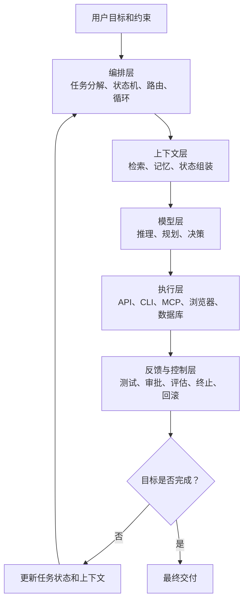

# Agent 五层架构与完整工作流分析

## 阅读摘要

将 Agent 划分为 **模型层、上下文层、执行层、编排层、反馈与控制层**，是一种适合工程设计的分析方法，但它不是某个框架规定的唯一标准。

这 5 层可以这样理解：

| 层级 | 一句话职责 | 核心问题 |
| --- | --- | --- |
| 模型层 | 负责思考与局部决策 | 下一步应该做什么？ |
| 上下文层 | 负责提供判断依据 | 模型此刻应该知道什么？ |
| 执行层 | 负责作用于外部世界 | 如何把意图变成真实操作？ |
| 编排层 | 负责组织任务过程 | 整个任务应该如何运行？ |
| 反馈与控制层 | 负责验证、安全和纠偏 | 做得是否正确、安全，是否继续？ |

完整 Agent 不是「LLM 调用几个工具」，而是一个持续运行的闭环：

```text
用户目标
  ↓
编排层创建任务状态
  ↓
上下文层组装当前所需信息
  ↓
模型层判断下一步行动
  ↓
执行层调用工具并改变外部环境
  ↓
反馈与控制层检查结果
  ↓
更新状态和上下文
  ↓
继续执行 / 重试 / 回滚 / 请求人工确认 / 结束
```

ReAct 论文将 Agent 的基本运行方式描述为「推理与行动交替进行」：模型根据当前观察生成行动，行动返回新的环境信息，再据此调整后续计划。这个循环可以看作现代工具型 Agent 的基本原型。

## 1. 为什么需要五层

把 Agent 简化为下面这个公式并没有错：

```text
Agent = Prompt + LLM + Tools
```

但这个公式不足以解释复杂 Agent 中的工程问题：

- Agent 如何知道项目当前状态？
- 多个工具应该按照什么顺序调用？
- 工具失败后由谁重试？
- 如何避免无限循环？
- 如何决定是否交给子 Agent？
- 如何保存执行进度？
- 删除文件、发送邮件前如何要求人工确认？
- 如何判断最终结果是否真正满足目标？
- 如何记录轨迹并定位失败原因？

OpenAI Agents SDK 将 Agent 描述为配置了指令、工具，以及可选的 handoff、guardrail、结构化输出等运行能力的模型。LangGraph 则进一步把持久化执行、状态管理、人工介入和工作流编排作为独立运行时能力。

因此，更完整的理解应该是：

```text
Agent
= 模型能力
+ 动态上下文
+ 外部执行能力
+ 状态化编排
+ 反馈控制机制
```

## 2. 五层整体架构

五层并不完全是从上到下的调用栈。

模型层、上下文层、执行层更像能力组件；编排层负责串联这些组件；反馈与控制层贯穿所有阶段，负责验证、审批、重试和终止。

| 层级 | 核心问题 | 主要职责 | 典型组成 |
| --- | --- | --- | --- |
| 模型层 | 下一步应该做什么？ | 理解、推理、规划、决策、生成 | LLM、推理模型、视觉模型、Embedding 模型 |
| 上下文层 | 模型此刻应该知道什么？ | 检索、记忆、状态组装、上下文压缩 | Prompt、对话记录、RAG、Memory、Spec、代码索引 |
| 执行层 | 如何影响外部世界？ | 调用工具、访问系统、执行命令 | API、Function、CLI、MCP、浏览器、数据库 |
| 编排层 | 整个任务如何运行？ | 分解、路由、状态机、循环、并行、持久化 | Workflow、Agent Loop、Graph、Scheduler、Subagent |
| 反馈与控制层 | 执行得是否正确、安全？ | 验证、评估、审批、重试、终止、回滚 | Guardrail、测试、Evaluator、HITL、Tracing |

也可以换一种角度理解：

| 视角 | 对应层级 |
| --- | --- |
| 决策能力 | 模型层 |
| 认知输入 | 上下文层 |
| 行动能力 | 执行层 |
| 流程控制面 | 编排层 |
| 治理控制面 | 反馈与控制层 |

整体关系可以表示为：



## 3. 模型层：Agent 的局部决策引擎

### 3.1 模型层是什么

模型层通常包含：

- 通用语言模型；
- 推理模型；
- 代码模型；
- 视觉模型；
- Embedding 模型；
- 分类或评分模型。

它主要负责把当前目标和上下文转化为下一步行动：

```text
理解目标
→ 识别当前状态
→ 推断信息缺口
→ 选择下一步行动
→ 生成工具参数
→ 根据工具结果调整计划
→ 生成最终输出
```

例如用户要求：

> 分析仓库中的权限模块，并修改代码后运行测试。

模型层可能生成这样的局部决策：

```text
当前缺少权限模块的入口信息
→ 先搜索目录和符号
→ 找到调用链
→ 阅读相关测试
→ 制定修改方案
→ 修改代码
→ 运行测试
```

### 3.2 模型层不等于 Agent

这是最容易混淆的地方。

LLM 本身通常只完成：

```text
输入 Token → 生成输出 Token
```

它不会天然地：

- 保存长期任务状态；
- 真正执行 Shell 命令；
- 自动管理工具权限；
- 保证操作幂等；
- 在程序中持续运行；
- 自动回滚错误操作；
- 判断任务是否已经结束。

这些能力由上下文层、执行层、编排层和反馈与控制层共同提供。

因此，模型更像 Agent 的「决策函数」，而不是完整 Agent：

```text
next_action = Model(
    goal,
    current_state,
    available_tools,
    observations,
    constraints
)
```

模型只根据当前提供给它的信息，预测下一步最合理的动作。

### 3.3 模型层的设计问题

模型层需要重点考虑：

- 模型能力是否匹配任务；
- 推理深度与成本是否合适；
- 是否支持工具调用；
- 是否支持结构化输出；
- 是否需要多模态能力；
- 是否需要多个模型分工；
- 模型是否容易产生不受约束的自由发挥。

模型越强，不代表 Agent 一定越稳定。上下文错误、工具定义模糊或编排失控，都会让强模型执行出错误结果。

## 4. 上下文层：Agent 的动态工作记忆

### 4.1 上下文层不是简单的 Prompt

上下文层解决的问题是：

> 在当前这一步，模型究竟应该看到哪些信息？

它可能包含：

- 系统指令；
- 用户目标；
- 当前任务计划；
- 历史对话；
- 项目规则；
- 仓库状态；
- 相关代码；
- 工具描述；
- 工具执行结果；
- 错误日志；
- 长期记忆；
- 当前步骤状态；
- 安全约束。

Anthropic 将上下文窗口描述为模型生成当前输出时能够引用的「工作记忆」。同时，上下文并不是越多越好：上下文增长后，检索和注意力准确度可能下降。

因此，上下文工程不是把所有文件都塞给模型，而是：

```text
检索相关信息
→ 过滤无关信息
→ 按优先级排序
→ 压缩历史内容
→ 组装当前步骤上下文
→ 发送给模型
```

### 4.2 上下文层的组成

| 类型 | 内容 | 作用 |
| --- | --- | --- |
| 静态上下文 | System Prompt、AGENTS.md、项目规范、Skill 指令、API Schema、工具说明、安全策略 | 提供长期稳定的规则和边界 |
| 动态上下文 | 当前 Git 分支、工作区修改、任务状态、上一步工具结果、测试错误、用户补充要求 | 反映任务的实时状态 |
| 短期记忆 | 已完成步骤、当前假设、临时变量、调用结果、待解决问题 | 支撑同一任务内的连续推理 |
| 长期记忆 | 用户偏好、项目架构知识、历史设计决策、常见故障解决方案 | 支撑跨任务复用 |
| 外部知识检索 | 向量数据库、文档检索、代码知识图谱、搜索引擎、数据库、文件系统、MCP Resource | 弥补当前上下文窗口的信息不足 |

LangGraph 将检查点和长期存储区分开：

- Checkpointer 保存单个线程内的图状态，用于会话连续性、人工介入和容错。
- Store 保存跨线程的用户偏好、事实和共享知识。

MCP 则提供了 AI 应用连接数据源、工具和外部工作流的标准方式。它通过 Host、Client、Server 架构隔离不同外部系统。

### 4.3 上下文层的核心作用

上下文层真正决定的是：

> 模型基于哪一个「现实版本」做决策。

例如模型修改代码时，如果上下文只有需求文档，而没有当前代码、最近提交、现有测试、功能约束和依赖调用关系，模型很可能会「按照需求重新实现」，而不是「在现有系统中最小修改」。

在代码 Agent 中，比较可靠的上下文应包含：

```text
用户需求
+ 当前仓库事实
+ 项目规范
+ 相关调用链
+ 现有测试
+ Git 状态
+ 已完成步骤
```

这也是 Spec、GitNexus、AGENTS.md、代码检索和会话状态各自承担不同作用的原因。

## 5. 执行层：Agent 的外部行动能力

### 5.1 执行层是什么

执行层将模型产生的「动作意图」转化为真实系统操作，例如：

- 查询数据库；
- 搜索网页；
- 读取文件；
- 修改代码；
- 执行 CLI；
- 调用 HTTP API；
- 操作浏览器；
- 创建工单；
- 发送邮件；
- 提交 Git Commit。

工具调用的本质通常可以表示为：

```json
{
  "tool": "read_file",
  "arguments": {
    "path": "src/auth/index.ts"
  }
}
```

工具真正执行后返回：

```json
{
  "success": true,
  "content": "..."
}
```

Anthropic 的工具调用文档指出：模型根据用户请求和工具描述决定何时调用工具。工具描述越充分，模型越容易正确判断工具的适用场景和参数。

### 5.2 Tool、Function、Script、CLI、MCP 的关系

可以把它们理解为不同层次：

```text
Tool
  ├── Function
  ├── API
  ├── Script
  ├── CLI Command
  ├── Browser Operation
  └── MCP Tool
```

| 概念 | 说明 |
| --- | --- |
| Tool | 面向模型暴露的能力单元 |
| Function | 工具在代码层面的函数实现 |
| Script | 可独立执行的自动化逻辑，可被 Function 包装成 Tool |
| CLI | 通过命令行调用的可执行程序，例如 `git status`、`npm test`、`npx playwright test` |
| MCP | 让 Agent 应用发现和调用外部工具、资源、Prompt 的标准协议 |

因此：

> Tool 在逻辑上是能力接口；Function、Script、CLI、API 是能力实现方式；MCP 是能力接入协议。

### 5.3 执行层必须具有确定性

模型可以是概率性的，但工具执行应尽可能确定。

例如模型决定：

```text
运行权限模块测试
```

执行层应把它转换成明确命令：

```bash
pnpm jest src/sensitive-permission --runInBand
```

并返回真实结果：

```text
退出码：1
失败测试：2
错误位置：render-value/index.test.tsx:68
```

执行层不应该自行猜测测试是否成功，而应该返回可验证的真实结果。

### 5.4 执行层的风险

执行层可能产生真实副作用：

- 删除文件；
- 覆盖数据库；
- 推送代码；
- 发送消息；
- 修改生产配置；
- 消耗资金；
- 暴露敏感数据。

因此执行层必须配合：

- 权限隔离；
- 参数校验；
- 沙箱；
- 超时；
- 重试；
- 幂等控制；
- 审批；
- 审计日志。

## 6. 编排层：Agent 的流程操作系统

### 6.1 编排层是什么

编排层负责回答：

> 谁在什么时候，基于什么状态，调用哪个模型或工具？失败后如何处理？什么时候结束？

它的主要职责包括：

- 任务分解；
- 步骤排序；
- 状态维护；
- 条件路由；
- 循环迭代；
- 并行执行；
- 子 Agent 调度；
- Agent handoff；
- 失败重试；
- 超时处理；
- 中断恢复；
- 最终终止。

LangGraph 将自身定位为面向长时间运行、有状态 Agent 的低层编排框架，重点能力包括持久化执行、流式输出、人工介入和状态管理。

### 6.2 编排层和模型层的区别

模型层负责：

```text
根据当前情况决定下一步。
```

编排层负责：

```text
控制模型在什么情况下进行决策；
维护执行状态；
落实模型的决策；
决定是否继续循环。
```

例如：

```text
模型层：
下一步需要运行单元测试。

编排层：
1. 检查测试工具是否可用；
2. 调用测试工具；
3. 保存测试结果；
4. 如果失败，重新进入修复节点；
5. 如果连续失败 3 次，停止并请求人工介入。
```

### 6.3 两种典型编排模式

| 模式 | 运行方式 | 优点 | 缺点 |
| --- | --- | --- | --- |
| 确定性 Workflow | 流程提前写死，例如读取需求 → 分析代码 → 制定计划 → 修改代码 → 运行测试 → 生成报告 | 稳定、可预测、容易审计、易设置门禁 | 灵活性较弱，难以处理完全未知的问题 |
| 模型驱动 Agent Loop | 模型动态决定下一步：组装上下文 → 模型选择行动 → 执行工具 → 返回观察 → 更新状态 | 灵活，适应未知环境，可以动态调整计划 | 容易循环，成本难以预测，行为不够稳定 |

实际系统通常采用混合编排：

```text
需求分析        固定阶段
  ↓
代码探索        Agent 自主选择搜索工具
  ↓
方案审批        人工门禁
  ↓
代码实现        Agent 自主修改
  ↓
测试验证        固定测试流程
  ↓
提交代码        人工确认
```

这可以概括为：

> 确定性外壳 + Agent 自主内核。

### 6.4 多 Agent 编排

当任务复杂时，编排层可以把任务交给不同角色：

```text
Coordinator
  ├── Requirement Agent
  ├── Code Explorer Agent
  ├── Implementation Agent
  ├── Test Agent
  └── Review Agent
```

OpenAI Agents SDK 中的 handoff 允许一个 Agent 把任务委托给另一个专用 Agent。Google ADK 和 AutoGen 也提供了顺序、循环、选择器和团队终止机制。

但多 Agent 不等于简单地「多调用几个模型」。它还需要解决：

- 子任务如何划分；
- 上下文如何隔离；
- 中间结果如何传递；
- 冲突由谁裁决；
- 哪个 Agent 有最终决策权；
- 如何防止多个 Agent 重复工作。

## 7. 反馈与控制层：Agent 闭环的关键

### 7.1 为什么需要反馈

没有反馈的 Agent 是单向流程：

```text
目标 → 生成 → 执行 → 结束
```

有反馈后才形成闭环：

```text
目标
→ 行动
→ 观察结果
→ 比较目标
→ 修正行动
→ 再次验证
```

反馈与控制层要判断：

- 执行成功了吗？
- 结果正确吗？
- 是否违反约束？
- 是否需要重试？
- 是否发生偏离？
- 是否应该回滚？
- 是否需要人工确认？
- 任务是否已经完成？

### 7.2 五类反馈

| 类型 | 来源 | 示例 |
| --- | --- | --- |
| 环境反馈 | 工具和外部环境 | API 返回值、Shell 退出码、浏览器截图、数据库结果、文件变化、Git Diff |
| 规则反馈 | 预定义确定性约束 | 测试必须通过、不能修改指定目录、不能直接推送 master、工具最多重试 3 次 |
| 模型评估反馈 | 同一模型或另一个模型 | 方案是否覆盖需求、回答是否完整、代码是否存在风险、输出是否符合格式 |
| 人工反馈 | 关键操作审批 | 是否采用设计方案、是否执行数据库迁移、是否发送邮件、是否推送代码 |
| 运行反馈 | 可观测性系统 | Token 消耗、延迟、工具失败率、重试次数、循环次数、Agent 成功率、任务轨迹 |

模型评估反馈具有概率性，不能替代真实测试和确定性规则。

LangGraph 的 `interrupt` 可以在工作流中保存状态并暂停执行，等待外部输入后继续。它适用于发送邮件、删除记录、金融操作等不可逆动作。

OpenAI Agents SDK 的 tracing 会记录模型生成、工具调用、handoff、guardrail 和自定义事件，用于开发和生产环境中的调试与监控。

### 7.3 控制机制

反馈只有进入控制逻辑才有意义。

例如测试失败时，控制层可以这样分流：

```text
测试失败
  ↓
是否属于实现错误？
  ├── 是 → 返回实现阶段
  ├── 环境错误 → 修复环境或换工具
  ├── 需求冲突 → 请求用户确认
  └── 连续失败超过阈值 → 终止
```

常见控制机制包括：

- 最大循环次数；
- 最大 Token；
- 最大执行时间；
- 最大工具调用次数；
- 停止条件；
- 置信度阈值；
- 权限门禁；
- 人工审批；
- 自动回滚；
- 降级策略；
- 熔断机制。

AutoGen 中的 termination condition 会在 Agent 响应后检查是否应停止团队运行，可以使用最大消息数、特定消息、handoff 等条件控制结束。

### 7.4 Guardrail、Evaluator 和 Test 的区别

| 机制 | 主要作用 | 示例 |
| --- | --- | --- |
| Guardrail | 阻止不允许的输入或行动 | 禁止执行危险命令 |
| Validator | 检查格式和基本约束 | JSON Schema 校验 |
| Test | 验证确定性功能行为 | Jest、Playwright |
| Evaluator | 评估非确定性质量 | 回答完整度、相关性 |
| Human Approval | 对高风险操作做决策 | 是否推送代码 |
| Tracing | 记录和定位过程问题 | 工具调用轨迹 |

Guardrail 更关注「能不能做」，Evaluator 更关注「做得好不好」，Test 更关注「结果是否满足确定性预期」。

## 8. 完整 Agent 工作流

下面用一个代码 Agent 场景串起五层。

用户目标：

> 修复权限模块的数据脱敏问题，并确保现有功能不受影响。

### 8.1 阶段一：接收目标

编排层创建任务状态：

```json
{
  "goal": "修复权限模块的数据脱敏问题",
  "status": "planning",
  "completed_steps": [],
  "constraints": [
    "不能破坏已有权限逻辑",
    "测试必须通过",
    "修改范围尽可能小"
  ]
}
```

### 8.2 阶段二：构造上下文

上下文层按需检索：

- 项目规范；
- 相关 Spec；
- 权限模块目录；
- 当前 Git Diff；
- 调用链；
- 现有测试；
- 最近错误日志。

然后组装模型当前所需的信息：

```text
目标
+ 代码入口
+ 相关依赖
+ 现有测试
+ 项目约束
+ 可用工具
+ 当前状态
```

这里必须强调：上下文层不一定把整个仓库交给模型，而是根据当前任务逐步检索。

### 8.3 阶段三：模型生成计划

模型层分析后给出计划：

1. 检查脱敏值识别逻辑；
2. 检查 `render-value` 的调用位置；
3. 对照现有测试确定兼容行为；
4. 最小修改判断函数；
5. 补充回归测试；
6. 运行测试和类型检查。

反馈与控制层检查计划：

- 是否覆盖用户目标；
- 是否包含验证步骤；
- 是否修改范围过大；
- 是否触及禁止目录。

通过后进入执行阶段。

### 8.4 阶段四：执行探索

模型选择动作：

```text
搜索 maskedValue 的引用。
```

编排层调用执行工具：

```bash
rg "maskedValue|isMasked" apps/alliance-operation-daren
```

执行层返回搜索结果。上下文层将结果加入当前状态，但不会永久把所有输出重复塞回模型，而是提取：

- 入口文件；
- 调用者；
- 相关测试文件；
- 关键实现片段。

### 8.5 阶段五：实施修改

模型生成结构化操作：

```text
修改 src/utils/render-value.ts
新增 float 脱敏值判断
保留原 string 和 int 行为
```

执行层修改文件。

反馈与控制层立即检查：

```bash
git diff --check
pnpm eslint ...
pnpm jest ...
```

### 8.6 阶段六：根据反馈迭代

假设测试失败：

```text
Expected: ****
Received: -99999.0
```

控制层判断：

```text
测试失败
→ 任务未完成
→ 回到分析节点
```

上下文层只把失败测试和相关代码重新提供给模型。模型修正实现，再次执行测试。

这就是：

```text
Reason
→ Act
→ Observe
→ Update
→ Reason again
```

它不是一次性生成全部代码，而是持续观察和修正。

### 8.7 阶段七：完成判定

控制层根据完成条件判断：

| 检查项 | 状态 |
| --- | --- |
| 需求覆盖 | 通过 |
| 单元测试 | 通过 |
| 类型检查 | 通过 |
| Git Diff 检查 | 通过 |
| 禁止目录检查 | 通过 |
| 用户审批 | 待确认 |

如果「提交代码」属于高风险操作，Agent 应暂停并交还给用户确认。

最终输出应包含：

- 修改了什么；
- 为什么这样修改；
- 影响范围；
- 验证结果；
- 剩余风险；
- 是否实际提交。

## 9. 两个循环：理解 Agent 的关键

完整 Agent 实际上存在两个循环。

### 9.1 内循环：模型—工具循环

```text
模型判断
→ 工具执行
→ 获取观察
→ 模型再次判断
```

特点：

- 粒度较小；
- 频率较高；
- 处理局部问题；
- 类似 ReAct。

例如：

```text
读文件 → 搜索引用 → 再读文件 → 修改代码
```

### 9.2 外循环：目标—验证循环

```text
确定目标
→ 制定计划
→ 执行任务
→ 验证结果
→ 判断目标是否完成
→ 必要时重新规划
```

特点：

- 粒度较大；
- 由编排层和反馈与控制层主导；
- 防止局部成功但整体失败。

例如：

```text
代码已经修改成功，
但测试没有通过，
所以整个任务仍然没有完成。
```

两者的关系可以概括为：

```text
外循环：目标是否完成？
  └── 内循环：下一步调用什么工具？
```

## 10. 五层之间的数据流、控制流和反馈流

### 10.1 数据流

数据流主要描述信息如何传递：

```text
外部环境
→ 执行结果
→ 上下文层整理
→ 模型读取
→ 生成行动
→ 执行层
```

### 10.2 控制流

控制流决定任务如何推进：

```text
编排层
→ 调用模型
→ 调用工具
→ 触发验证
→ 决定下一节点
```

### 10.3 反馈流

反馈流负责纠偏：

```text
工具结果 / 测试 / 人工意见
→ 反馈与控制层
→ 更新任务状态
→ 重新编排
→ 更新上下文
```

## 11. 常见误区

| 误区 | 问题 | 更可靠的理解 |
| --- | --- | --- |
| 把 Prompt 当作全部上下文 | Prompt 只是上下文层的一部分 | 完整上下文还包括检索内容、任务状态、工具结果、长短期记忆、环境状态和项目规则 |
| 把 Tool 当成 Agent | Tool 只完成一个动作 | Agent 要决定何时调用、调用哪个工具、参数是什么、结果是否有效、下一步做什么、何时结束 |
| 把工作流全部交给模型 | 容易跳过测试、绕过审批、无限重试、过早结束、扩大修改范围 | 关键门禁应固化在编排层和反馈与控制层 |
| 子 Agent 越多越好 | 会增加上下文传递成本、调用次数、协作冲突和终止判断难度 | 只有任务有明确专业边界或可并行子任务时，多 Agent 才更有价值 |
| 模型自我评价等同于验证 | 模型说「测试应该能通过」，不等于测试实际通过 | 真实环境执行和自动化测试优先级更高 |

可靠性优先级一般是：

```text
真实环境执行结果
> 自动化测试
> 确定性规则校验
> 独立模型评估
> 模型自我判断
```

## 12. 如何将五层落地为工程系统

### 12.1 模型层配置

可以为不同任务配置不同模型：

```yaml
model:
  primary: reasoning-model
  fast_model: lightweight-model
  embedding_model: embedding-model
```

典型分工：

- 规划使用推理模型；
- 简单分类使用轻量模型；
- 文档检索使用 Embedding；
- 页面分析使用视觉模型。

### 12.2 上下文层设计

建议维护独立上下文目录：

```text
context/
├── system-instructions
├── project-rules
├── current-task-state
├── short-term-memory
├── long-term-memory
├── retrieval
├── code-index
└── context-compaction
```

核心原则：

- 按需检索；
- 原始事实优先；
- 动态状态优先；
- 相关内容优先；
- 避免重复上下文。

### 12.3 执行层设计

每个工具至少应定义：

- 名称；
- 用途；
- 适用场景；
- 参数 Schema；
- 返回 Schema；
- 权限等级；
- 是否有副作用；
- 是否可重试；
- 超时时间；
- 错误类型。

示例：

```yaml
tool: git_push
risk: high
side_effect: true
requires_approval: true
retryable: false
```

### 12.4 编排层设计

可以把任务定义为状态图：

```text
START
  ↓
Understand
  ↓
Explore
  ↓
Plan
  ↓
Approval
  ↓
Implement
  ↓
Test
  ├── failed → Diagnose → Implement
  └── passed → Review → END
```

每个节点应明确：

- 输入状态；
- 输出状态；
- 可调用工具；
- 成功条件；
- 失败路径；
- 最大重试次数。

### 12.5 反馈与控制层设计

至少设置：

- 输入 Guardrail；
- 工具 Guardrail；
- 输出 Validator；
- 测试门禁；
- 最大步骤数；
- 最大成本；
- 超时；
- 高风险审批；
- 执行日志；
- 完整 Trace；
- 完成条件。

Google ADK 的 callback 机制允许在模型调用、工具调用和 Agent 执行的不同阶段观察、修改或阻止行为，适合实现验证、日志和安全控制。

## 13. 五层与常见 Agent 技术的对应关系

| 技术或概念 | 主要所属层 | 说明 |
| --- | --- | --- |
| GPT、Claude、Gemini | 模型层 | 推理与生成 |
| System Prompt | 上下文层 | 行为指令 |
| RAG | 上下文层 | 动态检索知识 |
| Memory | 上下文层 | 保存会话或长期信息 |
| AGENTS.md | 上下文层 | 项目级约束 |
| GitNexus | 上下文层 | 代码结构与调用关系 |
| Function Calling | 执行层接口 | 让模型声明工具调用 |
| CLI、API、Script | 执行层实现 | 实际执行动作 |
| MCP | 上下文层与执行层之间 | 标准化暴露资源和工具 |
| LangGraph | 编排层 | 状态图、持久化、人工介入 |
| AutoGen Team | 编排层 | 多 Agent 协作 |
| Subagent | 编排层 | 子任务委派 |
| Guardrail | 反馈与控制层 | 限制输入、输出和工具 |
| Jest、Playwright | 反馈与控制层 | 确定性验证 |
| Tracing | 反馈与控制层 | 可观察和调试 |
| Human-in-the-loop | 反馈与控制层 | 人工审批和纠偏 |
| OpenSpec | 上下文层与编排层 | 规范资产和阶段工作流 |
| Superpowers Workflow | 编排层与反馈与控制层 | 设计、计划、执行门禁 |

## 14. 最终理解

从系统角度看，Agent 不是一个单独的模型，而是一个由模型驱动、状态持续更新、能够调用外部能力，并根据反馈调整行为的运行系统。

五层可以用一句话分别概括：

| 层级 | 一句话概括 |
| --- | --- |
| 模型层 | 在当前信息下，判断下一步应该做什么。 |
| 上下文层 | 决定模型当前能够看到和依据什么信息。 |
| 执行层 | 把模型的行动意图转化为真实系统操作。 |
| 编排层 | 维护任务状态，并控制步骤、顺序、路由和循环。 |
| 反馈与控制层 | 判断行动是否正确、安全，以及应该继续、重试、回滚还是结束。 |

整个 Agent 的本质可以进一步归纳为：

```text
Agent 工作流
= 状态驱动的决策循环
+ 上下文动态组装
+ 外部工具执行
+ 结果反馈纠偏
+ 全局目标控制
```

最合理的工程设计不是让模型完全自由运行，而是：

> 让模型负责不确定性决策，让程序负责确定性流程，让工具负责真实执行，让测试和规则负责验证，让人负责高风险决策。


早期 LangChain 最有代表性的概念是 Chain：

Prompt
  ↓
LLM
  ↓
Output Parser

或者：

检索
→ 拼接上下文
→ 调用模型
→ 解析结果

这种写法通常是一条顺序管道，所以容易形成：

LangChain = 线性 Chain

但实际上，即使是 LangChain 的 Runnable / LCEL，也不只支持线性结构。

它至少可以实现：

顺序执行：RunnableSequence
并行执行：RunnableParallel
条件分支：RunnableBranch
自定义逻辑：RunnableLambda

官方 API 中，RunnableBranch 可以根据条件选择不同分支，RunnableParallel 可以并发执行多个 Runnable。

所以：

LangChain Chain
≠ 只能线性执行

但是，传统 LCEL 更适合组合数据处理管道，而不适合表达复杂的：

循环；
长期状态；
中断恢复；
人工审批；
多节点反复跳转；
持久化任务；
复杂 Agent 状态机。

这些正是 LangGraph 出现的重要原因。

二、当前 LangChain 已经不只是 Chain

当前 LangChain 的核心高层接口之一是：

create_agent(...)

它不是一个简单的线性 Chain，而是一个模型与工具持续交互的动态循环：

START
  ↓
Model
  ├── 调用工具 → Tools → Model
  └── 最终回答 → END

模型每轮都可以动态决定：

调不调用工具；
调用哪个工具；
调用多少次；
根据工具结果做什么；
什么时候结束。

LangChain 官方将 Agent 定义为模型不断调用工具、直到任务完成的循环；create_agent 提供的是一个可配置的 Agent Harness。

因此，当前 LangChain 可以实现：

模型 → 工具 → 模型 → 工具 → 模型 → 结束

这显然不是线性固定工作流。

三、create_agent 确实构建在 LangGraph 上

LangChain v1 官方说明，create_agent 基于 LangGraph 构建，因此自动获得：

持久化；
流式输出；
Human-in-the-loop；
长时间运行；
检查点；
可靠执行。

因此下面这个表述是成立的：

LangChain create_agent
=
高层 Agent 构建接口
+
LangGraph 底层运行时

开发者使用 LangChain 时，可能只需要写：

agent = create_agent(
    model=model,
    tools=tools,
    system_prompt=prompt,
)

LangChain 帮你创建通用 Agent Loop；底层状态循环、工具节点和运行机制由 LangGraph 支撑。

四、但不能说“整个 LangChain 都在 LangGraph 之上”

这里需要修正之前的分层公式。

LangChain 生态中还存在一个更基础的包：

langchain-core

它提供：

Model 接口；
Message；
Tool；
Runnable；
Prompt；
Output Parser；
通用组件协议。

LangGraph 和 LangChain 的高层 Agent API 都会使用这些基础抽象。

更准确的关系不是严格单向的：

LangGraph
    ↓
LangChain

而是：

                  langchain-core
        模型、消息、工具、Runnable 等基础抽象
                 ↙              ↘
          LangGraph           LangChain
      状态与编排运行时      高层 Agent 构建接口
                 ↘              ↙
                 create_agent
           使用 LangGraph 作为运行时

因此，应表述为：

LangChain v1 的高层 Agent API 建立在 LangGraph Runtime 上，但 LangChain 整个生态并不是 LangGraph 的简单上层封装。

五、LangChain、LangGraph 各自负责什么
LangChain

主要给开发者提供：

模型统一接口
Tool 定义
Prompt
Message
Middleware
Memory 配置
create_agent
预构建 Agent 架构

目标是：

快速构建一个常见 Agent，不需要自己设计底层图。

LangGraph

主要提供：

State
Node
Edge
条件分支
循环
并行
Checkpoint
Interrupt
持久化
人工介入
恢复执行

目标是：

精确控制 Agent 或 Workflow 怎样运行。

LangGraph 官方将自己定位为长时间运行、有状态 Agent 和 Workflow 的低层基础设施，并不会替开发者规定 Prompt 或 Agent 架构。

六、三种工作方式的区别
1. LangChain Runnable / Chain

适合数据处理管道：

输入
→ 检索
→ Prompt
→ 模型
→ Parser
→ 输出

可以有分支和并行，但通常还是面向可组合的数据流。

2. LangChain create_agent

适合通用动态 Agent：

Model
  ├── search
  ├── read_file
  ├── database
  ├── API
  └── final answer

模型动态选择工具，底层由 LangGraph Runtime 支撑。

3. 直接使用 LangGraph

适合自定义复杂流程：

需求分析
   ↓
方案生成
   ↓
人工审批
   ├── 拒绝 → 重新生成
   └── 通过 → 实现 Agent
                    ↓
                  测试
             ┌──────┴──────┐
           失败            通过
            ↓               ↓
          修复             Review
            └────→ 测试       ↓
                            END

LangGraph 可以实现顺序、条件分支、循环和并行执行。

七、LangChain Agent 与 LangGraph 的关系

可以把当前 LangChain Agent 简化成：

LangChain create_agent
│
├── LangChain 提供
│   ├── Model 接口
│   ├── Tools
│   ├── System Prompt
│   ├── Middleware
│   └── 高层配置 API
│
└── LangGraph 提供
    ├── Agent Loop
    ├── State
    ├── Tool Node
    ├── 条件路由
    ├── Checkpoint
    ├── Persistence
    └── Human-in-the-loop

所以：

LangChain create_agent
=
LangChain 高层组件
+
LangGraph 运行时
八、修正后的完整层次关系

之前写成：

LangGraph
→ LangChain
→ Deep Agents

作为入门理解可以使用，但不够严谨。

更准确的结构是：

langchain-core
├── Model
├── Message
├── Tool
├── Runnable
└── 基础协议
        │
        ├─────────────────┐
        ↓                 ↓
   LangGraph          LangChain
状态与编排运行时      高层组件与 Agent API
        │                 │
        └──── create_agent┘
                  ↓
             Deep Agents
      规划、文件、Skill、子 Agent、
      Memory、上下文管理等高级 Harness

进一步表示为：

LangChain create_agent
=
langchain-core 基础抽象
+ LangChain 高层 Agent API
+ LangGraph Runtime
Deep Agents
=
LangChain create_agent
+ LangGraph Runtime
+ Planning
+ Filesystem
+ Context Management
+ Subagents
+ Memory
+ Skills
九、最终判断
“LangChain 只能实现线性工作流”是否正确？

不正确。

LangChain 至少可以构建：

顺序管道；
并行执行；
条件分支；
模型—工具动态循环；
多 Agent 协作。

但当你需要精细控制循环、状态、节点路由、持久化和人工中断时，通常直接使用 LangGraph 更合适。

“LangChain 在 LangGraph 之上吗？”

需要限定范围：

错误的绝对表述：
整个 LangChain 都构建在 LangGraph 之上。

准确表述：
当前 LangChain v1 的 create_agent
使用 LangGraph 作为底层运行时。

一句话总结：

早期 LangChain 以 Chain 和数据管道著称，但并非只能线性执行；当前 LangChain 的 create_agent 已是基于 LangGraph Runtime 的动态 Agent Harness，而 LangGraph 提供更底层、更自由的状态与编排控制。


angGraph
=
底层 Agent Runtime
+ 状态图
+ 节点与路由
+ 循环与并行
+ 持久化执行
+ 中断恢复
+ Human-in-the-loop

LangGraph 主要提供底层编排和运行能力。它既可以实现固定 Workflow，也可以实现由模型动态决定工具和执行路线的 Agent Loop。

LangChain
=
模型与工具统一接口
+ Prompt 与消息管理
+ Tool Calling
+ 通用 Agent Loop
+ Middleware
+ Memory 与上下文组件
+ LangGraph Runtime

LangChain 在 LangGraph 之上提供更高层的 Agent 构建接口。其 create_agent 是一个最小且高度可配置的 Agent Harness，可以组合模型、工具、System Prompt 和 Middleware，并持续调用工具，直到满足停止条件。

Deep Agents
=
LangChain Agent 基础能力
+ LangGraph Runtime
+ 通用 Agent Loop
+ Planning
+ Filesystem
+ Context Management
+ Subagents
+ Memory
+ Skills 机制

Deep Agents 是构建在 LangChain Agent 基础组件之上的独立高级 Harness，并使用 LangGraph Runtime 获得持久化执行、流式处理、人工介入等能力；在此基础上，它进一步预装了任务规划、文件系统、上下文管理和子 Agent 等能力。

2. 更准确的分层关系
LangGraph
    ↓
提供底层运行时和编排能力

LangChain
    ↓
基于 LangGraph 提供通用 Agent 构建层

Deep Agents
    ↓
基于 LangChain 与 LangGraph
提供预构建的高级 Agent Harness

开发者定制
    ↓
形成具体业务 Agent

因此可以概括为：

LangGraph
= Agent 的运行与编排底座

LangChain
= 通用 Agent 开发框架和基础 Harness

Deep Agents
= 面向复杂长任务的高级预构建 Harness
3. Deep Agents 的完整组成公式
Deep Agents
=
LangChain 提供的：
    模型接口
  + Tool 接口
  + Prompt
  + Agent Loop
  + Middleware 机制

+
LangGraph 提供的：
    State
  + Runtime
  + 持久化执行
  + Streaming
  + Interrupt
  + Human-in-the-loop

+
Deep Agents 增加的：
    Planning
  + Filesystem
  + Context Management
  + Context Offloading
  + Subagents
  + Long-term Memory
  + Skills

因此，Deep Agents 不是脱离 LangChain 和 LangGraph 的另一套底层框架，而是：

使用 LangChain 的 Agent 构建能力和 LangGraph 的运行时能力，预先组装完成的一套高级通用 Harness。

4. 具体业务 Agent 的组成

在 Deep Agents 基础上，开发者继续加入业务能力：

具体业务 Agent
=
Deep Agents

+ 业务 Tools
    Git
    Shell
    Browser
    Database
    API
    MCP

+ 领域 Skills
    TDD
    Code Review
    Spec Analysis
    故障排查
    发布流程

+ 项目 Memory
    项目架构
    技术规范
    历史决策
    用户偏好

+ 专用 Subagents
    代码分析 Agent
    测试 Agent
    Review Agent
    文档 Agent

+ Middleware / Hooks
    工具调用拦截
    日志记录
    自动重试
    上下文压缩
    敏感信息过滤

+ 权限与审批规则
    文件访问权限
    危险命令拦截
    人工审批
    最大执行次数
    成本与时间限制

最终公式为：

具体业务 Agent
=
LangGraph Runtime
+ LangChain Agent 基础能力
+ Deep Agents 通用 Harness
+ 业务 Tools
+ 领域 Skills
+ 项目 Memory
+ 专用 Subagents
+ Middleware / Hooks
+ 权限与审批规则