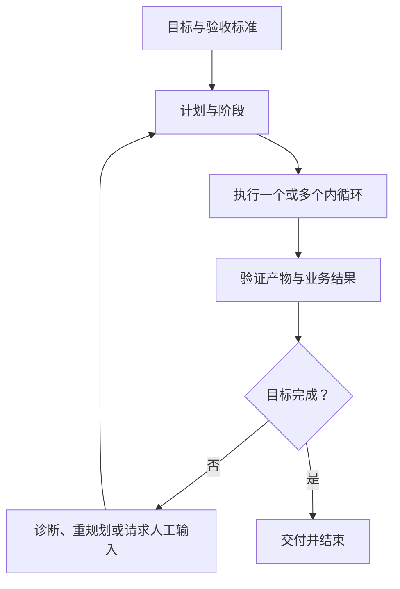
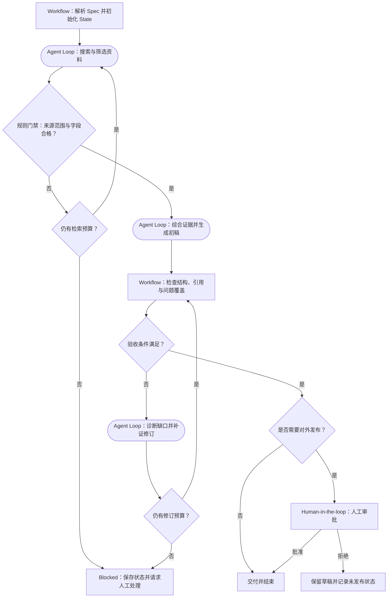
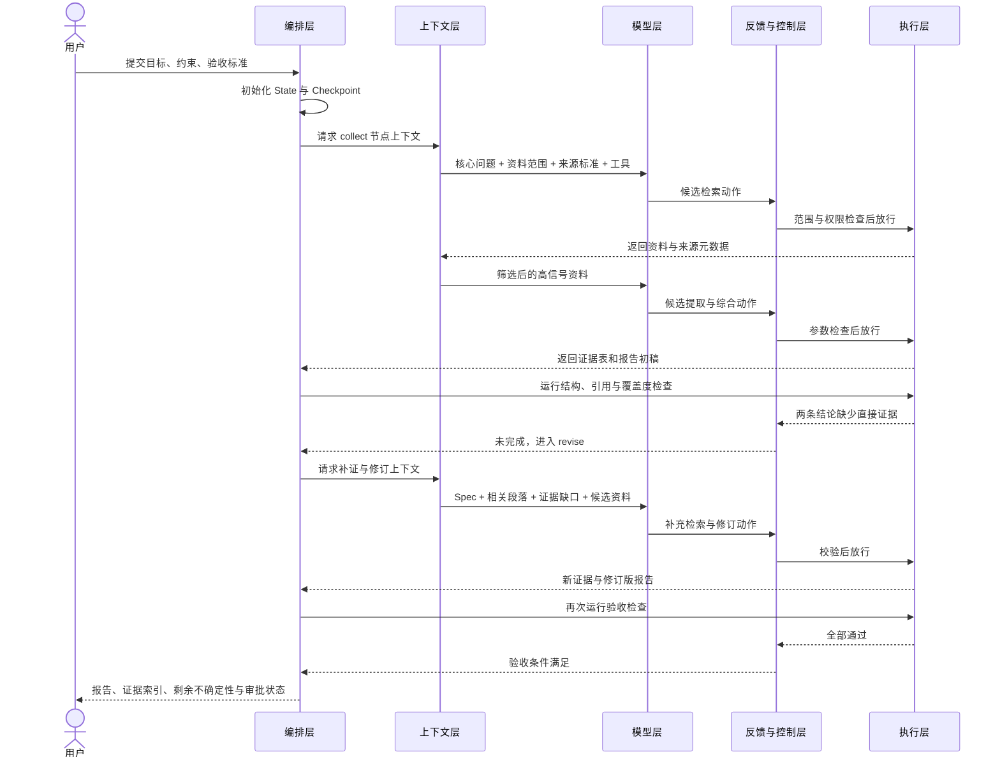

# 03 Agent 完整工作流

前两章分别回答了两个问题：[第 01 章](01-从Prompt-Engineer到Harness-Engineer.md)解释为什么 Agent 工程会从 Prompt Engineering 演化到 Harness Engineering，[第 02 章](02-Agent五层架构.md)解释一个完整 Agent 可以拆成哪五层。本章进一步回答第三个问题：**这五层怎样在时间上反复协作，把“收到任务”推进到“有证据地完成任务”？**

### 【从前两章走到完整工作流】

[第 01 章](01-从Prompt-Engineer到Harness-Engineer.md)建立的是一条能力演化链：Prompt 把任务说清楚，Context 提供当前所需事实，Tools 让模型能够行动，ReAct 把决策和行动连成局部循环，Memory 与 Skills 让关键知识可以跨轮找回、按需加载，Workflow 管理全局进度，Feedback 验证结果，Harness 再把这些部分装配成可持续运行的系统。OpenAI 在 [《Harness engineering: leveraging Codex in an agent-first world》](https://openai.com/index/harness-engineering/) 中强调，工程重点正在转向为 Agent 设计环境、表达意图和构建反馈循环；工作流正是这些要素在一次任务中的运行方式。

[第 02 章](02-Agent五层架构.md)把这些能力收敛为五个稳定职责：

```text
模型层：根据当前信息提出下一步
上下文层：为当前步骤准备必要信息
执行层：调用工具并改变或读取外部环境
编排层：维护任务状态、阶段、路由与恢复
反馈与控制层：在执行前控制风险，在执行后验证结果
```

但“五层”是一张职责地图，不是从上到下只走一次的调用栈。一次任务可能经历多轮检索、生成、验证和修订；每一轮都会重新选择步骤、装配上下文、产生行动、读取结果并更新状态。因此，本章介绍如何转换成一条**状态驱动、可以循环和恢复的任务生命周期**。

### 【先用一句话理解完整工作流】

完整工作流就是：**围绕一个明确目标，反复执行“读取进度—准备信息—决定下一步—实际执行—验证结果—更新进度”，直到验收条件被证据满足。**

```text
接收目标与验收标准
→ 记录当前任务进度
→ 为当前步骤准备必要信息
→ 模型提出下一步候选行动
→ 检查风险并调用工具
→ 读取环境返回的真实结果
→ 验证本步是否成功、整体是否完成
→ 写回任务进度
→ 未完成则进入下一轮，完成才交付
```

这条链路中有六个容易混淆的概念：

| 概念 | 通俗理解 | 调研报告任务中的例子 |
| --- | --- | --- |
| Spec | 任务合同：要做什么、不能做什么、怎样算完成 | 报告必须回答指定问题，关键结论必须附证据 |
| State | 任务进度表：已经做到哪里、还欠什么 | 已完成资料收集，仍有两条结论缺少证据 |
| Context | 当前这一步摆在模型工作台上的材料 | 报告要求、相关资料、证据卡片和待解决问题 |
| Candidate Action | 模型建议的下一步，还不是已经发生的事实 | 建议检索缺失信息，或修订某一段结论 |
| Observation | 工具或外部环境返回的真实结果 | 找到三份资料，其中两份对同一事实表述冲突 |
| Validation | 用规则或证据判断动作是否成功、目标是否完成 | 问题全部回答、结论可追溯、格式合格才允许结束 |

最重要的边界是：**模型只能提出行动，工具才会读取或改变外部环境；工具调用成功只代表动作发生，验证通过才代表结果符合要求。**

### 【先看一个通用任务怎样跑起来】

下面使用一个不依赖特定框架或业务的例子：

> 围绕指定主题，基于用户提供的材料和允许检索的公开资料，生成一份结构清晰、结论可追溯的调研报告。

系统先把这个自然语言请求整理成四条验收条件：

1. 报告完整回答用户指定的核心问题；
2. 每条关键事实和结论都能定位到证据；
3. 事实、推断和仍有冲突的信息被明确区分；
4. 报告符合用户要求的结构、语言和篇幅。

随后，Agent 不会一次生成全部答案，而是按轮次推进：

| 轮次 | 当前目标 | Agent 的候选行动与环境结果 | State 如何变化 |
| --- | --- | --- | --- |
| 起点 | 建立任务边界 | 解析主题、核心问题、资料范围、交付格式和验收条件 | `status = collecting`，记录待办与约束 |
| 第 1 轮 | 建立资料清单 | 模型提出检索计划；搜索与读取工具返回一批候选资料 | 记录资料来源，并标记尚未覆盖的问题 |
| 第 2 轮 | 提取和整理证据 | 模型从高相关资料中提取事实、时间、出处和冲突点 | 生成证据表，标记每条证据支持哪个问题 |
| 第 3 轮 | 形成初稿 | 模型基于 Spec 和证据表生成结构化报告 | 保存初稿，但 `done` 仍为 `false` |
| 第 4 轮 | 验证初稿 | Validator 发现一条关键结论没有来源，另一处混淆了事实与推断 | 写入验证报告，转入 `revising`，不能结束 |
| 第 5 轮 | 补证并修订 | 上下文只装入缺口、相关段落和候选资料；模型补充检索并改写 | 更新证据表、报告和修改原因 |
| 第 6 轮 | 完成验收 | 覆盖度、证据映射、事实边界和格式检查全部通过 | 验收条件都有证据，设置 `done = true` |

这个例子揭示了工作流的三个关键点：

- **验证不通过不是对话终点，而是下一轮的输入。** 第 4 轮发现的证据缺口会成为第 5 轮的检索与修订材料；
- **State 把多轮行动连成一个任务。** 没有 State，模型只看到当前消息，很容易忘记完成项、失败次数和剩余验收条件；
- **局部动作成功不等于整体任务完成。** 找到资料或生成初稿只完成了一个阶段，必须继续验证问题覆盖、证据质量和交付格式。

### 【为什么一个局部 Agent Loop 还不够】

Yao 等人在 [《ReAct: Synergizing Reasoning and Acting in Language Models》](https://arxiv.org/abs/2210.03629) 中提出了推理与行动交错的基本模式，可以概括为：模型判断下一步、调用工具、读取观察，再继续判断。它非常适合回答“为了当前小目标，下一步做什么”。

但如果只让这个局部循环不断运行，系统仍然回答不了三个全局问题：

```text
整个任务已经完成了什么？
剩余验收条件是什么？
连续失败后应该重试、换路、暂停，还是结束？
```

原因在于：Memory 主要保证关键知识可找回，执行层主要保证动作能够发生，ReAct 主要决定当前观察下的下一步；它们都不能单独管理完整任务生命周期。因此还需要显式 State 记录进度，由编排层选择阶段，并由反馈与控制层依据真实结果判断是否结束。Anthropic 的 [《Demystifying evals for AI agents》](https://www.anthropic.com/engineering/demystifying-evals-for-ai-agents) 也区分了 Agent 的执行轨迹与外部结果：Agent 说“完成了”不等于目标真的已经实现。

由此可以得到本章最核心的结构：

```text
外循环负责：整个目标是否已经完成？
  └── 内循环负责：为了推进当前阶段，下一步调用什么工具？
```

### 【五层怎样在一轮任务中接力】

回到第 02 章的五层，可以把调研任务中的一轮修订理解为：

| 顺序 | 主导层 | 本轮职责 | 调研报告中的动作 |
| --- | --- | --- | --- |
| 1 | 编排层 | 读取 State，选择当前节点 | 发现“关键结论缺少证据”，进入补证节点 |
| 2 | 上下文层 | 只装配当前节点需要的信息 | 提供 Spec、缺证结论、相关段落和已有资料 |
| 3 | 模型层 | 基于当前 Context 提出候选行动 | 建议检索某类权威资料并改写结论 |
| 4 | 反馈与控制层 | 执行前检查工具、参数、范围和权限 | 确认只访问允许的数据源，不自动对外发布 |
| 5 | 执行层 | 调用工具并返回真实 Observation | 搜索并读取资料，返回内容、时间和来源地址 |
| 6 | 反馈与控制层 | 判断动作是否成功、目标是否更接近完成 | 检查新证据是否真的支持该结论 |
| 7 | 编排层 | 把结果写回 State，选择继续、结束或暂停 | 更新证据表；若仍不充分，则进入下一轮 |

同一轮中还同时存在三种流：资料和证据在层之间移动，形成**数据流**；节点从收集走向起草、验证和修订，形成**控制流**；验证结果反过来改变 State 和下一步路径，形成**反馈流**。第 02 章的五层定义了“谁负责”，本章的工作流定义了“何时发生、先后如何、失败后去哪里”。

### 【从状态而不是聊天记录开始设计】

这里的 State 是当前任务的控制状态，不等于长期 Memory，也不等于大型产物本身。State 持久化后形成 Checkpoint，用于恢复同一个 Thread；跨任务偏好和共享事实进入 Long-term Store；完整资料快照、报告草稿和验证日志进入 Artifact Store，State 只保存摘要与引用。LangGraph 的 [《Persistence》](https://docs.langchain.com/oss/python/langgraph/persistence) 将 Checkpointer 定义为 Thread 范围的短期状态持久化，将 Store 定义为跨 Thread 的长期数据持久化。

聊天记录只能说明说过什么，不能完整表达任务当前处于什么状态。可靠 Agent 应维护显式 State，例如：

```json
{
  "goal": "生成一份结论可追溯的调研报告",
  "status": "revising",
  "plan": [
    "确认问题与资料范围",
    "收集并筛选资料",
    "建立证据表",
    "生成并验证报告"
  ],
  "completed_steps": ["确认范围", "完成初稿"],
  "observations": ["一条关键结论缺少来源", "两份资料对统计口径表述不同"],
  "artifacts": {
    "spec": "artifacts/spec.md",
    "evidence_table": "artifacts/evidence.csv",
    "draft": "artifacts/report-v1.md",
    "validation_report": "artifacts/validation.json"
  },
  "constraints": [
    "关键事实必须绑定证据",
    "事实、推断和冲突信息必须分开",
    "未经批准不能对外发布"
  ],
  "retry_count": 1,
  "pending_approval": null,
  "done": false
}
```

State 至少要区分：

- **目标**：最终想达到什么结果；
- **约束**：哪些操作和结果不允许；
- **计划**：当前准备怎样推进；
- **观察**：工具返回的真实事实；
- **产物**：资料快照、证据表、报告、验证日志等可引用对象；
- **控制字段**：阶段、重试、审批、预算和完成状态。

不要把所有内容都堆进一个 `messages` 数组。结构化字段能让路由、查询、恢复和验证更确定。

### 【把完整工作流拆成四组九阶段】

九个阶段不需要孤立记忆。先记住四个连续的问题，再把详细阶段放进去：

| 阶段组 | 核心问题 | 对应阶段 |
| --- | --- | --- |
| 一、建立边界 | 要完成什么，怎样才算完成？ | 1. 建立 Spec；2. 初始化 State |
| 二、决定下一步 | 当前该做什么，模型需要知道什么？ | 3. 选择步骤；4. 组装 Context；5. 产生候选行动 |
| 三、执行行动 | 这个动作能不能做，执行后发生了什么？ | 6. 执行前控制；7. 工具执行并返回 Observation |
| 四、验证并推进 | 本步是否成功，整体是否完成？ | 8. 执行后验证；9. 回写 State 并继续或结束 |

可以把它压缩成一句口诀：

```text
定目标 → 想下一步 → 做动作 → 验结果
```

展开之后，一个通用 Agent 工作流是：

```text
用户目标 / Spec
→ 初始化任务状态
→ 选择下一步骤
→ 组装本轮上下文
→ 模型产生候选行动
→ 执行前控制
→ 工具执行并返回观察
→ 执行后验证
→ 回写状态并继续或结束
```

这九个阶段描述的是**职责顺序**，不是九次固定模型调用。某些阶段由确定性代码完成，某些阶段会包含多次模型—工具内循环；任务失败后，也可能回到前面的阶段重新规划。

#### 1. 接收目标并建立 Spec

把自然语言请求转化为执行合同：

```yaml
goal: 生成一份结论可追溯的调研报告
in_scope:
  - 用户提供的材料
  - 允许检索的公开资料
  - 指定的核心问题和比较维度
out_of_scope:
  - 无法用证据支持的扩展结论
  - 未经确认的对外发布
acceptance:
  - 所有核心问题都得到回答
  - 关键事实可以定位到来源
  - 事实、推断和冲突信息明确区分
  - 结构、语言和篇幅符合要求
approval:
  - 读取公开资料: auto
  - 生成报告草稿: auto
  - 对外发送或发布: manual
```

如果目标本身含糊，系统应在此阶段澄清，而不是让后续模型凭空选择业务语义。

#### 2. 初始化任务状态

编排层创建任务 ID、初始阶段、预算、约束、产物目录和 Checkpoint。LangGraph 的 [《Persistence》](https://docs.langchain.com/oss/python/langgraph/persistence) 说明，其持久化机制会把图状态保存为 Checkpoint，用于 Human-in-the-loop、会话记忆、时间旅行调试和故障恢复。此时还应记录基线，例如用户已经提供的材料、已有草稿、输出模板、时间范围和工具权限，防止 Agent 重复收集资料或偏离任务边界。

#### 3. 选择下一步骤

编排层根据 State 决定下一节点：理解、收集、筛选、综合、起草、验证、修订、审批、交付或结束。

这里的决策可以是：

- 纯代码路由，例如 `coverage_passed == true && citation_passed == true → review`；
- 模型分类，例如判断资料冲突来自统计口径不同，还是来源本身不可靠；
- 人工输入，例如方案选择；
- 混合路由，例如模型建议路径，规则再做范围和预算检查。

确定性条件优先用程序判断，不要让模型反复检查“必填字段是否存在”“链接是否为空”这类简单事实。

#### 4. 组装本轮上下文

上下文层只为当前节点准备必要信息。

例如 `collect` 节点需要：

```text
目标 + 核心问题 + 资料范围 + 来源标准 + 搜索工具 + 已知缺口
```

而 `revise_unsupported_claim` 节点需要：

```text
Spec + 当前草稿 + 验证报告 + 相关证据卡片 + 尚未解决的问题
```

它不一定需要重新加载所有早期搜索结果。大型产物可以保存在文件或对象存储中，本轮只注入摘要、路径和必要片段。

#### 5. 模型产生候选行动

模型读取本轮上下文，输出结构化候选行动：

```json
{
  "reason": "验证报告指出一条关键结论缺少权威来源，应先补充证据再改写该段",
  "action": "search_sources",
  "arguments": {
    "query": "与缺证结论直接相关的检索问题",
    "source_types": ["official", "primary_research"]
  },
  "expected_observation": "找到能够直接支持、限制或否定该结论的资料"
}
```

`expected_observation` 有助于后续判断工具结果是否真的回答了本步问题，也能减少无目标的工具漫游。

#### 6. 执行前控制

在工具实际执行前，反馈与控制层先做检查；对于写入、发送、发布等有副作用的动作，检查应该更加严格：

- 工具是否在当前节点的允许列表中；
- 参数是否符合 Schema；
- 路径、资源和身份是否越权；
- 是否触及敏感数据；
- 是否超过成本、时间或步骤预算；
- 是否需要人工审批。

控制结果不只有“允许”和“拒绝”，还可以是：

```text
allow：直接放行
edit：修正参数后放行
deny：拒绝并把原因反馈给模型
degrade：换成只读或低风险工具
interrupt：保存状态并等待人工决定
```

#### 7. 工具执行并产生观察

执行层调用 API、CLI、文件系统、数据库或 MCP Tool，返回真实结果。观察应尽量结构化：

```json
{
  "tool": "validate_report",
  "ok": true,
  "validation_passed": false,
  "duration_ms": 860,
  "summary": "4 个核心问题已覆盖，2 条关键结论缺少直接证据",
  "metrics": {
    "question_coverage": 1.0,
    "evidence_coverage": 0.82
  },
  "artifact_uri": "runs/research-42/validation.json",
  "issue_type": "unsupported_claim"
}
```

这里要特别区分：`ok: true` 只表示验证工具正常运行，`validation_passed: false` 表示报告仍未达到验收标准。执行层应返回足够事实，但由反馈与控制层解释结果，再由编排层决定进入补证、修订还是人工确认。

#### 8. 执行后验证

验证分两级：

1. **动作级验证**：工具是否成功，环境是否发生预期变化；
2. **目标级验证**：当前结果是否满足 Spec 的验收条件。

```text
网页读取成功
≠ 资料足以支持结论

报告初稿生成成功
≠ 所有问题和证据要求都已满足

报告文件保存成功
≠ 已获准对外发布
```

动作级失败通常进入重试或诊断；目标级未完成通常继续执行后续步骤或重新规划。

#### 9. 回写状态并继续或结束

把行动、观察、验证结果、产物位置和下一步建议写入 State。编排层据此选择新节点，上下文层重新组装信息，模型再次决策。

只有所有完成条件满足，系统才进入 `END`：

```text
决策
→ 控制
→ 执行
→ 观察
→ 验证
→ 更新状态
→ 再决策或结束
```

### 【内循环：模型与工具的局部探索】

内循环的核心问题是：

> 为了完成当前阶段，下一步应该获取什么信息或执行什么动作？


它具有粒度小、频率高、路径动态的特点。例如：

```text
搜索候选资料
→ 打开高相关来源
→ 提取事实与出处
→ 比较多份资料
→ 识别证据缺口或冲突
```

内循环适合处理未知环境中的探索和诊断，但必须有最大工具调用数、搜索边界和退出条件，避免在信息空间中漫游。

### 【外循环：目标与验证的全局收敛】

外循环的核心问题是：

> 整个业务目标是否已经被真实证据证明完成？



外循环由编排层和反馈与控制层主导，防止出现“局部动作成功、整体任务失败”：

```text
报告初稿已经生成，
但仍有关键结论缺少证据，
所以任务仍然没有完成。
```

两个循环可以浓缩为：

```text
外循环：目标是否完成？
  └── 内循环：当前阶段下一步调用什么工具？
```

### 【确定性外壳与 Agent 自主内核】

Anthropic 在 [《Building effective agents》](https://www.anthropic.com/engineering/building-effective-agents) 中用下面的差异区分 Workflow 与 Agent：Workflow 由预定义代码路径编排 LLM 和工具；Agent 则让模型动态指导过程和工具使用。

本教程把生产系统中常见的混合方式概括为“**确定性外壳 + Agent 自主内核**”。这不是五层之外的新层级，而是在描述两种控制方式怎样组合：外壳用程序、状态机和规则固定任务边界；内核让模型在边界内动态探索路径。

```text
确定性外壳：固定目标边界、状态转换、权限、预算、验证和停止条件
Agent 自主内核：动态决定怎样理解、搜索、比较、综合、诊断和修订
```

这里的“自主”是**有边界的自主**。模型可以决定在允许范围内下一步查什么、怎样综合资料，但不能自行扩大权限、取消验收条件、无限重试，或者把自己的成功声明直接写成 `done = true`。

#### 为什么不能全部写成固定 Workflow

固定 Workflow 适合处理可枚举、可重复、判断条件明确的问题。例如必填字段是否存在、来源域名是否在白名单、证据链接是否为空，都可以用程序稳定判断。

但调研任务中的许多路径无法提前列完：用户的问题可能需要哪些资料、两份资料为什么冲突、下一轮应该换关键词还是换来源、怎样把证据组织成有意义的结论，都依赖当前观察。如果把这些路径全部硬编码，流程会出现两个问题：

- 为每一种意外情况增加分支，状态机迅速膨胀；
- 一旦遇到设计时没有预料的情况，流程只能失败，无法主动换路。

因此，**路径未知但目标明确**的局部任务适合交给 Agent Loop。

#### 为什么也不能让 Agent 自由运行到底

如果把整个任务完全交给模型自由决定，系统又会失去稳定边界：模型可能反复搜索相似资料、跳过验证、使用不允许的数据源、在证据不足时提前结束，或者对高风险动作自行放行。

这些问题不是再写一句 Prompt 就能彻底解决，因为权限、预算、状态和完成条件需要由模型之外的运行时强制执行。OpenAI 的 Codex 文档分别用 [《Sandboxing》](https://learn.chatgpt.com/docs/sandboxing) 和 [《Agent approvals & security》](https://learn.chatgpt.com/docs/agent-approvals-security) 说明技术访问边界与越界授权机制：规则可以指导模型，运行时边界才负责强制。确定性外壳的作用不是替模型思考，而是确保：

- 每一次自主探索都有明确输入和可用工具；
- 每一次行动都经过权限、参数和预算检查；
- 每一次失败都会进入定义好的恢复路径；
- 只有外部证据满足 Spec，任务才允许结束。

#### 外壳和内核不等于两套独立模块

五层架构描述的是“**谁负责什么**”，确定性外壳与自主内核描述的是“**某项职责由什么方式控制**”。因此，它们是两个不同维度，不能简单对应为“外壳就是编排层、内核就是模型层”。

| 五层职责 | 确定性部分 | 自主部分 |
| --- | --- | --- |
| 模型层 | 输出 Schema、模型路由和调用参数 | 语义理解、推理、计划与候选行动 |
| 上下文层 | Token 预算、必带字段、数据访问范围 | 根据当前缺口选择和压缩高相关信息 |
| 执行层 | Tool Schema、超时、沙箱、幂等与权限 | 在允许工具集合中选择下一项行动 |
| 编排层 | State、固定阶段、Checkpoint、重试上限与停止条件 | 在开放节点中选择探索路径或建议重规划 |
| 反馈与控制层 | Guardrail、Validator、确定性规则和审批门禁 | Evaluator 判断相关性、完整度和语义质量 |

外壳会穿过五层建立硬边界，自主内核也会借助上下文层和执行层完成模型—工具循环。

#### 确定性外壳具体固定什么

| 外壳要素 | 固定内容 | 调研报告中的例子 |
| --- | --- | --- |
| 入口合同 | 输入字段、目标、范围和验收条件 | 必须给出主题、核心问题和交付格式 |
| 生命周期 | 固定阶段及允许的状态转换 | `collect → draft → validate → revise / end` |
| 工具边界 | 可用工具、参数 Schema、数据与权限范围 | 只允许读取指定材料和公开来源 |
| 资源边界 | 最大步骤、Token、时间、成本和并行度 | 单轮最多检索若干来源，连续失败后暂停 |
| 产物合同 | 每个节点必须返回的结构和证据 | 收集节点输出证据卡片，验证节点输出问题列表 |
| 质量门禁 | 可程序化规则、Evaluator 和人工审批 | 引用完整性检查；发布前人工批准 |
| 恢复与结束 | Checkpoint、重试、降级、阻塞和完成条件 | 验证失败进入修订；证据不足时不得进入 `END` |

外壳固定的是**边界和状态转换**，而不是强行预设每一次搜索关键词和每一段报告内容。

#### Agent 自主内核具体决定什么

在外壳允许的范围内，模型适合处理难以穷举的语义决策：

- 怎样把用户问题拆成可检索的子问题；
- 当前最缺哪类信息，下一步应该查什么；
- 哪些资料与问题真正相关，哪些只是关键词相似；
- 多个来源是互相支持、统计口径不同，还是实质冲突；
- 证据能够支持多强的结论，哪些内容只能标记为推断；
- 验证失败后应该补充检索、降低结论强度，还是请求用户澄清。

内核的输出仍然只是候选行动或结构化产物，必须交回外壳检查。例如模型提出 `search_sources`，外壳需要校验检索范围、参数和预算；模型生成报告初稿，外壳仍要运行覆盖度、引用和质量验证。

#### 一个 Agent 节点怎样被外壳包住

“搜索与筛选资料”可以是一个 Agent 自主节点，但这个节点并不是毫无约束的无限循环。编排层进入节点前，应先给出一份节点契约：

| 契约部分 | 必须明确的内容 |
| --- | --- |
| Input | 当前目标、待回答问题、已有证据、资料范围和剩余缺口 |
| Tools | 可以使用哪些搜索、读取和提取工具，各自有什么权限 |
| Budget | 最大工具调用次数、时间、Token 和成本 |
| Output | 证据卡片、来源元数据、冲突说明和未解决问题 |
| Exit | `sufficient`、`needs_clarification`、`budget_exhausted` 或 `blocked` |

节点内部可以动态循环：

```text
读取节点 Input
→ 模型选择下一项检索或读取动作
→ 外壳执行前检查
→ 工具返回 Observation
→ 模型根据新证据调整下一步
→ 达到节点 Exit 条件
→ 输出结构化产物并交还编排层
```

这说明自主内核并不是替代 Workflow，而是作为一个**受契约约束的动态节点**嵌入 Workflow。

#### 调研报告任务中的嵌套关系

下面这张图中，Workflow 固定任务主干和门禁，Agent Loop 负责主干内部无法预定义的探索与修订：



这条流程中有三种不同的决定者：

- **程序决定**固定事实，例如字段是否存在、预算是否耗尽、链接是否为空；
- **模型决定**开放性路径，例如下一步搜索什么、怎样解释资料冲突；
- **人工决定**需要责任承担的动作，例如是否把报告发送给外部对象。LangChain 的 [《Human-in-the-loop》](https://docs.langchain.com/oss/python/langchain/human-in-the-loop) 展示了敏感工具调用如何在执行前中断，并等待批准、编辑或拒绝。

#### 怎样判断一个决策应该放在哪里

| 判断问题 | 更适合的控制方式 | 调研任务中的例子 |
| --- | --- | --- |
| 能否写成稳定的布尔条件、Schema 或白名单？ | 确定性外壳 | 必填章节存在、来源域名允许、预算未超限 |
| 是否需要理解语义，而且路径无法提前枚举？ | Agent 自主内核 | 识别资料冲突原因、决定补证方向 |
| 是否同时包含硬规则和语义质量？ | 规则 + Agent / Evaluator | 先检查来源时间，再判断资料是否真正相关 |
| 是否不可逆、影响外部对象或需要责任确认？ | Human-in-the-loop | 对外发送、公开发布或使用敏感资料 |

一个实用原则是：

```text
固定可确定的边界，不固定不可穷举的探索路径；
放开语义决策，不放开权限、预算和停止条件。
```

#### 常见误区

- **把外壳理解成一条完全固定的长流水线**：外壳可以包含条件、循环、并行和多个 Agent 节点，固定的是控制规则，不是唯一执行路径；
- **把自主理解成模型拥有最终权限**：模型负责提出方案，高风险动作和完成判定仍由外部机制控制；
- **所有判断都调用模型**：退出码、字段存在性和预算等确定事实交给程序更稳定，也更便宜；
- **所有验证都由同一个模型自评**：应优先组合真实环境结果、确定性规则、独立 Evaluator 和人工评审；
- **只在 Prompt 中声明硬限制**：Prompt 提供指导，Sandbox、Tool 权限、Approval 和路由条件才提供技术强制。

因此，一个稳健 Agent 不是“固定 Workflow”或“完全自主 Agent”二选一，而是让确定性外壳保证任务可控、可恢复、可验证，让自主内核处理环境中的未知路径和语义不确定性。

### 【执行前控制与执行后验证】

这两个阶段容易被合并，但它们解决不同风险。

| 时机 | 关注点 | 例子 |
| --- | --- | --- |
| 执行前 | 能不能做、参数是否合法、是否需要审批 | 限制可访问的数据源；对外发送前暂停 |
| 执行后 | 是否做成、结果是否正确、是否满足目标 | 检查证据覆盖、事实边界、结构和可读性 |

一个动作可能执行前合法，执行后仍然失败；也可能技术上成功，但业务上不合格。完整控制面需要覆盖两端。

### 【完成条件必须由证据定义】

不要使用“模型输出了最终回答”作为唯一停止条件。Anthropic 的 [《Demystifying evals for AI agents》](https://www.anthropic.com/engineering/demystifying-evals-for-ai-agents) 明确区分 transcript 和 outcome：Agent 声称“已经预订”属于轨迹内容，外部数据库中是否真的存在预订才是结果证据。因此，完成条件应从 Spec 派生，并能映射到证据：

| 完成条件 | 证据 | 判定方式 |
| --- | --- | --- |
| 核心问题已回答 | 报告章节与问题清单一一对应 | Schema + Evaluator |
| 关键事实可追溯 | 事实—证据映射表完整 | 规则校验 + 来源检查 |
| 来源质量满足要求 | 来源类型、时间和可访问性记录完整 | 元数据规则 + Evaluator |
| 事实与推断边界清楚 | 推断有明确标记，冲突没有被强行合并 | Evaluator |
| 交付格式合格 | 结构、语言、篇幅和必填字段符合 Spec | Schema + 规则校验 |
| 外部发布已获准 | 审批记录 | 人工决策 |

结束条件还要包含负向限制：最大步数、最大失败次数、超时和成本上限。达到这些限制不代表成功，而应进入 `blocked`、`failed` 或人工接管状态。

### 【失败恢复需要分类】

“失败就重试”会导致无效循环。应先区分错误类型：

```text
工具瞬时错误
→ 指数退避后重试

参数或格式错误
→ 修正参数后重试

证据缺口或内容错误
→ 回到收集、综合或修订节点

环境缺失
→ 修复环境、切换工具或请求权限

需求冲突
→ 暂停并请求用户决策

权限拒绝
→ 降级、审批或终止

连续同类失败超过阈值
→ 保存诊断证据并人工接管
```

恢复能力依赖 Checkpoint。LangGraph 的 [《Persistence》](https://docs.langchain.com/oss/python/langgraph/persistence) 说明 Checkpoint 可以从最后成功步骤恢复失败执行；[《Interrupts》](https://docs.langchain.com/oss/python/langgraph/interrupts) 同时强调，中断前的副作用必须设计成幂等，因为恢复会重新运行节点。因此，Checkpoint 应保存可重放状态，但不要盲目重放有副作用的工具；对于支付、发信、建单等动作，需要幂等键、执行记录或补偿事务。

### 【上下文如何随工作流变化】

Anthropic 的 [《Effective context engineering for AI agents》](https://www.anthropic.com/engineering/effective-context-engineering-for-ai-agents) 强调 Just-in-time 检索、Progressive Disclosure、Compaction 和结构化笔记：上下文应随当前步骤动态装配，而不是在任务开始时一次性塞满。

每个节点都有自己的最小上下文视图：

| 节点 | 必需信息 | 应避免的信息 |
| --- | --- | --- |
| Understand | 原始目标、业务术语、约束 | 大量实现细节 |
| Collect | 核心问题、资料范围、来源标准、已有线索 | 无关历史对话 |
| Synthesize | 高相关资料、证据卡片、冲突与缺口 | 全量搜索结果和重复网页 |
| Draft | Spec、报告结构、证据表、写作约束 | 已淘汰的资料和旧版本草稿 |
| Validate | 验收条件、当前报告、证据映射、来源元数据 | 不相关的检索过程 |
| Revise | 验证问题、相关段落、必要证据、修改原因 | 已通过章节的完整上下文 |
| Deliver | 最终报告、验收结果、剩余不确定性、审批状态 | 中间探索噪声 |

这说明上下文层不是在任务开始时工作一次，而是每次节点切换都要重新装配。

### 【可观测性要记录决策链】

最终答案无法解释 Agent 为什么花费过高、为什么选错工具或为什么提前结束。Anthropic 的 [《Demystifying evals for AI agents》](https://www.anthropic.com/engineering/demystifying-evals-for-ai-agents) 将一次 Trial 的完整记录称为 transcript / trace / trajectory，内容包括输出、工具调用、推理和中间结果；这类轨迹是判断失败来自 Agent、环境还是 Grader 的关键证据。Trace 至少应关联：

- task、thread、run 和 step 标识；
- 每次模型调用的输入摘要、输出、成本和延迟；
- 工具名称、参数摘要、返回、耗时和副作用；
- State 变化和路由原因；
- Guardrail、Validator、Evaluator 和人工审批结果；
- 上下文召回来源和压缩产物；
- 最终完成或终止原因。

不要在 Trace 中无条件记录密钥、个人信息或完整敏感数据。可观测性本身也属于权限和数据治理范围。

### 【回到五层观察同一次调研任务】

下面把五层、九阶段和双循环放到同一张时序图中：



### 【本章结论】

对初学者来说，只需要先记住：**定目标、想下一步、做动作、验结果；失败就把真实结果写回 State，再进入下一轮。** 九阶段是在实现时展开这四步，内外双循环是在架构上解释为什么它既能灵活探索，又不会忘记最终目标。

把前三章连起来看：第 01 章解释“为什么能力会逐步扩展”，第 02 章解释“每类职责由谁承担”，第 03 章解释“这些职责在一次任务中何时发生、怎样循环、如何结束”。

完整 Agent 工作流可以归纳为：

```text
Agent 工作流
= Spec 定义的目标、边界与验收条件
+ 显式任务状态
+ 动态上下文装配
+ 模型—工具内循环
+ 目标—验证外循环
+ 确定性流程门禁
+ 失败分类与恢复
+ 基于证据的完成判定
```

下一章会把这些稳定职责映射到 LangChain、LangGraph 和 Deep Agents，解释不同抽象层分别替你完成了什么。

### 【本章引用证据】

| 主题 | 引用文献 | 支撑的工作流结论 |
| --- | --- | --- |
| Harness 工作方式 | [OpenAI《Harness engineering》](https://openai.com/index/harness-engineering/) | Agent 工程需要同时设计环境、意图表达与反馈循环 |
| 内循环 | [ReAct 论文](https://arxiv.org/abs/2210.03629) | 推理、行动和环境观察交错运行 |
| Workflow / Agent | [Anthropic《Building effective agents》](https://www.anthropic.com/engineering/building-effective-agents) | 预定义代码路径与模型动态路径的区别 |
| 确定性边界与人工门禁 | [OpenAI《Sandboxing》](https://learn.chatgpt.com/docs/sandboxing)、[OpenAI《Agent approvals & security》](https://learn.chatgpt.com/docs/agent-approvals-security)、[LangChain《Human-in-the-loop》](https://docs.langchain.com/oss/python/langchain/human-in-the-loop) | 技术访问边界、越界审批与敏感动作中断 |
| 外循环与完成证据 | [Anthropic《Demystifying evals for AI agents》](https://www.anthropic.com/engineering/demystifying-evals-for-ai-agents) | Transcript 不等于 Outcome；完成要验证环境结果 |
| 动态上下文 | [Anthropic《Effective context engineering for AI agents》](https://www.anthropic.com/engineering/effective-context-engineering-for-ai-agents) | Just-in-time 检索、压缩和逐步披露 |
| Checkpoint | [LangGraph《Persistence》](https://docs.langchain.com/oss/python/langgraph/persistence) | 状态持久化、故障恢复和 Human-in-the-loop |
| Interrupt | [LangGraph《Interrupts》](https://docs.langchain.com/oss/python/langgraph/interrupts) | 暂停、恢复以及副作用幂等要求 |
