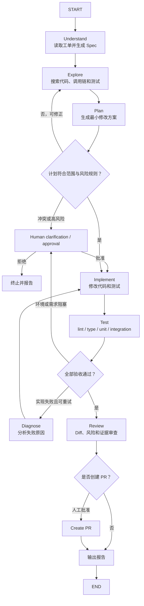

# 05 业务案例：研发缺陷修复 Agent

这一章用一个具体业务 Agent 串起前面的思想演化、五层架构、完整工作流和框架递进。目标不是交付可直接运行的仓库，而是给出一份可以据此实现和评审的工程蓝图。

### 【先定义业务问题，而不是先选框架】

用户请求：

> 处理缺陷工单 BUG-42：定位数据脱敏问题，实施最小修复，保证原有行为不受影响，并给出验证报告。

如果只写成一个 Prompt，模型可以给出分析，但无法证明读取了真实工单、修改了正确代码或运行了测试。GitHub 的 [《Spec Kit》](https://github.github.com/spec-kit/index.html) 将 AI 辅助研发组织为 `Spec → Plan → Tasks → Implement`，强调先定义要构建什么，再让结构化产物驱动后续阶段。本案例据此先把业务目标转化为 Spec：

```yaml
name: defect-fix-agent
goal: 根据缺陷工单完成可验证的最小代码修复

inputs:
  issue_id: BUG-42
  repository: permission-service
  base_branch: main

in_scope:
  - 读取工单、项目规范和相关代码
  - 创建隔离工作区
  - 修改授权目录内的源代码和测试
  - 运行静态检查、单元测试和相关集成测试
  - 生成变更报告

out_of_scope:
  - 修改生产数据库
  - 自动合并或发布
  - 绕过仓库保护规则
  - 顺手重构无关模块

acceptance:
  - 缺陷复现测试在修改前失败、修改后通过
  - 原有测试继续通过
  - lint 与 type-check 通过
  - Diff 仅包含允许范围内的必要修改
  - 报告包含原因、修改、证据、影响与剩余风险

approval:
  read_issue: auto
  read_repository: auto
  write_isolated_workspace: auto
  create_commit: manual
  create_pull_request: manual
  merge_or_deploy: forbidden
```

这里最重要的不是 YAML 语法，而是目标、非目标、验收和权限已经成为可执行合同。

### 【用五层拆解业务 Agent】

| 层级 | 本案例中的职责 | 关键产物 |
| --- | --- | --- |
| 模型层 | 理解工单、定位信息缺口、提出方案、诊断失败、生成报告 | 候选计划、工具调用、解释 |
| 上下文层 | 装配 Spec、项目规则、相关代码、测试、Diff、历史观察 | 节点级上下文包 |
| 执行层 | 读工单、搜索代码、编辑文件、运行测试、创建 PR | 结构化工具观察与环境变化 |
| 编排层 | 管理 Understand、Explore、Plan、Approve、Implement、Test、Diagnose、Review | State、Checkpoint、路由记录 |
| 反馈与控制层 | 路径权限、危险动作审批、测试、Diff 校验、完成判定 | 验证矩阵、审批记录、Trace |

Harness 再把五层组装起来：注册工具，注入规则，配置状态持久化，限制工作区，装载 Skills 和 Memory，记录 Trace，并把失败证据送回下一轮。

### 【显式状态与产物模型】

业务状态不应只存在对话里。可以设计为：

```python
from typing_extensions import TypedDict


class DefectState(TypedDict, total=False):
    task_id: str
    issue_id: str
    repository: str
    spec: dict
    phase: str
    plan: list[dict]
    evidence: list[dict]
    changed_files: list[str]
    test_results: list[dict]
    retry_count: int
    pending_approval: dict | None
    risk_summary: list[str]
    final_report_uri: str
    completion: dict
```

大型内容不要直接塞进 State：

| 内容 | State 中保存 | 外部产物保存 |
| --- | --- | --- |
| 工单 | 标题、关键约束、来源 ID | 完整原文快照 |
| 代码搜索 | 关键文件与符号 | 完整搜索输出 |
| Diff | 文件列表、统计、Hash | 完整 Patch |
| 测试 | 通过状态、失败数、类型 | 完整 stdout / stderr |
| 报告 | URI、版本、校验值 | Markdown / HTML 正文 |

State 保存控制决策所需的摘要和引用，Artifact Store 保存可追溯的完整证据。

### 【业务工作流】



这是一种混合编排：阶段和门禁由程序控制，Explore、Implement、Diagnose 等阶段内部允许模型使用工具动态循环。

### 【第一阶段：用 LangChain 验证最小 Agent Loop】

第一版只解决“能否根据工单和代码检索给出有证据的诊断”，暂不允许写文件。

#### 最小工具集

```text
get_issue(issue_id)       读取工单
search_code(query)        搜索代码
read_file(path)           读取授权文件
find_tests(symbol)        查找相关测试
```

#### 原型代码

```python
from langchain.agents import create_agent


diagnosis_agent = create_agent(
    model="provider:model-name",
    tools=[get_issue, search_code, read_file, find_tests],
    system_prompt="""
你是缺陷诊断 Agent。

工作规则：
1. 先读取工单，再搜索仓库事实；
2. 将事实、假设和建议分开；
3. 每个根因必须附带文件或测试证据；
4. 证据不足时继续使用只读工具；
5. 当前阶段只诊断，不修改文件。

输出包含：问题摘要、证据、可能根因、建议验证步骤、未知项。
""",
)

result = diagnosis_agent.invoke({
    "messages": [
        {"role": "user", "content": "分析 BUG-42"}
    ]
})
```

#### 这一阶段验证什么

- Tool 描述是否足以让模型选对工具；
- 工单和仓库访问是否可靠；
- 只读诊断的成功率、成本和延迟；
- 输出是否能给出可追溯证据；
- 哪些失败需要显式状态或流程门禁。

#### 为什么不能直接上线自动修复

通用 Agent Loop 没有自然表达完整业务阶段：

- 是否已经生成并批准 Spec；
- 当前处于探索还是实施；
- 测试失败应该回到哪里；
- 最大修复次数是多少；
- 创建 PR 前是否获得审批；
- 全部验收项是否完成。

当这些需求出现时，系统需要显式编排。

### 【第二阶段：用 LangGraph 固化业务状态机】

第二版把业务阶段、路由、循环和人工中断写进图中。

#### 哪些逻辑应确定性实现

| 逻辑 | 实现方式 |
| --- | --- |
| `exit_code == 0` | 普通代码判断 |
| 修改文件是否越过允许目录 | 路径规则 |
| 重试是否超过 3 次 | State 计数 |
| 所有验收项是否通过 | 验证矩阵聚合 |
| 创建 PR 是否需要审批 | 固定权限策略 |
| 测试失败原因的语义分类 | 模型诊断 + 规则兜底 |

#### 节点契约

每个节点都应声明：

```yaml
node: test
reads:
  - spec.acceptance
  - changed_files
writes:
  - test_results
allowed_tools:
  - run_lint
  - run_type_check
  - run_unit_tests
success:
  - all_required_checks_passed
failure_routes:
  assertion_failure: diagnose
  environment_failure: human_or_retry
  timeout: retry_once_then_human
```

这样可以防止 Implement 节点顺手创建 PR，也可以防止 Review 节点重新修改代码。

#### Checkpoint 与恢复

在每个有副作用或人工中断前保存 Checkpoint。恢复时需要检查外部世界是否已经变化：

- 工作区是否还存在；
- 目标分支是否已经更新；
- 上一次写操作是否已经生效；
- PR 是否已经创建；
- 审批是否仍然有效。

Durable Execution 不是简单地“从旧行号继续”，而是基于幂等记录确认哪些动作可以安全重放。

### 【第三阶段：用 Deep Agents 补齐长任务 Harness】

当任务跨越大量文件、日志和多轮修复时，会出现新的问题：上下文膨胀、计划遗失、中间产物无处存放、专业子任务污染主上下文。Deep Agents 的 [《Overview》](https://docs.langchain.com/oss/python/deepagents/overview) 将其定位为处理复杂、多步骤任务的 Agent Harness，并列出规划、文件系统、自动摘要、上下文卸载、Subagents、Memory、Permissions 与 HITL 等能力。此时可以引入这些 Harness 能力。

#### 规划

Deep Agents 的 [《Overview》](https://docs.langchain.com/oss/python/deepagents/overview) 说明，内置 `write_todos` 工具用于把复杂任务拆成离散步骤、追踪状态，并在获得新信息后调整计划。

用内置任务计划记录长任务：

```text
[completed] 读取工单并形成 Spec
[completed] 定位脱敏逻辑和调用链
[in_progress] 添加回归测试并实施修复
[pending] 运行完整验证矩阵
[pending] 生成评审报告
```

计划是可更新的工作状态，不是一次性由模型生成后永不变化的长文本。

#### 文件系统与上下文卸载

```text
/workspace/                 隔离代码工作区
/artifacts/spec.md          规范
/artifacts/search-notes.md  探索摘要
/artifacts/test-output.txt  完整测试日志
/artifacts/final-report.md  最终报告
/memories/AGENTS.md         稳定项目知识
/skills/                    按需领域能力
```

模型上下文只保留当前步骤所需片段和路径，必要时再读取文件。这比持续把完整日志追加进消息更可控。

#### Skills

Deep Agents 的 [《Skills》](https://docs.langchain.com/oss/python/deepagents/skills) 说明其 Skills 采用 Progressive Disclosure：启动时暴露摘要，只有任务命中时才读取完整 `SKILL.md` 及其脚本、模板和参考资料。

```text
skills/
├── issue-analysis/
│   └── SKILL.md
├── minimal-code-change/
│   └── SKILL.md
├── test-selection/
│   └── SKILL.md
├── security-review/
│   └── SKILL.md
└── pull-request-writing/
    └── SKILL.md
```

Skill 中适合保存步骤、判断标准、边界、脚本和示例；不要把项目中始终相关的规则重复写进每个 Skill。

#### Memory

Deep Agents 的 [《Memory》](https://docs.langchain.com/oss/python/deepagents/memory) 将 Memory 设计为文件系统支持的持久上下文，用于跨会话保留信息；该文档同时把 Skills 视为可按需调用的程序性记忆。

在本案例中，Memory 保存跨会话稳定信息：

- 仓库结构和所有权；
- 编码与测试约定；
- 已确认的历史架构决策；
- 用户偏好；
- 常见但已验证的故障模式。

Memory 不是无限追加的聊天摘要。写入前需要来源、适用范围、更新时间和冲突处理策略。

#### Subagents

Deep Agents 的 [《Subagents》](https://docs.langchain.com/oss/python/deepagents/subagents) 把 Subagents 的主要价值概括为 Context Quarantine 和专业化指令：重型工具输出留在隔离上下文中，主 Agent 只接收整理后的结果。

可以设计三个专业子 Agent：

| 子 Agent | 任务 | 工具与权限 | 返回内容 |
| --- | --- | --- | --- |
| Code Explorer | 搜索调用链和相关测试 | 只读仓库 | 关键文件、证据和未知项 |
| Test Analyst | 选择测试并分析失败 | 只读代码 + 测试执行 | 失败分类、复现与建议 |
| Reviewer | 独立检查 Diff 和 Spec | 只读最终 Diff | 风险、遗漏和验收判断 |

Implementation 不一定要单独拆成子 Agent。如果它与主任务共享大量上下文，强行隔离反而增加信息传递成本。

#### 概念配置

下面展示要组合的能力，参数细节应按安装版本核对官方文档：

```python
from deepagents import create_deep_agent


agent = create_deep_agent(
    model="provider:model-name",
    tools=[
        get_issue,
        search_code,
        run_tests,
        create_pull_request,
    ],
    system_prompt="根据 Spec 完成最小、可验证、受权限控制的缺陷修复。",
    skills=["/skills/"],
    memory=["/memories/AGENTS.md"],
    subagents=[code_explorer, test_analyst, reviewer],
    permissions=[
        # 仅示意：允许读工作区，限制敏感路径和写入范围
    ],
    interrupt_on={
        "create_pull_request": True,
    },
)
```

Deep Agents 提供的是通用工作环境；外部 LangGraph 仍可以控制更严格的业务状态机，或者把 Deep Agent 作为某个复杂节点使用。

### 【第四阶段：补齐真正的业务 Harness】

从通用 Harness 到业务 Agent，还需至少补齐六部分。

#### 1. 业务工具契约

工具不是把内部 API 直接暴露给模型，而是为 Agent 设计的稳定契约：

```yaml
tool: create_pull_request
purpose: 为已验证的工作区变更创建草稿 PR
preconditions:
  - validation_matrix.all_required == passed
  - approval.status == approved
input:
  repository: string
  base_branch: string
  title: string
  body_uri: string
  idempotency_key: string
output:
  pr_number: integer
  pr_url: string
risk: high
side_effect: true
retryable: conditional
audit: required
```

工具必须在程序侧再次检查前置条件，不能相信 Prompt 中“只有测试通过才调用”的约定。

#### 2. 权限矩阵

| 动作 | 默认策略 | 额外控制 |
| --- | --- | --- |
| 读工单、读代码 | 自动 | 身份与资源范围 |
| 搜索和运行只读分析 | 自动 | 超时、成本、沙箱 |
| 写隔离工作区 | 自动 | 目录白名单、Diff 审计 |
| 安装依赖或访问网络 | 条件允许 | 包源白名单、审批策略 |
| 创建 Commit | 人工批准 | 签名、作者、分支规则 |
| 创建 PR | 人工批准 | 验证矩阵、幂等键 |
| 合并、发布、生产变更 | 禁止或单独审批流 | 职责分离、审计 |

权限应由身份、资源、动作、环境和风险共同决定，而不是只有一个全局“允许所有工具”。

#### 3. 业务验证矩阵

```yaml
validation:
  reproduce_before_fix:
    required: true
    status: passed
  regression_test_after_fix:
    required: true
    status: passed
  existing_unit_tests:
    required: true
    status: passed
  lint:
    required: true
    status: passed
  type_check:
    required: true
    status: passed
  integration_tests:
    required: conditional
    status: skipped
    reason: no cross-service impact detected
  diff_scope:
    required: true
    status: passed
  independent_review:
    required: true
    status: passed
```

`skipped` 必须有规则允许和原因，不能被当作 `passed`。

#### 4. 完成判定

```python
def is_complete(state: DefectState) -> bool:
    required = state["completion"]["required_checks"]
    checks_passed = all(
        check["status"] == "passed"
        for check in required
    )
    no_pending_approval = state.get("pending_approval") is None
    report_exists = bool(state.get("final_report_uri"))
    return checks_passed and no_pending_approval and report_exists
```

真实逻辑还要处理条件必选项、豁免和审批状态。核心是完成条件由代码聚合真实证据，而不是由模型自由宣布。

#### 5. Eval 与回归集

Anthropic 的 [《Demystifying evals for AI agents》](https://www.anthropic.com/engineering/demystifying-evals-for-ai-agents) 建议把一次输入定义为 Task、一次尝试定义为 Trial，并同时评估完整轨迹与环境最终 Outcome；Grader 可以组合代码、模型和人工检查。因此，本案例的评估不能只检查最终报告是否写得流畅。

离线评估集至少覆盖：

- 单文件、跨文件和配置类缺陷；
- 需求本身错误或信息不足；
- 测试环境故障；
- 工具返回异常或超时；
- 已有用户修改不可覆盖；
- 敏感目录和禁止命令；
- 连续修复失败；
- 无需改代码即可解决的问题。

评估指标不只有“最终答案好不好”，还包括：

| 维度 | 指标示例 |
| --- | --- |
| 任务 | 修复成功率、验收通过率、首次通过率 |
| 安全 | 越权尝试、错误审批、敏感数据暴露 |
| 过程 | 平均步数、无效工具调用、循环和重规划次数 |
| 成本 | Token、模型费用、沙箱时长、外部 API 成本 |
| 质量 | 回归缺陷、Diff 大小、人工修改量、Review 拒绝率 |
| 恢复 | 中断恢复成功率、重复副作用率、人工接管率 |

#### 6. 运营与可观测性

生产 Trace 应能回答：

- Agent 为什么修改这个文件；
- 哪条工单信息和代码证据影响了决策；
- 哪个模型、Skill 或子 Agent 参与了；
- 工具调用和审批发生了什么；
- 为什么重试、回滚或停止；
- 最终通过了哪些验收项；
- 用户需要承担哪一步后续责任。

同时要建立告警、成本预算、失败样本回流、规则版本和 Prompt / Skill 变更记录。

### 【上下文装配策略】

Anthropic 的 [《Effective context engineering for AI agents》](https://www.anthropic.com/engineering/effective-context-engineering-for-ai-agents) 建议 Agent 使用 Just-in-time Context 和 Progressive Disclosure，在运行时逐步读取必要信息，并通过 Compaction、结构化笔记或多 Agent 隔离管理长时任务。本案例适合采用相同策略：

```text
启动时：
  Spec 摘要 + 项目基线规则 + 工具目录

Explore 时：
  工单事实 + 入口线索 + 只读搜索结果

Implement 时：
  已批准计划 + 相关文件 + 测试 + 编码 Skill

Diagnose 时：
  当前 Diff + 失败日志 + 修改意图 + 相关实现

Review 时：
  Spec + 最终 Diff + 验证矩阵 + 风险摘要
```

上下文压缩必须保留：

- 原始目标和最新用户约束；
- 已批准的关键决策；
- 尚未解决的问题；
- 失败原因和重试计数；
- 证据的精确位置；
- 当前工作区与外部副作用状态。

不要只保留“任务进展顺利”这类无法恢复的模糊摘要。

### 【工具、Skill、Memory 和 Subagent 的边界】

下面的边界既参考 Deep Agents 的 [《Skills》](https://docs.langchain.com/oss/python/deepagents/skills)、[《Memory》](https://docs.langchain.com/oss/python/deepagents/memory) 和 [《Subagents》](https://docs.langchain.com/oss/python/deepagents/subagents) 对三者的官方定义，也加入了本案例对 Tool、Workflow 和 Guardrail 的业务归类。

| 需求 | 应使用 | 原因 |
| --- | --- | --- |
| 调用工单系统或测试命令 | Tool | 需要程序化动作和结构化返回 |
| 说明怎样选择回归测试 | Skill | 任务相关的详细工作流 |
| 保存项目始终适用的目录和测试约定 | Memory / `AGENTS.md` | 跨任务稳定、启动时相关 |
| 隔离大规模代码探索 | Subagent | 中间上下文很重，只需返回结论 |
| 控制测试失败后的去向 | Workflow / Graph | 属于确定性路由和全局状态 |
| 判断是否允许创建 PR | Guardrail + Approval | 属于风险治理，不应只靠模型 |

如果一项能力放错位置，常见后果是：Prompt 过长、工具语义重叠、Memory 污染、子 Agent 滥用或业务门禁不可测试。

### 【常见失败与处理方式】

| 失败 | 根因层 | 处理 |
| --- | --- | --- |
| 找错模块 | 上下文层 | 改进代码索引、查询和证据要求 |
| 模型反复调用同一搜索 | 编排 / 控制层 | 去重观察、最大调用数、搜索策略 Skill |
| 工具返回“失败”但无细节 | 执行层 | 标准化错误类型、退出码和 Artifact |
| 测试失败却生成成功报告 | 反馈 / 编排层 | 完成条件改为验证矩阵硬门禁 |
| 修改范围不断扩大 | Spec / 控制层 | 路径白名单、Diff 预算、重新审批 |
| 子 Agent 重复工作 | 编排层 | 明确子任务输入、输出和所有权 |
| 长任务忘记早期约束 | 上下文层 | Checkpoint、结构化 State、压缩保真测试 |
| 恢复后重复创建 PR | 执行 / 控制层 | 幂等键和外部动作账本 |

### 【从 MVP 到生产的演化路线】

#### MVP 0：非 Agent

```text
工单文本 → Prompt → 缺陷分析报告
```

验证业务价值和输出格式。

#### MVP 1：只读 Agent

```text
LangChain create_agent
+ 工单工具
+ 代码搜索与读取
+ 证据化输出
```

验证 Tool Calling 和检索质量，不承担写操作风险。

#### MVP 2：受控修复 Workflow

```text
LangGraph StateGraph
+ 隔离工作区
+ Implement / Test / Diagnose 循环
+ 最大重试
+ 人工审批
```

验证端到端完成率和恢复能力。

#### MVP 3：长任务 Harness

```text
Deep Agents 能力
+ Planning
+ Filesystem / Context Offloading
+ Skills / Memory
+ 必要的 Subagents
+ Permissions / HITL
```

解决长上下文、复杂产物和专业隔离。

#### Production：业务系统

```text
领域 Tool 契约
+ 权限与身份
+ 验证矩阵
+ Checkpoint 与幂等
+ Eval 回归集
+ Trace 与告警
+ 成本、SLA 和人工接管
+ 持续运营
```

每一阶段都应由失败数据推动升级。不要在尚未证明只读 Agent 有价值时就建设庞大的多 Agent 平台。

### 【最终架构公式】

本案例可以归纳为：

```text
研发缺陷修复 Agent
= LangChain 的模型、工具与通用 Agent 组件
+ LangGraph 的状态化编排与可靠运行
+ Deep Agents 的规划、文件系统、上下文管理和委派能力
+ 工单、仓库、测试、PR 等业务 Tools
+ 缺陷分析、最小修改、测试选择等领域 Skills
+ 项目 Memory 与规则
+ 权限、审批、Sandbox 和幂等控制
+ 测试、Eval、完成判定和 Trace
```

但它不是要求所有项目都同时依赖三个框架。真正稳定的公式是：

```text
具体业务 Agent
= 通用决策与运行能力
+ 领域事实和行动接口
+ 显式业务状态与流程
+ 可验证的完成标准
+ 与风险匹配的控制边界
```

### 【从业务案例回到教程主线】

把前五章的学习主线合在一起，可以得到一张工程地图：

1. 从 Prompt Engineer 到 Harness Engineer，是工程问题从单轮表达扩展到完整执行环境；
2. 五层架构把这个环境拆成模型、上下文、执行、编排、反馈与控制五个职责域；
3. 完整工作流通过显式 State、内循环、外循环、门禁和证据不断收敛；
4. LangChain、LangGraph、Deep Agents 分别提供 Framework、Runtime 和 Harness 层面的常用能力；
5. 具体业务 Agent 仍必须定义领域工具、Skills、Memory、权限、验收、Eval 和运营机制。

最终应坚持的工程原则是：

> 让模型负责不确定性决策，让程序负责确定性流程，让工具负责真实执行，让测试和规则负责验证，让人负责高风险决策，让 Harness 保证这些部分可以长期协作。

[第 06 章](06-Agent四种范式.md)会继续拆解“不确定性决策”：ReAct、Plan-and-Execute、Reflexion 和 Tree of Thoughts 分别在 Action、Task、Trial 和 Candidate 粒度上控制什么，以及它们怎样嵌入同一套五层架构和工作流。

### 【本章引用证据】

| 主题 | 引用文献 | 在业务案例中的用法 |
| --- | --- | --- |
| Spec 驱动 | [GitHub《Spec Kit》](https://github.github.com/spec-kit/index.html) | 先定义 Spec、Plan、Tasks 与验收，再进入实现 |
| 复杂任务 Harness | [Deep Agents《Overview》](https://docs.langchain.com/oss/python/deepagents/overview) | Planning、Filesystem、Context Offloading、Permissions 与 HITL |
| Skills | [Deep Agents《Skills》](https://docs.langchain.com/oss/python/deepagents/skills) | 按需装载缺陷分析、测试选择和评审流程 |
| Memory | [Deep Agents《Memory》](https://docs.langchain.com/oss/python/deepagents/memory) | 保存跨会话项目规则、偏好和历史决策 |
| Subagents | [Deep Agents《Subagents》](https://docs.langchain.com/oss/python/deepagents/subagents) | 隔离代码探索、测试分析和独立评审上下文 |
| 动态上下文 | [Anthropic《Effective context engineering for AI agents》](https://www.anthropic.com/engineering/effective-context-engineering-for-ai-agents) | Just-in-time 检索、压缩和逐步披露 |
| Agent Eval | [Anthropic《Demystifying evals for AI agents》](https://www.anthropic.com/engineering/demystifying-evals-for-ai-agents) | 用 Task、Trial、Grader、Trace 和 Outcome 构建回归集 |
| 人工审批 | [LangChain《Human-in-the-loop》](https://docs.langchain.com/oss/python/langchain/human-in-the-loop) | 在创建 PR 等敏感工具调用前中断并保存状态 |
