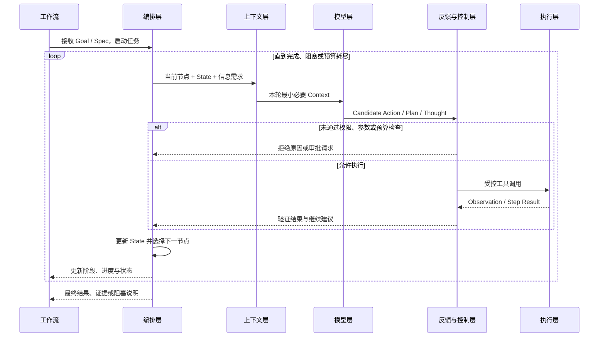
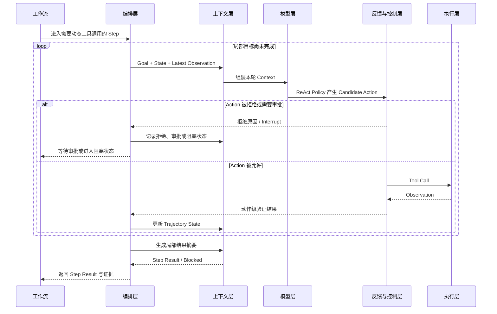
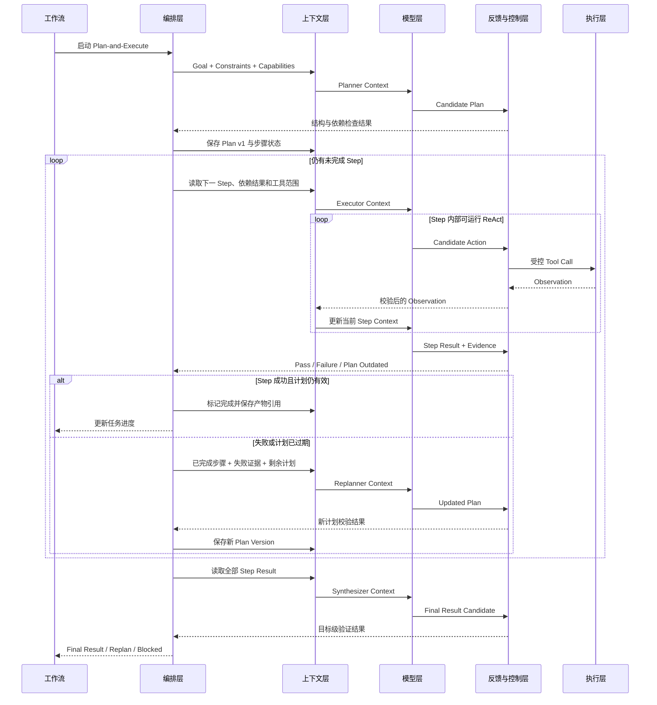
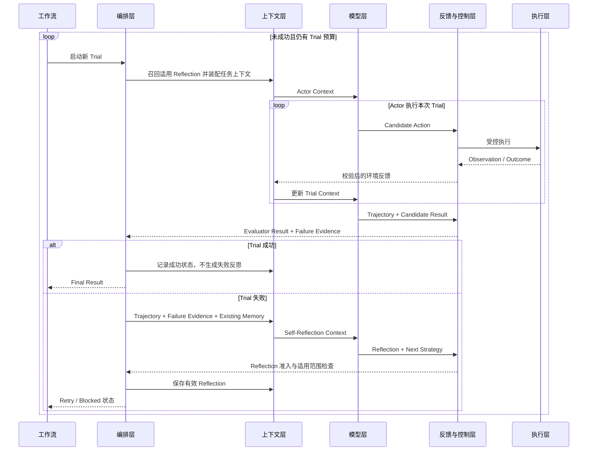
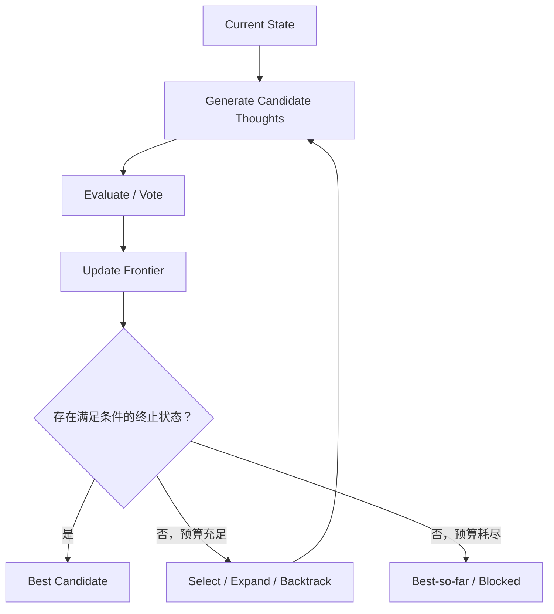
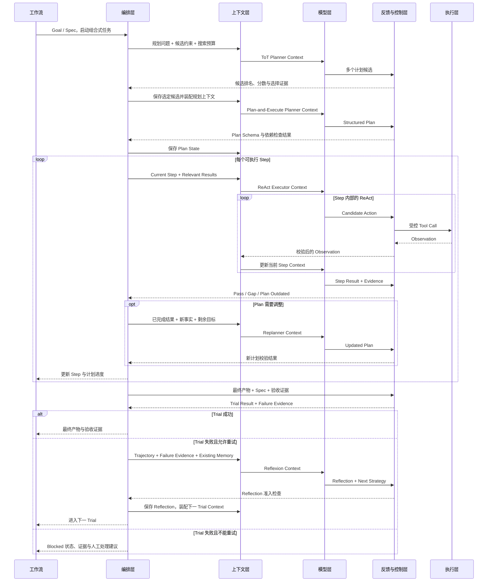

# 06 Agent 四种范式：从行动循环到多路径搜索

前面的章节已经建立了三块基础：[第 01 章](01-从Prompt-Engineer到Harness-Engineer.md)解释 Agent 能力为什么逐步扩展，[第 02 章](02-Agent五层架构.md)定义五层职责，[第 03 章](03-Agent完整工作流.md)说明五层怎样通过状态和双循环协作。本章在此基础上继续回答：**面对不同类型的不确定性，模型应该在哪个粒度上做动态决策？**

本章基于 `note.md` 草稿梳理 ReAct、Plan-and-Execute、Reflexion 和 Tree of Thoughts。它们来自不同论文与工程实践，并不是某篇文献共同规定的“官方四分类”；本教程把它们放在一起，是因为它们恰好对应行动、任务、尝试和候选路径四种不同控制粒度。

### 【为什么还需要学习 Agent 范式】

先区分四个相邻但不同的问题：

| 观察角度 | 核心问题 | 典型答案 |
| --- | --- | --- |
| 五层架构 | 一项职责应该放在哪里？ | 模型层、上下文层、执行层、编排层、反馈与控制层 |
| 完整工作流 | 一次任务怎样推进、回流和结束？ | State、节点、内循环、外循环、验证、恢复 |
| Agent 范式 | 模型在哪个粒度上做什么决策？ | 行动选择、任务规划、跨尝试反思、候选路径搜索 |
| 框架与 Harness | 用什么工程抽象实现上述设计？ | LangChain、LangGraph、Deep Agents 或自研运行时 |

范式不等于框架。ReAct 可以用几十行循环实现，也可以运行在 LangGraph 节点中；Plan-and-Execute 可以由显式状态图实现，也可以封装在更高层 Harness 中。先确定控制问题，再选择实现工具，能避免把框架 API 当成 Agent 架构本身。

### 【四种范式的整体定位】

先用一张表建立全局地图：

| 范式 | 主要解决的问题 | 核心控制对象 | 控制流形态 | 关键状态 |
| --- | --- | --- | --- | --- |
| ReAct | 根据最新观察，下一步应该做什么？ | 单次 Action | 单路径行动循环 | Action、Observation、Trajectory |
| Plan-and-Execute | 长任务怎样拆解、调度和推进？ | Plan 与 Subtask | 分层顺序、依赖图或动态计划 | Plan、Step、Step Result |
| Reflexion | 一次完整尝试失败后，下一次怎样改进？ | 整次 Trial | 评价—反思—重试循环 | Trajectory、Feedback、Reflection |
| Tree of Thoughts | 多条候选推理路径中应该继续哪一条？ | Candidate Thought / State | 分支搜索、剪枝与回溯 | Frontier、Candidate、Score |

可以先记住四句话：

```text
ReAct：控制下一步行动
Plan-and-Execute：控制整个任务的阶段和子任务
Reflexion：控制失败后下一次尝试怎样改进
Tree of Thoughts：控制多个候选思路中继续探索哪一条
```

四种范式解决的不是同一个尺度的问题，所以不能只按“谁更先进”排序。

### 【共同的五层架构底座】

四种范式都可以建立在同一个五层 Agent 架构上。变化的主要是决策模块、需要保存的 State，以及反馈进入下一轮的方式。

下面用交互图表示五层在一次决策中的调用顺序。纵向是工作流进度，横向固定为“工作流 + 五层架构”六列；Planner、Actor、Executor 和 Evaluator 只作为相应层中的职责出现，不再单独占列。



| 五层 | 四种范式共享的职责 | 范式带来的变化 |
| --- | --- | --- |
| 模型层 | 理解当前状态并产生候选输出 | 输出 Action、Plan、Reflection 或 Candidate Thought |
| 上下文层 | 为当前决策准备最小必要信息 | 装配行动轨迹、计划结果、反思记忆或搜索前沿 |
| 执行层 | 调用工具并返回环境事实 | ReAct 最直接依赖工具；其他范式可在内部调用 ReAct Executor |
| 编排层 | 维护 State、循环、路由、预算和恢复 | 控制单路径循环、任务图、Trial 重试或树搜索 |
| 反馈与控制层 | 验证、安全控制和完成判定 | 返回 Observation、Step Result、Trial Feedback 或 Candidate Score |

同一个“调研报告 Agent”可以只使用 ReAct，也可以在复杂任务中增加 Plan、Reflection 或搜索树。五层职责没有改变，改变的是控制流拓扑和 State 结构。

### 【范式一：ReAct——控制下一步行动】

#### 从一次生成变成行动循环

Yao 等人在 [《ReAct: Synergizing Reasoning and Acting in Language Models》](https://arxiv.org/abs/2210.03629) 中将 reasoning trace、task-specific action 和 environment observation 交错组织：推理帮助模型更新行动计划，行动则从知识库或外部环境取得新信息。

它的核心不是要求模型一开始生成完整方案，而是允许模型根据每次工具返回修正下一步：

```text
Reason：根据目标、当前状态和最新观察判断下一步
→ Act：选择工具和参数
→ Observe：读取工具或环境返回的事实
→ Update：更新轨迹与 State
→ Reason again
```

在生产系统中，可观测 Trace 应记录决策摘要、Action、Observation 和路由原因，不必把模型的原始私有推理过程当作必要接口。

#### 架构组件

| 组件 | 作用 |
| --- | --- |
| LLM Policy | 根据当前 Context 产生下一项候选行动 |
| Tool Router | 把结构化 Action 映射为具体工具调用 |
| Environment | 执行动作并返回真实 Observation |
| Trajectory State | 保存关键行动、观察、未解决问题和产物引用 |
| Stop Condition | 判断继续调用工具、输出结果，还是进入阻塞状态 |

ReAct 最适合用交互图观察，因为它的核心就是模型、控制层和工具之间的往返：



#### 输入与输出契约

```text
Input
= Goal
+ Current Context
+ Available Tools
+ Previous Trajectory Summary
+ Latest Observation

Output
= Tool Call
或 Step Result
或 Final Result
或 Blocked / Stop
```

ReAct 的关键 State 是“到目前为止发生了什么”，而不是一份一次生成后不再变化的长期计划。

#### 在调研报告任务中的运行

```text
目标：为“关键结论 A”补充直接证据

Action 1：搜索官方资料
Observation 1：找到一份概览，但没有目标数据

Action 2：读取概览引用的原始报告
Observation 2：找到目标数据，同时发现统计口径限制

Action 3：提取数据、时间、口径和原始链接
Observation 3：证据卡片完整，可以交回上层工作流
```

每一步都由最新 Observation 驱动，适合搜索、浏览、数据库查询和工具操作等路径未知的环境。

#### 优势、局限与适用边界

| 优势 | 局限 |
| --- | --- |
| 能根据环境结果实时调整 | 容易只关注眼前一步，缺少全局任务视图 |
| 不要求初始计划完全正确 | 长任务中可能重复探索或偏离目标 |
| 工具轨迹容易追踪和调试 | Trajectory 持续增长会挤占 Context |
| 适合开放环境中的局部执行 | 默认不会把整次失败沉淀成跨 Trial 经验 |

因此，ReAct 更准确的定位是**动态的下一步行动控制器**。它天然对应第 03 章的模型—工具内循环，但不能单独替代全局 State、任务编排和完成验证。

### 【范式二：Plan-and-Execute——控制任务阶段】

#### 为什么要把规划和执行分开

当任务包含多个阶段、依赖和产物时，只依赖 ReAct 逐步选择工具，模型容易忘记长期目标。LangChain 早期的官方文章 [《Plan-and-Execute Agents》](https://www.langchain.com/blog/plan-and-execute-agents) 将这种范式概括为：先由 Planner 生成高层步骤，再由 Executor 逐步完成每个步骤；它更适合复杂、长时程目标，但会增加模型调用次数。

```text
Goal
→ Planner 生成 Plan
→ Controller 选择可执行 Step
→ Executor 完成 Step
→ 保存 Step Result
→ 验证、继续或 Replan
→ 汇总最终结果
```


#### 架构组件

| 组件 | 作用 |
| --- | --- |
| Planner | 把 Goal 拆成步骤、依赖和预期产物 |
| Plan Store | 保存步骤状态、依赖、版本和完成进度 |
| Controller | 选择当前可执行步骤并触发门禁 |
| Executor | 完成单个高层步骤，内部可以运行 ReAct |
| Replanner | 根据新事实、失败或范围变化修订剩余计划 |
| Synthesizer | 汇总各 Step Result，形成最终产物 |

一个可执行 Plan 不应只有自然语言清单，还应包含依赖与完成条件：

```yaml
plan_version: 2
steps:
  - id: collect
    goal: 收集覆盖核心问题的候选资料
    depends_on: []
    expected_output: evidence_candidates
    done_when: 每个核心问题至少存在候选来源
  - id: synthesize
    goal: 建立事实、证据和冲突映射
    depends_on: [collect]
    expected_output: evidence_table
    done_when: 关键事实均有来源或明确标记缺口
  - id: draft
    goal: 根据证据表生成报告
    depends_on: [synthesize]
    expected_output: report_draft
  - id: validate
    goal: 检查问题覆盖、证据和格式
    depends_on: [draft]
    expected_output: validation_report
```

#### 工作流与 Replan

交互图可以更直接地看出 Planner 只负责计划，Controller 才负责调度，Executor 只接收当前 Step：



Replan 不是重新生成一份完全无关的计划，而是基于已完成步骤、现有产物、失败证据和新约束，更新尚未执行的部分。否则 Planner 的早期误判会传播到所有后续步骤。

#### 优势、局限与适用边界

| 优势 | 局限 |
| --- | --- |
| 显式管理长期目标、依赖与进度 | 初始计划可能建立在不完整信息上 |
| 每个阶段的输入输出更清楚 | 没有 Replan 时容易机械执行过期计划 |
| 容易加入审批、门禁和并行调度 | Planner 错误可能影响所有步骤 |
| 不同 Step 可以使用不同 Executor | Planner、Executor、Replanner 增加成本与延迟 |

Plan-and-Execute 更像**项目经理 + 执行团队**：它主要控制任务级外循环，而每个步骤的局部未知路径仍可交给 ReAct。

### 【范式三：Reflexion——控制跨尝试改进】

#### Reflection 不等于修改模型权重

Shinn 等人在 [《Reflexion: Language Agents with Verbal Reinforcement Learning》](https://arxiv.org/abs/2303.11366) 中提出：不通过反向传播更新模型参数，而是把环境或评价反馈转成自然语言经验，保存在 episodic memory 中，让后续 Trial 基于这些经验调整行为。

```text
Trial 执行
→ Evaluator 评价结果
→ 分析失败轨迹和证据
→ Self-Reflection 生成语言经验
→ 写入 Reflection Memory
→ 下一次 Trial 读取经验并重试
```

ReAct 的 Observation 通常立即影响同一次执行的下一步；Reflexion 的 Feedback 则在一次较完整的 Trial 结束后，影响下一次尝试。这是两者最关键的时间尺度差异。

#### 架构组件

原论文把 Reflexion 组织为 Actor、Evaluator 和 Self-Reflection 三个主要模型，并说明 Actor 可以采用 ReAct 或 Chain of Thought：

| 组件 | 作用 |
| --- | --- |
| Actor | 执行任务并产生 Trajectory 和候选结果 |
| Evaluator | 根据环境信号、规则或模型评价判断成功与失败 |
| Self-Reflection | 把失败证据转化为可操作的语言经验 |
| Episodic Memory | 保存经过筛选的 Reflection，供后续 Trial 召回 |
| Trial Controller | 控制重试次数、预算、成功和阻塞状态 |

Reflexion 的交互图重点展示：Evaluator 先给出失败证据，Self-Reflection 才能形成下一次 Trial 使用的经验：



#### Reflection 应保存什么

```json
{
  "failure": "报告中的关键结论只引用了二手概览",
  "evidence": "Validator 指出原始数据链接缺失",
  "cause": "检索在找到概览后过早停止",
  "lesson": "涉及关键数字时继续追踪概览引用的原始资料",
  "next_strategy": "优先检索发布机构和原始研究页面",
  "scope": "需要精确数字与口径的调研任务"
}
```

Reflection 应包含失败、证据、原因、可执行策略和适用范围，避免只保存“下次要更仔细”这类无法路由的空泛总结。

#### Memory 需要准入和失效机制

反思是模型根据反馈生成的解释，不自动等于事实。Evaluator 判断错误、归因错误或环境变化，都可能产生有害经验。因此工程实现还需要：

- 只允许有失败证据支撑的 Reflection 进入 Memory；
- 区分当前任务内的 Trial Memory 与跨任务长期 Memory；
- 给经验记录适用范围、时间和版本；
- 新证据与旧经验冲突时允许覆盖、降权或删除；
- 限制 Trial 次数，防止围绕错误策略反复优化。

论文中的 episodic memory 表达的是 Reflexion 机制内的经验缓冲；映射到生产架构时，它可以是 Thread State 的一部分，也可以在验证后进入长期 Store，不能未经治理就永久保存。

#### 优势、局限与适用边界

| 优势 | 局限 |
| --- | --- |
| 能从失败尝试中形成可读经验 | Evaluator 错误会形成错误经验 |
| 不需要微调模型参数 | Reflection 不保证真正解决问题 |
| 便于定位失败原因和下一策略 | Memory 可能积累过时或矛盾内容 |
| 适合有明确反馈且允许重试的任务 | 每次完整 Trial 都增加成本和副作用风险 |

Reflexion 更像一个带有**复盘记录的 Trial 级学习闭环**。只有反馈可信、任务允许重试、经验能够影响下一次策略时，它才比简单重试更有价值。

### 【范式四：Tree of Thoughts——控制候选路径搜索】

#### 从单路径生成走向显式搜索

普通 Chain of Thought 通常沿一条路径继续生成，一旦早期方向错误，后续内容容易沿错误前提展开。Yao 等人的 [《Tree of Thoughts: Deliberate Problem Solving with Large Language Models》](https://arxiv.org/abs/2305.10601) 将推理扩展为对连贯 Thought 单元的搜索：生成多个候选状态，评价其前景，保留更有希望的路径，并允许前瞻、剪枝和回溯。

```text
单路径：State 0 → Thought 1 → Thought 2 → Result

树搜索：
                    State 0
                /      |      \
              T1       T2      T3
             /  \             /  \
           T11  T12          T31  T32
```

这里的 Thought 不一定是一句话，也可以表示一个部分解、计划草案、设计方案或推理状态。关键是它必须能够被保存、扩展和评价。

#### 架构组件

| 组件 | 作用 |
| --- | --- |
| State Representation | 表示问题当前的部分解和已满足约束 |
| Thought Generator | 从一个 State 生成多个候选 Thought |
| State Evaluator | 对候选独立打分或进行比较投票 |
| Frontier | 保存尚待扩展的候选节点 |
| Search Controller | 执行 BFS、DFS、剪枝、回溯和预算控制 |
| Terminal Checker | 判断候选是否形成可交付结果 |

它的重点不是参与者之间的调用顺序，而是 Frontier 怎样分支、筛选和回溯；如果改成时序交互图，反而会隐藏搜索拓扑。



#### 在调研报告任务中的运行

Planner 可以先生成三个报告策略：

```text
候选 A：按时间线组织，适合解释演化过程
候选 B：按方案维度比较，适合支持选型
候选 C：按证据强弱组织，适合处理来源冲突
```

Evaluator 再根据用户问题、资料完整度和验收标准评分。如果目标是比较方案，候选 B 可能最合适；如果资料之间冲突严重，系统也可能保留 B 的结构，同时吸收 C 的证据分级方法。ToT 控制的是“先比较哪些候选路径”，不是直接替代后续资料检索、工具执行和报告验证。

#### ToT 不一定是完整工具型 Agent

Tree of Thoughts 首先是一种推理时搜索框架。它可以只在 Planner 内部比较多个计划，也可以让每个候选节点调用工具，但原理本身不自动提供 Tool、Memory、权限、Checkpoint 和业务完成条件。把 ToT 接入 Agent 系统时，仍需要五层架构和确定性外壳。

#### 优势、局限与适用边界

| 优势 | 局限 |
| --- | --- |
| 避免过早锁定单一错误方向 | 分支数随深度快速增长，成本较高 |
| 支持候选比较、前瞻和回溯 | Evaluator 偏差可能错误剪枝 |
| Generator、Evaluator、搜索策略可替换 | 很多任务难以定义稳定的 Thought State |
| 适合规划、组合搜索和复杂设计 | 简单工具任务通常不值得建立搜索树 |

Tree of Thoughts 更像**使用 LLM 作为候选生成器和启发式评价器的搜索算法**。

### 【四种范式的关键差异】

#### 控制粒度与状态

| 维度 | ReAct | Plan-and-Execute | Reflexion | Tree of Thoughts |
| --- | --- | --- | --- | --- |
| 控制粒度 | Action | Task / Step | Trial | Candidate State |
| 核心问题 | 下一步做什么？ | 整体怎样拆解推进？ | 下次怎样避免同类失败？ | 多条路径继续哪一条？ |
| 核心状态 | 轨迹与最新观察 | 计划、依赖、步骤结果 | 失败轨迹、反馈、反思 | 搜索树、前沿、分数 |
| 控制流拓扑 | 单路径循环 | 分层流程或任务图 | 外层重试循环 | 分支搜索与回溯 |
| 反馈使用时机 | 立即影响下一 Action | 更新 Step 和剩余 Plan | 影响下一次 Trial | 决定候选保留或剪枝 |
| 典型风险 | 局部最优、工具漫游 | 计划过期、级联错误 | 错误归因、记忆污染 | 分支爆炸、评价偏差 |

#### 四种控制流的最小形态

```text
ReAct
Action → Observation → Next Action

Plan-and-Execute
Plan → Step 1 → Step 2 → Replan / Finish

Reflexion
Trial 1 → Evaluate → Reflect → Trial 2

Tree of Thoughts
Generate → Evaluate → Select → Expand / Backtrack
```

它们最关键的差异不是 Prompt 写法，而是 State 结构、反馈时机和编排拓扑。

### 【四种范式怎样嵌入双循环工作流】

第 03 章把完整 Agent 工作流分为“模型—工具内循环”和“目标—验证外循环”。四种范式可以继续放到不同尺度上：

| 工作流尺度 | 适合的范式 | 作用 |
| --- | --- | --- |
| 单个步骤内部 | ReAct | 根据 Observation 动态选择下一工具 |
| 整个任务外循环 | Plan-and-Execute | 管理阶段、依赖、Step Result 与 Replan |
| 一次完整任务之外 | Reflexion | 根据 Trial Outcome 形成经验并触发新尝试 |
| 规划或高价值决策节点内部 | Tree of Thoughts | 比较多个计划、方案或部分解 |

下面的交互图把四种范式放进同一次任务，显示 Planner、Executor、Environment、Validator 和 Reflection Memory 之间的实际交接：



这是一张能力组合图，不是每个任务都必须采用的固定模板。很多任务只需要 ReAct；只有当计划、重试或候选搜索确实成为主要瓶颈时，才逐步增加其他范式。

### 【四种范式与确定性外壳】

四种范式主要增强 Agent 自主内核，但每一种都需要第 03 章所说的确定性外壳约束。否则，动态决策会演化成不可控的循环或搜索。

| 范式 | 自主内核决定什么 | 确定性外壳必须控制什么 |
| --- | --- | --- |
| ReAct | 下一 Action、工具选择、局部停止建议 | Tool Allowlist、参数 Schema、权限、Action 预算、真实停止条件 |
| Plan-and-Execute | 计划内容、步骤拆解、Replan 建议 | Plan Schema、依赖合法性、节点门禁、Checkpoint、全局完成条件 |
| Reflexion | 失败归因、Lesson、下一策略 | Evaluator 证据、Trial 上限、Memory 准入、经验失效和副作用隔离 |
| Tree of Thoughts | 候选生成、语义评价和路径建议 | 分支因子、搜索深度、总预算、剪枝规则、Terminal Checker |

可以用一句话概括：

```text
范式定义“怎样动态决策”，
外壳定义“可以在什么边界内决策，以及谁有权宣布完成”。
```

### 【一个组合式调研 Agent 的完整工作流】

下面用本教程的通用调研报告任务，把四种范式、五层架构和工作流放进同一条执行链。

#### 第 0 阶段：确定性初始化

编排层解析 Spec，建立 State、权限、预算、验收条件和 Artifact Store。此时还没有必要调用四种范式中的任何一种。

```json
{
  "goal": "生成一份结论可追溯的调研报告",
  "acceptance": ["核心问题完整", "关键事实有证据", "冲突信息明确"],
  "plan": null,
  "current_step": null,
  "trajectory_refs": [],
  "reflections": [],
  "search_frontier": [],
  "trial": 0,
  "done": false
}
```

不要为了使用范式而提前填满所有字段。只有启用 ToT 时才需要 `search_frontier`，只有允许跨 Trial 反思时才需要 `reflections`。

#### 第 1 阶段：用 ToT 比较高层方案

模型层生成“按时间线”“按方案比较”“按证据强弱”三个报告计划；反馈与控制层根据用户问题、资料可得性、成本和验收条件评价候选；编排层保存被选中的计划及选择证据。

如果任务结构显而易见，这一步直接跳过，不为简单任务支付搜索成本。

#### 第 2 阶段：用 Plan-and-Execute 管理任务

Planner 将选定方案展开为收集、证据整理、起草、验证四个 Step。编排层维护依赖和状态，每个步骤完成后检查产物，计划与现实不一致时只修订未完成部分。

#### 第 3 阶段：用 ReAct 执行开放步骤

在“收集资料”步骤内部，ReAct Executor 根据搜索结果持续调整关键词、来源和读取动作。上下文层只装入当前问题、已有证据和最近 Observation，执行层调用搜索与读取工具。

#### 第 4 阶段：用真实证据验证 Outcome

Validator 检查问题覆盖、证据链接、事实与推断边界；Evaluator 判断报告相关性和综合质量。模型生成了完整报告不等于任务完成，只有 Spec 中的验收条件都映射到证据，编排层才允许 `done = true`。

#### 第 5 阶段：必要时用 Reflexion 开启新 Trial

如果报告失败是因为“关键数字只引用二手来源”，Self-Reflection 可以形成“数字结论必须追踪原始发布机构”的经验。只有失败证据可靠、仍有 Trial 预算且新策略可能改变结果时，系统才重试；否则进入 `blocked` 或人工评审。

#### 五层在组合流程中的分工

| 五层 | 组合式调研 Agent 中的职责 |
| --- | --- |
| 模型层 | 生成候选计划、Action、报告内容和 Reflection |
| 上下文层 | 按节点装配 Plan、轨迹摘要、证据、缺口和有效 Reflection |
| 执行层 | 搜索、读取、提取、保存产物和运行 Validator |
| 编排层 | 管理 ToT 搜索、Plan 步骤、ReAct 节点、Trial、预算和恢复 |
| 反馈与控制层 | 评价候选、检查 Action、验证 Step 与 Outcome、控制 Memory 准入 |

这套组合的重点不是调用四次模型，而是让每种 State、反馈和退出条件都有明确归属。

### 【如何选择：从最小机制开始】

Anthropic 在 [《Building effective agents》](https://www.anthropic.com/engineering/building-effective-agents) 中建议从最简单的方案开始，只在确实需要时增加复杂度。四种范式也应遵循同一原则：先找到当前失败的控制尺度，再增加对应机制。

| 任务信号 | 建议起点 | 暂时不要增加什么 |
| --- | --- | --- |
| 一次生成即可完成，输入完整且无需工具 | Prompt / Workflow | 不需要 Agent 范式 |
| 工具路径未知，需要根据结果继续行动 | ReAct | 不必先建复杂计划和搜索树 |
| 任务有多个阶段、依赖和中间产物 | Plan-and-Execute + ReAct Executor | 不要让单个 ReAct Loop 承担全部进度管理 |
| 存在可靠反馈，任务允许多次完整尝试 | 在现有 Actor 外增加 Reflexion | 没有可信 Evaluator 时不要积累 Reflection |
| 多个方案都合理，早期选错代价高且可评价 | 在规划节点增加 ToT | 简单决策不要支付分支搜索成本 |

可以把确定性 Workflow 作为基础，再按任务信号逐项叠加能力：

```text
基础：Spec + State + 确定性边界 + Outcome Validation
  ├── 工具路径未知，需要根据 Observation 调整？
  │     └── 增加 ReAct
  ├── 存在多个阶段、依赖和中间产物？
  │     └── 增加 Plan-and-Execute；开放 Step 可由 ReAct 执行
  ├── 完整 Trial 失败后，需要形成下一次策略？
  │     └── 反馈可靠且允许重试时，增加 Reflexion
  └── 存在多个高价值候选，且可以比较评价？
        └── 只在相应规划或决策节点增加 ToT
```

这些问题可以同时为“是”，因此它是一张能力叠加清单，不是排他决策树。

### 【常见误区】

- **把四种范式当成四套互斥的完整 Agent 架构**：它们控制不同粒度，经常以嵌套方式组合；
- **把范式名称当成框架 API**：论文机制可以用多种框架实现，旧文章中的实验 API 也可能已经变化；
- **认为 ReAct 自带长期规划**：ReAct 擅长局部行动，全局阶段和完成条件仍需编排层维护；
- **Plan 生成一次后就必须执行到底**：环境 Observation 会改变事实，没有 Replan 的计划容易过期；
- **把 Reflexion 当成模型训练**：它主要通过语言反馈和 Memory 改变后续 Context，不直接更新模型权重；
- **把 Reflection 当成已验证知识**：反思是归因假设，需要证据、准入、作用域和失效机制；
- **把 Tree of Thoughts 等同于多 Agent**：ToT 是候选状态搜索，一个模型也可以生成和评价多个候选；
- **为每个任务同时启用四种范式**：更多循环、状态和 Evaluator 会增加成本、延迟与故障面。

### 【本章结论】

四种范式可以归纳为四种控制机制：

```text
ReAct = Action 级行动决策
Plan-and-Execute = Task / Step 级任务编排
Reflexion = Trial 级反馈学习
Tree of Thoughts = Candidate 级多路径搜索
```

把它们放回整套教程：

```text
五层架构定义职责边界
+ 完整工作流定义状态、循环和完成条件
+ 四种范式定义不同粒度的动态决策方式
+ 确定性外壳定义权限、预算、验证和终止边界
= 可组合、可控制、可验证的 Agent 系统
```

真正的选型问题不是“哪种范式最强”，而是：当前不确定性发生在下一 Action、整个 Plan、下一次 Trial，还是多个 Candidate 之间？先定位控制粒度，再采用最小足够机制。

[第 07 章](07-Agent核心原理与最小实现.md)会回到这些范式共享的运行内核，把 Model、Context、Tool、State、Memory、Loop 和 Control 落成一个可运行、可测试的五层最小 Agent。

### 【本章引用证据】

| 主题 | 引用文献 | 支撑的结论 |
| --- | --- | --- |
| ReAct | [Yao 等《ReAct: Synergizing Reasoning and Acting in Language Models》](https://arxiv.org/abs/2210.03629) | 推理、行动和环境观察交错，Observation 驱动下一步 |
| Plan-and-Execute | [LangChain《Plan-and-Execute Agents》](https://www.langchain.com/blog/plan-and-execute-agents) | Planner 与 Executor 分离，适合更复杂的长任务，但增加调用成本 |
| Reflexion | [Shinn 等《Reflexion: Language Agents with Verbal Reinforcement Learning》](https://arxiv.org/abs/2303.11366) | 通过语言反馈和 episodic memory 改进后续 Trial，而不是更新模型权重 |
| Tree of Thoughts | [Yao 等《Tree of Thoughts: Deliberate Problem Solving with Large Language Models》](https://arxiv.org/abs/2305.10601) | 对 Thought 状态进行候选生成、评价、搜索、前瞻和回溯 |
| 复杂度选择 | [Anthropic《Building effective agents》](https://www.anthropic.com/engineering/building-effective-agents) | 从简单、可组合的模式开始，只在必要时增加自主性和复杂度 |
