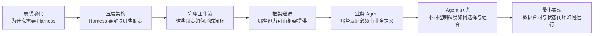

# AI Agent 架构学习教程

建议按顺序阅读：先理解工程角色为何从 Prompt Engineer 演化为 Harness Engineer，再掌握五层架构和闭环工作流，然后理解 LangChain、LangGraph、Deep Agents 与具体业务 Agent 的关系，用四种范式总结不同控制粒度，最后回到可运行内核，把 Model、Context、Tool、State、Memory、Loop 和 Control 落成最小实现。

> 文档版本：2026-07-13。

### 【先记住一条主线】

Agent 的演化不是“Prompt 被淘汰了”，而是工程问题不断扩大：

```text
Prompt Engineering
解决：怎样把单次任务说清楚
        ↓ 任务从单轮变成多轮，Prompt 无法决定每轮该看什么
Context Engineering
解决：当前这一轮应该给模型看什么
        ↓ 信息准备充分，模型仍不能真实读取、修改和验证外部环境
Tool Use + ReAct
解决：模型怎样作用于外部环境，并根据观察继续行动
        ↓ 循环越长，工具结果和历史越多；会话也会结束或压缩
Memory + Rule Files
解决：怎样跨轮、跨会话重新注入稳定知识
        ↓ 规则常驻越多，占用的上下文越多
Skills + Progressive Disclosure
解决：怎样把任务知识拆成能力包并按需加载
        ↓ 知道规则、拥有工具，仍不等于能管理复杂任务的全局进度
State + Workflow + Feedback
解决：长任务怎样持续推进、验证、恢复和终止
        ↓ 各部分需要被装配为同一个可运行、可治理的系统
Harness Engineering
解决：怎样把模型、上下文、工具、编排、反馈和安全边界组装成可靠系统
```

这里描述的是工程能力的演化顺序，不是新增架构层级。Memory、规则文件和 Skills 主要属于上下文组织与 Harness 装配机制；在五层模型中，它们不会成为模型层与执行层之外的额外业务层。

最终可以用一个简化公式理解：

```text
AI Agent = Model + Harness

Harness
= Context Management
+ Tool / Execution Environment
+ State / Orchestration
+ Feedback / Evaluation
+ Memory / Skills
+ Permission / Approval
+ Observability
```

模型提供概率性的理解与决策能力，Harness 提供可执行、可验证、可恢复、可治理的工程环境。

### 【教程目录】

| 顺序 | 章节 | 核心问题 | 学完后的产出 |
| --- | --- | --- | --- |
| 1 | [从 Prompt Engineer 到 Harness Engineer](./01-从Prompt-Engineer到Harness-Engineer.md) | 为什么只优化 Prompt 不再足够？ | 能解释 Agent 工程角色的完整演化链 |
| 2 | [Agent 五层架构](./02-Agent五层架构.md) | 一个 Agent 系统由哪些职责域组成？ | 能用五层模型拆解任意 Agent 产品 |
| 3 | [Agent 完整工作流](./03-Agent完整工作流.md) | 五层如何在一次任务中协作？ | 能设计状态、循环、门禁和完成条件 |
| 4 | [LangChain、LangGraph 与 Deep Agents](./04-从LangChain到Deep-Agents.md) | Framework、Runtime、Harness 有什么区别？ | 能根据复杂度选择合适的抽象层 |
| 5 | [业务案例：研发缺陷修复 Agent](./05-业务案例-研发缺陷修复Agent.md) | 如何把通用框架变成业务 Agent？ | 得到一份从 MVP 到生产系统的设计蓝图 |
| 6 | [Agent 四种范式](./06-Agent四种范式.md) | ReAct、Plan-and-Execute、Reflexion、Tree of Thoughts 分别控制什么？ | 能按行动、任务、Trial 和候选路径选择并组合范式 |
| 7 | [Agent 核心原理与最小实现](./07-Agent核心原理与最小实现.md) | Model、Context、Tool、State、Memory、Loop 和 Control 如何真正形成闭环？ | 能运行、测试并解释一个五层最小 Agent |

### 【五条主线如何融合】

这套教程不是几段互不相关的知识，而是同一个系统的五个观察角度：

| 观察角度 | 关注的问题 | 在教程中的位置 |
| --- | --- | --- |
| 思想演化 | 工程问题为什么从“写指令”扩展到“造环境” | 第 1 章 |
| 架构分层 | 扩展出来的职责应该如何解耦 | 第 2、3 章 |
| 技术落地 | 不同框架分别封装了哪些职责，业务还要补什么 | 第 4、5 章 |
| 控制范式 | 模型应在哪个粒度上动态决定行动、计划、重试或搜索 | 第 6 章 |
| 运行内核 | 核心数据对象怎样在代码中形成受控状态闭环 | 第 7 章 |

五条主线的关系是：



### 【案例如何贯穿】

教程使用三个互补案例：

- 第 3、6 章使用“生成一份结论可追溯的调研报告”，帮助读者在不依赖代码背景的情况下理解 State、双循环、四种范式及其组合；
- 第 4、5 章使用“研发缺陷修复 Agent”，展示框架选型、文件修改、测试、审批和业务 Harness 的工程落地。
- 第 7 章使用“查询离线天气并进行计算”，用两次工具调用展示 Decision、Observation、Evidence 与完成验证。

三个案例虽然工具和产物不同，但都需要五层能力：

- 模型理解目标、事实、失败和候选方案；
- 上下文层按步骤选择规则、证据、产物和历史结果；
- 执行层调用领域工具并返回真实 Observation；
- 编排层维护阶段、循环、依赖、重试和恢复；
- 反馈与控制层用规则、证据、权限和人工审批决定继续还是结束。

如果要迁移到客服、数据分析、审批、投研或运营场景，只需要替换领域工具、领域 Skills、状态字段和验收标准，五层与双循环仍然成立。

### 【术语约定】

| 术语 | 本教程中的含义 |
| --- | --- |
| LLM / Model | 根据当前上下文生成判断、计划、工具调用或答案的概率性决策模块 |
| Tool | 暴露给模型的能力接口；背后可以由 Function、API、CLI、Script、浏览器或 MCP Server 实现 |
| Workflow | 主要由代码预先规定路径的流程，强调可预测性 |
| Agent Loop | 模型根据观察动态决定下一步工具和停止时机的循环 |
| Runtime | 负责状态、持久化、恢复、流式输出和中断等运行能力的底座 |
| Harness | 围绕模型预装工具、提示、文件系统、上下文管理、规划、子 Agent 和控制机制的工程外壳 |
| 业务 Agent | 通用框架或 Harness 加上领域目标、工具、规则、数据、权限、评估和运营机制后的完整产品 |

“Workflow”和“Agent”不是非此即彼。生产系统通常是确定性 Workflow 包住若干模型驱动的 Agent Loop，即“确定性外壳 + Agent 自主内核”。

### 【推荐学习方式】

第一遍只关注每章开头的核心公式、架构图和判断标准，先形成整体地图。第二遍结合第 5 章案例，把自己的业务逐项代入五层。第三遍运行第 7 章的零依赖最小 Agent，亲自观察 State、Decision、Observation 和 Evidence 怎样变化。第四遍再使用 LangChain 做 Tool Calling Loop，遇到显式状态、循环、恢复或审批需求时引入 LangGraph；只有长任务确实需要规划、上下文卸载、Skills 或子 Agent 时，才升级到 Deep Agents 一类 Harness。第五遍结合第 6 章判断当前问题发生在 Action、Plan、Trial 还是 Candidate 粒度，只增加真正需要的范式。

每完成一章，可以尝试回答一个问题：

1. 当前问题是模型能力不足，还是 Harness 缺失？
2. 这个能力属于五层中的哪一层？
3. 它应该由模型动态决定，还是由程序确定性控制？
4. 框架已经提供了什么，业务仍然必须定义什么？
5. 哪条证据能够证明任务真的完成了？
6. 当前不确定性发生在 Action、Plan、Trial，还是多个 Candidate 之间？
7. Model、Runtime 和 Control 之间的数据合同能否被单独测试？

### 【引用证据如何阅读】

教程把文章标题直接嵌入它所支撑的表述中。例如：

> Anthropic 的 [《Effective context engineering for AI agents》](https://www.anthropic.com/engineering/effective-context-engineering-for-ai-agents) 指出，Context Engineering 关注模型在当前推理时应看到的完整 Token 集合，而不只是一段 Prompt。

这种写法让文章链接成为句子的一部分，读者可以立即判断是哪篇文献支持当前结论。各章末尾的“本章引用证据”仍集中列出完整资料，便于核对版本和继续阅读。教程自行归纳的五层模型、工程公式和业务设计，会使用“可以理解为”“本教程归纳”等表述，不冒充某篇文章的原始定义。

### 【原始资料与官方延伸阅读】

- [OpenAI：Harness engineering](https://openai.com/index/harness-engineering/)
- [Anthropic：Building effective agents](https://www.anthropic.com/engineering/building-effective-agents)
- [Anthropic：Effective context engineering for AI agents](https://www.anthropic.com/engineering/effective-context-engineering-for-ai-agents)
- [ReAct：Synergizing Reasoning and Acting in Language Models](https://arxiv.org/abs/2210.03629)
- [LangChain：Plan-and-Execute Agents](https://www.langchain.com/blog/plan-and-execute-agents)
- [Reflexion：Language Agents with Verbal Reinforcement Learning](https://arxiv.org/abs/2303.11366)
- [Tree of Thoughts：Deliberate Problem Solving with Large Language Models](https://arxiv.org/abs/2305.10601)
- [LangChain：Agents](https://docs.langchain.com/oss/python/langchain/agents)
- [LangGraph：Overview](https://docs.langchain.com/oss/python/langgraph/overview)
- [Deep Agents：Overview](https://docs.langchain.com/oss/python/deepagents/overview)
- [LangChain：Frameworks, runtimes, and harnesses](https://docs.langchain.com/oss/python/concepts/products)
- [Model Context Protocol：Introduction](https://modelcontextprotocol.io/docs/getting-started/intro)
