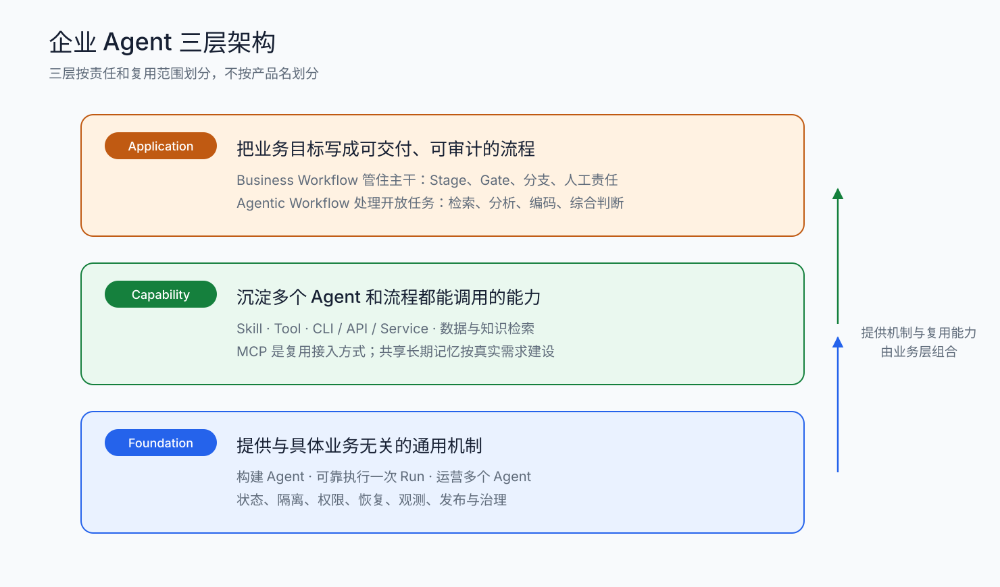
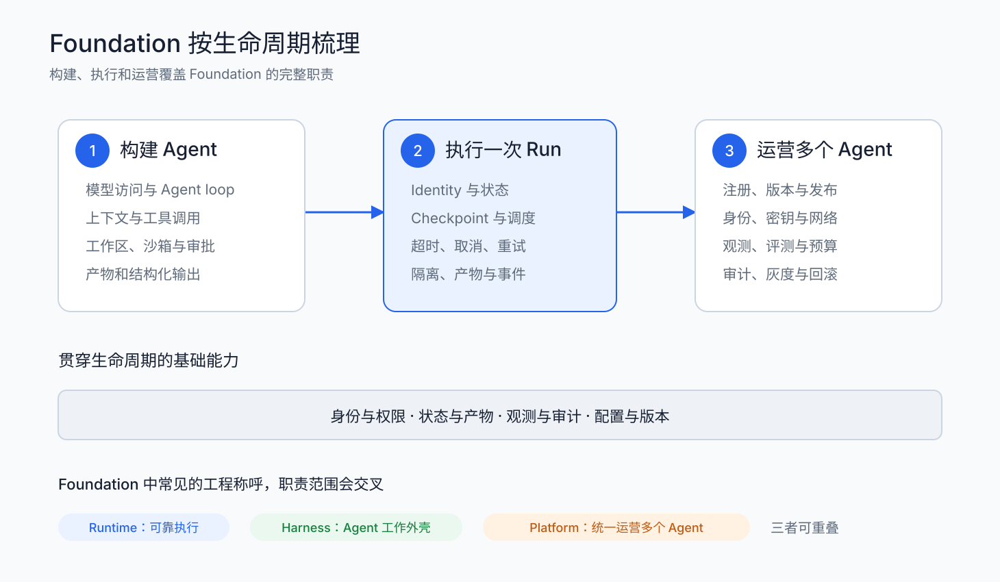
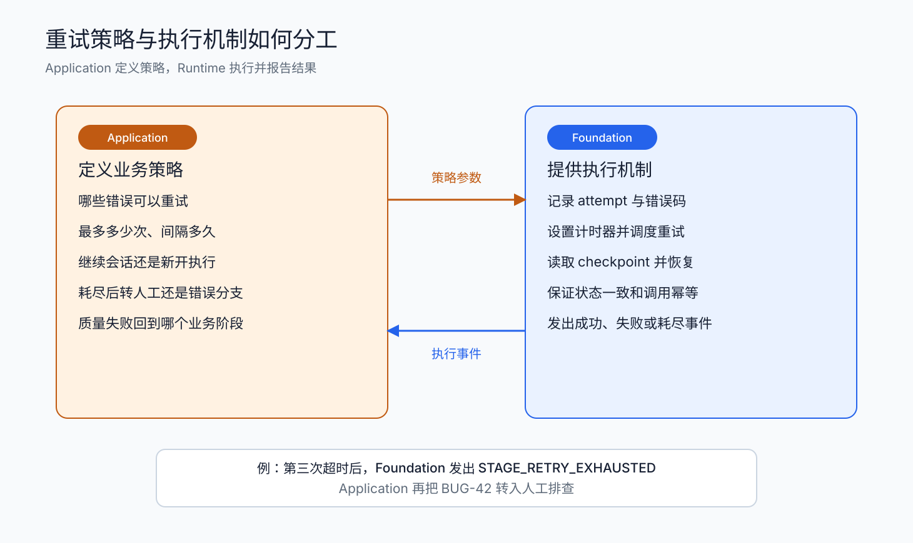
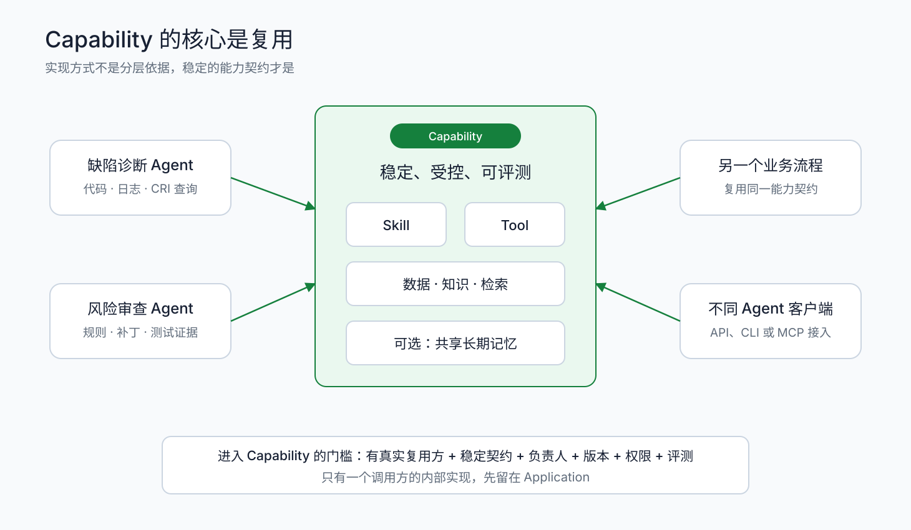
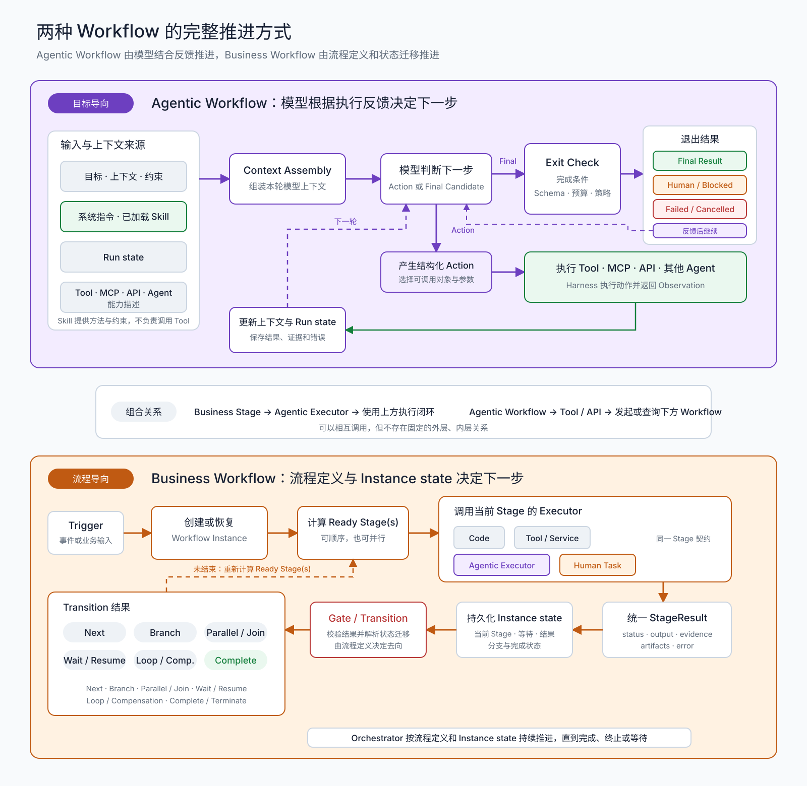
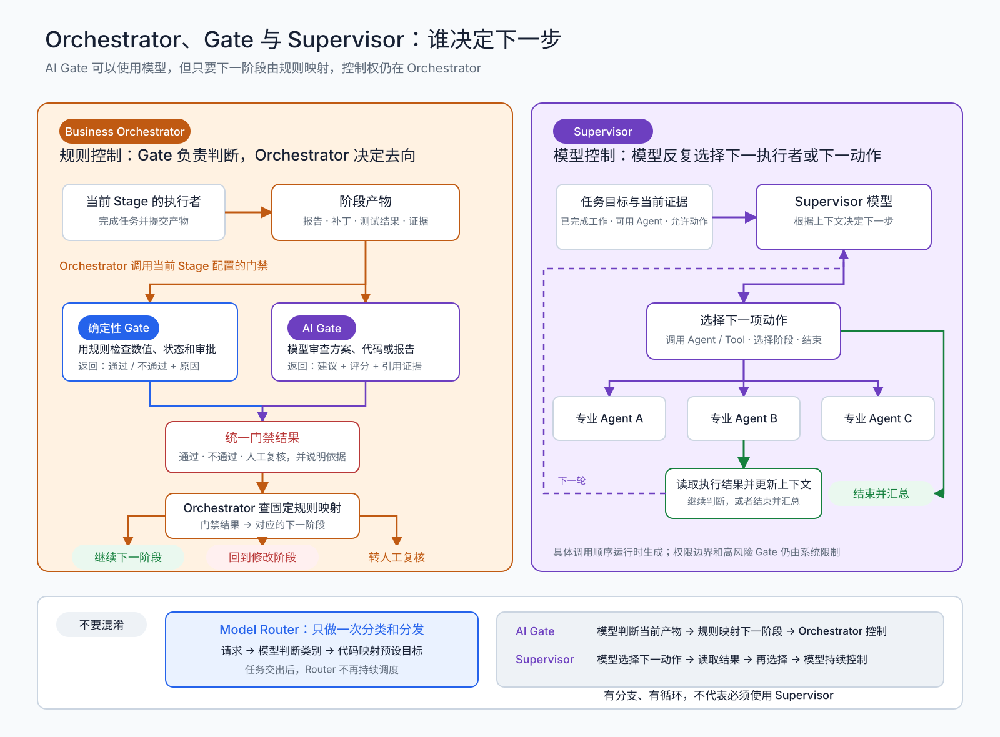
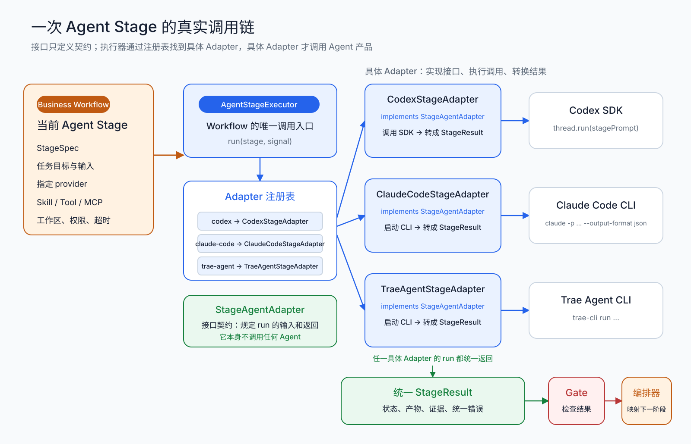
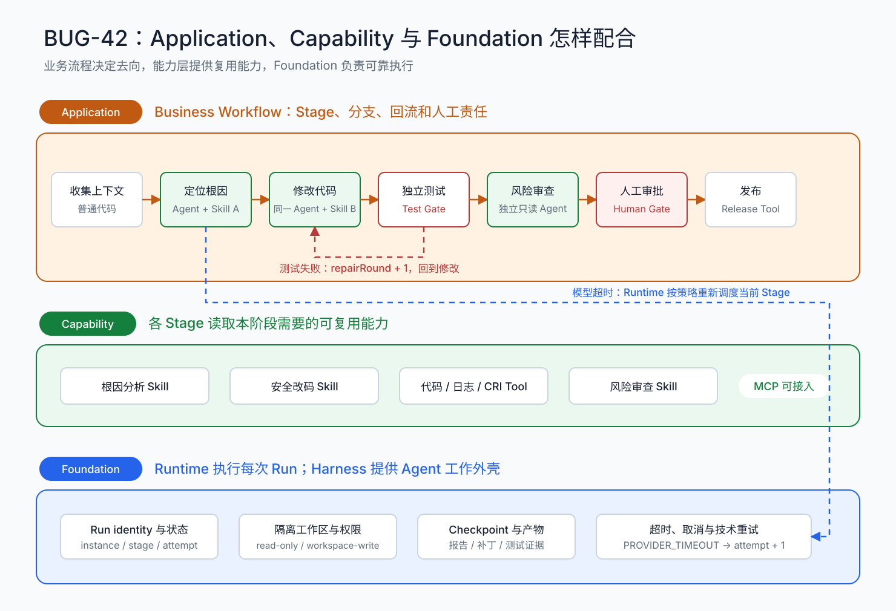

## 1. Agent 研发的两种语境

今天讨论“Agent 开发”，经常会混在一起说两件事：一件是把 Agent 用到业务流程里，另一件是开发 Agent 系统本身。两者有关联，但研发对象、要解决的问题和评价方式不同。

这里分的是两种研发语境，不是两种互斥的技术形态。同一个业务流程可以只接入一次模型调用，也可以使用固定编排的 Workflow，还可以接入一个完整的 Agent。

### 第一类：业务流程 Agent 化

这类研发从现有业务出发。通常是在已有的业务 SOP 或工程链路中，引入 Agent 处理依赖语言理解、判断或复杂操作的环节。研发对象仍然是业务流程，Agent 是其中新增的一项能力。

例如：

- 在研发流程中，让 Agent 读取需求、修改代码并执行测试；
- 在客服流程中，让 Agent 判断问题原因、查询订单或工单，整理证据并生成处理建议；
- 在运营流程中，让 Agent 分析数据、调用内部工具，生成或执行运营动作。

这类研发主要回答三个问题：Agent 放在哪个业务节点，能够创造什么业务价值，业务边界和风险怎样控制。

它通常有比较明确的流程边界和人工交接点。最终评价也落在业务结果上，例如处理时间是否缩短、解决率或覆盖量是否提高、人力成本是否下降。同时还要检查结果质量、错误率和返工量；如果只是处理得更快，却带来更多问题，就不能算真正提效。

### 第二类：Agent System 开发

这类研发直接以 Agent 本身为对象。Agent 是一套以模型推理为核心、配合工具完成任务的智能体系统。它会根据目标和当前上下文判断下一步，调用工具执行，再根据结果继续处理。[1](https://www.anthropic.com/engineering/building-effective-agents) [2](https://cdn.openai.com/business-guides-and-resources/a-practical-guide-to-building-agents.pdf)

| 研发语境          | 研发对象                | 核心问题                                         | 评价重点               |
| ----------------- | ----------------------- | ------------------------------------------------ | ---------------------- |
| 业务流程 Agent 化 | 已有业务 SOP 或工程链路 | Agent 应该放在哪里，能解决什么问题，风险如何控制 | 业务价值，以及结果质量 |
| Agent System 开发 | Agent 系统本身          | 怎样让模型配合工具完成目标                       |                        |

### 2. `Agents in Workflows` -- 在现有业务流程中引入 Agent

### `Agents in Workflows` 的定义

第一类 Agent 研发，可以概括为 **Agents in Workflows（工作流中的 Agent）**：保留已有业务流程作为整体执行框架，在其中需要模型进行复杂理解、推理和动态决策的环节，引入 Agent 作为执行单元。

这是 Microsoft Agent Framework 当前明确使用的官方表述。Microsoft 将 `Agents in workflows` 定义为：

> “Use agents as workflow participants and executors.”

即：**让 Agent 作为工作流中的参与者和执行单元。**

Microsoft 进一步指出，现实生产系统通常不会完全依赖 Agent，也不会完全依赖固定程序，而是把两者组合起来：

> “A workflow defines the high-level process, and individual executors within that workflow use agents for the steps that benefit from LLM reasoning.”

也就是：**Workflow 负责定义高层流程，其中真正需要大模型推理的步骤再交给 Agent。**

明确指出：

> “Most real-world applications live somewhere in the middle.” **即大多数真实系统都会采用这种混合方式。**

因此，这类研发真正关注的不是“如何重新开发一套 Agent Harness”，而是：

> **业务流程里哪些节点值得 Agent 化、为什么需要 Agent、Agent 如何接入现有流程，以及最终如何证明它产生了业务价值。**


# 企业 Agent 架构学习教程

> 本文讨论的不是某个 Agent 框架怎么用，而是企业怎样把 Agent 做成一套能复用、能运行、能治理的工程体系。文中的三层是责任边界，不是三个互相隔离的技术栈。

## 1. 先把三层分清楚

企业 Agent 体系保留三层：Foundation、Capability、Application。



| 层级 | 回答的问题 | 主要产物 | 不负责什么 |
| --- | --- | --- | --- |
| Foundation | Agent 怎样被构建、执行和运营 | 执行环境、状态、权限、观测、发布与治理机制 | 不决定某个业务失败后该走哪条分支 |
| Capability | 哪些能力可以被多个 Agent 或业务流程复用 | Skill、Tool、数据与知识访问能力、可选的共享长期记忆 | 不编排完整业务流程 |
| Application | 业务目标怎样落成可交付、可审计的流程 | 面向业务的 Workflow、阶段规则、质量门禁、人工节点、业务产物 | 不重复实现底层运行机制 |

判断一个模块放在哪一层，可以先问三件事：

1. 它是否与具体业务目标无关，却是 Agent 可靠运行所必需的？是，通常属于 Foundation。
2. 它是否能被多个 Agent 或多个流程直接调用？是，通常属于 Capability。
3. 它是否表达了某项业务的顺序、判断、责任和交付标准？是，属于 Application。

边界不会永远固定。一个只服务于单个应用的提示词片段，先留在 Application；当它形成稳定输入输出、经过评测并被多个应用采用后，再沉淀为 Capability。

### 1.1 用一个案例贯穿全文

后文统一使用“订单重复扣款缺陷 BUG-42”作为例子。它的业务处理过程如下：

```text
接收缺陷 → 补齐上下文 → 定位原因 → 修改代码 → 运行测试 → 风险审查 → 人工批准 → 发布
```

这个过程包含三类东西：

- Foundation 提供执行、状态、隔离、重试、恢复、权限和追踪机制。
- Capability 提供代码检索、仓库读写、测试、日志查询、CRI 数据库查询、知识检索等复用能力。
- Application 定义 BUG-42 要经过哪些阶段、每个阶段调用哪个 Agent、通过标准是什么、失败后去哪。

后面所有边界问题，都可以放回这个例子里判断。

## 2. Foundation：覆盖 Agent 的完整生命周期

沿 Agent 生命周期看 Foundation：

```text
构建 Agent → 执行一次 Run → 运营多个 Agent
```



构建、执行和运营是一条连续的职责链。身份权限既影响本地工具调用，也影响生产发布；追踪既用于单次 Run 排错，也用于线上质量分析。

### 2.1 构建 Agent：把模型变成可执行单元

单次模型调用只完成“输入文本，返回文本”。Agent 还需要一圈工程机制：

- 模型访问与路由：模型选择、参数、限流、降级和凭证管理。
- Agent loop：接收目标，决定下一步，调用工具，读取结果，直到完成或退出。
- 上下文组装：系统指令、当前任务、历史消息、检索结果、工作区状态和预算。
- 工具调用：工具描述、参数校验、调用权限、结果规范化和错误分类。
- 执行环境：代码工作区、沙箱、文件系统、网络边界和进程限制。
- 人工确认：在高风险操作前暂停，并在得到批准后继续。
- 产物管理：补丁、报告、测试结果、日志和结构化输出。

这套围绕模型的工作外壳通常称为 [Agent Harness](https://docs.langchain.com/oss/python/concepts/products)。它把上下文、工具、工作区、权限和人工确认装在一起，让模型可以在明确边界内完成任务。

最小的 Agent loop 可以写成：

```ts
while (!done && budget.remaining()) {
  const context = await assembleContext(run);
  const decision = await model.respond(context, availableTools);

  if (decision.type === "tool_call") {
    const result = await invokeToolWithPolicy(decision.tool, decision.args);
    run.append(result);
    continue;
  }

  done = decision.type === "final";
}
```

代码看起来简单，生产问题都藏在循环外：进程中断后怎样恢复、工具有没有越权、同一个动作会不会重复执行、结果是否真的达到业务标准。这些才是 Foundation 要解决的部分。

### 2.2 执行一次 Run：可靠地开始、暂停、恢复和结束

本文用 Run 表示一次有明确目标和边界的 Agent 执行。承载 Run 的 [Agent Runtime](https://docs.langchain.com/oss/python/langgraph/overview) 接收任务和执行策略，负责保存状态、调度资源，并在暂停或故障后继续运行。Foundation 对 Run 负责的内容包括：

| 机制 | 作用 |
| --- | --- |
| Run identity | 为一次执行分配稳定标识，并关联外部 Agent 的 thread/session ID |
| State store | 记录状态、阶段、attempt、输入摘要和产物引用 |
| Checkpoint | 在可恢复位置保存进度，进程重启后不必从头执行 |
| Scheduler / queue | 在合适的时间与资源上启动或继续执行 |
| Heartbeat | 判断执行仍在运行，还是已经失联 |
| Timeout / cancellation | 到期终止、响应业务取消，并回收资源 |
| Retry executor | 按上层给定的策略安排下一次 attempt |
| Isolation | 隔离工作区、进程、网络、密钥和租户数据 |
| Artifact store | 保存补丁、报告、日志、测试证据等可交付产物 |
| Event / trace | 记录模型调用、工具调用、状态变化和异常 |

Run state 不是长期记忆。`attempt=2`、当前检查点、等待人工批准等信息，是为了让这次执行能够继续；任务完成并超过审计保留期后，它们可以归档或删除。

### 2.3 重试：业务定策略，Foundation 执行策略

Runtime 可以执行重试，但不应自行制定业务策略。这里有两类责任：

- Application 决定：哪些错误允许重试、最多几次、间隔多长、用原上下文继续还是新开 Run、最终转人工还是错误分支。
- Foundation 执行：记录当前是第几次 attempt、设置计时器、调度下一次执行、读取检查点、保证状态一致并留下追踪记录。



可以把一次重试写成一份明确的业务策略：

```yaml
stage: locate_root_cause
retry:
  retryable_errors:
    - PROVIDER_RATE_LIMIT
    - PROVIDER_TIMEOUT
    - SANDBOX_LOST
  max_attempts: 3
  backoff: exponential
  initial_delay: 5s
  jitter: true
on_exhausted: manual_triage
```

Foundation 不理解 `manual_triage` 的业务含义，只负责在三次尝试用尽后发出 `STAGE_RETRY_EXHAUSTED`。Application 收到事件后，把流程转到“人工排查”。

错误也不能一律重试：

| 错误类型 | 例子 | 合理处理 |
| --- | --- | --- |
| 瞬时基础设施错误 | 限流、短暂超时、沙箱失联 | 在次数和退避上限内自动重试 |
| 可修复的任务错误 | 结构化输出不合规、缺少一项证据 | 带着反馈继续当前会话，或执行一次修复回合 |
| 质量失败 | 测试失败、风险审查不通过 | 回到实现阶段，输入失败证据；不是盲目重复同一步 |
| 确定性错误 | 参数非法、权限不足、配置缺失 | 直接失败，先修配置或权限 |
| 业务歧义或高风险 | 需求冲突、可能影响资金数据 | 转人工判断 |

自动重试前还要检查幂等性。查询和纯分析通常可以安全重放；支付、发消息、创建工单等有外部副作用的操作，应使用幂等键、去重记录或补偿动作。否则“提高成功率”的重试会制造第二次事故。

### 2.4 运营多个 Agent：让系统可发布、可治理

当生产环境中同时运行多个 Agent，需要一个统一的 Agent Platform 管理版本、访问边界、运行质量和资源消耗。否则每个团队都会各自保存配置、分发密钥和查看日志，同名 Agent 也可能使用不同的模型、工具或提示词，出了问题很难还原现场。

#### Agent 资产、版本、发布与回滚

Agent 的版本不能只记录一段提示词。一个可发布版本至少要固定系统指令、模型配置、Skill 与 Tool 版本、Adapter、输出 Schema 和权限模板。注册表为它们分配稳定的 `agentId` 和版本号；某次 Run 启动后，还要把实际使用的版本写入执行记录。

新版本先在测试环境跑回归样本，通过质量门槛后再灰度。回滚只改变新 Run 的流量去向，已经开始的 Run 继续使用原版本，除非发布策略要求取消。以 BUG-42 为例，诊断阶段可以锁定 `code-diagnoser@3`，编码阶段锁定 `code-editor@5`；如果 `code-editor@5` 经常修改无关文件，Platform 停止给它分配新任务，并把后续任务切回 `code-editor@4`。

#### 身份、权限、密钥与网络边界

Agent 的有效权限来自多重约束的交集：发起人的身份、Agent 配置、当前 Stage 以及 Tool 或数据源自己的策略。Agent 不应持有长期通用密钥。Runtime 在 Run 启动时申请短期凭证，凭证只允许访问当前阶段所需的资源；沙箱的网络出口也按域名或服务白名单开放。

BUG-42 的诊断阶段可以读取代码、日志和 CRI 数据，但不能改仓库；编码阶段只能写隔离分支，不能访问生产数据库；发布阶段则由另一套服务身份执行。每次 Tool 调用都带上用户、Run 和 Stage 标识。权限不足直接返回明确错误，不进入自动重试。

#### 观测、质量评测与问题定位

观测数据要能从业务实例一路定位到 Stage、Run、模型调用、Tool 调用和最终产物。成功率、耗时、Token、Tool 错误和人工介入率是同一条执行链上的不同信号。只看“Run 成功”没有意义，还要用离线样本、结构化 Gate 和线上抽检判断结果是否合格。

BUG-42 的根因报告必须带代码或日志证据，补丁必须关联独立测试结果。若某版本耗时增加但报告质量没有变化，可以检查模型和工具调用；若 Run 显示成功却频繁过不了 Gate，问题在 Agent 的完成判断或输出契约，而不是 Runtime 稳定性。

#### 配额、成本、审计与责任追溯

Platform 按团队、业务流程和 Agent 设置并发数、最长执行时间、模型调用次数和费用上限。Runtime 在启动 Run、进入新回合或调用高成本 Tool 前检查剩余额度。审计记录则保存发起人、Agent 版本、实际权限、能力调用、产物、人工批准和最终变更。

BUG-42 可以限制诊断阶段最多调用模型 20 次、运行 30 分钟。额度耗尽后，Runtime 返回 `BUDGET_EXCEEDED`，由 Business Workflow 决定转人工还是终止。若补丁上线后出现问题，审计记录能够还原谁发起了流程、哪个 Agent 版本改了哪些文件、测试和审批依据是什么。

## 3. Capability：沉淀可以复用的能力

Capability 不是“Agent 运行需要的所有东西”，而是能被多个 Agent 或多个业务流程复用的资产。



一项资产进入 Capability 层前，至少要回答：

- 是否已有两个以上的实际复用方，或很快会有明确的第二个复用方？
- 输入、输出和错误语义是否稳定？
- 权限边界、负责人和版本是否清楚？
- 能否独立测试，升级后能否做回归评测？
- 调用方是否不需要知道内部实现细节？

如果答案大多是否定的，它仍是某个应用的内部实现，不必急着抽象。

### 3.1 Skill：可复用的任务方法

Skill 描述“怎样完成一类任务”。它通常包含：

- 适用场景和触发条件；
- 必须遵守的步骤与约束；
- 可使用的工具和数据；
- 输出模板或结构化 Schema；
- 示例、反例和验收标准；
- 版本与评测样本。

例如“Java 服务根因定位”可以成为一个 Skill：先读取工单和调用链，再检索相关代码，最后输出根因、证据、影响范围和建议修复点。它不绑定 BUG-42，因此可以被其他缺陷流程复用。

Skill 不等于一段长 Prompt。只有经过封装、版本管理和评测，调用方能稳定复用时，它才是一项工程资产。

### 3.2 Tool：Agent 可以调用的确定性动作

Tool 向 Agent 暴露一个明确动作，例如：

- `search_code(query, repo)`
- `run_tests(target, timeout)`
- `query_logs(service, time_range, filter)`
- `query_cri_database(sql_template, parameters)`
- `create_patch(files, change_request)`

Tool 是面向 Agent 的调用契约。它的实现可以是本地函数、CLI、HTTP API、内部服务或数据库代理。架构设计时先定义输入、输出、权限和错误码，再选择承载方式。

工具错误最好采用可判断的结构，而不是只返回一段文本：

```json
{
  "ok": false,
  "error": {
    "code": "QUERY_TIMEOUT",
    "retryable": true,
    "message": "日志查询在 30 秒后超时"
  }
}
```

`retryable` 是工具对错误性质的提示，不是最终重试决定。Application 仍要结合阶段风险、剩余时间和 attempt 上限制定策略。

### 3.3 数据、知识与检索能力

业务数据库、文档库、代码库、搜索服务和 RAG 都可以成为 Capability，前提是它们提供了稳定、受控、可复用的访问能力。重点不是把数据搬到一个新盒子，而是把以下问题处理好：

- 数据来源、更新时间和负责人；
- 查询范围与租户隔离；
- 结果引用和证据定位；
- 敏感字段过滤；
- 召回质量与空结果处理；
- 变更兼容和版本管理。

知识库偏向经过整理的事实和规则，例如退款制度、服务目录、代码规范。它通常是多人共享、以读取为主、需要来源和版本。

### 3.4 MCP：一种复用能力的接入方式

同一项工具、资源或提示模板可以通过 MCP 暴露给不同 Agent 客户端，从而减少重复适配。架构上不必单独为 MCP 建一层；把它看作 Capability 的一种统一接入方式即可。MCP 的 Host、Client、Server 分工可参考[官方架构说明](https://modelcontextprotocol.io/specification/2025-06-18/architecture)。

是否采用 MCP，取决于复用范围：只在单进程内使用的函数不一定需要 MCP；需要被 Codex、Claude Code、Trae Agent 等不同客户端共同调用的能力，更适合封装成服务并通过 MCP 或稳定 API 暴露。

### 3.5 长期记忆：只在确有复用价值时建设

长期记忆与知识库有联系，但不是同一个概念：

- 知识库保存经过整理的业务事实、规则和资料，强调来源、版本和可引用性。
- 长期记忆从交互和执行结果中提炼偏好、历史决策、项目经验等内容，强调写入、合并、更正、过期和作用域。

如果记忆只服务于一个应用，例如 BUG-42 会话中的临时偏好，就留在 Application。只有当多种 Agent 都需要按用户、团队或项目复用这些内容，并且已经解决授权、更正、过期和删除问题时，才把它建设为 Capability。

不必默认像建数据仓库一样建设“企业记忆中心”。先让 Run state、业务记录和知识库各司其职；真实复用需求出现后，再增加独立长期记忆服务。[AWS AgentCore Memory](https://docs.aws.amazon.com/bedrock-agentcore/latest/devguide/memory-get-started.html)同样把短期事件与从事件中提炼的长期记录分开处理。

## 4. Application：按目标或流程构建业务

Application 有两种常见的构建起点：

- 目标导向：先定义要解决的业务问题，再构建运营 Agent、电商 Agent、客服 Agent 等业务助手。
- 流程导向：先定义稳定的 SOP，再用 Business Workflow 固定阶段、顺序、分支和责任。

两者是业务设计的不同面向，不是固定的上下层关系。目标导向的 Agent 可以单独提供服务，也可以被某个业务阶段调用；流程导向的阶段可以使用 Agent，也可以只执行普通代码或工具。



### 4.1 目标导向：围绕业务目标构建 Agent

目标导向的核心是：业务只给出目标和边界，Agent 根据执行结果决定下一步。

例如，运营 Agent 收到“找出本周商品转化下降的原因，并给出三项调整建议”后，可以按下面的方式工作：

~~~text
业务目标
  → 读取经营分析 Skill
  → 查询商品、流量和订单数据
  → 根据结果继续选择 Skill 或 MCP Tool
  → 对比假设与证据
  → 输出原因、建议和引用数据
~~~

这里的 Skill 和 MCP Tool 是可复用能力。Agentic Workflow 描述的是 Agent 怎样反复判断、调用能力和收敛结果。它通常由 Agent Harness 执行，但不等于 Harness 本身。

#### 4.1.1 单 Agent 常用控制模式

这些模式描述一个 Agent 怎样完成任务：

| 模式 | 基本形式 | 适合的任务 |
| --- | --- | --- |
| ReAct / Tool Loop | 观察 → 判断 → 调用工具 → 读取结果 → 再判断 | 路径事先不确定，需要边查边做 |
| Plan-and-Execute | 制定计划 → 分步执行 → 检查进度 → 必要时重排计划 | 步骤较长、前后依赖明确 |
| Evaluator-Optimizer | 生成结果 → 评价 → 给出修改意见 → 再生成 | 有明确质量标准，需要反复改进 |

ReAct、Plan-and-Execute 和 Evaluator-Optimizer 是单 Agent 的执行模式。Router、Supervisor 和 Handoff 解决的是多个执行者之间怎样分工，二者不能放在同一层当作并列规范。

[Anthropic 的 Agent 模式总结](https://www.anthropic.com/engineering/building-effective-agents)也把路由、并行、Orchestrator-Workers 和 Evaluator-Optimizer 分成不同协作结构，而不是一组互斥的 Agent 类型。

### 4.2 流程导向：先定义 Business Workflow

流程导向适合已经有清楚 SOP 的业务，例如缺陷修复、内容发布、合同审批和营销活动上线。Business Workflow 先固定业务主干：

~~~text
收集材料 → 分析 → 执行 → 验证 → 审批 → 发布
~~~

每个方框都是 Stage。流程定义每个 Stage 的输入、输出、执行者和通过条件；Orchestrator 负责按定义推进实例。

#### 4.2.1 一个 Stage 可以怎样执行

| 执行方式 | 形式 | 什么时候用 |
| --- | --- | --- |
| 普通代码或 Tool | Stage → 函数、API、脚本 | 规则明确，输入输出确定 |
| Agent + Skill | Stage → 指定 Agent → 读取该阶段 Skill | 需要理解材料，但方法已经沉淀 |
| 同一 Agent + 不同 Skill | 多个 Stage 调用同一 Agent，每个 Stage 加载不同 Skill | 阶段共享上下文，权限边界相近 |
| 独立 Agent | Stage 调用单独注册、部署或配置的 Agent | 专业边界、权限、工作区或版本需要隔离 |

例如 BUG-42 可以让同一个编码 Agent 在“根因分析”阶段读取根因分析 Skill，在“修复”阶段读取安全改码 Skill。若风险审查必须独立授权，则再调用只读的风险审查 Agent。

Agent 不是每个 Stage 的必选项。测试、Schema 校验、状态回写等确定性步骤直接用代码更清楚。

#### 4.2.2 Business Workflow 的常用结构

| 结构 | 形式 | BUG-42 中的例子 |
| --- | --- | --- |
| 顺序链 | A → B → C | 收集上下文 → 定位根因 → 修改代码 |
| 条件分支 | A → 条件 → B 或 C | 高风险进人工审批，低风险继续 |
| 并行汇聚 | A → B、C 并行 → D 汇总 | 单元测试与安全扫描并行，完成后汇总 |
| 审查回路 | A → 审查失败 → A | 测试失败后回到修改阶段 |
| 人工门禁 | A → 等待人工决定 → B | 发布前由责任人审批 |

这些结构可以由代码、状态机或持久化 Workflow Engine 实现。Agentic Workflow 只在某个 Stage 需要动态判断时出现，不要求形成“外层 Business Workflow、内层 Agentic Workflow”的固定架构。

### 4.3 Orchestrator、Gate 和 Supervisor 怎样决定下一步

先把四个角色说清楚：

| 名称 | 可以理解成什么 | 只负责什么 |
| --- | --- | --- |
| Orchestrator | 业务流程推进器 | 执行流程定义，调用当前阶段，运行门禁，再按规则进入下一阶段 |
| Gate | 阶段门禁 | 检查当前阶段的产物，返回“通过、不通过或需要人工复核”以及依据 |
| Router | 一次分流器 | 判断请求属于哪一类，再交给预设的处理者 |
| Supervisor | 模型调度 Agent | 保留任务上下文，反复选择下一项动作或下一位 Agent |

Orchestrator 不分“确定性 Orchestrator”和“AI Orchestrator”。真正分成两种的是 Gate：确定性 Gate 用规则判断，AI Gate 用模型审查。只要下一阶段仍由预先写好的规则映射，流程控制权就在 Orchestrator。



#### 4.3.1 Orchestrator 怎样经过 Gate 推进流程

Orchestrator 推进一个业务流程时，会依次完成下面这些动作：

| 顺序 | 发生什么 | BUG-42 中的例子 |
| --- | --- | --- |
| 1 | 找到当前需要执行的阶段 | 当前是“修改代码” |
| 2 | 调用该阶段的执行者 | 调用编码 Agent，或者直接调用普通代码和工具 |
| 3 | 接收阶段产物 | 收到补丁、修改说明和相关证据 |
| 4 | 调用当前阶段配置的 Gate | 检查补丁是否存在、测试是否通过、风险是否可接受 |
| 5 | 接收 Gate 的检查结果 | 通过、不通过或需要人工复核，并附带原因 |
| 6 | 查找检查结果对应的下一阶段 | 通过进入风险审查；不通过回到修改；高风险转人工 |
| 7 | 保存流程状态并继续 | 记录本次结果，然后推进新的阶段 |

完整控制链是：

> 当前阶段完成 → 形成阶段产物 → Gate 检查 → 返回检查结果和依据 → Orchestrator 查规则映射 → 推送下一阶段

Gate 不直接启动下一阶段。它把判断交回 Orchestrator，Orchestrator 再根据流程定义中的对应关系推进。

以 BUG-42 的测试和风险审查为例：

| Gate 返回的结果 | 预先定义的规则 | Orchestrator 推送到 |
| --- | --- | --- |
| 测试通过 | 测试通过后进行风险审查 | 风险审查 |
| 测试不通过 | 测试失败必须重新修改 | 修改代码 |
| 风险可接受 | 风险审查通过后等待批准 | 人工批准 |
| 风险不可接受 | 修改后重新审查 | 修改代码 |
| 无法确定或风险过高 | 必须由责任人判断 | 人工复核 |

上表中的映射随 Workflow 版本一起发布。运行时只能命中这些规则，不能临时生成一个未经定义的新阶段。

#### 4.3.2 确定性 Gate 和 AI Gate 分别检查什么

两种 Gate 的区别是检查方法，不是控制权。

| Gate 类型 | 怎样检查 | 适合检查什么 | 返回给 Orchestrator 的内容 |
| --- | --- | --- | --- |
| 确定性 Gate，也叫 Rule Gate | 使用代码、表达式或策略规则计算 | 测试退出状态、失败用例数、覆盖率、产物是否存在、审批是否完成 | 通过、不通过或人工复核，以及实际数值和失败原因 |
| AI Gate | 让审查 Agent 或模型阅读材料并给出结构化判断 | 需求是否覆盖、方案是否合理、代码设计是否有明显缺陷、测试是否覆盖关键风险 | 建议通过、不通过或人工复核，以及评分、问题和引用证据 |
| Human Gate | 由指定责任人查看产物和证据 | 资金、发布、合规或模型无法可靠判断的问题 | 批准、拒绝或要求修改，以及审批意见 |

确定性 Gate 的过程很直接：

1. 读取测试报告和扫描报告。
2. 检查测试是否全部通过、覆盖率是否达到要求、是否存在严重安全问题。
3. 返回通过或不通过，并列出没有满足的条件。
4. Orchestrator 根据固定映射进入下一阶段或回到修改阶段。

AI Gate 处理的是不容易写成简单数值的检查：

1. 读取需求、方案、代码差异和测试说明。
2. 判断需求是否覆盖、设计是否合理、关键风险是否被测试。
3. 返回建议结果，同时列出问题、评分和证据位置。
4. Orchestrator 把建议结果转换成统一的门禁结果，再按固定规则推进。

例如，AI Gate 给出的结论是“退款幂等性没有验证，风险高”。它没有权力直接调用某个 Agent。Orchestrator 看到“风险高”后，按已有规则把流程送到人工复核或修改代码。

这就是 AI Gate 与 Supervisor 的边界：

- AI Gate 用模型检查当前产物。
- Supervisor 用模型选择下一项动作或下一位执行者。
- AI Gate 的结果仍由 Orchestrator 映射；Supervisor 的选择本身就是调度决定。

#### 4.3.3 Orchestrator 和 Supervisor 的直接对比

假设当前已经知道：

- 功能测试失败；
- 日志出现数据库锁等待；
- 最近发生过数据库结构变更；
- 接口代码暂时没有明显异常。

Orchestrator 的处理方式：

1. 当前阶段的 Gate 返回“测试不通过”，并附上数据库锁等待的证据。
2. Orchestrator 查找已经定义的规则。
3. 如果规则写的是“数据库锁等待进入数据库排查阶段”，流程就进入该阶段。
4. 数据库排查完成后，再次经过 Gate 和规则映射。

这里可以有分支、循环和回退，但每条路径都提前写在流程定义中。

Supervisor 的处理方式：

1. Supervisor 同时读取任务目标、现有证据和允许调用的 Agent 列表。
2. 模型判断先调用 Database Agent。
3. Database Agent 返回结果后，Supervisor 再判断是否调用 Coding Agent。
4. 如果仍缺信息，Supervisor 可以继续调用日志 Agent，或者并行调用 SRE Agent。
5. 证据足够后，Supervisor 汇总结果并结束。

调用顺序不是提前写好的固定路径，而是模型根据每次返回结果继续选择。

| 对比项 | Orchestrator | Supervisor |
| --- | --- | --- |
| 下一步由谁决定 | 流程规则 | Supervisor 模型 |
| 可走的业务阶段 | 随 Workflow 版本预先定义 | 可调用对象受权限限制，具体顺序运行时决定 |
| 是否持续保留任务上下文 | 保存业务阶段和产物状态 | 保存推理所需上下文，并据此继续调度 |
| 遇到新证据后的处理 | 命中已有条件和路径 | 可以临时调整顺序、补充任务或换一个 Agent |
| 适合的任务 | SOP、审批、发布、回流和补偿 | 开放式诊断、研究和跨专业协作 |
| 主要风险 | 规则遗漏导致流程没有合适路径 | 模型选择不稳定，成本和审计更难控制 |

如果把业务阶段列表交给 Supervisor，并允许它直接选择下一阶段，那么业务主干就是模型控制。对于发布、资金和合规流程，这通常不是合适的默认方案。

#### 4.3.4 Router 和 Supervisor 也不是同一种调度

Router 只做一次分类。Supervisor 会在任务执行期间反复作出选择。

| 形式 | 工作过程 | 是否继续调度 |
| --- | --- | --- |
| Rule Router | 根据明确条件把请求交给预设处理者 | 否 |
| Model Router | 模型判断请求类别，代码把类别映射到预设处理者 | 否 |
| Supervisor | 模型选择执行者，读取结果，再选择下一执行者或结束 | 是 |

例如，Model Router 可以把“数据库锁等待”分类成数据库问题，再由固定映射交给 Database Agent。任务交出去后，Router 的工作结束。

Supervisor 调用 Database Agent 后还会读取结果。如果发现代码也需要修改，它会继续调用 Coding Agent。这种持续判断才是 Supervisor。

#### 4.3.5 有分支不等于需要 Supervisor

条件分支、回流、并行和等待都可以由 Orchestrator 执行。选择方式可以按下面的顺序判断：

| 问题 | 合适的控制方式 |
| --- | --- |
| 条件能稳定写成规则吗 | 确定性 Gate + Orchestrator |
| 需要模型审查材料，但下一阶段仍是固定映射吗 | AI Gate + Orchestrator |
| 只需要对请求做一次语义分类吗 | Model Router |
| 需要反复补证据、拆任务和选择不同专家吗 | Supervisor |
| 最终决定涉及资金、发布或合规责任吗 | Human Gate 收口 |

对已经有 SOP 的业务，可以让 Orchestrator 控制业务阶段，只在某个开放阶段使用 Supervisor：

1. Orchestrator 进入开放式诊断阶段。
2. Supervisor 在该阶段动态调用多个专业 Agent。
3. Supervisor 返回一份统一的诊断结果。
4. Gate 检查这份结果是否完整、证据是否充分。
5. Orchestrator 根据检查结果继续、回流或转人工。

这是一种常见组合，不是固定架构。开放阶段可以只用一个 Agent，也可以不用 Agent；Supervisor 只在“调度本身需要模型判断”时出现。

### 4.4 多 Agent 协作有哪些常用形式

| 形式 | 控制权在哪里 | 执行形式 | 适合场景 |
| --- | --- | --- | --- |
| Router | Router 完成分发后退出或等待汇总 | 分类 → 选择 Agent → 返回结果 | 请求类型清楚，只需一次分流 |
| Supervisor / Agents as Tools | Supervisor 始终保留控制权 | 主 Agent 调用专业 Agent，取得结果后继续判断 | 需要多轮协调和统一汇总 |
| Main Agent + Sub-agent | Main Agent 保留控制权 | Main Agent 创建或调用 Sub-agent，Sub-agent 完成限定任务后返回 | 上下文需要隔离，任务可拆成小块 |
| Handoff | 控制权交给接手的 Agent | 当前 Agent 移交上下文和后续对话 | 专业 Agent 需要直接接管用户或任务 |
| 并行协作 | 代码编排器或 Supervisor 控制汇聚 | 多个 Agent 同时执行，最后合并 | 子任务相互独立，时间收益明显 |

Supervisor 与 Main Agent + Sub-agent 不是两个完全独立的架构层。Supervisor 是协作职责；Main Agent 调用 Sub-agent 是一种具体实现。

“独立 Agent”描述资产和部署身份：它可以有自己的版本、权限、工作区和服务地址。“Sub-agent”描述一次运行中的角色：它接受 Main Agent 的限定任务，完成后把结果返回。一个独立部署的 Agent 可以在某次调用中充当 Sub-agent。

OpenAI 把“Manager 调用专业 Agent”称为 Agents as Tools，此时 Manager 保留控制权；Handoff 则把当前控制权交给专业 Agent。[OpenAI 多 Agent 文档](https://openai.github.io/openai-agents-python/multi_agent/)和 [LangChain Handoffs 文档](https://docs.langchain.com/oss/python/langchain/multi-agent/handoffs)都采用了这一控制权区分。

[LangChain Subagents 文档](https://docs.langchain.com/oss/python/langchain/multi-agent/subagents)展示了主 Agent 把子 Agent 当工具调用的集中式结构。

Anthropic 文档中的 Orchestrator-Workers 指模型动态拆解任务并分派 Worker，更接近这里的 Supervisor / Manager，不要与按预定义状态图推进的 Business Orchestrator 混为一谈。

选择时看一个问题：谁应该决定下一步？

| 业务需要 | 选择 |
| --- | --- |
| 条件稳定、目标固定 | Rule Router 或 Business Orchestrator |
| 语义分类后只分发一次 | Model Router |
| 主 Agent 需要多轮调用专业 Agent 并汇总 | Supervisor / Agents as Tools |
| 专业 Agent 需要接管后续任务 | Handoff |
| 主任务可拆成边界清楚的小任务 | Main Agent + Sub-agent |

## 5. Business Workflow 怎样接入 Codex、Claude Code 和 Trae Agent

Business Workflow 不直接调用 Codex SDK 或某条 CLI。所有 Agent 阶段都经过同一个 AgentStageExecutor，再由它从 Adapter 注册表中找到具体实现。



### 5.1 先看懂 Adapter 怎样参与调用

完整调用链只有一条：

> Business Workflow 进入 Agent Stage → AgentStageExecutor 查找 Adapter → 具体 Adapter 调用 Agent 产品 → Adapter 转换原始结果 → 返回 StageResult → Gate 检查

这里有三个不同的对象：

| 对象 | 是什么 | 在哪里真正执行 |
| --- | --- | --- |
| StageAgentAdapter | TypeScript 接口，只规定 Adapter 必须提供什么方法、返回什么结果 | 不执行任何调用 |
| CodexStageAdapter 等具体类 | 接口的实现，内部调用 Codex、Claude Code 或 Trae Agent | 具体类的 run 方法 |
| AgentStageExecutor | Workflow 的统一入口，根据 provider 从注册表选择具体 Adapter | 每次 Agent Stage 开始时 |

仅仅定义接口没有意义。具体类必须实现接口，执行器也必须通过接口调用这些类。下面的注册表把两端真正连起来。

为什么需要这层接口？因为 Business Workflow 不应该分别理解 Codex 的 `finalResponse`、Claude Code 的 JSON 输出和 Trae Agent 的 trajectory。它只认识一个调用：

> `run(StageSpec) → StageResult`

如果系统永远只调用一种 Agent，也不需要统一接入、切换或测试替身，可以直接调用具体产品，不必强行增加 Adapter。这里保留接口，是因为同一套 Business Workflow 需要接入三种 Agent，而且 Gate 必须检查同一种结果。

#### 5.1.1 Workflow 传入什么，Adapter 返回什么

~~~ts
type AgentProvider = "codex" | "claude-code" | "trae-agent";
type AccessMode = "read-only" | "workspace-write";

interface StageSpec {
  workflowInstanceId: string; // 当前 Business Workflow 实例
  stageId: string;            // 当前阶段，例如 diagnose
  attempt: number;            // 本阶段第几次技术执行

  goal: string;               // 当前阶段要完成的任务
  provider: AgentProvider;     // 选择哪一个具体 Adapter
  skills: string[];           // Agent 必须读取的 Skill

  workspace: string;          // Agent 可以访问的工作目录
  access: AccessMode;         // 只读或允许修改工作区
  allowedCapabilities: string[]; // 允许使用的 Tool、MCP Server 等能力

  inputArtifacts: string[];   // 上一阶段传入的报告、补丁或日志
  outputSchema: string;       // 成功结果必须符合的结构
  timeoutMs: number;          // 当前阶段的超时时间
}

interface StageResult {
  // 用这三个字段把结果关联回原来的流程、阶段和执行次数。
  workflowInstanceId: string;
  stageId: string;
  attempt: number;

  status: "succeeded" | "failed" | "cancelled";
  output: unknown | null;     // 成功时是结构化业务结果，失败时为 null
  artifacts: string[];        // 补丁、报告、日志或 trajectory 地址
  evidence: string[];         // Gate 可以检查的代码、日志或报告位置

  error?: {
    code: string;             // 统一错误码
    retryable: boolean;       // 是否适合按业务策略重试
    message: string;          // 排错说明
  };
}
~~~

StageSpec 是输入，StageResult 是唯一允许返回给 Workflow 的结果。SDK response、CLI 标准输出和进程退出状态都不能越过 Adapter 边界。

#### 5.1.2 接口和统一执行器怎样连接

~~~ts
interface StageAgentAdapter {
  // 每个具体 Adapter 都必须实现这个方法。
  run(stage: StageSpec, signal: AbortSignal): Promise<StageResult>;
}

// 注册表的 key 是 StageSpec.provider，value 是一个具体 Adapter。
type AdapterRegistry =
  Record<AgentProvider, StageAgentAdapter>;

class AgentStageExecutor {
  constructor(
    private readonly adapters: AdapterRegistry,
  ) {}

  async run(
    stage: StageSpec,
    signal: AbortSignal,
  ): Promise<StageResult> {
    // 例如 provider=codex 时，取到 CodexStageAdapter。
    const adapter = this.adapters[stage.provider];

    // Workflow 只调用接口，不关心内部是 SDK 还是 CLI。
    return adapter.run(stage, signal);
  }
}
~~~

AgentStageExecutor 依赖 StageAgentAdapter，不依赖某个产品类。三个产品实现同一个 run 方法后，才能放进同一份注册表。

#### 5.1.3 为什么所有 Adapter 都用相同的结果构造函数

三个 Adapter 都会遇到两种结果：成功或失败。共用结果构造函数，可以避免某个 Adapter 漏掉 stageId，或者直接返回字符串。

~~~ts
function successResult(
  stage: StageSpec,
  output: unknown,
  artifacts: string[],
  evidence: string[],
): StageResult {
  return {
    workflowInstanceId: stage.workflowInstanceId,
    stageId: stage.stageId,
    attempt: stage.attempt,

    status: "succeeded",
    output,
    artifacts,
    evidence,
  };
}

function failureResult(
  stage: StageSpec,
  error: unknown,
  cancelled = false,
): StageResult {
  // 将供应商错误转换成统一的 code、retryable 和 message。
  const normalized = classifyAgentError(error);

  return {
    workflowInstanceId: stage.workflowInstanceId,
    stageId: stage.stageId,
    attempt: stage.attempt,

    status: cancelled ? "cancelled" : "failed",
    output: null,
    artifacts: [],
    evidence: [],
    error: normalized,
  };
}
~~~

具体 Adapter 成功时必须调用 successResult，异常或取消时必须调用 failureResult。因此，无论底层接入哪种 Agent，AgentStageExecutor 收到的格式都相同。

Adapter 还会使用下面这些项目辅助函数：

| 函数 | 作用 |
| --- | --- |
| renderStagePrompt | 把 StageSpec 转成 Agent 能理解的阶段任务 |
| loadJsonSchema | 根据 outputSchema 名称加载实际 JSON Schema |
| parseAndValidateOutput | 解析最终文本，并检查它是否符合 outputSchema |
| collectWorkspaceArtifacts | 收集本阶段产生的补丁、报告和日志 |
| extractEvidence | 提取 Gate 可以检查的代码位置、日志位置和报告地址 |
| classifyAgentError | 把供应商错误转换成统一错误码 |
| runProcess | 启动 CLI，并记录退出状态、标准输出和标准错误 |

### 5.2 三个具体 Adapter 怎样实现同一个接口

三个类的外部形状相同：

> 接收 StageSpec → 调用具体 Agent → 解析原始结果 → 返回 StageResult

差异只出现在中间的产品调用。

#### CodexStageAdapter

~~~ts
import { Codex } from "@openai/codex-sdk";

class CodexStageAdapter implements StageAgentAdapter {
  private readonly codex = new Codex();

  async run(
    stage: StageSpec,
    signal: AbortSignal,
  ): Promise<StageResult> {
    try {
      // 把统一阶段约束映射成 Codex 的 Thread 配置。
      const thread = this.codex.startThread({
        workingDirectory: stage.workspace,
        sandboxMode: stage.access,
        approvalPolicy: "never",
      });

      // 这里才真正调用 Codex SDK；signal 用于超时或取消。
      const sdkResult = await thread.run(
        renderStagePrompt(stage),
        {
          outputSchema:
            loadJsonSchema(stage.outputSchema),
          signal,
        },
      );

      // SDK 返回的是 finalResponse，不是 StageResult。
      const output = parseAndValidateOutput(
        stage.outputSchema,
        sdkResult.finalResponse,
      );

      const artifacts =
        await collectWorkspaceArtifacts(stage.workspace);
      const evidence = extractEvidence(output);

      // 通过公共构造函数返回完整 StageResult。
      return successResult(
        stage,
        output,
        artifacts,
        evidence,
      );
    } catch (error) {
      return failureResult(stage, error, signal.aborted);
    }
  }
}
~~~

CodexStageAdapter 实现了 StageAgentAdapter。AgentStageExecutor 通过接口调用它，不直接接触 Codex 类或 finalResponse。`workingDirectory`、`sandboxMode`、`outputSchema` 和 `signal` 都在这里完成映射。接口形式见 [Codex SDK 官方文档](https://developers.openai.com/codex/sdk/)。

#### ClaudeCodeStageAdapter

~~~ts
class ClaudeCodeStageAdapter
  implements StageAgentAdapter {

  async run(
    stage: StageSpec,
    signal: AbortSignal,
  ): Promise<StageResult> {
    try {
      const args = [
        "-p", renderStagePrompt(stage),
        "--output-format", "json",
        "--max-turns", "20",
        // --tools 才是限制本次可见的工具；
        // --allowedTools 只是让匹配工具执行时不再询问。
        "--tools",
        toClaudeTools(stage.allowedCapabilities),
        "--permission-mode",
        stage.access === "read-only"
          ? "plan"
          : "acceptEdits",
      ];

      // 这里才真正启动 Claude Code CLI。
      const cliResult = await runProcess(
        "claude",
        args,
        {
          cwd: stage.workspace,
          signal,
        },
      );

      if (cliResult.exitCode !== 0) {
        throw new Error(
          cliResult.stderr || "Claude Code 执行失败",
        );
      }

      const claudeOutput =
        parseClaudeJson(cliResult.stdout);

      const output = parseAndValidateOutput(
        stage.outputSchema,
        claudeOutput.finalText,
      );

      const artifacts =
        await collectWorkspaceArtifacts(stage.workspace);
      const evidence = extractEvidence(output);

      return successResult(
        stage,
        output,
        artifacts,
        evidence,
      );
    } catch (error) {
      return failureResult(stage, error, signal.aborted);
    }
  }
}
~~~

ClaudeCodeStageAdapter 的 run 方法与 CodexStageAdapter 相同，但内部改为启动 CLI。若要继续上一次执行，可以在 args 中加入 <code>--resume</code> 和保存的 session ID。CLI 参数见 [Claude Code CLI 官方说明](https://docs.anthropic.com/en/docs/claude-code/cli-usage)。

#### TraeAgentStageAdapter

~~~ts
class TraeAgentStageAdapter
  implements StageAgentAdapter {

  async run(
    stage: StageSpec,
    signal: AbortSignal,
  ): Promise<StageResult> {
    // trajectory 是 Trae Agent 的过程记录。
    const trajectory = trajectoryPath(stage);

    try {
      const args = [
        "run", renderStagePrompt(stage),
        "--working-dir", stage.workspace,
        "--trajectory-file", trajectory,
      ];

      if (stage.stageId === "implement") {
        args.push("--must-patch");
      }

      // 这里才真正启动 Trae Agent CLI。
      const cliResult = await runProcess(
        "trae-cli",
        args,
        { signal },
      );

      if (cliResult.exitCode !== 0) {
        throw new Error(
          cliResult.stderr || "Trae Agent 执行失败",
        );
      }

      const traeOutput =
        parseTraeOutput(cliResult.stdout);

      const output = parseAndValidateOutput(
        stage.outputSchema,
        traeOutput.finalText,
      );

      const workspaceArtifacts =
        await collectWorkspaceArtifacts(stage.workspace);

      const artifacts = [
        trajectory,
        ...workspaceArtifacts,
      ];
      const evidence = extractEvidence(output);

      return successResult(
        stage,
        output,
        artifacts,
        evidence,
      );
    } catch (error) {
      return failureResult(stage, error, signal.aborted);
    }
  }
}
~~~

Trae Agent 的 Tool 和 MCP Server 由阶段配置提供。trajectory、补丁和日志进入 StageResult.artifacts。命令形式见 [bytedance/trae-agent](https://github.com/bytedance/trae-agent)。

#### 注册并执行一次 Agent Stage

定义具体类之后，把实例放进注册表：

~~~ts
const adapterRegistry: AdapterRegistry = {
  codex: new CodexStageAdapter(),
  "claude-code": new ClaudeCodeStageAdapter(),
  "trae-agent": new TraeAgentStageAdapter(),
};

const agentStageExecutor =
  new AgentStageExecutor(adapterRegistry);
~~~

Business Workflow 真正执行 Agent Stage 时，只调用 agentStageExecutor：

~~~ts
// currentStage 是 Orchestrator 当前要执行的 StageSpec。
const stageResult = await agentStageExecutor.run(
  currentStage,
  signal,
);

// 这里拿到的一定是 StageResult，底层产品已经不可见。
await stageResultStore.save(stageResult);

// Gate 只检查统一结果，返回通过、不通过或人工复核。
const gateResult =
  await currentGate.check(stageResult);

// Orchestrator 再用流程规则映射下一阶段。
await orchestrator.advanceByRules({
  stageId: currentStage.stageId,
  stageResult,
  gateResult,
});
~~~

到这里，接口、实现和调用方才真正连起来：

1. provider 决定从注册表取哪个 Adapter。
2. 具体 Adapter 调用对应的 SDK 或 CLI。
3. 具体 Adapter 把原始结果转换成 StageResult。
4. AgentStageExecutor 把 StageResult 返回给 Workflow。
5. Gate 检查结果，Orchestrator 按流程规则推进下一阶段。

## 6. BUG-42：用一条流程看清各部分怎样配合



### 6.1 先写 Workflow 定义

~~~yaml
workflow: defect_fix
start: collect_context

stages:
  collect_context:
    executor: issue_and_repo_loader
    next: diagnose

  diagnose:
    executor: coding_agent
    provider: codex
    skill: java_root_cause_analysis
    access: read-only
    gate: root_cause_complete
    next: implement

  implement:
    executor: coding_agent
    provider: codex
    skill: safe_code_change
    access: workspace-write
    gate: patch_exists
    next: verify

  verify:
    executor: test_runner
    on_pass: risk_review
    on_fail: implement

  risk_review:
    executor: risk_agent
    skill: payment_change_review
    access: read-only
    gate: risk_report_complete
    next: approve

  approve:
    executor: human
    on_approve: release
    on_reject: closed

  release:
    executor: release_tool
    next: completed
~~~

<code>diagnose</code> 和 <code>implement</code> 使用同一个 coding_agent，但加载不同 Skill，并且权限不同。<code>verify</code> 和 <code>release</code> 是确定性步骤，不需要 Agent。

### 6.2 代码按四类对象组织

~~~text
defect-fix/
  workflow.yaml              # Stage、分支和回流
  orchestrator.ts            # 读取状态并推进流程
  stages/
    collect-context.ts       # 普通代码
    coding-agent.ts          # 通过 Adapter 调用 Agent
    test-runner.ts           # 独立执行测试
    risk-agent.ts            # 调用只读审查 Agent
  skills/
    java-root-cause-analysis/
    safe-code-change/
    payment-change-review/
  gates/
    root-cause-complete.ts
    patch-exists.ts
    risk-report-complete.ts
  adapters/
    codex.ts
    claude-code.ts
    trae-agent.ts
~~~

Orchestrator 不包含根因分析或改码逻辑。它只读取 Workflow 定义，调用执行者，再根据 Gate 结果更新状态。

~~~ts
async function executeCurrentStage(state: WorkflowState) {
  const stage = workflow.stages[state.currentStage];
  const result = await executors[stage.executor].run(stage, state);

  await artifacts.save(state.instanceId, stage.id, result);

  const transition = await transitionResolver.resolve({
    stage,
    result,
    state,
  });

  return stateStore.moveTo(state.instanceId, transition.next);
}
~~~

### 6.3 一次正常执行

| Stage | 执行者 | 读取的输入 | 交付物 | 下一步 |
| --- | --- | --- | --- | --- |
| collect_context | 普通代码 | 工单号、仓库、服务名 | 标准化上下文 | diagnose |
| diagnose | coding_agent + 根因 Skill | 上下文、代码、日志 | 根因报告与证据 | implement |
| implement | 同一 coding_agent + 改码 Skill | 根因报告、代码 | 补丁与变更说明 | verify |
| verify | test_runner | 补丁、测试配置 | 测试报告 | 通过则 risk_review |
| risk_review | 独立只读 Agent + 风险 Skill | 补丁、测试报告、业务规则 | 风险报告 | approve |
| approve | 人工 | 根因、差异、测试、风险 | 批准或拒绝 | release 或 closed |
| release | release_tool | 已批准补丁 | 发布记录 | completed |

### 6.4 两种失败不要混在一起

模型调用超时属于技术故障。Application 规定哪些错误可以重试；Foundation 负责记录 attempt、等待间隔和重新调度。

~~~ts
if (error.retryable && state.attempt < 3) {
  return runtime.scheduleRetry({
    instanceId: state.instanceId,
    stageId: state.currentStage,
    attempt: state.attempt + 1,
    delayMs: backoff(state.attempt),
  });
}

return stateStore.moveTo(state.instanceId, "manual_triage");
~~~

测试失败属于产物未过 Gate，不是技术重试。流程回到 implement，并增加修复轮次：

~~~ts
if (state.currentStage === "verify" && testReport.failedCases > 0) {
  await artifacts.attach("test-report", testReport.uri);
  await stateStore.increment("repairRound");
  return stateStore.moveTo(state.instanceId, "implement");
}
~~~

<code>attempt</code> 统计同一 Stage 因技术故障被重新执行的次数；<code>repairRound</code> 统计补丁因质量问题被退回修改的次数。分开记录，才能正确判断成本、失败原因和人工介入时机。

## 参考资料

- [LangChain 产品概念](https://docs.langchain.com/oss/python/concepts/products)
- [LangGraph Overview](https://docs.langchain.com/oss/python/langgraph/overview)
- [LangGraph Persistence](https://docs.langchain.com/oss/python/langgraph/persistence)
- [LangGraph Fault Tolerance](https://docs.langchain.com/oss/python/langgraph/fault-tolerance)
- [Anthropic：Building Effective Agents](https://www.anthropic.com/engineering/building-effective-agents)
- [OpenAI Agents SDK：Multi-agent orchestration](https://openai.github.io/openai-agents-python/multi_agent/)
- [LangChain：Multi-agent](https://docs.langchain.com/oss/python/langchain/multi-agent)
- [LangChain：Router](https://docs.langchain.com/oss/python/langchain/multi-agent/router)
- [LangChain：Subagents](https://docs.langchain.com/oss/python/langchain/multi-agent/subagents)
- [LangChain：Handoffs](https://docs.langchain.com/oss/python/langchain/multi-agent/handoffs)
- [OpenAI Codex SDK](https://developers.openai.com/codex/sdk/)
- [Claude Code CLI](https://docs.anthropic.com/en/docs/claude-code/cli-usage)
- [Trae Agent](https://github.com/bytedance/trae-agent)
- [Model Context Protocol Architecture](https://modelcontextprotocol.io/specification/2025-06-18/architecture)
- [AWS AgentCore](https://docs.aws.amazon.com/bedrock-agentcore/latest/devguide/)
- [AWS AgentCore Memory](https://docs.aws.amazon.com/bedrock-agentcore/latest/devguide/memory-get-started.html)
