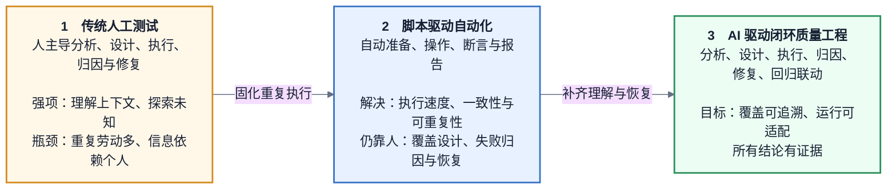
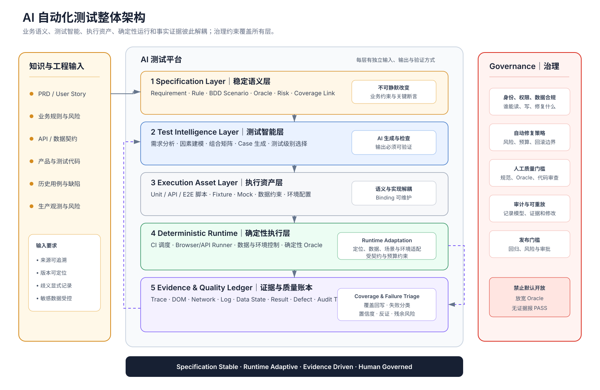
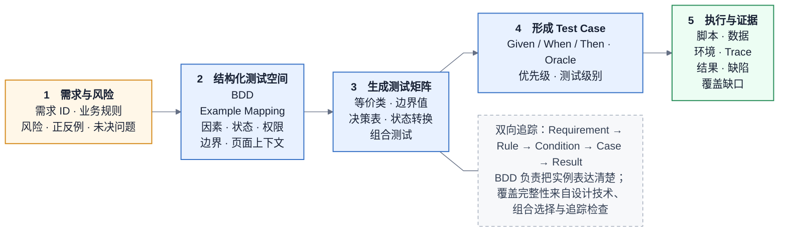
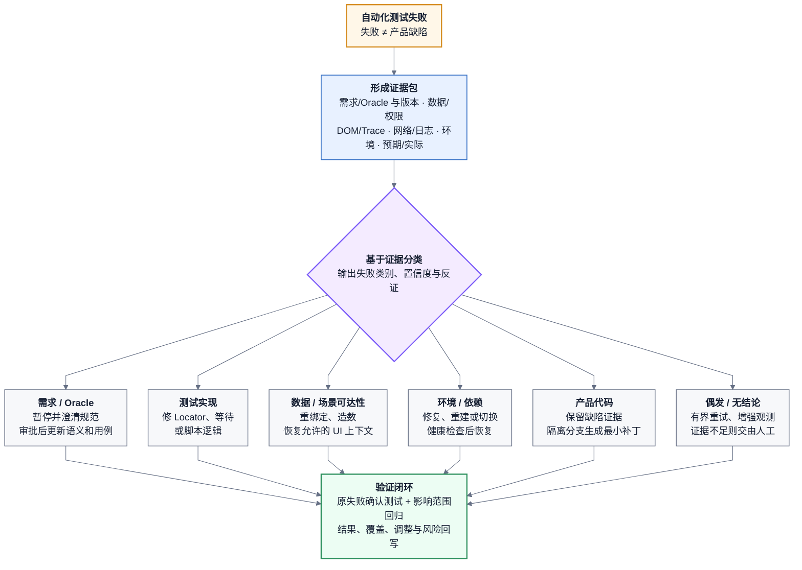
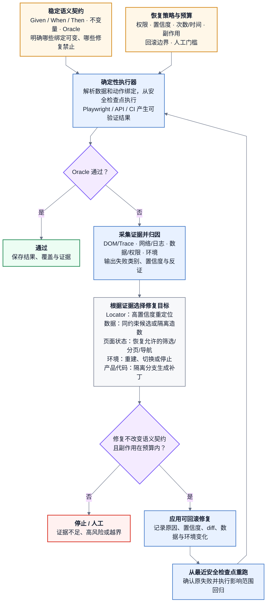
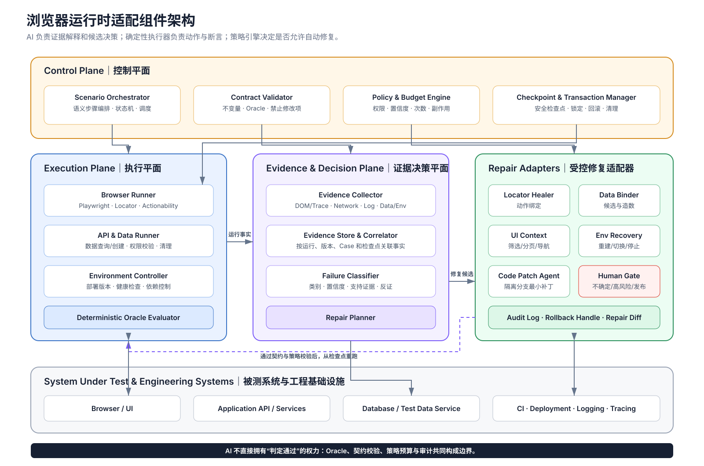

# 从传统测试到 AI 驱动的闭环质量工程

## 自动化如何覆盖测试全流程，以及浏览器运行时适配为何仍是关键缺口

## 概述

传统的自动化测试，我理解主要可以分成四个阶段。

第一阶段是**测试分析**。通常在需求评审和需求澄清阶段就开始做，核心就是明确：这个需求到底有哪些内容需要验证，哪些已有功能会受到影响。也就是说，这一步解决的是**“测什么”**。ISTQB 的标准测试过程本身也明确区分了 Test Analysis、Test Design、Test Implementation 和 Test Execution。

第二阶段是**测试设计**。测试人员把前面分析出来的内容转换成具体 Test Case。一个 Test Case 本质上要说明三件事情：**什么前置条件、执行什么操作、预期得到什么结果。**

这里就出现了我们认为的**第一个核心问题：怎么保证 Test Case 足够完整，能够覆盖需求？**

传统方法通常会建立“需求—测试项”的映射关系，检查每个需求有没有对应的 Test Case；同时把一个需求可能出现的不同场景组织成测试矩阵，再生成对应的 Case。

我们在这里考虑引入 BDD，不是因为 BDD 是测试流程必须采用的方法，而是因为它提供了一种比较清楚的行为规范表达。比如用 Given–When–Then 表示：

> 在什么场景下，执行什么行为，应该得到什么结果。

Cucumber 官方就是把这种形式作为 executable specification 来使用的。

所以我们的想法是：**先用 BDD 把 Test Case 的业务语义结构化，再根据不同场景和操作建立测试矩阵，并建立需求到 Test Case 的映射关系。**

这里需要注意，BDD 本身并不能保证 100% 覆盖，它只是让场景表达更规范。真正保证覆盖的是**需求映射 + 场景矩阵 + 覆盖检查**。

第三阶段是**测试实现**。这个阶段才把 Test Case 转换成真正可以执行的单元测试、集成测试或者端到端测试脚本。

这时候出现第二个，也是我们比较关注的问题：

> **设计出来的测试脚本，真的能够在真实系统里面跑起来吗？**

比如一个 Test Case 是：

> 管理员找到一个用户，然后进入这个用户的详情页。

生成测试脚本以后，它可能会绑定一个具体 UID，例如 `12345`。

但问题在于，UID=12345 即使在数据库里真的存在，也不代表浏览器一定能够找到它。它可能在其他分页里，也可能被筛选条件隐藏了，也可能当前测试账号没有权限看到。

于是就会出现：

> **产品功能是正确的，但是测试脚本依然执行失败。**

第四阶段才是**测试执行和失败分析**。

自动化脚本运行以后，需要收集截图、DOM、网络请求、日志等证据。Playwright 现在已经提供 locator、auto-wait，以及 Trace Viewer，可以查看执行过程中的 DOM snapshot 和网络请求等信息。

如果测试失败，不能直接认为是代码 Bug，而要先判断原因：

> 是脚本的问题？
>  是数据的问题？
>  是环境的问题？
>  还是真正的代码问题？

找到原因以后，再进入对应的修复流程，然后重新执行和回归。

------

在这个传统流程基础上，再来看 **AI 自动化测试**。

AI 的价值其实很好理解：就是把原来每一个阶段大量依赖人工的工作自动化。

也就是：

**AI 分析需求 → AI 生成 Test Case → AI 生成测试脚本 → AI 执行测试 → AI 收集证据 → AI 判断失败原因 → AI 修复 → 再次测试。**

人工不再负责大量重复执行，而主要负责**需求确认、关键 Test Case 审查、高风险修改审查以及最终结果确认**。现在的 Coding Agent 也基本采用类似的治理方式：Agent 可以研究代码、修改代码、执行工作，但最终 diff 和 PR 仍保留人工 Review。

但是，把人工替换成 AI 以后，前面的**两个问题并不会自动消失**。

第一个还是：

> **AI 生成的 Test Case 到底有没有漏测试场景？**

所以我们的第一个思路是：

**用 BDD 规范 Test Case 的表达，再建立需求—场景—Test Case 的测试矩阵，通过覆盖检查尽可能保证完整性。**

第二个还是：

> **AI 生成的测试脚本和测试数据，能不能在真实页面里真正执行？**

现在比较成熟的一类方案叫 **Self-Healing Test，也就是测试自愈**。

例如原来测试脚本要点击某个按钮，但页面更新以后 locator 变了。mabl 和 Tricentis 都已经支持运行时寻找相似元素，然后继续执行测试。

但这里一定要讲清楚：

**传统 Self-Healing 主要解决“元素找不到”，并不能完整解决“测试数据在页面里不可达”。**

比如 UID=12345 数据确实存在，但页面当前看不到它，这不是 locator 自愈能够解决的。

所以我们进一步提出的方向是**浏览器运行时自适应测试**。

AI 在真正执行浏览器验收的时候，根据当前页面的真实状态判断：

> 是不是需要切换筛选条件？
>  是不是需要翻页？
>  当前 UID 是否真的适合这个 Case？
>  如果不适合，能不能重新找到一个满足同样条件的用户？

其实产业界已经有动态测试数据的基础能力。例如 Tricentis 支持按照条件在执行时寻找满足要求的测试数据，而不是把每一个数据都完全写死。

所以我们希望进一步把：

**测试数据管理 + 浏览器真实状态 + AI 决策**

结合起来。

这样 AI 不只是修复 locator，而是能够在浏览器运行时进行**数据重新绑定和场景恢复**。

最后整个方案可以用两句话总结：

> **前半段解决“有没有漏测”：通过需求映射、BDD 场景规范和测试矩阵，提高 Test Case 的覆盖完整性。**

> **后半段解决“能不能跑起来”：通过 AI 的失败归因、自愈测试，以及进一步的浏览器运行时数据适配，让 Test Case 在不改变原始测试目标的情况下能够在真实系统中执行。**

这里最重要的原则是：

> **AI 可以修改“怎么执行”，但是不能为了让测试通过而修改“原本要验证什么”。**

这样整个 AI 自动化测试的逻辑就非常清楚了：**先解决覆盖问题，再解决可执行问题，最后才是失败后的自动修复问题。**

## 0. 先给出结论

自动化测试不等于“让脚本自己执行”。

如果只把人工点击替换成 Playwright、Selenium 或其他脚本，自动化的只是**测试执行中的一部分动作**。需求有没有被完整分析、用例为什么这样设计、一次失败到底是产品缺陷还是脚本/数据/环境问题、失败后修什么以及怎样恢复，仍然需要人逐项判断。

本文所说的完整自动化，是把自动化能力延伸到整条测试闭环：

> **测试分析 → 测试设计 → 测试实现 → 测试执行 → 证据采集 → 失败归因 → 受控修复 → 重测与回归 → 结果与覆盖回写。**

这不意味着把判断权无条件交给 AI。可靠的方向是：

- 以需求、业务规则和预期结果作为稳定的测试语义；
- 用结构化方法建立需求到 Test Case 的可追溯覆盖，而不是用“生成了很多用例”代替覆盖证明；
- 由确定性工具执行动作、断言结果并保留证据；
- 让 AI 基于证据做分析、生成、归因和修复建议，或在明确边界内自动执行修复；
- 任何恢复都不能暗中放宽断言、替换业务规则或把真实缺陷重解释为通过。

**图 1：从人工测试到闭环质量工程**



这条演进路线不是三套互相替代的方法。后一个阶段会保留前一阶段建立的测试原则，只是把更多原本依赖人的活动变成机器可执行、可检查、可追溯的过程。

---

## 1. 先把“测试流程”和“自动化测试”说清楚

### 1.1 主流测试生命周期是什么

[ISTQB CTFL v4.0.1](https://istqb.org/wp-content/uploads/2024/11/ISTQB_CTFL_Syllabus_v4.0.1.pdf) 将测试活动概括为七类：

1. 测试计划；
2. 测试监控与控制；
3. 测试分析；
4. 测试设计；
5. 测试实现；
6. 测试执行；
7. 测试完成。

[ISO/IEC/IEEE 29119-2:2021](https://www.iso.org/standard/79428.html) 也给出了适用于不同软件生命周期模型的通用测试过程。这些标准并没有要求测试必须按瀑布式顺序推进。ISTQB 明确说明，活动会根据上下文迭代、并行或回退；测试监控与控制更是贯穿全过程。

因此，下图是一张工作模型，不是一条只能单向通过的流水线。

**图 2：测试活动闭环**


还要区分“测试活动”和“测试级别”：

- 单元/组件测试关注可隔离的程序单元；
- 组件集成测试关注组件之间的接口和交互；
- 系统测试关注完整系统，包括必要的端到端业务流；
- 系统集成测试关注系统之间或与外部服务的交互；
- 验收测试关注业务目标和交付是否可接受。

这些级别都可以经历分析、设计、实现和执行。**回归测试不是一个额外的测试级别**，而是在变更后重新执行相关测试，以确认既有能力没有被破坏。

### 1.2 为什么“自动执行脚本”只是局部自动化

ISTQB 对测试工具的分类已经覆盖管理、静态测试、测试设计与实现、测试数据生成、执行、覆盖度量、持续集成和报告等活动；它并没有把自动化限定为 UI 脚本执行。自动执行的直接收益包括可重复性、减少机械劳动、更快反馈和更客观的覆盖数据，但风险也包括维护成本、不现实的预期以及对工具结果的过度信任。[ISTQB CTFL v4.0.1](https://istqb.org/wp-content/uploads/2024/11/ISTQB_CTFL_Syllabus_v4.0.1.pdf)

所以本文采用两个不同概念：

- **测试执行自动化**：脚本自动准备、操作、断言和报告；
- **测试流程自动化**：对分析、设计、实现、执行、归因、修复、恢复和治理建立端到端自动化能力。

后者才是本文讨论的目标。

---

## 2. 传统测试如何完成整条流程

为了避免抽象讨论，全文使用同一个需求：

> 管理员能够在“用户管理”页面找到当前组织内、自己有权访问的 Active 用户并打开详情；普通用户不能进入用户管理页面。

一句需求看起来很短，真正的测试工作却从“定义什么叫正确”一直延伸到“用什么证据说明已经测过”。

### 2.1 测试计划：决定为什么测、测到什么程度

测试计划不是排一个执行日历，而是结合上下文决定目标、范围、资源、策略与完成标准。实际需要回答：

- 哪些需求和风险在本轮范围内；
- 哪些测试级别承担哪些验证；
- 哪些部分适合手工探索，哪些适合自动化回归；
- 需要什么账号、权限、数据、环境和外部依赖；
- 什么条件下可以开始、暂停、恢复和结束测试；
- 失败如何上报，结果如何进入发布判断。

对应到示例，团队需要先确认：访问控制应由单元/API/系统测试分别验证到什么深度；真实浏览器验收是否必须走组织筛选、搜索、分页和详情页；测试环境能否创建用户；外部身份服务不可用时如何处理。

主要产物通常包括测试策略、范围与风险清单、资源和环境计划、进入/退出准则、测试级别分工，以及测试与发布门槛。

### 2.2 测试监控与控制：持续比较计划和事实

监控回答“现在发生了什么”，控制回答“需要怎样调整”。它贯穿后续所有活动：

- 需求或代码发生变化，是否要重做影响分析；
- 高风险规则是否已有用例和执行证据；
- 环境阻塞、失败积压和缺陷趋势是否超过阈值；
- 某类用例是否持续 flaky，导致结果失真；
- 计划覆盖与实际覆盖是否出现缺口；
- 是否需要调整优先级、资源、范围或停止条件。

传统模式下，这些信息往往分散在需求文档、测试平台、CI、缺陷系统和人的经验里，测试负责人需要人工汇总才能做决策。

### 2.3 测试分析：从需求中识别“要测什么”

测试分析以需求、设计、接口契约、风险、历史缺陷等测试依据为输入，识别可测试的条件并排序。ISTQB 将它概括为回答“测什么”。

对示例需求，可以先拆出以下测试因素：

| 因素 | 候选取值或状态 | 关联的业务问题 |
|---|---|---|
| 登录状态 | 已登录、未登录、会话过期 | 未认证访问如何处理 |
| 操作者角色 | 管理员、普通用户 | 谁能进入管理页面 |
| 目标用户状态 | Active、Inactive、其他状态 | 哪些对象满足业务规则 |
| 组织归属 | 当前组织、其他组织 | 是否发生越权或数据泄漏 |
| 对象权限 | 可访问、不可访问 | 数据存在是否等于当前人可见 |
| 数据存在性 | 有候选、无候选 | 正常路径和空状态 |
| 列表状态 | 默认筛选、其他筛选 | 数据能否被真实 UI 路径发现 |
| 列表规模 | 首页、后续页、超过上限 | 搜索与分页边界 |
| 并发变化 | 稳定、执行中被禁用/删除 | 状态竞争如何表现 |

这一步先形成测试条件和风险，不急着写脚本。它还会暴露需求歧义，例如：“Active”以服务端状态还是页面展示为准？详情打开后要验证哪些字段？普通用户应该看到 403、跳回首页还是完全不显示入口？

如果这些问题没有解决，脚本即使稳定执行，也只是在稳定地验证一个未经确认的假设。

### 2.4 测试设计：把测试条件变成可执行场景

测试设计回答“怎样测”。主要工作包括：

- 选用适当的测试技术；
- 设计测试用例、前置条件、步骤与预期结果；
- 明确测试数据需求和环境需求；
- 定义覆盖项和覆盖准则；
- 决定断言放在哪个测试级别成本最低、定位最清晰。

例如，权限判断的核心规则应优先在单元或 API 层覆盖；浏览器验收保留少量关键用户旅程，用来证明入口、筛选、列表与详情确实按用户可见行为工作。Selenium 的官方实践也提醒，浏览器测试成本较高；若可以，应通过 API 准备数据，再用浏览器验证用户行为。[Selenium 测试实践](https://www.selenium.dev/documentation/test_practices/overview/)

这里还有一个经常混淆的边界：**测试数据和环境的需求在设计阶段被定义，具体资产则在实现阶段创建和验证。**

### 2.5 测试实现：准备真正能运行的测试件

实现阶段把测试设计转为可执行资产，包括：

- 手工测试规程和探索性测试章程；
- 自动化脚本、公共库、页面对象或领域动作；
- 测试套件、执行顺序和并行策略；
- fixture、种子数据、账号、权限与清理逻辑；
- mock/stub、服务虚拟化与环境配置；
- CI 任务、报告器、日志、截图和 Trace 配置；
- 测试环境的构建、校验与就绪检查。

以示例需求为例，脚本不应长期写死 `UID=12345`，而应表达“需要一个当前组织内、管理员可访问的 Active 用户”，再由数据层在运行时解析具体 UID。测试设计保存约束，实现层保存如何查找、创建、锁定和清理数据。

### 2.6 测试执行：运行、比较、记录，而不是只点按钮

执行阶段至少包括：

1. 按计划选择测试集并准备上下文；
2. 手工或自动执行操作；
3. 把实际结果与预期结果比较；
4. 记录覆盖项、通过/失败、环境和数据版本；
5. 对异常做初步分析并保留可复现证据；
6. 对修复执行确认测试，并按影响范围执行回归。

[Playwright Trace Viewer](https://playwright.dev/docs/next/trace-viewer) 可以记录动作时间线、DOM 快照、网络、控制台和截图，这类证据比一条 `element not found` 更接近可诊断的失败记录。对失败直接无限重跑只会掩盖不稳定性；重跑只能作为有次数限制、能产生新证据的诊断动作。

### 2.7 测试完成：不是“最后一条脚本跑完”

完成阶段要确认测试件、结果和未解决风险都已被妥善处理，例如：

- 汇总计划覆盖与实际覆盖；
- 记录仍未测试或被阻塞的范围；
- 评估未解决缺陷和已接受风险；
- 形成测试完成报告和发布建议；
- 归档可复用的用例、数据、脚本与证据；
- 从本轮故障和低效环节中提取改进项。

因此，传统测试本身就是一个完整的质量闭环。自动化的任务不是删掉这些活动，而是降低每个活动中的重复劳动和信息损耗。

---

## 3. 传统测试真正的问题在哪里

人工测试的价值在于理解上下文、发现未知问题和做复杂判断。问题不在“人不如脚本”，而在于大规模、频繁变更的软件交付会把人的时间消耗在重复操作和跨系统搬运信息上。

| 问题 | 在传统流程中的表现 | 只增加执行脚本是否解决 |
|---|---|---|
| 需求到用例缺少可追溯关系 | 很难回答哪些规则未覆盖 | 否 |
| 用例设计依赖个人经验 | 同类需求覆盖深度不一致 | 否 |
| 条件组合快速膨胀 | 人工枚举容易漏项，也容易生成大量冗余用例 | 否 |
| 数据与环境准备成本高 | 人工造数、找账号、清理状态 | 部分 |
| 回归操作重复 | 版本越快，机械执行越多 | 是，这是脚本的强项 |
| UI 和接口变化导致脚本脆弱 | 定位、时序、依赖不断维护 | 否，脚本本身成为维护对象 |
| 失败结论信息不足 | 日志分散，要靠人复现和排查 | 部分 |
| 失败后的修复对象不明确 | 可能误修脚本、数据或产品代码 | 否 |
| 结果难以进入发布决策 | “通过率”无法说明风险和覆盖 | 否 |

这解释了为什么很多团队拥有大量自动化脚本，仍然需要测试工程师每天处理失败：**执行吞吐提高了，分析、归因和恢复没有同步自动化，失败反而以更高速度产生。**

---

## 4. 从脚本自动执行走向测试流程自动化

传统脚本自动化通常是：

> 选择用例 → 准备环境/数据 → 执行动作 → 断言 → 生成报告。

完整的测试流程自动化则要在前后补齐：

> 解析需求与风险 → 建模测试空间 → 生成和审查用例 → 分配测试级别 → 生成/维护执行资产 → 准备数据与环境 → 执行并采证 → 归因 → 修复或恢复 → 确认测试与回归 → 回写覆盖和经验。

这条链路里有两类稳定性不同的对象：

| 对象 | 示例 | 默认策略 |
|---|---|---|
| 测试语义/契约 | 业务规则、Given/When/Then、Oracle、关键断言、风险等级 | 稳定，变更要有需求依据和审查记录 |
| 执行绑定 | 具体 UID、账号、Locator、分页位置、临时环境、候选导航路径 | 可在满足语义约束时动态选择或修复 |

这一划分至关重要。假如需求只是“打开一个有权访问的 Active 用户”，`UID=12345` 只是一次运行的绑定，可以被合法替换；假如需求明确要求验证某个迁移用户 `UID=12345`，身份本身就是测试语义的一部分，系统便不能擅自换人。

**图 3：AI 自动化测试整体架构**



这张架构图表达的是组件责任而不是执行顺序：稳定语义层保存“要证明什么”，测试智能层帮助构建测试空间，执行资产和确定性运行层负责“怎样执行”，证据账本保存事实并支撑覆盖与失败归因。运行时适配只位于受控执行边界内，治理则贯穿所有层。

---

## 5. 覆盖问题：无法证明穷尽现实，但可以建立可审计保证

ISTQB 的基本原则是：测试能够显示缺陷存在，却不能证明不存在任何缺陷；穷尽测试除极少数简单情况外不可行。[ISTQB CTFL v4.0.1](https://istqb.org/wp-content/uploads/2024/11/ISTQB_CTFL_Syllabus_v4.0.1.pdf)

因此，“覆盖所有需求点”更严谨的工程表达是：

> 对已识别的需求、规则、风险、状态、边界和关键交互建立结构化测试空间；用明确准则选择测试实例；保留从需求到用例、执行和结果的双向追踪；让遗漏、取舍和残余风险都可见、可审查。

**图 4：从需求到证据的覆盖链**



### 5.1 BDD 的价值：把业务语义变成团队可审查的实例

[Cucumber 对 BDD 的定义](https://cucumber.io/docs/bdd/) 包含 discovery、formulation 和 automation 三类实践：团队先通过具体例子理解问题，再把例子写成可读的规范，最后将其连接到自动化执行。[Example Mapping](https://cucumber.io/docs/bdd/example-mapping/) 则用 Story、Rule、Example 和 Question 帮助团队发现规则、例子和未决问题。

Gherkin 的 Given–When–Then 很适合作为一个测试实例的语义骨架：

```gherkin
Feature: 用户管理访问与详情查看

  Rule: 只有管理员可以管理当前组织内的用户

    Scenario: 管理员打开一个可访问的 Active 用户详情
      Given 管理员已经登录当前组织
      And 存在一个该管理员有权访问的 Active 用户
      When 管理员通过用户管理页面打开该用户详情
      Then 页面显示该用户的正确身份与 Active 状态
```

这段规范把上下文、行为和业务结果分开，且没有把偶然的 UID、CSS 选择器或第几页混入业务规则。它比散落在脚本里的步骤更适合产品、研发和测试共同审查。

### 5.2 BDD 是否是构建测试矩阵的主流方法

谨慎的答案是：**BDD 是成熟、广泛采用的协作和可执行规范方法，但它不是单独保证测试矩阵完整性的主流“覆盖算法”。**

原因很直接：Given–When–Then 能把一个例子写清楚，却不会自动证明所有等价类、边界、状态转换、权限组合和风险都已被识别。要构建测试矩阵，需要把 BDD 与经典测试设计技术和可追溯性组合起来：

- 等价类划分：从大量输入中选择具有相同行为的一类代表；
- 边界值分析：验证临界点及其两侧；
- 决策表：覆盖多个业务条件共同决定结果的规则；
- 状态转换测试：覆盖有效/无效转换和状态相关行为；
- 组合测试：在参数过多时覆盖关键的 t-way 交互；
- 风险驱动选择：对高影响、高可能性的空间增加深度；
- 需求追踪：检查每条规则是否至少被适当级别的用例覆盖。

[NIST ACTS](https://csrc.nist.gov/projects/automated-combinatorial-testing-for-software/faqs) 使用 covering array 以有限用例覆盖指定强度的参数交互，解决完全笛卡尔积导致的用例爆炸；[NIST 对组合覆盖度量的研究](https://www.nist.gov/publications/ensuring-reliability-through-combinatorial-coverage-measures) 则说明可以度量输入空间组合覆盖。它们提供的是对**已建模参数空间**的保证，不会替团队发现所有未知业务因素。

因此，本文把推荐方法称为“BDD 驱动的结构化测试空间”：BDD 保持语义清晰，其他测试技术生成或筛选组合，可追溯关系检查遗漏。

### 5.3 怎样实际建立矩阵

可以按以下逻辑工作，但实际活动允许迭代：

1. 为需求建立唯一标识，例如 `REQ-USER-01`；
2. 通过 Example Mapping 提取规则、正反例和问题；
3. 把影响结果的条件变成因素，为每个因素列出等价类、边界和状态；
4. 用决策表表达有业务规则约束的组合；
5. 对有效组合和无效组合分别定义预期；
6. 对参数较多的低风险空间使用 pairwise 或更高强度组合，对关键交互保留全覆盖；
7. 把组合实例写成 Scenario/Scenario Outline；
8. 为每个场景选择最低成本且能提供充分证据的测试级别；
9. 建立 `需求 → 规则 → 测试条件 → 场景 → Test Case → 自动化资产 → 执行结果 → 缺陷` 的追踪；
10. 让工具持续报告未覆盖节点、无断言用例和没有执行证据的“名义覆盖”。

以下是示例需求的一部分审查矩阵：

| Case | 角色 | 组织/权限 | 目标状态 | 页面/数据条件 | 预期 | 主要层级 |
|---|---|---|---|---|---|---|
| C01 | 管理员 | 当前组织、可访问 | Active | 首页可见 | 可打开并显示正确详情 | API + E2E |
| C02 | 普通用户 | 当前组织 | Active | 数据存在 | 管理入口不可用，直接访问被拒绝 | API + E2E |
| C03 | 管理员 | 其他组织 | Active | 数据存在 | 不可见、不可通过直链越权 | API + 安全测试 |
| C04 | 管理员 | 当前组织 | Inactive | Active 筛选 | 不出现在结果中 | API + UI |
| C05 | 管理员 | 当前组织、可访问 | Active | 位于后续页 | 搜索或翻页后可达 | E2E |
| C06 | 管理员 | 当前组织、可访问 | Active | 当前筛选为 Pending | 恢复到满足场景的筛选后可达 | E2E 运行时适配 |
| C07 | 管理员 | 当前组织 | 无匹配对象 | 空列表 | 显示约定空状态 | API + E2E |
| C08 | 未登录 | 任意 | 任意 | 会话缺失 | 进入登录或返回约定认证错误 | API + E2E |
| C09 | 管理员 | 当前组织、可访问 | Active→Inactive | 执行中发生变化 | 按并发规则提示、刷新或拒绝 | API + E2E |

这张表不是完整答案，而是审查载体。团队可以指出缺少的状态和组合，工具则能检查矩阵行是否已经映射到测试资产与最新执行证据。

### 5.4 覆盖率不能只有一个数字

`90% coverage` 如果没有说明覆盖对象，几乎没有决策价值。至少应分别观察：

- 需求/业务规则覆盖；
- 风险覆盖；
- 等价类和边界覆盖；
- 决策规则与状态转换覆盖；
- 组合覆盖强度；
- 代码覆盖；
- 目标环境/浏览器/配置覆盖；
- 已执行覆盖与仅有用例但未执行的名义覆盖；
- 通过、失败、阻塞和无结论分别占多少。

这些指标共同构成可审计的测试保证，仍然不能被解释为“系统已被证明没有缺陷”。

---

## 6. 当脚本跑不通：先归因，再决定修什么

一次自动化测试失败只说明“实际观察与预期执行路径不一致”，不自动等于产品缺陷。ISTQB 的缺陷管理内容也把异常可能性区分为缺陷、误报、变更请求等，并要求记录环境、测试数据、复现步骤、日志、截图和实际/预期结果。[ISTQB CTFL v4.0.1](https://istqb.org/wp-content/uploads/2024/11/ISTQB_CTFL_Syllabus_v4.0.1.pdf)

**图 5：基于证据的失败归因与修复路由**



### 6.1 先形成证据包

浏览器用例失败时，最小证据包应尽可能包含：

- 需求、规则、用例和 Oracle 版本；
- 代码、测试脚本、配置和环境版本；
- 账号角色、租户/组织和权限快照；
- 使用的数据约束、具体绑定和数据状态；
- 每一步动作、Locator 候选、等待和重试记录；
- DOM/可访问性树、截图、视频或 Trace；
- 请求、响应、状态码、控制台和服务日志；
- 预期值、实际值以及比较方式；
- 首次失败与受控重试是否一致。

Playwright 的 locator、actionability 和 Trace 能为动作层提供重要事实：[Locator](https://playwright.dev/docs/locators) 倾向以角色、标签、文本等用户可感知语义定位元素；[auto-wait/actionability](https://playwright.dev/docs/actionability) 会在操作前检查可见、稳定、可接收事件和启用等条件；Trace 则可回看动作前后的 DOM、网络和日志。它们提升稳定性和可诊断性，但不能替代业务层归因。

### 6.2 失败类型决定修复对象

| 失败类别 | 典型证据 | 合理处理 |
|---|---|---|
| 需求/Oracle 问题 | 规范歧义、预期与已批准规则冲突 | 暂停自动修复，回到需求澄清；审批后更新语义和受影响用例 |
| 测试实现问题 | 元素仍表达同一业务意图，但 Locator/等待/脚本逻辑失效 | 修复执行绑定或测试代码，重跑受影响用例 |
| 测试数据问题 | 数据不存在、状态不满足、被占用或污染 | 重新绑定、创建、重置或隔离数据，并记录变更 |
| 场景可达性问题 | 数据存在且合规，但当前筛选、分页、导航或权限上下文不可达 | 恢复允许的 UI 上下文或换取同约束候选 |
| 环境/依赖问题 | 服务不可用、部署不一致、证书/网络/配额异常 | 修复或重建环境；验证健康后从检查点恢复 |
| 产品代码问题 | 前置条件成立、路径正确、确定性 Oracle 仍失败 | 建缺陷；可在隔离分支生成最小补丁，确认测试并做影响回归 |
| 偶发/无结论 | 证据不一致，失败不可稳定复现 | 有界重试、增加观测；不能直接算通过，也不能无限重跑 |

这里**不存在一个适用于所有系统的固定恢复顺序**。正确路由应由当前证据、失败分类置信度、业务风险、允许的副作用和恢复预算共同决定。比如服务明确返回 500 时，先改 Locator 没有意义；页面筛选与目标状态冲突时，先修改产品代码同样没有依据。

### 6.3 重测、回归和恢复是三件事

- **重测/确认测试**：修复后重新验证原失败是否消失；
- **回归测试**：验证修复没有破坏相关既有能力；
- **恢复**：让测试环境、数据、脚本或运行上下文回到可以继续执行的合法状态。

一次修复只有在原问题被确认、影响范围回归通过、所有调整有审计记录后，才构成闭环。仅仅从失败点继续跑到绿色不够。

---

## 7. 当前自动恢复能力已经做到哪一层

### 7.1 执行韧性：成熟，但不是 AI 修复

自动等待、可操作性检查、隔离 Browser Context、fixture、有限重试和 Trace 已是现代浏览器测试的标准工程能力。[Playwright 最佳实践](https://playwright.dev/docs/best-practices) 强调测试用户可见行为、保持测试隔离、控制测试数据，并避免直接依赖不可控第三方系统。

这些机制处理的是短暂时序、状态泄漏和观测不足，不等于系统理解并修复了业务场景。

### 7.2 Locator Self-Healing：已有产品化实践，边界明确

[Tricentis Tosca Self-healing](https://docs.tricentis.com/tosca-2024.2/en-us/content/tbox/selfhealing.htm) 在原控件找不到时，可按已有属性寻找相似控件继续执行，并允许从执行日志应用变更。[mabl auto-heal](https://help.mabl.com/hc/en-us/articles/19078583792404-How-auto-heal-works) 使用历史元素模型；高级策略还会用生成式 AI 判断语义相似度，并在低置信度时失败，而不是强行匹配。

它们说明“同一个业务控件因 DOM、文本或属性变化而重新定位”已经是现实能力。但它们不能证明新控件业务含义一定正确，更不能解决无数据、权限错误或产品结果错误。

### 7.3 动态测试数据管理：成熟基础，可以支持数据重绑定

[Tricentis Test Data Service](https://docs.tricentis.com/tosca-2026.1/en-us/content/standard_subset/test_data/tds_modules.htm) 提供按条件查找并提供数据、创建、更新、移动、删除和锁定等能力。这证明企业测试平台已经能把“需要什么数据”与“这次绑定哪条数据”分开。

但“数据库里找到合法记录”不等于“真实用户从当前浏览器上下文能够看到它”。数据管理是运行时适配的基础，不是完整的场景可达性证明。

### 7.4 AI 参与分析、设计和生成：已进入标准知识体系，但结果必须验证

[ISTQB CT-GenAI](https://istqb.org/istqb-announces-minor-update-to-certified-tester-testing-with-generative-ai-ct-genai/) 已把生成式 AI 在测试生命周期中的使用、风险和输出评估纳入认证体系。其 syllabus 覆盖测试分析、设计、自动化、优先级、缺陷检测、覆盖与监控等活动，同时明确提示幻觉、偏差、隐私和输出验证风险。

所以“AI 进入完整测试过程”不是纯设想；但 LLM 生成的测试条件、脚本或修复仍需由规则检查、编译、静态分析、隔离执行、差分验证或人工审查来验证，不能由模型自行宣布正确。

### 7.5 AI 自动修改产品代码：已经发生，但不等于测试行业的默认闭环

[Meta SapFix 与 Sapienz](https://engineering.fb.com/2018/09/13/developer-tools/finding-and-fixing-software-bugs-automatically-with-sapfix-and-sapienz/) 展示过从自动发现崩溃到生成候选补丁、构建、测试和验证的工程链路，最终补丁仍交给工程师审查。[GitHub Copilot coding agent automations](https://docs.github.com/en/copilot/concepts/agents/cloud-agent/about-automations) 也可以定期检查失败测试、尝试修复并打开 Draft PR；涉及工作流执行时保留审批控制。

因此，AI 进入自动修复闭环已有明确证据。更准确的判断是：

- 它是正在产品化的 agentic software engineering / quality engineering 能力；
- 它还不是经典测试生命周期标准中默认由“测试执行”活动完成的职责；ISTQB 仍把失败检测与调试修复区分开；
- 隔离分支、最小补丁、确认测试、影响回归、代码审查和发布门槛仍然是可靠落地的必要条件。

### 7.6 场景级浏览器运行时恢复：有过产品探索，尚未成为稳定标配

mabl 曾提供 [agentic runtime recovery](https://help.mabl.com/hc/en-us/articles/47421809580948-Agentic-runtime-recovery)：在 auto-heal 之后处理意外弹窗、筛选、分页、重试按钮和刷新等页面状态，成功后把控制权交回确定性执行器；关键路径失败则不恢复。这与本文讨论的 Browser-guided Scenario Recovery 很接近。

但 mabl 又在 [2026-08-03 的公告](https://help.mabl.com/hc/en-us/articles/52134979634580-2026-08-03-Retirement-of-agentic-runtime-recovery) 中退役了该能力，只保留 auto-heal 和对失败运行的分析/编辑能力。这个事实很有说明力：

> 场景级自动恢复不是不存在，而是其可靠性、可控性和产品边界仍在探索，不能写成当前自动化测试的普遍成熟组成部分。

综合现有资料，可以形成如下判断：

| 能力 | 当前工程状态 | 主要边界 |
|---|---|---|
| 确定性脚本执行、隔离、等待、Trace | 成熟基础设施 | 只执行已表达的逻辑 |
| Locator Self-Healing | 已产品化 | 主要修动作绑定，存在误匹配风险 |
| 条件化数据查找/创建/锁定 | 企业产品成熟 | 不保证浏览器路径可达 |
| AI 生成分析、用例和脚本 | 快速普及 | 输入与输出都需验证 |
| AI 失败归因 | 重要且发展中 | 受证据质量与分类置信度制约 |
| 隔离分支中的自动代码修复 | 已有产品和工程实践 | 仍需确认、回归、审查和发布治理 |
| 浏览器场景级运行时恢复 | 新兴、尚未收敛 | 容易越过语义边界或掩盖产品缺陷 |

---

## 8. 浏览器验收中的运行时适配应该怎样设计

下面不是把某个产品功能描述成行业标准，而是基于 BDD 语义、测试数据管理、浏览器 Trace、Locator healing、Coding Agent 修复与现有 runtime recovery 探索，推导出一套可审查的工程设计。

它的目标不是“无论如何把测试跑绿”，而是：

> 在测试语义不变的前提下，自动判断执行为何无法继续；如果存在被策略允许、证据充分且可回滚的恢复动作，就修复执行上下文并继续；否则保留证据并停止。

**图 6：浏览器运行时适配闭环**



### 8.1 先定义稳定的语义契约

每个场景需要保存机器可读的约束：

```yaml
scenario: admin_opens_active_user
invariants:
  actor.role: admin
  target.status: Active
  target.org: actor.current_org
  actor.can_read_target: true
action: open_target_details_through_user_management
oracle:
  page.kind: user_details
  page.user_id: bound_target.user_id
  page.status: Active
mutable_bindings:
  - actor.account
  - target.user_id
  - ui.locators
  - list.filter
  - list.page
forbidden_repairs:
  - weaken_oracle
  - change_target_status_constraint
  - use_cross_org_target
```

这段配置明确三件事：哪些条件必须保持、哪些只是本次运行绑定、哪些修改永远不允许。真正实现时可以采用其他 schema，但必须保留这种边界表达。

### 8.2 语义步骤与浏览器动作解耦

测试用例写“打开满足约束的用户详情”，执行层再将它解析成：

1. 获取满足语义约束的候选用户；
2. 选择或创建有合法权限的执行账号；
3. 进入用户管理页；
4. 校验当前组织与筛选上下文；
5. 通过搜索、过滤或分页到达目标；
6. 打开详情；
7. 用稳定 Oracle 验证身份、状态与页面类型。

这样，具体 UID、Locator 和当前分页可以变化，业务意图不变。页面动作应优先使用 role、label 等面向用户的定位；数据准备可以通过 API 完成，但浏览器验收仍要用真实 UI 行为验证关键路径。[Playwright API Testing](https://playwright.dev/docs/api-testing)

**图 7：浏览器运行时适配组件架构**



组件架构把“一个 AI 自己看页面并不断试”拆成可治理的协作系统：控制平面持有语义契约、策略和检查点；执行平面完成确定性动作和断言；证据决策平面聚合事实、分类并规划候选修复；修复适配器只能在契约和预算允许后改变对应对象。无法证明安全的候选进入 Human Gate，而不是继续盲目尝试。

### 8.3 用证据路由恢复，不预设武断顺序

运行时控制器在每个语义检查点记录状态。失败后先观察，再分类，再选择与分类对应的动作：

- DOM 中存在高置信度语义等价控件：更新 Locator 绑定；
- 目标数据满足约束，但筛选或分页使它不可达：恢复允许的页面状态；
- 当前数据已失效，但具体身份不是测试目标：重新解析满足同一约束的候选；
- 没有候选且策略允许造数：创建隔离 fixture，重新验证权限与可达性；
- 环境健康检查失败：重建/切换环境或停止为环境故障；
- 前置条件与路径均成立但 Oracle 失败：进入产品缺陷路径；
- 证据冲突或置信度不足：停止并请求人工判断。

换数据之前必须重新检查所有不变量；调整筛选之前必须确认筛选值不是本用例要验证的对象；替换 Locator 之前必须确认新元素与原业务动作语义一致。

### 8.4 用恢复预算阻止无限试错

每条执行应设置策略化预算，例如：

- 最大观察/动作轮数；
- 单类恢复的最多次数；
- 总运行时间；
- 允许创建或删除的数据量；
- 允许修改的文件、服务和环境范围；
- 自动代码补丁的风险等级与 diff 大小；
- 最低分类与修复置信度。

预算不是为了节省几秒，而是为了保证系统不会在错误场景中无限探索、污染环境或通过大量重试制造一次偶然的绿色。

### 8.5 一个简化的控制循环

```text
输入：语义契约、执行计划、恢复策略、恢复预算

创建检查点并执行下一语义动作
如果确定性 Oracle 通过：保存证据，继续
如果失败：
    收集 DOM、网络、日志、数据、环境和版本证据
    对失败原因分类，并给出置信度与反证
    如果证据不足或没有被允许的修复：停止并报告“无结论/需人工”
    生成只针对该失败类别的候选修复
    校验候选修复不改变语义契约，且副作用在预算内
    在可回滚边界内应用修复
    从最近的安全检查点重新执行
    对原失败做确认，并对受影响范围做回归
输出：结果、覆盖、证据、所有调整和未解决风险
```

这里的“分类”可以由规则、统计模型和 LLM 共同完成；“通过”应尽量由确定性 Oracle 判断。“反证”要求系统不仅说明为什么像某类故障，也记录哪些事实与该结论冲突，从而降低 AI 过早定性的风险。

### 8.6 用完整案例串起恢复过程

假设执行时绑定 `UID=12345`：它在数据库中是 Active，也属于当前组织。浏览器搜索却找不到。

系统不应立即报产品 Bug，也不应直接随机点击，而应形成证据：

- 数据服务：对象存在，状态为 Active；
- 权限服务：管理员可读；
- 浏览器：当前组织正确，但列表筛选为 Pending；
- 网络：列表请求携带 `status=Pending`；
- DOM：空结果与接口响应一致。

这组证据支持“场景上下文不满足”，而不是 Locator 或产品结果错误。若场景契约允许修改列表筛选，控制器切换到 Active，从检查点重新搜索，找到用户后继续。

如果筛选正确但该用户在执行间隙被禁用，而本用例只要求“任意合法 Active 用户”，系统可重新绑定另一个经权限和状态校验的候选；如果用例专门验证 `UID=12345` 的迁移结果，则不得重绑定，状态变化本身就是失败证据。

如果没有合法候选：

- 策略允许创建测试数据时，创建带唯一运行标识的隔离用户，登记清理责任，再重新走真实浏览器路径；
- 策略不允许或生产影子环境禁止写入时，停止为数据/环境阻塞，不得伪造通过。

如果用户详情成功打开，但页面显示的是另一用户身份，前置条件、动作和数据均已成立而 Oracle 失败，此时才进入产品缺陷路径。AI 可以在隔离分支定位代码并生成最小补丁，但补丁仍要通过原失败确认、相关权限和详情回归、diff 审查与发布门槛。

---

## 9. AI 如何覆盖完整测试闭环

把前面的证据组合起来，可以得到一条面向工程落地的分工：

| 测试环节 | AI/自动化可以做什么 | 必须保留的控制 |
|---|---|---|
| 分析 | 从需求、代码、接口、历史缺陷提取规则、风险、歧义和测试条件 | 来源引用；歧义不得自行补成事实；高风险规则由人确认 |
| 设计 | 建因素模型、决策表、状态图、组合集和 BDD 实例；检查重复与遗漏 | 覆盖准则可解释；Oracle 与需求可追溯 |
| 实现 | 生成 Unit/API/E2E 脚本、fixture、数据查询、mock 和观测配置 | 编译、静态检查、隔离试跑；不得重新定义业务语义 |
| 执行 | 调度测试层、准备上下文、执行动作、确定性断言、采集 Trace | 环境和版本固定；测试隔离；重试有界 |
| 归因 | 聚合多源证据、分类失败、给出置信度和反证 | 不把单一错误字符串当根因；不确定时停止 |
| 修复/恢复 | 修 Locator、重新绑定数据、恢复允许的页面状态、修环境；必要时生成代码补丁 | 修复对象与失败类型一致；契约校验；回滚和预算 |
| 验证 | 确认测试、影响分析、选择回归集、比较修复前后证据 | AI 不能以“最终跑绿”替代影响回归 |
| 完成 | 回写追踪矩阵、覆盖、缺陷、残余风险和改进项 | 报告区分失败、阻塞、无结论，不美化结果 |

人在这条链路中的职责也会变化：从重复操作和日志搬运，转向确认业务规范、定义风险、设计自动修复权限、审查高风险变更和承担发布决策。

---

## 10. 怎样把这套方向逐步落地

下面的顺序不是测试标准规定的唯一顺序，而是根据依赖关系得出的实施建议：上层自动修复的可靠性依赖下层语义、数据和证据基础，因此不宜倒置。

### 第一步：先让测试可追溯、可观测

- 为需求、规则、用例和自动化资产建立稳定 ID；
- 建立需求到结果的双向追踪；
- 统一失败证据包，至少包含版本、数据、环境、DOM/Trace、网络和日志；
- 区分失败、阻塞、跳过和无结论；
- 度量 flaky，不用无限重跑掩盖它。

没有这一步，AI 只能根据碎片化日志猜测。

### 第二步：建立结构化测试空间

- 用 Example Mapping 澄清规则、例子和问题；
- 用因素/取值模型表达状态空间；
- 用决策表、边界、状态转换与组合测试生成矩阵；
- 用 BDD 保存可读语义；
- 对高风险 Oracle 保留人工审查。

这一阶段的成功标准不是用例数量增长，而是遗漏更容易被发现、每条用例的来源和覆盖目的可解释。

### 第三步：把语义与执行绑定分离

- 去除长期写死且非业务必要的 UID、订单号和账号；
- 引入基于约束的数据解析、锁定、创建和清理；
- 把页面动作封装成业务动作，优先使用用户可见 Locator；
- 用 API/fixture 准备状态，用浏览器验证关键用户路径；
- 建立可重复的环境健康检查与检查点。

### 第四步：先自动归因，再开放低风险自愈

- 初期让 AI 只输出分类、证据和建议，与人工结论对比；
- 稳定后开放高置信度 Locator 修复、数据重绑定和可回滚页面状态恢复；
- 持续统计误归因、错误恢复、节省时间和被掩盖缺陷；
- 任何自动调整都进入审计记录，并能重放。

### 第五步：把代码修复接入隔离闭环

- 产品代码只在证据支持产品缺陷时进入修复；
- 每次修复使用隔离分支或沙箱；
- 限制可修改范围和副作用；
- 自动运行原失败、相关单元/API/E2E 和静态检查；
- 产出 Draft PR、证据摘要与残余风险；
- 合并和发布按照风险保留人工门槛。

### 第六步：小范围验证场景级运行时适配

优先选择语义清晰、数据约束可查询、动作副作用低、环境可重置的场景。重点验证的不是“恢复率越高越好”，而是：

- 恢复是否始终保持测试不变量；
- 错误恢复率和漏报率是否可接受；
- 是否能识别“应该停止”的失败；
- 恢复后是否完成确认和影响回归；
- 所有自动改变是否可解释、可回滚、可审计。

---

## 11. 最终要建立的不是“会自愈的脚本”，而是可信的质量系统

从传统测试到自动化测试，真正的变化不是把手工点击换成脚本，而是逐步把测试知识变成结构化、可执行、可验证的系统资产：

- 传统测试建立完整活动、风险判断和缺陷发现方法；
- 脚本自动化提高重复执行的速度和一致性；
- 结构化覆盖把需求、规则、条件、组合和证据连接起来；
- 证据驱动归因决定失败后应该修脚本、数据、环境、场景还是产品；
- AI 可以扩展到分析、设计、实现、归因和修复，但必须被稳定语义、确定性执行、恢复预算和治理边界约束；
- 浏览器运行时场景恢复是值得探索的下一层能力，已有相邻技术与产品试验支持其可行性，但目前仍不应被描述为成熟行业标配。

可以把整套方向收束成四句话：

> **测试语义稳定。** 需求、业务规则和 Oracle 不因一次执行失败而被暗改。  
> **测试覆盖可追溯。** 不声称穷尽现实，但能说明测了什么、为什么测、哪里仍有缺口。  
> **运行过程可适配。** 具体数据、Locator 和允许的页面上下文可在证据支持下受控调整。  
> **所有结论有证据。** 自动修复必须经过确认、回归和审计，无法证明时就诚实地停止。

这才是从“脚本自动跑”走向“测试全流程自动化”的核心。

---

## 参考资料

1. [ISTQB Certified Tester Foundation Level Syllabus v4.0.1](https://istqb.org/wp-content/uploads/2024/11/ISTQB_CTFL_Syllabus_v4.0.1.pdf)
2. [ISO/IEC/IEEE 29119-2:2021 — Test processes](https://www.iso.org/standard/79428.html)
3. [ISO/IEC/IEEE 29119 series overview](https://committee.iso.org/sites/jtc1sc7/home/projects/flagship-standards/isoiecieee-29119-series.html)
4. [Cucumber — Behaviour-Driven Development](https://cucumber.io/docs/bdd/)
5. [Cucumber — Example Mapping](https://cucumber.io/docs/bdd/example-mapping/)
6. [Cucumber — Gherkin Reference](https://cucumber.io/docs/gherkin/reference/)
7. [NIST — Automated Combinatorial Testing for Software FAQ](https://csrc.nist.gov/projects/automated-combinatorial-testing-for-software/faqs)
8. [NIST — Ensuring Reliability through Combinatorial Coverage Measures](https://www.nist.gov/publications/ensuring-reliability-through-combinatorial-coverage-measures)
9. [Selenium — Test Practices Overview](https://www.selenium.dev/documentation/test_practices/overview/)
10. [Playwright — Best Practices](https://playwright.dev/docs/best-practices)
11. [Playwright — Locators](https://playwright.dev/docs/locators)
12. [Playwright — Auto-waiting / Actionability](https://playwright.dev/docs/actionability)
13. [Playwright — Trace Viewer](https://playwright.dev/docs/next/trace-viewer)
14. [Playwright — API Testing](https://playwright.dev/docs/api-testing)
15. [Tricentis Tosca — Self-healing TestCases](https://docs.tricentis.com/tosca-2024.2/en-us/content/tbox/selfhealing.htm)
16. [Tricentis Tosca — Test Data Service Modules](https://docs.tricentis.com/tosca-2026.1/en-us/content/standard_subset/test_data/tds_modules.htm)
17. [mabl — How auto-heal works](https://help.mabl.com/hc/en-us/articles/19078583792404-How-auto-heal-works)
18. [mabl — Agentic runtime recovery](https://help.mabl.com/hc/en-us/articles/47421809580948-Agentic-runtime-recovery)
19. [mabl — Retirement of agentic runtime recovery, 2026-08-03](https://help.mabl.com/hc/en-us/articles/52134979634580-2026-08-03-Retirement-of-agentic-runtime-recovery)
20. [ISTQB — Testing with Generative AI (CT-GenAI)](https://istqb.org/istqb-announces-minor-update-to-certified-tester-testing-with-generative-ai-ct-genai/)
21. [Meta Engineering — Finding and fixing software bugs automatically with SapFix and Sapienz](https://engineering.fb.com/2018/09/13/developer-tools/finding-and-fixing-software-bugs-automatically-with-sapfix-and-sapienz/)
22. [GitHub Docs — About Copilot coding agent automations](https://docs.github.com/en/copilot/concepts/agents/cloud-agent/about-automations)
