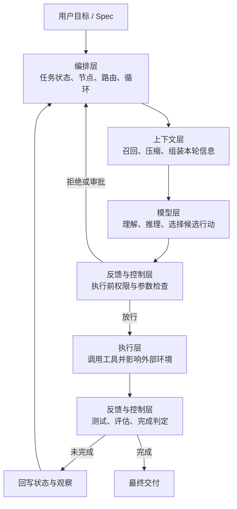

# 02 Agent 五层架构

五层架构是本教程基于多份工程资料归纳出的分析模型，用来把复杂 Agent 拆成模型层、上下文层、执行层、编排层、反馈与控制层。它不是某篇文章或某个框架规定的唯一标准：Anthropic 的 [《Building effective agents》](https://www.anthropic.com/engineering/building-effective-agents) 重点区分 Workflow 与 Agent，LangGraph 的 [《Overview》](https://docs.langchain.com/oss/python/langgraph/overview) 重点描述有状态编排运行时，OpenAI 的 [《Harness engineering》](https://openai.com/index/harness-engineering/) 则强调环境、意图和反馈循环；五层模型把这些相互关联的职责统一到一张工程地图中。

它也不是从上到下只运行一次的调用栈；它的价值在于明确职责、接口和故障归属。

### 【为什么需要分层】

最小 Agent 常被写成：

```text
Agent = Prompt + LLM + Tools
```

这个公式适合解释演示程序，却无法回答生产系统中的关键问题：

- 当前目标、计划和执行进度存在哪里？
- 本轮应该加载哪些历史和外部事实？
- 工具失败后由谁重试，连续失败后如何终止？
- 高风险动作在哪里被拦截？
- 进程中断后如何恢复？
- 怎样区分“工具调用成功”和“业务任务完成”？
- 如何追踪一次任务为何失败？

五层模型把完整 Agent 扩展为：

```text
Agent
= 模型能力
+ 动态上下文
+ 外部执行能力
+ 状态化编排
+ 反馈与控制机制
```

分层的目的不是追求漂亮图形，而是让每个工程问题都有明确归属：模型效果差时，不要本能地只改 Prompt；也可能是检索错了、工具返回含糊、状态丢失或完成条件错误。

### 【五层整体结构】

| 层级 | 核心问题 | 主要职责 | 典型组成 |
| --- | --- | --- | --- |
| 模型层 | 下一步应该做什么？ | 理解、推理、规划、决策、生成 | LLM、推理模型、视觉模型、Embedding、分类模型 |
| 上下文层 | 模型此刻应该知道什么？ | 检索、过滤、压缩、记忆、状态组装 | Prompt、History、RAG、Memory、Spec、规则、代码索引、MCP Resources / Prompts |
| 执行层 | 如何把意图变成真实操作？ | 调用工具、访问环境、返回观察 | Function、API、CLI、MCP Tools、浏览器、数据库、文件系统 |
| 编排层 | 整个任务如何运行？ | 分解、路由、状态机、循环、并行、持久化 | Workflow、Agent Loop、Graph、Scheduler、Subagent |
| 反馈与控制层 | 是否正确、安全，是否继续？ | 验证、审批、重试、回滚、终止、追踪 | Guardrail、Validator、Test、Evaluator、HITL、Tracing |


五层的协作关系更接近下面这张图：



可以用一组拟人化比喻帮助记忆，但设计时仍要回到真实接口：

```text
模型层 = 决策引擎
上下文层 = 动态工作台
执行层 = 手和脚
编排层 = 流程操作系统
反馈与控制层 = 护栏 + 质量检查员
```

### 【模型层：局部决策引擎】

模型层根据当前上下文产生下一步候选行动：

```text
next_action = Model(
    goal,
    current_state,
    observations,
    available_tools,
    constraints
)
```

典型输出包括：

- 对目标或环境的解释；
- 计划或子任务拆分建议；
- 结构化工具调用；
- 路由、分类或评分；
- 面向用户的最终结果。

#### 设计重点

1. **能力匹配**：任务是否需要代码、视觉、长上下文或深推理能力；
2. **结构化能力**：能否稳定生成符合 Schema 的工具参数和输出；
3. **模型路由**：复杂规划与简单分类是否需要不同成本的模型；
4. **随机性控制**：关键动作是否能通过约束、验证和重试降低漂移；
5. **失败可见性**：模型拒绝、超时、格式错误是否会被明确写入状态。

#### 不应承担的职责

模型不应该单独决定权限是否放行、测试是否通过、重试是否无限继续，也不应把自己的文字判断当成环境事实。下面的输出没有完成验证：

```text
“代码看起来没有问题，测试应该可以通过。”
```

只有执行真实测试并读取结果，系统才获得可用证据。

### 【上下文层：动态工作记忆】

上下文层决定模型基于哪一个“现实版本”做判断。它通常包含五类信息：

| 类型 | 内容 | 生命周期 |
| --- | --- | --- |
| 静态指令 | System Prompt、安全策略、工具说明 | 多轮稳定 |
| 项目规则 | `AGENTS.md`、架构约定、目录规范 | 项目或作用域稳定 |
| 任务状态 | 目标、计划、完成步骤、失败计数、待审批动作 | 每轮变化 |
| 短期记忆 | 最近观察、临时假设、中间结果 | 当前任务 |
| 长期记忆与检索 | 用户偏好、历史决策、知识库、代码、数据库 | 按需召回 |

上下文工程的关键不是“把资料都找出来”，而是完成一个受预算约束的选择问题：

```text
在有限 Token 下，选择最能提高本轮正确率的信息集合。
```

#### 从上下文膨胀到 Memory 与 Skills

上下文层之所以包含 Memory，不是因为“记忆”听起来像一种独立能力，而是因为长任务必然遇到信息生命周期问题。ReAct 每循环一次，都会增加新的工具结果、中间判断和错误日志；Context Engineering 可以筛选和压缩当前窗口，却不能保证所有历史在会话重建后仍然存在。因此，长期规则、偏好和项目知识需要外置到 `CLAUDE.md`、`AGENTS.md`、auto memory 或其他持久存储，并在需要时重新装配。

但外置保存并不意味着全部常驻。OpenAI 的 [《Harness engineering: leveraging Codex in an agent-first world》](https://openai.com/index/harness-engineering/) 指出，巨型 `AGENTS.md` 会挤占任务、代码和相关文档的上下文空间；OpenAI 的 Codex 文档 [《Build skills》](https://learn.chatgpt.com/docs/build-skills) 因此采用 Progressive Disclosure，只在启动时暴露 Skill 摘要，命中任务后才读取完整指令。

这形成了一条递进关系：

```text
历史不断增长
→ 当前窗口无法永久保存全部信息
→ 用 Memory / 规则文件外置稳定知识
→ 常驻规则过多又挤占上下文
→ 用 Skills、路径规则和检索按需加载
```

所以，Memory 解决“关键知识不能丢”，Skills 解决“特定知识不必一直在场”；两者最终都服务于上下文层的核心目标：为当前步骤提供足够且相关的信息。

#### 五种容易混淆的持久化对象

“被保存下来”不代表它们属于同一种 Memory。LangGraph 的 [《Persistence》](https://docs.langchain.com/oss/python/langgraph/persistence) 明确区分两套机制：Checkpointer 保存单个 Thread 的图状态，用于会话连续性、Human-in-the-loop、故障恢复和时间旅行；Store 保存图状态之外的应用数据，用于跨 Thread 的用户偏好、事实和共享知识。再加上规则文件与大型产物，Agent 至少需要区分五种对象：

| 对象 | 作用域与生命周期 | 解决的问题 | 不应被当成 |
| --- | --- | --- | --- |
| 当前 Messages / 对话历史 | 当前 Context Window，可能被裁剪或压缩 | 保持最近几轮语义连续 | 长期可靠记忆 |
| Checkpoint / Thread State | 单个任务或 Thread，可持久化和恢复 | 保存阶段、计划、重试、审批和节点状态 | 跨任务知识库 |
| Long-term Store / Memory | 跨 Thread、跨会话，按用户或项目组织 | 保存偏好、事实、历史决策和共享知识 | 当前任务的流程状态 |
| `AGENTS.md` / `CLAUDE.md` | 启动或作用域命中时注入 | 提供项目规则、工作约定和知识入口 | 权限系统或完成进度 |
| Artifact Store | 通常独立于消息与图状态 | 保存完整日志、Diff、报告、截图和测试产物 | 应整段常驻上下文的消息 |

它们可以互相引用，但不能互相替代。例如 Checkpoint 中可以保存 `test_log_uri`，真正的完整测试日志放在 Artifact Store；Long-term Store 可以保存“用户偏好 pnpm”，但当前任务已经失败几次仍应记录在 Thread State；规则文件可以声明“提交前运行测试”，但不能替代测试结果本身。

#### 设计重点

- 静态规则与动态事实分开；
- 原始证据与模型总结分开；
- 当前任务状态始终可追踪；
- 大型工具结果存入外部文件或对象存储，只保留摘要和引用；
- 过期信息能够失效或被新事实覆盖；
- 压缩时保留目标、约束、关键决策、未解决问题和证据定位。

#### 常见故障

上下文层故障常被误判为“模型不聪明”：

- 召回了名称相似但无关的文档；
- 丢失了用户后来补充的约束；
- 重复注入同一大段日志；
- 只给需求，没有给当前代码和测试；
- 摘要把“不确定假设”写成了“已确认事实”；
- 工具描述太多且功能重叠，模型无法选对。

### 【执行层：外部行动能力】

执行层把模型的结构化意图转化为真实系统操作：

```json
{
  "tool": "run_tests",
  "arguments": {
    "target": "tests/auth/test_masking.py"
  }
}
```

执行后返回标准化观察：

```json
{
  "ok": false,
  "exit_code": 1,
  "failed": 2,
  "artifact_uri": "runs/42/test-output.txt",
  "error_type": "assertion_failure"
}
```

#### Tool、Function、CLI 与 MCP

```text
Tool：面向模型的能力契约
  ├── Function：进程内函数实现
  ├── API：远端服务实现
  ├── Script / CLI：操作系统级实现
  ├── Browser Operation：界面操作实现
  └── MCP Tool：通过标准协议接入的能力
```

MCP 不等于“一个更强的 Tool”。Model Context Protocol 的 [《What is MCP?》](https://modelcontextprotocol.io/docs/getting-started/intro) 把它定义为连接 AI 应用与外部系统的开放标准，Server 的基础原语包括 Tools、Resources 和 Prompts；具体能力是否安全、是否高质量，仍取决于实现与控制策略。因此，MCP 是跨层接入协议：Tools 主要进入执行层，Resources 和 Prompts 主要成为上下文层的信息来源，Host 中的权限与路由还可能涉及控制和编排。

#### 设计重点

每个工具至少应定义名称、用途、输入输出 Schema、权限、风险、副作用、超时、幂等性、错误分类和重试策略。工具输出应保留真实退出码、资源标识和错误类型，不要只返回模糊的自然语言“执行失败”。

#### 风险边界

读取文件和查询数据库通常是低风险动作；写文件、发消息、修改工单属于有副作用动作；删除数据、转账、生产发布通常是高风险动作。风险等级应该影响沙箱、参数校验、审批、审计和补偿策略，而不能只写在 Prompt 中希望模型自觉遵守。

### 【编排层：流程操作系统】

到这里，系统已经具备了三类基础能力：模型可以判断，上下文层可以找回规则和事实，执行层可以改变外部环境。但这些能力仍然不能自动保证复杂任务完成——知道“应该遵守什么”和拥有“可以调用什么”，不等于知道整个任务当前处于哪个阶段、下一阶段依赖什么、失败后回到哪里，以及何时可以结束。

这正是为什么在记忆能力和执行能力之后还需要编排层。编排层把一连串局部合理的模型—工具循环放进显式任务生命周期中，防止 Agent 反复探索、跳过前置条件或把“产生了输出”误判为“完成了目标”。

编排层负责回答：

> 谁在什么时候，基于什么状态，调用哪个模型、工具或子 Agent；成功和失败分别去哪里；何时暂停、恢复和结束？

它通常承担：

- 任务分解和依赖管理；
- 状态读写和版本控制；
- 顺序、条件、循环与并行；
- 子 Agent 调度或 handoff；
- Checkpoint、持久化和中断恢复；
- 超时、重试、熔断和终止；
- 流式事件和任务生命周期。

#### Workflow 与 Agent Loop

这里沿用 Anthropic 在 [《Building effective agents》](https://www.anthropic.com/engineering/building-effective-agents) 中定义的概念边界：Workflow 通过预定义代码路径编排模型和工具，Agent 则由模型动态指导过程和工具使用；本教程增加“混合编排”一行，用于描述生产系统常见的组合方式。

| 模式 | 谁决定路径 | 优点 | 风险 |
| --- | --- | --- | --- |
| 确定性 Workflow | 代码预先定义 | 稳定、可审计、易设门禁 | 对未知情况适应性弱 |
| 模型驱动 Agent Loop | 模型根据观察动态选择 | 灵活、可探索、能调整计划 | 易循环、成本不稳定、行为难预测 |
| 混合编排 | 代码控制阶段，模型控制局部 | 平衡稳定性与灵活性 | 状态和边界设计更重要 |

典型混合流程是：

```text
理解需求（固定）
→ 探索信息（Agent Loop）
→ 方案审批（固定门禁）
→ 实施修改（Agent Loop）
→ 自动测试（固定）
→ 失败诊断（Agent Loop）
→ 发布审批（固定门禁）
```

#### 多 Agent 的判断标准

Claude Code 的 [《Create custom subagents》](https://code.claude.com/docs/en/sub-agents) 把 Subagent 的主要用途描述为隔离高输出操作、执行独立并行研究以及施加专用工具权限；Anthropic 的 [《How we built our multi-agent research system》](https://www.anthropic.com/engineering/multi-agent-research-system) 则采用 orchestrator-worker 模式，由 Lead Agent 协调并行的专业 Subagents。

只有满足以下至少一项时，多 Agent 才通常值得引入：

- 子任务可以独立并行，合并成本低；
- 子任务需要不同工具、权限或专业指令；
- 大量中间信息需要与主上下文隔离；
- 需要一个独立视角做评审或对抗性验证。

如果任务不能清晰切分，多 Agent 只会增加调用、上下文传递、冲突解决和停止判断的成本。

#### Subagent Contract

多 Agent 不是“多调用几次模型”，而是把子任务交给不同的执行上下文。每次委派都应有显式 Contract，否则主 Agent 很难判断结果能否合并，也无法阻止重复探索和权限扩散。

| 契约字段 | 必须回答的问题 |
| --- | --- |
| Goal / Scope | 子 Agent 要解决什么，明确不处理什么？ |
| Input Context | 可以看到哪些事实、规则、文件和上游产物？哪些信息必须隔离？ |
| Tools / Permissions | 可以调用哪些工具、访问哪些路径，是否允许产生副作用？ |
| Output Schema / Evidence | 返回结论、摘要还是结构化对象？必须附带哪些证据引用？ |
| Ownership / Merge | 谁拥有修改权，谁负责把结果写入主 State 或最终产物？ |
| Conflict / Authority | 多个结果冲突时由谁裁决，哪个 Agent 或 Human 拥有最终决策权？ |
| Budget / Termination | 最大步骤、Token、时间和重试是多少，何时主动停止或升级？ |

上下文隔离并不意味着信息随意丢失。可靠做法是让子 Agent 保留重型探索过程，只把契约要求的结论、证据定位、未解决问题和置信边界返回主 Agent。

### 【反馈与控制层：闭环与治理】

反馈与控制层横跨执行前和执行后。Anthropic 的 [《Demystifying evals for AI agents》](https://www.anthropic.com/engineering/demystifying-evals-for-ai-agents) 强调要区分运行轨迹（transcript）和环境最终状态（outcome），并组合代码、模型与人工 Grader；LangChain 的 [《Human-in-the-loop》](https://docs.langchain.com/oss/python/langchain/human-in-the-loop) 则展示了如何在敏感工具调用前保存状态并等待批准、编辑或拒绝。

#### 执行前控制

OpenAI 的 Codex 文档 [《Sandboxing》](https://learn.chatgpt.com/docs/sandboxing) 与 [《Agent approvals & security》](https://learn.chatgpt.com/docs/agent-approvals-security) 说明，Sandbox 和 Approval 解决的是两个不同问题：Sandbox 定义 Agent 在技术上能够访问哪些目录、网络或系统能力；Approval 决定 Agent 试图跨越边界或执行高风险动作时，何时必须暂停并请求用户许可。两者应组合使用，不能把“需要审批”误当成已经具备隔离能力。

- 输入是否合法；
- 工具是否允许调用；
- 参数是否越权或触及敏感资源；
- 操作是否需要人工审批；
- 当前成本、步数和时间预算是否足够。

#### 执行后控制

- 工具是否技术成功；
- 环境是否发生预期变化；
- 测试与业务验收是否通过；
- 是否需要重试、回滚、重规划或人工介入；
- 全局目标是否已经完成。

#### 不同控制机制的边界

| 机制 | 回答的问题 | 示例 |
| --- | --- | --- |
| Guardrail | 能不能做？ | 禁止访问凭据目录 |
| Validator | 结构是否合法？ | JSON Schema 校验 |
| Test | 确定性行为是否正确？ | 单元测试、Playwright |
| Evaluator | 非确定性质量如何？ | 回答完整度、风险覆盖度 |
| Human Approval | 高风险决策是否获准？ | 是否发布到生产 |
| Tracing | 过程为何如此运行？ | 模型、工具、状态和路由轨迹 |

没有进入控制逻辑的反馈只是日志。例如测试失败后，如果编排层仍然直接走向 `END`，系统仍然不是闭环。

### 【三种流共同驱动五层】

五层之间同时存在数据流、控制流和反馈流。

#### 数据流

描述事实怎样移动：

```text
外部环境
→ 工具观察
→ 上下文过滤与压缩
→ 模型读取
→ 新行动意图
→ 外部环境
```

#### 控制流

描述任务怎样推进：

```text
编排层
→ 选择节点
→ 调用模型或工具
→ 触发验证
→ 选择下一节点或结束
```

#### 反馈流

描述系统怎样纠偏：

```text
测试 / 规则 / 人工意见 / 运行指标
→ 反馈与控制层
→ 更新任务状态
→ 重新编排
→ 重组上下文
```

三种流不能混成一个 Prompt。数据需要可追溯，控制需要确定状态，反馈需要影响后续路由。

### 【五层与思想演化的对应关系】

| 演化概念 | 主要落点 | 说明 |
| --- | --- | --- |
| Prompt Engineering | 上下文层 | 构造指令和输出约束 |
| Context Engineering | 上下文层 | 管理全部可见 Token 与动态状态 |
| Tool Calling | 执行层及其接口 | 把结构化行动意图交给真实执行器 |
| MCP | 上下文层与执行层之间 | Tools 接入行动能力，Resources 和 Prompts 接入上下文信息 |
| ReAct | 模型层、执行层、上下文层之间 | 形成局部“决策—行动—观察”循环 |
| Memory / 规则文件 | 上下文层 | 跨轮、跨会话找回稳定规则、偏好和项目知识 |
| Skills / Progressive Disclosure | 上下文层与编排层 | 按任务装载方法，并把可复用流程交给路由或编排机制 |
| Workflow / State | 编排层 | 管理全局阶段、依赖、循环和恢复 |
| Test / Eval / Approval | 反馈与控制层 | 提供完成证据与安全治理 |
| Harness Engineering | 包裹并连接五层 | 把能力组装为可长期运行的系统 |

这张表也解释了为什么 Harness 不是第六层：它是一种总装视角，覆盖五层的连接方式和运行环境。这里的“五层”是职责分层，而 Agent Loop、Runtime、Harness 是另一组运行与装配概念；三者的统一口径见 [《Agent System 研发知识梳理》](./agent_development_two_contexts_2026.md)，不要把两套抽象强行做一一对应。

### 【常见架构误区】

| 误区 | 为什么不可靠 | 更合适的理解 |
| --- | --- | --- |
| LLM 就是 Agent | 模型只产生输出，不负责真实状态和执行 | 模型是 Agent 的决策内核 |
| Prompt 等于 Context | Prompt 只是一类上下文 | Context 还包括历史、状态、工具、检索和观察 |
| 接入 Tool 就完成 Agent | Tool 不管理路由、验证和停止 | Tool 只是执行层能力单元 |
| 五层依次只跑一遍 | Agent 会多轮循环并在层间反复流动 | 五层是长期协作的职责域 |
| 模型自己规划即可 | 模型可能跳步骤、无限重试或过早结束 | 关键门禁和完成条件写进编排与控制层 |
| 多 Agent 一定更强 | 分工和合并会产生额外成本 | 仅在隔离、专业化或并行收益明确时使用 |
| 模型自评等于验证 | 自评仍是概率性输出 | 优先使用真实执行、测试和规则证据 |

### 【用五层评审一个 Agent】

评审设计时，可以逐层询问：

1. **模型层**：模型为什么适合这项决策？输出是否结构化？
2. **上下文层**：本轮事实从哪里来？怎样防止过期、重复和污染？
3. **执行层**：工具契约、权限、副作用和错误是否明确？
4. **编排层**：State、节点、失败路径、Checkpoint 和停止条件是什么？
5. **反馈与控制层**：什么证据证明正确？高风险动作如何审批？
6. **Harness 总装**：这些部分能否被追踪、恢复、测试、配置和复用？

如果其中某层只能回答“模型会自己处理”，通常说明职责还没有真正工程化。

### 【本章结论】

五层架构的核心不是数量“五”，而是把概率性决策、信息供给、真实执行、流程推进和质量治理分开。分层之后，系统才可能为每类失败建立独立的接口、测试和改进路径。

下一章会沿着一次完整任务，把五层串成状态驱动的双循环工作流。

### 【本章引用证据】

| 主题 | 引用文献 | 与五层模型的关系 |
| --- | --- | --- |
| Workflow 与 Agent | [Anthropic《Building effective agents》](https://www.anthropic.com/engineering/building-effective-agents) | 支撑确定性流程与模型动态决策的区分 |
| Context | [Anthropic《Effective context engineering for AI agents》](https://www.anthropic.com/engineering/effective-context-engineering-for-ai-agents) | 支撑上下文层的有限 Token、动态装配和压缩职责 |
| Memory 与 Skills | [Claude Code《Memory》](https://code.claude.com/docs/en/memory)、[OpenAI《Harness engineering》](https://openai.com/index/harness-engineering/)、[OpenAI《Build skills》](https://learn.chatgpt.com/docs/build-skills) | 支撑跨会话知识外置、规则文件限长和任务知识按需加载 |
| Checkpointer 与 Store | [LangGraph《Persistence》](https://docs.langchain.com/oss/python/langgraph/persistence) | 支撑 Thread 状态恢复与跨 Thread 长期知识的边界 |
| MCP 跨层接入 | [MCP《What is MCP?》](https://modelcontextprotocol.io/docs/getting-started/intro) | 支撑 Tools、Resources、Prompts 分别进入执行与上下文职责 |
| 编排运行时 | [LangGraph《Overview》](https://docs.langchain.com/oss/python/langgraph/overview) | 支撑 State、持久化、Interrupt 与 Durable Execution |
| Human-in-the-loop | [LangChain《Human-in-the-loop》](https://docs.langchain.com/oss/python/langchain/human-in-the-loop) | 支撑执行前审批、中断与恢复 |
| Sandbox 与 Approval | [OpenAI《Sandboxing》](https://learn.chatgpt.com/docs/sandboxing)、[OpenAI《Agent approvals & security》](https://learn.chatgpt.com/docs/agent-approvals-security) | 支撑技术隔离边界与越界授权机制的区分 |
| 多 Agent | [Claude Code《Subagents》](https://code.claude.com/docs/en/sub-agents)、[Anthropic《Multi-agent research system》](https://www.anthropic.com/engineering/multi-agent-research-system) | 支撑上下文隔离、专业化与可并行任务委派 |
| Agent Evals | [Anthropic《Demystifying evals for AI agents》](https://www.anthropic.com/engineering/demystifying-evals-for-ai-agents) | 支撑 Test、Evaluator、人工评审及 Outcome 验证的分工 |
| Harness 总装 | [OpenAI《Harness engineering》](https://openai.com/index/harness-engineering/) | 支撑环境、意图和反馈循环的整体工程视角 |
