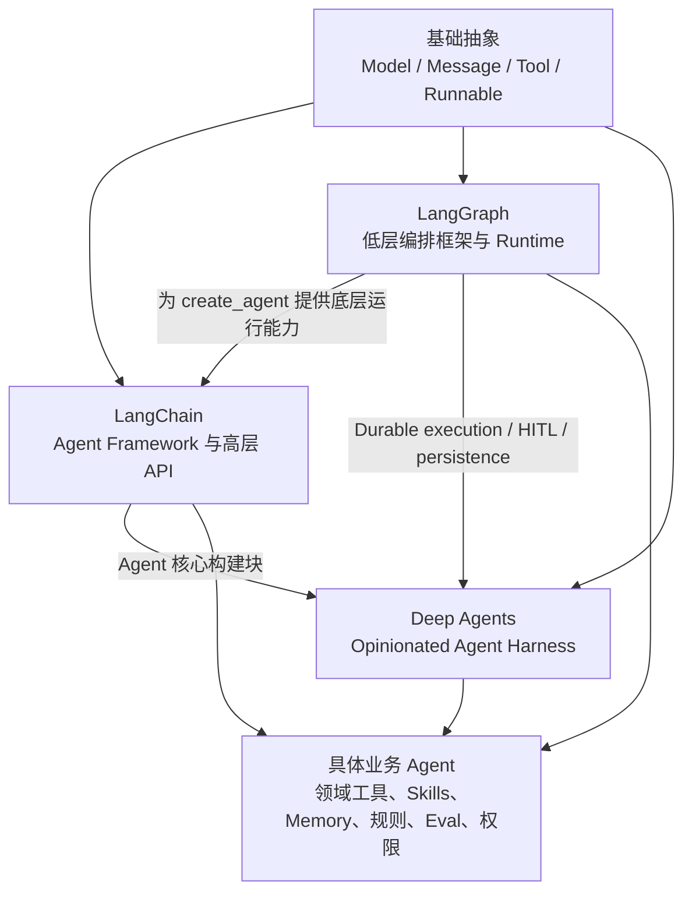

# 04 从 LangChain、LangGraph 到 Deep Agents

这一章不把三个项目理解为简单的“低级—中级—高级框架”，而是先区分组件、Framework、Runtime、Harness 和业务产品，再分析它们分别封装了 Agent 五层中的哪些能力。框架定位和 API 以 2026-07-13 的官方文档为基线；Framework、Runtime、Harness 的区分直接采用 LangChain 的 [《Frameworks, runtimes, and harnesses》](https://docs.langchain.com/oss/python/concepts/products)，而不是教程自行赋予三个产品的营销标签。

### 【先区分五种抽象层】

| 抽象层 | 解决的问题 | 常见内容 |
| --- | --- | --- |
| 基础组件 | 如何统一表达模型、消息、工具和数据流 | Model、Message、Tool、Prompt、Runnable |
| Agent Framework | 如何快速构建常见模型—工具循环 | Agent API、Middleware、Memory 接口、集成 |
| Orchestration Runtime | 长时间、有状态任务如何可靠运行 | State、Graph、Checkpoint、Interrupt、Persistence |
| Agent Harness | 如何为复杂自主任务预装工作环境 | Planning、Filesystem、Skills、Subagents、Context Management |
| 业务 Agent | 如何在特定领域完成可验收目标 | 领域 Tools、规则、数据、权限、Eval、SLA、运营 |

它们不是互斥产品类型。同一个项目可能同时提供多个层级的能力；同一个业务 Agent 也可以跳过某一层，直接在 Runtime 上定制。

最重要的判断是：

```text
框架提供通用机制，
业务必须提供目标、语义、权限和完成标准。
```

### 【LangChain 不只是线性 Chain】

早期 LangChain 最有代表性的心智模型是顺序管道：

```text
Prompt → LLM → Output Parser
```

或：

```text
检索 → 拼接上下文 → 模型 → 解析结果
```

因此容易形成“LangChain 只能实现线性 Chain”的印象。这个结论并不准确。

#### Runnable / LCEL 的能力边界

Runnable 抽象可以表达：

- `RunnableSequence`：顺序；
- `RunnableParallel`：并行；
- `RunnableBranch`：条件分支；
- `RunnableLambda`：自定义逻辑。

这些类型均可在 LangChain Reference 的 [《Runnables》](https://reference.langchain.com/python/langchain_core/runnables/) 中核对。

它适合可组合的数据处理管道，即输入经过一系列转换得到输出。虽然可以有分支和并行，但当问题转向长期状态、任意循环、持久化、中断恢复和多节点反复跳转时，直接用数据管道表达会越来越别扭。

#### `create_agent` 是动态 Agent Loop

当前 LangChain 的 `create_agent` 会构建基于 LangGraph 的图式 Agent Runtime。LangChain 的 [《Agents》](https://docs.langchain.com/oss/python/langchain/agents) 明确说明，Agent 会让模型在循环中调用工具，直到模型给出最终输出或达到迭代限制。模型可以循环选择工具：

```text
START
  ↓
Model
  ├── tool calls → Tools → Model
  └── final output → END
```

一个最小示例是：

```python
from langchain.agents import create_agent
from langchain.tools import tool


@tool
def get_issue(issue_id: str) -> str:
    """读取缺陷工单；只读，不修改工单状态。"""
    return "..."


@tool
def search_code(query: str) -> str:
    """在授权仓库中搜索代码并返回文件位置。"""
    return "..."


agent = create_agent(
    model="provider:model-name",
    tools=[get_issue, search_code],
    system_prompt=(
        "你是缺陷分析助手。先读取工单，再基于仓库事实定位问题；"
        "证据不足时继续使用只读工具，不要编造代码。"
    ),
)

result = agent.invoke({
    "messages": [
        {"role": "user", "content": "分析缺陷 BUG-42 的可能原因"}
    ]
})
```

这已经不是固定的线性 Chain。模型可以根据每次工具观察动态决定下一步。

#### LangChain 主要替你提供什么

- 模型、消息和 Tool 的统一接口；
- 常见 Agent Loop；
- Middleware、结构化输出与上下文扩展机制；
- 短期和长期 Memory 接口；
- 大量模型和外部系统集成；
- LangGraph Runtime 之上的高层使用方式。

如果需求只是“模型根据用户问题选择少量工具并返回答案”，LangChain 往往已经足够。

### 【LangGraph 提供低层编排和运行时】

LangGraph 的 [《Overview》](https://docs.langchain.com/oss/python/langgraph/overview) 将其定位为面向长时间、有状态 Agent 的低层编排框架与 Runtime，并明确强调它聚焦编排，不抽象 Prompt 或规定 Agent 架构。它提供：

- 显式 `State`；
- `Node` 与 `Edge`；
- 条件路由、循环和并行；
- Checkpoint 与持久化；
- Durable Execution；
- Streaming；
- `interrupt` 与 Human-in-the-loop；
- 失败后的恢复执行。

LangGraph 既能实现固定 Workflow，也能把一个 Agent Loop 放在某个节点中。

#### 状态图骨架

下面用代码展示“测试失败后回到诊断和实施”的显式循环：

```python
from typing import Literal
from typing_extensions import TypedDict
from langgraph.graph import StateGraph, START, END


class DefectState(TypedDict, total=False):
    issue_id: str
    spec: dict
    plan: list[str]
    diff: str
    test_passed: bool
    retry_count: int
    final_report: str


def understand(state: DefectState) -> dict:
    return {"spec": {"goal": "...", "acceptance": ["..."]}}


def explore(state: DefectState) -> dict:
    return {"plan": ["定位", "修改", "测试"]}


def implement(state: DefectState) -> dict:
    return {"diff": "..."}


def test(state: DefectState) -> dict:
    passed = run_real_tests()
    return {"test_passed": passed}


def diagnose(state: DefectState) -> dict:
    return {"retry_count": state.get("retry_count", 0) + 1}


def review(state: DefectState) -> dict:
    return {"final_report": "变更与验证证据..."}


def route_after_test(
    state: DefectState,
) -> Literal["diagnose", "review"]:
    return "review" if state["test_passed"] else "diagnose"


builder = StateGraph(DefectState)
builder.add_node("understand", understand)
builder.add_node("explore", explore)
builder.add_node("implement", implement)
builder.add_node("test", test)
builder.add_node("diagnose", diagnose)
builder.add_node("review", review)

builder.add_edge(START, "understand")
builder.add_edge("understand", "explore")
builder.add_edge("explore", "implement")
builder.add_edge("implement", "test")
builder.add_conditional_edges("test", route_after_test)
builder.add_edge("diagnose", "implement")
builder.add_edge("review", END)

graph = builder.compile()
```

这是教学骨架，真实系统还要加入 Checkpointer、最大重试、审批、异常分类和幂等控制。它的价值不在于代码比 `create_agent` 少，而在于每个状态迁移和失败路径都可显式控制。

#### 何时直接使用 LangGraph

- 需要明确的业务状态和多阶段流程；
- 需要在确定性节点与 Agent 节点之间混合编排；
- 需要循环、并行、持久化、中断和恢复；
- 需要精细控制每个节点可调用的工具和上下文；
- 需要流程级 SLA、审计和错误处理。

如果你只是想让模型调用两三个工具，直接从 LangGraph 开始可能增加不必要的状态设计成本。

### 【Deep Agents 是预装能力的 Agent Harness】

Deep Agents 的 [《Overview》](https://docs.langchain.com/oss/python/deepagents/overview) 将其定义为 Agent Harness：它是独立库，使用 LangChain 的 Agent 核心构建块，并使用 LangGraph Runtime 获得持久化执行、流式输出、Human-in-the-loop 等能力。在通用 Tool Calling Loop 之上，它预装了更适合复杂长任务的能力：

| 能力 | 解决的问题 |
| --- | --- |
| Planning / `write_todos` | 大任务分解、进度追踪和动态调整 |
| Virtual Filesystem | 保存中间产物，把大结果从消息上下文卸载到文件 |
| Context Summarization / Offloading | 长任务超过单个上下文窗口时保持连续性 |
| Skills | 按需加载领域流程、知识、脚本和模板 |
| Memory | 跨会话保留稳定规则、偏好和项目知识 |
| Subagents | 隔离重型子任务、专业化或并行处理 |
| Sandbox / Execution | 在隔离环境运行代码、测试和命令 |
| Permissions / HITL | 限制文件访问，并在敏感工具前暂停审批 |

最小创建方式仍然很简单：

```python
from deepagents import create_deep_agent


agent = create_deep_agent(
    model="provider:model-name",
    tools=[get_issue, search_code, run_tests],
    system_prompt="根据 Spec 完成缺陷分析；用真实工具结果作为证据。",
)

result = agent.invoke({
    "messages": [
        {"role": "user", "content": "处理 BUG-42，并给出验证报告"}
    ]
})
```

随后可以通过 `skills`、`memory`、`subagents`、`backend`、`permissions` 和 `interrupt_on` 等配置把它变成更完整的 Harness。Deep Agents 的 [《Skills》](https://docs.langchain.com/oss/python/deepagents/skills) 将 Skills 定义为按需加载的任务能力，[《Memory》](https://docs.langchain.com/oss/python/deepagents/memory) 将 Memory 定义为启动时装载的持久上下文，[《Subagents》](https://docs.langchain.com/oss/python/deepagents/subagents) 则用 Subagents 隔离重型子任务。具体参数和路径语义版本敏感，应在实现时对照当前官方文档。

#### Deep Agents 不自动提供什么

“Batteries-included”不等于业务已经完成。它不会自动知道：

- 你的缺陷工单字段和状态机；
- 哪些仓库、分支、目录可以修改；
- 什么叫“最小修改”；
- 应运行哪些测试；
- 创建 PR、合并和发布的审批责任；
- 哪些指标代表业务成功；
- 如何处理组织内特有的异常和合规要求。

这些仍需业务 Harness 设计。

### 【三者的准确关系】

把关系简单写成：

```text
LangGraph → LangChain → Deep Agents
```

便于入门，但不够严谨，因为它容易让人以为整个生态是一条严格继承链。LangChain 的 [《Frameworks, runtimes, and harnesses》](https://docs.langchain.com/oss/python/concepts/products) 分别把 LangChain 称为 Framework、LangGraph 称为 Runtime、Deep Agents 称为 Harness；Deep Agents 的 [《Overview》](https://docs.langchain.com/oss/python/deepagents/overview) 还明确说明它使用 LangChain 核心构建块和 LangGraph Runtime。

据此，更准确的结构是：



需要把几个结论分别说清楚：

1. 当前 LangChain 的 `create_agent` 使用 LangGraph Runtime；
2. LangGraph 可以脱离 LangChain 的高层 Agent API 使用；
3. Deep Agents 使用 LangChain 的 Agent 核心构建块和 LangGraph Runtime；
4. 业务 Agent 可以基于 LangChain、直接基于 LangGraph、基于 Deep Agents，或组合它们；
5. 技术栈的层次关系不是业务职责的五层架构，两者不能直接画等号。

### 【与五层架构的映射】

| 五层职责 | LangChain | LangGraph | Deep Agents | 业务仍需补充 |
| --- | --- | --- | --- | --- |
| 模型层 | 模型统一接口、动态选择 | 可在节点中调用任意模型 | 使用配置模型和 Harness Prompt | 任务路由、模型预算、领域提示 |
| 上下文层 | Messages、Middleware、Memory、Retrieval | State、Store、Checkpoint | Skills、Memory、文件卸载、摘要 | 领域知识源、召回策略、失效策略 |
| 执行层 | Tool 抽象与集成 | Tool 节点可自由编排 | 内置文件工具、可选 Sandbox、自定义 Tools | 业务 API、幂等、权限、错误协议 |
| 编排层 | 通用 Agent Loop | State Graph、路由、循环、Interrupt、Persistence | Planning、Subagents、LangGraph Runtime | 业务阶段、SLA、终止和恢复策略 |
| 反馈与控制层 | Middleware、HITL、结构化输出 | 条件路由、Interrupt、状态追踪 | Permissions、HITL、验证导向 Prompt | 测试、Eval、审批矩阵、合规、运营 |

框架能力可能跨层。例如 Middleware 既能装配上下文，也能拦截工具和记录 Trace。分层的目标是澄清职责，不是强行把每个 API 放进唯一格子。

### 【同一个问题的四种实现方式】

以“根据工单分析缺陷并给出建议”为例：

#### Runnable / Chain

```text
工单 → 检索知识 → Prompt → 模型 → 结构化建议
```

适合不修改环境、路径稳定、一次生成即可完成的分析。

#### LangChain `create_agent`

```text
模型 ↔ 工单工具 / 代码搜索 / 文档检索 → 最终建议
```

适合需要动态选择少量工具，但不需要复杂业务状态机的场景。

#### 直接使用 LangGraph

```text
读取工单 → 探索 → 方案 → 审批 → 修改 → 测试
                                      ↑      ↓失败
                                      └── 诊断
```

适合阶段、循环、持久化、人工中断和完成门禁明确的流程。

#### 使用 Deep Agents

```text
通用 Agent Loop
+ 自动规划
+ Filesystem 与上下文卸载
+ Skills / Memory
+ Subagents
+ Sandbox / Permissions / HITL
+ 业务 Tools 与验收规则
```

适合长时间、复杂、多产物、需要上下文治理和任务委派的自主 Agent。

### 【选型不看“高级”，看控制需求】

| 需求特征 | 优先选择 | 原因 |
| --- | --- | --- |
| 固定数据转换、分类、抽取 | Runnable / 普通代码 | 路径确定，不需要 Agent |
| 少量工具、通用问答或操作 | LangChain `create_agent` | 最小 Tool Calling Loop 已足够 |
| 多阶段、显式状态、循环和审批 | LangGraph | 需要低层路由与持久化控制 |
| 长任务、规划、文件产物、上下文卸载 | Deep Agents | Harness 已预装常用复杂能力 |
| 强业务状态机 + 局部复杂自主任务 | LangGraph + Agent / Deep Agents 节点 | 用确定性外壳包住自主内核 |

升级的触发信号通常是明确失败，而不是抽象层越高越好：

- Prompt 无法解决动态信息缺失 → 加 Context Retrieval；
- 单轮无法完成 → 加 Tool Calling Loop；
- Loop 丢失全局目标 → 加 State 和 Workflow；
- 流程需要恢复和人工介入 → 加 Runtime；
- 上下文持续膨胀且任务需要规划或隔离 → 加 Harness 能力；
- 结果仍无法验收 → 补业务 Spec、Test、Eval 和审批。

### 【常见框架误区】

| 误区 | 修正 |
| --- | --- |
| LangChain 只能线性执行 | Runnable 支持顺序、并行和分支，`create_agent` 还是动态 Tool Loop |
| 整个 LangChain 只是 LangGraph 的简单封装 | 当前高层 Agent API 使用 LangGraph Runtime，但生态还包含基础抽象、集成和其他组件 |
| LangGraph 只适合固定 Workflow | 它既能编排确定性节点，也能实现模型驱动 Agent Loop |
| Deep Agents 是另一套底层 Runtime | 它是使用 LangGraph Runtime 的高级 Harness |
| 使用 Deep Agents 就不需要业务架构 | Harness 提供通用能力，领域语义、权限和验收仍由业务定义 |
| 框架功能越多，Agent 越可靠 | 可靠性取决于工具契约、状态、反馈、边界和评估是否匹配任务 |

### 【版本敏感的实现边界】

框架 API、默认 Middleware、模型标识符、Memory 和 Skills 的参数会变化。实践时应遵守三条规则：

1. 架构文档写稳定职责，不把某个版本的类名当成永恒概念；
2. 示例代码锁定依赖版本，并在升级时运行完整回归测试；
3. 涉及持久化、审批、权限和恢复的行为，以当前官方文档和真实集成测试为准。

截至本文版本，可优先查阅：

- [LangChain Agents](https://docs.langchain.com/oss/python/langchain/agents)
- [LangGraph Overview](https://docs.langchain.com/oss/python/langgraph/overview)
- [Deep Agents Overview](https://docs.langchain.com/oss/python/deepagents/overview)
- [Frameworks, runtimes, and harnesses](https://docs.langchain.com/oss/python/concepts/products)

### 【本章引用证据】

| 主题 | 引用文献 | 支撑的正文结论 |
| --- | --- | --- |
| Runnable 组合 | [LangChain Reference《Runnables》](https://reference.langchain.com/python/langchain_core/runnables/) | LangChain 的 Runnable 不只支持线性顺序 |
| LangChain Agent | [LangChain《Agents》](https://docs.langchain.com/oss/python/langchain/agents) | `create_agent` 是基于 LangGraph 的模型—工具循环 |
| LangGraph Runtime | [LangGraph《Overview》](https://docs.langchain.com/oss/python/langgraph/overview) | LangGraph 面向长时、有状态编排及 Durable Execution |
| 持久化与中断 | [LangGraph《Persistence》](https://docs.langchain.com/oss/python/langgraph/persistence)、[《Interrupts》](https://docs.langchain.com/oss/python/langgraph/interrupts) | Checkpoint、恢复和 Human-in-the-loop |
| Deep Agents Harness | [Deep Agents《Overview》](https://docs.langchain.com/oss/python/deepagents/overview) | Planning、Filesystem、Context、Subagents 等预装能力 |
| Skills / Memory / Subagents | [Skills](https://docs.langchain.com/oss/python/deepagents/skills)、[Memory](https://docs.langchain.com/oss/python/deepagents/memory)、[Subagents](https://docs.langchain.com/oss/python/deepagents/subagents) | 按需能力、持久上下文与上下文隔离的边界 |
| 三者定位 | [LangChain《Frameworks, runtimes, and harnesses》](https://docs.langchain.com/oss/python/concepts/products) | Framework、Runtime、Harness 的当前官方区分 |

### 【本章结论】

可以用三句话记住框架递进：

```text
LangChain：快速组装模型、工具和常见 Agent Loop。
LangGraph：精确控制有状态、可恢复的 Agent 与 Workflow 怎样运行。
Deep Agents：在通用 Loop 和 Runtime 上预装复杂长任务需要的 Harness 能力。
```

如果这里对 Agent Loop、Runtime、Harness 三者的边界还不清楚，先回到 [《Agent System 研发知识梳理》](./agent_development_two_contexts_2026.md) 统一概念口径；如果想先手写一条最小运行链，再理解框架究竟替你封装了什么，阅读 [《07-Agent核心原理与最小实现》](./07-Agent核心原理与最小实现.md)。

下一章会把三者放入同一个“研发缺陷修复 Agent”，说明从技术 Demo 到业务系统还要补哪些设计。
