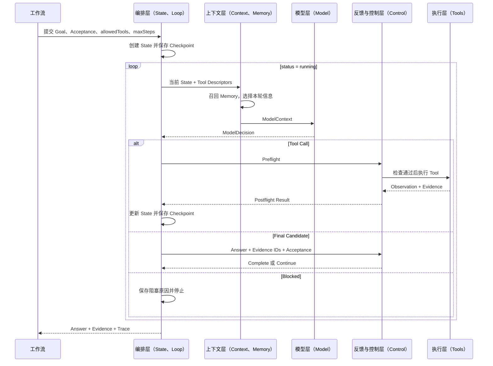

# 07 Agent 核心原理：从七个组成到最小实现

前面的章节已经建立了 Agent 五层架构和完整工作流。本章换一个观察角度：不再从框架或抽象名词出发，而是拆开一个可以直接运行的最小 Agent，理解它为什么至少需要 `Model、Context、Tools、State、Loop、Memory、Control` 七个组成。

全文分为四个部分：先逐项理解七个组成，再沿同一个最小任务观察它们怎样协作，随后回到五层架构，最后运行代码验证。配套实现位于 [`source/minimal-agent`](source/minimal-agent/README.md)。

### 【学习目录】

1. [第一部分：七个组成——从职责到边界](#part-1)
   1. Model：决策核心
   2. Context：本轮模型输入
   3. Tools：外部能力接口
   4. State：全链路状态载体
   5. Loop：状态驱动的执行循环
   6. Memory：信息的保存与召回
   7. Control：确定性控制边界
2. [第二部分：用最小实现走完一次 Agent Run](#part-2)
   1. 定义任务与验收条件
   2. 装配 Agent Runtime
   3. 建立初始 State
   4. 第一轮：查询天气
   5. 第二轮：完成计算
   6. 第三轮：验证并结束
3. [第三部分：从最小 Run 回到 Agent 架构](#part-3)
   1. 完整 Loop
   2. 七个组成与五层架构的动态联系
   3. 七个组成为什么缺一不可
4. [第四部分：运行、验证与扩展](#part-4)
   1. 离线 Demo、单元测试与真实 API 联调
   2. 替换 Model、Memory 与框架
   3. 总结完整因果链

<a id="part-1"></a>

### 【第一部分：七个组成——从职责到边界】

先记住一个最小公式：

```text
Agent = Model + Context + Tools + State + Loop + Memory + Control
```

这七个组成不是七个平行模块，而是一条连续运行链上的不同职责：

| 组成 | 回答的问题 | 运行时职责 |
| --- | --- | --- |
| Model | 下一步做什么？ | 产生 Tool Call、Final Candidate 或 Blocked |
| Context | 这一轮让 Model 看到什么？ | 选择并装配当前步骤需要的信息 |
| Tools | 怎样接触外部环境？ | 查询信息、执行计算或改变外部系统 |
| State | 任务现在进行到哪里？ | 保存消息、进度、观察、证据、错误和产物 |
| Loop | 怎样从一步变成多步？ | 重复决策、执行、观察和更新，直到停止 |
| Memory | 哪些信息以后还要取回？ | 保存线程状态和跨任务知识，并按需召回 |
| Control | 哪些行动允许执行，什么才算完成？ | 控制权限、预算、异常、审批和终止条件 |

它们的整体关系是：

```text
State + Memory + Tool Descriptors
              ↓
           Context
              ↓
            Model
              ↓
           Decision
           ├─ Tool Call → Control → Tools → Observation → State
           ├─ Final     → Control → Complete / Continue
           └─ Blocked   → State → Stop

Loop 负责重复这条链，直到 State 进入明确终态。
```

下面先分别看清七个组成，再进入代码。

#### 1. Model：根据当前 Context 选择下一步

Model 是 Agent 的决策核心，但不是执行器。它更接近一个策略函数：

```text
Action(t) = Model(Context(t))
```

同一个 Model 在不同 Context 下可能产生不同动作。通常有三类输出：

| 输出 | 含义 | 下一步由谁处理 |
| --- | --- | --- |
| Tool Call | 需要查询信息或执行操作 | Runtime 校验后交给 Tool |
| Final Candidate | Model 认为信息已经足够 | Control 验证能否完成 |
| Blocked / Clarification | 缺少权限、信息或可行路径 | Runtime 停止或请求外部输入 |

Model 的输入不是整个程序对象，而是 Context Builder 选出的本轮信息；Model 的输出也不是直接修改 State 的命令，而是结构化 Decision。这个边界有两个作用：

- 可以替换不同模型，而不用重写 Tool、State 和 Loop；
- 可以让 Runtime 在执行前检查 Model 提出的行动。

因此，“Model 更强”只提高候选决策质量，并不会自动带来权限控制、状态恢复和完成验证。这些能力属于其他组成。

#### 2. Context：决定本轮模型究竟能看到什么

Context 是一次 Model 调用的实际输入。它通常由以下内容动态组成：

```text
Context(t)
= System Instructions
+ Selected Messages
+ Relevant State
+ Retrieved Memory
+ Tool Schemas
+ Runtime Constraints
```

其中 Message 是上下文的基础数据单元，用来表示系统指令、用户输入、Model 输出和 Tool 结果：

| Message | 主要内容 | 作用 |
| --- | --- | --- |
| System | 身份、规则、目标、约束 | 规定 Model 怎样行动 |
| User | 用户请求、文件或环境输入 | 提供当前目标 |
| Assistant | 普通回答或 Tool Call | 记录 Model 的决策 |
| Tool | 与 Tool Call ID 对应的执行结果 | 把环境反馈交回 Model |

但 Message 不等于完整 State：

```text
Messages ⊂ State
```

权限信息、重试次数、原始文件对象、内部错误和完整 Trace 可能属于 State，却不应全部发给 Model。Context Builder 的职责正是从 State 和 Memory 中选择当前步骤真正需要的部分。

选择过少，Model 会缺少完成任务所需的信息；选择过多，又会增加 Token、延迟和干扰。Anthropic 在 [《Effective context engineering for AI agents》](https://www.anthropic.com/engineering/effective-context-engineering-for-ai-agents) 中把 Context Engineering 概括为：在有限的 Context 中持续保留最有价值的信息。Context 因而不是历史数据的堆积，而是一次面向当前决策的信息装配。

#### 3. Tools：把候选行动连接到外部环境

Model 只能产生输出，Tools 才能读取或改变环境。一个 Tool 不是一段随意调用的函数，而是具有明确契约的能力：

```text
Tool
├── name                 唯一名称
├── description          适用场景
├── input schema         输入结构
├── validate             运行时参数校验
├── execute              真实执行器
├── output / error       结构化结果
├── risk / approval      风险与审批要求
└── side effects         是否改变外部系统
```

Tools 可以封装函数、HTTP API、数据库、文件系统、CLI、浏览器、MCP Server、沙箱或另一个 Agent。无论底层能力是什么，调用链都应保持一致：

```text
Model 生成 Tool Call
→ Runtime 解析工具名和参数
→ Control 检查权限、Schema 和审批
→ Tool 执行真实函数或外部操作
→ Runtime 捕获 Output / Error
→ 生成 Observation 或 Tool Message
→ 写回 State
```

OpenAI 的 [《Function calling》](https://developers.openai.com/api/docs/guides/function-calling) 同样把工具调用定义为 Model 与应用程序协作的多步过程。关键边界是：**Model 决定调用什么以及提供哪些参数，Runtime 负责校验、执行和处理异常。**

#### 4. State：保存整个任务的运行快照

State 表示 Agent 在某个时刻的完整运行状态：

```text
State(t)
= 当前任务与验收条件
+ Messages
+ Plan 与当前步骤
+ Tool Observations
+ Evidence 与 Artifacts
+ 权限与审批状态
+ 重试次数与错误
+ 当前运行状态
```

State 的价值不只是“保存变量”，而是为工作流路由提供依据。例如：

```text
最后一个 Decision 是 Tool Call → 进入 Tool 执行
存在待审批操作              → 进入 Approval
工具执行失败且允许重试      → 进入 Retry
验收条件全部满足            → 进入 Complete
```

复杂工作流还需要定义 State Schema 和更新规则：哪些字段追加、哪些覆盖、哪些合并。消息和 Observation 通常追加，`status` 通常覆盖，多个并行节点的结果则需要显式合并。LangGraph 的 [《Graph API overview》](https://docs.langchain.com/oss/python/langgraph/graph-api) 将图工作流拆成 `State、Nodes、Edges`，并用 Reducer 定义节点返回的局部更新如何应用到 State。

因此 Agent 不是“Model 一直思考”，而是 Runtime 根据 State 决定下一步调用 Model、Tool、审批、重试还是结束。

#### 5. Loop：把一次决策变成持续执行

一次 Model 调用只能给出一步结果。Loop 负责不断重复：

```text
构建 Context
→ Model 产生 Decision
→ Control 校验
→ Tool 执行并产生 Observation
→ 更新 State
→ 保存 Checkpoint
→ 判断继续、重试、阻塞或结束
```

可以把一次状态转移写成：

```text
State(t+1) = Update(State(t), Action(t), Observation(t+1))
```

下一轮再根据新状态决策：

```text
Action(t+1) = Model(Context(State(t+1)))
```

所以 Loop 的本质不是无限调用 Model，而是一个有状态、有反馈、有停止条件的状态转移系统。ReAct 论文 [《ReAct: Synergizing Reasoning and Acting in Language Models》](https://arxiv.org/abs/2210.03629) 描述了推理、行动与环境 Observation 的交替；工程实现还必须为这种交替补上状态保存、异常分支和确定性终止。

#### 6. Memory：让关键信息跨步骤或跨任务复用

Memory 不是简单等同于聊天历史，也不等于某一种数据库。更准确的划分要看信息作用域：

| 类型 | 作用域 | 典型内容 | 常见机制 |
| --- | --- | --- | --- |
| Thread / Run Memory | 当前任务或会话 | Messages、进度、Observation、审批状态 | State + Checkpoint |
| Long-term Memory | 跨任务、跨会话 | 用户偏好、项目知识、规则、历史经验 | Store + Retrieval |

短期记忆的关键不是“是否存在内存中”，而是它是否只服务于当前 Thread。它可以保存在进程内，也可以持久化到数据库。长期记忆通常位于当前 State 外部，在执行时检索相关项，再注入 Context。

长期记忆还可以按用途分为：

| 类型 | 保存什么 | Agent 示例 |
| --- | --- | --- |
| Semantic Memory | 事实与知识 | 用户偏好、项目规范、领域规则 |
| Episodic Memory | 过去的经历 | 历史任务、成功或失败轨迹 |
| Procedural Memory | 行为方法 | 工作流、Prompt、Skill、操作规范 |

向量数据库只是长期记忆的一种检索实现，并不等于 Memory 本身。结构化 Profile、全文检索、文件、事件日志和知识图谱都可能是更合适的实现。选择存储方式之前，应先回答“保存什么、保存多久、何时召回”。

LangGraph 的 [《Persistence》](https://docs.langchain.com/oss/python/langgraph/persistence) 区分 Checkpointer 和 Store：前者保存 Thread 内的 State 快照，后者保存跨 Thread 数据。这也是区分 State 与 Memory 最清晰的工程边界。

#### 7. Control：让 Agent 从能运行变成可靠运行

Model、Tools 和 Loop 足以让任务跑起来，却不足以保证任务安全结束。Control 把开放的 Model 决策限制在确定性边界内，通常包括：

```text
Control
├── 工具白名单与参数校验
├── 风险分级与人工审批
├── 最大步骤、Token、时间和成本预算
├── 超时、重试、退避与幂等
├── 异常处理、中断与恢复
├── 日志、Trace 与可观测性
├── 输出校验与安全护栏
└── 基于 Acceptance / Evidence 的完成验证
```

这些控制点分布在三个时机：

| 时机 | 核心问题 | 示例 |
| --- | --- | --- |
| 执行前 | 这个行动允许做吗？ | 工具白名单、参数、路径、审批 |
| 执行后 | 这个行动真的成功了吗？ | Error、Timeout、返回结构、重试条件 |
| 完成前 | 整个任务真的完成了吗？ | Acceptance、Evidence、Artifacts |

例如删除文件时，Model 只能提出 `delete_file`；Runtime 还必须检查目标路径和风险，必要时暂停并等待人工审批，批准后才能执行。Control 因而不是一句 Prompt 规则，而是 Model 之外可执行、可记录、可测试的代码。

到这里，七个组成已经形成完整认知。下面不再继续增加概念，而是让它们在同一个最小 Agent 中逐项落地。

<a id="part-2"></a>

### 【第二部分：用最小实现走完一次 Agent Run】

#### 2.1 最小 Agent 要完成什么任务

本章只使用一个贯穿始终的任务：

> 查询北京的离线演示天气，并计算温度升高 2°C 后是多少。

它需要完成两个可验证结果：

```text
get_weather({ city: "北京" })
→ 北京，晴，25°C

calculator({ operation: "add", left: 25, right: 2 })
→ 27
```

这个示例虽然简单，却已经包含 Agent 的基本特征：第一次工具调用得到的 `25°C`，会成为第二次决策的输入；最终答案还必须引用两次工具执行产生的证据。因此，它不是单轮问答，而是一个最小的多步任务。

##### 2.1.1 先把自然语言目标变成可执行任务

入口文件 [`main.ts`](source/minimal-agent/src/main.ts) 没有只写一段 Prompt，而是先定义 `AgentSpec`：

```ts
const spec: AgentSpec = {
  goal: "查询北京的演示天气，并计算温度升高 2°C 后是多少。",
  allowedTools: ["get_weather", "calculator"],
  maxSteps: 5,
  acceptance: [
    {
      id: "weather-fetched",
      description: "天气必须来自工具观察",
      requiredEvidenceTags: ["weather"]
    },
    {
      id: "calculation-completed",
      description: "温度变化必须由计算工具验证",
      requiredEvidenceTags: ["calculation"]
    }
  ]
};
```

`goal` 说明要做什么，`allowedTools` 限定可以怎样做，`maxSteps` 限制最多运行多久，`acceptance` 定义什么证据才算完成。

这一步已经同时为两个组成建立了边界：

- `State` 将保存这份任务定义和后续进度；
- `Control` 将用工具白名单、步骤预算和验收条件约束整个过程。

因此，一个可靠 Agent 的起点不是“让模型自由完成任务”，而是先把目标、权限和完成条件写成 Runtime 可以检查的数据。

##### 2.1.2 预期会发生三轮，而不是一次回答

为了让运行结果可复现，Demo 使用 [`ScriptedModel`](source/minimal-agent/src/models.ts) 依次返回三项决策：

```text
第 1 轮：调用 get_weather，获得天气事实
第 2 轮：调用 calculator，计算升高后的温度
第 3 轮：提交最终答案，并引用前两轮 Evidence
```

`ScriptedModel` 会接收 `Context`，但为了隔离模型随机性，它在演示中直接按顺序返回预设决策。换成真实模型后，运行链不变，只有“如何产生下一项 Decision”这一处发生变化。

下面沿这三轮执行过程，逐步理解七个组成如何协作。

#### 2.2 运行前：先把能力装配成一个 Agent

任务运行前，入口需要向 `MinimalAgent` 注入四类可替换能力：

```ts
const agent = new MinimalAgent({
  model: new ScriptedModel(decisions),
  tools: defaultTools,
  checkpoints,
  longTermMemory
});

const result = await agent.run(spec, "demo-run");
```

此时还没有开始任何一轮决策，只是完成运行时装配：

| 注入对象 | 对应组成 | 当前实现 |
| --- | --- | --- |
| `model` | Model | 按顺序返回三项决策 |
| `tools` | Tools | 离线天气查询和安全计算器 |
| `checkpoints` | Memory | 保存当前 Run 的 State 快照 |
| `longTermMemory` | Memory | 根据目标召回可复用规则 |

`MinimalAgent` 自己负责 `State、Loop、Control`，并通过 `ContextBuilder` 生成 `Context`。构造函数允许替换这些默认实现，因此最小代码不是把所有逻辑写死在一个 `while` 中，而是先建立清楚的职责边界。

装配完成后，`run(spec)` 才真正启动任务。

#### 2.3 Step 0：State 先建立任务的运行起点

`run()` 的第一件事不是调用 Model，而是创建初始 State：

```ts
async run(spec: AgentSpec, runId?: string): Promise<AgentRunResult> {
  const state = createInitialState(spec, runId);
  appendTrace(state, "run.started", {
    goal: spec.goal,
    maxSteps: spec.maxSteps
  });
  await this.checkpoints.save(state);
  return this.drive(state);
}
```

[`createInitialState()`](source/minimal-agent/src/state.ts) 生成的状态可以简化成：

```ts
{
  runId: "demo-run",
  spec,
  status: "running",
  step: 0,
  messages: [{ role: "user", content: spec.goal }],
  observations: [],
  evidence: [],
  trace: []
}
```

State 解决的是“任务当前是什么样”的问题。它不仅保存对话消息，还保存 Model 不一定需要看到的运行数据：

```text
Messages ⊂ State
```

例如 `step、status、observations、evidence、trace` 都属于 State，但并不需要每轮原样塞给 Model。把 Messages 等同于 State，会让步骤预算、工具结果、完成证据等关键数据失去统一归属。

初始 State 创建后立即保存 Checkpoint。这样即使后续中断，Runtime 仍然知道这个 Run 从哪里开始。可是 State 只会保存进度，不会自己产生下一步行动；因此执行进入 `drive()`，由 Loop 开始第一轮。

#### 2.4 第一轮：查询天气并形成第一个闭环

##### 2.4.1 Memory 与 State 共同生成本轮 Context

第一轮开始时，Loop 先增加 `step`，再召回 Memory：

```ts
state.step += 1;

const memory = await this.longTermMemory.recall(
  state.spec.goal,
  3
);
```

Demo 中长期记忆只保存了一条规则：

```ts
{
  id: "rule-1",
  content: "涉及外部事实时必须先使用工具，不得根据模型记忆编造。",
  tags: ["天气", "weather", "工具"]
}
```

目标中包含“天气”，所以这条规则会被召回。这里的重点不是简单的关键词算法，而是 Memory 的使用方式：**先保存，再按当前任务需要召回，而不是把所有长期知识永久放进每一轮 Prompt。**

随着 Loop 变长，Messages、Observation 和规则会不断增加，当前窗口不可能永久保留全部历史。Anthropic 在 [《Effective context engineering for AI agents》](https://www.anthropic.com/engineering/effective-context-engineering-for-ai-agents) 中强调，应在有限的注意力预算中保留高信号信息，并通过 compaction、结构化笔记和按需检索维持长任务连续性。Memory 因此不是“无限聊天记录”，而是让关键信息在需要时能够被重新取回。

召回 Memory 后，[`ContextBuilder`](source/minimal-agent/src/context.ts) 再从完整 State 中选择本轮所需内容：

```ts
const context = this.contextBuilder.build(
  state,
  this.registry.descriptors(state.spec.allowedTools),
  memory
);
```

核心构建逻辑可以简化为：

```ts
return {
  goal: state.spec.goal,
  acceptance: state.spec.acceptance,
  step: state.step,
  remainingSteps: state.spec.maxSteps - state.step,
  tools,
  recentMessages: state.messages.slice(-8),
  recentObservations: state.observations.slice(-6),
  availableEvidence: state.evidence.slice(-20),
  recalledMemory
};
```

第一轮 Context 中已经有目标、验收条件、剩余步数、可用工具和召回规则，但还没有任何 Observation 和 Evidence：

| Context 字段 | 第一轮内容 |
| --- | --- |
| `goal` | 查询天气并计算升温结果 |
| `tools` | `get_weather`、`calculator` 的描述和 Schema |
| `recentObservations` | 空 |
| `availableEvidence` | 空 |
| `recalledMemory` | 外部事实必须使用工具 |

到这里，`State` 提供任务现状，`Memory` 补充可复用规则，`Context` 把两者整理成 Model 本轮真正能看到的输入。下一步才轮到 Model 决策。

##### 2.4.2 Model 根据 Context 提出 Tool Call

最小实现把 Model 的职责限制为一个接口：

```ts
export interface AgentModel {
  decide(context: ModelContext): Promise<ModelDecision>;
}
```

它只能返回三类结构化决策：

```ts
type ModelDecision =
  | { type: "tool_call"; summary: string; call: ToolCall }
  | { type: "final"; summary: string; answer: string; evidenceIds: string[] }
  | { type: "blocked"; summary: string; reason: string };
```

第一轮没有天气 Observation，Model 不能可靠回答温度，于是提出：

```json
{
  "type": "tool_call",
  "summary": "先读取外部天气事实",
  "call": {
    "id": "weather-1",
    "name": "get_weather",
    "input": { "city": "北京" }
  }
}
```

这里要特别注意：Model 返回的是 `ToolCall` 数据，不是工具执行结果。OpenAI 的 [《Function calling》](https://developers.openai.com/api/docs/guides/function-calling) 也把这一过程明确分成“向 Model 提供工具—Model 返回 Tool Call—应用执行工具—把 Tool Output 交回 Model”。

因此 Model 是自主决策内核，但不是执行者。它可以建议调用 `get_weather`，却不能绕过 Runtime 直接查询，更不能自己编造“北京 25°C”。候选行动产生后，流程自然进入 Control。

##### 2.4.3 Control 检查行动，Tools 才真正执行

如果 Model 一提出工具调用就立即执行，那么不存在的工具、错误参数或高风险操作都可能进入环境。最小实现先调用 [`ControlLayer.preflight()`](source/minimal-agent/src/control.ts)：

```ts
const tool = this.registry.get(decision.call.name);
const preflight = await this.control.preflight(
  state,
  decision.call,
  tool
);
```

执行前依次检查：

```text
工具是否在 allowedTools 中？
→ 工具是否已经注册？
→ 参数是否通过 validate()？
→ 如果工具要求审批，是否已经批准？
```

本轮 `get_weather` 在白名单中，工具已注册，`city` 也是非空字符串，所以检查通过。Runtime 才会调用 Tool：

```ts
export interface Tool extends ToolDescriptor {
  validate(input: JsonObject): ValidationResult;
  execute(input: JsonObject): Promise<ToolExecutionResult>;
}
```

[`weatherTool`](source/minimal-agent/src/tools.ts) 查询离线数据后返回：

```json
{
  "ok": true,
  "output": {
    "city": "北京",
    "condition": "晴",
    "temperatureC": 25
  },
  "evidence": [
    {
      "description": "北京演示天气为晴，25°C",
      "source": "demo://weather/...",
      "tags": ["weather", "weather:北京"]
    }
  ]
}
```

Runtime 会把它包装成 `Observation`，并给 Evidence 分配稳定 ID `weather-1:e1`。至此职责链非常清楚：

```text
Model 提出候选行动
→ Control 判断是否允许
→ Tools 接触外部环境
→ Runtime 生成 Observation 和 Evidence
```

工具结果已经产生，但下一轮 Model 还看不到它。要让任务继续，Observation 必须先回写 State。

##### 2.4.4 Observation 写回 State，Loop 才能继续

[`appendObservation()`](source/minimal-agent/src/state.ts) 同时完成三件事：保存 Observation、收集 Evidence、追加一条 Tool Message。

```ts
export function appendObservation(
  state: AgentState,
  observation: Observation
): void {
  state.observations.push(observation);
  state.evidence.push(...observation.evidence);
  appendMessage(state, {
    role: "tool",
    toolCallId: observation.toolCallId,
    content: JSON.stringify(observation)
  });
}
```

第一轮前后的 State 差异如下：

| 字段 | 执行前 | 执行后 |
| --- | --- | --- |
| `step` | 0 | 1 |
| `observations` | 空 | 北京晴、25°C |
| `evidence` | 空 | `weather-1:e1` |
| `status` | `running` | `running` |

为什么 `status` 仍然是 `running`？因为天气证据只满足了第一项 Acceptance，计算证据还不存在。Runtime 保存新的 Checkpoint 后执行 `continue`，Loop 回到顶部。

到这里，七个组成已经第一次形成闭环：

```text
State + Memory → Context → Model → Control → Tools
       ↑                                  ↓
       └──────── Observation ←────────────┘
```

接下来的第二轮不是另一套流程，而是同一个 Loop 在更新后的 State 上再次运行。

#### 2.5 第二轮：同一个 Loop 利用新 Observation 完成计算

第二轮重新执行“Memory 召回—Context 构建—Model 决策”。代码没有新增特殊分支，但本轮 Context 已经发生变化：

| Context 内容 | 第 1 轮 | 第 2 轮 |
| --- | --- | --- |
| `step` | 1 | 2 |
| `recentObservations` | 空 | 北京晴、25°C |
| `availableEvidence` | 空 | `weather-1:e1` |
| `remainingSteps` | 4 | 3 |

Model 现在能够从 Observation 中读取 `temperatureC: 25`，于是提出第二个 Tool Call：

```json
{
  "type": "tool_call",
  "summary": "根据天气观察计算升高 2°C 后的温度",
  "call": {
    "id": "calc-1",
    "name": "calculator",
    "input": {
      "operation": "add",
      "left": 25,
      "right": 2
    }
  }
}
```

Control 再次完成白名单和参数检查，`calculator` 执行后返回结果 `27`，同时生成带有 `calculation` Tag 的 Evidence `calc-1:e1`。Observation 随后再次写入 State。

两轮的因果关系是：

```text
第 1 轮 Tool Output 中的 25
→ 写入 State
→ 被第 2 轮 Context 选中
→ Model 用它构造 calculator 参数
→ 第 2 轮 Tool Output 得到 27
```

这正是 Loop 的价值：它不只是重复调用 Model，而是让上一轮的环境结果成为下一轮的决策依据。ReAct 论文 [《ReAct: Synergizing Reasoning and Acting in Language Models》](https://arxiv.org/abs/2210.03629) 所描述的核心也是让推理、行动和环境 Observation 交错推进；在工程实现中，这种交错必须落到显式 State 更新和可停止的 Loop 上。

第二轮结束时，State 已经有天气和计算两类 Evidence，但任务仍未自动完成。证据“存在”与最终答案“正确引用这些证据”是两件事，因此还需要第三轮。

#### 2.6 第三轮：Model 提交答案，Control 决定是否完成

第三轮 Context 同时包含天气 Observation、计算 Observation 和两条 Evidence。Model 不再请求工具，而是提交 Final Candidate：

```json
{
  "type": "final",
  "summary": "天气事实与计算结果都已有工具证据",
  "answer": "演示数据中北京为晴天、25°C；升高 2°C 后是 27°C。",
  "evidenceIds": ["weather-1:e1", "calc-1:e1"]
}
```

`type: "final"` 只表示 Model 认为可以结束，并不等于 State 已经是 `completed`。Runtime 会调用 [`verifyCompletion()`](source/minimal-agent/src/control.ts)，检查：

```text
答案是否为空？
→ 引用的 Evidence ID 是否真实存在？
→ weather-fetched 是否被 weather Tag 覆盖？
→ calculation-completed 是否被 calculation Tag 覆盖？
```

本轮证据覆盖关系如下：

| Acceptance | 所需 Tag | 被哪条 Evidence 覆盖 |
| --- | --- | --- |
| 天气必须来自工具观察 | `weather` | `weather-1:e1` |
| 温度变化必须由计算工具验证 | `calculation` | `calc-1:e1` |

全部检查通过后，`completeState()` 才会执行：

```ts
state.status = "completed";
state.finalAnswer = decision.answer;
state.terminationReason =
  "All acceptance criteria have verified evidence";
```

如果 Model 在第一轮就直接回答 `27°C`，因为没有任何 Evidence，Control 会拒绝完成，并把失败原因写回 State，让下一轮继续修正。Anthropic 在 [《Demystifying evals for AI agents》](https://www.anthropic.com/engineering/demystifying-evals-for-ai-agents) 中区分了 Agent 的执行轨迹与环境中的实际结果：模型声称“完成”只是轨迹中的一句话，只有可检查的 Outcome 才能证明任务真的完成。

至此，这个最小任务才从 `running` 进入 `completed`。

<a id="part-3"></a>

### 【第三部分：从最小 Run 回到 Agent 架构】

#### 3.1 把三轮执行压缩成一个完整 Loop

回看 [`MinimalAgent.drive()`](source/minimal-agent/src/agent.ts)，主循环可以压缩为下面这段伪代码：

```ts
while (state.status === "running") {
  if (state.step >= state.spec.maxSteps) {
    blockState(state, "step budget exhausted");
    break;
  }

  state.step += 1;

  const memory = await longTermMemory.recall(state.spec.goal, 3);
  const context = contextBuilder.build(state, tools, memory);
  const decision = await model.decide(context);

  if (decision.type === "tool_call") {
    const preflight = await control.preflight(state, decision.call, tool);
    const observation = preflight.ok
      ? await executeTool(tool, decision.call)
      : rejectedActionObservation(decision.call, preflight);

    appendObservation(state, observation);
    await checkpoints.save(state);
    continue;
  }

  if (decision.type === "final") {
    const result = control.verifyCompletion(state, decision);
    result.validation.ok
      ? completeState(state, decision.answer, result.evidence)
      : appendCompletionError(state, result.validation);
    continue;
  }

  blockState(state, decision.reason);
}
```

这段 Loop 的稳定结构始终不变，变化的只是每轮数据：

```text
第 1 轮：没有 Observation → 查询天气
第 2 轮：已有天气 Observation → 执行计算
第 3 轮：已有两类 Evidence → 验证并完成
```

也可以把一次 Run 表示成下面的交互图。图中的列只表示“工作流”以及五层架构职责，七个组成放在对应步骤中：



从工程角度看，这就是“确定性外壳包住自主内核”：

- Model 是自主内核，在给定 Context 下选择下一步；
- State、Loop、Memory、Control 和 Tool Runtime 构成确定性外壳，限制输入、权限、执行方式、停止条件和完成标准。

Agent 的自主性因此不是无限自由，而是在明确边界内选择下一项行动。

#### 3.2 七个组成与五层架构如何对应

七个组成和五层架构不是两套互相竞争的定义，而是观察同一个 Agent 的两个坐标轴：

```text
七个组成 = 动态运行视角：一次 Agent Run 需要哪些能力？
五层架构 = 静态职责视角：这些能力由系统的哪一层承载？
```

因此，二者不是严格的一对一映射。每个组成都有主要归属层，但真正运行时一定会跨层传递数据：

| 五层架构 | 主要承载的组成 | 与其他组成的联系 | 最小实现 |
| --- | --- | --- | --- |
| 模型层 | Model | 接收 Context，返回 Decision；不直接执行 Tools 或修改 State | [`models.ts`](source/minimal-agent/src/models.ts) |
| 上下文层 | Context、Memory 召回 | 从 State 选择当前信息，检索 Memory，加入 Tool Descriptors，再交给 Model | [`context.ts`](source/minimal-agent/src/context.ts)、[`memory.ts`](source/minimal-agent/src/memory.ts) |
| 执行层 | Tools | 接收通过 Control 的 Tool Call，返回 Observation / Evidence 给 State | [`tools.ts`](source/minimal-agent/src/tools.ts) |
| 编排层 | State、Loop、Checkpoint | 驱动所有层，保存进度，根据新 State 决定继续、重试或停止 | [`state.ts`](source/minimal-agent/src/state.ts)、[`agent.ts`](source/minimal-agent/src/agent.ts)、[`memory.ts`](source/minimal-agent/src/memory.ts) |
| 反馈与控制层 | Control | 横跨执行前、执行后和完成前，检查 Tools、Observation、Evidence 与步骤预算 | [`control.ts`](source/minimal-agent/src/control.ts) |

#### 3.2.1 为什么不是简单的一对一关系

有三个组成天然会跨层：

- `State` 的主责在编排层，但模型层、上下文层、执行层和控制层产生的数据最终都要汇入 State；
- `Memory` 的长期召回属于上下文构建，当前 Run 的 Checkpoint 又属于编排与恢复；
- `Control` 归入反馈与控制层，却会在 Tool 执行前、执行后以及最终完成前介入其他层。

所以“归属层”表示谁对该能力负责，不表示只有这一层可以使用它。真正的连接点是层与层之间传递的结构化数据。

#### 3.2.2 七个组成怎样沿五层架构流动

沿一次 Agent Run 观察，联系会更直观：

| 顺序 | 五层架构中的交互 | 七个组成怎样参与 | 传递的数据 |
| --- | --- | --- | --- |
| 1 | 工作流进入编排层 | State 初始化，Loop 启动 | `AgentSpec、runId、step` |
| 2 | 编排层请求上下文层 | Context 读取 State，召回 Memory，加入 Tools 描述 | `ModelContext` |
| 3 | 上下文层调用模型层 | Model 根据 Context 选择下一步 | `ModelDecision` |
| 4 | 编排层交给控制层 | Control 检查行动是否合法 | `ToolCall、allowedTools、risk` |
| 5 | 控制层放行执行层 | Tools 执行外部操作 | `ToolExecutionResult` |
| 6 | 执行结果返回编排层 | Observation / Evidence 写入 State，Memory 保存 Checkpoint | `State(t+1)` |
| 7 | 编排层再次循环 | Loop 用新 State 重新构建 Context | 下一轮输入或终态 |

由此可以得到一条同时包含两个视角的主链：

```text
编排层（State、Loop）
→ 上下文层（Context、Memory）
→ 模型层（Model）
→ 反馈与控制层（Control）
→ 执行层（Tools）
→ 编排层（更新 State、保存 Checkpoint）
→ Loop 决定下一轮或结束
```

#### 3.2.3 七个组成之间的接口就是五层架构的层间协议

所有层共同依赖的数据合同集中在 [`contracts.ts`](source/minimal-agent/src/contracts.ts)：

| 层间接口 | 连接的组成 | 解决的问题 |
| --- | --- | --- |
| `ModelContext` | State / Memory / Tools → Context → Model | Model 本轮应该看到什么 |
| `ModelDecision` | Model → Loop / Control | Model 建议下一步做什么 |
| `ToolCall` | Model / Control → Tools | 要调用哪个工具以及参数是什么 |
| `Observation` | Tools / Control → State | 外部环境实际返回了什么 |
| `Evidence` | Tools → State → Control | 什么事实可以证明任务完成 |
| `CheckpointStore` | State / Loop → Memory | 当前 Run 如何恢复 |

这说明五层架构的价值不只是“把代码放进五个目录”，而是让七个组成通过稳定接口协作。只要这些接口不变，就可以替换 Model、Context Builder、Tool Runtime 或 Memory Store，而不必重写整个 Agent。

Memory 的跨层关系尤其值得单独记住：`LongTermMemoryStore` 为上下文层提供跨任务信息，`CheckpointStore` 为编排层保存当前 Run 的 State。LangGraph 的 [《Persistence》](https://docs.langchain.com/oss/python/langgraph/persistence) 也区分 Thread 内的 Checkpoint 与跨 Thread 的 Store；前者用于恢复当前执行，后者用于保存跨任务数据。

#### 3.3 为什么七个组成一个也不能少

现在再从反面检查一次，会比背定义更容易掌握：

| 缺少什么 | 最小任务会怎样失败 | 引出的下一项能力 |
| --- | --- | --- |
| Model | Runtime 不知道下一步调用天气还是计算器 | 需要决策者 |
| Context | Model 看不到目标、工具和刚得到的 25°C | 需要本轮输入装配 |
| Tools | Model 只能生成文本，无法获得天气事实或可信计算结果 | 需要环境能力 |
| State | 第一轮的 Observation 无处保存，第二轮无法继续 | 需要运行快照 |
| Loop | 只能执行一次决策，拿到天气后任务就停止 | 需要连续驱动 |
| Memory | 长任务或新 Run 无法恢复关键进度、规则和知识 | 需要保存与召回 |
| Control | 错误工具可能被执行，模型也可在无证据时宣布完成 | 需要确定性边界 |

它们之间是一条连续的因果链，而不是功能堆叠：

```text
Model 需要 Context 才能基于现状决策
→ Context 需要 State 和 Memory 提供信息
→ Model 需要 Tools 才能影响环境
→ Tool Result 必须回到 State
→ Loop 用新 State 驱动下一轮
→ Control 约束每次行动和最终完成
```

<a id="part-4"></a>

### 【第四部分：运行、验证与扩展】

#### 4.1 运行代码并观察七个组成

Node.js 的 [《Modules: TypeScript》](https://nodejs.org/api/typescript.html) 说明了原生 TypeScript 类型擦除的版本和语法边界。配套项目要求 Node.js 22.18 或更高版本，不需要安装第三方运行时依赖：

```bash
cd "cx-learn-notes/AI/AI Agent架构学习教程/source/minimal-agent"
npm run demo
npm test
npm run demo:api
```

三个命令分别验证不同边界：

| 命令 | 是否访问网络 | 验证内容 |
| --- | --- | --- |
| `npm run demo` | 否 | `ScriptedModel` 下七个组成能否形成确定性闭环 |
| `npm test` | 否 | Tool、Control、Evidence、步骤预算和环境变量适配 |
| `npm run demo:api` | 是 | 根目录 `.env`、真实 Model API 和完整 Agent Loop |

`demo:api` 使用 Node.js 的 `--env-file=../../../../../.env` 加载仓库根目录变量，不复制或打印 API Key。项目读取 `API_KEY、BASE_URL、LLM_MODEL`，也允许用优先级更高的 `AGENT_API_KEY、AGENT_BASE_URL、AGENT_MODEL` 覆盖。本机通过 `NODE_EXTRA_CA_CERTS=/etc/ssl/cert.pem` 加载系统证书包，解决 Node 无法识别接口证书链的问题；这不会关闭 TLS 校验。

本次真实 API 联调完成了三轮：

```text
step 1  Context → Model → get_weather → weather Evidence
step 2  Context → Model → calculator  → calculation Evidence
step 3  Context → Model → Final Candidate → Control → completed
```

最终状态和答案为：

```text
status = completed
answer = 北京的演示天气为晴，当前温度为 25°C；升高 2°C 后是 27°C。
```

真实 Model 第一次调用时使用了英文城市名 `Beijing`，因此天气 Tool 在执行边界增加了城市别名规范化。这个过程体现了职责分离：Model 负责提出语义上合理的行动，Tool 负责把输入适配为环境能够处理的格式，Control 检查执行结果，Loop 再根据新 State 继续推进。

运行 Demo 时，不要只看最终的 `27°C`，应按 Trace 观察执行链：

| Trace Event | 说明 | 主要涉及的组成 |
| --- | --- | --- |
| `run.started` | 创建初始任务 | State、Control |
| `context.built` | 召回规则并构建本轮输入 | Memory、Context、State |
| `model.decided` | 产生 Tool Call 或 Final Candidate | Model |
| `action.rejected` | 行动未通过执行前检查 | Control |
| `tool.executed` | 工具返回 Observation 和 Evidence | Tools、Control |
| `completion.rejected` | 最终答案缺少完成证据 | Control、Loop |
| `run.completed / blocked / failed` | 进入明确终态 | State、Loop、Control |

`tests` 目录共覆盖七条边界：

- 两次工具调用产生的 Evidence 覆盖全部 Acceptance 后才能完成；
- 未注册或不允许的工具会在执行前被拒绝；
- 错误参数会被拒绝，并允许下一轮修正；
- 没有匹配 Evidence 的 Final Candidate 不会被接受；
- 达到 `maxSteps` 后进入 `blocked`，不会无限循环。
- [`models.test.ts`](source/minimal-agent/tests/models.test.ts) 验证根目录三项全局变量能构造真实 API 请求；
- [`tools.test.ts`](source/minimal-agent/tests/tools.test.ts) 验证英文城市别名会在 Tool 边界被规范化。

这些测试验证的不是“模型回答是否漂亮”，而是 Agent 的运行边界是否稳定。

#### 4.2 从最小实现继续扩展

掌握这条最小运行链后，再接入真实模型或框架会更容易判断每个能力放在哪里。

##### 4.2.1 替换真实 Model

[`OpenAICompatibleModel`](source/minimal-agent/src/models.ts) 可以替换 `ScriptedModel`，[`api-main.ts`](source/minimal-agent/src/api-main.ts) 展示了真实 API 入口。真实 Model 根据 `ModelContext` 动态返回 `tool_call、final、blocked`，但 Tool 执行、State 更新和完成验证仍由外部 Runtime 控制。

##### 4.2.2 替换持久化 Memory

当前 `InMemoryCheckpointStore` 和 `InMemoryLongTermMemoryStore` 会在进程结束后丢失数据。生产系统可以分别换成数据库 Checkpoint 和可检索知识存储，但应继续保留“当前 Run 恢复”与“跨 Run 知识召回”的边界。

##### 4.2.3 使用 Agent 框架

LangChain、LangGraph 或更完整的 Agent Harness 会封装部分实现，但七个组成不会消失：

| 框架能力 | 主要封装的组成 |
| --- | --- |
| LangChain Agent | Model、Context、Tools 和基础 Loop |
| LangGraph | State、Loop、路由和 Checkpoint |
| 更完整的 Agent Harness | Memory、Skills、Subagents、Sandbox、Approval 和观测能力 |

学习任何框架时，都可以回到七个问题：Model 在哪里？Context 怎样构建？Tools 谁执行？State 保存什么？Loop 谁驱动？Memory 怎样召回？Control 怎样判定行动与完成？

#### 4.3 本章结论

本章的重点不是记住七个术语，而是看清一次 Agent Run 的连续因果关系：

```text
任务先进入 State
→ Memory 补充可复用信息
→ Context 选择本轮模型输入
→ Model 提出下一项候选行动
→ Control 检查行动
→ Tools 返回真实 Observation 和 Evidence
→ State 保存新结果
→ Loop 基于新状态进入下一轮
→ Control 用 Acceptance 和 Evidence 判定是否完成
```

如果只保留一句话，可以记成：**Model 负责选择下一步，Context 负责提供本轮信息，Tools 负责接触环境，State 负责保存进度，Loop 负责持续推进，Memory 负责让信息可恢复和复用，Control 负责确保整个过程可执行、可停止、可验证。**

理解这条最小执行链后，可以沿两条方向继续：如果要把 Loop 放回完整 Agent System，继续阅读 [《Agent System 研发知识梳理》](./Agent-System研发知识梳理.md)，重点看 Agent Loop、Runtime 与 Harness 的职责边界；如果要看成熟框架怎样封装这条最小链，继续阅读 [《04-从LangChain到Deep-Agents》](./04-从LangChain到Deep-Agents.md)。
