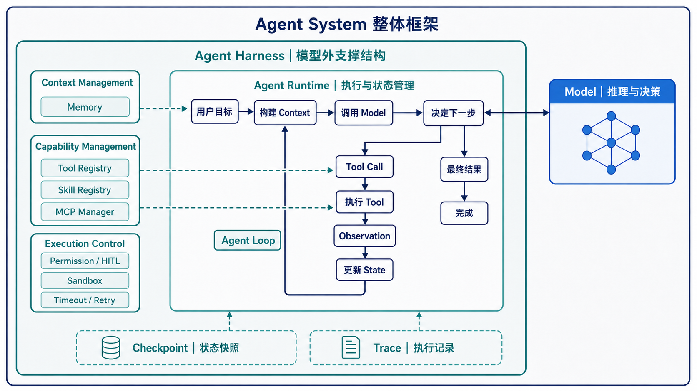
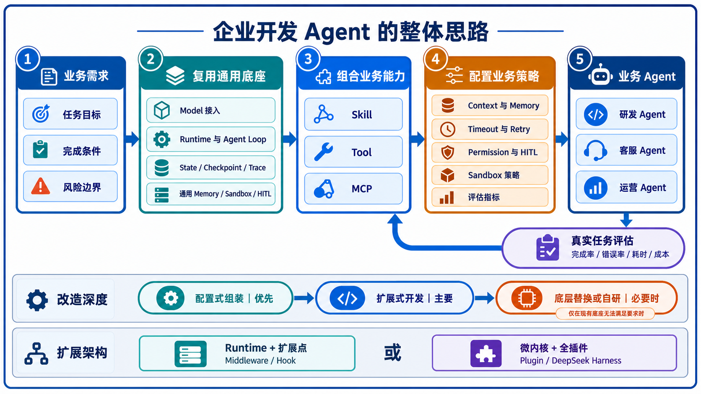
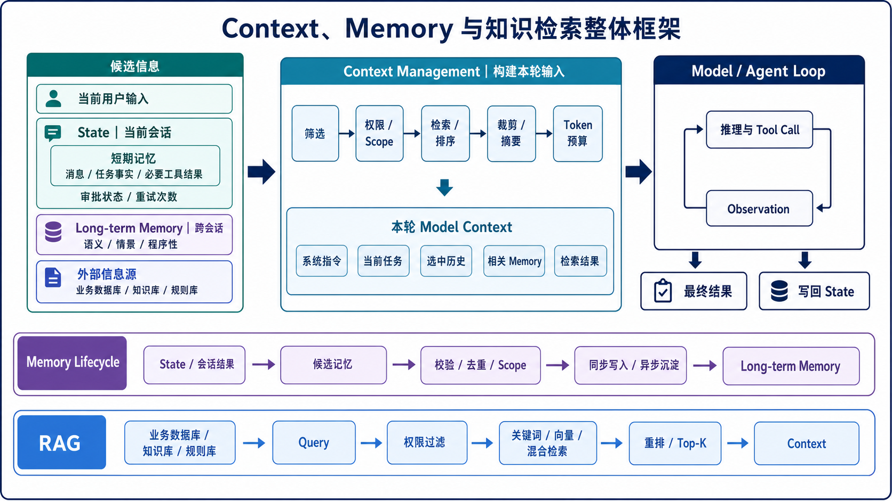
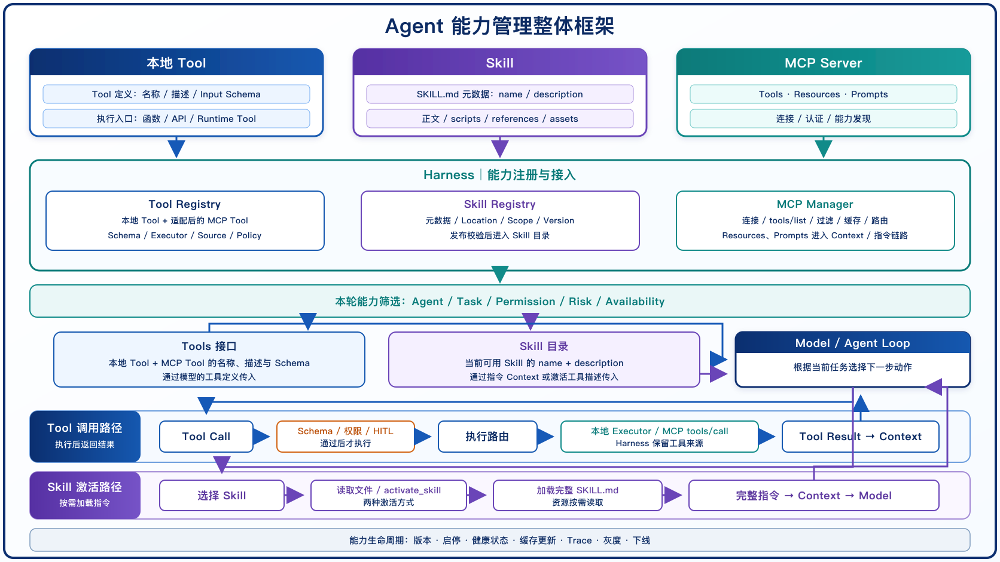
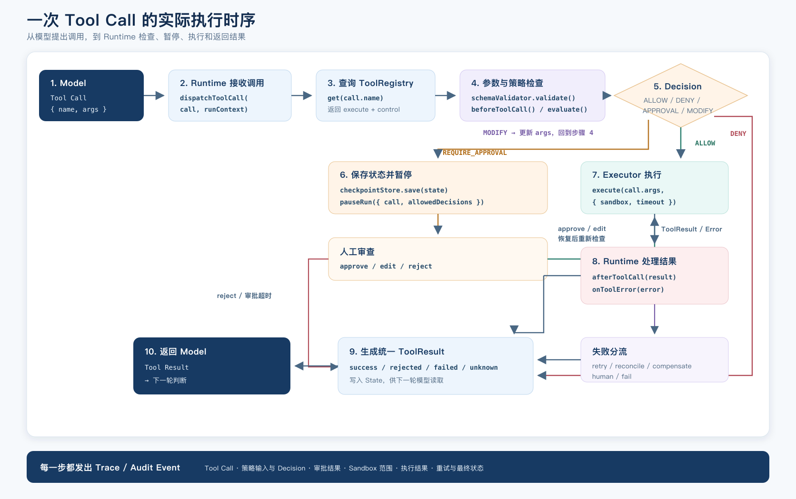

# Agent System 研发知识梳理

本文只讨论 **Agent System 本身怎样运行、怎样组织能力以及怎样形成可恢复、可治理的执行系统**。如果还没有区分“在业务流程中接入 Agent”和“开发 Agent System 本身”这两种研发语境，先阅读 [《Agent 学习教程》](./A-Agent学习教程.md)。

本文采用“系统组成与运行机制”的视角回答 Agent 由哪些部分构成、这些部分怎样协作。若要沿着业务 Agent 化、Prompt → Harness、五层架构、Workflow、框架映射、控制范式和最小实现建立完整学习链，统一阅读 [《Agent 完整学习教程》](./A-Agent学习教程.md)。

## 1. Agent System 的运行机制



*图 1-1：Agent System 整体框架。Model 负责推理与决策；Agent Harness 承担运行、上下文组织、能力接入、执行控制和状态支撑。*

### 【Agent 的最小组成：Model + Harness】

可以先用一个简单的工程模型来理解 Agent：

```text
Agent ≈ Model + Agent Harness
```

Model 负责理解目标、判断下一步动作并生成结果。Agent Harness 是围绕 Model 搭建的支撑结构，负责准备上下文、运行 Agent Loop、接入工具、保存状态，并控制动作如何执行。外部数据库、订单系统或第三方 API 是 Agent 使用的资源；把这些资源接入 Agent 的管理机制属于 Harness。[3](https://docs.langchain.com/oss/python/concepts/products)

把整个体系展开，可以先得到下面这张图：

```text
Agent System
├── Model
└── Agent Harness
    ├── Agent Runtime（执行 Agent 的运行层）
    │   ├── Agent Loop（反复运行的决策循环）
    │   └── State（当前运行数据）
    ├── Context Management（组织模型输入）
    │   ├── Session / Conversation History（跨 Run 延续会话历史）
    │   └── Memory（保存和取回后续仍有价值的信息）
    ├── Model Access & Management
    ├── Capability Management
    │   ├── Tool（可调用的操作接口）
    │   ├── Skill（可复用的任务说明和资源）
    │   └── MCP（外部能力接入协议）
    ├── Execution Control
    │   ├── Permission / Human Approval
    │   ├── Sandbox（隔离执行环境）
    │   └── Timeout / Retry（按策略重试失败调用）/ Failure Handling
    └── Checkpoint（状态快照）/ Trace（执行记录）
```

### 【Agent Loop：Agent 怎样持续完成任务】

Agent Loop 是 Agent 反复执行的决策循环。模型先判断下一步；如果模型给出最终结果，任务结束；如果模型请求调用工具，Runtime 执行工具，再把结果交还给模型。OpenAI Agents SDK 的 Runner 采用的就是这类循环。[4](https://openai.github.io/openai-agents-python/running_agents/)

```text
User Goal
   ↓
Build Context
   ↓
Model
   ↓
Decide Next Action
   ├── Final Answer ───────────────→ Done
   │
   └── Tool Call
           ↓
        Execute
           ↓
      Observation
           └──────────────────────→ 回到下一轮 Model 调用
```

Observation 指工具执行后返回给 Agent 的结果。它可能是一段数据，也可能是错误信息。模型只能看到执行结果，不能直接操作外部系统，因此 Observation 是动作与下一轮判断之间的连接点。

ReAct 是 Agent Loop 的经典实现范式之一。它把推理和行动交替组织起来，让上一轮行动的 Observation 影响下一步判断。现代 Tool Calling Agent 不一定显式输出 `Thought`，但仍然保留“判断、行动、观察、再判断”的循环。[5](https://arxiv.org/abs/2210.03629)

### 【Agent Loop、Runtime 与 Harness】

这三个概念容易混在一起，可以按职责区分：

| 概念 | 含义 | 主要职责 |
|---|---|---|
| Agent Loop | Agent 反复执行的决策循环 | 组织“模型决策、执行动作、观察结果、再次决策”的循环 |
| Agent Runtime | 真正执行 Agent 的运行层 | 调用模型、分发工具、传递 State、处理中断和结束条件 |
| Agent Harness | 围绕模型搭建的整套支撑结构 | 装配 Runtime、上下文、扩展能力、执行控制和运行记录 |

三者的关系可以先记成：Harness 负责装配和约束运行所需能力，Runtime 负责实际驱动执行，Agent Loop 是 Runtime 在任务推进过程中反复执行的核心决策机制。

**这里是一套用于本文的工程抽象，不是行业统一标准，也不表示 `Agent Loop < Runtime < Harness` 是严格的逐级包含关系。** 三者解决的是不同问题：

- **Agent Loop** 说明“任务怎样通过多轮判断、行动和观察持续推进”，它首先是一种执行机制；
- **Agent Runtime** 说明“谁来真正驱动这套机制”，负责模型调用、Tool 分发、State 传递、中断、恢复和结束条件；
- **Agent Harness** 说明“怎样把 Runtime 与 Context、Tool、Memory、权限、Sandbox、Trace 等能力装配成可用的 Agent 系统”。

不同框架会把一部分职责放在不同边界中：有的产品把 Runtime 作为 Harness 的内部组件，有的则把 Loop、Tool、Storage 等都做成可插拔能力。因此本文后续统一按“机制 → 运行层 → 支撑体系”的职责关系使用这三个术语，而不把它们当成行业固定的嵌套层级。

### 【一次 Agent 请求的完整执行过程】

先看主流程：

```text
1. 接收目标并初始化运行
            ↓
2. 构建本轮 Context
            ↓
3. 调用 Model
            ↓
4. 解析模型输出
      ├── 最终结果 ─────────────────────────────→ 9. 结束
      │
      └── Tool Call
              ↓
5. 查找并加载对应能力
              ↓
6. 权限、人工确认与执行环境检查
              ↓
7. 执行 Tool
              ↓
8. 记录结果，更新 State，生成 Observation
              └────────────────────────────────→ 回到第 2 步
```

Runtime 驱动这条执行链路。Harness 则提供链路上用到的上下文、模型接入、能力管理、执行控制和状态支撑。

#### <u>1. 接收目标与构建上下文</u>

用户输入不会直接原样交给模型。Runtime 会先初始化本次运行，再由 Context Management 构建本轮模型输入。

Context Management 是对模型可见信息的组织过程。它决定本轮放入哪些系统指令、用户输入、会话历史、Skill 指令、工具说明、Memory 检索结果和上一轮 Observation，也要在上下文窗口有限时做裁剪或压缩。[6](https://openai.github.io/openai-agents-python/context/)

这里还要区分两类容易同名的 Context。**运行时上下文（Runtime / Application Context）** 是应用代码、Tool、Hook 和 Runtime 使用的数据或依赖，例如用户标识、权限主体、Logger 和数据库客户端；**模型上下文（Model-visible Context）** 才是实际发送给模型、参与本轮推理的信息。运行时知道某项数据，不代表模型天然能够看到它。OpenAI Agents SDK 的 `RunContextWrapper.context` 就属于前一类，官方明确说明该对象不会自动发送给 LLM。[6](https://openai.github.io/openai-agents-python/context/)

Session / Conversation History 负责在多次 Agent Run 之间延续同一段会话发生过什么。以 OpenAI Agents SDK 为例，Session 会在每次 Run 前读取该会话的历史，并在 Run 后保存本轮新增的消息、Tool Call 等项目；它解决的是会话连续性，而不是把所有历史信息都定义为长期记忆。[38](https://openai.github.io/openai-agents-python/sessions/)

Memory 是可以跨轮次或跨任务保存并取回的信息。它与 Context Management 不是同一个模块：Memory 负责存取，Context Management 决定当前取哪些内容给模型看。长期记忆也不应该一次性全部塞进上下文，通常按任务需要读取。[7](https://platform.claude.com/docs/en/agents-and-tools/tool-use/memory-tool)

#### <u>2. 模型接入与调用管理</u>

上下文准备好以后，Runtime 发起模型调用。Harness 在这一层通常需要提供统一的模型接口，处理 Provider（模型服务提供方）差异、模型选择、调用参数和能力兼容性。例如，当前模型是否支持 Tool Calling（由模型请求调用工具）、结构化输出，或者某种输入类型。

模型调用还要有超时、可重试错误和降级策略，并记录 Token、延迟和调用结果。这里讨论的是调用管理，不展开模型原理、选型评测和 Prompt 写法。[8](https://openai.github.io/openai-agents-python/models/)

#### <u>3. 解析输出与管理扩展能力</u>

模型输出通常有两种去向：直接返回最终结果，或者产生 Tool Call。Tool Call 至少会带有工具名称和调用参数。Runtime 需要找到对应的执行器，完成调用，再把结果送回 Agent Loop。

这一环节的研发重点是扩展能力怎样接入和管理：

| 能力 | Harness 需要管理什么 |
|---|---|
| Tool | 注册名称、说明、输入 Schema 和执行器；控制启停、过滤、版本与调用分发 |
| Skill | 建立发现或注册机制；按需加载指令和资源；管理依赖、适用范围与版本 |
| MCP | 配置并连接 MCP Server；发现远端 Tool；处理命名空间、过滤、权限、连接状态与重连 |

Tool Schema 是工具接口的结构描述，告诉模型工具叫什么、接收哪些参数。这里关注 Schema 怎样跟随 Tool 注册、更新和暴露给模型，不讨论具体语法。

Skill 是一组可复用的任务说明和配套资源。Harness 通常先读取 Skill 的名称和描述，任务需要时再加载具体指令或资源。MCP 则提供标准化的外部能力接入方式；MCP Server 暴露的 Tool 最终仍会进入 Agent 的可用工具集合。[9](https://modelcontextprotocol.io/specification/2025-06-18/server/tools) [10](https://agentskills.io/specification)

在 Harness 里，这部分管理工作落在四个环节：注册、发现、调用和治理。Tool、Skill 和 MCP 的结构不同，但都要进入一套可管理的扩展机制。

#### <u>4. 工具执行控制</u>

模型产生 Tool Call，不代表动作可以立即执行。Runtime 在调用前要解析参数，检查工具是否存在，再执行权限和策略判断。

高风险操作可以进入 Human-in-the-loop，简称 HITL。它表示 Runtime 暂停当前执行，保存必要状态，等待人工批准或拒绝，然后从中断处继续。[11](https://openai.github.io/openai-agents-python/human_in_the_loop/)

代码、Shell 或文件修改等操作通常还需要 Sandbox。Sandbox 是隔离的执行环境，用来限制进程能够访问的文件、网络和系统资源，避免工具直接在宿主环境中任意操作。是否使用 Sandbox 取决于工具风险，不是所有 Tool 都必须放进 Sandbox。[12](https://openai.github.io/openai-agents-python/sandbox/guide/)

执行失败后，Runtime 要先区分超时、网络错误、参数错误和业务错误，再决定是否重试。Retry 是按照策略重新执行一次失败调用，不是把整个 Agent 从头再跑。对于发消息、扣款、删数据这类有副作用的动作，重试前必须确认前一次是否已经生效，否则可能重复执行。

#### <u>5. 写入 State，进入下一轮</u>

State 是一次 Agent 运行中的当前数据，包括消息、模型输出、工具调用、工具结果、审批状态和剩余执行信息。Runtime 每完成一个步骤，都会读取或更新 State。

工具结果写入 State 后，会整理成下一轮模型可读的 Observation。Context Management 再根据当前状态构建新上下文，Agent Loop 由此进入下一轮。Runtime 还要检查最大轮数、超时和任务结束条件，防止 Agent 无限制运行。

#### <u>6. 结束运行</u>

当模型给出最终结果且没有待执行的 Tool Call 时，Runtime 结束 Agent Loop。结束前可以进行输出检查，按策略写入 Memory，并关闭本次运行占用的资源。最终结果随后返回给调用方。

### 【State、Checkpoint 与 Trace】

这三个能力贯穿整次运行，不是主流程末尾的三个连续步骤。

| 概念 | 简单说明 | 用途 |
|---|---|---|
| State | Agent 当前运行到哪里、已经得到什么的数据集合 | 支撑下一步执行 |
| Checkpoint | State 在某个执行时点的持久化快照 | 中断恢复、人工确认后继续、故障恢复 |
| Trace | 对模型调用、工具调用和执行事件的过程记录 | 调试、监控和问题定位 |

```text
Agent Runtime 持续读写 State
            ├── Checkpoint：在关键时点保存 State
            └── Trace：记录每一步发生了什么
```

Checkpoint 保存的是“继续执行所需的数据”，Trace 记录的是“这次执行发生了什么”。两者用途不同，不能互相替代。[13](https://docs.langchain.com/oss/python/langgraph/persistence) [14](https://openai.github.io/openai-agents-python/tracing/)

配置 Checkpointer 后，LangGraph 还会保存同一 super-step 中已成功节点的 Pending Writes（待提交写入），恢复时可复用这些结果。它不等于完整 StateSnapshot，也不保证节点内未提交代码和外部副作用不会重放；后者仍需幂等保护或业务对账。[37](https://docs.langchain.com/oss/python/langgraph/checkpointers)

**Trace 也不等于 Eval。** Trace 是 Runtime 产生的运行事实；Eval 会进一步结合 Trace、Outcome、最终输出和资源消耗，通过 Grader 判断一次 Trial 是否满足 Task 的成功标准。完整评测链路见 [《Agent Eval 与 Benchmark》](./A-Agent-Eval与Benchmark.md)。

### 【开发一个 Agent System，需要建设什么】

沿着前面的执行过程，可以把 Agent 开发收敛为下面几项工程工作：

| 建设方向 | 需要提供的能力 |
|---|---|
| Runtime | 驱动 Agent Loop，管理 State、工具分发、中断和结束条件 |
| Context | 组织模型输入，接入会话历史与 Memory，控制上下文长度 |
| Model | 统一模型接口，管理配置、能力差异、超时、重试与调用记录 |
| Capability | 管理 Tool、Skill 和 MCP 的注册、发现、加载、调用与版本 |
| Execution | 管理参数校验、权限、HITL、Sandbox 和失败处理 |
| Persistence & Observability | 使用 Checkpoint 支持恢复，使用 Trace 记录执行过程 |

后面的章节会按这套 Agent 体系逐项展开。不同 Agent SDK 对模块的命名和切分会有差别，但这些问题都要在系统里得到处理。

## 2. 企业 Agent 的复用与自研边界

第二章梳理了 Agent System 包含哪些部分。实际开发时，并不需要把这些部分全部重新实现。

当前 Agent 生态尚未形成一个能够覆盖完整 Agent System、并被普遍采用的单一框架。不同框架覆盖的边界不同：有的重点提供 Runtime，有的同时提供记忆、沙箱或人工审查等通用能力，还有的把整个 Harness 设计成可组合的插件体系。因此，**<u>企业开发 Agent 更常见的做法，是选择一个可复用的运行底座，再按业务需要组合和扩展其他能力。</u>**

这里的基本原则是：通用机制尽量复用，业务规则由企业自己定义。



*图 3-1：企业开发 Agent 的整体思路。先复用通用底座并组合业务能力，再按业务需要扩展执行策略；只有现有底座无法满足关键要求时，才进入底层替换或自研。*

### 【最基础的做法：复用底座，组合能力】

企业可以先建设一套通用的 Agent 底座，其中包含 Runtime、模型接入、基础状态管理和工具调用机制。在最基础的情况下，不需要修改底层实现，只要接入不同的 Skill、Tool 和 MCP 组合，就可以形成具备不同能力的新 Agent。

```text
通用 Agent 底座
    + 研发 Skill / 代码与测试工具
    = 研发 Agent

通用 Agent 底座
    + 客服 Skill / 订单、工单 MCP
    = 客服 Agent
```

随着业务要求提高，还可以继续增加专用的 Context、Memory、权限、人工审查和执行策略。不同业务 Agent 可以共用底座，但不必共用全部配置。

### 【三种建设层级】

企业对 Agent 的改造程度，可以分成三个层级：

| 建设层级 | 主要做法 | 适用情况 |
|---|---|---|
| 配置式组装 | 复用 Agent 底座，配置模型并组合 Skill、Tool、MCP | 业务差异主要体现在知识、指令和可用工具上 |
| 扩展式开发 | 保留 Runtime，通过框架扩展点接入记忆、沙箱、重试、人工审查和业务规则 | 需要定制执行策略，但不需要改变底层运行方式 |
| 底层自研或替换 | 替换某个底层模块，必要时自研 Runtime | 现有框架无法满足关键的可靠性、性能、部署或合规要求 |

多数企业 Agent 会落在前两个层级。底层自研不是能力越强的标志，而是现有底座确实无法满足关键要求时的选择。

### 【两种常见的扩展架构】

不同框架的扩展边界并不相同。常见的做法有下面两种。

#### <u>1. Runtime 底座加扩展点</u>

**<u>这类架构先提供相对稳定的 Runtime，再预留扩展接口。</u>**Middleware 是插入模型调用或工具执行前后的中间处理逻辑；Hook 是在某个运行节点触发的生命周期回调。业务代码通过这些接口增加能力，不需要直接修改 Runtime 源码。

例如，LangChain 的 `create_agent()` 负责组装模型、工具和 Agent Loop，并允许通过 Middleware 改写模型请求、管理工具调用、增加重试或人工审查等行为。[15](https://docs.langchain.com/oss/python/langchain/middleware/overview) OpenAI Agents SDK 则由 Runner 执行 Agent Loop，同时提供 RunConfig、Guardrail 和生命周期 Hook 等接口，用于配置或观察运行过程。[4](https://openai.github.io/openai-agents-python/running_agents/) [16](https://openai.github.io/openai-agents-python/agents/)

在这种架构下，企业通常复用 Runtime，通过扩展点接入自己的策略：

```text
现有 Runtime
    ├── Middleware：上下文处理、重试、工具治理
    ├── Hook：日志、指标和生命周期处理
    ├── Guardrail / HITL：输入输出检查、人工审查
    └── Tool / MCP / Skill：业务能力
```

具体名称会因框架而异，但核心思路相同：保留底层执行骨架，把业务变化放在扩展层。

#### <u>2. 微内核加全插件化</u>

DeepSeek Harness 采用了另一种方式。它基于 Cordis 微内核：内核只负责插件的加载、卸载和依赖管理，Agent 的具体能力由插件提供。Model Adapter、Tool Registry、Session、Sandbox、Storage、Agent Loop、调度和 UI 都可以作为插件组合或替换。[17](https://www.deepseek.com/harness/) [18](https://github.com/deepseek-ai/deepseek-harness/blob/master/docs/architecture.md)

```text
Cordis 微内核
    └── Plugin Tree
        ├── Model
        ├── Agent Loop
        ├── Tool / Skill
        ├── Session / Storage
        ├── Sandbox
        ├── Scheduling
        └── UI
```

**<u>这种设计不再把 Runtime 当成不可替换的固定底座，连 Agent Loop 本身也可以通过插件替换。企业可以通过配置组合不同插件，形成不同的 Agent Harness，而不需要修改 DeepSeek Harness 的源码。</u>**

DeepSeek Harness 当前仍处于 Developer Preview。这里引用它，是为了说明全插件化 Harness 的一种架构方向，不代表它已经成为企业生产环境的默认选择。[17](https://www.deepseek.com/harness/)

这两种方式不是两类 Agent，而是两种扩展边界：前一种围绕既有 Runtime 增加能力，后一种把包括 Runtime 在内的能力都放进插件体系。

### 【各部分的复用与建设边界】

沿用第二章的 Agent System 结构，可以把每一部分的责任划分如下：

| Agent System 能力 | 可以复用的部分 | 企业需要重点建设的部分 | 常见接入方式 |
|---|---|---|---|
| Runtime 与 Agent Loop | 模型调用、工具分发、State 传递、中断恢复和结束判断的基础机制 | 最大轮数、终止条件、异常处理方式，以及与企业服务的运行边界 | Runtime 配置、Middleware、Hook 或 Plugin |
| Model 接入与管理 | Provider Adapter、Tool Calling、结构化输出和基础调用客户端 | 模型选择与路由、超时、可重试错误、降级方案、成本和数据边界 | Model Adapter、RunConfig 或调用层封装 |
| Context 与 Memory | 会话存储、检索、裁剪和摘要等通用组件 | 哪些信息进入 Context、保存什么 Memory、保存多久，以及不同用户和业务之间如何隔离 | Middleware、Memory Adapter 或 Context Builder |
| Tool、MCP、Skill | Tool Registry、MCP Client、Skill 加载器和 Schema 解析机制 | 能力如何组合、注册、授权、分组、版本管理，以及向哪些 Agent 暴露 | 配置、Registry、Middleware 或 Plugin |
| 执行控制 | 通用沙箱、权限校验、暂停恢复和人工审查机制 | 哪些动作允许执行、哪些必须审批、什么错误可以重试，以及审批拒绝后怎样处理 | Policy、Guardrail、HITL Middleware 或 Sandbox Adapter |
| State、Checkpoint、Trace 与评估 | 状态存储、Checkpoint、Trace 采集和基础监控设施 | 保存哪些业务状态、在哪些节点保存、任务怎样算成功，以及异常和成本如何告警 | State Schema、Tracing Hook、评估与监控配置 |

这张表里的“复用”，主要指复用能力实现；“重点建设”，主要指企业根据业务定义规则和边界。即使使用同一个框架，不同业务的策略也不会完全相同。

### 【复用实现，建设策略】

重试、人工审查和沙箱最能说明这条边界。

- 框架可以提供重试机制，但企业要定义哪些错误可以重试、最多重试几次、两次重试间隔多久，以及有副作用的操作怎样避免重复执行。
- 框架可以提供暂停和恢复能力，但企业要定义哪些动作触发人工审查、由谁审批、等待多久，以及拒绝后结束还是改走其他处理方式。
- 框架可以提供 Sandbox，但企业要定义哪些 Tool 必须在隔离环境中运行，可以访问哪些文件和网络，以及哪些数据不允许进入执行环境。

因此，企业研发的重点通常不是重新实现一个重试器、审批器或沙箱，而是把业务规则整理成可配置、可测试、可审计的执行策略，再通过 Runtime 的扩展接口接入。

### 【企业 Agent 的落地顺序】

实际开发可以按下面的顺序推进：

1. 明确 Agent 的任务范围、完成条件和高风险动作。
2. 根据状态恢复、人工审查、工具调用和部署要求选择 Runtime 底座。
3. 接入模型、状态、Trace、权限和沙箱等可复用模块，形成通用 Agent 底座。
4. 先通过 Skill、Tool 和 MCP 组合构建业务 Agent，验证基本任务是否可以完成。
5. 再通过 Middleware、Hook、Plugin 或配置补充业务需要的 Context、Memory 和执行策略。
6. 用真实任务评估完成率、错误率、耗时和成本，再判断是否需要替换某个模块或改造底层 Runtime。

这里的默认选择是优先扩展，不修改 Runtime 源码。只有现有扩展点无法满足关键需求时，才进入底层替换或自研。这样既能保留框架升级能力，也能把研发投入集中在真正决定业务效果的部分。

## 3. Context、Memory 与知识检索

Agent 每次调用模型之前，都要先回答一个问题：这一轮应该让模型看到什么？

当前输入、会话历史、任务状态、长期记忆和外部知识都可能有用，但不能不加选择地全部交给模型。Context Management 负责从这些信息中筛选、组织和压缩内容，形成当前这次模型调用的输入。Session / Conversation History 负责跨 Run 延续会话历史，Memory 负责保存并重新取回后续仍有价值的信息，State 则保存当前运行事实；这些信息最终只有被选入模型输入后，才成为本轮 Model Context。Memory、知识库和业务数据库虽然来源不同，最终都可能通过这一步进入 Context，因此放在同一章讨论。



*图 4-1：Context、Memory 与知识检索整体框架。候选信息经过 Context Management 形成当前模型输入；运行结果写回 State，满足条件的信息再经过 Memory Lifecycle 沉淀为长期记忆；外部知识通过 RAG 检索进入 Context。*

```text
当前用户输入
        +
Session / Conversation History（跨 Run 的会话历史）
        +
Run State（当前运行事实）
        +
长期 Memory（跨任务仍值得复用的信息）
        +
业务数据库 / 知识库 / 规则库
        ↓
Context Management：筛选、检索、排序、裁剪与压缩
        ↓
Model-visible Context：本轮模型实际可见的信息
```

这里讨论的 Context，指模型在一次推理时实际可见的 Token 集合。应用代码内部保存、但没有放入模型请求的数据，不属于本轮 Model Context。[6](https://openai.github.io/openai-agents-python/context/) [19](https://www.anthropic.com/engineering/effective-context-engineering-for-ai-agents)

### 【Context、State、Session 与短期记忆】

这几个概念处在不同的信息生命周期位置，不宜只按“是否持久化”区分：

| 概念 | 含义 | 作用范围 |
|---|---|---|
| Run State | Agent 当前运行到哪里、已经得到什么的运行数据 | 当前 Run，部分框架可延伸到 Thread |
| Session / Conversation History | 多次 Run 之间持续保存的会话历史 | 同一会话 |
| 短期记忆 | 当前会话或 Thread 内为了后续执行继续保留的信息 | 当前会话或 Thread |
| Model Context | 从各类信息中选出、真正交给本轮模型调用的内容 | 单次 Model Call |

State 是运行数据的载体。它可以包含消息、工具结果、任务进度、中间变量、审批状态和重试次数。Session 更强调“跨 Run 保存和恢复会话历史”；短期记忆则是更上位的职责概念，不同框架可能通过 Session、Thread State、Checkpointer 或服务端 Conversation State 实现，因此不能把 `Session = Short-term Memory` 当成行业统一定义。OpenAI Agents SDK 将 Session 作为多次 Run 之间的 conversation history 持久层；LangGraph 则把 short-term memory 建模为 thread-scoped State，并通过 Checkpoint 持久化。[38](https://openai.github.io/openai-agents-python/sessions/) [20](https://docs.langchain.com/oss/python/concepts/memory)

```text
State
├── 会话内需要持续保留的数据（短期记忆）
│   ├── 会话消息
│   ├── 当前任务事实
│   ├── 已完成的处理步骤
│   └── 后续仍需使用的工具结果
├── 当前工具调用
├── 审批状态
└── 重试次数
```

不是所有 State、Session History 或运行时数据都要放进 Model Context。审批记录、内部标识、权限主体、数据库连接或已经失效的工具结果可能需要保存在 Runtime 中，但模型不一定需要看到。Context Management 会在每轮调用前，从 State、Session History、Memory 和外部知识中选择当前任务真正需要的内容。

因此可以用一个稳定边界判断信息归属：

```text
Runtime / Application Context
代码与 Tool 运行所需的数据和依赖
        │ 只有明确选择后才可能进入模型输入
        ↓
Context Management
        ↓
Model-visible Context
模型本轮真正能够看到的信息
```

这个边界对权限尤其重要：用户身份、租户、权限范围等可信事实可以保存在 Runtime Context 中并用于强制授权，但不能因为某个角色名称被写进 Prompt，就把它当成可靠的权限判断。

以客服 Agent 为例。用户先说“查询订单 123”，订单号、会话消息和查询结果被写入 State。下一轮用户问“什么时候送到”，Agent 可以继续使用这些信息，这就是短期记忆。模型本轮实际看到的最近消息、订单摘要和必要工具说明，则是 Context。

### 【长期记忆管理】

长期记忆用于保存跨会话仍然有价值的信息。它的作用范围不局限于当前 `thread_id`，可以在之后的会话或任务中再次取回。短期记忆解决“这次对话进行到哪里”，长期记忆解决“过去有哪些信息值得以后继续使用”。[20](https://docs.langchain.com/oss/python/concepts/memory)

#### <u>1. 长期记忆保存什么</u>

长期记忆可以按内容分成三类：

| 类型 | 保存内容 | 示例 |
|---|---|---|
| 语义记忆 | 已确认的事实和偏好 | 用户常用语言、项目技术栈 |
| 情景记忆 | 过去的任务、动作和结果 | 某类故障上次怎样定位和解决 |
| 程序性记忆 | 完成任务时形成的方法和经验 | 常用检查顺序、处理习惯 |

这组三分类用于判断应该记住什么，不代表企业规则也由 Agent 自行生成。正式的审批条件、退款政策和安全要求仍应由规则库、Policy 或 Skill 维护。自动沉淀的程序性记忆只能作为经验，不能覆盖企业正式规则。

#### <u>2. 从会话生成长期记忆</u>

会话内容不能在每轮结束后全部写入长期记忆。一次性工具结果、临时状态、未经确认的模型判断和敏感数据，不应默认长期保存。

长期记忆可以按下面的流程生成：

```text
会话或任务结果
      ↓
提取候选记忆
      ↓
校验事实、检查权限与敏感信息
      ↓
按用户 / Agent / 组织确定 Scope
      ↓
去重、合并或更新已有记忆
      ↓
写入长期存储
```

Scope 是记忆的作用范围。用户级记忆只对指定用户生效，Agent 级记忆由某个 Agent 使用，组织级记忆则可能被多个 Agent 共享。Scope 既决定检索范围，也决定读写权限。

长期记忆有两种写入时机：

- 同步写入发生在当前执行过程中，适合用户明确要求“记住这个”，或者下一步就要使用的信息。
- 异步沉淀发生在一次用户交互或会话结束后，由后台任务提取、去重和合并记忆，适合处理较长的会话历史。

默认把复杂的记忆整理放到后台，可以减少主链路延迟。需要立即生效的信息再同步写入。LangGraph 的 Memory 设计也区分了执行主链路内更新和后台更新两种方式。[20](https://docs.langchain.com/oss/python/concepts/memory)

#### <u>3. 长期记忆的治理边界</u>

长期记忆一旦跨会话保存，就要同时管理下面几件事：

| 管理项 | 需要回答的问题 |
|---|---|
| Scope | 记忆属于用户、Agent 还是组织 |
| Permission | 谁可以读取、写入和修改 |
| Lifecycle | 保存多久，什么时候过期或删除 |
| Correction | 用户或业务系统怎样更正错误记忆 |
| Conflict | 多条记忆冲突时采用哪一条，怎样合并 |
| Audit | 记忆从哪里产生，何时被使用或修改 |

记忆可能过时。检索到的长期记忆应当作为辅助信息，遇到当前业务数据或明确规则时，以更新、更权威的信息为准。[7](https://platform.claude.com/docs/en/agents-and-tools/tool-use/memory-tool)

### 【业务数据、知识库和规则库】

长期记忆来自 Agent 与用户的历史交互。业务数据库、知识库和规则库则是独立维护的外部信息源。

| 信息源 | 主要内容 | 典型特点 | 常见访问方式 |
|---|---|---|---|
| 长期记忆 | 用户偏好、历史事实和任务经验 | 持续更新，通常有用户或 Agent Scope | Memory Store / Memory Tool |
| 业务数据库 | 订单、库存、账户和工单等业务事实 | 结构化、实时性较高、结果需要精确 | SQL、API 或业务 Tool |
| 知识库 | 产品文档、操作手册、案例和领域资料 | 文档较多，需要检索相关片段 | 全文检索、向量检索或混合检索 |
| 规则库 | 审批条件、业务限制和处理规则 | 权威、可版本化，不能被模型随意改写 | Rule Engine、Policy 或受控 Tool |

这些信息源可以使用相同的存储基础设施，但不能混用管理规则。比如，用户偏好和企业退款政策都可以存入数据库，前者是长期记忆，后者仍然是正式规则。两者的维护人、权限和更新方式不同。

### 【存储与检索方式】

信息的用途和存储方式是两个维度。不能简单认为结构化数据只进数据库，非结构化数据只进向量库。

| 数据形态与需求 | 常见存储 | 常见检索方式 |
|---|---|---|
| 订单、用户、库存等结构化数据 | 关系型数据库、键值存储或业务系统 | SQL、字段过滤、API 查询 |
| 用户偏好、配置和结构化记忆 | JSON 文档、关系型数据库或 Key-Value Store | Namespace、Key、字段过滤 |
| 文档、手册和历史案例 | 文件系统、对象存储或文档数据库 | 全文检索、向量检索、混合检索 |
| 文档片段的语义索引 | 向量库，或支持向量字段的数据库 | 相似度检索、元数据过滤和重排 |

Embedding 是把文本转换成向量表示的过程。向量检索根据语义相似度查找内容，适合处理表达方式不同但含义相近的问题。它可能漏掉订单号、产品代码和专有名词等需要精确匹配的内容，因此企业知识检索常把向量检索与关键词或全文检索结合，再对候选结果进行重排。[21](https://www.anthropic.com/engineering/contextual-retrieval)

向量库也不是必须独立部署的数据库。一些关系型数据库可以同时保存业务字段和向量，并在查询时结合结构化过滤与向量相似度检索。[22](https://learn.microsoft.com/en-us/sql/sql-server/ai/artificial-intelligence-intelligent-applications-faq)

长期记忆和知识库可以共用数据库、Embedding 服务或检索组件，但应使用独立的 Namespace、权限和更新流程，避免用户记忆与企业知识相互污染。

### 【RAG 怎样接入 Agent】

RAG 是 Retrieval-Augmented Generation，即检索增强生成。它不是一种数据库，而是一条“检索外部信息，再把结果交给模型生成答案”的处理链路。[23](https://learn.microsoft.com/en-us/azure/foundry/concepts/retrieval-augmented-generation)

RAG 通常分为离线建设和运行时检索两部分。

#### <u>1. 离线建设</u>

```text
接入文档
   ↓
清洗与切分
   ↓
添加来源、版本和权限等 Metadata
   ↓
按需要生成 Embedding
   ↓
建立全文索引、向量索引或混合索引
```

Metadata 是跟随文档或片段保存的结构化属性，例如业务线、版本、发布时间和访问权限。它不仅用于管理知识，也用于检索时过滤不相关或无权限的数据。

#### <u>2. 运行时检索</u>

```text
当前任务产生查询
        ↓
身份与权限过滤
        ↓
关键词 / 向量 / 混合检索
        ↓
重排、去重和 Top-K 筛选
        ↓
把结果和来源放入 Context
        ↓
Model 生成结果
```

Top-K 表示只选择相关度最高的前 K 条结果。K 不是越大越好，放入过多片段会挤占 Context Window，也可能让模型被无关内容干扰。OpenAI 的 Vector Store 检索接口提供属性过滤、结果数量限制和重排配置，这些都属于检索管理，而不只是向量存储。[24](https://platform.openai.com/docs/api-reference/vector-stores/list)

检索可以由应用在模型调用前自动执行，也可以注册成 Tool，由 Agent 判断何时查询。前者适合每次都需要的固定知识，后者适合按任务动态决定的信息。无论采用哪种方式，检索结果最终都要经过 Context Management，不能把知识库命中的所有内容原样塞给模型。

### 【Context Window 管理】

Context Window 是模型一次调用能够处理的 Token 范围。它限制了系统指令、用户输入、消息历史、Tool Schema、工具结果、Memory 和检索内容能够占用的总空间，同时还要为模型输出预留 Token。

窗口变长并不意味着应该放入更多信息。内容过多会增加调用成本和延迟，也可能降低模型对关键信息的关注。Context Management 的目标是保留完成当前任务所需的最小充分信息。[19](https://www.anthropic.com/engineering/effective-context-engineering-for-ai-agents)

一次 Context 构建可以按下面的顺序处理：

```text
1. 收集候选信息
2. 按任务相关性和信息权威性排序
3. 为各类内容分配 Token 预算
4. 裁剪、摘要或卸载旧内容
5. 按需加载长期记忆和外部知识
6. 组成本轮 Context，并预留输出空间
```

常见的管理方式包括：

| 问题 | 处理方式 |
|---|---|
| 会话历史持续增长 | 保留最近消息，把较早内容整理为摘要 |
| 工具返回内容过长 | 只保留必要字段，旧结果保存到外部存储并留下引用 |
| 知识检索结果过多 | 使用权限过滤、相关度阈值、Top-K 和重排 |
| 长期记忆数量增加 | 先按 Scope 和任务检索，再按需加载 |
| Tool Schema 占用过多 | 只暴露本轮可能使用的工具 |
| 内容相互冲突 | 按来源权威性、时间和业务规则处理 |

摘要和裁剪不是简单删除。当前目标、未完成事项、关键约束、已经确认的事实和有副作用的工具执行结果，需要优先保留。大段原始日志、重复消息和已经失效的中间结果则可以压缩或放到 Context Window 之外，需要时再通过 Tool 读取。

### 【一次完整的信息流】

把前面的部分串起来，一次 Agent 执行中的信息流如下：

```text
1. 接收当前输入，读取或初始化 Run State
                ↓
2. 按 Session / Thread 恢复会话历史与短期记忆
                ↓
3. 按用户、Agent 或组织 Scope 检索长期 Memory
                ↓
4. 根据任务查询业务数据库、知识库或规则库
                ↓
5. Context Management 对候选信息做权限过滤、排序、裁剪和摘要
                ↓
6. 在 Context Window 预算内组成本轮 Model-visible Context
                ↓
7. 调用 Model，并执行后续 Tool Call
                ↓
8. 把消息、工具结果和任务进度写回 Run State
                ├── 会话历史按 Session / Thread 策略持久化
                └── 关键执行点按需要生成 Checkpoint
                ↓
9. 满足长期记忆写入条件时，提取、校验、去重并写入 Memory Store
                ↓
10. 后续 Run 再按任务需要检索 Memory，并重新进入 Context Management
```

最终送入模型的不是完整 State、完整会话历史，也不是检索系统返回的全部内容，而是当前任务需要的一组信息。Run State 保持当前执行事实，Session / Thread 维持会话连续，Memory 保存跨任务仍值得复用的信息，Checkpoint 保存恢复执行所需的状态快照；Context Management 负责把其中需要参与当前推理的信息整理成一次 Model-visible Context。

这几类信息虽然都可能落到持久化存储，但目的不同：Session 主要延续会话，Checkpoint 主要支持恢复，Memory 主要支持未来重新取回。持久化介质相同，不代表它们属于同一种知识对象。

## 4. Tool、Skill 与 MCP 的能力管理

Agent 能做什么，取决于 Harness 给它接入了哪些能力，以及当前允许它使用哪些能力。开发这一层时，不能只解决“工具能不能调用”，还要说明能力从哪里来、怎样登记、模型能看到什么，以及模型作出选择后由谁执行。

Tool、Skill 和 MCP 不是同一层概念：

| 概念 | 在 Agent 中的作用 | 是否直接作为可执行 Tool |
|---|---|---|
| Tool | 提供一个可以调用的操作接口 | 是 |
| Skill | 提供完成某类任务的指令、方法和配套资源 | 不一定 |
| MCP | 规定 Agent 应用怎样连接外部 Server，并发现其能力 | MCP Tool 会被适配为 Tool，其他能力不会 |

MCP Server 可以提供 Tools、Resources 和 Prompts。Tools 是模型可以选择的可执行函数；Resources 是由应用管理的上下文资料；Prompts 是由用户选择或应用使用的提示模板。[25](https://modelcontextprotocol.io/specification/2025-11-25/server/index) 因此，本章把三者放在同一个能力管理体系中讨论，但不会把它们都叫作 Tool。



*图 5-1：Agent 能力管理整体框架。不同来源的能力先完成注册和接入，再按 Agent、任务、权限和运行状态筛选。Tool 与 Skill 通过不同通道提供给模型，选择后也进入不同的执行或加载路径。*

### 【模型怎样知道当前有哪些能力】

模型不会直接读取 Harness 内部的完整注册表。每次调用模型之前，Harness 会先筛选能力，再组装本轮模型可以看到的能力集合。

Tool 通常通过模型 API 的工具定义传入，主要包括名称、描述和 Input Schema。在支持原生 Tool Calling 的接口里，它通常作为单独的工具配置与 Messages 一起提交，不需要人工拼成 System Message。Input Schema 是工具输入参数的结构约束。它告诉模型需要生成哪些参数，也供 Harness 在执行前校验参数。这里传入的是 Tool Definition，不是工具执行完成后返回的 Tool Result。不同模型接口可能采用不同的底层表示，但这些定义都会成为模型本轮可见的信息。[27](https://openai.github.io/openai-agents-python/tools/)

Skill 没有通用的模型 API 字段。Harness 一般先把当前可用 Skill 的 `name` 和 `description` 整理成 Skill 目录，放在 System Prompt 等指令上下文中，或者放进专用 Skill 激活工具的描述中。模型判断某个 Skill 适合当前任务后，再读取对应的 `SKILL.md`，或者调用 `activate_skill` 一类的工具加载完整指令。[26](https://agentskills.io/client-implementation/adding-skills-support)

通过文件读取或 `activate_skill` 激活时，完整指令通常先作为一次工具结果返回，再进入当前或后续的 Model Context。在按需加载设计中，它不会在会话开始时和全部 Tool Schema 一起完整传入。Harness 也可以在用户明确指定 Skill 时直接加载指令，这取决于具体实现。

| 能力 | 模型最初看到的内容 | 选择之后发生什么 |
|---|---|---|
| 本地 Tool | 名称、描述、Input Schema | Harness 调用对应的本地函数、服务或执行器 |
| MCP Tool | 名称、描述、Input Schema | Harness 把调用路由到对应的 MCP Server |
| Skill | `name`、`description`，必要时包含加载位置 | Harness 加载完整 Skill 指令，资源按需读取 |

Tool 定义和 Skill 目录都会占用 Context Window，但两者不是同一种输入。Tool 进入工具接口，Skill 目录进入指令 Context；只有使用专用激活工具时，激活动作本身才表现为一次 Tool Call。

### 【注册、暴露和执行是三个阶段】

能力管理可以分成三个阶段：

| 阶段 | 主要工作 | 结果 |
|---|---|---|
| 注册 | 记录能力是什么、来自哪里、怎样调用或加载 | 进入 Tool Registry、Skill Registry 或 MCP Manager |
| 暴露 | 按 Agent、任务、权限、风险和可用状态筛选 | 形成当前模型可见的 Tool 集合和 Skill 目录 |
| 执行 | 校验模型给出的调用，找到执行入口并返回结果 | 本地执行、MCP 路由，或加载 Skill 指令 |

三者不能混为一步：

```text
已经注册 ≠ 本轮对模型可见
本轮可见 ≠ 当前有权执行
模型选择 ≠ Harness 可以直接执行
```

这里的“统一能力目录”是一种管理视角，不要求所有数据都存在同一张表里。实际实现可以保留独立的 Tool Registry、Skill Registry 和 MCP Manager，再通过统一的查询与策略接口组装当前能力集合。

一条能力记录通常需要覆盖下面四组信息：

| 信息组 | 常见内容 |
|---|---|
| 识别信息 | 名称、描述、类型、版本、命名空间和来源 |
| 调用或加载信息 | Input/Output Schema、执行器、MCP 路由或 Skill 文件位置 |
| 使用条件 | 适用 Agent、启用范围、权限要求、风险等级和人工确认要求 |
| 运行与生命周期 | 超时、重试、并发限制、健康状态、审计、更新和下线状态 |

不同能力使用的字段并不完全相同。Tool 重点记录 Schema 和执行器；Skill 重点记录元数据、文件位置和加载范围；MCP 重点记录 Server、连接方式、认证信息和能力来源。

命名空间是能力名称的分组边界。它可以标明能力所属的业务域或 Server，用来避免不同来源出现同名 Tool。

### 【本地 Tool 的注册】

本地 Tool 的定义与执行实现应当分开管理。

- 模型侧定义包括名称、描述和 Input Schema，用于帮助模型判断何时调用以及怎样生成参数。
- 执行侧实现是函数、内部服务、API 或其他执行器，负责完成实际操作。

注册过程是建立两者的映射：

```text
编写 Tool 定义并绑定执行器
            ↓
校验名称、Schema 和返回格式
            ↓
配置权限、风险等级和运行策略
            ↓
发布到 Tool Registry
            ↓
按条件暴露给指定 Agent
```

模型产生 Tool Call 后，Harness 根据工具名称查找注册项，校验参数和权限，再调用对应执行器。这样可以单独调整工具描述，也可以替换底层实现，不需要修改 Agent Loop 的主体代码。

### 【Skill 的注册与激活】

一个 Skill 至少包含 `SKILL.md`。文件中的 YAML Frontmatter 保存 `name`、`description` 等元数据，正文保存完整指令；Skill 目录还可以包含 `scripts/`、`references/` 和 `assets/` 等资源。[10](https://agentskills.io/specification)

Skill 采用分层加载：启动或会话初始化时只加载名称和描述；确认要使用后再加载完整 `SKILL.md`；脚本和参考资料只在指令要求时读取。这种方式称为 Progressive Disclosure，即按任务需要逐步加载信息。[10](https://agentskills.io/specification)

企业接入一个新 Skill，可以按下面的流程处理：

```text
提交 Skill 目录
      ↓
解析并校验 SKILL.md
      ↓
配置版本、Scope 和权限
      ↓
审核并发布到 Skill Registry
      ↓
将 name + description 加入可用 Skill 目录
      ↓
模型选择后加载完整指令和所需资源
```

Scope 是 Skill 的适用范围，例如项目级、用户级或组织级。发现 Skill 文件不等于立即对所有 Agent 生效。格式校验、权限配置和发布审核完成后，它才应进入正式目录。

模型激活 Skill 有两种常见方式：一是调用已有的文件读取工具读取 `SKILL.md`；二是调用专用的 `activate_skill` 工具，由 Harness 返回对应指令。第二种方式便于统一做权限检查、内容封装和激活记录。[26](https://agentskills.io/client-implementation/adding-skills-support)

Skill 本身不是必须执行的函数。它更像一份可按需加载的任务说明，加载后可能要求模型调用普通 Tool、执行脚本或读取参考资料。如果采用 `activate_skill`，进入工具列表的是这个激活工具，不是把每个 Skill 都转换成 Tool。

### 【MCP 的接入与工具适配】

MCP 解决的是外部能力怎样以统一协议接入 Agent。Harness 先接入 MCP Server，再发现这个 Server 提供的能力。

```text
配置 MCP Server 和连接方式
            ↓
建立连接并完成认证
            ↓
通过 tools/list 获取工具列表
            ↓
校验 Schema，处理命名空间、权限和过滤规则
            ↓
把 MCP Tool 适配到 Tool Registry
            ↓
向模型暴露本轮允许使用的工具
            ↓
模型发起 Tool Call
            ↓
Harness 路由为 MCP tools/call
            ↓
把返回内容转换为 Tool Result
```

MCP 规范通过 `tools/list` 发现工具，通过 `tools/call` 执行工具；工具定义包括名称、描述和 Input Schema。Server 还可以在工具列表变化时发送 `notifications/tools/list_changed` 通知。[9](https://modelcontextprotocol.io/specification/2025-11-25/server/tools)

接入层可以把 MCP Tool 转换为 Harness 内部使用的 Tool 类型，再与本地 Tool 一起提供给模型。OpenAI Agents SDK 的实现也会从配置的 MCP Server 获取工具，并与 Agent 自身的 Function Tool 合并成可用工具集合。[28](https://openai.github.io/openai-agents-python/mcp/) [29](https://openai.github.io/openai-agents-python/ref/agent/)

模型通常不需要知道一个工具来自本地代码还是 MCP。它只根据工具名称、描述和参数结构作出选择。Harness 必须保留下面这些来源信息：

```text
工具名称：order_query
来源：MCP Server / customer-service
执行路由：customer-service → tools/call
权限：只读
超时：10 秒
```

来源决定实际路由、认证凭证、超时策略、审计记录和故障处理。存在工具重名时，还需要使用 Server 名称或命名空间区分。来源可以不直接展示给模型，但不能在 Harness 内部丢失。

MCP Resources 和 Prompts 不会自动注册成 Tool。Resources 通常进入 Context 或检索链路，Prompts 通常用于生成指令；本章只说明这个边界，不展开它们的具体使用方法。[25](https://modelcontextprotocol.io/specification/2025-11-25/server/index)

### 【本轮能力怎样筛选和暴露】

能力完成注册后，Harness 还要为当前模型调用生成一份能力视图。筛选条件通常包括：

- 当前 Agent 的职责范围和任务阶段；
- 用户、项目和运行环境的权限；
- 工具的风险等级与人工确认要求；
- Tool、Skill 或 MCP Server 当前是否可用；
- Context Window 的容量，避免一次传入过多描述。

筛选后的 Tool Definition 进入模型工具接口，Skill 的名称和描述进入 Skill 目录。未被选中的能力不出现在本轮模型输入中。下一次调用模型时，Harness 可以根据 State 和任务进展重新生成能力集合。

这一步也能控制 Context 成本。工具很多时，可以按 Namespace 分组，或者只在模型需要时再加载相关工具定义。OpenAI Agents SDK 的 Tool Search 就提供了延迟加载 Tool、Namespace 和 Hosted MCP Server 的方式。[27](https://openai.github.io/openai-agents-python/tools/)

因此，模型知道“当前有哪些能力”，是 Harness 主动筛选和提供的结果，不是模型自行遍历注册中心。注册表负责保存完整能力，能力视图只负责当前这一轮。

### 【选择之后怎样执行】

模型选择 Tool 和选择 Skill 之后，会进入两条不同的路径。

Tool 调用路径：

```text
模型生成 Tool Call
        ↓
Harness 校验 Schema、权限和风险
        ↓
必要时触发人工确认
        ↓
调用本地执行器，或路由到 MCP Server
        ↓
统一整理 Tool Result
        ↓
写入 State，并进入下一轮 Model Context
```

Skill 激活路径：

```text
模型选择 Skill
        ↓
Harness 读取文件或执行 activate_skill
        ↓
完整 Skill 指令进入 Context
        ↓
模型按指令继续推理、读取资源或调用 Tool
```

模型负责提出调用意图，Harness 决定能不能执行。查询类 Tool 可以按策略直接放行，写入、删除、付款或外部发送等操作则可以要求额外授权。这里的人工确认用于控制执行动作，不改变模型看到工具定义的方式。

本地 Tool 和 MCP Tool 的返回格式可能不同，Harness 需要把结果整理成模型能够继续处理的 Tool Result。MCP 工具结果可以包含文本、结构化数据、图片或资源引用；客户端还需要按工具声明校验结构化结果。[9](https://modelcontextprotocol.io/specification/2025-11-25/server/tools)

### 【能力的运行与生命周期】

注册不是一次性动作。能力上线后还需要管理以下状态：

| 管理项 | 需要处理的问题 |
|---|---|
| 版本 | 新旧版本怎样切换，Schema 变化是否兼容 |
| 启停与灰度 | 哪些 Agent、用户或环境可以看到新能力 |
| 健康状态 | 执行器或 MCP Server 不可用时是否继续暴露 |
| 缓存更新 | MCP 工具列表变化后何时重新发现和刷新 |
| Trace 与审计 | 谁在什么任务中调用了什么能力，结果怎样 |
| 下线 | 停止暴露旧能力，并处理仍在执行的任务 |

远程调用通常会增加连接和列表查询的开销，因此 MCP Client 可以缓存工具列表；当 Server 的能力发生变化时，需要失效缓存并重新发现。OpenAI Agents SDK 也分别提供 MCP Tool 过滤、工具列表缓存和缓存失效机制。[28](https://openai.github.io/openai-agents-python/mcp/)

一套完整的能力管理最终形成下面这条主线：

```text
能力来源
    ↓
注册与接入
    ↓
权限、风险和可用性筛选
    ↓
组装本轮 Tool 集合与 Skill 目录
    ↓
模型选择能力
    ↓
Harness 校验、加载或执行
    ↓
结果返回 Context，继续 Agent Loop
```

这套结构把能力定义、模型选择和实际执行分开。新增一个 Tool、Skill 或 MCP Server 时，只需要进入对应的注册和接入流程，再由统一的暴露与执行机制使用，不需要修改 Agent Loop 的主体结构。

## 5. Tool Call 的执行控制

本章只跟踪一个问题：模型生成了 `delete_file` 调用以后，哪段程序接住它，怎样检查，怎样暂停，最后由谁执行。

下面使用一套接近 JavaScript 的通用接口。`ToolPolicyEvaluator`、`dispatchToolCall` 等名称是本文为了说明调用关系定义的，不是某个框架的官方 API。最后一节再对应到 LangChain、LangGraph 和 OpenAI Agents SDK。



*图 6-1：一次 Tool Call 的实际执行时序。箭头表示实际调用顺序，分支表示 Runtime 收到策略判断以后采取的动作。*

### 【一次 Tool 调用到底怎样执行】

假设模型输出下面这条 Tool Call：

~~~js
const toolCall = {
  id: "call_1024",
  name: "delete_file",
  args: {
    path: "/project/config.yaml"
  }
};
~~~

模型只产生了工具名称和参数，没有执行删除。Runtime 接到这条消息后，按下面的顺序处理：

| 步骤 | 实际调用 | 输入 | 返回值或下一步 |
|---|---|---|---|
| 1 | Model 生成 Tool Call | 当前 Context 和 Tool 定义 | `{ name, args }` |
| 2 | `dispatchToolCall(call, runContext)` | Tool Call、用户和运行信息 | 开始执行控制 |
| 3 | `toolRegistry.get(call.name)` | 工具名称 | Tool 定义、执行函数和控制要求 |
| 4 | `beforeToolCall(...)` | Tool Call、Tool、RunContext | 调用策略判断器 |
| 5 | `policyEvaluator.evaluate(...)` | 本次调用所需的全部判断信息 | `ALLOW`、`DENY`、`REQUIRE_APPROVAL` 或 `MODIFY` |
| 6 | `pauseToolCall(...)` | 需要人工审查的调用 | 保存 Checkpoint，运行状态改为等待 |
| 7 | `executor.execute(...)` | 执行函数、参数和执行边界 | 原始 ToolResult 或 Error |
| 8 | `afterToolCall(...)` / `onToolError(...)` | 原始结果或异常 | 结果检查或失败分流 |
| 9 | `toToolResult(...)` | 已处理的结果 | 统一的 ToolResult |
| 10 | Runtime 写回 State | ToolResult | 进入下一轮模型调用 |

`Decision` 的含义是固定的：

| Decision | Runtime 的动作 |
|---|---|
| `ALLOW` | 调用 Executor |
| `DENY` | 不执行 Tool，生成 `rejected` ToolResult |
| `REQUIRE_APPROVAL` | 保存当前 State，暂停，等待人工决定 |
| `MODIFY` | 使用修改后的参数重新执行 `beforeToolCall`，不会直接调用 Executor |

后面按这十步拆开各个接入点。

### 【注册 Tool 及其控制要求】

执行控制从 Tool 注册开始。Registry 里不能只保存模型能看到的 Tool Schema，还要保存执行函数和 Runtime 需要读取的控制要求。

~~~js
toolRegistry.register({
  definition: {
    name: "delete_file",
    description: "删除项目目录中的指定文件",
    inputSchema: {
      type: "object",
      properties: {
        path: { type: "string" }
      },
      required: ["path"]
    }
  },

  execute: deleteFile,

  control: {
    requiredPermission: "workspace:file:delete",
    allowedPaths: ["/project"],
    approval: "required",
    executor: "sandbox",
    sandbox: {
      network: "none",
      mount: "project-only"
    },
    timeoutMs: 10_000,
    idempotent: false,
    retry: {
      mode: "never"
    }
  }
});
~~~

这段注册代码产生一条 `ToolRecord`：

~~~js
const tool = toolRegistry.get("delete_file");

// tool = {
//   definition: { ... },  // 给模型看的名称、描述和参数结构
//   execute: deleteFile,  // 真正执行删除的函数
//   control: { ... }      // Runtime 执行前后读取的控制要求
// }
~~~

字段怎样生效：

| 注册字段 | 谁读取 | 在什么时候使用 |
|---|---|---|
| `definition` | 模型接入层 | 调用模型前，加入本轮 Tool 定义 |
| `execute` | Executor | 所有检查通过后才会调用 |
| `requiredPermission` | ToolPolicyEvaluator | 检查当前用户是否有删除权限 |
| `allowedPaths` | ToolPolicyEvaluator 和 SandboxExecutor | 执行前检查路径，并限制实际挂载范围 |
| `approval` | ToolPolicyEvaluator | 决定是否暂停等待人工审查 |
| `executor`、`sandbox` | ExecutorRouter | 选择隔离执行器并建立运行边界 |
| `timeoutMs` | Executor | 控制本次 Tool 调用的最长时间 |
| `idempotent` | ErrorHandler | 判断相同调用重复执行是否会产生额外副作用 |
| `retry` | ErrorHandler | 失败以后决定是否可以自动重试 |

Tool 注册信息只描述“这个 Tool 要求什么”。“本次调用是否满足要求”由下一节的代码判断。

### 【Runtime 怎样接入执行控制】

下面是 Runtime 处理一条 Tool Call 的主函数。权限、审批、Sandbox 和失败处理都从这里接进去。

~~~js
async function dispatchToolCall(call, runContext) {
  // 1. 找到 Tool 的执行函数和控制要求
  const tool = toolRegistry.get(call.name);

  if (!tool) {
    return toToolResult(call, {
      status: "failed",
      errorCode: "TOOL_NOT_FOUND"
    });
  }

  // 2. 使用 Tool 的 Input Schema 校验并解析参数
  const validation = schemaValidator.validate(
    tool.definition.inputSchema,
    call.args
  );

  if (!validation.ok) {
    return toToolResult(call, {
      status: "failed",
      errorCode: "INVALID_TOOL_ARGUMENTS",
      message: validation.safeMessage
    });
  }

  call = {
    ...call,
    args: validation.value
  };

  trace.emit("tool.requested", {
    runId: runContext.runId,
    callId: call.id,
    toolName: call.name
  });

  // 3. Tool 执行前检查
  let decision = await beforeToolCall({
    call,
    tool,
    runContext
  });

  // 4. 检查器修改了参数，使用新参数重新检查一次
  if (decision.type === "MODIFY") {
    call = {
      ...call,
      args: decision.args
    };

    decision = await beforeToolCall({
      call,
      tool,
      runContext
    });
  }

  // 5. 根据检查结果分流
  if (decision.type === "DENY") {
    return toToolResult(call, {
      status: "rejected",
      message: decision.message
    });
  }

  if (decision.type === "REQUIRE_APPROVAL") {
    return pauseToolCall({
      call,
      tool,
      runContext,
      review: decision.review
    });
  }

  if (decision.type !== "ALLOW") {
    throw new Error("Unsupported policy decision");
  }

  // 6. 选择执行器并真正运行 Tool
  const executor = executorRouter.get(tool.control.executor);

  try {
    const rawResult = await executor.execute({
      toolName: tool.definition.name,
      invoke: tool.execute,
      args: call.args,
      boundary: tool.control.sandbox,
      timeoutMs: tool.control.timeoutMs
    });

    // 7. Tool 成功返回后的检查
    return afterToolCall({
      call,
      tool,
      rawResult,
      runContext
    });
  } catch (error) {
    // 8. Tool 抛错或超时后的分流
    return onToolError({
      call,
      tool,
      error,
      runContext
    });
  }
}
~~~

这段代码里，接入点已经固定：

~~~text
beforeToolCall   → 执行前：参数、权限、风险和审批检查
executor.execute → 执行中：Sandbox、超时和资源限制
afterToolCall    → 执行后：结果校验、脱敏和格式转换
onToolError      → 失败后：重试、状态核对、补偿或转人工
~~~

到这里，Middleware 和 Guardrail 的位置已经分开。

Middleware 是框架提供的包裹机制。以 LangChain JavaScript 为例，`wrapToolCall(request, handler)` 会在每次 Tool 调用时执行。调用 `handler(request)` 表示继续运行 Tool；不调用 `handler` 就可以直接拒绝；多次调用 `handler` 可以实现重试。[36](https://docs.langchain.com/oss/javascript/langchain/middleware/custom)

~~~js
async function wrapToolCall(request, handler) {
  const decision = await toolPolicyEvaluator.evaluate(request);

  if (decision.type === "DENY") {
    return rejectedToolResult(decision.message);
  }

  return handler(request);
}
~~~

Guardrail 是挂在这个位置上的具体检查函数。OpenAI Agents SDK 的 Tool Input Guardrail 在 Function Tool 执行前运行，Tool Output Guardrail 在执行后运行；检查结果可以拒绝、替换输出或触发中止。[30](https://openai.github.io/openai-agents-python/guardrails/)

用一句话区分：

~~~text
Middleware 决定“检查代码插在哪里、何时被调用”
Guardrail 决定“具体检查什么、检查失败返回什么”
~~~

### 【权限检查和人工审查怎样运行】

`beforeToolCall` 本身只负责收集输入并调用 `ToolPolicyEvaluator`：

~~~js
async function beforeToolCall({ call, tool, runContext }) {
  return toolPolicyEvaluator.evaluate({
    runId: runContext.runId,
    subject: runContext.subject,
    environment: runContext.environment,
    call,
    control: tool.control
  });
}
~~~

策略判断器拿到四类数据：

| 输入 | 例子 |
|---|---|
| `runId` | 当前 Agent 运行的唯一标识 |
| `subject` | 当前用户、Agent、所属租户和角色 |
| `environment` | 测试环境或生产环境，当前项目和会话 |
| `call` | `delete_file` 以及 `/project/config.yaml` |
| `control` | 删除权限、允许目录、审批要求和执行边界 |

企业自己的判断代码写在 `ToolPolicyEvaluator` 或它调用的权限、规则服务中：

~~~js
const toolPolicyEvaluator = {
  async evaluate({ runId, subject, environment, call, control }) {
    const hasPermission = await permissionService.can({
      subjectId: subject.id,
      permission: control.requiredPermission,
      resource: call.args.path,
      environment: environment.name
    });

    if (!hasPermission) {
      return {
        type: "DENY",
        message: "当前用户没有删除该文件的权限"
      };
    }

    const targetPath = resolvePath(call.args.path);

    if (!isInsideAnyPath(targetPath, control.allowedPaths)) {
      return {
        type: "DENY",
        message: "目标文件不在允许的项目目录中"
      };
    }

    const approved = await approvalStore.hasApproved({
      runId,
      callId: call.id
    });

    if (control.approval === "required" && !approved) {
      return {
        type: "REQUIRE_APPROVAL",
        review: {
          action: call.name,
          target: targetPath,
          allowedDecisions: ["approve", "edit", "reject"]
        }
      };
    }

    return { type: "ALLOW" };
  }
};
~~~

这段代码把权限检查的接入方式说清了：

~~~text
Runtime 调用 beforeToolCall
    ↓
beforeToolCall 调用 ToolPolicyEvaluator
    ↓
ToolPolicyEvaluator 调用权限服务并检查 Tool control
    ↓
返回 Decision
    ↓
Runtime 根据 Decision 决定是否调用 Executor
~~~

Prompt 不在这条强制执行链里。Prompt 可以提醒模型不要删除项目外的文件，但真正的路径检查发生在 `ToolPolicyEvaluator` 和 `SandboxExecutor`。

命中 `REQUIRE_APPROVAL` 后，Runtime 保存本次调用和当前 State：

~~~js
async function pauseToolCall({ call, tool, runContext, review }) {
  await checkpointStore.save({
    runId: runContext.runId,
    state: runContext.state,
    runContext: {
      runId: runContext.runId,
      subject: runContext.subject,
      environment: runContext.environment,
      attempt: runContext.attempt
    },
    pendingToolCall: call
  });

  await runStore.update(runContext.runId, {
    status: "WAITING_APPROVAL"
  });

  await approvalQueue.publish({
    runId: runContext.runId,
    callId: call.id,
    toolName: tool.definition.name,
    review
  });

  return {
    runId: runContext.runId,
    status: "WAITING_APPROVAL"
  };
}
~~~

人工处理后，恢复函数重新读取 Checkpoint：

~~~js
async function resumeToolCall(runId, humanDecision) {
  const saved = await checkpointStore.load(runId);

  if (humanDecision.type === "reject") {
    return completeRun(runId, {
      status: "rejected",
      message: humanDecision.message
    });
  }

  const call =
    humanDecision.type === "edit"
      ? { ...saved.pendingToolCall, args: humanDecision.args }
      : saved.pendingToolCall;

  await approvalStore.record({
    runId,
    callId: call.id,
    decision:
      humanDecision.type === "edit"
        ? "edited_and_approved"
        : "approved",
    reviewerId: humanDecision.reviewerId
  });

  return dispatchToolCall(call, {
    ...saved.runContext,
    state: saved.state
  });
}
~~~

恢复后仍然会经过 `beforeToolCall`。审批记录可以避免同一条 Tool Call 再次进入等待，但权限、目标路径和运行环境会重新检查。LangChain HITL Middleware 会保存图状态并允许 `approve`、`edit`、`reject` 或 `respond`；LangGraph 使用 `interrupt()`、Checkpointer 和 `Command({ resume })` 完成暂停恢复。[32](https://docs.langchain.com/oss/javascript/langchain/human-in-the-loop) [33](https://docs.langchain.com/oss/javascript/langgraph/interrupts) OpenAI Agents SDK 则通过 `needs_approval`、`RunResult.interruptions` 和 `RunState` 完成相同的运行控制。[11](https://openai.github.io/openai-agents-python/human_in_the_loop/)

### 【Sandbox 怎样接到 Executor】

`ToolPolicyEvaluator` 决定“是否允许执行”，Executor 决定“在哪里执行”。Runtime 根据 Tool 注册时的 `executor` 字段选择执行器：

~~~js
executorRouter.register("direct", directExecutor);
executorRouter.register("sandbox", sandboxExecutor);

async function executeTool(tool, call) {
  const executor = executorRouter.get(tool.control.executor);

  return executor.execute({
    toolName: tool.definition.name,
    invoke: tool.execute,
    args: call.args,
    boundary: {
      allowedPaths: tool.control.allowedPaths,
      network: tool.control.sandbox.network,
      mount: tool.control.sandbox.mount
    },
    timeoutMs: tool.control.timeoutMs
  });
}
~~~

对 `delete_file` 来说，`executor: "sandbox"` 会把调用交给 `SandboxExecutor`。这个执行器负责：

| 执行前 | 执行中 | 执行后 |
|---|---|---|
| 创建或复用 Sandbox Session；只挂载项目目录；注入必要的短期凭证 | 在 Sandbox 中调用 `deleteFile`；限制网络、进程、资源和时间 | 收集结果；清理、保留或生成 Sandbox 快照 |

Sandbox 不负责判断用户有没有删除权限。这个判断已经在 `ToolPolicyEvaluator` 中完成。Sandbox 的任务是把实际影响限制在允许范围内。OpenAI Agents SDK 的 Sandbox 体系也把外层 Runtime 和 Sandbox Session 分开：Runtime 管理审批、Trace 和恢复状态，Sandbox Session 负责命令、文件变化和环境隔离。[12](https://openai.github.io/openai-agents-python/sandbox/guide/)

普通内部查询接口可以使用 `directExecutor`。Shell、代码执行、文件修改、浏览器自动化和不可信脚本更适合走 `sandboxExecutor`。

### 【超时、重试和失败怎样分流】

Executor 抛出异常后，`onToolError` 先判断失败类型，再决定下一步：

~~~js
async function onToolError({ call, tool, error, runContext }) {
  const failure = classifyToolError(error);

  trace.emit("tool.failed", {
    runId: runContext.runId,
    callId: call.id,
    failureType: failure.type
  });

  if (
    failure.type === "TRANSIENT" &&
    tool.control.retry.mode === "transient" &&
    tool.control.idempotent === true
  ) {
    return retryScheduler.schedule({
      call,
      maxAttempts: tool.control.retry.maxAttempts,
      backoff: tool.control.retry.backoff
    });
  }

  if (failure.type === "UNKNOWN_OUTCOME") {
    return reconciliationQueue.publish({
      runId: runContext.runId,
      call
    });
  }

  if (failure.type === "PARTIAL_COMPLETION") {
    return compensationService.handle({
      runId: runContext.runId,
      call,
      failure
    });
  }

  return toToolResult(call, {
    status: "failed",
    errorCode: failure.code,
    message: failure.safeMessage
  });
}
~~~

四种失败对应四条路径：

| 失败类型 | 例子 | Runtime 动作 |
|---|---|---|
| `TRANSIENT` | 临时网络中断、限流、服务短暂不可用 | 满足重试条件时进入 `RETRY_WAIT` |
| `DETERMINISTIC` | 参数错误、权限失败、业务校验失败 | 不重试，返回失败或交给模型重新规划 |
| `UNKNOWN_OUTCOME` | 请求超时，不知道外部系统是否已经执行 | 进入 `RECONCILING`，先查询实际状态 |
| `PARTIAL_COMPLETION` | 多步操作只完成了一部分 | 补偿、回滚或进入 `NEEDS_HUMAN` |

`delete_file` 注册的是 `retry.mode: "never"`。如果删除请求超时，Runtime 不会立刻再次删除，而是先检查文件是否还存在。发送、付款和写入类 Tool 也要使用幂等键或状态查询，确认重复调用不会产生第二次副作用，再允许自动重试。[34](https://aws.amazon.com/builders-library/making-retries-safe-with-idempotent-APIs/)

超时分别接在三个位置：

| 超时范围 | 接入位置 | 超时后改变的状态 |
|---|---|---|
| 单次 Model 调用 | Model Client / Model Retry Middleware | 重新调用模型或终止本轮 |
| 单次 Tool 调用 | Executor | `RETRY_WAIT`、`RECONCILING` 或 `FAILED` |
| 整次 Agent 运行 | Runtime 的运行上限 | `FAILED` 或 `NEEDS_HUMAN` |
| 人工审查等待 | RunStore / 审批任务 | `REJECTED`、转交或 `FAILED` |

OpenAI Agents SDK 的异步 Function Tool 可以直接设置单次调用超时，并选择把超时作为模型可见结果返回，或者抛出异常交给 Runtime 处理。[27](https://openai.github.io/openai-agents-python/tools/) LangChain 的 `toolRetryMiddleware` 和 `modelRetryMiddleware` 可以设置错误筛选、最大次数、指数退避和随机抖动。[31](https://docs.langchain.com/oss/javascript/langchain/middleware/built-in)

一次 Tool Call 的主要状态变化如下：

| 当前状态 | 事件 | 下一个状态 |
|---|---|---|
| `CHECKING` | Decision = `ALLOW` | `EXECUTING` |
| `CHECKING` | Decision = `REQUIRE_APPROVAL` | `WAITING_APPROVAL` |
| `CHECKING` | Decision = `DENY` | `REJECTED` |
| `WAITING_APPROVAL` | approve / edit | `CHECKING`，重新检查 |
| `WAITING_APPROVAL` | reject / 审批超时 | `REJECTED` 或 `FAILED` |
| `EXECUTING` | Tool 成功 | `SUCCEEDED` |
| `EXECUTING` | 可重试的暂时性失败 | `RETRY_WAIT` |
| `EXECUTING` | 执行结果未知 | `RECONCILING` |
| `EXECUTING` | 无法自动处理 | `NEEDS_HUMAN` 或 `FAILED` |

### 【Trace 和审计记录在哪里生成】

Python Agents SDK 默认 Trace 处理器会导出到 OpenAI 后端：`add_trace_processor()` 增加目的地，`set_trace_processors()` 替换处理器列表。`trace_include_sensitive_data` 默认开启；关闭它不等于 metadata、error 和自定义 Span 已脱敏，业务应在导出前处理这些字段。Trace Processor 主要处理 Trace / Span，日志、业务指标与审计仍需分别接入并关联。[14](https://openai.github.io/openai-agents-python/tracing/)

Runtime 在每个接入点发出事件。业务代码不需要各自拼接完整日志。

~~~js
trace.emit("tool.policy_decided", {
  runId: runContext.runId,
  callId: call.id,
  toolName: call.name,
  subjectId: runContext.subject.id,
  decision: decision.type,
  ruleIds: decision.ruleIds
});

trace.emit("tool.execution_finished", {
  runId: runContext.runId,
  callId: call.id,
  executor: tool.control.executor,
  attempt: runContext.attempt,
  status: result.status
});
~~~

事件处理器再把同一批事件送到不同位置：

~~~js
traceBus.subscribe(event => traceStore.write(event));
traceBus.subscribe(event => auditProjector.write(event));
traceBus.subscribe(event => metricsCollector.record(event));
~~~

Trace 用来还原一次运行经过了哪些模型和 Tool 步骤。审计记录关注谁发起调用、命中了哪条规则、谁批准以及最终影响了什么资源。两者可以消费同一条 Runtime Event，但保存字段、访问权限和保留时间不同。

当需要评测 Agent 的 Trajectory Quality、Tool 使用、Retry、成本或安全行为时，可以把这些 Trace Event 作为 Grader 的输入；但“记录事件”和“判断事件是否符合 Task 标准”仍然是两层职责，后者属于 [《Agent Eval 与 Benchmark》](./A-Agent-Eval与Benchmark.md)。

Tool 参数可能包含文件内容、用户数据或凭证。事件里应优先记录参数摘要、资源标识和规则编号，原始参数按敏感级别脱敏。OpenAI Agents SDK 的 Trace 会记录模型、Tool、Guardrail 和 Handoff 等事件，也可以通过自定义 Trace Processor 发送到其他后端。[14](https://openai.github.io/openai-agents-python/tracing/) NIST AI RMF Playbook 也要求保留人工监督、覆盖操作、错误和升级处理记录。[35](https://airc.nist.gov/docs/AI_RMF_Playbook.pdf)

### 【与主流框架的接口对应关系】

前面的 JavaScript 是一套通用执行骨架。实际使用框架时，直接把企业规则接到框架已有的位置，不必照搬这些名称。

| 本文中的位置 | LangChain / LangGraph JavaScript | OpenAI Agents SDK |
|---|---|---|
| Tool 注册 | `tool(...)`，再放入 `createAgent({ tools })` | `function_tool` / `Agent.tools` |
| `beforeToolCall` | `createMiddleware({ wrapToolCall })`，再加入 `createAgent({ middleware })` | Tool Input Guardrail |
| `afterToolCall` | `wrapToolCall` 在 `handler` 返回后继续处理 | Tool Output Guardrail |
| `REQUIRE_APPROVAL` | `humanInTheLoopMiddleware({ interruptOn })` | `needs_approval` 或审批回调 |
| 保存与暂停 | Checkpointer + `interrupt()` + `thread_id` | `RunResult.interruptions` + `RunState` |
| 人工决定后恢复 | `new Command({ resume })` | `state.approve(...)` / `state.reject(...)`，再调用 `Runner.run(agent, state)` |
| Executor / Sandbox | Tool 实现或自定义 Executor | Function Tool；需要隔离时使用 Sandbox Agent / SandboxRunConfig |
| Tool 重试 | `toolRetryMiddleware` | Function Tool 超时和错误处理；MCP、Model 分别配置重试 |
| Model 重试 | `modelRetryMiddleware` | Model retry policy |
| Trace 输出 | Middleware Hook 和框架 Trace | Hook / Trace / 自定义 Trace Processor |

这张表映射的是执行位置，不是说这些 API 的参数完全相同。LangChain 的 `wrapToolCall` 是围绕 Tool 调用的通用包裹点；OpenAI Tool Guardrail 只适用于它支持的工具类型，审批和 Sandbox 也有各自的执行路径。[30](https://openai.github.io/openai-agents-python/guardrails/) [36](https://docs.langchain.com/oss/javascript/langchain/middleware/custom)

OpenAI Function Tool 同时配置人工审批和 Input Guardrail 时，Input Guardrail 默认在审批通过后、真正执行前运行。开启 `pre_approval_tool_input_guardrails` 后，可以在产生审批中断之前先检查一次；审批通过后仍会再次检查，避免恢复时直接使用已经失效的判断。[30](https://openai.github.io/openai-agents-python/guardrails/)

企业真正需要维护的代码集中在三个位置：

~~~text
ToolRecord.control       每个 Tool 有哪些控制要求
ToolPolicyEvaluator      本次调用是否满足权限和风险规则
onToolError              失败后重试、核对、补偿还是转人工
~~~

Runtime 和框架负责按固定顺序调用它们。新增 Tool 时，注册新的 `definition`、`execute` 和 `control`；企业的权限、审批、Sandbox、超时和错误处理仍走同一条执行管线。

## 6. 参考文献

1. [Anthropic — Building Effective Agents](https://www.anthropic.com/engineering/building-effective-agents)
2. [OpenAI — A Practical Guide to Building Agents](https://cdn.openai.com/business-guides-and-resources/a-practical-guide-to-building-agents.pdf)
3. [LangChain — Frameworks, Runtimes, and Harnesses](https://docs.langchain.com/oss/python/concepts/products)
4. [OpenAI Agents SDK — Running Agents](https://openai.github.io/openai-agents-python/running_agents/)
5. [ReAct: Synergizing Reasoning and Acting in Language Models](https://arxiv.org/abs/2210.03629)
6. [OpenAI Agents SDK — Context Management](https://openai.github.io/openai-agents-python/context/)
7. [Anthropic — Memory Tool](https://platform.claude.com/docs/en/agents-and-tools/tool-use/memory-tool)
8. [OpenAI Agents SDK — Models](https://openai.github.io/openai-agents-python/models/)
9. [Model Context Protocol — Tools](https://modelcontextprotocol.io/specification/2025-11-25/server/tools)
10. [Agent Skills — Specification](https://agentskills.io/specification)
11. [OpenAI Agents SDK — Human-in-the-loop](https://openai.github.io/openai-agents-python/human_in_the_loop/)
12. [OpenAI Agents SDK — Sandbox Concepts](https://openai.github.io/openai-agents-python/sandbox/guide/)
13. [LangGraph — Persistence](https://docs.langchain.com/oss/python/langgraph/persistence)
14. [OpenAI Agents SDK — Tracing](https://openai.github.io/openai-agents-python/tracing/)
15. [LangChain — Middleware](https://docs.langchain.com/oss/python/langchain/middleware/overview)
16. [OpenAI Agents SDK — Agents](https://openai.github.io/openai-agents-python/agents/)
17. [DeepSeek Harness — 一切皆插件](https://www.deepseek.com/harness/)
18. [DeepSeek Harness — Architecture](https://github.com/deepseek-ai/deepseek-harness/blob/master/docs/architecture.md)
19. [Anthropic — Effective Context Engineering for AI Agents](https://www.anthropic.com/engineering/effective-context-engineering-for-ai-agents)
20. [LangChain — Memory Overview](https://docs.langchain.com/oss/python/concepts/memory)
21. [Anthropic — Contextual Retrieval](https://www.anthropic.com/engineering/contextual-retrieval)
22. [Microsoft Learn — AI Applications with Structured SQL Data](https://learn.microsoft.com/en-us/sql/sql-server/ai/artificial-intelligence-intelligent-applications-faq)
23. [Microsoft Foundry — Retrieval-Augmented Generation](https://learn.microsoft.com/en-us/azure/foundry/concepts/retrieval-augmented-generation)
24. [OpenAI API — Vector Stores](https://platform.openai.com/docs/api-reference/vector-stores/list)
25. [Model Context Protocol — Server Features Overview](https://modelcontextprotocol.io/specification/2025-11-25/server/index)
26. [Agent Skills — Adding Skills Support](https://agentskills.io/client-implementation/adding-skills-support)
27. [OpenAI Agents SDK — Tools](https://openai.github.io/openai-agents-python/tools/)
28. [OpenAI Agents SDK — Model Context Protocol](https://openai.github.io/openai-agents-python/mcp/)
29. [OpenAI Agents SDK — Agent API Reference](https://openai.github.io/openai-agents-python/ref/agent/)
30. [OpenAI Agents SDK — Tool Guardrails](https://openai.github.io/openai-agents-python/guardrails/)
31. [LangChain JavaScript — Prebuilt Middleware](https://docs.langchain.com/oss/javascript/langchain/middleware/built-in)
32. [LangChain JavaScript — Human-in-the-loop](https://docs.langchain.com/oss/javascript/langchain/human-in-the-loop)
33. [LangGraph JavaScript — Interrupts](https://docs.langchain.com/oss/javascript/langgraph/interrupts)
34. [AWS Builders' Library — Making Retries Safe with Idempotent APIs](https://aws.amazon.com/builders-library/making-retries-safe-with-idempotent-APIs/)
35. [NIST — AI Risk Management Framework Playbook](https://airc.nist.gov/docs/AI_RMF_Playbook.pdf)
36. [LangChain JavaScript — Custom Middleware](https://docs.langchain.com/oss/javascript/langchain/middleware/custom)
37. [LangGraph — Checkpointers](https://docs.langchain.com/oss/python/langgraph/checkpointers)
38. [OpenAI Agents SDK — Sessions](https://openai.github.io/openai-agents-python/sessions/)
