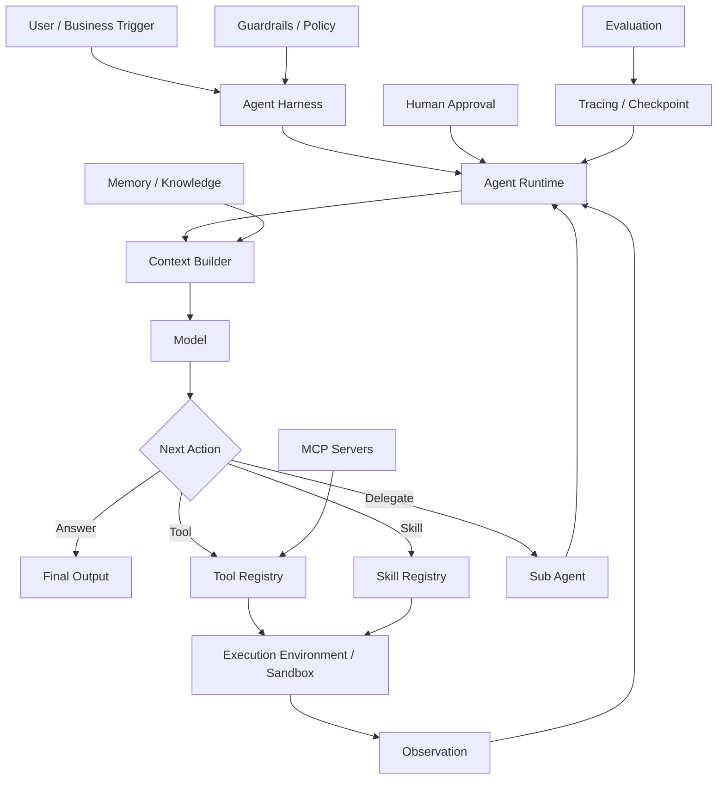
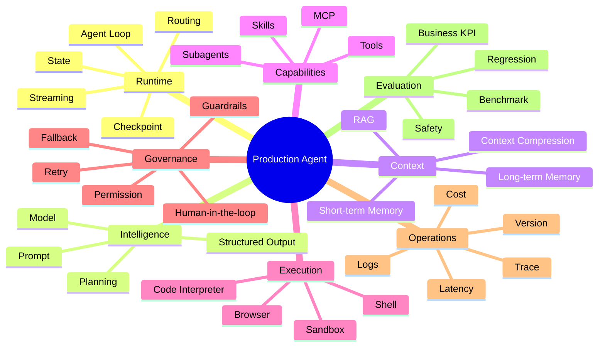
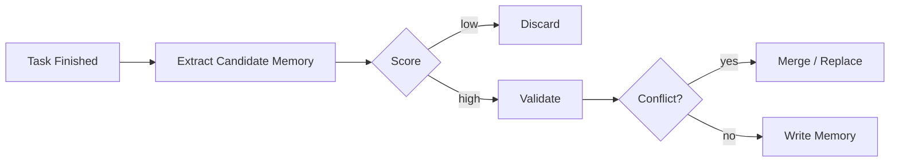
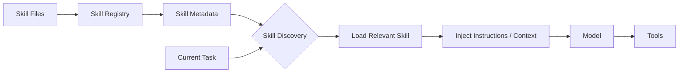
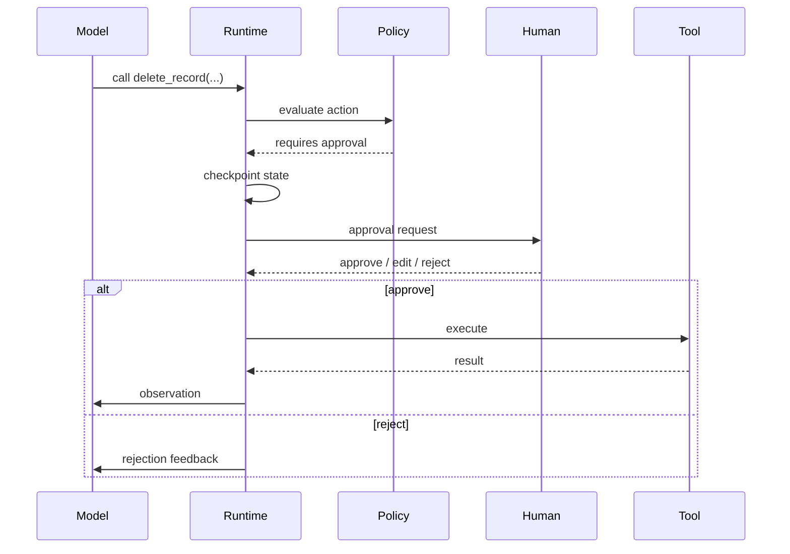
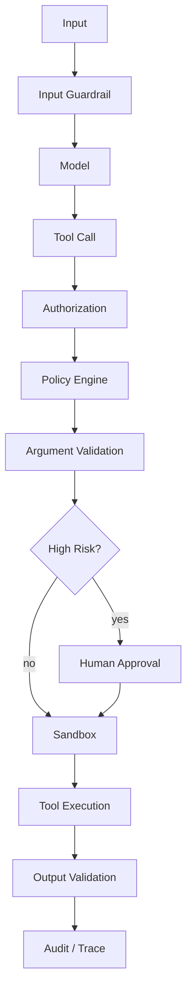
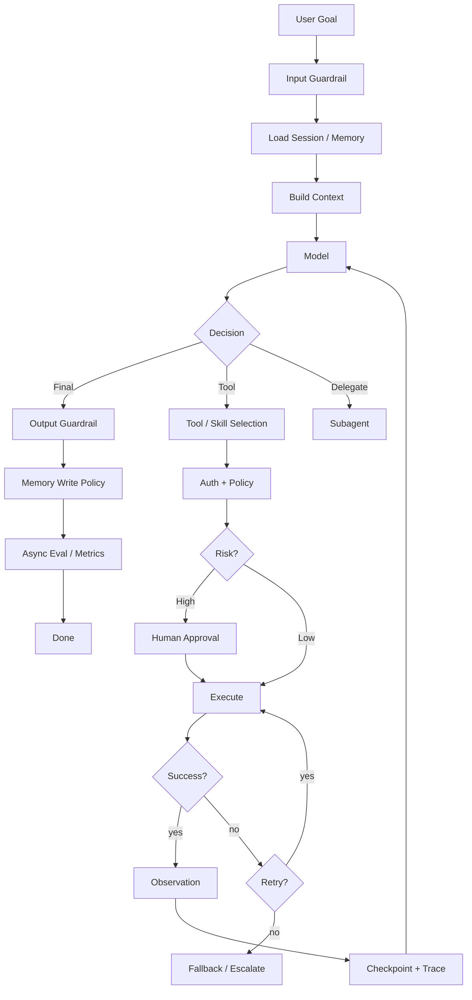
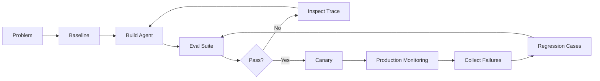

# 企业级 AI Agent 开发：从 Workflow、Harness 到治理与评测的完整知识框架

> **适用场景**：Agent 开发学习、系统设计梳理、技术面试准备、业务 Agent 架构讨论  
> **更新时间**：2026-08  
> **核心视角**：不要把 Agent 开发理解成“写 Prompt + 接几个 Tool”。生产级 Agent 需要 **Model、Agent Loop、Runtime、Harness、Context、Tools/Skills、Execution Environment、Governance、Evals** 等能力协作；其中 Loop 是执行机制，Runtime 是运行层，Harness 是支撑与装配体系，三者不要视为同义词或固定的逐级嵌套。

---

## 0. 一页总览：先建立完整心智模型

今天讨论“Agent 开发”，通常会出现两种不同语境。

### 第一类：Agentic Workflow —— 在业务流程中引入 Agent 能力

目标是解决一个业务流程中的智能决策、非结构化理解、复杂执行或重复劳动问题。

例如：

- 客服流程中，让 Agent 自动归因、查订单、生成处理建议；
- 研发流程中，让 Agent 读取需求、修改代码、执行测试；
- 运营流程中，让 Agent 分析数据、调用内部工具、生成并执行运营动作；
- 财务流程中，让 Agent 收集材料、核对异常、提交人工审批。

这类工作的核心问题是：

> **Agent 应该插在哪个业务节点？能创造什么业务价值？风险如何控制？**

它通常仍然有比较明确的流程边界。

---

### 第二类：Agent System / Agent Harness Development —— 构建一个真正可运行的 Agent

目标不是“在流程中加一个 LLM 节点”，而是构建一个能够：

1. 接收目标；
2. 获取上下文；
3. 规划或决定下一步；
4. 选择并调用 Tool / Skill / MCP；
5. 操作外部环境；
6. 观察执行结果；
7. 根据结果继续推理；
8. 必要时重试、回退、请求人工；
9. 最终完成任务；

的完整系统。

典型系统包括：

- Agent Loop / Runtime
- Model
- Context Management
- Memory
- Tool Registry
- Skill
- MCP
- Sandbox / Execution Environment
- Planning
- State / Checkpoint
- Human-in-the-loop
- Guardrails / Permission
- Retry / Recovery
- Tracing / Observability
- Eval / Benchmark

本文重点讨论第二类。

---

## 1. Agent 到底是什么：Model、Loop、Runtime、Harness 的区别

一个最简单的 Agent 可以抽象成：

```text
User Goal
   ↓
LLM
   ↓
Decide next action
   ↓
Tool call
   ↓
Observe result
   ↓
LLM
   ↓
...
   ↓
Final Answer / State Change
```

也就是经典的：

```text
Think / Decide → Act → Observe → Think / Decide → ...
```

但生产环境里的 Agent 不只有 Loop。Anthropic 的工程文章也区分了预定义 workflow 与由模型动态决定过程和工具使用的 agent。 [16](https://www.anthropic.com/engineering/building-effective-agents)

更完整的抽象是：



### 1.1 Model

负责推理、语言理解、生成和工具选择。

模型不是 Agent。

---

### 1.2 Agent Loop

负责反复执行：

```text
model → tool → observation → model
```

直到任务结束。

---

### 1.3 Agent Runtime

负责真正“运行”这个 Loop，并管理：

- message / state；
- tool dispatch；
- session；
- handoff；
- interruption；
- streaming；
- retries；
- hooks；
- checkpoint。

---

### 1.4 Agent Harness

在本文采用的工程抽象里，Harness 的关注范围比 Runtime 更宽，但这不是行业统一定义。

可以理解为：

> **为了让一个模型稳定地表现为 Agent，围绕模型、Runtime 与 Loop 搭建的整套支撑和装配结构。**

LangChain 当前文档直接使用：

```text
Agent = Model + Harness
```

并把 Prompt、Tools、Middleware、Context、Execution Environment 等都放进 Harness 的范畴。

因此这里不再使用 `Model < Agent Loop < Runtime < Harness` 表示严格包含关系，而改用职责关系：

```text
Model
  → 提供推理、生成与下一步行动选择

Agent Loop
  → 定义“判断 → 行动 → 观察 → 再判断”的反复执行机制

Agent Runtime
  → 驱动 Loop，管理 State、Tool Dispatch、中断、恢复与结束

Agent Harness
  → 装配 Runtime、Context、Tool、Memory、权限、Sandbox、Trace 等支撑能力

Production Agent System
  → 在上述基础上加入业务流程、部署、评测、监控与治理
```

这是一套便于工程讨论的职责模型，不代表所有框架都采用相同边界。本文关于 Loop、Runtime 与 Harness 的主口径与 [《Agent System 研发知识梳理》](./A-Agent-System研发知识梳理.md) 保持一致；如果其他章节出现不同表述，应优先回到该文档的概念定义进行校准。

---

# 2. 企业开发 Agent：哪些应该复用，哪些应该自己开发？

生产开发最重要的原则不是“全部自研”，而是：

> **复用通用 Agent Runtime，把研发资源集中在领域能力、业务策略和评测上。**

可以用下面四层理解。

| 层级 | 模块 | 建议 |
|---|---|---|
| L1 Runtime / Infrastructure | Agent Loop、Model adapter、State、Checkpoint、Tool calling、Streaming | **优先复用** |
| L2 Agent Capability | Memory、Tool、Skill、MCP、RAG、Sandbox、Planning | **框架能力 + 业务扩展** |
| L3 Business Governance | 权限、HITL、审批、Retry Policy、Fallback、业务约束 | **重点自定义** |
| L4 Quality / Operations | Trace、Eval、Benchmark、成本、监控、灰度、版本 | **必须自建业务标准** |

一句面试总结：

> 我不会从零实现 Agent Loop，而会优先选择成熟 Harness / Runtime；真正需要投入开发的是领域 Tool、Skill、Memory 策略、权限与审批规则、失败恢复机制，以及业务 Eval。

---

# 3. 2026 年常见 Agent 框架：它们分别解决什么？

Agent 生态目前仍然不像 React/Vue 一样只剩一两个绝对主流框架，而是存在不同抽象层级。

## 3.1 LangChain `create_agent`

LangChain 的 `create_agent` 是高层 Agent API，底层使用 LangGraph runtime，并可通过 middleware 扩展 Agent 行为。 [1](https://docs.langchain.com/oss/python/langchain/agents)

典型形式：

```python
from langchain.agents import create_agent

agent = create_agent(
    model="openai:...",
    tools=[search, query_db],
    system_prompt="..."
)
```

它帮你组装：

- Model
- Agent Loop
- Tool Calling
- Agent State
- Middleware
- Persistence / Checkpoint
- HITL 等能力

更复杂的控制能力仍大量建立在 LangGraph 的图执行和持久化能力之上。

适合：

> 想快速构建业务 Agent，但仍需要较强可定制能力。

---

## 3.2 LangGraph

LangGraph 更像：

> **状态机 / Graph Runtime for Agents**

适合：

- 显式 Workflow；
- 多节点；
- Conditional Routing；
- Checkpoint；
- Interrupt；
- Retry；
- Long-running tasks；
- Human-in-the-loop。

它比 `create_agent` 更底层、更可控。

---

## 3.3 OpenAI Agents SDK

OpenAI Agents SDK 是轻量、生产导向的 Agent SDK，提供 Agents、Handoffs / Agents-as-tools、Guardrails，并内置 Sessions、MCP、HITL 与 Tracing 等能力。 [9](https://openai.github.io/openai-agents-python/)

核心 primitives 包括：

- Agent
- Runner
- Function Tools
- Agents-as-tools
- Handoffs
- Guardrails
- Sessions
- MCP
- Human-in-the-loop
- Tracing

思路是：

```python
agent = Agent(
    name="...",
    instructions="...",
    tools=[...]
)

result = Runner.run(agent, input)
```

你定义 Agent 和业务能力，SDK 负责运行 Loop 和调度。

适合：

> 希望使用较少抽象快速开发 Agent，并复用 OpenAI 原生 Agent Runtime 的团队。

---

## 3.4 Google Agent Development Kit（ADK）

Google ADK 提供 Agent、Tool、Session/State、Memory、Callbacks/Plugins 与多 Agent 等模块化能力。 [20](https://google.github.io/adk-docs/)

典型能力包括：

- Agents；
- Sessions；
- State；
- Memory；
- Tools；
- Plugins / Callbacks；
- Multi-agent orchestration；
- Deployment。

适合 Google Cloud / Gemini 生态，也可作为通用 Agent 开发框架。

---

## 3.5 Microsoft Agent Framework

Microsoft Agent Framework 提供 Agent 与 Workflow 等开发抽象，用于构建和编排 Agent 应用。 [21](https://learn.microsoft.com/en-us/agent-framework/overview/)

Harness 提供更“batteries-included”的能力，例如：

- long-running planning；
- todo；
- context compaction；
- file access；
- memory；
- tool approval；
- observability。

同时 Workflows 提供图式编排、checkpoint 和 HITL。

这说明一个很明显的趋势：

> Agent 框架正在从简单 Agent Loop，向完整 Harness 演进。

---

## 3.6 Deep Agents

这里特别容易混淆：

> **Deep Agents 是 LangChain 生态的 Agent Harness，不是 DeepSeek 的 Agent Harness。**

Deep Agents 是 LangChain/LangGraph 生态中的 agent harness，预组装 planning、filesystem/context management、subagents、long-term memory、sandbox、HITL 与 skills 等能力。 [2](https://docs.langchain.com/oss/python/deepagents/overview)

典型能力包括：

- filesystem；
- context management；
- memory；
- subagents；
- planning；
- skills；
- sandbox；
- HITL。

所以它更接近：

```text
create_agent + 一套已经组合好的长任务 Agent Harness
```

而不是一个全新的基础模型框架。

---

# 4. 构建一个业务 Agent：从零到生产应该考虑哪些模块？

可以使用下面这张“Agent Capability Map”。



下面逐个拆。

---

# 5. Memory：Agent 记忆到底怎么设计？

记忆最容易被“数据库 / 向量库 / RAG”这些存储名词搞乱。

首先记住：

> **Memory 是语义和生命周期设计；数据库、Markdown、向量库只是存储介质。**

---

## 5.1 Short-term Memory / Working Memory

OpenAI Agents SDK 的 Sessions 可自动维护特定 session 跨多次 Run 的对话历史；Deep Agents 则把短期记忆作为当前 Agent state 的一部分管理。 [13](https://openai.github.io/openai-agents-python/sessions/) [4](https://docs.langchain.com/oss/python/deepagents/memory)

回答的问题：

> “当前这个任务 / 会话发生了什么？”

通常包括：

- Conversation Messages；
- Current Task State；
- intermediate results；
- selected tools；
- current plan；
- temporary variables。

生命周期通常是：

```text
一次 Run / 一个 Thread / 一个 Session
```

实现：

```text
Agent State
    ↓
Checkpoint / Session Store
    ↓
Redis / DB / In-memory / Framework Checkpointer
```

注意：

短期记忆**可以被持久化**。

“短期”指语义生命周期，而不是“必须存在 RAM”。

---

## 5.2 Long-term Memory

长期记忆强调跨 conversation/thread 持久化并在未来任务中复用。Deep Agents 支持 filesystem-backed memory，并通过 backend 控制持久化位置与作用域。 [4](https://docs.langchain.com/oss/python/deepagents/memory)

回答的问题：

> “未来新的任务中，有哪些过去的信息值得再次使用？”

常见三种：

### Semantic Memory

事实、偏好、稳定信息。

```text
用户偏好使用 Python
项目使用 pnpm
某客户要求输出英文报告
```

### Episodic Memory

过去发生过什么，以及什么策略成功过。

```text
上次处理类似故障时：
restart A 无效，
清理 cache + restart B 成功。
```

### Procedural Memory

未来应该“怎么做”。

它常常进一步沉淀成：

- Prompt；
- Rule；
- Skill；
- Workflow。

---

## 5.3 什么时候写入长期记忆？

关键不是 Storage，而是 **Memory Write Policy**。

一个典型策略：



候选 Memory 可以按照：

```text
importance
reusability
confidence
novelty
stability
privacy
expiry
```

评分。

例如：

```python
memory_score = (
    importance * 0.25 +
    reusability * 0.25 +
    confidence * 0.20 +
    novelty * 0.15 +
    stability * 0.15
)
```

超过阈值才写入。

---

## 5.4 Markdown 能不能作为长期记忆？

当然可以。

例如：

```text
memory/
 ├── user-preferences.md
 ├── project-decisions.md
 └── lessons-learned.md
```

如果 Agent 会在未来任务中读取这些文件，它就是长期 Memory。

但：

```text
Markdown ≠ Memory
Vector DB ≠ Memory
Database ≠ Memory
```

它们只是 Storage。

---

# 6. Knowledge Base、RAG 和 Memory 有什么区别？

最简单的判断方式：

### Knowledge Base

回答：

> “组织知道什么？”

例如：

- 产品文档；
- SOP；
- Wiki；
- API Docs；
- 公司制度。

通常是共享知识。

---

### Long-term Memory

回答：

> “这个 Agent / 用户 / 项目过去积累了什么？”

通常具有：

- 用户性；
- Agent 性；
- 任务历史；
- 动态更新。

---

### Business Data

回答：

> “现实世界现在是什么状态？”

例如：

- 当前订单状态；
- 库存；
- 支付记录；
- CRM 数据；
- 工单状态。

它必须以业务数据库为 Source of Truth。

不要让 Agent Memory 变成业务 Source of Truth。

---

## 6.1 RAG 又是什么？

RAG 不是 Knowledge Base 本身。

RAG 是：

> **Knowledge Retrieval + Context Injection 的机制。**

典型流程：

```text
Wiki / Markdown / PDF / DB
            ↓
       Parsing / Chunking
            ↓
        Embedding
            ↓
   Vector / Search Index
            ↓
User Query → Retrieval
            ↓
     Relevant Context
            ↓
           LLM
```

现代生产系统通常不是纯向量检索，而是：

```text
Vector Search
+ Keyword / BM25
+ Metadata Filter
+ Reranking
```

也就是 Hybrid Retrieval。

---

# 7. Tool：Agent 怎么知道有哪些工具？

工具是 Agent 最核心的扩展能力。

一个 Tool 最常见的结构是：

```yaml
name: search_customer
description: Search customer information by customer id.
input_schema:
  type: object
  properties:
    customer_id:
      type: string
  required:
    - customer_id
output_schema:
  type: object
  properties:
    name:
      type: string
    tier:
      type: string
```

工程上可以进一步加：

```yaml
risk_level: low
timeout: 5s
retry:
  max_attempts: 3
permission:
  scopes:
    - crm.read
requires_approval: false
```

所以可以抽象为：

```text
Tool =
Metadata
+ Input Schema
+ Output Schema
+ Executor
+ Runtime Policy
```

---

## 7.1 Tool 怎么进入模型？

模型输入不是简单的一段 Prompt。

概念上是：

```json
{
  "messages": [...],
  "tools": [
    {
      "name": "...",
      "description": "...",
      "parameters": {...}
    }
  ]
}
```

模型能够看到：

- Tool Name；
- Description；
- Parameter Schema。

然后输出结构化 tool call：

```json
{
  "tool": "search_customer",
  "arguments": {
    "customer_id": "123"
  }
}
```

Runtime：

```text
validate arguments
        ↓
policy check
        ↓
execute tool
        ↓
tool result
        ↓
add observation to context
        ↓
next model turn
```

因此面试里最准确的表达是：

> Tool metadata 最终会进入模型可见上下文，但通常通过模型原生 Tools / Function Calling 字段，而不是开发者手工把所有 Tool Description 拼进 System Prompt。

---

# 8. MCP：它和普通 Tool 接入有什么不同？

MCP 本质解决：

> **Agent 如何通过统一协议发现和调用外部能力。**

传统 Tool：

```text
Agent
 ↓
代码中手写 SDK
 ↓
Internal API
```

MCP：

```text
Agent Runtime
 ↓
MCP Client
 ↓
MCP Server
 ↓
Tools / Resources / Prompts
```

MCP Tools 规范标准化了工具发现和调用；Server 暴露的 Tool 使用名称、描述和输入 Schema 等结构化元数据。 [18](https://modelcontextprotocol.io/specification/2025-06-18/server/tools)

典型字段包括：

```text
name
title
description
inputSchema
outputSchema
annotations
```

发现过程：

```text
MCP Client
   ↓ tools/list
MCP Server
   ↓
Tool metadata
   ↓
Tool Registry
   ↓
Model
```

调用过程：

```text
Model chooses Tool
      ↓
Runtime
      ↓
tools/call
      ↓
MCP Server
      ↓
Result
```

所以一个很好的面试总结：

> **本地 Function Tool 和 MCP Tool 在模型侧最终都可以表现成 Tool；不同的是 MCP 标准化了 Tool 的远程发现、Schema 和调用协议。**

---

# 9. Skill：Skill 和 Tool 到底有什么区别？

这是 2025—2026 Agent 开发中越来越重要的一层。

### Tool

告诉 Agent：

> “你可以做什么动作。”

例如：

```text
read_file
execute_sql
send_email
search_web
```

---

### Skill

告诉 Agent：

> “面对某类任务，应该如何组织这些动作。”

例如：

```text
incident-investigation
pdf-processing
quarterly-report
code-review
```

Skill 通常包含：

- name；
- description；
- instructions；
- examples；
- workflows；
- references；
- scripts；
- tools required；
- environment requirements。

---

## 9.1 Agent Skills 的典型文件形式

Agent Skills 规范和 Deep Agents 的 Skills 实现都以 `SKILL.md` 为核心描述文件；Deep Agents 先读取元数据，相关时再加载完整 Skill，即 progressive disclosure。 [3](https://docs.langchain.com/oss/python/deepagents/skills) [19](https://agentskills.io/specification)

典型形式：

```markdown
---
name: code-review
description: Review source code for correctness, security and maintainability.
---

# Code Review

When reviewing code:

1. Inspect changed files.
2. Identify correctness issues.
3. Check security-sensitive paths.
4. Run tests when available.
5. Report high-confidence problems first.
```

其中至少需要：

```text
name
description
```

Description 非常重要，因为它负责 Skill Discovery。

---

## 9.2 Skill 怎么接入 Runtime？

一个典型机制：



不是一定要“把 Skill 封装成 Tool”。

实际存在两类机制：

### 方式 A：Context Skill

Skill 被检索后，把 Instructions 加入 Context。

适合：

- 操作规范；
- SOP；
- Coding style；
- 分析方法。

### 方式 B：Executable Skill / Tool-like Skill

Skill 具有可调用执行入口。

适合：

- PDF processing；
- 数据分析；
- 完整任务子流程。

所以 Skill 与 Tool 不是一一对应关系。

---

# 10. Sandbox / Execution Environment

只要 Agent 能：

- 运行 Shell；
- 修改文件；
- 执行 Python；
- 浏览网页；
- 操作真实系统；

就必须考虑 Execution Environment。

生产环境绝不能简单理解成：

```python
subprocess.run(model_generated_command)
```

Sandbox 至少考虑：

```text
Filesystem isolation
Network policy
CPU / memory limits
Execution timeout
Secret isolation
Process isolation
Read / write permissions
Audit log
Artifact capture
```

一个典型结构：

```text
Agent
  ↓
Tool: execute_code
  ↓
Policy Check
  ↓
Sandbox Manager
  ↓
Container / VM / Isolated Workspace
  ↓
Execution Result
```

---

# 11. Context Engineering：为什么它逐渐比 Prompt Engineering 更重要？

长任务 Agent 最大的工程问题之一：

> Context 会持续膨胀。

如果所有内容都放进 Context：

- token 成本上升；
- latency 增加；
- model attention 被噪声稀释；
- 早期错误长期污染后续判断。

所以现代 Harness 通常需要：

### Context Selection

只放当前决策需要的信息。

### Context Offloading

大 Tool Result 写文件 / Store，不直接塞 Context。

### Summarization / Compaction

把旧历史压缩。

### Retrieval

需要时重新取回。

理想逻辑：

```text
Huge World State
      ↓
Context Builder
      ↓
Only Relevant Context
      ↓
Model
```

而不是：

```text
Everything → Prompt
```

---

# 12. Human-in-the-loop：怎么开发，不只是“加个人工按钮”？

生产 HITL 本质是一个：

> **Interrupt → Persist State → Human Decision → Resume**

机制。



---

## 12.1 哪些操作需要人工？

不要只按 Tool Name 判断。

应该根据：

```text
Tool
+ Arguments
+ User
+ Environment
+ Resource
+ Risk
```

一起判断。

例如：

```python
def requires_approval(tool, args, context):
    if tool == "execute_sql":
        return not args["query"].strip().upper().startswith("SELECT")

    if tool == "write_file":
        return not args["path"].startswith("/workspace/")

    if tool == "send_email":
        return context.environment == "production"

    return False
```

这就是 Policy-based HITL。

---

## 12.2 框架怎么支持？

OpenAI Agents SDK 的 HITL 支持在敏感 Tool Call 前暂停，暴露 interruption，并使用可序列化 `RunState` 保存和恢复原 Run。 [10](https://openai.github.io/openai-agents-python/human_in_the_loop/) [14](https://openai.github.io/openai-agents-python/ref/run_state/)

核心机制包括：

```text
needs_approval
interruptions
RunState
approve / reject
resume
```

LangChain/LangGraph 通过 middleware、interrupt 与持久化状态支持 HITL，因此审批可以作为 Runtime 策略接入。 [6](https://docs.langchain.com/oss/python/langchain/human-in-the-loop) [7](https://docs.langchain.com/oss/python/langgraph/persistence)

典型能力包括：

```text
HumanInTheLoopMiddleware
interrupt_on
allowed_decisions
when
checkpointer
```

例如概念上：

```python
interrupt_on = {
    "read_data": False,
    "write_file": {
        "when": writes_outside_workspace
    },
    "execute_sql": {
        "allowed_decisions": ["approve", "reject"],
        "when": is_write_query
    }
}
```

因此企业一般不修改 Agent Loop，而是在 Runtime 的：

```text
before_tool_call
```

或 middleware / policy extension point 接入审批策略。

---

# 13. Security：Agent 安全不是一个 Guardrail

Agent 的风险来自模型能够调用工具并改变外部状态，因此安全控制必须覆盖输入、Tool Call 前后、权限、执行环境和输出；OpenAI Agents SDK 也区分 input/output guardrails 与 tool guardrails。 [11](https://openai.github.io/openai-agents-python/guardrails/)

所以需要 Defense in Depth。



生产安全重点包括：

- Prompt Injection；
- Tool Injection；
- Excessive Agency；
- Privilege Escalation；
- Secret Leakage；
- Data Exfiltration；
- destructive action；
- unsafe code execution。

基本原则：

```text
Least Privilege
Allowlist
Argument Validation
Sandbox
Human Approval
Audit
Fail Closed
```

---

# 14. Retry / Recovery：失败后不是简单“再跑一次”

这是 Agent 工程成熟度的重要分界线。

首先区分：

## System Retry

例如：

- HTTP 503；
- timeout；
- temporary MCP failure；
- rate limit。

通常由 Runtime / SDK 重试。

---

## Business Retry

例如：

> 页面找不到元素以后，是刷新、重新登录、换 selector，还是升级人工？

这需要领域策略。

---

## 14.1 Retry Policy 应该有哪些字段？

```yaml
retry_policy:
  max_attempts: 3
  retry_on:
    - TimeoutError
    - TemporaryUnavailable
  backoff: exponential
  timeout_seconds: 20
  fallback:
    model: cheaper_or_stronger_model
  on_exhausted:
    action: human_escalation
```

复杂场景还要保存：

```text
previous attempt
error category
tool arguments
observation
environment state
already executed side effects
```

特别注意：

> 有副作用的 Tool 不能无脑 Retry。

比如付款：

```text
charge_card()
```

如果网络超时，不能因为没收到 response 就直接再调用一次。

需要：

- idempotency key；
- outcome verification；
- compensation transaction。

---

## 14.2 Runtime 如何扩展业务 Retry？

LangGraph 目前支持 node-level `RetryPolicy`，可以配置：

- `max_attempts`
- `retry_on`
- timeout
- error handler

这类机制体现了一个通用设计：

> **Runtime 提供 Retry 机制，业务定义 Retry Policy。**

---

# 15. State、Checkpoint 和 Resume

长任务 Agent 必须考虑：

```text
如果跑到第 27 步服务挂了怎么办？
```

不能从头开始。

所以 Runtime 要保存：

```text
Messages
Current Plan
Tool Calls
Tool Results
Business Variables
Pending Approval
Execution Cursor
```

Checkpoint：

```text
State(t0)
 ↓
Step 1
 ↓
State(t1)
 ↓
Step 2
 ↓
State(t2)
```

失败后：

```text
resume(State(t2))
```

HITL、长任务、Workflow、Recovery 都依赖这一能力。

---

# 16. Observability：Trace 为什么是 Agent 的核心基础设施？

普通 API 可以看：

```text
request → response
```

Agent 不行。

因为 Agent 的运行结果是一条多步骤 trajectory，因此生产调试和评测需要保留完整轨迹，而不只是最终 response。 [12](https://openai.github.io/openai-agents-python/tracing/) [17](https://www.anthropic.com/engineering/demystifying-evals-for-ai-agents)

例如：

```text
User
 ↓
Model
 ↓
Tool A
 ↓
Model
 ↓
Tool B
 ↓
Subagent
 ↓
Model
 ↓
Final
```

因此必须记录：

```text
Trace
 ├── Model Turn
 ├── Tool Call
 ├── Tool Result
 ├── Guardrail
 ├── Handoff
 ├── Retry
 ├── Approval
 └── Final Result
```

OpenAI Agents SDK 内置 tracing，可记录模型生成、Tool Calls、Handoffs、Guardrails 与自定义事件，并组织为 trace/span。 [12](https://openai.github.io/openai-agents-python/tracing/)

典型 Trace 内容包括：

- agent spans；
- turns；
- generations；
- function calls；
- guardrails；
- handoffs。

Trace 的三个用途：

### Debug

为什么失败？

### Eval

失败发生在哪一步？

### Production Monitoring

成本、延迟、错误率是否恶化？

---

# 17. 一个生产 Agent 的完整请求生命周期

把前面所有模块串起来：



这张图基本就是“企业级 Agent 开发”完整框架。

---

# 18. Agent Eval：为什么不能只测最终答案？

Agent 不是单轮 Input → Output。一次任务可能包含多轮 Model、Tool、环境修改、Retry、Handoff 和 Approval，因此评测需要从完整 Task 出发，而不是只检查最后一段文本。

完整方法统一见 [《Agent Eval 与 Benchmark》](./A-Agent-Eval与Benchmark.md)。本文只保留上位框架：

~~~text
评测设计体系
1. 评测目标
2. 评测角度
3. 评测方法
4. 评测指标
5. 评测维度

评测运行体系
Dataset / Suite
→ Evaluation Harness
→ Task
→ Trial
→ Evidence
→ Grader
→ Metrics
→ Benchmark
~~~

Anthropic 对 Task、Trial、Grader、Transcript / Trace、Outcome、Evaluation Harness 与 Evaluation Suite 的定义，统一由专项文档维护。 [17](https://www.anthropic.com/engineering/demystifying-evals-for-ai-agents)

---

# 19. 五层评测设计框架必须区分目标、证据、方法、指标和维度

设计 Agent Benchmark 时，五层回答的是五个不同问题：

~~~text
评测目标
→ 什么叫成功？
→ Task / Success Criteria / Rubric

评测角度
→ 从哪里取得证据？
→ Outcome / Output / Trace

评测方法
→ 怎样判断证据？
→ Deterministic / Model / Human

评测指标
→ 怎样量化表现？
→ Success Rate / pass@k / pass^k / Cost / Latency

评测维度
→ 这些数字说明哪类能力？
→ Effectiveness / Reliability / Efficiency / Safety
~~~

必须避免把不同层级概念并列。例如 Outcome / Trace 是评测角度；pass^k 和 Cost 是指标；Reliability 和 Efficiency 才是上位评测维度。

---

# 20. 评测目标先定义 Success Criteria，再决定怎样评分

一个 Eval Task 不应该只有 Prompt。至少需要明确 Input、Initial Environment、Success Criteria、Constraints、Allowed Tools / Permissions 和必要 Budget。

明确结果可以使用 Exact / Verifiable Criteria；开放任务则通过 Rubric 把成功拆成多个 Criterion。

~~~text
Task
→ Success Criteria
   ├─ Exact Criteria
   └─ Rubric Criteria
~~~

Rubric 负责定义“评什么”，不负责规定“谁来评分”。同一个 Criterion 可以交给代码、模型或人工判断。

例如：

~~~text
Criterion：必须包含至少 2 个一手来源
→ 程序可以检查来源数量与类型

Criterion：结论是否真正由证据支持
→ Model / Human 可能更合适
~~~

---

# 21. 评测角度从结果和过程获取不同证据

结果面：

~~~text
Outcome
→ 真实环境最终状态

Output
→ 最终交付物
~~~

过程面：

~~~text
Trajectory / Trace
→ Model Turn / Tool / Retry / Handoff / Approval / Guardrail
~~~

因此：

~~~text
Outcome / Output
→ 主要回答“最后做对了吗”

Trace
→ 主要回答“怎么做的、为什么成功或失败”
~~~

只有当审批、权限、禁止 Tool 等过程本身属于 Task Constraint 时，Trace 才直接成为硬性评分对象。

---

# 22. 评分方法优先确定性，再补模型和人工判断

Agent Eval 常见三类 Grader：

~~~text
Deterministic / Code-based
→ Test / Schema / Database / File / Static Rule

Model-based
→ 开放式语义质量 / Rubric

Human Review
→ 高风险 / 高歧义 / Model Judge 校准
~~~

核心原则：

> **能够通过确定性规则客观判断的问题，不应该优先交给另一个模型判断。**

开放 Task 也可以先把 Rubric 中可检查的部分转成 Verifier。例如文件存在、引用数量、Schema、测试结果都可以脚本验收；只有真正需要语义判断的 Criterion 再交给 Model / Human。

---

# 23. 指标用于量化，维度用于解释 Agent 能力

Agent 的非确定性要求同一个 Task 运行多个 Trial，再通过指标量化：

~~~text
任务效果
→ Success Rate / Rubric Score / Criterion Pass Rate

稳定性
→ pass@1 / pass@k / pass^k / Variance / Retry Rate

效率
→ Latency / Turns / Tokens / Cost / Successful Task

安全
→ Violation / Unauthorized Action / Approval Bypass
~~~

这些仍然只是 Metrics。最终再归入能力维度：

~~~text
Effectiveness
→ 能不能做对

Reliability
→ 能不能稳定做对

Efficiency
→ 做对需要多少资源

Safety
→ 是否在允许边界内完成
~~~

因此：

~~~text
pass^k
→ 指标

Reliability
→ 维度

Cost
→ 指标

Efficiency
→ 维度
~~~

业务 KPI 与 Agent Technical Evaluation 仍应分开：

~~~text
Agent Technical Evaluation
→ Effectiveness / Reliability / Efficiency / Safety

Business KPI
→ 时间节省 / Throughput / 人力成本 / 覆盖率 / 解决率 / 用户满意度
~~~

Benchmark、Evaluation Suite、Regression Case、Eval Validation 与项目实践的完整关系统一见 [《Agent Eval 与 Benchmark》](./A-Agent-Eval与Benchmark.md)。

---

# 24. 从开发到上线：推荐 Agent Engineering 生命周期



可以浓缩成：

```text
Build → Trace → Eval → Ship → Observe → Learn
```

而不是：

```text
Prompt → Demo → Production
```

---

# 25. 一套推荐的业务 Agent 代码结构

下面不是某个具体框架 API，而是推荐的工程分层：

```text
agent/
├── runtime/
│   ├── agent.py
│   ├── state.py
│   └── orchestration.py
│
├── tools/
│   ├── registry.py
│   ├── crm.py
│   ├── database.py
│   └── browser.py
│
├── skills/
│   ├── registry.py
│   ├── incident-investigation/
│   │   └── SKILL.md
│   └── report-generation/
│       └── SKILL.md
│
├── memory/
│   ├── short_term.py
│   ├── long_term.py
│   ├── retrieval.py
│   └── write_policy.py
│
├── mcp/
│   ├── clients.py
│   └── policies.py
│
├── execution/
│   ├── sandbox.py
│   └── permissions.py
│
├── governance/
│   ├── guardrails.py
│   ├── hitl.py
│   ├── auth.py
│   └── policies.py
│
├── reliability/
│   ├── retry.py
│   ├── fallback.py
│   └── recovery.py
│
├── observability/
│   ├── tracing.py
│   └── metrics.py
│
└── evals/
    ├── datasets/
    ├── graders/
    ├── benchmarks/
    └── regression/
```

这个结构本身就是非常好的面试回答框架。

---

# 26. 面试中最容易混淆的 10 个概念

### 1. Agent ≠ Model

Model 是推理引擎，Agent 是完整执行系统。

### 2. Agent Loop ≠ Harness

Loop 只是 Harness 的核心循环。

### 3. Memory ≠ Vector DB

Memory 是语义，Vector DB 是实现。

### 4. Knowledge Base ≠ Long-term Memory

知识库是共享知识；Memory 更强调 Agent / User / Task 历史。

### 5. RAG ≠ Knowledge Base

RAG 是 Retrieval + Context Injection 架构。

### 6. Skill ≠ Tool

Tool 是 Action；Skill 是完成一类任务的方法或能力包。

### 7. MCP ≠ Tool

MCP 是 Tool / Resource / Prompt 的标准连接协议。

### 8. HITL ≠ UI Button

它是 Pause + Checkpoint + Decision + Resume Runtime 机制。

### 9. Retry ≠ Re-run

副作用操作必须考虑 Idempotency 和 Outcome Verification。

### 10. Eval ≠ Accuracy

Agent 需要同时评估 Outcome、Trajectory、Cost、Reliability 和 Safety。

---

# 27. 面试高频题：建议回答骨架

## Q1：如果让你从零设计一个业务 Agent，你会怎么做？

回答：

> 我先判断这个问题是否真的需要 Agent，而不是 Workflow。确定需要以后，我不会从零写 Agent Loop，而会优先选择成熟 Runtime，例如 LangChain create_agent、LangGraph、OpenAI Agents SDK、Google ADK 或 Microsoft Agent Framework。然后我会从 Context、Memory、Tool、Skill、MCP、Sandbox 这些能力模块设计 Agent，再补上权限、Guardrail、Human-in-the-loop、Retry、Checkpoint 和 Trace。最后在上线之前建立领域 Benchmark，从任务成功率、稳定性、成本、安全和业务 KPI 五个维度做 Eval。

---

## Q2：哪些模块应该复用，哪些应该自研？

> Agent Loop、基础 Tool Calling、State、Checkpoint、Tracing 这类通用 Runtime 能力优先复用；业务 Tool、领域 Skill、Memory 写入策略、权限和审批 Policy、业务 Retry、Benchmark 和 Eval 标准属于领域差异最大的部分，需要重点开发。

---

## Q3：Agent Memory 怎么做？

> 首先区分 Working Memory 和 Long-term Memory。Working Memory 管当前 thread 的 messages 和 state，通过 session / checkpoint 持久化；Long-term Memory 则需要 Memory Write Policy，只把未来可复用、置信度高的信息沉淀下来。存储可以是 DB、Markdown 或 Vector Store，存储介质不决定 Memory 类型。业务实时状态仍然必须以业务数据库作为 Source of Truth。

---

## Q4：MCP 和 Tool 有什么关系？

> MCP 不是一种新的 Tool，而是 Agent 发现、描述和调用外部 Tool 的标准协议。Runtime 通过 MCP Client 从 Server 获取 tool schema，再把这些 Tool 与本地 Function Tool 一起暴露给模型，因此模型侧最终看到的是统一 Tool 抽象。

---

## Q5：Human-in-the-loop 怎么实现？

> 关键是 Interrupt + Checkpoint + Resume。我会给 Tool Call 增加 Policy Evaluation，根据 Tool、参数、用户、环境和风险决定是否暂停。高风险操作持久化 RunState，并向审批系统创建请求，人工 approve/edit/reject 后继续原 Run，而不是重新执行整个 Agent。

---

## Q6：Agent 安全怎么做？

> 我不会只依赖一个 Guardrail，而会做 Defense in Depth：输入检查、身份认证、最小权限、Tool allowlist、参数校验、Policy Engine、Sandbox、Human Approval、输出检查和完整审计。尤其要把权限判断放在 Tool Execution 之前，而不能只依赖模型自己遵守 Prompt。

---

## Q7：Agent 失败重试怎么设计？

> 先区分系统重试和业务重试。网络错误、5xx 这类可以由 Runtime Retry；业务失败则根据 error type、environment state 和 side effect 定义策略。对于支付、删除等副作用操作必须通过 idempotency key 和 outcome verification 避免重复执行。达到最大重试次数以后进入 fallback 或人工升级。

---

## Q8：Agent 怎么评测？

> Agent Eval 不能只看最终答案。我会建立 Task、Trial、Grader、Trace、Outcome 和 Eval Suite。指标至少覆盖任务完成度、trajectory、稳定性、成本延迟和安全；业务 Agent 还必须回到业务 KPI，看是否真正节省时间、降低成本或解决原本无法规模化处理的问题。完整方法见 [《Agent Eval 与 Benchmark》](./A-Agent-Eval与Benchmark.md)。

---

# 28. 最后形成一个统一理解

如果只记住一张图，请记住下面这个模型：

```text
                      ┌─────────────────────┐
                      │      Business       │
                      │ Value / Workflow KPI│
                      └─────────┬───────────┘
                                │
                    ┌───────────▼───────────┐
                    │ Governance & Quality  │
                    │ HITL / Security / Eval│
                    │ Retry / Trace / Policy│
                    └───────────┬───────────┘
                                │
                ┌───────────────▼───────────────┐
                │      Agent Capabilities       │
                │ Memory / Skill / Tool / MCP   │
                │ RAG / Planning / Sandbox      │
                └───────────────┬───────────────┘
                                │
                    ┌───────────▼────────────┐
                    │ Agent Runtime / Harness│
                    │ Loop / State / Runner  │
                    │ Checkpoint / Streaming │
                    └───────────┬────────────┘
                                │
                         ┌──────▼──────┐
                         │    Model    │
                         └─────────────┘
```

真正成熟的 Agent Engineering 思维是：

> **底层 Runtime 尽量复用，领域能力模块化接入，关键动作策略化治理，所有行为可观测，所有版本可评测，最终回到业务价值。**

这也是“做出 Demo”和“做出生产级 Agent”的本质区别。

---

# 29. 建议学习顺序

如果为了面试和系统掌握，建议按这个顺序：

```text
1. Agent vs Workflow
       ↓
2. Agent Loop / Runtime / Harness
       ↓
3. Tool Calling
       ↓
4. State + Checkpoint
       ↓
5. Memory + RAG
       ↓
6. Skill
       ↓
7. MCP
       ↓
8. Sandbox
       ↓
9. HITL + Security
       ↓
10. Retry + Recovery
       ↓
11. Trace / Observability
       ↓
12. Eval / Benchmark
       ↓
13. Business ROI
```

如果前 4 层没有理解清楚，后面很容易变成“背框架名词”。

---

# 30. 参考文献

> 正文统一使用可点击的 `[编号]` 引用；编号与本节一一对应。参考资料优先采用官方文档、协议规范、原始工程文章与 Benchmark 来源。

1. [LangChain — Agents / create_agent](https://docs.langchain.com/oss/python/langchain/agents)
2. [LangChain — Deep Agents overview](https://docs.langchain.com/oss/python/deepagents/overview)
3. [LangChain — Deep Agents Skills](https://docs.langchain.com/oss/python/deepagents/skills)
4. [LangChain — Deep Agents Memory](https://docs.langchain.com/oss/python/deepagents/memory)
5. [LangChain — Deep Agents Sandboxes](https://docs.langchain.com/oss/python/deepagents/sandboxes)
6. [LangChain — Human-in-the-loop](https://docs.langchain.com/oss/python/langchain/human-in-the-loop)
7. [LangGraph — Persistence](https://docs.langchain.com/oss/python/langgraph/persistence)
8. [LangGraph — Graph API / Retry Policy](https://docs.langchain.com/oss/python/langgraph/use-graph-api)
9. [OpenAI Agents SDK — Overview](https://openai.github.io/openai-agents-python/)
10. [OpenAI Agents SDK — Human-in-the-loop](https://openai.github.io/openai-agents-python/human_in_the_loop/)
11. [OpenAI Agents SDK — Guardrails](https://openai.github.io/openai-agents-python/guardrails/)
12. [OpenAI Agents SDK — Tracing](https://openai.github.io/openai-agents-python/tracing/)
13. [OpenAI Agents SDK — Sessions](https://openai.github.io/openai-agents-python/sessions/)
14. [OpenAI Agents SDK — RunState](https://openai.github.io/openai-agents-python/ref/run_state/)
15. [OpenAI Agents SDK — Durable execution](https://openai.github.io/openai-agents-python/running_agents/)
16. [Anthropic — Building Effective Agents](https://www.anthropic.com/engineering/building-effective-agents)
17. [Anthropic — Demystifying Evals for AI Agents](https://www.anthropic.com/engineering/demystifying-evals-for-ai-agents)
18. [Model Context Protocol — Tools Specification](https://modelcontextprotocol.io/specification/2025-06-18/server/tools)
19. [Agent Skills — Specification](https://agentskills.io/specification)
20. [Google Agent Development Kit](https://google.github.io/adk-docs/)
21. [Microsoft Agent Framework — Overview](https://learn.microsoft.com/en-us/agent-framework/overview/)
22. [SWE-bench — Official site](https://www.swebench.com/)
23. [GAIA — arXiv paper](https://arxiv.org/abs/2311.12983)


---

## 最短面试版总结

如果面试官让你用 1 分钟解释 Agent 开发，可以回答：

> 我会把 Agent 开发分为两个语境：一类是在既有业务 Workflow 中引入 Agent 能力，重点看业务价值和流程控制；另一类是构建完整 Agent System。对于后者，我通常不会从零实现 Agent Loop，而是复用成熟 Runtime 或 Harness，再围绕 Memory、Tool、Skill、MCP、RAG、Sandbox 等模块扩展领域能力。在生产环境还必须补齐 Human-in-the-loop、权限和 Guardrail、Retry 和 Recovery、Checkpoint、Tracing 等治理和可靠性机制。最后用 Agent Eval 来持续迭代，不只看回答准确率，而是同时看任务 Outcome、执行轨迹、稳定性、成本、安全以及最终业务 ROI。
