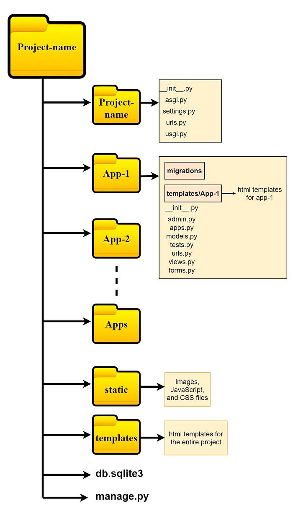
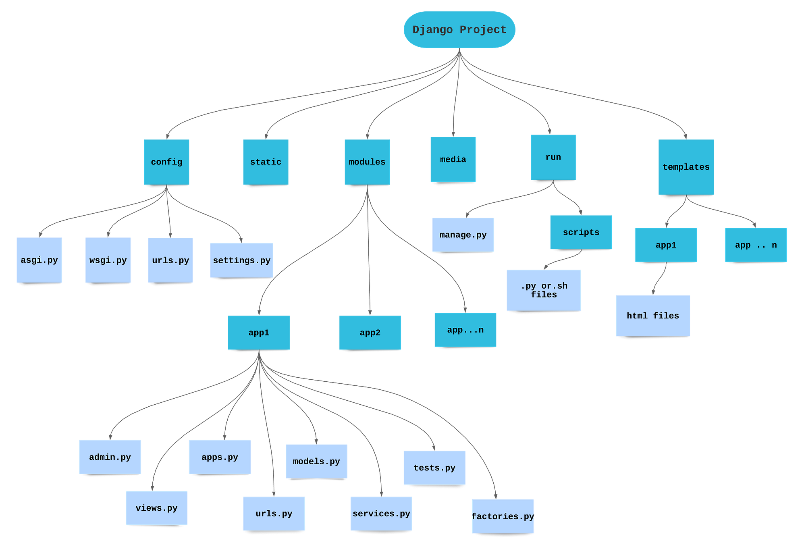

实现一个Django从0到1的搭建过程。

<!--more-->

## 参考链接

> #### [Django+DRF基础教程（前后端分离）](https://blog.csdn.net/m0_71273766/article/details/133218567)
>
> #### [django框架向DRF框架演变过程详解](https://blog.csdn.net/qq_39208536/article/details/131701180)
>
> #### [**一文到底——Django使用教程**](https://blog.csdn.net/Ans_min/article/details/123146335)
>
> #### [Django官方文档](https://docs.djangoproject.com/zh-hans/5.0/)

## Start

### 项目总览

```python
# 安装
pip install django
# 创建项目
django-admin startproject mysite
# 创建APP应用
python manage.py startapp blog
# 目录结构
mysite/
    manage.py
    mysite/           # 配置目录
        settings.py
        urls.py
        wsgi.py
# 运行项目
python manage.py runserver
# 浏览器访问
http://127.0.0.1:8000/ # 默认
```

> Django 采用 **“一个项目 Project + 多个应用 App”** 的结构。



#### 从0到1的一个Django示例

[Front_End/实战项目/mysite at main · cxDlogver/Front_End](https://github.com/cxDlogver/Front_End/tree/main/实战项目/mysite)

### 项目基本结构

```python
mysite/
    manage.py
    mysite/
        __init__.py
        settings.py
        urls.py
        asgi.py
        wsgi.py
    blog/
        __init__.py
        admin.py
        apps.py
        models.py
        tests.py
        views.py
        migrations/
            __init__.py
```

#### 1. manage.py

位置：`mysite/manage.py`

基本代码示例（创建后）

```python
#!/usr/bin/env python
import os
import sys

def main():
    os.environ.setdefault('DJANGO_SETTINGS_MODULE', 'mysite.settings')
    try:
        from django.core.management import execute_from_command_line
    except ImportError as exc:
        raise ImportError(
            "Couldn't import Django."
        ) from exc
    execute_from_command_line(sys.argv)

if __name__ == '__main__':
    main()
```

作用

- 整个 Django 项目的命令入口。
- 负责加载 `mysite.settings`，并执行各种 `manage.py` 子命令。
- Django 的 `python manage.py <command>` 指令体系是**由 manage.py 调用 Django 的命令框架（django.core.management）实现的**。
- Django 从两类位置加载命令： 内置 commands + INSTALLED_APPS 的 custom commands， 每个APP可以自定义命令。

常用命令

```python
python manage.py runserver          # 启动开发服务器
python manage.py startapp blog      # 创建应用
python manage.py makemigrations     # 创建迁移文件
python manage.py migrate            # 应用迁移到数据库
python manage.py createsuperuser    # 创建后台管理员
python manage.py shell              # 启动 Django shell
```

> 一般不修改此文件。

#### 2. 项目包 mysite/

##### 2.1 mysite/**init**.py

```
# 空文件，一般是空的或只做版本标记
```

作用：标记 `mysite` 为一个 Python 包。一般不改。

------

##### 2.2 mysite/settings.py

项目的全局配置文件。

精简示例

```python
from pathlib import Path

BASE_DIR = Path(__file__).resolve().parent.parent

SECRET_KEY = '开发环境随机密钥'

DEBUG = True

ALLOWED_HOSTS = []  # 部署时改为域名 / IP

INSTALLED_APPS = [
    'django.contrib.admin',
    'django.contrib.auth',
    'django.contrib.contenttypes',
    'django.contrib.sessions',
    'django.contrib.messages',
    'django.contrib.staticfiles',

    'blog',  # 自己的应用
]

MIDDLEWARE = [
    'django.middleware.security.SecurityMiddleware',
    'django.contrib.sessions.middleware.SessionMiddleware',
    'django.middleware.common.CommonMiddleware',
    'django.middleware.csrf.CsrfViewMiddleware',
    'django.contrib.auth.middleware.AuthenticationMiddleware',
    'django.contrib.messages.middleware.MessageMiddleware',
    'django.middleware.clickjacking.XFrameOptionsMiddleware',
]

ROOT_URLCONF = 'mysite.urls'

TEMPLATES = [
    {
        'BACKEND': 'django.template.backends.django.DjangoTemplates',
        'DIRS': [BASE_DIR / 'templates'],  # 全局模板目录
        'APP_DIRS': True,                  # 自动扫描各 app 的 templates/
        'OPTIONS': {
            'context_processors': [
                'django.template.context_processors.debug',
                'django.template.context_processors.request',
                'django.contrib.auth.context_processors.auth',
                'django.contrib.messages.context_processors.messages',
            ],
        },
    },
]

WSGI_APPLICATION = 'mysite.wsgi.application'

DATABASES = {
    'default': {
        'ENGINE': 'django.db.backends.sqlite3',      # 默认 sqlite
        'NAME': BASE_DIR / 'db.sqlite3',
    }
}

AUTH_PASSWORD_VALIDATORS = [
    {'NAME': 'django.contrib.auth.password_validation.UserAttributeSimilarityValidator',},
    {'NAME': 'django.contrib.auth.password_validation.MinimumLengthValidator',},
    {'NAME': 'django.contrib.auth.password_validation.CommonPasswordValidator',},
    {'NAME': 'django.contrib.auth.password_validation.NumericPasswordValidator',},
]

LANGUAGE_CODE = 'zh-hans'
TIME_ZONE = 'Asia/Shanghai'
USE_I18N = True
USE_TZ = True

STATIC_URL = 'static/'
STATICFILES_DIRS = [BASE_DIR / 'static']   # 全局静态目录

DEFAULT_AUTO_FIELD = 'django.db.models.BigAutoField'
```

**作用**

- 指定项目的所有全局配置。
- 关键部分：
  - INSTALLED_APPS：启用哪些应用
  - DATABASES：数据库类型和连接配置
  - TEMPLATES：模板引擎和模板目录
  - STATIC_URL / STATICFILES_DIRS：静态文件设置
  - LANGUAGE_CODE / TIME_ZONE：语言与时区
  - DEBUG / ALLOWED_HOSTS：调试模式与安全相关设置

**常见改动**

- 添加自己的 app：

  ```python
  INSTALLED_APPS += ['blog']
  ```

- 切换数据库到 MySQL、PostgreSQL 等。

- 新增模板目录、静态目录、媒体文件配置等。

------

##### 2.3 mysite/urls.py

全局 URL 路由入口。

**基本代码示例**

```python
from django.contrib import admin
from django.urls import path, include

urlpatterns = [
    path('admin/', admin.site.urls),        # 后台站点
    path('blog/', include('blog.urls')),   # 分发到 blog 应用
]
```

**作用**

- 接收浏览器请求的 URL，决定交给哪个应用处理。
- 每个应用有自己的 `urls.py`，通过 `include()` 引入。
- 常用模式：项目级 `urls.py` 里只做路由分发，不写业务逻辑。

------

##### 2.4 mysite/wsgi.py

WSGI 部署入口，一般用于生产环境部署如 Gunicorn、uWSGI。

**基本代码示例**

```python
import os
from django.core.wsgi import get_wsgi_application

os.environ.setdefault('DJANGO_SETTINGS_MODULE', 'mysite.settings')

application = get_wsgi_application()
```

**作用**

- 提供一个名为 `application` 的 WSGI 应用对象，供 Web 服务器调用。
- 部署时写在 Gunicorn / uWSGI 的配置中。
- 开发阶段基本不改。

------

##### 2.5 mysite/asgi.py

ASGI 部署入口，用于异步支持（如 WebSocket）。

```python
import os
from django.core.asgi import get_asgi_application

os.environ.setdefault('DJANGO_SETTINGS_MODULE', 'mysite.settings')

application = get_asgi_application()
```

作用类似 wsgi.py，只是用于 ASGI 服务器（如 uvicorn、daphne）。

#### 3. 应用目录 blog/

##### 3.1 blog/**init**.py

```
# 一般为空
```

作用：标记 `blog` 为 Python 包。

------

##### 3.2 blog/apps.py

应用配置类。

**默认代码**

```python
from django.apps import AppConfig

class BlogConfig(AppConfig):
    default_auto_field = 'django.db.models.BigAutoField'
    name = 'blog'
```

**作用**

- 标识 app 在项目中的配置名。
- 如果需要应用级别的启动逻辑（如信号注册），可以在这里扩展。
- 通常在 `INSTALLED_APPS ` 中会看到 `'blog.apps.BlogConfig'` 或简写 `'blog'`。

------

##### 3.3 blog/models.py

用于定义数据库表（模型，Model）。

**示例：定义文章模型**

```python
from django.db import models

class Article(models.Model):
    title = models.CharField(max_length=200, verbose_name='标题')
    content = models.TextField(verbose_name='内容')
    created_at = models.DateTimeField(auto_now_add=True, verbose_name='创建时间')
    updated_at = models.DateTimeField(auto_now=True, verbose_name='更新时间')

    class Meta:
        ordering = ['-created_at']           # 默认按时间倒序
        verbose_name = '文章'
        verbose_name_plural = '文章'

    def __str__(self):
        return self.title
```

**作用**

- 每个 Model 类对应数据库中的一张表。

- 字段（Field）对应表中的列，例如 CharField、TextField、DateTimeField 等。

- 定义好后通过：

  ```python
  python manage.py makemigrations
  python manage.py migrate
  ```

  来生成并同步数据库结构。

------

##### 3.4 blog/migrations/

迁移文件目录。

- `__init__.py` 标记为包。
- 每次 `makemigrations` 会生成类似 `0001_initial.py` 的文件。

示例（自动生成，大概结构）：

```python
# blog/migrations/0001_initial.py
from django.db import migrations, models

class Migration(migrations.Migration):

    initial = True

    dependencies = []

    operations = [
        migrations.CreateModel(
            name='Article',
            fields=[
                ('id', models.BigAutoField(primary_key=True, serialize=False)),
                ('title', models.CharField(max_length=200)),
                ('content', models.TextField()),
                ('created_at', models.DateTimeField(auto_now_add=True)),
            ],
        ),
    ]
```

作用：记录数据库结构变更，可版本化管理、回滚。

------

##### 3.5 blog/views.py

视图函数或类视图，处理具体业务逻辑。

示例 1：最简单的 HttpResponse

```python
from django.http import HttpResponse

def hello(request):
    return HttpResponse("Hello Django, this is blog hello page.")
```

示例 2：结合模板渲染

```python
from django.shortcuts import render
from .models import Article

def index(request):
    articles = Article.objects.all()
    context = {"articles": articles}
    return render(request, "blog/index.html", context)
```

作用：

- 接收请求对象 `request`；
- 调用 Model 查询数据；
- 渲染模板或返回 Json / HttpResponse；
- 返回响应给浏览器。

------

##### 3.6 blog/urls.py

需要手动创建，用于定义 blog 应用内的路由。

**示例**

```python
from django.urls import path
from . import views

urlpatterns = [
    path('hello/', views.hello, name='blog_hello'),
    path('', views.index, name='blog_index'),
]
```

然后在 `mysite/urls.py` 中 include：

```python
path('blog/', include('blog.urls')),
```

作用：

- 把与 blog 相关的 URL 集中维护。
- 利于模块化和解耦。

------

##### 3.7 blog/admin.py

注册模型到 Django Admin 后台。

**示例**

```python
from django.contrib import admin
from .models import Article

@admin.register(Article)
class ArticleAdmin(admin.ModelAdmin):
    list_display = ('id', 'title', 'created_at')
    search_fields = ('title',)
    list_filter = ('created_at',)
```

**作用：**

- 控制对应模型在 `/admin/` 后台中的展示方式：
  - 列表显示哪些字段
  - 支持搜索、过滤、排序等
- 是快速构建后台管理界面的关键文件。

------

##### 3.8 blog/tests.py

编写单元测试。

**示例**

```python
from django.test import TestCase
from .models import Article

class ArticleModelTest(TestCase):
    def test_create_article(self):
        a = Article.objects.create(title="Test", content="Content")
        self.assertEqual(a.title, "Test")
```

作用：

- 用于验证模型、视图等逻辑是否正确。
- 在持续集成、重构时尤其重要。

#### 4. 常见辅助目录

##### 4.1 templates/

项目根目录下：

```python
mysite/
    templates/
        blog/
            index.html
```

`index.html` 示例：

```html
<!DOCTYPE html>
<html>
<head>
    <meta charset="utf-8">
    <title>Blog Index</title>
</head>
<body>
    <h1>文章列表</h1>
    
        <h2>{{ a.title }}</h2>
        <p>{{ a.content|truncatechars:100 }}</p>
        <small>{{ a.created_at }}</small>
        <hr>
    
        <p>暂无文章</p>
    
</body>
</html>
```

作用：存放 HTML 模板，配合 `render()` 使用。

------

##### 4.2 static/

```
mysite/
    static/
        css/
            style.css
```

`style.css` 示例：

```css
body { font-family: sans-serif; }
h1 { font-size: 24px; }
```

模板里引用：

```html

<link rel="stylesheet" href="">
```

作用：管理 CSS / JS / 图片 等静态资源。

### MVT结构

#### 1. 什么是 Django 的 MVT 结构

Django 使用一种类似 MVC（Model–View–Controller）的架构，但强调 Web 开发中的模板渲染，因此称为 **MVT（Model–View–Template）**。

核心思想：

- **Model**：负责数据层（数据库结构、ORM 操作）
- **View**：负责业务逻辑层（处理请求、数据处理、返回响应）
- **Template**：负责展示层（HTML 页面渲染）

与 MVC 的不同点：

- Django 把“控制器”隐藏在框架内部（URL 分发器、模板渲染器），开发者无需手动写 Controller
- 视图函数（View）更接近 MVC 中的“Controller”

因此 Django 实际结构：

```
用户请求 → URL 路由 → View(业务逻辑) ↔ Model(数据库)
                                    ↓
                               Template(页面)
                                    ↓
                               返回给浏览器
```

------

#### 2. 部分的职责与代码位置

##### 2.1. Model（模型层）

位置：`app/models.py`

职责：

- 定义数据库表结构（映射为 Python 类）
- 使用 Django ORM 提供增删改查（查询集 QuerySet）
- 承担业务实体的数据规则（字段类型、关系）

模型的本质：

**数据库的一行记录 -> 一个 Python 对象**

------

##### 2.2. View（视图层）

位置：`app/views.py`

职责：

- 接收 HTTP 请求
- 调用 Model 获取或处理数据
- 选择模板并渲染
- 返回 HTTP 响应（HTML、JSON 等）

View 的本质：

**业务逻辑处理方法，是 Django 中最接近 MVC Controller 的部分**

------

##### 2.3. Template（模板层）

位置：`templates/目录/*.html`

职责：

- 负责页面呈现（HTML、CSS）
- 不包含业务逻辑（仅渲染数据，不处理数据）
- 使用 Django 模板语言（DTL）

Template 的本质：

**纯展示层，不做逻辑运算，只展示 View 传来的数据**

------

#### 3. URL 路由（MVT 的入口）

虽然不属于 MVT 三部分本身，但它是 MVT 的启动点。

位置：

- 项目级：`mysite/urls.py`
- 应用级：`blog/urls.py`

示例：

```
# blog/urls.py
from django.urls import path
from . import views

urlpatterns = [
    path('articles/', views.article_list),
]
```

作用：

- 将 URL 与 View 对应起来
- 决定用户访问哪个页面时由哪个 View 来处理

本质上 URL 分发器承担了传统 MVC 的 Controller 中的一部分工作。

------

#### 4. MVT 与 MVC 的关系

Django 的 MVT 对应 MVC 的映射关系如下：

| Django                     | MVC 对应   | 职责               |
| -------------------------- | ---------- | ------------------ |
| Model                      | Model      | 数据与业务实体     |
| View                       | Controller | 业务逻辑、响应请求 |
| Template                   | View       | 展示 HTML 页面     |
| URL Dispatcher（系统内部） | Controller | 路由分发           |

关键点：

- Django 框架自动处理了 Controller 的大量工作，因此你只需要写 View（业务逻辑）

------

#### 5. 完整的数据流（面试常问）

请求过程（从访问 URL 到页面显示）：

1. 浏览器访问 URL，例如 `/blog/articles/`
2. `urls.py` 匹配到对应 View，例如 `article_list()`
3. View 调用 Model 查询数据库
4. View 将数据传给 Template 渲染
5. Template 生成 HTML
6. View 将 HTML 包装成 HttpResponse 返回给浏览器

流程图（文字版）：

```
URL → View → Model → 数据 → View → Template → HTML → Response → 用户
```

> 为什么 Django 使用 MVT 而不是 MVC？

原因：

1. Web 开发中 HTML 模板是核心部分，因此作为独立层 Template 更合理
2. Django 自动处理了传统 MVC 的 Controller，例如路由调度、模板渲染器
3. 开发者关注点清晰：
   - Model：数据
   - View：逻辑
   - Template：呈现

Django 提供了更高层封装，使 Web 开发更轻量和快速。

> Django 的 MVT 和 MVC 有什么区别？

<u>最大的区别即MVT提供了更高层封装，例如URL分发器等框架自动处理了 Controller 的大量工作，将重心放在的业务逻辑处理和页面渲染。</u>

Django 采用 MVT 模式，它是对 MVC 的一种实现变体。三者的角色是：

1. **Model**：负责数据和业务实体部分，和 MVC 中的 Model 完全一致
2. **View（Django）**：负责接收请求与业务逻辑，这部分更像 MVC 中的 Controller
3. **Template**：负责页面展示逻辑，对应 MVC 中的 View

换句话说：

- Django 把 Controller 的工作拆成两部分：
  1）URL 分发器（由框架自动处理）
  2）View（编写的业务逻辑函数或类）

所以常见映射是：

```
MVC              MVT(Django)
--------------------------------------
Model     ->     Model
View      ->     Template
Controller->     View + URL Dispatcher
```

举例说明（文章列表页）：

- 在 MVC 里 Controller 负责调取文章数据，并让 View 显示
- 在 Django MVT 里 View 负责调取数据，然后把数据交给 Template 展示

因此 MVT 本质上和 MVC 思想一致，只是名称和职责边界因 Django 的封装而有所不同。

## DRF

实现 Django REST 和前后端分离，本质上是把「Django 输出 HTML 页面」改成「Django 输出 JSON API」，由前端框架（Vue/React 等）来渲染界面。需要调整的部分包括：

1. Django REST + 前后端分离的核心是：**后端不再渲染 HTML，只提供 JSON API**，页面由前端框架负责。
2. 后端需要：引入 DRF、使用 Serializer 和 APIView/ViewSet、设计 RESTful URL、改用 Token/JWT 认证、处理好 CORS 和 CSRF。
3. 部署上：前端和后端解耦，往往分域名/端口部署，通过 Nginx 或代理把 `/api/` 转给 Django，其它路径交给前端静态资源。