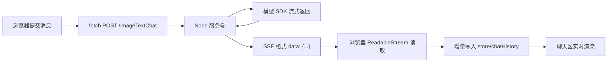

# linxi 项目流式输出从 0 到 1 知识梳理

## 一、文档目标
本文不是单纯讲一段流式代码怎么写，而是从产品体验、协议设计、服务端转发、前端消费、增量渲染、中断控制几个层面，把“流式输出”作为一套完整能力来理解。

结合 `linxi` 项目，这份文档重点回答三个问题：

1. 为什么聊天系统需要流式输出。
2. 一条模型流式响应链路到底经历了什么。
3. 从 0 到 1 自己设计流式输出时，应该按什么顺序搭建。

---

## 二、先建立正确认知：什么叫流式输出

## 2.1 流式输出不是“更快算完”，而是“更早可见”
模型生成答案通常需要时间。  
如果采用传统一次性响应，用户必须等待服务端把整段内容都拿到后才能看到结果。  
如果采用流式输出，模型每生成一小段内容，就立刻向前传递，前端也立刻渲染。

因此，流式输出提升的首先不是“模型绝对耗时”，而是：

- 首字出现时间更短
- 用户等待焦虑更低
- 交互更像真实对话
- 中断更有意义

## 2.2 什么是“流”
在工程语境里，流可以理解为：

> 数据不是一次性整体到达，而是被拆成多个连续片段逐步传输。

在 AI 聊天场景下，这些片段通常表现为：

- token 级别
- 字符串片段级别
- SSE message 级别
- SDK chunk 级别

对前端来说，最重要的不是底层 token 细节，而是：

1. 数据会持续到达
2. 数据需要被增量拼接
3. 任何时刻都可能结束、报错或被中断

---

## 三、linxi 项目中的流式输出全链路

## 3.1 当前项目的链路结构
`linxi` 当前采用的是“模型 SDK 流 -> Node 服务端转 SSE -> 浏览器 fetch 消费流 -> 状态驱动渲染”的模式。



## 3.2 项目里前后端各自负责什么

### 前端负责
- 发起请求
- 持有 `AbortController`
- 读取响应流
- 解析服务端推送的数据块
- 把增量内容拼接进当前 assistant 消息
- 在 UI 上实时显示

### 服务端负责
- 作为模型网关
- 接收前端统一请求
- 调用 `LinXiAPI`
- 把模型流转成浏览器更容易消费的 SSE 格式
- 处理结束、异常和兼容性分支

### 模型 SDK 负责
- 与模型提供方建立真实流式连接
- 按 chunk 返回增量内容

---

## 四、为什么实际工程里常常要加一层服务端

## 4.1 服务端不是多余的一层
很多人一开始会问：前端既然能调接口，为什么还要有 `serve/index.js`？

原因主要有四个：

### 1. 隐藏模型密钥
API Key 不应该暴露在浏览器端。

### 2. 统一协议
前端不一定直接消费模型厂商原始流格式，服务端可以统一封装成自己的协议。

### 3. 兼容多模型能力
文本、图片、文件模型能力不完全一致，服务端可以做统一路由和适配。

### 4. 可控的错误处理
流式过程中出现错误、超时、中断、回退，都更适合在服务端统一处理。

`linxi` 的 `serve/index.js` 就承担了这个“模型网关 + 协议适配层”的角色。

---

## 五、从 0 到 1 实现流式输出的完整拆解

## 5.1 第一步：先明确交互目标
流式输出不是先写代码，而是先定义体验目标。至少要回答：

1. 首次内容出现前，UI 显示什么状态。
2. 内容到达后，是逐字显示、逐段显示，还是缓冲后显示。
3. 用户是否可以中断。
4. 中断后保留已生成内容还是整段清空。
5. 失败时如何降级。

在 `linxi` 中，答案基本是：

- 请求开始时进入 `thinking`
- 先插入一条 assistant 占位消息
- 内容持续到达后逐步替换占位内容
- 支持中断
- 中断后保留已生成部分或给出提示

## 5.2 第二步：定义前后端协议
流式输出真正稳定的关键，不是 UI，而是协议。

一个最小可用协议至少要定义：

- 增量字段，例如 `delta`
- 结束标记，例如 `done`
- 错误字段，例如 `error`

`linxi` 当前服务端输出的是类似下面这样的 SSE 片段：

```text
data: {"delta":"你好"}

data: {"delta":"，我是"}

data: {"done":true}
```

这说明前端只要理解三种状态：

1. 继续追加
2. 正常结束
3. 异常终止

## 5.3 第三步：服务端把模型流转成浏览器友好的流
模型 SDK 直接返回的往往是 SDK 自己定义的流对象，而不是浏览器最熟悉的展示协议。  
所以服务端要做一次“流格式翻译”。

在 `linxi` 里，这一层主要体现在：

1. `serve/index.js` 接收 `/imageTextChat` 请求
2. 调用 `linxiApi.imageTextChat({ stream: true })`
3. `for await...of` 消费模型返回的 chunk
4. 从 chunk 中提取 `delta.content`
5. 以 `text/event-stream` 形式写回浏览器

这一步的本质是：

> 把模型厂商协议适配成自己的应用协议。

## 5.4 第四步：前端把响应当作流来读，而不是当作普通 JSON
普通请求一般是：

1. `await fetch(...)`
2. `await response.json()`

流式请求不同，它要拿到 `response.body` 后持续读取：

1. 获取 `ReadableStream`
2. 创建 `reader`
3. 循环 `reader.read()`
4. 对每个 chunk 解码
5. 解析增量内容
6. 持续更新状态

这说明流式输出的核心转变是：

- 一次性响应是“等结果”
- 流式响应是“边接收边处理”

## 5.5 第五步：增量内容不能直接覆盖丢失，要做缓冲拼接
流式返回时，每次读到的并不是完整答案，而是局部片段。  
因此前端必须有一套缓冲策略。

`linxi` 当前实现里有三个重要变量：

- `streamBuffer`：处理半包、粘包问题
- `pendingRenderChunk`：暂存待渲染内容
- `streamedText`：已经确认展示的完整内容

这三个层次分别解决不同问题：

### `streamBuffer`
解决网络分片问题。  
一次 `reader.read()` 读到的内容不一定正好是完整一条 SSE message，所以要先累积，按 `\n\n` 切分。

### `pendingRenderChunk`
解决“刚收到但还没正式刷到 UI”的问题。  
它适合做节流渲染，避免 UI 更新过于频繁。

### `streamedText`
表示当前已经确定展示给用户的完整文本。  
它是最终的渲染依据。

## 5.6 第六步：把“请求流”转换成“界面流”
很多人做流式输出时，只关注网络流，却忽略了真正困难的是“界面流”。

所谓界面流，是指：

> 数据连续到达时，页面如何连续、稳定、低抖动地变化。

`linxi` 当前的做法是：

1. 先插入一条 assistant 占位消息 `__typing__`
2. 收到 `delta` 后先进入 `pendingRenderChunk`
3. 通过定时器周期性 `flushTyping()`
4. 用最新累计文本替换最后一条 assistant 消息

这说明一个重要原则：

> 流式输出不是每来一个字符就一定要立刻强制重绘，而是要在“实时感”和“渲染稳定性”之间平衡。

---

## 六、SSE 在这条链路中的角色

## 6.1 什么是 SSE
SSE，全称 Server-Sent Events，本质上是服务端向客户端持续推送文本事件的一种机制。

它最常见的响应头是：

- `Content-Type: text/event-stream`
- `Cache-Control: no-cache`
- `Connection: keep-alive`

每条消息通常形如：

```text
data: {"delta":"hello"}

```

`linxi` 当前就是服务端输出 SSE 文本，前端自己用 `fetch` 的流读取方式解析，而不是使用浏览器原生 `EventSource`。

## 6.2 为什么这里没有直接用 `EventSource`
`EventSource` 适合 GET 场景，而聊天请求通常需要：

- POST 请求体
- 发送用户文本
- 发送图片 / 文件数据
- 带复杂 JSON 参数

因此在 AI 聊天里，更常见的做法是：

- 用 `fetch` 发 POST
- 再通过 `response.body` 手动读取流

这比 `EventSource` 更灵活。

---

## 七、linxi 项目里流式输出的关键实现点

## 7.1 请求发起阶段
在 `js/main.js` 的 `getResponse` 中，前端会：

1. 把图片和文件转成可传输内容
2. 设置 `status = 'thinking'`
3. 创建 `activeRequestController = new AbortController()`
4. 发起 `fetch('/imageTextChat', { stream: true, signal })`

这一步说明：  
流式输出从来不是单纯“读流”，而是“请求生命周期管理”的开始。

## 7.2 服务端转发阶段
`serve/index.js` 中，服务端判断：

- 是否需要流式输出
- 是否包含文件

这里有一个很值得学习的工程细节：  
项目对“带文件”的场景做了非严格实时的兼容处理，先拿完整响应，再用 SSE 发一段 `delta` 和一个 `done`。

这说明真实项目里经常不是所有能力都能完全流式，服务端需要根据模型能力和数据类型做兼容分支。

## 7.3 浏览器读流阶段
前端通过：

- `response.body.getReader()`
- `new TextDecoder('utf-8')`
- `reader.read()`

循环消费流。

它的核心不是 API 本身，而是这三个意识：

1. 网络数据会被拆分
2. 一次读取不一定是一条完整消息
3. 必须自己维护解析上下文

## 7.4 协议解析阶段
当前项目采用的解析逻辑是：

1. 把 chunk 解码为字符串
2. 拼进 `streamBuffer`
3. 按 `\n\n` 切分为多条 SSE 事件
4. 找到 `data:` 行
5. `JSON.parse(...)`
6. 根据 `delta / done / error` 分类处理

这一段体现的是流式编程的关键能力：  
不要假设“每次读到的都是完整 JSON”，而要把解析写成增量式。

## 7.5 UI 渲染阶段
项目会持续修改 `chatHistory` 的最后一条 assistant 消息。  
这和一次性请求不同，一次性请求通常只在结束后 append 一次；流式请求需要不断 patch 同一条消息。

本质上是：

- 一次性响应：append final message
- 流式响应：append placeholder, then patch placeholder repeatedly

这也是流式聊天 UI 的标准范式。

## 7.6 Markdown 渲染与流式输出的关系
`linxi` 的 assistant 消息支持 Markdown 风格渲染。  
这意味着流式输出不仅是“文本追加”，还伴随着“文本重新解析为 HTML”。

这里要理解一个重要事实：

> 流式 Markdown 渲染天然可能出现“中间态不完整”。

例如：

- 代码块可能只收到开头的 ```，还没收到结尾
- 表格可能只收到表头，正文还没到
- 粗体标记可能只收到一半

所以流式 Markdown 的核心不是“每一帧都完全正确”，而是：

1. 中间态尽量可读
2. 最终态正确闭合
3. 渲染器能容忍局部未闭合结构

---

## 八、流式输出为什么一定要支持中断

## 8.1 没有中断的流式体验是不完整的
一旦支持实时生成，用户就会自然产生“打断模型”的需求，例如：

- 回答跑偏了
- 内容太长
- 想马上追问
- 成本需要控制

所以流式输出和中断机制通常应该一起设计。

## 8.2 linxi 中断机制的核心思路
当前项目采用 `AbortController`：

1. 发请求时创建 controller
2. 把 `signal` 传给 `fetch`
3. 点击中断按钮时执行 `controller.abort()`
4. 进入 `AbortError` 分支
5. 清理定时器、恢复状态、保留必要提示

这套方案的关键价值不在于“停止 fetch”本身，而在于：

- 停止后端继续向前传输
- 阻止前端继续消费流
- 避免旧请求继续污染当前聊天状态

## 8.3 中断后保留什么
流式中断设计通常有两种策略：

### 策略一：清空本次回答
适合严格事务型场景。

### 策略二：保留已经生成的部分
适合聊天型场景。

AI 聊天通常更适合第二种，因为用户已经看到了部分结果，中断只是停止继续生成，而不是否定已生成内容。

---

## 九、从 0 到 1 设计流式输出时的推荐实施顺序

如果要自己从零实现，建议按下面顺序推进。

## 9.1 阶段一：先实现非流式闭环
先保证最基本链路能跑通：

1. 前端提交消息
2. 服务端调用模型
3. 返回完整文本
4. 前端渲染完整回答

如果这一步不稳定，直接做流式只会把问题复杂化。

## 9.2 阶段二：服务端改造成可持续输出
重点是让服务端具备：

- 长连接输出能力
- 增量转发能力
- 结束标记能力
- 异常时输出错误标记能力

## 9.3 阶段三：前端改成读流模式
这一步的目标不是美化 UI，而是建立正确的数据消费方式：

- reader 循环
- chunk 解码
- 增量解析
- 持续拼接

## 9.4 阶段四：引入占位态和实时渲染
只有在数据链打通后，才应该引入：

- typing 占位
- 增量刷新
- 自动滚动
- 过渡动画

## 9.5 阶段五：补齐中断、异常、降级
这是决定能否上线的关键一步。至少要覆盖：

- 用户主动中断
- 网络断开
- 服务端错误
- 模型返回空内容
- 部分能力不支持流式时的回退

---

## 十、流式输出中的核心知识点地图

## 10.1 数据层
- 流和一次性响应的区别
- chunk 的概念
- 增量协议设计
- 半包 / 粘包处理
- 编码与解码

## 10.2 服务端层
- 长连接响应头
- SDK 流消费
- chunk 提取
- SSE 封装
- 错误兜底

## 10.3 前端层
- `fetch` + `ReadableStream`
- `TextDecoder`
- 缓冲区拼接
- 状态更新
- 增量渲染

## 10.4 交互层
- typing 态
- 自动滚动
- 中断按钮
- markdown 中间态渲染
- 完成态收口

## 10.5 工程层
- 请求并发控制
- 旧请求污染防护
- 性能节流
- 降级方案
- 可观测性与调试日志

---

## 十一、流式输出中的常见问题

## 11.1 为什么会出现乱码或 JSON 解析失败
通常不是模型有问题，而是：

- chunk 被拆开了
- 解码边界没处理好
- 把半条消息直接当完整 JSON 去解析了

所以必须有缓冲区。

## 11.2 为什么有时界面抖动严重
原因通常有两类：

1. 每个字符都触发一次完整渲染
2. 自动滚动触发过于频繁

解决方向是：

- 做批量 flush
- 限制渲染频率
- 把滚动时机和 DOM 更新节奏对齐

## 11.3 为什么 Markdown 在中途看起来不完整
因为流式本来就会产生结构未闭合的中间态。  
这不是 bug，而是流式渲染的自然现象。关键是最终态必须正确。

## 11.4 为什么中断后还会残留旧内容
一般是因为：

- 请求虽然 abort 了，但本地还有待刷新的缓存
- 定时器没清掉
- 最后一次状态写入没有拦住

所以中断必须同时处理：

- 请求
- 定时器
- 状态
- UI 反馈

## 11.5 为什么真实项目常常不是所有类型都支持完整流式
因为不同模型能力不同：

- 纯文本模型通常流式最自然
- 多模态图片模型也可能支持
- 文件解析类模型有时更偏一次性处理

所以现实工程里要允许“部分流式、部分降级”。

---

## 十二、结合 linxi 项目的方法论总结
`linxi` 的流式实现可以概括为一句话：

> 用服务端把模型的原始流转成前端可控的应用流，再用前端状态系统把应用流转成用户可感知的界面流。

这句话里有三层转换：

1. 模型流
2. 协议流
3. 界面流

真正成熟的流式输出，重点不是某个 API 会不会用，而是这三层转换是否稳定。

---

## 十三、一句话结论
流式输出的本质，不是“把结果拆开显示”，而是把“模型生成过程”转化为“用户可实时感知的交互过程”；而从 0 到 1 做好它，关键在于协议设计、服务端适配、前端增量消费、界面缓冲渲染以及中断控制五个环节必须同时成立。
