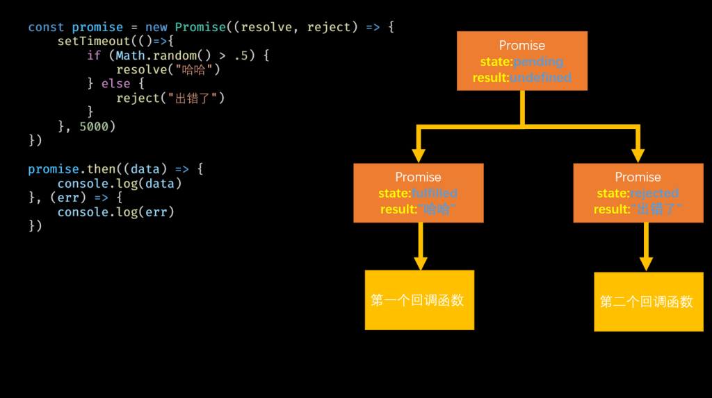

NodeJS简介 / 包管理器 / 计算机网络 / Promise / Express / Buffer / Path / 会话控制

<!--more-->

# Node.js简介

> [Node.js — Run JavaScript Everywhere](https://nodejs.org/en)

Node.js 是一个基于 **Chrome V8 引擎** 构建的 **JavaScript 运行环境**，它让你能够在服务器端运行 JavaScript 代码。

- **本质**：Node.js 是一个 JavaScript 运行环境（runtime environment），让 JavaScript 脱离浏览器、在服务器上运行。
- **核心引擎**：使用 Google 的 V8 JavaScript 引擎。
- **异步 I/O**：采用 **事件驱动、非阻塞（non-blocking）I/O 模型**，非常适合处理高并发请求。

## Node.js 的特点

| 特点            | 描述                                           |
| --------------- | ---------------------------------------------- |
| 非阻塞 I/O      | 异步处理请求，性能高                           |
| 单线程事件循环  | 用一个线程处理多个请求，通过事件循环实现并发   |
| 跨平台          | 支持 Windows、Linux、macOS 等操作系统          |
| 使用 JavaScript | 前后端统一开发语言（同一API）                  |
| 大量模块支持    | 拥有丰富的 NPM（Node Package Manager）生态系统 |

## Node.js 常见用途

1. **构建 Web 服务器**（如 Express 框架）
2. **API 接口服务**（RESTful、GraphQL）
3. **实时通信应用**（如聊天室、Socket.io）
4. **命令行工具开发**
5. **构建微服务架构**
6. **自动化构建工具**（Webpack、Gulp 等）
7. **物联网（IoT）项目**

------

## Node.js 的核心模块

| 模块名    | 功能简介        |
| --------- | --------------- |
| `http`    | 创建 Web 服务器 |
| `fs`      | 文件系统操作    |
| `path`    | 处理文件路径    |
| `events`  | 事件处理        |
| `stream`  | 数据流操作      |
| `os`      | 系统信息获取    |
| `process` | 创建子进程      |

## NVM简介

NVM（Node Version Manager）是 **Node.js 版本管理工具**，可以方便地在同一台机器上安装和切换多个 Node.js 版本。

- **全称**：Node Version Manager
- **作用**：帮助你在同一系统中安装、管理和切换多个版本的 Node.js。
- **使用场景**：
  - 不同项目需要不同版本的 Node.js。
  - 测试代码在不同 Node.js 版本下的兼容性。
  - 避免全局安装冲突。

**NVM 的主要功能**

| 功能           | 命令示例                    | 说明                            |
| -------------- | --------------------------- | ------------------------------- |
| 安装 Node.js   | `nvm install 16.20.2`       | 安装指定版本的 Node             |
| 查看已安装版本 | `nvm ls`                    | 显示当前安装的所有 Node.js 版本 |
| 查看可安装版本 | `nvm ls-remote`             | 查看远程所有可安装版本          |
| 使用某版本     | `nvm use 16.20.2`           | 临时切换 Node.js 版本           |
| 设置默认版本   | `nvm alias default 16.20.2` | 设置默认使用的版本              |
| 卸载版本       | `nvm uninstall 14.21.3`     | 删除指定版本的 Node             |

## Node.js 使用

和之前学习的JavaScript不同，Node.js需要运行在服务器端，说的直白一些我们需要通过命令行来执行JS代码。通过命令行执行js代码有两种方式：

第一种直接在命令行中输入node，会进入到node的REPL界面（交互编程环境），在REPL下和浏览器的控制台类似，我们可以直接输入各种JS代码，REPL会立即执行这些代码并输出结果（.exit用来退出REPL）。


第二种也是我们最常使用的一种，就是将js代码编写到一个js文件中，然后通过命令行执行js文件


Node.js虽然也属于js，但是它和浏览器中js还是有所区别的。对于ECMAScript标准来说，它们是一致的所以像是原始值、流程控制语句、运算符、函数、对象、数组、内建对象这些东西无论是浏览器环境还是node中都是一样的。对于宿主对象来说浏览器和node是截然不同的，像是DOM、BOM这些对象在node中通通是不存在的，但是一些东西在Node中依然得到了保留，比如console对象、比如定时器之类。

## Node.js 的作用

1. **开发服务器应用** —— 因为 Node.js 提供了服务端能力

**解释：**

JavaScript 原本只运行在浏览器中，不能访问磁盘、网络、数据库等“后端功能”。但通过 **Node.js**，JavaScript 拥有了这些底层访问能力：

- Node.js 提供了 HTTP 模块，可以构建 Web 服务器
- 提供文件系统（fs）、网络（net）、数据库连接等 API
- 使用异步非阻塞 I/O 机制，非常适合处理**高并发请求**

**举例场景：**

| 应用类型 | 示例                                    |
| -------- | --------------------------------------- |
| API 服务 | RESTful 或 GraphQL 接口                 |
| 实时服务 | 聊天服务器、在线协作、弹幕系统          |
| Web 后端 | 博客系统、论坛系统、内容管理系统（CMS） |

**常用工具**：Express、Koa、NestJS

2. **开发工具类应用** —— 因为 Node.js 可直接操作系统资源

**解释：**

Node.js 能读取文件、执行命令、读取环境变量，因此非常适合用来开发 **命令行工具** 或 **项目构建工具**：

- 可以写项目脚手架（自动创建目录结构）
- 实现自动构建、打包、格式化等工具
- 可以发布为 npm 包，方便分发与使用

**举例场景：**

| 工具类型     | 示例                          |
| ------------ | ----------------------------- |
| 前端构建工具 | Webpack、Vite、Rollup         |
| 命令行工具   | Vue CLI、create-react-app     |
| 自动化工具   | ESLint、Prettier、Gulp、Husky |


**优势：** 使用 JavaScript 写工具，让前端开发流程更统一、可自动化。

3. **开发桌面端应用** —— 因为 JavaScript 可借助 <font color='#409eff'>Electron </font>实现跨平台桌面程序

**解释：**

通过 **Electron**（基于 Node.js + Chromium），JavaScript 可以构建完整的桌面应用，支持：

- 系统窗口管理（打开窗口、菜单栏、托盘图标等）
- 访问系统资源（文件读写、系统通知、硬件接口）
- 使用 HTML/CSS/JS 构建 UI，适配所有平台（Windows、macOS、Linux）

**举例场景：**

| 应用类型 | 示例                            |
| -------- | ------------------------------- |
| 编辑器类 | VS Code、Atom                   |
| 聊天类   | Slack、Discord（旧版本）        |
| 开发工具 | Postman、Insomnia、Figma 桌面版 |

**为什么可行？**

- Electron 中，**前端页面用浏览器渲染，后端逻辑由 Node.js 支撑**
- 统一语言栈，开发效率高
- 支持跨平台打包

## 总结

<font color='#409eff'>面试模板：</font>

Node.js 是一个基于 Chrome V8 引擎构建的 JavaScript 运行时环境，它让 JavaScript 不再局限于浏览器中运行，而是可以直接在服务器端执行。Node.js 采用事件驱动、非阻塞 I/O 的模型，这种设计使得它在处理高并发、I/O 密集型任务时具有非常高的性能和扩展性。所有 I/O 操作都通过**事件循环和回调机制**来异步执行，从而避免了线程阻塞的问题。Node.js 提供了丰富的内置模块，比如文件系统、HTTP、网络等，同时也有全球最大的开源包管理生态——npm。总结来说，Node.js 的特点是单线程、事件驱动、异步非阻塞，优势在于高并发处理能力和丰富的生态，缺点是 CPU 密集型任务表现不佳，因为单线程在处理复杂计算时容易阻塞事件循环。

事件驱动就是程序的执行流程由事件来推动，而不是按顺序一行行地死等结果。在 Node.js 里，有一个事件循环机制，所有任务会被注册成事件，当某个事件发生，比如网络请求完成、文件读取结束，就会触发对应的回调函数执行，这样程序不必在原地等待，而是去忙别的事，等事件通知。

非阻塞 I/O 是指在执行 I/O 操作，比如读文件、查数据库、发网络请求时，不会阻塞代码的继续运行。传统的阻塞模式是必须等 I/O 完成才继续执行后面的代码，而 Node.js 的非阻塞 I/O 会立即返回，先把操作交给系统后台去处理，当处理完成后通过事件和回调通知程序，这样可以同时发起多个 I/O 请求，不浪费等待的时间。

# JavaScript模块化

> 知识点总结：尚硅谷\禹神：一小时速通JavaScript模块化

<font color='#409eff'>面试模板：</font>

JavaScript 模块化是一种将代码按照功能拆分成独立文件的编程方式，每个模块内部定义自己的作用域和功能，并通过特定的导出与导入机制实现复用。模块化的出现主要是为了解决早期 JavaScript 在全局作用域下编写代码所带来的全局变量污染、依赖顺序混乱以及数据暴露不安全等问题。通过模块化，每个模块都有独立的作用域，避免了不同模块之间的变量和函数相互覆盖；同时模块通过显式的 `import` 和 `export` 声明依赖关系，不再依赖于手动调整脚本引入顺序，从而解决依赖混乱的问题；此外，模块内部的数据和实现细节如果不导出，外部是无法访问的，这样就实现了数据的封装与安全。早期的模块化方案包括 IIFE 自执行函数封装、CommonJS（主要用于 Node.js）和 AMD（浏览器端异步加载），现代 JavaScript 则通过 ES Module（`import`/`export`）在语言层面原生支持模块化，并结合构建工具打包，既解决了全局污染和依赖混乱的问题，也让数据访问更可控、更安全。

# 包管理器

## NPM介绍

NPM（**Node Package Manager**）是 **Node.js 的包管理工具**，也是**世界上最大的 JavaScript 软件包生态系统**。

- **全称**：Node Package Manager
- **功能**：用于安装、管理、共享 JavaScript 包（模块/库）
- **作用对象**：主要配合 Node.js 使用，但也适用于前端项目（如 Vue、React）

> 安装 Node.js 时通常会自动附带安装 NPM。

**三大功能**

| 功能     | 说明                                         |
| -------- | -------------------------------------------- |
| 安装模块 | 安装你项目需要的库（如 `express`、`lodash`） |
| 管理依赖 |                                              |
| 发布包   | 将你自己的模块上传到 NPM 仓库，供他人使用    |

NPM 常用命令速查表

| 命令          | 功能说明                        | 备注               |
| ------------- | ------------------------------- | ------------------ |
| `npm init`    | 初始化项目，创建 `package.json` | 会提示填写信息     |
| `npm init -y` | 快速初始化项目                  | 使用默认值跳过询问 |

安装依赖

| 命令                                    | 功能说明                            | 备注                                       |
| --------------------------------------- | ----------------------------------- | ------------------------------------------ |
| `npm install` 或 `npm i`                | 安装所有依赖（根据 `package.json`） | 生成 `node_modules` 和 `package-lock.json` |
| `npm install <包名>`                    | 安装指定包，添加到 `dependencies`   | 默认本地安装                               |
| `npm install <包名> --save-dev` 或 `-D` | 安装为开发依赖                      | 添加到 `devDependencies`                   |
| `npm install -g <包名>`                 | 全局安装一个包                      | 多用于 CLI 工具（如 nodemon）              |

卸载依赖

| 命令                   | 功能说明                           | 备注             |
| ---------------------- | ---------------------------------- | ---------------- |
| `npm uninstall <包名>` | 卸载依赖并从 `package.json` 中移除 | 支持卸载开发依赖 |

更新与查看

| 命令                 | 功能说明             | 备注                           |
| -------------------- | -------------------- | ------------------------------ |
| `npm update <包名>`  | 更新某个依赖包       | 自动安装符合 semver 的最新版本 |
| `npm outdated`       | 查看过时的依赖包     | 显示当前版本、最新版本等       |
| `npm list`           | 查看当前项目依赖结构 | 默认显示完整树                 |
| `npm list --depth=0` | 查看顶级依赖         | 常用于查看主要依赖版本         |

运行脚本

| 命令               | 功能说明                              | 备注                           |
| ------------------ | ------------------------------------- | ------------------------------ |
| `npm start`        | 执行 `package.json` 中的 `start` 脚本 | 如：`"start": "node index.js"` |
| `npm run <脚本名>` | 执行自定义脚本                        | 如：`npm run dev`              |
| `npm test`         | 执行 `test` 脚本                      | 一般用于单元测试               |

 镜像源设置（加速）

| 命令                            | 功能说明          | 备注                                      |
| ------------------------------- | ----------------- | ----------------------------------------- |
| `npm config set registry <url>` | 设置 NPM 镜像地址 | 如淘宝源 `https://registry.npmmirror.com` |
| `npm config get registry`       | 查看当前镜像源    | 可用于确认是否设置成功                    |

其他实用命令

| 命令                      | 功能说明                | 备注                                  |
| ------------------------- | ----------------------- | ------------------------------------- |
| `npm cache clean --force` | 清除本地缓存            | 修复安装错误时常用                    |
| `npm doctor`              | 检查 NPM 环境配置       | 帮助诊断问题                          |
| `npm version <type>`      | 自动升级版本号          | `type`为 `patch`、`minor`、`major` 等 |
| `npm publish`             | 发布自己的包到 NPM 仓库 | 需要先登录账户                        |
| `npm login`               | 登录到 NPM 账号         | 发布包前必须登录                      |

## Yarn和Pnpm

**Yarn**

- 安装速度快（比 npm 早期版本快很多）
- 默认使用 `yarn.lock` 锁定依赖
- 支持 **Plug'n'Play（PnP）**，跳过 `node_modules`

**pnpm**

- 采用 **符号链接 + 全局内容寻址存储** 节省磁盘空间
- 更严格的依赖隔离，防止 `npm` 和 `yarn` 容易出现的“幽灵依赖”
- 支持 monorepo（内置 workspace）

| 功能             | npm 命令                                       | yarn 命令                        | pnpm 命令                        |
| ---------------- | ---------------------------------------------- | -------------------------------- | -------------------------------- |
| 初始化项目       | `npm init`  `npm init -y`                      | `yarn init`  `yarn init -y`      | `pnpm init`  `pnpm init -y`      |
| 安装依赖（全部） | `npm install`  `npm i`                         | `yarn install`                   | `pnpm install`                   |
| 安装依赖（指定） | `npm install 包名`                             | `yarn add 包名`                  | `pnpm add 包名`                  |
| 安装开发依赖     | `npm install 包名 --save-dev`  `npm i 包名 -D` | `yarn add 包名 --dev`            | `pnpm add 包名 -D`               |
| 安装全局包       | `npm install -g 包名`                          | `yarn global add 包名`           | `pnpm add -g 包名`               |
| 移除依赖         | `npm uninstall 包名`  `npm rm 包名`            | `yarn remove 包名`               | `pnpm remove 包名`               |
| 更新依赖         | `npm update 包名`                              | `yarn upgrade 包名`              | `pnpm update 包名`               |
| 查看过期依赖     | `npm outdated`                                 | `yarn outdated`                  | `pnpm outdated`                  |
| 运行脚本         | `npm run 脚本名`                               | `yarn run 脚本名`  `yarn 脚本名` | `pnpm run 脚本名`  `pnpm 脚本名` |
| 清缓存           | `npm cache clean --force`                      | `yarn cache clean`               | `pnpm store prune`               |
| 查看依赖树       | `npm list`                                     | `yarn list`                      | `pnpm list`                      |
| 安装指定版本     | `npm install 包名@版本`                        | `yarn add 包名@版本`             | `pnpm add 包名@版本`             |
| 安装本地包       | `npm install ./路径`                           | `yarn add ./路径`                | `pnpm add ./路径`                |

##  package.json

`package.json` 是 **Node.js** 和 **前端项目（如使用 npm 或 yarn 管理依赖的项目）** 中的一个核心配置文件。它是一个 **JSON 格式的文件**，主要用来描述项目的基本信息、依赖关系、脚本命令等。

```json
{
  "name": "your-project-name",        // 项目名称
  "version": "1.0.0",                 // 版本号，遵循语义化版本规则
  "description": "A short description of your project", // 项目描述
  "main": "index.js",                 // 项目入口文件
  "scripts": {                       // 脚本命令，可以用 npm run 命令调用
    "start": "node index.js",       // 启动项目
    "test": "jest"                  // 测试命令
  },
  "keywords": [                      // 关键词，便于搜索
    "node",
    "express",
    "example"
  ],
  "author": "Your Name",             // 作者
  "license": "MIT",                  // 许可证类型
  "dependencies": {                  // 生产依赖包
    "express": "^4.17.1",
    "lodash": "^4.17.20"
  },
  "devDependencies": {               // 开发依赖包，仅在开发环境需要
    "jest": "^26.4.2",
    "eslint": "^7.0.0"
  },
  "repository": {                   // 代码仓库信息
    "type": "git",
    "url": "https://github.com/yourname/your-repo.git"
  },
  "engines": {                     // 指定 Node.js 或 npm 的版本要求
    "node": ">=14.0.0"
  },
  "private": true                  // 是否为私有项目，true 时禁止发布到 npm
}
```

**常见字段作用：**

- **name**：包的名称。
- **version**：版本号。
- **description**：项目描述。
- **main**：入口文件。
- **scripts**：定义脚本命令，如启动、测试、构建等。
- **dependencies**：生产环境依赖的包。
- **devDependencies**：开发环境依赖的包。
- **repository**：仓库地址。
- **keywords**：关键字。
- **author**：作者。
- **license**：开源协议。
- **private**：防止发布到 npm（通常私有项目设置为 true）。

**生产依赖包 (`dependencies`)**

- **用途**：这些依赖是你的项目在 **运行时（生产环境）** 必须依赖的包。也就是说，当你的应用真正上线、给用户使用时，程序依赖的这些包必须存在。

**开发依赖包 (`devDependencies`)**

- **用途**：这些依赖是你在 **开发阶段** 用来辅助开发、测试、构建、代码检查等的工具包，生产环境不需要它们。最终运行的时候不需要打包。

**举例**：

- 代码打包工具（如 `webpack`、`rollup`）
- 测试框架（如 `jest`、`mocha`）
- 代码格式检查工具（如 `eslint`、`prettier`）

**`package-lock.json`**

- **作用**：锁定项目中所有依赖包的**具体版本号**和**依赖树结构**，确保每次安装依赖时，安装的包版本一致，避免因依赖版本变化导致代码不稳定，也不免反复按照多个版本依赖。node自动配置，不需要手动修改。

## npx

**npx** 是 Node.js 自带的一个命令行工具（从 **npm 5.2.0** 开始内置），它的主要作用是 **执行 Node.js 项目中的可执行包（CLI 工具）**，而不需要你提前全局安装它。

### 【为什么有 npx】

在 npx 出现之前：

- 如果想用某个 npm 包的命令行工具（比如 `create-react-app`），你必须先用 `npm install -g create-react-app` 全局安装。
- 全局安装会导致版本管理困难，不同项目可能需要不同版本。

npx 解决了这些问题：

- 直接运行包的可执行文件，不必全局安装。
- 可以运行项目本地 `node_modules` 里的 CLI 工具。
- 支持临时安装一次性运行的工具，执行后自动清除。

### 【使用方式】

**运行已安装在项目中的包**

```bash
npx eslint src/
```

等价于：

```bash
./node_modules/.bin/eslint src/
```

（npx 会自动到 `node_modules/.bin` 找可执行文件）

**运行一次性工具（没安装过）**

```bash
npx cowsay "Hello"
```

npx 会先下载 `cowsay`（存在临时目录），执行后删除。

**指定包版本执行**

```bash
npx create-react-app@4.0.0 my-app
```

可以避免全局安装多个版本冲突。

**执行 GitHub / Gist 上的包**

```bash
npx github:username/repo
npx gist:1234567890abcdef
```

# 计算机网络知识

> [王道计算机考研 计算机网络_哔哩哔哩_bilibili](https://www.bilibili.com/video/BV19E411D78Q/?spm_id_from=333.337.search-card.all.click&vd_source=ff414aaf189e3a685358d2a984fd4742) —— 传输层和应用层部分
>
> [1.6W字！梳理50道经典计算机网络面试题（收藏版）](./1.6W字！梳理50道经典计算机网络面试题（收藏版）.pdf)
>
> [计算机网络——面试题](./计算机网络)
>
> [计算机网络——前端充电宝](https://www.yuque.com/cuggz/feplus/cxuwy0)

## 一个最常见的面试题

> 当浏览器中输入一行地址以后发生了什么？（例如https://www.baidu.com)

1. **URL 解析**

- 浏览器首先解析你输入的地址 `https://www.baidu.com`
- 分解出：
  - 协议（`https`）
  - 主机名（`www.baidu.com`）
  - 端口（`https` 默认 443）
  - 路径（`/`）
  - 查询参数（如果有）

---

2. **检查缓存**

浏览器会先看看本地有没有现成的资源，按顺序查找：

1. 浏览器缓存（Memory Cache / Disk Cache）
2. 操作系统缓存（DNS 缓存）
3. 路由器缓存
4. ISP DNS 缓存
   如果缓存命中，就直接用缓存返回数据，不再走后续步骤。

---

3. **DNS 解析**

如果缓存中没找到域名的 IP，需要向 DNS 服务器查询：

1. 浏览器调用操作系统的 **DNS 解析库**
2. OS 向本地配置的 DNS 服务器发起请求
3. 如果是多级域名，DNS 会从根域名服务器开始逐级解析：
   - 根 DNS → `.com` 顶级域 DNS → `baidu.com` 权威 DNS
4. 最终得到目标服务器的 **IP 地址**（比如 `220.181.38.150`）

---

4. **浏览器与服务器建立连接（TCP/IP）**

浏览器使用 IP 与服务器建立 TCP 连接：

1. **SYN**（浏览器 → 服务器，请求建立连接）
2. **SYN-ACK**（服务器 → 浏览器，同意建立连接）
3. **ACK**（浏览器 → 服务器，确认）
   连接建立后，浏览器和服务器之间可以可靠地收发数据。

HTTPS 会在 TCP 基础上进行 **TLS 握手**，确保数据加密传输：

1. 浏览器发送支持的加密算法和随机数
2. 服务器返回证书和公钥
3. 浏览器验证证书合法性
4. 双方协商会话密钥
   握手完成后，所有 HTTP 数据会被加密传输。

---

5. **浏览器发送HTTP请求**

浏览器构造请求报文：

```makefile
GET / HTTP/1.1
Host: www.baidu.com
User-Agent: ...
Accept: ...
```

通过 TCP 连接发送到服务器

---

6. **服务器处理请求**

服务器（比如 Nginx + 应用层）：

1. 接收请求数据
2. 根据 URL 路径匹配资源或调用后端程序
3. 查询数据库 / 缓存
4. 生成 HTTP 响应（包含 HTML / JSON / 图片等）

---

7. **返回 HTTP 响应**

- 服务器把响应通过 TCP 发送给浏览器

- 响应报文可能是：

  ```yaml
  HTTP/1.1 200 OK
  Content-Type: text/html
  Content-Length: 1024
  
  <html>...</html>
  ```

- 如果有 **压缩（gzip/br）**，浏览器需要解压

---

8. **浏览器渲染页面**

浏览器渲染引擎（如 Blink / WebKit）执行：

1. **解析 HTML** → 生成 DOM 树
2. **解析 CSS** → 生成 CSSOM 树
3. **合并 DOM + CSSOM** → 生成渲染树
4. **布局（Layout）**：计算元素位置和大小
5. **绘制（Paint）**：将像素绘制到屏幕
6. **执行 JavaScript**（如果遇到 `<script>` 标签，可能阻塞解析）
7. 如果页面有图片、CSS、JS 等资源，会**并行发起请求**（重复上述流程）

---

10. **连接关闭**

- 如果使用 HTTP/1.1 且有 `Connection: keep-alive`，TCP 连接会复用
- HTTP/2 / HTTP/3 会多路复用一个连接

## 体系结构

客户端与服务器之间进行通信，需要确定三个地址：`MAC地址`、`IP地址`、`端口号`。

- **MAC 地址**（物理地址）：定位 **同一局域网中** 的设备
- **IP 地址**（网络地址）：在 **整个互联网范围** 唯一定位一台设备（或者网络节点）
- **端口号**（进程地址）：在一台设备上区分不同的应用程序

根据 IP地址 + 端口号， 可以确定整个互联网中唯一一台设备的唯一进程。IP就好比快递传输中的通讯地址，进程好比收件人。那么MAC地址呢？如果需要跨省传输，那么快递会经过中转站，MAC地址也会改变。也就是<font color='#409eff'>IP地址不变，MAC地址每跳改变，端口号唯一定位进程</font>。

- 源IP和目的IP地址不会变。始终表示【发货地 -> 目的地】
- 源MAC地址和目的MAC地址可能改变。【发货地 -> A省中转站】 -> 【A省中转站 -> B省中转站】 -> 【B省中转站 -> 目的地】

其中

- 端口号是默认或者手动配置的，在传输层添加。
- IP地址通过DNS解析域名得到，在网络层添加。
- MAC地址通过ARP协议，利用IP地址获取，在数据链路层添加。

> 假设客户端向服务器发送一个 HTTP 请求，整个过程从应用层开始，依次经过传输层、网络层、数据链路层，到物理层发送出去，服务器再反向解析，完成通信。

1. 应用层（Application Layer）

- **作用**：提供用户直接使用的服务，处理具体应用协议，比如 HTTP、FTP、SMTP、DNS 等。
- **过程**：
  - 用户在浏览器输入 URL 发起 HTTP 请求。
  - 应用层生成符合 HTTP 协议格式的数据（请求报文），准备发送。
  - 调用下一层（传输层）接口发送数据。

2. 传输层（Transport Layer）

- **作用**：实现端到端的通信管理，提供可靠（TCP）或不可靠（UDP）的传输服务，负责分段、重传、流量控制、端口管理。
- **过程**：
  - 应用层数据被切分成传输层的数据段（TCP 段或 UDP 数据报）。
  - 为数据段添加**源端口和目的端口号**，确定通信的进程。
  - 如果是 TCP，会建立连接（三次握手），保证可靠传输。
  - 数据段传给下一层（网络层）。

3. 网络层（Network Layer）

- **作用**：负责数据包**从源主机到目标主机的路由选择和转发，主要协议是 IP**。
- **过程**：
  - 传输层传过来的数据段被封装成数据包（IP 包）。
  - 添加源 IP 和目的 IP 地址。
  - 网络层根据目标 IP 寻找路由路径，决定发送到哪个下一跳。
  - 发送给数据链路层。

4. 数据链路层（Data Link Layer）

- **作用**：负责相邻节点之间的可靠传输，处理物理地址（MAC）、帧的封装和差错检测。
- **过程**：
  - 将网络层传来的数据包封装成帧（Frame）。
  - **添加源 MAC 和目的 MAC 地址**。
  - 通过帧校验序列（FCS）实现差错检测。
  - 发送到物理层。

5. 物理层（Physical Layer）

- **作用**：负责物理传输媒体上的比特流传输，如电信号、光信号等。
- **过程**：
  - 把数据链路层的帧转化成适合传输的电信号或光信号。
  - 通过网线、光纤、无线信道等物理媒介发送给目标设备。

传输到目标服务器后，接收端的流程是反向的：

1. **物理层**接收信号，转成比特流交给数据链路层。
2. **数据链路层**解析帧，校验数据，提取数据包。
3. **网络层**检查 IP 地址，进行路由处理，将数据包交给传输层。
4. **传输层**重组数据段，校验完整性，确认端口，组装成应用层数据。
5. **应用层**根据协议解析数据，完成请求处理（如 HTTP 请求被 Web 服务器解析），返回响应。

```scss
客户端（发送端）
应用层 (HTTP请求)
    ↓
传输层 (TCP段，加端口)
    ↓
网络层 (IP包，加IP地址)
    ↓
数据链路层 (帧，加MAC地址)
    ↓
物理层 (电信号/光信号)

--------------------网络传输--------------------

服务器端（接收端）
物理层 (接收信号)
    ↑
数据链路层 (帧解包，MAC地址校验)
    ↑
网络层 (IP解包，路由处理)
    ↑
传输层 (TCP重组，端口校验)
    ↑
应用层 (HTTP请求解析)
```

<font color='#409eff'>为什么同时需要IP地址和MAC地址：</font>

**MAC 地址（物理地址 / 硬件地址）**

- 作用：
  用来标识 **同一局域网内** 的网络设备，在数据链路层用于点对点传输。

- 特性：

  - 唯一性：理论上全球唯一。
  - 不可更改（可以通过软件伪造）。
  - 只在局域网范围内有效，跨网络传输时会被替换（由路由器处理）。

**IP 地址（逻辑地址）**

  - **作用**：
    用于在 **不同网络之间** 定位主机，实现数据包的路由转发。

  - **特性**：

    - 逻辑性：可以手动配置，也可以自动分配（DHCP）。
    - 会变化（设备换网络、换运营商，IP就可能变）。
    - 在跨网通信时必须依赖IP进行寻址。

    > MAC地址跨网络传输时会被更新，起到中转的作用。

    示例：你的电脑（Client）要访问 **`www.example.com`** 服务器（Server）。

**步骤 1：DNS 解析**

1. 你在浏览器输入 `www.example.com`。
2. 浏览器向 **DNS 服务器** 查询，获取目标服务器的 **IP 地址**（假设是 `93.184.216.34`）。
3. 现在你的电脑知道了对方的 IP 地址，但还不知道对方的 **MAC 地址**。

**步骤 2：ARP 获取 MAC 地址（局域网内通信）**

1. 如果目标 IP 在**同一个局域网**：
   - 电脑发出 **ARP 广播**（"谁是 93.184.216.34，请告诉我你的 MAC 地址"）。
   - 目标主机返回自己的 MAC 地址。
2. 如果目标 IP 不在同一个局域网（大多数访问互联网的情况）：
   - 电脑会先查本地路由表，发现目标 IP 要通过**网关（路由器）**转发。
   - 电脑用 ARP 请求获取 **网关的 MAC 地址**（因为第一跳是网关，而不是服务器）。

**步骤 3：封装并发送数据**

1. 电脑把数据封装成 **IP 包**（源 IP = 你的电脑，目标 IP = 服务器）。
2. 在 IP 包外面再封装一层 **以太网帧**（源 MAC = 你的电脑，目标 MAC = 网关的 MAC）。
3. 数据从你的电脑发到网关。

**步骤 4：跨网络传输（路由器处理）**

1. 网关收到帧后，解封装，读取 IP 头，发现目标 IP 在外网。
2. 根据路由表，把数据转发给下一个路由器：
   - <font color='#409eff'>修改以太网帧的 **源 MAC** = 自己的 MAC，**目标 MAC** = 下一跳路由器的 MAC。</font>
   - **IP 地址保持不变**（源 IP 依旧是你的电脑，目标 IP 依旧是服务器）。
3. 经过多个路由器，这个过程不断重复。

**步骤 5：目标服务器接收**

1. 数据到达服务器所在的局域网后，最后一个路由器通过 ARP 找到服务器的 MAC 地址。
2. 以太网帧（目标 MAC = 服务器 MAC）送到服务器。
3. 服务器解封装，以 IP 为依据确认是发给自己的，然后交给 TCP/应用层处理。

**核心要点**

- **IP 地址**：跨网络定位主机（类似全球地址系统）。
- **MAC 地址**：在局域网内唯一标识设备（类似局域网内门牌号）。
- **ARP 协议**：IP ↔ MAC 之间的翻译员。
- 在跨网通信中，**IP 地址不变**，**MAC 地址每一跳都会改变**（因为每一跳的物理链路是不同的）。

## DNS解析

### 1. DNS 协议的概念

**概念**： DNS 是域名系统 (Domain Name System) 的缩写，提供的是一种主机名到 IP 地址的转换服务，就是我们常说的域名系统。它是一个由分层的 DNS 服务器组成的分布式数据库，是定义了主机如何查询这个分布式数据库的方式的应用层协议。能够使人更方便的访问互联网，而不用去记住能够被机器直接读取的IP数串。

**作用**： 将域名解析为IP地址，客户端向DNS服务器（DNS服务器有自己的IP地址）发送域名查询请求，DNS服务器告知客户机Web服务器的IP 地址。

### 2. DNS同时使用TCP和UDP协议

**DNS占用53号端口，同时使用TCP和UDP协议。**

（1）在区域传输的时候使用TCP协议

- 辅域名服务器会定时（一般3小时）向主域名服务器进行查询以便了解数据是否有变动。如有变动，会执行一次区域传送，进行数据同步。区域传送使用TCP而不是UDP，因为数据同步传送的数据量比一个请求应答的数据量要多得多。
- TCP是一种可靠连接，保证了数据的准确性。

（2）在域名解析的时候使用UDP协议

- 客户端向DNS服务器查询域名，一般返回的内容都不超过512字节，用UDP传输即可。不用经过三次握手，这样DNS服务器负载更低，响应更快。理论上说，客户端也可以指定向DNS服务器查询时用TCP，但事实上，很多DNS服务器进行配置的时候，仅支持UDP查询包。

### 3. DNS完整的查询过程

DNS服务器解析域名的过程：

- 首先会在**浏览器的缓存**中查找对应的IP地址，如果查找到直接返回，若找不到继续下一步
- 将请求发送给**本地DNS服务器**，在本地域名服务器缓存中查询，如果查找到，就直接将查找结果返回，若找不到继续下一步
- 本地DNS服务器向**根域名服务器**发送请求，根域名服务器会返回一个所查询域的顶级域名服务器地址
- 本地DNS服务器向**顶级域名服务器**发送请求，接受请求的服务器查询自己的缓存，如果有记录，就返回查询结果，如果没有就返回相关的下一级的权威域名服务器的地址
- 本地DNS服务器向**权威域名服务器**发送请求，域名服务器返回对应的结果
- 本地DNS服务器将返回结果保存在缓存中，便于下次使用
- 本地DNS服务器将返回结果返回给浏览器

比如我们如果想要查询 [www.baidu.com](http://www.baidu.com/) 的 IP 地址，我们首先会在浏览器的缓存中查找是否有该域名的缓存，如果不存在就将请求发送到本地的 DNS 服务器中，本地DNS服务器会判断是否存在该域名的缓存，如果不存在，则向根域名服务器发送一个请求，根域名服务器返回负责 .com 的顶级域名服务器的 IP 地址的列表。然后本地 DNS 服务器再向其中一个负责 .com 的顶级域名服务器发送一个请求，负责 .com 的顶级域名服务器返回负责 .baidu 的权威域名服务器的 IP 地址列表。然后本地 DNS 服务器再向其中一个权威域名服务器发送一个请求，最后权威域名服务器返回一个对应的主机名的 IP 地址列表。

### 4.迭代查询与递归查询

实际上，DNS解析是一个包含迭代查询和递归查询的过程。

- **递归查询**指的是查询请求发出后，域名服务器代为向下一级域名服务器发出请求，最后向用户返回查询的最终结果。使用递归 查询，用户只需要发出一次查询请求。
- **迭代查询**指的是查询请求后，域名服务器返回单次查询的结果。下一级的查询由用户自己请求。使用迭代查询，用户需要发出 多次的查询请求。

一般我们向本地 DNS 服务器发送请求的方式就是递归查询，因为我们只需要发出一次请求，然后本地 DNS 服务器返回给我 们最终的请求结果。而本地 DNS 服务器向其他域名服务器请求的过程是迭代查询的过程，因为每一次域名服务器只返回单次 查询的结果，下一级的查询由本地 DNS 服务器自己进行。

### 5. DNS 记录和报文

DNS 服务器中以资源记录的形式存储信息，每一个 DNS 响应报文一般包含多条资源记录。一条资源记录的具体的格式为

`（Name，Value，Type，TTL）`

其中 TTL 是资源记录的生存时间，它定义了资源记录能够被其他的 DNS 服务器缓存多长时间。

常用的一共有四种 Type 的值，分别是 A、NS、CNAME 和 MX ，不同 Type 的值，对应资源记录代表的意义不同。

1. 如果 Type = A，则 Name 是主机名，Value 是主机名对应的 IP 地址。因此一条记录为 A 的资源记录，提供了标 准的主机名到 IP 地址的映射。
2. 如果 Type = NS，则 Name 是个域名，Value 是负责该域名的 DNS 服务器的主机名。这个记录主要用于 DNS 链式 查询时，返回下一级需要查询的 DNS 服务器的信息。
3. 如果 Type = CNAME，则 Name 为别名，Value 为该主机的规范主机名。该条记录用于向查询的主机返回一个主机名 对应的规范主机名，从而告诉查询主机去查询这个主机名的 IP 地址。主机别名主要是为了通过给一些复杂的主机名提供 一个便于记忆的简单的别名。
4. 如果 Type = MX，则 Name 为一个邮件服务器的别名，Value 为邮件服务器的规范主机名。它的作用和 CNAME 是一 样的，都是为了解决规范主机名不利于记忆的缺点。

## TCP和UDP协议

### 【TCP与UDP协议特点】

**TCP 协议特点**

- **面向连接**：通信前需要建立连接（三次握手）。
- **可靠传输**：通过**确认应答、重传机制**保证数据不丢失、不乱序。
- **面向字节流**：数据被看作连续的字节流，没有明确边界。
- **流量控制**：通过滑动窗口控制发送速率，避免接收方处理不过来。
- **拥塞控制**：慢启动、拥塞避免、快速重传等算法，避免网络拥堵。
- **开销相对大**：头部20字节起。

**UDP 协议特点**

- **无连接**：发送数据前不建立连接，直接发送。
- **不保证可靠性**：不确认、不重传，可能丢包、乱序。
- **面向报文**：发送方一次发送的数据作为一个整体接收，保留数据边界。
- **速度快**：无握手和复杂控制，延迟低。
- **开销小**：头部只有8字节。
- **常用于**：实时通信（视频、语音）、广播、多播、DNS查询等。

**TCP vs UDP 对比表**

| 特性     | TCP              | UDP             |
| -------- | ---------------- | --------------- |
| 是否连接 | 面向连接         | 无连接          |
| 可靠性   | 可靠             | 不可靠          |
| 数据顺序 | 保证顺序         | 不保证          |
| 传输形式 | 字节流           | 报文            |
| 速度     | 较慢             | 快              |
| 开销     | 大（20字节以上） | 小（8字节）     |
| 场景     | HTTP、FTP、SMTP  | 视频、语音、DNS |

**应用场景**

- **TCP**：需要可靠性和顺序的传输（如网页、文件、邮件）。
- **UDP**：追求速度、容忍少量丢包的应用（如直播、游戏、DNS）。

### 【面试考点】

- UDP协议特点
- TPC协议特点
- TPC三次握手（为什么不采用二次握手）
- TPC四次挥手（为什么不采用三次挥手）
- TPC拥塞控制（慢开始，拥塞控制，快开始，快重传）
- TPC流量控制（根据返回窗口和拥塞窗口计算）
- TPC可靠传输（校验（不是重点）—— 序号 —— 确认 —— 重传（超时重传和快重传）

<font color='#409eff'>具体内容见标题下方PDF笔记链接</font>

## HTTP协议

### 【HTTP协议概述】

HTTP 是超文本传输协议，它定义了客户端和服务器之间交换报文的格式和方式，默认使用 80 端口。它使用 TCP 作为传输层协议，保证了数据传输的可靠性。

HTTP协议具有以下**优点**：

- 支持客户端/服务器模式
- **简单快速**：客户向服务器请求服务时，只需传送请求方法和路径。由于 HTTP 协议简单，使得 HTTP 服务器的程序规模小，因而通信速度很快。
- **无连接**：无连接的含义是限制每次链接只处理一个请求。服务器处理完客户的请求，并收到客户的应答后，即断开链接，采用这种方式可以节省传输时间。
- **无状态**：HTTP 协议是无状态协议，这里的状态是指通信过程的上下文信息。缺少状态意味着如果后续处理需要前面的信息，则它必须重传，这样可能会导致每次连接传送的数据量增大。另一方面，在服务器不需要先前信息时它的应答就比较快。
- **灵活**：HTTP 允许传输任意类型的数据对象。正在传输的类型由 Content-Type 加以标记。

HTTP协议具有以下**缺点**：

- **无状态：**HTTP 是一个无状态的协议，HTTP 服务器不会保存关于客户的任何信息。
- **明文传输：**协议中的报文使用的是文本形式，这就直接暴露给外界，不安全。
- **不安全**

（1）通信使用明文（不加密），内容可能会被窃听

（2）不验证通信方的身份，因此有可能遭遇伪装

（3）无法证明报文的完整性，所以有可能已遭篡改

### 【HTTP连接方式】

HTTP 协议是基于 TCP/IP，并且使用了**请求-应答**的通信模式，所以性能的关键就在这两点里。

- **长连接**

HTTP协议有两种连接模式，一种是持续连接，一种非持续连接。

（1）非持续连接指的是服务器必须为每一个请求的对象建立和维护一个全新的连接。

（2）持续连接下，TCP 连接默认不关闭，可以被多个请求复用。采用持续连接的好处是可以避免每次建立 TCP 连接三次握手时所花费的时间。

对于不同版本的采用不同的连接方式：

- 在HTTP/1.0 每发起一个请求，都要新建一次 TCP 连接（三次握手），而且是串行请求，做了无畏的 TCP 连接建立和断开，增加了通信开销。该版本使用的非持续的连接，但是可以在请求时，加上 Connection: keep-a live 来要求服务器不要关闭 TCP 连接。
- 在HTTP/1.1 提出了**长连接**的通信方式，也叫持久连接。这种方式的好处在于减少了 TCP 连接的重复建立和断开所造成的额外开销，减轻了服务器端的负载。该版本及以后版本默认采用的是持续的连接。目前对于同一个域，大多数浏览器支持同时建立 6 个持久连接。

- **管道网络传输**

HTTP/1.1 采用了长连接的方式，这使得管道（pipeline）网络传输成为了可能。

管道（pipeline）网络传输是指：可以在同一个 TCP 连接里面，客户端可以发起多个请求，只要第一个请求发出去了，不必等其回来，就可以发第二个请求出去，可以减少整体的响应时间。但是服务器还是按照顺序回应请求。要是前面的回应特别慢，后面就会有许多请求排队等着。这称为队头堵塞。<font color='#409eff'>也就是流水线式连接</font>。

### 【HTTP无连接含义】

1. “无连接”指的是**应用层的逻辑连接**

- HTTP是**应用层协议**，设计时的“无连接”是指：
  - **每个请求/响应完成后，应用层不会保留连接状态**
  - 一次请求处理完毕，双方不会保存这次会话的信息
- 换句话说，HTTP协议本身不管理连接的持续，也不维持会话状态

2. HTTP与传输层TCP的关系

- HTTP协议基于**传输层TCP协议**
- TCP是**面向连接的协议**，会建立并维护连接（如三次握手、四次挥手）
- 但HTTP层面，在一次请求-响应完成后，默认关闭TCP连接（HTTP/1.0短连接）

3. 什么叫无连接

- 请求和响应是**独立的**
- 不需要也不保持之前请求的状态
- 每次请求都必须携带完成该请求所需的全部信息（例如cookies、认证信息等）

4. 现代HTTP的持久连接

- HTTP/1.1引入持久连接，允许复用底层TCP连接，但仍然保持HTTP层的无状态特性
- 即使连接保持，HTTP仍然是无连接协议，因为它不维护会话信息，状态由应用管理

<font color='#409eff'>HTTP的无连接也使得HTTP是无状态的</font>。

### 【HTTP无状态含义】

**1. 定义**

- **HTTP是无状态协议**，意味着**服务器不会自动保留客户端之前请求的任何信息**。
- 每一次HTTP请求都是**独立的、互不关联**的。

2. **具体表现**

- 当客户端向服务器发送请求时，服务器仅根据当前请求来处理，并不依赖之前的请求。
- 请求处理完毕后，服务器不会保存任何会话信息（状态）。
- 下一次请求服务器不会“记得”之前的任何事情。

3. **举例说明**

- 你第一次访问一个购物网站，添加商品到购物车后关闭页面。
- 第二次访问时，如果没有额外机制，服务器不知道你之前放了什么商品，因为HTTP本身不保存状态。

4. **无状态带来的问题**

- 不能自动跟踪用户会话
- 需要通过其他机制实现状态管理（例如：Cookie、Session、Token）

5. **如何解决无状态？**

- **Cookie**：浏览器保存少量信息，随请求发送给服务器
- **Session**：服务器存储用户状态，客户端通过Cookie保存会话ID
- **Token**：如JWT，包含用户身份信息，客户端每次请求携带

6. **为什么设计为无状态？**

- 简化服务器设计，提高性能和可伸缩性
- 服务器无需保存大量状态信息，方便分布式部署

### 【HTTP1.1】

**HTTP 1.1版本**较之前的1.0版本又有了更大的更新，它进一步完善了HTTP协议，现在仍然有在使用，它主要有以下更新：

- **持久连接（长连接）**
  该版本之前的版本所建立的都是短连接，该版本引入了持久连接的概念，就是TCP连接默认是不关闭的，建立一个TCP连接，就可以发送多个请求，减少了建立和关闭连接的消耗和延迟。
  在请求头设置一个非标准的Connection字段:`Connection: keep-alive`就可以进行长连接，这个字段要求服务器不要关闭TCP连接，服务器同样会回应这个字段。如果想要关闭TCP连接，就要在请求中设置字段：`Connection: false`
- **管道机制(流水线式）**：该版本还引入了管道机制，即在一个TCP连接里，客户端可以同时发送多个请求，不需要等收到上一个请求回应，就可以发送新的请求，但是请求的响应还是按照请求发送的顺序返回的，这样就进一步提高了HTTP协议的效率
- **分块传输编码**：在HTTP1.0版本中，如果在服务器端遇到较为耗费时间的操作，那么需要等到这一操作全部完成后，才会向客户端发送数据，这段等待时间很影响性能和客户体验。多以使用**分块传输编码**，只要请求或者回应的头部信息有`Transfer-Encoding`字段：`Transfer-Encoding: chunked`，就表明回应将由数量未定的数据块组成。每个非空的数据块之前，会有一个16进制的数值，表示这个块的长度。最后是一个大小为0的块，就表示本次回应的数据发送完了
- 加入了新的**请求方法**：**PUT、PATCH、HEAD、 OPTIONS、DELETE**
- 优化了**缓存机制**：**强缓存**和**协商缓存**
- 客户端请求的头部信息**加入了**`Host`**字段**，用来指定服务器的域名，这样就可以区分同一个物理主机中的不同虚拟主机的域名

### 【HTTPS】

#### 1. 什么是HTTPS协议？

超文本传输安全协议（Hypertext Transfer Protocol Secure，简称：HTTPS）是一种通过计算机网络进行安全通信的传输协议。HTTPS经由HTTP进行通信，但利用SSL/TLS来加密数据包。HTTPS开发的主要目的，是提供对网站服务器的身份认证，保护交换数据的隐私与完整性。


HTTP协议采用**明文传输**信息，存在**信息窃听**、**信息篡改**和**信息劫持**的风险，而协议TLS/SSL具有**身份验证**、**信息加密**和**完整性校验**的功能，可以避免此类问题发生。

安全层的主要职责就是**对发起的HTTP请求的数据进行加密操作** 和 **对接收到的HTTP的内容进行解密操作**。

#### 2. TLS/SSL的工作原理

**TLS/SSL**全称安全传输层协议（Transport Layer Security）, 是介于TCP和HTTP之间的一层安全协议，不影响原有的TCP协议和HTTP协议，所以使用HTTPS基本上不需要对HTTP页面进行太多的改造。

TLS/SSL的功能实现主要依赖三类基本算法：**散列函数hash**、**对称加密**、**非对称加密**。这三类算法的作用如下：

- 基于散列函数验证信息的完整性
- 对称加密算法采用协商的秘钥对数据加密
- 非对称加密实现身份认证和秘钥协商
  

**2.1 散列函数hash**

常见的散列函数有MD5、SHA1、SHA256。该函数的特点是单向不可逆，对输入数据非常敏感，输出的长度固定，任何数据的修改都会改变散列函数的结果，可以用于防止信息篡改并验证数据的完整性。

**特点：** 在信息传输过程中，散列函数不能三都实现信息防篡改，由于传输是明文传输，中间人可以修改信息后重新计算信息的摘要，所以需要对传输的信息和信息摘要进行加密。

**2.2 对称加密**

对称加密的方法是，双方使用同一个秘钥对数据进行加密和解密。但是对称加密的存在一个问题，就 是如何保证秘钥传输的安全性，因为秘钥还是会通过网络传输的，一旦秘钥被其他人获取到，那么整个加密过程就毫无作用了。 这就要用到非对称加密的方法。

常见的对称加密算法有AES-CBC、DES、3DES、AES-GCM等。相同的秘钥可以用于信息的加密和解密。掌握秘钥才能获取信息，防止信息窃听，其通讯方式是一对一。

**特点：** 对称加密的优势就是信息传输使用一对一，需要共享相同的密码，密码的安全是保证信息安全的基础，服务器和N个客户端通信，需要维持N个密码记录且不能修改密码。

**2.3 非对称加密**

非对称加密的方法是，我们拥有两个秘钥，一个是公钥，一个是私钥。公钥是公开的，私钥是保密的。用私钥加密的数据，只 有对应的公钥才能解密，用公钥加密的数据，只有对应的私钥才能解密。我们可以将公钥公布出去，任何想和我们通信的客户， 都可以使用我们提供的公钥对数据进行加密，这样我们就可以使用私钥进行解密，这样就能保证数据的安全了。但是非对称加 密有一个缺点就是加密的过程很慢，因此如果每次通信都使用非对称加密的方式的话，反而会造成等待时间过长的问题。

常见的非对称加密算法有RSA、ECC、DH等。秘钥成对出现，一般称为公钥（公开）和私钥（保密）。公钥加密的信息只有私钥可以解开，私钥加密的信息只能公钥解开，因此掌握公钥的不同客户端之间不能相互解密信息，只能和服务器进行加密通信，服务器可以实现一对多的的通信，客户端也可以用来验证掌握私钥的服务器的身份。

**特点：** 非对称加密的特点就是信息一对多，服务器只需要维持一个私钥就可以和多个客户端进行通信，但服务器发出的信息能够被所有的客户端解密，且该算法的计算复杂，加密的速度慢。

综合上述算法特点，TLS/SSL的工作方式就是客户端使用非对称加密与服务器进行通信，实现身份的验证并协商对称加密使用的秘钥。对称加密算法采用协商秘钥对信息以及信息摘要进行加密通信，不同节点之间采用的对称秘钥不同，从而保证信息只能通信双方获取。这样就解决了两个方法各自存在的问题。

#### 3. 数字证书

现在的方法也不一定是安全的，因为我们没有办法确定我们得到的公钥就一定是安全的公钥。可能存在一个中间人，截取 了对方发给我们的公钥，然后将他自己的公钥发送给我们，当我们使用他的公钥加密后发送的信息，就可以被他用自己的私钥 解密。然后他伪装成我们以同样的方法向对方发送信息，这样我们的信息就被窃取了，然而我们自己还不知道。

为了解决这样的问题，我们可以使用数字证书的方式，首先我们使用一种 Hash 算法来对我们的公钥和其他信息进行加密生成 一个信息摘要，然后让有公信力的认证中心（简称 CA ）用它的私钥对消息摘要加密，形成签名。最后将原始的信息和签名合 在一起，称为数字证书。当接收方收到数字证书的时候，先根据原始信息使用同样的 Hash 算法生成一个摘要，然后使用公证处的公钥来对数字证书中的摘要进行解密，最后将解密的摘要和我们生成的摘要进行对比，就能发现我们得到的信息是否被更改 了。这个方法最要的是认证中心的可靠性，一般浏览器里会内置一些顶层的认证中心的证书，相当于我们自动信任了他们，只有 这样我们才能保证数据的安全。

#### 4. TLS握手

HTTPS通信过程

```markdown
浏览器（客户端）
     |
TCP三次握手
     |
TLS握手（客户端Hello → 服务器Hello +证书 → 密钥协商）
     |
对称加密的HTTP通信
     |
连接关闭
```

假设你用浏览器访问 `https://www.example.com`，进行TLS握手，具体过程如下：

1. 客户端发送 ClientHello

- 浏览器发送 ClientHello 消息，包含：
  - 支持的 TLS 协议版本（比如 TLS 1.2）
  - 支持的加密套件列表（如 AES256-GCM-SHA384、ECDHE-RSA-AES128-SHA256 等）
  - 一个随机数（ClientRandom），用于后续生成密钥
  - 支持的压缩方法等扩展信息

2. 服务器响应 ServerHello

- 服务器选择使用的 TLS 版本和加密套件，比如 TLS 1.2 和 ECDHE-RSA-AES128-SHA256
- 服务器生成自己的随机数（ServerRandom）
- 发送 ServerHello 消息给客户端，包含：
  - 选定的协议版本和加密套件
  - ServerRandom
- **发送服务器数字证书**，证书里包含服务器的公钥（如RSA公钥）和证书链
- 服务器可能还会发送 ServerHelloDone，表示握手消息发送完毕

3. 客户端验证服务器证书

- 客户端验证服务器证书是否合法：
  - 是否被受信任的证书颁发机构（CA）签发
  - 证书是否过期
  - 证书的域名是否与访问域名匹配
- 如果证书合法，客户端继续握手；否则，浏览器会提示安全警告

4. 客户端生成预主密钥（Pre-Master Secret）

- 客户端生成一个随机数，称为 **预主密钥**
- 使用服务器公钥加密这个预主密钥（保证只有服务器能解密）
- 将加密后的预主密钥发送给服务器

5. 服务器用私钥解密预主密钥

- 服务器用自己的私钥解密出预主密钥

6. 双方生成对称加密密钥

- 客户端和服务器分别使用**预主密钥**和之前交换的两个随机数（ClientRandom 和 ServerRandom）
- 通过预定义的密钥派生函数生成一组对称密钥（用于加密和MAC验证）

7. 握手完成（ChangeCipherSpec & Finished）

- 客户端发送 ChangeCipherSpec 消息，告诉服务器后续消息将用协商好的密钥加密
- 客户端发送 Finished 消息，内容被加密，包含之前所有握手消息的摘要，用于验证握手完整性
- 服务器响应 ChangeCipherSpec 和 Finished 消息，完成握手

8. 加密通信开始

- 后续客户端和服务器之间的HTTP数据都用对称密钥加密传输，保证机密性和完整性

**随机数保证每次会话密钥唯一，确保每次密钥都独特且不可预测，随机数是明文传输。**

- 随机数（ClientRandom 和 ServerRandom）与预主密钥一起参与**会话密钥的生成**
- 通过这两个随机数，即使预主密钥相同，每次生成的对称密钥也会不同
- 避免重放攻击和密钥重复使用，提高安全性

### 【HTTP状态码】

应用通常就是客户端向服务器发出请求，服务器做出响应。状态码就是让我们知道 HTTP 请求是成功、失败还是其他。HTTP状态码通常分为五类：

| **类别** | **定义**                        | **描述**                   |
| -------- | ------------------------------- | -------------------------- |
| 1xx      | Informational(信息性状态码)     | 接受的请求正在处理         |
| 2xx      | Success(成功状态码)             | 请求正常处理完毕           |
| 3xx      | Redirection(重定向状态码)       | 需要进行附加操作来完成请求 |
| 4xx      | Client Error (客户端错误状态码) | 服务器无法处理请求         |
| 5xx      | Server Error(服务器错误状态码)  | 服务器处理请求出错         |

**常见状态码介绍**

- **200 OK**：请求成功，服务器返回请求的数据。
- **301 Moved Permanently**：资源已被永久移动到新地址，客户端应更新请求链接。
- **302 Found**：资源临时移动，客户端应继续使用原地址。
- **304 Not Modified**：资源未修改，客户端可使用缓存，节省带宽。
- **400 Bad Request**：请求参数错误，服务器无法理解请求。
- **401 Unauthorized**：请求未经授权，需进行身份验证。
- **403 Forbidden**：服务器拒绝访问，权限不足。
- **404 Not Found**：请求资源不存在。
- **500 Internal Server Error**：服务器内部错误，无法完成请求。
- **503 Service Unavailable**：服务器暂时不可用，可能过载或维护。

更详细的 **HTTP状态码** 总结：

1xx - 信息性状态码（暂时响应）

| 状态码 | 含义                            | 说明                                           |
| ------ | ------------------------------- | ---------------------------------------------- |
| 100    | Continue（继续）                | 服务器已收到请求，客户端继续发送请求的剩余部分 |
| 101    | Switching Protocols（切换协议） | 服务器同意切换协议                             |

2xx - 成功状态码

| 状态码 | 含义       | 说明                           |
| ------ | ---------- | ------------------------------ |
| 200    | OK         | 请求成功，服务器返回请求的数据 |
| 201    | Created    | 请求成功且服务器创建了新的资源 |
| 202    | Accepted   | 请求已接受，但未处理完成       |
| 204    | No Content | 请求成功，但没有内容返回       |

3xx - 重定向状态码

| 状态码 | 含义                          | 说明                             |
| ------ | ----------------------------- | -------------------------------- |
| 301    | Moved Permanently（永久移动） | 请求的资源已永久移动到新URL      |
| 302    | Found（临时移动）             | 请求的资源临时移动               |
| 303    | See Other                     | 请求的响应可以在另一个URL获得    |
| 304    | Not Modified（未修改）        | 资源未修改，客户端可使用缓存内容 |
| 307    | Temporary Redirect            | 临时重定向，方法不变             |
| 308    | Permanent Redirect            | 永久重定向，方法不变             |

4xx - 客户端错误状态码

| 状态码 | 含义                    | 说明                               |
| ------ | ----------------------- | ---------------------------------- |
| 400    | Bad Request（错误请求） | 请求参数有误，服务器无法理解       |
| 401    | Unauthorized（未授权）  | 需要身份验证，用户未登录或认证失败 |
| 403    | Forbidden（禁止访问）   | 服务器拒绝请求，权限不足           |
| 404    | Not Found（未找到）     | 请求资源不存在                     |
| 405    | Method Not Allowed      | 请求方法不被允许                   |
| 408    | Request Timeout         | 请求超时                           |
| 429    | Too Many Requests       | 请求过多，限流                     |

5xx - 服务器错误状态码

| 状态码 | 含义                                    | 说明                                   |
| ------ | --------------------------------------- | -------------------------------------- |
| 500    | Internal Server Error（服务器内部错误） | 服务器发生错误，无法完成请求           |
| 501    | Not Implemented                         | 服务器不支持请求的功能                 |
| 502    | Bad Gateway                             | 网关错误，服务器作为代理时接收无效响应 |
| 503    | Service Unavailable                     | 服务器不可用，可能过载或维护           |
| 504    | Gateway Timeout                         | 网关超时                               |

### 【HTTP请求方法】

#### 1. GET

- **作用**：请求访问指定资源，获取资源的表示（数据）。
- **特点**：只读操作，不应有副作用，幂等（多次请求结果相同）。
- **常用场景**：获取网页内容、查询数据等。

#### 2. POST

- **作用**：向服务器提交数据，用于创建资源或触发操作。
- **特点**：非幂等，可能产生副作用（比如新增数据）。
- **常用场景**：提交表单、上传文件、创建新资源。

#### 3. PUT

- **作用**：更新指定资源，或者如果资源不存在则创建。
- **特点**：幂等（多次执行结果相同）。
- **常用场景**：修改用户信息、更新数据。

#### 4. DELETE

- **作用**：删除指定资源。
- **特点**：幂等。
- **常用场景**：删除数据库中的记录或文件。

#### 5. HEAD

- **作用**：类似GET请求，但只请求响应头，不返回响应体。
- **用途**：检测资源是否存在、检查更新、获取元数据。

#### 6. OPTIONS

- **作用**：询问服务器支持的HTTP方法。
- **用途**：跨域请求时，浏览器发起预检请求。

#### 7. PATCH

- **作用**：对资源进行部分修改。
- **特点**：非幂等，修改部分字段。
- **常用场景**：局部更新资源数据。

### 【HTTP请求报文结构】

HTTP请求报文由三部分组成：

1. **请求行（Request Line）**
2. **请求头部（Request Headers）**
3. 空行
4. **请求体（Request Body）**（可选）

#### **请求行（Request Line）**

请求行是请求报文的第一行，包含三个部分：`方法 请求URL 协议版本`

- **方法（Method）**：表示客户端希望对资源执行的操作，比如：
  - GET（请求资源）
  - POST（提交数据）
  - PUT（更新资源）
  - DELETE（删除资源）
  - HEAD、OPTIONS、PATCH等
- **请求URL（Request-URI）**：请求的资源地址，通常是相对路径，如 `/index.html`。
- **协议版本（HTTP Version）**：一般是 HTTP/1.1 或 HTTP/2。

示例：

```js
GET /index.html HTTP/1.1
```

#### 请求头部（Request Headers）

请求头部是若干行键值对，用于描述客户端环境、请求特性等信息。格式为：`字段名: 字段值`

常见请求头字段包括：

- `Host`：请求的主机名和端口（HTTP/1.1中必须）
- `User-Agent`：客户端浏览器或工具信息
- `Accept`：客户端可接受的响应内容类型
- `Accept-Language`：客户端可接受的语言
- `Accept-Encoding`：客户端可接受的压缩编码
- `Connection`：是否保持连接（keep-alive）
- `Cookie`：客户端携带的Cookie信息
- `Content-Type`：请求体的数据类型（POST等请求才有）
- `Content-Length`：请求体长度

示例：

```yaml
Host: www.example.com
User-Agent: Mozilla/5.0 (Windows NT 10.0; Win64; x64)
Accept: text/html,application/xhtml+xml
Connection: keep-alive
```

`Content-Type`常用类型：

| 使用场景         | Content-Type                        |
| ---------------- | ----------------------------------- |
| 普通文本传输     | `text/plain; charset=utf-8`         |
| 浏览器请求网页   | `text/html; charset=utf-8`          |
| AJAX请求JSON数据 | `application/json`                  |
| HTML表单提交     | `application/x-www-form-urlencoded` |
| 文件上传         | `multipart/form-data`               |
| 图片显示         | `image/png`、`image/jpeg`           |
| 下载二进制文件   | `application/octet-stream`          |

#### 请求体（Request Body）

请求体是请求的实体内容，只有在某些请求方法中才有（如 POST、PUT）。用于发送提交的数据，比如表单数据、JSON等。

### 【HTTP响应报文结构】

HTTP响应报文由三部分组成：

1. **响应行（Response Line）**
2. **响应头部（Response Headers）**
3. 空行
4. **响应体（Response Body）**

#### 响应行（Response Line）

响应行是响应报文的第一行，包含三个部分：`协议版本 状态码 状态描述`

- **协议版本**：如 HTTP/1.1
- **状态码（Status Code）**：三位数字，表示响应状态，如：
  - 1xx：信息性状态
  - 2xx：成功（200 OK）
  - 3xx：重定向
  - 4xx：客户端错误（404 Not Found）
  - 5xx：服务器错误（500 Internal Server Error）
- **状态描述**：对状态码的简短描述，如 OK、Not Found 等

示例：

```php
HTTP/1.1 200 OK
```

#### 响应头部（Response Headers）

响应头部是若干行键值对，描述服务器和响应体的相关信息，格式同请求头：

常见响应头字段：

- `Content-Type`：响应体的数据类型，如 `text/html`、`application/json`
- `Content-Length`：响应体的字节长度
- `Server`：服务器软件信息
- `Set-Cookie`：服务器向客户端设置Cookie
- `Cache-Control`：缓存策略
- `Date`：响应时间
- `Connection`：连接状态

示例：

```yaml
Content-Type: text/html; charset=UTF-8
Content-Length: 138
Server: Apache/2.4.41 (Ubuntu)
Connection: keep-alive
```

响应头部与响应体之间也用空行分隔。

#### 响应体（Response Body）

响应体包含服务器返回给客户端的具体资源内容，比如HTML页面、图片、JSON数据等。它的格式和内容由 `Content-Type` 头部决定。

## 强缓存和协商缓存

### 【缓存基础】

浏览器缓存分为两大类：

- **强缓存（强制缓存，Fresh Cache）**：直接使用缓存，不发请求给服务器。
- **协商缓存（协商验证缓存，Conditional Cache）**：先向服务器询问资源是否更新，服务器判断后决定是否返回资源。

浏览器会先判断是否使用强缓存，强缓存未命中时才发起协商缓存请求。

### 【强缓存（强制缓存）】

#### 1. 工作流程

浏览器访问资源时：

- 先检查该资源是否存在且未过期的强缓存。
- 如果存在且有效，直接从缓存读取，不发起网络请求。
- 如果强缓存失效，浏览器才会发起网络请求。

#### 2. 设置方式（响应头）

服务器通过HTTP响应头告诉浏览器缓存资源的有效时间：

- `Expires`（HTTP/1.0，绝对时间，格式固定）
- `Cache-Control`（HTTP/1.1，推荐，优先级更高）

**具体说明**

- `Expires: <GMT时间>`
  表示资源过期时间，客户端只要在过期时间内，使用缓存。但`Expires`是绝对时间，可能受客户端和服务器时间不一致影响。
- `Cache-Control: max-age=<秒>`
  指定资源在客户端缓存的最大生命周期（秒）。max-age优先级高于Expires。
- 其他 Cache-Control 指令：
  - `public`：所有缓存都可以缓存
  - `private`：只有私有缓存可缓存（浏览器）
  - `no-cache`：不使用强缓存（需协商缓存）
  - `no-store`：不缓存

#### 3. 举例

```yaml
Cache-Control: max-age=3600
Expires: Wed, 11 Aug 2025 12:00:00 GMT
```

表示缓存1小时有效期，1小时内访问不请求服务器。

### 【协商缓存（协商验证缓存）】

#### 1. 工作流程

- 当强缓存失效，浏览器会带上上次缓存时服务器返回的**标识**向服务器发起请求，询问资源是否更新。
- 服务器根据标识判断资源是否改变：
  - 如果未改变，返回 `304 Not Modified`，浏览器使用缓存资源。
  - 如果改变，返回新的资源和状态码 `200 OK`。

#### 2. 设置方式（请求头 + 响应头）

服务器通过响应头告诉客户端标识，下次请求时客户端会带上验证标识。

**两种常用验证方式**

| 验证方式                              | 说明                                     | 相关头部                                                     |
| ------------------------------------- | ---------------------------------------- | ------------------------------------------------------------ |
| **Last-Modified / If-Modified-Since** | 通过最后修改时间比较是否更新             | 服务器响应头：`Last-Modified`   浏览器请求头：`If-Modified-Since` |
| **ETag / If-None-Match**              | 通过文件的唯一标识（哈希等）比较是否更新 | 服务器响应头：`ETag`   浏览器请求头：`If-None-Match`         |

#### 具体过程举例

1. 服务器返回：

```yaml
Last-Modified: Tue, 11 Aug 2025 08:00:00 GMT
ETag: "33a64df551425fcc55e4d42a148795d9f25f89d4"
```

2. 浏览器下次请求带：

```yaml
If-Modified-Since: Tue, 11 Aug 2025 08:00:00 GMT
If-None-Match: "33a64df551425fcc55e4d42a148795d9f25f89d4"
```

3. 服务器判断资源是否变化：

- 没变化，返回状态码 `304 Not Modified`，无响应体。
- 变化，返回状态码 `200 OK` 和新的资源。

### 【对比总结】

| 方面           | 强缓存                                | 协商缓存                                     |
| -------------- | ------------------------------------- | -------------------------------------------- |
| 作用           | 直接使用缓存，完全不请求服务器        | 先向服务器询问资源是否改变                   |
| 触发条件       | 缓存有效期内                          | 缓存过期或无强缓存时触发                     |
| 缓存时间控制   | 通过 `Cache-Control` / `Expires` 设置 | 服务器通过`Last-Modified`/`ETag`提供验证标识 |
| 网络请求       | 无                                    | 有请求，但服务器可能返回304                  |
| 性能           | 更快，不发请求                        | 需要发请求但节省传输资源                     |
| 是否返回响应体 | 不返回                                | 未变时不返回，变时返回                       |

## 浏览器渲染页面

浏览器从你输入网址开始，到页面呈现在屏幕上，大致经历以下步骤：

#### 1. 解析 HTML → 生成 DOM 树

- 浏览器接收到 HTML 文本后，开始**从上到下解析**HTML标记。
- 解析过程中，浏览器会根据标签构建**DOM（Document Object Model）树**，DOM树是页面的结构化内存表示，包含所有元素节点、文本节点等。
- 每个 HTML 标签对应 DOM 树中的一个节点。
- 注意：如果遇到 `<script>` 标签，且没有设置 `async` 或 `defer`，浏览器会**暂停解析HTML**，先下载并执行脚本，执行完再继续解析。

#### 2. 解析 CSS → 生成 CSSOM 树

- 浏览器在解析HTML的过程中，如果遇到 `<style>` 标签或者外部CSS文件（`<link rel="stylesheet">`），会**同时开始解析 CSS**。
- CSS解析器把 CSS 代码转换成**CSSOM（CSS Object Model）树**，描述所有选择器和样式规则。
- CSSOM树描述了每个元素应该应用的样式。

#### 3. 合并 DOM + CSSOM → 生成渲染树（Render Tree）

- 浏览器将 DOM树和 CSSOM树结合，生成**渲染树（Render Tree）**。
- 渲染树只包含**需要渲染的节点**（例如 `display:none` 的节点不会出现在渲染树中）。
- 渲染树的每个节点包含元素的几何信息（尺寸、颜色、字体等）以及它们的布局关系。

#### 4. 布局（Layout 或 Reflow）

- 浏览器根据渲染树计算每个节点的**具体位置和大小**（x、y坐标，宽高）。
- 这个过程称为布局或回流（Reflow）。
- 布局阶段确定元素在页面上的准确位置，供后续绘制使用。
- 布局依赖父元素和兄弟元素的位置关系，可能触发多次回流。

#### 5. 绘制（Paint）

- 布局完成后，浏览器会遍历渲染树，将每个节点的内容转化为实际的**像素绘制指令**，比如绘制文字、颜色、边框、阴影等。
- 绘制会生成**图层**（Layers），之后传递给合成器进行合成。

#### 6. 执行 JavaScript

- 浏览器遇到 `<script>` 标签时，如果没有 `async` 或 `defer`，会暂停 HTML 解析，**下载并执行 JavaScript**。
- JS 脚本可以操作 DOM 和 CSSOM，改变页面结构和样式。
- 可能会导致重新生成渲染树、重新布局和重绘。
- 设置 `defer` 的脚本会延迟到 DOM 解析完成后执行。
- 设置 `async` 的脚本会在下载完成后立即执行，且不会阻塞 HTML 解析。

#### 7. 并行加载资源

- 页面中存在的资源（图片、CSS文件、JS文件、字体等）会**并行向服务器发起请求**。
- 这些资源的加载和解析可能和 HTML 解析并行，也可能会影响渲染流程（例如 CSS 解析阻塞渲染，JS 可能阻塞HTML解析）。
- 当这些资源加载完成，会触发对应的渲染更新。

> **异步概念边界**：本文件中的 Promise、async / await、Event Loop 与异步 I/O 主要描述 JavaScript / Node.js Runtime 内“等待期间怎样继续推进工作”。当业务任务需要脱离当前 HTTP Request，在 Queue / Job Store 中持久化并由独立 Worker Process / Worker Service 后台执行时，应继续阅读 [服务端异步任务与消息处理体系](./F-服务端异步任务与消息处理体系.md)。Runtime-level Asynchrony 与 System-level Asynchronous Processing 不应混为同一层。

# Promise核心总结

## Promise的引入

### 【进程与线程】

程序执行的基本单位

1. 进程（Process）

- 程序的一次运行实例，拥有独立的资源和内存空间。
- 是操作系统分配资源的最小单位。
- 可以并发存在多个进程，互相之间相对独立。

2. 线程（Thread）

- 线程是进程中的一个执行单元，是 CPU 调度的基本单位。
- 一个进程中可以有多个线程，这些线程共享该进程的资源。
- 多线程的出现使得**并发处理任务**成为可能。

3. JavaScript 的运行环境

- JavaScript 是**单线程语言**，即同一时间只能执行一个任务。
- 其运行环境（如浏览器、Node.js）通过**事件循环（Event Loop）**机制，配合**异步 API（如定时器、网络请求）**实现了伪“并发”效果。

### 【同步】

控制执行流程的两种模式

**1. 同步（Synchronous）**

- 所有操作按顺序执行，当前操作未完成时，程序会阻塞，等待执行完毕后再继续。
- 简单、直观，但当某一步操作耗时时，**整个程序都被阻塞**。

示例：

```js
function blockingTask() {
    const start = Date.now();
    while (Date.now() - start < 5000) {} // 阻塞5秒
    console.log("任务完成");
}

console.log("开始任务");
blockingTask();
console.log("后续代码");
```

输出顺序为：

```
开始任务
任务完成
后续代码
```

**2. 为什么不能一直用同步模式？**

<font color='#409eff'>同步的最大问题是阻塞</font>，所谓阻塞就是一段代码不执行完毕其后的所有代码也不会执行。比如上述的案例中，如果sum()函数执行速度比较慢，由于我们编写的是同步代码，所以在sum()执行完之前其后所有代码都不会执行，也就是它会阻塞后边代码的执行。像是这样：

```js
function sum(a, b){
    let begin = Date.now()
    while(Date.now() - begin < 10000){

    }
    return a + b
}

console.log("第一行打印")
let result = sum(123, 456)
console.log(result)
console.log("第二行打印")
```

上例中sum()执行时会停顿10秒，10秒以后才会返回结果，由于是同步执行的代码，所以sum()会阻塞其后所有代码的执行，导致整个程序的执行速度极差。

在现代应用中，经常需要进行一些**高耗时的操作**，如：

- 向服务器请求数据
- 读写本地文件
- 等待用户输入或响应

如果这些操作都采用同步模式，将导致：

- 用户界面冻结
- 网络请求阻塞主线程
- 整体程序无响应

因此，我们需要引入**异步机制**。

### 【异步】

1. <font color='#409eff'>异步的基本思路: “耗时任务交给宿主环境，完成后以事件的形式再交还 JS 主线程执行回调。”</font>

- 将耗时任务“挂起”，不会阻塞主线程。
- 当任务完成后，通过某种机制“通知”主程序进行处理。
- 异步任务不是 JavaScript 引擎执行的，而是由“宿主环境的底层系统组件”执行的

| 异步类型    | 真正执行者               |
| ----------- | ------------------------ |
| setTimeout  | 浏览器 Timer 线程        |
| fetch / xhr | 浏览器 Network 线程 + OS |
| DOM 事件    | 浏览器 UI 线程           |
| Promise     | JS 引擎（微任务调度）    |

**2. JavaScript 的异步实现方式：回调函数**

最早的异步处理方法是使用**回调函数（Callback）**：

```js
function asyncSum(a, b, callback) {
    setTimeout(() => {
        callback(a + b);
    }, 1000);
}

asyncSum(1, 2, (result) => {
    console.log("结果是:", result);
});
```

输出：

```js
结果是: 3 （延迟1秒后输出）
```

对于其他的编程语言，如java，它的处理方式简单且粗暴，即多线程。线程是计算机中运算的执行者，我们代码需要线程来执行，它是一个干活的人。但是对于Node.js来说，它本身就是单线程的，没有创建多个线程的能力（就像人不能影分身一样）。

```js
function sum(a, b){
    setTimeout(()=>{
        return a + b
    }, 10000)
}

console.log("第一行打印")
let result = sum(123, 456)
console.log(result)
console.log("第二行打印")
```

上述代码，我们将计算操作放入到了setTimeout中，同样是等待10s，但是setTimeout不会阻塞其他代码的执行，而是在10秒后将函数放入到任务队列中，这样一来就可以很好的解决掉阻塞的问题。

但与此同时也产生了一个问题，函数确实不会阻塞后续代码的执行了，但是由于函数的返回值设置到了setTimeout的回调函数中调用sum时便无法获取到函数的计算结果了，此时我们得到的结果是undefined。这也是异步的一个特点，<font color='#409eff'>异步代码的执行结果无法通过返回值获得</font>，返回值只能用来获取同步代码的执行结果。那么如何获取异步代码的执行结果呢？答案只有一个——回调函数，异步代码通常都需要一个回调函数作为参数，当异步代码执行完毕取得结果时便可以将结果作为回调函数的参数进行传递，这样我们便可以在回调函数中来读取结果，并完成后续操作了，像是这样：

```js
function sum(a, b, cb){
    setTimeout(()=>{
        cb(a + b)
    }, 10000)
}

console.log("第一行打印")
sum(123, 456, result => {
    console.log(result)
})
console.log("第二行打印")
```

通过这样一个介绍，相信你对异步多少能够了解了一些。在java这种多线程的编程语言中，通常需要一个叫做线程池的东西，在程序中随时要有一些线程在线程池中待命，当有任务时需要调用线程去执行程序以完成功能，当线程池中线程不够使用时还必须要创建新的线程协助完成任务，当线程池中的闲置线程过多时也必须要清理掉一些多余的线程。无论是线程池还是线程的管理程序都需要耗费一定的系统的性能，这就要求像java这种多线程的编程语言，必须要运行在一些性能较好的服务器中。

而Node.js这种异步的编程语言，由于始终只有一个线程在干活，不需要线程池存储线程，也无需线程的管理调用程序去管理线程，所以它对服务器的要求就比较低，从而也就降低了服务器的使用成本。但是异步的编程的方式也提升了程序的复杂度，使代码变得难以理解，于是如何简化异步代码，让其更容易编写于维护就是我们下一步要面临的问题。

**引入回调函数：异步的初级实现**

1. 回调函数的定义

- 回调函数是将一个函数作为参数传入另一个函数，在该函数执行结束后再调用这个“回调函数”。
- 适用于处理延迟返回的结果，如网络请求、定时器等。

2. 为什么异步需要回调函数？

- 因为异步操作不会立即返回结果，所以必须通过某种方式在**任务完成时通知我们**。
- 回调函数就是这个“通知机制”的基本实现。

3. 回调函数的局限性

随着异步操作的增多，程序结构容易变得复杂，出现“<font color='#409eff'>回调地狱”（Callback Hell）</font>问题：

```js
asyncSum(1, 2, (r1) => {
    asyncSum(r1, 3, (r2) => {
        asyncSum(r2, 4, (r3) => {
            console.log("最终结果:", r3);
        });
    });
});
```

问题包括：

- 嵌套层级深，可读性差
- 错误处理复杂，不易维护
- 缺乏统一的流程控制机制

<font color='#409eff'>因此Promise就是回调函数的替代方案。</font>

### 【Promise】

**1. 为什么引入 Promise？**

Promise 的设计目标是：

- 提供一种统一的方式来处理异步操作
- 改善回调地狱问题
- 提供更好的错误处理机制
- 支持链式调用，流程清晰

**2. Promise 的本质**

- 是一个**对象**，用于表示一个异步操作最终的**完成或失败**。
- 有三种状态：
  - `pending`：初始状态
  - `fulfilled`：操作成功，调用 `resolve`
  - `rejected`：操作失败，调用 `reject`

**3. 基本语法**

```js
function asyncSum(a, b) {
    return new Promise((resolve, reject) => {
        setTimeout(() => {
            resolve(a + b);
        }, 1000);
    });
}

asyncSum(1, 2)
    .then(result => {
        return asyncSum(result, 3);
    })
    .then(result => {
        return asyncSum(result, 4);
    })
    .then(result => {
        console.log("最终结果:", result);
    })
    .catch(error => {
        console.error("出错了:", error);
    });
```

**4. Promise 的优势**

- **结构清晰**，避免回调嵌套
- **链式调用**，流程线性表达
- **统一错误处理**，通过 `catch` 实现异常捕获

### 【总结】

| 问题                   | 原始方案             | 存在的问题                 | 改进方案         |
| ---------------------- | -------------------- | -------------------------- | ---------------- |
| 耗时操作阻塞程序       | 同步代码执行         | 用户体验差，界面卡顿       | 异步执行         |
| 异步结果处理机制       | 回调函数（callback） | 可读性差，嵌套复杂，难调试 | Promise          |
| 多异步操作流程控制复杂 | 多层嵌套             | 缺乏统一流程管理           | Promise 链式调用 |
| 异步错误难以处理       | try-catch 无效       | 异常不易传播               | `.catch()`       |

<font color='#409eff'>面试回答模板：</font>

在 JavaScript 中，由于它是单线程的，所有任务默认是同步执行的。但现实开发中，很多操作是耗时的，比如网络请求、文件读取、定时器等。如果这些都用同步方式处理，就会阻塞主线程，导致页面卡顿甚至无响应。

为了解决这个问题，JavaScript 引入了异步机制，而最早的异步处理方式就是回调函数。通过给异步操作传入一个回调函数，当操作完成后再调用这个回调来处理结果。

但回调函数有明显的缺点，尤其是当多个异步操作嵌套调用时，会形成所谓的“回调地狱”，代码层层嵌套、结构混乱、难以维护和调试。同时，错误处理也非常分散，不利于统一管理。

为了解决这些问题，ES6 引入了 Promise。它本质上是一个用于表示异步操作最终结果的对象。Promise 可以更清晰地组织异步代码，支持链式调用，把异步流程写得像同步代码一样清晰。它还提供统一的错误捕获机制，使得异步代码更加易读、易维护。

## Promise介绍

> [异步编程 – 李立超 | lilichao.com](https://lilichao.com/?p=6460)

只要是通过回调函数来获取异步的结果，就一定会遇到回调地狱之类的问题。为了解决这个问题，JS为我们提供一个对象 —— Promise，Promise意为承诺，它可以用来存储一个值，并确保在你需要将这个值返回。这一点听上去似乎也并没有什么新奇的地方，任何一个对象都可以存储值，为什么非得用Promise呢？说到这就必须得看看Promise特别的存取数据的方式了！

### 【创建Promise】

Promise存储值的方式非常的特别，我们先来看看它的构造函数：

```js
const promise = new Promise(executor)
```

创建Promise时需要一个executor（执行器）为参数，执行器是一个回调函数，进一步调用它大概长这个样子：

```js
const promise = new Promise((resolve, reject) => {})
```

回调函数在执行时会收到两个参数，两个参数都是函数。第一个函数通常命名为resolve，第二个函数通常会命名为reject。向Promise中存储值的关键就在于这两个函数，可以将想要存储到Promise中的值作为函数的参数传递，像是这样：

```js
const promise = new Promise((resolve, reject) => {
    resolve("哈哈")
})
```

这样我们就将”哈哈”这个字符串存储到了Promise中，那么问题又来了，为什么需要两个函数存储值呢？很简单，resolve用来存储运行正确时的数据，reject用来存储运行出错时的错误信息。我们在使用Promise时需要根据不同的情况，调用不同的函数来存储不同的数据。

Promise为什么整了如此复杂的一种方式来存储数据呢？如果仅仅是存储其他的数据，这么做确实有点脱了放。但是Promise是专门为了异步调用而生的，所以Promise中存储的主要是异步调用的数据，也就是那些本来需要通过回调函数来传递的数据。在Promise中，可以直接调用异步代码，在异步代码执行完毕后直接调用resolve或reject来将执行结果存储到Promise中，这就解决了异步代码无法设置返回值的问题。换句话说，异步代码的执行结果可以直接存储到Promise中，像是这样：

```js
const promise = new Promise((resolve, reject) => {
    setTimeout(() => {
        resolve("哈哈")
    }, 10000)
})
```

上例中通过setTimeout实现了一个异步调用，定时器会在10秒后执行，并调用resolve将”哈哈”存储到Promise中。现在你应该能够理解为什么Promise有这么一个奇怪的存储值的方式了吧？

### 【获取Promise中的数据】

Promise存储数据的方式奇特，读取方式同样特殊。我们需要通过Promise的实例方法来读取存储到Promise中的数据。现在我们有这样一个Promise，Promise中通过resolve存储了一个数据”哈哈”：

```js
const promise = new Promise((resolve, reject)=>{
    setTimeout(() => {
        resolve("哈哈")
    }, 10000)
})
```

#### then

then是Promise的实例方法，通过该方法可以获取到Promise中存储的数据。它需要一个回调函数作为参数，Promise中存储的数据会作为回调函数的实参返回给我们：

```js
const promise = new Promise((resolve, reject) => {
    setTimeout(() => {
        resolve("哈哈")
    }, 10000)
})

promise.then((data) => {
    console.log(data) // "哈哈"
})
```

注意：这种方式只适合读取通过resolve存储的数据，如果存储数据时出现了错误，或者是通过reject存储的数据，这种方式是读取不到的：

```js
const promise = new Promise((resolve, reject) => {
    throw new Error("出错了！")
    setTimeout(() => {
        resolve("哈哈")
    }, 10000)
})

promise.then((data) => {
    console.log(data)
})
```

```js
const promise = new Promise((resolve, reject) => {
    setTimeout(() => {
        reject("哈哈")
    }, 10000)
})

promise.then((data) => {
    console.log(data)
})
```

上边的两块代码都是读取不到数据的，而且运行时会在控制台报出错误信息。这是因为，then的第一个参数只负责读取Promise中代码正常执行的结果，也就是只有Promise中数据正常时才会被调用。当Promise中的代码出错，或通过reject来添加数据时，我们还需要为其指定第二个参数来处理错误。

then的第二个参数同样是一个回调函数，两个回调的函数的结构相同，不同点在于第一个回调函数会在没有异常时被调用。而第二个函数会在出现错误（或通过reject存储数据）时调用。

```js
const promise = new Promise((resolve, reject) => {
    throw new Error("主动抛出错误")
    setTimeout(() => {
        resolve("哈哈")
    }, 10000)
})

promise.then((data) => {
    console.log(data)
}, (err) => {
    console.log("出错了", err)
})
```

```js
const promise = new Promise((resolve, reject) => {
    setTimeout(() => {
        reject("哈哈")
    }, 10000)
})

promise.then((data) => {
    console.log(data)
}, (err) => {
    console.log("出错了", err)
})
```

上边两个案例中，then的第二个回调函数会执行。执行时异常信息或时reject中返回的数据会作为参数传递。现实开发中，第二个回调函数通常会用来编写异常处理的代码。

#### 原理

在Promise中维护着两个隐藏的值PromiseResult和PromiseState，PromiseResult是Promise中真正存储值的地方，在Promise中无论是通过resolve、reject还是报错时的异常信息都会存储到PromiseResult中。PromiseState用来表示Promise中值的状态，Promise一共有三种状态：pending、fulfilled、rejected。pending是Promise的初始化状态，此时Promise中没有任何值。fulfilled是Promise的完成状态，此时表示值已经正常存储到了Promise中（通过resolve）。rejected表示拒绝，此时表示值是通过reject存储的或是执行时出现了错误。

> 状态一旦从 `pending` 转换为 `fulfilled` 或 `rejected`，**就不可逆转**。因此resolve()和reject()函数只能有一个执行且只能执行一次。

当我们调用Promise的then方法时，相当于为Promise设置了一个回调函数，换句话说，<font color='#409eff'>then中的回调函数不会立即执行，而是在Promise的PromiseState发生变化时才会执行</font>。如果PromiseState从pending变成了fulfilled则then的第一个回调函数执行，且PromiseResult的值作为参数传递给回调函数。如果PromiseState从pending变成了rejected则then的第二个回调函数执行，且PromiseResult的值作为参数传递给回调函数。



<font color='#409eff'>then执行后每次总会返回一个新的Promise</font>，并将then中回调函数的返回值存储到这个Promise中，如果没有指定返回值则新Promise中不会存储任何值。如果 `.then()` 的回调中**返回的不是一个 Promise（而是普通值）**，那它会被自动包装成一个**立即 resolve 的 Promise**，并作为**下一个 `.then()` 的输入值**继续执行。

```js
const promise = new Promise((resolve, reject)=>{
    resolve("第一步执行结果")
})

const promise2 = promise.then(result => {
    console.log("收到结果：", result)
    return "第二步执行结果" // 会作为新的结果存储到新Promise中
})

const promise3 = promise2.then(result => {
    console.log("收到结果：", result)
    return "第三步执行结果" // 会作为新的结果存储到新Promise中
})
```

在简化一些可以这样写：

```js
const promise = new Promise((resolve, reject)=>{
    resolve("第一步执行结果")
})

promise.then(result => {
    console.log("收到结果：", result)
    return "第二步执行结果" // 会作为新的结果存储到新Promise中
}).then(result => {
    console.log("收到结果：", result)
    return "第三步执行结果" // 会作为新的结果存储到新Promise中
})
```

第一个then用来读取上边我们创建的Promise中存储的结果，第二个then用来读取第一个then所返回的结果，依此类推我们就可以根据需要一直then下去，如此便解决了“回调地狱”的问题。

有了Promise后，在异步函数中我们便不再需要通过回调函数来返回结果，取而代之的是返回一个Promise，并将异步执行的结果存储到Promise中，像是这样：

```js
function sum(a, b){
    return new Promise((resolve, reject) => {
        setTimeout(()=>{
            resolve(a + b)
        }, 10000)
    })
}
```

由于sum的返回值是一个Promise，所以我们不在需要通过回调函数来读取结果：

```js
sum(123, 456).then(result => {
    console.log("结果为：", result) // 结果为： 579
})
```

如果需要连续多次调用，也不会在有“回调地狱的问题”：

```js
sum(123, 456)
    .then(result => sum(result, 777))
    .then(result => sum(result, 888))
    .then(result => console.log(result))
```

#### catch

除了then以外，Promise中还有一个catch方法，catch和then使用方式类似，但是catch中只需要一个回调函数作为参数。catch中回调函数的作用等同于then中的第二个回调函数，会在执行出错时被调用。既然有了then的第二个参数，为什么还需要一个catch呢？两个回调函数都写到then中，会导致代码不够清晰，但是多了一个catch后立刻就变的不一样了，开发时通常会在then中编写正常运行时的代码，catch中编写出现异常后要执行的代码：

```js
const promise = new Promise((resolve, reject) => {
    reject("出错了")
})


// 出现异常，then中只传了一个回调函数，无法读取数据
// promise.then((data) => {
//     console.log(data)
// }) 

// 出现异常，可以通过catch来读取数据
promise.catch(err => {
    console.log(err)
})
```

当Promise中代码执行出错时（或者reject执行时），如果我们调用的是catch来处理数据，则Promise会将错误信息传递给catch的回调函数，我们便可以在catch中处理异常，同时catch回调函数的返回值会作为下一步Promise中的数据向下传递。如果我们调用了then来处理数据，同时没有传递第二个参数，这时then是不会执行的，而是将错误信息直接添加到下一步返回的Promise中，由后续的方法处理。在后续调用中如果有catch或then的第二个参数，则正常处理。如果没有，则报错。

简言之，处理Promise时，如果没有对Promise中的异常进行处理（无论是then的二参数，还是catch），则异常信息总是会封装到下一步的Promise中进行传递，直到找到异常处理的代码位置，如果一直没有处理，则报错。

这种设计方式使得我们可以在任意的位置对Promise的异常进行处理，例如有如下代码：

```js
function sum(a, b) {
    return new Promise((resolve, reject) => {
        if (Math.random() > 0.7) {
            throw new Error("出错了")
        }
        resolve(a + b)
    })
}

sum(123, 456)
    .then(result => sum(result, 777))
    .then(result => sum(result, 888))
    .then(result => console.log(result))
```

上例代码中，sum函数有一定的几率会出现异常，但是我们并不确定何时会出现异常，这时有了catch就变的非常的方便，因为在出现异常后所有的then在异常处理前都不会执行，所以我们可以将catch写在调用链的最后，这样无论哪一步出现异常，我们都可以在最后统一处理。像是这样：

```js
sum(123, 456)
    .then(result => sum(result, 777))
    .then(result => sum(result, 888))
    .then(result => console.log(result))
    .catch(err => console.log("哎呀出错了，随便返回一个吧", 8888))
```

当然如果我们想在中间处理异常也是没有问题的，只是需要注意在链式调用中间处理异常时，由于后续还有then要执行，所以一定不要忘了考虑是否需要在catch中返回一个结果供后续的Promise使用：

```js
sum(123, 456)
    .then(result => sum(result, 777))
    .catch(err => {
        // 也可以在调用链的中间处理异常
        console.log("出错了，我选择忽略这个错误，重新计算")
        return sum(123, 456)
    })
    .then(result => sum(result, 888))
    .then(result => console.log(result))
    .catch(err => console.log("哎呀出错了，随便返回一个吧", 8888))
```

还有一点要强调一下，<font color='#409eff'>在Promise正常执行的情况下如果遇到catch，catch是不会执行的，此时Promise中的结果会自动传递给下一个Promise供后续使用</font>。

#### finally

finally也是Promise的实例方法之一，和then、catch不同，无论何种情况finally中的回调函数总会执行，通常我们在finally中定义一些无论Promise正确执行与否都需要处理的工作。注意，finally的回调函数不会接收任何参数，同时finally的返回值也不会成为下一步的Promise中的结果。简单说，finally只是编写一些必须要执行的代码，不会对Promise产生任何实质的影响。

### 【Promise静态方法】

| 方法名                         | 简介                                                         |
| ------------------------------ | ------------------------------------------------------------ |
| `Promise.resolve(value)`       | 创建一个立即成功（fulfilled）的 Promise，值为 `value`（可以是普通值或另一个 Promise） |
| `Promise.reject(reason)`       | 创建一个立即失败（rejected）的 Promise，原因为 `reason`      |
| `Promise.all(iterable)`        | 所有 Promise 成功，整体才成功；有一个失败就失败（并抛出第一个失败的原因） |
| `Promise.allSettled(iterable)` | 等待所有 Promise 都完成（无论成功或失败），返回每个结果的状态和对应值 |
| `Promise.race(iterable)`       | 只看谁“先完成”（不论成功或失败），第一个 settle 的结果会被采用 |
| `Promise.any(iterable)`        | 任意一个成功就整体成功，所有都失败才失败（返回一个 `AggregateError`） |

```js
// Promise.resolve
Promise.resolve(42).then(res => console.log(res)); // 输出 42

// Promise.reject
Promise.reject("Error").catch(err => console.error(err)); // 输出 Error

// Promise.all
Promise.all([
    Promise.resolve(1),
    Promise.resolve(2),
    Promise.resolve(3)
]).then(res => console.log(res)); // [1, 2, 3]

// Promise.race
Promise.race([
    new Promise(res => setTimeout(() => res('A'), 100)),
    new Promise(res => setTimeout(() => res('B'), 200))
]).then(res => console.log(res)); // 'A'

// Promise.any
Promise.any([
    Promise.reject("fail1"),
    Promise.resolve("first success"),
    Promise.resolve("second success")
]).then(res => console.log(res)); // 'first success'
```

### 【总结】

| 问题                       | Promise 解决方式                      |
| -------------------------- | ------------------------------------- |
| 回调地狱（嵌套多、难阅读） | 支持链式调用，使逻辑扁平化            |
| 错误分散、难统一处理       | 支持 `.catch()` 集中处理              |
| 同步代码无法获取异步结果   | 使用 `resolve` 显式返回结果           |
| 多个异步任务难以组织       | 可以组合 Promise.all、Promise.race 等 |

<font color='#409eff'>面试模板：</font>

**Promise 是 ES6 引入的一个构造函数，用来解决传统异步编程中回调地狱、回调嵌套等问题。**它本质上是一个对象，用来**存储异步操作的结果**，并提供链式调用和统一的错误处理能力。在传统回调方式中，如果多个异步操作相互依赖，我们需要层层嵌套回调，代码结构混乱，可读性差，异常处理也分散，不易维护。而 Promise 的出现就是为了解决这些问题。

存储数据时，在Promise中维护着两个隐藏的值PromiseResult和PromiseState，PromiseResult是Promise中真正存储值的地方，在Promise中无论是通过resolve、reject还是报错时的异常信息都会存储到PromiseResult中。PromiseState用来表示Promise中值的状态，Promise一共有三种状态：pending、fulfilled、rejected。pending是Promise的初始化状态，此时Promise中没有任何值。fulfilled是Promise的完成状态，此时表示值已经正常存储到了Promise中（通过resolve）。rejected表示拒绝，此时表示值是通过reject存储的或是执行时出现了错误。<font color='#409eff'>异步任务完成后，通过调用 `resolve` 或 `reject` 将结果“写入” Promise 对象，而不是通过回调函数“传出”。</font>

调用数据时，使用 `.then()` 可以注册回调函数，用于处理 `resolve` 或 `reject` 的结果。每次调用 `.then()` 都会返回一个**新的 Promise**，并把上一个回调的返回结果继续向下传递，实现**链式调用**，避免了回调嵌套。`.catch()` 方法用于统一捕获 Promise 中的异常，不再需要在每一步都处理错误。当我们调用Promise的then方法时，相当于为Promise设置了一个回调函数，换句话说，<font color='#409eff'>then中的回调函数不会立即执行，而是在Promise的PromiseState发生变化时才会执行</font>。如果PromiseState从pending变成了fulfilled则then的第一个回调函数执行，且PromiseResult的值作为参数传递给回调函数。如果PromiseState从pending变成了rejected则then的第二个回调函数执行，且PromiseResult的值作为参数传递给回调函数。

最终解决问题：

- **回调地狱** → 通过链式调用让逻辑扁平化
- **错误分散** → 通过 `.catch()` 实现集中错误处理
- **结果不可直接返回** → 通过 `resolve()` 封装返回值，延迟处理
- **可组合性差** → Promise 提供 `Promise.all()`、`Promise.race()` 等组合方法来管理多个异步任务

## 宏任务和微任务

现在有这样一段代码，你能说出它在控制台中的输出结果吗？

```js
console.log(1)

Promise.resolve().then(() => {
    console.log(2)
})

console.log(3)
```

要真正的理解这一段代码，我们必须要先搞懂Promise中的实例方法then到底是在做什么？之前在学习Promise时，我们就已经说过了，then相当于为Promise设置了一个回调函数，当Promise中的数据处理完毕时，便会调用then所设置的回调函数来继续后续任务。

上例中，我们通过Promise.resolve()创建了一个理解完成的Promise，那么按道理讲then中的回调函数应该立刻执行啊？因为Promise已经完成了啊？所以打印的顺序不应该是“1 2 3”吗？如果能想到这些那么证明之前讲解的Promise你已经理解的差不多了，但是还不够准确！

then中的回调函数会在Promise完成后被调用，但是注意并不是立刻就调用，而是采用一种和定时器类似的处理方式，讲函数放入到一个任务队列中，而队列中的代码会在调用栈中的代码执行完毕后才会执行。也就是说then中的代码总是在当前调用栈中的代码执行完后才执行。所以上边代码的输出结果应该为：“1 3 2”

那么问题又来了，如果是这样的代码呢？

```js
setTimeout(()=>{
    console.log(1)
})

Promise.resolve().then(() => {
    console.log(2)
})
```

错误的分析：setTimeout是定时器，它会在一段时间后将函数放入到任务队列中，而我们没有指定时间，也就意味着函数会立刻放入到任务队列中。then同样也是将函数放入到任务队列中，并且这个Promise是一个立即完成的Promise所以函数也是立刻进入任务队列。那么按照执行顺序来讲，定时器在前，then在后，所以定时器中的函数应该先进入队列，队列又是先进先出的，所以应该先1后2。

上边的分析看似合理，实际上是不对的。因为setTimeout和then虽然都将函数放入到队列中，但是却不是同一个队列。为了更合理的处理异步任务，ES标准规定了一个内部的队列“PromiseJobs”，这个队列是专门用来放置由Promise产生的回调函数的（then、catch、finally），这个队列我们通常被称为“微任务队列（microtask queue）”。相对的，setTimeout这些方法是将函数放入到了“宏任务队列（macrotask queue）”。

简单来说，任务队列有两个，宏任务队列和微任务队列。代码执行时，宏任务进入到宏任务队列，微任务进入到微任务队列。那么哪些任务时微任务，哪些任务是宏任务呢？其实大部分的任务都属于宏任务。而微任务通常在代码运行时产生，通常是由Promise所创建的，Promise的then、catch、finally中的回调函数会作为微任务进入到微任务队列中。

JS代码执行时，每一个宏任务执行完毕后，JS引擎会立即执行微任务队列中的所有任务，然后才是执行宏任务队列中的任务。换句话中then中的回调函数（微任务）会先于定时器中的回调函数（宏任务）执行。所以上例中代码的执行结果应该为：“2 1”。

```js
queueMicrotask(function())
```

- 将一个任务加入到微任务队列中。

### 【总结】

<font color='#409eff'>面试模板：</font>

在 JavaScript 中，代码的执行基于**事件循环机制（Event Loop）**。任务按照优先级分为两类：**宏任务（MacroTask）\**和\**微任务（MicroTask）**。

宏任务指的是**每次执行栈运行的整体任务**，执行完一个宏任务后，事件循环会去执行所有当前产生的微任务，然后再进入下一个宏任务。
 常见的宏任务包括：`script` 整体代码、`setTimeout`、`setInterval`、`setImmediate`（Node）、`I/O`、`UI 渲染` 等。

微任务的优先级比宏任务高，它会在当前宏任务执行结束后、下一个宏任务开始前立即执行。常见的微任务包括：`Promise.then`/`catch`/`finally` 的回调、`MutationObserver`、`queueMicrotask` 等。

事件循环的顺序是：

1. 执行一个宏任务（比如 `script` 代码）
2. 执行过程中如果产生微任务，将它们加入微任务队列
3. 当前宏任务执行完后，立刻执行微任务队列，直到清空
4. 再去执行下一个宏任务

这样设计的好处是：微任务可以在宏任务之间进行高优先级的补充执行，提高响应速度，比如 `Promise` 的回调总是比 `setTimeout` 更快执行。

## async和await

async/await 是ES7提出的基于Promise的解决异步的最终方案。

### 【async函数】

async是一个加在函数前的修饰符，用来创建一个异步函数，被async定义的函数会默认返回一个Promise对象resolve的值。

因此对async函数可以直接then，返回值就是then方法传入的函数。

~~~js
// async基础语法
async function fun0(){
    console.log(1);
    return 1;
}
fun0().then(val=>{
    console.log(val) // 1,1
})

// ===> 等价于
function fun0(){
    return new Promise(function(resolve,reject){
        console.log(1);
        resolve(1);
    })
}

async function fun1(){
    console.log('Promise');
    return new Promise(function(resolve,reject){
        resolve('Promise')
    })
}
fun1().then(val => {
    console.log(val); // Promise Promise
}
~~~

~~~js
//声明一个async函数
async function main() {
    console.log('async function');
    //情况1：返回非promise对象数据
    return 'hahaha';
    //情况2：返回是promise对象数据
    /* return new Promise((resolve, reject) => {
		// resolve('ok');
		reject('error');
	}) */
    //情况3：抛出异常
    // throw new Error('出错啦!!!');
}
let result = main().then(value => {
    console.log(value);
});
console.log(result);
~~~

### 【await表达式】

await 也是一个修饰符，只能放在async定义的函数内。可以理解为**等待**。

await 修饰的如果是Promise对象，可以获取Promise中返回的内容（resolve或reject的参数），且取到值后语句才会往下执行；如果不是Promise对象：把这个非promise的东西当做await表达式的结果。

注意事项

- await必须写在async函数中，但是async函数中可以没有await
- 如果await的promise失败了，就会抛出异常，需要通过try...catch捕获处理
- <font color='#409eff'>当我们使用await调用函数后，当前函数后面的所有代码会在当前函数执行完毕以后，被放入到微任务队列中。</font>

~~~js
async function fun(){
    let a = await 1;
    let b = await new Promise((resolve,reject)=>{
        setTimeout(function(){
            resolve('setTimeout')
        },3000)
    })
    let c = await function(){
        return 'function'
    }()
    console.log(a,b,c)
}
// === > 
function fun2() {
    let a,b,c
    return new Promise((resolve, reject)=>{
        a = 1
    }).then((resolve)=>{
        return new Promise((resolve,reject)=>{
            setTimeout(function(){
            	resolve('setTimeout')
        	},3000)
    	})
    }).then((resolve)=>{
        b = resolve
        return 'function'
    }).then((resolve)=>{
        c = resolve
        console.log(a,b,c)
    })
}

fun(); // 3秒后输出： 1 "setTimeout" "function"
~~~

~~~js
function log(time){
    setTimeout(function(){
        console.log(time);
        return 1;
    },time)
}
async function fun(){
    let a = await log(1000);
    let b = await log(3000);
    console.log(a);
    console.log(1)
}

fun(); 
// === >
function fun2(){
    return new Promise((resolve, reject)=>{
        resolve(log(1000))
    }).then(resolve=>{
        return new Promise((resolve, reject)=>{
        resolve(log(3000);)
    }).then(resolve=>{
        log(2000);
        console.log(a);
    	console.log(1)
    })
}

// 立即输出 undefined 1
// 1秒后输出 1000
// 2秒后输出 2000
// 3秒后输出 3000
~~~

~~~js
async function main() {
    //1、如果await右侧为非promise类型数据
    var rs = await 10;
    var rs = await 1 + 1;
    var rs = await "非常6+7";

    //2、如果await右侧为promise成功类型数据
    var rs = await new Promise((resolve, reject) => {
        resolve('success');
    })

    //3、如果await右侧为promise失败类型数据,需要借助于try...catch捕获
    try {
        var rs = await new Promise((resolve, reject) => {
            reject('error');
        })
        } catch (e) {
            console.log(e);
        }
}
main();
~~~

~~~js
// 使用async/await获取成功的结果

// 定义一个异步函数，3秒后才能获取到值(类似操作数据库)
function getSomeThing(){
    return new Promise((resolve,reject)=>{
        setTimeout(()=>{
            resolve('获取成功')
        },3000)
    })
}

async function test(){
    let a = await getSomeThing();
    console.log(a)
}
test(); // 3秒后输出：获取成功
~~~

案例：async结合await读取文件内容

~~~js
//1、导包
const fs = require('fs');
const {promisify} = require('util');
//2、将fs.readFile转化成promise风格的函数
const myreadfile = promisify(fs.readFile);
//3、声明async函数
async function main(){
    try{
        //4、读取文件
        let one = await myreadfile('./resource/4.html');
        let two = await myreadfile('./resource/2.html');
        let three = await myreadfile('./resource/3.html');
    //5、拼接读取文件内容
    console.log(one + two + three);
    }catch(e){
        console.log(e);
    }
}
//6、调用main函数
main();
~~~

### 【总结】

`async` 和 `await` 是 ES2017 引入的基于 Promise 的语法糖，用来以同步的书写方式处理异步操作。被 `async` 修饰的函数会始终返回一个 Promise，当函数返回普通值时会被自动包装成一个已完成状态的 Promise，当函数抛出异常时则会返回一个拒绝状态的 Promise。`await` 只能在 `async` 函数中使用，它会暂停函数的执行，等待其后表达式返回的 Promise 完成，并将完成的值作为返回结果，如果 Promise 被拒绝则会抛出异常，需要用 `try...catch` 来捕获。<font color='#409eff'>即使 `await` 后面不是 Promise，也会被转换成一个已完成的 Promise 再处理。</font>`async/await` 的核心优势是让异步代码看起来像同步代码一样直观，减少回调嵌套和链式 then 带来的可读性问题，同时可以通过 `try...catch` 统一捕获错误，从而让异步逻辑结构更清晰。但它并没有改变 JavaScript 单线程、事件循环的本质，底层依然是通过 Promise 和微任务机制来调度执行的。

## 尚硅谷Promise从入门到精通

### 一、前言：为什么会出现Promise?

Promise的重要性我认为没有必要多讲，概括起来说就是五个字：**必！须！得！掌！握！**。

而且还要掌握透彻，在实际的使用中，有非常多的应用场景我们不能立即知道应该如何继续往下执行。

最常见的一个场景就是ajax请求，通俗来说，由于网速的不同，可能你得到返回值的时间也是不同的，

这个时候我们就需要等待，结果出来了之后才知道怎么样继续下去。

~~~js
let xhr = new XMLHttpRequest();
xhr.open('get', 'https://v0.yiketianqi.com/api?unescape=1&version=v61&appid=82294778&appsecret=4PKVFula&city=%E5%8C%97%E4%BA%AC');
xhr.send();
xhr.onreadystatechange = function () {
    if (xhr.readyState === 4) {
        if (xhr.status >= 200 && xhr.status < 300) {
            console.log(xhr.responseText)
        }
    }
}
~~~

在ajax的原生实现中，利用了onreadystatechange事件，当该事件触发并且符合一定条件时，才能拿到想要的数

据，之后才能开始处理数据，这样做看上去并没有什么麻烦，但如果这个时候，我们还需要另外一个ajax请求，这

个新ajax请求的其中一个参数，得从上一个ajax请求中获取，这个时候我们就不得不等待上一个接口请求完成之

后，再请求后一个接口。

~~~js
let xhr = new XMLHttpRequest();
xhr.open('get', 'https://v0.yiketianqi.com/api?unescape=1&version=v61&appid=82294778&appsecret=4PKVFula&city=%E5%8C%97%E4%BA%AC');
xhr.send();
xhr.onreadystatechange = function () {
    if (xhr.readyState === 4) {
        if (xhr.status >= 200 && xhr.status < 300) {
            console.log(xhr.responseText)
            
            //伪代码....
            let xhr = new XMLHttpRequest();
            xhr.open('get','http://www.xx.com?a'+xhr.responseText);
            xhr.send();
            xhr.onreadystatechange = function(){
                if(xhr.readyState === 4){
                    if(xhr.status>=200 && xhr.status<300){
                        console.log(xhr.responseText)
                        
                    }
                }
            }
        }
    }
}
~~~

当出现第三个ajax(甚至更多)仍然依赖上一个请求时，我们的代码就变成了一场灾难。

这场灾难，往往也被称为**回调地狱**。

因此我们需要一个叫做Promise的东西，来解决这个问题，当然，除了回调地狱之外，还有个非常重要的需求就是

**为了代码更加具有可读性和可维护性，我们需要将数据请求与数据处理明确的区分开来**。

上面的写法，是完全没有区分开，当数据变得复杂时，也许我们自己都无法轻松维护自己的代码了。

这也是模块化过程中，必须要掌握的一个重要技能，请一定重视。

### 二、Promise是什么?

> Promise是异步编程的一种解决方案，比传统的解决方案回调函数更合理、更强大。
>
> ES6将其写进了语言标准，统一了用法，原生提供了Promise对象。
>
> 指定回调函数的方式也变得更加灵活易懂，也解决了异步`回调地狱`的问题
>
> 旧方案是单纯使用回调函数，常见的异步操作有：定时器、fs模块、ajax、数据库操作  
>
> 从语法上说，Promise是一个构造函数；
>
> 从功能上说，Promise对象用来封装一个异步操作并可以获取其成功/失败的结果值。

#### 2.1  Promise的初体验

创建promise对象（pending状态）

const p = new Promise(executor);

其中：

executor函数:  执行器  (resolve, reject) => {}

resolve函数: 内部定义成功时我们调用的函数 value => {}

reject函数: 内部定义失败时我们调用的函数 reason => {}

executor会在Promise内部立即同步调用,异步操作在执行器中执行

实例对象调用Promise原型中的then方法来完成对结果的处理

~~~js
<script>
    const p = new Promise((resolve, reject) => {
        //如果咱们公司今年挣钱了，年底就发奖金，否则不发
        resolve('ok');
    })
    console.log(p)
    p.then(() => {
        console.log('发奖金')
    }, () => {
        console.log('不发奖金')
    })
</script>
~~~

### 三、使用Promise的好处?

#### 3.1  指定回调函数的方式更加灵活

1. 旧的：必须在启动异步任务前指定

2. promise：启动异步任务->返回promise对象->给promise对象绑定回调函数

   (甚至可以在异步任务结束后指定/多个)

#### 3.2 可以解决回调地狱问题，支持链式调用

 1. 什么是回调地狱？

    回调函数嵌套调用，外部回调函数异步执行的结果是嵌套的回调执行的条件

   2. 回调地狱的缺点?

      不便于阅读

      不便于异常处理

   3. 解决方案？

      promise链式调用

4. 终极解决方案？

   async/await

### 四、Promise实例对象的两个属性

- PromiseState

  此属性为promise对象的状态属性。

  - fulfilled：成功的状态
  - rejected：失败的状态
  - pending：初始化的状态

  【注】状态只能由pending->fulfilled 或者是 pending->rejected

- PromiseResult

  此属性为promise对象的结果值（resolve以及reject函数的形参值）

### 五、resolve函数以及reject函数

- resolve：修改promise对象的状态，由pending修改到fulfilled；将实参设置到这个属性PromiseResult中。
- reject：修改promise对象的状态，由pending修改到rejected；将实参设置到这个属性PromiseResult中。

案例1：利用promise来进行读取文件操作

~~~js
//1.普通文件读取方式
const fs = require('fs');

//2.直接利用readfile来进行读取
/* fs.readFile(__dirname + '/data.txt',(err,data)=>{
    if(err) throw err;
    console.log(data.toString());
}) */

//3.利用promise来实现文件的读取
const p = new Promise((resolve, reject) => {
    fs.readFile(__dirname + '/data.txt', (err, data) => {
        if (err) {
            reject(err);
        }else{
            resolve(data);
        }
    })
}); 

p.then(value=>{
    console.log(value.toString());
},reason=>{
    console.log(reason);
})
~~~

案例2：利用promise进行ajax请求

~~~js
<body>
    <button>发送ajax请求</button>
    <script>
        //1.获取DOM元素对象
        let btn = document.querySelector('button');
        //2.绑定事件
        btn.onclick = function(){
            //3.创建promise实例对象
            const p = new Promise((resolve,reject)=>{
                //4.创建ajax实例对象
                const xhr = new XMLHttpRequest();
                //5.打开请求
                xhr.open('get','https://www.yiketianqi.com/free/day?appid=82294778&appsecret=4PKVFula&unescape=1');
                //6.发送请求
                xhr.send();
                //7.利用onreadystatechange事件
                xhr.onreadystatechange = function(){
                    //8.判断
                    if(xhr.readyState == 4){
                        if(xhr.status == 200){
                            resolve(xhr.responseText);
                        }else{
                            reject(xhr.response);
                        }
                    }
                }
            });
            p.then(value=>{
                console.log(JSON.parse(value));
            },reason=>{
                console.log('获取信息失败');
            })
        }
    </script>
</body>
~~~

案例3：利用promise进行数据库操作

~~~js
const mongoose = require('mongoose');

new Promise((resolve, reject) => {
    mongoose.connect('mongodb://127.0.0.1/project');
    mongoose.connection.on('open', ()=>{
        //连接成功的情况
        resolve();
    });

    mongoose.connection.on('error', () => {
        //连接失败的情况
        reject();
    })
}).then(value => {
    //创建结构
    const NoteSchema = new mongoose.Schema({
        title: String,
        content: String
    })
    //创建模型
    const NoteModel = mongoose.model('notes', NoteSchema);

    //读取操作
    NoteModel.find().then(value => {
        console.log(value);
    }, reason => {
        console.log(reason);
    })
}, reason => {
    console.log('连接失败');
})
~~~

案例4：封装一个函数，作用是读取文件

~~~js
const fs = require('fs');

function ReadFileFun(path){
    return new Promise((resolve,reject)=>{
         fs.readFile(path,(err,data)=>{
              //判断
              if(err){
                    reject(err)
              }else{
                    resolve(data);
              }
         })
    });
}

ReadFileFun('./data.txt').then(value=>{
    console.log(value.toString());
},reason=>{
    console.log(reason);
})
~~~

node中的promisify

- promisify  (只能在 NodeJS 环境中使用)
- promisify 是 util 模块中的一个方法  util 是 nodeJS 的内置模块
- 作用: 返回一个新的函数, 函数的是 promise 风格的.

~~~js
const util = require('util');
const fs = require('fs');
//通过 fs.readFile 创建一个新的函数
const mineReadFile = util.promisify(fs.readFile);

mineReadFile('./resource/2.html')
.then(value => {
    console.log(value.toString());
}, reason => {
    console.log(reason);
})
~~~

### 六、Promise对象的状态

Promise对象通过自身的状态来控制异步操作，Promise实例具有三种状态.

- 异步操作未完成：pending
- 异步操作成功：fulfilled
- 异步操作失败：rejected

这三种的状态的变化途径只有两种

- 从pending(未完成)到fulfilled(成功)
- 从pending(未成功)到rejected(失败)

一旦状态发生变化，就凝固了，不会再有新的状态变化，这也是Promise这个名字的由来，它的英语意思"承诺"，

一旦承诺生效，就不得再改变了，这也意味着Promise实例的状态变化只可能发生一次。

在Promise对象的构造函数中，将一个函数作为第一个参数。而这个函数，就是用来处理Promise的状态变化。

上面的resolve和reject都为一个函数，他们的作用分别是将状态修改为resolved和rejected。

因此，Promise的最终结果只有两种。

~~~js
异步操作成功，Promise实例传回一个值(value)，状态变为fulfilled.
异步操作失败，Promise实例抛出一个错误(error),状态变为rejected
~~~

### 七、Promise的then方法

then：指定用于得到成功value的成功回调和用于得到失败reason的失败回调，`返回一个新的promise对象`

- 成功的状态：执行第一个回调函数
- 失败的状态：执行第二个回调函数

promise.then()返回的新promise的结果状态由什么决定?

(1) 简单表达: 由then()指定的回调函数执行的结果决定

(2) 详细表达:

① 如果抛出异常, 新promise变为rejected, reason为抛出的异常

~~~js
const p = new Promise((resolve,reject)=>{
     resolve('ok');
});

let result = p.then(value=>{
	throw '错误';
},reason=>{
	console.log(reason);
});

console.log(result);
~~~

② 如果返回的是非promise的任意值, 新promise变为fulfilled, PromiseResult为返回的值

~~~js
const p = new Promise((resolve,reject)=>{
                resolve('ok');
});

let result = p.then(value=>{
	return 100;
},reason=>{
	console.log(reason);
});

console.log(result);
~~~

③ 如果返回的是另一个新promise, 此promise的结果就会成为新promise的结果 

~~~js
const p = new Promise((resolve,reject)=>{
                resolve('ok');
});

let result = p.then(value=>{
	return new Promise((resolve,reject)=>{
		//resolve('111');
        reject('error');
	})
},reason=>{
	console.log(reason);
});

console.log(result);
~~~

### 八、Promise的链式调用

~~~js
const p = new Promise((resolve,reject)=>{
	//resolve('ok');
    reject('error');
});

p.then(value=>{
	console.log(value);
},reason=>{
	console.log(reason);
}).then(value=>{
	console.log(value);
},reason=>{
	console.log(reason);
})
~~~

案例：通过promise的链式调用来读取文件

回调地狱的方式：

~~~js
const fs = require('fs');
fs.readFile('./resource/1.html',(err,data1)=>{
    if(err) throw err;
    fs.readFile('./resource/1.html',(err,data2)=>{
    	if(err) throw err;
        fs.readFile('./resource/1.html',(err,data3)=>{
    		if(err) throw err;
            console.log(data1 + data2 + data3);
		})
	})
})
~~~

Promise的形式：

需求：读取resource下三个文件内容，并在控制台合并输出

~~~js
new Promise((resolve,reject)=>{
	fs.readFile('./resource/1.html',(err,data)=>{
		 //如果失败 则修改promise对象状态为失败
        if(err) reject(err);
        //如果成功 则修改promise对象状态为成功
        resolve(data);
	})
}).then(value=>{
    return new Promise((resolve,reject)=>{
        fs.readFile('./resource/2.html',(err,data)=>{
             //失败
            if(err) reject(err);
            //成功
            resolve([value,data]);
        })
	})
}).then(value=>{
    return new Promise((resolve,reject)=>{
        fs.readFile('./resource/3.html',(err,data)=>{
             //失败
            if(err) reject(err);
            value.push(data);
            //成功
            resolve(value);
        })
	})
}).then(value=>{
    console.log(value.join(""));
})
~~~

### 九、Promise下的几种方法

#### 9.1 Promise.resolve()

将一个普通值转化为promise类型的数据

- 若参数为非promise对象，则返回的结果为成功状态的promise对象

~~~js
let p1 = Promise.resolve(123);
console.log(p1);
let p2 = Promise.resolve(undefined);
console.log(p2);
~~~

- 若参数为promise对象，参数的状态决定返回结果的状态

~~~js
let p3 = Promise.resolve(new Promise((resolve,reject)=>{
	resolve('success');
}));
console.log(p3);

let p4 = Promise.resolve(Promise.resolve(Promise.resolve("OK")));
console.log(p4);
~~~

#### 9.2 Promise.reject()

返回的结果`始终为失败的Promise对象`

~~~js
console.log(Promise.reject(123));
console.log(Promise.reject(Promise.resolve('ok')));
~~~

#### 9.3 Promise.catch()

功能是用来指定失败的回调函数

~~~js
let p = new Promise((resolve,reject)=>{
	//resolve('success');
    reject('error');
});

p.catch(reason=>{
    console.log(reason);
});

//then方法中不是必须传入两个参数，可以只传递成功时的回调函数
//也可以单独使用catch来指定失败的回调函数

//异常（错误）穿透
//当如果有多个需要执行的成功时的回调函数，可以不需要每一次都写失败回调，可以统一最后利用catch
//当如果promise对象的状态为reject的话，会一直向下穿透直到catch方法
p.then(value=>{
    console.log(value);
}).then(value=>{
    console.log(value);
}).catch(reason=>{
    console.log(reason);
})
~~~

#### 9.4 Promise.all()

作用：针对于多个Promise的异步任务进行处理

接收的参数：promise数组

返回值：promise对象，状态由`promise数组中的对象状态`决定

- 若每个对象状态`都为`成功，则返回的promise对象状态为成功，

​		 成功的结果值为`每个promise对象成功结构值组成的数组`

-  若`其中一个对象`状态为失败，则返回的promise对象状态为失败，

​	    失败的结果值为`失败的promise对象的结果值`

~~~js
let p1 = new Promise((resolve, reject) => {
            resolve('ok');
})
let p2 = Promise.resolve('hello');
let p3 = Promise.resolve('oh yeah');
let result = Promise.all([p1, p2, p3])
console.log(result);
~~~

当有一个ajax请求，它的参数需要另外2个甚至更多请求都有返回结果之后才能确定，

那么这个时候，就需要用到Promise.all来帮助我们应对这个场景。

Promise.all接收一个Promise对象组成的数组作为参数，

当这个数组所有的Promise对象状态都变成resolved或者rejected的时候，它才会去调用then方法。

~~~js
//ES6中对Promise.all()的理解以及应用场景
//用于将多个Promise实例，包装成一个新的Promise实例
let p1 = new Promise((resolve,reject)=>{
   resolve('成功01');
})
let p2 = new Promise((resolve,reject)=>{
	resolve('成功02');
}).catch(reason=>console.log(reason));
let p3 = new Promise((resolve,reject)=>{
	resolve('成功03');
})
//参数可以不是数组，但必须是iterator接口
let pAll = Promise.all([p1,p2,p3]);
console.log(pAll)
//pAll的状态是由p1,p2,p3来决定，只有当这三个都为成功，pAll才会为成功,反之，但凡其中一个失败结果就是失败
//这个时候第一个失败的实力的返回值会传递给pAll的回调函数，如果作为参数的实例，自己定义了catch方法，那么它一旦为rejected，是不会触碰到pAll中的catch方法
pAll.then(value=>{
	console.log(value);
},reason=>{
	console.log(reason);
})
~~~

案例1：模拟请求三个接口中的数据，全部请求成功后获取。

~~~js
function getUsersList() {
    return new Promise((resolve, reject) => {
        //模拟请求用户列表数据
        setTimeout(() => {
            resolve('用户列表的数据');
        }, 1000);
    })
}
function getBannersList() {
    return new Promise((resolve, reject) => {
        //模拟请求用户列表数据
        setTimeout(() => {
            resolve('轮播图的数据');
        }, 2000);
    })
}
function getVideoList() {
    return new Promise((resolve, reject) => {
        //模拟请求用户列表数据
        setTimeout(() => {
            resolve('视频列表的数据');
        }, 3000);
    })
}
//初始加载的时候
function initLoad() {
    let all = Promise.all([getUsersList(), getBannersList(), getVideoList()]);
    //获取成功请求的结果值
    all.then(value => {
        console.log(value);
    })
}
initLoad();
~~~

案例2：修改多文件读取代码

~~~js
const fs = require('fs');
const util = require('util');
const mywriteFile = util.promisify(fs.readFile);
let one = mywriteFile('./resource/1.html');
let two = mywriteFile('./resource/2.html');
let three = mywriteFile('./resource/3.html');
let result = Promise.all([one,two,three]);
result.then(value=>{
    console.log(value.join(''));
},reason=>{
    console.log(reason);
})
~~~

#### 9.5 Promise.race()

Promise.race  race 赛跑的意思

参数: promise 数组

返回结果: promise 对象

状态由『最先改变状态的 promise对象』决定 

结果值由 『最先改变状态的 promise对象』决定

~~~js
let p1 = new Promise((resolve, reject) => {
            setTimeout(() => {
                resolve('ok');
            }, 2000)
});
let p2 = Promise.resolve('success');
let p3 = Promise.resolve('oh hou');
let result = Promise.race([p1, p2, p3]);
console.log(result);
~~~

与Promise.all相似的是，Promise.race都是以一个Promise对象组成的数组作为参数。

不同的是，只要当数组中的其中一个Promsie状态变成resolved或者rejected时，就可以调用.then方法了。

而传递给then方法的值也会有所不同。

~~~js
<script>
    //ES6中Promise.race的用法以及使用场景
    //将多个Promise实例包装成一个新的Promise实例
    let p1 = new Promise((resolve, rejct) => {
        setTimeout(() => {
            resolve('p1成功')
        }, 2000);
    })
    let p2 = new Promise((resolve, rejct) => {
        setTimeout(() => {
            resolve('p2成功');
        }, 1000);
    }, 1000);
    //调用
    const prace = Promise.race([p1, p2]);
    //Promise.race区别于Promise.all：
    //只要是实例中有一个先改变状态，就会把这个实例的返回值传递给prace的回调函数
</script>
~~~

~~~js
//使用场景：请求超时提示
function request() {
    return new Promise((resolve, reject) => {
        setTimeout(() => {
            resolve('请求成功');
        }, 4000);
    })
}
function timeout() {
    return new Promise((resolve, reject) => {
        setTimeout(() => {
            reject('网络不畅,请求超时');
        }, 3000);
    });
}
Promise.race([request(), timeout()]).then(value => {
    console.log(value)
}).catch(reason => {
    console.log(reason)
})
~~~

#### 9.6 Promise.allSettled()

Promise.allSettled()方法，用来确定要一组异步操作是否都结束了(不管成功或失败)。

所以，它的名字叫"Settled"，包含了"fufilled"和"rejected"两种情况.

~~~js
<script>
    function ajax(url) {
    return new Promise((resolve, reject) => {
        let xhr = new XMLHttpRequest();
        xhr.open('get', url, true);
        xhr.send();
        xhr.onreadystatechange = function () {
            if (xhr.readyState === 4) {
                if (xhr.status >= 200 && xhr.status < 300) {
                    resolve(xhr.responseText);
                } else {
                    reject(xhr.responseText);
                }
            }
        }
    })

}
//类比Promise下的all方法和allSettled
// Promise.all([ajax('http://www.xiongmaoyouxuan.com/api/tabs'),
// ajax('https://m.maizuo.com/gateway?cityId=110100&k=4770248')
// ]).then(value => {
//     console.log(value)
// }).catch(error => {
//     console.log(error);
// })

Promise.allSettled([ajax('http://www.xiongmaoyouxuan.com/api/tabs'),
                    ajax('https://m.maizuo.com/gateway?cityId=110100&k=4770248')
                   ]).then(value => {
    // console.log(value)
    let successList = value.filter(item => item.status === 'fulfilled');
    console.log(successList)

    let errorList = value.filter(item => item.status === 'rejected');
    console.log(errorList)
}).catch(error => {
    console.log(error);
})
</script>
~~~

#### 9.7 Promise.any()

只要参数实例有一个变成fulfilled状态，包装实例就会变成fulfiilled状态；

如果所有参数实例都变成rejected，包装实例就会变成rejected状态。

> Promise.any()跟Promise.race()方法很像，但是有一点不同，
>
> 就是Promise.any()不会因为某个Promise变成rejected状态而结束，
>
> 必须等到所有参数Promise变成rejected状态才会结束。

~~~js
<script>
    let p1 = new Promise((resolve, reject) => {
        setTimeout(() => {
            resolve('ok');
        }, 1000)
    })
    let p2 = new Promise((resolve, reject) => {
        setTimeout(() => {
            resolve('okk');
        }, 2000)
    })
    let p3 = new Promise((resolve, reject) => {
        setTimeout(() => {
            reject('error');
        }, 3000)
    })
    Promise.any([p1, p2, p3]).then(res => {
        console.log(res)
    }).catch(err => {
        console.log('error')
    })
</script>
~~~

#### 9.8 Promise.finally()

finally是在ES9(ES2018)中新增的一个特性：表示无论Promise对象变成fufilled还是rejected状态，最终都会被执行。

finally方法中的`回调函数`是不接受参数的，因为无论前面是fulfilled状态还是rejected状态， 它都是执行。

~~~js
const p = new Promise((resolve, reject) => {
    // resolve('ok');
    reject('error');
});
p.then(res => {
    console.log(res);
}).catch(err => {
    console.log(err);
}).finally(() => {
    console.log('finally')
})
~~~

### 十、终止Promise链条

~~~js
new Promise((resolve, reject) => {
    resolve(111);
}).then(value=>{
    console.log(value);
    console.log(222);
    //
    // return false;
    // throw '出错啦';
    //有且只有一种方式 返回一个pending状态的promise对象
    return new Promise((resolve, reject) => {});
}).then(value => {
    console.log(333);
}).then(value => {
    console.log(444);
}).catch(reason => {
    console.log(reason);
});
~~~

### 十一、几个关键问题

#### 11.1 如何修改 promise 对象状态

~~~js
<script>
    //如何修改 promise 对象状态
    let p = new Promise((resolve, reject) => {
        //1. resolve
        // resolve('success');
        //2. reject
        // reject('error');
        //3. 抛出错误 异常
        // throw '出问题啦! 你说出这样的话  你没有良心!!';
        // 状态的改变只有一次 
        resolve('ok');
        reject('error');
    });
	console.log(p);
</script>
~~~

#### 11.2 指定多个回调执行情况

问题：一个promise指定多个成功/失败回调函数，都会调用吗？

答：会，但是前提是当promise对象的状态改变(fulfilled/rejected)时才会调用

~~~js
<script>
        let p = new Promise((resolve, reject) => {
            //promise对象是可以多次调用then方法完成多个成功/失败回调函数
            //但是使用的前提是这个promise对象的状态必须要么是fulfilled或者是rejected
            //不能是pending
            resolve('OK');
        });	
		
        //第一次指定回调
        p.then(value => {
            console.log(value);
        }, reason => {
            console.error(reason);
        });

        p.then(value => {
            alert(value);
        }, reason => {
            alert(reason);
        })
</script>
~~~

#### 11.3 指定回调与改变状态先后顺序问题

改变promise状态和指定回调函数执行谁先谁后？

- 都有可能，正常情况下是先指定回调再改变状态，但也可以先改变状态在指定回调

  ~~~js
  //若执行器函数中是异步任务, 则先指定回调, 然后再改变状态  更为常见
  //若执行器函数中是同步任务, 则先改变状态, 然后再指定回调
  let p = new Promise((resolve, reject) => {
      //同步任务
      //resolve('ok');
      //异步任务
      setTimeout(() => {
          resolve('ok');
      }, 1000);
  });
  ~~~

- 如何先改状态再指定回调？

  - 在执行器中直接调用resolve()/reject()

  ~~~js
  let p = new Promise((resolve, reject) => {
  	//resolve('ok');
  	reject('error');
  });
  ~~~

  - 延迟更长时间才调用then()

  ~~~js
  const p = new Promise((resolve, reject) => {
      setTimeout(() => {
          resolve('ok');
      }, 1000)
  
  })
  //then方法使用定时器延迟更久的时间
  setTimeout(() => {
      p.then(value => {
          console.log(value);
      }, reason => {
          console.log(reason);
      })
  
  }, 3000)
  ~~~

- 什么时候才能得到数据？

  - 如果是先指定的回调，那当状态发生改变时，回调函数就会调用，得到数据
  - 如果先改变的状态，那当指定回调时，回调函数就会调用，得到数据

#### 11.4 promise.then()返回的新promise的结果状态由什么决定？

- 简单表达：由then指定的回调函数执行的结果决定
- 详细表达：
  - 如果抛出异常：新promise对象状态变成rejected，reason为抛出的异常
  - 如果返回的是是非promise的任意值，新promise对象状态变成fulfilled，value为返回的值
  - 如果返回的是另一个新的promise对象，此promise的结果就会称为新promise的结果

~~~js
const p = new Promise((resolve, reject) => {
    resolve('ok');
})
let result = p.then(value => {
    //return value;
    return new Promise((resolve, reject) => {
        resolve('okk');
    })
}, reason => {
    console.log(reason);
})
console.log(result);
~~~

#### 11.5 promise如何串联多个操作任务?

- promise的then()返回一个新的promise对象，可以写成then()方法的链式调用
- 通过then()的链式调用串联多个同步/异步任务

~~~js
<script>
    new Promise((resolve, reject) => {
            console.log(111);
            reject();
    }).then(value => {
            console.log(222);
    }).then(value=> {
            console.log(value);
    }).then(value => {
            console.log(value)
    }, reason => {
            console.error(reason);
    });
</script>
~~~

#### 11.6 promise的异常穿透

- 当使用promise的then链式调用时, 可以在最后指定失败的回调,
- 前面任何操作出了异常, 都会传到最后失败的回调中处理

~~~js
new Promise((resolve, reject) => {
    console.log(111);
    reject('error');
}).then(value => {
    console.log(222);
}).then(value => {
    console.log(value);
}).then(value => {
    console.log(value)
}).catch(reason => {
    console.log(reason);
})
~~~

#### 11.7 中断promise链

- 当使用promise的then链式调用时, 在中间中断, 不再调用后面的回调函数
- 办法: 在回调函数中返回一个pending状态的promise对象

~~~js
new Promise((resolve, reject) => {
    console.log(111);
    resolve('ok');
}).then(value => {
    console.log(222);
}).then(value => {
    console.log(value);
    return new Promise(() => { })
}).then(value => {
    console.log(value)
}, reason => {
    console.error(reason);
});
~~~

### 十二、async和await

async/await 是ES7提出的基于Promise的解决异步的最终方案。

#### 12.1  async函数

async是一个加在函数前的修饰符，用来创建一个异步函数，被async定义的函数会默认返回一个Promise对象resolve的值。

因此对async函数可以直接then，返回值就是then方法传入的函数。

~~~js
// async基础语法
async function fun0(){
    console.log(1);
    return 1;
}
fun0().then(val=>{
    console.log(val) // 1,1
})

async function fun1(){
    console.log('Promise');
    return new Promise(function(resolve,reject){
        resolve('Promise')
    })
}
fun1().then(val => {
    console.log(val); // Promise Promise
}
~~~

~~~js
//声明一个async函数
async function main() {
    console.log('async function');
    //情况1：返回非promise对象数据
    return 'hahaha';
    //情况2：返回是promise对象数据
    /* return new Promise((resolve, reject) => {
		// resolve('ok');
		reject('error');
	}) */
    //情况3：抛出异常
    // throw new Error('出错啦!!!');
}
let result = main().then(value => {
    console.log(value);
});
console.log(result);
~~~

#### 12.2  await表达式

await 也是一个修饰符，只能放在async定义的函数内。可以理解为**等待**。

await 修饰的如果是Promise对象，可以获取Promise中返回的内容（resolve或reject的参数），且取到值后语句才会往下执行；如果不是Promise对象：把这个非promise的东西当做await表达式的结果。

注意事项

- await必须写在async函数中，但是async函数中可以没有await
- 如果await的promise失败了，就会抛出异常，需要通过try...catch捕获处理

~~~js
async function fun(){
    let a = await 1;
    let b = await new Promise((resolve,reject)=>{
        setTimeout(function(){
            resolve('setTimeout')
        },3000)
    })
    let c = await function(){
        return 'function'
    }()
    console.log(a,b,c)
}

fun(); // 3秒后输出： 1 "setTimeout" "function"
~~~

~~~js
function log(time){
    setTimeout(function(){
        console.log(time);
        return 1;
    },time)
}
async function fun(){
    let a = await log(1000);
    let b = await log(3000);
    let c = log(2000);
    console.log(a);
    console.log(1)
}

fun(); 

// 立即输出 undefined 1
// 1秒后输出 1000
// 2秒后输出 2000
// 3秒后输出 3000
~~~

~~~js
async function main() {
    //1、如果await右侧为非promise类型数据
    var rs = await 10;
    var rs = await 1 + 1;
    var rs = await "非常6+7";

    //2、如果await右侧为promise成功类型数据
    var rs = await new Promise((resolve, reject) => {
        resolve('success');
    })

    //3、如果await右侧为promise失败类型数据,需要借助于try...catch捕获
    try {
        var rs = await new Promise((resolve, reject) => {
            reject('error');
        })
        } catch (e) {
            console.log(e);
        }
}
main();
~~~

~~~js
// 使用async/await获取成功的结果

// 定义一个异步函数，3秒后才能获取到值(类似操作数据库)
function getSomeThing(){
    return new Promise((resolve,reject)=>{
        setTimeout(()=>{
            resolve('获取成功')
        },3000)
    })
}

async function test(){
    let a = await getSomeThing();
    console.log(a)
}
test(); // 3秒后输出：获取成功
~~~

案例：async结合await读取文件内容

~~~js
//1、导包
const fs = require('fs');
const {promisify} = require('util');
//2、将fs.readFile转化成promise风格的函数
const myreadfile = promisify(fs.readFile);
//3、声明async函数
async function main(){
    try{
        //4、读取文件
        let one = await myreadfile('./resource/4.html');
        let two = await myreadfile('./resource/2.html');
        let three = await myreadfile('./resource/3.html');
    //5、拼接读取文件内容
    console.log(one + two + three);
    }catch(e){
        console.log(e);
    }
}
//6、调用main函数
main();
~~~

### 十三、JS中的宏队列与微队列

- 说明
  - JS中用来存储待执行回调函数的队列包含2个不同特定的列队
  - 宏列队: 用来保存待执行的宏任务(回调), 比如: 定时器回调/DOM事件回调/ajax回调
  - 微列队: 用来保存待执行的微任务(回调), 比如: promise的回调/MutationObserver的回调
  - JS执行时会区别这2个队列
    - JS引擎首先必须先执行所有的初始化同步任务代码
    - 每次准备取出第一个宏任务执行前, 都要将所有的微任务一个一个取出来执行

~~~js
setTimeout(() => {
    console.log(111);
});

new Promise((resolve, reject) => {
    resolve();
    //return ;throw
    reject();
    console.log(222);
}).then(v => {
    console.log(333);
})
console.log(444);
~~~

### 十四、Promise常见面试题

~~~js
setTimeout(() => {
    console.log(1)
}, 0)
Promise.resolve().then(() => {
    console.log(2)
})
Promise.resolve().then(() => {
    console.log(4)
})
console.log(3)
~~~

~~~js
setTimeout(() => {
    console.log(1)
}, 0)
new Promise((resolve) => {
    console.log(2)
    resolve()
}).then(() => {
    console.log(3)
}).then(() => {
    console.log(4)
})
console.log(5)
~~~

~~~js
const first = () => (new Promise((resolve, reject) => {
    console.log(3)
    let p = new Promise((resolve, reject) => {
        console.log(7)
        setTimeout(() => {
            console.log(5)
            resolve(6)
        }, 0)
        resolve(1)
    })
    resolve(2)
    p.then((arg) => {
        console.log(arg)
    })

}))
first().then((arg) => {
    console.log(arg)
})
console.log(4)
~~~

~~~js
setTimeout(() => {
    console.log("0")
}, 0)
new Promise((resolve, reject) => {
    console.log("1")
    resolve()
}).then(() => {
    console.log("2")
    new Promise((resolve, reject) => {
        console.log("3")
        resolve()
    }).then(() => {
        console.log("4")
    }).then(() => {
        console.log("5")
    })
}).then(() => {
    console.log("6");
})

new Promise((resolve, reject) => {
    console.log("7")
    resolve()
}).then(() => {
    console.log("8")
});
~~~

### 十五、手写promise自定义基础结构的搭建

#### 15.1   Promise 的基本结构

~~~js
/**
 * 1- Promise 是一个构造函数
 * 2- Promise 接收一个参数，该参数的类型是函数（执行器函数executor）
 * 3- executor接收两个参数（resolve,reject）,参数的类型是函数
 * 4- 执行器函数会同步执行。
 * 5- then方法在其显式原型属性上
 */

// 立即调用函数的好处：可以避免对外部的变量造成污染。
(function(window){
    // executor是执行器函数
    function Promise(executor){
        executor(function(){

        },function(){

        });
    }
    window.Promise = Promise;
})(window);
~~~

~~~js
new Promise((resolve, reject)=>{
    console.log("这是我的执行器函数",resolve,reject)
})
console.log("over",Promise);
~~~

#### 15.2  Promise实例拥有两个实例属性

~~~js
/*
 * 1- Promise实例拥有两个实例属性：
 * 状态（[[PromiseState]]），初始状态为pending
 * 值（[[PromiseResult]]）,初始值为undefined
*/ 
~~~

~~~js
// 立即调用函数的好处：可以避免对外部的变量造成污染。
(function(window){
	// executor是执行器函数
	function Promise(executor){
		// 定义实例属性state,初始值为pending
		this.state = "pending";
		// 定义实例属性result,初始值为undefined
		this.result = undefined;
		executor(function(){
		
		},function(){
		
		});
	}
	window.Promise = Promise;
})(window);
~~~

~~~js
const p1 = new Promise((resolve, reject)=>{
	console.log("这是我的执行器函数",resolve,reject)
})
console.log(p1);
~~~

#### 15.3 更改状态三种方式-方法未抽离

~~~js
/*
 * 更改状态三种方式
 * 1- 通过调用resolve将状态更改为成功（fulfilled），接收的值为成功值
 * 2- 通过调用reject将状态更改为失败(rejected)，接收的值为失败值
 * 3- 抛出异常将状态更改为失败(rejected)，失败的值为异常信息。
*/
~~~

~~~js
// 立即调用函数的好处：可以避免对外部的变量造成污染。
(function(window){
	// executor是执行器函数
	function Promise(executor){
		// 定义实例属性state,初始值为pending
		this.state = "pending";
		// 定义实例属性result,初始值为undefined
		this.result = undefined;
		try{
			executor(function(value){
				// 将状态更改为成功(fulfilled)
				this.state = "fulfilled";
				// 成功值为value
				this.result = value;
			}.bind(this),function(value){
				// 将状态更改为失败
				this.state = "rejected";
				// 将result设置为value
				this.result = value;
			}.bind(this));
		}catch (err){
			// 将状态更改为失败
			this.state = "rejected";
			// 将异常信息作为失败值
			this.result = err;
		}
		
	}
	window.Promise = Promise;
})(window);
~~~

~~~js
const p1 = new Promise((resolve, reject)=>{
    // resolve(1);
    // reject(2);
    throw "异常"
})
console.log(p1);
~~~

#### 15.4  更改状态三种方式-抽离为普通函数

~~~js
// 立即调用函数的好处：可以避免对外部的变量造成污染。
(function(window){
	// executor是执行器函数
	function Promise(executor){
		// 定义实例属性state,初始值为pending
		this.state = "pending";
		// 定义实例属性result,初始值为undefined
		this.result = undefined;
		// 定义resolve函数
		const _resolve = function(value){
			// 将状态更改为成功(fulfilled)
			this.state = "fulfilled";
			// 成功值为value
			this.result = value;
		}.bind(this)
		// 定义reject函数
		const _reject = function(value){
			// 将状态更改为失败
			this.state = "rejected";
			// 将result设置为value
			this.result = value;
		}.bind(this)
		try{
			executor(_resolve,_reject);
		}catch (err){
			// 将状态更改为失败
			this.state = "rejected";
			// 将异常信息作为失败值
			this.result = err;
		}
	}
	window.Promise = Promise;
})(window);
~~~

~~~js
const p1 = new Promise((resolve, reject)=>{
    // resolve(1);
    reject(2);
    // throw "异常"
})
console.log(p1);
~~~

#### 15.5   更改状态三种方式-抽离为箭头函数

~~~js
// 立即调用函数的好处：可以避免对外部的变量造成污染。
(function(window){
	// executor是执行器函数
	function Promise(executor){
		// 定义实例属性state,初始值为pending
		this.state = "pending";
		// 定义实例属性result,初始值为undefined
		this.result = undefined;
		// 定义resolve函数
		const _resolve = value=>{
			// 将状态更改为成功(fulfilled)
			this.state = "fulfilled";
			// 成功值为value
			this.result = value;
		}
		// 定义reject函数
		const _reject = value=>{
			// 将状态更改为失败
			this.state = "rejected";
			// 将result设置为value
			this.result = value;
		}
		try{
			executor(_resolve,_reject);
		}catch (err){
			// 将状态更改为失败
			this.state = "rejected";
			// 将异常信息作为失败值
			this.result = err;
		}
		
	}
	window.Promise = Promise;
})(window);
~~~

~~~js
const p1 = new Promise((resolve, reject)=>{
    // resolve(1);
    // reject(2);
    throw "异常"
})
console.log(p1);
~~~

#### 15.6   状态只允许更改一次

~~~js
/*
 * pending-> fulfilled
 * pending-> rejected
 * 改变状态只有这两种，且一个promise对象只能改变一次，，无论变成成功还是失败，都会有一个结果值
 * 成功的结果数据一般称为value，失败的结果值一般称为reason
*/
~~~

~~~js
// 立即调用函数的好处：可以避免对外部的变量造成污染。
(function(window){
	// executor是执行器函数
	function Promise(executor){
		// 定义实例属性state,初始值为pending
		this.state = "pending";
		// 定义实例属性result,初始值为undefined
		this.result = undefined;
		// 定义resolve函数
		const _resolve = value=>{
			// 当状态已经被更改过，不允许再次更改
			if(this.state !== "pending") return;
			// 将状态更改为成功(fulfilled)
			this.state = "fulfilled";
			// 成功值为value
			this.result = value;
		}
		// 定义reject函数
		const _reject = value=>{
			// 当状态已经被更改过，不允许再次更改
			if(this.state !== "pending") return;
			// 将状态更改为失败
			this.state = "rejected";
			// 将result设置为value
			this.result = value;
		}
		try{
			executor(_resolve,_reject);
		}catch (err){
			_reject(err);// 状态更改为失败，值为异常信息
		}
		
	}
	window.Promise = Promise;
})(window);
~~~

~~~js
const p1 = new Promise((resolve, reject)=>{
    resolve(1);
    reject(2);
    throw "异常"
})
console.log(p1);
~~~

#### 15.7  then函数调用成功或失败回调函数

~~~js
/*
 * 1- then是Promise中的原型方法
 * 2- then函数接收两个参数（成功回调，失败回调）
 * 3- 如果p1状态为成功执行成功回调，失败执行失败回调。
*/
~~~

~~~js
// 立即调用函数的好处：可以避免对外部的变量造成污染。
(function(window){
	// executor是执行器函数
	function Promise(executor){
		// 定义实例属性state,初始值为pending
		this.state = "pending";
		// 定义实例属性result,初始值为undefined
		this.result = undefined;
		// 定义resolve函数
		const _resolve = value=>{
			// 当状态已经被更改过，不允许再次更改
			if(this.state !== "pending") return;
			// 将状态更改为成功(fulfilled)
			this.state = "fulfilled";
			// 成功值为value
			this.result = value;
		}
		// 定义reject函数
		const _reject = value=>{
			// 当状态已经被更改过，不允许再次更改
			if(this.state !== "pending") return;
			// 将状态更改为失败
			this.state = "rejected";
			// 将result设置为value
			this.result = value;
		}
		try{
			executor(_resolve,_reject);
		}catch (err){
			_reject(err);// 状态更改为失败，值为异常信息
		}
		
	}

	Object.assign(Promise.prototype,{
		// onResolved:成功回调
		// onRejected:失败回调
		then(onResolved,onRejected){
			// 状态成功调用onResolved
			if(this.state === "fulfilled"){
				onResolved(this.result);
			}else if(this.state === "rejected"){
				onRejected(this.result);
			}
		},
		catch(){
		
		}
	})
	window.Promise = Promise;
})(window);
~~~

#### 15.8  then函数中的回调函数是异步调用的

~~~js
// 立即调用函数的好处：可以避免对外部的变量造成污染。
(function(window){
	// executor是执行器函数
	function Promise(executor){
		// 定义实例属性state,初始值为pending
		this.state = "pending";
		// 定义实例属性result,初始值为undefined
		this.result = undefined;
		// 定义resolve函数
		const _resolve = value=>{
			// 当状态已经被更改过，不允许再次更改
			if(this.state !== "pending") return;
			// 将状态更改为成功(fulfilled)
			this.state = "fulfilled";
			// 成功值为value
			this.result = value;
		}
		// 定义reject函数
		const _reject = value=>{
			// 当状态已经被更改过，不允许再次更改
			if(this.state !== "pending") return;
			// 将状态更改为失败
			this.state = "rejected";
			// 将result设置为value
			this.result = value;
		}
		try{
			executor(_resolve,_reject);
		}catch (err){
			_reject(err);// 状态更改为失败，值为异常信息
		}
		
	}

	Object.assign(Promise.prototype,{
		// onResolved:成功回调
		// onRejected:失败回调
		then(onResolved,onRejected){
			// 状态成功调用onResolved
			if(this.state === "fulfilled"){
				// 异步调用
				setTimeout(()=>{
					onResolved(this.result);
				})
				
			}else if(this.state === "rejected"){
				// 异步调用
				setTimeout(()=>{
					onRejected(this.result);
				})
			}
		},
		catch(){
		
		}
	})
	window.Promise = Promise;
})(window);
~~~

~~~js
const p1 = new Promise((resolve, reject)=>{
    // resolve(1);
    // reject(2);
    throw "异常"
})
p1.then(value=>{
    console.log("成功回调",value);
},reason=>{
    console.log("失败回调",reason);
})
console.log("over");
~~~

#### 15.9  then函数返回的是一个Promise实例

~~~js
// 立即调用函数的好处：可以避免对外部的变量造成污染。
(function(window){
	// executor是执行器函数
	function Promise(executor){
		// 定义实例属性state,初始值为pending
		this.state = "pending";
		// 定义实例属性result,初始值为undefined
		this.result = undefined;
		// 定义resolve函数
		const _resolve = value=>{
			// 当状态已经被更改过，不允许再次更改
			if(this.state !== "pending") return;
			// 将状态更改为成功(fulfilled)
			this.state = "fulfilled";
			// 成功值为value
			this.result = value;
		}
		// 定义reject函数
		const _reject = value=>{
			// 当状态已经被更改过，不允许再次更改
			if(this.state !== "pending") return;
			// 将状态更改为失败
			this.state = "rejected";
			// 将result设置为value
			this.result = value;
		}
		try{
			executor(_resolve,_reject);
		}catch (err){
			_reject(err);// 状态更改为失败，值为异常信息
		}
		
	}

	Object.assign(Promise.prototype,{
		// onResolved:成功回调
		// onRejected:失败回调
		then(onResolved,onRejected){
			return new Promise((resolve,reject)=>{
				// 状态成功调用onResolved
				if(this.state === "fulfilled"){
					// 异步调用
					setTimeout(()=>{
						onResolved(this.result);
					})
					
				}else if(this.state === "rejected"){
					// 异步调用
					setTimeout(()=>{
						onRejected(this.result);
					})
				}
			})
			
		},
		catch(){
		
		}
	})
	window.Promise = Promise;
})(window);
~~~

~~~~js
const p1 = new Promise((resolve, reject)=>{
    // resolve(1);
    // reject(2);
    throw "异常"
})
const p2 = p1.then(value=>{
    console.log("成功回调",value);
},reason=>{
    console.log("失败回调",reason);
})
console.log(p2);
~~~~

#### 15.10  then函数返回的Promise实例状态以及值-未优化

~~~js
/*
 * then返回的Promise实例受成功或失败回调函数返回值的影响
 * 1- 如果返回的是非Promise,那么p2状态为成功，值为返回值
 * 2- 如果返回的是Promise,那么p2状态以及值与返回的状态，值相同。
 * 3- 如果出现异常，那么p2状态为失败，值为异常信息。
*/
~~~

~~~js
// 立即调用函数的好处：可以避免对外部的变量造成污染。
(function(window){
	// executor是执行器函数
	function Promise(executor){
		// 定义实例属性state,初始值为pending
		this.state = "pending";
		// 定义实例属性result,初始值为undefined
		this.result = undefined;
		// 定义resolve函数
		const _resolve = value=>{
			// 当状态已经被更改过，不允许再次更改
			if(this.state !== "pending") return;
			// 将状态更改为成功(fulfilled)
			this.state = "fulfilled";
			// 成功值为value
			this.result = value;
		}
		// 定义reject函数
		const _reject = value=>{
			// 当状态已经被更改过，不允许再次更改
			if(this.state !== "pending") return;
			// 将状态更改为失败
			this.state = "rejected";
			// 将result设置为value
			this.result = value;
		}
		try{
			executor(_resolve,_reject);
		}catch (err){
			_reject(err);// 状态更改为失败，值为异常信息
		}
		
	}

	Object.assign(Promise.prototype,{
		// onResolved:成功回调
		// onRejected:失败回调
		then(onResolved,onRejected){
			return new Promise((resolve,reject)=>{
				// 状态成功调用onResolved
				if(this.state === "fulfilled"){
					// 异步调用
					setTimeout(()=>{
						try{
							// value是成功回调的返回值
							const value = onResolved(this.result);
							// 判断value是不是通过Promise实例化出来的（判断value是否为Promise实例）
							if(value instanceof Promise){
								// value.then(v=>{
								// 	// 将返回的Promise实例设置为成功，值为v
								// 	resolve(v);
								// },s=>{
								// 	// 将返回的Promise实例设置为失败，值为s
								// 	reject(s);
								// })
								
								// 简化：
								value.then(resolve,reject)
							}else{
								// 不是Promise实例，将返回的Promise状态设置为成功，值为value
								resolve(value);
							}
						}catch (err){
							// 有异常，将返回Promise的状态更改为失败，值为err
							reject(err);
						}
						
					})
					
				}else if(this.state === "rejected"){
					// 异步调用
					setTimeout(()=>{
						try{
							// value是失败回调的返回值
							const value = onRejected(this.result);
							// value是否为Promise实例
							if(value instanceof Promise){
								// 将返回Promise设置为与value相同的结果
								value.then(resolve,reject);
							}else{
								// 返回成功promise,值为value
								resolve(value);
							}
						}catch (err){
							// 返回失败promise,值为err
							reject(err);
						}
						
					})
				}
			})
			
		},
		catch(){
		
		}
	})
	window.Promise = Promise;
})(window);
~~~

~~~js
const p1 = new Promise((resolve, reject)=>{
    // resolve(1);
    reject(2);
    // throw "异常"
})
const p2 = p1.then(value=>{
    return new Promise((resolve,reject)=>{
        // resolve(100)
        // reject(200)
        throw "异常2"
    })
    // return 1;
    // console.log("成功回调",value);
},reason=>{
    return new Promise((resolve,reject)=>{
        // resolve(100);
        // reject(2)
        throw "异常3"
    })
    // return 1;
    // console.log("失败回调",reason);
})
console.log(p2);
~~~

#### 15.11   then函数返回的Promise实例状态以及值-优化封装函数_common

~~~js
// 立即调用函数的好处：可以避免对外部的变量造成污染。
(function(window){
	// executor是执行器函数
	function Promise(executor){
		// 定义实例属性state,初始值为pending
		this.state = "pending";
		// 定义实例属性result,初始值为undefined
		this.result = undefined;
		// 定义resolve函数
		const _resolve = value=>{
			// 当状态已经被更改过，不允许再次更改
			if(this.state !== "pending") return;
			// 将状态更改为成功(fulfilled)
			this.state = "fulfilled";
			// 成功值为value
			this.result = value;
		}
		// 定义reject函数
		const _reject = value=>{
			// 当状态已经被更改过，不允许再次更改
			if(this.state !== "pending") return;
			// 将状态更改为失败
			this.state = "rejected";
			// 将result设置为value
			this.result = value;
		}
		try{
			executor(_resolve,_reject);
		}catch (err){
			_reject(err);// 状态更改为失败，值为异常信息
		}
		
	}

	Object.assign(Promise.prototype,{
		// onResolved:成功回调
		// onRejected:失败回调
		then(onResolved,onRejected){
			
			return new Promise((resolve,reject)=>{
				const _common = function(callback){
					setTimeout(()=>{
						try{
							// value是成功回调的返回值
							const value = callback(this.result);
							// 判断value是不是通过Promise实例化出来的（判断value是否为Promise实例）
							if(value instanceof Promise){
								value.then(resolve,reject);
							}else{
								// 不是Promise实例，将返回的Promise状态设置为成功，值为value
								resolve(value);
							}
						}catch (err){
							// 有异常，将返回Promise的状态更改为失败，值为err
							reject(err);
						}
						
					})
				}
				// 状态成功调用onResolved
				// p1的状态为成功
				if(this.state === "fulfilled"){
					_common.call(this,onResolved);
				}else if(this.state === "rejected"){
					_common.call(this,onRejected);
				}
			})
			
		},
		catch(){
		
		}
	})
	window.Promise = Promise;
})(window);
~~~

~~~js
const p1 = new Promise((resolve, reject)=>{
    // resolve(1);
    reject(2);
    // throw "异常"
})
const p2 = p1.then(value=>{
    // return new Promise((resolve,reject)=>{
    // 	// resolve(100)
    // 	// reject(200)
    throw "异常2"
    // })
    // return 1;
    // console.log("成功回调",value);
},reason=>{
    // return new Promise((resolve,reject)=>{
    // 	// resolve(100);
    // 	// reject(2)
    // 	throw "异常3"
    // })
    // return 1;
    // console.log("失败回调",reason);
})
console.log(p2);
~~~

#### 15.12  增加成功与失败回调函数的默认值

~~~js
/*
 * 1- then如果省略成功回调，默认成功回调为 value=>value;
 * 2- then如果省略失败回调，默认失败回调为 reason=>{throw reason};
*/
~~~

~~~js
// 立即调用函数的好处：可以避免对外部的变量造成污染。
(function(window){
	// executor是执行器函数
	function Promise(executor){
		// 定义实例属性state,初始值为pending
		this.state = "pending";
		// 定义实例属性result,初始值为undefined
		this.result = undefined;
		// 定义resolve函数
		const _resolve = value=>{
			// 当状态已经被更改过，不允许再次更改
			if(this.state !== "pending") return;
			// 将状态更改为成功(fulfilled)
			this.state = "fulfilled";
			// 成功值为value
			this.result = value;
		}
		// 定义reject函数
		const _reject = value=>{
			// 当状态已经被更改过，不允许再次更改
			if(this.state !== "pending") return;
			// 将状态更改为失败
			this.state = "rejected";
			// 将result设置为value
			this.result = value;
		}
		try{
			executor(_resolve,_reject);
		}catch (err){
			_reject(err);// 状态更改为失败，值为异常信息
		}
		
	}

	Object.assign(Promise.prototype,{
		// onResolved:成功回调
		// onRejected:失败回调
		then(onResolved,onRejected){
			// 如果成功回调不是函数，那么增加成功回调默认值
			if(!(onResolved instanceof Function)){
				onResolved = value=>value;
			}
			// 如果失败回调不是函数，那么增加失败回调默认值
			if(!(onRejected instanceof Function)){
				onRejected = reason=>{
					throw reason;
				};
			}
			return new Promise((resolve,reject)=>{
				const _common = function(callback){
					setTimeout(()=>{
						try{
							// value是成功回调的返回值
							const value = callback(this.result);
							// 判断value是不是通过Promise实例化出来的（判断value是否为Promise实例）
							if(value instanceof Promise){
								value.then(resolve,reject);
							}else{
								// 不是Promise实例，将返回的Promise状态设置为成功，值为value
								resolve(value);
							}
						}catch (err){
							// 有异常，将返回Promise的状态更改为失败，值为err
							reject(err);
						}
						
					})
				}
				// 状态成功调用onResolved
				// p1的状态为成功
				if(this.state === "fulfilled"){
					_common.call(this,onResolved);
				}else if(this.state === "rejected"){
					_common.call(this,onRejected);
				}
			})
			
		},
		catch(){
		
		}
	})
	window.Promise = Promise;
})(window);
~~~

~~~js
const p1 = new Promise((resolve,reject)=>{
    resolve(1);
    // reject(2);
})
const p2 = p1.then();
console.log(p2);
~~~

#### 15.14   执行器函数常用于处理异步行为

~~~js
(function(window){
	// executor是执行器函数
	function Promise(executor){
		// 记录成功与失败回调函数
		this.callbackFn = {};
		// 定义实例属性state,初始值为pending
		this.state = "pending";
		// 定义实例属性result,初始值为undefined
		this.result = undefined;
		// 定义resolve函数
		const _resolve = value=>{
			// 当状态已经被更改过，不允许再次更改
			if(this.state !== "pending") return;
			// 将状态更改为成功(fulfilled)
			this.state = "fulfilled";
			// 成功值为value
			this.result = value;
			if(this.callbackFn.onResolved){
				this.callbackFn.onResolved();
			}
		}
		// 定义reject函数
		const _reject = value=>{
			// 当状态已经被更改过，不允许再次更改
			if(this.state !== "pending") return;
			// 将状态更改为失败
			this.state = "fulfilled";
			// 将result设置为value
			this.result = value;
			if(this.callbackFn.onRejected){
				this.callbackFn.onRejected();
			}
		}
		try{
			executor(_resolve,_reject);
		}catch (err){
			_reject(err);// 状态更改为失败，值为异常信息
		}
	}

	Object.assign(Promise.prototype,{
		// onResolved:成功回调
		// onRejected:失败回调
		then(onResolved,onRejected){
			// 如果成功回调不是函数，那么增加成功回调默认值
			if(!(onResolved instanceof Function)){
				onResolved = value=>value;
			}
			// 如果失败回调不是函数，那么增加失败回调默认值
			if(!(onRejected instanceof Function)){
				onRejected = reason=>{
					throw reason;
				};
			}
			return new Promise((resolve,reject)=>{
				const _common = function(callback){
					setTimeout(()=>{
						try{
							// value是成功回调的返回值
							const value = callback(this.result);
							// 判断value是不是通过Promise实例化出来的（判断value是否为Promise实例）
							if(value instanceof Promise) value.then(resolve,reject);
							else{
								// 不是Promise实例，将返回的Promise状态设置为成功，值为value
								resolve(value);
							}
						}catch (err){
							// 有异常，将返回Promise的状态更改为失败，值为err
							reject(err);
						}
						
					})
				}
				// 状态成功调用onResolved
				// p1的状态为成功
				if(this.state === "fulfilled"){
					_common.call(this,onResolved);
				}else if(this.state === "rejected"){
					_common.call(this,onRejected);
				}else{
					// pending
					// 如果状态为pending,那么保存成功与失败回调
					this.callbackFn = {
						onResolved:_common.bind(this,onResolved),
						onRejected:_common.bind(this,onRejected)
					}
				}
			})
			
		},
		catch(){
		
		}
	})
	window.Promise = Promise;
})(window);
~~~

~~~js
const p1 = new Promise((resolve,reject)=>{
    setTimeout(()=>{
        reject(100);
    })
})
p1.then(value=>{
    console.log(value);
},reason=>{
    console.log("失败",reason);
})
~~~

#### 15.15  可以指定多个成功或失败的回调

~~~js
(function(window){
	// executor是执行器函数
	function Promise(executor){
		// 记录成功与失败回调函数
		this.callbackFn = [];
		// 定义实例属性state,初始值为pending
		this.state = "pending";
		// 定义实例属性result,初始值为undefined
		this.result = undefined;
		// 定义resolve函数
		const _resolve = value=>{
			// 当状态已经被更改过，不允许再次更改
			if(this.state !== "pending") return;
			// 将状态更改为成功(fulfilled)
			this.state = "fulfilled";
			// 成功值为value
			this.result = value;
			this.callbackFn.forEach(item=>{
				item.onResolved()
			})
		}
		// 定义reject函数
		const _reject = value=>{
			// 当状态已经被更改过，不允许再次更改
			if(this.state !== "pending") return;
			// 将状态更改为失败
			this.state = "fulfilled";
			// 将result设置为value
			this.result = value;
			this.callbackFn.forEach(item=>{
				item.onRejected()
			})
		}
		try{
			executor(_resolve,_reject);
		}catch (err){
			_reject(err);// 状态更改为失败，值为异常信息
		}
	}

	Object.assign(Promise.prototype,{
		// onResolved:成功回调
		// onRejected:失败回调
		then(onResolved,onRejected){
			// 如果成功回调不是函数，那么增加成功回调默认值
			if(!(onResolved instanceof Function)){
				onResolved = value=>value;
			}
			// 如果失败回调不是函数，那么增加失败回调默认值
			if(!(onRejected instanceof Function)){
				onRejected = reason=>{
					throw reason;
				};
			}
			return new Promise((resolve,reject)=>{
				const _common = function(callback){
					setTimeout(()=>{
						try{
							// value是成功回调的返回值
							const value = callback(this.result);
							// 判断value是不是通过Promise实例化出来的（判断value是否为Promise实例）
							if(value instanceof Promise) value.then(resolve,reject);
							else{
								// 不是Promise实例，将返回的Promise状态设置为成功，值为value
								resolve(value);
							}
						}catch (err){
							// 有异常，将返回Promise的状态更改为失败，值为err
							reject(err);
						}
						
					})
				}
				// 状态成功调用onResolved
				// p1的状态为成功
				if(this.state === "fulfilled"){
					_common.call(this,onResolved);
				}else if(this.state === "rejected"){
					_common.call(this,onRejected);
				}else{
					// pending
					// 如果状态为pending,那么保存成功与失败回调
					this.callbackFn.push({
						onResolved:_common.bind(this,onResolved),
						onRejected:_common.bind(this,onRejected)
					})
				}
			})
			
		},
		catch(){
		
		}
	})
	window.Promise = Promise;
})(window);
~~~

~~~js
// 可以指定多个成功或失败的回调
const p1 = new Promise((resolve,reject)=>{
    setTimeout(()=>{
        reject(100);
    })
})
p1.then(value=>{
    console.log("成功1",value);
},reason=>{
    console.log("失败1",reason);
})
p1.then(value=>{
    console.log("成功2",value);
},reason=>{
    console.log("失败2",reason);
})
p1.then(value=>{
    console.log("成功3",value);
},reason=>{
    console.log("失败3",reason);
})
p1.then(value=>{
    console.log("成功4",value);
},reason=>{
    console.log("失败4",reason);
})
~~~

#### 15.16  catch

~~~js
(function(window){
	// executor是执行器函数
	function Promise(executor){
		// 记录成功与失败回调函数
		this.callbackFn = [];
		// 定义实例属性state,初始值为pending
		this.state = "pending";
		// 定义实例属性result,初始值为undefined
		this.result = undefined;
		// 定义resolve函数
		const _resolve = value=>{
			// 当状态已经被更改过，不允许再次更改
			if(this.state !== "pending") return;
			// 将状态更改为成功(fulfilled)
			this.state = "fulfilled";
			// 成功值为value
			this.result = value;
			this.callbackFn.forEach(item=>{
				item.onResolved()
			})
		}
		// 定义reject函数
		const _reject = value=>{
			// 当状态已经被更改过，不允许再次更改
			if(this.state !== "pending") return;
			// 将状态更改为失败
			this.state = "fulfilled";
			// 将result设置为value
			this.result = value;
			this.callbackFn.forEach(item=>{
				item.onRejected()
			})
		}
		try{
			executor(_resolve,_reject);
		}catch (err){
			_reject(err);// 状态更改为失败，值为异常信息
		}
	}

	Object.assign(Promise.prototype,{
		// onResolved:成功回调
		// onRejected:失败回调
		then(onResolved,onRejected){
			// 如果成功回调不是函数，那么增加成功回调默认值
			if(!(onResolved instanceof Function)){
				onResolved = value=>value;
			}
			// 如果失败回调不是函数，那么增加失败回调默认值
			if(!(onRejected instanceof Function)){
				onRejected = reason=>{
					throw reason;
				};
			}
			return new Promise((resolve,reject)=>{
				const _common = function(callback){
					setTimeout(()=>{
						try{
							// value是成功回调的返回值
							const value = callback(this.result);
							// 判断value是不是通过Promise实例化出来的（判断value是否为Promise实例）
							if(value instanceof Promise) value.then(resolve,reject);
							else{
								// 不是Promise实例，将返回的Promise状态设置为成功，值为value
								resolve(value);
							}
						}catch (err){
							// 有异常，将返回Promise的状态更改为失败，值为err
							reject(err);
						}
						
					})
				}
				// 状态成功调用onResolved
				// p1的状态为成功
				if(this.state === "fulfilled"){
					_common.call(this,onResolved);
				}else if(this.state === "rejected"){
					_common.call(this,onRejected);
				}else{
					// pending
					// 如果状态为pending,那么保存成功与失败回调
					this.callbackFn.push({
						onResolved:_common.bind(this,onResolved),
						onRejected:_common.bind(this,onRejected)
					})
				}
			})
			
		},
		catch(onRejected){
			return this.then(undefined,onRejected)
		}
	})
	window.Promise = Promise;
})(window);
~~~

~~~js
// 可以指定多个成功或失败的回调
const p1 = new Promise((resolve,reject)=>{
    setTimeout(()=>{
        reject(100);
    })
})
// p1.then(undefined,reason=>{
// 	console.log(reason);
// })
// catch的返回值是Promise实例,实例的属性与值取决于回调函数的返回值
// 返回值为非Promise实例，那么得到的状态为成功，值为返回值
// 返回值为Promise实例，那么得到的结果与返回的结果相同。
// 有异常，那么得到的状态为失败，值为异常信息。
const p2 = p1.catch(reason=>{
    // console.log(reason);
    return new Promise((resolve,reject)=>{
        resolve(2);
    })
    // throw "异常"
})
console.log(p2);
~~~

#### 15.17  链式调用支持

~~~js
(function(window){
	// executor是执行器函数
	function Promise(executor){
		// 记录成功与失败回调函数
		this.callbackFn = [];
		// 定义实例属性state,初始值为pending
		this.state = "pending";
		// 定义实例属性result,初始值为undefined
		this.result = undefined;
		// 定义resolve函数
		const _resolve = value=>{
			// 当状态已经被更改过，不允许再次更改
			if(this.state !== "pending") return;
			// 将状态更改为成功(fulfilled)
			this.state = "fulfilled";
			// 成功值为value
			this.result = value;
			this.callbackFn.forEach(item=>{
				item.onResolved()
			})
		}
		// 定义reject函数
		const _reject = value=>{
			// 当状态已经被更改过，不允许再次更改
			if(this.state !== "pending") return;
			// 将状态更改为失败
			this.state = "rejected";
			// 将result设置为value
			this.result = value;
			this.callbackFn.forEach(item=>{
				item.onRejected()
			})
		}
		try{
			executor(_resolve,_reject);
		}catch (err){
			_reject(err);// 状态更改为失败，值为异常信息
		}
	}

	Object.assign(Promise.prototype,{
		// onResolved:成功回调
		// onRejected:失败回调
		then(onResolved,onRejected){
			// 如果成功回调不是函数，那么增加成功回调默认值
			if(!(onResolved instanceof Function)){
				onResolved = value=>value;
			}
			// 如果失败回调不是函数，那么增加失败回调默认值
			if(!(onRejected instanceof Function)){
				onRejected = reason=>{
					throw reason;
				};
			}
			return new Promise((resolve,reject)=>{
				const _common = function(callback){
					setTimeout(()=>{
						try{
							// value是成功回调的返回值
							const value = callback(this.result);
							// 判断value是不是通过Promise实例化出来的（判断value是否为Promise实例）
							if(value instanceof Promise) value.then(resolve,reject);
							else{
								// 不是Promise实例，将返回的Promise状态设置为成功，值为value
								resolve(value);
							}
						}catch (err){
							// 有异常，将返回Promise的状态更改为失败，值为err
							reject(err);
						}
						
					})
				}
				// 状态成功调用onResolved
				// p1的状态为成功
				if(this.state === "fulfilled"){
					_common.call(this,onResolved);
				}else if(this.state === "rejected"){
					_common.call(this,onRejected);
				}else{
					// pending
					// 如果状态为pending,那么保存成功与失败回调
					this.callbackFn.push({
						onResolved:_common.bind(this,onResolved),
						onRejected:_common.bind(this,onRejected)
					})
				}
			})
			
		},
		catch(onRejected){
			return this.then(undefined,onRejected)
		}
	})
	window.Promise = Promise;
})(window);
~~~

~~~js
new Promise((resolve,reject)=>{
    resolve(1);
}).then(value=>{
    console.log(value);// 1
    return 2;
}).then(value=>{
    console.log(value);// 2
    return 3;
}).then(value=>{
    console.log(value);// 3
    return 4;
}).then(value=>{
    console.log(value);// 4
    return 5;
})
~~~

#### 15.18   异常穿透支持

~~~js
(function(window){
	// executor是执行器函数
	function Promise(executor){
		// 记录成功与失败回调函数
		this.callbackFn = [];
		// 定义实例属性state,初始值为pending
		this.state = "pending";
		// 定义实例属性result,初始值为undefined
		this.result = undefined;
		// 定义resolve函数
		const _resolve = value=>{
			// 当状态已经被更改过，不允许再次更改
			if(this.state !== "pending") return;
			// 将状态更改为成功(fulfilled)
			this.state = "fulfilled";
			// 成功值为value
			this.result = value;
			this.callbackFn.forEach(item=>{
				item.onResolved()
			})
		}
		// 定义reject函数
		const _reject = value=>{
			// 当状态已经被更改过，不允许再次更改
			if(this.state !== "pending") return;
			// 将状态更改为失败
			this.state = "rejected";
			// 将result设置为value
			this.result = value;
			this.callbackFn.forEach(item=>{
				item.onRejected()
			})
		}
		try{
			executor(_resolve,_reject);
		}catch (err){
			_reject(err);// 状态更改为失败，值为异常信息
		}
	}

	Object.assign(Promise.prototype,{
		// onResolved:成功回调
		// onRejected:失败回调
		then(onResolved,onRejected){
			// 如果成功回调不是函数，那么增加成功回调默认值
			if(!(onResolved instanceof Function)){
				onResolved = value=>value;
			}
			// 如果失败回调不是函数，那么增加失败回调默认值
			if(!(onRejected instanceof Function)){
				onRejected = reason=>{
					throw reason;
				};
			}
			return new Promise((resolve,reject)=>{
				const _common = function(callback){
					setTimeout(()=>{
						try{
							// value是成功回调的返回值
							const value = callback(this.result);
							// 判断value是不是通过Promise实例化出来的（判断value是否为Promise实例）
							if(value instanceof Promise) value.then(resolve,reject);
							else{
								// 不是Promise实例，将返回的Promise状态设置为成功，值为value
								resolve(value);
							}
						}catch (err){
							// 有异常，将返回Promise的状态更改为失败，值为err
							reject(err);
						}
						
					})
				}
				// 状态成功调用onResolved
				// p1的状态为成功
				if(this.state === "fulfilled"){
					_common.call(this,onResolved);
				}else if(this.state === "rejected"){
					_common.call(this,onRejected);
				}else{
					// pending
					// 如果状态为pending,那么保存成功与失败回调
					this.callbackFn.push({
						onResolved:_common.bind(this,onResolved),
						onRejected:_common.bind(this,onRejected)
					})
				}
			})
			
		},
		catch(onRejected){
			return this.then(undefined,onRejected)
		}
	})
	window.Promise = Promise;
})(window);
~~~

~~~js
new Promise((resolve, reject) => {
    resolve(1);
}).then(value => {
    throw "异常"
}).then(value => {
    console.log(value);
    return 3;
}).then(value => {
    console.log(value);// 3
    return 4;
}).then(value => {
    console.log(value);// 4
    return 5;
}).catch(reason => {
    console.log(4,reason);
})
~~~

#### 15.19   中断Promise链

~~~js
(function(window){
	// executor是执行器函数
	function Promise(executor){
		// 记录成功与失败回调函数
		this.callbackFn = [];
		// 定义实例属性state,初始值为pending
		this.state = "pending";
		// 定义实例属性result,初始值为undefined
		this.result = undefined;
		// 定义resolve函数
		const _resolve = value=>{
			// 当状态已经被更改过，不允许再次更改
			if(this.state !== "pending") return;
			// 将状态更改为成功(fulfilled)
			this.state = "fulfilled";
			// 成功值为value
			this.result = value;
			this.callbackFn.forEach(item=>{
				item.onResolved()
			})
		}
		// 定义reject函数
		const _reject = value=>{
			// 当状态已经被更改过，不允许再次更改
			if(this.state !== "pending") return;
			// 将状态更改为失败
			this.state = "rejected";
			// 将result设置为value
			this.result = value;
			this.callbackFn.forEach(item=>{
				item.onRejected()
			})
		}
		try{
			executor(_resolve,_reject);
		}catch (err){
			_reject(err);// 状态更改为失败，值为异常信息
		}
	}

	Object.assign(Promise.prototype,{
		// onResolved:成功回调
		// onRejected:失败回调
		then(onResolved,onRejected){
			// 如果成功回调不是函数，那么增加成功回调默认值
			if(!(onResolved instanceof Function)){
				onResolved = value=>value;
			}
			// 如果失败回调不是函数，那么增加失败回调默认值
			if(!(onRejected instanceof Function)){
				onRejected = reason=>{
					throw reason;
				};
			}
			return new Promise((resolve,reject)=>{
				const _common = function(callback){
					setTimeout(()=>{
						try{
							// value是成功回调的返回值
							const value = callback(this.result);
							// 判断value是不是通过Promise实例化出来的（判断value是否为Promise实例）
							if(value instanceof Promise) value.then(resolve,reject);
							else{
								// 不是Promise实例，将返回的Promise状态设置为成功，值为value
								resolve(value);
							}
						}catch (err){
							// 有异常，将返回Promise的状态更改为失败，值为err
							reject(err);
						}
						
					})
				}
				// 状态成功调用onResolved
				// p1的状态为成功
				if(this.state === "fulfilled"){
					_common.call(this,onResolved);
				}else if(this.state === "rejected"){
					_common.call(this,onRejected);
				}else{
					// pending
					// 如果状态为pending,那么保存成功与失败回调
					this.callbackFn.push({
						onResolved:_common.bind(this,onResolved),
						onRejected:_common.bind(this,onRejected)
					})
				}
			})
			
		},
		catch(onRejected){
			return this.then(undefined,onRejected)
		}
	})
	window.Promise = Promise;
})(window);
~~~

~~~js
new Promise((resolve,reject)=>{
    resolve(1);
}).then(value=>{
    console.log(value);// 1
    return 2;
}).then(value=>{
    console.log(value);// 2
    // 在回调函数中返回一个`pendding`状态的promise对象
    return new Promise(()=>{})
}).then(value=>{
    console.log(value);// undefined
    return 4;
}).then(value=>{
    console.log(value);// 4
    return 5;
})
~~~

#### 15.20  resolve

~~~js
(function(window){
	// executor是执行器函数
	function Promise(executor){
		// 记录成功与失败回调函数
		this.callbackFn = [];
		// 定义实例属性state,初始值为pending
		this.state = "pending";
		// 定义实例属性result,初始值为undefined
		this.result = undefined;
		// 定义resolve函数
		const _resolve = value=>{
			// 当状态已经被更改过，不允许再次更改
			if(this.state !== "pending") return;
			// 将状态更改为成功(fulfilled)
			this.state = "fulfilled";
			// 成功值为value
			this.result = value;
			this.callbackFn.forEach(item=>{
				item.onResolved()
			})
		}
		// 定义reject函数
		const _reject = value=>{
			// 当状态已经被更改过，不允许再次更改
			if(this.state !== "pending") return;
			// 将状态更改为失败
			this.state = "rejected";
			// 将result设置为value
			this.result = value;
			this.callbackFn.forEach(item=>{
				item.onRejected()
			})
		}
		try{
			executor(_resolve,_reject);
		}catch (err){
			_reject(err);// 状态更改为失败，值为异常信息
		}
	}

	Object.assign(Promise.prototype,{
		// onResolved:成功回调
		// onRejected:失败回调
		then(onResolved,onRejected){
			// 如果成功回调不是函数，那么增加成功回调默认值
			if(!(onResolved instanceof Function)){
				onResolved = value=>value;
			}
			// 如果失败回调不是函数，那么增加失败回调默认值
			if(!(onRejected instanceof Function)){
				onRejected = reason=>{
					throw reason;
				};
			}
			return new Promise((resolve,reject)=>{
				const _common = function(callback){
					setTimeout(()=>{
						try{
							// value是成功回调的返回值
							const value = callback(this.result);
							// 判断value是不是通过Promise实例化出来的（判断value是否为Promise实例）
							if(value instanceof Promise) value.then(resolve,reject);
							else{
								// 不是Promise实例，将返回的Promise状态设置为成功，值为value
								resolve(value);
							}
						}catch (err){
							// 有异常，将返回Promise的状态更改为失败，值为err
							reject(err);
						}
						
					})
				}
				// 状态成功调用onResolved
				// p1的状态为成功
				if(this.state === "fulfilled"){
					_common.call(this,onResolved);
				}else if(this.state === "rejected"){
					_common.call(this,onRejected);
				}else{
					// pending
					// 如果状态为pending,那么保存成功与失败回调
					this.callbackFn.push({
						onResolved:_common.bind(this,onResolved),
						onRejected:_common.bind(this,onRejected)
					})
				}
			})
			
		},
		catch(onRejected){
			return this.then(undefined,onRejected)
		}
	})
	Promise.resolve = function(value){
		if(value instanceof Promise){
			return value;// 如果是Promise实例直接返回
		}else{
			// 如果不是Promise实例，那么返回的状态为成功，值为value
			return new Promise(resolve=>{
				resolve(value);
			})
		}
	}
	window.Promise = Promise;
})(window);
~~~

~~~js
// const p1 = Promise.resolve(1);
// console.log(p1);

// const p1 = Promise.resolve(new Promise((resolve,reject)=>{
// 	resolve(2);
// }));
// console.log(p1);
//
// const p1 = Promise.resolve(new Promise((resolve,reject)=>{
// 	reject(2);
// }));
// console.log(p1);


const p =new Promise((resolve,reject)=>{
    reject(2);
})
const p1 = Promise.resolve(p);
console.log(p1===p);
~~~

#### 15.21  reject

~~~js
(function(window){
	// executor是执行器函数
	function Promise(executor){
		// 记录成功与失败回调函数
		this.callbackFn = [];
		// 定义实例属性state,初始值为pending
		this.state = "pending";
		// 定义实例属性result,初始值为undefined
		this.result = undefined;
		// 定义resolve函数
		const _resolve = value=>{
			// 当状态已经被更改过，不允许再次更改
			if(this.state !== "pending") return;
			// 将状态更改为成功(fulfilled)
			this.state = "fulfilled";
			// 成功值为value
			this.result = value;
			this.callbackFn.forEach(item=>{
				item.onResolved()
			})
		}
		// 定义reject函数
		const _reject = value=>{
			// 当状态已经被更改过，不允许再次更改
			if(this.state !== "pending") return;
			// 将状态更改为失败
			this.state = "rejected";
			// 将result设置为value
			this.result = value;
			this.callbackFn.forEach(item=>{
				item.onRejected()
			})
		}
		try{
			executor(_resolve,_reject);
		}catch (err){
			_reject(err);// 状态更改为失败，值为异常信息
		}
	}

	Object.assign(Promise.prototype,{
		// onResolved:成功回调
		// onRejected:失败回调
		then(onResolved,onRejected){
			// 如果成功回调不是函数，那么增加成功回调默认值
			if(!(onResolved instanceof Function)){
				onResolved = value=>value;
			}
			// 如果失败回调不是函数，那么增加失败回调默认值
			if(!(onRejected instanceof Function)){
				onRejected = reason=>{
					throw reason;
				};
			}
			return new Promise((resolve,reject)=>{
				const _common = function(callback){
					setTimeout(()=>{
						try{
							// value是成功回调的返回值
							const value = callback(this.result);
							// 判断value是不是通过Promise实例化出来的（判断value是否为Promise实例）
							if(value instanceof Promise) value.then(resolve,reject);
							else{
								// 不是Promise实例，将返回的Promise状态设置为成功，值为value
								resolve(value);
							}
						}catch (err){
							// 有异常，将返回Promise的状态更改为失败，值为err
							reject(err);
						}
						
					})
				}
				// 状态成功调用onResolved
				// p1的状态为成功
				if(this.state === "fulfilled"){
					_common.call(this,onResolved);
				}else if(this.state === "rejected"){
					_common.call(this,onRejected);
				}else{
					// pending
					// 如果状态为pending,那么保存成功与失败回调
					this.callbackFn.push({
						onResolved:_common.bind(this,onResolved),
						onRejected:_common.bind(this,onRejected)
					})
				}
			})
			
		},
		catch(onRejected){
			return this.then(undefined,onRejected)
		}
	})
	Promise.resolve = function(value){
		if(value instanceof Promise){
			return value;// 如果是Promise实例直接返回
		}else{
			// 如果不是Promise实例，那么返回的状态为成功，值为value
			return new Promise(resolve=>{
				resolve(value);
			})
		}
	}
	Promise.reject = function(value){
		return new Promise((resolve,reject)=>{
			reject(value);
		})
	}
	window.Promise = Promise;
})(window);
~~~

~~~js
const p1 = Promise.reject(1);
console.log(p1);

const p2 = Promise.reject(new Promise((resolve,reject)=>{
    resolve(2);
}));
console.log(p2);

const p3 = Promise.reject(new Promise((resolve,reject)=>{
    reject(2);
}));
console.log(p3);
~~~

#### 15.22 完成all

~~~js
(function (window) {
	// 接收执行器函数(executor)，执行器函数会同步执行（立即执行）。
	function Promise(executor) {
		this.state = "pending";// 初始状态
		this.result = undefined;// 初始值
		this.callbackFn = [];
		// _resolve函数将状态更新为成功，成功值为接收的value
		const _resolve = value => {
			// 如果状态已经更改，直接跳出函数体
			if (this.state !== "pending") return;
			this.state = "fulfilled";// 状态更新为成功
			this.result = value;// 更新成功值
			this.callbackFn.forEach(item=>{
				item.onResolved();
			})
		}
		// _reject函数将状态更新为失败，失败值为接收的value
		const _reject = value => {
			// 如果状态已经更改，直接跳出函数体
			if (this.state !== "pending") return;
			this.state = "rejected";// 状态更新为失败
			this.result = value;// 更新失败值
			this.callbackFn.forEach(item=>{
				item.onRejected();
			})
		}
		try {
			executor(_resolve, _reject);
		} catch (err) {
			// 如果有异常，将状态更新为失败，失败的值为异常信息
			_reject(err);
		}
	}
	
	// 将第二个参数（对象）合并至Promise.prototype对象中。
	Object.assign(Promise.prototype, {
		// 1- 接收成功与失败回调函数
		// 2- 返回的是一个Promise实例
		// 3- onResolved成功回调，默认值为value=>value;
		// 4- onRejected失败回调，默认值为reason=>{throw reason};
		then(onResolved, onRejected) {
			// onResolved成功回调，默认值为value=>value;
			if (!(onResolved instanceof Function)) onResolved = value => value;
			//onRejected失败回调，默认值为reason=>{throw reason};
			if (!(onRejected instanceof Function)) onRejected = reason => {
				throw reason
			};
			return new Promise((resolve, reject) => {
				// callback是成功或失败回调
				const _common = function (callback) {
					setTimeout(()=>{
						try {
							// value是成功回调返回结果
							const value = callback(this.result);
							// 判断是否为Promise实例
							if (value instanceof Promise) {
								value.then(resolve, reject);
							} else {
								// 非Promise实例
								resolve(value);
							}
						} catch (err) {
							reject(err);
						}
					})
					
				}
				// 判断状态为成功，调用成功回调
				if (this.state === "fulfilled") _common.call(this, onResolved);
				else if (this.state === "rejected") _common.call(this, onRejected);
				else {
					this.callbackFn.push({
						onResolved: _common.bind(this, onResolved),
						onRejected: _common.bind(this, onRejected)
					})
				}
			})
		},
		catch(onRejected){
			return this.then(undefined,onRejected);
		}
	})
	Promise.resolve = function(value){
		// 判断接收的参数是否为Promise实例，如果是直接返回
		if(value instanceof Promise){
			return value;
		}else{
			// 如果不是，创建一个新的Promise,状态为成功，值为value;
			return new Promise(resolve=>{
				resolve(value);
			})
		}
	}
	Promise.reject = function(value){
		// 返回失败的Promise,失败值为接收的value
		return new Promise((resolve,reject)=>{
			reject(value);
		})
	}
	// 1- 接收的是数组，返回的是Promise
	Promise.all = function(promiseArr){
		let index = 0;
		let successArr = new Array(promiseArr.length);
		return new Promise((resolve,reject)=>{
			promiseArr.forEach((value,i)=>{
				value.then(v=>{
					index++;
					successArr[i] = v;
					if(index === promiseArr.length){
						resolve(successArr);
					}
				},s=>{
					// 返回Promise的状态设置失败
					reject(s);
				})
			})
		})
	}
	window.Promise = Promise;
})(window);
~~~

~~~js
const p1 = new Promise((resolve,reject)=>{
    setTimeout(()=>{
        resolve(100)
    },100)
})
const p2 = new Promise((resolve,reject)=>{
    setTimeout(()=>{
        resolve(200)
    },50)
})
const p3 = new Promise((resolve,reject)=>{
    setTimeout(()=>{
        resolve(300)
    },200)
})
const p4 = new Promise((resolve,reject)=>{
    setTimeout(()=>{
        resolve(400)
    },100)
})
// all接收的数组中的元素是Promise实例。
// 元素中的Promise实例都成功，p的状态为成功，值为数组，数组的元素为成功值
// 元素中有一个失败，那么p的状态为失败，值为失败值
const p = Promise.all([p1,p2,p3,p4]);
console.log(p);
~~~

#### 15.23 完成race

~~~js
(function (window) {
    // 接收执行器函数(executor)，执行器函数会同步执行（立即执行）。
    function Promise(executor) {
        this.state = "pending";// 初始状态
        this.result = undefined;// 初始值
        this.callbackFn = [];
        // _resolve函数将状态更新为成功，成功值为接收的value
        const _resolve = value => {
            // 如果状态已经更改，直接跳出函数体
            if (this.state !== "pending") return;
            this.state = "fulfilled";// 状态更新为成功
            this.result = value;// 更新成功值
            this.callbackFn.forEach(item=>{
                item.onResolved();
            })
        }
        // _reject函数将状态更新为失败，失败值为接收的value
        const _reject = value => {
            // 如果状态已经更改，直接跳出函数体
            if (this.state !== "pending") return;
            this.state = "rejected";// 状态更新为失败
            this.result = value;// 更新失败值
            this.callbackFn.forEach(item=>{
                item.onRejected();
            })
        }
        try {
            executor(_resolve, _reject);
        } catch (err) {
            // 如果有异常，将状态更新为失败，失败的值为异常信息
            _reject(err);
        }
    }

    // 将第二个参数（对象）合并至Promise.prototype对象中。
    Object.assign(Promise.prototype, {
        // 1- 接收成功与失败回调函数
        // 2- 返回的是一个Promise实例
        // 3- onResolved成功回调，默认值为value=>value;
        // 4- onRejected失败回调，默认值为reason=>{throw reason};
        then(onResolved, onRejected) {
            // onResolved成功回调，默认值为value=>value;
            if (!(onResolved instanceof Function)) onResolved = value => value;
            //onRejected失败回调，默认值为reason=>{throw reason};
            if (!(onRejected instanceof Function)) onRejected = reason => {
                throw reason
            };
            return new Promise((resolve, reject) => {
                // callback是成功或失败回调
                const _common = function (callback) {
                    setTimeout(()=>{
                        try {
                            // value是成功回调返回结果
                            const value = callback(this.result);
                            // 判断是否为Promise实例
                            if (value instanceof Promise) {
                                value.then(resolve, reject);
                            } else {
                                // 非Promise实例
                                resolve(value);
                            }
                        } catch (err) {
                            reject(err);
                        }
                    })

                }
                // 判断状态为成功，调用成功回调
                if (this.state === "fulfilled") _common.call(this, onResolved);
                else if (this.state === "rejected") _common.call(this, onRejected);
                else {
                    this.callbackFn.push({
                        onResolved: _common.bind(this, onResolved),
                        onRejected: _common.bind(this, onRejected)
                    })
                }
            })
        },
        catch(onRejected){
            return this.then(undefined,onRejected);
        }
    })
    Promise.resolve = function(value){
        // 判断接收的参数是否为Promise实例，如果是直接返回
        if(value instanceof Promise){
            return value;
        }else{
            // 如果不是，创建一个新的Promise,状态为成功，值为value;
            return new Promise(resolve=>{
                resolve(value);
            })
        }
    }
    Promise.reject = function(value){
        // 返回失败的Promise,失败值为接收的value
        return new Promise((resolve,reject)=>{
            reject(value);
        })
    }
    // 1- 接收的是数组，返回的是Promise
    Promise.all = function(promiseArr){
        let index = 0;
        let successArr = new Array(promiseArr.length);
        return new Promise((resolve,reject)=>{
            promiseArr.forEach((value,i)=>{
                value.then(v=>{
                    index++;
                    successArr[i] = v;
                    if(index === promiseArr.length){
                        resolve(successArr);
                    }
                },s=>{
                    // 返回Promise的状态设置失败
                    reject(s);
                })
            })
        })
    }
    Promise.race = function(promiseArr){
        return new Promise((resolve,reject)=>{
            promiseArr.forEach(value=>{
                // value.then(v=>{
                // 	resolve(v);
                // },s=>{
                // 	reject(s);
                // })
                value.then(resolve,reject);
            })
        })
    }
    window.Promise = Promise;
})(window);
~~~

~~~js
const p1 = new Promise((resolve,reject)=>{
    setTimeout(()=>{
        resolve(100)
    },100)
})
const p2 = new Promise((resolve,reject)=>{
    setTimeout(()=>{
        reject(200)
    },50)
})
const p3 = new Promise((resolve,reject)=>{
    setTimeout(()=>{
        resolve(300)
    },200)
})
const p4 = new Promise((resolve,reject)=>{
    setTimeout(()=>{
        resolve(400)
    },100)
})
// race:返回的是Promise实例，谁先执行完就与谁的状态以及值相同。
const p = Promise.race([p1,p2,p3,p4]);
console.log(p);
~~~

#### 15.24 class版本实现Promise

~~~js
(function (window) {
	// 1-将之前构造函数体内的语句放置到constructor函数中
	// 2-将之前prototype的属性直接放置到Promise中
	class Promise{
		static resolve(value){
			// 判断接收的参数是否为Promise实例，如果是直接返回
			if(value instanceof Promise){
				return value;
			}else{
				// 如果不是，创建一个新的Promise,状态为成功，值为value;
				return new Promise(resolve=>{
					resolve(value);
				})
			}
		}
		static reject(value){
			// 返回失败的Promise,失败值为接收的value
			return new Promise((resolve,reject)=>{
				reject(value);
			})
		}
		static all(promiseArr){
			let index = 0;
			let successArr = new Array(promiseArr.length);
			return new Promise((resolve,reject)=>{
				promiseArr.forEach((value,i)=>{
					value.then(v=>{
						index++;
						successArr[i] = v;
						if(index === promiseArr.length){
							resolve(successArr);
						}
					},s=>{
						// 返回Promise的状态设置失败
						reject(s);
					})
				})
			})
		}
		static race(promiseArr){
			return new Promise((resolve,reject)=>{
				promiseArr.forEach(value=>{
					// value.then(v=>{
					// 	resolve(v);
					// },s=>{
					// 	reject(s);
					// })
					value.then(resolve,reject);
				})
			})
		}
		constructor(executor) {
			this.state = "pending";// 初始状态
			this.result = undefined;// 初始值
			this.callbackFn = [];
			// _resolve函数将状态更新为成功，成功值为接收的value
			const _resolve = value => {
				// 如果状态已经更改，直接跳出函数体
				if (this.state !== "pending") return;
				this.state = "fulfilled";// 状态更新为成功
				this.result = value;// 更新成功值
				this.callbackFn.forEach(item=>{
					item.onResolved();
				})
			}
			// _reject函数将状态更新为失败，失败值为接收的value
			const _reject = value => {
				// 如果状态已经更改，直接跳出函数体
				if (this.state !== "pending") return;
				this.state = "rejected";// 状态更新为失败
				this.result = value;// 更新失败值
				this.callbackFn.forEach(item=>{
					item.onRejected();
				})
			}
			try {
				executor(_resolve, _reject);
			} catch (err) {
				// 如果有异常，将状态更新为失败，失败的值为异常信息
				_reject(err);
			}
		}
		then(onResolved, onRejected) {
			// onResolved成功回调，默认值为value=>value;
			if (!(onResolved instanceof Function)) onResolved = value => value;
			//onRejected失败回调，默认值为reason=>{throw reason};
			if (!(onRejected instanceof Function)) onRejected = reason => {
				throw reason
			};
			return new Promise((resolve, reject) => {
				// callback是成功或失败回调
				const _common = function (callback) {
					setTimeout(()=>{
						try {
							// value是成功回调返回结果
							const value = callback(this.result);
							// 判断是否为Promise实例
							if (value instanceof Promise) {
								value.then(resolve, reject);
							} else {
								// 非Promise实例
								resolve(value);
							}
						} catch (err) {
							reject(err);
						}
					})
					
				}
				// 判断状态为成功，调用成功回调
				if (this.state === "fulfilled") _common.call(this, onResolved);
				else if (this.state === "rejected") _common.call(this, onRejected);
				else {
					this.callbackFn.push({
						onResolved: _common.bind(this, onResolved),
						onRejected: _common.bind(this, onRejected)
					})
				}
			})
		}
		catch(onRejected){
			return this.then(undefined,onRejected);
		}
	}
	window.Promise = Promise;
})(window);
~~~

~~~js
const p1 = new Promise((resolve,reject)=>{
    setTimeout(()=>{
        resolve(100)
    },100)
})
const p2 = new Promise((resolve,reject)=>{
    setTimeout(()=>{
        reject(200)
    },50)
})
const p3 = new Promise((resolve,reject)=>{
    setTimeout(()=>{
        resolve(300)
    },200)
})
const p4 = new Promise((resolve,reject)=>{
    setTimeout(()=>{
        resolve(400)
    },100)
})
// race:返回的是Promise实例，谁先执行完就与谁的状态以及值相同。
const p = Promise.race([p1,p2,p3,p4]);
console.log(p);
~~~

# Express(Web服务)

> [Express - Node.js Web 应用程序框架 - Express.js 框架](https://express.js.cn/)

## 什么是Express

**Express** 是一个基于 **Node.js** 的轻量级 Web 应用框架，用于构建 Web 服务和 API。

它提供了一个简单而灵活的方式来：

- 处理 HTTP 请求和响应
- 定义路由规则
- 使用中间件进行功能扩展

Node.js 负责运行 JavaScript 并处理底层 HTTP，而Express在http模块上封装一层API，使得Web服务和处理 HTTP 请求更加高效。

### 【核心特点】

1. **轻量 & 灵活**
   - 不像 Django、Rails 那样自带庞大功能，只提供核心 Web 处理能力
   - 想要什么功能用中间件扩展即可
2. **路由系统强大**
   - 方便定义不同 URL 对应的处理逻辑
   - 支持 RESTful API 风格
3. **中间件机制**
   - 核心思想：请求进来时可以经过一系列处理器（中间件），每个处理器做自己的事
   - 比如日志记录、解析 JSON、权限校验、错误处理等
4. **支持多种模板引擎**
   - 例如 EJS、Pug（原 Jade）、Handlebars 等
5. **与 Node.js 原生 HTTP 完全兼容**
   - 底层还是 Node.js 的 `http` 模块

## Express 基础用法

**安装：**

```bash
npm install express
```

**最小示例：**

```js
const express = require('express');
const app = express();

// 定义一个 GET 路由
app.get('/', (req, res) => {
  res.send('Hello Express!');
});

// 启动服务器
app.listen(3000, () => {
  console.log('Server running on http://localhost:3000');
});
```

然后在浏览器就可以访问 http://127.0.0.1:3000/

```
node <文件名>
# 或者
nodemon <文件名>
```

### 【Express 的运行流程】

1. **客户端发送请求**（浏览器、Postman、其他服务）
2. **Express 应用接收请求**
3. **依次执行匹配的中间件**
4. **路由匹配**
5. **执行对应的处理函数**
6. **返回响应给客户端**

## **Express** **路由**

> 官方定义： 路由确定了应用程序如何响应客户端对特定端点的请求

### 【路由的使用】

一个路由由 **请求方法**、**路径** 和 **回调函数** 三部分组成：

```js
app.<method>(path, callback)
```

- **method**：HTTP 方法（`get`、`post`、`all` 等）
- **path**：URL 路径
- **callback**：处理请求的函数 `(req, res) => { ... }`

**示例：**

```js
// 导入 express
const express = require('express');
// 创建应用对象
const app = express();

// GET 路由
app.get('/home', (req, res) => {
  res.send('网站首页');
});

// 首页路由
app.get('/', (req, res) => {
  res.send('我才是真正的首页');
});

// POST 路由
app.post('/login', (req, res) => {
  res.send('登录成功');
});

// 匹配所有请求方法
app.all('/search', (req, res) => {
  res.send('1 秒钟为您找到相关结果约 100,000,000 个');
});

// 启动服务
app.listen(3000, () => {
  console.log('服务已经启动, 端口监听为 3000...');
});
```

### 【获取请求参数】

Express 提供了便捷的 API 获取请求报文中的数据，同时兼容原生 HTTP 获取方式。

**示例：**

```js
app.get('/request', (req, res) => {
  // 原生 HTTP 获取方式
  console.log(req.method);       // 请求方法
  console.log(req.url);          // URL
  console.log(req.httpVersion);  // HTTP 协议版本
  console.log(req.headers);      // 请求头对象

  // Express 独有方式
  console.log(req.query);        // 查询字符串对象（重要）
  console.log(req.get('host'));  // 获取指定请求头

  res.send('请求报文的获取');
});
```

| API                 | 类型 | 说明                                                         | 示例值                                         |
| ------------------- | ---- | ------------------------------------------------------------ | ---------------------------------------------- |
| **req.method**      | 属性 | 获取请求方法（大写）                                         | `"GET"`                                        |
| **req.url**         | 属性 | 获取请求路径和查询字符串（原始）                             | `"/user?id=1"`                                 |
| **req.httpVersion** | 属性 | 获取 HTTP 协议版本                                           | `"1.1"`                                        |
| **req.headers**     | 对象 | 获取所有请求头                                               | `{ host: 'localhost:3000', ... }`              |
| **req.get(name)**   | 方法 | 获取指定请求头（不区分大小写）                               | `req.get('Host')` → `"localhost:3000"`         |
| **req.query**       | 对象 | 获取查询字符串参数（URL `?` 之后的部分）                     | `/search?key=abc` → `{ key: "abc" }`           |
| **req.params**      | 对象 | 获取路由参数（路径中声明的 `:name`）                         | `/user/:id` 访问 `/user/100` → `{ id: "100" }` |
| **req.body**        | 对象 | 获取请求体数据（需配合 `express.json()` 或 `express.urlencoded()` 中间件） | `{ username: "tom", password: "123" }`         |
| **req.path**        | 属性 | 获取 URL 路径（不含查询字符串）                              | `"/user"`                                      |
| **req.hostname**    | 属性 | 获取主机名（不包含端口）                                     | `"localhost"`                                  |
| **req.ip**          | 属性 | 获取客户端 IP 地址                                           | `"127.0.0.1"`                                  |
| **req.protocol**    | 属性 | 获取协议                                                     | `"http"`                                       |
| **req.secure**      | 属性 | 判断是否为 HTTPS 请求                                        | `false`                                        |

### 【获取路由参数】

路由参数是 URL 路径中以冒号（`:`）声明的部分，用来传递数据。

**示例：**

```js
app.get('/:id.html', (req, res) => {
  res.send('商品详情, 商品 id 为 ' + req.params.id);
});
```

### 【响应设置】

express 框架封装了一些 API 来方便给客户端响应数据，并且兼容原生 HTTP 模块的获取方式

```js
// 导入 express
const express = require('express');
const path = require('path');
const app = express();

// 1. 基本文本响应
app.get('/text', (req, res) => {
  res.send('这是一个普通的文本响应');
});

// 2. JSON 响应
app.get('/json', (req, res) => {
  res.json({ name: '张三', age: 18 });
});

// 3. 设置状态码 + 发送内容
app.get('/status', (req, res) => {
  res.status(404).send('页面未找到');
});

// 4. 设置响应头
app.get('/header', (req, res) => {
  res.set('Custom-Header', 'HelloHeader').send('已设置自定义响应头');
});

// 5. 链式调用（状态码 + 响应头 + 内容）
app.get('/chain', (req, res) => {
  res.status(201)
     .set('X-Powered-By', 'Express')
     .send('链式调用响应成功');
});

// 6. 重定向
app.get('/redirect', (req, res) => {
  res.redirect('https://www.baidu.com');
});

// 7. 文件下载
app.get('/download', (req, res) => {
  res.download(path.join(__dirname, 'package.json')); 
});

// 8. 发送文件内容
app.get('/file', (req, res) => {
  res.sendFile(path.join(__dirname, 'home.html'));
});

// 9. 自定义 404 响应（放在最后）
app.all('*', (req, res) => {
  res.status(404).send('<h1>404 Not Found</h1>');
});

// 启动服务器
app.listen(3000, () => {
  console.log('服务器已启动：http://localhost:3000');
});
```

| API                      | 作用                                            |
| ------------------------ | ----------------------------------------------- |
| `res.send()`             | 发送文本 / HTML / Buffer / JSON（自动识别类型） |
| `res.json()`             | 发送 JSON 数据                                  |
| `res.status(code)`       | 设置 HTTP 状态码                                |
| `res.set(header, value)` | 设置响应头                                      |
| `res.redirect(url)`      | 重定向到新 URL                                  |
| `res.download(filePath)` | 提示客户端下载文件                              |
| `res.sendFile(filePath)` | 直接返回文件内容                                |
| `res.redirect(path)`     | 路由重定向                                      |

## Express 中间件

### 【什么是中间件？】

**中间件（Middleware）** 是 Express 中处理请求和响应过程的函数。
 它本质上就是一个函数，可以：

- 访问 `req`（请求对象）
- 访问 `res`（响应对象）
- 调用 `next()` 把控制权交给下一个中间件
- 结束请求-响应流程

**基本格式**：

```js
function middleware(req, res, next) {
  // 执行一些操作...
  next(); // 交给下一个中间件
}
```

### 【中间件分类】

| 类型               | 作用                                           | 特点                                              |
| ------------------ | ---------------------------------------------- | ------------------------------------------------- |
| **应用级中间件**   | 绑定到 `app` 实例，处理所有或特定路由的请求    | 用 `app.use()` 或 `app.METHOD()` 定义             |
| **路由级中间件**   | 绑定到 `express.Router()` 实例，只作用于该路由 | 用 `router.use()` 或 `router.METHOD()` 定义       |
| **内置中间件**     | Express 内置的功能（解析 JSON、静态资源等）    | 不需要额外安装                                    |
| **第三方中间件**   | 由社区提供，增强功能                           | 需要 `npm install` 安装                           |
| **错误处理中间件** | 捕获和处理错误                                 | 格式特殊：有 **4 个参数** `(err, req, res, next)` |

### 【常见中间件用法】

#### 1.应用级中间件

```js
const express = require('express');
const app = express();

// 全局中间件（所有请求都会经过）
app.use((req, res, next) => {
  console.log('全局中间件：', req.method, req.url);
  next();
});

// 针对特定路由的中间件
app.use('/user', (req, res, next) => {
  console.log('访问了 /user 路由');
  next();
});

app.get('/', (req, res) => res.send('首页'));
app.get('/user', (req, res) => res.send('用户中心'));

app.listen(3000);
```

#### 2.路由级中间件

```js
const router = express.Router();

// 路由专用中间件
router.use((req, res, next) => {
  console.log('进入路由模块');
  next();
});

router.get('/list', (req, res) => res.send('用户列表'));
router.get('/detail', (req, res) => res.send('用户详情'));

// 挂载到 app
app.use('/user', router);
```

- 实际路由为`/user/list`和`/user/detail`，中间件也只以`/use`为根路由下的子路由生效。

#### 3.内置中间件

```js
// 解析 JSON 请求体
app.use(express.json());

// 解析 URL-encoded 表单数据
app.use(express.urlencoded({ extended: true }));

// 托管静态资源
app.use(express.static('public'));
```

- `express.urlencoded()`：解析 URL-encoded 表单数据，没解析`res.body`返回为空。
- `express.static()`：托管静态资源。

```js
//引入express框架
const express = require('express');
//创建服务对象
const app = express();
//静态资源中间件的设置，将当前文件夹下的public目录作为网站的根目录
app.use(express.static('./public')); //当然这个目录中都是一些静态资源
//如果访问的内容经常变化，还是需要设置路由
//但是，在这里有一个问题，如果public目录下有index.html文件，单独也有index.html的路由，
//则谁书写在前，优先执行谁
app.get('/index.html',(request,response)=>{
    respsonse.send('首页');
});
//监听端口
app.listen(3000,()=>{
    console.log('3000 端口启动....');
});
```

注意事项:

1. `index.html` 文件为默认打开的资源
2. 如果静态资源与路由规则同时匹配，谁先匹配谁就响应
3. 路由响应动态资源，静态资源中间件响应静态资源

#### 4.第三方中间件

```js
const morgan = require('morgan'); // 日志中间件
app.use(morgan('dev'));
```

#### 5.错误处理中间件

```js
app.use((err, req, res, next) => {
  console.error('出错了：', err.message);
  res.status(500).send('服务器错误');
});
```

> 注意：必须放在所有路由之后，且有 `(err, req, res, next)` 四个参数。

### 【中间件执行顺序】

1. 按定义顺序依次执行
2. 同一路径匹配多个中间件时，需调用 `next()` 才会继续执行
3. 如果某个中间件没有调用 `next()` 且没有结束响应，客户端会卡住
4. <font color='#409eff'>`res.send()`和`next()`不能同时使用。</font>
   - **`res.send()`**直接**结束响应**，把数据发送给客户端,一旦调用，HTTP 响应就结束了，**不能再发送数据或进入下一个中间件**
   - **`next()`**把控制权交给下一个匹配的中间件或路由处理函数，不会自动结束响应。

### 【Router】

**Express Router** 是 Express 提供的**路由模块化机制**，用来把不同功能的路由拆分到单独文件，避免所有路由都堆在 `app.js` 里。

#### 创建Router

```js
// productRouter.js
const express = require('express');
const router = express.Router();

// 路由专属中间件
router.use((req, res, next) => {
  console.log('访问了商品路由：', req.method, req.url);
  next();
});

router.get('/list', (req, res) => {
  res.send('商品列表');
});

router.get('/detail/:id', (req, res) => {
  res.send(`商品详情 ID：${req.params.id}`);
});

module.exports = router;
```

#### 在 app.js 中挂载

```js
// app.js
const express = require('express');
const app = express();

// 导入路由模块
const userRouter = require('./userRouter');

// 挂载到 /user 前缀
app.use('/user', userRouter);

app.listen(3000, () => {
  console.log('服务器已启动 3000');
});
```

#### 常见API

| 方法                             | 说明                                   |
| -------------------------------- | -------------------------------------- |
| `router.use([path], middleware)` | 挂载中间件（可选路径前缀）             |
| `router.METHOD(path, handler)`   | 定义路由（METHOD 如 `get`, `post` 等） |
| `router.route(path)`             | 链式定义同一路径的多个方法             |
| `module.exports = router`        | 导出路由                               |

**链式写法示例**

```js
router.route('/article')
  .get((req, res) => res.send('获取文章'))
  .post((req, res) => res.send('新增文章'))
  .put((req, res) => res.send('更新文章'));
```

#### 多模块结构

```js
project/
│── app.js
│── routes/
│    ├── user.js
│    ├── product.js
│    └── article.js
```

```js
const express = require('express');
const app = express();

app.use('/user', require('./routes/user'));
app.use('/product', require('./routes/product'));
app.use('/article', require('./routes/article'));

app.listen(3000, () => console.log('Server running'));
```

## EJS模板

> 官网: **https://ejs.co/**
>
> 中文站：**https://ejs.bootcss.com/**

**EJS (Embedded JavaScript templates)** 是一个轻量级的 JavaScript 模板引擎，用来在 HTML 中嵌入 JavaScript 代码。
 它的作用：将 **数据** 和 **模板** 结合，生成最终 HTML

安装

```js
npm install ejs
```

### 【Express 中使用 EJS】

```js
const express = require('express');
const app = express();

// 1. 设置模板引擎
app.set('view engine', 'ejs');

// 2. 设置模板文件夹（可选，默认 views 文件夹）
app.set('views', __dirname + '/views');

// 路由
app.get('/', (req, res) => {
  const user = { name: 'Tom', age: 20 };
  // 3. 渲染模板
  res.render('index', { user });
});

app.listen(3000, () => console.log('Server running'));
```

### 【EJS 模板语法】

假设 `views/index.ejs`：

```js
<!DOCTYPE html>
<html>
<head>
  <meta charset="UTF-8">
  <title>EJS 示例</title>
</head>
<body>
  <h1>欢迎 <%= user.name %></h1>
  <p>年龄：<%= user.age %></p>

  <!-- for 循环 -->
  <ul>
    <% for(let i=1; i<=3; i++){ %>
      <li>项目 <%= i %></li>
    <% } %>
  </ul>

  <!-- if 判断 -->
  <% if(user.age >= 18) { %>
    <p>已成年</p>
  <% } else { %>
    <p>未成年</p>
  <% } %>
</body>
</html>
```

### 【EJS 语法规则】

| 语法                    | 说明                         |
| ----------------------- | ---------------------------- |
| `<%= 变量 %>`           | 输出转义后的内容（防 XSS）   |
| `<%- 变量 %>`           | 输出原始 HTML（不转义）      |
| `<% JS代码 %>`          | 执行 JavaScript 代码，不输出 |
| `<% include('file') %>` | 引入子模板                   |
| `<% for(){} %>`         | 循环                         |
| `<% if(){} %>`          | 条件判断                     |

### 【独立渲染 EJS（不依赖 Express）】

```js
const ejs = require('ejs');

ejs.renderFile('./views/index.ejs', { user: { name: 'Tom', age: 20 } }, (err, str) => {
  if (err) throw err;
  console.log(str); // 输出 HTML
});
```

# FS模块总结

`fs` (**File System**) 是 Node.js 内置的文件系统模块

- 用于 **文件读写**、**目录操作**、**文件状态查看** 等
- 提供 **同步**（`xxxSync`）和 **异步**（回调/Promise）两种 API
- 异步版本**不会阻塞**线程，性能更好

导入方式：

```js
const fs = require('fs');
```

## 常用API总表

| 类别             | 异步方法                                        | 同步方法                           | 说明                 |
| ---------------- | ----------------------------------------------- | ---------------------------------- | -------------------- |
| **读取文件**     | `fs.readFile(path, [options], callback)`        | `fs.readFileSync(path, [options])` | 读取整个文件内容     |
| **写入文件**     | `fs.writeFile(path, data, [options], callback)` | `fs.writeFileSync(...)`            | 覆盖写入文件         |
| **追加写入**     | `fs.appendFile(...)`                            | `fs.appendFileSync(...)`           | 追加内容到文件末尾   |
| **删除文件**     | `fs.unlink(...)`                                | `fs.unlinkSync(...)`               | 删除文件             |
| **重命名/移动**  | `fs.rename(...)`                                | `fs.renameSync(...)`               | 重命名文件或移动位置 |
| **检测文件状态** | `fs.stat(...)`                                  | `fs.statSync(...)`                 | 查看文件/目录信息    |
| **判断存在**     | `fs.exists(path）`                              | `fs.existsSync(path)`              | 判断路径是否存在     |
| **创建目录**     | `fs.mkdir(...)`                                 | `fs.mkdirSync(...)`                | 创建文件夹           |
| **读取目录**     | `fs.readdir(...)`                               | `fs.readdirSync(...)`              | 获取目录内容         |
| **删除目录**     | `fs.rmdir(...)`                                 | `fs.rmdirSync(...)`                | 删除文件夹（空）     |
| **流式读取**     | `fs.createReadStream(path)`                     | -                                  | 创建可读流           |
| **流式写入**     | `fs.createWriteStream(path)`                    | -                                  | 创建可写流           |

## 基本示例

### 【读取文件】

```js
fs.readFile('./test.txt', 'utf8', (err, data) => {
  if (err) throw err;
  console.log('文件内容:', data);
});

// 同步
const data = fs.readFileSync('./test.txt', 'utf8');
console.log(data);
```

### 【写入/追加】

```js
// 覆盖写入
fs.writeFile('./test.txt', 'Hello World', err => {
  if (err) throw err;
  console.log('写入成功');
});

// 追加写入
fs.appendFile('./test.txt', '\n追加内容', err => {
  if (err) throw err;
});
```

### 【删除/重命名】

```js
fs.unlink('./test.txt', err => {
  if (err) throw err;
  console.log('删除成功');
});

fs.rename('./old.txt', './new.txt', err => {
  if (err) throw err;
  console.log('重命名成功');
});
```

### 【目录操作】

```js
// 创建目录
fs.mkdir('./demo', err => {
  if (err) throw err;
  console.log('目录创建成功');
});

// 读取目录
fs.readdir('./demo', (err, files) => {
  if (err) throw err;
  console.log('目录内容:', files);
});

// 删除目录（空目录）
fs.rmdir('./demo', err => {
  if (err) throw err;
  console.log('目录删除成功');
});
```

### 【文件状态】

```js
fs.stat('./test.txt', (err, stats) => {
  if (err) throw err;
  console.log(stats.isFile()); // true
  console.log(stats.isDirectory()); // false
});
```

### 【流式读写】

```js
const rs = fs.createReadStream('./input.txt');
const ws = fs.createWriteStream('./output.txt');

rs.pipe(ws); // 直接管道传输
```

- `createReadStream` 会分块读取文件，读到一块就触发数据事件
- `pipe` 方法自动把读到的数据传给写入流
- 这样不用把整个文件一次加载进内存，适合大文件处理

```js
//创建读取流对象
let rs = fs.createReadStream('./观书有感.txt');
//每次取出 64k 数据后执行一次 data 回调
rs.on('data', data => {
    console.log(data);
    console.log(data.length);
});
//读取完毕后, 执行 end 回调
rs.on('end', () => {
    console.log('读取完成')
})
```

## 同步 vs 异步

- **同步**：代码会阻塞等待文件操作完成
- **异步**：文件操作在后台进行，主线程可以继续执行其他任务
- 建议在高并发服务中**优先使用异步**版本

# Buffer总结

## Buffer是什么？

- Buffer 是 Node.js 提供的 **用于处理二进制数据的类数组对象**。
- 它的出现解决了 JavaScript 语言本身不支持直接操作二进制数据的问题。
- Buffer 常用于处理文件、网络通信等二进制数据流。

## Buffer的创建

```js
// 创建一个长度为10的Buffer，内容未初始化（可能包含旧数据）
const buf1 = Buffer.allocUnsafe(10);

// 创建一个长度为10的Buffer，内容全部初始化为0
const buf2 = Buffer.alloc(10);

// 通过数组创建Buffer
const buf3 = Buffer.from([1, 2, 3, 4]);

// 通过字符串创建Buffer，默认utf8编码
const buf4 = Buffer.from('hello');

// 通过字符串创建Buffer，指定编码
const buf5 = Buffer.from('hello', 'ascii');
```

## 常用操作

| 操作         | 方法/属性                                                    | 说明             | 示例                          |
| ------------ | ------------------------------------------------------------ | ---------------- | ----------------------------- |
| 获取长度     | `buf.length`                                                 | Buffer字节长度   | `buf.length`                  |
| 写入字符串   | `buf.write(string, [offset], [length], [encoding])`          | 写入内容         | `buf.write('abc')`            |
| 读取字符串   | `buf.toString([encoding], [start], [end])`                   | 转为字符串       | `buf.toString('utf8', 0, 5)`  |
| 合并 Buffer  | `Buffer.concat([buf1, buf2, ...])`                           | 合并多个Buffer   | `Buffer.concat([buf1, buf2])` |
| 拷贝数据     | `buf.copy(targetBuffer, [targetStart], [sourceStart], [sourceEnd])` | 复制内容         | `buf1.copy(buf2)`             |
| 截取子Buffer | `buf.slice(start, end)`                                      | 获取Buffer子区间 | `buf.slice(0, 3)`             |

## Buffer 与字符串的转换

- Buffer → 字符串

  ```js
  buf.toString('utf8');
  ```

- 字符串 → Buffer

  ```js
  Buffer.from('字符串', 'utf8');
  ```

编码支持

- 支持多种编码格式：`utf8`（默认）、`ascii`、`base64`、`hex`、`latin1` 等。

## 示例：写入与读取

```js
const buf = Buffer.alloc(10);
buf.write('hello');
console.log(buf.toString('utf8', 0, 5)); // 输出 hello
```

- 通过 `Buffer.alloc(10)` 申请 10 字节空间；
- 用 `write` 写入字符串到 Buffer；
- 用 `toString` 读取指定范围的字节转换成字符串。
- 这样你就可以把字符串转换成二进制存储，也能从二进制读取对应字符串。

## 注意事项

- Buffer 大小固定，创建后不可动态扩容
- 使用 `Buffer.allocUnsafe` 可能包含旧数据，慎用
- 操作二进制数据时，注意编码和字节偏移

# Path模块总结

##  Path模块简介

- `path` 是 Node.js 的核心模块，用于处理和转换文件路径。
- 解决不同操作系统（Windows、Linux、macOS）路径分隔符不同的问题。
- 提供了许多实用的方法来解析、拼接、格式化路径。

##  导入方式

```js
const path = require('path');
```

## 常用 API 及说明

| 方法                         | 说明                                            | 示例                                                         |
| ---------------------------- | ----------------------------------------------- | ------------------------------------------------------------ |
| `path.basename(path, [ext])` | 返回路径中的文件名部分，可去除指定扩展名        | `path.basename('/foo/bar/baz.txt') // 'baz.txt'`             |
| `path.dirname(path)`         | 返回路径中的目录部分                            | `path.dirname('/foo/bar/baz.txt') // '/foo/bar'`             |
| `path.extname(path)`         | 返回路径中的扩展名                              | `path.extname('index.html') // '.html'`                      |
| `path.parse(path)`           | 解析路径为对象，包含 root、dir、base、ext、name | `path.parse('/foo/bar/baz.txt')` 返回 `{ root: '/', dir: '/foo/bar', base: 'baz.txt', ext: '.txt', name: 'baz' }` |
| `path.format(pathObject)`    | 把路径对象转换回路径字符串                      | `path.format({ root: '/', dir: '/foo/bar', base: 'baz.txt' })` 返回 `/foo/bar/baz.txt` |
| `path.isAbsolute(path)`      | 判断路径是否为绝对路径                          | `path.isAbsolute('/foo/bar') // true`                        |
| `path.join([...paths])`      | 拼接路径，自动处理分隔符                        | `path.join('/foo', 'bar', 'baz') // '/foo/bar/baz'`          |
| `path.resolve([...paths])`   | 解析为绝对路径，基于当前工作目录                | `path.resolve('foo', '/bar', 'baz')` 返回绝对路径            |
| `path.relative(from, to)`    | 计算从 `from` 到 `to` 的相对路径                | `path.relative('/data/orandea/test/aaa', '/data/orandea/impl/bbb')` 返回 `../../impl/bbb` |
| `path.sep`                   | 当前操作系统的路径分隔符                        | `'\\'`（Windows）或 `'/'`（Linux/macOS）                     |
| `path.delimiter`             | 当前操作系统的环境变量分隔符                    | `';'`（Windows）或 `':'`（Linux/macOS）                      |

- `__dirname` 与 `require` 类似，都是 Node.js 环境中的全局变量。`__dirname` 保存着 当前文件所在目录的绝对路径 ，可以使用 `__dirname` 与文件名拼接成绝对路径

## 使用示例

```js
js复制编辑const path = require('path');

const filePath = '/foo/bar/baz.txt';

console.log('文件名:', path.basename(filePath)); // baz.txt
console.log('目录名:', path.dirname(filePath)); // /foo/bar
console.log('扩展名:', path.extname(filePath)); // .txt

const parsed = path.parse(filePath);
console.log(parsed);
// {
//   root: '/',
//   dir: '/foo/bar',
//   base: 'baz.txt',
//   ext: '.txt',
//   name: 'baz'
// }

const joinedPath = path.join('/foo', 'bar', 'baz');
console.log('拼接路径:', joinedPath); // /foo/bar/baz

const resolvedPath = path.resolve('foo', '/bar', 'baz');
console.log('绝对路径:', resolvedPath); // 取决于当前工作目录

console.log('是否绝对路径:', path.isAbsolute(filePath)); // true

const relativePath = path.relative('/foo/bar', '/foo/baz/file.txt');
console.log('相对路径:', relativePath); // ../../baz/file.txt
```

# Mongodb数据库

MongoDB 是一个基于 **文档（Document）** 的 NoSQL 数据库。它使用类似 JSON 的 BSON 格式存储数据，支持灵活的结构。

数据库就是管理数据的应用软件，对数据进行 增（c）、删（d）、改（u）、查（r）

## 数据模型

### 【基础概念】

- **数据库（Database）**
  包含多个集合

- **集合（Collection）**
  类似于关系数据库的表，存储一组文档

- **文档（Document）**
  BSON 格式的数据结构，类似 JSON 对象
  例子：

  ```js
  {
    "_id": ObjectId("..."),
    "name": "Alice",
    "age": 25,
    "skills": ["JavaScript", "MongoDB"]
  }
  ```

- **字段（Field）**
  文档中的键值对，可以嵌套、数组等

### 【MongoDB 和 关系数据库】

1. **数据怎么存**？

- **MongoDB**：像存 JSON（一种写数据的格式），灵活，字段不固定，能直接嵌套数组和对象。
- **关系数据库**：数据存表里，行和列固定，必须先定义好表结构。

2. **怎么查数据**？

- **MongoDB**：用 JSON 风格的语句查数据，比较像写对象。
- **关系数据库**：用 SQL 语句查数据，要写 `SELECT`、`JOIN` 等。

3. **数据关系和事务**

- **MongoDB**：适合关系不复杂的数据，也支持事务，但不如关系数据库成熟。
- **关系数据库**：关系复杂（比如多个表之间关联），事务支持特别好，保证数据准确。

4. **扩展和性能**

- **MongoDB**：很容易增加服务器横向扩展，适合海量数据和高并发。
- **关系数据库**：通常是往服务器加配置（纵向扩展），横向扩展比较难。

**MongoDB 更灵活，适合大数据和变化快的应用；关系数据库更严谨，适合传统业务和复杂数据关联。**

## 具体使用

> 参考文档： [mongodb.pdf](./mongodb.pdf) 


# 会话控制

> [前端面试题之浏览器原理篇](https://www.yuque.com/cuggz/interview/browser)

## 会话概念

**会话（Session）**，在网络通信里，指的是**客户端与服务器之间，从建立连接开始，到连接关闭为止的一段连续交互过程**。有两层含义。

- 底层通信会话：从TCP连接建立到TCP连接断开的通信过程。
- 应用层逻辑会话：用 Session ID 等机制，从用户首次登录创建Session ID到超时或者登出，Session ID过期属于同一个“会话”

**会话的本质**

- 是一段有**起点**和**终点**的、有状态的通信过程
- 用来维持用户和服务器之间的**上下文**（Context）
- 可以跨多次请求，让服务端“记住”客户端。

HTTP 是一种无状态的协议，它没有办法区分多次的请求是否来自于同一个客户端， 无法区分用户，因此需要过程`会话控制`来解决该问题。

常见的会话控制技术有三种：

- cookie
- session
- token

## 会话控制技术

###  【Cookie 会话控制】

#### **原理**

- **Cookie** 是 **浏览器端的一种存储机制**，它本质上就是浏览器保存的一小段键值对数据。
- 浏览器会在后续请求中**自动携带对应域名的 Cookie** 发送给服务器。
- 服务器根据 Cookie 中的内容（比如用户 ID、Session ID）来识别用户。

#### **实现流程**

1. **第一次请求**

   - 客户端访问服务器，没有 Cookie

   - 服务器响应中返回 `Set-Cookie` 头：

     ```js
     Set-Cookie: userid=12345; Expires=Wed, 14 Aug 2025 12:00:00 GMT; Path=/
     ```

2. **浏览器存储 Cookie**（内存或硬盘）

3. **后续请求自动附带 Cookie**

   - 浏览器向同域名发请求时，自动在请求头中加：

     ```js
     Cookie: userid=12345
     ```

4. **服务器读取 Cookie 内容**，执行逻辑

**浏览器关闭时 Cookie “过期”的原理**

- **会话 Cookie**
  - 存在内存里（浏览器进程内存空间）
  - 浏览器退出 → 进程销毁 → 内存释放 → Cookie 消失
  - 下次启动浏览器，内存是空的，自然就“过期”了
- **持久 Cookie**
  - 存在硬盘文件
  - 浏览器启动时会读取文件并加载还没过期的 Cookie
  - 只有到 `Expires` / `Max-Age` 到期，或用户手动删除时才会失效

```js
const express = require('express');
const cookieParser = require('cookie-parser');
const app = express();

// 启用 cookie 解析中间件
app.use(cookieParser());

// 设置 Cookie
app.get('/set-cookie', (req, res) => {
  // 不带时效性（会话 cookie，浏览器关闭即失效）
  res.cookie('username', 'wangwu');
  // 带时效性（持久 cookie）
  res.cookie('email', '23123456@qq.com', { maxAge: 5 * 60 * 1000 });
  res.send('Cookie 已设置');
});

// 读取 Cookie
app.get('/get-cookie', (req, res) => {
  console.log(req.cookies); // { username: 'wangwu', email: '...' }
  res.send(`当前 Cookie: ${JSON.stringify(req.cookies)}`);
});

// 删除 Cookie
app.get('/delete-cookie', (req, res) => {
  res.clearCookie('username');
  res.send('Cookie 已删除');
});

app.listen(3000, () => {
  console.log('服务已启动，端口 3000');
});

```

#### **优点**

- 自动化：浏览器帮你存储和发送，开发方便
- 兼容性好：几乎所有浏览器支持
- 可以存储少量信息（4KB 左右）

#### **缺点**

- 容量小
- 每次请求都会带上 Cookie，增加流量
- 明文存储，容易被窃取（可配合 `Secure`、`HttpOnly`）
- 不适合存储敏感信息（应存 ID 而非用户密码）

### 【Session 会话控制】

#### 原理

- **Session** 是服务器端维护的会话状态信息。
- 客户端只存一个**Session ID**（通常在 Cookie 中），具体的会话数据保存在服务器内存、数据库或缓存中。
- 每次请求时，客户端带上 Session ID，服务器根据这个 ID 找到之前的会话数据。

#### 实现流程

1. **第一次请求**
   - 客户端访问服务器，没有 Session ID
   - 服务器生成一个唯一的 Session ID（比如 `abc123`）
   - 在服务器端开辟存储空间，保存用户状态（如登录信息）
   - 通过 `Set-Cookie` 把 Session ID 发给客户端
2. **后续请求**
   - 浏览器带上 Cookie 中的 Session ID
   - 服务器用这个 ID 找到对应会话数据
3. **会话结束**
   - Session 过期时间到 / 用户登出 / 服务器重启（如果没持久化）

```js
const express = require('express');
// 1. 安装包：npm i express-session connect-mongo
const session = require('express-session');
const MongoStore = require('connect-mongo');

const app = express();

// 2. 设置 session 中间件
app.use(session({
  name: 'sid',                 // Cookie 名称，默认 connect.sid
  secret: 'atguigu',           // 签名，用于加密 session ID
  saveUninitialized: false,    // 是否保存未初始化的 session
  resave: true,                // 是否每次请求都重新保存 session
  store: MongoStore.create({   // 存储到 MongoDB
    mongoUrl: 'mongodb://127.0.0.1:27017/project'
  }),
  cookie: {
    httpOnly: true,            // 前端 JS 无法操作
    maxAge: 1000 * 300         // Session ID 过期时间（毫秒）
  }
}));

// 3. 创建 Session
app.get('/login', (req, res) => {
  req.session.username = 'zhangsan';
  req.session.email = 'zhangsan@qq.com';
  res.send('登录成功，Session 已创建');
});

// 4. 获取 Session
app.get('/home', (req, res) => {
  console.log('session 信息:', req.session);
  if (req.session.username) {
    res.send(`你好 ${req.session.username}`);
  } else {
    res.send('请登录或注册');
  }
});

// 5. 销毁 Session
app.get('/logout', (req, res) => {
  req.session.destroy(() => {
    res.send('成功退出');
  });
});

// 6. 启动服务
app.listen(3000, () => {
  console.log('服务已启动，端口 3000 监听中...');
});
```

#### 优点

- 安全性较高：敏感数据存在服务器，不暴露给客户端
- 容量大：不受 Cookie 4KB 限制
- 可以存复杂结构（对象、列表）

#### 缺点

- 占用服务器资源（内存、数据库）
- 多服务器环境需要 Session 共享（Redis、数据库同步）
- 默认依赖 Cookie 存 Session ID（禁用 Cookie 时要用 URL 重写）

### 【Token 会话控制】

#### 原理

- **Token** 是由服务器签发给客户端的加密字符串，通常包含用户信息和签名。
- 客户端持有 Token，后续请求时手动带上（通常放在 `Authorization` 头中）。
- 服务器**不存储 Token 状态**，而是通过解密/验证签名来判断 Token 是否有效（JWT 就是这种无状态 Token 的典型实现）。
- 服务器验证 **Token 签名** 的核心原理，就是**用同一密钥和相同算法重新生成签名，然后和 Token 里自带的签名比对**，如果一致就说明 Token 没被篡改。
- **Token 被截取**，那么在它的有效期内，截取者就可以冒充你发起请求，从而导致**权限丢失**或**数据泄露**。

#### 实现流程（JWT 为例）

1. **用户登录**

   - 客户端发送账号密码到服务器
   - 服务器验证成功后，生成 Token（Base64 编码 + 签名）
   - 返回 Token 给客户端

2. **客户端存储 Token**

   - 存在 LocalStorage / SessionStorage

3. **后续请求**

   - 客户端在请求头加：

     ```js
     Authorization: Bearer <token>
     ```

   - 服务器验证签名和过期时间，直接解析出用户信息

4. **过期或刷新**

   - Token 一旦签发无法撤回（除非维护黑名单）
   - 常配合 Refresh Token 实现续期

```js
// jwt-demo.js
const express = require('express');
const jwt = require('jsonwebtoken');

const app = express();
app.use(express.json());

const SECRET_KEY = 'my_secret_key';

app.post('/login', (req, res) => {
  // 模拟用户验证
  const user = { id: 1, username: 'alice' };
  const token = jwt.sign(user, SECRET_KEY, { expiresIn: '1m' }); 
  // 负载（Payload） 秘钥（Secret Key） 配置对象，过期时间 60 秒
  res.json({ token });
});

app.get('/profile', (req, res) => {
  const authHeader = req.headers['authorization'];
  if (!authHeader) return res.sendStatus(401);

  const token = authHeader.split(' ')[1];
  jwt.verify(token, SECRET_KEY, (err, user) => {
    if (err) return res.sendStatus(403);
    res.json({ message: `欢迎你，${user.username}` });
  });
});

app.listen(3002, () => console.log('JWT 示例运行在 http://localhost:3002'));

```

#### 优点

- 无状态：服务器不存会话，易于扩展
- 跨平台：适合 Web、移动端、第三方 API
- 传输灵活：可放在 URL、Header、Cookie

#### 缺点

- 无法主动让 Token 失效（除非加黑名单）
- Token 长度比 Session ID 大（增加流量）
- 安全性依赖加密与签名算法

## 两种网络攻击 

### 【CSRF 攻击（Cross-Site Request Forgery）】

**概念**

- 攻击者诱导已登录用户在浏览器中发送**伪造请求**到受信任网站，执行用户权限内的操作。
- 核心是利用用户已经登录的状态（Cookie、Session、Token）。

**原理**

1. 用户登录网站 A，Cookie 已认证
2. 用户访问攻击者网站 B
3. B 页面发起请求到 A（GET/POST），浏览器会自动携带 A 的 Cookie
4. A 接收到请求，误以为是用户本人操作 → 执行敏感操作

**举例**

- 用户已登录银行网站，攻击页面发起：

```html

```

- 浏览器携带银行 Cookie → 转账成功

**防护方法**

1. **CSRF Token**
   - 服务器生成随机 Token，绑定用户 Session
   - 请求中必须携带 Token，服务器校验一致才执行操作
2. 验证 Referer/Origin 请求头
   - 检查请求来源是否可信
3. 使用验证
   - 验证码
   - 人机验证

###  【XSS 攻击（Cross-Site Scripting）】

**概念**

- 攻击者在网页中注入恶意脚本（通常是 JavaScript），当用户浏览网页时，脚本在用户浏览器执行。
- 目标：**窃取用户信息、篡改页面、执行恶意操作**。

**分类**

1. **存储型 XSS**
   - 恶意脚本存储在服务器数据库或文件中
   - 用户访问页面时，脚本被加载执行
   - 例：留言板、评论区注入 `<script>alert(1)</script>`
2. **反射型 XSS**
   - 恶意脚本随 URL 或表单提交被反射回页面
   - 用户点击链接就触发
   - 例：`http://example.com/search?q=<script>alert(1)</script>`
3. **DOM 型 XSS**
   - 恶意脚本只在浏览器端操作 DOM 执行
   - 不经过服务器直接通过前端 JS 执行

**危害**

- 窃取 Cookie、Token、Session 信息
- 劫持用户操作
- 页面篡改、钓鱼攻击

**防护方法**

- 对用户输入进行 **HTML 转义**

  ```html
  <script> -> &lt;script&gt;
  ```

# 接口请求处理

## RESTFul风格设计

> https://restfulapi.net/

### 【接口设计】

在Http协议传递过程中，URL可以选择param\json\path形式。**<font color='#FF774B'>RestFul是一套HTTP协议的标准使用方案和风格，帮助用户完成设计：</font>**

- 如何设计路径？
- 如何设计参数传递？
- 如何选择请求方式？

1. **接口设计**

   | 功能     | 接口和请求方式   | 请求参数                        | 返回值       |
   | -------- | ---------------- | ------------------------------- | ------------ |
   | 分页查询 | GET  /user       | page=1\&size=10                 | { 响应数据 } |
   | 用户添加 | POST /user       | { user 数据 }                   | {响应数据}   |
   | 用户详情 | GET /user/1      | 路径参数                        | {响应数据}   |
   | 用户更新 | PUT /user        | { user 更新数据}                | {响应数据}   |
   | 用户删除 | DELETE /user/1   | 路径参数                        | {响应数据}   |
   | 条件模糊 | GET /user/search | page=1\&size=10\&keywork=关键字 | {响应数据}   |

2. **问题讨论**

   为什么查询用户详情，就使用路径传递参数，多条件模糊查询，就使用请求参数传递？

   误区：restful风格下，不是所有请求参数都是路径传递！可以使用其他方式传递！

   在 RESTful API 的设计中，路径和请求参数和请求体都是用来向服务器传递信息的方式。

   -   对于查询用户详情，使用路径传递参数是因为这是一个单一资源的查询，即查询一条用户记录。使用路径参数可以明确指定所请求的资源，便于服务器定位并返回对应的资源，也符合 RESTful 风格的要求。
   -   而对于多条件模糊查询，使用请求参数传递参数是因为这是一个资源集合的查询，即查询多条用户记录。使用请求参数可以通过组合不同参数来限制查询结果，路径参数的组合和排列可能会很多，不如使用请求参数更加灵活和简洁。
       此外，还有一些通用的原则可以遵循：
   -   路径参数应该用于指定资源的唯一标识或者 ID，而请求参数应该用于指定查询条件或者操作参数。
   -   请求参数应该限制在 10 个以内，过多的请求参数可能导致接口难以维护和使用。
   -   对于敏感信息，最好使用 POST 和请求体来传递参数。

3. 代码实现

```java
/**
 * projectName: com.atguigu.controller
 *
 * description: 用户模块的控制器
 */
@RequestMapping("user")
@RestController
public class UserController {

    /**
     * 模拟分页查询业务接口
     */
    @GetMapping
    public Object queryPage(@RequestParam(name = "page",required = false,defaultValue = "1")int page,
                            @RequestParam(name = "size",required = false,defaultValue = "10")int size){
        System.out.println("page = " + page + ", size = " + size);
        System.out.println("分页查询业务!");
        return "{'status':'ok'}";
    }


    /**
     * 模拟用户保存业务接口
     */
    @PostMapping
    public Object saveUser(@RequestBody User user){
        System.out.println("user = " + user);
        System.out.println("用户保存业务!");
        return "{'status':'ok'}";
    }

    /**
     * 模拟用户详情业务接口
     */
    @PostMapping("/{id}")
    public Object detailUser(@PathVariable Integer id){
        System.out.println("id = " + id);
        System.out.println("用户详情业务!");
        return "{'status':'ok'}";
    }


    /**
     * 模拟用户更新业务接口
     */
    @PutMapping
    public Object updateUser(@RequestBody User user){
        System.out.println("user = " + user);
        System.out.println("用户更新业务!");
        return "{'status':'ok'}";
    }


    /**
     * 模拟条件分页查询业务接口
     */
    @GetMapping("search")
    public Object queryPage(@RequestParam(name = "page",required = false,defaultValue = "1")int page,
                            @RequestParam(name = "size",required = false,defaultValue = "10")int size,
                            @RequestParam(name = "keyword",required= false)String keyword){
        System.out.println("page = " + page + ", size = " + size + ", keyword = " + keyword);
        System.out.println("条件分页查询业务!");
        return "{'status':'ok'}";
    }
}
```

**<font color='#FF774B'>GET和DELETE没有请求体，如果参数只有一个例如id，使用路径传递参数。如果参数有多个，使用param传参；POST和PUT有请求体，直接使用请求体传递json。</font>**

### 【响应代码规范】

HTTP 定义了这些标准状态代码，可用于传达客户端请求的结果。状态代码分为五类。

- **[1xx：信息性](https://restfulapi.net/http-status-codes/#1xx)** – 传达传输协议级信息。
- **[2xx：成功](https://restfulapi.net/http-status-codes/#2xx)** – 表示客户端的请求已成功接受。
- **[3xx：重定向](https://restfulapi.net/http-status-codes/#3xx)** – 表示客户端必须执行一些额外的作才能完成其请求。
- **[4xx：客户端错误](https://restfulapi.net/http-status-codes/#4xx)** – 此类错误状态代码将矛头指向客户端。
- **[5xx：服务器错误](https://restfulapi.net/http-status-codes/#5xx)** – 服务器对这些错误状态代码负责。

### 【Swagger】

Swagger是一套基于 OpenAPI 规范（OAS）构建的开源工具，主要用于**<font color='#FF774B'>生成、描述、调用和可视化RESTful风格的Web API</font>**。

### 【Postman】

接口测试工具，可以模仿客户端向服务器发送接口请求，测试服务器接口的效果。

## AJAX

### 【什么是 AJAX】

AJAX（Asynchronous JavaScript and XML）是一种在**不重新加载整个页面**的情况下，从服务器获取数据并更新网页部分内容的技术。它不是一种新的编程语言，而是一种利用现有技术组合的交互方式。核心技术包括 JavaScript、HTML DOM、CSS，以及用于异步数据传输的 `XMLHttpRequest` 或 `Fetch` API。

AJAX 的出现，使得网页在用户操作时可以做到**局部刷新**，提升用户体验。例如，搜索引擎的搜索建议、社交平台的动态加载、地图应用的平滑拖动等，都是 AJAX 的典型应用。

### 【AJAX 的特点】

- 异步通信：无需刷新整个页面即可与服务器交换数据
- 提高用户体验：局部更新页面，减少延迟感
- 数据格式多样：不仅可以使用 XML，还可以使用 JSON、HTML、纯文本等
- 基于已有标准：HTML、CSS、JavaScript、DOM、XMLHttpRequest
- 与服务器交互更灵活：支持 GET、POST 等多种 HTTP 方法

### 【AJAX 的工作原理】

1. 用户在浏览器上触发事件（如点击按钮）
2. JavaScript 创建 AJAX 请求对象（XMLHttpRequest 或 Fetch）
3. 浏览器向服务器发送 HTTP 请求（异步，不阻塞页面）
4. 服务器接收请求并返回数据（JSON、XML、HTML 等）
5. 浏览器接收响应数据，并由 JavaScript 更新 DOM 内容
6. 页面局部刷新，而不是整个重新加载

数据交互过程可简化为：浏览器事件 → 发送请求 → 服务器响应 → 前端更新

### 【AJAX 的实现方法】

- **XMLHttpRequest**：早期的 AJAX 核心实现方式，功能全面但语法相对繁琐
- **Fetch API**：现代浏览器原生提供的异步请求方式，基于 Promise，更加简洁
- **Axios**：第三方 HTTP 库，支持 Promise，功能丰富，兼容性好，支持请求/响应拦截等高级特性

## 跨域问题

### 【什么是跨域】

跨域是指浏览器出于安全策略（同源策略，Same-Origin Policy）的限制，阻止网页向不同域名、协议或端口的服务器发送 AJAX 请求。

例如：

- 页面地址：http://example.com
- 请求地址：http://api.example.com
  因为域名不同，会触发跨域限制。

常见的跨域解决方法：

- **CORS（跨域资源共享）**：服务器在响应头中设置 `Access-Control-Allow-Origin` 来允许特定来源访问
- **JSONP**：利用 `<script>` 标签不受同源策略限制的特性进行跨域（仅支持 GET 请求，已较少使用）
- **服务器代理**：通过服务器代理转发请求，前端请求同源服务器，由该服务器再访问目标接口
- **WebSocket**：双向通信协议，可绕过部分跨域限制

> [跨域问题梳理](https://www.yuque.com/tianyu-coder/openshare/aksmvpbebgw7savk)
>
> [禹神：一小时彻底搞懂跨域&解决方案_哔哩哔哩_bilibili](https://www.bilibili.com/video/BV1pT421k7yz/?spm_id_from=333.337.search-card.all.click&vd_source=ff414aaf189e3a685358d2a984fd4742)

跨域问题导致会话控制种的cookie和session都无法使用，因此目前最常用的会话控制都是token。

### 【cookie跨域问题】

1. 浏览器的同源策略限制

- **同源策略（Same-Origin Policy）** 要求：协议、域名、端口三者必须一致，Cookie 才会被浏览器自动携带给服务器。
- 如果前端页面是 `https://a.com`，而你请求的 API 是 `https://api.b.com`，即便两者都是你的服务，浏览器也**不会**自动把 `a.com` 的 Cookie 发给 `b.com`。

2. Cookie 的作用域由 `Domain` 决定

- 服务器在响应头中设置 Cookie 时，可以指定 `Domain`，它定义了 Cookie 属于哪个域。

- 例如：

  ```js
  Set-Cookie: sessionId=abc123; Domain=a.com; Path=/
  ```

  这样设置的 Cookie 只会发送给 `a.com` 及其子域（`sub.a.com`），**不会**被发送给 `b.com`。

- Cookie 无法直接跨顶级域（如 `.com` 和 `.cn`），因为浏览器会拒绝这样的设置以防信息泄露。

3. **安全策略（防止 CSRF）**

- 浏览器在跨域请求中默认 **不发送 Cookie**，除非你在 AJAX 请求中显式开启：

  ```js
  fetch('https://api.b.com/data', {
    credentials: 'include'
  });
  ```

- 即便这样做，后端还必须在响应中添加 CORS 允许携带凭证：

  ```js
  Access-Control-Allow-Credentials: true
  Access-Control-Allow-Origin: https://a.com
  ```

- 这种额外的安全验证，就是为了防止第三方网站利用 Cookie 自动登录或冒充用户（CSRF 攻击）。

## 三种请求方法

> [Fetch、Axios、Ajax、XHR](https://www.yuque.com/cuggz/feplus/ouwmxw3uk0vdnz8p#jYHEA)

### XMLHttpRequest（XHR）

```js
const xhr = new XMLHttpRequest();

// 配置请求
xhr.open('POST', '/api/user', true);

// 设置请求头
xhr.setRequestHeader('Content-Type', 'application/json');

// 携带跨域凭据
xhr.withCredentials = true;

// 上传进度
xhr.upload.onprogress = e => {
  if (e.lengthComputable) {
    console.log(`上传进度: ${(e.loaded / e.total * 100).toFixed(2)}%`);
  }
};

// 下载进度
xhr.onprogress = e => {
  if (e.lengthComputable) {
    console.log(`下载进度: ${(e.loaded / e.total * 100).toFixed(2)}%`);
  }
};

// 响应类型
xhr.responseType = 'json';

// 超时设置
xhr.timeout = 5000;
xhr.ontimeout = () => console.error('请求超时');

// 成功回调
xhr.onload = () => {
  if (xhr.status >= 200 && xhr.status < 300) {
    console.log('响应数据:', xhr.response);
  } else {
    console.error('请求失败:', xhr.status);
  }
};

// 错误回调
xhr.onerror = () => console.error('网络错误');

// 发送数据
xhr.send(JSON.stringify({ name: 'Alice' }));
```

### Fetch

```js
// GET 请求
fetch('/api/user')
  .then(res => {
    if (!res.ok) throw new Error(`HTTP 错误: ${res.status}`);
    return res.json();
  })
  .then(data => console.log(data))
  .catch(err => console.error(err));

// POST JSON 数据
fetch('/api/user', {
  method: 'POST',
  headers: { 'Content-Type': 'application/json' },
  body: JSON.stringify({ name: 'Alice' })
});

// 携带跨域凭据
fetch('/api/data', { credentials: 'include' });

// 取消请求（AbortController）
const controller = new AbortController();
fetch('/api/longtask', { signal: controller.signal })
  .catch(err => console.error('请求被取消:', err.name));
setTimeout(() => controller.abort(), 3000);

// 流式读取下载数据
fetch('/bigfile')
  .then(res => res.body.getReader())
  .then(reader => {
    return reader.read().then(function process({ done, value }) {
      if (done) return console.log('下载完成');
      console.log('接收数据块大小:', value.length);
      return reader.read().then(process);
    });
  });
```

### Axios

> [立即开始 | Axios 文档](https://axios.nodejs.cn/docs/intro)

```js
// 创建实例
const api = axios.create({
  baseURL: '/api',
  timeout: 5000,
  withCredentials: true
});

// 请求拦截器
api.interceptors.request.use(config => {
  config.headers.Authorization = 'Bearer token';
  return config;
});

// 响应拦截器
api.interceptors.response.use(
  res => res.data,
  err => Promise.reject(err)
);

// GET 请求
api.get('/user').then(data => console.log(data));

// POST 请求
api.post('/user', { name: 'Alice' });

// 上传文件并监听进度
const formData = new FormData();
formData.append('file', fileInput.files[0]);
api.post('/upload', formData, {
  onUploadProgress: e => {
    if (e.total) {
      console.log(`上传进度: ${(e.loaded / e.total * 100).toFixed(2)}%`);
    }
  }
});

// 下载文件并监听进度
api.get('/download', {
  responseType: 'blob',
  onDownloadProgress: e => {
    if (e.total) {
      console.log(`下载进度: ${(e.loaded / e.total * 100).toFixed(2)}%`);
    }
  }
});

// 取消请求
const controller = new AbortController();
api.get('/longtask', { signal: controller.signal });
controller.abort();
```

#### Axios 配置项 & 请求报文对应关系

| Axios 配置项      | 作用位置   | 最终在 HTTP 请求中的表现               | Node.js (Express) 里 `req` 的对应字段                   |
| ----------------- | ---------- | -------------------------------------- | ------------------------------------------------------- |
| `url`             | 请求行     | `POST /user HTTP/1.1`                  | `req.url`、`req.path`、`req.query`                      |
| `method`          | 请求行     | `POST /user HTTP/1.1`                  | `req.method`                                            |
| `baseURL`+`url`   | 请求行     | `http://localhost:3000/user`           | `req.hostname`、`req.originalUrl`                       |
| `params`          | URL 查询   | `/user?id=123&type=admin`              | `req.query`                                             |
| `data`            | 请求体     | JSON、form-data、x-www-form-urlencoded | `req.body`（需 `body-parser`/`express.json()` 中间件）  |
| `headers`         | 请求头     | `Content-Type: application/json`       | `req.headers`                                           |
| `timeout`         | Axios 内部 | 不影响 HTTP 报文                       | 不存在于 `req`，是 Axios 客户端行为                     |
| `withCredentials` | 请求头     | `Cookie: ...`                          | `req.headers.cookie`、`req.cookies`（需 cookie-parser） |
| `auth`            | 请求头     | `Authorization: Basic xxx`             | `req.headers.authorization`                             |
| `responseType`    | 响应处理   | 不影响请求，只影响客户端解析           | 和 `req` 无关，是 Axios 客户端行为                      |

#### 常用配置项

```js
const config = {
  // 请求方法 (GET、POST、PUT、DELETE、PATCH...)
  method: 'get',

  // 请求 URL
  url: '/user',

  // baseURL 会自动拼接在 url 前面
  baseURL: 'https://api.example.com',

  // 请求参数（拼接到 URL 上，GET 常用）
  params: {
    id: 123,
    type: 'admin'
  },

  // 请求体数据（POST/PUT 常用）
  data: {
    username: 'tom',
    password: '123456'
  },

  // 请求头
  headers: {
    'Content-Type': 'application/json',
    'Authorization': 'Bearer token123'
  },

  // 请求超时时间（ms）
  timeout: 5000,

  // 跨域是否携带 Cookie
  withCredentials: true,

  // 响应数据格式（默认 json，可选 text, blob, arraybuffer, stream 等）
  responseType: 'json',

  // 自定义状态码校验规则（默认 200–299 为成功）
  validateStatus: function (status) {
    return status >= 200 && status < 400 // 200~399 认为成功
  },

  // 请求进度（上传/下载）
  onUploadProgress: function (progressEvent) {
    console.log('上传进度:', progressEvent.loaded / progressEvent.total)
  },
  onDownloadProgress: function (progressEvent) {
    console.log('下载进度:', progressEvent.loaded / progressEvent.total)
  },

  // 取消请求
  cancelToken: new axios.CancelToken(function (cancel) {
    // 调用 cancel() 可取消请求
  })
}

// 发起请求
axios(config).then(res => {
  console.log(res.data)
})
```


### 功能对比表

| 功能                     | XHR                  | Fetch                | Axios                |
| ------------------------ | -------------------- | -------------------- | -------------------- |
| GET/POST/PUT/DELETE 支持 | ✔                    | ✔                    | ✔                    |
| 自定义请求头             | ✔                    | ✔                    | ✔                    |
| 跨域携带 Cookie          | ✔（withCredentials） | ✔（credentials）     | ✔（withCredentials） |
| 上传进度监听             | ✔                    | ✘                    | ✔                    |
| 下载进度监听             | ✔                    | 流式读取             | ✔                    |
| 超时设置                 | ✔                    | ✘（需手动）          | ✔                    |
| 取消请求                 | ✘                    | ✔（AbortController） | ✔                    |
| JSON 自动解析            | ✘（需手动）          | ✘（需手动）          | ✔                    |
| 请求拦截器               | ✘                    | ✘                    | ✔                    |
| 响应拦截器               | ✘                    | ✘                    | ✔                    |
| API 简洁度               | 较低                 | 中等                 | 高                   |
| 兼容性                   | 极佳（IE5+）         | 现代浏览器           | 现代浏览器 + Node    |

## 方法对比

| 特性           | XMLHttpRequest              | Fetch                             | Axios                  |
| -------------- | --------------------------- | --------------------------------- | ---------------------- |
| 语法简洁性     | 较繁琐，需要手动监听状态    | 简洁，基于 Promise                | 简洁，基于 Promise     |
| 兼容性         | 广泛支持（IE5+）            | 现代浏览器（需 polyfill 兼容 IE） | 广泛支持（含 Node.js） |
| 错误处理       | 需检查 readyState 和 status | 需手动检查 response.ok            | 自动抛出 HTTP 错误     |
| 请求/响应拦截  | 不支持                      | 不支持（需手动封装）              | 支持                   |
| 自动 JSON 解析 | 不支持（需手动 JSON.parse） | 不支持（需调用 response.json）    | 支持                   |
| 取消请求       | 复杂                        | 支持 AbortController              | 原生支持 cancel token  |
| 上传进度       | 支持                        | 不直接支持                        | 支持（需配置）         |

总结：

- 对于简单项目：推荐使用 Fetch（现代浏览器环境）
- 对于需要兼容性、丰富功能的项目：推荐使用 Axios
- 在老旧浏览器环境且无库支持：只能使用 XMLHttpRequest


# 前端打包工具

> [06_loader_哔哩哔哩_bilibili](https://www.bilibili.com/video/BV1Kd4y147gg?spm_id_from=333.788.player.switch&vd_source=ff414aaf189e3a685358d2a984fd4742&p=6)
>
> [前端面试题之前端工程化篇](https://www.yuque.com/cuggz/interview/hx0sf2#Tztcn)

## 什么是前端打包工具

前端打包工具（Bundler / Build Tool）的核心目标是：

**将分散的源代码与资源，转换、整合并输出为浏览器或运行环境可理解的高性能生产代码。**

打包工具到底“打包”了什么

打包工具处理的不是只有 JS，而是整个前端工程的所有输入：

- JavaScript / TypeScript
- CSS / SCSS / Less
- 图片 / 字体 / SVG
- JSON / WASM
- 环境变量 / 配置文件

最终目标只有一个：

>  **生成一组浏览器能够高效加载、稳定运行、长期缓存的静态资源。**

### 【打包工具解决的问题】

本质解决三类问题：

- **工程化问题**：模块拆分、依赖管理、开发规范
- **兼容性问题**：语法降级、Polyfill、浏览器差异
- **性能问题**：减少体积、减少请求、提升加载速度

#### 工程化问题：代码如何从“可维护”变成“可执行”

1. 工程化问题到底指什么

现代前端项目几乎都采用**模块化工程设计**：

- 一个系统会被拆分成多个功能模块
- 每个模块只关注自己的职责
- 模块之间通过 `import / export` 建立依赖关系

这种方式**对人非常友好**，但对浏览器并不友好。

------

2. 浏览器面临的根本问题

浏览器本身存在三个限制：

- 它并不关心“工程结构”
- 它不会帮你分析模块依赖关系
- 它只会按资源加载顺序执行脚本

也就是说，浏览器无法自动完成：

- 哪个模块应该先执行
- 模块之间是否存在循环依赖
- 多个模块如何组合成一个整体应用

------

3. 打包工具在工程化问题中的作用

打包工具在这里扮演的是一个**“工程解释器”**：

- 分析所有模块之间的依赖关系
- 构建完整的依赖关系图
- 根据依赖关系，重新组织代码的加载和执行顺序
- 将“工程化拆分的代码”整合为“浏览器可执行的结构”

换句话说：

> **工程化让代码更容易被人理解，打包工具让代码重新变得可被浏览器理解。**

------

#### 兼容性问题：浏览器不认识你的“工程语言”

1. 为什么会出现兼容性问题

现代前端工程中，开发者大量使用：

- TypeScript
- SCSS / Less
- JSX
- 新版本 JavaScript 语法

这些语言和语法的共同特点是：

- **浏览器无法直接识别**
- 它们是“工程阶段语言”，不是“运行阶段语言”

------

2. 不同浏览器之间的现实差异

即使是标准 JavaScript，不同浏览器之间仍然存在：

- 语法支持差异
- API 支持差异
- 行为细节差异

如果直接将源码交给浏览器执行，就会出现：

- 某些浏览器报错
- 某些功能不可用
- 行为不一致

------

3. 打包工具如何解决兼容性问题

打包工具在构建阶段会：

- 将工程语言转换为浏览器通用的 JavaScript / CSS
- 对新语法进行降级处理
- 按目标浏览器环境生成对应的代码形式

这一步的本质是：

> **把“开发时的高级表达”，翻译成“运行时的通用表达”。**

兼容性问题并不是浏览器运行时才解决的，而是**在打包阶段被提前消化掉的**。

------

#### 性能问题：工程化代码如何高效加载

1. 工程化本身会带来性能风险

模块化拆分虽然利于开发，但会导致：

- 文件数量急剧增加
- 重复代码增多
- 请求次数变多
- 首屏加载成本变高

如果直接让浏览器加载这些工程化文件，性能会迅速恶化。

------

2. 打包工具如何从构建阶段解决性能问题

打包工具在性能层面主要做三类事情：

第一，减少体积

- 删除未使用代码
- 压缩代码体积
- 合并重复逻辑

第二，减少请求数量

- 将多个模块合并成一个或几个必要的文件
- 避免浏览器发起大量零散请求

第三，重新组织加载方式

- 将代码拆分为多个块（Chunk）
- 首屏只加载必要代码
- 非关键功能按需加载

------

3. 性能优化的核心思想

打包工具并不是简单地“把代码全部合成一个文件”，而是：

> **在“加载成本”和“执行效率”之间做结构性权衡。**

- 小项目：可能合并成一个文件更快
- 大项目：必须拆分、按需加载

这些决策**只能在打包阶段完成**，浏览器无法自动完成。

### 【常见的前端打包工具】

#### Webpack

**定位**：通用型、全功能前端打包工具

Webpack 是目前应用最广、生态最成熟的前端打包工具，核心思想是**以模块为中心构建依赖图**。

**特点**：

- 支持 JS、CSS、图片等一切资源的模块化
- Loader 负责模块内容转换
- Plugin 负责构建流程扩展
- 功能全面、可定制性极强

**适用场景**：

- 中大型前端项目
- 对构建流程和优化策略有高度控制需求的工程
- 历史项目或复杂企业级项目

------

#### Vite

**定位**：现代前端开发工具，强调开发体验

Vite 的核心创新在于：**开发阶段不打包，直接基于浏览器原生 ESM 运行**。

**特点**：

- 开发阶段启动极快
- 按需编译模块
- 生产环境使用 Rollup 打包
- 配置轻量，默认即最佳实践

**适用场景**：

- Vue / React 等现代前端项目
- 中小型到中大型应用
- 追求开发效率和现代工程体验的项目

------

#### Rollup

**定位**：专注于“干净输出”的打包工具

Rollup 更关注**输出代码质量**，而非开发阶段体验。

**特点**：

- 天然支持 ES Module
- Tree Shaking 能力非常强
- 输出结果结构清晰、体积小
- 配置偏向构建产物而非开发服务器

**适用场景**：

- 类库、SDK、工具函数库
- 对输出体积和结构要求极高的项目
- 作为 Vite 的生产环境打包底层工具

------

#### esbuild

**定位**：高性能构建引擎

esbuild 使用 Go 编写，核心目标是**极致构建速度**。

**特点**：

- 构建速度非常快
- 支持 TS、JSX 等常见语法
- 功能相对精简
- 多作为底层构建能力使用

**适用场景**：

- 构建工具的底层依赖
- 对构建速度要求极高的场景
- 不需要复杂插件体系的项目

------

#### Parcel

**定位**：零配置打包工具

Parcel 强调“开箱即用”，目标是降低前端工程化的使用门槛。

**特点**：

- 几乎不需要配置
- 自动处理常见资源类型
- 学习成本低
- 可控性相对较弱

**适用场景**：

- 小型项目
- 快速原型开发
- 初学者或对构建细节要求不高的项目

## Webpack

[概念 | webpack 中文文档 | webpack中文文档 | webpack中文网](https://www.webpackjs.com/concepts/)

### 【Webpack 是什么】

Webpack 是一个**以模块为核心**的前端构建工具，其本质是：

> **从一个或多个入口文件出发，构建整个应用的依赖图（Dependency Graph），并将其打包为若干个可部署的静态资源。**

------

Webpack 的核心思想

- 一切皆模块 JS/CSS/图片/字体/JSON
- 模块之间通过 `import / require` 建立依赖
- Webpack 递归分析依赖，最终形成资源图

### 【Webpack 核心概念】

#### Entry（入口）

入口决定了**依赖分析的起点**。

```js
module.exports = {
  entry: './src/index.js'
}
```

- 单入口：适合 SPA
- 多入口：适合多页面应用（MPA）

------

#### Output（输出）

输出定义了**打包结果的结构与位置**。

```js
output: {
  path: path.resolve(__dirname, 'dist'),
  filename: 'bundle.js'
}
```

常见关注点：

- 输出目录
- 文件名规则
- hash / chunkhash / contenthash

------

#### Loader（加载器）

Loader 的本质是：

> **将非 JS 资源转换为 Webpack 能理解的模块**

常见 Loader 分类

- 语法转换
  - `babel-loader`
  - `ts-loader`
- 样式处理
  - `css-loader`
  - `style-loader`
  - `sass-loader`
- 资源处理
  - `file-loader`
  - `url-loader`
  - `asset module`

#### Loader 执行特点

- 从右到左（或从下到上）
- 纯函数
- 单一职责

------

#### Plugin（插件）

Plugin 解决的是：

> **Loader 无法处理的构建阶段问题**

Plugin 的能力范围

- 构建流程控制
- 资源优化
- 注入环境变量
- 生成 HTML
- 压缩与分析

常见插件

- `HtmlWebpackPlugin`
- `DefinePlugin`
- `MiniCssExtractPlugin`
- `CleanWebpackPlugin`
- `CopyWebpackPlugin`

### 【Webpack基本配置】

#### 一、配套依赖（最小集合）

```
npm install -D \
webpack webpack-cli webpack-dev-server \
html-webpack-plugin \
babel-loader @babel/core @babel/preset-env \
css-loader style-loader \
mini-css-extract-plugin
```

`babel.config.js`

```
module.exports = {
  presets: ['@babel/preset-env']
}
```

------

#### 二、推荐项目结构

```
project
├─ public
│  └─ index.html
├─ src
│  ├─ index.js
│  ├─ index.css
│  └─ assets
├─ dist
├─ babel.config.js
└─ webpack.config.js
```

#### 三、基本配置项

```javascript
const path = require('path')
const HtmlWebpackPlugin = require('html-webpack-plugin')
const MiniCssExtractPlugin = require('mini-css-extract-plugin')

const isProd = process.env.NODE_ENV === 'production'

module.exports = {
  // 构建模式
  mode: isProd ? 'production' : 'development',

  // 入口
  entry: './src/index.js',

  // 输出
  output: {
    path: path.resolve(__dirname, 'dist'),
    filename: isProd
      ? 'js/[name].[contenthash:8].js'
      : 'js/[name].js',
    assetModuleFilename: 'assets/[hash][ext][query]',
    clean: true
  },

  // 模块解析规则
  module: {
    rules: [
      // JS / ES6+
      {
        test: /\.js$/,
        exclude: /node_modules/,
        use: 'babel-loader'
      },

      // CSS
      {
        test: /\.css$/,
        use: [
          isProd ? MiniCssExtractPlugin.loader : 'style-loader',
          'css-loader'
        ]
      },

      // 图片 / 字体 / 媒体资源（Webpack 5 内置）
      {
        test: /\.(png|jpe?g|gif|svg|woff2?|eot|ttf)$/i,
        type: 'asset',
        parser: {
          dataUrlCondition: {
            maxSize: 8 * 1024
          }
        }
      }
    ]
  },

  // 插件
  plugins: [
    new HtmlWebpackPlugin({
      template: './public/index.html',
      inject: 'body'
    }),

    isProd &&
      new MiniCssExtractPlugin({
        filename: 'css/[name].[contenthash:8].css'
      })
  ].filter(Boolean),

  // 模块解析配置
  resolve: {
    extensions: ['.js', '.json'],
    alias: {
      '@': path.resolve(__dirname, 'src')
    }
  },

  // Source Map
  devtool: isProd ? 'source-map' : 'eval-cheap-module-source-map',

  // 开发服务器
  devServer: {
    port: 3000,
    open: true,
    hot: true,
    historyApiFallback: true
  },

  // 性能与拆包优化（基础）
  optimization: {
    splitChunks: {
      chunks: 'all'
    },
    runtimeChunk: 'single'
  }
}
```

| 配置项       | 作用             |
| ------------ | ---------------- |
| mode         | 控制构建优化策略 |
| entry        | 依赖分析起点     |
| output       | 打包结果规则     |
| module.rules | 各类资源处理     |
| plugins      | 构建生命周期增强 |
| resolve      | 模块解析与别名   |
| devtool      | 源码映射         |
| devServer    | 本地开发体验     |
| optimization | 拆包与缓存       |

### 【Webpack基本指令】

- `npx webpack`
   执行一次构建，读取默认 `webpack.config.js`
- `npx webpack build`
   等价于 `webpack`，显式表示“构建”

- `npx webpack --config webpack.config.js`
   指定使用的配置文件
- `npx webpack --config webpack.prod.js`
   使用生产环境配置

- `npx webpack --mode development`
   使用开发模式（不压缩、快速构建）
- `npx webpack --mode production`
   使用生产模式（压缩、优化、Tree Shaking）

- `npx webpack serve`
   启动开发服务器
- `npx webpack serve --port 3000`
   指定开发端口
- `npx webpack serve --open`
   自动打开浏览器
- `npx webpack serve --hot`
   启用热模块替换（HMR）
- `npx webpack serve --static public`
   指定静态资源目录

- `npx webpack --output-path dist`
   指定输出目录
- `npx webpack --output-filename bundle.js`
   指定输出文件名
- `npx webpack --progress`
   显示构建进度条

- `npx webpack --watch`
   监听文件变化，自动重新构建
- `npx webpack --stats detailed`
   输出详细构建信息
- `npx webpack --profile`
   显示构建性能数据

- `npx webpack serve --mode development --open`
   本地开发常用启动方式
- `npx webpack --mode production`
   生产环境打包

### 【Webpack打包流程】

#### **第一步：读取入口（Entry）**

打包从一个或多个**入口文件**开始。

入口的意义不是“第一个执行的文件”，而是：

> **依赖分析的起点**

例如：

```
src/main.js
```

打包工具会认为：

- 这个文件是应用的根节点
- 所有代码必须从这里“可达”

------

#### **第二步：构建依赖关系图（Dependency Graph）**

这是整个打包过程**最核心的一步**。

打包工具会做什么？

- 解析 `import / require`
- 找到当前模块依赖的所有模块
- 对依赖模块递归执行同样的过程
- 最终形成一个完整的依赖图

这个依赖图本质是一个**有向图**：

- 节点：模块
- 边：依赖关系

------

#### **第三步：模块内容转换（Transpilation）**

在依赖图构建过程中，每一个模块都会被“加工”。

为什么要转换？

因为源码通常包含：

- 浏览器不支持的语法
- 非 JS 资源
- 工程阶段的写法

转换内容包括：

- TypeScript → JavaScript
- JSX → JavaScript
- SCSS → CSS
- 新语法 → 旧语法

这一步的结果是：

> **所有模块在逻辑层面都变成“可执行的 JS 模块”**

------

#### **第四步：模块合并与拆分**

此时，打包工具已经：

- 知道所有模块
- 知道它们的依赖关系
- 知道模块的最终代码内容

接下来要解决的问题是：

**这些模块应该如何组织成最终文件？**

可能的策略包括：

- 合并成一个文件（小项目）
- 拆成多个 Chunk（按路由、按功能）
- 抽离公共依赖（vendor）

这是**性能优化决策阶段**。

------

#### **第五步：构建阶段优化**

在确定输出结构后，打包工具会进行一系列“只在构建阶段存在”的优化：

- Tree Shaking：删除无用代码
- Minify：压缩代码
- Scope Hoisting：减少函数包裹
- 资源压缩（CSS / 图片）

这些优化**不会改变业务逻辑，只改变代码形态**。

------

#### **第六步：生成最终产物（Output）**

最终输出的是：

- HTML（可能自动生成）
- JS 文件（带 hash）
- CSS 文件
- 静态资源

这些文件的特点是：

- 浏览器可直接加载
- 内容稳定
- 可长期缓存
- 与源码结构无直接对应关系

## Vite

Vite 的“构建”分两条线：

- 开发阶段（dev）：不做整体打包，按需提供模块
- 生产阶段（build）：做完整打包、压缩、拆包、产物输出

理解 Vite 的关键是分清：**开发不是 build，只是 dev server + 按需编译**。

### 【开发阶段的本质】

Vite 在开发时更像一个“模块服务器”：

- 浏览器用原生 ES Module（import）加载模块
- Vite 负责把浏览器请求到的文件：
  - 必要时转换（TS、JSX、Vue SFC、CSS 等）
  - 返回给浏览器
- 浏览器继续解析 import，再去请求下一个模块
- Vite 再按需处理并返回

也就是说：**依赖图不是 Vite 一次性扫描出来的，而是浏览器在运行时逐步触发请求，Vite 逐步响应。**

------

### 【完整请求链路】

假设入口是 `index.html`，其中有：

```
<script type="module" src="/src/main.ts"></script>
```

浏览器的行为与 Vite 的行为按时间顺序是：

1. 浏览器请求 `GET /index.html`
   - Vite 返回 HTML
   - 同时会在 HTML 中注入 HMR 客户端脚本（用于热更新通信）
2. 浏览器看到 `<script type="module" src="/src/main.ts">`
   - 请求 `GET /src/main.ts`
3. Vite 收到 `/src/main.ts` 请求
   - 如果是 TS：用 esbuild 做快速转译成 JS（不做类型检查）
   - 如果里面有 import：Vite 会把 import 路径改写成浏览器可请求的 URL 形式（重要）
   - 返回转译后的 JS 给浏览器
4. 浏览器执行并解析 import，例如：
   - `import App from './App.vue'` → 浏览器会请求 `GET /src/App.vue`
   - `import { createApp } from 'vue'` → 浏览器会请求一个被改写后的依赖地址（通常带 `/@modules/` 或 `/node_modules/.vite/deps/...` 的形式，取决于版本与实现）
5. Vite 针对不同资源类型做不同处理并返回
   - `.vue`：走 Vue 插件，把 SFC 拆成多个虚拟模块（template/script/style），再分别返回
   - `.css`：转换成 JS 模块（用于插入样式或 CSS Modules 处理），并建立 HMR 依赖
   - 图片字体等：返回 URL 或内联数据（取决于大小与配置）
   - 第三方依赖：优先走“依赖预构建”后的产物（下面详讲）
6. 浏览器继续递归请求所有 import 依赖
   - Vite 继续按需编译与返回
   - 没有“全量打包”这一步

这就是 Vite 开发阶段启动快的根源：**启动时不需要扫描整个项目并生成 bundle，只要起服务即可。**

### 【最重要的三件事】

#### 1. import 路径改写（为什么必须改写）

浏览器对 ESM 的 import 有严格规则：

- 必须是相对路径或绝对路径 URL（`./`、`../`、`/`、或完整 URL）
- 不能直接识别 Node 的包解析规则（例如 `import vue from 'vue'` 这种 bare import）

所以 Vite 必须把 bare import 改写成浏览器能请求的地址。

例如把：

```
import { createApp } from 'vue'
```

改写成类似：

```
import { createApp } from '/node_modules/.vite/deps/vue.js?v=xxxx'
```

这样浏览器才能发起 HTTP 请求拿到对应模块。

改写不仅针对第三方包，也会处理一些特殊资源引用与查询参数模块（如 `?import`、`?url`、`?raw`）。

------

#### 2. 依赖预构建（pre-bundling，为什么要做）

如果开发阶段完全不处理依赖，会遇到两个大问题：

1. 第三方库可能是 CommonJS 或 UMD，浏览器无法直接按 ESM 方式加载
2. 第三方库内部文件多，如果浏览器逐个请求，会导致请求数量爆炸，开发体验很差

因此 Vite 会在 dev 启动或依赖变动时，对 `node_modules` 做一次“预构建”：

- 使用 esbuild（速度极快）
- 把常用依赖：
  - 转成 ESM
  - 合并成更少的模块文件
  - 产物缓存到 `node_modules/.vite/deps`（常见位置）

这样浏览器加载第三方依赖时：

- 既是 ESM
- 请求数显著减少
- 还能利用强缓存

依赖预构建的触发时机

- 首次启动 dev server
- lockfile 改变（package-lock/yarn.lock/pnpm-lock）
- 依赖安装变化
- `optimizeDeps` 配置变化
- 某些依赖无法被正确扫描，需要手动 include/exclude

------

#### 3. HMR（热更新）为什么会更快

传统 bundler 的 HMR 通常要基于打包产物与依赖图做复杂替换。

Vite 的 HMR 更轻，是因为它的模块天然就是 ESM：

- 每个模块都是独立的请求与响应
- 修改某个文件时：
  - Vite 只需要让浏览器更新这个模块
  - 并沿着模块依赖边界做最小范围的传播

HMR 的工作机制（概念层）

1. 文件变更（监听）
2. Vite 判定变更模块类型（JS、CSS、Vue SFC 等）
3. 生成更新 payload（包含模块 id、变更类型等）
4. 通过 WebSocket 推送给浏览器 HMR 客户端
5. 浏览器按模块粒度执行更新逻辑：
   - CSS 通常直接替换样式
   - Vue 组件更新会尽量保留状态（取决于边界与实现）
   - JS 模块需要模块接受更新（HMR accept），否则触发页面刷新

------

### 【Vite 如何处理常见资源】

#### 1. TypeScript

- 默认使用 esbuild 做“语法转译”
- 不做类型检查（类型检查建议单独跑 `tsc --noEmit` 或用插件/脚本）

所以你会看到：

- 转译很快
- 但类型错误不一定阻止 dev 运行（除非你加了额外检查）

------

#### 2. Vue 单文件组件（.vue）

Vite 通过插件将 `.vue` 拆成多段模块：

- script 部分：转成 JS 模块
- template 部分：编译成 render 函数模块
- style 部分：作为 CSS 模块处理并注入 HMR

这也是为什么 Vue + Vite 的开发体验很顺滑：**SFC 的编译是按需且增量的**。

------

#### 3. CSS 与预处理器

CSS 在 Vite 中通常会被当成模块依赖处理：

- 在 dev：注入到页面（或通过插件机制处理）
- 在 build：抽离成独立 CSS 文件并做压缩（由 Rollup 生态完成）

CSS Modules、PostCSS、Sass/Less 等也都是在这个链路中按需处理。

------

#### 4. 静态资源（图片、字体等）

常见两种使用方式：

- `import imgUrl from './a.png'`
  - dev：返回一个可访问 URL
  - build：根据规则复制到 `dist/assets` 并重写引用
- `?raw`、`?url` 等查询参数
  - `?raw`：当成纯文本返回（常用于加载 shader、md 等）
  - `?url`：强制返回 URL 字符串

------

### 【生产构建阶段（vite build）】

开发阶段不打包，但生产必须打包，因为要：

- 合并与压缩
- Tree Shaking
- 代码分割（懒加载 chunk）
- 产物 hash（缓存）
- 资源拷贝与引用重写
- 生成最终可部署目录 `dist`

【构建链路概览】

1. 以 `index.html` 为构建入口（Vite 的一个重要点）
2. Rollup 负责构建依赖图与打包输出
3. 插件体系介入（Vite 插件兼容 Rollup 插件思想）
4. 输出到 `dist`，包含：
   - `assets/*.js`
   - `assets/*.css`
   - 静态资源文件
   - 处理后的 `index.html`

【生产构建的关键能力】

- Tree Shaking：基于 ESM 的静态分析移除未使用代码
- Code Splitting：动态 import 自动切 chunk
- 资源指纹：`[hash]` 用于长期缓存
- 压缩：JS/CSS 压缩与优化（取决于配置与版本）

------

【为什么 Vite 要“dev 用 esbuild，build 用 Rollup”】

这不是矛盾，而是分工明确：

- dev 最关心：启动快、更新快
  - esbuild 在转译层面极快，适合 dev 的“按需编译”
- build 最关心：产物质量、生态成熟、可控的拆包与输出
  - Rollup 在打包与产物优化上生态成熟，适合生产构建

因此 Vite 采取“混合策略”：

- dev：模块服务器 + esbuild 转译 + 依赖预构建
- build：Rollup 打包


