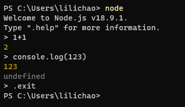
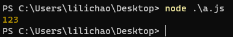

# Node.js Runtime 完整知识体系

Node.js 是跨平台 JavaScript Runtime（JavaScript 运行时）：它负责执行 JavaScript，并在 ECMAScript 语言能力之外提供文件、网络、进程、定时器和数据流等宿主能力，使 JavaScript 可以运行 CLI、构建工具、服务端应用和后台任务。Node.js 使用 V8 执行 JavaScript，但 Node.js 不等于 V8；V8 负责 JavaScript 语言执行，Node.js 继续提供 Runtime API、异步 I/O、Process Lifecycle 与操作系统能力。[[1]](https://nodejs.org/en/learn/getting-started/introduction-to-nodejs)

理解 Node.js 可以沿两条长期主线展开。第一条是执行主线，回答一段 JavaScript 怎样从源码进入 Process，并在异步 I/O 和 Event Loop 的配合下持续运行；第二条是运行边界，回答 Node Runtime 怎样向上支撑 HTTP Server、Web Framework 和 Server Application，又怎样向下进入 Process、Container 与生产环境。

~~~text
执行主线

JavaScript Source
        ↓
Node Process
承载一次程序运行
        ↓
V8
解析、编译并执行 JavaScript
        ↓
Node Runtime API
让 JavaScript 访问文件、网络、进程和定时器
        ↓
Runtime / OS / libuv
处理需要等待的 I/O 和底层工作
        ↓
Event Loop
调度已经满足继续执行条件的工作
        ↓
Callback / Promise Continuation
JavaScript 继续处理结果
        ↓
Application 持续运行
~~~

~~~text
运行边界

Node.js Runtime
提供 JavaScript 执行和宿主能力
        ↓
HTTP / File / Network / Process
提供基础系统能力
        ↓
Express / Fastify
组织 Web Request Processing
        ↓
NestJS / Application Framework
组织 Module、DI 和应用生命周期
        ↓
Server Application
承载身份、业务、数据和后台任务
        ↓
Process / Container / Service
进入长期生产运行环境
~~~

这两张图只建立方向。下面每一层都会继续解释它从上游接收什么、解决什么问题、输出什么，以及为什么需要进入下一层。

| 层级 | 上游输入 | 解决的问题 | 输出 |
| --- | --- | --- | --- |
| Node Process | JavaScript Entry + Runtime Config | 程序以什么操作系统实体运行 | 正在运行的 Node Process |
| V8 | JavaScript Source | JavaScript 怎样解析、编译和执行 | JavaScript Execution |
| Node Runtime API | JavaScript 调用 | JavaScript 怎样访问宿主能力 | I/O、Timer、Server、Process Operation |
| Runtime / OS / libuv | 需要等待的 Operation | 等待期间怎样避免 JavaScript 原地阻塞 | Completion Event |
| Event Loop | 已完成或已到期的工作 | 哪些 JavaScript 工作可以继续执行 | Callback / Continuation |
| Framework / Application | Runtime 基础能力 | 怎样组织长期服务和业务逻辑 | Server Application |
| Production Runtime | Build Artifact + Runtime Config | 程序怎样长期运行、退出和被治理 | Process / Container / Service |

## 1. Node.js Runtime 将 JavaScript 语言连接到操作系统宿主能力

### 【JavaScript、V8 与 Node.js Runtime 属于不同层级】

JavaScript 是语言，ECMAScript 定义语法、类型、函数、Promise 等语言能力；它本身并不规定怎样读取本地文件、监听 TCP Port 或读取操作系统环境变量。

V8 是 JavaScript Engine（JavaScript 引擎）：负责解析、编译和执行 JavaScript。

Node.js Runtime 则把 V8 与操作系统能力连接起来：

~~~text
JavaScript Source
        ↓
V8
执行 ECMAScript
        ↓
Node.js Runtime
提供宿主 API 和运行生命周期
        ↓
Operating System / Network / Filesystem
~~~

因此需要区分：

~~~text
JavaScript
→ 语言

V8
→ JavaScript 执行引擎

Node.js
→ 使用 V8 并提供完整宿主 Runtime
~~~

浏览器与 Node.js 都可以执行 JavaScript，但宿主环境不同：

| 能力 | Browser Runtime | Node.js Runtime |
| --- | --- | --- |
| ECMAScript | 支持 | 支持 |
| DOM / BOM | 浏览器提供 | 默认不存在 |
| File System | 浏览器安全边界下受限 | 通过 Node API 访问 |
| HTTP Client | Fetch / XHR 等 | Fetch / http / https 等 |
| HTTP Server | 不提供普通 Server Listener | 可通过 node:http / node:https 创建 |
| Process | 没有 Node Process 模型 | 提供 process |
| Environment Variable | 不直接暴露 OS 环境 | process.env |
| Module | ESM 为主 | CommonJS + ESM |

所以“JavaScript 可以做什么”不能只由语言本身判断，还取决于代码运行在哪一个 Runtime 中。

### 【REPL 与脚本入口把 JavaScript 交给 Node Runtime 执行】

REPL（Read-Eval-Print Loop，读取—执行—输出循环）：用于交互式执行 JavaScript。

~~~bash
node
~~~



工程中更常见的是执行入口文件：

~~~bash
node app.js
~~~



执行过程可以理解为：

~~~text
node app.js
↓
Operating System 创建 Node Process
↓
Node 加载 Entry Module
↓
V8 执行 Top-level JavaScript
↓
程序建立 Timer / I/O / Server 等工作
↓
Event Loop 持续调度
↓
仍有活动工作
→ Process 持续运行
~~~

如果没有剩余活动工作保持 Runtime 运行，Node Process 会自然结束。

### 【Node.js 的用途来自 Runtime 能力而不是“只能做后端”】

| 场景 | 依赖的 Runtime 能力 |
| --- | --- |
| HTTP / API Server | Network、HTTP、Stream、Process |
| WebSocket / Realtime Service | Network、Event、Buffer |
| CLI | Process、Filesystem、Child Process |
| Build Tool | Filesystem、Module、Process、Child Process |
| Background Job | Process、I/O、Timer、Queue Client |
| Automation | Filesystem、Network、Process |

Express、Fastify、NestJS 建立在 Node Runtime 之上；Webpack、Vite、ESLint 等工具也依赖 Node Runtime 读取文件、解析配置和执行任务。

## 2. Node Process 承载一次应用运行并管理完整生命周期

### 【Process 是 Node.js 程序的操作系统运行实体】

Process（进程）：操作系统为正在运行的程序提供的执行与资源边界。

~~~bash
node server.js
~~~

会创建一个 Node Process。

Node.js 的全局 process 对象提供当前 Node Process 的信息和控制能力，而不是负责创建子进程。官方文档将其定义为提供当前 Node.js Process 的信息和控制。[[2]](https://nodejs.org/api/process.html)

~~~js
console.log(process.pid)
console.log(process.argv)
console.log(process.env.NODE_ENV)
console.log(process.cwd())
~~~

| API | 含义 |
| --- | --- |
| process.pid | 当前 Process ID |
| process.argv | 当前进程启动参数 |
| process.env | 当前进程可读取的环境变量 |
| process.cwd() | Current Working Directory |
| process.exitCode | 进程结束时希望返回的 Exit Code |

因此职责边界是：

~~~text
process
→ 当前 Node Process 的信息与控制

node:child_process
→ 创建新的 OS Process
~~~

### 【Process Lifecycle 从启动持续到 Event Loop 无工作或显式终止】

~~~text
OS 启动 node
↓
初始化 Node Runtime / V8
↓
加载 Entry Module
↓
执行 Top-level JavaScript
↓
建立 Timer / I/O / Server / Worker 等工作
↓
Event Loop 持续调度
↓
达到退出条件
├── 没有剩余活动工作
├── 显式退出
├── Fatal Error
└── Operating System Signal
↓
Process Exit
~~~

HTTP Server 不会在入口代码执行结束后立即退出，因为 Server Socket 等活动资源仍然让 Runtime 有工作需要继续处理。

### 【Signal 把操作系统生命周期连接到应用清理逻辑】

Signal（操作系统信号）：操作系统向 Process 发送的生命周期或控制通知。长期运行服务通常关注 SIGTERM、SIGINT 等退出信号。

~~~js
import process from 'node:process'

process.on('SIGTERM', async () => {
  await closeServer()
  await closeDatabase()
  process.exitCode = 0
})
~~~

这段最小代码验证的是：

~~~text
Operating System
↓ Signal
Node Process
↓
Application Cleanup
↓
Resource Close
↓
Process Exit
~~~

它没有证明所有退出情况都有机会完成异步清理。强制 Kill、Process Crash、Host Failure 等场景仍可能直接终止程序。

### 【Node Version Manager 管理开发环境中的 Runtime 版本】

NVM（Node Version Manager，Node 版本管理器）：用于安装和切换不同 Node.js 版本。它属于开发环境中的 Runtime Version Management，不属于 Node 内部执行机制。

~~~bash
nvm install 22
nvm use 22
nvm ls
nvm alias default 22
~~~

工程上还需要通过 .nvmrc、package.json 的 engines、CI Runtime Version 等约束保持本地、CI 和生产环境的版本一致性。

## 3. Node Runtime API 将 JavaScript 连接到文件、网络与数据流

### 【Runtime API 按宿主能力划分而不是按业务场景平铺】

Node.js 内置模块覆盖多类宿主能力。[[3]](https://nodejs.org/api/)

| 模块 | 主要职责 |
| --- | --- |
| node:fs | File System |
| node:path | 文件路径 |
| node:url | URL |
| node:http / node:https | HTTP Client / Server |
| node:net | TCP |
| node:dgram | UDP |
| node:stream | Stream |
| node:buffer | Binary Data |
| node:events | EventEmitter |
| node:timers | Timer |
| node:os | Operating System 信息 |
| node:process | 当前 Process |
| node:child_process | Child Process |
| node:worker_threads | JavaScript Worker Thread |

完整 API 速查继续参考 [Node.js 常用模块（面试版）](./N-Node.js常用模块（面试版）.md)。本节关注这些 API 在 Runtime 主线中的位置。

### 【同步与异步 File System API 具有不同的 Event Loop 影响】

异步读取：

~~~js
import { readFile } from 'node:fs/promises'

const text = await readFile('./config.json', 'utf8')
~~~

执行关系是：

~~~text
JavaScript
↓ 调用 Node API
File System Operation
↓ 等待期间可继续处理其他可运行工作
Promise Fulfilled
↓
async function 继续执行
~~~

同步 API 会让当前 JavaScript 执行等待 Operation 完成。是否使用同步 API 不能只记“同步一定不能用”，而要判断：

~~~text
调用发生在哪里？
↓
持续多长时间？
↓
是否阻塞需要处理其他请求的 Event Loop？
~~~

例如 Server 热路径上的大文件同步读取通常风险较高；CLI 初始化阶段读取少量本地配置则可能是可以接受的工程取舍。

### 【Buffer 表示字节，Stream 表示数据怎样随时间分段流动】

Buffer 用于表示 Binary Data（二进制数据），常见于 File、TCP、HTTP Body、Compression、Crypto 和 Stream Chunk。

~~~js
const data = Buffer.from('hello')
console.log(data.toString('utf8'))
~~~

Stream（流）：让数据可以分段读取、处理和写入。

~~~text
Data Source
↓
Readable Stream
↓ Chunk
Transform / Application Logic
↓ Chunk
Writable Stream
↓
Data Destination
~~~

因此：

~~~text
Buffer
→ 一段字节数据

Stream
→ 字节数据怎样持续流动
~~~

### 【FS、Buffer 与 Path 的完整使用保留在 Runtime API 分支】


`fs` (**File System**) 是 Node.js 内置的文件系统模块

- 用于 **文件读写**、**目录操作**、**文件状态查看** 等
- 提供 **同步**（`xxxSync`）和 **异步**（回调/Promise）两种 API
- 异步版本**不会阻塞**线程，性能更好

导入方式：

```js
const fs = require('fs');
```

### 【常用API总表】

| 类别             | 异步方法                                        | 同步方法                           | 说明                 |
| ---------------- | ----------------------------------------------- | ---------------------------------- | -------------------- |
| **读取文件**     | `fs.readFile(path, [options], callback)`        | `fs.readFileSync(path, [options])` | 读取整个文件内容     |
| **写入文件**     | `fs.writeFile(path, data, [options], callback)` | `fs.writeFileSync(...)`            | 覆盖写入文件         |
| **追加写入**     | `fs.appendFile(...)`                            | `fs.appendFileSync(...)`           | 追加内容到文件末尾   |
| **删除文件**     | `fs.unlink(...)`                                | `fs.unlinkSync(...)`               | 删除文件             |
| **重命名/移动**  | `fs.rename(...)`                                | `fs.renameSync(...)`               | 重命名文件或移动位置 |
| **检测文件状态** | `fs.stat(...)`                                  | `fs.statSync(...)`                 | 查看文件/目录信息    |
| **判断存在**     | `fs.exists(path）`                              | `fs.existsSync(path)`              | 判断路径是否存在     |
| **创建目录**     | `fs.mkdir(...)`                                 | `fs.mkdirSync(...)`                | 创建文件夹           |
| **读取目录**     | `fs.readdir(...)`                               | `fs.readdirSync(...)`              | 获取目录内容         |
| **删除目录**     | `fs.rmdir(...)`                                 | `fs.rmdirSync(...)`                | 删除文件夹（空）     |
| **流式读取**     | `fs.createReadStream(path)`                     | -                                  | 创建可读流           |
| **流式写入**     | `fs.createWriteStream(path)`                    | -                                  | 创建可写流           |

### 【基本示例】

#### <u>1. 读取文件</u>

```js
fs.readFile('./test.txt', 'utf8', (err, data) => {
  if (err) throw err;
  console.log('文件内容:', data);
});

// 同步
const data = fs.readFileSync('./test.txt', 'utf8');
console.log(data);
```

#### <u>2. 写入/追加</u>

```js
// 覆盖写入
fs.writeFile('./test.txt', 'Hello World', err => {
  if (err) throw err;
  console.log('写入成功');
});

// 追加写入
fs.appendFile('./test.txt', '\n追加内容', err => {
  if (err) throw err;
});
```

#### <u>3. 删除/重命名</u>

```js
fs.unlink('./test.txt', err => {
  if (err) throw err;
  console.log('删除成功');
});

fs.rename('./old.txt', './new.txt', err => {
  if (err) throw err;
  console.log('重命名成功');
});
```

#### <u>4. 目录操作</u>

```js
// 创建目录
fs.mkdir('./demo', err => {
  if (err) throw err;
  console.log('目录创建成功');
});

// 读取目录
fs.readdir('./demo', (err, files) => {
  if (err) throw err;
  console.log('目录内容:', files);
});

// 删除目录（空目录）
fs.rmdir('./demo', err => {
  if (err) throw err;
  console.log('目录删除成功');
});
```

#### <u>5. 文件状态</u>

```js
fs.stat('./test.txt', (err, stats) => {
  if (err) throw err;
  console.log(stats.isFile()); // true
  console.log(stats.isDirectory()); // false
});
```

#### <u>6. 流式读写</u>

```js
const rs = fs.createReadStream('./input.txt');
const ws = fs.createWriteStream('./output.txt');

rs.pipe(ws); // 直接管道传输
```

- `createReadStream` 会分块读取文件，读到一块就触发数据事件
- `pipe` 方法自动把读到的数据传给写入流
- 这样不用把整个文件一次加载进内存，适合大文件处理

```js
//创建读取流对象
let rs = fs.createReadStream('./观书有感.txt');
//每次取出 64k 数据后执行一次 data 回调
rs.on('data', data => {
    console.log(data);
    console.log(data.length);
});
//读取完毕后, 执行 end 回调
rs.on('end', () => {
    console.log('读取完成')
})
```

### 【同步 vs 异步】

- **同步**：代码会阻塞等待文件操作完成
- **异步**：文件操作在后台进行，主线程可以继续执行其他任务
- 建议在高并发服务中**优先使用异步**版本


### 【Buffer是什么？】

- Buffer 是 Node.js 提供的 **用于处理二进制数据的类数组对象**。
- 它的出现解决了 JavaScript 语言本身不支持直接操作二进制数据的问题。
- Buffer 常用于处理文件、网络通信等二进制数据流。

### 【Buffer的创建】

```js
// 创建一个长度为10的Buffer，内容未初始化（可能包含旧数据）
const buf1 = Buffer.allocUnsafe(10);

// 创建一个长度为10的Buffer，内容全部初始化为0
const buf2 = Buffer.alloc(10);

// 通过数组创建Buffer
const buf3 = Buffer.from([1, 2, 3, 4]);

// 通过字符串创建Buffer，默认utf8编码
const buf4 = Buffer.from('hello');

// 通过字符串创建Buffer，指定编码
const buf5 = Buffer.from('hello', 'ascii');
```

### 【常用操作】

| 操作         | 方法/属性                                                    | 说明             | 示例                          |
| ------------ | ------------------------------------------------------------ | ---------------- | ----------------------------- |
| 获取长度     | `buf.length`                                                 | Buffer字节长度   | `buf.length`                  |
| 写入字符串   | `buf.write(string, [offset], [length], [encoding])`          | 写入内容         | `buf.write('abc')`            |
| 读取字符串   | `buf.toString([encoding], [start], [end])`                   | 转为字符串       | `buf.toString('utf8', 0, 5)`  |
| 合并 Buffer  | `Buffer.concat([buf1, buf2, ...])`                           | 合并多个Buffer   | `Buffer.concat([buf1, buf2])` |
| 拷贝数据     | `buf.copy(targetBuffer, [targetStart], [sourceStart], [sourceEnd])` | 复制内容         | `buf1.copy(buf2)`             |
| 截取子Buffer | `buf.slice(start, end)`                                      | 获取Buffer子区间 | `buf.slice(0, 3)`             |

### 【Buffer 与字符串的转换】

- Buffer → 字符串

  ```js
  buf.toString('utf8');
  ```

- 字符串 → Buffer

  ```js
  Buffer.from('字符串', 'utf8');
  ```

编码支持

- 支持多种编码格式：`utf8`（默认）、`ascii`、`base64`、`hex`、`latin1` 等。

### 【示例：写入与读取】

```js
const buf = Buffer.alloc(10);
buf.write('hello');
console.log(buf.toString('utf8', 0, 5)); // 输出 hello
```

- 通过 `Buffer.alloc(10)` 申请 10 字节空间；
- 用 `write` 写入字符串到 Buffer；
- 用 `toString` 读取指定范围的字节转换成字符串。
- 这样你就可以把字符串转换成二进制存储，也能从二进制读取对应字符串。

### 【注意事项】

- Buffer 大小固定，创建后不可动态扩容
- 使用 `Buffer.allocUnsafe` 可能包含旧数据，慎用
- 操作二进制数据时，注意编码和字节偏移


### 【Path模块简介】

- `path` 是 Node.js 的核心模块，用于处理和转换文件路径。
- 解决不同操作系统（Windows、Linux、macOS）路径分隔符不同的问题。
- 提供了许多实用的方法来解析、拼接、格式化路径。

### 【导入方式】

```js
const path = require('path');
```

### 【常用 API 及说明】

| 方法                         | 说明                                            | 示例                                                         |
| ---------------------------- | ----------------------------------------------- | ------------------------------------------------------------ |
| `path.basename(path, [ext])` | 返回路径中的文件名部分，可去除指定扩展名        | `path.basename('/foo/bar/baz.txt') // 'baz.txt'`             |
| `path.dirname(path)`         | 返回路径中的目录部分                            | `path.dirname('/foo/bar/baz.txt') // '/foo/bar'`             |
| `path.extname(path)`         | 返回路径中的扩展名                              | `path.extname('index.html') // '.html'`                      |
| `path.parse(path)`           | 解析路径为对象，包含 root、dir、base、ext、name | `path.parse('/foo/bar/baz.txt')` 返回 `{ root: '/', dir: '/foo/bar', base: 'baz.txt', ext: '.txt', name: 'baz' }` |
| `path.format(pathObject)`    | 把路径对象转换回路径字符串                      | `path.format({ root: '/', dir: '/foo/bar', base: 'baz.txt' })` 返回 `/foo/bar/baz.txt` |
| `path.isAbsolute(path)`      | 判断路径是否为绝对路径                          | `path.isAbsolute('/foo/bar') // true`                        |
| `path.join([...paths])`      | 拼接路径，自动处理分隔符                        | `path.join('/foo', 'bar', 'baz') // '/foo/bar/baz'`          |
| `path.resolve([...paths])`   | 解析为绝对路径，基于当前工作目录                | `path.resolve('foo', '/bar', 'baz')` 返回绝对路径            |
| `path.relative(from, to)`    | 计算从 `from` 到 `to` 的相对路径                | `path.relative('/data/orandea/test/aaa', '/data/orandea/impl/bbb')` 返回 `../../impl/bbb` |
| `path.sep`                   | 当前操作系统的路径分隔符                        | `'\\'`（Windows）或 `'/'`（Linux/macOS）                     |
| `path.delimiter`             | 当前操作系统的环境变量分隔符                    | `';'`（Windows）或 `':'`（Linux/macOS）                      |

- `__dirname` 与 `require` 类似，都是 Node.js 环境中的全局变量。`__dirname` 保存着 当前文件所在目录的绝对路径 ，可以使用 `__dirname` 与文件名拼接成绝对路径

### 【使用示例】

```js
js复制编辑const path = require('path');

const filePath = '/foo/bar/baz.txt';

console.log('文件名:', path.basename(filePath)); // baz.txt
console.log('目录名:', path.dirname(filePath)); // /foo/bar
console.log('扩展名:', path.extname(filePath)); // .txt

const parsed = path.parse(filePath);
console.log(parsed);
// {
//   root: '/',
//   dir: '/foo/bar',
//   base: 'baz.txt',
//   ext: '.txt',
//   name: 'baz'
// }

const joinedPath = path.join('/foo', 'bar', 'baz');
console.log('拼接路径:', joinedPath); // /foo/bar/baz

const resolvedPath = path.resolve('foo', '/bar', 'baz');
console.log('绝对路径:', resolvedPath); // 取决于当前工作目录

console.log('是否绝对路径:', path.isAbsolute(filePath)); // true

const relativePath = path.relative('/foo/bar', '/foo/baz/file.txt');
console.log('相对路径:', relativePath); // ../../baz/file.txt
```


## 4. Event Loop 与异步 I/O 让等待型工作并发推进

### 【非阻塞 I/O 不等于所有工作都交给一个后台线程】

Non-blocking I/O（非阻塞 I/O）：发起 I/O 后，不要求当前 JavaScript 执行流一直停在原地等待结果。

~~~text
JavaScript
↓
Node Runtime API
↓
Runtime / OS / libuv 协作
├── Operating System 异步能力
└── 某些操作进入 Worker Pool
↓
Operation Complete
↓
Event Loop
↓
Callback / Promise Continuation
↓
JavaScript 继续处理结果
~~~

不同 I/O 的底层实现可能不同。因此：

~~~text
Asynchronous
≠
一定创建新的 JavaScript Thread

Non-blocking
≠
所有 I/O 都由同一种后台线程完成
~~~

这里的核心是“等待不要求 JavaScript 主执行流原地占住时间”，而不是把所有底层机制简化成统一线程模型。

### 【Event Loop 调度已经满足继续执行条件的工作】

Event Loop（事件循环）：Runtime 持续判断哪些 Timer、I/O Result 和其他异步工作已经满足继续执行条件，并安排对应 JavaScript Callback 进入执行流程。

~~~text
JavaScript Call Stack
↓
调用 Async Runtime API
↓
当前调用结束
↓
Runtime 等待 I/O / Timer
↓
Event Ready
↓
Event Loop 调度
↓
Callback
↓
JavaScript Call Stack
~~~

~~~js
console.log('A')

setTimeout(() => {
  console.log('B')
}, 0)

console.log('C')
~~~

通常先得到：

~~~text
A
C
B
~~~

setTimeout(..., 0) 表示 Timer 满足调度条件后尽快进入后续调度，并不表示 Callback 会在当前 Call Stack 中立即执行。

### 【Promise 与 async-await 位于 JavaScript 异步延续层】

Promise、async 和 await 是 JavaScript 的异步编程抽象，不是 Node.js 独有机制。

~~~text
Node Async Operation
↓
Promise Pending
↓
Operation Complete
↓
Promise Fulfilled / Rejected
↓
Microtask
↓
async function / then handler 继续执行
~~~

因此：

~~~text
Event Loop
≠
Promise

Node Async I/O
≠
async / await
~~~

Promise State、Resolution Procedure、静态方法、Microtask、async/await 与手写 Promise 的完整知识统一进入 [前端异步编程](./Q-前端异步编程.md)。原 Node 综合笔记中的完整 Promise 教程已经在该文档中拥有更完整的主入口，因此 Node Runtime 不再维护第二套相同知识树。

### 【Concurrency 与 Parallelism 描述不同执行能力】

Concurrency（并发）：多个工作在同一时间区间内都能够向前推进。

Parallelism（并行）：多个工作在同一时刻真正由不同计算资源执行。

大量 I/O 工作常见的是：

~~~text
Main JavaScript Thread
+
大量正在等待的 I/O
↓
Concurrency
~~~

Worker Thread 或多个 Process 则可以提供更多 Parallel Execution 能力。

### 【CPU-heavy JavaScript 会直接影响 Event Loop 响应能力】

~~~text
Long CPU Work
↓
Main JavaScript Thread 长时间被占用
↓
Event Loop 无法及时处理其他 Callback
↓
Timer / Request / I/O Completion Handler 延迟
↓
Application Responsiveness 下降
~~~

“Node.js 适合 I/O-intensive workload”不等于 CPU 计算不能做，而是 CPU-heavy JavaScript 需要控制单次占用时间，或考虑 Worker Thread、Child Process、独立计算服务等其他执行边界。

## 5. Worker Thread 与 Child Process 扩展默认执行模型

### 【Node.js 不是整个 Runtime 只有一个线程】

默认 Node 应用中，JavaScript 主要在 Event Loop 所在线程执行，但整个 Runtime 不只有一个线程。

~~~text
Node Process
│
├── Main JavaScript Thread
│   └── Event Loop
│
├── Runtime / Worker Pool
│   └── 支撑部分异步底层工作
│
├── Worker Threads
│   └── 可以并行执行 JavaScript
│
└── Child Processes
    └── 创建独立 OS Process
~~~

### 【Worker Thread 在同一 Process 中并行执行 JavaScript】

Worker Thread（工作线程）：node:worker_threads 提供的独立 JavaScript 执行线程。官方文档明确说明 Worker 更适合 CPU-intensive JavaScript，通常不会提升已经由 Node 异步 I/O 高效处理的 I/O-intensive 工作。[[4]](https://nodejs.org/api/worker_threads.html)

~~~js
import { Worker } from 'node:worker_threads'

const worker = new Worker(new URL('./worker.js', import.meta.url))
worker.on('message', result => {
  console.log(result)
})
~~~

这段代码验证：

~~~text
CPU-heavy JavaScript
↓
不希望长期占用 Main Event Loop Thread
↓
Worker Thread
↓
另一条 JavaScript Execution Thread
~~~

### 【Child Process 创建独立操作系统进程】

Child Process（子进程）：由 node:child_process 创建的独立 OS Process。官方提供 spawn、exec、execFile、fork 等 API。[[5]](https://nodejs.org/api/child_process.html)

~~~js
import { spawn } from 'node:child_process'

const child = spawn('node', ['job.js'])
child.stdout.on('data', data => {
  process.stdout.write(data)
})
~~~

如果 Child Process 启动的是新的 Node 程序，它会拥有自己的 Node Runtime 和 V8 Instance。

### 【Process、Worker Thread 与应用级 Worker 属于不同抽象层】

| 概念 | 执行边界 | JavaScript 并行 | 常见用途 |
| --- | --- | --- | --- |
| Main Event Loop Thread | 当前 Node Process | 默认一条主要 JS 执行流 | Request / I/O orchestration |
| Worker Thread | 同一 Process 内 Thread | 可以 | CPU-intensive JavaScript |
| Child Process | 独立 OS Process | 可以 | Shell、独立任务、进程隔离 |
| Async Worker / Queue Worker | 应用角色，不限定线程实现 | 取决于部署方式 | 后台任务消费 |

Docker 文档中的 Worker Service、消息队列 Consumer 与 worker_threads 不是同一个概念。

## 6. Module、Package 与 Package Manager 组织 Node 应用代码和依赖

### 【Node.js 同时支持 CommonJS 与 ECMAScript Modules】

Node.js 同时支持 CommonJS（CJS）和 ECMAScript Modules（ESM）。[[6]](https://nodejs.org/api/modules.html)[[7]](https://nodejs.org/api/esm.html)

~~~js
const fs = require('node:fs')
module.exports = { readConfig }
~~~

~~~js
import { readFile } from 'node:fs/promises'
export function readConfig() {}
~~~

稳定边界是：

~~~text
JavaScript 模块化
→ 语言与模块组织通用知识

Node.js Module Loader
→ Node Runtime 怎样加载 CJS / ESM
~~~

IIFE、AMD、CMD、ESM Live Binding、CommonJS Export 等完整知识统一参考 [前端模块化规范](./Q-前端模块化规范.md)。

### 【Package Manager 将依赖声明转换为可解析依赖】

Package Manager（包管理器）：读取 Package Manifest 中的依赖声明，解析版本、下载 Package、维护 Lockfile，并让应用能够解析依赖。

~~~text
package.json
↓
Dependency Resolution
↓
Lockfile
↓
Package Fetch / Store
↓
Installation / Linking
↓
Application 可以解析依赖
~~~

Workspace、多 Project Dependency 与 Task Graph 进一步进入 [Monorepo 工程体系](./M-Monorepo工程体系.md)。

### 【原有 Package Manager 完整知识继续保留在这一运行依赖分支】


### 【NPM介绍】

NPM（**Node Package Manager**）是 **Node.js 的包管理工具**，也是**世界上最大的 JavaScript 软件包生态系统**。

- **全称**：Node Package Manager
- **功能**：用于安装、管理、共享 JavaScript 包（模块/库）
- **作用对象**：主要配合 Node.js 使用，但也适用于前端项目（如 Vue、React）

> 安装 Node.js 时通常会自动附带安装 NPM。

**三大功能**

| 功能     | 说明                                         |
| -------- | -------------------------------------------- |
| 安装模块 | 安装你项目需要的库（如 `express`、`lodash`） |
| 管理依赖 |                                              |
| 发布包   | 将你自己的模块上传到 NPM 仓库，供他人使用    |

NPM 常用命令速查表

| 命令          | 功能说明                        | 备注               |
| ------------- | ------------------------------- | ------------------ |
| `npm init`    | 初始化项目，创建 `package.json` | 会提示填写信息     |
| `npm init -y` | 快速初始化项目                  | 使用默认值跳过询问 |

安装依赖

| 命令                                    | 功能说明                            | 备注                                       |
| --------------------------------------- | ----------------------------------- | ------------------------------------------ |
| `npm install` 或 `npm i`                | 安装所有依赖（根据 `package.json`） | 生成 `node_modules` 和 `package-lock.json` |
| `npm install <包名>`                    | 安装指定包，添加到 `dependencies`   | 默认本地安装                               |
| `npm install <包名> --save-dev` 或 `-D` | 安装为开发依赖                      | 添加到 `devDependencies`                   |
| `npm install -g <包名>`                 | 全局安装一个包                      | 多用于 CLI 工具（如 nodemon）              |

卸载依赖

| 命令                   | 功能说明                           | 备注             |
| ---------------------- | ---------------------------------- | ---------------- |
| `npm uninstall <包名>` | 卸载依赖并从 `package.json` 中移除 | 支持卸载开发依赖 |

更新与查看

| 命令                 | 功能说明             | 备注                           |
| -------------------- | -------------------- | ------------------------------ |
| `npm update <包名>`  | 更新某个依赖包       | 自动安装符合 semver 的最新版本 |
| `npm outdated`       | 查看过时的依赖包     | 显示当前版本、最新版本等       |
| `npm list`           | 查看当前项目依赖结构 | 默认显示完整树                 |
| `npm list --depth=0` | 查看顶级依赖         | 常用于查看主要依赖版本         |

运行脚本

| 命令               | 功能说明                              | 备注                           |
| ------------------ | ------------------------------------- | ------------------------------ |
| `npm start`        | 执行 `package.json` 中的 `start` 脚本 | 如：`"start": "node index.js"` |
| `npm run <脚本名>` | 执行自定义脚本                        | 如：`npm run dev`              |
| `npm test`         | 执行 `test` 脚本                      | 一般用于单元测试               |

 镜像源设置（加速）

| 命令                            | 功能说明          | 备注                                      |
| ------------------------------- | ----------------- | ----------------------------------------- |
| `npm config set registry <url>` | 设置 NPM 镜像地址 | 如淘宝源 `https://registry.npmmirror.com` |
| `npm config get registry`       | 查看当前镜像源    | 可用于确认是否设置成功                    |

其他实用命令

| 命令                      | 功能说明                | 备注                                  |
| ------------------------- | ----------------------- | ------------------------------------- |
| `npm cache clean --force` | 清除本地缓存            | 修复安装错误时常用                    |
| `npm doctor`              | 检查 NPM 环境配置       | 帮助诊断问题                          |
| `npm version <type>`      | 自动升级版本号          | `type`为 `patch`、`minor`、`major` 等 |
| `npm publish`             | 发布自己的包到 NPM 仓库 | 需要先登录账户                        |
| `npm login`               | 登录到 NPM 账号         | 发布包前必须登录                      |

### 【Yarn和Pnpm】

**Yarn**

- 安装速度快（比 npm 早期版本快很多）
- 默认使用 `yarn.lock` 锁定依赖
- 支持 **Plug'n'Play（PnP）**，跳过 `node_modules`

**pnpm**

- 采用 **符号链接 + 全局内容寻址存储** 节省磁盘空间
- 更严格的依赖隔离，防止 `npm` 和 `yarn` 容易出现的“幽灵依赖”
- 支持 monorepo（内置 workspace）

| 功能             | npm 命令                                       | yarn 命令                        | pnpm 命令                        |
| ---------------- | ---------------------------------------------- | -------------------------------- | -------------------------------- |
| 初始化项目       | `npm init`  `npm init -y`                      | `yarn init`  `yarn init -y`      | `pnpm init`  `pnpm init -y`      |
| 安装依赖（全部） | `npm install`  `npm i`                         | `yarn install`                   | `pnpm install`                   |
| 安装依赖（指定） | `npm install 包名`                             | `yarn add 包名`                  | `pnpm add 包名`                  |
| 安装开发依赖     | `npm install 包名 --save-dev`  `npm i 包名 -D` | `yarn add 包名 --dev`            | `pnpm add 包名 -D`               |
| 安装全局包       | `npm install -g 包名`                          | `yarn global add 包名`           | `pnpm add -g 包名`               |
| 移除依赖         | `npm uninstall 包名`  `npm rm 包名`            | `yarn remove 包名`               | `pnpm remove 包名`               |
| 更新依赖         | `npm update 包名`                              | `yarn upgrade 包名`              | `pnpm update 包名`               |
| 查看过期依赖     | `npm outdated`                                 | `yarn outdated`                  | `pnpm outdated`                  |
| 运行脚本         | `npm run 脚本名`                               | `yarn run 脚本名`  `yarn 脚本名` | `pnpm run 脚本名`  `pnpm 脚本名` |
| 清缓存           | `npm cache clean --force`                      | `yarn cache clean`               | `pnpm store prune`               |
| 查看依赖树       | `npm list`                                     | `yarn list`                      | `pnpm list`                      |
| 安装指定版本     | `npm install 包名@版本`                        | `yarn add 包名@版本`             | `pnpm add 包名@版本`             |
| 安装本地包       | `npm install ./路径`                           | `yarn add ./路径`                | `pnpm add ./路径`                |

### 【package.json】

`package.json` 是 **Node.js** 和 **前端项目（如使用 npm 或 yarn 管理依赖的项目）** 中的一个核心配置文件。它是一个 **JSON 格式的文件**，主要用来描述项目的基本信息、依赖关系、脚本命令等。

```json
{
  "name": "your-project-name",        // 项目名称
  "version": "1.0.0",                 // 版本号，遵循语义化版本规则
  "description": "A short description of your project", // 项目描述
  "main": "index.js",                 // 项目入口文件
  "scripts": {                       // 脚本命令，可以用 npm run 命令调用
    "start": "node index.js",       // 启动项目
    "test": "jest"                  // 测试命令
  },
  "keywords": [                      // 关键词，便于搜索
    "node",
    "express",
    "example"
  ],
  "author": "Your Name",             // 作者
  "license": "MIT",                  // 许可证类型
  "dependencies": {                  // 生产依赖包
    "express": "^4.17.1",
    "lodash": "^4.17.20"
  },
  "devDependencies": {               // 开发依赖包，仅在开发环境需要
    "jest": "^26.4.2",
    "eslint": "^7.0.0"
  },
  "repository": {                   // 代码仓库信息
    "type": "git",
    "url": "https://github.com/yourname/your-repo.git"
  },
  "engines": {                     // 指定 Node.js 或 npm 的版本要求
    "node": ">=14.0.0"
  },
  "private": true                  // 是否为私有项目，true 时禁止发布到 npm
}
```

**常见字段作用：**

- **name**：包的名称。
- **version**：版本号。
- **description**：项目描述。
- **main**：入口文件。
- **scripts**：定义脚本命令，如启动、测试、构建等。
- **dependencies**：生产环境依赖的包。
- **devDependencies**：开发环境依赖的包。
- **repository**：仓库地址。
- **keywords**：关键字。
- **author**：作者。
- **license**：开源协议。
- **private**：防止发布到 npm（通常私有项目设置为 true）。

**生产依赖包 (`dependencies`)**

- **用途**：这些依赖是你的项目在 **运行时（生产环境）** 必须依赖的包。也就是说，当你的应用真正上线、给用户使用时，程序依赖的这些包必须存在。

**开发依赖包 (`devDependencies`)**

- **用途**：这些依赖是你在 **开发阶段** 用来辅助开发、测试、构建、代码检查等的工具包，生产环境不需要它们。最终运行的时候不需要打包。

**举例**：

- 代码打包工具（如 `webpack`、`rollup`）
- 测试框架（如 `jest`、`mocha`）
- 代码格式检查工具（如 `eslint`、`prettier`）

**`package-lock.json`**

- **作用**：锁定项目中所有依赖包的**具体版本号**和**依赖树结构**，确保每次安装依赖时，安装的包版本一致，避免因依赖版本变化导致代码不稳定，也不免反复按照多个版本依赖。node自动配置，不需要手动修改。

### 【npx】

**npx** 是 Node.js 自带的一个命令行工具（从 **npm 5.2.0** 开始内置），它的主要作用是 **执行 Node.js 项目中的可执行包（CLI 工具）**，而不需要你提前全局安装它。

#### <u>1. 为什么有 npx</u>

在 npx 出现之前：

- 如果想用某个 npm 包的命令行工具（比如 `create-react-app`），你必须先用 `npm install -g create-react-app` 全局安装。
- 全局安装会导致版本管理困难，不同项目可能需要不同版本。

npx 解决了这些问题：

- 直接运行包的可执行文件，不必全局安装。
- 可以运行项目本地 `node_modules` 里的 CLI 工具。
- 支持临时安装一次性运行的工具，执行后自动清除。

#### <u>2. 使用方式</u>

**运行已安装在项目中的包**

```bash
npx eslint src/
```

等价于：

```bash
./node_modules/.bin/eslint src/
```

（npx 会自动到 `node_modules/.bin` 找可执行文件）

**运行一次性工具（没安装过）**

```bash
npx cowsay "Hello"
```

npx 会先下载 `cowsay`（存在临时目录），执行后删除。

**指定包版本执行**

```bash
npx create-react-app@4.0.0 my-app
```

可以避免全局安装多个版本冲突。

**执行 GitHub / Gist 上的包**

```bash
npx github:username/repo
npx gist:1234567890abcdef
```


## 7. HTTP Server 与 Web Framework 把 Runtime 能力组织成长期服务

### 【node:http 提供基础 HTTP Server 能力】

~~~js
import { createServer } from 'node:http'

const server = createServer((req, res) => {
  res.statusCode = 200
  res.end('ok')
})

server.listen(3000)
~~~

执行关系：

~~~text
Operating System Network
↓
Node HTTP Server
↓
Request / Response Object
↓
JavaScript Handler
↓
HTTP Response
~~~

Node Runtime 已经能够完成 HTTP 通信，但 Routing、Middleware、Validation、Error Handling、DI 和 Module 等应用组织需求需要进入 Framework 层。

### 【Express 与 Fastify 位于 Node HTTP 能力之上】

~~~text
Node.js Runtime
↓
node:http / Network
↓
Express / Fastify
↓
Route / Middleware / Hook
↓
Business Handler
~~~

因此 Express 不是 Node Runtime 内置模块，也不与 fs、path、process 处于同一抽象层。

### 【Express 与 EJS 的原有完整知识作为 Framework 分支继续保留】


> [Express - Node.js Web 应用程序框架 - Express.js 框架](https://express.js.cn/)

### 【什么是Express】

**Express** 是一个基于 **Node.js** 的轻量级 Web 应用框架，用于构建 Web 服务和 API。

它提供了一个简单而灵活的方式来：

- 处理 HTTP 请求和响应
- 定义路由规则
- 使用中间件进行功能扩展

Node.js 负责运行 JavaScript 并处理底层 HTTP，而Express在http模块上封装一层API，使得Web服务和处理 HTTP 请求更加高效。

#### <u>1. 核心特点</u>

1. **轻量 & 灵活**
   - 不像 Django、Rails 那样自带庞大功能，只提供核心 Web 处理能力
   - 想要什么功能用中间件扩展即可
2. **路由系统强大**
   - 方便定义不同 URL 对应的处理逻辑
   - 支持 RESTful API 风格
3. **中间件机制**
   - 核心思想：请求进来时可以经过一系列处理器（中间件），每个处理器做自己的事
   - 比如日志记录、解析 JSON、权限校验、错误处理等
4. **支持多种模板引擎**
   - 例如 EJS、Pug（原 Jade）、Handlebars 等
5. **与 Node.js 原生 HTTP 完全兼容**
   - 底层还是 Node.js 的 `http` 模块

### 【Express 基础用法】

**安装：**

```bash
npm install express
```

**最小示例：**

```js
const express = require('express');
const app = express();

// 定义一个 GET 路由
app.get('/', (req, res) => {
  res.send('Hello Express!');
});

// 启动服务器
app.listen(3000, () => {
  console.log('Server running on http://localhost:3000');
});
```

然后在浏览器就可以访问 http://127.0.0.1:3000/

```
node <文件名>
### 【或者】
nodemon <文件名>
```

#### <u>1. Express 的运行流程</u>

1. **客户端发送请求**（浏览器、Postman、其他服务）
2. **Express 应用接收请求**
3. **依次执行匹配的中间件**
4. **路由匹配**
5. **执行对应的处理函数**
6. **返回响应给客户端**

### 【Express** **路由】

> 官方定义： 路由确定了应用程序如何响应客户端对特定端点的请求

#### <u>1. 路由的使用</u>

一个路由由 **请求方法**、**路径** 和 **回调函数** 三部分组成：

```js
app.<method>(path, callback)
```

- **method**：HTTP 方法（`get`、`post`、`all` 等）
- **path**：URL 路径
- **callback**：处理请求的函数 `(req, res) => { ... }`

**示例：**

```js
// 导入 express
const express = require('express');
// 创建应用对象
const app = express();

// GET 路由
app.get('/home', (req, res) => {
  res.send('网站首页');
});

// 首页路由
app.get('/', (req, res) => {
  res.send('我才是真正的首页');
});

// POST 路由
app.post('/login', (req, res) => {
  res.send('登录成功');
});

// 匹配所有请求方法
app.all('/search', (req, res) => {
  res.send('1 秒钟为您找到相关结果约 100,000,000 个');
});

// 启动服务
app.listen(3000, () => {
  console.log('服务已经启动, 端口监听为 3000...');
});
```

#### <u>2. 获取请求参数</u>

Express 提供了便捷的 API 获取请求报文中的数据，同时兼容原生 HTTP 获取方式。

**示例：**

```js
app.get('/request', (req, res) => {
  // 原生 HTTP 获取方式
  console.log(req.method);       // 请求方法
  console.log(req.url);          // URL
  console.log(req.httpVersion);  // HTTP 协议版本
  console.log(req.headers);      // 请求头对象

  // Express 独有方式
  console.log(req.query);        // 查询字符串对象（重要）
  console.log(req.get('host'));  // 获取指定请求头

  res.send('请求报文的获取');
});
```

| API                 | 类型 | 说明                                                         | 示例值                                         |
| ------------------- | ---- | ------------------------------------------------------------ | ---------------------------------------------- |
| **req.method**      | 属性 | 获取请求方法（大写）                                         | `"GET"`                                        |
| **req.url**         | 属性 | 获取请求路径和查询字符串（原始）                             | `"/user?id=1"`                                 |
| **req.httpVersion** | 属性 | 获取 HTTP 协议版本                                           | `"1.1"`                                        |
| **req.headers**     | 对象 | 获取所有请求头                                               | `{ host: 'localhost:3000', ... }`              |
| **req.get(name)**   | 方法 | 获取指定请求头（不区分大小写）                               | `req.get('Host')` → `"localhost:3000"`         |
| **req.query**       | 对象 | 获取查询字符串参数（URL `?` 之后的部分）                     | `/search?key=abc` → `{ key: "abc" }`           |
| **req.params**      | 对象 | 获取路由参数（路径中声明的 `:name`）                         | `/user/:id` 访问 `/user/100` → `{ id: "100" }` |
| **req.body**        | 对象 | 获取请求体数据（需配合 `express.json()` 或 `express.urlencoded()` 中间件） | `{ username: "tom", password: "123" }`         |
| **req.path**        | 属性 | 获取 URL 路径（不含查询字符串）                              | `"/user"`                                      |
| **req.hostname**    | 属性 | 获取主机名（不包含端口）                                     | `"localhost"`                                  |
| **req.ip**          | 属性 | 获取客户端 IP 地址                                           | `"127.0.0.1"`                                  |
| **req.protocol**    | 属性 | 获取协议                                                     | `"http"`                                       |
| **req.secure**      | 属性 | 判断是否为 HTTPS 请求                                        | `false`                                        |

#### <u>3. 获取路由参数</u>

路由参数是 URL 路径中以冒号（`:`）声明的部分，用来传递数据。

**示例：**

```js
app.get('/:id.html', (req, res) => {
  res.send('商品详情, 商品 id 为 ' + req.params.id);
});
```

#### <u>4. 响应设置</u>

express 框架封装了一些 API 来方便给客户端响应数据，并且兼容原生 HTTP 模块的获取方式

```js
// 导入 express
const express = require('express');
const path = require('path');
const app = express();

// 1. 基本文本响应
app.get('/text', (req, res) => {
  res.send('这是一个普通的文本响应');
});

// 2. JSON 响应
app.get('/json', (req, res) => {
  res.json({ name: '张三', age: 18 });
});

// 3. 设置状态码 + 发送内容
app.get('/status', (req, res) => {
  res.status(404).send('页面未找到');
});

// 4. 设置响应头
app.get('/header', (req, res) => {
  res.set('Custom-Header', 'HelloHeader').send('已设置自定义响应头');
});

// 5. 链式调用（状态码 + 响应头 + 内容）
app.get('/chain', (req, res) => {
  res.status(201)
     .set('X-Powered-By', 'Express')
     .send('链式调用响应成功');
});

// 6. 重定向
app.get('/redirect', (req, res) => {
  res.redirect('https://www.baidu.com');
});

// 7. 文件下载
app.get('/download', (req, res) => {
  res.download(path.join(__dirname, 'package.json')); 
});

// 8. 发送文件内容
app.get('/file', (req, res) => {
  res.sendFile(path.join(__dirname, 'home.html'));
});

// 9. 自定义 404 响应（放在最后）
app.all('*', (req, res) => {
  res.status(404).send('<h1>404 Not Found</h1>');
});

// 启动服务器
app.listen(3000, () => {
  console.log('服务器已启动：http://localhost:3000');
});
```

| API                      | 作用                                            |
| ------------------------ | ----------------------------------------------- |
| `res.send()`             | 发送文本 / HTML / Buffer / JSON（自动识别类型） |
| `res.json()`             | 发送 JSON 数据                                  |
| `res.status(code)`       | 设置 HTTP 状态码                                |
| `res.set(header, value)` | 设置响应头                                      |
| `res.redirect(url)`      | 重定向到新 URL                                  |
| `res.download(filePath)` | 提示客户端下载文件                              |
| `res.sendFile(filePath)` | 直接返回文件内容                                |
| `res.redirect(path)`     | 路由重定向                                      |

### 【Express 中间件】

#### <u>1. 什么是中间件？</u>

**中间件（Middleware）** 是 Express 中处理请求和响应过程的函数。
 它本质上就是一个函数，可以：

- 访问 `req`（请求对象）
- 访问 `res`（响应对象）
- 调用 `next()` 把控制权交给下一个中间件
- 结束请求-响应流程

**基本格式**：

```js
function middleware(req, res, next) {
  // 执行一些操作...
  next(); // 交给下一个中间件
}
```

#### <u>2. 中间件分类</u>

| 类型               | 作用                                           | 特点                                              |
| ------------------ | ---------------------------------------------- | ------------------------------------------------- |
| **应用级中间件**   | 绑定到 `app` 实例，处理所有或特定路由的请求    | 用 `app.use()` 或 `app.METHOD()` 定义             |
| **路由级中间件**   | 绑定到 `express.Router()` 实例，只作用于该路由 | 用 `router.use()` 或 `router.METHOD()` 定义       |
| **内置中间件**     | Express 内置的功能（解析 JSON、静态资源等）    | 不需要额外安装                                    |
| **第三方中间件**   | 由社区提供，增强功能                           | 需要 `npm install` 安装                           |
| **错误处理中间件** | 捕获和处理错误                                 | 格式特殊：有 **4 个参数** `(err, req, res, next)` |

#### <u>3. 常见中间件用法</u>

- **1.应用级中间件**

```js
const express = require('express');
const app = express();

// 全局中间件（所有请求都会经过）
app.use((req, res, next) => {
  console.log('全局中间件：', req.method, req.url);
  next();
});

// 针对特定路由的中间件
app.use('/user', (req, res, next) => {
  console.log('访问了 /user 路由');
  next();
});

app.get('/', (req, res) => res.send('首页'));
app.get('/user', (req, res) => res.send('用户中心'));

app.listen(3000);
```

- **2.路由级中间件**

```js
const router = express.Router();

// 路由专用中间件
router.use((req, res, next) => {
  console.log('进入路由模块');
  next();
});

router.get('/list', (req, res) => res.send('用户列表'));
router.get('/detail', (req, res) => res.send('用户详情'));

// 挂载到 app
app.use('/user', router);
```

- 实际路由为`/user/list`和`/user/detail`，中间件也只以`/use`为根路由下的子路由生效。

- **3.内置中间件**

```js
// 解析 JSON 请求体
app.use(express.json());

// 解析 URL-encoded 表单数据
app.use(express.urlencoded({ extended: true }));

// 托管静态资源
app.use(express.static('public'));
```

- `express.urlencoded()`：解析 URL-encoded 表单数据，没解析`res.body`返回为空。
- `express.static()`：托管静态资源。

```js
//引入express框架
const express = require('express');
//创建服务对象
const app = express();
//静态资源中间件的设置，将当前文件夹下的public目录作为网站的根目录
app.use(express.static('./public')); //当然这个目录中都是一些静态资源
//如果访问的内容经常变化，还是需要设置路由
//但是，在这里有一个问题，如果public目录下有index.html文件，单独也有index.html的路由，
//则谁书写在前，优先执行谁
app.get('/index.html',(request,response)=>{
    respsonse.send('首页');
});
//监听端口
app.listen(3000,()=>{
    console.log('3000 端口启动....');
});
```

注意事项:

1. `index.html` 文件为默认打开的资源
2. 如果静态资源与路由规则同时匹配，谁先匹配谁就响应
3. 路由响应动态资源，静态资源中间件响应静态资源

- **4.第三方中间件**

```js
const morgan = require('morgan'); // 日志中间件
app.use(morgan('dev'));
```

- **5.错误处理中间件**

```js
app.use((err, req, res, next) => {
  console.error('出错了：', err.message);
  res.status(500).send('服务器错误');
});
```

> 注意：必须放在所有路由之后，且有 `(err, req, res, next)` 四个参数。

#### <u>4. 中间件执行顺序</u>

1. 按定义顺序依次执行
2. 同一路径匹配多个中间件时，需调用 `next()` 才会继续执行
3. 如果某个中间件没有调用 `next()` 且没有结束响应，客户端会卡住
4. <font color='#409eff'>`res.send()`和`next()`不能同时使用。</font>
   - **`res.send()`**直接**结束响应**，把数据发送给客户端,一旦调用，HTTP 响应就结束了，**不能再发送数据或进入下一个中间件**
   - **`next()`**把控制权交给下一个匹配的中间件或路由处理函数，不会自动结束响应。

#### <u>5. Router</u>

**Express Router** 是 Express 提供的**路由模块化机制**，用来把不同功能的路由拆分到单独文件，避免所有路由都堆在 `app.js` 里。

- **创建Router**

```js
// productRouter.js
const express = require('express');
const router = express.Router();

// 路由专属中间件
router.use((req, res, next) => {
  console.log('访问了商品路由：', req.method, req.url);
  next();
});

router.get('/list', (req, res) => {
  res.send('商品列表');
});

router.get('/detail/:id', (req, res) => {
  res.send(`商品详情 ID：${req.params.id}`);
});

module.exports = router;
```

- **在 app.js 中挂载**

```js
// app.js
const express = require('express');
const app = express();

// 导入路由模块
const userRouter = require('./userRouter');

// 挂载到 /user 前缀
app.use('/user', userRouter);

app.listen(3000, () => {
  console.log('服务器已启动 3000');
});
```

- **常见API**

| 方法                             | 说明                                   |
| -------------------------------- | -------------------------------------- |
| `router.use([path], middleware)` | 挂载中间件（可选路径前缀）             |
| `router.METHOD(path, handler)`   | 定义路由（METHOD 如 `get`, `post` 等） |
| `router.route(path)`             | 链式定义同一路径的多个方法             |
| `module.exports = router`        | 导出路由                               |

**链式写法示例**

```js
router.route('/article')
  .get((req, res) => res.send('获取文章'))
  .post((req, res) => res.send('新增文章'))
  .put((req, res) => res.send('更新文章'));
```

- **多模块结构**

```js
project/
│── app.js
│── routes/
│    ├── user.js
│    ├── product.js
│    └── article.js
```

```js
const express = require('express');
const app = express();

app.use('/user', require('./routes/user'));
app.use('/product', require('./routes/product'));
app.use('/article', require('./routes/article'));

app.listen(3000, () => console.log('Server running'));
```

### 【EJS模板】

> 官网: **https://ejs.co/**
>
> 中文站：**https://ejs.bootcss.com/**

**EJS (Embedded JavaScript templates)** 是一个轻量级的 JavaScript 模板引擎，用来在 HTML 中嵌入 JavaScript 代码。
 它的作用：将 **数据** 和 **模板** 结合，生成最终 HTML

安装

```js
npm install ejs
```

#### <u>1. Express 中使用 EJS</u>

```js
const express = require('express');
const app = express();

// 1. 设置模板引擎
app.set('view engine', 'ejs');

// 2. 设置模板文件夹（可选，默认 views 文件夹）
app.set('views', __dirname + '/views');

// 路由
app.get('/', (req, res) => {
  const user = { name: 'Tom', age: 20 };
  // 3. 渲染模板
  res.render('index', { user });
});

app.listen(3000, () => console.log('Server running'));
```

#### <u>2. EJS 模板语法</u>

假设 `views/index.ejs`：

```js
<!DOCTYPE html>
<html>
<head>
  <meta charset="UTF-8">
  <title>EJS 示例</title>
</head>
<body>
  <h1>欢迎 <%= user.name %></h1>
  <p>年龄：<%= user.age %></p>

  <!-- for 循环 -->
  <ul>
    <% for(let i=1; i<=3; i++){ %>
      <li>项目 <%= i %></li>
    <% } %>
  </ul>

  <!-- if 判断 -->
  <% if(user.age >= 18) { %>
    <p>已成年</p>
  <% } else { %>
    <p>未成年</p>
  <% } %>
</body>
</html>
```

#### <u>3. EJS 语法规则</u>

| 语法                    | 说明                         |
| ----------------------- | ---------------------------- |
| `<%= 变量 %>`           | 输出转义后的内容（防 XSS）   |
| `<%- 变量 %>`           | 输出原始 HTML（不转义）      |
| `<% JS代码 %>`          | 执行 JavaScript 代码，不输出 |
| `<% include('file') %>` | 引入子模板                   |
| `<% for(){} %>`         | 循环                         |
| `<% if(){} %>`          | 条件判断                     |

#### <u>4. 独立渲染 EJS（不依赖 Express）</u>

```js
const ejs = require('ejs');

ejs.renderFile('./views/index.ejs', { user: { name: 'Tom', age: 20 } }, (err, str) => {
  if (err) throw err;
  console.log(str); // 输出 HTML
});
```


### 【NestJS 在 Web Framework 之上进一步组织 Application】

~~~text
Node Runtime
↓
HTTP Server
↓
Express / Fastify
↓
NestJS Application Platform
↓
Module / DI / Controller / Service
↓
Business Application
~~~

完整 NestJS 模型见 [NestJS 快速上手](./N-NestJS快速上手.md)，完整 Server Request Pipeline 见 [服务端完整框架体系](./F-服务端完整框架体系.md)。

## 8. Runtime 进入生产环境后需要生命周期、可靠性与可观测性治理

### 【Long-running Service 必须处理启动、Ready、退出和资源清理】

~~~text
Process Start
↓
Load Config
↓
Initialize Dependency
├── Database
├── Cache
├── Message Broker
└── External Client
↓
Start Listening
↓
Ready
↓
Handle Requests / Jobs
↓
Shutdown Signal
↓
Stop Accepting New Work
↓
Wait / Cancel In-flight Work
↓
Close Resource
↓
Process Exit
~~~

这条链把 Runtime 与 Server Framework、Database、Queue 和 Container Lifecycle 连接起来。

### 【Graceful Shutdown 先停止新工作再关闭资源】

Graceful Shutdown（优雅退出）：服务收到终止信号后，先停止接收新工作，再给正在处理的 Request 或 Job 一段完成或安全取消的机会，随后关闭数据库、网络连接等资源。

~~~text
on SIGTERM:
    mark service not-ready
    stop accepting new request
    wait or cancel in-flight work
    close server
    close database / cache / broker
    set exit code
~~~

它只是应用生命周期的一部分。强制 Kill、Process Crash、Host Failure 等情况仍可能不给应用完整清理机会，所以业务正确性不能只依赖退出 Hook。

### 【异常处理需要区分请求错误、依赖错误与进程级失败】

~~~text
Request Validation Error
→ 4xx

Business Error
→ 业务响应

Dependency Error
→ Retry / Fallback / 5xx

Programmer Error / Corrupted State
→ 记录上下文
→ 根据错误性质决定是否让 Process 退出
→ 由 Supervisor / Container Runtime 重建
~~~

一个全局 uncaughtException Handler 不应该把所有错误吞掉后继续假设 Process 一定健康。

### 【Observability 将 Runtime 内部状态暴露给运行系统】

Observability（可观测性）：通过 Logs、Metrics 和 Traces 等信号判断系统当前状态并定位问题。

Node Runtime 相关常见信号：

- Process Alive；
- Health / Readiness；
- Event Loop Delay；
- CPU / Memory；
- Request / Job Error Rate；
- Dependency Latency。

完整监控体系应进入独立 Observability / Monitoring 知识文档。

### 【Container 是 Node Process 的运行环境而不是替代 Runtime】

~~~text
Node Source
↓
Build Artifact
↓
Container Image
↓
Container
↓
Node Process
↓
Node Runtime
↓
Application
~~~

Container 负责隔离和运行环境；Node Runtime 负责 JavaScript Process 内部执行。完整 Image / Container / Process / Compose 边界见 [Docker 工程体系](./D-Docker工程体系.md)。

## 9. Node Runtime 与身份、数据、异步任务和客户端通信形成相邻系统

### 【身份与会话属于 Server Application 安全体系】

Node Runtime 可以承载 Cookie Parsing、Session Store Client、JWT Verification 等代码，但 Cookie、Session、Token、CSRF、Authorization 的完整定义属于 Web 身份体系。

完整主入口见 [Web 身份认证、会话控制与访问控制体系](./W-Web身份认证会话控制与访问控制体系.md)。

### 【MongoDB 属于数据系统而不是 Runtime 内核】

MongoDB、Mongoose 等能力依赖 Node Runtime 运行 Client，但它们解决的是 Data Model、Persistence 与 Query，而不是 JavaScript Runtime 本身。数据库通用框架见 [数据库完整框架体系](./S-数据库完整框架体系.md)。

原有 MongoDB 基础知识继续保留：


MongoDB 是一个基于 **文档（Document）** 的 NoSQL 数据库。它使用类似 JSON 的 BSON 格式存储数据，支持灵活的结构。

数据库就是管理数据的应用软件，对数据进行 增（c）、删（d）、改（u）、查（r）

### 【数据模型】

#### <u>1. 基础概念</u>

- **数据库（Database）**
  包含多个集合

- **集合（Collection）**
  类似于关系数据库的表，存储一组文档

- **文档（Document）**
  BSON 格式的数据结构，类似 JSON 对象
  例子：

  ```js
  {
    "_id": ObjectId("..."),
    "name": "Alice",
    "age": 25,
    "skills": ["JavaScript", "MongoDB"]
  }
  ```

- **字段（Field）**
  文档中的键值对，可以嵌套、数组等

#### <u>2. MongoDB 和 关系数据库</u>

1. **数据怎么存**？

- **MongoDB**：像存 JSON（一种写数据的格式），灵活，字段不固定，能直接嵌套数组和对象。
- **关系数据库**：数据存表里，行和列固定，必须先定义好表结构。

2. **怎么查数据**？

- **MongoDB**：用 JSON 风格的语句查数据，比较像写对象。
- **关系数据库**：用 SQL 语句查数据，要写 `SELECT`、`JOIN` 等。

3. **数据关系和事务**

- **MongoDB**：适合关系不复杂的数据，也支持事务，但不如关系数据库成熟。
- **关系数据库**：关系复杂（比如多个表之间关联），事务支持特别好，保证数据准确。

4. **扩展和性能**

- **MongoDB**：很容易增加服务器横向扩展，适合海量数据和高并发。
- **关系数据库**：通常是往服务器加配置（纵向扩展），横向扩展比较难。

**MongoDB 更灵活，适合大数据和变化快的应用；关系数据库更严谨，适合传统业务和复杂数据关联。**

### 【具体使用】

> 参考文档： [mongodb.pdf](./mongodb.pdf) 


### 【REST、Swagger、Postman 与浏览器请求属于通信和 API 工具链】

REST API Design、Swagger / OpenAPI、Postman、AJAX、XMLHttpRequest、Fetch、Axios 和 CORS 分别位于 API Design、API Description / Testing、Browser Network 与 Client HTTP Library 等不同层级，它们并不是 Node Runtime 内核。

原有完整知识继续保留，避免因 Runtime 重构造成内容丢失：


### 【RESTFul风格设计】

> https://restfulapi.net/

#### <u>1. 接口设计</u>

在Http协议传递过程中，URL可以选择param\json\path形式。**<font color='#FF774B'>RestFul是一套HTTP协议的标准使用方案和风格，帮助用户完成设计：</font>**

- 如何设计路径？
- 如何设计参数传递？
- 如何选择请求方式？

1. **接口设计**

   | 功能     | 接口和请求方式   | 请求参数                        | 返回值       |
   | -------- | ---------------- | ------------------------------- | ------------ |
   | 分页查询 | GET  /user       | page=1\&size=10                 | { 响应数据 } |
   | 用户添加 | POST /user       | { user 数据 }                   | {响应数据}   |
   | 用户详情 | GET /user/1      | 路径参数                        | {响应数据}   |
   | 用户更新 | PUT /user        | { user 更新数据}                | {响应数据}   |
   | 用户删除 | DELETE /user/1   | 路径参数                        | {响应数据}   |
   | 条件模糊 | GET /user/search | page=1\&size=10\&keywork=关键字 | {响应数据}   |

2. **问题讨论**

   为什么查询用户详情，就使用路径传递参数，多条件模糊查询，就使用请求参数传递？

   误区：restful风格下，不是所有请求参数都是路径传递！可以使用其他方式传递！

   在 RESTful API 的设计中，路径和请求参数和请求体都是用来向服务器传递信息的方式。

   -   对于查询用户详情，使用路径传递参数是因为这是一个单一资源的查询，即查询一条用户记录。使用路径参数可以明确指定所请求的资源，便于服务器定位并返回对应的资源，也符合 RESTful 风格的要求。
   -   而对于多条件模糊查询，使用请求参数传递参数是因为这是一个资源集合的查询，即查询多条用户记录。使用请求参数可以通过组合不同参数来限制查询结果，路径参数的组合和排列可能会很多，不如使用请求参数更加灵活和简洁。
       此外，还有一些通用的原则可以遵循：
   -   路径参数应该用于指定资源的唯一标识或者 ID，而请求参数应该用于指定查询条件或者操作参数。
   -   请求参数应该限制在 10 个以内，过多的请求参数可能导致接口难以维护和使用。
   -   对于敏感信息，最好使用 POST 和请求体来传递参数。

3. 代码实现

```java
/**
 * projectName: com.atguigu.controller
 *
 * description: 用户模块的控制器
 */
@RequestMapping("user")
@RestController
public class UserController {

    /**
     * 模拟分页查询业务接口
     */
    @GetMapping
    public Object queryPage(@RequestParam(name = "page",required = false,defaultValue = "1")int page,
                            @RequestParam(name = "size",required = false,defaultValue = "10")int size){
        System.out.println("page = " + page + ", size = " + size);
        System.out.println("分页查询业务!");
        return "{'status':'ok'}";
    }


    /**
     * 模拟用户保存业务接口
     */
    @PostMapping
    public Object saveUser(@RequestBody User user){
        System.out.println("user = " + user);
        System.out.println("用户保存业务!");
        return "{'status':'ok'}";
    }

    /**
     * 模拟用户详情业务接口
     */
    @PostMapping("/{id}")
    public Object detailUser(@PathVariable Integer id){
        System.out.println("id = " + id);
        System.out.println("用户详情业务!");
        return "{'status':'ok'}";
    }


    /**
     * 模拟用户更新业务接口
     */
    @PutMapping
    public Object updateUser(@RequestBody User user){
        System.out.println("user = " + user);
        System.out.println("用户更新业务!");
        return "{'status':'ok'}";
    }


    /**
     * 模拟条件分页查询业务接口
     */
    @GetMapping("search")
    public Object queryPage(@RequestParam(name = "page",required = false,defaultValue = "1")int page,
                            @RequestParam(name = "size",required = false,defaultValue = "10")int size,
                            @RequestParam(name = "keyword",required= false)String keyword){
        System.out.println("page = " + page + ", size = " + size + ", keyword = " + keyword);
        System.out.println("条件分页查询业务!");
        return "{'status':'ok'}";
    }
}
```

**<font color='#FF774B'>GET和DELETE没有请求体，如果参数只有一个例如id，使用路径传递参数。如果参数有多个，使用param传参；POST和PUT有请求体，直接使用请求体传递json。</font>**

#### <u>2. 响应代码规范</u>

HTTP 定义了这些标准状态代码，可用于传达客户端请求的结果。状态代码分为五类。

- **[1xx：信息性](https://restfulapi.net/http-status-codes/#1xx)** – 传达传输协议级信息。
- **[2xx：成功](https://restfulapi.net/http-status-codes/#2xx)** – 表示客户端的请求已成功接受。
- **[3xx：重定向](https://restfulapi.net/http-status-codes/#3xx)** – 表示客户端必须执行一些额外的作才能完成其请求。
- **[4xx：客户端错误](https://restfulapi.net/http-status-codes/#4xx)** – 此类错误状态代码将矛头指向客户端。
- **[5xx：服务器错误](https://restfulapi.net/http-status-codes/#5xx)** – 服务器对这些错误状态代码负责。

#### <u>3. Swagger</u>

Swagger是一套基于 OpenAPI 规范（OAS）构建的开源工具，主要用于**<font color='#FF774B'>生成、描述、调用和可视化RESTful风格的Web API</font>**。

#### <u>4. Postman</u>

接口测试工具，可以模仿客户端向服务器发送接口请求，测试服务器接口的效果。

### 【AJAX】

#### <u>1. 什么是 AJAX</u>

AJAX（Asynchronous JavaScript and XML）是一种在**不重新加载整个页面**的情况下，从服务器获取数据并更新网页部分内容的技术。它不是一种新的编程语言，而是一种利用现有技术组合的交互方式。核心技术包括 JavaScript、HTML DOM、CSS，以及用于异步数据传输的 `XMLHttpRequest` 或 `Fetch` API。

AJAX 的出现，使得网页在用户操作时可以做到**局部刷新**，提升用户体验。例如，搜索引擎的搜索建议、社交平台的动态加载、地图应用的平滑拖动等，都是 AJAX 的典型应用。

#### <u>2. AJAX 的特点</u>

- 异步通信：无需刷新整个页面即可与服务器交换数据
- 提高用户体验：局部更新页面，减少延迟感
- 数据格式多样：不仅可以使用 XML，还可以使用 JSON、HTML、纯文本等
- 基于已有标准：HTML、CSS、JavaScript、DOM、XMLHttpRequest
- 与服务器交互更灵活：支持 GET、POST 等多种 HTTP 方法

#### <u>3. AJAX 的工作原理</u>

1. 用户在浏览器上触发事件（如点击按钮）
2. JavaScript 创建 AJAX 请求对象（XMLHttpRequest 或 Fetch）
3. 浏览器向服务器发送 HTTP 请求（异步，不阻塞页面）
4. 服务器接收请求并返回数据（JSON、XML、HTML 等）
5. 浏览器接收响应数据，并由 JavaScript 更新 DOM 内容
6. 页面局部刷新，而不是整个重新加载

数据交互过程可简化为：浏览器事件 → 发送请求 → 服务器响应 → 前端更新

#### <u>4. AJAX 的实现方法</u>

- **XMLHttpRequest**：早期的 AJAX 核心实现方式，功能全面但语法相对繁琐
- **Fetch API**：现代浏览器原生提供的异步请求方式，基于 Promise，更加简洁
- **Axios**：第三方 HTTP 库，支持 Promise，功能丰富，兼容性好，支持请求/响应拦截等高级特性

### 【跨域问题】

#### <u>1. 什么是跨域</u>

跨域是指浏览器出于安全策略（同源策略，Same-Origin Policy）的限制，阻止网页向不同域名、协议或端口的服务器发送 AJAX 请求。

例如：

- 页面地址：http://example.com
- 请求地址：http://api.example.com
  因为域名不同，会触发跨域限制。

常见的跨域解决方法：

- **CORS（跨域资源共享）**：服务器在响应头中设置 `Access-Control-Allow-Origin` 来允许特定来源访问
- **JSONP**：利用 `<script>` 标签不受同源策略限制的特性进行跨域（仅支持 GET 请求，已较少使用）
- **服务器代理**：通过服务器代理转发请求，前端请求同源服务器，由该服务器再访问目标接口
- **WebSocket**：双向通信协议，可绕过部分跨域限制

> [跨域问题梳理](https://www.yuque.com/tianyu-coder/openshare/aksmvpbebgw7savk)
>
> [禹神：一小时彻底搞懂跨域&解决方案_哔哩哔哩_bilibili](https://www.bilibili.com/video/BV1pT421k7yz/?spm_id_from=333.337.search-card.all.click&vd_source=ff414aaf189e3a685358d2a984fd4742)

跨域问题导致会话控制种的cookie和session都无法使用，因此目前最常用的会话控制都是token。

#### <u>2. cookie跨域问题</u>

1. 浏览器的同源策略限制

- **同源策略（Same-Origin Policy）** 要求：协议、域名、端口三者必须一致，Cookie 才会被浏览器自动携带给服务器。
- 如果前端页面是 `https://a.com`，而你请求的 API 是 `https://api.b.com`，即便两者都是你的服务，浏览器也**不会**自动把 `a.com` 的 Cookie 发给 `b.com`。

2. Cookie 的作用域由 `Domain` 决定

- 服务器在响应头中设置 Cookie 时，可以指定 `Domain`，它定义了 Cookie 属于哪个域。

- 例如：

  ```js
  Set-Cookie: sessionId=abc123; Domain=a.com; Path=/
  ```

  这样设置的 Cookie 只会发送给 `a.com` 及其子域（`sub.a.com`），**不会**被发送给 `b.com`。

- Cookie 无法直接跨顶级域（如 `.com` 和 `.cn`），因为浏览器会拒绝这样的设置以防信息泄露。

3. **安全策略（防止 CSRF）**

- 浏览器在跨域请求中默认 **不发送 Cookie**，除非你在 AJAX 请求中显式开启：

  ```js
  fetch('https://api.b.com/data', {
    credentials: 'include'
  });
  ```

- 即便这样做，后端还必须在响应中添加 CORS 允许携带凭证：

  ```js
  Access-Control-Allow-Credentials: true
  Access-Control-Allow-Origin: https://a.com
  ```

- 这种额外的安全验证，就是为了防止第三方网站利用 Cookie 自动登录或冒充用户（CSRF 攻击）。

### 【三种请求方法】

> [Fetch、Axios、Ajax、XHR](https://www.yuque.com/cuggz/feplus/ouwmxw3uk0vdnz8p#jYHEA)

#### <u>1. XMLHttpRequest（XHR）</u>

```js
const xhr = new XMLHttpRequest();

// 配置请求
xhr.open('POST', '/api/user', true);

// 设置请求头
xhr.setRequestHeader('Content-Type', 'application/json');

// 携带跨域凭据
xhr.withCredentials = true;

// 上传进度
xhr.upload.onprogress = e => {
  if (e.lengthComputable) {
    console.log(`上传进度: ${(e.loaded / e.total * 100).toFixed(2)}%`);
  }
};

// 下载进度
xhr.onprogress = e => {
  if (e.lengthComputable) {
    console.log(`下载进度: ${(e.loaded / e.total * 100).toFixed(2)}%`);
  }
};

// 响应类型
xhr.responseType = 'json';

// 超时设置
xhr.timeout = 5000;
xhr.ontimeout = () => console.error('请求超时');

// 成功回调
xhr.onload = () => {
  if (xhr.status >= 200 && xhr.status < 300) {
    console.log('响应数据:', xhr.response);
  } else {
    console.error('请求失败:', xhr.status);
  }
};

// 错误回调
xhr.onerror = () => console.error('网络错误');

// 发送数据
xhr.send(JSON.stringify({ name: 'Alice' }));
```

#### <u>2. Fetch</u>

```js
// GET 请求
fetch('/api/user')
  .then(res => {
    if (!res.ok) throw new Error(`HTTP 错误: ${res.status}`);
    return res.json();
  })
  .then(data => console.log(data))
  .catch(err => console.error(err));

// POST JSON 数据
fetch('/api/user', {
  method: 'POST',
  headers: { 'Content-Type': 'application/json' },
  body: JSON.stringify({ name: 'Alice' })
});

// 携带跨域凭据
fetch('/api/data', { credentials: 'include' });

// 取消请求（AbortController）
const controller = new AbortController();
fetch('/api/longtask', { signal: controller.signal })
  .catch(err => console.error('请求被取消:', err.name));
setTimeout(() => controller.abort(), 3000);

// 流式读取下载数据
fetch('/bigfile')
  .then(res => res.body.getReader())
  .then(reader => {
    return reader.read().then(function process({ done, value }) {
      if (done) return console.log('下载完成');
      console.log('接收数据块大小:', value.length);
      return reader.read().then(process);
    });
  });
```

#### <u>3. Axios</u>

> [立即开始 | Axios 文档](https://axios.nodejs.cn/docs/intro)

```js
// 创建实例
const api = axios.create({
  baseURL: '/api',
  timeout: 5000,
  withCredentials: true
});

// 请求拦截器
api.interceptors.request.use(config => {
  config.headers.Authorization = 'Bearer token';
  return config;
});

// 响应拦截器
api.interceptors.response.use(
  res => res.data,
  err => Promise.reject(err)
);

// GET 请求
api.get('/user').then(data => console.log(data));

// POST 请求
api.post('/user', { name: 'Alice' });

// 上传文件并监听进度
const formData = new FormData();
formData.append('file', fileInput.files[0]);
api.post('/upload', formData, {
  onUploadProgress: e => {
    if (e.total) {
      console.log(`上传进度: ${(e.loaded / e.total * 100).toFixed(2)}%`);
    }
  }
});

// 下载文件并监听进度
api.get('/download', {
  responseType: 'blob',
  onDownloadProgress: e => {
    if (e.total) {
      console.log(`下载进度: ${(e.loaded / e.total * 100).toFixed(2)}%`);
    }
  }
});

// 取消请求
const controller = new AbortController();
api.get('/longtask', { signal: controller.signal });
controller.abort();
```

- **Axios 配置项 & 请求报文对应关系**

| Axios 配置项      | 作用位置   | 最终在 HTTP 请求中的表现               | Node.js (Express) 里 `req` 的对应字段                   |
| ----------------- | ---------- | -------------------------------------- | ------------------------------------------------------- |
| `url`             | 请求行     | `POST /user HTTP/1.1`                  | `req.url`、`req.path`、`req.query`                      |
| `method`          | 请求行     | `POST /user HTTP/1.1`                  | `req.method`                                            |
| `baseURL`+`url`   | 请求行     | `http://localhost:3000/user`           | `req.hostname`、`req.originalUrl`                       |
| `params`          | URL 查询   | `/user?id=123&type=admin`              | `req.query`                                             |
| `data`            | 请求体     | JSON、form-data、x-www-form-urlencoded | `req.body`（需 `body-parser`/`express.json()` 中间件）  |
| `headers`         | 请求头     | `Content-Type: application/json`       | `req.headers`                                           |
| `timeout`         | Axios 内部 | 不影响 HTTP 报文                       | 不存在于 `req`，是 Axios 客户端行为                     |
| `withCredentials` | 请求头     | `Cookie: ...`                          | `req.headers.cookie`、`req.cookies`（需 cookie-parser） |
| `auth`            | 请求头     | `Authorization: Basic xxx`             | `req.headers.authorization`                             |
| `responseType`    | 响应处理   | 不影响请求，只影响客户端解析           | 和 `req` 无关，是 Axios 客户端行为                      |

- **常用配置项**

```js
const config = {
  // 请求方法 (GET、POST、PUT、DELETE、PATCH...)
  method: 'get',

  // 请求 URL
  url: '/user',

  // baseURL 会自动拼接在 url 前面
  baseURL: 'https://api.example.com',

  // 请求参数（拼接到 URL 上，GET 常用）
  params: {
    id: 123,
    type: 'admin'
  },

  // 请求体数据（POST/PUT 常用）
  data: {
    username: 'tom',
    password: '123456'
  },

  // 请求头
  headers: {
    'Content-Type': 'application/json',
    'Authorization': 'Bearer token123'
  },

  // 请求超时时间（ms）
  timeout: 5000,

  // 跨域是否携带 Cookie
  withCredentials: true,

  // 响应数据格式（默认 json，可选 text, blob, arraybuffer, stream 等）
  responseType: 'json',

  // 自定义状态码校验规则（默认 200–299 为成功）
  validateStatus: function (status) {
    return status >= 200 && status < 400 // 200~399 认为成功
  },

  // 请求进度（上传/下载）
  onUploadProgress: function (progressEvent) {
    console.log('上传进度:', progressEvent.loaded / progressEvent.total)
  },
  onDownloadProgress: function (progressEvent) {
    console.log('下载进度:', progressEvent.loaded / progressEvent.total)
  },

  // 取消请求
  cancelToken: new axios.CancelToken(function (cancel) {
    // 调用 cancel() 可取消请求
  })
}

// 发起请求
axios(config).then(res => {
  console.log(res.data)
})
```


#### <u>4. 功能对比表</u>

| 功能                     | XHR                  | Fetch                | Axios                |
| ------------------------ | -------------------- | -------------------- | -------------------- |
| GET/POST/PUT/DELETE 支持 | ✔                    | ✔                    | ✔                    |
| 自定义请求头             | ✔                    | ✔                    | ✔                    |
| 跨域携带 Cookie          | ✔（withCredentials） | ✔（credentials）     | ✔（withCredentials） |
| 上传进度监听             | ✔                    | ✘                    | ✔                    |
| 下载进度监听             | ✔                    | 流式读取             | ✔                    |
| 超时设置                 | ✔                    | ✘（需手动）          | ✔                    |
| 取消请求                 | ✘                    | ✔（AbortController） | ✔                    |
| JSON 自动解析            | ✘（需手动）          | ✘（需手动）          | ✔                    |
| 请求拦截器               | ✘                    | ✘                    | ✔                    |
| 响应拦截器               | ✘                    | ✘                    | ✔                    |
| API 简洁度               | 较低                 | 中等                 | 高                   |
| 兼容性                   | 极佳（IE5+）         | 现代浏览器           | 现代浏览器 + Node    |

### 【方法对比】

| 特性           | XMLHttpRequest              | Fetch                             | Axios                  |
| -------------- | --------------------------- | --------------------------------- | ---------------------- |
| 语法简洁性     | 较繁琐，需要手动监听状态    | 简洁，基于 Promise                | 简洁，基于 Promise     |
| 兼容性         | 广泛支持（IE5+）            | 现代浏览器（需 polyfill 兼容 IE） | 广泛支持（含 Node.js） |
| 错误处理       | 需检查 readyState 和 status | 需手动检查 response.ok            | 自动抛出 HTTP 错误     |
| 请求/响应拦截  | 不支持                      | 不支持（需手动封装）              | 支持                   |
| 自动 JSON 解析 | 不支持（需手动 JSON.parse） | 不支持（需调用 response.json）    | 支持                   |
| 取消请求       | 复杂                        | 支持 AbortController              | 原生支持 cancel token  |
| 上传进度       | 支持                        | 不直接支持                        | 支持（需配置）         |

总结：

- 对于简单项目：推荐使用 Fetch（现代浏览器环境）
- 对于需要兼容性、丰富功能的项目：推荐使用 Axios
- 在老旧浏览器环境且无库支持：只能使用 XMLHttpRequest


### 【Promise、网络、会话与构建知识改由各自主入口承担完整定义】

原综合笔记中的这些知识已经存在独立且更完整的主入口：

| 知识 | 主入口 |
| --- | --- |
| Promise / Microtask / async-await / 手写 Promise | [前端异步编程](./Q-前端异步编程.md) |
| JavaScript 模块化 | [前端模块化规范](./Q-前端模块化规范.md) |
| DNS / TCP / HTTP / TLS | [计算机网络连接概述](./J-计算机网络连接概述.md)、[浏览器网络面试题](./L-浏览器网络面试题.md) |
| Cookie / Session / Token / Authorization | [Web 身份认证、会话控制与访问控制体系](./W-Web身份认证会话控制与访问控制体系.md) |
| Webpack / Vite / Build | [Webpack 基础进阶和原理剖析](./W-Webpack基础进阶和原理剖析.md)、[Vite 基础进阶和原理剖析](./V-Vite基础进阶和原理剖析.md) |
| Node Core Modules | [Node.js 常用模块（面试版）](./N-Node.js常用模块（面试版）.md) |

Node Runtime 本文只保留与执行边界直接相关的局部解释，避免同一套知识树长期在多个文档重复维护。

## 10. Node.js Runtime 最终连接完整服务端工程链路

~~~text
Computer Network
↓
Reverse Proxy / Public Entry
↓
Node.js Runtime
↓
HTTP Server / Web Framework
↓
NestJS / Server Application
↓
Identity / Business Logic / Data / Async Job
↓
Artifact / Container / Deployment
↓
Production Runtime
~~~

按照问题类型继续进入不同知识入口：

| 当前问题 | 继续学习 |
| --- | --- |
| DNS / TCP / HTTP / TLS | [计算机网络连接概述](./J-计算机网络连接概述.md)、[浏览器网络面试题](./L-浏览器网络面试题.md) |
| Promise / Microtask / async-await | [前端异步编程](./Q-前端异步编程.md) |
| CJS / ESM 模块化 | [前端模块化规范](./Q-前端模块化规范.md) |
| Node Core Modules | [Node.js 常用模块（面试版）](./N-Node.js常用模块（面试版）.md) |
| HTTP Request Pipeline | [服务端完整框架体系](./F-服务端完整框架体系.md) |
| NestJS Module / DI / Request Lifecycle | [NestJS 快速上手](./N-NestJS快速上手.md) |
| Session / Token / Authorization | [Web 身份认证、会话控制与访问控制体系](./W-Web身份认证会话控制与访问控制体系.md) |
| Database / Transaction / Concurrency | [数据库完整框架体系](./S-数据库完整框架体系.md) |
| Queue / Worker / Retry / Idempotency | [服务端异步任务与消息处理体系](./F-服务端异步任务与消息处理体系.md) |
| Workspace / Task Graph | [Monorepo 工程体系](./M-Monorepo工程体系.md) |
| Build Artifact | [Vite 基础进阶和原理剖析](./V-Vite基础进阶和原理剖析.md)、[Webpack 基础进阶和原理剖析](./W-Webpack基础进阶和原理剖析.md) |
| Process / Image / Container / Service | [Docker 工程体系](./D-Docker工程体系.md) |

## 11. 参考文献

[1] Node.js. Introduction to Node.js. https://nodejs.org/en/learn/getting-started/introduction-to-nodejs

[2] Node.js. Process. https://nodejs.org/api/process.html

[3] Node.js. API Documentation Index. https://nodejs.org/api/

[4] Node.js. Worker threads. https://nodejs.org/api/worker_threads.html

[5] Node.js. Child process. https://nodejs.org/api/child_process.html

[6] Node.js. Modules: CommonJS modules. https://nodejs.org/api/modules.html

[7] Node.js. Modules: ECMAScript modules. https://nodejs.org/api/esm.html
