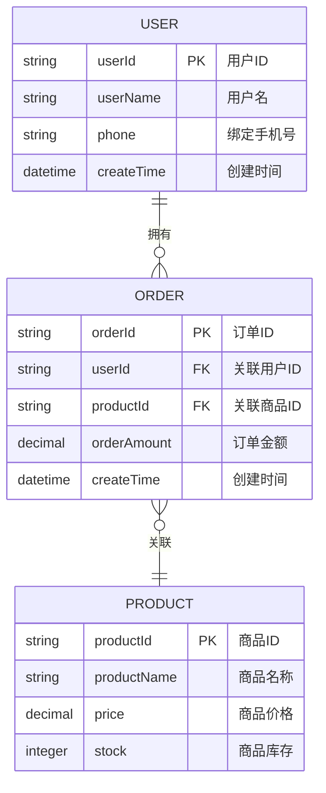
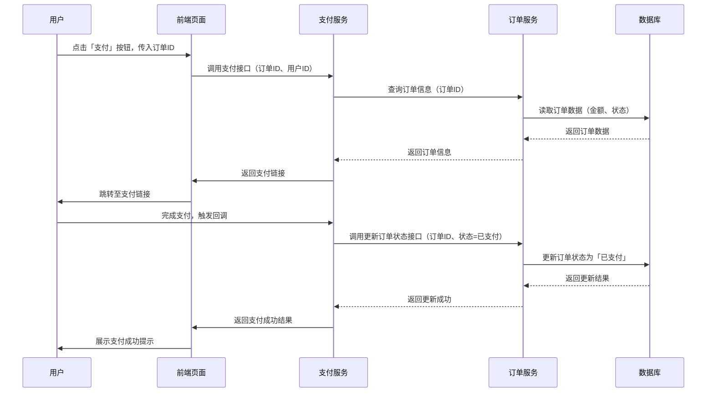

## 目标

- AI 技术演进（Transformer 开山之作）：https://arxiv.org/abs/1706.03762
- OpenAI GPT-4o 技术概览：https://openai.com/index/hello-gpt-4o/
- GitHub Copilot 官方文档： https://docs.github.com/zh/copilot
- Claude (Anthropic) 开发者文档： https://docs.anthropic.com/zh-CN/docs/intro-to-claude
- OpenAI 提示词工程指南: https://platform.openai.com/docs/guides/prompt-engineering
- 本地化大模型运行工具 Ollama：Get up and running with Llama 3.2, Mistral, Gemma 2, and other large language models: https://ollama.com/
- 高级提示词思维链 (CoT) 论文：https://arxiv.org/abs/2201.11903
- 综合性提示词工程指南 (DAIR.AI)：https://www.promptingguide.ai/zh
- **AI 驱动的 Code Review 工具 (PR-Agent)：https://github.com/Codium-ai/pr-agent**
- **LangChain.js (JavaScript RAG 框架)：https://js.langchain.com/docs/introduction/**
- Mastra (TypeScript AI 工程框架)：https://mastra.ai/\nLlamaIndex.TS (RAG 数据框架)：https://ts.llamaindex.ai/
- AI 智能体 (Agent) 深度解析 (Lilian Weng)：https://lilianweng.github.io/posts/2023-06-23-agent/
- **敏捷人工智能驱动开发：https://github.com/bmad-code-org/BMAD-METHOD**

## AI开发工具

本文按照产品形态与核心能力分为六大类，全面梳理各AI开发辅助工具的核心信息，覆盖从日常编码辅助到全流程AI应用落地的全场景需求，详细拆解每款工具的产品形态、核心驱动模型、适用场景与核心特点，便于开发者快速了解并选择适配工具。

### 通用代码辅助（IDE插件生态）

这类工具以插件形态融入开发者现有开发习惯，主打轻量化接入、全场景编码辅助，无需改变原有开发流程，是目前普及率最高的AI开发工具，适配各类主流IDE，覆盖多语言、多框架开发需求。

#### GitHub Copilot

**主要产品形态**：`VS Code`、`JetBrains`全系列、`Visual Studio`等主流IDE插件，`GitHub` Web端原生集成，支持移动端编码辅助，可无缝融入开发者日常编码环境。

**核心驱动模型**：2026年升级为`GPT-5.3-Codex`，基于`OpenAI`大模型进行代码专项优化，深度融合`GitHub`全球开源代码语料，具备极强的代码生成与理解能力。

**适用场景**：全栈通用开发、开源项目协作、个人/团队日常编码、`GitHub`生态深度用户、跨语言多框架项目开发，适配从前端到后端、从脚本开发到大型项目编码的全场景。

**核心特点**：全球普及率最高的AI编程工具，生态成熟度行业标杆；支持50+主流编程语言，行级/函数级实时补全延迟极低，几乎无感知；新增全项目上下文感知、AI代码安全扫描、自动化重构、PR评审辅助能力，覆盖编码全流程；个人版永久免费，企业版轻量化付费，与`GitHub`仓库、团队协作流程深度打通，无需额外配置即可快速上手。

#### Amazon CodeWhisperer

**主要产品形态**：`VS Code`、`JetBrains`插件，`AWS Cloud9`、`Lambda`控制台原生集成，配套`CLI`命令行工具，可适配云端与本地开发环境。

**核心驱动模型**：亚马逊自研代码大模型（基于`CodeLlama`深度微调）+ `AWS`专属云场景语料优化模型，针对云原生开发场景进行专项优化。

**适用场景**：`AWS`云原生开发、企业级合规开发、安全敏感型项目、离线开发场景、跨境团队协作，尤其适合依赖`AWS`生态的企业与开发者。

**核心特点**：个人版永久免费无功能限制，无需付费即可使用全部核心能力；支持15+主流编程语言，聚焦云原生与企业级开发场景；内置开源许可证合规校验、`OWASP Top10`安全漏洞实时扫描，降低合规与安全风险；企业版支持离线模式，代码数据不落盘，保障数据安全；与`AWS SDK`、云服务深度适配，云资源代码生成准确率行业领先，可快速生成`AWS`相关配置与业务代码。

#### 通义灵码

**主要产品形态**：`VS Code`、`JetBrains`插件，阿里云IDE原生集成，支持Web端与`CLI`工具，可对接阿里云`DevOps`全流程，实现编码与部署的无缝衔接。

**核心驱动模型**：阿里通义千问代码专项大模型，结合阿里云`SDK`、电商/支付场景专属语料优化，适配国内开发者需求与主流业务场景。

**适用场景**：阿里云生态开发、电商/支付系统开发、企业级中后台开发、中文开发者日常编码、微服务/云原生项目，尤其适合中文需求场景与阿里云生态用户。

**核心特点**：个人版完全免费，无功能限制；支持200+编程语言，覆盖主流开发语言与小众语言；支持私域知识库定制，可深度适配企业内部代码规范，解决企业编码标准化问题；深度优化阿里云`SDK`、微服务、容器化场景代码生成，提升云原生开发效率；内置代码解释、重构、单测生成、漏洞修复全流程能力，中文需求理解精准度突出，解决中文开发者与AI工具的语义鸿沟。

#### 文心快码（Comate）

**主要产品形态**：`VS Code`、`JetBrains`插件，百度智能云IDE集成，支持私有化部署与离线模式，适配企业级安全管控需求。

**核心驱动模型**：百度文心大模型代码专项版，采用`Multi-Agent`架构（架构师/开发/测试多角色分工），实现全流程开发协同。

**适用场景**：企业级大型项目、`C++/Java`核心系统开发、强规范工程化项目、国产化合规需求场景、复杂系统重构，聚焦企业级高难度开发任务。

**核心特点**：`IDC`认证工程化能力行业领先，9个评估维度拿下8个满分，工程化适配性极强；独创`SPEC`规范驱动开发模式，大幅降低AI代码幻觉，提升代码准确性；多智能体协作支持从需求文档到代码落地的全流程闭环，减少人工干预；`C++/Java`代码生成准确率行业第一，适配大型核心系统开发；支持私有化部署，企业级安全管控能力拉满，保障企业核心代码安全；个人版完全免费，适合个人开发者学习与小型项目开发。

#### Claude Code

**主要产品形态**：`CLI`命令行工具、主流IDE插件、`Claude` Web端代码专属模式，支持远程服务器/容器环境原生适配，适配多种开发场景。

**核心驱动模型**：`Anthropic Claude 3.5 Sonnet/Opus`，主打超长上下文专项优化，具备极强的代码逻辑理解与大规模处理能力。

**适用场景**：大型复杂项目重构、全仓库级代码理解、远程服务器开发、合规性强的企业级项目、大规模代码迁移，适合处理高难度、大规模的编码任务。

**核心特点**：支持200k+超长上下文窗口，可一次性加载整个项目代码，实现全仓库级代码理解与重构；代码逻辑深度理解与大规模重构能力极强，可处理复杂算法与系统架构；`CLI`模式完美适配远程服务器、容器化开发场景，无需切换IDE即可完成编码、调试；内置严格的合规性校验，支持`GDPR`等全球数据安全规范，适配跨国企业需求；`Claude Pro`会员即可解锁全部能力，无额外付费门槛，性价比突出。

#### Gemini Code Assist（核心代码辅助工具，IDE插件生态）

这是`Google`对标`GitHub Copilot`的主力AI编程助手，也是`Gemini`体系中面向日常开发的核心产品，深度融入开发者现有工作流，无需改变原有开发习惯，适配各类主流IDE。

**主要产品形态**：`VS Code`、`JetBrains`全系列、`Android Studio`、`Google Cloud IDE`等主流IDE原生插件；`GitHub/GitLab`仓库原生集成（PR评审、自动化代码审查）；`Gemini CLI`命令行工具；Web端在线编程面板，支持`Windows/macOS/Linux`全平台适配。

**核心驱动模型**：2026年全面升级为`Gemini 3 Pro`，企业版支持`Gemini 3 Deep Think`深度推理版本，免费个人版搭载`Gemini 2.5 Pro`；底层基于`Google`自研多模态架构专项代码优化，企业版最高支持200万token上下文窗口，标准版默认100万token上下文。

**适用场景**：`Google`生态开发者（`Android`、`Flutter`、`GCP`）、全栈通用开发、大型项目全仓库级重构、多文件跨模块功能开发、`DevSecOps`全流程、企业级合规开发、远程服务器/容器化终端开发。

**核心特点**：行业领先的`Agent`模式，可一次性分析全代码库的架构、依赖、编码规范与组件关联关系，单条prompt完成跨文件批量编辑、大规模架构重构、全链路功能开发，自动规划执行步骤并完成多轮自我校验，大幅降低大型项目开发的人工成本；与`Android Studio`、`Flutter`、`Google Cloud Platform`（`GCP`）深度原生适配，移动端开发、云原生场景代码生成准确率行业顶尖，可一键生成符合`Google`规范的应用代码与云资源配置；免费个人版无核心功能限制，支持50+主流编程语言，内置代码解释、单测生成、漏洞自动化修复、技术文档生成全流程能力，开箱即用；配套`Gemini CLI`工具，可无缝融入终端、远程服务器、容器化开发环境，支持`MCP`模型上下文协议与`Google`搜索原生集成，无需切换IDE即可完成编码、调试、部署全流程；企业版支持私有化部署与代码数据不落盘，内置开源许可证合规校验、安全漏洞实时扫描，满足全球主流企业级合规与安全管控需求。

#### GitLab Duo

**主要产品形态**：`VS Code`、`JetBrains`全系列IDE插件，`GitLab` Web端原生集成，支持`GitLab CI/CD`流水线无缝对接，配套`CLI`命令行工具，适配`GitLab`生态全流程开发。

**核心驱动模型**：自研代码大模型 + `Gemini 2.5 Pro`双模型调度，深度融合`GitLab`仓库语料、代码规范与协作流程，针对团队协作场景专项优化。

**适用场景**：`GitLab`生态开发者、团队协作开发、PR评审自动化、代码规范校验、云原生项目协作，尤其适合依赖`GitLab`进行代码管理与协作的企业与团队。

**核心特点**：与`GitLab`仓库、CI/CD流水线深度绑定，可自动读取代码上下文与协作历史，生成符合团队规范的代码；支持PR自动评审、代码漏洞扫描、注释自动生成，减少团队协作成本；个人版免费，企业版解锁团队管理、私有知识库适配功能；支持30+主流编程语言，聚焦团队协作场景，可实现多人协同编码时的风格统一；内置代码重构、单测生成能力，与`GitLab`的issue、merge request功能无缝联动，提升协作效率。

#### Sourcegraph Cody

**主要产品形态**：`VS Code`、`JetBrains`、`Neovim`等主流IDE插件，Web端代码搜索与辅助面板，支持本地代码库与远程代码仓库双向适配，可对接`GitHub`、`GitLab`、`Bitbucket`等主流代码托管平台。

**核心驱动模型**：自研`Cody`代码大模型，结合`Sourcegraph`全球代码索引库优化，支持长上下文代码理解，主打代码检索与深度解析能力。

**适用场景**：大型项目代码检索、陌生代码库快速上手、跨仓库代码引用分析、代码逻辑解释、老旧项目重构，适合需要快速理解复杂代码体系的开发者。

**核心特点**：代码检索能力行业领先，可快速定位跨仓库、跨文件的代码引用与依赖关系，生成代码调用图谱；支持自然语言提问解读代码逻辑，无需逐行阅读即可掌握核心功能；可自动生成代码注释、API文档，适配老旧项目文档补全需求；支持自定义代码规范，可根据企业内部规范优化代码生成与校验逻辑；个人版免费，企业版支持私有代码库索引、团队共享知识库，适配大型团队协作需求。

### AI 通用对话

#### Gemini

以`Gemini`大模型为核心，面向AI应用开发者打造的端到端开发与调用体系，覆盖从原型验证到生产部署的全流程，提供多样化开发模式，适配不同技术水平的开发者。

**主要产品形态**：`Gemini` Web端开发者专属模式、`Google AI Studio`低代码开发平台、`Gemini API`全量接口服务、`Colab + Gemini`原生集成、`Gemini for Developers`全链路工具链。

**核心驱动模型**：全系列`Gemini`模型智能调度，包括高阶推理的`Gemini 3 Pro/3 Deep Think`、通用主力的`Gemini 2.5 Pro`、高性价比低延迟的`Gemini 2.5 Flash`，端侧部署支持`Gemini 3 Nano`，开源轻量化场景兼容`Gemma 2`系列。

**适用场景**：多模态AI应用快速原型开发、`API`驱动的自动化开发流程、算法与科研编程、端侧AI应用开发、机器学习/深度学习项目、学生与个人开发者学习实践。

**核心特点**：原生多模态能力行业领先，支持文本、代码、图像、音频、视频、3D模型联合输入，可实现UI设计图转代码、产品演示视频转可运行项目、算法论文转工程代码等高阶开发场景；2026年新增的`Deep Think`深度推理模式，在编程竞赛、复杂算法实现、工业级系统架构设计上实现突破，`Codeforces`评分达3455 Elo（全球排名第8），`SWEBench Verified`通过率超65%；可自主完成多路径技术方案评估、代码自动化验证、错误闭环修复，从“代码补全工具”升级为可独立攻坚复杂开发任务的智能体；`Google AI Studio`提供零代码/低代码的`API`调试、`Prompt`工程、模型微调能力，开发者可快速构建专属AI编程助手，一键完成从原型验证到生产环境的部署；与`Colab`深度打通，`Python`/机器学习/数据分析场景开箱即用，无需额外环境配置，弹性调用`Google`云端算力，支持从数据处理、模型训练到推理部署的全流程AI开发；`API`体系完善，提供`Python`、`Java`、`Go`等多语言官方`SDK`，兼容主流开发框架，推理成本大幅优化；`Flash`版本兼顾低延迟与高性价比，适合大规模自动化开发场景，百万级上下文支持可一次性处理完整项目代码库。

#### ChatGPT 4o Developer

OpenAI面向开发者打造的专属对话式AI工具，聚焦开发场景的需求解析、代码辅助与API调用，与OpenAI生态深度打通，适配各类开发场景的轻量化需求。

**主要产品形态**：Web端开发者专属对话界面、`OpenAI API`全量调用、`VS Code`插件，支持`Python`、`JavaScript`等多语言`SDK`，可对接本地开发环境与云端服务。

**核心驱动模型**：`GPT-4o`多模态大模型，针对开发场景专项优化，支持代码生成、逻辑推理、需求解析，默认上下文窗口128k token，开发者版可扩展至256k token。

**适用场景**：开发需求快速解析、代码片段生成与调试、API调用示例编写、技术文档翻译与生成、编程问题答疑，适合个人开发者与中小团队的轻量化开发辅助需求。

**核心特点**：自然语言理解精度极高，可精准解析复杂开发需求，生成可直接运行的代码片段；支持多语言代码转换、漏洞排查、逻辑优化，覆盖前端、后端、移动端全场景；与`OpenAI`全生态API无缝对接，可快速调用`DALL·E`、`Whisper`等工具，实现多模态开发辅助；开发者版支持自定义Prompt模板，可保存常用开发指令，提升复用效率；按调用量计费，性价比突出，个人开发者可灵活控制成本，企业版支持团队共享与权限管控。

#### 通义千问开发者版

阿里通义千问面向开发者打造的对话式AI工具，深度适配国内开发场景，结合阿里云生态，提供代码辅助、API调试、需求落地全流程支持，主打中文开发场景适配。

**主要产品形态**：Web端开发者专属模式、`通义千问API`、`VS Code/JetBrains`插件，与阿里云`DevOps`、`ModelScope`生态深度打通，支持本地`SDK`调用。

**核心驱动模型**：通义千问4.0大模型，代码专项优化版本，结合国内开源代码语料与业务场景，中文需求理解与代码生成准确率行业领先。

**适用场景**：中文开发需求解析、阿里云生态项目开发、微服务/中后台代码生成、技术文档编写、编程问题答疑，适合中文开发者与阿里云生态用户。

**核心特点**：中文语义理解精准，可完美适配中文需求描述与中文注释场景，解决中英文语义鸿沟；支持200+编程语言，深度优化Java、Python、前端框架代码生成，适配国内主流技术栈；与阿里云`SDK`、云服务深度联动，可快速生成云资源配置与业务代码；支持私有化部署，企业版可对接内部知识库与代码规范，打造专属开发助手；个人版免费使用核心功能，企业版解锁更高算力与团队协作能力。

### AI原生IDE类（端到端开发环境）

这类工具以AI为核心重构编辑器底层，打破传统IDE的功能边界，主打自然语言驱动的全流程开发，覆盖从需求分析、编码、调试到部署的完整闭环，无需额外插件即可实现AI辅助能力，提升开发效率。

#### Cursor

**主要产品形态**：跨平台独立AI原生IDE（基于`VS Code`分支深度开发），支持`Windows/macOS/Linux`全平台，兼容`VS Code`插件生态，兼顾AI能力与生态兼容性。

**核心驱动模型**：默认搭载`GPT-4o/GPT-5`，支持切换`Claude 3.5 Sonnet`等多模型，自研代码上下文感知与预判引擎，提升代码生成的准确性与及时性。

**适用场景**：快速原型开发、全栈项目迭代、多文件全项目重构、个人开发者与小型团队高效开发、前端/`Python`核心场景，适合追求开发效率的开发者。

**核心特点**：AI原生设计标杆，`Composer`模式支持跨文件批量编辑，实现全项目级一键重构，大幅减少重复操作；`Shadow Workspace`技术可静默预判开发需求，端到端编辑延迟低于600ms，响应流畅；支持与整个代码库对话，纯自然语言驱动开发，无需手动编写基础代码；兼容`VS Code`插件生态，迁移成本低，原有插件可直接复用；个人版免费，Pro版解锁高级功能与更高使用额度，适配不同需求。

#### Trae（字节跳动）

**主要产品形态**：跨平台独立AI原生IDE、`VS Code/JetBrains`插件，全平台适配，支持离线模式，兼顾独立IDE与插件两种使用场景。

**核心驱动模型**：字节豆包大模型代码专项版，支持`GPT-4o`、`Claude 3.5 Sonnet`多模型调度，采用`SOLO`双智能体架构（`SOLO Builder`+`SOLO Coder`），覆盖项目搭建与迭代全流程。

**适用场景**：从0到1项目搭建、全流程端到端开发、小程序/中后台系统开发、中文开发者全场景适配、学生与个人开发者免费使用，适配国内开发者需求与主流业务场景。

**核心特点**：国内完全免费开放全部高级能力，无功能额度限制，降低使用门槛；`SOLO Builder`模式支持自然语言生成完整可运行项目，10分钟完成从环境配置到代码落地的全流程；`SOLO Coder`聚焦项目迭代、重构、Bug修复与功能扩展，实现全生命周期辅助；深度适配国产框架、微信小程序、云服务`SDK`，贴合国内开发场景；中文语义理解精准度行业领先，内存占用低，响应流畅，适配中低端设备。

#### Replit Agent

**主要产品形态**：云端一体化IDE，Web端全平台访问，支持在线协作、一键部署、移动端适配，无需本地安装，开箱即用。

**核心驱动模型**：`Replit`自研代码大模型 + `GPT-4o`多模态调度，自研`Agent`任务规划与执行引擎，实现全流程自动化开发。

**适用场景**：在线协作开发、快速原型验证、编程教学实训、轻量化项目一键部署上线、全球开发者协同开源项目，适合远程协作与快速验证需求。

**核心特点**：云端免环境配置，开箱即用，零本地部署成本，无需担心环境兼容问题；`Agent`模式支持自然语言端到端完成需求分析、编码、调试、部署全流程，减少人工干预；内置全球开发者社区，海量项目模板一键复用，提升开发效率；支持所有主流编程语言与框架，实时多人协作编辑，便于团队协同；个人版免费，付费版解锁更高算力与部署资源，适配不同规模项目。

#### Tabnine AI IDE

**主要产品形态**：跨平台独立AI原生IDE，支持`Windows/macOS/Linux`全平台，兼容`VS Code`插件生态，配套团队协作管理面板，主打团队编码规范与效率提升。

**核心驱动模型**：Tabnine自研代码大模型，支持`GPT-4o`、`Gemini 2.5 Pro`多模型切换，自研团队编码规范学习引擎，可适配企业内部代码风格。

**适用场景**：中小型团队协同开发、企业级编码规范落地、多语言项目开发、远程团队协作，适合需要统一编码风格、提升团队开发效率的企业。

**核心特点**：支持实时团队编码风格同步，可自动学习团队代码规范，生成符合规范的代码，减少代码评审成本；AI驱动的代码补全的延迟低于500ms，支持行级、函数级、跨文件补全；内置代码质量检测、漏洞扫描、性能优化建议，提升代码健壮性；支持一键部署至主流云平台，与`GitHub`、`GitLab`、`Jenkins`等工具深度集成；个人版免费，企业版解锁团队管理、规范定制、私有知识库功能，适配团队协作需求。

#### Kite

**主要产品形态**：跨平台AI原生IDE，主打Python、JavaScript、Java等语言的实时补全，支持`VS Code`、`JetBrains`插件模式，同时提供独立IDE版本，适配轻量化开发需求。

**核心驱动模型**：Kite自研代码大模型，针对动态语言专项优化，结合全球开源代码语料，聚焦代码补全与实时提示能力，延迟极低。

**适用场景**：Python/JavaScript前端开发、轻量化脚本开发、个人开发者日常编码、学生编程学习，适合对代码补全响应速度有高要求的开发者。

**核心特点**：动态语言补全准确率行业领先，支持Python库、JavaScript框架的深度补全，可自动提示函数参数、返回值与使用示例；内置代码文档实时查询功能，无需切换浏览器即可查看API文档；支持本地缓存代码上下文，无网络环境下也可正常使用核心补全功能；完全免费，无功能限制，体积轻量化，适配中低端设备；与主流IDE插件生态兼容，可灵活切换使用模式，迁移成本低。

### 开源可本地化部署类（自主可控模型）

这类工具以开源代码大模型为核心，支持本地/私有化部署，数据完全自主可控，无需依赖云端服务，主打定制化开发与高安全合规场景，适合对数据安全有严格要求的企业与开发者。

#### CodeLlama（Meta）

**主要产品形态**：开源代码大模型（提供7B/13B/70B多参数版本，含Instruct对话版），无官方商业化IDE，开放全量接口支持二次开发与集成，可适配各类自定义开发场景。

**核心驱动模型**：`Meta`自研`CodeLlama`系列开源模型，基于`Llama 3`基座专项代码优化，支持多语言长上下文，具备强大的代码生成与理解能力。

**适用场景**：本地私有化部署、企业定制化AI编程工具研发、科研场景、数据安全要求极高的闭源项目开发、国产化适配二次开发，适合需要自主可控的企业与科研机构。

**核心特点**：完全开源免费，支持商用，无使用门槛；支持本地离线部署，代码与数据完全不外流，保障数据安全；覆盖代码生成、补全、解释、调试、安全扫描全功能，满足全流程编码需求；擅长复杂算法实现与异常处理逻辑编写，适配高难度编码任务；开放模型全量权重，支持企业基于内部代码库微调适配，打造专属AI编程工具。

#### CodeGeeX 4（智谱AI）

**主要产品形态**：开源代码大模型、`VS Code/JetBrains`插件、支持私有化部署与离线模式，配套本地`SDK`，兼顾插件使用与本地化部署需求。

**核心驱动模型**：智谱AI自研`CodeGeeX`系列代码大模型，基于`GLM`基座专项优化，中文场景深度适配，贴合国内开发者需求。

**适用场景**：国内开发者中文编程场景、中小团队私有化部署、国产化替代需求、多语言代码转换、轻量本地离线使用，适合中小团队与中文开发者。

**核心特点**：开源模型可免费商用，轻量版可在消费级显卡流畅运行，无需高端算力设备；中文注释与中文需求理解能力突出，解决中文语义鸿沟；支持20+主流编程语言，代码跨语言转换能力行业领先，可实现不同语言代码的快速转换；内置代码生成、重构、单测生成、漏洞修复全能力，覆盖编码全流程；适配国产硬件与操作系统，轻量化部署门槛低，插件版个人完全免费。

#### DeepSeek-Coder

**主要产品形态**：开源代码大模型、主流IDE插件、Web端在线编程工具，支持本地离线部署，适配多种使用场景，兼顾便捷性与自主性。

**核心驱动模型**：`DeepSeek`自研代码专项大模型，开源1.3B-33B多参数版本，长上下文专项优化，具备强大的代码处理能力。

**适用场景**：个人开发者离线使用、企业低成本私有化AI编程能力搭建、中小团队日常编码辅助、国产化场景适配，适合低成本、高安全需求的用户。

**核心特点**：开源可商用，轻量版可在消费级设备本地运行，部署成本低；支持128k超长上下文，可一次性加载万行级项目代码，实现大规模代码处理；中文编程场景深度优化，代码补全与生成准确率领先；完全离线模式支持，无网络环境也可正常使用，保障离线开发需求；插件版个人永久免费，无功能限制，适合个人开发者日常使用。

#### Gemma

`Gemini`体系的开源轻量化分支，主打自主可控、低成本部署，满足个人与企业私有化AI开发需求，无需依赖`Google`云端服务，数据完全自主可控。

**主要产品形态**：开源轻量级大模型（提供2B/7B/27B多参数版本，含Instruct对话版、代码专项优化版），支持本地部署、边缘设备部署、消费级显卡运行，配套全语言`SDK`与主流IDE集成插件。

**核心驱动模型**：`Google DeepMind`自研`Gemma 2`系列，基于`Gemini`核心架构轻量化开源复刻，针对代码生成、逻辑推理场景专项优化，完全兼容`Gemini API`与工具链生态。

**适用场景**：个人开发者本地离线使用、中小团队低成本私有化AI编程能力搭建、科研场景、数据安全要求极高的闭源项目开发、端侧/边缘设备AI开发、国产化适配二次开发。

**核心特点**：完全开源免费，支持商用无门槛，轻量版本可在消费级显卡流畅运行，无需高端算力设备，离线环境下可正常使用全部核心功能；代码生成、补全、调试能力对标同量级闭源模型，`Python`、`C++`、`Java`、`JavaScript`等20+主流编程语言支持完善，中文注释与中文需求理解深度优化；开放模型全量权重，支持开发者基于企业内部代码库、业务规范进行微调，快速打造专属的企业级代码助手；完美兼容`Gemini`全生态工具链，可无缝对接`Gemini Code Assist`插件、`Google AI Studio`，开发习惯与迁移成本极低；端侧部署能力突出，支持手机、嵌入式设备本地推理，代码与业务数据完全不外流，满足高安全合规需求。

#### StarCoder

由Hugging Face联合多家企业共同研发的开源代码大模型，主打多语言支持与开源协作，支持本地私有化部署，适配科研与企业定制化场景。

**主要产品形态**：开源代码大模型（提供7B/15B/34B多参数版本，含Instruct对话版），开放全量接口与模型权重，支持二次开发与集成，配套`VS Code`插件与本地`SDK`。

**核心驱动模型**：StarCoder系列开源模型，基于`Llama 2`基座专项代码优化，训练语料覆盖80+编程语言，支持长上下文代码理解与生成。

**适用场景**：多语言项目开发、科研场景、企业定制化AI编程工具研发、本地私有化部署、开源项目二次开发，适合需要多语言支持与自主可控的开发者。

**核心特点**：完全开源免费，支持商用，开放模型全量权重与训练代码，便于二次开发与微调；覆盖80+编程语言，包括主流语言与小众编程语言，多语言生成准确率行业领先；支持100k+长上下文窗口，可一次性处理大规模代码库，适配复杂项目开发；轻量版（7B）可在消费级显卡流畅运行，部署成本低，无需高端算力设备；与Hugging Face生态深度打通，可快速集成至`Transformers`框架，适配科研与工程化场景。

#### WizardCoder

基于CodeLlama深度微调的开源代码大模型，主打代码生成与复杂任务攻坚能力，支持本地部署，聚焦高难度编码场景，适合技术研发与复杂项目开发。

**主要产品形态**：开源代码大模型（提供7B/13B/34B/70B多参数版本），无官方IDE，开放全量接口与模型权重，支持二次开发、本地部署与IDE插件集成。

**核心驱动模型**：WizardCoder系列模型，基于`CodeLlama`基座，通过指令微调与复杂任务训练，强化代码生成、算法实现与漏洞修复能力。

**适用场景**：复杂算法开发、系统架构设计、代码漏洞修复、老旧项目重构、科研场景，适合需要攻坚高难度编码任务的开发者与企业。

**核心特点**：开源免费，支持商用，开放模型全量权重，便于企业基于内部代码库微调；复杂算法生成能力突出，可实现深度学习、机器学习、工业级算法的快速落地；支持代码调试、重构、单测生成全流程能力，适配高难度编码任务；7B版本可在消费级显卡运行，70B版本适配企业级服务器部署，兼顾轻量化与高性能需求；中文需求理解与代码生成能力经过优化，适配国内开发者场景。

### 企业级一站式AI开发平台（大模型/AI应用全流程）

这类工具覆盖AI应用从数据处理、模型训练、微调、评估到部署上线的全生命周期，主打企业级规模化AI落地，提供全流程工具链与算力支持，适配企业级复杂需求与大规模部署场景。

#### 华为云ModelArts

**主要产品形态**：一站式云端AI开发平台，Web端控制台，配套`Notebook`、分布式训练、推理部署全链路工具链，支持私有化部署，适配云端与本地企业级场景。

**核心驱动模型**：华为盘古大模型全系列，支持开源模型一键部署，自研AI计算框架与万卡级算力调度引擎，具备强大的模型训练与部署能力。

**适用场景**：企业级AI模型开发与部署、大规模分布式训练、行业AI应用落地、自动驾驶/计算机视觉/`NLP`/多模态等全场景AI开发，适合大型企业与行业级AI项目。

**核心特点**：端到端模型生产线，实现`DataOps+MLOps+DevOps`无缝协同，开发效率提升50%以上；支持从数据标注、模型训练、评估到推理部署的全流程管理，实现AI应用全生命周期管控；支持万卡级分布式训练，算力调度能力行业领先，可支撑超大规模模型训练；适配国产算力与操作系统，国产化合规性拉满，满足国内企业合规需求；内置海量预训练模型，支持一键微调与部署，降低企业AI落地门槛。

#### 阿里魔搭ModelScope

**主要产品形态**：开源AI模型社区 + 一站式开发平台，支持Web端、`Notebook`交互式开发、本地`SDK`调用，与阿里云生态深度打通，实现模型与云资源的无缝衔接。

**核心驱动模型**：通义千问全系列模型，内置1400+开源预训练模型，覆盖`NLP`、`CV`、语音、多模态、代码全领域，模型资源丰富。

**适用场景**：AI应用快速落地、模型微调与部署、开源模型二次开发、`AIGC`应用研发、中小团队AI创新项目，适合需要快速验证与落地AI应用的团队。

**核心特点**：国内最大的开源AI模型社区，覆盖全主流AI领域，模型资源丰富且可免费获取；提供一键式模型调用、微调、部署能力，大幅降低AI开发门槛，非专业开发者也可快速上手；全面支持`MCP`协议，可无缝对接企业业务系统，实现AI能力与业务的深度融合；`Notebook`交互式开发环境开箱即用，无需额外配置；与阿里云生态深度打通，支持云端算力弹性伸缩，适配不同规模项目需求。

#### 第四范式AI开发平台

**主要产品形态**：企业级AI开发与上线平台，提供可视化拖拽建模、`Notebook`代码开发、`AutoML`自动化建模三种模式，配套全流程管控工具，适配不同技术水平用户。

**核心驱动模型**：第四范式自研高维机器学习计算框架`GDBT`，核心`AutoML`算法，支持万亿维度特征处理，具备强大的特征挖掘与模型训练能力。

**适用场景**：企业级商业决策AI应用、风控/营销/供应链等业务场景、传统企业AI数字化转型、结构化数据深度挖掘，适合需要通过AI实现业务优化的传统企业与互联网企业。

**核心特点**：支持`ML/CV/NLP/`语音全场景AI应用构建，覆盖多领域业务需求；三种建模模式适配不同技术水平用户，零代码门槛与专业开发能力兼顾，业务人员与技术人员均可使用；万亿维度特征支持，模型效果与训练性能行业领先，可处理复杂业务数据；自定义算子开发平台，支持企业内部技术能力沉淀，实现个性化建模；端到端全流程管控，大幅降低传统企业AI落地门槛，加速企业数字化转型。

#### Vertex AI with Gemini

面向企业级客户打造的全链路AI开发与落地平台，深度融合`Gemini`大模型能力，覆盖企业AI应用从研发到规模化落地的全生命周期，提供企业级算力与安全管控能力。

**主要产品形态**：`Google Cloud Vertex AI`一站式企业级AI开发平台，配套交互式`Notebook`、分布式训练集群、模型微调工坊、推理部署引擎、`MLOps`全流程管控工具链，支持私有化部署与混合云架构。

**核心驱动模型**：`Gemini`全系列企业级模型（`Gemini 3 Pro/Deep Think`、`Gemini 2.5 Pro`），结合`Google`自研AI计算框架、万卡级算力调度引擎、企业级数据安全与合规管控体系。

**适用场景**：企业级AI模型开发与规模化落地、大规模分布式训练、行业AI应用研发、云原生AI系统搭建、企业级`MLOps`体系建设、超大规模代码库智能化管理、传统企业数字化转型。

**核心特点**：端到端AI开发全流程闭环，实现从数据处理、模型训练/微调、评估到推理部署、运维监控的全链路自动化，大幅降低企业AI落地门槛；支持万卡级分布式训练，算力调度能力行业领先，可支撑超大规模预训练模型、企业级专属模型的微调与训练，兼顾训练效率与成本控制；与`Google Cloud`全生态深度打通，无缝对接`BigQuery`、`Cloud Storage`、`GKE`等云服务，企业现有业务系统可零成本集成`Gemini`的AI能力；企业级安全与合规能力拉满，支持数据全链路加密、私有化部署、权限精细化管控，满足`GDPR`、`ISO27001`等全球主流合规标准；内置企业级代码智能体，可对接企业内部代码仓库、私有知识库、`DevOps`全流程，实现需求文档到代码落地、测试、部署上线的全流程自动化，适配大型企业复杂的研发管理体系。

#### 腾讯云TI-ONE

**主要产品形态**：腾讯云一站式企业级AI开发平台，Web端控制台，配套`Notebook`交互式开发、分布式训练、推理部署、数据标注全链路工具链，支持私有化部署与混合云架构，与腾讯云生态深度打通。

**核心驱动模型**：腾讯云混元大模型全系列，支持开源模型一键部署，自研AI计算框架与算力调度引擎，具备强大的模型训练、微调与部署能力。

**适用场景**：企业级AI模型开发与规模化落地、金融/政务/医疗等行业AI应用、云原生AI系统搭建、传统企业数字化转型、大规模数据处理与模型训练，适合依赖腾讯云生态的企业。

**核心特点**：端到端全流程AI开发闭环，覆盖数据处理、模型训练、微调、评估、部署、运维全环节，开发效率提升40%以上；支持万卡级分布式训练，算力弹性伸缩，可支撑超大规模模型训练与推理；与腾讯云`COS`、`CVM`、`TKE`等云服务深度联动，企业业务系统可零成本集成AI能力；内置海量行业预训练模型，支持一键微调，适配金融、政务等细分行业需求；国产化合规性拉满，支持数据全链路加密、私有化部署，满足国内企业合规要求；提供可视化建模与代码开发双模式，适配不同技术水平用户。

#### 百度智能云千帆大模型平台

**主要产品形态**：一站式企业级AI开发与部署平台，Web端控制台，配套`Notebook`、模型微调、推理部署、数据管理全工具链，支持私有化部署，与百度智能云生态深度打通。

**核心驱动模型**：百度文心大模型全系列，支持开源模型一键部署，自研AI计算框架与算力调度引擎，针对中文场景与行业需求专项优化。

**适用场景**：企业级AI应用落地、中文场景AI开发、行业定制化模型研发、传统企业数字化转型、`NLP`/多模态AI项目，适合依赖百度生态与中文场景的企业。

**核心特点**：中文语义理解与模型优化行业领先，适配国内企业业务场景与中文需求；支持模型微调、压缩、部署全流程自动化，降低企业AI落地门槛；内置海量行业预训练模型，覆盖金融、教育、医疗等多个领域，可快速适配行业需求；与百度智能云`BOS`、`AI Studio`等生态工具深度联动，实现AI能力与业务系统无缝对接；支持私有化部署与混合云架构，数据安全与合规性符合国内标准；提供可视化建模与代码开发双模式，业务人员与技术人员均可快速上手。

### 专项场景AI开发工具

这类工具聚焦特定开发场景，针对某一细分领域的开发需求进行专项优化，具备极强的场景适配性，可解决细分场景下的开发痛点，提升特定环节的开发效率。

#### Snyk Code Pro（DevSecOps安全开发）

**主要产品形态**：主流IDE插件、`CI/CD`流水线集成、Web端安全管理平台，支持`Git`仓库原生对接，可无缝融入DevSecOps全流程。

**核心驱动模型**：自研代码安全大模型，结合`Snyk`全球漏洞知识库持续优化，`Agent`驱动自动化修复，具备强大的漏洞检测与修复能力。

**适用场景**：`DevSecOps`全流程、代码安全扫描、漏洞自动化修复、开源组件合规管理、企业级安全左移管控，适合对代码安全有严格要求的企业。

**核心特点**：行业领先的代码安全AI工具，漏洞检测准确率高；实时检测代码漏洞、开源许可证风险、硬编码敏感信息，实现安全风险早发现、早处理；AI驱动自动化漏洞修复，生成可直接使用的补丁代码，减少人工修复成本；与`GitHub`、`GitLab`、`Jenkins`等主流`DevOps`工具深度集成，实现安全与开发流程的无缝衔接；实现编码阶段的安全风险闭环，大幅降低后期修复成本，提升项目安全性。

#### testRigor（AI自动化测试）

**主要产品形态**：Web端自动化测试平台、`API/CLI`集成，支持与`CI/CD`流水线无缝对接，实现测试全流程自动化。

**核心驱动模型**：自研多模态测试大模型，`Agent`驱动的自动化测试引擎，UI元素自愈识别能力，具备强大的测试用例生成与执行能力。

**适用场景**：UI自动化测试、端到端系统测试、回归测试、`API`测试、无代码测试场景、企业级全链路测试，适合需要提升测试效率、降低测试成本的企业。

**核心特点**：纯自然语言编写测试用例，无需代码基础，业务人员也可编写测试用例；AI驱动自愈测试，页面元素变更自动适配，用例维护成本降低90%以上；支持Web、移动端、桌面端全平台测试，覆盖多终端测试需求；与主流研发流水线无缝集成，实现测试全流程自动化，缩短测试周期；大幅提升测试效率，减少人工测试成本，保障项目上线质量。

#### Microsoft Power Platform（低代码AI开发）

**主要产品形态**：低代码/无代码AI开发平台，Web端可视化设计器，配套`Power Apps`/`Power Automate`/`Power BI`/`Power Virtual Agents`四大核心模块，覆盖应用开发、流程自动化、数据分析全场景。

**核心驱动模型**：微软`Copilot`大模型，结合`Dataverse`企业级数据平台专项优化，具备强大的低代码AI生成能力。

**适用场景**：非专业开发者快速搭建企业级应用、业务人员自主开发办公工具、企业内部流程自动化落地、数据分析与可视化报表生成、客服机器人/轻量业务系统开发，尤其适合依赖微软生态（Office 365、Azure）的企业与团队，适配中小企业快速数字化转型需求。

**核心特点**：零代码/低代码双模式适配，无需专业编程基础，业务人员通过拖拽、配置即可完成应用开发，大幅降低AI应用落地门槛；`Copilot` AI辅助贯穿全流程，支持自然语言生成应用界面、自动化流程、数据分析公式，提升开发效率；四大核心模块无缝协同，`Power Apps`搭建应用、`Power Automate`实现流程自动化、`Power BI`完成数据可视化、`Power Virtual Agents`构建智能客服，覆盖企业全场景需求；与微软Office 365、Azure云服务、Dynamics 365深度集成，企业现有业务数据可无缝对接，无需额外数据迁移；支持私有化部署与云端部署双模式，满足企业数据安全与合规需求；内置海量应用模板，可快速复用适配办公、营销、风控等常见场景，缩短开发周期。

## AI提效方案

### 代码助手

此类工具深度集成于各类开发环境（IDE），聚焦日常编码全流程，覆盖代码补全、重构、测试用例生成等核心需求，无需切换场景即可实现AI辅助，是前端工程师提升编码效率的基础工具。

#### GitHub Copilot

作为该领域的行业标杆，其核心价值在于极其稳定的工程表现和广泛的生态兼容性，完美适配前端常用的`VS Code`、`JetBrains`等IDE，支持`TypeScript`、`JavaScript`、`React`、`Vue`等前端主流语言与框架。

其核心优势在于强大的上下文理解机制：不仅能识别当前编辑文件的代码逻辑，还会通过分析临近选项卡、项目目录结构、近期浏览的代码片段，甚至前端项目的`package.json`依赖配置，精准提升补全准确率。对于前端开发而言，可快速补全组件模板、`Props`定义、事件处理函数等高频代码，大幅减少重复编码工作。

熟练运用高级指令可进一步释放其价值，例如使用``@workspace``指令，可让工具全局分析整个前端项目的代码规范、组件复用逻辑，实现跨文件代码补全与重构，从单纯的“代码补全工具”升级为懂项目、懂规范的“资深同事”。此外，其与`GitHub`仓库深度联动，可自动适配项目的编码风格，生成符合团队规范的代码，降低代码评审成本。

#### Claude Code

作为Anthropic的官方竞品，Claude Code主打“深度编码辅助”，专为复杂编程任务设计，尤其适配前端大型项目的开发需求。与常规补全工具不同，它更擅长深度理解代码逻辑、进行大规模重构、执行严格的代码审查（Code Review），在前端复杂场景中优势显著。

例如，在前端项目重构（如从`React Class Component`迁移至`Function Component`、从`Vue 2`升级至`Vue 3`）时，它能精准识别代码中的依赖关系、生命周期逻辑，生成可直接复用的重构代码，同时给出优化建议；在Code Review阶段，可自动检测前端代码中的潜在问题，如`Props`类型缺失、事件绑定内存泄漏、样式冲突等，提供更具洞察力的修改建议，比人工Review更高效、更全面。

#### Cursor

以开创性的AI Native理念引领IDE赛道，是前端开发者高效编码的优选工具，基于`VS Code`分支深度开发，兼容`VS Code`的前端插件生态（如`ESLint`、`Prettier`、`Vetur`等），兼顾AI能力与生态兼容性，支持`Windows/macOS/Linux`全平台。

其核心功能`Composer`的设计贴合前端多文件开发场景，允许开发者通过自然语言描述需求，同时编辑多个关联文件（如组件文件、样式文件、工具函数文件），实现一个完整需求的端到端开发。例如，输入“创建一个带搜索功能的用户列表组件，包含分页、筛选，使用React + Tailwind CSS”，工具可同时生成`UserList.tsx`、`UserList.css`、`useUserList.ts`三个文件的代码，极大提升前端开发的流畅度，减少文件切换的时间成本。

此外，其`Shadow Workspace`技术可静默预判前端开发需求，代码补全、函数提示的延迟低于600ms，响应流畅，同时支持与整个前端项目对话，纯自然语言驱动开发，无需手动编写基础代码。

#### CodiumAI

另辟蹊径聚焦测试领域，是提升前端代码健壮性的核心工具，支持主流IDE插件部署，深度适配前端各类框架与语言，专为前端测试场景优化。

其核心能力是通过智能分析前端代码逻辑，自动生成高覆盖率的测试用例，涵盖单元测试、组件测试等场景。例如，针对React组件，可自动生成基于`Jest`、`React Testing Library`的测试用例，检测组件渲染、事件触发、Props传递等核心逻辑；针对工具函数（如日期格式化、数据过滤），可自动生成边界值测试、异常场景测试，确保函数运行稳定。

对于前端团队而言，CodiumAI可替代部分人工编写测试用例的工作，尤其适合迭代频繁的项目，减少测试成本，同时提升测试覆盖率，避免因测试遗漏导致的线上Bug。

#### Tabnine与Qoder

两者在前端细分领域提供差异化选择，适配不同团队的需求：

Tabnine主打私有化部署与团队协作适配，适合对数据安全有一定要求的前端团队。其可自动学习团队的前端编码规范、组件复用逻辑，生成符合团队风格的代码，同时支持本地部署，确保核心前端代码不泄露，适配企业级前端项目的安全需求；此外，其对前端动态语言（`JavaScript`、`TypeScript`）的补全优化更精准，延迟低于500ms，适合高频编码场景。

Qoder则聚焦特定语言与框架优化，尤其在`TypeScript`、`Vue 3`、`React 18`等前沿前端技术栈上表现突出，支持更细致的代码补全（如`Vue 3`的`Composition API`语法提示、`TypeScript`的泛型补全），同时提供代码优化建议，帮助前端开发者规避语法陷阱、提升代码性能。

#### Trae（字节跳动）

作为成本最小的选择，Trae在贴合国内前端开发者使用习惯和特定技术栈方面做了大量改良，完全免费开放全部高级能力，无功能额度限制，降低使用门槛。

其深度适配国内前端常用技术栈，如微信小程序、支付宝小程序、`Vue 3`、`React`、`UniApp`等，解决了其他工具在国内场景下的适配问题（如小程序语法补全、国内第三方组件库适配）；同时优化中文语义理解，支持中文需求描述生成代码（如“创建一个微信小程序的登录页面，包含手机号验证、密码加密”），解决中英文语义鸿沟，更贴合国内开发者的使用习惯。

此外，其内存占用低，响应流畅，适配中低端设备，支持离线模式，适合前端开发者日常编码、小型项目开发及学习实践。

### 问题解决与分析

当前端开发触及复杂的系统设计、诡异的Bug排查、前沿技术调研或跨领域知识储备不足时，IDE内嵌的助手往往显得算力不足，此时需要借助更强大的通用大模型，聚焦“复杂问题解决”，提升问题排查与技术决策的效率。

#### ChatGPT（GPT-4/4o/5）

依然是复杂逻辑推理的首选，其通用推理能力在前端复杂场景中表现突出，尤其适合以下前端需求：

复杂算法推导：如前端复杂排序（如树形结构排序、自定义规则排序）、数据处理（如大数据量列表优化、复杂数据格式化）、加密解密逻辑实现等，可通过自然语言描述需求，生成可直接运行的代码，并附带详细注释，同时解释算法逻辑，帮助开发者理解并优化。

系统架构设计：如前端项目的目录结构设计、状态管理方案选型（如`Redux`、`Pinia`、`Zustand`的对比与适配）、组件化方案设计（如公共组件封装、组件通信方式选择）、性能优化架构（如懒加载、缓存策略、首屏优化）等，可提供多套方案对比，分析各方案的优缺点，结合项目规模给出最优建议。

诡异Bug排查：对于前端难以复现、日志信息模糊的Bug（如跨浏览器兼容性问题、异步请求时序问题、内存泄漏、路由跳转异常等），可通过描述Bug现象、相关代码片段、报错信息，让模型分析可能的原因，给出排查思路和解决方案，甚至生成调试代码，大幅缩短Bug排查时间。

#### Claude 3（Opus/Sonnet）

如果说ChatGPT是全能的架构师，那么Claude 3更像是一位记忆力超群的资深研究员，其核心优势在于200K+ token的超长上下文窗口，能够一次性“吃下”整个大型前端遗留项目的代码库、完整的框架源码（如`React`、`Vue`源码）或详细的技术文档，在进行全局性分析时不会出现“灾难性遗忘”。

对于前端开发者而言，其核心应用场景包括：大型遗留项目接手（可快速分析项目的目录结构、编码规范、核心逻辑，无需逐行阅读代码）、框架源码解读（如分析`React Hooks`的实现原理、`Vue 3`的响应式机制，帮助开发者深入理解框架底层）、跨文件逻辑分析（如排查多个关联文件之间的依赖冲突、数据流转异常）等。

此外，Claude 3的代码生成准确性高，尤其在复杂逻辑实现上，能够生成更严谨、更健壮的前端代码，同时支持自然语言与代码的双向交互，可通过追问细化需求，优化代码方案。

#### Gemini Pro与Perplexity AI

两者的核心优势的是结合强大的实时搜索能力，能够绕过模型训练数据的滞后性，直接基于互联网上的最新文档、技术社区（如Stack Overflow、掘金、GitHub Issues）和框架更新日志，为前端开发者提供准确的答案，特别适合文档处理和手册撰写。

Gemini Pro深度适配Google生态，同时对前端前沿技术（如`React 19`新特性、`Next.js 15`、`Tailwind CSS v4`）的支持更及时，可快速获取最新技术的使用方法、适配注意事项，尤其适合前端技术调研场景（如调研某款新的前端工具、框架的可行性）。此外，其多模态能力可实现UI设计图转前端代码（如PSD、Figma设计图转`React + Tailwind CSS`代码），进一步提升前端开发效率。

Perplexity AI则更聚焦技术问答的精准性，支持针对性搜索前端特定问题（如“Next.js 15的路由变化如何适配”“Tailwind CSS v4与v3的兼容性问题”），能够快速筛选出高质量的解决方案，同时提供相关技术文档链接，帮助开发者深入学习，避免被无效信息干扰，尤其适合解决前端开发中的“冷门问题”“版本兼容问题”。

### 垂直领域专用工具

此类工具聚焦前端特定开发场景，针对某一细分领域的痛点进行专项优化，具备极强的场景适配性，能够解决通用工具无法覆盖的细分需求，进一步提升特定环节的开发效率与质量。

#### UI领域工具（v0.dev、tldraw、AI Studio）

此类工具正在重新定义前端“从设计到代码”的流程，不再是简单的生成图片，而是能直接生成高质量、可直接复用的前端UI代码，尤其适配前端React、Vue框架，主打高效UI开发。

v0.dev专注于`React + Tailwind CSS`生态，支持通过自然语言描述UI需求（如“创建一个响应式的导航栏，包含logo、菜单、搜索框，hover时有动画效果”），快速生成可直接运行的代码，同时支持实时预览、代码编辑，可根据需求调整样式、布局，生成的代码符合前端开发规范，无需大幅修改即可接入项目；此外，其内置大量UI组件模板（如卡片、表单、弹窗、列表），可快速复用，缩短UI开发周期。

tldraw（Make Real）主打手绘转代码，适合前端开发者快速原型设计，支持手绘UI草图（如页面布局、组件位置），自动识别草图逻辑，生成对应的`React`、`Vue`代码，同时支持调整样式、添加交互效果，适合前期原型验证、快速迭代场景，尤其适合不擅长设计的前端开发者。

AI Studio则提供更全面的UI开发能力，支持Figma设计图导入，自动转换为前端代码（支持`React`、`Vue`、`Angular`等框架），同时优化代码结构，生成可复用的组件，解决“设计图转代码”的繁琐工作，减少前端开发者的重复劳动；此外，其支持样式优化、响应式适配，生成的代码符合前端性能优化规范，避免冗余样式。

值得一提的是，Trae在UI开发场景中也表现突出，其深度适配国内前端UI组件库（如Element Plus、Ant Design、Vant），可生成符合组件库规范的UI代码，同时支持小程序UI开发，贴合国内开发者的使用习惯。

#### 代码质量把控工具（Oxlint、Biome、Ultracite）

此类工具代表了前端代码质量把控的新趋势，将AI技术集成到传统的Lint/Format工具中，不再局限于死板的规则匹配，而是以更智能的方式发现潜在的代码质量问题、优化代码结构，同时简化编码规范管理。

Oxlint和Biome作为新兴的前端代码检查工具，相较于传统的`ESLint`，其AI优化能力更突出：可智能识别前端代码中的冗余逻辑（如未使用的变量、重复的函数）、性能问题（如不必要的重渲染、冗余的请求）、语法陷阱（如`this`指向异常、异步逻辑错误），同时给出具体的优化建议，甚至自动修复部分问题；此外，其运行速度更快，适配大型前端项目，支持`TypeScript`、`JavaScript`、`JSX`、`TSX`等前端常用格式，可与`Prettier`配合使用，实现代码检查与格式化的一体化。

Ultracite（https://www.ultracite.ai/）则聚焦编码规范的简化与落地，支持开发者自定义前端编码规范（如组件命名规则、代码缩进、注释规范、样式命名规范），AI可自动学习并遵循这些规则，在编码过程中实时提醒、自动修正，确保团队编码风格统一；同时，其支持批量优化现有代码，将历史项目的代码按照自定义规范进行整改，减少代码评审中的规范类问题，提升团队开发效率。

#### 本地化模型（Ollama + Llama 3）

对于有严格数据隐私要求的前端团队（如金融、政务领域），本地化模型提供了必要的安全底线，可确保核心前端代码资产绝对不出境、不上云，同时享受AI提效的优势。

其核心实现方式是通过Ollama工具，在内网服务器部署开源的Llama 3模型（或其他开源代码模型，如Qwen 2.5 Coder、DeepSeek Coder），前端开发者可通过IDE插件、本地客户端连接内网模型，实现代码补全、逻辑分析、Bug排查等功能，所有代码数据均在本地/内网流转，不与外部网络交互，保障数据安全。

对于前端开发而言，本地化模型可适配核心业务代码的分析、敏感逻辑的开发（如支付相关组件、用户隐私相关代码），同时支持自定义微调，可基于团队的前端编码规范、业务逻辑进行模型优化，提升代码生成的准确性与适配性；此外，其无需网络环境即可使用，适合离线开发场景。

### 工作应用分层

作为重度依赖AI提效的前端工程师，需根据不同开发场景、需求优先级，选择合适的模型，实现“精准提效”，以下是日常常用的模型分类及工作应用分层，贴合前端开发全流程。

#### 常用模型分类

前端工程师日常接触和使用的模型主要分为三类，各有侧重，适配不同场景：

##### 主力编码模型（Claude Sonnet 系列 / GPT-5 系列）

目前业界公认编码能力最强的模型，聚焦前端复杂编码场景，不适合简单的代码补全，主要用于处理高难度、高价值的编码任务：

复杂架构设计咨询：如前端大型项目的状态管理方案选型（如`Redux Toolkit`与`Pinia`的对比，结合项目规模给出建议）、微前端架构设计、组件化方案优化、性能优化架构设计等；

技术方案对比：如新兴前端工具、框架的选型（如`Vite`与`Webpack`的适配场景、`React Query`与`SWR`的优劣对比）、第三方组件库的选择（如Element Plus与Ant Design的适配需求）；

复杂单元测试用例编写：如前端复杂组件（如树形组件、表单组件）、工具函数（如复杂数据处理函数）的单元测试，生成高覆盖率、高准确性的测试用例，基于`Jest`、`React Testing Library`等前端常用测试框架。

##### 嵌入式/补全模型（Copilot / DeepSeek Coder）

主要集成在IDE中，聚焦前端日常业务代码的“非脑力劳动”部分，主打高效、便捷，减少重复编码，提升日常编码效率：

快速生成组件样板代码：如React函数组件、Vue单文件组件的基础模板，自动生成`Props`定义、生命周期函数（Vue）、 Hooks（React）等；

补全常用工具函数：如日期格式化、数据过滤、数组处理、正则表达式生成等前端高频工具函数，无需手动编写；

根据注释生成代码：如输入注释“// 生成一个验证手机号的正则表达式”，自动生成对应的正则代码及使用示例；输入“// 实现一个防抖函数，延迟500ms”，生成可直接复用的防抖函数。

##### 本地模型（Ollama + Llama 3 / Qwen 2.5 Coder）

核心优势是数据安全，主要用于处理涉及敏感核心业务逻辑的前端开发任务，适配企业级数据安全需求：

敏感代码分析：如前端支付组件、用户隐私信息处理组件、权限控制逻辑的代码分析，确保数据不出内网；

核心业务代码生成：如企业内部核心业务模块的代码开发，避免核心逻辑泄露；

离线开发支持：在无网络环境下，依然可实现代码补全、逻辑分析，不影响开发进度。

#### 工作应用分层

结合前端开发的核心环节，将AI工具与模型融入编码、代码审查、知识管理全流程，实现全链路提效，具体分层如下：

##### 编码阶段（Coding）

核心目标是减少重复劳动、提升编码准确性，适配前端日常编码场景：

使用Copilot作为主力IDE补全工具，快速生成`TypeScript`类型定义、组件模板、工具函数，进行多文件联动的代码修改（如修改一个组件的`Props`，自动同步修改关联文件中的引用）；

复杂逻辑编码时，调用ChatGPT/GPT-5，生成核心逻辑代码（如复杂的表单校验逻辑、异步请求封装、跨组件通信逻辑），并根据项目规范进行优化；

UI开发时，使用v0.dev、AI Studio生成UI代码，结合Trae适配国内组件库，快速完成页面布局与样式开发，减少手动编写CSS、HTML的时间；

涉及敏感业务逻辑时，切换至本地模型（Ollama + Qwen 2.5 Coder），确保核心代码安全。

##### 代码审查（Code Review）

核心目标是提升代码质量、减少线上Bug，降低人工Review成本，适配前端团队协作场景：

配置基于AI的CI机器人（类似CodiumAI），在提交PR后，自动分析代码变更影响范围，检测潜在的问题（如NPE（Null Pointer Exception）风险、Props类型缺失、样式冲突、冗余代码、性能问题），生成详细的Review报告，作为人工Review前的第一道防线；

人工Review前，使用Claude Code对PR代码进行深度分析，重点排查复杂逻辑中的潜在Bug、编码规范不符问题，给出具体的修改建议，提升Review效率；

使用Oxlint、Biome对代码进行批量检查，自动修复规范类、简单逻辑类问题，确保代码风格统一、无明显质量问题。

##### 知识管理（Knowledge Base）

核心目标是降低团队知识传递成本，帮助新入职同事快速上手，适配前端团队协作与知识沉淀场景：

将团队内部的私有npm包文档、前端技术规范、项目开发文档、常见问题解决方案等，喂给基于RAG的AI工具（如基于ChatGPT、Claude 3搭建的内部问答机器人）；

新入职同事可通过自然语言提问，快速获取内部基建的使用方法（如私有组件库的使用、内部工具函数的调用）、项目逻辑、编码规范，减少对老员工的依赖；

定期使用AI工具整理前端技术文档，自动更新技术规范、框架使用注意事项，确保文档的时效性，同时生成知识图谱，帮助团队成员快速梳理技术关联关系。

### 核心总结

前端AI提效的核心是“工具适配场景、模型适配需求”，无需追求所有工具都熟练使用，而是根据自身开发场景、团队需求，选择合适的工具与模型，形成个人专属的AI提效矩阵：

日常编码：以Copilot、Trae为主，快速完成基础编码，减少重复劳动；

复杂问题：以ChatGPT、Claude 3、Gemini Pro为主，解决架构设计、Bug排查、技术调研等难题；

细分场景：以v0.dev、CodiumAI、Oxlint、本地化模型为主，解决UI开发、代码质量、数据安全等细分痛点；

团队协作：通过AI CI机器人、内部知识问答机器人，降低协作成本、知识传递成本。

同时，需注意AI工具的“辅助性”，不可完全依赖AI生成的代码，需结合自身技术能力进行校验、优化，确保代码的安全性、健壮性，真正实现“AI提效不添乱”。

## 高级提示词工程

在AI时代，前端工程师的核心竞争力正在发生本质转变——从“手写每一行代码的能力”，逐步升级为“精准定义问题、高效引导AI解决问题的能力”。提示词（Prompt）作为我们指挥AI的“编程语言”，其设计质量直接决定AI输出结果的准确性、实用性与高效性。

普通提示词仅能让AI完成基础任务（如简单代码生成、知识点查询），而高级提示词工程则能通过科学的设计方法，引导AI切换思维模式、梳理推理逻辑、贴合具体场景，将原本“实习生水平”的AI助手，升级为能处理复杂决策、架构设计、问题排查的“架构师级别专家”，成为前端工程师提升核心竞争力、避免被AI替代的关键技能。

对于前端工程师而言，高级提示词工程的核心价值的是：让AI精准适配前端开发的复杂场景（如遗留代码重构、性能优化、技术方案选型），减少无效输出，降低人工校验与修改成本，真正实现“AI提效不添乱”，让工程师从重复性劳动中解放，聚焦高价值的复杂决策工作。

### 思维转变：从“使用AI”到“驾驭AI”

要掌握高级提示词工程，首先需要打破对AI的传统认知，完成从“被动使用AI”到“主动驾驭AI”的思维转变，这也是区分普通工程师与高级工程师的核心要点之一。

#### 为什么“把AI当简单助手”不够用？

当前很多工程师使用AI的方式，仍停留在“加强版搜索引擎”的层面，多是查询零散知识点（如“React Hooks如何使用”“TypeScript泛型语法”），这种用法仅发挥了大模型的“知识库”功能，完全浪费了其核心优势——“推理引擎”能力。

业界普遍认为AI会率先替代初中级前端开发，核心原因在于：初中级开发的工作多为确定性高、重复性强的任务（如切图、写基础组件、简单接口联调），这些任务可通过简单提示词让AI快速完成；而高级前端工程师的核心价值，在于处理不确定性问题、做出复杂决策、进行架构设计，这些任务无法通过简单提问实现，必须通过精准提示词引导AI参与分析与解决。

#### 核心思维：成为“驾驭AI的超级个体”

高级提示词工程的核心思维，是“问题拆解与精准引导”——将复杂的前端开发问题，拆解为AI可理解、可执行的明确子任务，通过提示词定义场景、约束规则、明确目标，让AI按照我们的逻辑的输出结果。

举例来说：同样是“重构代码”，简单提示词（“帮我重构这段代码”）只能得到基础的重构结果，可能不符合团队规范、不适配项目技术栈；而高级提示词会拆解场景、明确约束，引导AI输出符合需求的高质量结果，这就是“驾驭AI”与“使用AI”的本质区别。

对于前端工程师而言，能否掌握这种思维，直接决定了AI是“助手”还是“替代者”：会用高级提示词拆解复杂问题，就能借助AI提升效率、放大自身价值；只会问简单问题，就可能被AI替代。

### 高级提示词核心原则：C.O.D.E. 原则

一个高质量的前端提示词，并非随意编写的自然语言，而是需要遵循明确的原则。经过实践验证，C.O.D.E. 原则是适配前端开发场景、高效引导AI的核心原则，其包含四个核心要素，四个要素相辅相成，缺一不可，能最大程度提升提示词的精准度。

#### Context（上下文）：明确场景与约束

上下文是提示词的基础，核心是告诉AI“当前的场景是什么”，包括你的身份、项目背景、技术栈约束、团队规范等，让AI快速适配你的具体需求，避免输出脱离实际场景的结果。

对于前端工程师而言，上下文需包含的关键信息：前端技术栈（如`React 18`、`Vue 3`、`TypeScript`）、项目类型（如小程序、PC端后台、移动端H5）、团队编码规范（如组件命名规则、校验工具、样式方案）、现有系统约束（如依赖包版本、兼容性要求）。

示例（前端场景）：“我是一名前端工程师，当前负责一个基于`React 18 + TypeScript + Tailwind CSS`的PC端后台项目，团队要求所有表单校验必须使用`Zod`库，代码风格需符合`ESLint`规范，项目依赖`React Router 6`和`Redux Toolkit`。”

#### Objective（目标）：明确AI的任务

目标是提示词的核心，需清晰、具体地告诉AI“你需要做什么”，避免模糊不清的表述，确保AI聚焦核心任务，不产生无关输出。前端场景中，目标需明确任务类型，如代码生成、Bug修复、方案对比、性能分析、代码重构等。

注意：目标需具体，避免“帮我优化代码”这类模糊表述，应明确优化方向（如“优化React组件的重渲染问题”）；同时需明确输出形式（如“生成可直接复用的代码”“给出步骤化的修复方案”）。

示例（前端场景）：“请帮我将一段基于JQuery的表单校验逻辑，重构为React Hooks + TypeScript代码，表单校验需使用团队指定的Zod库，生成的代码需可直接接入现有项目，包含组件定义、校验逻辑、事件处理。”

#### Details（细节）：明确规则与边界

细节是提升提示词精准度的关键，需补充具体的业务规则、边界条件、输出格式要求，避免AI输出“大致可用”但不符合实际需求的结果，减少人工修改成本。前端场景中，细节可包括业务逻辑、组件交互规则、兼容性要求、代码规范细节等。

示例（前端场景）：“表单包含手机号、密码、验证码三个字段，细节要求如下：1. 手机号需验证格式（11位数字），且不能包含特殊字符；2. 密码需至少8位，包含大小写字母、数字和特殊字符；3. 验证码为6位数字，点击发送后60秒内不可重复点击；4. 表单提交前需先校验所有字段，校验失败时显示具体错误提示，错误提示需贴合中文用户习惯；5. 生成的组件需使用函数式组件，使用`useState`管理表单状态，`useEffect`处理验证码倒计时。”

#### Examples（示例）：提供模仿样本

示例即“少样本学习（Few-shot Learning）”，通过提供1-2个优质样本，让AI模仿你的风格、格式或逻辑，确保输出结果符合你的预期，尤其适合团队有特定编码风格、输出格式要求的场景。

前端场景中，示例可包括代码片段、注释风格、输出格式等。例如，若团队组件命名遵循“PascalCase”，且注释需包含参数说明、功能描述，可在提示词中提供一个符合要求的组件示例，让AI模仿生成。

示例（前端场景）：“以下是我们团队的组件编码示例，请模仿该风格生成目标组件：

```typescript
import { useState } from 'react';
import { z } from 'zod';
import './LoginForm.css';

/**
 * 登录表单组件
 * @param props - 组件参数
 * @param props.onSubmit - 表单提交回调函数，接收表单数据
 * @returns 登录表单组件
 */
const LoginForm = ({ onSubmit }: { onSubmit: (data: { phone: string; password: string }) => void }) => {
  const [formData, setFormData] = useState({ phone: '', password: '' });
  
  // Zod校验规则
  const formSchema = z.object({
    phone: z.string().length(11, '手机号必须为11位数字').regex(/^1[3-9]\d{9}$/, '手机号格式错误'),
    password: z.string().min(8, '密码至少8位').regex(/^(?=.*[a-z])(?=.*[A-Z])(?=.*\d)(?=.*[!@#$%^&*])/, '密码需包含大小写字母、数字和特殊字符')
  });
  
  const handleChange = (e: React.ChangeEvent<HTMLInputElement>) => {
    const { name, value } = e.target;
    setFormData(prev => ({ ...prev, [name]: value }));
  };
  
  const handleSubmit = (e: React.FormEvent) => {
    e.preventDefault();
    const result = formSchema.safeParse(formData);
    if (result.success) {
      onSubmit(result.data);
    }
  };
  
  return (
    <form onSubmit={handleSubmit} className="login-form">
      {/* 表单内容 */}
    </form>
  );
};

export default LoginForm;
```

请按照上述示例的编码风格、注释规范、Zod校验写法，生成目标表单组件。”

### 高级提示词设计模式

在C.O.D.E. 原则的基础上，结合前端开发场景，总结出四种高频高级提示词设计模式，每种模式对应特定的需求场景，灵活运用这些模式，可进一步提升提示词的效果，引导AI输出更精准、更有价值的结果。

#### 角色扮演（Role-Playing）

核心逻辑：通过“Act as a ...”的句式，让AI切换其内部知识库的权重，模拟特定角色的思维方式、专业能力，从而输出更贴合场景的结果。对于前端开发而言，可让AI模拟资深前端专家、性能优化工程师、代码评审专家等角色，提升输出的专业性。

适用场景：复杂问题排查、架构设计、技术方案选型、代码评审等需要专业深度的场景。

前端场景示例1（性能优化）：“Act as a senior front-end expert focusing on Web performance optimization. Please evaluate the performance bottlenecks of the following React component rendering, analyze the causes of long tasks, and provide specific optimization solutions, prioritizing low-cost schemes such as `content-visibility` and `React.memo`.”

前端场景示例2（代码评审）：“Act as a front-end code review expert who is familiar with `TypeScript` and `React` best practices. Please review the following code snippet, point out potential problems (such as type definition missing, redundant logic, memory leaks), and provide specific modification suggestions that comply with ESLint specifications.”

关键技巧：角色描述需具体，结合前端技术栈（如“熟悉React Hooks、TypeScript、Tailwind CSS”），让AI精准匹配角色的专业能力，避免角色模糊导致输出不够专业。

#### 思维链（Chain-of-Thought, CoT）

核心逻辑：要求AI在给出最终答案前，先写出完整的推理过程，逐步拆解问题、分析原因，再给出解决方案。这种模式能显著减少复杂逻辑任务中的“幻觉”（即AI编造错误信息），让AI的输出更具逻辑性、可追溯性，也便于工程师校验AI的思考过程。

适用场景：复杂Bug排查、算法推导、架构设计、代码重构等需要逻辑推理的场景。

前端场景示例1（Bug排查）：“Please think step by step to solve the problem of infinite re-rendering of this React component. First, analyze the possible causes of infinite re-rendering (such as incorrect dependency array of useEffect, reference type state update, etc.), then check the code snippet I provided, point out the specific problem, and finally give the modified code and detailed explanation.”

前端场景示例2（代码重构）：“Please think step by step to refactor the following Vue 2 component into Vue 3 Composition API. First, analyze the core logic of the original component (including data, methods, computed properties, lifecycle hooks), then determine the corresponding API in Vue 3 Composition API, then rewrite the code step by step, and finally explain the key changes and reasons.”

关键技巧：在提示词中明确要求“step by step”“先分析原因，再给出方案”，引导AI梳理推理过程，避免直接输出结果，便于后续校验和理解。

#### 自我修正（Self-Correction）

核心逻辑：让AI充当自己的“质检员”，在完成任务后，自动审视输出结果，检查是否符合要求、是否存在遗漏或错误，并进行自我修正。这种模式能减少AI输出的错误率，降低工程师的校验成本，尤其适合测试用例生成、代码编写等需要高准确性的场景。

适用场景：单元测试生成、代码编写、表单校验逻辑实现等需要高准确性的场景。

前端场景示例1（测试用例生成）：“Please generate unit test cases for the following React tool function based on `Jest` and `React Testing Library`, covering normal scenarios, boundary scenarios, and abnormal scenarios. After generating the test cases, please review them again to check if all boundary conditions are covered (such as empty parameters, special characters, maximum length, etc.). If there are omissions, please supplement them and explain the reason for the supplement.”

前端场景示例2（代码编写）：“Please write a `TypeScript` tool function to format the date (convert timestamp to 'YYYY-MM-DD HH:mm:ss' format). After writing the function, please check it again: 1. Whether it is compatible with empty timestamps and non-numeric timestamps; 2. Whether the format is correct; 3. Whether there are redundant codes. If there are problems, please modify them and explain the modification reasons.”

关键技巧：明确AI的“检查维度”，比如边界条件、格式要求、代码规范等，让AI的自我修正更有针对性，避免盲目检查。

#### RAG（Retrieval-Augmented Generation）思维

核心逻辑：RAG的本质是“检索增强生成”，即让AI先检索相关的知识、文档，再结合检索到的信息生成结果。对于前端工程师而言，我们可能没有部署自动化的RAG系统，但在编写提示词时，需具备RAG思维——手动将关键文档、类型定义、业务规则、团队规范等作为上下文“喂”给AI，而不是指望AI凭空知道你公司的私有规范、项目的特定逻辑。

适用场景：涉及公司私有规范、项目特定业务逻辑、遗留代码分析、私有组件库使用等场景。

前端场景示例1（遗留代码分析）：“I need to analyze the following legacy code snippet (based on JQuery 3.x) and understand its core logic. The code is used to handle the submission of the order form in our project. The relevant business rules are as follows (private rules of the company): 1. The order amount must be greater than 0; 2. After submitting the form, a loading prompt needs to be displayed until the interface returns a result; 3. If the submission fails, an error prompt needs to be displayed, and the form can be resubmitted; 4. The form data needs to be converted into a JSON format and submitted to the backend interface `/api/order/submit`. Please first read the business rules and code snippet carefully, then explain the core logic of the code, and point out potential problems (such as compatibility, code redundancy, etc.).”

前端场景示例2（私有组件库使用）：“Our team has a private Vue 3 component library `@company/ui-components`, and the following is the type definition of the `Table` component (extracted from the private documentation):

```typescript
interface TableProps {
  // 表格数据
  data: Record<string, any>[];
  // 表格列配置
  columns: {
    // 列名
    title: string;
    // 字段名
    key: string;
    // 是否可排序
    sortable?: boolean;
    // 自定义渲染函数
    render?: (row: Record<string, any>) => JSX.Element;
  }[];
  // 是否显示分页
  pagination?: boolean;
  // 每页条数
  pageSize?: number;
}
```

Please use this private `Table` component to create a user list table, where the data is the user list (including id, name, phone, email), the columns include all fields, the `phone` column is sortable, and the `email` column uses a custom render function to display the email and add a click event to open the email client. Please generate the complete code, ensuring that the props of the component are used correctly according to the type definition.

关键技巧：手动补充的上下文（私有规范、类型定义、业务规则）需精准、简洁，避免冗余信息，让AI能快速抓取关键内容，同时明确要求AI“结合提供的上下文”生成结果。

### 高级前端提示词实战场景

结合前端工程师日常开发中的高频场景，通过“低效提示词vs高效提示词”的对比，详细拆解高级提示词的编写技巧，让大家能直接复用，快速提升AI使用效率。所有实战场景均遵循C.O.D.E. 原则，融入上述设计模式，贴合真实开发需求。

#### 实战场景1：重构遗留代码

场景描述：将一个复杂的JQuery表单校验逻辑，重构为React Hooks + TypeScript代码，且必须符合团队特定的Zod校验规范，适配现有项目的`React 18`技术栈，生成的代码需可直接接入项目。

##### 低效提示词（问题：模糊、无场景、无约束）

“帮我把这段JQuery代码改成React。”

##### 高效提示词（C.O.D.E. 原则+思维链模式）

“Context：我是一名前端工程师，当前负责一个基于`React 18 + TypeScript`的PC端后台项目，团队要求所有表单校验必须使用`Zod`库，代码风格需符合`ESLint`规范，项目中已引入`React Hooks`，无需额外安装依赖。以下是需要重构的JQuery表单校验代码：

```javascript
// JQuery表单校验代码
$(function() {
  $('#loginForm').submit(function(e) {
    e.preventDefault();
    const phone = $('#phone').val().trim();
    const password = $('#password').val().trim();
    const code = $('#code').val().trim();
    
    // 校验逻辑
    if (!phone) {
      alert('手机号不能为空');
      return false;
    }
    if (!/^1[3-9]\d{9}$/.test(phone)) {
      alert('手机号格式错误');
      return false;
    }
    if (password.length < 8) {
      alert('密码至少8位');
      return false;
    }
    if (!code || code.length !== 6) {
      alert('验证码格式错误');
      return false;
    }
    
    // 校验通过，提交表单
    $.ajax({
      url: '/api/login',
      method: 'POST',
      data: { phone, password, code },
      success: function(res) {
        if (res.code === 200) {
          location.href = '/home';
        } else {
          alert(res.msg);
        }
      }
    });
  });
});
```

Objective：将上述JQuery表单校验逻辑，重构为React Hooks + TypeScript代码，包含表单状态管理、Zod校验、表单提交逻辑，生成的代码需可直接接入现有项目。

Details：1. 表单包含手机号、密码、验证码三个字段，校验规则与原JQuery代码一致；2. 使用`useState`管理表单状态，`useEffect`处理验证码倒计时（可选，参考原逻辑补充）；3. 校验失败时显示具体错误提示（替换原alert，使用文本提示）；4. 提交逻辑使用`fetch`替代`JQuery.ajax`，适配项目现有请求方式；5. 组件使用函数式组件，TypeScript类型定义完整。

Examples：以下是团队的表单组件编码示例，模仿该风格生成：

```typescript
import { useState } from 'react';
import { z } from 'zod';

const FormComponent = () => {
  const [formData, setFormData] = useState({ field1: '', field2: '' });
  const [errorMsg, setErrorMsg] = useState('');
  
  const formSchema = z.object({
    field1: z.string().min(1, '字段1不能为空'),
    field2: z.string().regex(/^[a-z]+$/, '字段2只能包含小写字母')
  });
  
  const handleChange = (e: React.ChangeEvent<HTMLInputElement>) => {
    const { name, value } = e.target;
    setFormData(prev => ({ ...prev, [name]: value }));
    setErrorMsg('');
  };
  
  const handleSubmit = async (e: React.FormEvent) => {
    e.preventDefault();
    const result = formSchema.safeParse(formData);
    if (!result.success) {
      setErrorMsg(result.error.issues[0].message);
      return;
    }
    try {
      const res = await fetch('/api/submit', {
        method: 'POST',
        headers: { 'Content-Type': 'application/json' },
        body: JSON.stringify(result.data)
      });
      const data = await res.json();
      // 处理提交结果
    } catch (err) {
      setErrorMsg('提交失败，请重试');
    }
  };
  
  return (
    <form onSubmit={handleSubmit}>
      <input name="field1" value={formData.field1} onChange={handleChange} />
      <input name="field2" value={formData.field2} onChange={handleChange} />
      {errorMsg && <span className="error">{errorMsg}</span>}
      <button type="submit">提交</button>
    </form>
  );
};

export default FormComponent;
```

请按照上述要求，step by step 分析原JQuery代码的核心逻辑，再重构为React Hooks + TypeScript代码，生成后请自我检查：1. 校验规则是否与原代码一致；2. TypeScript类型定义是否完整；3. 是否符合团队编码风格；4. 代码是否可直接复用。若有问题，及时修正。”

#### 实战场景2：技术方案选型

场景描述：现有一个前端项目，需要实现微前端架构，当前项目技术栈为Vue 2和React 16混用，需对比不同微前端方案的适配性，给出最终推荐及理由，重点考虑兼容成本、部署能力、维护成本。

##### 低效提示词（问题：无上下文、细节模糊）

“推荐一个微前端方案，谢谢。”

##### 高效提示词（C.O.D.E. 原则+角色扮演模式）

“Context：Act as a senior front-end architect who is familiar with micro-frontend technology and has rich experience in mixed technology stack projects. I am a front-end engineer, and our current project is a PC-side background system with a mixed technology stack of Vue 2 and React 16. We need to implement a micro-frontend architecture to split the project into multiple sub-applications, realizing independent development and deployment of sub-applications. The project has high requirements for compatibility and long-term maintainability. ”

Objective：Compare the three mainstream micro-frontend schemes (qiankun, single-spa, micro-app), analyze their adaptability to our project, and give your final recommendation and detailed reasons. 

Details：The comparison needs to focus on three core dimensions: 1. Compatibility cost with the existing technology stack (mainly the mixed use of Vue 2 and React 16), including the cost of modifying the existing code and the difficulty of access; 2. The ability of sub-application independent deployment and style isolation (to avoid style conflicts between sub-applications); 3. Long-term maintenance cost and community activity (whether there is continuous update and technical support, and the difficulty of troubleshooting). The output should be a step-by-step analysis, and the final recommendation should be combined with our project's mixed technology stack characteristics. 

Please think step by step, first introduce the core characteristics of each scheme, then compare them according to the three dimensions, and finally give the recommendation and reasons, avoiding vague descriptions. ”

#### 实战场景3：性能瓶颈分析

场景描述：前端详情页滚动时出现卡顿现象，已获取Chrome Performance面板的分析数据，怀疑是列表组件的虚拟滚动实现有问题，需分析卡顿原因，给出具体的优化方案，优先考虑低成本方案。

##### 低效提示词（问题：无上下文、无具体数据、目标模糊）

“页面滚动卡顿，帮我优化一下。”

##### 高效提示词（C.O.D.E. 原则+RAG思维+思维链模式）

“Context：我是一名前端工程师，当前负责一个PC端详情页开发，技术栈为`React 18 + TypeScript + Tailwind CSS`，页面包含一个长列表（约1000条数据），使用了虚拟滚动组件`react-virtualized`，目前页面滚动时出现明显卡顿，以下是Chrome Performance面板中长任务的调用栈信息摘要：

```plain
Long task (320ms)
Call stack:
  1. render() - ListComponent.tsx:45
  2. VirtualList.render() - react-virtualized.esm.js:1230
  3. ReactCompositeComponent.js:796
  4. ReactReconciler.js:105
  5. scheduleUpdateOnFiber.js:216
  6. dispatchEvent.js:41
```

以下是列表组件的核心代码：

```typescript
import { useState } from 'react';
import { List, AutoSizer } from 'react-virtualized';
import './ListComponent.css';

const ListComponent = ({ data }: { data: any[] }) => {
  const [listData, setListData] = useState(data);
  
  const rowRenderer = ({ index, key, style }) => {
    const item = listData[index];
    // 渲染列表项，包含复杂的DOM结构和样式
    return (
      <div key={key} style={style} className="list-item">
        
        <div className="item-info">
          <h3>{item.name}</h3>
          <p>{item.desc}</p>
          <div className="tags">{item.tags.map(tag => <span key={tag}>{tag}</span>)}
        </div>
      </div>
    );
  };
  
  return (
    <AutoSizer disableHeight>
      {({ width }) => (
        <List
          width={width}
          height={600}
          rowHeight={80}
          rowCount={listData.length}
          rowRenderer={rowRenderer}
        />
      )}
    </AutoSizer>
  );
};

export default ListComponent;
```

Objective：分析页面滚动卡顿的具体原因，结合提供的Performance数据和组件代码，给出具体的优化代码建议，优先考虑使用CSS `content-visibility`或`React.memo`的低成本方案，无需重构整个虚拟滚动逻辑。

Details：1. 分析Performance调用栈，指出哪个函数调用占用主线程最长时间；2. 结合组件代码，找出导致卡顿的具体原因（如：不必要的重计算、布局抖动、组件重复渲染等）；3. 给出可直接修改的代码示例，优化方案需简单易实现，不引入新的依赖；4. 解释优化原理，说明为什么这些方案能解决卡顿问题。

Please think step by step: first analyze the long task call stack to find the key performance bottleneck, then combine the component code to find the specific cause of the bottleneck, then put forward optimization suggestions and code examples, and finally explain the optimization principle. After giving the optimization scheme, please review it again to ensure that the scheme is feasible and can effectively solve the卡顿 problem. ”

### 核心总结

高级提示词工程的核心，并非“背诵固定模板”，而是“基于场景、精准引导”——结合前端开发的具体场景，运用C.O.D.E. 原则明确上下文、目标、细节和示例，灵活搭配角色扮演、思维链、自我修正、RAG思维四种设计模式，让AI成为贴合自身需求的“专属助手”。

对于前端工程师而言，掌握高级提示词工程，本质是提升自身的“问题拆解能力”和“逻辑表达能力”：将复杂的前端问题拆解为AI可理解的子任务，通过精准的提示词传递需求、约束规则，让AI高效输出符合预期的结果，从而解放双手，聚焦高价值的复杂决策、架构设计工作，提升核心竞争力。

关键注意事项：1. 避免模糊表述，所有需求、约束、细节需具体、明确；2. 结合前端技术栈和团队规范，让提示词贴合实际开发场景；3. 善用示例和上下文，减少AI“幻觉”；4. 不要完全依赖AI输出，需结合自身技术能力校验、优化结果，确保代码的安全性、健壮性。

AI如何赋能团队提效，从需求分析与设计、智能调试、代码评审、测试驱动开发，到团队基建优化，拆解各环节的AI应用场景、实操方法与核心价值，帮助团队打破传统研发瓶颈，降低协作成本、提升工程质量，实现高效协同研发。

### 需求分析与设计：从非结构化到结构化

在传统研发流程中，从产品需求文档（PRD）到技术方案的转化，往往依赖研发人员大量人工梳理，不仅效率低下，还易因需求理解偏差导致开发返工、需求落地不符等问题。利用AI大模型强大的自然语言处理能力，可快速实现需求的结构化拆解与可视化呈现，搭建PRD与技术方案之间的高效衔接桥梁，减少沟通成本与理解偏差。

#### 需求结构化转化

需求结构化的核心是将非结构化的自然语言需求（如PRD中的功能描述、用户诉求），转化为规范、可落地、可验证的结构化内容，为后续开发、测试、评审提供清晰基准。

##### 用户故事（User Stories）生成

利用AI将非结构化需求拆解为符合INVEST原则的敏捷用户故事，同时强制输出明确的验收标准（Acceptance Criteria, AC），确保需求可落地、可测试。INVEST原则即：Independent（独立的）、Negotiable（可协商的）、Valuable（有价值的）、Estimable（可估算的）、Small（小型的）、Testable（可测试的）。

核心价值：明确需求边界与用户价值，避免需求模糊导致的开发返工，同时为测试环节提供清晰的验收依据，实现“需求-开发-测试”的闭环对齐。

Prompt示例：“作为一名技术专家，请阅读下述功能描述，并将其拆解为3-5个标准的用户故事。每个故事需严格包含‘作为[角色]，我希望[功能]，以便于[价值]’三要素，且每个用户故事需列出3-5条具体、可验证的验收标准（AC），验收标准需贴合实际业务场景，避免模糊表述。功能描述：用户可在个人中心绑定手机号，绑定前需验证手机号合法性，绑定后可用于登录、密码找回，且一个手机号仅能绑定一个账号。”

AI输出示例（参考）：“1. 作为普通用户，我希望在个人中心找到手机号绑定入口，以便于我进行手机号绑定操作。验收标准：① 个人中心首页有明显的‘绑定手机号’按钮；② 点击按钮可进入手机号绑定页面；③ 未绑定手机号时，按钮状态为‘未绑定’，绑定后变为‘已绑定’。2. 作为普通用户，我希望绑定手机号时能验证手机号合法性，以便于确保绑定的手机号有效。验收标准：① 输入非11位数字手机号时，立即提示‘手机号格式错误’；② 输入11位但不符合手机号规则（非13-9开头）时，提示‘请输入有效的手机号’；③ 输入合法手机号后，可点击‘获取验证码’按钮。”

##### 确立技术契约与数据协议（OpenAPI）

通过向AI清晰描述业务实体、接口操作方式、请求/响应参数等信息，可直接生成标准的OpenAPI（Swagger）YAML定义文件。这使得前后端团队在开发初期便能达成稳固的接口契约，实现并行开发，避免因接口定义不一致导致的联调成本增加、返工等问题。

核心价值：统一前后端接口标准，减少接口沟通成本，支持前后端并行开发，提升联调效率，同时为接口测试、接口文档维护提供标准化支撑。

实操方法：向AI提供业务实体定义（如用户、订单、商品）、接口用途、请求方式（GET/POST/PUT/DELETE）、请求参数（路径参数、查询参数、请求体）、响应参数（成功/失败响应）、状态码等关键信息，要求AI生成符合OpenAPI 3.0规范的YAML文件。

示例：向AI输入“请生成用户手机号绑定接口的OpenAPI YAML定义，接口用途：用户在个人中心绑定手机号，请求方式：POST，请求路径：/api/user/bind-phone，请求体包含phone（字符串，11位手机号）、code（字符串，6位验证码），成功响应状态码200，响应体包含code（200）、message（绑定成功）、data（{userId: 字符串, phone: 字符串}），失败响应状态码400（参数错误）、401（未登录）、403（验证码错误），请生成完整的OpenAPI YAML代码，符合Swagger规范。”

```yaml
openapi: 3.0.0
info:
  title: 用户手机号绑定接口
  version: 1.0.0
  description: 用户在个人中心绑定手机号的接口，用于实现手机号绑定功能，支持登录、密码找回等后续操作
paths:
  /api/user/bind-phone:
    post:
      summary: 绑定用户手机号
      description: 用户输入手机号和验证码，完成手机号绑定，一个手机号仅能绑定一个账号
      requestBody:
        required: true
        content:
          application/json:
            schema:
              type: object
              properties:
                phone:
                  type: string
                  description: 用户手机号，11位数字，符合手机号规则
                  example: "13800138000"
                code:
                  type: string
                  description: 手机验证码，6位数字
                  example: "123456"
              required:
                - phone
                - code
      responses:
        '200':
          description: 绑定成功
          content:
            application/json:
              schema:
                type: object
                properties:
                  code:
                    type: integer
                    description: 状态码
                    example: 200
                  message:
                    type: string
                    description: 响应信息
                    example: "手机号绑定成功"
                  data:
                    type: object
                    properties:
                      userId:
                        type: string
                        description: 用户ID
                        example: "10001"
                      phone:
                        type: string
                        description: 绑定的手机号
                        example: "13800138000"
        '400':
          description: 参数错误（手机号格式错误、验证码为空等）
          content:
            application/json:
              schema:
                type: object
                properties:
                  code:
                    type: integer
                    example: 400
                  message:
                    type: string
                    example: "手机号格式错误，请输入有效的11位手机号"
        '401':
          description: 未登录（用户未携带token或token失效）
          content:
            application/json:
              schema:
                type: object
                properties:
                  code:
                    type: integer
                    example: 401
                  message:
                    type: string
                    example: "请先登录"
        '403':
          description: 验证码错误或过期
          content:
            application/json:
              schema:
                type: object
                properties:
                  code:
                    type: integer
                    example: 403
                  message:
                    type: string
                    example: "验证码错误或已过期，请重新获取"
components:
  schemas:
    BindPhoneRequest:
      type: object
      properties:
        phone:
          type: string
          description: 手机号
        code:
          type: string
          description: 验证码
      required:
        - phone
        - code
    BindPhoneResponse:
      type: object
      properties:
        code:
          type: integer
        message:
          type: string
        data:
          type: object
          properties:
            userId:
              type: string
            phone:
              type: string
```

#### 系统设计可视化

通过AI将文字描述的系统设计，转化为可视化的图表，清晰展示数据关系、系统交互流程，降低团队成员对系统设计的理解成本，便于设计评审、后续维护与新人上手。

##### 数据模型（ER图）

借助AI对领域模型的理解，将文字描述的业务实体、实体关系，直接转换为Mermaid ER图代码，快速实现数据库设计的可视化，清晰呈现实体间的关联关系（一对一、一对多、多对多）、字段定义等。

核心价值：简化数据库设计沟通流程，避免因实体关系模糊导致的数据库设计不合理，同时为后端开发、测试提供清晰的数据模型参考。

实操方法：向AI描述业务实体（如用户、订单、商品）、实体包含的字段（字段名、类型、备注）、实体间的关系（如一个用户可拥有多个订单，一个订单对应一个商品），要求AI生成Mermaid ER图代码，可直接渲染查看。

示例：向AI输入“请根据以下业务描述生成Mermaid ER图代码，业务实体包括用户（userId、userName、phone、createTime）、订单（orderId、userId、productId、orderAmount、createTime）、商品（productId、productName、price、stock），实体关系：一个用户可拥有多个订单（一对多），一个订单对应一个商品（一对一），一个商品可被多个订单关联（一对多），字段类型需标注清晰，ER图需简洁明了。”



##### 时序交互图

对于复杂的跨系统调用、接口交互流程，通过自然语言描述交互步骤、参与方，让AI生成Mermaid或PlantUML时序图，清晰展示系统间、模块间的依赖关系、交互顺序、数据传递过程。

核心价值：简化复杂交互流程的沟通成本，帮助团队成员快速理解跨系统、跨模块的调用逻辑，便于问题排查、设计优化与新人培训。

实操方法：向AI描述交互场景（如“用户支付流程”）、参与方（如用户、前端页面、支付服务、订单服务、数据库）、交互步骤（如用户点击支付、前端请求支付服务、支付服务调用订单服务更新状态等），要求AI生成时序图代码。

示例：向AI输入“请生成用户支付流程的Mermaid时序图，参与方：用户、前端页面、支付服务、订单服务、数据库，交互步骤：1. 用户在前端页面点击‘支付’按钮，传入订单ID；2. 前端页面调用支付服务的支付接口，携带订单ID和用户ID；3. 支付服务调用订单服务，查询订单信息（订单金额、订单状态）；4. 订单服务从数据库查询订单数据，返回给支付服务；5. 支付服务生成支付链接，返回给前端页面；6. 前端页面跳转至支付链接，用户完成支付；7. 支付服务接收支付成功回调，调用订单服务更新订单状态为‘已支付’；8. 订单服务更新数据库中的订单状态，返回成功信息给支付服务；9. 支付服务返回支付结果给前端页面，前端页面展示支付成功提示。”



### 智能调试：从独自排查到AI结对

传统调试模式多依赖开发者“猜测-验证”，对于复杂Bug（如异步竞态条件、隐蔽的类型错误），排查效率低下，且易消耗大量时间。AI的介入改变了这一现状，形成“AI结对调试”模式，AI作为辅助调试伙伴，快速定位问题、提供解决方案，大幅提升调试效率，降低调试难度。

#### 故障根因分析

当系统出现异常（如报错、功能异常）时，将完整的错误堆栈信息（Stack Trace）、相关业务代码片段、异常场景描述同时提交给AI，AI可快速定位常见错误（如空指针、类型不匹配、语法错误），还能分析复杂问题（如异步竞态条件、内存泄漏、跨线程交互异常），并给出具体的排查思路和解决方案。

核心价值：减少开发者排查Bug的时间成本，尤其对于新手开发者，可快速掌握复杂Bug的排查方法，提升调试能力；对于资深开发者，可聚焦核心问题，避免在简单问题上浪费时间。

实操方法：向AI提供3类关键信息——1. 异常现象描述（如“页面点击提交按钮后报错，控制台提示Uncaught TypeError: Cannot read properties of undefined (reading 'id')”）；2. 完整的错误堆栈信息（复制控制台报错的堆栈内容）；3. 相关代码片段（报错位置附近的代码、涉及的函数或组件代码），要求AI分析根因并给出解决方案。

示例：向AI输入“异常现象：React页面点击提交按钮后报错，控制台提示Uncaught TypeError: Cannot read properties of undefined (reading 'id')。错误堆栈：Uncaught TypeError: Cannot read properties of undefined (reading 'id') at handleSubmit (FormComponent.tsx:45) at HTMLFormElement.onSubmit (FormComponent.tsx:80)。相关代码片段：

```typescript
const FormComponent = () => {
  const [formData, setFormData] = useState({});
  
  const handleSubmit = (e) => {
    e.preventDefault();
    // 报错位置：formData.user.id 中 user 为 undefined
    const userId = formData.user.id;
    // 后续提交逻辑
  };
  
  return (
    <form onSubmit={}>
      {/* 表单内容 */}
    
  );
};
```

请分析该错误的根因，给出具体的修复方案，并说明如何避免此类错误再次发生。”

AI输出示例（参考）：“根因分析：formData初始值为空对象{}，未初始化user属性，当点击提交时，formData.user为undefined，访问formData.user.id就会触发类型错误。修复方案：1. 初始化formData时，给user属性设置默认值（空对象），避免undefined；2. 在访问formData.user.id前，添加判断，确保user存在。修复后代码：

```typescript
const FormComponent = () => {
  // 初始化formData，给user设置默认空对象
  const [formData, setFormData] = useState({ user: {} });
  
  const handleSubmit = (e) => {
    e.preventDefault();
    // 添加判断，避免user为undefined
    if (!formData.user || !formData.user.id) {
      alert('用户信息不完整，请完善后提交');
      return;
    }
    const userId = formData.user.id;
    // 后续提交逻辑
  };
  
  return (
    <form onSubmit={
      {/* 表单内容 */}
    
  );
};
```

避免方案：1. 初始化状态时，给嵌套属性设置默认值，避免undefined；2. 访问嵌套属性前，添加类型判断或使用可选链操作符（?.），如formData.user?.id；3. 使用TypeScript定义formData的类型，强制约束user属性的存在。”

#### 防御性编程建议

在修复Bug的同时，可要求AI提供防御性编程建议，不仅解决当前问题，还能避免同类问题再次发生，提升代码的健壮性和可维护性。防御性编程的核心是“提前预判可能出现的异常，做好容错处理”。

核心价值：减少后续Bug的产生，降低维护成本，提升代码质量，尤其适合长期迭代的项目。

实操方法：在让AI修复Bug后，补充Prompt，要求AI提供防御性编程建议，明确具体的代码示例（如类型守卫、容错处理、异常捕获等）。

Prompt示例：“不仅要修复这个undefined报错，请给出避免此类问题再次发生的TypeScript类型守卫（Type Guard）代码示例，同时补充其他防御性编程建议，确保后续不会出现类似的嵌套属性访问错误。”

AI输出示例（参考）：“防御性编程方案：1. 定义TypeScript类型，约束formData的结构；2. 编写类型守卫函数，判断user属性是否存在且合法；3. 访问嵌套属性时使用可选链操作符，添加默认值；4. 提交前进行完整的参数校验。代码示例：

```typescript
// 1. 定义TypeScript类型
interface User {
  id?: string;
  name?: string;
}

interface FormData {
  user: User;
  // 其他表单字段
}

const FormComponent = () => {
  // 2. 初始化状态，符合类型约束
  const [formData, setFormData] = useState<FormData>({ user: {} });
  
  // 3. 编写类型守卫函数，判断user是否合法
  const isUserValid = (user: User): user is Required<User> => {
    return !!user && !!user.id;
  };
  
  const handleSubmit = (e: React.FormEvent) => {
    e.preventDefault();
    const { user } = formData;
    // 4. 使用类型守卫判断，同时添加容错处理
    if (!isUserValid(user)) {
      alert('用户信息不完整，请完善后提交');
      return;
    }
    // 此时user.id一定存在，不会出现undefined报错
    const userId = user.id;
    // 5. 可选链操作符兜底（双重保障）
    const userName = user?.name || '未知用户';
    // 后续提交逻辑
  };
  
  return (
    <form onSubmit={
      {/* 表单内容 */}
    
  );
};
```

补充建议：1. 对所有表单输入进行校验，确保提交的数据符合预期；2. 在异步请求返回数据后，先判断数据结构是否合法，再进行使用；3. 利用TypeScript的类型约束，提前规避类型错误；4. 添加try-catch捕获异常，避免程序崩溃。”

### AI赋能的代码评审（Code Review）

代码评审是保障工程质量的关键环节，但其繁重的人工投入（如逐行检查代码、排查潜在问题）往往成为研发流程的瓶颈，且人工评审易因疲劳、经验差异导致漏检。AI赋能代码评审，可实现自动化预审查、自动化文档生成，减轻人工负担，提升评审效率与质量。

#### 自动化PR文档

利用AI分析Git Diff（代码变更内容），自动生成结构清晰、重点突出的Pull Request（PR）描述及Changelog（变更日志），无需开发者手动编写，既减轻了开发者的文档负担，也让评审者能快速获取代码变更的核心信息（如变更目的、修改内容、影响范围）。

核心价值：减少开发者编写PR文档的时间，提升PR文档的规范性和完整性，加快评审效率，同时为后续版本发布、代码追溯提供清晰的变更记录。

实操方法：将Git Diff内容复制给AI，或通过CI工具集成AI能力，让AI自动分析代码变更，要求AI生成PR描述（包含变更目的、修改内容、测试情况、影响范围）和Changelog。

示例：向AI输入“请根据以下Git Diff内容，生成规范的PR描述和Changelog，PR描述需包含变更目的、修改内容、测试情况、影响范围，Changelog需分类清晰，语言简洁。Git Diff摘要：修改了FormComponent.tsx中的handleSubmit函数，修复了undefined报错，添加了类型守卫和容错处理；修改了UserType.ts，新增了User接口定义；删除了无用的console.log语句。”

AI输出示例（参考）：“PR描述：【修复】FormComponent提交报错问题，提升代码健壮性。变更目的：修复FormComponent组件点击提交时出现的Uncaught TypeError: Cannot read properties of undefined (reading 'id')报错，同时提升代码的健壮性，避免同类问题再次发生。修改内容：1. FormComponent.tsx：修改handleSubmit函数，添加类型守卫、容错处理和可选链操作符，初始化formData时给user设置默认值；2. UserType.ts：新增User接口，约束用户信息的结构；3. 删除所有无用的console.log语句，优化代码整洁度。测试情况：本地测试提交表单（正常/异常场景），无报错；TypeScript类型检查通过；单元测试覆盖相关逻辑，测试通过。影响范围：仅涉及FormComponent组件和UserType.ts类型定义，不影响其他模块。Changelog：- 修复：FormComponent组件提交时的undefined报错；- 优化：新增User接口，添加类型守卫和容错处理，提升代码健壮性；- 清理：删除无用的console.log语句。”

#### AI与CI/CD自动化工作流

将AI引入CI/CD流水线，在代码合入前、发版前进行自动化质量把关，实现研发流程的自动化、智能化，减少人工干预，提升流程效率与代码质量。

##### Git Hooks + AI：智能化的提交规范

传统的Husky + Commitlint只能检查提交信息（Commit Message）的格式是否符合规范（如“feat: xxx”“fix: xxx”），无法判断提交信息与代码变更内容是否一致。借助AI，可在Git Hooks（如pre-commit、commit-msg）中集成AI能力，实现更智能的提交规范检查。

核心功能：1. 内容一致性检查：在pre-commit阶段，AI分析暂存区的代码变更内容，判断其是否与提交信息相符。例如，提交信息为“fix: 修复登录bug”，但代码中包含大量新功能代码，AI会给出警告，提示开发者修改提交信息或代码；2. 提交信息优化：在commit-msg阶段，AI检查提交信息的规范性，不仅判断格式，还优化语言表达，使其更清晰、简洁，符合团队提交规范；3. 代码快速检查：在pre-commit阶段，AI快速扫描暂存区代码，识别低级错误（如语法错误、未处理的Promise异常），提前提醒开发者修复。

实操方法：在Husky配置中，集成AI API（如OpenAI API），在pre-commit和commit-msg钩子中调用AI，实现上述功能。示例配置（简化版）：

```javascript
// .husky/pre-commit
#!/usr/bin/env sh
. "$(dirname -- "$0")/_/husky.sh"

# 暂存区代码变更分析
git diff --cached --name-only > staged-files.txt
staged_files=$(cat staged-files.txt)
commit_msg=$(cat .git/COMMIT_EDITMSG)

# 调用AI检查内容一致性
ai_response=$(curl -X POST https://api.openai.com/v1/chat/completions \
  -H "Content-Type: application/json" \
  -H "Authorization: Bearer $OPENAI_API_KEY" \
  -d '{
    "model": "gpt-4o",
    "messages": [
      {"role": "user", "content": "请检查以下提交信息和暂存区代码变更是否一致：提交信息：'$commit_msg'，暂存区变更文件：'$staged_files'。如果不一致，请给出警告，并说明原因；如果一致，返回“一致”。"}
    ]
  }')

# 解析AI响应，若不一致则阻止提交
if echo "$ai_response" | grep -q "不一致"; then
  echo "警告：提交信息与代码变更内容不一致！"
  echo "$ai_response"
  exit 1
fi

# AI快速检查代码低级错误
ai_code_check=$(curl -X POST https://api.openai.com/v1/chat/completions \
  -H "Content-Type: application/json" \
  -H "Authorization: Bearer $OPENAI_API_KEY" \
  -d '{
    "model": "gpt-4o",
    "messages": [
      {"role": "user", "content": "请快速检查以下暂存区代码，识别低级错误（语法错误、未处理的Promise异常、空指针风险），如果有错误，给出警告；如果没有，返回“无低级错误”。暂存区变更文件：'$staged_files'。"}
    ]
  }')

if echo "$ai_code_check" | grep -q "错误"; then
  echo "警告：暂存区代码存在低级错误！"
  echo "$ai_code_check"
  exit 1
fi
```

##### GitHub Actions + AI：流水线上的智能体

将AI集成到GitHub Actions（或其他CI/CD工具，如GitLab CI）中，在代码合入、发版等环节实现自动化操作，进一步提升流水线效率，降低人工成本。

核心应用场景：

1. 自动化PR审查（AI Code Reviewer）：在开发者创建PR后，GitHub Actions自动触发AI代码审查，AI扫描PR中的代码变更，识别低级错误、代码异味、规范问题，生成审查报告，标注问题位置和修改建议。它不会替代人工Review，而是帮Reviewer过滤掉80%的低级问题，让人工Review聚焦于复杂逻辑、架构设计等高级问题，提升评审效率。
2. 智能Release Notes生成：在发版时，GitHub Actions触发AI，读取两个版本之间的所有Commit信息、关联的Issue和PR，自动生成一份分类清晰的发布日志（Release Notes），分类包括Features（新功能）、Bug Fixes（Bug修复）、Breaking Changes（破坏性变更）、Optimizations（优化），还能自动提取出需要重点关注的迁移指南，无需开发者手动编写。

示例：GitHub Actions配置（智能Release Notes生成）：

```yaml
name: Generate Release Notes
on:
  release:
    types: [created]

jobs:
  generate-release-notes:
    runs-on: ubuntu-latest
    steps:
      - name: Checkout code
        uses: actions/checkout@v4
        with:
          fetch-depth: 0 # 拉取所有历史提交

      - name: Get Commits and PRs
        id: get-commits
        run: |
          # 获取当前版本与上一版本之间的所有Commit
          PREVIOUS_TAG=$(git describe --abbrev=0 --tags HEAD^)
          CURRENT_TAG=${{ github.ref_name }}
          COMMITS=$(git log $PREVIOUS_TAG..$CURRENT_TAG --pretty=format:"%s (%h)")
          # 获取关联的PR
          PRs=$(gh pr list --base main --head $CURRENT_TAG --json number,title --jq '.[] | "PR #\(.number): \(.title)"')
          echo "COMMITS=$COMMITS" >> $GITHUB_ENV
          echo "PRs=$PRs" >> $GITHUB_ENV
        env:
          GITHUB_TOKEN: ${{ secrets.GITHUB_TOKEN }}

      - name: Generate Release Notes with AI
        id: generate-notes
        run: |
          RESPONSE=$(curl -X POST https://api.openai.com/v1/chat/completions \
            -H "Content-Type: application/json" \
            -H "Authorization: Bearer ${{ secrets.OPENAI_API_KEY }}" \
            -d '{
              "model": "gpt-4o",
              "messages": [
                {"role": "user", "content": "请根据以下Commit信息和PR信息，生成一份分类清晰的Release Notes，分类包括Features、Bug Fixes、Breaking Changes、Optimizations，语言简洁明了，重点突出，同时提取迁移指南（如有）。Commit信息：'$COMMITS'，PR信息：'$PRs'"}
              ]
            }')
          # 解析AI响应，提取Release Notes内容
          NOTES=$(echo $RESPONSE | jq -r '.choices[0].message.content')
          echo "RELEASE_NOTES=$NOTES" >> $GITHUB_ENV

      - name: Update Release Notes
        uses: softprops/action-gh-release@v2
        with:
          body: ${{ env.RELEASE_NOTES }}
        env:
          GITHUB_TOKEN: ${{ secrets.GITHUB_TOKEN }}
```

### 测试驱动开发（TDD）的新范式

测试驱动开发（TDD）是一种高标准的工程实践，核心流程为“红灯（Red）-绿灯（Green）-重构（Refactor）”，但传统TDD模式中，编写测试用例、实现代码、重构优化均需大量人工投入，门槛较高，难以落地。AI极大地降低了TDD的执行门槛，让其从“理想化的教条”变为“可落地的日常”，提升代码质量与可维护性。

#### AI辅助的TDD闭环

借助AI，可快速完成TDD的三个核心步骤，形成高效的TDD闭环，减少人工投入，同时确保需求可测试、代码可维护。

##### 1. Red（红灯）：生成失败的单元测试用例

向AI清晰描述需求，要求其生成必定失败的单元测试用例。这一步的核心目的是确保需求的明确性和可测试性，同时为后续的代码实现提供清晰的测试基准——测试用例定义了“代码需要实现什么功能”，只有代码实现符合测试用例，才能通过测试。

实操方法：向AI提供需求描述、函数/组件的预期功能，要求AI生成基于指定测试框架（如Jest、React Testing Library）的单元测试用例，确保测试用例覆盖正常场景、边界场景、异常场景，且当前无代码实现（或代码未完成）时，测试用例必定失败。

Prompt示例：“请为一个格式化时间戳的TypeScript工具函数生成单元测试用例，测试框架为Jest。需求描述：函数名为formatTimestamp，接收一个时间戳（number类型），返回格式为‘YYYY-MM-DD HH:mm:ss’的字符串；如果传入的不是有效时间戳（如非数字、负数、0），返回空字符串。要求生成5-8个测试用例，覆盖正常场景（有效时间戳）、边界场景（0、最大时间戳）、异常场景（非数字、负数），确保当前无函数实现时，所有测试用例均失败。”

```typescript
// 测试用例（当前无formatTimestamp函数实现，所有用例均失败）
import { formatTimestamp } from './utils';

describe('formatTimestamp', () => {
  test('有效时间戳（正常场景）：返回正确格式的时间字符串', () => {
    const timestamp = 1672502400000; // 2023-01-01 00:00:00
    expect(formatTimestamp(timestamp)).toBe('2023-01-01 00:00:00');
  });

  test('有效时间戳（包含时分秒）：返回正确格式', () => {
    const timestamp = 1672588800000; // 2023-01-01 24:00:00 → 2023-01-02 00:00:00
    expect(formatTimestamp(timestamp)).toBe('2023-01-02 00:00:00');
  });

  test('边界场景：时间戳为0（1970-01-01 08:00:00）', () => {
    const timestamp = 0;
    expect(formatTimestamp(timestamp)).toBe('1970-01-01 08:00:00');
  });

  test('边界场景：最大时间戳（合理范围）', () => {
    const timestamp = 9999999999999; // 2286-11-20 17:46:39
    expect(formatTimestamp(timestamp)).toBe('2286-11-20 17:46:39');
  });

  test('异常场景：传入非数字（字符串）', () => {
    const timestamp = '1672502400000';
    expect(formatTimestamp(timestamp as any)).toBe('');
  });

  test('异常场景：传入负数时间戳', () => {
    const timestamp = -1672502400000;
    expect(formatTimestamp(timestamp)).toBe('');
  });

  test('异常场景：传入undefined', () => {
    expect(formatTimestamp(undefined as any)).toBe('');
  });
});
```

##### 2. Green（绿灯）：生成通过测试的最小化代码实现

将红灯阶段生成的失败测试用例反馈给AI，要求其生成能够通过该测试的最小化代码实现——即代码仅实现测试用例所需的功能，不添加多余逻辑，确保代码简洁、高效，同时满足测试要求。

核心价值：快速实现核心功能，确保代码符合需求，避免过度开发，同时为后续重构奠定基础。

Prompt示例：“请根据上述formatTimestamp函数的单元测试用例，生成能够通过所有测试的最小化TypeScript代码实现，函数需符合需求描述，不添加多余逻辑，确保所有测试用例均能通过。”

```typescript
// 最小化代码实现（可通过所有测试用例）
export const formatTimestamp = (timestamp: number): string => {
  // 校验是否为有效时间戳
  if (typeof timestamp !== 'number' || timestamp < 0) {
    return '';
  }
  try {
    const date = new Date(timestamp);
    // 校验是否为有效日期（避免Invalid Date）
    if (isNaN(date.getTime())) {
      return '';
    }
    const year = date.getFullYear();
    const month = String(date.getMonth() + 1).padStart(2, '0');
    const day = String(date.getDate()).padStart(2, '0');
    const hours = String(date.getHours()).padStart(2, '0');
    const minutes = String(date.getMinutes()).padStart(2, '0');
    const seconds = String(date.getSeconds()).padStart(2, '0');
    return `${year}-${month}-${day} ${hours}:${minutes}:${seconds}`;
  } catch (err) {
    return '';
  }
};
```

##### 3. Refactor（重构）：优化代码结构

在测试通过（绿灯）的基础上，利用AI的代码分析能力，对代码实现进行结构优化，提升代码的可读性、可维护性和性能，同时确保测试用例依然通过，不破坏既有功能。重构的核心是“改进代码质量，不改变功能”。

核心价值：提升代码的可维护性，便于后续迭代和扩展，减少技术债务。

实操方法：将绿灯阶段的代码实现和测试用例反馈给AI，要求AI对代码进行重构，优化方向包括：代码拆分（将复杂逻辑拆分为小函数）、变量命名优化、注释补充、性能优化（如减少重复计算）、代码简洁化（如使用更简洁的语法）。

Prompt示例：“请对上述formatTimestamp函数的代码进行重构，要求：1. 拆分复杂逻辑，将日期格式化逻辑拆分为独立的辅助函数；2. 优化变量命名，使其更具语义化；3. 补充必要的注释，说明函数功能、参数含义；4. 保持代码简洁，优化性能（如减少重复计算）；5. 重构后，所有单元测试用例依然能通过，不改变原有功能。”

```typescript
/**
 * 格式化时间戳为指定格式的字符串
 * @param timestamp - 时间戳（毫秒级）
 * @returns 格式化后的时间字符串（YYYY-MM-DD HH:mm:ss），无效时间戳返回空字符串
 */
export const formatTimestamp = (timestamp: number): string => {
  // 校验时间戳有效性
  if (!isValidTimestamp(timestamp)) {
    return '';
  }

  const date = new Date(timestamp);
  return formatDateToStr(date);
};

/**
 * 校验时间戳是否有效
 * @param timestamp - 待校验的时间戳
 * @returns 有效返回true，无效返回false
 */
const isValidTimestamp = (timestamp: number): boolean => {
  if (typeof timestamp !== 'number' || timestamp < 0) {
    return false;
  }
  const date = new Date(timestamp);
  return !isNaN(date.getTime());
};

/**
 * 将Date对象格式化为YYYY-MM-DD HH:mm:ss字符串
 * @param date - 待格式化的Date对象
 * @returns 格式化后的时间字符串
 */
const formatDateToStr = (date: Date): string => {
  const year = date.getFullYear();
  const month = padZero(date.getMonth() + 1);
  const day = padZero(date.getDate());
  const hours = padZero(date.getHours());
  const minutes = padZero(date.getMinutes());
  const seconds = padZero(date.getSeconds());

  return `${year}-${month}-${day} ${hours}:${minutes}:${seconds}`;
};

/**
 * 数字补零（小于10的数字补前导零）
 * @param num - 待补零的数字
 * @returns 补零后的字符串
 */
const padZero = (num: number): string => {
  return String(num).padStart(2, '0');
};
```

### AI赋能团队基建提效

AI不仅能赋能研发全流程的具体环节，还能从团队基建层面解决长期存在的痛点（如知识流失、流程繁琐、合规风险），将AI能力深度集成到团队的协作基础设施中，实现团队整体效率的提升，降低协作成本与风险。

#### 搭建团队专属AI知识库（RAG实践简介）

每个团队都有自己独特的知识库群，包括特定的跨域处理方案、私有的npm包使用规范、复杂的业务领域概念、项目踩坑记录等。这些知识往往散落在Confluence、飞书文档、Notion甚至老员工的脑子里，导致文档分散、搜索低效、新人Onboarding成本高、知识更新滞后等问题。借助RAG（检索增强生成）技术，可快速搭建团队专属AI知识库，实现知识的集中管理、高效检索与智能问答。

##### 痛点分析

1. 文档分散：关键信息碎片化分布在不同平台（文档工具、代码仓库、聊天记录），搜索效率极低，开发者需要花费大量时间查找所需知识；2. 新人Onboarding成本高：老员工需要反复回答新人的基础问题（如“团队组件库如何使用”“项目接口规范是什么”），占用双方时间；3. 知识更新滞后：文档往往跟不上代码的迭代速度，导致开发者参考的文档过时，出现错误使用场景；4. 知识流失：老员工离职后，其掌握的隐性知识（如项目踩坑经验、复杂问题解决方案）无法有效留存，成为团队的知识损失。

##### 轻量级技术选型（前端团队MVP级RAG应用）

前端团队无需构建庞大的企业级搜索系统，可利用现有工具链快速搭建一个MVP（最小可行产品）级别的RAG应用，满足团队日常知识检索、问答需求，成本低、落地快。

核心组件及选型：

1. 数据源：收集团队所有核心知识，主要来源包括：Confluence/Notion/飞书文档（通过API抓取文档内容）、Git仓库（抓取Markdown文档、关键代码注释、README文件）、团队聊天记录（如飞书、Slack中的核心问答记录）、项目踩坑文档、技术规范文档。
2. 编排层：负责处理文档分割、向量化、LLM调用等核心逻辑，推荐选型：LangChain.js（前端友好，支持JavaScript/TypeScript，可快速集成各种数据源和大模型）、Vercel AI SDK（轻量、易用，适合快速搭建AI应用）。
3. 向量数据库：用于存储文档的向量表示，实现高效的相似性检索，推荐轻量级选型：Supabase（内置pgvector插件，支持向量存储与检索，可快速部署）、纯前端向量数据库（如LanceDB、VectorDB.js，无需后端部署，适合小型团队）。
4. 大模型：用于生成问答结果，可根据团队需求选择：公网API（如OpenAI API、Anthropic API、阿里Qwen API，成本低、无需部署）、内网部署模型（如Ollama + Llama 3，适合对数据安全有严格要求的团队）。

简易实现流程：1. 通过API抓取所有数据源的文档内容；2. 利用LangChain.js将文档分割为小块（便于向量存储和检索）；3. 将分割后的文档转换为向量，存储到向量数据库；4. 搭建前端问答界面，用户输入问题后，通过向量数据库检索相似文档；5. 将相似文档作为上下文，调用大模型生成精准的问答结果；6. 定期同步数据源，更新知识库内容，确保知识的时效性。

核心价值：实现团队知识的集中管理与高效检索，降低新人Onboarding成本，减少知识流失，让开发者快速获取所需知识，提升工作效率。

#### 制定团队的AI合规与最佳实践

AI在团队中大规模引入前，必须制定明确的合规规则和最佳实践，防止“技术债务”演变成“法律风险”，同时规范AI的使用方式，确保AI赋能提效的同时，保障数据安全、代码安全和团队协作效率。

##### 建立合规红线

核心是明确“什么能做、什么不能做”，规避数据安全、法律合规等风险，重点包括：

1. 数据安全分级：明确界定不同级别代码、数据的使用范围，规定什么级别的代码绝对不能发送给公网AI。例如：核心算法代码、包含用户PII（个人身份信息）的代码、私有密钥文件（如API密钥、数据库密码）、内部未公开的业务逻辑，禁止发送给公网AI（如ChatGPT、Copilot个人版），避免数据泄露；普通业务代码、公开技术知识点，可使用公网AI辅助开发。
2. 工具白名单：明确团队允许使用的AI工具列表，禁止使用未经过安全审核的AI工具。例如，规定仅能使用公司统一采购的企业版Copilot、内部部署的AI工具，禁止使用个人账号的AI工具处理公司代码；禁止使用未加密

## 前端AI发展

站在2025年的时间节点，前端领域的AI应用已完成从基础辅助到初步自主的阶段性跨越，不再局限于代码补全、简单调试等浅层场景，而是向智能体（Agent）、专用模型、本地化部署三大方向深度演进。这种变革不仅重塑了前端开发工作流，更重新定义了前端工程师的核心价值，以下从演进方向、AI Agent实践、工程师核心竞争力三个维度，详细梳理前端AI的发展现状与未来趋势。

### 前端AI的三大核心演进方向

2025年，前端AI的发展已形成清晰的三大主线，三者相互支撑、协同发展，推动前端开发从“人工主导、AI辅助”向“目标定义、AI执行”的模式转变，大幅提升开发效率、降低技术门槛，同时兼顾数据安全与领域适配性。

#### 从辅助（Copilot）到智能体（Agent）

这是前端AI最核心的演进方向，AI的角色实现了从“被动响应指令”到“主动完成任务”的本质跨越。此前的AI辅助工具（如Copilot、ChatGPT代码插件），核心价值是“补全代码”“解答基础问题”，需要开发者给出明确、具体的指令，本质是“副驾驶”角色，无法自主规划复杂任务、处理异常场景。

而2025年逐渐普及的AI Agent（自主智能体），具备了规划（Planning）、工具使用（Tool Use）、自我反思（Reflection）三大核心能力，能够理解高阶目标，自主拆解任务、调用工具、纠错优化，最终完成复杂的前端开发任务，成为开发者的“自主协作伙伴”。

核心差异在于：Copilot需要开发者明确“做什么、怎么做”，而AI Agent只需开发者明确“要达到什么目标”，剩余的执行、调试、优化流程均由Agent自主完成。例如，开发者无需逐行编写代码、手动运行测试，只需下达高阶指令，Agent即可自主完成全流程操作。

#### 从通用（General）到专用（Specialized）

随着大模型技术的迭代，通用大模型（如GPT-4o、Claude 3）的综合能力持续提升，但在前端开发这一垂直领域，经过深度精调的垂类模型展现出更突出的优势。这类模型针对前端技术栈（如React、Vue、TypeScript）、业务场景（如移动端适配、组件开发、性能优化）进行专项训练，更懂前端开发的潜规则、最佳实践和常见坑点，能够提供比通用模型更精准、更具工程价值的建议。

典型案例包括Claude Code（针对代码场景优化的垂类模型）、Vue专属AI模型（针对Vue3语法、组件封装、生态工具的深度适配）、React性能优化模型（专注于React渲染机制、状态管理、性能瓶颈定位）等。与通用模型相比，前端垂类模型无需开发者反复修正指令、补充技术细节，能够直接生成可落地、符合团队规范的代码和方案，大幅减少返工成本。

此外，专用模型还能适配特定行业的前端需求，例如电商前端的商品组件生成、医疗前端的数据可视化适配、政务前端的合规性校验等，进一步降低行业前端开发的技术门槛。

#### 边缘计算与本地化（Local AI）

随着硬件性能的提升（如笔记本电脑GPU算力增强）和模型压缩技术的成熟（如量化、剪枝），本地化运行高性能AI模型已成为常态，彻底解决了此前公网AI工具的数据隐私、调用成本、网络依赖三大痛点，实现了“AI民主化”——每个开发者都能在本地设备上使用高性能AI模型，无需依赖公网API，也无需担心核心代码、业务数据泄露。

核心工具以Ollama为代表，其支持在本地笔记本电脑、甚至手机芯片上运行Llama 3、Qwen 2.5等高性能模型，且操作简单，只需通过终端输入简单指令，即可启动模型并完成前端开发相关任务（如代码生成、调试、需求拆解）。此外，纯前端向量数据库（如LanceDB、VectorDB.js）的普及，也为本地AI提供了数据支撑，实现了“本地模型+本地知识库”的闭环应用。

本地化AI的核心优势的在于：一是数据安全，核心代码、业务逻辑无需上传至公网，避免数据泄露风险；二是成本可控，无需支付公网API调用费用，降低团队研发成本；三是无网络依赖，即使在离线环境下，也能正常使用AI辅助开发，提升开发连续性。

示例：通过Ollama在本地运行Llama 3模型，完成前端组件开发，终端指令如下：

```bash
# 拉取Llama 3模型（7B参数，适配前端开发场景）
ollama pull llama3:7b-code
# 启动模型，下达前端组件开发指令
ollama run llama3:7b-code "请生成一个基于Vue3的用户登录组件，包含账号、密码输入框，表单验证，提交按钮，使用Pinia管理表单状态，符合前端团队组件封装规范"
```

### AI Agent：前端开发的未来工作流

2025年，AI Agent已逐步应用于前端开发的核心场景，彻底改变了传统的开发模式。与当前的AI辅助工具不同，AI Agent能够自主完成复杂任务，形成“目标定义-自主规划-执行落地-纠错优化-交付审查”的完整闭环，开发者的核心工作从“写代码”转变为“定目标、做审查”。

#### AI Agent的核心能力

前端AI Agent要实现自主任务执行，必须具备三大核心能力，三者缺一不可，共同构成了Agent的“自主决策”体系：

1. 规划能力（Planning）：能够将开发者下达的高阶目标，拆解为可执行、可落地的具体任务，明确任务优先级、执行步骤和时间节点。例如，将“Vue2项目迁移至Vue3”这一目标，拆解为“分析项目依赖、列出需修改文件、制定分批迁移计划、运行测试、提交PR”等具体步骤，同时考虑依赖冲突、兼容性等潜在问题。
2. 工具使用能力（Tool Use）：能够自主调用前端开发所需的各类工具，包括IDE API（如VS Code API）、终端命令（如npm run test、git commit）、测试工具（如Cypress、Jest）、文档工具（如MDN、Vue官方文档）等，无需开发者手动操作。例如，Agent可自主调用IDE API修改文件内容，调用Cypress运行E2E测试，调用git提交代码并生成PR。
3. 自我反思能力（Reflection）：能够自主分析执行过程中的错误和异常，提出修正方案并重新执行，直到任务达成。例如，运行测试失败后，Agent可自主分析错误日志，定位问题（如语法错误、兼容性问题、逻辑漏洞），修改代码后重新运行测试，无需开发者介入排查。

#### 前端AI Agent的典型工作流示例

以“将用户管理模块从Vue2迁移到Vue3，保持现有功能不变，并确保通过所有E2E测试”这一高阶目标为例，AI Agent的自主执行流程如下：

1. 规划阶段：Agent首先分析项目依赖，识别用户管理模块的核心文件（如组件文件、路由文件、状态管理文件），共列出50个需要修改的文件；随后制定分批迁移计划，优先迁移基础组件（如用户列表、用户详情），再迁移复杂逻辑（如权限控制、数据请求），最后迁移关联依赖（如路由配置、全局引用），同时标注可能出现的兼容性问题（如Vue2的filters、$emit用法与Vue3的差异）。
2. 执行阶段：Agent自主调用VS Code API，按照迁移计划逐批修改文件，将Vue2的Options API转换为Vue3的Composition API，替换过时的语法（如v-bind.sync改为v-model），适配Vue3的生态工具（如Vue Router 4、Pinia）；同时调用终端命令，安装Vue3相关依赖（如vue@3、vue-router@4），卸载Vue2相关依赖。
3. 修正阶段：每完成一批文件迁移，Agent调用Cypress运行E2E测试，若出现测试失败，自主分析错误日志（如“组件渲染失败”“接口请求异常”），定位问题根源（如Composition API使用错误、路由配置错误），修改代码后重新运行测试，反复迭代，直到所有测试用例通过。
4. 交付阶段：迁移完成后，Agent自主生成完整的变更记录（包括修改文件、修改内容、兼容处理方案），调用git提交代码，创建Pull Request，标注需要开发者审查的重点（如复杂逻辑迁移部分、潜在的性能优化点），等待开发者最终确认。

整个流程中，开发者只需下达高阶目标，无需参与任何具体的代码编写、测试运行、PR提交操作，大幅节省开发时间，将精力聚焦于更核心的需求定义和方案审查。

### 未来前端工程师的核心竞争力

随着AI Agent的普及，“写代码”本身的成本将趋近于零，传统的“手写代码速度”“API背诵熟练度”等能力将不再是前端工程师的核心竞争力。2025年及未来，前端工程师的价值将体现在“AI无法替代的高阶能力”上，核心聚焦于以下三个方面：

#### 定义问题的能力

AI的核心优势是解决“定义明确”的问题，但极其不擅长处理模糊性、不确定性的需求。业务方往往只能给出模糊的需求描述（如“页面有点卡”“交互不够流畅”“用户体验不好”），而前端工程师的核心价值，就是利用自身的技术知识和业务经验，将这些模糊需求拆解为AI可执行、可落地的具体技术任务，为AI划定清晰的执行边界和目标。

具体而言，这种能力包括两个层面：

1. 从模糊到精确的拆解：将模糊需求转化为具体的技术指令。例如，将“页面有点卡”拆解为“分析Chrome Performance面板，定位长任务来源；若为组件重渲染问题，引入React.memo或Vue的computed进行优化；若为计算密集型任务，迁移至Web Worker；若为网络请求问题，优化接口缓存策略”，让AI能够明确知道“要做什么、怎么做”。
2. 领域知识壁垒：对前端技术边界、业务逻辑的深度理解，能够为AI划定准确的实现SOP，防止AI在错误的方向上“一本正经地胡说八道”。例如，了解不同前端框架的适配场景、性能瓶颈，熟悉业务的核心逻辑和合规要求，能够判断AI生成的方案是否符合实际业务需求、是否存在技术风险，避免AI生成看似正确但无法落地的代码。

#### 编排AI的能力

未来的前端开发，将不再是“编写代码”，而是“编排AI Agent”。随着专用模型的普及，将出现不同功能的前端AI Agent（如组件开发Agent、性能优化Agent、测试Agent、PR生成Agent），每个Agent专注于某一具体场景，具备极强的专业性。前端工程师的核心工作，就是根据项目需求，将这些专用Agent进行组合、编排，制定任务执行流程，让多个Agent协同工作，完成复杂的开发任务。

例如，在一个前端项目开发中，工程师可以编排“需求拆解Agent”“组件开发Agent”“性能优化Agent”“测试Agent”协同工作：首先由需求拆解Agent将业务需求拆解为技术任务，然后由组件开发Agent生成核心组件，再由性能优化Agent对组件进行性能优化，最后由测试Agent运行测试并生成测试报告，整个流程无需工程师手动干预，只需工程师制定编排规则、审查最终结果。

这种能力要求前端工程师具备“全局视角”，了解不同AI Agent的功能边界、适配场景，能够根据项目需求制定最优的Agent编排方案，最大化发挥AI的价值。

#### 业务与技术的融合能力

AI可以快速生成代码、完成技术实现，但无法理解业务的核心价值、用户的真实需求，也无法判断技术方案是否符合业务长期发展。前端工程师的核心竞争力，还体现在“技术服务于业务”的能力——能够结合业务场景，选择合适的技术方案、AI工具，平衡技术实现与业务价值，确保开发的产品能够满足用户需求、支撑业务增长。

例如，在电商前端开发中，AI可以生成商品列表组件，但工程师需要结合电商的业务特点（如促销活动、商品筛选、用户画像），指导AI优化组件的交互逻辑、性能表现，确保组件能够支撑高并发场景、提升用户转化率；在医疗前端开发中，工程师需要结合医疗行业的合规要求，指导AI生成符合医疗数据隐私规范的组件，避免出现合规风险。

这种业务与技术的融合能力，需要前端工程师深入了解业务逻辑、用户需求，具备“技术落地思维”，能够将技术能力转化为业务价值，这也是AI无法替代的核心能力。

### 前端AI发展的未来展望

站在2025年，前端AI的发展才刚刚进入“智能体时代”，未来仍将向更智能、更高效、更普惠的方向演进。预计未来3-5年，前端AI将实现三大突破：一是AI Agent的自主决策能力进一步提升，能够处理更复杂的前端场景（如跨框架迁移、大型项目重构）；二是专用模型与前端生态深度融合，形成“框架+模型+工具”的一体化解决方案；三是本地化AI进一步普及，硬件与模型的适配性持续优化，实现“人人都有专属AI开发伙伴”。

对于前端工程师而言，无需畏惧AI带来的变革，而是要主动适应趋势，将AI作为核心工具，聚焦于AI无法替代的高阶能力（定义问题、编排AI、业务融合），实现自身价值的升级。未来的前端工程师，将不再是“代码的编写者”，而是“需求的定义者、AI的编排者、业务的赋能者”，成为前端领域的核心价值创造者。

在2025年前端AI向智能体（Agent）演进的过程中，MCP（Model Context Protocol）、RAG（Retrieval-Augmented Generation）与Skills（技能模块）成为核心支撑组件，三者协同实现了AI工具与外部系统的高效集成、知识能力的扩展及任务执行的标准化。本笔记详细梳理三者的核心定义、原理、实操流程，以及与GitHub Copilot的结合方式，完善前端AI技术栈知识点，为实际工程落地提供参考。

## AI开发关键概念

### MCP协议详解及Copilot调用流程

MCP是前端AI Agent与外部系统对接的核心协议，尤其在GitHub Copilot的工具调用场景中发挥着关键作用，它规范了AI客户端与外部能力提供方的通信方式，实现了工具能力的标准化接入与安全管控。

#### MCP的核心定义

MCP（Model Context Protocol）是一套开放协议，核心作用是让Copilot这类LLM（大语言模型）客户端，以标准方式接入外部系统与工具（如数据库、文件系统、GitHub、内部业务平台等），将外部上下文、工具能力安全地融入AI对话与Agent执行链路中，解决AI模型“无法直接操作外部系统”的痛点。

在GitHub Copilot的语境中，Copilot Chat、Copilot Agent充当MCP客户端（Client），用户配置的各类MCP服务器（Server）提供工具、资源、提示模板等能力，Copilot通过MCP协议调用这些能力，完成复杂开发任务（如查询PR、操作数据库、读取项目文件等）。

#### MCP架构角色分工

Copilot调用MCP服务器的链路中，存在三类核心角色，分工明确、协同工作，确保工具调用的有序性与安全性：

1. 宿主（Host）：通常为IDE（如VS Code、JetBrains系列IDE），负责管理MCP服务器的配置、生命周期、权限提示，以及将工具调用的返回结果展示给用户，是MCP链路的“托管者”。
2. 客户端（Client）：即Copilot Chat或Copilot coding agent，负责将用户的自然语言意图，转化为“是否调用工具、调用哪个工具、传入什么参数”的决策，是MCP链路的“决策者”。
3. 服务器（Server）：具体的能力提供方，将外部系统的能力（如GitHub的PR查询、数据库的查询操作）封装成MCP标准工具，接收客户端的调用请求并执行，是MCP链路的“执行者”。

关键要点：LLM模型本身不直接连接外部系统，而是通过“IDE（Host）+ Copilot（Client）+ MCP Server（工具桥接）”的协作模式，实现工具调用的落地，避免模型直接接触外部权限与数据。

#### MCP协议层原理

MCP协议的核心是“标准化通信”，确保客户端与服务器之间的交互一致、可扩展，主要包含消息格式与传输方式两部分：

##### 消息格式

MCP采用JSON-RPC 2.0协议编码请求与响应，通过唯一id关联一次请求与对应的响应，符合典型的RPC（远程过程调用）形态，确保通信的可靠性与可追溯性。

##### 传输方式

Copilot与MCP Server的通信主要有两种方式，对应不同的部署场景，也是“本地/云端MCP服务器”的底层差异：

1. stdio（标准输入/输出）：通过标准输入与输出，与MCP Server子进程通信，适用于本地部署的MCP服务器（如本地运行的GitHub MCP Server），优势是无需网络依赖、通信高效。
2. Streamable HTTP：通过HTTP流式通信，适用于远端或托管形态的MCP服务器（如企业内网部署的MCP服务），优势是支持跨设备、跨网络调用，适配团队协同场景。

#### Copilot调用MCP Server的端到端流程

以VS Code中Copilot调用GitHub MCP Server为例，完整流程分为4个阶段，覆盖从配置到结果回显的全链路，不同IDE的UI细节略有差异，但核心逻辑一致：

##### 1. 服务器配置与启动

用户在VS Code中添加并管理MCP服务器，配置方式主要有两种：一是通过VS Code命令面板搜索“MCP: Add Server”手动添加；二是直接编辑项目级配置文件`.vscode/mcp.json`，指定服务器的启动命令、参数与环境变量。

配置示例（GitHub MCP Server）：

```json
{
  "servers": {
    "github": {
      "command": "npx",
      "args": ["-y", "@modelcontextprotocol/server-github"],
      "env": {
        "GITHUB_TOKEN": "your_personal_access_token"
      }
    }
  }
}
```

配置完成后，VS Code依据配置启动MCP服务器：本地服务器会拉起一个子进程，通过stdio建立连接；远端服务器则直接建立与服务器端点的HTTP流式连接。

##### 2. 握手与能力发现

Copilot（Client）与MCP Server建立会话后，首先执行初始化握手，确认协议版本、通信方式等基础信息，随后客户端会拉取服务器的能力清单，明确可调用的资源，主要包括三类：

\- tools：可执行的具体动作（如`github.search_issues`查询GitHub Issues、`db.query`执行数据库查询）；

\- resources：可读取的上下文资源（如项目文件、数据库视图、网页内容）；

\- prompts：可复用的提示模板（部分服务器会预置针对特定场景的提示，提升模型生成效率）。

##### 3. 运行时：从用户意图到工具调用

用户在Copilot Chat或Agent模式中输入需求（如“帮我查询这个仓库最近20个PR的失败原因并总结”），Copilot会结合拉取的MCP Server能力清单与当前上下文，决策是否需要调用工具、调用哪个工具，并构造对应的JSON-RPC请求（包含工具名称、参数等信息）。

此时，IDE（Host）会根据组织策略与工具风险级别，进行权限确认（如是否允许Copilot访问GitHub、是否允许执行写操作），确保工具调用的安全性，避免未授权操作。

##### 4. Server执行与结果回注

MCP Server收到工具调用请求后，执行对应的真实操作：例如GitHub MCP Server会调用GitHub API，读取PR、Issue等信息并进行整理；数据库MCP Server会执行对应的SQL查询。

执行完成后，Server将结果按MCP/JSON-RPC协议格式返回给Copilot，Copilot将这些结果“注入到对话上下文”，结合模型推理，生成最终的自然语言答案；若为Agent模式，可能会反复进行“调用工具→读取结果→再调用工具”的循环，直至完成整个任务。

#### MCP的权限与安全要点

MCP链路的安全核心是“权限管控与风险隔离”，也是企业级落地时的重点关注内容，主要包括以下4点：

1. 鉴权来源：MCP Server访问外部系统（如GitHub、数据库）所需的凭证（令牌、账号密码等），通常由VS Code的密钥管理、环境变量或组织级策略下发提供，避免模型直接接触凭证明文，降低泄露风险。
2. 最小权限原则：仅给MCP Server分配完成任务所需的最小权限，优先设置为只读权限，避免因权限过高导致的安全风险（如误删代码、泄露敏感数据）。
3. 风险隔离：不同MCP Server之间相互隔离，组合使用时需关注权限叠加风险，避免单个Server被攻击后影响整个系统。
4. 防注入与供应链安全：外部内容（如Issue、PR描述）可能诱导模型执行危险工具调用，需在Server层做内容清洗；同时，MCP Server本身作为可执行程序，需进行版本治理与漏洞审计，防范供应链攻击。

### Skills的定义与Copilot配置方法

Skills（技能模块）是AI Agent完成任务的核心能力单元，在Copilot与MCP的体系中，Skills是对工具能力的可复用、可编排封装，实现了“任务标准化、能力可治理”，降低Agent调用工具的复杂度。

#### Skills的核心定义与本质

Skills是能完成某类特定任务的能力模块，核心是“将模型能力、工具调用、执行规则封装为一个可复用单元”，通常包含三部分：

1. 触发方式：用户意图、特定命令或上下文满足条件时，手动或自动触发（如用户输入“查询PR失败原因”时，触发对应的GitHub查询Skill）；
2. 执行能力：包含工具调用、资源读写、流程编排、结构化输出等，能够独立完成某一环节的任务；
3. 边界与治理：明确权限范围、可见性、审计规则、失败回退机制、超时与重试策略，确保Skill的可控性与可追溯性。

关键点：Skills不是“更聪明的模型”，而是“让模型可控地调用外部能力”的载体，其价值在于可复用、可审计、可授权，更适合团队与企业级落地。

#### Copilot语境下的Skills分类

在Copilot与Agent模式中，Skills通常分为四类，覆盖前端开发的核心场景，与MCP Server的能力深度绑定：

1. 工具型Skill：调用外部系统的能力，通常对应MCP Server提供的单个或多个tools，如“GitHub PR查询Skill”“数据库查询Skill”“文件读取Skill”；
2. 流程型Skill：将多步工具调用封装为一个完整工作流，如“自动修复代码→运行测试→提交PR→生成变更说明”的全流程Skill；
3. 知识型Skill：结合RAG技术，提供特定知识库的检索与总结能力，如“项目文档检索Skill”“前端框架最佳实践检索Skill”；
4. 编辑型Skill：对代码、文档执行特定编辑操作，如“代码重构Skill”“测试用例生成Skill”“lint错误修复Skill”。

#### MCP与Skills的关联

在MCP体系中，Skills与MCP Server的tools、resources、prompts存在明确的层级关系，可近似理解为：

\- tool：最小的执行单元，是MCP Server暴露的基础能力（如`github.search_issues`）；

\- Skill：对tool的可复用封装，可能是单个tool的简单封装，也可能是多个tool的流程化组合，同时附加权限、规则等治理属性。

例如，“GitHub PR失败原因分析Skill”，就是对MCP Server的`github.search_prs`、`github.get_pr_logs`两个tool的封装，同时添加了“只读权限”“结果汇总规则”等治理属性，方便Copilot Agent直接调用。

### RAG原理与Copilot的RAG配置方法

RAG（Retrieval-Augmented Generation，检索增强生成）是解决LLM模型“知识滞后、易编造”痛点的核心技术，通过将外部知识库的检索结果作为上下文喂给模型，让生成的答案更具准确性、可追溯性，在前端AI Agent场景中应用广泛。

#### RAG的核心定义与价值

RAG是一种将“外部知识检索”与“模型生成”相结合的架构，核心解决两个问题：一是LLM模型的参数知识有时间截止（如2025年的模型无法获取2026年的新知识点）；二是模型易产生“幻觉”（编造不存在的信息）。

RAG的核心逻辑：先从外部知识库（如项目文档、技术手册、代码仓库）中检索与用户需求相关的片段，将这些片段作为“证据”拼接到模型的提示词中，让模型基于真实证据生成答案，并标注引用来源，确保答案的准确性与可追溯性。

简单理解：模型负责“写答案”，RAG的检索系统负责“找证据”，两者结合实现“有依据的生成”。

#### 典型RAG流程

一个完整的RAG流程分为4个步骤，形成闭环，确保检索结果的有效性与生成答案的准确性：

1. 检索：用户输入需求后，RAG系统通过向量检索（最常用）或关键词检索，从知识库中查找与需求相关的内容；
2. 筛选与重排：从检索结果中选取Top-K（如Top5）最相关的片段，进行去重、过滤，剔除无关或低质量内容，部分场景会进行结果重排，提升相关性；
3. 上下文注入：将筛选后的检索片段，作为上下文拼接到模型的提示词中，明确告知模型“基于以下证据生成答案”；
4. 生成与引用：模型结合自身推理能力与检索证据，生成答案，并标注每个结论对应的证据来源（如文件路径、行号、URL），方便用户追溯。

### MCP、RAG与Skills的协同关系

在2025年前端AI Agent的落地场景中，MCP、RAG与Skills三者相互协同，构成了“能力接入-能力封装-能力应用”的完整链路：

1. MCP：作为底层协议，负责将RAG系统、GitHub、数据库等外部能力，标准化接入Copilot Agent，解决“Agent如何与外部系统通信”的问题；
2. RAG：作为知识增强能力，通过MCP Server封装为知识型Skill，为Agent提供“有依据的推理”能力，解决模型“知识滞后、易编造”的痛点；
3. Skills：作为能力封装单元，将MCP的tools、RAG的检索能力，以及流程规则封装为可复用的模块，让Agent能够快速调用、编排，提升任务执行效率。

三者协同的最终目标：让前端AI Agent能够自主、高效、安全地完成复杂开发任务，同时降低开发者的使用门槛，让开发者聚焦于需求定义、方案审查等高阶工作。


