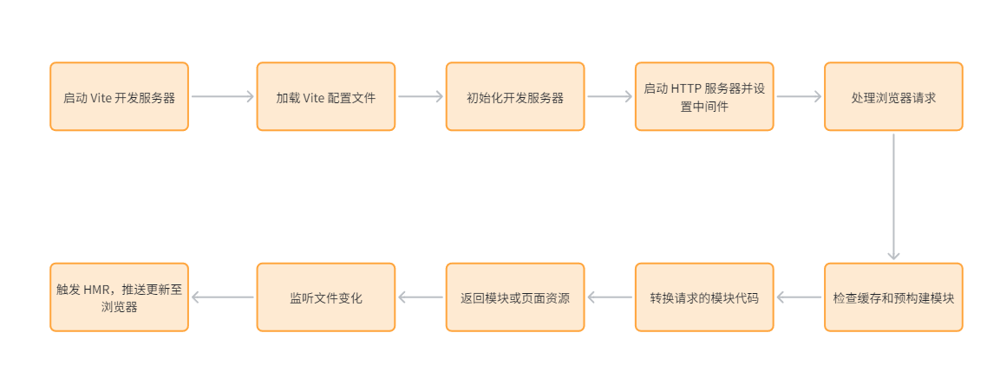
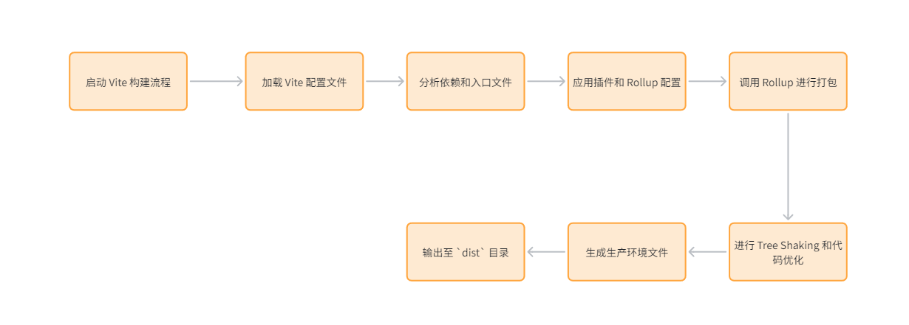
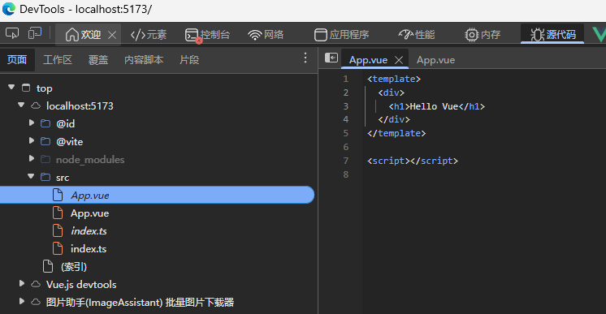
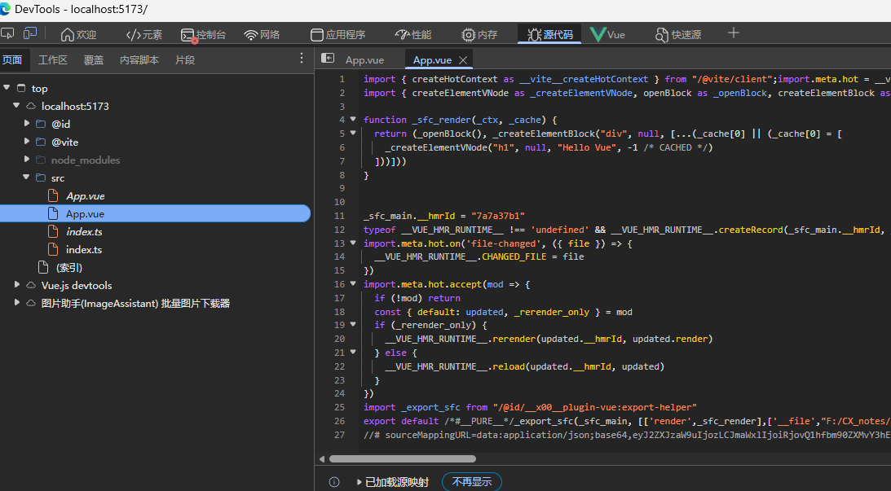
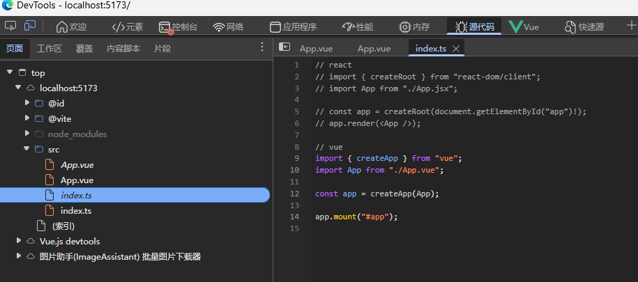
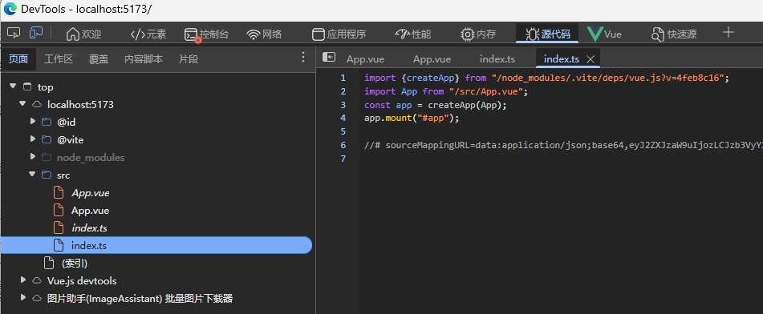

# Vite 基础进阶和原理剖析

> JS模块化 —— [https://www.yuque.com/tianyu-coder/openshare/hycdb5tispao428h]

## 0. 目标

补充资料：

- Vite 官方文档：https://vitejs.dev/
- Vite 对比 Webpack等：https://vitejs.dev/guide/comparisons.html
- Vite 相关库：https://github.com/vitejs/awesome-vite
- 配置详解：https://vitejs.dev/config/
- 官方 plugin：https://vitejs.dev/plugins/
- 插件机制实现：https://github.com/vitejs/vite/tree/main/packages/vite/src/node/plugins

### 面试题

#### 面试真题1：请说说 Vite 核心概念？

答案：<span style="color:#409eff">Vite 是一种现代化的前端开发构建工具，旨在优化开发体验和构建性能</span>。以下是 Vite 的核心概念及其详细说明，并配有示例代码以便更好地理解其工作原理。

- 在开发模式下， Vite基于bundleless， 本质是 dev server  + 按需加载 + 基于esbuild的预构建。
- 什么是bundleless
- vite的开发阶段完整链路。 为什么有预构建，用于解决什么问题， 预构建为什么用esbuild。
- 在生产阶段， Vite基于Rollup， 基于插件化（微内核）设计思想。
- 什么是插件化（微内核）设计思想， 常用的插件钩子
- vite的生产阶段完整链路。
- 生产阶段为什么用Rollup

##### 快速启动

Vite 的设计初衷是加速开发服务器的启动过程。传统的构建工具在启动时通常需要预先构建整个项目，这会导致启动时间长，特别是对于大型项目。Vite 则利用浏览器的原生 ES 模块支持，按需加载模块。

##### 即时热更新 (HMR)

模块热替换 (Hot Module Replacement, HMR) 是 Vite 提供的一项关键功能，当代码发生变化时，它可以在不刷新整个页面的情况下，只替换修改的模块。

##### 原生 ESM

Vite 利用了现代浏览器对 ES 模块（ESM）的原生支持，在开发模式下直接使用 ESM 来加载模块，而不需要打包。这不仅提高了开发速度，还简化了模块化开发的复杂性。

示例：

在项目中直接使用 ES 模块：

```javascript
import App from './App.vue';
```

此时，浏览器直接从 ./App.vue 解析并加载模块，而不需要额外的打包步骤。

##### 按需编译

Vite 在开发环境中会根据代码的实际引用情况，按需编译模块，未被引用的模块不会进行编译，进一步提升开发效率。

示例：

在 main.js 中只引入了 moduleA：

```javascript
import { hello } from './moduleA.js';
console.log(hello);
```

在开发环境中，Vite 只会编译并加载 moduleA.js，而不会编译 moduleB.js，除非你在后续代码中实际使用了它。

##### 现代浏览器支持

Vite 专注于支持现代浏览器，而不是花费大量精力去支持老旧的浏览器如 IE11。这使得它能够利用现代浏览器的最新特性，进一步提升性能和开发体验。

> 上述特征都是由于vite基于bundleless的构建。

##### 插件体系

Vite 拥有基于 Rollup 的插件系统，插件可以用来扩展 Vite 的功能，如处理不同类型的文件、引入额外的编译步骤等。

示例：

安装并使用 Vue 插件：

```bash
npm install @vitejs/plugin-vue --save-dev
// vite.config.js
import { defineConfig } from 'vite';
import vue from '@vitejs/plugin-vue';

export default defineConfig({
  plugins: [vue()]
});
```

##### 生产构建优化

虽然 Vite 主要优化了开发体验，但在生产模式下，它使用 Rollup 进行打包。Rollup 是一个强大的模块打包工具，专注于优化输出文件的大小和性能，确保生产环境下的代码高效运行。

##### 环境变量管理

Vite 支持使用 .env 文件来管理环境变量，开发者可以根据不同的环境配置变量，并在代码中引用。

示例：

创建 .env 文件：

```plain
VITE_APP_TITLE=My Vite App
```

在代码中使用：

```javascript
console.log(import.meta.env.VITE_APP_TITLE);  // 输出 'My Vite App'
```

Vite 会自动加载这些环境变量，并通过`import.meta.env`提供给代码使用。

> 基于插件化设计思想和Rollup插件生态。

##### 核心概念总结

Vite 通过快速启动、即时热更新、原生 ESM、插件体系、按需编译、生产构建优化、环境变量管理、现代浏览器支持等核心概念，显著提高了前端开发效率。它专注于现代开发流程，提供了灵活的配置和优化的生产构建，是现代前端开发的理想工具。

#### 面试真题2：说说 Vite 为什么会开发环境用 esbuild，线上构建用 rollup？

答案：Vite 在开发环境与生产环境选用不同构建工具，核心是为了平衡开发体验与生产构建质量，充分发挥两种工具的优势，具体原因如下：

##### 开发环境选用 esbuild 的核心原因

esbuild 最大的优势是极致的编译速度，其采用 Go 语言编写，相比 JavaScript 编写的构建工具（如 rollup、webpack），在模块解析、编译打包的速度上有数量级的提升。开发环境中，开发者需要频繁修改代码、重启服务或等待热更新，esbuild 能提供几乎即时的反馈，大幅缩短等待时间，提升开发效率，解决了传统构建工具启动慢、热更新滞后的痛点。

##### 生产环境选用 rollup 的核心原因

rollup 拥有成熟、强大的代码优化能力和灵活的插件体系，能够对代码进行深度压缩、Tree-Shaking（摇树优化）、代码分割等，确保生成的生产包体积更小、性能更优。同时，rollup 对各种前端场景的适配更完善，支持多种模块规范，插件生态丰富，能够满足生产环境中复杂的构建需求。

##### 平衡速度与功能

Vite 通过在开发环境使用 esbuild 和在生产环境使用 rollup，在开发速度和生产构建质量之间达成了良好的平衡：

• 开发环境：esbuild 提供极致的构建速度，允许开发者快速迭代和调试，体验几乎即时的反馈。

• 生产环境：rollup 提供了更好的优化能力和灵活性，确保生成的代码在生产环境中性能最佳。

##### 构建流程的分离

Vite 选择在开发和生产环境使用不同的构建工具，反映了现代前端开发工具的设计趋势——将开发流程和生产流程分离开来。开发阶段重视速度和反馈，而生产阶段重视优化和性能，这种分离使得 Vite 能够充分利用各自工具的优势，提供最优的开发和构建体验。

##### 总结

Vite 在开发环境中使用 esbuild 主要是为了利用其极快的编译速度，提升开发体验；而在生产环境中使用 Rollup，则是为了利用其成熟的插件体系和优化能力，确保最终构建包的质量和性能。通过结合这两种工具，Vite 在保持高效开发的同时，也能生成高度优化的生产代码。

#### 面试真题3：说说你对 bundleless 的理解

答案：“Bundleless” 是一种新兴的前端开发趋势，它的核心思想是减少或完全去除传统的打包（bundling）步骤，直接利用浏览器对现代 JavaScript 特性（尤其是 ES 模块）的原生支持。

这一趋势背后的推动力包括现代浏览器的进步、开发者对更快开发反馈的需求以及更简单的开发流程。传统的打包工具（如 webpack）需要将所有模块打包成一个或多个bundle文件后，才能在浏览器中运行，这一过程会消耗一定的时间，尤其是在大型项目中，打包速度会明显下降，影响开发效率。

Bundleless 模式下，开发者无需等待完整的打包过程，浏览器可以直接加载并解析各个 ES 模块文件，实现按需加载，从而大幅提升开发启动速度和热更新效率。Vite 就是 Bundleless 模式的典型实践，其开发环境正是基于这一思想，利用浏览器原生 ES 模块支持，跳过打包步骤，实现快速启动和即时热更新。

需要注意的是，Bundleless 主要适用于开发环境，生产环境中为了保证性能（减少 HTTP 请求、代码优化等），通常仍会进行打包处理，Vite 生产环境使用 rollup 打包就是很好的例子，既兼顾了开发时的 Bundleless 优势，也保证了生产环境的性能。

## 1. 前端打包工具概述

- 前端打包工具的核心目标？
- 打包的资源有哪些？
- 打包工具解决的三大核心问题？
- 原生ESM模块化和工程化模块体系的不同？
- 常见的前端打包工具有哪些？

### 什么是前端打包工具

前端打包工具（英文：Bundler / Build Tool），是现代前端工程化开发中不可或缺的核心工具，其核心目标是：<span style="color:#409eff">将前端项目中开发阶段编写的源代码与各类资源，通过经过解析、编译、整合与优化等一系列处理，最终输出为浏览器或其他运行环境（如Node.js）能够直接识别、高效加载、稳定运行的高性能生产代码。</span>

简单来说，前端打包工具是“开发代码”与“运行环境”之间的桥梁，它解决了开发便利性与运行高效性之间的矛盾——开发者可以按照工程化、模块化的方式编写代码，而打包工具则负责将这些“符合开发习惯”的代码，转化为“符合运行环境要求”的代码。

对应问题：前端打包工具的定义、核心目标是什么？它在前端开发中扮演什么角色？

### 打包工具到底“打包”了什么

打包工具处理的是整个前端工程的所有输入资源，涵盖了项目运行所需的各类文件，具体包括以下几类，每类资源都有其核心作用，打包工具会根据资源类型进行针对性处理：

- `JavaScript / TypeScript`：前端项目的核心逻辑代码，包括业务逻辑、工具函数、组件逻辑等；其中`TypeScript`是JavaScript的超集，增加了类型校验，无法被浏览器直接识别，需通过打包工具转换为JavaScript。

- `CSS / SCSS / Less`：页面样式相关文件，其中`SCSS / Less`是CSS预处理语言，扩展了CSS的语法（如变量、嵌套、混合等），便于样式的维护和复用，同样需要打包工具转换为浏览器可识别的普通CSS。

- 图片 / 字体 / SVG：页面展示所需的静态资源，包括图片（jpg、png、webp等格式）、字体文件（ttf、woff等）、SVG矢量图；打包工具会对这类资源进行优化（如图片压缩）、处理路径，并转换为浏览器可加载的格式。

- `JSON / WASM`：数据文件及WebAssembly相关资源；`JSON`用于存储项目配置、静态数据等，打包工具会解析其内容并整合到代码中；`WASM`（WebAssembly）是一种高性能的二进制代码格式，可提升前端复杂计算的效率，打包工具会负责其加载和集成。

- 环境变量 / 配置文件：项目运行所需的配置信息，如开发环境、测试环境、生产环境的接口地址、全局配置等；打包工具会根据不同环境，替换对应的环境变量，确保项目在不同环境下正常运行。

打包工具处理所有资源的最终目标只有一个：生成一组浏览器能够高效加载、稳定运行、长期缓存的静态资源，既保证项目运行的流畅性，也提升用户访问体验，同时降低服务器的请求压力。

对应问题：前端打包工具会处理哪些类型的资源？各类资源在打包过程中会被如何处理？打包工具的最终目标是什么？

### 打包工具解决的核心问题

前端项目在开发过程中，会<span style="color:#409eff">面临工程化、兼容性、性能三大核心问题</span>，而打包工具的核心价值就是在项目构建阶段，提前消化这些问题，确保最终输出的生产代码能够正常运行、性能优良。前端打包工具本质上解决的就是这三类核心问题，具体细节如下：

#### 工程化问题：代码如何从“可维护”变成“可执行”

现代前端项目规模越来越大，代码量急剧增加，为了提升开发效率、降低维护成本，开发者会采用模块化工程设计，但这种设计方式对浏览器并不友好，打包工具则负责解决“模块化代码无法被浏览器直接执行”的问题，实现代码从“可维护”到“可执行”的转换。

##### 工程化问题到底指什么

现代前端工程化的核心是模块化设计，其核心思路是“分而治之”，将复杂的前端系统拆分为多个独立的功能模块，每个模块只关注自己的核心职责，模块之间通过规范的方式建立依赖关系，具体特点如下：

- 拆分合理：一个完整的系统会被拆分成多个细小的功能模块，每个模块负责一个具体的功能（如登录模块、列表渲染模块、工具函数模块等）。

- 职责单一：每个模块只关注自己的核心职责，不涉及无关功能，便于开发者维护和修改（如工具函数模块只存放通用工具方法，不包含业务逻辑）。

- 依赖清晰：模块之间通过`import / export`语法建立依赖关系，明确哪个模块依赖于哪个模块，避免代码混乱。

这种模块化方式对开发者非常友好，能够大幅提升代码的可维护性、可复用性，降低团队协作的成本，但对浏览器来说，这种模块化代码通常是无法直接执行的，这就是前端工程化带来的核心问题。

对应问题：现代前端工程化的模块化设计有哪些核心特点？这种设计方式对开发者和浏览器分别有什么影响？

##### 浏览器面临的根本问题

浏览器的工作方式是：**拿到入口资源 → 按Web规范解析 → 按加载策略执行。**它不会理解你的“工程结构语义”，也不会完成构建期的翻译与优化。浏览器的核心职责是通过网络加载资源（HTML/CSS/JS/图片等）并按 Web 标准解析与执行。它实现的是**运行时规范**，因此，当项目采用模块化开发时，浏览器能否“识别并执行模块化代码”，取决于模块化到底是**原生 ESM（浏览器规范）**，还是**工程化模块体系（构建工具语义）**。

在原生层面，现代浏览器支持 ES Modules：当脚本以 `<script type="module">` 或 `import()` 引入时，浏览器会把它当作模块解析，识别 `import/export`，并根据静态导入关系构建模块依赖图，按依赖关系加载与执行模块。模块默认是严格模式、拥有独立作用域，并且具备类似 `defer` 的加载行为（不阻塞 HTML 解析）。因此，对 ESM 来说，浏览器确实会解析依赖并保证依赖优先执行。

真正让浏览器“看起来无法直接运行工程化模块化代码”的根因在于：浏览器只理解**URL 与标准资源类型**，不理解工程系统里大量“非浏览器”的工程化开发语义。比如路径别名（`@/`）、TypeScript/JSX/Vue SFC 的语法、把 CSS/图片/字体当作可 `import` 的模块、虚拟模块与环境变量注入、依赖预打包与拆包策略、以及为兼容旧环境进行的语法降级与 polyfill 注入。浏览器不会也不应该替你做这些**“编译、重写、优化与兼容”**工作，因为它们属于构建系统的职责边界。

因此，浏览器在工程化场景下无法自动完成的关键动作，本质上不是“不会模块化”，而是**缺乏构建期语义到浏览器语义的转换能力**：它不会把工程路径解析为可请求的 URL，不会把 TS/Vue/SCSS 等源码编译成浏览器可执行的 JS/CSS，不会把 `import` 的资源依赖（如图片、样式）转换为可加载的产物引用，也不会为生产交付做打包合并、拆分、tree-shaking、压缩与缓存命名等优化。构建工具（Vite/Webpack/Rollup）所做的，就是把“工程里的模块化”翻译成“浏览器能执行的模块化”（ESM 或打包后的脚本）并给出可控的加载与性能策略。

更精确地说，浏览器的限制来自三个边界：

- 第一，它只认识“可定位的资源”，不认识“工程解析规则”。工程里常见的路径别名、包入口推导、扩展名省略、条件导出、虚拟模块等解析能力，浏览器并不提供；浏览器需要的是最终可请求的 URL 以及正确的 MIME 类型。

- 第二，它只运行“浏览器能执行的语言与格式”，不负责编译。TypeScript、JSX、Vue 单文件组件、样式预处理（Less/Sass）、以及把图片字体当模块导入，这些都需要在构建期转换成浏览器可消费的 JS/CSS/资源 URL。

- 第三，它不负责生产交付层面的依赖优化与性能策略。即使在原生 ESM 场景下浏览器可以解析 `import/export` 并按模块图加载执行，它也不会替你做工程化所需的静态优化：tree-shaking、minify、chunk 切分策略、hash 命名与长缓存、预加载提示生成、polyfill 注入与兼容性降级等。工程化要交付的是“可运行且高性能可兼容的产物”，这必须通过构建系统在交付前完成。

综上，更准确的结论是：**浏览器能原生执行符合标准的 ESM 模块，并能按模块依赖图加载与执行；但它不具备工程化构建期能力，无法直接理解与运行依赖于编译、路径重写、资源变换与性能优化的工程化模块体系**。这也是为什么“浏览器支持模块化”与“仍然需要构建工具”并不矛盾：前者解决运行时模块机制，后者解决工程语义到运行时语义的转译与交付优化。

##### 打包工具在工程化问题中的作用

打包工具在前端工程化与浏览器之间，扮演了“工程解释器”和“代码整合者”的角色，它能够读懂开发者编写的模块化代码，分析模块依赖关系，并将其转换为浏览器可识别的代码，具体作用如下：

- 分析依赖关系：遍历整个前端项目，识别所有模块之间的`import / export`依赖关系，明确每个模块的依赖模块和被依赖模块。

- 构建依赖关系图：根据分析出的依赖关系，构建出完整的模块依赖关系图，清晰呈现每个模块的依赖链路，避免循环依赖导致的问题。

- 重新组织执行顺序：根据依赖关系图，调整代码的加载和执行顺序，确保依赖模块先加载、先执行，被依赖模块后加载、后执行，避免因依赖顺序错误导致的报错。

- 整合模块化代码：将分散的多个模块化代码，整合为一个或多个浏览器可直接执行的代码文件，消除模块化语法（如`import / export`），让浏览器能够正常解析和执行。

简单来说：工程化让代码更容易被人理解、维护和协作，而打包工具让代码重新变得可被浏览器识别和执行，搭建起“开发端”与“运行端”之间的桥梁。

对应问题：打包工具在解决前端工程化问题时，具体起到哪些作用？这些作用如何帮助模块化代码在浏览器中运行？

#### 兼容性问题：浏览器不认识你的“工程语言”

现代前端开发中，开发者为了提升开发效率、丰富代码功能，会大量使用各类“工程阶段语言”，这些语言和语法虽然便于开发，但浏览器无法直接识别；同时，不同浏览器之间对标准语法、API的支持也存在差异，这就导致了兼容性问题。打包工具在构建阶段提前处理这些问题，确保代码在各类浏览器中都能正常运行。

##### 为什么会出现兼容性问题

兼容性问题的核心原因有两个：一是开发者使用的“工程阶段语言”浏览器无法直接识别；二是不同浏览器对标准语法、API的支持存在差异。其中，“工程阶段语言”是现代前端开发中兼容性问题的主要来源，这类语言具体包括：

- `TypeScript`：JavaScript的超集，在JavaScript的基础上增加了类型校验，能够提前发现代码中的类型错误，提升代码质量，但浏览器无法直接识别TypeScript代码，必须转换为JavaScript。

- `SCSS / Less`：CSS预处理语言，扩展了CSS的语法，支持变量、嵌套、混合、继承等功能，便于样式的维护和复用，但浏览器无法直接识别这类预处理样式，必须转换为普通CSS。

- `JSX`：JavaScript语法扩展，是React等前端框架中用于构建UI组件的核心语法，能够将HTML结构与JavaScript逻辑结合在一起，便于开发，但浏览器无法直接识别JSX语法，必须转换为普通JavaScript。

- 新版本JavaScript语法：开发者会使用ES6及以上版本的JavaScript语法（如箭头函数、Promise、解构赋值等），这些语法具有更简洁、更强大的功能，但部分老旧浏览器（如IE浏览器）不支持这些新语法，直接执行会报错。

这些“工程阶段语言”的共同特点是：它们是为“开发效率”设计的，属于“开发时的高级表达”，而不是“运行时浏览器可识别的通用表达”，这就导致直接将开发源码交给浏览器执行，会出现无法识别、报错等问题。

对应问题：前端开发中为什么会出现兼容性问题？常见的“工程阶段语言”有哪些？这些语言有什么共同特点？

##### 不同浏览器之间的现实差异

即使开发者使用的是浏览器可识别的标准JavaScript、CSS，不同浏览器之间仍然存在差异，这种差异源于浏览器的内核不同、版本不同，导致对标准语法、API的支持程度不同，具体表现为：

- 语法支持差异：部分老旧浏览器不支持ES6及以上版本的JavaScript语法，如IE浏览器不支持箭头函数、Promise等语法，而Chrome、Firefox等现代浏览器则完全支持。

- API支持差异：不同浏览器对JavaScript API、CSS属性的支持存在差异，如部分浏览器不支持`fetch`API、`flex`布局等，导致相同的代码在不同浏览器中呈现效果或功能不一致。

- 行为细节差异：即使是支持相同语法和API的浏览器，在部分行为细节上也可能存在差异，如表单验证的默认提示、事件触发的时机等，导致代码在不同浏览器中的运行效果略有不同。

如果直接将开发源码交给浏览器执行，不进行兼容性处理，就会出现以下问题：部分老旧浏览器报错、部分功能无法正常使用、不同浏览器中页面呈现效果或功能不一致，严重影响用户体验。

对应问题：不同浏览器之间的差异主要体现在哪些方面？这些差异会导致什么问题？

##### 打包工具如何解决兼容性问题

打包工具解决兼容性问题的核心思路是：在项目构建阶段，将“开发时的高级表达”翻译成“运行时的通用表达”，提前消化所有兼容性问题，确保最终输出的代码能够在各类浏览器中正常运行，具体操作包括：

- 转换工程语言：将浏览器无法直接识别的“工程阶段语言”，转换为浏览器通用的`JavaScript / CSS`，如将TypeScript转换为JavaScript、将SCSS / Less转换为CSS、将JSX转换为普通JavaScript。

- 语法降级处理：对ES6及以上版本的JavaScript新语法进行降级处理，将其转换为ES5语法（如将箭头函数转换为普通函数、将Promise转换为回调函数），确保老旧浏览器也能识别和执行。

- 补充Polyfill：针对不同浏览器的API支持差异，添加对应的Polyfill（兼容性补丁），补充浏览器缺失的API（如为不支持`fetch`API的浏览器添加fetch Polyfill），确保代码在所有目标浏览器中都能正常调用所需API。

- 适配浏览器环境：可根据用户配置的目标浏览器范围，针对性地生成兼容性代码，避免不必要的兼容性处理，平衡代码体积和兼容性。

需要注意的是，兼容性问题并不是在浏览器运行时才解决的，而是在打包阶段就被提前消化掉的——打包工具输出的生产代码，已经是经过兼容性处理的、浏览器可直接识别的代码，无需浏览器再进行额外处理。

对应问题：打包工具是如何解决前端兼容性问题的？核心思路是什么？兼容性问题是在哪个阶段被解决的？

#### 性能问题：工程化代码如何高效加载

模块化拆分虽然提升了代码的可维护性，但也带来了性能风险——分散的模块化代码会导致文件数量增多、请求次数增加、代码体积变大，进而影响页面加载速度和运行性能。打包工具在构建阶段，通过一系列优化操作，从根源上解决这些性能问题，实现工程化代码的高效加载。

##### 工程化本身会带来性能风险

模块化拆分的核心是“分而治之”，但这种拆分方式在提升开发效率的同时，也会带来一系列性能隐患，具体表现为：

- 文件数量急剧增加：一个中大型前端项目，可能会被拆分成上百个甚至上千个模块化文件，每个文件都是一个独立的资源，需要浏览器单独加载。

- 重复代码增多：不同模块之间可能会使用相同的代码（如通用工具函数、公共组件），如果不进行处理，这些重复代码会被多次打包，增加代码体积。

- 请求次数变多：浏览器加载资源时，每个文件都需要发起一次HTTP请求，文件数量越多，HTTP请求次数就越多，而HTTP请求存在延迟，会严重影响页面加载速度。

- 首屏加载成本变高：首屏加载时，需要加载大量的模块化文件，导致首屏加载时间过长，用户需要等待很久才能看到页面内容，影响用户体验。

如果直接让浏览器加载这些未经过优化的工程化文件，页面的加载速度和运行性能会迅速恶化，尤其是在网络环境较差的情况下，这种问题会更加明显。

对应问题：前端工程化的模块化拆分，会带来哪些性能风险？这些风险会对页面加载和运行产生什么影响？

##### 打包工具如何从构建阶段解决性能问题

打包工具解决性能问题的核心是“优化资源加载和执行效率”，在构建阶段通过一系列针对性的优化操作，减少代码体积、减少请求次数、优化加载方式，具体主要做三类事情：

第一，减少代码体积，降低加载成本：

- 删除未使用代码（Tree Shaking）：分析代码中的无用代码（如未被引用的函数、变量、模块），并在打包时将其删除，避免无用代码占用体积。

- 压缩代码体积：对JavaScript、CSS代码进行压缩（如删除空格、注释、简化变量名），减少代码文件的大小，加快加载速度。

- 合并重复逻辑：识别不同模块中的重复代码，将其合并为公共代码，避免重复打包，减少整体代码体积。

第二，减少请求数量，提升加载效率：

- 合并模块文件：将多个分散的模块化文件，合并成一个或几个必要的文件（如将所有公共组件合并为一个公共文件），减少浏览器发起的HTTP请求次数。

- 处理静态资源：将图片、字体等静态资源进行Base64编码（小体积资源），或合并为雪碧图（图片资源），避免浏览器为每个静态资源发起单独请求。

第三，重新组织加载方式，优化加载顺序：

- 代码分割（Code Splitting）：将代码拆分为多个块（Chunk），如首屏代码块、非首屏代码块、公共代码块，避免一次性加载所有代码。

- 按需加载：首屏只加载必要的代码块，保证首屏快速加载；非关键功能（如弹窗、详情页）对应的代码块，在用户需要时再动态加载，减少首屏加载成本。

- 预加载/预解析：对后续可能需要加载的代码块、资源进行预加载或预解析，提前缓存资源，提升用户后续操作的响应速度。

对应问题：打包工具在构建阶段，主要通过哪些方式解决前端性能问题？每类方式具体做了什么？

##### 性能优化的核心思想

很多人误以为打包工具解决性能问题的方式，就是“把所有代码全部合成一个文件”，其实这是一种误解。打包工具优化性能的核心思想，是在“加载成本”和“执行效率”之间做结构性权衡，根据项目规模和需求，选择最合适的优化方案，具体表现为：

- 小项目：代码量少、模块数量少，将所有代码合并成一个文件，反而能减少请求次数，加快加载速度，此时“合并文件”是最优方案。

- 大项目：代码量多、模块数量多，如果将所有代码合并成一个文件，会导致文件体积过大，首屏加载时间过长，此时就需要进行代码分割、按需加载，平衡“减少请求次数”和“降低首屏加载成本”之间的关系。

需要注意的是，这种“结构性权衡”只能在打包阶段完成，浏览器无法自动完成——浏览器只能按照加载顺序执行代码，无法根据项目规模和需求，动态调整代码的加载和执行方式，这也是打包工具在性能优化中的核心价值。

对应问题：打包工具优化前端性能的核心思想是什么？为什么这种优化只能在打包阶段完成？

### 常见的前端打包工具

目前前端生态中有多种打包工具，每种工具都有其定位、特点和适用场景，开发者需要根据项目规模、技术栈、开发需求，选择最合适的打包工具。以下是目前最常用的5种前端打包工具，详细介绍其定位、特点和适用场景：

#### Webpack

定位：通用型、全功能前端打包工具，是目前前端生态中应用最广泛、生态最成熟的打包工具，几乎可以处理前端工程中的所有资源和场景。

核心思想：以模块为中心，遍历项目中的所有模块，构建完整的依赖关系图，然后根据依赖关系，将所有模块整合为浏览器可执行的代码。

特点：

- 功能全面：支持`JavaScript / TypeScript / CSS / SCSS / Less`、图片、字体、JSON等一切前端资源的模块化处理，无需额外配置即可支持大部分资源。

- 扩展性极强：通过Loader（加载器）和Plugin（插件）扩展功能；Loader负责模块内容的转换（如将TypeScript转换为JavaScript），Plugin负责构建流程的扩展（如代码压缩、按需加载）。

- 生态成熟：拥有庞大的社区和丰富的Loader、Plugin资源，几乎所有前端开发场景都能找到对应的解决方案。

- 配置灵活：可根据项目需求，自定义构建流程和优化策略，但配置相对复杂，学习成本较高。

适用场景：

- 中大型前端项目：尤其是业务复杂、资源类型多、对构建流程有高度定制需求的项目。

- 对构建流程和优化策略有高度控制需求的工程：如需要自定义代码分割、压缩策略、兼容性处理的项目。

- 历史项目或复杂企业级项目：这类项目通常技术栈复杂、依赖较多，Webpack的兼容性和扩展性能够很好地适配。

对应问题：Webpack的定位和核心思想是什么？它有哪些特点？适用于哪些场景？

#### Vite

定位：现代前端开发工具，强调开发体验和构建速度，是近年来非常流行的打包工具，尤其适用于现代前端框架（如Vue、React）项目。

核心创新：开发阶段不进行完整打包，而是直接基于浏览器原生`ESM`（ES Module）运行代码，只对当前修改的模块进行按需编译，大幅提升开发阶段的启动速度和热更新速度。

特点：

- 开发体验极佳：开发阶段启动速度极快（毫秒级启动），热更新响应迅速，修改代码后能立即看到效果，无需等待完整打包。

- 按需编译：开发阶段只编译当前访问的模块，未访问的模块不进行编译，减少不必要的计算。

- 配置轻量：默认即最佳实践，大部分项目无需复杂配置即可直接使用，学习成本低。

- 生产环境优化：生产环境使用Rollup进行打包，输出代码质量高、体积小，兼顾开发体验和生产性能。

适用场景：

- Vue / React 等现代前端框架项目：Vite对这些框架有良好的内置支持，开发体验更佳。

- 中小型到中大型应用：尤其是对开发效率要求较高的项目。

- 追求开发效率和现代工程体验的项目：适合希望减少配置成本、提升开发速度的团队。

对应问题：Vite的定位和核心创新是什么？它有哪些特点？适用于哪些场景？

#### Rollup

定位：专注于“干净输出”的打包工具，更关注输出代码的质量和体积，而非开发阶段的体验，常被用于类库、SDK的打包。

核心思想：基于`ES Module`，专注于代码的打包和优化，输出结构清晰、体积小的代码，避免不必要的代码冗余。

特点：

- 天然支持`ES Module`：对`ES Module`的支持更原生、更高效，打包后的代码没有多余的冗余代码。

- Tree Shaking能力极强：能够精准识别并删除未使用的代码，输出代码体积更小、结构更清晰。

- 输出质量高：打包后的代码更接近原生JavaScript，执行效率高，适合作为类库、SDK的输出格式。

- 配置简洁：配置更偏向于构建产物的优化，而非开发服务器的配置，学习成本适中。

适用场景：

- 类库、SDK、工具函数库：如常用的JavaScript工具库、组件库，对输出代码的体积和质量要求极高。

- 对输出体积和结构要求极高的项目：如需要嵌入到其他项目中的代码，要求体积小、执行效率高。

- 作为Vite的生产环境打包底层工具：Vite开发阶段基于原生ESM，生产阶段则使用Rollup进行打包，兼顾开发体验和输出质量。

对应问题：Rollup的定位和核心思想是什么？它有哪些特点？适用于哪些场景？

#### esbuild

定位：高性能构建引擎，核心目标是极致的构建速度，通常作为其他打包工具的底层构建能力，而非直接用于项目打包。

核心优势：使用Go语言编写，相比JavaScript编写的打包工具（如Webpack、Rollup），构建速度提升10-100倍，能够大幅缩短构建时间。

特点：

- 构建速度极快：Go语言的并发能力强，能够高效处理大量模块的打包，尤其适合大型项目的快速构建。

- 支持常见语法：原生支持`TypeScript、JSX`等常见前端语法，无需额外配置即可进行转换。

- 功能相对精简：专注于核心的打包和转换功能，不支持复杂的插件扩展，功能相对单一。

- 底层工具属性：多作为其他打包工具的底层构建能力（如Vite的部分构建流程使用esbuild），而非直接用于项目的完整打包。

适用场景：

- 构建工具的底层依赖：为其他打包工具提供高效的构建能力，提升整体构建速度。

- 对构建速度要求极高的场景：如大型项目的开发构建、CI/CD流程中的快速构建。

- 不需要复杂插件体系的项目：如小型项目、简单的工具库，只需要基础的打包和转换功能。

对应问题：esbuild的定位和核心优势是什么？它有哪些特点？适用于哪些场景？

#### Parcel

定位：零配置打包工具，强调“开箱即用”，核心目标是降低前端工程化的使用门槛，让初学者也能快速上手。

核心思想：无需用户进行复杂配置，自动识别项目中的各类资源，自动处理依赖关系、兼容性和性能优化，让用户专注于代码开发。

特点：

- 零配置开箱即用：几乎不需要任何配置，安装后即可直接打包项目，自动处理`JavaScript、CSS、图片`等各类资源。

- 自动处理依赖：自动识别项目中的依赖关系，无需用户手动配置模块解析规则。

- 学习成本极低：无需了解复杂的构建配置，适合初学者或不熟悉构建流程的开发者。

- 可控性相对较弱：零配置的同时，也意味着用户无法对构建流程和优化策略进行深度定制，灵活性不足。

适用场景：

- 小型项目：代码量少、资源类型简单，无需复杂的构建配置。

- 快速原型开发：需要快速搭建项目并打包，无需花费时间配置构建工具。

- 初学者或对构建细节要求不高的项目：适合不熟悉前端工程化、希望快速上手的开发者。

对应问题：Parcel的定位和核心思想是什么？它有哪些特点？适用于哪些场景？

## 2. Vite的核心概念

- Bundleless的概念？
- Vite如何践行Bundleless？
- Vite的混合策略解决什么问题？

### Vite的出现

vite 是一个新型的前端构建工具，它在开发和构建过程中都显著提高了效率。它的核心思想是“bundleless”，即在开发阶段不进行打包操作，而是利用浏览器的原生 ES 模块（ESM）支持来实现模块加载。

- 模块化规范演进，这就说明为啥 2015 年以前，文件满天飞，毫无工程化可言
- 浏览器 ESM：这就说明为啥 2015 年没有 bundleless，偏偏到 2020 年
- 本地开发处理：本地开发只打包必须要打的内容，例如：commonjs 的内容、jsx、vue （esbuild 来打）等，并存入缓存
- 产物构建处理：产物构建使用 rollup 进行构建

Vite 的出现迎合了时代，vite 旨在提供极快的开发体验。它利用了原生的 ES 模块加载，避免了传统打包工具的预处理过程，从而极大地提高了开发速度。

### Bundleless核心概念

Bundleless（无打包）是现代前端开发的一种新兴趋势，其核心思想是<span style="color:#409eff">减少或完全去除传统的打包（bundling）步骤，直接利用浏览器对ES模块（ESM）的原生支持，实现模块的按需加载与解析</span>。Vite是Bundleless理念的典型实践载体，并非完全摒弃打包，而是根据开发与生产的不同场景，灵活选择是否打包，既兼顾开发体验，又保障生产性能。

核心关键点：Bundleless的核心是“去全量打包”，而非“完全不打包”；<span style="color:#409eff">其技术基础是现代浏览器对ESM的原生支持</span>，核心目标是简化开发流程、提升开发效率，解决传统打包模式的痛点。

对应问题：Bundleless的核心思想是什么？其技术基础和核心目标分别是什么？Vite与Bundleless的关联是什么？

### 传统Bundle模式的痛点

在Bundleless出现之前，前端开发普遍依赖Webpack、Rollup等打包工具，<span style="color:#409eff">将项目中所有模块和资源整合打包成一个或多个bundle文件。</span>这种模式虽解决了早期浏览器无法处理模块化代码的问题，但随着项目规模扩大，逐渐暴露出诸多痛点，也催生了Bundleless趋势，具体如下：

- 开发体验差：每次代码修改后，都需要重新执行全量打包，项目越大，打包耗时越长，开发者需要频繁等待，严重影响开发反馈效率。
- 配置复杂：打包工具的配置繁琐，需要针对不同资源（JS、CSS、静态资源等）配置对应的 loader、插件，增加了开发成本和学习成本。
- 资源冗余：开发阶段的全量打包，会加载项目中所有模块，即使部分模块暂时用不到，也会被打包进bundle，造成资源浪费，增加浏览器加载负担。

对应问题：传统Bundle模式的核心作用是什么？随着项目规模扩大，传统Bundle模式会出现哪些痛点？这些痛点为什么会催生Bundleless趋势？

### Vite践行Bundleless的核心基础

Bundleless能够落地，核心依赖于现代浏览器（Chrome、Firefox、Safari等）对ES模块（ESM）的原生支持，这也是Vite实现Bundleless的技术前提，具体细节如下：

- 原生ESM的核心能力：现代浏览器允许通过`<script type="module">`标签，直接加载ESM模块，无需依赖打包工具进行转译或整合，浏览器会自动解析模块中的`import`、`export`语法，按需请求所需模块。

- 简单示例（原生ESM的使用）：     

  HTML文件：

  ```html
  <!DOCTYPE html>
  <html>
  <body>
    <script type="module" src="./main.js"></script>
  </body>
  </html>
  ```

  main.js文件：

  ```javascript
  // 直接导入模块，浏览器自动请求并解析
  import { greet } from './greet.js';
  console.log(greet('Bundleless'));
  ```

  greet.js文件：

  ```javascript
  export function greet(name) {
    return `Hello, ${name}!`;
  }
  ```

  该示例中，浏览器会直接加载`main.js`，解析其中的`import`语句，再自动请求`greet.js`，无需任何打包步骤，这就是Bundleless的核心实现逻辑。

- Vite的依托：Vite正是基于浏览器原生ESM的支持，在开发阶段完全摒弃全量打包，让浏览器直接加载模块，Vite仅作为“模块服务器”，按需处理模块请求，实现Bundleless的开发体验。

对应问题：Vite践行Bundleless的技术前提是什么？现代浏览器的原生ESM支持提供了哪些核心能力？请举例说明原生ESM的使用方式。

### Vite中Bundleless的实现

Vite的核心亮点的就是在开发阶段践行Bundleless理念，完全不进行全量打包，仅通过“模块服务器+按需编译”的方式，配合浏览器原生ESM，实现高效开发，具体实现细节如下：

- 启动逻辑：Vite启动时，无需扫描整个项目、构建完整依赖图和生成bundle，仅启动一个开发服务器（dev server），等待浏览器的模块请求。
- 请求处理流程：浏览器通过`<script type="module">`加载入口模块（如`main.ts`），Vite接收请求后，仅对该模块进行必要转译（如TS转JS、Vue SFC解析等），不做多余预构建，然后将转译后的模块返回给浏览器。
- 模块递归加载：浏览器解析返回的模块，若发现`import`语句，会再次向Vite发起请求，Vite继续按需处理并返回，直至所有依赖模块加载完成。整个过程中，依赖图是浏览器运行时逐步触发请求、Vite逐步响应生成的，而非Vite提前扫描生成。
- 关键优化（适配Bundleless）：        
  - import路径改写：解决浏览器无法识别Node.js裸导入（如`import { createApp } from 'vue'`）的问题，将裸导入路径改写成浏览器可请求的URL，保障模块正常加载。
  - 依赖预构建：针对第三方依赖（如vue、react），使用esbuild快速转译为ESM格式并合并模块，减少浏览器请求次数，解决Bundleless模式下第三方依赖加载效率低的问题。

对应问题：Vite在开发阶段如何践行Bundleless理念？具体的请求处理流程是什么？为了适配Bundleless，Vite做了哪些关键优化？

### Vite中Bundleless的核心优势

Vite依托Bundleless模式，在开发阶段实现了远超传统打包工具的开发体验，核心优势均围绕Bundleless的“按需加载、无全量打包”核心，具体如下：

- 启动速度极快：无需全量打包，启动时仅需启动开发服务器，无需扫描所有模块和生成bundle，即使是大型项目，也能实现秒级启动。
- 即时开发反馈：代码修改后，Vite仅需重新处理修改的模块，无需重新打包整个项目，修改后的效果可立即在浏览器中呈现，大幅缩短开发反馈周期。
- 开发流程简化：无需复杂的打包配置，Vite内置了对各类资源（TS、Vue、CSS、静态资源）的处理逻辑，开发者可专注于代码编写，降低配置成本。
- 按需加载更高效：浏览器仅请求当前需要的模块，避免了传统打包模式下全量加载的资源冗余，减少开发阶段的浏览器加载负担。

对应问题：Vite中Bundleless模式的核心优势有哪些？这些优势都是基于Bundleless的什么核心特性实现的？与传统打包模式相比，开发体验有什么本质提升？

### Vite 混合策略

Bundleless模式虽在开发阶段优势显著，但存在固有挑战，尤其是在生产环境中，Vite通过“开发Bundleless、生产打包”的混合策略，完美解决了这些挑战，具体如下：

#### Bundleless的固有挑战

- 加载性能问题：生产环境中，若直接采用Bundleless模式，会导致模块数量过多，引发大量HTTP请求，增加页面加载时间，影响用户体验。
- 浏览器兼容性问题：现代浏览器均支持原生ESM，但较旧的浏览器（如IE11）不支持，并且浏览器不支持commonJS等语法，若直接使用Bundleless，会导致应用在旧浏览器中无法运行。

#### Vite的解决方案（混合策略）

- 开发阶段：坚持Bundleless模式，利用浏览器原生ESM和Vite的按需编译，保障开发体验，并配合esbuild实现部分打包。
- 生产阶段：放弃纯粹的Bundleless，采用Rollup进行全量打包优化，解决固有挑战：        
  - 解决加载性能问题：通过Rollup合并模块、压缩代码、代码分割（拆分为多个chunk）、添加资源指纹，减少HTTP请求，优化资源体积和加载速度。
  - 解决兼容性问题：可通过配置Rollup插件，将ESM模块转译为兼容旧浏览器的格式，或提供降级方案，扩大应用兼容性。

对应问题：Bundleless模式存在哪些固有挑战？Vite是如何通过混合策略解决这些挑战的？生产阶段采用Rollup打包，具体能解决哪些问题？

### Vite 开发vs生产

Vite对Bundleless的践行，核心是“分场景适配”，并非盲目追求“无打包”，而是根据开发与生产的不同需求，灵活选择是否打包，具体场景区分如下：

- 开发环境：完全践行Bundleless，核心需求是“快速启动、即时反馈”，Vite仅作为模块服务器，按需处理模块请求，不进行全量打包，最大化提升开发效率。
- 生产环境：放弃Bundleless，采用Rollup打包，核心需求是“高性能、可部署、高兼容性”，通过打包优化，确保应用在生产环境中加载速度快、兼容性好、可稳定部署。

核心总结：Vite中的Bundleless，是“按需选择”的灵活模式，而非“一刀切”的无打包，其核心逻辑是“开发阶段用Bundleless提升体验，生产阶段用打包优化性能”，结合了两者的优势。

对应问题：Vite在开发环境和生产环境中，对Bundleless的践行有什么区别？为什么要做这样的场景区分？这种区分的核心逻辑是什么？

### Vite践行Bundleless的意义与行业影响

Vite作为Bundleless理念的成功实践，不仅提升了前端开发体验，也推动了前端开发工具的发展，其核心意义如下：

- 简化开发流程：打破了传统打包工具的复杂配置和漫长等待，让前端开发更轻量、更高效，降低了前端开发的门槛。
- 引领行业趋势：证明了Bundleless模式的可行性和优势，推动了更多前端工具（如Vite生态工具）采用Bundleless理念，改变了前端开发的主流模式。
- 平衡体验与性能：通过“开发Bundleless、生产打包”的混合策略，完美解决了Bundleless的挑战，实现了开发体验与生产性能的双重提升。

对应问题：Vite践行Bundleless的核心意义是什么？对前端行业产生了哪些影响？Vite的混合策略为什么能实现开发体验与生产性能的平衡？

### esbuild vs rollup

#### **开发环境为什么用 esbuild：**

> dev 不是打包，而是按需转换 + 依赖预构建

Vite 的 dev server 并不需要把整个应用打成 bundle 再提供给浏览器，它采用**原生 ESM 按需加载**：浏览器请求哪个模块，Vite 就在服务端对该模块做必要转换并返回。因此开发阶段最重要的指标是**单模块转换速度与冷启动速度**。 

在这条链路里，esbuild 主要承担两类工作：

- **源码快速转译（transpile）**：例如 TS/JSX → 浏览器可执行的 JS。esbuild 的定位就是极快的语法级转换，非常适配“保存一次、只改动少量模块、希望立刻看到变化”的开发工作负载。 
- **依赖预构建（Dependency Pre-Bundling）**：dev 启动时把 `node_modules` 依赖做一次性处理（尤其是把 CJS/UMD 转为 ESM、并将碎片化依赖合并以减少浏览器请求），并缓存到 `.vite/deps`，提升冷启动和页面加载速度；这一步 Vite 明确使用 esbuild。 

一句话概括：**dev 用 esbuild，是因为 Vite 的 dev 需要“按需、增量、极快的转换与预构建”，而不是“生成最终 bundle”。** 

#### 生产构建为什么用 Rollup：

> **需要完整 bundling 输出管线与插件生态**

生产构建的目标不是“尽快跑起来”，而是生成**最适合上线的最终产物**：稳定的 chunk 切分、可控的输出格式、完整的产物处理能力（例如 `renderChunk/generateBundle` 这类输出阶段钩子）、以及对构建流程的深度定制能力（如 `build.rollupOptions`）。这些属于 **bundler 的完整输出管线能力**，Rollup 在这方面成熟且可控。 

更关键的是，Vite 官方在 “Why Vite / Why Not Bundle with esbuild” 中明确说明：

- Vite 确实在 dev 利用 esbuild（例如依赖预构建），但**不会使用 esbuild 作为生产构建 bundler**；
- 核心原因之一是：**Vite 当前的插件 API 与用 esbuild 作为 bundler 不兼容**；Vite 采用 Rollup 的灵活插件 API 与基础设施是其生态成功的重要因素，并且官方认为 Rollup 在“性能 vs 灵活性”的权衡上更合适。 

一句话概括：**build 用 Rollup，不只是因为 tree-shaking/代码拆分更强，而是因为 Vite 的插件体系与产物输出能力深度依赖 Rollup 的 bundler 管线与生态。** 

Vite 将开发与生产拆为两条链路：开发阶段基于原生 ESM 按需加载，只需要极快的模块转译与依赖预构建，因此选用 esbuild；生产阶段需要完整的 bundling 与输出阶段能力，并且 Vite 的插件体系与 Rollup 管线强绑定，官方也明确目前插件 API 不兼容以 esbuild 作为 bundler，因此生产构建选择 Rollup，以获得更成熟的产物控制与生态扩展能力。 

## 3. Vite 的构建原理

Vite 的“构建”分两条线：

- 开发阶段（dev）：不做整体打包，按需提供模块
- 生产阶段（build）：做完整打包、压缩、拆包、产物输出

理解 Vite 的关键是分清：**开发不是 build，只是 dev server + 按需编译**。

### 【开发阶段的本质】

Vite 在开发时更像一个“模块服务器”：

- 浏览器用原生 ES Module（import）加载模块
- Vite 负责把浏览器请求到的文件：
  - 必要时转换（TS、JSX、Vue SFC、CSS 等）
  - 返回给浏览器
- 浏览器继续解析 import，再去请求下一个模块
- Vite 再按需处理并返回

核心关键点：**依赖图不是Vite一次性扫描出来的，而是浏览器在运行时逐步触发请求，Vite逐步响应构建的**，这也是Vite开发阶段启动速度快的核心原因之一。

对应问题：Vite开发阶段的核心定位是什么？与传统打包工具的开发模式有什么本质区别？依赖图是如何生成的？

------

### 【完整请求链路】



假设入口是 `index.html`，其中有：

```
<script type="module" src="/src/main.ts"></script>
```

浏览器的行为与 Vite 的行为按时间顺序是：

1. 浏览器请求 `GET /index.html`
   - Vite 返回 HTML
   - 同时会在 HTML 中注入 HMR 客户端脚本（用于热更新通信）
2. 浏览器看到 `<script type="module" src="/src/main.ts">`
   - 请求 `GET /src/main.ts`
3. Vite 收到 `/src/main.ts` 请求
   - 如果是 TS：用 esbuild 做快速转译成 JS（不做类型检查）
   - 如果里面有 import：Vite 会把 import 路径改写成浏览器可请求的 URL 形式（重要）
   - 返回转译后的 JS 给浏览器
4. 浏览器执行并解析 import，例如：
   - `import App from './App.vue'` → 浏览器会请求 `GET /src/App.vue`
   - `import { createApp } from 'vue'` → 浏览器会请求一个被改写后的依赖地址（通常带 `/@modules/` 或 `/node_modules/.vite/deps/...` 的形式，取决于版本与实现）
5. Vite 针对不同资源类型做不同处理并返回
   - `.vue`：走 Vue 插件，把 SFC 拆成多个虚拟模块（template/script/style），再分别返回
   - `.css`：转换成 JS 模块（用于插入样式或 CSS Modules 处理），并建立 HMR 依赖
   - 图片字体等：返回 URL 或内联数据（取决于大小与配置）
   - 第三方依赖：优先走“依赖预构建”后的产物（下面详讲）
6. 浏览器继续递归请求所有 import 依赖
   - Vite 继续按需编译与返回
   - 没有“全量打包”这一步

核心总结：Vite开发阶段启动快的根源，就是**启动时不需要扫描整个项目并生成bundle，只需启动开发服务器，等待浏览器请求后再按需处理模块**，避免了传统打包工具的全量预构建耗时。

对应问题：以`index.html`为入口，浏览器与Vite的完整请求链路分为哪几步？Vite针对不同类型的资源（.vue、.css、第三方依赖）分别如何处理？Vite开发阶段启动快的核心原因是什么？

### 【最重要的三件事】

#### 1. import 路径改写（为什么必须改写）

浏览器对 ESM 的 import 有严格规则：

- 必须是相对路径或绝对路径 URL（`./`、`../`、`/`、或完整 URL）
- 不能直接识别 Node 的包解析规则（例如 `import vue from 'vue'` 这种 bare import）

所以 Vite 必须把 bare import 改写成浏览器能请求的地址。

例如把：

```
import { createApp } from 'vue'
```

改写成类似：

```
import { createApp } from '/node_modules/.vite/deps/vue.js?v=xxxx'
```

这样浏览器才能发起 HTTP 请求拿到对应模块。

改写不仅针对第三方包，也会处理一些特殊资源引用与查询参数模块（如 `?import`、`?url`、`?raw`）。

------

#### 2. 依赖预构建（pre-bundling，为什么要做）

如果开发阶段完全不处理依赖，会遇到两个大问题：

1. 第三方库可能是 CommonJS 或 UMD，浏览器无法直接按 ESM 方式加载
2. 第三方库内部文件多，如果浏览器逐个请求，会导致请求数量爆炸，开发体验很差

因此 Vite 会在 dev 启动或依赖变动时，对 `node_modules` 做一次“预构建”：

- 使用 esbuild（速度极快）
- 把常用依赖：
  - 转成 ESM
  - 合并成更少的模块文件
  - 产物缓存到 `node_modules/.vite/deps`（常见位置）

这样浏览器加载第三方依赖时：

- 既是 ESM
- 请求数显著减少
- 还能利用强缓存

依赖预构建的触发时机

- 首次启动 dev server
- lockfile 改变（package-lock/yarn.lock/pnpm-lock）
- 依赖安装变化
- `optimizeDeps` 配置变化
- 某些依赖无法被正确扫描，需要手动 include/exclude

------

#### 3. HMR（热更新）为什么会更快

传统 bundler 的 HMR 通常要基于打包产物与依赖图做复杂替换。

Vite 的 HMR 更轻，是因为它的模块天然就是 ESM：

- 每个模块都是独立的请求与响应
- 修改某个文件时：
  - Vite 只需要让浏览器更新这个模块
  - 并沿着模块依赖边界做最小范围的传播

HMR 的工作机制（概念层）

1. 文件变更（监听）
2. Vite 判定变更模块类型（JS、CSS、Vue SFC 等）
3. 生成更新 payload（包含模块 id、变更类型等）
4. 通过 WebSocket 推送给浏览器 HMR 客户端
5. 浏览器按模块粒度执行更新逻辑：
   - CSS 通常直接替换样式
   - Vue 组件更新会尽量保留状态（取决于边界与实现）
   - JS 模块需要模块接受更新（HMR accept），否则触发页面刷新

------

### 【Vite 如何处理常见资源】

#### 1. TypeScript

- 默认使用 esbuild 做“语法转译”
- 不做类型检查（类型检查建议单独跑 `tsc --noEmit` 或用插件/脚本）

所以你会看到：

- 转译很快
- 但类型错误不一定阻止 dev 运行（除非你加了额外检查）

------

#### 2. Vue 单文件组件（.vue）

Vite 通过插件将 `.vue` 拆成多段模块：

- script 部分：转成 JS 模块
- template 部分：编译成 render 函数模块
- style 部分：作为 CSS 模块处理并注入 HMR

这也是为什么 Vue + Vite 的开发体验很顺滑：**SFC 的编译是按需且增量的**。

------

#### 3. CSS 与预处理器

CSS 在 Vite 中通常会被当成模块依赖处理：

- 在 dev：注入到页面（或通过插件机制处理）
- 在 build：抽离成独立 CSS 文件并做压缩（由 Rollup 生态完成）

CSS Modules、PostCSS、Sass/Less 等也都是在这个链路中按需处理。

------

#### 4. 静态资源（图片、字体等）

常见两种使用方式：

- `import imgUrl from './a.png'`
  - dev：返回一个可访问 URL
  - build：根据规则复制到 `dist/assets` 并重写引用
- `?raw`、`?url` 等查询参数
  - `?raw`：当成纯文本返回（常用于加载 shader、md 等）
  - `?url`：强制返回 URL 字符串

------

### 【生产构建阶段（vite build）】



开发阶段不打包，但生产必须打包，因为要：

- 合并与压缩
- Tree Shaking
- 代码分割（懒加载 chunk）
- 产物 hash（缓存）
- 资源拷贝与引用重写
- 生成最终可部署目录 `dist`

【构建链路概览】

1. 以 `index.html` 为构建入口（Vite 的一个重要点）
2. Rollup 负责构建依赖图与打包输出
3. 插件体系介入（Vite 插件兼容 Rollup 插件思想）
4. 输出到 `dist`，包含：
   - `assets/*.js`
   - `assets/*.css`
   - 静态资源文件
   - 处理后的 `index.html`

【生产构建的关键能力】

- Tree Shaking：基于 ESM 的静态分析移除未使用代码
- Code Splitting：动态 import 自动切 chunk
- 资源指纹：`[hash]` 用于长期缓存
- 压缩：JS/CSS 压缩与优化（取决于配置与版本）

------

【为什么 Vite 要“dev 用 esbuild，build 用 Rollup”】

这不是矛盾，而是分工明确：

- dev 最关心：启动快、更新快
  - esbuild 在转译层面极快，适合 dev 的“按需编译”
- build 最关心：产物质量、生态成熟、可控的拆包与输出
  - Rollup 在打包与产物优化上生态成熟，适合生产构建

因此 Vite 采取“混合策略”：

- dev：模块服务器 + esbuild 转译 + 依赖预构建
- build：Rollup 打包


## 4. Vite从0到1构建

应用模型
- 出发点是 html
- 在 html 中通过 module 的方式引入 js 入口文件，以此来实现最终业务应用打包构建
- vite-plugin 来支持更多新特性语法编译
- vite 在启动的时候，会扫描 vite.config.js 来配置相关插件，实现对项目的定制化构建

lib(库) 模式(了解)
- build.lib 配置入口，输出逻辑

### Vite从零搭建项目

基于Vite从零搭建项目，核心是安装对应依赖、创建必要文件、配置vite.config、设置package.json脚本，以下是Vue和React两套最小可运行方案，覆盖关键细节与规范。

#### Vue项目

核心步骤：安装依赖 → 创建目录文件 → 配置vite.config → 设置脚本，确保项目可正常启动、开发与构建。

##### 1. 安装依赖

需安装Vue核心依赖，以及Vite和Vue插件（开发依赖），推荐使用pnpm管理依赖：

```bash
# 安装Vue核心依赖（生产依赖）
pnpm add vue

# 安装Vite和Vue插件（开发依赖，-D即--save-dev）
pnpm add -D vite @vitejs/plugin-vue
```

补充说明：Vite建议作为开发依赖（devDependency），虽放入生产依赖（dependencies）也能运行，但语义上不符合开发工具的定位，不推荐。

##### 2. 目录与文件结构

```plain
项目根目录/
├─ index.html       # 入口文件
├─ vite.config.js   # Vite配置文件
├─ package.json     # 依赖与脚本配置
└─ src/
   ├─ main.js       # 项目入口JS
   └─ App.vue       # 根组件（SFC）
```

##### 3. 各文件核心代码

index.html（入口文件，需正确引入入口JS，注意路径规范）：

```html
<!doctype html>
<html lang="zh-CN">
  <head>
    <meta charset="UTF-8" />
    <meta name="viewport" content="width=device-width, initial-scale=1.0" />
    <title>My Vue App</title>
  </head>
  <body>
    <div id="app"></div>
    <script type="module" src="/src/main.js"></script>
  </body>
</html>
```

src/main.js（项目入口，创建Vue实例并挂载）：

```javascript
import { createApp } from 'vue'
import App from './App.vue'

// 创建Vue实例，挂载到id为app的DOM元素上
createApp(App).mount('#app')
```

src/App.vue（根组件，最小可运行SFC）：

```vue
<template>
  <div>
    <h1>Hello, Vue with Vite!</h1>
  </div>
</template>
```

vite.config.js（Vue项目核心配置，引入Vue插件）：

```javascript
import { defineConfig } from 'vite'
import vue from '@vitejs/plugin-vue'

export default defineConfig({
  plugins: [vue()] // 引入Vue插件，解析.vue文件
})
```

##### 4. package.json脚本配置（推荐规范）

```json
{
  "scripts": {
    "dev": "vite",        // 启动开发服务器
    "build": "vite build",// 生产构建
    "preview": "vite preview" // 预览生产产物
  }
}
```

#### React项目

核心步骤与Vue项目一致，重点注意React 18与React 17的入口写法差异、依赖与插件的正确安装。

##### 1. 安装依赖

需安装React、ReactDOM核心依赖，以及Vite和React插件（开发依赖）：

```bash
# 安装React核心依赖（生产依赖）
pnpm add react react-dom

# 安装Vite和React插件（开发依赖）
pnpm add -D vite @vitejs/plugin-react
```

##### 2. 目录与文件结构

```plain
项目根目录/
├─ index.html       # 入口文件
├─ vite.config.js   # Vite配置文件
├─ package.json     # 依赖与脚本配置
└─ src/
   ├─ main.jsx      # 项目入口JSX（React 18推荐用jsx后缀）
   └─ App.jsx       # 根组件
```

##### 3. 各文件核心代码（React 18写法，推荐）

index.html（与Vue项目一致，仅需修改挂载节点id，可选）：

```html
<!doctype html>
<html lang="zh-CN">
  <head>
    <meta charset="UTF-8" />
    <meta name="viewport" content="width=device-width, initial-scale=1.0" />
    <title>My React App</title>
  </head>
  <body>
    <div id="root"></div>
    <script type="module" src="/src/main.jsx"></script>
  </body>
</html>
```

src/main.jsx（React 18入口写法，区别于React 17的render方法）：

```javascript
import React from 'react'
import ReactDOM from 'react-dom/client'
import App from './App.jsx'

// React 18推荐写法：createRoot创建根节点，挂载组件
ReactDOM.createRoot(document.getElementById('root')).render(
  <React.StrictMode>
    <App />
  </React.StrictMode>
)
```

补充说明：React 17写法（`ReactDOM.render(<App />, document.getElementById('root'))`）仍可使用，但React 18推荐使用createRoot，支持并发渲染等新特性。

src/App.jsx（根组件，最小可运行）：

```javascript
import React from 'react'

function App() {
  return (
    <div>
      <h1>Hello, React with Vite!</h1>
    </div>
  )
}

export default App
```

vite.config.js（React项目核心配置，引入React插件）：

```javascript
import { defineConfig } from 'vite'
import react from '@vitejs/plugin-react'

export default defineConfig({
  plugins: [react()] // 引入React插件，解析JSX、支持Fast Refresh
})
```

##### 4. package.json脚本配置（与Vue项目一致，遵循社区规范）

```json
{
  "scripts": {
    "dev": "vite",
    "build": "vite build",
    "preview": "vite preview"
  }
}
```

### Vite核心命令解析（dev / build / preview）

Vite的核心操作依赖三个核心命令，分别对应开发、生产构建、生产产物预览三个核心场景，每个命令的作用、特点及使用规范如下，是Vite从0到1构建的基础。

#### vite / vite dev（开发服务器命令）

核心作用：启动本地开发服务器（默认端口5173），为开发阶段提供高效的Bundleless开发体验，不生成可部署的静态资源。

核心功能：

- 原生ESM模块加载：依托浏览器原生ESM支持，让浏览器直接加载模块，无需全量打包。
- 按需编译（transform on demand）：仅在浏览器请求模块时，才对该模块进行转译处理（如TS转JS、路径改写），不做多余预构建。
- HMR（热更新）：模块修改后，仅更新对应模块及相关依赖，无需刷新整个页面，实现即时开发反馈。

关键特点：不产出`dist`目录，所有转译后的模块均存储在内存中，仅用于返回给浏览器供开发使用。

面试核心话术：dev阶段采用Bundleless + HMR模式，核心追求“启动快、改动反馈快”，提升开发效率。

常见脚本写法（package.json中）：

```json
{
  "scripts": {
    "dev": "vite"
  }
}
```

对应问题：vite / vite dev命令的核心作用是什么？包含哪些核心功能？为什么该命令不产出dist目录？面试中如何简洁描述该命令的核心逻辑？

#### vite build（生产构建命令）

核心作用：将项目构建为可部署的静态资源，完成模块打包与生产优化，是项目上线前的核心操作。

核心功能：

- 产出`dist/`目录：所有打包优化后的静态资源（JS、CSS、静态资源等）均存储在该目录，可直接部署到服务器。
- Rollup打包：底层使用Rollup完成打包，包含Tree Shaking（移除未使用代码）、Code Splitting（代码分割）、代码压缩等生产优化。

关键特点：这是Vite中“真正的bundling（打包）”阶段，会梳理所有模块关系，拆分出合理的chunk，确保生产环境的性能与可部署性。

面试核心话术：生产环境必须执行打包操作，否则会出现模块请求过多、浏览器兼容性不足、性能不可控等问题。

常见脚本写法（package.json中）：

```json
{
  "scripts": {
    "build": "vite build"
  }
}
```

对应问题：vite build命令的核心作用是什么？底层使用什么工具完成打包？包含哪些生产优化操作？为什么生产环境必须执行该命令？

#### vite preview（本地预览生产构建产物命令）

核心作用：启动一个静态服务器，运行`dist`目录下的生产构建产物，模拟线上部署后的访问效果，用于验收生产产物的正确性。

关键特点：

- 不重新构建：依赖已执行过的`vite build`命令，若未执行构建，该命令无法正常运行。
- 核心用途：检查生产产物的资源路径是否正确、懒加载chunk是否正常工作、部署配置是否符合预期，避免线上部署后出现问题。

面试核心话术：preview是“验收dist目录”的工具，并非开发服务器，仅用于验证生产产物的可用性。

常见脚本写法（package.json中，遵循社区约定）：

```json
{
  "scripts": {
    "preview": "vite preview"
  }
}
```

补充说明：脚本命名为`"serve": "vite preview"`也可正常运行，但社区普遍约定使用`preview`，语义更清晰，便于团队协作。

对应问题：vite preview命令的核心作用是什么？该命令的运行依赖什么？核心用途有哪些？为什么社区约定脚本命名为preview而非serve？

### Vite的资源处理

常见认知“Vite只能编译JS/HTML/CSS；Vue/React需要插件”的表述方向正确，但需精准理解Vite的默认处理能力与插件的核心作用，这是从零搭建框架项目的关键前提。

#### Vite默认能处理的资源

Vite内置了对多种基础资源的处理能力，无需额外配置即可使用，具体如下：

- HTML：作为项目入口文件（`index.html`是Vite的核心入口之一），Vite会自动解析其中的`<script type="module">`标签，触发模块加载。
- 原生ESM的JS/TS：通过esbuild实现快速转译，支持TS、JSX语法转译（注意：TS/JSX转译不等于框架支持，仅为语法转换）。
- CSS：支持原生CSS解析，同时兼容CSS预处理器（Sass/Less等需安装额外依赖，无需配置插件）。

补充说明：Vite并非“仅能处理JS/HTML/CSS”，其默认支持TS转译，但无法识别框架特有的自定义文件格式（如.vue、JSX的框架语法），这就是框架插件的核心作用。

#### 框架插件的必要性

Vue、React等框架的单文件/特殊语法，属于非标准模块格式，Vite自身不负责解析这类格式，需通过对应插件实现解析与转译。

以Vue的.vue文件（SFC单文件组件）为例，其内部混合了多种语法，需插件拆分解析：

- `<template>`：需编译为浏览器可识别的render函数；
- `<script>`/`<script setup>`：需解析Vue的语法糖（如setup语法），转译为标准JS；
- `<style>`：需处理scoped、CSS Modules等特性，注入对应样式。

常用框架插件：

- Vue项目：`@vitejs/plugin-vue`（核心插件，解析.vue文件）；
- React项目：`@vitejs/plugin-react`（解析JSX语法、支持Fast Refresh等）。

#### vite.config的本质

Vite启动时会自动读取项目根目录下的`vite.config.(js|ts|mjs)`文件，其核心作用是配置“开发服务器 + 构建管道”，让Vite能够处理非标准模块、自定义开发与构建行为。

核心配置项（重点）：

- `plugins`：最核心配置，告诉Vite如何处理非标准模块（如.vue、JSX等），引入对应框架插件或功能插件。
- `server`：配置开发服务器（如端口、跨域、代理等）；
- `build`：配置生产构建行为（如输出目录、代码压缩、拆包规则等）；
- `resolve`：配置模块解析规则（如别名、文件扩展名等）。

Vue项目典型vite.config配置：

```javascript
import { defineConfig } from 'vite'
import vue from '@vitejs/plugin-vue'

export default defineConfig({
  plugins: [vue()], // 引入Vue插件，解析.vue文件
})
```

对应问题：Vite默认能处理哪些资源？为什么Vue/React项目需要引入对应插件？vite.config文件的核心作用是什么？其核心配置项有哪些？

### Vite按需编译

#### 核心逻辑：Transform on Demand（浏览器请求驱动编译）

Vite启动`dev`服务器时，不会像Webpack那样扫描整个项目、全量打包所有模块，其编译行为完全由浏览器的请求驱动，具体流程如下：

1. 浏览器访问`/`，Vite返回处理后的`index.html`；
2. 浏览器解析`index.html`中的`<script type="module" src="/src/main.js">`，向Vite发起`/src/main.js`请求；
3. Vite接收请求后，对`main.js`进行按需转译（如TS转JS、注入HMR脚本、改写import路径等），并返回转译后的代码；
4. 浏览器执行`main.js`，解析其中的`import`语句，继续向Vite请求依赖模块，Vite重复按需转译并返回，直至所有依赖加载完成。

核心总结：浏览器的模块请求驱动Vite的编译行为，无请求则无编译，这是Vite开发阶段启动快的核心原因。

#### 补充细节：Vite启动时的额外工作（非全量编译）

Vite启动`dev`服务器时，虽不进行全量编译，但会执行两类优化工作，确保开发体验：

- 依赖预构建（optimizeDeps）：用esbuild对部分第三方依赖（如vue、react）进行预处理，将其转译为更适合开发环境的ESM格式、合并模块，解决CommonJS兼容问题、减少浏览器请求次数、提升加载速度，产物缓存于`node_modules/.vite/deps`目录。
- 缓存准备：初始化HMR缓存、模块转译缓存等，后续模块修改或重新请求时，可复用缓存，进一步提升响应速度。

严谨表述：Vite开发阶段，应用源码（如src目录下的文件）是按需编译；第三方依赖可能在启动阶段做预构建优化，而非完全不做任何处理。

**`vue`源文件被编译**





**`js`文件没有变化，仍然基于ESM**





## 5. Vite常见配置

### Vite配置文件基础

Vite的配置文件是项目开发与构建的核心，通常命名为`vite.config.js`或`vite.config.ts`，采用“导出配置对象”的形式编写，核心是通过`defineConfig`函数包裹配置，确保类型提示与配置规范。

基础模板（通用结构）：

```javascript
import { defineConfig } from 'vite';

export default defineConfig({
  // 各类配置选项写在这里
});
```

补充说明：配置文件会在Vite启动（开发或构建）时自动读取，所有配置项均为可选，未配置时将使用Vite默认值，可根据项目需求灵活添加。

对应问题：Vite的配置文件通常有哪些命名？核心编写形式是什么？配置文件的作用是什么？

### plugins配置（插件扩展）

核心作用：用于配置扩展Vite功能的插件，Vite本身仅支持基础资源处理，框架支持、功能扩展（如PWA、压缩）均需通过插件实现，是Vite灵活性的核心体现。

核心配置细节：

- `plugins`是一个数组，每一项为一个插件实例，可同时配置多个插件，按顺序执行。
- 常用核心插件：        
  - `vue()`：启用Vue.js支持，需额外安装依赖`@vitejs/plugin-vue`，用于解析`.vue`单文件组件。
  - `react()`：启用React支持，需额外安装依赖`@vitejs/plugin-react`，用于解析JSX语法、支持Fast Refresh等。
- 其他常用插件：`vite-plugin-pwa`（实现PWA功能）、`vite-plugin-compress`（压缩构建产物）等，可根据项目需求按需安装配置。

配置示例（Vue项目）：

```javascript
import { defineConfig } from 'vite';
import vue from '@vitejs/plugin-vue';

export default defineConfig({
  plugins: [
    vue(), // 启用Vue支持，解析.vue文件
    // 可在此添加其他插件，如：
    // vitePluginCompress(),
  ]
});
```

对应问题：plugins配置的核心作用是什么？Vue和React项目分别需要引入什么插件？plugins配置的格式是什么？

### resolve配置（模块解析）

核心作用：用于设置模块解析的相关规则，简化模块导入路径、指定默认解析后缀，提升开发效率，解决模块路径解析异常问题。

核心配置项及说明：

- `alias`：配置模块路径别名，用于替代冗长的路径，常用场景是将`/src`目录映射为`@`，减少导入时的路径书写。
- `extensions`：设置模块默认解析的文件后缀，导入模块时可省略这些后缀，Vite会按顺序自动匹配，减少路径书写冗余。

配置示例：

```javascript
import { defineConfig } from 'vite';

export default defineConfig({
  resolve: {
    alias: {
      '@': '/src', // 设置`@`为`/src`的别名，导入时可写@/xxx替代/src/xxx
    },
    extensions: ['.js', '.jsx', '.ts', '.tsx'], // 自动解析这些后缀，导入时可省略
  }
});
```

补充说明：配置`alias`后，导入`src/components/Button.vue`可简化为`@/components/Button.vue`；配置`extensions`后，导入`src/utils/index.js`可简化为`src/utils/index`。

对应问题：resolve配置的核心作用是什么？alias和extensions配置项分别用于什么场景？配置alias后如何简化模块导入？

### server配置（开发服务器）

核心作用：配置Vite开发服务器的行为，包括监听地址、端口、自动打开浏览器、跨域代理等，优化开发阶段的访问体验。

核心配置项及说明：

- `host`：配置服务器监听的主机地址，设置为`'0.0.0.0'`可允许通过本地IP访问项目，方便局域网内调试。
- `port`：指定开发服务器的端口号，默认端口为5173，可根据需求修改（如3000、8080）。
- `open`：设置为`true`时，启动开发服务器后会自动打开浏览器，定位到项目地址，无需手动输入URL。
- `proxy`：配置跨域代理，当项目需要与后端API通信且存在跨域问题时，通过代理将前端请求转发到后端地址，解决跨域限制。

配置示例（含跨域代理）：

```javascript
import { defineConfig } from 'vite';

export default defineConfig({
  server: {
    host: '0.0.0.0', // 允许IP访问
    port: 3000, // 开发服务器端口设为3000
    open: true, // 启动后自动打开浏览器
    proxy: {
      '/api': { // 匹配所有以/api开头的请求
        target: 'https://example.com', // 后端API地址（代理目标）
        changeOrigin: true, // 允许跨域（修改请求头中的Origin）
        rewrite: (path) => path.replace(/^\/api/, '') // 去除请求路径中的/api前缀
      }
    }
  }
});
```

补充说明：`proxy`的`rewrite`配置用于去除请求路径中的前缀，例如前端请求`/api/user`，会被转发为`https://example.com/user`。

对应问题：server配置的核心作用是什么？host、port、open配置项分别实现什么功能？proxy配置的作用是什么？如何通过proxy解决跨域问题？

### build配置（生产构建）

核心作用：配置Vite生产构建的行为，包括输出目录、静态资源存放、代码压缩、sourcemap生成等，决定生产产物的质量、体积和可调试性。

核心配置项及说明：

- `outDir`：指定生产构建产物的输出目录，默认值为`'dist'`，可根据项目部署需求修改。
- `assetsDir`：指定静态资源（图片、字体、CSS等）的存放目录，默认值为`'assets'`，产物会生成在`outDir/assets`下。
- `sourcemap`：是否生成sourcemap文件，设置为`true`可生成，便于生产环境调试（定位代码错误），但会增加产物体积。
- `rollupOptions`：自定义Rollup的打包配置（Vite生产环境底层使用Rollup），可配置代码分割、输出格式等高级功能。
- `minify`：指定代码压缩工具，可选值为`'terser'`（默认，压缩效果更好）或`'esbuild'`（压缩速度更快）。
- `terserOptions`：Terser压缩工具的详细配置，可实现更细粒度的压缩（如删除console、debugger）。

配置示例（完整生产构建配置）：

```javascript
import { defineConfig } from 'vite';

export default defineConfig({
  build: {
    outDir: 'dist', // 输出目录为dist
    assetsDir: 'assets', // 静态资源存放在dist/assets
    sourcemap: true, // 生成sourcemap文件，便于调试
    rollupOptions: {
      output: {
        // 自定义代码分割规则，将node_modules中的依赖拆分为单独chunk
        manualChunks(id) {
          if (id.includes('node_modules')) {
            return id.toString().split('node_modules/')[1].split('/')[0].toString();
          }
        }
      }
    },
    minify: 'terser', // 使用terser进行代码压缩
    terserOptions: {
      compress: {
        drop_console: true, // 删除所有console.log
        drop_debugger: true // 删除所有debugger
      }
    }
  }
});
```

对应问题：build配置的核心作用是什么？outDir、assetsDir、sourcemap配置项分别用于什么？rollupOptions和terserOptions的作用是什么？

### css配置（CSS相关）

核心作用：配置CSS相关的处理规则，包括CSS模块化、预处理器（Sass/Less）配置等，适配项目的CSS开发需求。

核心配置项及说明：

- `modules`：CSS模块化配置，用于控制CSS类名的作用域，常用`scopeBehaviour`参数，可选`'local'`（默认，局部作用域）或`'global'`（全局作用域）。
- `preprocessorOptions`：为CSS预处理器（如Sass、Less）提供额外配置，例如全局导入SCSS变量文件，无需在每个组件中手动导入。

配置示例（SCSS预处理器+CSS模块化）：

```javascript
import { defineConfig } from 'vite';

export default defineConfig({
  css: {
    modules: {
      scopeBehaviour: 'local', // CSS类名默认局部作用域
    },
    preprocessorOptions: {
      scss: {
        // 全局导入SCSS变量文件，所有组件可直接使用变量
        additionalData: `@import "src/styles/variables.scss";`
      }
    }
  }
});
```

补充说明：配置`preprocessorOptions.scss.additionalData`后，无需在每个SCSS文件中导入`variables.scss`，即可直接使用文件中的变量、混合等。

对应问题：css配置的核心作用是什么？modules配置项用于控制什么？preprocessorOptions的作用是什么？如何全局导入SCSS变量？

### define配置（全局常量）

核心作用：定义全局常量，这些常量会在Vite编译阶段被替换为对应值，无需在代码中手动定义，常用于环境变量、全局配置等场景。

核心配置细节：

- 配置格式为“键值对”，键为全局常量名称，值为常量的具体内容（需注意字符串类型需用`JSON.stringify`包裹）。
- 最常用场景：定义`process.env.NODE_ENV`，用于区分开发环境和生产环境。

配置示例：

```javascript
import { defineConfig } from 'vite';

export default defineConfig({
  define: {
    // 定义全局环境变量，编译时替换为对应值
    'ENV': JSON.stringify(process.env.NODE_ENV)
  }
});
```

补充说明：配置后，代码中可直接使用`process.env.ENV`判断环境，例如`if (process.env.ENV === 'development') { ... }`，编译后会被替换为实际的环境值（如`'development'`或`'production'`）。

需要特别注意的是，`process`是Node.js环境中的全局对象，前端浏览器环境中并不存在该对象，因此无法直接在前端代码中访问`process`及其属性。我们通过`define`配置定义`process.env.NODE_ENV`，本质是在Vite编译阶段，将该全局常量替换为具体的环境值（如`'development'`或`'production'`），并非真的在前端环境中引入了`process`对象，这样可以避免前端运行时因找不到`process`而报错。

对应问题：define配置的核心作用是什么？定义字符串类型的全局常量时，需要注意什么？最常用的define配置场景是什么？

### json配置（JSON处理）

核心作用：配置Vite对JSON文件的处理规则，控制JSON文件的导入方式和解析行为。

核心配置项及说明：

- `namedExports`：设置为`true`时，支持从JSON文件中进行命名导出，无需导入整个JSON对象。
- `stringify`：设置为`false`时，不自动将JSON文件转为字符串，导入后为JSON对象；设置为`true`时，导入后为JSON字符串。

配置示例：

```javascript
import { defineConfig } from 'vite';

export default defineConfig({
  json: {
    namedExports: true, // 支持从JSON文件命名导出
    stringify: false // 导入JSON文件时，返回JSON对象（不转为字符串）
  }
});
```

补充说明：开启`namedExports: true`后，若JSON文件`config.json`内容为`{ "name": "Vite", "version": "5.0.0" }`，可直接导入`import { name, version } from './config.json'`。

对应问题：json配置的核心作用是什么？namedExports和stringify配置项分别控制什么行为？开启namedExports后，如何导入JSON文件中的内容？

### esbuild配置（ES构建引擎）

核心作用：esbuild是Vite默认的构建引擎（用于开发阶段的快速转译、生产阶段的部分优化），该配置用于自定义esbuild的编译行为。

核心配置项及说明：

- `jsxInject`：自动向所有JSX文件注入指定代码，常用场景是自动导入React（React 17+），无需在每个JSX文件中手动导入`import React from 'react'`。
- `minify`：设置为`true`时，启用esbuild的代码压缩功能，速度比terser更快。
- `target`：设置编译目标，指定生成的代码兼容的JavaScript版本（如`'es2015'`、`'es2020'`）。

配置示例（React项目）：

```javascript
import { defineConfig } from 'vite';

export default defineConfig({
  esbuild: {
    jsxInject: `import React from 'react'`, // 自动注入React，无需手动导入
    minify: true, // 启用esbuild压缩
    target: 'es2015' // 编译目标为es2015，兼容更多浏览器
  }
});
```

补充说明：esbuild的优势是构建速度极快，适合开发阶段的快速转译；生产阶段Vite默认使用Rollup打包，esbuild可作为辅助压缩工具。

对应问题：esbuild在Vite中的作用是什么？jsxInject配置项的常用场景是什么？esbuild的minify和target配置分别用于什么？

## 6. Vite 插件生态

### 插件化（微内核）设计思想

Vite的插件系统基于插件化（微内核）设计思想构建，这是Vite具备高灵活性和可扩展性的核心原因。插件化/微内核是一种系统架构组织方式，核心逻辑是将系统拆分为“稳定的核心（kernel）”与“可替换的扩展（plugins）”两部分，实现职责分离与灵活扩展。

核心特征：

- 职责面最小化：核心仅保留必须且长期稳定的基础能力，不包含任何个性化或可选功能，确保核心的稳定性和可维护性。
- 依赖反转：核心不依赖具体的插件，插件依赖核心定义的接口（扩展契约），使得核心可以独立演进，不受业务功能插件的拖累。
- 扩展点稳定：核心对外提供一组扩展API，插件通过API接入系统，确保不同插件的兼容性和可替换性。

插件化设计的价值与代价：

- 核心价值：将“变化”从核心代码中抽离，形成可治理的扩展生态。核心团队维护稳定平台与扩展接口，功能团队以插件形式并行交付；不同部署可通过插件组合形成不同产品形态；出现问题可在插件级别回滚；性能上可按需加载，减少默认包体。
- 潜在代价：需要为插件API做版本治理（语义化版本、兼容层、能力探测）；为运行时装配与隔离付出复杂度（沙箱/权限/资源限制）；需建立可观测性与质量门槛（插件耗时、失败率、依赖冲突检测）。

适用场景：插件化适合“平台型、长期演进、扩展需求多样”的系统，不适合短周期小应用的过度架构，Vite作为前端构建工具，恰好契合这一适用场景。

对应问题：插件化（微内核）设计思想的核心是什么？其三大结构性特征分别是什么？插件化系统的三类核心构件分别负责什么？插件化设计的价值与代价是什么？

### Vite插件基础配置

Vite插件扩展了Rollup的插件接口，并增加了Vite独有的配置项，可同时为开发环境和生产环境提供功能支持。

调试提示：开发或调试Vite插件时，推荐使用`vite-plugin-inspect`插件，可帮助检查Vite插件的中间状态，提升调试效率。

#### 插件安装与基本配置

Vite插件通常被添加到项目的`devDependencies`（开发依赖）中，通过`vite.config.js`或`vite.config.ts`中的`plugins`数组进行配置，`plugins`数组接收插件实例，可同时配置多个插件。

基本配置示例：

```javascript
// vite.config.js
import vitePlugin from 'vite-plugin-feature'; // Vite专属插件
import rollupPlugin from 'rollup-plugin-feature'; // 兼容Rollup的插件

export default defineConfig({
  plugins: [vitePlugin(), rollupPlugin()], // 配置插件实例
});
```

#### 插件组合配置

Vite的`plugins`配置项支持将多个插件组合成单个插件元素，这种方式适用于实现复杂功能（如框架集成），可将相关插件封装为一个组合函数，简化配置。

组合配置示例：

```javascript
// 1. 封装框架相关插件组合
import frameworkRefresh from 'vite-plugin-framework-refresh';
import frameworkDevtools from 'vite-plugin-framework-devtools';

// 组合函数，接收配置参数，返回插件数组
export default function framework(config) {
  return [frameworkRefresh(config), frameworkDevtools(config)];
}

// 2. vite.config.js中配置组合插件
import { defineConfig } from 'vite';
import framework from './framework-plugin';

export default defineConfig({
  plugins: [framework()], // 配置组合插件，可传入自定义参数
});
```

对应问题：Vite插件与Rollup插件的关系是什么？Vite插件通常安装在哪个依赖类别中？如何配置单个插件和组合插件？调试Vite插件有什么推荐工具？

### Vite插件的本质：函数与插件对象

Vite插件遵循Rollup插件模型，并在其基础上增加了“开发服务器（dev server）”相关能力，理解Vite插件需区分两个层面：插件工厂函数与插件对象。

#### 插件工厂函数

日常配置中使用的`vue()`、`react()`、`legacy()`等，并非插件对象本身，而是“插件工厂函数”。其核心职责是：读取传入的配置参数、拼装内部状态，最终返回一个或多个插件对象。

#### 插件对象

插件工厂函数执行后返回的对象，需满足Vite定义的`Plugin`类型（或`Plugin[]`数组），这才是真正被Vite执行的核心内容。Vite在启动时会收集所有插件对象，并在不同生命周期触发其内部钩子。

#### 关键注意点

- `plugins: [vue()]`：启动时先执行`vue()`工厂函数，得到插件对象，Vite后续才能在对应生命周期调用插件的钩子，这是最常见的正确用法。
- `plugins: [vue]`（不加括号）：仅当`vue`本身就是插件对象时才成立；而Vite生态中，绝大多数插件都是工厂函数，因此必须执行工厂函数（加括号）才能得到可用的插件对象。

#### 最小可用插件对象

严格来说，Vite插件对象唯一必需的配置项是`name`（插件名称）。

最小可用插件示例：

```javascript
import type { Plugin } from 'vite';

// 插件工厂函数
export function myPlugin(): Plugin {
  // 返回插件对象，仅包含必需的name字段
  return {
    name: 'my-plugin', // 插件名称，需唯一，建议遵循命名规范
  };
}
```

补充说明：仅包含`name`字段的插件无实际功能，因为未定义任何钩子；插件的核心能力由其内部的钩子集合及触发时机决定。

对应问题：Vite插件的两个核心层面是什么？插件工厂函数的职责是什么？插件对象的唯一必需配置项是什么？为什么大多数Vite插件配置时需要加括号？

### Vite插件的生命周期与钩子

Vite插件的能力完全由其钩子决定，钩子的核心作用是“在特定生命周期，对特定对象做特定处理”。从生命周期视角，可将Vite的执行流程分为三条主线，每条主线对应不同的钩子集合。

#### 配置阶段钩子（Vite解析配置时）

该阶段的钩子主要用于修改配置、注入依赖、控制插件的生效场景，核心作用是“影响Vite后续的执行行为”。

常见钩子及说明：

- `config(config, env)`：在Vite解析用户配置前调用，接收原始配置对象和环境变量，可返回一个增量配置对象，与原始配置合并。
- `configResolved(resolvedConfig)`：在Vite配置最终解析完成后调用，适合读取最终的配置值，进行插件内部的初始化操作。
- `apply`：非钩子函数，用于控制插件在特定模式下生效，可选值为`'serve'`（仅开发环境）、`'build'`（仅生产环境），或一个函数（接收config和env，返回布尔值判断是否生效）。
- `enforce`：非钩子函数，用于控制同类钩子的执行顺序，可选值为`'pre'`（优先执行）、`'post'`（滞后执行），用于解决插件钩子的执行顺序冲突。

应用场景：解决“插件仅在dev环境生效”“插件执行顺序不对导致结果异常”等常见问题。

#### 开发服务器阶段钩子（dev server / HMR）

该阶段是Vite开发环境的核心，Vite此时并非进行全量打包，而是基于“按需编译 + 模块图（Module Graph）+ HMR”运行，钩子主要用于扩展开发服务器的功能。

典型钩子及说明：

- `configureServer(server)`：拿到开发服务器实例，可注入自定义中间件、添加自定义路由、读取模块图、配置HMR等，扩展开发服务器的能力。
- `handleHotUpdate(ctx)`：自定义HMR更新逻辑，例如控制某类文件修改后是否触发全量刷新、局部更新，优化开发时的热更新体验。

#### 模块加载与转换阶段钩子（dev与build均会执行）

该阶段是Vite处理模块的核心流水线，负责将用户编写的模块（TS/JSX/Vue等）转换为浏览器或生产构建可识别的形态，是插件实现代码转换、解析的核心场景。

典型钩子链路（简化）：

1. `resolveId(source, importer)`：将模块导入路径（如`@/components/Button`）解析为真实的模块id，支持别名、虚拟模块等场景，决定“这是什么模块”。
2. `load(id)`：根据解析后的模块id，读取模块的原始内容（可读取本地文件，也可生成虚拟内容），决定“模块原始内容是什么”。
3. `transform(code, id)`：对模块的原始源码进行转换（如TS转JS、JSX编译、宏替换、注入代码等），决定“把原始内容变成需要的形态”。
4. 构建阶段额外钩子：`renderChunk`、`generateBundle`、`writeBundle`等，用于处理最终的构建产物，进行产物优化、统计等操作。

#### 钩子的核心本质

理解钩子需把握两个关键维度，避免仅记忆钩子名称：

- 处理对象不同：有的钩子处理“配置”（config系列），有的处理“入口HTML”（transformIndexHtml），有的处理“模块源码”（resolveId/load/transform），有的处理“开发服务器请求”（configureServer），有的处理“最终bundle”（generateBundle等）。
- 返回值语义不同：
  - `transform`返回`string | { code, map } | null`，`null`表示“当前插件不处理该模块”；
  - `load`返回模块源码或`null`；
  - `resolveId`返回解析后的模块id或`null`；
  - `transformIndexHtml`返回新的HTML字符串或结构化的标签描述。

补充说明：工程中很多“插件冲突、重复注入、顺序异常”等问题，本质都是钩子的返回值语义或执行顺序未处理好。

对应问题：Vite插件的生命周期分为哪三条主线？每条主线的核心钩子有哪些？resolveId、load、transform三个钩子的执行顺序和核心作用分别是什么？钩子的返回值语义有什么重要性？

### Vite插件的关键

以下要点容易被忽略，但对理解和开发Vite插件至关重要，直接影响插件的正确性和兼容性。

- 插件可能返回数组：一个插件工厂函数可返回多个插件对象（如`vue()`内部会拆分为多个子插件，分别负责SFC解析、HMR、样式处理等），因此不能默认“一个插件函数=一个插件对象”。
- 同名钩子是管道式串联：多个插件实现同一个钩子（如`transform`）时，会按顺序串联执行，每个插件拿到的是上一个插件的输出结果，这也是插件顺序错误会导致异常的核心原因。
- dev与build环境行为差异：同一个钩子在开发环境和生产环境的执行逻辑可能不同，dev环境更侧重“快速、增量、HMR友好”，build环境更侧重“产物优化、tree-shaking、压缩前处理”；很多插件会通过`apply`或`configResolved`区分环境，实现不同逻辑。
- 虚拟模块是核心武器：很多Vite插件会使用虚拟模块（id通常以`virtual:`、`\0xxx`为前缀），通过`resolveId`将导入路径解析为虚拟id，再通过`load`为虚拟id生成内容，无需真实文件即可提供模块能力，常用于运行时注入配置、生成路由、生成i18n资源等场景。

核心总结：Vite插件通常是“工厂函数”，启动时执行得到“插件对象（Plugin）”，插件对象至少要有`name`，其余能力全部由一组钩子决定；Vite在配置解析、dev server、模块解析/加载/转换、产物生成等生命周期触发这些钩子，其中`transformIndexHtml`专门用于改写入口HTML（标签注入/变量替换），而`resolveId/load/transform`负责模块级的解析与代码转换，多个插件的同名钩子按顺序串成流水线，顺序由plugins数组与`enforce/apply`等规则共同决定。

对应问题：一个Vite插件工厂函数是否只能返回一个插件对象？同名钩子的执行机制是什么？dev与build环境中，插件钩子的行为有什么差异？虚拟模块在Vite插件中是如何实现的？

### Vite插件的通用钩子与独有钩子

Vite插件的钩子分为两类：一类是继承自Rollup的通用钩子，另一类是Vite独有的钩子，用于处理Vite特定的功能场景（如开发服务器、HTML处理）。

#### 通用钩子（继承自Rollup）

Vite插件在开发服务器启动和生产构建时，会调用Rollup的部分构建钩子，核心用于模块处理和产物生成。

常见通用钩子及说明：

- `options`：服务器启动或构建开始前调用，用于修改Rollup的构建选项。
- `buildStart`：构建开始时调用，可用于初始化插件状态、打印构建日志等。
- `resolveId`、`load`、`transform`：每个模块请求时调用，核心用于模块解析、加载和转换。

注意：在开发环境中，`moduleParsed`和Output Generation Hooks（产物生成相关钩子）不会被调用，因为开发环境采用按需编译，不生成完整bundle。

#### Vite独有钩子

Vite提供了多个独有钩子，专门用于处理Vite的核心功能（如配置解析、开发服务器、HTML处理），是Vite插件区别于Rollup插件的关键。

### Vite插件开发示例：构建产物统计

以下示例展示了一个实用的Vite插件，功能是在生产构建完成后，统计构建产物的大小信息，并输出到Markdown文档中，帮助开发者分析产物体积。

插件代码（build-stats-plugin.js）：

```javascript
import { resolve } from 'path';
import { writeFileSync } from 'fs';
import type { Plugin } from 'vite';

// 构建产物统计插件工厂函数
export default function buildStatsPlugin(): Plugin {
  return {
    name: 'build-stats', // 插件名称，唯一
    // 构建产物生成完成后调用的钩子
    generateBundle(options, bundle) {
      const stats = [];
      // 遍历所有构建产物，收集文件名和大小
      for (const fileName in bundle) {
        const bundleItem = bundle[fileName];
        // 排除sourcemap文件（可选）
        if (!fileName.endsWith('.map')) {
          stats.push(`- **${fileName}**: ${bundleItem.size} bytes`);
        }
      }
      // 生成Markdown内容
      const markdown = `# Build Stats\n\n构建时间：${new Date().toLocaleString()}\n\n## 产物统计\n\n${stats.join('\n')}\n`;
      // 写入Markdown文件到项目根目录
      writeFileSync(resolve(__dirname, 'build-stats.md'), markdown);
    },
  };
}
```

配置使用（vite.config.js）：

```javascript
import { defineConfig } from 'vite';
import buildStatsPlugin from './build-stats-plugin';

export default defineConfig({
  plugins: [buildStatsPlugin()], // 配置产物统计插件
  build: {
    outDir: 'dist', // 生产构建输出目录
  }
});
```

使用说明：运行`vite build`命令完成构建后，项目根目录会生成`build-stats.md`文件，包含构建时间和每个产物的文件名、大小信息，便于产物体积分析和优化。

对应问题：该示例插件使用了哪个钩子实现产物统计？插件的核心逻辑是什么？如何在Vite配置中使用自定义插件？

### Vite插件开发的注意事项

开发Vite插件时，需遵循一定的规范和最佳实践，避免出现兼容性、性能或功能异常问题。

- 插件名称规范：Vite专属插件建议以`vite-plugin-`为前缀命名（如`vite-plugin-inspect`），并在`package.json`中包含`vite-plugin`关键字；若插件同时兼容Rollup，建议额外包含`rollup-plugin`关键字，便于生态发现。
- 插件顺序与情景应用：通过`enforce`属性调整插件的执行顺序，避免钩子执行顺序错误导致的冲突；通过`apply`属性指定插件在特定模式（serve/build）下生效，减少不必要的性能消耗。
- 路径规范化：处理文件路径时，建议使用Vite提供的`normalizePath`函数，确保路径在Windows、macOS、Linux等不同系统上的一致性，避免路径分隔符差异导致的错误。
- 通信与事件：在插件中可通过`server.ws`（开发服务器的WebSocket实例）实现服务端与客户端之间的通信，支持自定义事件的发送与接收，可用于实现HMR通知、实时日志等功能。
- 错误处理：为插件添加错误边界，避免插件内部报错导致Vite核心系统崩溃；同时添加详细的日志输出，便于调试和问题定位。

对应问题：Vite专属插件的命名规范是什么？如何控制插件的执行顺序和生效场景？处理路径时为什么推荐使用normalizePath函数？如何实现插件与客户端的通信？

### Vite插件常见钩子

Vite插件的核心能力源于各类钩子，钩子是插件与Vite生命周期交互的核心载体，决定了插件在不同阶段的功能实现。本文严格贴合实际开发场景，聚焦Vite插件最常用、最核心的5个钩子，按统一结构逐一拆解，兼顾参数细节、示例规范和易错点提醒，同时遵循格式要求附上对应知识点问题，助力快速掌握钩子使用逻辑，规避常见开发错误。

#### transformIndexHtml

##### 核心定位

专门处理入口`index.html`的改写与标签注入，是Vite独有的HTML处理钩子，职责边界清晰。核心功能包括：插入`<script>`、`<link>`、`<meta>`标签，注入preload资源优化加载优先级，替换HTML中的占位符（如环境变量、版本号），根据环境动态开关HTML内容。它与`transform(code, id)`分工明确：transformIndexHtml 专门负责入口HTML，transform 负责所有模块源码，互不干扰。

##### 触发时机

- 开发环境（dev）：浏览器请求入口HTML时执行，确保每次请求的HTML都是经过处理后的最新版本；
- 生产构建（build）：以`index.html`为入口进行构建时执行，最终作用于打包产出的HTML文件。

##### 参数

钩子参数为`transformIndexHtml(html, ctx)`，两个参数的核心作用如下：

- `html: string`：入口HTML的原始字符串，即未经过任何处理的原生HTML内容；
- `ctx?: { path, filename, server, bundle, chunk, ... }`：上下文对象，不同阶段字段略有差异。常用字段为`ctx.server`（仅dev环境可用），可用于判断当前环境或配合dev server逻辑；build环境下可能包含`bundle`等信息，用于实现更精细的标签注入策略。

##### 返回值

支持两种返回值形式，工程中优先推荐结构化返回，避免破坏HTML结构：

- `string`：直接返回替换后的HTML字符串，适用于纯文本替换、简单内容修改的场景；
- `{ html, tags }`：结构化返回（推荐），`html`为保留的原始HTML内容，`tags`为需要注入的标签数组，可精准控制标签位置和内容，避免字符串拼接导致的HTML结构错乱。

其中`tags: HtmlTagDescriptor[]`的典型字段的说明：

- `tag`：标签类型，如`'script'`、`'link'`、`'meta'`等；
- `attrs`：标签属性，类型为`Record<string, string | boolean>`，如`{ src: '/custom.js', type: 'module' }`；
- `children?: string`：标签内部的子内容，适用于需要添加文本的标签（如`<script>`的代码内容）；
- `injectTo?: 'head' | 'body' | 'head-prepend' | 'body-prepend'`：标签注入位置，用于精准控制标签插入到HTML的具体位置。

##### 典型用法

示例（推荐）：结构化注入script标签和meta标签，保留原始HTML，避免结构破坏

```javascript
import type { Plugin } from 'vite'

export function htmlInjectPlugin(): Plugin {
  return {
    name: 'demo-transform-index-html', // 插件名称，必需
    transformIndexHtml(html) {
      return {
        html, // 保留原始HTML内容，不做字符串拼接，避免结构错乱
        tags: [
          {
            // 注入一个脚本到body末尾，指定type为module
            tag: 'script',
            attrs: { src: '/custom-script.js', type: 'module' },
            injectTo: 'body',
          },
          {
            // 注入一个meta标签到head，配置页面描述信息
            tag: 'meta',
            attrs: { name: 'description', content: 'Vite 插件示例' },
            injectTo: 'head',
          },
        ],
      }
    },
  }
}
```

##### 注意事项

- 注入位置：不写`injectTo`时，默认将标签注入到`head`尾部；复杂场景（如依赖顺序敏感）需显式指定，避免标签顺序错误导致功能异常；
- 资源去重：多个插件同时注入同一个资源（如相同src的script、link标签）会导致重复加载，需通过“去重策略”（如检查HTML中是否已包含该资源标记）或调整`enforce`属性、插件顺序解决；
- 环境区分：优先使用`apply: 'serve' | 'build'`或通过`ctx.server`是否存在判断环境，避免硬编码`process.env.NODE_ENV`，提升插件兼容性。

#### transform

##### 核心定位

对单个模块的源码进行逐模块加工，是Vite模块处理流水线的核心加工点。核心功能包括：模块源码编译（如TS/JSX转JS）、代码注入、字符串替换、宏展开、埋点注入，以及将非JS文件（如文本、样式）转换为JS模块等，覆盖绝大多数模块源码处理场景。

##### 触发时机

- 开发环境（dev）：每次浏览器按需请求某个模块时触发，实现模块的按需编译和加工；
- 生产构建（build）：打包分析依赖、生成产物时，对所有模块逐一触发，完成所有模块的源码加工。

##### 参数

钩子参数为`transform(code, id, options?)`，核心参数说明如下：

- `code: string`：模块源码，即经过`resolveId`（模块解析）和`load`（模块加载）后得到的最终内容；
- `id: string`：模块唯一标识，通常是模块的绝对路径，可能带有query参数（如`?import`、`?raw`），用于区分模块类型和处理方式；
- `options?: any`：较少使用，通常通过`this`上下文获取更多构建相关信息。

##### 返回值

支持三种返回值形式，根据场景选择，工程中优先推荐结构化返回：

- `null`：表示当前插件不处理该模块，Vite会将模块源码传递给后续插件继续处理；
- `string`：返回处理后的新代码字符串，适用于简单的代码修改、文本替换场景；
- `{ code, map }`：推荐使用，`code`为处理后的新代码，`map`为sourcemap信息，可提升调试体验，精准定位错误行列。

##### 典型用法

示例：只对业务源码注入标记，过滤node_modules第三方依赖和非JS/TS模块，避免污染依赖代码

```javascript
import type { Plugin } from 'vite'

export function injectBannerPlugin(): Plugin {
  return {
    name: 'demo-transform',
    transform(code, id) {
      // 1) 只处理TS/JS/TSX/JSX类型的模块
      if (!/\.(t|j)sx?$/.test(id.split('?')[0])) return null
      // 2) 过滤node_modules中的第三方依赖，避免修改依赖代码
      if (id.includes('/node_modules/')) return null

      // 3) 注入一段注释标记，区分模块来源
      const nextCode = `/* injected by demo-transform plugin */\n` + code

      // 4) 结构化返回，map设为null（复杂场景建议用magic-string生成精确map）
      return { code: nextCode, map: null }
    },
  }
}
```

##### 注意事项（易错点）

- id参数处理：id可能包含query参数（如`xxx.vue?vue&type=script`），过滤模块类型时，需先通过`id.split('?')[0]`获取真实文件路径，避免因query导致过滤规则失效；
- 依赖过滤：务必过滤`node_modules`中的第三方依赖，否则可能修改依赖源码，导致难以排查的构建和运行错误；
- 执行顺序：多个插件的transform钩子会按顺序执行，前一个插件处理后的代码会传递给后一个插件，需通过`enforce: 'pre' | 'post'`控制执行顺序，避免处理结果异常。

#### configureServer

##### 核心定位

仅在开发环境（dev）生效，专门用于扩展Vite开发服务器（dev server）的功能，是开发阶段实现自定义需求的核心钩子。核心功能包括：添加本地mock接口、请求拦截与响应处理、访问日志统计、WebSocket推送通信，以及读取`server.moduleGraph`实现调试、热更新（HMR）策略自定义等。

##### 触发时机

仅在开发服务器（dev server）启动时调用一次，生产构建（build）时不会触发，因此钩子内部的所有逻辑仅对开发环境生效，不能用于构建相关的核心逻辑。

##### 参数

钩子参数为`configureServer(server)`，`server`实例包含开发服务器的核心API，常用字段如下：

- `server.middlewares`：Connect中间件栈，可通过`use`方法添加自定义中间件；
- `server.ws`：WebSocket实例，Vite的热更新（HMR）基于此实现，可用于实现前后端实时通信；
- `server.moduleGraph`：模块依赖图，可用于调试、定位模块依赖链，自定义热更新策略。

##### 返回值

返回值决定了中间件的插入时机，这是该钩子的易错点，核心规则如下：

- 不返回任何值：注册的是“前置中间件”，会在Vite内部中间件安装之前插入，优先处理请求；
- 返回一个函数：注册的是“后置中间件”，会在Vite内部中间件安装之后执行，可处理内部中间件处理后的请求。

##### 典型用法

示例1：添加`/__health`健康检查接口（前置中间件），验证开发服务器是否正常运行

```javascript
import type { Plugin } from 'vite'

export function healthPlugin(): Plugin {
  return {
    name: 'demo-configure-server',
    configureServer(server) {
      // 前置中间件：在Vite内部中间件之前执行，抢先处理/__health请求
      server.middlewares.use((req, res, next) => {
        if (req.url === '/__health') {
          res.statusCode = 200
          res.setHeader('Content-Type', 'application/json')
          res.end(JSON.stringify({ ok: true }))
          return
        }
        next() // 不匹配时，交给下一个中间件处理
      })
    },
  }
}
```

示例2：添加后置中间件，记录所有请求的访问日志（返回函数实现）

```javascript
import type { Plugin } from 'vite'

export function accessLogPlugin(): Plugin {
  return {
    name: 'demo-configure-server-post',
    configureServer(server) {
      // 返回函数：在Vite内部中间件安装后执行，处理内部中间件处理后的请求
      return () => {
        server.middlewares.use((req, _res, next) => {
          console.log('[access]', req.url) // 记录请求路径
          next()
        })
      }
    },
  }
}
```

##### 注意事项

- 环境限制：configureServer不会在build时执行，切勿将生产构建必需的逻辑写在该钩子中，避免构建失败；
- 中间件顺序：中间件顺序非常敏感，需根据需求选择前置或后置：需抢先处理某个路径（如健康检查、mock接口）用前置中间件；需处理Vite内部中间件处理后的结果（如访问日志、请求拦截）用后置中间件；
- API使用：`server`实例的API仅在dev环境可用，若在其他钩子中引用`server`，需先判空，避免报错。

##### 对应知识点问题

configureServer 为什么只能在 dev 用？前置/后置中间件的差异是什么？什么时候必须用“返回函数”的后置模式？server实例的常用API有哪些，分别用于什么场景？

#### renderChunk

##### 核心定位

继承自Rollup的输出阶段钩子，仅在生产构建（build）时执行，核心作用是对单个输出chunk的最终代码做二次加工。不同于transform对模块源码的处理，该钩子仅作用于打包后的最终chunk，常见场景包括：插入banner（版权声明、版本信息）、footer，对chunk代码做轻量字符串替换，对入口chunk注入运行时代码等。

##### 触发时机

仅在生产构建（build）时触发，每生成一个chunk就调用一次；开发环境（dev）不触发，因为开发环境采用按需编译，不会生成完整的chunk文件。

##### 参数

钩子参数为`renderChunk(code, chunk, outputOptions, meta)`，核心参数说明如下：

- `code: string`：当前chunk的最终JS代码，即经过打包处理后的成品代码；
- `chunk: OutputChunk`：chunk的元信息对象，常用字段有`chunk.isEntry`（判断是否为入口chunk）、`chunk.fileName`（chunk文件名）、`chunk.imports`（chunk依赖的其他chunk）；
- `outputOptions`：构建输出配置，进阶场景使用；
- `meta`：输出相关的元信息，进阶场景使用。

##### 返回值

- `null`：不修改当前chunk的代码，保持原样；
- `string`：返回修改后的chunk代码字符串，适用于简单的代码修改；
- `{ code, map }`：修改chunk代码后，需保留sourcemap完整性时返回，确保产物调试可定位。

##### 典型用法

示例：仅对入口chunk注入一行运行时日志，标记入口chunk的文件名，便于产物分析

```javascript
import type { Plugin } from 'vite'

export function markEntryChunkPlugin(): Plugin {
  return {
    name: 'demo-render-chunk',
    apply: 'build', // 明确仅在build时生效，避免dev环境无效执行
    renderChunk(code, chunk) {
      // 仅对入口chunk进行处理，避免给所有chunk注入重复代码
      if (!chunk.isEntry) return null

      // 注入运行时日志，打印入口chunk文件名
      const injectedCode = `console.log("entry chunk:", ${JSON.stringify(chunk.fileName)});\n`
      return injectedCode + code
    },
  }
}
```

##### 注意事项

- 处理对象差异：该钩子修改的是“打包后的chunk成品代码”，而非模块源码；若需基于源码AST进行精确插入、修改，应在transform钩子中实现，而非renderChunk；
- sourcemap维护：修改chunk代码后，若不返回`{ code, map }`，会降低产物的调试可定位性，严肃调试场景建议生成并返回map；
- 入口判断：使用`chunk.isEntry`可区分入口chunk和公共chunk，避免重复注入代码，减少产物体积。

##### 对应知识点问题

renderChunk 与 transform 的本质区别是什么？为什么 renderChunk 在 dev 不触发？chunk.isEntry 常用于解决什么问题？修改chunk代码后，为什么建议返回{code,map}格式？

#### generateBundle

##### 核心定位

继承自Rollup的输出阶段关键总钩子，仅在生产构建（build）时执行，是输出阶段的“总控点”。核心作用是拿到完整的bundle清单（所有chunk + 静态资产），实现对产物的全局管理，常见场景包括：生成额外文件（如自定义manifest、打包统计报告）、修改已有产物代码、删除冗余产物、重命名产物文件、新增静态资产等。

##### 触发时机

仅在生产构建（build）时触发，执行时机在`renderChunk`、`augmentChunkHash`之后，产物写入磁盘之前（或generate结束前）；开发环境（dev）不触发，因为不生成完整的bundle清单。

##### 参数

钩子参数为`generateBundle(outputOptions, bundle, isWrite)`，核心参数说明如下：

- `outputOptions`：构建输出配置，包含输出目录、资产配置等信息；
- `bundle: Record<string, OutputChunk | OutputAsset>`：完整的bundle清单，键为产物文件名（如`assets/index-xxxx.js`），值为资产信息，分为两种类型：        
  - `OutputChunk`：JS chunk，包含`code`字段（chunk代码）；
  - `OutputAsset`：静态资产（如CSS、图片、字体等），包含`source`字段（资产内容）。
- `isWrite: boolean`：布尔值，标识当前构建是否要将产物写入磁盘（部分构建模式会影响该值）。

##### 返回值

无返回值，需在钩子内部直接修改`bundle`对象，或使用`this.emitFile()`方法发射新资产，实现产物的增删改操作。

##### 典型用法

示例：生成`bundle-meta.json`统计文件，记录打包产物的清单（所有文件、JS文件、CSS文件），便于产物分析

```javascript
import type { Plugin } from 'vite'

export function bundleMetaPlugin(): Plugin {
  return {
    name: 'demo-generate-bundle',
    apply: 'build', // 仅在build时生效
    generateBundle(_options, bundle) {
      // 遍历bundle，获取所有输出文件名
      const files = Object.keys(bundle)
      // 筛选JS和CSS文件，整理产物元信息
      const meta = {
        files, // 所有输出文件清单
        js: files.filter((f) => f.endsWith('.js')), // JS文件清单
        css: files.filter((f) => f.endsWith('.css')), // CSS文件清单
        buildTime: new Date().toLocaleString() // 构建时间
      }

      // 直接向bundle中添加一个静态资产，生成bundle-meta.json文件
      bundle['bundle-meta.json'] = {
        type: 'asset', // 标识为静态资产
        fileName: 'bundle-meta.json', // 输出文件名
        source: JSON.stringify(meta, null, 2), // 资产内容（格式化的JSON）
      }
    },
  }
}
```

##### 注意事项

- 资产类型区分：处理`bundle`条目时，必须先通过`type`属性区分`OutputChunk`和`OutputAsset`，避免出现“访问code属性不存在”“访问source属性不存在”的错误（chunk有code，asset有source）；
- hash影响：修改chunk内容会影响产物的hash值（尤其文件名包含hash的场景），需理解Rollup的hash计算逻辑，避免出现缓存失效、文件引用错乱的问题；
- 新增资产方式：除了直接修改`bundle`对象，还可使用`this.emitFile()`方法新增资产，两种方式均可，根据实际场景选择。

##### 对应知识点问题

generateBundle钩子的核心作用是什么？它的触发时机是什么？仅在哪个环境生效？bundle参数中包含哪些类型的资产，如何区分？如何给bundle新增一个静态资产文件？

#### 钩子核心总结

Vite插件的5个常见钩子可分为两类，职责边界清晰、分工明确，覆盖开发和构建全流程：

- Vite独有钩子（仅作用于Vite特定流程）：        
  - `transformIndexHtml`：入口HTML专属处理，负责标签注入和内容改写；
  - `configureServer`：开发服务器扩展，仅dev环境生效，实现mock、日志等功能。
- Rollup通用钩子（继承自Rollup，作用于打包输出阶段）：        
  - `transform`：逐模块源码加工，开发和构建均生效，是最核心的通用钩子；
  - `renderChunk`：单chunk成品代码二次加工，仅build生效；
  - `generateBundle`：bundle全局管理，仅build生效，可实现产物增删改。

掌握每个钩子的核心定位、触发时机、参数用法和易错点，可灵活开发Vite插件，覆盖开发、构建全流程的扩展需求，同时避免常见错误，提升插件的兼容性和稳定性。

### 插件生态总结

Vite插件生态基于插件化（微内核）设计思想，核心是“稳定核心+可扩展插件”，插件通过钩子实现对Vite生命周期的干预，完成功能扩展。Vite插件兼容Rollup插件，并增加了开发服务器、HTML处理等独有能力，其本质是“工厂函数返回插件对象”，插件的核心能力由钩子决定。

开发Vite插件需掌握生命周期钩子的执行逻辑、钩子的返回值语义、插件的配置规范，同时关注dev与build环境的差异、虚拟模块的使用等关键要点。合理使用插件可极大提升Vite的灵活性，适配不同项目的需求（如框架集成、产物优化、开发体验提升等）。

核心要点：Vite插件的核心是钩子，钩子的执行时机、处理对象、返回值语义决定了插件的功能；插件化设计让Vite能够保持轻量核心的同时，支持丰富的扩展生态，成为现代前端构建工具的核心优势之一。

## 手写简易vite