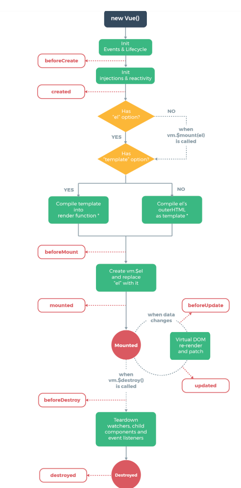
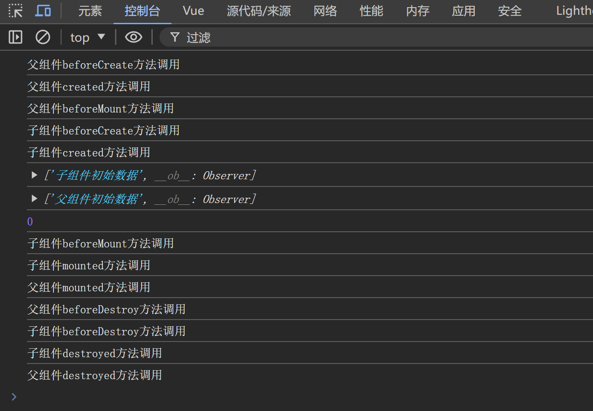
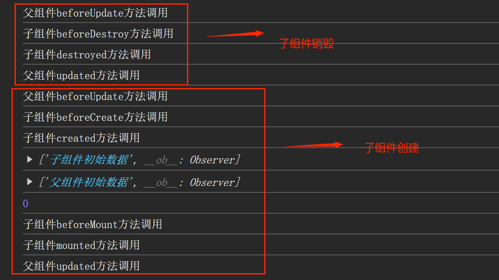
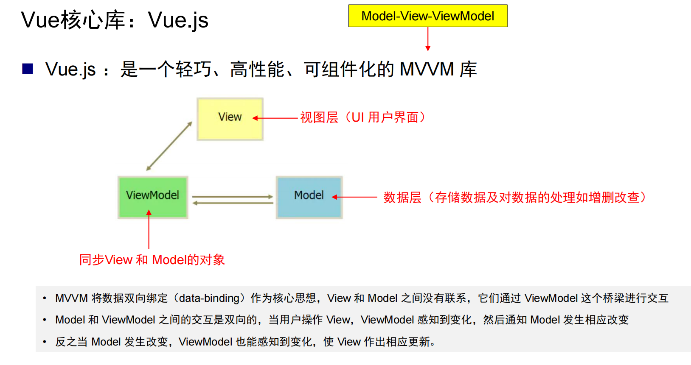
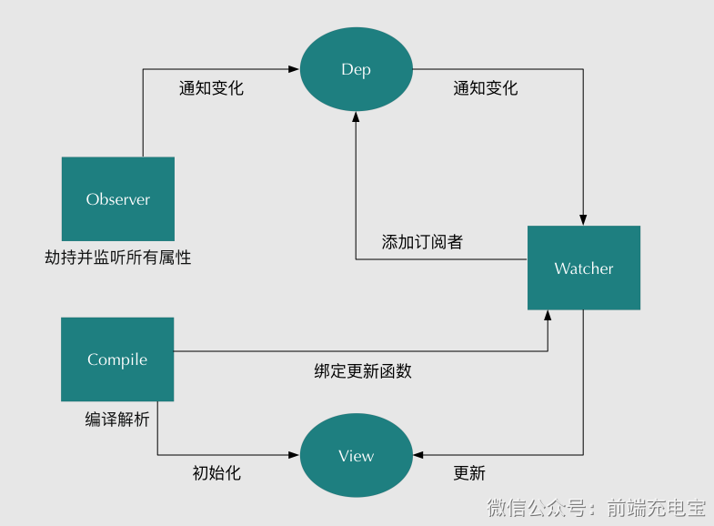
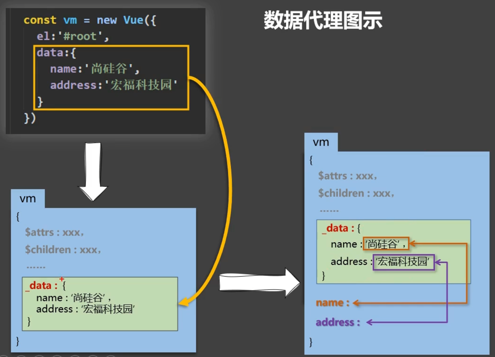

<!--more-->

# 1.Vue 组件生命周期

## Vue 组件生命周期流程

Vue 组件的生命周期包括一系列的钩子函数，这些函数在组件的不同阶段被调用。了解这些生命周期钩子可以帮助你在合适的时机执行特定的操作。



### 创建阶段

1. **`beforeCreate()`**：当组件实例被创建之后，此时数据观测和事件配置都还未进行，例如`watch`事件此时也还未开始监听数据。此时 `data` 和 `methods` 尚不可用。
2. **`created()`**： 组件实例创建完成，数据观测和事件配置已经完成，此时 `data` 和 `methods` 可用。可以在这里进行数据初始化和 API 请求。如果`watch`监听事件使用了`immediate:true`属性，那么`handler`已经调用完成。

### 挂载阶段

1. **`beforeMount()`**: 组件挂载之前调用，此时模板已编译完成，`render` 函数已被调用，Vue 已经生成了组件的虚拟 DOM，但实际的 DOM 元素还没有生成和被插入到页面中。
2. **`mounted`**: 组件挂载完成，此时 真实DOM 已经被插入到页面中。可以在这里进行 DOM 操作、第三方库初始化等操作。

### 更新阶段

1. **`beforeUpdate`**: 数据发生变化后，DOM 更新之前调用。Vue 已经更新了组件的虚拟 DOM，可以在这里进行数据处理或保存当前状态。
2. **`updated`**: DOM 更新完成后调用。可以在这里执行依赖于最新 DOM 状态的操作。

### **销毁阶段**

1. **`beforeDestroy`**: 组件销毁之前调用。可以在这里进行清理操作，如取消定时器、解绑事件监听等。
2. **`destroyed`**: 组件销毁完成后调用。此时组件的所有子组件都已销毁，DOM 也被删除。

**注意点：**

- 创建阶段和销毁阶段是对应的。挂载和更新是类似的，挂载是在组件在创建的时候执行，因为需要将DOM插入到页面中，更新阶段只有新的DOM节点会插入的页面中，已有的DOM节点不会动。
- 渲染包括是指将组件的模板转化为实际的 DOM 元素。这个过程包括生成虚拟 DOM 和最终将其转换为真实的 DOM。因此渲染既存在挂载也存在更新阶段。**渲染并不直接对应钩子函数**。

> https://blog.csdn.net/m0_65335111/article/details/125610342

## 父组件与子组件的生命周期流程

首先以下面代码为例。

<font color='#0077b4'>父组件：</font>

```vue
<template>
  <div class="container">
    <ChildComponent v-if="showComponent" :newArr="arr"></ChildComponent>
    <el-button @click="addData">增加父组件数据</el-button>
    <el-button @click="()=>{showComponent=!showComponent}">控制组件</el-button>
    <el-button @click="()=>{arr.push('newdata')}">更改数组</el-button>
    {{ data }}
  </div>
</template>

<script>
import ChildComponent from './ChildComponent.vue';
export default {
  components:{ChildComponent},
  data() {
    return {
      arr : ["父组件初始数据"],
      data : 0,
      showComponent : true,
    }
  },
  methods:{
    addData(){
      this.data++;
    }
  },
  beforeCreate(){
    console.log("父组件beforeCreate方法调用");
  },
  created(){
    console.log("父组件created方法调用");
  },
  beforeMount(){
    console.log("父组件beforeMount方法调用");
  },
  mounted(){
    console.log("父组件mounted方法调用");
  },
  beforeDestroy(){
    console.log("父组件beforeDestroy方法调用");
  },
  destroyed(){
    console.log("父组件destroyed方法调用");
  },
  beforeUpdate(){
    console.log("父组件beforeUpdate方法调用");
  },
  updated(){
    console.log("父组件updated方法调用");
  },
  deactivated(){
    console.log("父组件deactivated方法调用");
  },
  activated(){
    console.log("父组件activated方法调用");
  },
}
</script>

<style lang="scss" scoped>
.container {
  height: 100vh;
  width: 100vw;
  background: #080E19;
}
</style>
```

<font color='#1677ff'>子组件：</font>

```vue
<template>
  <div class="child-container">
    <el-button @click="addData">增加数据</el-button>
    {{ data }}
  </div>
</template>

<script>
export default {
  props:{
    newArr:{
      type: Array,
      default: ()=>["初始参数"]
    }
  },
  data(){
    return{
      arr:["子组件初始数据"],
      data:0,
    }
  },
  methods:{
    addData(){
      console.log("addData方法")
      this.data++;
    }
  },
  watch:{
    newArr(){
      console.log("监听事件调用")
    }
  },
  beforeCreate(){
    console.log("子组件beforeCreate方法调用");
  },
  created(){
    console.log("子组件created方法调用");
    console.log(this.arr)
    console.log(this.newArr)
    console.log(this.data)
  },
  beforeMount(){
    console.log("子组件beforeMount方法调用");
  },
  mounted(){
    console.log("子组件mounted方法调用");
  },
  beforeDestroy(){
    console.log("子组件beforeDestroy方法调用");
  },
  destroyed(){
    console.log("子组件destroyed方法调用");
  },
  beforeUpdate(){
    console.log("子组件beforeUpdate方法调用");
  },
  updated(){
    console.log("子组件updated方法调用");
  },
  deactivated(){
    console.log("子组件deactivated方法调用");
  },
  activated(){
    console.log("子组件activated方法调用");
  },
}
</script>

<style land="scss" scoped>
.child-container {
  height: 30%;
  width: 30%;
  background: #00b8b8;
}
</style>
```



**组件创建的生命周期如下：**

父组件`beforeCreate`——>（父组件数据和事件开始初始化）——> 父组件`created`——>（此时父组件数据和事件都初始化完成，data数据已经准备好，虚拟DOM开始创建）——> 父组件`beforeMount`——>（虚拟DOM已经创建，页面渲染开始，真实DOM创建并开始挂载到页面，直到渲染到子组件DOM）——> 子组件`beforeCreate`——>（子组件数据和事件开始初始化，包括传递的参数props，初始化的数据watch还没有开始监听）——> 子组件`created`——>（此时子组件数据初始化完成，watch已经开始监听，虚拟DOM开始创建）——> 子组件`beforeMount`——>（虚拟DOM已经创建，页面渲染开始，真实DOM创建并开始挂载到页面）——> 子组件`mounted`——> （子组件挂载完成，返回到父组件继续渲染）——> 父组件`mounted`——>（父组件挂载完成）

<font color='#1677ff'>注意点：</font>

- 销毁周期和创建周期是相同的。组件的创建生命周期是深度优先遍历的顺序，如果子组件还有子组件，会先创建最深层的子组件。 



<font color='#1677ff'>注意点：</font>

- `beforeUpdate`和`updated`生命周期钩子的执行时间和`beforeMounte`和`mounted`是类似的。因此上述流程很好理解了。 
- `beforeUpdate`和`updated`生命周期钩子<font color='#1677ff'>只在页面需要重写渲染的时候才会执行，而与数据变化无关</font>，如果数据改变但不影响页面，页面无需更新，则不会重写渲染。

> 与路由相关的两个是 `activeted` 和 `deactivated` 配合 `keep-alive`，用于组件缓存不销毁时候使用。

## 异步问题对生命周期的影响

在 Vue.js 中，生命周期钩子函数本身是**同步的**，即它们按照特定的顺序执行，并在生命周期的特定阶段被调用。然而，生命周期钩子函数中可以包含异步操作，如数据请求、定时器等。以下是有关生命周期钩子函数的详细信息：

生命周期钩子的同步行为:

- **同步执行**：生命周期钩子函数（如 `created`、`mounted`、`updated` 等）是同步执行的，即它们会按照定义的顺序被调用，并在生命周期的特定阶段完成执行。
- **顺序调用**：Vue.js 会在组件生命周期的不同阶段调用这些钩子函数，从组件实例的创建、挂载到更新和销毁，每个钩子函数都有特定的调用时机。

<font color='#1677ff'>尽管生命周期钩子函数本身是同步的，但可以在这些钩子函数中执行异步操作。这些异步操作不会影响钩子函数的同步执行，但可能会影响组件的状态和视图更新。</font>

### `this.$nextTick()`

当你更新一个响应式数据，Vue 不会立即同步更新 DOM。相反，Vue 会等到事件循环的下一个 "tick" 才执行这些更新，以进行批量处理和优化。`this.$nextTick()` 的作用就是在这个更新完成之后，执行你指定的回调函数。<font color='#1677ff'>使用 `this.$nextTick()` 的关键是确保在需要等待 Vue 更新 DOM 后再执行的场景下使用</font>

**异步执行**：`this.$nextTick()` 的回调函数是异步执行的，因此它不会阻塞主线程。

```vue
<template>
  <div>
    <p ref="paragraph">{{ message }}</p>
    <button @click="updateMessage">Update Message</button>
  </div>
</template>

<script>
export default {
  data() {
    return {
      message: "Hello, Vue!"
    };
  },
  methods: {
    updateMessage() {
      this.message = "Hello, World!";
      this.$nextTick(() => {
        console.log(this.$refs.paragraph.offsetHeight); // 获取的是更新后的 DOM 高度
      });
    }
  }
};
</script>

<style>
/* 样式 */
</style>

```

上述例子如果没有`this.$nextTick()`，当点击按钮后，`this.message` 更新为 "Hello, World!"，但是 `console.log(this.$refs.paragraph.offsetHeight);` 可能获取的是更新前的 `p` 元素的高度，因为此时 DOM 还未更新。

虽然没有使用 `this.$nextTick()`，Vue 仍会更新 DOM，但是在数据更新后立即访问 DOM 时，可能会获取到更新前的状态。使用 `this.$nextTick()` 能够确保你的操作在 DOM 更新后执行，获取到最新的 DOM 状态，从而保证操作的准确性和一致性。

## Vue2/3 生命周期钩子对照表

### 1️⃣ 创建阶段（Creation）

| 阶段含义     | Vue2           | Vue3（Options API） | Vue3（Composition API） |
| ------------ | -------------- | ------------------- | ----------------------- |
| 实例创建前   | `beforeCreate` | `beforeCreate`      | ❌ 无                    |
| 实例创建完成 | `created`      | `created`           | ❌ 无                    |

**关键点**

- `beforeCreate / created` **在 Composition API 中被“setup 取代”**
- `setup()` ≈ `beforeCreate + created`
- 在 `setup()` 中：
  - **能访问 props**
  - **不能访问 this**
  - **响应式系统已建立**

------

### 2️⃣ 挂载阶段（Mount）

| 阶段含义 | Vue2          | Vue3（Options API） | Vue3（Composition API） |
| -------- | ------------- | ------------------- | ----------------------- |
| 挂载前   | `beforeMount` | `beforeMount`       | `onBeforeMount`         |
| 挂载完成 | `mounted`     | `mounted`           | `onMounted`             |

**关键点**

- `mounted / onMounted` 是：
  - **DOM 已经真实存在**
  - 第三方库初始化（ECharts / Map / DOM 操作）的**唯一安全位置**

------

### 3️⃣ 更新阶段（Update）

| 阶段含义   | Vue2           | Vue3（Options API） | Vue3（Composition API） |
| ---------- | -------------- | ------------------- | ----------------------- |
| DOM 更新前 | `beforeUpdate` | `beforeUpdate`      | `onBeforeUpdate`        |
| DOM 更新后 | `updated`      | `updated`           | `onUpdated`             |

**关键点**

- 更新阶段可能触发 **多次**
- `updated` **不要修改会再次触发更新的状态**（否则死循环）

------

### 4️⃣ 销毁 / 卸载阶段（Unmount）

| 阶段含义 | Vue2            | Vue3                                |
| -------- | --------------- | ----------------------------------- |
| 卸载前   | `beforeDestroy` | `beforeUnmount` / `onBeforeUnmount` |
| 卸载完成 | `destroyed`     | `unmounted` / `onUnmounted`         |

**关键点**

- Vue3 用 **Unmount** 代替 Destroy（语义更贴近真实 DOM）
- 清理逻辑：
  - 定时器
  - 事件监听
  - WebSocket
  - 地图 / 图表实例

### Vue3 中 `setup()` 与生命周期的关系：

> **`setup()` 本身就是 Vue3 的“创建阶段”**

对应关系：

```
Vue2:
beforeCreate -> created -> beforeMount -> mounted

Vue3:
setup() -> onBeforeMount -> onMounted
```

示例（Vue3）：

```js
import { onMounted, onUnmounted } from 'vue'

export default {
  setup() {
    // 相当于 beforeCreate + created
    console.log('setup')

    onMounted(() => {
      console.log('DOM ready')
    })

    onUnmounted(() => {
      console.log('cleanup')
    })
  }
}
```

> 生命周期的**阶段和语义保持一致**，但 Vue3：
>
> 1. 用 `setup()` 替代了 `beforeCreate / created`
> 2. 用 `onXxx` 组合式 API 替代选项式钩子
> 3. 将 `destroy` 改为 `unmount`，语义更清晰

# 2. Vue的响应式原理

1. 如何描述Vue采用的MVVM框架？
2. 如何描述Vue2的响应式原理 （流程/数据劫持原理）？
3. 如何描述Vue3的响应式原理 （与Vue2差异 / Proxy / Reflect)？
4. 数据代理的思想？

<!--more-->

> [145_尚硅谷Vue3技术_回顾Vue2的响应式原理_哔哩哔哩_bilibili](https://www.bilibili.com/video/BV1Zy4y1K7SH?spm_id_from=333.788.videopod.episodes&vd_source=ff414aaf189e3a685358d2a984fd4742&p=145)

## 1.MVVM框架



根据MVVM库的特点：

MVVM（Model–View–ViewModel）是一种通过 **ViewModel** 作为中介，实现 **View 与 Model 双向同步** 的设计模式。

- **Model**：数据层，负责数据状态与业务逻辑
- **View**：视图层，负责页面展示
- **ViewModel**：连接 View 和 Model，负责数据同步与视图更新

**在 Vue 中的具体对应**

- **View**：HTML 模板（如 `<input>`、`{{ value }}`）
- **Model**：`data` 中定义的数据对象
- **ViewModel**：`vm = new Vue({...})` 创建的 Vue 实例

先举一个例子

```vue
<template>
	<div id='root'>
        <input v-model="value">
        <p>value的值为 {{value}} </p>
    </div>
</template>
<script>
    new Vue({
        el:"#root",
        data:{
            value:123
        }
    })
</script>
```

在上面这个示例中，当我们在浏览器浏览器输入框修改value的值时，data中的value会同步修改。这是从`view->model`的过程。当data的value一旦被修改，页面就要重新渲染，那么`<p>`中的模板语句被修改。这是`model->view`的过程。

#### 【`view->model`】

当用户在输入框中输入内容时：

1. 用户操作视图（View）
2. **DOM 事件触发**（如 `input` 事件）
3. 事件回调中修改 `data.value`
4. 数据更新完成（Model 被修改）

关键结论

- 这一过程本质是 **DOM 事件监听 + 回调赋值**
- 属于 **浏览器 + JavaScript 的原生机制**
- **不是 Vue 响应式原理的内容**

Vue 在这里只是：

- 通过<font color='#409eff'>**数据绑定**</font>`Data Bingdings`，自动绑定了事件，省去了手写监听与赋值的代码

#### 【`model->view`】

当 `data.value` 被修改后，页面中：

```html
<p>value 的值为 {{ value }}</p>
```

能够自动更新，这一过程才是 **Vue 响应式系统真正解决的问题**。

- Vue 在初始化时，对 `data` 中的数据进行了 **<font color='#409eff'>数据劫持</font>**
- 每个被使用到的数据，都通过 <font color='#409eff'>**发布者–订阅者模式**</font> 与对应的视图更新逻辑建立了关联
- 当数据发生变化时：
  - Vue 内部触发对应的 **更新通知**
  - 相关的视图更新函数被执行
  - 页面完成重新渲染

**用一句话高度总结**

Vue 的双向数据绑定并不是一个统一机制，而是：

- **view → model**：通过 DOM 事件监听实现（JS 原生机制）
- **model → view**：通过数据劫持 + 发布订阅机制实现（Vue 响应式系统核心）

## 2.Vue的响应式原理

Vue 的响应式原理，本质上是：**数据劫持负责“感知变化”，发布–订阅机制负责“通知变化”**两者配合，实现 `model → view` 的自动更新。

- 数据劫持是指：通过拦截数据的读取（get）和修改（set）操作，使系统在数据被访问或变更时能够感知到这一行为，并触发相应的依赖收集或更新逻辑。
- 依赖收集/触发更新（发布者–订阅者模式）： 简单来说，就是发布者发布信号（数据变化），订阅者当信号绑定到自己的方法上。当信号被触发，所有绑定了信号的订阅者都执行，和Qt中的信号与槽机制很像。

当响应式数据发生变化时，数据修改行为会被拦截并感知，随后由依赖系统通知所有依赖该数据的订阅者，订阅者执行各自的更新函数，从而驱动相关视图重新渲染。

Vue2响应式原理的流程图如下：



核心代码(先不看，直接看流程)

```js
function observe(obj) {
  if (obj && typeof obj === 'object') {
    Object.keys(obj).forEach(key => defineReactive(obj, key, obj[key]));
  }
}

// Observer: 负责把对象的属性转为 getter/setter
function defineReactive(obj, key, val) {
  observe(val); // 递归处理嵌套对象
  const dep = new Dep();

  Object.defineProperty(obj, key, {
    get() {
      // 依赖收集
      if (Dep.target) {
        dep.depend();
      }
      return val;
    },
    set(newVal) {
      if (newVal !== val) {
        val = newVal;
        observe(newVal); // 如果赋值对象，继续劫持
        // 通知更新
        dep.notify();
      }
    }
  });
}

// Dep: 管理依赖的容器
class Dep {
  constructor() {
    this.subs = [];
  }
  depend() {
    this.subs.push(Dep.target);
  }
  notify() {
    this.subs.forEach(watcher => watcher.update());
  }
}

// Watcher: 观察者，依赖更新时执行回调
class Watcher {
  constructor(vm, expOrFn, cb) {
    this.vm = vm;
    this.cb = cb;
    this.getter = expOrFn;
    this.get();
  }
  get() {
    Dep.target = this; // 设置当前 watcher
    this.getter.call(this.vm);  // 执行取值，会触发数据的 getter
    Dep.target = null; // 清空，防止污染
  }
  update() {
    this.cb.call(this.vm);
  }
}
```

以上述例子为示例，完整流程如下：

### 【第一阶段：初始化】

第 0 步：在页面渲染之前初始化数据劫持

在实例化 Vue 时，Vue 会遍历 `data` 对象中的所有属性，并使用 `Object.defineProperty` 给每个属性添加 getter 和 setter，当属性被访问，调用`getter`方法， 当属性被修改，调用`setter`方法， 具体细节见下一节。

第 1 步：Compile 解析模板

以模板为例：

```html
<input v-model="msg">
<p>{{ msg }}</p>
```

Compile 在解析模板时，会分别处理不同类型的绑定。

------

第 2 步：处理 `v-model`（双通道中的 view → model）

Compile 遇到：

```html
<input v-model="msg">
```

它会做两件事，这就使**数据绑定**，也是`v-model`的原理。

（1）初始化视图（数据 → 视图）

```js
input.value = vm.msg;
```

（2）绑定 DOM 事件（视图 → 数据）

```js
input.addEventListener('input', e => {
  vm.msg = e.target.value;
});
```

这一过程的性质：

- 属于 DOM 事件监听
- 属于 JavaScript 原生机制
- **不属于 Vue 响应式核心**

到此为止：

- view → model 的通道已建立
- 只是“赋值”，还没有响应式更新

------

第 3 步：Compile 处理插值表达式

Compile 遇到：

```
<p>{{ msg }}</p>
```

此时 Compile 明确两件事：

1. 这个 DOM 节点 **依赖 `msg`**
2. 当 `msg` 变化时，**应该如何更新 DOM**

于是 Compile 生成一个**更新函数**：

```js
function updateText() {
  node.textContent = vm.msg;
}
```

注意：

- 这是一个普通的 JS 函数
- 它不是 DOM 事件
- 它只是“更新逻辑的描述”

------

第 4 步：Compile 创建 Watcher

Compile 将更新函数交给 Watcher：

```js
new Watcher(vm, 'msg', updateText);
```

此时：

- Watcher 内部保存了更新函数
- Watcher 尚未执行更新
- Watcher 需要和数据建立关系

------

第 5 步：Watcher 实例化时完成依赖收集

在 Watcher 构造过程中，会发生一次关键操作，参考**核心代码**：

```js
Dep.target = watcher;
vm.msg;        // 触发 getter
Dep.target = null;
```

结果是：

- `msg` 的 getter 被触发
- `msg` 对应的 Dep 发现当前存在 Dep.target
- Dep 将该 Watcher 收集为自己的订阅者

到此为止：

- 数据知道“谁依赖我”
- Watcher 知道“我依赖哪个数据”
- 依赖关系建立完成
- 页面尚未发生变化

注意：

- 每个数据都有一个Dep容器
- Dep容器存储所有以该数据相关的Watcher
- 一个DOM节点 * 一个数据 =  一个Watcher， DOM节点是订阅者，`msg`是发布者， `msg`修改触发信号， 也就是发布者-订阅者机制已经建立。

### 【第二阶段：运行时】

第 6 步：数据发生变化

```js
vm.msg = 'world';
```

触发 setter：

```js
set(newVal) {
  dep.notify();
}
```

------

第 7 步：Dep 通知所有 Watcher

```js
dep.notify() {
  watchers.forEach(w => w.update());
}
```

------

第 8 步：Watcher 执行更新逻辑

```js
update() {
  this.cb();   // 执行 Compile 创建的更新函数
}
```

------

第 9 步：视图更新

```js
node.textContent = vm.msg;
```

视图更新会重新触发属性的`getter`方法，检测 Watcher 是否已经在 dep 中不会重复添加。

完整流程：

```
【初始化阶段】
Compile
  ↓
生成 DOM 更新函数
  ↓
创建 Watcher
  ↓
Watcher 读取数据
  ↓
数据 getter 收集 Watcher 到 Dep

【运行阶段】
数据被修改
  ↓
setter 触发
  ↓
dep.notify()
  ↓
watcher.update()
  ↓
执行更新函数
  ↓
视图更新
```

### 【数据劫持】

我们分析Vue2中数据劫持的机制。

**`Object.defineProperty`**

在了解数据响应式的原理之前，我们先熟悉`Object.defineProperty`方法。

`Object.defineProperty(obj, prop, descriptor)`是JS中用于为对象添加属性的方法。

- **obj**：要定义属性的对象
- **prop**：要定义的属性名
- **descriptor**：属性描述符（决定属性的行为）

**属性描述符分类两大类**

1. 数据描述符

用于直接定义一个普通属性的值。

```js
Object.defineProperty(obj, "name", {
  value: "Tom",
  writable: true,     // 是否可以修改
  enumerable: true,   // 是否可以枚举（for...in / Object.keys）
  configurable: true  // 是否可以删除或重新定义
});
```

- `value`：属性值
- `writable`：能否修改
- `enumerable`：能否枚举
- `configurable`：能否删除或重新定义属性

2. 存取描述符

通过 getter 和 setter 控制属性访问。

```js
let person = {};
let ageValue = 20;

Object.defineProperty(person, "age", {
  get() {
    console.log("getter 被调用");
    return ageValue;
  },
  set(newVal) {
    console.log("setter 被调用:", newVal);
    ageValue = newVal;
  },
  enumerable: true,
  configurable: true
});

console.log(person.age); // getter 被调用 -> 20
person.age = 30;         // setter 被调用: 30
console.log(person.age); // getter 被调用 -> 30
```

对于Vue的`data`对象，创建一个Observe对象，`data`中的所有属性都会在Observe上创建，并且有`getter`和`setter`方法。将`vm._data = obs`，这样当数据修改时，调用的是`observe`的方法，由`observe`修改`data`的属性值。

```js
function observe(obj) {
  if (obj && typeof obj === 'object') {
    Object.keys(obj).forEach(key => defineReactive(this, key, obj[key]));
  }
}

// Observer: 负责把对象的属性转为 getter/setter
function defineReactive(obj, key, val) {
  observe(val); // 递归处理嵌套对象

  Object.defineProperty(obj, key, {
    get() {
      return val;
    },
    set(newVal) {
      if (newVal !== val) {
        val = newVal;
      }
    }
  });
}

obs = new observe(data)
let vm = {}
vm._data = data = obs
```

### 【局限性】

> [034_尚硅谷Vue技术_Vue监测数据的原理_对象_哔哩哔哩_bilibili](https://www.bilibili.com/video/BV1Zy4y1K7SH?spm_id_from=333.788.videopod.episodes&vd_source=ff414aaf189e3a685358d2a984fd4742&p=34)

1. **不能监听对象属性的新增/删除**

   ```js
   let obj = {};
   Object.defineProperty(obj, "a", { value: 1 });
   obj.b = 2;  // 没有劫持到
   ```

   需要 `Vue.set(obj, 'b', 2)` 来实现。

2. **不能监听数组下标变化**

   ```js
   let arr = [1, 2, 3];
   arr[1] = 99;  // Vue2 监听不到
   ```

   两者都是由于没有`setter`和`getter`方法，无法进行数据劫持。通过以下方式可以解决

   - `this.$set() / Vue.set()`
   - `this.$delete() / Vue.delete()`
   - 使用`push, pop, shift, unshift, splice`

3. **初始化时需要递归遍历**

- Vue2 会在初始化时递归调用 `defineProperty` 劫持所有属性，这对深层嵌套对象性能不好。

## 3.Vue3的响应式原理

首先明确 Vue3 和 Vue2 在**思想层面完全一致**：

- 数据劫持（拦截 get / set）
- 依赖收集
- 触发更新（发布–订阅思想）

但是调用的方法和API不同。但不再有 **Observer / Dep / Watcher** 这些类名；它们被 **Proxy + WeakMap + effect 函数** 替代

Vue 3 使用 Proxy 对对象进行代理拦截：在读取属性时通过 track 完成依赖收集；在修改属性时通过 trigger 触发依赖更新。与 Vue 2 逐属性 defineProperty 不同，Proxy 天然支持新增/删除属性以及更多操作类型，并可采用惰性代理降低初始化成本。

### 【第一阶段：初始化】

第 0 步：在首次渲染之前完成“响应式包装”（Proxy）

Vue 3 中不再是“遍历 data 每个属性 defineProperty”，而是：

- `reactive(data)` 返回一个 Proxy
- Proxy 在 **get / set** 时拦截并执行 `track / trigger`， `track`是依赖收集，`trigger`是依赖触发。

示意：

```js
const state = reactive({ msg: 'hello' });
```

这一步一定发生在首次渲染之前，否则 render 读取数据时无法 track 依赖。

------

第 1 步：模板被编译为 render（概念上对应 Compile 解析）

Vue 3 的 render 大致可以抽象成：

```js
function render() {
  // 读取 state.msg（会触发 Proxy.get -> track）
  input.value = state.msg;
  p.textContent = state.msg;
}
```

真实 Vue 会生成 VNode 并 patch，但不影响响应式因果链。

------

第 2 步：处理 `v-model`（view → model 仍然是 DOM 事件）

- DOM 事件监听属于 JS 原生机制
- Vue 只是在框架层帮你组织好“监听 + 赋值”

等价示意：

```js
input.addEventListener('input', e => {
  state.msg = e.target.value; // Proxy.set -> trigger
});
```

到此为止：

- view → model 通道建立
- 但响应式更新链路要靠下面的 effect 才能自动跑起来

------

第 3 步：创建渲染 effect（等价于 Vue 2 的“创建渲染 Watcher”）

Vue 3 中对应的是：

```js
effect(() => {
  render(); // 首次执行：读取 state.msg -> track 收集依赖
});
```

这一句是 Vue 3 运行时的关键点：

- effect 首次执行 render
- render 内部读取 `state.msg`
- 触发 `Proxy.get` → `track(target, 'msg')`
- 把当前 effect 记录到依赖图 `targetMap` 的对应集合里

到此为止：

- 依赖关系已建立
- **effect 是“订阅者/更新单元”**
- `state.msg` 的依赖集合里已经有这个 effect

------

### 【第二阶段：运行时】

第 4 步：数据发生变化

```js
state.msg = 'world';
```

触发：

- `Proxy.set`
- 进而 `trigger(target, 'msg')`

------

第 5 步：trigger 通知所有依赖该属性的 effect

```js
dep.forEach(eff => eff());
```

这一步等价于 Vue 2 的：

- `dep.notify() -> watcher.update()`

------

第 6 步：effect 重新执行 render，完成视图更新

effect 再次执行：

```js
render(); // 再次读取 state.msg
```

因此：

- 视图更新会再次触发 `Proxy.get`
- 会再次走到 `track`
- 但依赖集合是 `Set`，不会重复添加同一个 effect

结论：

- **getter（Proxy.get）会重复触发**
- **effect 不会重新创建，只会重复执行**
- **依赖不会重复收集（Set 去重）**

------

完整流程（Vue 3 文字版固化）

```
【初始化阶段】
reactive(data) 创建 Proxy
  ↓
编译得到 render（概念上）
  ↓
effect(() => render())  首次执行 render
  ↓
render 读取 state.msg
  ↓
Proxy.get -> track 收集 effect 到依赖图

【运行阶段】
state.msg 被修改
  ↓
Proxy.set -> trigger
  ↓
trigger 找到依赖该 key 的 effects
  ↓
重新执行 effect（不会重新创建）
  ↓
render 再次执行 -> 视图更新
```

### 【`Proxy`和`Reflect`】

`Proxy`和`Reflect`是ES6新增的属性。

调用 `reactive(state)`时

```js
const state = reactive({
  a: { b: { c: 1 } }
})
```

此时发生的事情是：

- 创建了 **state 的 Proxy**
- 内部对象 `a`、`b`、`c` 还是普通对象

Vue 3 不会在创建 `reactive` 时就递归地把所有嵌套对象都变成响应式，而是在“第一次访问某个嵌套对象时”，才对它进行 `reactive` 包装。

**Proxy** 用来创建对象的代理，可以拦截对对象的各种操作。

基本语法

```js
const proxy = new Proxy(target, handler)
```

- **target**：原始对象
- **handler**：一个对象，定义拦截操作（trap）

常用 trap：

| trap           | 作用                              |
| -------------- | --------------------------------- |
| get            | 读取属性时触发                    |
| set            | 修改属性时触发                    |
| deleteProperty | 删除属性时触发                    |
| has            | `key in obj` 时触发               |
| ownKeys        | `Object.keys` / `for...in` 时触发 |

```js
const obj = { a: 10 };
const proxyObj = new Proxy(obj, {
  get(target, key) {
    console.log(`读取属性 ${key}`);
    return target[key];
  },
  set(target, key, value) {
    console.log(`设置属性 ${key} = ${value}`);
    target[key] = value;
    return true;
  }
});

proxyObj.a;      // 读取属性 a
proxyObj.a = 20; // 设置属性 a = 20
```

**Reflect** 提供与对象操作对应的方法，是一种原生的操作封装。它的目的是 **用函数形式实现对象的默认行为**，可以和 Proxy 的 handler 配合使用。

常用方法

| 方法                                      | 对应操作                                     |
| ----------------------------------------- | -------------------------------------------- |
| Reflect.get(target, key, receiver)        | 对象读取属性                                 |
| Reflect.set(target, key, value, receiver) | 对象设置属性                                 |
| Reflect.deleteProperty(target, key)       | 删除属性                                     |
| Reflect.has(target, key)                  | `key in obj`                                 |
| Reflect.ownKeys(target)                   | `Object.keys` / `Object.getOwnPropertyNames` |

```js
const obj = { a: 10 };
const proxyObj = new Proxy(obj, {
  get(target, key, receiver) {
    console.log(`读取 ${key}`);
    return Reflect.get(target, key, receiver); // 默认行为
  },
  set(target, key, value, receiver) {
    console.log(`修改 ${key} = ${value}`);
    return Reflect.set(target, key, value, receiver); // 默认行为
  }
});

proxyObj.a;      // 读取 a
proxyObj.a = 100; // 修改 a = 100
```

使用 Reflect 的好处：将Object,Function所有的操作**统一到了一个对象下面** ，**也统一了操作方式** 。 优化了一些报错，相比于Object代码健壮性更强。

> **整体描述**

Vue 是基于 MVVM 架构实现的渐进式前端框架，其中 Model 负责保存数据和业务状态，View 是模板和最终的 DOM，ViewModel 即 Vue 实例负责把二者连接起来并实现数据与视图的双向绑定。框架通过响应式系统把数据的读写和视图更新耦合起来：在 Vue2 中，框架在初始化时会递归遍历 `data`，对每个属性使用 `Object.defineProperty` 设置 getter 和 setter；在组件渲染阶段执行渲染函数时，读取响应式属性会触发 getter，getter 中利用一个全局指针（`Dep.target`）将当前正在执行的 Watcher（渲染 Watcher、computed 的惰性 Watcher，或用户通过 `watch`/`$watch` 创建的 Watcher）加入该属性对应的依赖管理器 Dep，从而建立“属性 → 订阅者（Watcher）”的关系；当属性被修改时，setter 被触发，调用 Dep.notify 通知所有依赖该属性的 Watcher 去更新。视图到数据的反向链路由模板编译时产生的指令完成，例如 `v-model` 实际上会编译为 `:value="xxx"` 与 `@input="xxx = $event.target.value"`，用户输入触发事件处理器写回数据，写回数据触发 setter，再通过依赖链更新视图。Vue2 中对数组采用覆盖变异方法（如重写 `push`、`splice`）来拦截变更，但不能检测通过下标直接赋值或新增/删除对象属性（需要 `Vue.set`/`Vue.delete`），且初始化时对深层对象的递归劫持开销较大。

为了解决这些局限，Vue3 将响应式内核替换为 `Proxy` + `Reflect` 的实现：`reactive` 返回一个 Proxy，`get`/`set`/`deleteProperty` 等拦截器配合 `track`/`trigger` 在内部维护依赖映射结构 `targetMap`（WeakMap → Map（key → Set(effects)））；当一个 effect（等价于 Vue2 的 Watcher）在执行时读取属性会被 `track` 收集为依赖，写操作或删除操作会通过 `trigger` 找到相关 effect 并重新执行。Proxy 的优点是能拦截属性新增与删除、数组下标与长度变化，并且采用按需（懒）代理嵌套对象以减少初始化开销，从而使得对数组和新增属性的监测更自然、性能更优。

视图更新层面，模板在构建阶段被编译为渲染函数（render），渲染函数执行生成虚拟 DOM（VNode）；响应式变化触发渲染 Watcher / effect 重新执行渲染函数产生新的 VNode，框架通过虚拟 DOM 的 diff 算法比较新旧 VNode 并以最小化的方式 patch 到真实 DOM。为了提高并发修改的性能，Vue 会把多个同步的数据修改合并为一次异步批量更新（维护更新队列并使用微任务/`nextTick` 调度），Vue3 在 diff 的子节点重排上用 keyed 优化和最长递增子序列（LIS）等策略进一步减少 DOM 移动。

总之，Vue 的关键是把数据变动的“通知”链和视图的“渲染”链通过依赖收集连接起来：Vue2 用 `Object.defineProperty` + Dep/Watcher 实现，存在新增/数组索引检测等局限；Vue3 用 `Proxy` + `track/trigger`（基于 WeakMap→Map→Set 的依赖表）解决这些问题并带来性能与语义上的改进；而 `v-model`、computed、watch、渲染队列与虚拟 DOM 则是建立在这套响应式核心之上的常用抽象。

## 4.数据代理

创建一个简单的vue实例时：

```html
<!DOCTYPE html>
<html>
	<head>
		<meta charset="UTF-8" />
		<title>初识Vue</title>
		<!-- 引入Vue -->
		<script type="text/javascript" src="../js/vue.js"></script>
	</head>
	<body>
		<div id="demo">
			<h1>Hello，{{name.toUpperCase()}}，{{address}}</h1>
		</div>

		<script type="text/javascript" >
			Vue.config.productionTip = false //阻止 vue 在启动时生成生产提示。
			//创建Vue实例
			const vm = new Vue({
				el:'#demo', //el用于指定当前Vue实例为哪个容器服务，值通常为css选择器字符串。
				data:{ //data中用于存储数据，数据供el所指定的容器去使用，值我们暂时先写成一个对象。
					name:'atguigu',
					address:'北京'
				}
			})

		</script>
	</body>
</html>
```

- 在命令行终端中，可以通过`vm.name`和`vm.address`来访问数据。

```js
vm.name === vm._data.name
vm.address === vm._data.address
```

- 当修改`vm.name`时，`vm._data.name`会同步修改。

### 理解数据代理

在前面我们说VMMV的 Model 实际上就是`data`属性中是数据，当我们创建一个vue的实例对象的时候。Vue会帮我们将数据进行一些处理。

- 首先将数据从`data`中取出放到`_data`中，并进行数据劫持的相关操作
- 将数据从`_data`中复制了一份在`vm`实例对象上，对 `vm` 实例的属性访问，转发到 `vm._data` 上。**（数据代理）**



> 要注意的是，数据代理的作用是减少代码量，让开发体验更好。与响应式没有关系。

```js
vm.addr === vm._data.addr === vm.data.addr ( === vm.observe.addr)
```


# 3. Vue的模板解析过程

Vue 的核心目标是：**当数据变化时，让视图以尽可能小的代价更新**。
 它靠两套系统配合完成：

- **响应式系统**：决定“什么时候需要更新”（数据变了，谁受影响）
- **渲染系统（VDOM + Diff + Patch）**：决定“怎么更新更省”（只改动必要 DOM）

**一条更新链路（你要记住的主线）**

1. **Template 编译**：`template` / `render` → 生成 `render()` 函数（Vue2 还会生成静态渲染函数数组）
2. **首次渲染**：执行 `render()` → 产出 **VNode 树**（虚拟 DOM）
3. **Patch 挂载**：`patch(oldVnode, vnode)` → 把 VNode 变成真实 DOM 并插入页面
4. **依赖收集**：渲染时读取响应式数据 → 触发 getter → 收集依赖（把“谁用过我”记录下来）
5. **更新触发**：数据变化 → setter 通知依赖 → watcher 入队 → nextTick 统一刷新
6. **Diff + Patch**：新旧 VNode 对比（Diff）→ 只把最小差异同步到真实 DOM

## 1. 从 template 到 render？

### 1.1 为什么要编译？

浏览器看得懂的是 HTML、CSS、JS，但 Vue 的模板里有：

- 插值：`{{ msg }}`
- 指令：`v-if / v-for / v-model`
- 事件：`@click="fn"`
- 动态绑定：`:class="..."`

这些都不是原生 HTML 能直接执行的，所以 Vue 需要把模板**编译成 JavaScript 函数**，渲染时执行这个函数得到“页面结构描述”。

最终产物就是：**render 函数**。

------

### 1.2 编译的 3 步：Parse → Optimize（Vue2）→ Generate

以 Vue2 典型的编译流程为例：

#### (1) Parse：模板 → AST

Vue 会把模板解析成一棵 **AST（抽象语法树）**。

模板：

```
<div id="app">
  <p>{{ msg }}</p>
</div>
```

AST 的直观结构类似：

- div (attrs: id=app)
  - p
    - text( expression: msg )

你可以把 AST 理解为：**“结构化的模板”**，后续所有分析与生成都基于它。

#### (2) Optimize（Vue2 典型）：标记静态节点

Vue2 会标记哪些节点是**静态的**（不依赖响应式数据），例如：

```
<div>
  <span>固定文本</span>   <!-- 静态 -->
  <span>{{ msg }}</span> <!-- 动态 -->
</div>
```

静态节点的好处：更新时不需要重新创建/对比这些部分。

#### (3) Generate：AST → render 代码

Vue 会把 AST 生成一段 JS 代码字符串，再变成真正的函数。

简化理解即可：**模板最终会变成一堆“创建虚拟节点”的调用**，即`render`。

## 2. render ：把数据“算成”虚拟 DOM（VNode）

### 2.1 VNode 是什么？

VNode（Virtual Node）是一个 JavaScript 对象，用来描述一个真实 DOM 节点：

- 标签名：div、p、span……
- 属性：class、style、id……
- 子节点：children
- 文本内容：text
- key：列表对比需要
- elm：对应真实 DOM（patch 后才有）

它不是 DOM，它只是“DOM 的结构描述”。

你可以把 VNode 理解成：

> 用 JS 对象把 DOM 结构表示出来，方便做比较、做更新决策。

------

### 2.2 render 的输出就是一棵 VNode 树

render 的核心逻辑就是：

1. 读取当前数据（msg 等）
2. 返回一棵 VNode 树

它会被不停重复执行：

- 首次渲染：执行一次 render，得到初始 VNode
- 数据更新：再执行一次 render，得到新的 VNode

执行一次 render：

```
const vnode = render.call(vm)
```

得到的是类似这样的对象结构（简化）：

```js
{
  tag: 'div',
  data: { attrs: { id: 'app' } },
  children: [
    {
      tag: 'p',
      children: [
        {
          text: 'hello'
        }
      ]
    }
  ]
}
```

这就是 **虚拟 DOM 树**。

## 3. 首次渲染：VNode 如何变成真实 DOM（挂载 mount）

首次渲染没有“对比”，因为没有旧的 VNode。

流程可以理解为：

1. 执行 render 得到 vnode
2. 用 patch 把 vnode 转成真实 DOM 并插入页面

伪流程：

```
mountComponent():
  vnode = render()
  patch(container, vnode)  // old 是真实 DOM 容器
```

patch 发现 old 是真实 DOM，就会走“创建节点”逻辑：

```
createElm(vnode):
  1) 创建真实元素 element = document.createElement(vnode.tag)
  2) 设置属性、事件
  3) 递归创建 children 并 append
  4) vnode.elm = element
```

最后整棵 VNode 树都对应生成了真实 DOM，并挂载到页面上。

------

## 4. 响应式：为什么“改数据”会触发重新渲染？

这里你要抓住一个关键概念：

> Vue 不会盲目地在任何数据变化时重渲染整个应用
>  它会记录“渲染依赖了哪些数据”，只在这些数据变化时更新。

### 4.1 Vue2 响应式的本质：getter 收集依赖，setter 通知更新

Vue2 用 `Object.defineProperty` 给数据的每个属性加 getter/setter：

- **getter**：在渲染过程中读取数据时触发，用来“收集依赖”
- **setter**：数据被修改时触发，用来“通知依赖更新”

渲染时发生了什么？

- render 执行时会读取 `this.msg`
- 读取触发 getter
- getter 把“当前正在渲染的 watcher”记到依赖列表里

数据变化时发生了什么？

- `this.msg = 'new'`
- 触发 setter
- setter 通知依赖列表里的 watcher：你该更新了

------

## 5. 为什么不是立刻更新：调度队列与 nextTick

如果你连续改多次数据：

```
this.msg = 1
this.msg = 2
this.msg = 3
```

如果每次 setter 都立即渲染，会导致 3 次 render + 3 次 DOM 更新，浪费。

Vue 的做法：

1. setter 通知 watcher 更新，但**不立刻执行**
2. watcher 进入一个队列（去重）
3. 在同一轮事件循环末尾统一 flush（常见是微任务）
4. 只执行一次渲染，最终结果就是 `msg=3`

这就是你常听到的：

- **异步更新队列**
- **nextTick**（DOM 更新完成后执行回调）

> 总结：Vue 把多次状态变化合并成一次渲染刷新。

------

## 6. 更新阶段：新旧 VNode 为什么要 Diff？

当数据变化后，渲染 watcher 会触发一次重新渲染：

1. 执行 render 得到 **newVnode**
2. 旧的 vnode 还在：**oldVnode**
3. 对比 oldVnode 与 newVnode 得到差异
4. 把差异最小化应用到真实 DOM

这个对比过程就是 **Diff**，实际应用过程就是 **Patch**。

------

## 7. Diff 的基本原则

### 第一步：判断是不是“同一个节点”

Vue 在比较两个虚拟节点时，**永远先做这一件事**：

> 这两个节点，是否可以视为“同一个节点”？

判断标准并不复杂，核心只关心：

- 标签名是否相同（div 和 span 不是同一个）
- key 是否相同（列表中尤其重要）
- 节点类型是否一致（普通节点、文本节点、注释节点）

**判断结果只有两种**

情况 1：不是同一个节点

如果 Vue 认为它们不是同一个节点：

- 旧节点对应的真实 DOM **直接删除**
- 新节点 **重新创建真实 DOM**
- 新 DOM 替换到原位置

**这一分支不会再继续 Diff 子节点**，到此结束。

------

情况 2：是同一个节点

如果 Vue 认为它们是同一个节点：

- 旧节点对应的真实 DOM 会被 **复用**
- 进入下一步：**比较节点内部的变化**

这一步的意义在于：
 **尽量复用已有 DOM，而不是销毁重建。**

------

### 第二步：比较节点自身的变化

当确定是“同一个节点”后，Vue 会比较这个节点**本身是否发生变化**。

主要检查三类内容：

1. 文本是否发生变化

如果节点是文本节点：

- 旧文本和新文本相同 → 什么都不做
- 不同 → 直接修改 `textContent`

这是最简单、最便宜的一类更新。

------

2. 属性是否发生变化

如果是普通元素节点，Vue 会比较：

- class
- style
- 普通属性（id、title、data-* 等）
- DOM 属性（value、checked 等）

Vue 会：

- 新的有、旧的没有 → 添加
- 旧的有、新的没有 → 删除
- 两边都有但值不同 → 更新

注意一点：

> Vue **不会整体清空再重设属性**，而是逐项对比、最小修改。

------

3. 事件监听是否变化

对于事件（如 click）：

- 新旧回调函数相同 → 不处理
- 不同 → 移除旧监听，绑定新监听

完成这一步后，节点“自身”已经同步完成。接下来才是最复杂、也是最关键的一步。

------

### 第三步：比较子节点（children）

如果一个节点有子节点，Diff 才真正进入“复杂阶段”。

这里 Vue 的核心思路是：

> **只比较同一层级的子节点，不跨层比较。**

也就是说：

- 父节点不变 → 比较 children
- 父节点变了 → 整棵子树直接替换，不再深入

- children（最复杂）

------

## 8. children 的 Diff：Vue2 最经典的“同层双端比较”

如果一个节点有子节点，Diff 才真正进入“复杂阶段”。

这里 Vue 的核心思路是：

> **只比较同一层级的子节点，不跨层比较。**

也就是说：

- 父节点不变 → 比较 children
- 父节点变了 → 整棵子树直接替换，不再深入

------

### children 的比较过程

在比较子节点时，Vue 不会做“全局最优匹配”，而是遵循以下原则：

1. 优先处理**最容易判断的情况**
2. 尽量复用已有节点
3. 只有在必要时才创建、删除或移动 DOM

整个过程可以理解为 **从两端向中间收缩的比较过程**。

------

### children Diff 的具体步骤

设想有两组子节点：

- 旧子节点列表：oldChildren
- 新子节点列表：newChildren

Vue 会维护四个位置：

- 旧列表的开始位置
- 旧列表的结束位置
- 新列表的开始位置
- 新列表的结束位置

接下来会不断重复下面的判断流程。

------

#### 第一步：比较“开头节点”

- 比较旧列表开头 和 新列表开头
- 如果是同一个节点：
  - 复用真实 DOM
  - 更新该节点
  - 两个指针同时向后移动

这种情况非常常见，比如列表尾部追加内容。

------

#### 第二步：比较“结尾节点”

- 比较旧列表结尾 和 新列表结尾
- 如果是同一个节点：
  - 复用真实 DOM
  - 更新该节点
  - 两个指针同时向前移动

这种情况常见于列表头部插入内容。

------

#### 第三步：判断是否发生了“位置交换”

如果前两步都不成立，Vue 会尝试：

- 旧列表开头 和 新列表结尾
- 旧列表结尾 和 新列表开头

如果其中某一对是同一个节点，说明：

> 节点只是换了位置，并不是新增或删除。

此时 Vue 会：

- 复用该节点对应的真实 DOM
- 把 DOM 移动到正确的位置
- 调整指针，继续比较

------

#### 第四步：通过 key 查找可复用节点

如果以上情况都不成立，Vue 会进入“查找阶段”。

此时 Vue 会：

1. 建立一张映射表
   - key → 旧节点在列表中的位置
2. 取当前新节点的 key 去映射表中查找

查找结果分两种

##### 找不到

说明这是一个全新的节点：

- 创建新的真实 DOM
- 插入到当前应在的位置

##### 找到了

说明这是一个可以复用的旧节点：

- 复用旧节点的真实 DOM
- 更新节点内容
- 把该 DOM 移动到新的正确位置
- 标记旧位置已被处理

------

### 比较结束后的收尾工作

当新列表或旧列表其中一个已经处理完时：

#### 如果新列表还有剩余节点

说明这些节点是新增的：

- 逐个创建真实 DOM
- 按顺序插入

#### 如果旧列表还有剩余节点

说明这些节点在新列表中已不存在：

- 逐个删除对应的真实 DOM

------

## 9. key 的意义：为什么不用 key 会“错乱”？

### 9.1 key 决定“节点身份”

Diff 需要知道：

> 这个 newVnode 对应的是旧的哪个 vnode？

key 就是身份证。

- key 相同：认为是同一节点（可以复用 DOM 和组件实例）
- key 不同：认为是不同节点（可能需要新建/替换）

### 9.2 不写 key 或用 index 当 key 的风险

如果你不写 key，或用 index 当 key：

- Vue 可能按位置“就地复用”
- 当你在列表头部插入一个元素时：
  - 原来的第 0 个 DOM 会被复用给新数据第 0 个
  - 原来的第 0 个数据对应的 DOM 实际变成第 1 个……
- 结果：输入框值串、组件状态串、动画错乱

所以博客里可以给结论：

- 列表可变（增删改排序）必须用稳定唯一 key（id）
- 只有纯展示、永不重排时才可能用 index（但也不推荐）

**节点身份 = tag + key**

key 决定的是：

- 是否复用 DOM
- 是否复用组件实例
- 是否保留内部状态

### 9.3 v-if 中使用 key

由于 Vue 会尽可能高效地渲染元素，通常会复用已有元素而不是从头开始渲染。因此当使用 v-if 来实现元素切换的时候，如果切换前后含有相同类型的元素，那么这个元素就会被复用。如果是相同的 input 元素，那么切换前后用户的输入不会被清除掉，这样是不符合需求的。因此可以通过使用 key 来唯一的标识一个元素，这个情况下，使用 key 的元素不会被复用。这个时候 key 的作用是用来标识一个独立的元素。

```
<input v-if="isLogin">
<input v-else>
```

表面上你以为：

- isLogin = true → 第一个 input
- isLogin = false → 第二个 input
- 它们是“两个不同的 input”

但在 Vue 的 Diff 眼里：

- 标签名：都是 `input`
- 没有 key
- 位置相同

于是 Vue 判断：

> “这是同一个节点，只是条件不同。”

实际行为是：

- 真实 DOM 的 `<input>` **不会被销毁**
- 只会复用原来的 `<input>` DOM 节点
- 改变的是它的属性或绑定关系

现在加上 key：

```
<input v-if="isLogin" key="login">
<input v-else key="register">
```

key 在 Diff 中的真正含义

key 告诉 Vue 的不是“这是 input”，而是：

> “这是 **哪个 input**。”

于是 Diff 判断变成：

- 标签名：都是 input
- 但 key 不同

Vue 会立刻得出结论：

> “这不是同一个节点。”

------

Vue 的行为随之改变

切换时会发生：

1. 旧 input 对应的真实 DOM 被销毁
2. 新 input 创建一个**全新的 DOM 节点**
3. 新 DOM 没有任何历史状态
4. 输入框自然是空的

------

## 10. Patch：把差异同步到真实 DOM 的具体动作

当 Diff 确认要更新时，patch 会做几类操作：

1. **更新属性**
   - class/style/attrs/domProps
2. **更新事件**
   - 新增监听、移除旧监听、替换回调
3. **更新文本**
   - `textContent` 替换
4. **更新 children**
   - 执行上面那套列表 Diff
   - 需要时移动真实 DOM 节点（insertBefore）

> Patch 的目标不是“重建 DOM”，而是“复用旧 DOM，做最小修改”。

------

## 11. 用一张“全流程图”收束（建议放博客里）

你可以用这种文字流程图收尾：

```
Template
  ↓ 编译（parse/optimize/generate）
render()
  ↓ 执行 render
VNode Tree（虚拟 DOM）
  ↓ patch（首次：createElm）
Real DOM

数据变化
  ↓ setter trigger
watcher 入队（去重）
  ↓ flushSchedulerQueue（批处理）
重新执行 render()
  ↓ 得到 newVNode Tree
Diff(oldVNode, newVNode)
  ↓ patch（最小更新）
更新 Real DOM
```

## `nexttick`的原理

### 1. 核心前提：为什么说“数据更新是异步的”

Vue3 里你改了响应式数据，并不会立刻操作 DOM。原因是性能：

- 同一轮同步代码里可能连续改很多次状态
- Vue 会把这些变化合并起来
- 在合适的时机只做一次 DOM patch（批量更新）

所以这里的“异步”更准确的意思是：

> DOM 更新不会在每次 set 后立刻发生，而是被调度到当前同步代码结束之后统一执行。

------

### 2. 触发更新：数据变化后发生了什么

当你执行：

```
state.xxx = newValue
```

内部发生的关键步骤是：

1. 响应式系统触发依赖（effects / watchers）
2. 与该状态相关的“组件更新函数”（组件的 render effect）会被标记为需要更新
3. 这个组件更新函数不会立刻执行，而是被放进 **更新队列 job queue**
4. 如果这是本轮第一次入队，Vue 会安排一次 **微任务**，用于稍后执行 flush

到这里为止：

- DOM 还没更新
- nextTick 的回调也不会执行
- 只是“入队 + 预约一次统一更新”

------

### 3. 谁安排微任务，微任务里做什么

Vue 在“第一次有更新任务入队”时，会做一件事：

- 通过 `Promise.resolve().then(...)` 安排一个微任务
- 在这个微任务里执行 `flushJobs`

可以把它理解为：

> 第一个进入更新队列的更新任务，负责“预约”一次 flush。

同一轮同步代码里无论你改多少次状态，都只会预约一次 flush（避免重复 patch）。

------

### 4. flush 阶段是什么：Vue 的“统一执行更新”过程（关键）

flush 是 Vue 内部的一次集中处理流程，它做两类事：

### 队列 A：更新队列（job queue）

里面放的是：组件更新任务（render effect）/ 某些 watcher job

### 队列 B：post-flush 回调队列

里面放的是：`nextTick` 回调、`watch(..., { flush: 'post' })` 等需要在 DOM 更新后执行的回调

------

### 5. flush 内部的固定顺序（你最关心的 nextTick vs patch）

flushJobs 在微任务中执行时，顺序是固定的：

#### 第一步：执行更新队列（产生 patch）

对每个需要更新的组件：

1. 重新执行 render，生成新的 VNode
2. diff 新旧 VNode
3. **patch DOM**（真正修改 DOM）

这一步完成后：DOM 才是最新的。

#### 第二步：执行 post-flush 队列（nextTick 回调）

然后再执行：

- `nextTick(cb)` 注册的 cb
- 以及 flush:'post' 的 watcher 回调

所以顺序非常硬：

> 先 patch DOM，后执行 nextTick 回调。

这就是 nextTick 能保证“拿到更新后的 DOM”的原因。

------

### 6. 把整个时间线串起来

1. 我修改响应式数据后，Vue 不会立即更新 DOM，而是把组件更新任务放进更新队列，目的是把同一轮里的多次变更合并起来。
2. 第一次有更新任务入队时，Vue 会用 Promise 安排一个微任务，在微任务里触发 flushJobs。
3. 当当前同步代码执行完、调用栈清空后，事件循环开始执行微任务，进入 flush 阶段。
4. flush 阶段里，Vue 先把更新队列里的组件更新任务依次执行，完成 render、diff，并最终 patch DOM。
5. DOM patch 完成后，Vue 再执行 post-flush 队列，也就是 nextTick 注册的回调。
6. 因此 nextTick 能严格保证回调发生在 DOM 更新之后，而不是数据刚改完的同步阶段。

# 4.基础扩展

## 【computed 内部机制】

> - computed 计算属性如果被访问，但 getter 的依赖没有修改，会触发 getter 吗？
> - 当依赖修改，但是computed 计算属性并没有被使用，会触发 getter 吗？

都不会！

`computed` 是带缓存的派生状态，只有当 getter 依赖的响应式数据发生变化并且访问计算属性时，getter 才会重新执行。

以 **Vue.js** 为例（Vue 2 / Vue 3 思想一致）：

1. **首次访问**
   - 执行 `getter`
   - 收集依赖（依赖的响应式数据）
   - 计算结果
   - **缓存结果**
   - 标记为 `dirty = false`
2. **依赖未变化，再次访问**
   - 不执行 `getter`
   - **直接返回缓存值**
3. **依赖发生变化**
   - 不会立刻重新计算
   - 只会把计算属性标记为 `dirty = true`
4. **下次再次访问**
   - 因为 `dirty = true`
   - 才重新执行 `getter`
   - 更新缓存

**关键点：计算是“惰性”的（lazy）**

```javascript
访问 computed
↓
dirty ?
  ├─ false → 直接用缓存
  └─ true  → 执行 getter → 更新缓存
```

