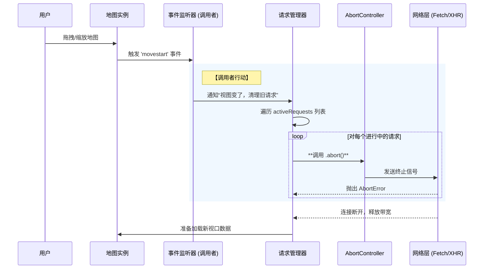

# 个人项目与技术笔记

## 个人介绍

##### 走航车实时可视化平台

**S（情境）**走航车在行驶过程中会持续采集多种气体数据。前端需要把车辆轨迹以及气体分析结果以地图和图表结合的方式实时展示出来。但实际场景中，数据链路存在抖动、延迟甚至短暂中断，容易导致页面展示不连续、轨迹更新不稳定。

**T（任务）**我主要负责前端实时可视化模块的设计，重点解决实时链路不稳定带来的渲染异常问题，保障展示的连续性、稳定性和可用性。

**A（行动）**在实现上，我搭建了基于 `WebSocket + OpenLayer地图 + Echart图表` 的实时可视化链路：通过设计数据缓冲、重连恢复、异常兜底和渲染分离控制的一套完整的机制，提升高频数据场景下页面更新的稳定。

**R（结果）**最终通过弱网测试和异常情况的测试，在链路存在抖动的情况下，页面的稳定更新。

##### 能源数据分布可视化系统

**S（情境）**该项目需要面向全球尺度展示能源分布数据，数据量大，前端在数据加载、地图渲染和图表更新上都面临较大的性能压力。

**T（任务）**我主要负责前端二维地图可视化，需要在大规模数据场景下保证系统的流畅性和稳定性，以及瓦片数据加载的安全性保证。

**A（行动）**围绕地图瓦片安全加载、从资源加载，网络请求还有页面渲染角度进行了针对性优化，降低大数据场景下的前端性能压力。

**R（结果）**最终项目能够较稳定地支撑全球尺度能源数据的展示需求，在大规模数据场景下仍保持较好的流畅性和可用性。

##### 软件漏洞检测客户端系统

**S（情境）**该项目是基于 Python 和 Qt 开发的软件漏洞检测的客户端系统。

**T（任务）**我全程参与该项目，负责从需求分析、系统架构设计到具体开发以及后续验收部署的整体推进。

**A（行动）**在项目中，我从前期需求分析入手，参与客户端整体架构设计和功能模块梳理，完成相关工具接入与结果展示实现，并持续跟进后续验收和部署工作，推动项目从设计、开发到交付形成完整闭环。

**R（结果）**最终项目顺利完成交付。

##### 实习经历

**S（情境）**在实习期间，参与企业官网 2.0 建设。对首屏加载速度、SEO 工程化和可维护性有较高要求，。

**T（任务）**我主要参与前端架构设计、产品需求对接、具体开发实现。

**A（行动）**我参与了官网 2.0 的前端架构设计和需求落地，基于 Nuxt 完成页面开发，利用其混合渲染能力和性能优化策略优化首屏展示，元信息管理、结构化输出等方向构建 SEO 工程化建设。

**R（结果）**目前官网已经成功上线。

## 清华走航车可视化平台详解

### 项目核心场景

走航车上的传感器按一定频率采集空气中各类气体数据，服务端将最新数据实时推送给前端，前端需将气体浓度变化和车辆行驶轨迹渲染，来实现一个类似监控大屏的功能。

#### 一个重难点：实时链路不稳定的解决方案

##### 实时链路不稳定的三类问题拆分

1. 数据源本身不稳定：采集侧异常，表现为部分气体字段缺失、车辆暂停采集、数据库某时间段无新数据写入，核心问题是**前端不能默认收到的数据一定完整、连续、可直接渲染**。所以前端需要先做数据规范化处理，保证图表和地图在“数据不完整”的情况下仍然能够稳定展示。
2. `WebSocket`链路不稳定：传输侧异常，表现为网络抖动导致连接断开、连接“假活”（表面正常但无法接收数据）、断线期间数据堆积，核心问题是需对`WebSocket`进行生命周期管理，鉴权、心跳、超时检测、异常关闭识别、重连策略以及对堆叠的数据进行清理。
3. 数据到达顺序不稳定：时序异常，表现为旧数据晚到、数据包乱序、重连补发时历史数据与最新数据交错，核心问题是**前端消费数据时不能按“到达顺序”处理，而必须按“业务时间顺序”处理**。因此前端需要基于时间戳做排序、去重、补齐和状态推进。

##### 五层设计思路（解决链路不稳定问题）

我先围绕这三类问题分别调研了常见的处理方案，，而是设计了一套从数据规范化、连接生命周期管理、时间驱动同步、断线补偿到乱序处理的完整机制，去保证实时数据链路在异常场景下仍然是可理解、可恢复、可控制的。

> 我当时主要受到了两类思路的启发。一类是 WebSocket 生命周期管理，也就是连接建立之后，不能只监听 `onmessage`，而要把鉴权、初始化同步、心跳检测、异常关闭、重连和资源清理都纳入统一管理。另一类是 TCP 可靠传输的思想，比如顺序、确认、补偿这些机制。虽然业务层不是在实现 TCP，但它让我意识到实时链路治理的核心，不只是“连上了”，而是要让数据传输过程尽量做到有序、可确认、可补偿。

###### 第一层：数据规范化

**解决的问题是：数据能不能被前端稳定统一处理。**

我首先处理的不是 WebSocket，而是数据本身。因为如果后端返回的数据结构不稳定，比如有时候字段缺失、有时候字段名变化、有时候空值直接省略，那么前端后面的缓存、补全、排序、渲染都会变得非常复杂。

**所以我先推动前后端把数据结构做规范化**，核心原则有三个：

第一，每条数据都必须带完整时间戳；
 第二，每条数据都保留完整的气体字段结构，没有值时显式返回 `null`，而不是直接省略字段；
 第三，数据结构本身保持稳定，不因为采集异常改变字段形态。

这样做之后，前端就可以基于统一的数据模型去解析数据，明确区分“这个字段为空”和“这个字段不存在”两种情况，后续无论是做空值展示、异常提示，逻辑都会清晰很多。

**最终效果**就是：即使采集数据不完整，图表和地图可以统一的处理数据。

###### 第二层：构建稳健的 WebSocket 生命周期

**解决的问题是：链路能不能持续、异常能不能被感知和恢复。**

在链路层面，我没有把 WebSocket 当成一个简单的“建立连接然后监听 `onmessage`”的工具，而是把它当成一个完整的状态机去管理。

我把它拆成五个阶段：

第一是**连接建立**，用于创建实时通信通道；
 第二是**鉴权**，确保只有鉴权成功之后才进入实时推送状态；
 第三是**初始化同步**，也就是连接建立后，服务端先返回一份最新数据，给前端一个明确的同步基准；
 第四是**心跳检测**，用于识别假活连接，因为浏览器里 `readyState = OPEN` 并不代表链路真的可用；
 第五是**重连机制**，通过指数退避去控制重连节奏，避免网络异常时无脑高频重连。

**最终效果**就是：前端能更准确地区分权限问题、网络问题和服务端异常，链路稳定性会明显提升。

###### 第三层：基于 时间驱动同步机制

**解决的问题是：前端如何知道自己同步到哪里了。**

这是我觉得比较核心的设计点。
 我没有按照“消息到一条处理一条”的思路来做，而是引入了两个时间变量来管理同步状态：

- `lastTime`：表示前端已经确认消费完成的最后一个时间点
- `currentTime`：表示当前服务端感知到的最新时间点

这样做的好处是，前端不再只是“收到了什么就画什么”，而是始终知道自己当前处理进度和服务端最新进度之间的差距。

比如在首次连接时，服务端鉴权通过后会先返回数据库里的最新数据，把这个时间戳作为当前同步基准。前端先写入缓冲区，消费完成后再更新 `lastTime`，这样链路从一开始就是“有时间锚点”的，而不是在未知状态下启动。

另外，如果一段时间内数据库没有新数据写入，服务端会明确告诉前端当前是“无新采集数据”，而不是让前端误以为链路坏了。这样就能把“没数据”和“链路断了”区分开。

**最终效果**就是：前端能准确掌握数据同步进度，链路状态判断会更清晰，也为后面的补偿和乱序处理提供了统一基准。

###### 第四层：断线补偿机制

**解决的问题是：断线期间漏掉的数据怎么办。**

断线之后，数据库里的数据其实可能还在持续增长。
 如果重连后只拿最新值，中间这一段数据会直接丢失；但如果把断线期间所有数据一次性全量补回来，又可能导致前端瞬间塞入大量点位，引发图表卡顿、轨迹跳变。

所以我设计的是一个**有条件补全**的机制。

具体做法是：
 重连成功后，我会先计算 `currentTime - lastTime`。如果这个差值超过设定阈值，比如 5 秒，就说明中间存在数据缺口，需要进入补偿流程。
 这时不是服务端盲目推送，而是客户端主动把自己的 `lastTime` 和 `currentTime` 发给服务端，告诉服务端“我已经消费到哪里了，现在最新到哪里了”，请求补充这中间的缺失数据。

服务端按这个时间区间返回数据后，前端先放入缓冲区，做排序和顺序消费，再更新本地的 `lastTime` 和 `currentTime`。当确认补偿完成后，再切回实时状态。

同时我还设置了**最大补偿阈值**，比如 5 分钟。超过这个阈值就不再补全，而是保留断点。

这样做的原因有两个：
 一是时间跨度太大时，补数据本身会带来明显的重绘压力，影响体验；
 二是业务上也不一定要求绝对连续，保留断点反而更能真实反映链路中断。

**最终效果**就是：系统在短时间断线后可以平滑恢复，不丢关键数据；而在长时间异常时，又能避免为了“强行补齐”把前端拖垮。

###### 第五层：乱序处理

**解决的问题是：收到的数据不一定能立刻直接渲染。**

链路恢复、补发、网络延迟都会导致一个问题：
 数据的到达顺序不一定等于真实的业务时间顺序。

如果前端按接收顺序直接渲染，图表会出现曲线跳动，地图轨迹会出现回退，用户看到的就不是“真实时间线”，而是“网络传输顺序”。

所以我加了一层按时间戳管理的缓冲区。
 新数据进入后不会立刻渲染，而是先进入缓冲区，按时间戳排序，再按顺序消费。

插入策略上我做了分级处理：

- 如果时间戳大于当前最大值，就直接插到队尾
- 如果时间戳小于当前最小值，说明是过旧数据，直接丢弃
- 如果时间戳落在中间，就插入对应位置，保持整体有序

这样一来，前端最终渲染时遵循的是**真实时间顺序**，而不是网络到达顺序。

**最终效果**就是：图表曲线不会乱跳，地图轨迹不会回退，整个实时展示更稳定，也更符合业务语义。

#### 第二个重难点：实时数据场景下的渲染优化设计

因为走航车数据是持续上报的，前端一边要更新气体浓度图表，一边要更新地图上的轨迹、点位和车辆位置。如果把“收到数据”和“触发渲染”直接绑定，那么在高频或者突发数据场景下，主线程压力会很大，容易出现图表抖动、地图拖拽卡顿，甚至某一时刻因为集中渲染导致掉帧。

所以这个问题的本质，其实是一个**生产者-消费者节奏不一致**的问题：

- `WebSocket` 持续收数，是生产者；
- 图表和地图持续展示，是消费者。

生产者的数据到达节奏可能是突发的、抖动的、不均匀的；
 但浏览器的渲染节奏是按帧调度的，相对稳定。
 如果让生产者直接驱动消费者，就会导致渲染频率失控。

##### 优化方案：缓冲区 + `requestAnimationFrame`（rAF）分帧消费

核心思路：数据到达后不立即渲染，先进入缓冲区，再由`requestAnimationFrame`按浏览器渲染节奏统一消费，拆分数据处理和渲染调度两个层面。

1. 数据处理层：`WebSocket`收到数据后，仅执行数据解析、规范化、时间排序/去重、写入缓冲区，不触发任何UI更新，只负责“收”和“存”；
2. 渲染调度层：通过`requestAnimationFrame`建立渲染循环，每一帧从缓冲区中取一部分数据，批量更新到图表和地图，控制单帧处理量，避免一次性处理过多数据。

核心优势：让浏览器按自身绘制节奏更新页面，而非被`WebSocket`消息频率牵着走，实现渲染节奏可控。

##### 为什么选择`requestAnimationFrame`而非“来一条渲染一条”

`requestAnimationFrame`的天然优势的：

1. 与浏览器绘制节奏一致，浏览器准备重绘前才执行回调，适合视觉更新，避免无效渲染；
2. 可将多条数据合并到一次渲染中，减少图表和地图的刷新频率，降低主线程压力；
3. 便于控制掉帧风险，单帧处理数据量可控，不会因短时流量暴涨导致页面卡死。

核心思想：将“消息驱动渲染”改为“帧驱动渲染”，实现渲染节奏的可控性。

##### 缓冲区的核心作用：解耦与削峰填谷

1. 解耦数据处理和渲染：让`WebSocket`接收逻辑无需关心图表渲染时机，渲染逻辑无需关心数据到达时间，降低模块耦合度；
2. 削峰填谷：当数据突然集中到达时，缓冲区先存储数据，再由渲染层按帧逐步消费，避免瞬时卡顿，实现数据流与渲染帧率的平滑连接。

### 问题剖析

#### 1.技术选型及依据

主要看四点：
 **第一是是否匹配业务场景，第二是性能是否能支撑实时可视化，第三是工程稳定性和可维护性，第四是是否满足合规和数据安全要求。**

##### `WebSocket`

因为这个项目本质上是一个持续采集、持续上报、前端持续展示的实时监测场景，如果用 HTTP 轮询，会有很多无效请求，延迟也不可控。

`WebSocket` 原生支持双向通信，服务端可以主动推送数据，更适合走航车这种实时数据流场景；同时它去掉了重复的 HTTP 头部开销，在持续通信下性能也更好。

 另外，这个项目里链路稳定性是重点，所以我也看重它可以配合心跳、保活和重连机制，方便我做完整的实时链路治理。

##### 地图选型：`OpenLayers`（排除`Leaflet`、谷歌地图、百度/高德地图）

1. 排除`Leaflet`：过于轻量，仅适合简单标记展示，涉及多坐标系切换、复杂WMS图层控制、高精度绘图编辑时，需引入大量补丁插件，导致系统稳定性不可控，类比为“自行车”，而项目需要“工程卡车”级别的地图支持；
2. 排除谷歌地图：服务器在海外，直接使用违反《测绘法》和数据安全法规，且国内访问极不稳定（需翻墙），不符合合规性和可用性要求；
3. 排除百度/高德地图：虽为国产，但服务协议通常包含数据回传条款，项目涉及敏感地理信息（如化工厂分布、水源地位置），甲方（政府/国企）要求数据本地化闭环，因此不可选；
4. 选择`OpenLayers`：支持多坐标系切换、复杂图层控制、高精度绘图，无需大量插件，稳定性强，可实现数据本地化，符合项目合规性和功能需求。

知识点对应问题：项目为什么选择`OpenLayers`作为地图组件？排除其他地图组件的原因是什么？

##### 图表选型：`ECharts`

因为这个项目的图表不是静态报表，而是高频实时更新的监测曲线，所以我重点看的是实时更新能力和大数据渲染能力。
 `ECharts` 默认基于 `Canvas`，对大数据量和实时场景有比较成熟的优化手段，比如**增量更新、采样、large 模式**等，比较适合这种持续刷新的折线图展示。

另外它的**图表类型比较丰富，生态也成熟**，后续无论是做多气体指标联动，还是和地图做协同展示，扩展成本都比较低。

#### 2.指数退避重连策略

为了避免网络异常或服务端短时不可用时，客户端出现高频无效重连，我采用了**指数退避重连**策略。

具体设置是：

- 初始重连间隔为 **1 秒**
- 后续按指数增长：**1s、2s、4s、8s、16s、32s**
- 最大重连间隔封顶为 **60 秒**
- 最大重连次数为 **10 次**

如果重连次数超过 10 次，或者已经进入 60 秒封顶间隔后仍然无法恢复连接，就不再继续无意义重试，而是让系统进入**降级状态**，提示用户当前实时链路不可用。

这样设计的目的有两个：

第一，**短时网络抖动时可以快速恢复**；
 第二，**持续异常时避免频繁重连给服务端和客户端都带来额外压力**。

------

更严谨一点的代码写法

```js
let reconnectCount = 0;
const maxReconnectCount = 10;
const maxReconnectInterval = 60000; // 60s
let reconnectTimer = null;

function reconnect() {
  if (reconnectCount >= maxReconnectCount) {
    console.log("重连次数达到上限，进入降级状态");
    return;
  }

  const interval = Math.min(2 ** reconnectCount * 1000, maxReconnectInterval);

  reconnectTimer = setTimeout(() => {
    reconnectCount++;
    initWebSocket();
  }, interval);
}

function resetReconnectState() {
  reconnectCount = 0;
  if (reconnectTimer) {
    clearTimeout(reconnectTimer);
    reconnectTimer = null;
  }
}
```

#### 3.`WebSocket`断开判断及重连依据

在这个项目里，我判断 `WebSocket` 是否断开，主要是依赖 **`onclose` 事件**，因为它能明确告诉我连接已经结束，并且会提供 `code`、`reason` 和 `wasClean` 这些信息，足够支撑后续决策。

我**不会把 `onerror` 作为重连依据**，因为 `onerror` 更像一个错误预警信号，它只能说明“连接过程或传输过程中出问题了”，但通常拿不到足够的上下文信息，也不能准确区分到底是网络抖动、握手失败、服务端异常，还是业务侧主动拒绝。所以真正决定“要不要重连”的，还是 `onclose`。

我的处理原则是：

- **网络类异常关闭，可以重连**
- **权限类、协议类、业务拒绝类关闭，不重连**
- **正常主动关闭，不重连**

比如：

如果是 **1006**，通常表示异常断开，比如断网、链路中断、服务端异常退出，这种情况我会触发指数退避重连；
 如果是 **1000**，说明是正常关闭，比如用户离开页面、主动退出实时页面，这种情况不重连；
 如果是 **4001** 这类 token 过期，或者 **4003** 这类无权限关闭，本质上都属于业务拒绝，这时候继续重连没有意义，应该停止重连并提示用户重新登录或检查权限；
 如果是客户端协议错误、数据格式错误导致服务端关闭连接，这类也不应该盲目重连，而应该先修正问题，否则只会反复失败。

##### `onerror` 和 `onclose` 的区别

`onerror` 更像是“**过程里出了问题**”。
 它说明连接建立或数据传输过程中发生了异常，但它不等于连接一定已经彻底断开，而且浏览器给到的信息通常非常少，往往没有明确的错误码和原因，所以它不适合直接拿来做重连决策。

`onclose` 更像是“**连接已经结束了**”。
 它代表这条 WebSocket 生命周期已经走到了关闭阶段，并且会带上关闭状态码、关闭原因以及是否正常收尾的信息，所以它才是我判断是否要重连的主要依据。

你可以把它理解成：

- `onerror` 是“警报”
- `onclose` 是“结论”

所以项目里我的策略是：
 **`onerror` 只做日志记录和异常监控，`onclose` 才做重连分流。**

##### 更推荐的状态码分类说法

我一般会这样分：

**可重连的：**

- `1006`：异常断开，通常是网络或链路问题
- `1011`：服务端内部异常，可以限频重试

**不重连的：**

- `1000`：正常关闭
- `4001`：token 过期
- `4003`：无权限/权限失效
- `4100`：客户端协议错误
- 其他明确的业务拒绝码

##### 一段更顺的口语版

> 我在项目里判断 WebSocket 是否需要重连，主要看 `onclose`，而不是 `onerror`。因为 `onerror` 只能说明过程里出错了，但信息太少，没法支撑重连决策；真正能说明“连接已经结束，并且为什么结束”的是 `onclose`。
>  我会根据 close code 来分流：像 `1006` 这种网络类异常会做指数退避重连；像 `4001` token 过期、`4003` 权限失效这种业务类关闭，就不会重连，而是直接提示用户处理；正常关闭 `1000` 也不重连。核心思路就是，不是断了就重连，而是先判断这次断开是不是可恢复的。

#### 4. JWT校验的流程是什么？

1️⃣ JWT 的结构是什么

JWT 本质上是一个由三部分组成的字符串：

```
Header.Payload.Signature
```

- **Header**：说明使用的签名算法（如 HS256、RS256）
- **Payload**：存放用户身份信息和声明（如 userId、权限、过期时间 exp）
- **Signature**：对前两部分的签名结果，用于防篡改

------

2️⃣ 服务端是如何校验 JWT 的

当客户端携带 JWT 请求接口或建立 WebSocket 连接时，服务端会做三步校验：

（1）校验签名是否正确（最核心）

- 服务端使用**同一套密钥（或公钥）**
- 对 `Header + Payload` 重新计算签名
- 与 Token 中的 Signature 比对
- **一致 → Token 未被篡改**

👉 这一步解决的是：**“这个 Token 是不是伪造的”**

------

（2）校验 Token 是否过期

- 读取 Payload 中的 `exp` 字段
- 判断当前时间是否超过过期时间

👉 这一步解决的是：**“这个身份现在还有效吗”**

------

（3）校验业务相关声明（可选）

- 是否有访问某接口的权限
- 是否符合当前用户状态（如被禁用）

👉 这一步解决的是：**“这个用户现在还能不能用这个权限”**

#### 5.双token的设计思路

我这里说的双 token，一般指的是 **短期访问 token（Access Token）+ 长期刷新 token（Refresh Token）**。

它的核心思路是：用短 token 负责日常接口访问和 WebSocket 鉴权，降低泄露风险；用长 token 负责在短 token 过期后换发新 token，减少用户频繁登录。

##### 1. 整个双 token 流程是什么样的

###### 第一步：登录

用户登录成功后，服务端会同时返回两类 token：

- **access token**：短期有效，给前端日常请求使用
- **refresh token**：有效期更长，只在 access token 失效时使用

前端拿到之后，会分别按约定方式保存。

------

###### 第二步：正常访问

在正常请求阶段：

- **HTTP 请求**：请求头里携带 access token
- **WebSocket 连接**：握手阶段或鉴权消息里携带 access token

也就是说，**真正高频使用的是 access token**，refresh token 平时不参与业务请求。

------

###### 第三步：access token 过期

当前端发现 access token 过期时，不会立刻要求用户重新登录，而是进入刷新流程：

1. 前端拦截到接口返回的未授权状态，比如 401，或者 WebSocket 收到 token 失效的关闭码；
2. 暂停后续依赖鉴权的请求；
3. 使用 refresh token 调用专门的刷新接口；
4. 服务端校验 refresh token 是否有效；
5. 校验通过后，返回新的 access token，很多系统也会顺便轮换 refresh token；
6. 前端更新本地 token，再把刚才失败的请求重试一次，或者重新建立 WebSocket 连接。

------

###### 第四步：refresh token 也失效

如果 refresh token 本身也失效了，比如：

- 超过有效期
- 服务端主动吊销
- 用户被强制下线
- 多端登录策略触发失效

那这时就不能再刷新 access token 了，前端会：

- 清空本地登录态
- 停止自动重试
- 跳转登录页或提示用户重新登录

##### 2. token 过期后的处理是什么

这个问题我一般会分成两种情况回答。

###### 第一种：access token 过期

这是最常见的情况。

我的处理方式是：

- **HTTP 场景**：由响应拦截器捕获 401 或业务码中的“token expired”
- **WebSocket 场景**：由 `onclose` 或业务消息识别 token 过期，比如服务端返回 4001

然后统一进入 refresh 流程，刷新成功后：

- HTTP 请求重放
- WebSocket 重新连接并重新鉴权

这里要注意两个点：

**第一，刷新动作要串行化。**
 不能多个请求同时发现 token 过期，就同时去刷新，否则会产生并发刷新问题。通常只允许第一个请求去刷新，其他请求先挂起等待。

**第二，刷新失败就要立即降级。**
 不能无限刷新，否则会形成死循环。

###### 第二种：refresh token 过期

这种情况说明整个登录态已经失效。
 这时前端不会再尝试自动恢复，而是直接让用户重新登录。

因为 refresh token 本身就是最后一道“自动续期”的凭证，它也失效了，就说明必须重新建立身份状态。

##### 3. 长短 token 的时间一般怎么设置

这个要看业务安全级别，但常见思路是：

- **access token**：短，一般是 **15 分钟到 2 小时**
- **refresh token**：长，一般是 **7 天到 30 天**，有些系统会更长

如果是安全要求更高的系统：

- access token 会更短，比如 15~30 分钟
- refresh token 也可能配合设备、IP、登录来源一起校验

如果是普通业务系统，通常会把体验放宽一些。

------

##### 4. token 的保存和管理怎么做

这个问题面试里很关键，不能只说“放 localStorage”。

###### access token 怎么保存

更推荐的做法是：

- **以内存为主**
- 必要时配合短期持久化

因为 access token 使用频率高，但安全敏感度也高。
 如果纯放 `localStorage`，虽然方便，但更容易受到 XSS 影响。

所以工程上常见做法有两种：

**做法一：**

- access token 放内存
- 页面刷新后通过 refresh token 重新换取新的 access token

**做法二：**

- access token 放安全性更高的受控存储方案里
- 结合较短过期时间使用

###### refresh token 怎么保存

refresh token 一般不建议给 JS 随意读写。
 更安全的方式是：

- **放在 HttpOnly Cookie**
- 并且配合 `Secure`、`SameSite` 等策略

这样前端 JS 读不到 refresh token，可以降低 XSS 下被直接窃取的风险。

##### 5. 在 WebSocket 场景里怎么处理

因为你这个项目有 WebSocket，所以这块最好单独补一句。

我的做法一般是：

- WebSocket 建连时使用当前有效的 access token 鉴权
- 如果连接过程中 token 过期，服务端主动关闭连接并返回明确状态码，比如 4001
- 前端识别到这是 token 过期，不盲目重连，而是先走 refresh 流程
- refresh 成功后，再重新建立 WebSocket 连接
- refresh 失败则停止重连，提示重新登录

也就是说：

> **WebSocket 的自动恢复前提，不是先重连，而是先恢复鉴权状态。**

##### 6. 一段更顺的口语版

> 双 token 一般就是 access token 加 refresh token。access token 有效期短，负责平时接口请求和 WebSocket 鉴权；refresh token 有效期长，负责在 access token 过期后换发新的 access token。
>  正常情况下，前端只会频繁使用 access token；如果接口返回 401，或者 WebSocket 因 token 过期被服务端关闭，前端就会用 refresh token 去调用刷新接口。刷新成功后更新本地 token，再重试原请求或者重建 WebSocket；如果 refresh token 也失效了，就清空登录态，要求用户重新登录。
>  在存储上，我倾向于 access token 放内存或短期受控存储，refresh token 放 HttpOnly Cookie，这样可以在安全性和用户体验之间做平衡。

#### 6.心跳机制

> 建立 WS 后我会启动一个定时器，每隔 N 秒发一个 ping 心跳包。服务端返回 pong（或任何业务消息也算），我就更新 `lastPongAt`。如果连续多个周期没收到任何消息，判定连接假死，主动 `close()`，进入指数退避重连。
>
> 我这里心跳不是设得特别激进，一般会放在 **30 秒一次**。因为走航车本身就有持续数据上报，心跳更多是为了兜底检测“假活连接”，不是代替业务消息本身。
>  如果发送心跳后在 **8 到 10 秒** 内都没有收到响应，我就认为链路已经不可用，主动断开并触发指数退避重连。

##### 1.自定义心跳机制怎么实现

为什么要自定义

浏览器 WebSocket API **没有协议级 ping/pong**接口，连接可能出现“假活”：页面显示 OPEN，但服务端/链路已断，数据不再更新。所以需要应用层心跳来做**存活探测 + 超时判定**。

前端实现核心逻辑（3 件事）

1. **定时发 ping**
2. **收到任何消息就更新 lastSeen**
3. **超时则 close 并触发重连**

**流程：**

1. **握手阶段携带 JWT** → 服务端校验签名/exp/权限，通过才升级连接
2. 连接建立后：
   - 前端定时发 `ping`
   - 服务端回 `pong`
3. 服务端在处理心跳时顺带做两件事（至少做其一）：
   - **检查 token 是否过期**（exp）
   - **检查实时权限是否仍开启**（can_visit_realtime）
4. 一旦发现 token 失效/权限关闭：
   - 服务端返回一条“鉴权失败/无权限”消息并 close
   - 或直接 close（带 reason/code）
5. 前端收到：
   - 如果是权限/过期关闭：**不重连**，提示重新登录
   - 如果是网络异常：**指数退避重连**


#### 7.高频渲染的问题

##### `requestAnimationFrame`（rAF）与掉帧问题的关系

核心结论：`rAF`本身不解决掉帧问题，但它是构建高性能动画（渲染）的基石。

`rAF`的核心价值：与浏览器渲染周期严格同步，让开发者能在受控的、每帧一次的时机里，精确安排渲染工作，避免无效渲染。

掉帧的本质：若在`rAF`回调中执行的逻辑耗时超过16ms（浏览器60fps的单帧时长），仍会出现掉帧，`rAF`的“诚实性”会倒逼开发者优化逻辑、控制耗时。

避免掉帧的正确做法：以`rAF`作为调度入口，而非直接在回调中堆砌逻辑；在回调内做时间切片，优先保证高优任务（如地图、图表渲染）；结合节流、分片、GPU加速等手段，确保单帧逻辑总耗时小于16ms。

知识点对应问题：`rAF`能直接解决掉帧问题吗？其核心价值是什么？如何利用`rAF`避免掉帧？

##### `requestAnimationFrame`回调的执行流程和机制

每帧调用的完整流程（按顺序）：

1. 开始新的一帧；
2. 执行待处理的宏任务（如`setTimeout`、`setInterval`回调）；
3. 执行所有微任务（如`Promise.then`、`queueMicrotask`回调）；
4. 执行`rAF`回调队列（核心阶段，此时浏览器即将进行渲染准备）；
5. 浏览器进行渲染准备，依次执行样式计算（Style）、布局（Layout / Reflow）、绘制（Paint）、合成（Composite）；
6. 将最终画面提交给GPU显示（与VSync同步，保证画面流畅）。

关键说明：`rAF`回调执行在微任务之后、渲染准备之前，确保回调中的渲染逻辑能在当前帧生效，避免帧丢失。

知识点对应问题：`rAF`回调的执行流程是什么？其执行时机在浏览器渲染周期的哪个阶段？

##### 高频数据优化：超过30条/s的数据处理方案

1. 智能降采样（`Adaptive Downsampling`）：引入`LTTB`算法，根据地图缩放级别动态保留关键特征点（如波峰、波谷），既保证曲线形态不失真，又将渲染性能提升10倍以上；

`LTTB`算法核心逻辑：通过保留数据中的关键极值点，剔除冗余数据，在不影响视觉效果的前提下，减少渲染的数据量，适合高频时序数据的图表优化。

2. 地图聚类（`cluster`算法）：对地图上的大量点位进行聚类处理，缩放级别较高时显示单个点位，缩放级别较低时显示聚类后的聚合点，减少地图渲染的点位数量，降低重绘压力。

知识点对应问题：当数据频率超过30条/s时，采用了哪些优化手段？`LTTB`算法的核心作用是什么？

##### `rAF` 能否解决掉帧问题、页面抖动问题？

**不能直接“解决”掉帧，但可以显著降低因为更新时机不合理导致的掉帧和抖动。**

更准确地说，`requestAnimationFrame` 的价值是：
 它把你的视觉更新放到**浏览器下一次重绘之前**执行，所以比 `setTimeout`、`WebSocket 来一条渲染一条` 更适合做动画和高频 UI 更新。

它能改善的问题主要有两类：

###### 第一类：更新时机不对造成的抖动

比如你来一条数据就立刻改 DOM、改图表、改地图，这些更新可能发生在浏览器一帧中的任意时刻，容易造成：

- 同一帧里做了多次重复更新
- 一会儿更新图表，一会儿更新地图，节奏不一致
- 数据突发时，某一时刻集中触发大量渲染

这时用 `rAF` 可以把这些更新统一收敛到“下一帧一起做”，页面会更平滑。

###### 第二类：无效渲染过多

`rAF` 可以把多次状态变化合并到一次可视更新里，减少不必要的重绘次数。

##### 如果 `rAF` 的耗时超过了 16ms，对后面的任务影响是什么？

这个问题很重要。

> 如果某一帧的 `rAF` 回调执行太久，超过了这一帧的时间预算，就会导致后续绘制延迟，表现为掉帧、卡顿，后面的任务也会被整体往后推。

**1. 当前帧来不及渲染，直接掉帧**

本来应该这一帧显示的内容，只能推迟到下一帧甚至下下帧。这一帧本来应该在屏幕下一次刷新前准备好并显示出来，但因为主线程工作做太久了，浏览器没能按时把这一帧送去绘制和显示。

**2. 后面的主线程任务都会被阻塞**

JS 是单线程的。
 只要你的 `rAF` 回调还没执行完，后面的很多任务都要等，包括：

- 后续的事件响应
- `setTimeout` 回调
- 其他 JS 任务
- 浏览器渲染流程

#### 8. 你做出哪些测试

测试重点在于链路不稳定

这个项目里，我的测试重点主要放在**实时链路不稳定场景**，因为这个系统的核心风险不在静态展示，而在于数据流持续进入时，前端能不能稳定接收、正确处理和持续渲染。

我主要做了四类测试：

**第一类是弱网测试。**
 我会用浏览器 `DevTools` 模拟不同网络条件，比如增加延迟、降低带宽、模拟网络波动，去观察在弱网环境下 WebSocket 是否会出现断连、假活、重连延迟变大，以及图表和地图更新是否出现明显卡顿。
 同时我也会结合 `performance.now()` 去记录一些关键时间点，比如消息到达延迟、重连耗时、从断开到恢复的总耗时，用来判断这套链路恢复机制是否有效。

**第二类是采集暂停测试。**
 也就是模拟走航车在一段时间内停止写入数据。
 这个测试的重点不是看“有没有报错”，而是看前端能不能正确区分这是“当前没有新采集数据”，还是“链路已经断了”。
 因为如果区分不清，用户很容易把正常的采集空窗误认为系统故障。

**第三类是数据不完整测试。**
 我会模拟部分气体字段缺失、整条数据中某些字段为空，或者某个时间窗口内数据不完整的情况。
 重点验证的是前端的数据规范化逻辑是否稳定，比如能不能正确处理 `null`、图表是否会按预期断点显示、页面会不会因为字段缺失直接异常。

**第四类是断网和乱序测试。**
 断网测试主要看 WebSocket 是否能被正确感知、是否能按预设策略重连，以及断线恢复后补偿逻辑是否正常。
 乱序测试主要是模拟旧数据晚到、补发数据和实时数据交错到达，验证缓冲区排序、去重和按时间顺序消费是否生效，避免图表跳动、地图轨迹回退。

#### 9.数据规范化处理

如果走航车没有新的数据，图表需要保留五分钟的时间

A. 窗口内完全无数据（首次 5 分钟为空）

```
if (this.gasdata.length === 0 && this.isIntialization) {
  this.gasdata.unshift({ time: this.begin_time, ...allNull })
  this.gasdata.push({ time: this.end_time, ...allNull })
}
```

**效果：**

- 曲线为空（值为 null 不绘制）
- 时间轴仍按 5 分钟窗口显示并持续移动
- 可配合 UI 提示“无数据 / 离线”

**解决问题：**

- 最近 5 分钟无数据，但时间轴仍需推进

------

B. 窗口内有数据，但时间跨度不足 5 分钟（缺头 / 缺尾）

先判断首尾时间差：

```
const timeDiff = date2 - date1
if (timeDiff === 300000) return
```

不足 5 分钟时：

**① 补尾（对齐 end_time）**

```
if (last.time < this.end_time) {
  this.gasdata.push({ time: this.end_time, ...allNull })
}
```

**② 补头（对齐 begin_time = end_time - 5min）**

```
if (first.time > this.begin_time) {
  this.gasdata.unshift({ time: this.begin_time, ...allNull })
}
```

**效果：**

- 始终得到严格 5 分钟窗口
- 只补边界，不补中间

**展示语义：**

- 中间缺点但两端有值 → 趋势连续
- 边界为 null → 明确表达缺失 / 断流边界

> 核心优势：**最小化补点数量**，避免补满 300 个 null 带来的数据膨胀与重绘成本。

## 能源数据分布可视化系统

### 项目核心场景

这是一个**面向全球尺度的清洁能源开发潜力评估系统**，核心需求是把全球范围内的能源分布数据以地图方式做高性能可视化展示。项目里既有大规模栅格数据，也有少量需要交互的矢量数据，所以前端不仅要把地图“显示出来”，还要解决两个很现实的问题：**一是私有能源数据安全加载，二是全球尺度下地图如何保证性能和交互稳定性。** 这也是这个项目的核心价值。

#### 一个重难点：瓦片数据私有化的实现方案

这个项目里的能源热力数据不是公开底图，而是带业务价值的私有数据。
 如果直接把瓦片 URL 暴露给浏览器去加载，默认方式只能 `img.src = url`，没法携带自定义鉴权信息，这就会带来两个问题：

- 第一，**无法对每个瓦片请求做权限控制**；

- 第二，即使用户拿到了 URL，也可能绕过页面直接去请求数据。

> **私有地图数据如何在前端按需加载的同时，仍然保证访问安全。**

项目里最终采用的是 **TileWMS + 重写 `tileLoadFunction` + 前后端双重校验** 的方案

##### 重写 `tileLoadFunction`，解决“瓦片请求如何携带鉴权”的问题

OpenLayers 默认的瓦片加载方式，本质上是直接把 URL 赋给图片元素。
 这种方式虽然简单，但问题也很明显：**不能自定义请求头**，也就没法把 token 放到瓦片请求里。

所以我这里没有用默认加载逻辑，而是重写了 `tileLoadFunction`，改成用 `fetch` 主动请求瓦片，在请求头里携带 token，然后再把响应转成 `Blob`，通过 `URL.createObjectURL` 转成临时地址赋给瓦片。这样就把原本“不可控的浏览器原生图片请求”，变成了“可控的带鉴权请求”。

**最终效果**就是：每一个瓦片请求都能携带鉴权信息，前端不再只是“显示地图”，而是对私有瓦片加载链路具备了控制能力。

所以在这一层，我会重点补两个工程细节：

- 第一，**响应失败要有明确兜底**，比如权限不足、token 过期、网络异常时，不能直接地图空白，而是要有占位和错误处理；

- 第二，瓦片响应转成 `Blob URL` 之后，会占用浏览器内存，所以在瓦片卸载时要做 `URL.revokeObjectURL`，避免长期使用后内存不断增长。这个点在材料里也明确提到了。

#### 第二个重难点：大规模数据场景下的性能优化设计

全球尺度下，栅格数据量大、交互频繁，前端如何把加载、请求、渲染、交互这几层的性能都控制住。

所以我后来把性能问题拆成了：

**资源层、请求层、渲染交互层、应用层。**

##### 第一层：资源层优化 —— 用 LOD 和瓦片化控制“单次加载成本”

我首先处理的是资源本身的体量问题。

这个项目里采用的是**瓦片化 + LOD 分级**。

也就是低缩放级别只提供低分辨率数据，高缩放级别再加载高分辨率瓦片，而不是所有层级都给同样精度的数据。材料里明确提到，LOD 的核心就是根据 zoom 加载不同分辨率的瓦片

##### 第二层：请求层优化

地图类系统里，很多性能问题其实不是渲染本身，而是请求没有治理好。
 所以这部分我重点做了三件事：

###### 1）请求缓存

相同位置、相同参数的点击查询，不必重复请求，直接返回缓存结果。材料里也给了 `Map + timestamp` 的缓存方案。

###### 2）请求去重

如果同一时间来了多个完全一样的请求，不要真的发多次，而是只发一次，其余复用同一个 Promise。这样能避免请求堆积和响应顺序错乱。

###### 3）请求取消

如果用户快速点击多个不同位置，旧请求其实已经过期了。这时通过 `AbortController` 取消旧请求，只保留最新请求，避免旧结果覆盖新结果。

**最终效果**就是：前端不会被高频交互带入“重复请求—堆积—过期结果覆盖”的恶性循环，请求层会更稳定。

##### 第三层：渲染职责拆分

我在这个项目里不会让一个图层承担所有职责，而是做了明确拆分：

- **栅格图层**承载大规模能源热力数据；
- **矢量图层**只承载少量需要交互的要素；
- 弹窗作为 DOM 层独立处理。

通过GPU渲染优化，将渲染更新放在合成层， tranform/opacity/will-change。

##### 第四层：应用层

**第一，监听具体属性，而不是深度监听整个大对象。**
 比如地图状态、图层配置、弹窗状态这类数据，如果直接对整个对象做深度 `watch`，每次局部变化都可能触发整块逻辑重新执行。
 所以我会尽量只监听真正会影响 UI 的关键字段，比如缩放级别、图层显隐、选中要素 id，而不是监听完整对象，减少无效响应式更新。

**第二，拆分更新链路，避免长任务。**
 我会把一次大的状态更新拆成更小的步骤，避免在同一个事件回调里同时做数据处理、地图更新、弹窗定位和 DOM 计算。
 这样做的目的，是把单次主线程任务控制得更短，避免因为一个长任务阻塞后续交互和渲染。

**第三，结合 `performance` 做监控和验证。**
 我会通过 `performance.now()` 去测量关键逻辑的耗时，比如视图变化后的处理时间、弹窗定位更新耗时、请求返回到页面渲染的时间差。

如果发现某一段逻辑明显偏长，就继续拆分或限频，避免它演变成持续性的长任务。

### 问题剖析

#### 1.每一张瓦片都要通过JWT鉴权，他的性能能保证吗？你考虑过其他更优的方法吗？ 

这个问题我确实考虑过。
 **如果每一张瓦片请求都完整走一次 JWT 校验，性能一定会有额外开销**，因为全球地图场景下瓦片请求量很大，缩放和平移时会短时间产生很多并发请求。
 所以我的理解不是“JWT 鉴权完全没成本”，而是要看**这个成本是否可控，以及有没有配套优化手段**。

在我们这个项目里，之所以还能接受，主要有三个原因：

**第一，JWT 校验本身是轻量的。**
 它不是去查数据库拿 session，而主要是做签名校验、过期时间校验和权限判断。如果服务端实现得比较轻，这个单次开销通常比数据库型会话校验小很多，所以在工程上是可承受的。

**第二，请求虽然多，但不是所有瓦片都一直重新校验。**
 因为地图场景里会叠加多层缓存：

- OpenLayers 自身会复用已加载瓦片
- 浏览器会复用 HTTP 缓存
- 服务端或代理层也可以做瓦片缓存

也就是说，真正会打到后端并触发鉴权的，并不是用户看到的每一块瓦片每次都重新来一遍。命中缓存后，请求压力会明显下降。

**第三，我们的项目优先级里，数据安全本身就是硬约束。**
 因为这里不是公开底图，而是私有能源数据，所以相比“绝对最省性能”，我们更优先保证“每次数据访问都可控、可鉴权”。在这个前提下，再去做缓存和请求优化。

##### 另一个方案：短时效签名 URL 或临时访问凭证

也就是用户先通过一次受控接口拿到一个**短时有效的瓦片访问凭证**，比如带签名的临时 URL，后续瓦片请求不再每次都带 JWT，而是带这个短时票据。

这样做的好处是：

- 减少每个瓦片请求都重复校验 JWT 的成本
- 更容易走 CDN 或静态缓存
- 对高频瓦片场景更友好

但它也有代价，就是：

- 凭证签发和失效机制会更复杂
- 如果权限模型很细，票据粒度不好设计
- 短时 URL 泄露窗口期内仍然可用

所以它更适合“权限模型相对稳定、访问时效短”的场景。

#### 2.分层渲染的意义是什么

这样做的价值主要体现在四个方面。

**第一，资源和显示层面，可以实现动态 LOD。**
 像这个能源项目里，全球热力数据本身适合放在栅格层，通过 TileWMS 加载；而且不同缩放级别下，不需要始终加载同样精度的数据，所以可以结合缩放级别做动态 LOD：低 zoom 加载低分辨率瓦片，高 zoom 再逐步切到高分辨率数据。这样能把“显示精度”和“加载成本”分开控制，而不是所有层级都用最高精度去硬扛。

**第二，性能维度上，可以隔离重负载，保障流畅度。**
 如果把大规模热力数据、矢量要素、点击交互、弹窗定位全压在同一层里，地图一缩放、一平移，就会同时触发大量重绘和计算，页面很容易卡。
 所以项目里才会强调“栅格承载大数据，矢量只承载交互”，本质上就是把重负载和轻交互拆开：
 栅格层负责大范围展示，矢量层只放少量交互对象，DOM 弹窗再单独处理。这样每一层的负担更明确，缩放和平移时整体会更稳。 

**第三，交互维度上，可以做到更精准的拾取与事件响应。**
 如果所有内容都堆在一个层里，点击拾取会变得很混乱，既不容易判断命中了谁，也不方便做高亮、显隐和事件分发。
 而分层之后，矢量层可以专门承载监测点、区域边界这类需要点击和高亮的对象，事件命中会更准确，交互响应也更可控。
 同时图层层级也更好管理，哪些层可点击、哪些层只负责展示，边界会更清楚。 

**第四，工程维度上，有利于解耦、复用和维护。**
 分层渲染不是单纯的性能技巧，它本质上也是一种工程设计。
 当栅格层、矢量层、弹窗层职责清晰之后，后续你要改单独某一层，比如替换热力瓦片、调整交互要素样式、优化弹窗定位，都不需要把整套地图逻辑一起推翻。
 这会让代码结构更清晰，模块复用性更高，后期维护和扩展也更容易。

#### 3.请求取消 请求去重你是如何实现的？

##### 1. 请求去重是怎么实现的

请求去重解决的是：

> **同一时间，相同参数的请求不要发多次。**

我的做法是维护一个 **`pendingRequests` 的 Map**，key 是请求的唯一标识，value 是当前正在执行的 Promise。

流程是这样的：

1. 发请求前，先根据请求参数生成一个唯一的 `cacheKey`
2. 去 `pendingRequests` 里查这个 key
3. 如果已经存在，说明同样的请求正在进行，就直接复用这个 Promise，不再重新发请求
4. 如果不存在，才真正发起新请求，并把 Promise 放进去
5. 请求结束后，不管成功还是失败，都在 `finally` 里把这个 key 删除

这样可以保证：

- 同一时刻相同请求只会发一次
- 多个调用方拿到的是同一份结果
- 不会因为重复点击导致服务器收到很多一模一样的请求

你可以简化理解成：

> **请求去重是“同一个请求只发一次，其余人复用结果”。**

------

##### 2. 请求取消是怎么实现的

请求取消解决的是：

> **旧请求已经过时了，就不要再让它继续执行和回填结果。**

这个场景在地图里很常见，比如用户快速点了多个位置：

- 第一个点发了请求
- 第二个点马上又发了请求
- 如果第一个请求晚一点才回来，就可能把第二次点击的结果覆盖掉

所以我这里用的是 **`AbortController`**。

流程是这样的：

1. 针对某一类请求，比如“点击地图获取点位详情”，维护一个当前的 `AbortController`
2. 每次发新请求前，先判断这一类请求之前有没有还没结束的控制器
3. 如果有，就先调用 `abort()` 取消旧请求
4. 然后创建新的 `AbortController`，把它绑定到这次请求上
5. 请求完成后，在 `finally` 里把控制器移除
6. 组件卸载时，再统一把所有未完成请求全部取消掉

这样可以保证：

- 页面上只保留“最新一次操作”对应的结果
- 旧请求不会继续浪费网络和计算资源
- 组件销毁后不会再有异步结果回写进来

你可以把它理解成：

> **请求取消是“旧请求作废，只保留最新请求”。**

```javascript
const controller = new AbortController();
const signal = controller.signal;

fetch('/api/a', { signal });
fetch('/api/b', { signal });
fetch('/api/c', { signal });

// 一次 abort，三个请求都会被取消
controller.abort();
```

------

##### 3.两者的区别是什么

这个问题面试官很喜欢继续追问，所以最好主动区分一下。

**请求去重**针对的是：
 多个完全相同的请求同时发起，避免重复发送。

**请求取消**针对的是：
 旧请求虽然不是重复请求，但它已经失去业务意义了，所以主动终止。

也就是说：

- **去重**是为了防止“重复发”
- **取消**是为了防止“过期结果覆盖新结果”

这两个机制通常是一起用的，不是二选一。



#### 4.你的项目里 对 点击一个点 发起该经纬度的请求， 经纬度发送重复的概率很小， 有什么必要去重

这个问题我当时也考虑过。
 如果只看“用户点击同一个经纬度”这件事，**完全相同坐标重复出现的概率确实不高**，所以请求去重的价值不只是“防同一点重复点击”，而是更广义的**防止同类请求在短时间内重复进入系统**。

我当时做去重，主要有三个考虑：

**第一，前端坐标并不是绝对无限精度使用的。**
 实际工程里，请求参数一般不会直接用完整浮点数，而会做一定精度收敛，比如保留到小数点后几位。
 这样做是因为地图点击本身就会有像素误差，同一个视觉位置附近连续点击，最后映射到业务请求参数时，很可能会落到同一个“归一化坐标”。
 所以从用户角度看像是点了不同位置，但从请求维度看，仍然可能是同一个 key。

**第二，请求去重解决的不只是“完全重复”，而是“短时间内同类请求并发”。**
 比如用户快速双击、误触、或者地图点击事件在某些场景下被连续触发，如果不做控制，就可能在极短时间内把同一类查询打出去多次。
 即使这些请求参数不完全一样，它们在业务上也可能是高度重合的。
 去重至少可以保证：**同一个 key 在同一时刻只发一次**，避免无意义并发。

**第三，请求去重通常是和请求缓存、请求取消一起配合使用的。**
 我不是单独只做一个“重复点击同一点去重”，而是把它作为整个请求治理的一部分：

- **缓存**：解决“相同结果能不能复用”
- **去重**：解决“同一时刻相同请求不要发多次”
- **取消**：解决“旧请求已经过时，不要再回填结果”

也就是说，去重本身成本很低，但能让请求治理这套机制更完整。

**更强一点的回答方式**

如果面试官继续追问，你可以进一步说：

> 我认同你说的，地图点击同一个经纬度完全重复的概率不高，所以这个优化单独看收益不一定最大。
>  但工程上我还是会做，因为它实现成本很低，而且能作为请求治理的底层保障。尤其在地图类场景里，用户操作往往是连续的，很多优化不能只看“理论重复率”，还要看高频交互下系统是否足够稳。
>  所以我的思路不是指望它单独带来多大收益，而是把它和缓存、取消一起，构成一套更完整的请求控制机制。

#### 5.经纬度是如何转换成屏幕像素的

**第一步：地理坐标 → 地图容器内像素**
 地图引擎会基于当前 `View` 的几个关键信息去计算：

- 当前投影
- 当前中心点
- 当前缩放级别
- 当前分辨率

然后把这个经纬度换算成一个**相对于地图容器左上角**的像素坐标。
 在 OpenLayers 里，典型 API 就是 `getPixelFromCoordinate`。它的作用就是把地图坐标转成“容器内像素”。 

**第二步：地图容器内像素 → 浏览器屏幕像素**
 如果你的弹窗不是 OL 的 overlay，而是普通 DOM，比如 `position: fixed`，那还不能直接用上一步的结果。
 因为上一步得到的只是“相对 map 容器”的位置，还需要再叠加地图容器在页面里的偏移量，也就是 `getBoundingClientRect()` 返回的 `left/top`，才能得到最终屏幕坐标。你的项目里也是这么做的。 

所以一句话概括就是：

> **经纬度转屏幕像素，本质上是“地理坐标 → 地图视图坐标 → 屏幕像素坐标”的两级映射。**

#### 6.性能测试指标是多少

**FPS 我是重点关注过的。**
 因为这个项目本质上是一个全球地图可视化系统，核心体验问题在于**缩放、平移、弹窗更新、瓦片补图时是否流畅**，所以更直接的性能指标其实是交互过程中的流畅度，也就是 FPS、单帧耗时、是否出现长任务这类指标。

我看过这些指标，FPS在开发模式下大概是50左右。
 我真正验证的是优化前后有没有明显改善，比如地图缩放和平移更流畅、弹窗抖动减少、瓦片补图更快、重复请求下降，这些是我实际观察和验证过的。

**FPS**

- 交互流畅目标：**大部分时间保持在 45~60 FPS**
- 复杂缩放/平移或补图阶段：**不低于 30 FPS**
- 如果低于 30 FPS，用户通常就会明显感觉卡顿

这个区间比较合理，因为地图类应用很难在所有时刻都稳定 60 FPS，尤其是有瓦片补图、弹窗联动、坐标计算的时候。

**FCP**

- 如果页面结构不复杂，地图容器和基础 UI 先出来，**1~2 秒内**算比较合理
- 如果首屏还要初始化地图、请求底图和业务配置，**2~3 秒**也还能接受

**LCP**

- 地图类系统里 LCP 没有官网那么有代表性，但如果一定要给：
   **2.5 秒左右以内**可以说是较好的目标
   **3~4 秒**属于还能接受但有优化空间

## 官网开发

### 项目核心场景

#### 一个重难点：首屏优化与动画交互体验优化

一方面它是企业官网，用户进入页面后首先感受到的是**首屏加载速度**；另一方面它有大量展示型动效、页面切换动效和模块动画，如果处理不好，就很容易出现两个典型问题：

- **白屏**：页面切换时旧内容先消失，新内容还没准备好，用户看到短暂空白
- **抖动**：图片、列表、弹窗、动画元素在加载和切换时发生布局跳变，影响稳定性

所以这个问题的本质不是单一的“动画怎么做”，而是：

> **如何在保证官网视觉表现力的同时，保证首屏加载速度、页面布局的稳定和流程。**

##### 第一类：首屏资源和执行链路过重

表现为：

- 首屏资源下载多，首屏出内容慢
- 初始 JS 执行过重，主线程阻塞
- 模块不分优先级，关键内容和非关键内容一起加载

**需要从性能优化方面，降低资源加载的时间和渲染的耗时。**

##### 解决方案

这个官网项目的首屏优化，是从 **资源、请求、渲染、应用、构建** 五个层面一起处理。
 核心目标有两个：

------

###### 第一层：资源优化

**解决的问题是：首屏最关键的静态资源能不能更快到达浏览器。**

我在资源层主要做了两件事：

第一，**利用 Nuxt 的混合渲染能力，把关键页面提前静态化。**
 像首页、产品页、解决方案页这类内容相对稳定、SEO 要求高的页面，我会通过 `prerender` 在构建阶段提前生成 HTML 和静态资源，然后部署到 CDN。
 这样用户访问时，不需要等服务端现场渲染，能够更快拿到首屏内容。

第二，**图片资源优化。**
 官网首屏通常有 Hero 图、卡片图、产品图，这些图片体积大、对首屏影响明显。
 所以我会通过 `@nuxt/image` 去做图片压缩和格式转换，比如根据设备分辨率输出更合适的尺寸，同时尽量使用更高压缩率、更适合 Web 场景的格式，减少图片下载和解码成本。

**最终效果**就是：首屏 HTML 和首屏核心媒体资源都更轻，用户更快看到实际内容。

###### 第二层：请求优化

**解决的问题是：首屏阶段的请求链路会不会把页面阻塞住。**

这层我主要关注“哪些资源必须首屏拿到，哪些不该跟首屏抢时机”。

第一，**首屏关键资源预加载。**
 对于首屏真正影响用户第一感知的资源，比如关键页面代码、首屏样式、核心字体或关键图片，我会优先预加载，让浏览器尽早拉取。

第二，**非首屏资源懒加载。**
 对于首屏之外的模块，比如新闻列表下方内容、次要视觉组件、非首屏图表或装饰性模块，不会让它们和首屏一起竞争请求时机，而是延后到真正需要时再加载。

**最终效果**就是：首屏请求链路更短，浏览器优先服务真正影响首屏的内容，而不是被一堆次要资源拖慢。

###### 第三层：渲染优化

**解决的问题是：页面内容的渲染速度。**

这一层的核心思路是：
 **尽量让动画和过渡只落在浏览器更擅长处理的属性上。**

比如页面切换、卡片 hover、首屏动效这类效果，我会优先使用：

- `transform`
- `opacity`

而不是频繁去改 `top / left / width / height` 这类更容易触发布局和重绘的属性。

这样做的原因是：

- `transform` 和 `opacity` 更容易走合成线程
- 浏览器更容易利用 GPU 做加速
- 可以减少重排和重绘带来的卡顿

**最终效果**就是：页面加载后的过渡更平滑，动画更稳定，也更不容易出现布局抖动。

###### 第四层：应用层优化

**解决的问题是：前端应用自己的响应式更新和状态联动，会不会重新把首屏拖慢。**

这层我主要做三件事：

**第一，监听具体属性，而不是粗粒度监听整个对象。**
 在官网项目里，很多状态更新其实并不需要触发整块页面重算，比如当前 tab、当前 section 激活状态、菜单展开状态、动画触发状态。
 所以我会尽量只监听真正影响 UI 的关键字段，而不是对整个大对象做深度监听，减少无效响应式更新。

**第二，拆分更新链路，避免长任务。**
 我不会在同一个事件回调里同时做很多事，比如既更新状态、又操作 DOM、又做动画计算。
 而是尽量把更新拆成更小的步骤，避免单次主线程任务过长，影响首屏和交互流畅度。

**第三，结合 `performance` 做验证。**
 我会通过 `performance.now()` 去测量关键逻辑耗时，比如页面切换后的处理时间、动画更新耗时、资源请求到内容渲染的时间差。
 如果某一段逻辑明显偏长，就继续拆分、延后或者限频。

**最终效果**就是：即使资源和构建层已经优化好了，应用层也不会因为响应式更新过粗或逻辑过重，再把首屏性能拉低。

###### 第五层：构建优化

**解决的问题是：打包产物能不能更小，首屏执行成本能不能更低。**

这一层主要是借助 Vite 和 Nuxt 的构建能力做基础优化：

第一，**Tree Shaking**，把没有真正用到的代码尽量剔除；
 第二，**代码拆分**，让不同页面和模块按需加载，而不是首屏一次性打进来， manualChunks / splitChunk；
 第三，**代码压缩**，减少传输体积和解析成本。 JS / CSS / 文件 

这里要注意一个表达方式：
 代码拆分本身既可以算构建优化，也会直接影响请求优化，所以面试里最好说成：

> 构建层负责把产物尽量做小，请求层负责让这些产物按正确优先级加载。

**最终效果**就是：首屏拿到的 JS 更少，浏览器下载、解析和执行的压力更低。

###### 一段更适合面试口述的版本

> 这个项目的首屏优化我不是只做了单点，而是从五个层面一起处理。
>  资源层面，我通过 Nuxt 的混合渲染把首页、产品页这类关键页面做 prerender，提前生成静态资源并放到 CDN，同时配合 `@nuxt/image` 做图片压缩和格式转换；
>  请求层面，我会让首屏关键资源预加载，非首屏模块懒加载，避免所有资源一起抢首屏；
>  渲染层面，我尽量让动画落在 `transform` 和 `opacity` 上，减少重排重绘；
>  应用层面，我会细化响应式监听、拆分更新链路、避免长任务，并结合 `performance.now()` 做耗时验证；
>  构建层面，再通过 Tree Shaking、代码拆分和压缩去降低首屏包体。
>  最终目标就是让官网首屏内容更快出来，同时保证切换和动画过程稳定，不出现明显白屏和抖动。

##### 第二类：切换和动画过程不稳定

表现为：

- 路由切换时旧页先卸载，新页未进场，出现白屏
- 图片和内容加载后把布局顶开，出现抖动
- 动画更新时机不对，导致掉帧或过渡不连贯

在我的项目中，我将这两个问题拆解为**加载阶段**（白屏为主）和**渲染/交互阶段**（抖动为主），并针对性地实施了工程化解决方案。

###### **白屏：**

> **用户已经进入页面，但关键内容还没有及时出现在可视区域。**

对官网项目来说，白屏通常不是单一原因，而是渲染策略、资源优先级和页面切换方式共同造成的。

------

**1. 发生原因分析**

第一类：首屏内容没有提前准备好

如果首页、产品页这类稳定页面仍然依赖请求时实时渲染，或者首屏内容过度依赖客户端执行，用户进入页面时就容易先看到空壳，再等内容出来。

第二类：首屏关键资源优先级不对

比如 Hero 图、首屏样式、关键字体没有优先加载，而和很多非首屏资源一起竞争请求时机，就会拖慢首屏可见时间。

第三类：页面切换结构不合理

如果旧页面先卸载，新页面再挂载，中间就会出现一个视觉空档，用户感知上就是“闪了一下”或者白了一下。

**2. 我的解决方案**

**方案 A：渲染策略优化 —— 用混合渲染减少首屏等待**

我在这个项目里优先利用 **Nuxt 的混合渲染能力** 做首屏优化：

- 首页、产品页、解决方案页、职位页这些稳定内容优先走 `prerender`
- 新闻这类更新更频繁的内容走 `swr`

这样首屏关键页面在构建阶段就已经生成好 HTML，用户访问时可以直接从静态资源或 CDN 返回，而不是每次都等服务端现场渲染。
 这也是官网项目里解决白屏最有效的手段之一。

**方案 B：资源优先级优化 —— 首屏资源优先，非首屏延后**

我会把资源分成“首屏关键资源”和“非首屏资源”两类：

- 首屏 Hero 图、首屏关键样式、关键字体优先加载
- 首屏之外的模块和图片延后加载
- 大图通过 `@nuxt/image` 做尺寸控制和格式优化，降低下载和解码成本

这样用户进入页面后，浏览器优先服务真正影响首屏感知的内容，而不是被一堆次要资源拖慢。

**方案 C：过渡结构优化 —— 避免旧页先消失、新页后进入**

真正的“切页白屏”，我不是单纯靠动画时长去掩盖，而是通过**页面过渡结构**去避免中间出现空档。
 项目里做了统一的 `pageTransition`，通过页面滑入滑出过渡，让旧内容离场和新内容进场之间有衔接，而不是硬切。

###### 抖动

抖动本质上可以分成两类：

- **视觉抖动**：布局偏移、内容突然跳动
- **帧率抖动**：动画不连贯、滚动或过渡卡顿

------

**1. 发生原因分析**

第一类：布局空间没有提前预留

比如图片、动态卡片、异步内容在加载前没有固定尺寸，加载后把周围内容挤开，就会造成明显的布局偏移。

第二类：动画用了不合适的属性

如果用 `top`、`left`、`width`、`height` 这类属性做动画，浏览器更容易触发布局和重绘，页面就容易抖。

第三类：动画更新时机不合理

如果动画更新和浏览器绘制节奏不同步，或者在同一帧里做太多 DOM 读写，也容易出现掉帧和不连贯。

------

**2. 我的解决方案**

**方案 A：空间预留 —— 先把布局稳定住**

这是解决官网抖动最直接的一步。

我会给图片、卡片和主要内容区块尽量提前确定尺寸，比如：

- 图片明确 `width / height`，或使用固定比例容器
- 文本区块控制最小高度或行数
- 列表和切换区块在切换前预留稳定高度

这样内容即使是异步加载，也是在已有空间里“替换”出来，而不是突然把页面撑开。
 这也是为什么这个项目最后 `CLS` 非常低，只有 `0.002`，说明布局稳定性很好。

**方案 B：动画属性约束 —— 尽量只动 `transform` 和 `opacity`**

在这个项目里，我会尽量把动画限制在：

- `transform`
- `opacity`

上，而不是频繁改布局属性。

原因是这两类属性更适合做平滑过渡，浏览器处理成本更低，也更不容易引发布局抖动。
 所以无论是页面切换、卡片 hover，还是局部模块动画，我都会优先沿这个原则实现。

**方案 C：`requestAnimationFrame` 调度 —— 让连续动画跟随浏览器帧节奏**

对于持续更新的复杂动画，我不会简单用定时器硬推，而是用 `requestAnimationFrame` 去对齐浏览器绘制节奏。
 这样做的价值是：

- 浏览器准备重绘前才执行
- 动画时机更稳定
- 不容易出现节奏错位和掉帧

**方案 D：应用层减少长任务**

除了 CSS 和动画本身，我还会从应用层避免长任务：

- 监听具体状态，而不是深度监听整块对象
- 拆分更新链路，避免一个回调里同时做太多事
- 用 `performance.now()` 去验证关键逻辑耗时

这样可以避免某一段逻辑过重，把动画和交互一起拖慢。

##### 结果

这个项目里已经有一套比较明确的首屏性能结果：

- `FCP = 0.8s`
- `LCP = 0.9s`
- `TBT = 0ms`
- `CLS = 0.002`
- `Speed Index = 0.8s`

这些指标说明首屏内容出现快、最大内容加载快、主线程几乎没有阻塞、布局稳定性很好

#### 第二个重难点：SEO工程化设计

##### 目标

我做 SEO 工程化，目标主要有三个：

**第一，让信息能被搜索引擎获取。**
 也就是页面不只是能打开，还要能被稳定抓取、发现和收录。

**第二，让搜索引擎获取到的信息是有价值的。**
 不仅要有标题和描述，还要让搜索引擎知道这个页面到底是什么类型，比如它是产品页、新闻页、职位页，还是普通内容页。

**第三，让信息尽可能更快地展示出来。**
 因为 SEO 不只是“能不能被抓”，也和页面打开速度、首屏内容展示速度直接相关。首屏越快，搜索引擎和用户对页面体验的评价通常也会更好。

------

##### SEO 工程化的整体结构

我把 SEO 工程化拆成了三块核心结构：

###### 1. 元信息层

这一层主要负责页面最基础的元信息描述，包括：

- TDK（Title / Description / Keywords）
- Open Graph
- Twitter Card

这一层解决的是：

> 搜索引擎和社交平台拿到页面后，最先看到什么信息。

------

###### 2. 结构化数据层

这一层主要是：

- JSON-LD
- Schema.org

这一层解决的是：

> 不只是告诉搜索引擎“页面上写了什么”，而是告诉它“这是什么类型的页面和内容”。

比如可以明确告诉搜索引擎：

- 这是 `Product`
- 这是 `NewsArticle`

这样搜索引擎对页面理解会更准确。

------

###### 3. 抓取入口层

这一层主要是：

- `robots.txt`
- `sitemap.xml`

这一层解决的是：

> 搜索引擎能不能高效发现这些页面，以及哪些页面该抓、哪些页面不该抓。

------

##### 设计模块

我在项目里把 SEO 工程化拆成了四层：

- 全站默认层
- 页面执行层
- 生成器层
- 抓取入口层

这样做的核心思路是：
 **不是让每个页面手工写 SEO，而是把 SEO 做成一套统一规则和生成机制。**

------

###### 第一层：全站默认层

**解决的问题是：整个站点先有统一的 SEO 基线。**

这一层我用 `useSiteSeo()` 统一处理站点级默认配置，主要包括：

- 统一站点名
- 统一站点描述
- 统一默认分享图
- 统一 `html lang`
- 统一标题模板
- 统一全站级结构化数据

比如它会基于运行时配置统一设置默认的：

- `description`
- `ogSiteName`
- `ogType`
- `ogUrl`
- `twitterCard`

同时注入全站级的 `Organization` 和 `WebSite` JSON-LD。

> 就是不管某个页面有没有额外配置，站点至少先有一套完整、统一、不会漏掉的 SEO 默认值。

------

###### 第二层：页面执行层

**解决的问题是：页面级 SEO 怎么标准化接入。**

这一层我用 `usePageSeo()` 统一做页面级 SEO 注入。
 它更像一个**执行器**，负责把页面配置真正写进 `head`，包括：

- `title`
- `description`
- `keywords`
- Open Graph
- Twitter Card
- canonical
- robots
- JSON-LD 注入

另外我还会在这里统一处理：

- 图片转绝对 URL
- 链接转绝对 URL
- canonical 自动生成
- `noindex / nofollow` 转换成 robots 配置

也就是说，页面本身不直接去拼 `useSeoMeta()` 和 `useHead()`，而是统一走 `usePageSeo()`。

> 把 SEO 从“页面里手工写 head”，变成“统一入口执行”，这样规则不会散。

------

###### 第三层：生成器层

**解决的问题是：不同页面类型的 SEO 能不能模板化生成。**

这一层其实是整个设计里最有亮点的部分。
 因为官网里不同页面的内容模型不同，所以我没有让页面自己拼，而是做了两类生成器：

- `seoConfig`：页面 meta 配置生成器
- `createXxxJsonLd()`：结构化数据生成器 

------

3.1 类型约束

在做生成器之前，我先定义了统一的输入类型，比如：

- `SeoMeta`
- `PageSeoConfig`
- `StructuredDataNode`

这样做的目的是：
 先把 SEO 输入模型稳定下来，明确什么字段用于 meta，什么字段用于 canonical / robots，什么字段用于结构化数据。

------

3.2 页面 meta 配置生成器：`seoConfig`

`seoConfig` 的作用不是直接改 `head`，而是根据**页面类型**生成标准化 SEO 配置。

也就是说，页面层只需要把业务变量传进去，比如：

- 产品名
- 新闻标题和摘要
- 职位信息
- 联系页说明

生成器就能输出一套完整的 SEO 配置。
 比如首页、产品页、新闻页、职位页、联系页、解决方案页，都可以对应不同的配置工厂。

------

3.3 结构化数据生成器：`createXxxJsonLd`

除了 meta 配置，我还把 JSON-LD 也工程化了。

这里有两类函数：

第一类是注入器：

- `useJsonLd()`

第二类是创建器：

- `createOrganizationJsonLd()`
- `createWebsiteJsonLd()`
- `createBreadcrumbJsonLd()`

它们的特点是：

- 输入是业务数据
- 输出是标准的 Schema.org 结构
- 页面不自己拼 JSON，而是按页面类型调用对应生成器 

我没有把结构化数据当成附加项，而是把它正式纳入 SEO 生成器体系，让页面按类型自动输出 `Product`、`Article`、`JobPosting`、`Breadcrumb` 这些 schema。

------

3.4 利用 Nuxt OG Image 生成分享图

这一层是我会额外补充的亮点。

除了文字类元信息，我还会结合业务信息，利用 **Nuxt OG Image** 去动态生成页面分享图。
 比如产品页可以根据产品名、卖点、品牌色自动生成对应的 OG 图片；新闻页可以根据标题、分类、发布时间生成文章分享图。

这样做的价值有两个：

**第一，提升分享一致性。**
 不用每个页面手工维护图片，避免风格不统一、漏配或复用错误。

**第二，提升 SEO 和社交传播质量。**
 因为搜索引擎和社交平台在抓取页面时，不只是看文字，还会抓取 OG 图片；如果图片能跟业务内容自动匹配，页面在外部展示时会更完整。

------

###### 第四层：抓取入口层

**解决的问题是：搜索引擎能不能真正高效抓取到这些页面。**

这一层不是 meta，而是给搜索引擎提供抓取入口：

- `robots.txt`
- `sitemap.xml`

项目里这两部分都已经服务端化了，说明 SEO 工程化不只停留在 `head` 标签层面，而是把抓取入口也纳入了体系。

其中：

- `robots.txt` 负责声明抓取规则、host 和 sitemap 入口
- `sitemap.xml` 会整合静态页面、产品详情页、招聘内容、新闻内容等多种数据源动态生成 

> 就是 SEO 不只停留在页面标签优化，而是把搜索引擎发现页面、理解页面、抓取页面的链路也一起打通了。

### 问题剖析

#### 1.AI 辅助 Nuxt4 框架搭建，沉淀代码/提交规范，请解释一下你如何进行搭建的。

##### 为什么选择 Nuxt

这个项目本质上是**企业官网 + 内容站**，所以技术选型优先考虑的是：

- SEO
- 首屏性能
- 内容页开发效率
- 混合渲染能力
- 轻量服务端能力

在这个前提下，Nuxt 比纯 Vue SPA 更适合。

第一，**Nuxt 更适合 SEO 场景**。
 它支持 SSR、prerender、SWR 等混合渲染策略，页面级 meta、结构化数据、sitemap、robots 等能力也更容易统一管理。

第二，**目录约定清晰，适合快速落地**。
 像 `pages`、`layouts`、`composables`、`server/api` 这套结构很适合官网项目，也方便 AI 辅助生成后再人工校正。

第三，**前后端能力可以放在同一项目里完成**。
 例如新闻、联系表单、订阅这类能力，可以直接通过 `server/api` 做轻量 BFF，不需要额外再拆一个 Node 服务。

##### 为什么选择 Tailwind

我选择 Tailwind，核心是因为官网类项目的重点往往是**页面编排效率和样式一致性**。

第一，**开发速度快**。
 官网页面里大量是栅格、间距、字体层级、响应式断点、hover 和过渡效果，Tailwind 用原子类表达会更高效。

第二，**样式更容易统一**。
 相比传统样式文件里不断新增 class，Tailwind 更适合多人协作，也更适合 AI 辅助生成后统一收敛。

第三，**响应式和状态写法成本低**。
 像 `md:`、`lg:`、`hover:`、`transition-`、`translate-` 这些能力在官网中很高频，Tailwind 表达会更直接。

所以 Tailwind 更适合这种页面型项目，能够提高搭建效率，也有利于后续维护。

##### 为什么动画优先使用 `transition` / `animation` 和 `transform`

这个项目里的动画主要是**页面切换、悬浮反馈和装饰性动效**，并不是复杂时间轴动画，所以优先用原生 CSS，而不是 GIF 或额外动画库。

这样做主要有几个原因。

第一，**性能更好**。
 `transform` 和 `opacity` 通常更容易走浏览器合成层，渲染成本更低。

第二，**控制更灵活**。
 CSS 动画可以直接和页面状态、hover、路由切换结合，GIF 本质上只是位图动图，几乎无法和交互逻辑联动。

第三，**体积和维护成本更低**。
 GIF 文件大、清晰度差，也不方便根据主题、响应式布局或交互状态调整；而额外动画库在当前复杂度下属于过度设计。

所以我的策略是：
 **基础交互和页面过渡优先用 CSS 原生能力，只有动画复杂度明显上升时，再考虑引入专门动画库。**

------

##### 代码规范是如何设计的

代码规范我一般分成三层。

第一层是**技术栈和目录约定**。
 使用 TypeScript，按 Nuxt 的约定式目录组织页面、组件、composable 和 server/api，让结构天然清晰。

第二层是**静态检查**。
 通过 ESLint 统一 import 排序、Vue 单文件组件块顺序，以及一些和 Nuxt 自动导入场景相关的规则调整。

第三层是**格式化规范**。
 通过 Prettier 统一单引号、分号、行宽等格式，并结合 `prettier-plugin-tailwindcss` 自动排序 Tailwind class。

这套规范的目标不是把规则堆很多，而是保证：**目录清晰、风格统一、代码可持续演进。**

------

##### 提交规范是如何设计的

提交规范上，我会采用接近 **Conventional Commits** 的方式，例如：

- `feat`：新功能
- `fix`：问题修复
- `refactor`：重构
- `docs`：文档
- `style`：格式或样式调整
- `test`：测试相关
- `build`：构建和配置调整
- `chore`：杂项维护

#### 2.请说说 Nuxt 中 Prerender、SWR、SSR、CSR 四种渲染方式，以及项目中如何做混合渲染

在 Nuxt 里，这四种渲染方式本质上是在解决四个核心问题：**首屏速度、SEO、数据实时性、交互复杂度**。
 实际项目里一般不会全站只用一种，而是按路由特点做混合渲染。

##### 1. Prerender

Prerender 适合**内容稳定、公开访问、SEO要求高、更新不频繁**的页面，比如官网首页、关于页、帮助文档、落地页。

它的核心特点是：**在构建阶段提前生成静态 HTML**。
 这样用户访问时，CDN 或静态服务器直接返回现成页面，不需要服务端再实时计算，所以首屏快、SEO 好、服务端压力也最低。

它的请求流程分两步：

- **构建时**：执行 `nuxt generate` 或 `nuxt build --prerender`，Nuxt / Nitro 会把页面提前生成成静态文件。
- **访问时**：用户请求页面，服务器直接返回预生成的 HTML，浏览器再完成 hydration，后续页面交互交给客户端。

它的缺点也很明显：
 **不适合个性化内容，也不适合频繁变化、要求实时更新的数据页面。**

------

##### 2. SSR

SSR 适合**首屏必须展示最新数据，或者页面依赖请求上下文**的场景，比如搜索结果页、新闻详情页、商品详情页、个性化首页。

它的核心特点是：**请求来了以后，由服务器实时生成 HTML**。
 因此它的首屏内容是完整的，SEO 也很好，而且数据实时性强。

请求流程是：

- 用户请求页面
- Nitro 接收请求
- 执行页面组件和 `useAsyncData` / `useFetch`
- 服务端拉取数据并生成完整 HTML
- 返回给浏览器
- 浏览器 hydration 后，后续交互由客户端接管

SSR 的优点是实时性强、SEO 友好；
 缺点是**每次请求都要服务端现算，性能成本和服务器压力都高于静态页面。**

------

##### 3. CSR

CSR 适合**强交互、登录后使用、SEO 不敏感**的页面，比如管理后台、工作台、个人中心、复杂表单页。

它的核心特点是：**服务器先返回一个应用壳，真正的页面内容由浏览器执行 JS 后再渲染出来。**

它的请求流程是：

- 用户请求页面
- 服务端返回空壳 HTML 和前端资源
- 浏览器下载并执行 JS
- Vue 在客户端创建页面
- 再发起接口请求获取数据
- 最终完成渲染

CSR 的优势是前后端职责清晰，适合复杂交互和状态管理；
 缺点是**首屏通常慢于 Prerender 和 SSR，SEO 也较弱。**

所以管理后台这类页面一般很适合 CSR，因为它们并不依赖搜索引擎抓取，更关注交互效率。

------

##### 4. SWR

SWR 适合**希望页面访问快，但又不要求每次请求都绝对实时**的场景，比如资讯列表页、博客列表页、排行榜、商品列表页。

它的核心特点是：**服务端缓存 + 后台刷新**。
 **第一次请求时先由服务器渲染并缓存；在缓存有效期内，后续请求直接返回缓存；缓存过期后，可以先返回旧内容，同时后台异步更新缓存。**

它的流程可以理解为：

- 第一次请求：服务端渲染 HTML，并写入缓存
- 后续请求：优先返回缓存内容
- 缓存过期：先给用户旧缓存，同时后台刷新，下一次请求拿到新内容

所以 SWR 是一种**性能和新鲜度之间的折中方案**。
 相比 SSR，它不需要每次都重新渲染，因此能显著降低服务端压力，同时又比纯静态页更灵活。

------

##### 这四种方式怎么选

1. 稳定、公开、SEO强的内容，在构建期通过Prerender生成静态页，提升首屏速度和SEO，降低服务器压力；
2. 中频更新、无需绝对实时的公共内容，用SWR做服务端缓存，兼顾性能和数据新鲜度，减少服务端消耗；
3. 强实时、依赖请求上下文（如cookie、locale）的内容，用SSR实时渲染，保证数据最新；
4. 强交互、SEO不敏感的后台或个性化页面，用CSR让客户端接管渲染，提升交互流畅度。

可以用三个问题快速判断：

第一，这个页面**需不需要 SEO**？
 如果需要，优先考虑 Prerender、SSR、SWR；如果不需要，可以考虑 CSR。

第二，这个页面**是不是每次请求都必须最新**？
 如果必须最新，用 SSR；如果允许短时间旧数据，用 SWR；如果内容很稳定，用 Prerender。

第三，这个页面**是不是强交互后台或登录后页面**？
 如果是，通常用 CSR。

所以可以总结成一句话：

- **稳定公开内容**：Prerender
- **实时内容**：SSR
- **中频更新内容**：SWR
- **强交互后台**：CSR

------

##### Nuxt 中如何做混合渲染

Nuxt 的混合渲染核心不是在组件里切换模式，而是**按路由配置渲染策略**。
 也就是通过 `routeRules`，给不同路由分配不同的渲染方式，底层由 Nitro 负责处理。

典型配置思路是：

- 首页、关于页、文档页：Prerender
- 商品列表、博客列表：SWR
- 搜索页、商品详情页：SSR
- 管理后台：CSR

核心思想就是：
 **按路由分治，按页面需求分配渲染方式。**

Nuxt + Nitro 的配合关系可以这样理解：

- `routeRules` 负责告诉系统“这个路由该怎么渲染”
- Nitro 负责在请求到来时执行具体动作：返回静态文件、实时渲染、走缓存，或者返回应用壳

所以 Nuxt 混合渲染的底层本质就是：
 **不是追求全站统一渲染模式，而是根据页面的 SEO、实时性和交互特点，做最合适的选择。**

```javascript
export default defineNuxtConfig({
  routeRules: {
    '/': { prerender: true },        // 首页用Prerender
    '/docs/**': { prerender: true }, // 所有文档页用Prerender
    '/products/**': { swr: 3600 },   // 商品相关页面用SWR，缓存1小时
    '/search/**': { ssr: true },     // 搜索页用SSR，保证实时性
    '/admin/**': { ssr: false }      // 管理后台用CSR
  }
})
```

------

##### Prerender 和 SSG 的区别

这两个概念很容易混。

严格来说：

- **SSG** 是一种整体构建模式，强调“整站静态化”
- **Prerender** 是一种具体实现动作，强调“把某些路由提前生成 HTML”

在 Nuxt 里，SSG 往往就是通过 Prerender 实现的，所以两者经常一起提。
 但如果只是**部分路由静态化，其他路由仍然用 SSR / CSR / SWR**，那更准确地说这是**混合渲染项目里用了 Prerender**，而不是一个纯 SSG 项目。

#### 3.你做了 Design Token，具体是什么意思，为什么要设计，你的 Design Token 有版本概念吗？

如果用一句话解释，**Design Token 就是把设计系统中那些会被反复使用、需要长期保持一致的设计决策，抽象成一组稳定、可复用的命名变量。**

它不只是颜色变量，而是一套把设计语言工程化的方式。通常会包含颜色、字号、字重、间距、圆角、阴影、断点、层级，以及动效时长和缓动曲线等内容。

##### 1. 我做的 Design Token 具体是什么意思

在我的项目里，Design Token 的核心目标，不是单纯把样式值提成变量，而是把“设计决策”从组件内部抽离出来，让组件依赖统一的视觉语言，而不是依赖散落的具体数值。

比如项目里并不是到处直接写某个十六进制颜色，而是会抽象出：

- 品牌色
- 主色 / hover 色
- 正文色 / 弱文字色
- 边框色 / 背景色
- success / warning / error 等状态色
- 标题层级
- 统一圆角
- 页面过渡时长和缓动

也就是说，组件依赖的是“语义”和“角色”，而不是某一个具体值。

##### 2. 为什么要做 Design Token

做 Token 的核心原因是：**提升一致性、可维护性和可扩展性。**

如果不做 Token，项目很容易出现几个问题：

- 同一个主色在不同页面里出现多个近似值
- 间距、圆角、字号各写各的，页面风格越来越散
- 改版时需要全局搜具体数值，维护成本很高
- AI 生成代码时，容易把颜色、间距、动效越写越乱

而把这些设计决策抽成 Token 之后，价值就很明显：

第一是**一致性**。
 所有页面都围绕同一套颜色、排版和节奏展开，视觉风格更统一。

第二是**可维护性**。
 以后如果品牌色、圆角、标题大小要改，不需要逐个改组件，只改 Token 层就可以。

第三是**可扩展性**。
 未来如果要支持深浅主题、活动主题、国际站主题，甚至官网和后台共用一套设计资产，Token 都能作为基础支撑。

第四是**适合多人协作和 AI 协作**。
 因为 Token 本质上是在给设计和开发建立边界，也是在给 AI 生成代码提供统一约束。

##### 3. 我的设计思路是什么

我的 Design Token 不是简单堆变量，而是按层次设计的。

第一层是**原始品牌 Token**。
 这一层定义品牌主色、扩展色、中性色，属于最底层的设计原材料。

第二层是**语义 Token**。
 这一层不强调“是什么颜色”，而强调“这个颜色是做什么用的”，比如 primary、surface、text、border、success、error。
 我认为这一层最关键，因为组件应该依赖用途，而不是依赖具体色值。

第三层是**排版和布局 Token**。
 这一层会统一字号层级、间距节奏、圆角和页面阅读节奏，让页面不只是颜色统一，而是整体秩序统一。

第四层是**动效 Token**。
 比如页面切换时长、位移距离、缓动曲线、浮动动画等，也会做抽象。
 这部分是一个亮点，因为很多项目的 Token 只做到颜色，但实际上交互节奏也应该纳入设计系统。

##### 4. 这套设计的亮点是什么

我觉得主要有几个亮点。

第一，**语义化程度比较高**。
 组件依赖的是 primary、text、surface 这种角色，而不是直接依赖某个 HEX 值，所以后续扩展更容易。

第二，**不仅有品牌层，还有功能层**。
 除了品牌色，也定义了 success、warning、error、link 等状态色，说明这套 Token 不只是服务静态展示，也考虑了交互反馈和业务状态表达。

第三，**不只管理颜色，还管理排版、节奏和动效**。
 这样 Token 覆盖的是完整体验，而不是一组零散变量。

第四，**对后续主题扩展比较友好**。
 因为组件层已经依赖语义 Token，未来换主题时更多是替换底层值，不需要重写组件。

##### 5. Design Token 有没有版本概念

**有这个概念，但当前项目基本还是单版本。**

更准确地说，现在项目里已经有一套比较稳定的 Token，可以理解成当前视觉体系的 **v1**，只是还没有做成显式的版本目录，比如 `tokens/v1` 这种形式。

所以现在的状态是：

- 事实上已经有一版稳定 Token
- 但还没有做成严格的版本化资产管理

这很正常，因为项目早期更重要的是先把一套设计语言统一下来，而不是一开始就做复杂的多版本维护。

##### 6. 为什么当前大概率只有一版

因为目前业务还没有强烈到必须拆多版本的程度。
 比如还没有同时出现这些需求：

- 多品牌共用一套组件
- 官网、活动页、国际站需要不同主题
- dark mode / high contrast mode
- 新旧设计体系并行维护

在这种情况下，先维护一套稳定的 v1 是最合理的，复杂度最低，也最符合当前项目阶段。

##### 7. 后续为什么可能会有多个版本

后面如果项目继续演进，很可能会进入多版本 Token 阶段。常见触发点有：

- 品牌升级，视觉体系整体变化
- 活动页、专题页需要单独主题
- 海外站、本地化站点要区分品牌风格
- 官网和后台共享部分设计资产，但主题不同
- 引入深色模式和无障碍高对比模式

一旦进入这个阶段，Token 就应该显式版本化。

##### 8. 如果后续做多版本，我会怎么规划

我的思路是：**语义层尽量稳定，主题层可替换。**

也就是说，组件层始终依赖 `primary`、`surface`、`text`、`border` 这类语义 Token，不频繁变化；不同版本只替换它们背后的具体值。

例如：

- v1 用当前品牌色体系
- v2 换新的品牌色和中性色体系
- campaign 主题使用活动色

同时版本管理可以逐步规范化，比如拆成独立的 token 配置目录，或者通过主题属性做区分。

如果更进一步，我会按类似语义化版本的方式管理：

- **major**：视觉体系大改，可能影响组件表现
- **minor**：新增 Token，不破坏原语义
- **patch**：微调颜色、间距、阴影等参数

这样团队就能明确区分，这次改动到底是小修还是体系升级。

##### 一段适合面试直接说的总结

我做的 Design Token，本质上是把品牌色、语义色、排版、间距、圆角和动效这些设计决策抽象成统一变量，让组件不再依赖散落的具体样式值，而是依赖稳定的设计语义。这样做的价值是**保证一致性、降低维护成本，也方便后续做主题扩展**。当前项目已经有一套比较稳定的 Token，可以看成 v1，只是还没有做成显式版本目录；后面如果出现品牌升级、多主题或多端场景，就可以继续演进成多版本 Token 体系，而组件层基本不用跟着重写。

#### 4.你提到了组件化设计，请你描述一下，你用了哪些组件化设计，为什么要把这些组件化，具体的实现过程是什么样的？

在这个项目里，我的组件化设计思路是：**page 负责页面级编排，component 负责具体区块实现，composable 负责复用逻辑抽离**。
 也就是说，页面本身更像一个“组件拼装层”，根据路由、响应式、SSR/CSR 模式和 SEO 需求去组织页面；而具体的 Banner、卡片区块、表单区块、导航栏这些内容，都会拆到独立组件中实现。

这样设计的核心目的，主要有三个：**提高复用效率、提升维护性、让 AI 辅助开发更可控。**

##### 第一， 我用了哪些组件化设计

我主要做了三层组件化。

第一层是**页面层**。
 `page` 不直接堆大量细节代码，而是负责：

- 组件拼装
- 页面结构组织
- 根据不同响应式场景调整布局
- 区分 SSR / CSR 场景
- 管理页面 SEO 信息

所以 page 更像页面入口和编排层，而不是所有细节都写在里面。

第二层是**区块组件层**。
 因为官网型项目虽然页面多，但本质上是由很多重复区块组合出来的，比如：

- 相似的 Banner
- 相似的卡片列表
- 通用标题区块
- 新闻列表区块
- 联系表单区块
- 导航栏和页脚

这些区块我会拆到 `components` 中独立实现。这样不同页面只需要组合组件，而不需要重复写结构。

第三层是**逻辑复用层**。
 有些重复内容不适合写进 UI 组件里，而更适合抽到 `composable`，比如：

- SEO 设置
- 表单提交状态管理
- 导航菜单展开收起
- 页面切换动画状态
- 列表筛选和分页逻辑

这样页面和组件只负责消费结果，逻辑不会散落在多个地方。

------

##### 第二， 为什么要把这些内容组件化

###### 1. 提高复用效率

官网型项目表面上页面很多，但本质上是由大量重复区块组合出来的。
 例如多个页面里都会出现相似的 Banner、卡片列表、标题加描述这种结构。

如果每个页面都重新写一遍，短期能完成，但后面会出现大量重复代码。
 拆成组件之后，只需要传不同的数据和配置，就能快速复用。

###### 2. 提高维护性

组件拆分之后，如果后面某个模块要修改，比如 Banner 样式、卡片布局、按钮交互，只需要在对应组件文件里处理，不需要逐页修改。
 这对官网类项目很重要，因为它的页面多、内容多，后期改版频率也不低。

###### 3. 保证页面风格一致

组件化不仅是复用代码，也是复用视觉规范。
 像标题层级、卡片间距、按钮样式、动画节奏这些内容，如果不在组件层统一，很容易写着写着每个页面都不一样。
 抽成组件以后，整个站点的风格更容易统一。

###### 4. 更适合 AI 辅助开发

这个点我觉得也很重要。
 如果没有组件边界，AI 往往会一页生成一套结构，长期下来代码会越来越散。
 但如果先把组件边界和 composable 设计好，AI 生成页面时就更容易在已有组件基础上拼装，而不是重复造轮子。

------

##### 一段适合面试直接说的总结

在这个项目里，我的组件化设计是 page 负责页面编排，component 负责具体区块实现，composable 负责复用逻辑抽离。之所以这样设计，是因为官网类项目虽然页面多，但本质上由大量重复区块组成，比如 Banner、卡片列表、表单、导航等，如果不做组件化，后期很容易出现重复开发和维护困难的问题。我的实现过程一般是先识别高频重复模块，再把 page 中的具体实现下沉到 components，让 page 只负责响应式、SSR/CSR 和 SEO 等页面级管理；同时把 SEO、表单状态、导航展开、动画状态、筛选分页等重复逻辑抽到 composable。这样做可以提升复用效率、保证页面风格统一，也让后续维护和 AI 辅助开发更可控。

#### 5.你的性能优化的结果是什么？用了哪些指标？这些指标的含义是什么？最终结果是多少？

已知结果：

- `First Contentful Paint`: `0.8s`
- `Largest Contentful Paint`: `0.9s`
- `Total Blocking Time`: `0ms`
- `Cumulative Layout Shift`: `0.002`
- `Speed Index`: `0.8s`

回答：

这次性能优化的结果可以概括成一句话：

“页面首屏渲染很快、主线程几乎没有阻塞、视觉稳定性很好，整体已经达到非常优秀的前端性能水平。”

##### 我主要看了哪些指标

这次主要使用的是五个核心指标：

- `First Contentful Paint`
- `Largest Contentful Paint`
- `Total Blocking Time`
- `Cumulative Layout Shift`
- `Speed Index`

这些指标分别覆盖了：

- 用户什么时候第一次看到页面内容
- 什么时候看到最主要内容
- 页面加载阶段有没有卡顿
- 页面展示过程中会不会乱跳
- 整体可视内容完成得快不快

所以它们组合起来，能比较完整地反映首屏体验、交互流畅度和视觉稳定性。

##### `First Contentful Paint (FCP)`

含义：

- 浏览器第一次把文本、图片、SVG 或 canvas 等“实际内容”渲染出来的时间

它回答的问题是：

- 用户什么时候第一次看见页面不是白屏

本次结果：

- `0.8s`

说明：

- 页面在 `0.8` 秒时就已经有实际内容显示出来了
- 首屏“出内容”非常快

##### `Largest Contentful Paint (LCP)`

含义：

- 首屏可视区域里，最大内容元素完成渲染的时间

通常它衡量的是：

- 首屏主视觉
- 大标题
- Hero 图
- 关键大图卡片

它回答的问题是：

- 用户什么时候真正看到页面最重要的主体内容

本次结果：

- `0.9s`

说明：

- 最大主内容几乎在 1 秒内完成渲染
- 说明这次优化不仅让页面“先出内容”，而且让“最关键内容”也非常快地完成展示

##### `Total Blocking Time (TBT)`

含义：

- 页面从开始可交互前后，主线程被长任务阻塞的总时间

它反映的是：

- JS 执行会不会太重
- 页面会不会看起来出来了，但用户操作时仍然卡住

本次结果：

- `0ms`

说明：

- 基本没有明显的长任务阻塞主线程
- 页面在加载阶段几乎没有脚本执行造成的卡顿
- 这通常意味着 JS 体量、执行时机和主线程调度控制得比较好

##### `Cumulative Layout Shift (CLS)`

含义：

- 页面在加载过程中发生布局跳动的累计程度

它回答的问题是：

- 用户正在看内容时，页面会不会突然抖一下、按钮突然移位、图片加载后把内容顶开

本次结果：

- `0.002`

说明：

- 这个值非常低，几乎可以认为页面视觉非常稳定
- 用户在浏览过程中基本不会遇到“点错按钮”或“内容被挤走”的问题

##### `Speed Index (SI)`

含义：

- 页面可视区域内容被逐步填充完成的速度

它不是只看某一个点，而是关注：

- 整个首屏看起来变完整的过程快不快

本次结果：

- `0.8s`

说明：

- 页面整体的可视完成速度很快
- 用户会感觉页面不是“慢慢补齐”，而是很快进入完整可阅读状态

##### 最终结果分别是多少

这次性能结果可以直接总结为：

- `FCP = 0.8s`
- `LCP = 0.9s`
- `TBT = 0ms`
- `CLS = 0.002`
- `Speed Index = 0.8s`

##### 通常这些指标在什么范围内算优秀

如果按 Google `web.dev` 和 Lighthouse 的常见标准来看，通常可以把下面这些范围视为“良好”或“优秀”：

- `FCP <= 1.8s`：优秀；`1.8s ~ 3.0s`：需要优化；`> 3.0s`：较差
- `LCP <= 2.5s`：优秀；`2.5s ~ 4.0s`：需要优化；`> 4.0s`：较差
- `TBT <= 200ms`：优秀（Lighthouse 移动端标准）；`200ms ~ 600ms`：需要优化；`> 600ms`：较差
- `CLS <= 0.1`：优秀；`0.1 ~ 0.25`：需要优化；`> 0.25`：较差
- `Speed Index <= 3.4s`：优秀（Lighthouse 移动端标准）；`3.4s ~ 5.8s`：需要优化；`> 5.8s`：较差

如果按 Lighthouse 桌面端标准去看，`TBT` 和 `Speed Index` 的优秀阈值会更严格一些：

- `TBT <= 150ms`
- `Speed Index <= 1.3s`

所以从这个对照关系看，你这次的结果：

- `FCP 0.8s`
- `LCP 0.9s`
- `TBT 0ms`
- `CLS 0.002`
- `Speed Index 0.8s`

无论按常见移动端阈值还是桌面端阈值来看，都落在非常优秀的区间内。

##### 这些结果说明了什么

如果把这些指标合在一起解读，可以得到三个很明确的结论。

第一，首屏加载速度非常快。

因为：

- `FCP` 很低
- `LCP` 也很低
- `Speed Index` 同样很低

这说明用户进入页面后，几乎在 1 秒内就能看到主要内容，而不是长时间等待白屏或骨架屏。

第二，页面加载阶段基本没有卡顿。

因为：

- `TBT = 0ms`

这说明主线程没有明显长任务，页面在可见的同时也具备良好的交互流畅度。

第三，页面视觉稳定性非常好。

因为：

- `CLS = 0.002`

这几乎已经接近“没有布局抖动”的状态，说明图片尺寸预留、模块占位和异步内容插入处理得比较到位。

##### 如果要给出最终评价

如果从项目复盘或面试表达角度，我会这样总结：

“这次性能优化后的结果非常好，`FCP 0.8s`、`LCP 0.9s`、`TBT 0ms`、`CLS 0.002`、`Speed Index 0.8s`。这些指标说明页面首屏内容出现快、核心内容加载快、主线程没有明显阻塞、布局几乎不抖动，整体已经达到了优秀的前端性能体验水平。”

#### 6.你提到了设计可复用关键帧动效库，具体是怎么实现的，有什么作用？

我会把它理解成两层：

- 全局可复用动效库
- 组件内部场景化动效

其中真正的“动效库”，主要是第一层。

##### 具体是怎么实现的

核心实现文件在：

- `app/assets/css/animate.css`

这份文件里我做了两件事：

- 抽公共关键帧
- 抽公共动效参数

也就是说，不是每个页面都自己定义一套 `@keyframes`，而是先把高频、通用的运动模式收敛成全局资产。

###### 第一步：抽公共关键帧

当前全局已经抽出来的关键帧主要包括：

- `float`
- `marquee`
- `marquee-reverse`

以及与页面过渡配套的：

- `page-slide-enter-from / to`
- `page-slide-leave-from / to`

它们对应的场景分别是：

- `float`：轻微上下漂浮，用于增强悬浮感和呼吸感
- `marquee`：横向连续滚动
- `marquee-reverse`：横向反向连续滚动
- `page-slide`：路由切换或页面进出场

这些都属于“运动模式”本身，而不是某个业务组件专属动画。

###### 第二步：抽公共动效参数

在 `animate.css` 里，我还用 Tailwind v4 的 `@theme` 定义了动效 token，例如：

- `--animate-float`
- `--animate-marquee-slow`
- `--animate-marquee-medium`
- `--animate-marquee-fast`
- `--animate-marquee-medium-reverse`
- `--page-enter-dur`
- `--page-leave-dur`
- `--page-ease`
- `--page-shift`

这一层很重要，因为它说明我不是只在“复用关键帧”，还在复用：

- 动画时长
- 缓动曲线
- 位移幅度
- 正向 / 反向速度层级

比如同样是跑马灯滚动，我没有写死一个速度，而是设计成：

- 慢速
- 中速
- 快速
- 正向
- 反向

这样不同页面可以复用同一种关键帧，但通过不同 token 获得不同节奏。

###### 第三步：让页面和组件直接消费这套动效类

做成全局库之后，组件侧的使用就会很直接。

例如招聘页 `JoinHero` 中，职位卡片滚动用了：

- `animate-marquee-slow`

同样，全球分布区域和其他横向流动场景也可以直接用：

- `animate-marquee-medium`
- `animate-marquee-medium-reverse`

再比如全站路由切换，通过：

- `pageTransition: { name: 'page-slide' }`

配合 `animate.css` 里的 `.page-slide-*` 规则，就把页面进出场统一起来了。

这就是“先建动效库，再让业务组件消费”的基本结构。

###### 第四步：把“通用动效”和“场景动效”分开管理

这一步是我觉得很重要的设计点。

不是所有动画都应该进全局库。

像下面这些更强业务语义、强视觉叙事的动画：

- 首页 Hero 扫描线
- 产品页场景图的复杂 SVG 动画
- 某个卡片自己的闪光、打字、雷达扫描效果

我没有强行抽进全局，而是保留在组件内部。

这样做的原因是：

- 通用库只收“多个地方会重复出现的基础运动模式”
- 场景动效只留在对应组件，避免污染全局命名空间

换句话说，我做的不是“所有关键帧都全局化”，而是“通用的抽出去，强业务的留本地”。

这是一种更稳的工程做法。

##### 这样设计的作用是什么

我认为它的作用主要有五个。

**第一，统一动效语言。**

如果每个页面都自己写动画，很容易出现：

- 这个地方滑得很快
- 那个地方缓动曲线完全不一样
- 有的漂浮很柔和，有的漂浮很突兀

抽成可复用关键帧库之后，页面整体的运动气质会更统一。

**第二，提高开发效率。**

像跑马灯、浮动、页面滑入滑出这种高频效果，不需要每个组件都重写一遍，直接用现成类名和 token 即可。

**第三，降低维护成本。**

如果后续想统一调整动效节奏，比如：

- 跑马灯整体放慢一点
- 页面切换距离缩小一点
- 缓动曲线更柔和一点

只需要改全局动效库，不需要一个个组件去搜。

**第四，更利于性能控制。**

我在全局库里优先选的是：

- `transform`
- `opacity`

这本身就带有性能约束。也就是说，动效库不仅是“复用”，还是“把性能友好的动画方式标准化”。

**第五，更适合和 Design Token 一起演进。**

前面我们说过 Design Token 不只包括颜色和字号，也可以包括 motion token。动效库抽出来之后，动画时长、缓动和位移都能逐步变成一套 motion token，这样设计系统会更完整。

##### 这套实现的亮点是什么

如果讲亮点，我会总结成四点。

**第一，抽的是“模式”，不是抽“页面”。**

我抽出来的是：

- 浮动
- 横向连续流动
- 页面滑入滑出

这种基础运动模式，而不是某个页面独有的动效。

**第二，关键帧和参数分开。**

关键帧负责定义“怎么动”，token 负责定义“动多快、动多远、怎么缓动”。这让复用粒度更细，也更容易统一调整。

**第三，全局复用和局部定制并存。**

通用动画放全局，复杂业务动画留在组件内部，没有为了“抽库”而牺牲语义清晰度。

**第四，它本质上是一个轻量级动效设计系统。**

虽然文件不多，但已经具备了：

- 通用关键帧
- motion token
- 全站过渡规则
- 组件消费入口

这其实已经是“动效工程化”的雏形了。

##### 适合怎么对外表达

如果在面试里回答，我会这样说：

“我把项目里会跨页面复用的基础运动模式抽成了一套轻量级关键帧动效库，核心放在全局的 `animate.css` 里。像浮动、横向跑马灯、页面滑入滑出这些通用效果，都统一定义成 `@keyframes` 和 motion token，再通过类名直接供组件消费。这样做的作用是统一动效语言、减少重复开发、降低维护成本，同时把动画尽量约束在 `transform` 和 `opacity` 上，兼顾性能和一致性。对于首页 Hero 扫描线、复杂 SVG 叙事动画这类强业务场景，我则保留在组件内部，不强行全局化。” 
