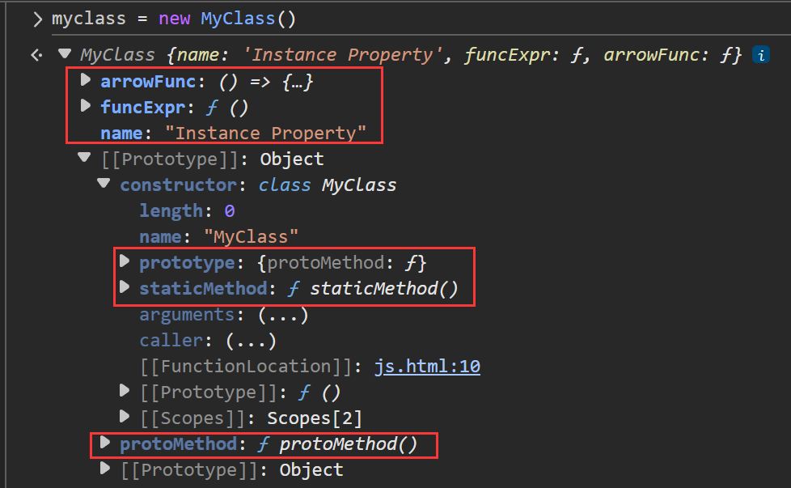
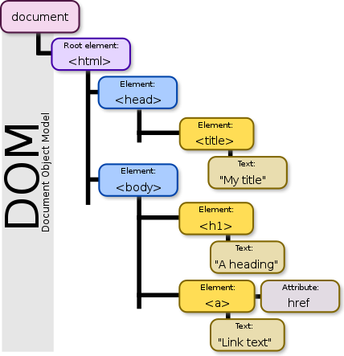
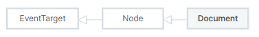
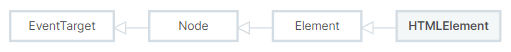

对JavaScript知识总结。

<!--more-->

# JavaScript基础

## JavaScript 专业词汇

- `表达式`
- `代码块`
- `函数闭包`

## JavaScript 的数据类型

### 【数据类型】

JavaScript 中的数据类型分为 **原始类型（Primitive Types）** 和 **引用类型（Reference Types）**。

**1. 原始类型（7种）：**

| 类型        | 说明                                    | 示例                               |
| ----------- | --------------------------------------- | ---------------------------------- |
| `Number`    | 数值，包括整数、浮点数、NaN、Infinity等 | `1`, `3.14`, `NaN`                 |
| `String`    | 字符串类型                              | `'hello'`, `"world"`               |
| `Boolean`   | 布尔类型                                | `true`, `false`                    |
| `undefined` | 表示未定义的变量                        | `let a;` `typeof a // "undefined"` |
| `null`      | 表示空值，常用于对象占位                | `let a = null`                     |
| `Symbol`    | 唯一值，用于对象属性名                  | `Symbol('desc')`                   |
| `BigInt`    | 表示大整数                              | `12345678901234567890n`            |

- 模板字符串：使用反单引号` 来表示模板字符串模板字符串中可以嵌入变量

**2. 引用类型（对象类型）：**

| 类型                  | 示例                                  |
| --------------------- | ------------------------------------- |
| `Object`              | `{}`、`{name: "JS"}`                  |
| `Array`               | `[1, 2, 3]`                           |
| `Function`            | `function() {}` 或箭头函数 `() => {}` |
| `Date`                | `new Date()`                          |
| `RegExp`              | `/abc/`                               |
| `Map` / `Set`         | `new Map()`, `new Set()`              |
| `WeakMap` / `WeakSet` | 稀疏结构，弱引用                      |

**3. 类型检测方法**

| 方法/运算符                        | 说明                             | 示例                                                      |
| ---------------------------------- | -------------------------------- | --------------------------------------------------------- |
| `typeof`                           | 返回原始类型的字符串表示         | `typeof 123 // "number"`                                  |
| `instanceof`                       | 判断对象是否为某个构造函数的实例 | `[] instanceof Array // true`                             |
| `Object.prototype.toString.call()` | 精确判断所有类型                 | `Object.prototype.toString.call(null) // "[object Null]"` |
| `Array.isArray()`                  | 判断是否为数组                   | `Array.isArray([]) // true`                               |

### 【类型转换方式】

JavaScript 支持三种类型转换：

1. **显式类型转换**

使用内建函数进行强制转换。

| 目标类型   | 方法                                        | 示例                  |
| ---------- | ------------------------------------------- | --------------------- |
| 转为字符串 | `String(value)` 或 `value.toString()`       | `String(123) → "123"` |
| 转为数字   | `Number(value)` 或 `parseInt`, `parseFloat` | `Number("123") → 123` |
| 转为布尔值 | `Boolean(value)`                            | `Boolean("") → false` |

2. **隐式类型转换**

> <font color='#008B8B'>弱类型语言</font>：在弱类型语言中，**变量的数据类型可以隐式转换**，而不是强制规定。JavaScript是一种典型的弱类型语言。

JS 在运算时会自动进行类型转换。

| 情况          | 示例                       | 说明                       |
| ------------- | -------------------------- | -------------------------- |
| 字符串拼接    | `"1" + 2 → "12"`           | 数字被转为字符串           |
| 算术运算      | `"5" * "2" → 10`           | 字符串被转为数字           |
| 布尔上下文    | `if ("hello") {...}`       | 非空字符串为 `true`        |
| 与运算符 `==` | `null == undefined → true` | 非严格等于可能发生类型转换 |

3. **自动装箱（Boxing）与解箱（Unboxing）**

原始值在需要对象时被自动包装为对象（如访问 `.length` 或调用方法时）。

```js
let str = "hello";
console.log(str.length); // 自动装箱为 String 对象
```

## JavaScript的运算符

**1.算术运算符（Arithmetic Operators）**

| 运算符 | 含义              | 示例          | 结果    |
| ------ | ----------------- | ------------- | ------- |
| `+`    | 加法 / 字符串拼接 | `2 + 3`       | `5`     |
| `-`    | 减法              | `5 - 2`       | `3`     |
| `*`    | 乘法              | `3 * 4`       | `12`    |
| `/`    | 除法              | `10 / 2`      | `5`     |
| `%`    | 取模（余数）      | `10 % 3`      | `1`     |
| `**`   | 幂运算（ES6）     | `2 ** 3`      | `8`     |
| `++`   | 自增              | `x++` / `++x` | `x + 1` |
| `--`   | 自减              | `x--` / `--x` | `x - 1` |

**2.赋值运算符（Assignment Operators）**

| 运算符 | 含义            | 示例               | 等同于       |
| ------ | --------------- | ------------------ | ------------ |
| `=`    | 赋值            | `a = 5`            |              |
| `+=`   | 加后赋值        | `a += 2`           | `a = a + 2`  |
| `-=`   | 减后赋值        | `a -= 1`           | `a = a - 1`  |
| `*=`   | 乘后赋值        | `a *= 3`           | `a = a * 3`  |
| `/=`   | 除后赋值        | `a /= 2`           | `a = a / 2`  |
| `%=`   | 取模后赋值      | `a %= 3`           | `a = a % 3`  |
| `**=`  | 幂后赋值（ES6） | `a **= 2`          | `a = a ** 2` |
| `??=`  | 空赋值          | `null ??= defined` |              |

> `??=` 只有当变量的值为null或undefined时才会对变量进行赋值

**3.比较运算符（Comparison Operators）**

| 运算符 | 含义             | 示例        | 结果类型 |
| ------ | ---------------- | ----------- | -------- |
| `==`   | 相等（类型转换） | `'5' == 5`  | `true`   |
| `===`  | 全等（值和类型） | `'5' === 5` | `false`  |
| `!=`   | 不等             | `'5' != 5`  | `false`  |
| `!==`  | 不全等           | `'5' !== 5` | `true`   |
| `>`    | 大于             | `5 > 3`     | `true`   |
| `<`    | 小于             | `2 < 4`     | `true`   |
| `>=`   | 大于或等于       | `5 >= 5`    | `true`   |
| `<=`   | 小于或等于       | `3 <= 2`    | `false`  |

> ⚠️ 推荐使用 `===` 和 `!==`，避免隐式类型转换带来的 bug。

**4.逻辑运算符（Logical Operators）**

| 运算符 | 含义      | 示例                | 返回值类型  |
| ------ | --------- | ------------------- | ----------- |
| `&&`   | 与（AND） | `true && false`     | `false`     |
| `      |           | `                   | 或（OR）    |
| `!`    | 非（NOT） | `!true`             | `false`     |
| `??`   | 空值合并  | `null ?? 'default'` | `'default'` |

> `??` 是 ES2020 引入的，仅在左侧为 `null` 或 `undefined` 时返回右侧值。

**5.位运算符（Bitwise Operators）**

| 运算符 | 含义           | 示例          |
| ------ | -------------- | ------------- |
| `&`    | 按位与         | `5 & 1 = 1`   |
| `|`    | 按位或         | `5 | 3 = 7`   |
| `^`    | 按位异或       | `5 ^ 1 = 4`   |
| `~`    | 按位非（取反） | `~5 = -6`     |
| `<<`   | 左移           | `5 << 1 = 10` |
| `>>`   | 有符号右移     | `5 >> 1 = 2`  |
| `>>>`  | 无符号右移     | `-5 >>> 1`    |

**6.字符串运算符**

| 运算符 | 含义       | 示例        | 结果   |
| ------ | ---------- | ----------- | ------ |
| `+`    | 拼接字符串 | `'a' + 'b'` | `'ab'` |

**7.三元运算符（Ternary Operator）**

```js
条件 ? 真值 : 假值
```

示例：

```js
let result = age >= 18 ? 'adult' : 'minor';
```

------

**8.类型运算符**

| 运算符       | 含义                         | 示例                          |
| ------------ | ---------------------------- | ----------------------------- |
| `typeof`     | 返回变量的类型字符串         | `typeof 123 // "number"`      |
| `instanceof` | 判断是否为某个构造函数的实例 | `[] instanceof Array // true` |
| `in`         | 属性是否在对象中             | `"name" in obj`               |
| `delete`     | 删除对象的属性               | `delete obj.name`             |
| `void`       | 执行表达式但返回 `undefined` | `void 0 // undefined`         |

**9.扩展运算符（ES6+）**

| 运算符 | 含义                   | 示例                   |
| ------ | ---------------------- | ---------------------- |
| `...`  | 展开 / 剩余运算符      | `[...arr]`, `{...obj}` |
| `?.`   | 可选链运算符（ES2020） | `user?.info?.name`     |

**10.运算符优先级（常见顺序）**

优先级从高到低（越上面越先执行）：

1. 括号 `()`
2. 成员访问 `.`、`[]`
3. 函数调用 `()`
4. 一元运算符 `!`, `typeof`, `++`, `--`
5. 幂运算 `**`
6. 乘、除、取模 `* / %`
7. 加、减 `+ -`
8. 位运算
9. 比较运算符
10. 逻辑运算符
11. 三元运算符 `? :`
12. 赋值 `= += -=`
13. 逗号运算符 `,`

## JavaScript隐式类型转换

### 【转换规律】

JavaScript 中的类型转换主要有三种方向：

- **转为字符串（ToString）**
- **转为数字（ToNumber）**
- **转为布尔值（ToBoolean）**

1. **转为布尔值（ToBoolean）**

转换为 `false` 的值（称为“**假值**”）：

```js
false
0
-0
0n       // BigInt 的 0
''
null
undefined
NaN
```

其余全部为 `true`（即便是空数组 `[]`、空对象 `{}` 也为真）。

```js
Boolean([]) → true
Boolean({}) → true
```

**2. 转为数字（ToNumber）**

| 值          | 转换后 |
| ----------- | ------ |
| `true`      | `1`    |
| `false`     | `0`    |
| `null`      | `0`    |
| `undefined` | `NaN`  |
| `''`        | `0`    |
| `'123'`     | `123`  |
| `'123abc'`  | `NaN`  |
| `[]`        | `0`    |
| `[123]`     | `123`  |
| `{}`        | `NaN`  |

**3. 转为字符串（ToString）**

| 值          | 转换后              |
| ----------- | ------------------- |
| `true`      | `"true"`            |
| `false`     | `"false"`           |
| `null`      | `"null"`            |
| `undefined` | `"undefined"`       |
| `123`       | `"123"`             |
| `[]`        | `""`                |
| `[1, 2]`    | `"1,2"`             |
| `{}`        | `"[object Object]"` |

### 【隐式类型转换场景】

1. **与运算符相关的转换**

| 运算符             | 示例                    | 转换说明                     |
| ------------------ | ----------------------- | ---------------------------- |
| `+`（加法）        | `'5' + 3` → `'53'`      | 若有字符串，先转为字符串拼接 |
| `-`、`*`、`/`、`%` | `'5' - 2` → `3`         | 将字符串转为数字运算         |
| `==`（宽松相等）   | `0 == false` → `true`   | 进行值的转换后再比较         |
| `===`（严格相等）  | `0 === false` → `false` | 不进行类型转换               |
| `!`（逻辑非）      | `!0` → `true`           | 转换为布尔值取反             |

2. **与条件判断相关的转换**

在 `if`、`while`、三元运算符中，会将表达式转换为布尔值。

3. **与对象相关的转换**

当对象参与算术或比较运算时，会触发 `valueOf()` 或 `toString()` 方法：

```js
{} + 1        // "[object Object]1"
[1, 2] + 3    // "1,23"
{} == "[object Object]" // true
```

### 【隐式转换规律总结】

基本规律一：优先转为字符串（尤其是 `+`）

```js
'2' + 1        // "21"
true + 'abc'   // "trueabc"
[1,2] + 3      // "1,23"
```

基本规律二：其他算术运算尝试转为数字

```js
'5' - true     // 4（'5'→5，true→1）
null * 8       // 0（null→0）
'abc' - 1      // NaN（'abc' 转为数字失败）
```

基本规律三：逻辑运算符返回的是**原始值**

```js
false || 'hello'     // "hello"
0 && 123             // 0
null ?? 'default'    // "default"
```

### 【易错点示例】

| 表达式              | 结果              | 说明                                |
| ------------------- | ----------------- | ----------------------------------- |
| `NaN == NaN`        | `false`           | NaN不和任何值相等，包括它自身       |
| `null == undefined` | `true`            | 是相等的                            |
| `[] == false`       | `true`            | `[] → '' → 0`，`false → 0`          |
| `[] == ![]`         | `true`            | `![] → false`，`[] == false → true` |
| `{} + []`           | `[object Object]` | 第一个 `{}` 被解释为块              |

## JavaScript函数

### 【函数形式】

1. **函数声明式（Function Declaration）**

```js
function add(a, b) {
  return a + b;
}
```

**特点**：可以在声明之前调用（函数提升）。

------

2. **函数表达式（Function Expression）**

```js
const add = function(a, b) {
  return a + b;
};
```

**特点**：必须先定义再调用。可以匿名或具名。

3. **箭头函数（Arrow Function）**

```js
const add = (a, b) => a + b;
```

**特点**：

- 更简洁；
- 没有自己的 `this`、`arguments`、`super`；
- 不能作为构造函数（不能用 `new` 调用）；
- 不能使用 `yield`，即不能用作生成器函数。

4. **构造函数创建（Function 构造器）**

```js
const add = new Function('a', 'b', 'return a + b');
```

**特点**：动态创建函数，但不推荐使用（安全性差、性能差）。

### 【参数与返回值】

函数返回值必须是一个值，包括对象、表达式（如函数表达式），没有返回值默认返回`undefined`。

### 【回调函数（Callback）】

**回调函数**是指作为参数传递给另一个函数的函数，并在该函数内部在某个时刻被“调用”。

```js
function doSomething(callback) {
  console.log("Doing something...");
  callback(); // 调用传入的函数
}

function sayHello() {
  console.log("Hello!");
}

doSomething(sayHello); // 输出：Doing something... 然后 Hello!
```

在这个例子中，`sayHello` 是一个 **回调函数**，它作为参数传递给 `doSomething`，并在内部被调用。

**事件监听**

```js
button.addEventListener("click", function () {
  console.log("Button clicked");
});
```

**数组方法**

```js
[1, 2, 3].forEach(function (item) {
  console.log(item);
});
```

**异步操作（如定时器）**

```js
setTimeout(function () {
  console.log("延迟1秒执行");
}, 1000);
```

**命名 vs 匿名回调函数**

```js
// 匿名回调
setTimeout(function () {
  console.log("匿名函数");
}, 1000);

// 命名回调
function callbackFn() {
  console.log("命名函数");
}
setTimeout(callbackFn, 1000);
```

**箭头函数也可以作为回调函数**

```js
setTimeout(() => {
  console.log("Arrow function callback");
}, 1000);
```

> [为什么JavaScript中函数也能看成对象_js函数也是对象,怎么理解-CSDN博客](https://blog.csdn.net/m0_46165586/article/details/143785628)

### 【window 对象】

在浏览器中，`window` 是顶级对象，全局作用域下声明的变量和函数（`var`、`function`）都会变成 `window` 的属性或方法；而 `let` 和 `const` 则不会。

`window` 是**浏览器环境中的全局对象**。表示整个浏览器窗口。它包含了：

- **浏览器提供的宿主对象**（如 `alert`、`setTimeout`）
- **JavaScript 的全局变量和函数**
- **全局作用域中的变量（var 声明的）和函数**

在浏览器中，所有全局作用域下的 `var` 变量和 `function` 声明都会被挂载到 `window` 上。

**访问方式**

```js
window.alert("Hi");   // 通过 window 调用 alert 方法
alert("Hi");          // 可省略 window，效果相同
```

**全局变量与 `window` 的关系**

1.`var` 声明的变量会挂载在 `window` 上：

```js
var a = 10;
console.log(window.a); // 10
```

2.`let` 和 `const` 声明的变量 **不会**挂在 `window` 上：

```js
let b = 20;
console.log(window.b); // undefined
```

3.没有使用 `var/let/const` 声明的变量也会挂在 `window` 上（不推荐，容易污染全局）：

```js
function test() {
  undeclared = 123;
}
test();
console.log(window.undeclared); // 123
```

4. 普通函数（使用 `function` 声明）自动挂载为 `window` 的方法：

```js
function fn() {
  console.log("Hi");
}
window.fn(); // 调用方式等同于 fn()
```

常用 `window` 方法示例

| 方法            | 说明                               |
| --------------- | ---------------------------------- |
| `alert()`       | 弹出提示框                         |
| `confirm()`     | 弹出确认框（返回 true/false）      |
| `prompt()`      | 输入框，返回用户输入               |
| `setTimeout()`  | 延时执行                           |
| `setInterval()` | 定时重复执行                       |
| `console.log()` | 控制台输出（也是 window 的一部分） |

### 【变量和函数的提升】

`var`、`let`、函数在声明的时候会在代码开始执行之前声明，用于考虑内存分配。

**`var` 声明的提升**

```js
console.log(a); // undefined
var a = 10;
```

相当于解释器处理成：

```js
var a;          // 提升：声明但不赋值
console.log(a); // undefined
a = 10;
```

 **`let` 的“暂时性死区”（TDZ）**

```js
console.log(b); // 报错：Cannot access 'b' before initialization
let b = 10;
```

- `let` 声明虽然也“提升”（被识别），但不会初始化。
- 在 `let b = 10;` 之前的任何访问都会抛出 `ReferenceError`。

**函数声明的提升**

```js
fn(); // 正常执行：alert("我是fn函数~")

function fn(){
    alert("我是fn函数~");
}
```

- **函数声明（Function Declaration）**：完整地被提升，包含函数体。

**函数表达式不会被完整提升**

```js
// fn2(); // 报错：fn2 is not a function
var fn2 = function() {
    console.log("匿名函数");
};
```

### 【立即执行函数】

**立即执行函数**是定义好之后立即被调用的函数，它的语法形式是：

```js
(function () {
  // 函数体
})();
```

或者：

```js
(function () {
  // 函数体
}());
```

也可以使用箭头函数写法（ES6+）：

```js
(() => {
  // 函数体
})();
```

JavaScript 中 `function` 声明默认是函数声明语句，**不能直接执行**。

将函数用 `()` 包裹后，**变成表达式**，表达式就可以立即执行。

**为什么要用 IIFE？**

1. **创建私有作用域**，防止变量污染全局命名空间。
2. 代码模块化的一种早期手段（模块化之前的写法）。
3. 常用于库、插件或立即执行的逻辑中。
4. 可用于封装变量、函数，防止外部访问。

**IIFE 模块化用途**

```js
var Counter = (function () {
  let count = 0;
  return {
    increment() {
      count++;
      console.log(count);
    },
    reset() {
      count = 0;
      console.log("reset");
    }
  };
})();

Counter.increment(); // 1
Counter.increment(); // 2
Counter.reset();     // reset
```

### 【函数的 `this`】

`this` 是 JavaScript 函数执行时自动传入的一个 **隐含参数**，它的值取决于 **函数的调用方式**。

**基本规则**

| 调用方式                      | `this` 指向                                                |
| ----------------------------- | ---------------------------------------------------------- |
| 普通函数调用                  | 全局对象（浏览器中是 `window`） 在严格模式下是 `undefined` |
| 对象方法调用                  | 调用该方法的对象（即 “点” 左边的对象）                     |
| 构造函数调用（`new`）         | 新创建的实例对象                                           |
| 显式绑定（`call/apply/bind`） | 显式指定的对象                                             |
| 箭头函数调用                  | **定义时所在作用域的 `this`**（不会改变）                  |

1. **普通函数**

```js
function test() {
    console.log(this);
}
test(); // 浏览器中输出：window；严格模式下输出：undefined
```

**2. 对象方法**

```js
const obj = {
    name: "Tom",
    sayHello: function () {
        console.log(this.name);
    }
};
obj.sayHello(); // 输出 "Tom"，this 指向 obj
```

**3. 构造函数**

```js
function Person(name) {
    this.name = name;
}
const p = new Person("Alice");
console.log(p.name); // "Alice"，this 指向新建的对象 p
```

**4. 显式绑定**

```js
function show() {
    console.log(this.name);
}

const user = { name: "Bob" };
show.call(user);   // "Bob"
show.apply(user);  // "Bob"

const boundShow = show.bind(user);
boundShow();       // "Bob"
```

5. **箭头函数**

```js
const obj = {
    name: "Tom",
    sayHello: function () {
        const arrow = () => {
            console.log(this.name);
        };
        arrow();
    }
};
obj.sayHello(); // 输出 "Tom"，箭头函数的 this 继承自 sayHello 的 this
```

**注意点**

1. 箭头函数的 `this` **不会根据调用方式改变**，它始终指向其定义时的外部作用域。
2. 在事件监听函数中，若使用普通函数，则 `this` 是触发事件的元素；若使用箭头函数，`this` 是定义时的上下文（可能是 `window` 或外部对象）。
3. 构造函数中若不使用 `new`，`this` 将指向 `window`，可能导致错误。

### 【高阶函数】

**高阶函数**是指**接收函数作为参数**，或者**返回一个函数**的函数。

1. 接收函数作为参数

```js
function greet(name) {
  return `Hello, ${name}!`;
}

function processUserInput(callback) {
  const name = "Alice";
  console.log(callback(name));
}

processUserInput(greet); // 输出: Hello, Alice!
```

2. 返回一个函数

```js
function multiplier(factor) {
  return function(x) {
    return x * factor;
  };
}

const double = multiplier(2);
console.log(double(5)); // 输出: 10
```

常见高阶函数（内置）

- `Array.prototype.map()`
- `Array.prototype.filter()`
- `Array.prototype.reduce()`
- `Array.prototype.forEach()`
- `setTimeout`, `setInterval`

```js
const arr = [1, 2, 3];
const doubled = arr.map(x => x * 2); // [2, 4, 6]
```

### 【闭包】

**闭包**是指**一个函数可以访问其定义时的词法作用域，即使这个函数在其定义作用域之外被调用**。

```js
function outer() {
  let count = 0;
  return function inner() {
    count++;
    console.log(count);
  };
}

const counter = outer();
counter(); // 1
counter(); // 2
```

- `inner()` 函数访问了 `outer()` 中的局部变量 `count`。
- 即使 `outer()` 已经执行完，`inner()` 仍然“记住”了它的词法作用域——形成闭包。

闭包和类的对比：

| 场景                          | 推荐用闭包 | 推荐用类    |
| ----------------------------- | ---------- | ----------- |
| 只需要几个函数操作内部状态    | ✅          | 🚫           |
| 有多个对象、共享行为（方法）  | 🚫          | ✅           |
| 需要完全私有变量              | ✅          | ✅（用 `#`） |
| 多态、继承、原型链等 OOP 特性 | 🚫          | ✅           |

- **闭包**：每次调用 `createXXX` 函数会生成新的作用域，内存压力略大，不利于大规模实例化。
- **类**：方法可以挂在原型上，共享函数定义，**更节省内存**。

### 【argumen和可变参数】

`arguments`

- 在 **函数内部**，你可以使用内置的 `arguments` 对象来访问**所有传入的实参**。
- 它是一个**类数组对象**，包含调用函数时传入的所有参数。

示例

```js
function sum() {
  console.log(arguments); // 类数组：不是真正的数组
  let total = 0;
  for (let i = 0; i < arguments.length; i++) {
    total += arguments[i];
  }
  return total;
}

console.log(sum(1, 2, 3, 4)); // 输出: 10
```

> 注意：`arguments` 不能用于箭头函数（`=>`），因为它没有自己的 `arguments` 对象。

**可变参数（Rest Parameters）**

可变参数（Rest Parameters）使用 `...` 语法，将**不定数量的参数**收集到一个真正的数组中。

```js
function sum(...args) {
  return args.reduce((acc, cur) => acc + cur, 0);
}

console.log(sum(1, 2, 3)); // 输出：6
```

- `args` 是一个**真正的数组**，可以使用数组方法（如 `map`、`reduce`、`filter` 等）；
- 可以与固定参数一起使用，但 `...rest` 必须是最后一个参数。

```js
function log(name, ...messages) {
  console.log(name);
  console.log(messages); // messages 是数组
}

log("Alice", "Hello", "World");
// 输出：Alice
//      ["Hello", "World"]
```

`arguments` 和 `rest 参数` 的区别

| 比较项           | `arguments` 对象     | `...rest` 可变参数 |
| ---------------- | -------------------- | ------------------ |
| 是否数组         | ❌ 类数组对象         | ✅ 真正的数组       |
| 是否能用数组方法 | ❌ 需要转化           | ✅ 直接可用         |
| 是否支持箭头函数 | ❌ 不支持             | ✅ 支持             |
| 是否支持默认值   | ❌ 不支持             | ✅ 支持             |
| 是否可以命名     | ❌ 只能用 `arguments` | ✅ 可自定义名字     |
| ES版本           | ES3 就有             | ES6 新特性         |

### 【`call`,`apply`,`bind`】

`call`、`apply`、`bind` 是 JavaScript 中用于**改变函数 `this` 指向**的三个非常重要的方法，常用于手动控制函数的执行上下文。

| 方法    | 作用                                      | 是否立即执行函数 | 参数传递方式           |
| ------- | ----------------------------------------- | ---------------- | ---------------------- |
| `call`  | 改变 `this` 并执行函数                    | ✅ 是             | 逐个传入参数           |
| `apply` | 改变 `this` 并执行函数                    | ✅ 是             | **数组**传入参数       |
| `bind`  | 改变 `this`，但**不立即执行**，返回新函数 | ❌ 否             | 逐个传入参数（可预设） |

示例函数

```js
function greet(greeting, punctuation) {
  console.log(`${greeting}, ${this.name}${punctuation}`);
}

const person = { name: 'Alice' };
```

`call(thisArg, arg1, arg2, ...)`

```js
greet.call(person, 'Hello', '!');
// 输出: Hello, Alice!
```

 `apply(thisArg, [arg1, arg2, ...])`

```js
greet.apply(person, ['Hi', '...']);
// 输出: Hi, Alice...
```

 `bind(thisArg, arg1, arg2, ...)`

```js
const greetAlice = greet.bind(person, 'Hey');
greetAlice('?'); // 输出: Hey, Alice?
```

> 箭头函数没有自身的this，它的this由外层作用域决定，也无法通过call apply 和 bind修改它的this

## JavaScript面向对象编程

**面向对象编程（Object-Oriented Programming）** 是一种编程思想，将现实世界中的事物抽象为对象，所以编写操作基于对象执行。通过 **类（Class）** 和 **对象（Object）** 来封装数据与行为，使程序更易于复用、扩展和维护。

OOP 三大特性：

- **封装**：将数据与方法打包在对象中，隐藏内部实现。
- **继承**：子类可以继承父类的属性和方法，代码复用。
- **多态**：不同类的对象可以以统一方式调用同名方法（JavaScript中主要通过鸭子类型体现）。

### 【类与对象区别】

| 分类 | 类（Class）              | 对象（Object）         |
| ---- | ------------------------ | ---------------------- |
| 定义 | 模板、蓝图               | 类的具体实例           |
| 概念 | 定义属性和方法的抽象结构 | 通过类创建的实体       |
| 示例 | `class Person {}`        | `let p = new Person()` |
| 关系 | 对象是由类实例化而来的   | 类是构造对象的基础     |

1. 定义类

```js
class Person {
  constructor(name, age) {
    this.name = name;
    this.age = age;
  }

  // 实例方法
  sayHello() {
    console.log(`Hello, I am ${this.name}`);
  }
}
```

2. 创建对象

```js
const p1 = new Person('Alice', 20);
p1.sayHello(); // Hello, I am Alice
```

javascript对象分为三类

- 内建对象：`Object`,`String`,`Array`等
- 宿主对象：由浏览器提供的对象，如`BOM`，`DOM`
- 自定义对象：由开发人员自己创建的对象

### 【类的属性和方法】

1.实例属性与方法（在 constructor 或类体中定义，属于对象）

```js
class Dog {
  constructor(name) {
    this.name = name; // 实例属性
  }

  bark() { // 实例方法
    console.log(`${this.name} says woof!`);
  }
}
```

2.静态属性与方法（用 static 关键字，属于类本身）

```js
class Tool {
  static version = '1.0.0'; // 静态属性

  static logInfo() { // 静态方法
    console.log(`Tool Version: ${Tool.version}`);
  }
}

Tool.logInfo();  // Tool Version: 1.0.0
```

### 【类的封装】

封装是面向对象编程的三大特性之一，指的是**将对象的属性和方法包装在类中，并隐藏内部实现细节，仅暴露对外的操作接口**。

**封装的目标**：

1. **隐藏实现细节**，保护数据安全；
2. **限制外部直接访问对象属性**；
3. **通过方法控制属性的读写权限和校验逻辑**。

**如何实现封装（JavaScript 中）**

1. 使用 `class` 定义类

```js
class Person {
  constructor(name, age) {
    this.name = name;
    this.age = age;
  }
}
```

------

2. 使用私有属性（`#`）

> ES2022 引入的私有属性，语法是 `#属性名`，只能在类内部访问。

```js
class Person {
  #name;  // 私有属性

  constructor(name) {
    this.#name = name;
  }

  sayHello() {
    console.log(`Hi, I'm ${this.#name}`);
  }
}
```

3. 提供 getter/setter 方法（读写接口）

方法式访问器（传统写法）：

```js
getName() {
  return this.#name;
}

setName(name) {
  if (name) this.#name = name;
}
```

属性式访问器（现代写法）：

```js
get name() {
  return this.#name;
}

set name(value) {
  if (value.length > 0) {
    this.#name = value;
  }
}
```

使用示例：

```js
const p = new Person("Tom");
p.name = "Jerry";     // set
console.log(p.name);  // get
```

**封装的好处**

| 好处     | 说明                                  |
| -------- | ------------------------------------- |
| 数据保护 | 防止外部随意修改属性值                |
| 控制访问 | 通过 `getter/setter` 控制属性读写权限 |
| 降低耦合 | 外部不关心内部实现，提高类的独立性    |
| 便于调试 | 可以在访问器中添加调试信息和断点      |

### 【类的多态】

多态是面向对象三大特性之一，指的是**相同的接口或方法作用于不同的对象时，表现出不同的行为**。

- JavaScript **不检查类型**，只要对象有需要的属性或方法，就能被使用。
- 常用表达方式是：**传入不同对象、执行相同操作，结果行为各异**。

1.JavaScript 不检查类型

```js
function sayHello(obj) {
    console.log("Hello, " + obj.name);
}

class Person {
    constructor(name) {
        this.name = name;
    }
}

class Dog {
    constructor(name) {
        this.name = name;
    }
}

sayHello(new Person("悟空")); // Hello, 悟空
sayHello(new Dog("旺财"));    // Hello, 旺财
```

2.方法重写（Override）：在继承体系中，**子类重写父类的方法**，体现出不同的行为。

```js
class Animal {
    speak() {
        console.log("动物发出声音");
    }
}

class Dog extends Animal {
    speak() {
        console.log("狗叫：汪汪");
    }
}

class Cat extends Animal {
    speak() {
        console.log("猫叫：喵喵");
    }
}

const animals = [new Dog(), new Cat()];

animals.forEach(animal => animal.speak());
```

- 这就是通过**同一个父类方法 `speak()`，由不同子类表现出不同行为**，实现了**经典的多态**。

3.函数参数多态（传入不同类型对象）:函数的参数可以是任何类型，这种特性让函数更通用。

```js
function describe(obj) {
    if (typeof obj.describe === 'function') {
        obj.describe();
    } else {
        console.log("这个对象没有描述方法");
    }
}
```

### 【类的继承】

继承是面向对象编程三大特性之一，是**子类继承父类的属性和方法，从而实现代码复用和扩展功能**的机制。

**JavaScript 中的继承实现方式（ES6+）**

1.使用 `extends` 关键字实现继承

```js
class Animal {
  constructor(name) {
    this.name = name;
  }

  sayHello() {
    console.log("动物在叫~");
  }
}

class Dog extends Animal {
  sayHello() {
    console.log("汪汪汪");
  }
}
```

2.`super` 的用法

| 场景             | 说明                                               | 示例               |
| ---------------- | -------------------------------------------------- | ------------------ |
| `super(...)`     | 子类构造函数中**调用父类构造函数**，必须写在第一行 | `super(name)`      |
| `super.方法名()` | 在子类方法中调用**父类的同名方法**                 | `super.sayHello()` |

3.示例（构造函数 + 方法）：

```js
class Cat extends Animal {
  constructor(name, age) {
    super(name);      // 调用父类构造函数
    this.age = age;
  }

  sayHello() {
    super.sayHello(); // 调用父类的方法
    console.log("喵喵喵");
  }
}
```

4.方法重写（Override）

子类可以**定义与父类同名的方法**，用于覆盖父类的方法，实现多态行为。

```js
class Dog extends Animal {
  sayHello() {
    console.log("汪汪汪");
  }
}
```

构造函数继承注意事项

- 如果**子类定义了构造函数**，必须在构造函数第一行调用 `super(...)`。
- 否则会报错：`ReferenceError: Must call super constructor in derived class before accessing 'this'`

**继承的好处**

| 好处       | 说明                                 |
| ---------- | ------------------------------------ |
| 代码复用   | 子类自动获得父类的属性和方法         |
| 易于维护   | 修改父类会自动影响所有子类           |
| 扩展能力强 | 子类可添加自己的属性或重写方法       |
| 遵守OCP    | 遵循开闭原则：对修改关闭，对扩展开放 |

**关键点：**

| 概念           | 关键字                     | 示例                       | 作用                               |
| -------------- | -------------------------- | -------------------------- | ---------------------------------- |
| 继承           | `extends`                  | `class Dog extends Animal` | 让子类继承父类                     |
| 调用父构造函数 | `super(...)`               | `super(name)`              | 子类构造函数中必须调用父类构造函数 |
| 调用父类方法   | `super.方法名()`           | `super.sayHello()`         | 子类中调用父类方法                 |
| 方法重写       | 子类中定义与父类同名的方法 | `sayHello()`               | 实现不同子类的特有行为（多态）     |

### 【原型对象】

> 每个对象都有一个内部属性 `[[Prototype]]`（通常访问为 `__proto__`），它指向另一个对象，这个对象称为“原型”。当访问对象的某个属性时，如果对象本身没有这个属性，则会去它的原型对象上查找，这就是“原型链查找”机制。原型本身也是对象，也有原型，因此构成一个原型链，直到最顶层`null`终止

**1.查找顺序：**

```js
obj = {}  // obj = new Object()
// obj -> obj.__proto__(Object.prototype) -> null
```

**<font color='#008B8B'>注意点：</font>**

- `obj` 的 `__proto__` 指向 `Object.prototype`。
- `Object.prototype` 是所有普通对象的顶层原型，`Object.prototype.__proto__ === null`。
- `Object`是所有对象的基类。
- JS中继承就是通过原型来实现的，当继承时，子类的原型就是一个父类的**实例**，而所有类都默认继承`Object`基类。

**2.类中的原型：**

```js
//定义一个类
class Animal {
  constructor(name, age) {
    this.name = name
    this.age = age
  }
  sayHello(){
    console.log("hello")
  }
}
```

- `Animal`默认继承`Object`基类，`Animal`的原型就是`Object`实例。
- 类的静态属性`prototype`和对象的属性`__proto__`作用相同，都是获取原型对象。

```js
Animal.prototype === animal.__proto__ (Object实例)
Animal.prototype.__proto__ === animal.__proto__.proto__ = Object.prototype
```

- 原型就相当于是一个**公共的区域**，可以被所有该类实例访问,可以将该类实例中，所有的公共属性（方法）统一存储到原型中,这样我们只需要创建一个属性，即可被所有实例访问
- 对原型中的数据修改会影响所有包含该原型的对象实例。

**3.对象结构**

对象中存储属性的区域实际有两个：对象自身和原型对象。

1. 直接通过对象所添加的属性，位于对象自身中，在类中通过 x = y 的形式添加的属性，位于对象自身中。
2. 在类中通过xxx(){}方式添加的方法和主动向原型中添加的属性或方法，位于原型中。

```js
class MyClass {
  name = 'Instance Property';

  // 原型方法
  protoMethod() {
    console.log('protoMethod this.name:', this.name);
  }

  // 实例函数表达式
  funcExpr = function () {
    console.log('funcExpr this.name:', this.name);
  };

  // 实例箭头函数
  arrowFunc = () => {
    console.log('arrowFunc this.name:', this.name);
  };

  // 静态方法
  static staticMethod() {
    console.log('staticMethod this.name:', this.name);
  }
}
```

原型对象中的数据：

1. 对象中的数据（属性、方法等）
2. constructor （对象的构造函数）

`constructor`实际就是类，保存所有静态属性和方法。



**4.访问方式**

1. `Object.getPrototypeOf(obj)` 返回对象的原型。
2. `obj.__proto__` 是非标准访问方式，现代建议使用 `Object.getPrototypeOf`。
3. `obj.hasOwnProperty(prop)` 判断属性是否在对象自身上。
4. `Object.hasOwn(obj, prop) `（推荐使用）判断属性是否在对象自身上。
5. `prop in obj` 判断属性是否存在（自身或原型链）。
6. `instanceof` 检查的是对象的原型链上是否有该类实例

> 不建议直接对原型对象数据进行修改。

### 【this 的指向】

对象中方法的定义位置不同。

1. **原型方法（`method() {}`）**

```js
class MyClass {
  method() {
    console.log('原型方法');
  }
}
```

- 定义位置：类的原型上（`MyClass.prototype.method`）
- 不是在构造函数中定义的
- 所有实例共享
- 正常调用（如 `obj.protoMethod()`），`this` 指向实例

```js
const obj = new MyClass();
obj.protoMethod(); // this === obj 

const f = obj.funcExpr;
f(); // this === undefined（在严格模式下） this === window （非严格模式下）
```

2. **实例方法（字段定义：`method = function() {}` 或 `method = () => {}`）**

```js
class MyClass {
  method1 = function() {
    console.log('函数表达式');
  }
}
```

- 定义位置：构造函数内部

  > 因为 JavaScript 会把这些“字段初始化器”转化为构造函数里的赋值语句

- 每个实例一份，每次实例化的时候都会定义一次。

- `method2`（箭头函数）自动绑定 `this`，而 `method1` 不会

- `this`和原型方法一样。

```js
class MyClass {
  method2 = () => {
    console.log('箭头函数');
  }
}
// 等价于
class MyClass {
    constructor (){
        this.method2 = () = >{
            console.log('箭头函数');
        }
    }
}
```

- 定义位置：构造函数内部
- 每个实例一份，每次实例化的时候都会定义一次。
- `method2`（箭头函数）自动绑定 `this`，
- `this`根据外作用域决定，也就是`constructor`， `this === 实例对象`，因此无论怎么调用，`this` 都不会变

```js
const obj = new MyClass();
const f = obj.arrowFunc;
f(); // this === obj（永远是实例）
```

**3. 静态方法（`static method() {}`）**

```js
class MyClass {
  static method() {
    console.log('静态方法');
  }
}
```

- 定义位置：类本身（`MyClass.method`），而不是实例或构造函数里，只定义一次。
- 不是在构造函数中定义的
- 只能通过类调用，不能通过实例调用，`MyClass.staticMethod()`，此时 `this === MyClass`

| 方法类型       | 记忆口诀                     |
| -------------- | ---------------------------- |
| 原型方法       | 谁调用我，我的 `this` 就是谁 |
| 实例函数表达式 | 和原型方法一样               |
| 箭头函数       | 定义时绑定 `this`，永不改变  |
| 静态方法       | 类调用它，`this` 是类对象    |

## JavaScript 数组

### 【数组常用方法】

- **Array.from()**  
  将类数组或 iterable 转为真正的数组  

  ```js
  Array.from('abc'); // ['a', 'b', 'c']
  ```

- **Array.isArray()**  
  判断是否为数组  

  ```js
  Array.isArray([1, 2, 3]); // true
  ```

- **Array.of()**  
  使用参数创建新数组  

  ```js
  Array.of(1, 2, 3); // [1, 2, 3]
  ```

- **concat()**  
  合并数组，返回新数组  

  ```js
  [1, 2].concat([3, 4]); // [1, 2, 3, 4]
  ```

- **copyWithin(target, start, end?)**  
  把一部分复制到另一部分（修改原数组）  

  ```js
  [1, 2, 3, 4].copyWithin(1, 2); // [1, 3, 4, 4]
  ```

- **every(callback)**  
  所有元素都满足条件返回 `true`  

  ```js
  [2, 4, 6].every(x => x % 2 === 0); // true
  ```

- **entries()**  
  返回键值对迭代器  

  ```js
  for (let [i, val] of ['a', 'b'].entries()) {
    console.log(i, val); // 0 'a', 1 'b'
  }
  ```

- **fill(value, start?, end?)**  
  用固定值填充（修改原数组）  

  ```js
  [1, 2, 3].fill(0); // [0, 0, 0]
  ```

- **filter(callback)**  
  过滤符合条件的元素  

  ```js
  [1, 2, 3, 4].filter(x => x % 2 === 0); // [2, 4]
  ```

- **find(callback)**  
  找到第一个满足条件的元素  

  ```js
  [1, 2, 3].find(x => x > 1); // 2
  ```

- **findIndex(callback)**  
  找到第一个满足条件元素的索引  

  ```js
  [1, 2, 3].findIndex(x => x === 2); // 1
  ```

- **flat(depth?)**  
  扁平化数组（默认一层）  

  ```js
  [1, [2, [3]]].flat(); // [1, 2, [3]]
  ```

- **flatMap(callback)**  
  类似 `map().flat()`，返回新数组  

  ```js
  [1, 2].flatMap(x => [x, x * 2]); // [1, 2, 2, 4]
  ```

- **forEach(callback)**  
  遍历元素（无返回值）  

  ```js
  [1, 2, 3].forEach(x => console.log(x))
  ```

- **includes(value)**  
  判断数组是否包含某个值  

  ```js
  [1, 2, 3].includes(2); // true
  ```

- **indexOf(value, from?)**  
  找元素的首次索引  

  ```js
  [1, 2, 3].indexOf(2); // 1
  ```

- **join(separator?)**  
  将数组转换为字符串  

  ```js
  [1, 2, 3].join('-'); // "1-2-3"
  ```

- **lastIndexOf(value)**  
  找元素最后一次出现的索引  

  ```js
  [1, 2, 1, 2].lastIndexOf(2); // 3
  ```

- **length**  
  数组长度（也可设置）  

  ```js
  const arr = [1, 2, 3];
  arr.length = 2; // arr = [1, 2]
  ```

- **map(callback)**  
  转换每个元素，返回新数组  

  ```js
  [1, 2, 3].map(x => x * 2); // [2, 4, 6]
  ```

- **pop()**  
  移除最后一个元素  

  ```js
  const arr = [1, 2, 3];
  arr.pop(); // 3, arr = [1, 2]
  ```

- **push(...items)**  
  末尾添加元素  

  ```js
  const arr = [1, 2];
  arr.push(3); // arr = [1, 2, 3]
  ```

- **reduce(callback, initialValue)**  
  从左到右聚合数组  

  ```js
  [1, 2, 3].reduce((a, b) => a + b, 0); // 6
  ```

- **reduceRight(callback, initialValue)**  
  从右到左聚合数组  

  ```js
  ['a', 'b', 'c'].reduceRight((a, b) => a + b); // "cba"
  ```

- **reverse()**  
  反转数组顺序（修改原数组）  

  ```js
  [1, 2, 3].reverse(); // [3, 2, 1]
  ```

- **shift()**  
  删除开头元素  

  ```js
  const arr = [1, 2, 3];
  arr.shift(); // 1, arr = [2, 3]
  ```

- **slice(start, end?)**  
  截取片段，不修改原数组  

  ```js
  [1, 2, 3].slice(1); // [2, 3]
  ```

- **some(callback)**  
  至少有一个满足条件  

  ```js
  [1, 2, 3].some(x => x > 2); // true
  ```

- **sort(compareFn?)**  
  排序数组（修改原数组）  

  ```js
  [3, 1, 2].sort(); // [1, 2, 3]
  ```

- **splice(start, deleteCount, ...items)**  
  删除/替换/添加（修改原数组）  

  ```js
  const arr = [1, 2, 3];
  arr.splice(1, 1, 9); // arr = [1, 9, 3]
  ```

- **toString()**  
  转换为字符串  

  ```js
  [1, 2, 3].toString(); // "1,2,3"
  ```

- **unshift(...items)**  
  开头添加元素  

  ```js
  const arr = [2, 3];
  arr.unshift(1); // arr = [1, 2, 3]
  ```

不修改原数组

```js
/**
at()
    - 可以根据索引获取数组中的指定元素
    - at可以接收负索引作为参数
concat()
    - 用来连接两个或多个数组
    - 非破坏性方法，不会影响原数组，而是返回一个新的数组
indexOf()
    - 获取元素在数组中第一次出现的索引
    - 参数：
        1. 要查询的元素
        2. 查询的其实位置
lastIndexOf()
    - 获取元素在数组中最后一次出现的位置

    - 返回值：
        找到了则返回元素的索引，
        没有找到返回-1

join()
    - 将一个数组中的元素连接为一个字符串
    - ["孙悟空", "猪八戒", "沙和尚", "唐僧", "沙和尚"] -> "孙悟空,猪八戒,沙和尚,唐僧,沙和尚"
    - 参数：
        指定一个字符串作为连接符

slice()
    - 用来截取数组（非破坏性方法）     
    - 参数：
        1. 截取的起始位置（包括该位置）
        2. 截取的结束位置（不包括该位置）   
            - 第二个参数可以省略不写，如果省略则会一直截取到最后
            - 索引可以是负值

        如果将两个参数全都省略，则可以对数组进行浅拷贝（浅复制）
**/
```

修改原数组

```js
/**
push()
    - 向数组的末尾添加一个或多个元素，并返回新的长度
pop()
    - 删除并返回数组的最后一个元素
unshift()
    - 向数组的开头添加一个或多个元素，并返回新的长度
shift()
    - 删除并返回数组的第一个元素
splice()
    - 可以删除、插入、替换数组中的元素
    - 参数：
        1. 删除的起始位置
        2. 删除的数量
        3. 要插入的元素

    - 返回值：
        - 返回被删除的元素
reverse()
    - 反转数组
**/

let result = arr.push("唐僧", "白骨精")

// console.log(arr)

result = arr.pop()
arr.unshift("牛魔王")
arr.shift()

// console.log(arr)

arr = ["孙悟空", "猪八戒", "沙和尚", "唐僧"]
// result = arr.splice(1, 3)
// result = arr.splice(1, 1, "牛魔王", "铁扇公主", "红孩儿")
result = arr.splice(1, 0, "牛魔王", "铁扇公主", "红孩儿")

// console.log(result)
// console.log(arr)

arr = ["a", "b", "c", "d"]
arr.reverse()
```

数组内置的高阶函数

```js
/**
sort()
    - sort用来对数组进行排序（会对改变原数组）
    - sort默认会将数组升序排列
        注意：sort默认会按照Unicode编码进行排序，所以如果直接通过sort对数字进行排序
            可能会得到一个不正确的结果
    - 参数：
        - 可以传递一个回调函数作为参数，通过回调函数来指定排序规则
            (a, b) => a - b 升序排列
            (a, b) => b - a 降序排列
forEach()
    - 用来遍历数组
    - 它需要一个回调函数作为参数，这个回调函数会被调用多次
        数组中有几个元素，回调函数就会调用几次
        每次调用，都会将数组中的数据作为参数传递
    - 回调函数中有三个参数：
        element 当前的元素
        index 当前元素的索引
        array 被遍历的数组

filter()
    - 将数组中符合条件的元素保存到一个新数组中返回
    - 需要一个回调函数作为参数，会为每一个元素去调用回调函数，并根据返回值来决定是否将元素添加到新数组中
    - 非破坏性方法，不会影响原数组

map()
    - 根据当前数组生成一个新数组
    - 需要一个回调函数作为参数，
        回调函数的返回值会成为新数组中的元素
    - 非破坏性方法不会影响原数组

reduce()
    - 可以用来将一个数组中的所有元素整合为一个值
    - 参数：
        1. 回调函数，通过回调函数来指定合并的规则
        2. 可选参数，初始值

**/

// arr.sort()
arr.sort((a, b) => a - b)
arr.sort((a, b) => b - a)

// console.log(arr)

arr = ["孙悟空", "猪八戒", "沙和尚", "唐僧"]

// arr.forEach((element, index, array) => {
//     console.log(array)
// })

// arr.forEach((element, index) => console.log(index, element))

arr = [1, 2, 3, 4, 5, 6, 7, 8]

// 获取数组中的所有偶数
let result = arr.filter((ele) => ele > 5)

result = arr.map((ele) => ele * 2)

arr = ["孙悟空", "猪八戒", "沙和尚"]

result = arr.map((ele) => "<li>" + ele + "</li>")

arr = [1, 2, 3, 4, 5, 6, 7, 8]

result = arr.reduce((a, b) => {
    /* 
        1, 2
        3, 3
        6, 4
        10, 5
    
    */
    // console.log(a, b)

    return a * b
})

// result = arr.reduce((a, b) => a + b, 10)


console.log(result)
```


### 【浅复制与深复制】

**浅拷贝（shallow copy）**通常对对象的拷贝都是浅拷贝对象的浅层进行复制（只复制一层）如果对象中存储的数据是原始值，那么拷贝的深浅是不重要进行复制，不会复制对象中的属性（或元素）

**数组复制方法：**

```js
const arr = [1, 2, { a: 3 }];

// 1. 使用 slice
const copy1 = arr.slice();

// 2. 使用 concat
const copy2 = [].concat(arr);

// 3. 使用展开运算符
const copy3 = [...arr];

// 修改嵌套对象会影响原始数组
copy1[2].a = 100;
console.log(arr[2].a); // 100
```

**对象复制方法：**

```js
const obj = { a: 1, b: { c: 2 } };

// 1. Object.assign
const shallowCopy1 = Object.assign({}, obj);

// 2. 展开运算符
const shallowCopy2 = { ...obj };

// 修改嵌套对象会影响原对象
shallowCopy1.b.c = 99;
console.log(obj.b.c); // 99
```

> ... (展开运算符):可以将一个数组中的元素展开到另一个数组中或者作为函数的参数传递，最常用的浅复制方法。

**深拷贝（deep copy）**深拷贝指不仅复制对象本身，还复制对象中的属性和元素，因为性能问题，通常情况不太使用深拷贝

```js
const clone = structuredClone(value);
```

> 注意浅复制和引用不同，浅复制第一层是独立的。

# JavaScript进阶

## 解构赋值

解构赋值是一种从**数组或对象中提取数据**并快速赋值给变量的语法糖，它让代码更简洁、结构更清晰，尤其适合函数参数、数据提取等场景。

### 【数组解构赋值】

 基本语法

```js
const arr = [10, 20, 30];
const [a, b, c] = arr;
console.log(a, b, c); // 10 20 30
```

 可跳过元素

```js
const [first, , third] = [1, 2, 3];
console.log(first, third); // 1 3
```

 设置默认值

```js
const [a = 100, b = 200] = [10];
console.log(a, b); // 10 200
```

与 `rest` 参数结合

```js
const [head, ...rest] = [1, 2, 3, 4];
console.log(head); // 1
console.log(rest); // [2, 3, 4]
```

### 【对象解构赋值】

基本语法

```js
const obj = { name: 'Alice', age: 25 };
const { name, age } = obj;
console.log(name, age); // Alice 25
```

重命名变量

```js
const { name: userName } = obj;
console.log(userName); // Alice
```

默认值

```js
const { gender = 'unknown' } = obj;
console.log(gender); // unknown
```

### 【函数参数解构】

对象参数解构

```js
function greet({ name, age }) {
  console.log(`Hello, ${name}. You are ${age}.`);
}

greet({ name: 'Bob', age: 30 });
// 输出：Hello, Bob. You are 30.
```

数组参数解构

```js
function sum([a, b]) {
  return a + b;
}
console.log(sum([1, 2])); // 3
```

### 【嵌套解构】

```js
const user = {
  id: 1,
  profile: {
    name: 'Tom',
    contacts: {
      email: 'tom@example.com'
    }
  }
};

const {
  profile: {
    contacts: { email }
  }
} = user;

console.log(email); // tom@example.com
```

### 【常见用途】

快速交换变量值

```js
let a = 1, b = 2;
[a, b] = [b, a];
console.log(a, b); // 2 1
```

快速提取 API 返回值

```js
const { data, code, message } = await axios.get('/api/info');
```

在 Vue/React 中提取 props

```js
const props = defineProps(['title', 'count']);
const { title, count } = props;
```

## 对象的序列化

**对象序列化（Serialization）就是将 JavaScript 中的对象转换成可以存储或传输**的格式（通常是字符串），最常见的是 **JSON 字符串**。

### 【序列和反序列化】

常用的序列化方式：`JSON.stringify`

```js
JSON.stringify(value, replacer, space)
```

| 参数       | 作用                                     |
| ---------- | ---------------------------------------- |
| `value`    | 要序列化的对象                           |
| `replacer` | 可选，**函数或数组**，用于定制序列化过程 |
| `space`    | 可选，格式化缩进用的空格数（调试时常用） |

```js
const obj = { name: "Alice", age: 25 };
const jsonStr = JSON.stringify(obj);
console.log(jsonStr); // '{"name":"Alice","age":25}'
```

 反序列化：`JSON.parse`

```js
const str = '{"name":"Alice","age":25}';
const parsed = JSON.parse(str);
console.log(parsed.name); // Alice
```

`JSON.stringify()` 的一些特点和陷阱

<font color='#409eff'> 支持：</font>

- 数字、字符串、布尔值、数组、对象
- `null`

<font color='#409eff'>不支持或被忽略：</font>

| 数据类型    | 序列化结果            |
| ----------- | --------------------- |
| `undefined` | 被忽略                |
| `function`  | 被忽略                |
| `symbol`    | 被忽略                |
| 循环引用    | 会报错                |
| BigInt      | 会报错（`TypeError`） |

```js
const obj = {
  a: 1,
  b: undefined,
  c: function() {},
  d: Symbol("x")
};
console.log(JSON.stringify(obj)); // {"a":1}
```

### 【序列化进阶用法】

1.自定义序列化（toJSON 方法）

```js
const user = {
  name: 'Tom',
  age: 18,
  toJSON() {
    return { userName: this.name };
  }
};

console.log(JSON.stringify(user)); // {"userName":"Tom"}
```

2.使用 replacer（过滤或转换字段）

```js
const obj = { name: 'Tom', age: 18 };

console.log(JSON.stringify(obj, ['name'])); // {"name":"Tom"}

console.log(JSON.stringify(obj, (key, value) =>
  typeof value === 'number' ? undefined : value
)); // {"name":"Tom"}
```

### 【常见用途】

> 对象转换为字符串后，可以将字符串在不同的语言之间进行传递

| 应用场景         | 示例                                                |
| ---------------- | --------------------------------------------------- |
| 浏览器存储       | `localStorage.setItem('user', JSON.stringify(obj))` |
| 数据传输         | axios、fetch POST 时发送 JSON 字符串                |
| 深拷贝（有局限） | `const newObj = JSON.parse(JSON.stringify(obj))`    |
| 日志输出         | `console.log(JSON.stringify(error))`                |

### 【手动编写JSON字符串】

也可以手动的编写JSON字符串，在很多程序的配置文件就是使用JSON编写的

编写JSON的注意事项：

1. JSON字符串有两种类型：JSON对象 `{}` / JSON数组 `[]`
2. JSON字符串的属性名必须使用双引号引起来
3. JSON中可以使用的属性值（元素）
   - 数字（Number）
   - 字符串（String） 必须使用双引号
   - 布尔值（Boolean）
   - 空值（Null）
   - 对象（Object {}）
   - 数组（Array []）
4. JSON的格式和JS对象的格式基本上一致的，
   注意：JSON字符串如果属性是最后一个，则不要再加`,`

## `Map`

`Map` 是 ES6 引入的一种新的数据结构，用于存储**键值对**。

> 与普通对象不同的是，`Map` 的键可以是**任何类型的值**（包括对象、函数等）。

### 【`Map`与`Object`的区别】

| 特性         | `Map`                                    | `Object`                                                |
| ------------ | ---------------------------------------- | ------------------------------------------------------- |
| 键的类型     | 任意类型（对象、函数等）                 | 只能是字符串或 Symbol。其他类型的属性会自动转换字符串， |
| 键的顺序     | **有序**（按插入顺序）                   | 无序（某些实现可能有顺序）                              |
| 遍历         | `map.forEach()`、`for...of`、`entries()` | `for...in`、`Object.keys()` 等                          |
| 默认属性干扰 | 无（原型是 `null`）                      | 有，继承自 `Object.prototype`                           |
| 性能         | 更适合频繁增删查操作                     | 较适合静态结构的对象数据                                |

### 【`Map`常见用法】

| 方法              | 说明                   |
| ----------------- | ---------------------- |
| `set(key, value)` | 设置键值对             |
| `get(key)`        | 获取指定键的值         |
| `has(key)`        | 判断键是否存在         |
| `delete(key)`     | 删除指定键             |
| `clear()`         | 清空 Map               |
| `size`            | 获取键值对数量         |
| `keys()`          | 返回所有键的迭代器     |
| `values()`        | 返回所有值的迭代器     |
| `entries()`       | 返回所有键值对的迭代器 |
| `forEach(cb)`     | 遍历每个键值对         |

```js
const map = new Map();

// 设置键值对
map.set('name', 'Alice');
map.set(42, 'numberKey');
map.set({ id: 1 }, 'objectKey');

// 获取值
console.log(map.get('name')); // Alice

// 检查是否存在键
console.log(map.has(42)); // true

// 删除键
map.delete('name');

// 清空所有键值对
map.clear();
```

遍历方法

```js
const map = new Map([
  ['a', 1],
  ['b', 2],
  ['c', 3]
]);

// for...of 遍历键值对
for (const [key, value] of map) {
  console.log(key, value);
}

// 遍历 keys
for (const key of map.keys()) {
  console.log('key:', key);
}

// 遍历 values
for (const value of map.values()) {
  console.log('value:', value);
}

// forEach 遍历
map.forEach((value, key) => {
  console.log(`${key} = ${value}`);
});
```

### 【`Map`转换成数组】

```js
const arr = Array.from(map) // [["name","孙悟空"],["age",18]]
const arr = [...map]

// 数组转成Map，直接创建Map
const map = new Map([
  ['a', 1],
  ['b', 2],
  ['c', 3]
]);
```

## `Set`

`Set` 是一个**无重复值的集合**。它类似数组，但每个值只能出现一次，且值的顺序按插入顺序保存。

### 【`Set`和`Array`的区别】

| 特性           | `Set`          | `Array` |
| -------------- | -------------- | ------- |
| 是否允许重复值 | ❌ 不允许       | ✅ 允许  |
| 是否有序       | ✅ 插入顺序保留 | ✅ 有序  |
| 索引访问       | ❌ 不支持下标   | ✅ 支持  |
| 是否可迭代     | ✅              | ✅       |

### 【`Set`常见用法】

| 方法            | 说明     |
| --------------- | -------- |
| `add(value)`    | 添加元素 |
| `delete(value)` | 删除元素 |
| `has(value)`    | 是否存在 |
| `clear()`       | 清空集合 |
| `size`          | 元素数量 |
| `forEach(cb)`   | 遍历集合 |
| `[...set]`      | 转为数组 |

```js
const set = new Set();

// 添加元素
set.add(1);
set.add(2);
set.add(2); // 重复的不会添加
set.add('hello');

console.log(set); // Set(3) {1, 2, 'hello'}

// 判断是否存在
console.log(set.has(1)); // true

// 删除元素
set.delete(2);

// 获取长度
console.log(set.size); // 2

// 清空集合
set.clear();

const set = new Set(['a', 'b', 'c']);

// for...of
for (const item of set) {
  console.log(item);
}

// forEach
set.forEach(item => console.log(item));

// 转成数组
const arr = [...set]; // ['a', 'b', 'c']

```

### 【常见用途】

1. 数组去重

```js
const arr = [1, 2, 2, 3, 4, 4];
const uniqueArr = [...new Set(arr)];
console.log(uniqueArr); // [1, 2, 3, 4]
```

2. 求交集

```js
const set1 = new Set([1, 2, 3]);
const set2 = new Set([2, 3, 4]);

const intersection = [...set1].filter(x => set2.has(x));
console.log(intersection); // [2, 3]
```

3. 求差集

```js
const diff = [...set1].filter(x => !set2.has(x));
console.log(diff); // [1]
```

## `Math`

JavaScript 中的 `Math` 是一个内置对象，提供了各种**数学运算相关的常用方法和常量**，可以帮助我们进行取整、取绝对值、三角函数、指数、对数等计算。

### 【取整相关】

| 方法           | 说明                | 示例                    |
| -------------- | ------------------- | ----------------------- |
| `Math.floor()` | 向下取整            | `Math.floor(4.7)` → `4` |
| `Math.ceil()`  | 向上取整            | `Math.ceil(4.1)` → `5`  |
| `Math.round()` | 四舍五入            | `Math.round(4.5)` → `5` |
| `Math.trunc()` | 去除小数部分（ES6） | `Math.trunc(4.9)` → `4` |

### 【数值处理】

| 方法                | 说明   | 示例                      |
| ------------------- | ------ | ------------------------- |
| `Math.abs(x)`       | 绝对值 | `Math.abs(-3)` → `3`      |
| `Math.max(...args)` | 最大值 | `Math.max(1, 5, 3)` → `5` |
| `Math.min(...args)` | 最小值 | `Math.min(1, 5, 3)` → `1` |
| `Math.pow(x, y)`    | 幂运算 | `Math.pow(2, 3)` → `8`    |
| `Math.sqrt(x)`      | 平方根 | `Math.sqrt(9)` → `3`      |
| `Math.cbrt(x)`      | 立方根 | `Math.cbrt(8)` → `2`      |

### 【随机数】

```js
Math.random(); // 返回 0 ~ 1 之间的随机小数（不包括1）
```

示例：生成 1~10 的随机整数

```js
const n = Math.floor(Math.random() * 10) + 1;
```

### 【三角函数】

| 方法           | 说明             |
| -------------- | ---------------- |
| `Math.sin(x)`  | 正弦（x 是弧度） |
| `Math.cos(x)`  | 余弦             |
| `Math.tan(x)`  | 正切             |
| `Math.asin(x)` | 反正弦           |
| `Math.acos(x)` | 反余弦           |
| `Math.atan(x)` | 反正切           |

### 【对数与指数】

| 方法            | 说明                    |
| --------------- | ----------------------- |
| `Math.log(x)`   | 自然对数（以 e 为底）   |
| `Math.log10(x)` | 以 10 为底的对数（ES6） |
| `Math.exp(x)`   | e 的 x 次幂             |

### 【常用 Math 常量】

| 常量           | 值         | 含义         |
| -------------- | ---------- | ------------ |
| `Math.PI`      | 3.14159... | 圆周率       |
| `Math.E`       | 2.71828... | 自然对数底数 |
| `Math.SQRT2`   | √2         |              |
| `Math.SQRT1_2` | √(1/2)     |              |
| `Math.LN2`     | ln(2)      |              |
| `Math.LN10`    | ln(10)     |              |

## `Date`

> `Date` 是 JavaScript 中处理**时间与日期的核心类**，可以创建、格式化、比较和操作时间值。

### 【创建 `Date` 实例的方式】

获取当前时间

```js
const now = new Date();
console.log(now); // 当前本地时间
```

通过时间字符串

```js
const date1 = new Date("2025-08-04T10:00:00");
const date1 = new Date("08/04/2025 10:00:00");
```

通过参数（年, 月, 日, 时, 分, 秒, 毫秒）

> 注意：月从 0 开始（0 = 一月）

```js
const date2 = new Date(2025, 7, 4, 10, 30); // 2025年8月4日10:30
```

通过时间戳（1970 年以来的毫秒数）

```js
const date3 = new Date(1691136000000); // 指定时间戳
```

### 【常用方法】

获取时间信息

| 方法                | 含义                        | 示例                     |
| ------------------- | --------------------------- | ------------------------ |
| `getFullYear()`     | 获取年                      | `date.getFullYear()`     |
| `getMonth()`        | 获取月（0-11）              | `date.getMonth()`        |
| `getDate()`         | 获取日（1-31）              | `date.getDate()`         |
| `getDay()`          | 获取星期几（0 = 周日）      | `date.getDay()`          |
| `getHours()`        | 获取小时（0-23）            | `date.getHours()`        |
| `getMinutes()`      | 获取分钟                    | `date.getMinutes()`      |
| `getSeconds()`      | 获取秒                      | `date.getSeconds()`      |
| `getMilliseconds()` | 毫秒                        | `date.getMilliseconds()` |
| `getTime()`         | 时间戳（1970 至今的毫秒数） | `date.getTime()`         |

设置时间信息

| 方法              | 说明             |
| ----------------- | ---------------- |
| `setFullYear(y)`  | 设置年份         |
| `setMonth(m)`     | 设置月份（0-11） |
| `setDate(d)`      | 设置日期（1-31） |
| `setHours(h)`     | 设置小时（0-23） |
| `setMinutes(min)` | 设置分钟         |
| `setSeconds(s)`   | 设置秒           |
| `setTime(ms)`     | 设置时间戳       |

`Date.now()` 获取当前的时间戳

### 【格式化输出】

```js
const date = new Date(2025, 7, 4, 10, 5);

console.log(date.toString());        // 本地完整时间字符串
console.log(date.toDateString());    // 仅日期部分
console.log(date.toTimeString());    // 仅时间部分
console.log(date.toISOString());     // ISO 标准时间（常用于后端传参）
console.log(date.toLocaleString());  // 本地格式日期+时间字符串
console.log(date.toLocaleDateString());  // 本地格式日期字符串
console.log(date.toLocaleTimeString());  // 本地格式时间字符串

/* 
toLocaleString()
    - 可以将一个日期转换为本地时间格式的字符串
    - 参数：
        1. 描述语言和国家信息的字符串
            zh-CN 中文中国
            zh-HK 中文香港
            en-US 英文美国
        2. 需要一个对象作为参数，在对象中可以通过对象的属性来对日期的格式进行配置
                dateStyle 日期的风格
                timeStyle 时间的风格
                    full
                    long
                    medium
                    short
                hour12 是否采用12小时值
                    true
                    false
                weekday 星期的显示方式
                    long
                    short
                    narrow

                year
                    numeric
                    2-digit 
*/
result = d.toLocaleString("zh-CN", {
    year: "numeric",
    month: "long",
    day: "2-digit",
    weekday: "short",
})
```


## 包装类

JavaScript 的**包装类**是对**基本数据类型**（如 `string`、`number`、`boolean`）的**对象封装**，让它们可以像对象一样调用方法。

### 【包装类定义】

包装类包括：

| 基本类型  | 包装类    |
| --------- | --------- |
| `string`  | `String`  |
| `number`  | `Number`  |
| `boolean` | `Boolean` |

还有一些不太常见的包装类：

| 类型             | 包装类                 |
| ---------------- | ---------------------- |
| `symbol`         | `Symbol`（本身是对象） |
| `bigint`         | `BigInt`（本身是对象） |
| `null/undefined` | 没有包装类             |

为什么需要包装类？

虽然像 `"abc"` 是字符串字面量，但我们可以写：

```js
"abc".toUpperCase(); // "ABC"
```

这是因为 JavaScript 在背后自动进行了**临时装箱（装入包装类对象）**：

```js
// 实际发生的过程（等效于）：
new String("abc").toUpperCase();
```

> **执行完后，临时对象立即销毁**。

手动使用包装类，虽然我们通常**不需要手动 new 包装类对象**，但你可以这么做：

```js
const strObj = new String("hello");
const numObj = new Number(123);
const boolObj = new Boolean(false);

console.log(typeof strObj); // object
console.log(typeof numObj); // object
console.log(typeof boolObj); // object
```

> 注意：这会变成真正的对象，和原始类型不再相等：因此包装类通常不要手动创建，而是解释器隐式使用。

```js
console.log(typeof "abc");         // string
console.log(typeof new String());  // object

console.log("abc" === new String("abc")); // ❌ false
```

### 【`String` 包装类】 

字符串其本质就是一个字符数组，<font color='#409eff'>数组很多方法字符串都可以通用的</font>。

```js
const s = "hello"; //"hello" --> ["h", "e", "l", "l", "o"]
s.toUpperCase();       // "HELLO"
s.includes("he");      // true
s.charAt(1);           // "e"
s.replace("l", "x");   // "hexlo"
s.length;              // 5
```

- **`charAt(index)`**
  获取指定索引处的字符。
  `"hello".charAt(1)` → `"e"`
- **`charCodeAt(index)`**
  获取指定字符的 UTF-16 编码（十进制）。
  `"ABC".charCodeAt(0)` → `65`
- **`concat(str1, str2, ...)`**
  拼接多个字符串（等效于 `+`）。
  `"Hello".concat(" ", "World")` → `"Hello World"`
- **`endsWith(searchString[, length])`**
  判断字符串是否以某个子串结尾。
  `"test.js".endsWith(".js")` → `true`
- **`includes(searchString[, position])`**
  判断是否包含某个子串。
  `"hello world".includes("world")` → `true`
- **`indexOf(searchValue[, fromIndex])`**
  返回子串首次出现的位置，找不到返回 `-1`。
  `"banana".indexOf("a")` → `1`
- **`lastIndexOf(searchValue[, fromIndex])`**
  返回子串最后一次出现的位置。
  `"banana".lastIndexOf("a")` → `5`
- **`match(regex)`**
  根据正则表达式匹配内容，返回数组或 `null`。
  `"abc123".match(/\d+/)` → `["123"]`
- **`matchAll(regex)`**
  返回所有正则匹配（需加 `g`），返回迭代器。
  `[...("a1b2".matchAll(/\d/g))]` → `[["1"], ["2"]]`

- **`normalize([form])`**
  Unicode 正规化（用于特殊字符对比）。
  `"é".normalize("NFD")`
- **`padEnd(targetLength[, padString])`**
  在字符串末尾补全到指定长度。
  `"5".padEnd(3, "0")` → `"500"`
- **`padStart(targetLength[, padString])`**
  在字符串开头补全到指定长度。
  `"5".padStart(3, "0")` → `"005"`
- **`repeat(count)`**
  返回重复多次的字符串。
  `"ha".repeat(3)` → `"hahaha"`
- **`replace(searchValue, replaceValue)`**
  替换匹配的子串。
  `"foo123".replace(/\d+/, "***")` → `"foo***"`
- **`replaceAll(searchValue, replaceValue)`**
  替换**所有**匹配项（ES2021）。
  `"a-b-c".replaceAll("-", "_")` → `"a_b_c"`
- **`search(regex)`**
  返回正则首次匹配的索引。
  `"abc123".search(/\d/)` → `3`
- **`slice(start[, end])`**
  截取字符串的一部分（不修改原字符串）。
  `"abcdef".slice(1, 4)` → `"bcd"`
- **`split(separator[, limit])`**
  按分隔符拆分为数组。
  `"a,b,c".split(",")` → `["a", "b", "c"]`
- **`startsWith(searchString[, position])`**
  判断字符串是否以指定子串开始。
  `"hello".startsWith("he")` → `true`
- **`substring(start[, end])`**
  提取从 `start` 到 `end` 之间的子串。
  `"abcdef".substring(2, 5)` → `"cde"`
- **`toLowerCase()`**
  转换为小写字母。
  `"HeLLo".toLowerCase()` → `"hello"`
- **`toUpperCase()`**
  转换为大写字母。
  `"HeLLo".toUpperCase()` → `"HELLO"`
- **`trim()`**
  去除首尾空白字符。
  `"  hello  ".trim()` → `"hello"`
- **`trimStart()` / `trimLeft()`**
  去除开头空白。
  `"  hi".trimStart()` → `"hi"`
- **`trimEnd()` / `trimRight()`**
  去除结尾空白。
  `"hi  ".trimEnd()` → `"hi"`
- **`valueOf()`**
  返回原始字符串值（用于隐式类型转换）。
  `"abc".valueOf()` → `"abc"`

### 【`Number` 包装类】

```js
const n = 123.456;
n.toFixed(2);          // "123.46"
n.toString(2);         // "1111011"（转为二进制）
```

### 【`Boolean` 包装类】

```js
Boolean(0);            // false
Boolean("hello");      // true
new Boolean(0);        // 是对象，始终为 truthy！
```

## 正则表达式

正则表达式（Regular Expression）是一种用来描述字符串**匹配规则**的工具，本质是**匹配模式**，可用来检索和替换文本。也是一个对象。格式是`/正则/匹配模式`

### 【创建方式】

方式 1：使用字面量（常用）

```js
const regex = /abc\d/i;
```

方式 2：使用 `RegExp` 构造函数

```js
const regex = new RegExp('abc\\d','i');
```

### 【匹配规则】

| 字符 | 含义                           | 示例                      |
| ---- | ------------------------------ | ------------------------- |
| `.`  | 任意单个字符（除换行）         | `/a.b/` 匹配 `a+b`, `a-b` |
| `\d` | 一个数字（0-9）                | `/\d/` 匹配 `"3"`         |
| `\w` | 单词字符（字母、数字、下划线） | `/\w/` 匹配 `"a"`, `"5"`  |
| `\s` | 空白字符（空格、换行、制表）   | `/\s/`                    |
| `\D` | 非数字                         | `/\D/`                    |
| `\W` | 非单词字符                     | `/\W/`                    |
| `\S` | 非空白字符                     | `/\S/`                    |

### 【量词（重复次数）】

| 量词    | 含义        | 示例                             |
| ------- | ----------- | -------------------------------- |
| `*`     | 0 次或多次  | `/a*/` 匹配 `""`, `"a"`, `"aaa"` |
| `+`     | 1 次或多次  | `/a+/` 匹配 `"a"`, `"aaa"`       |
| `?`     | 0 次或 1 次 | `/a?/` 匹配 `""`, `"a"`          |
| `{n}`   | 恰好 n 次   | `/a{3}/` 匹配 `"aaa"`            |
| `{n,}`  | 至少 n 次   | `/a{2,}/` 匹配 `"aa"`, `"aaaa"`  |
| `{n,m}` | n 到 m 次   | `/a{2,4}/` 匹配 `"aa"`, `"aaa"`  |

### 【字符集合与分组】

| 语法     | 含义                          |
| -------- | ----------------------------- |
| `[abc]`  | 匹配 a 或 b 或 c 中的任意一个 |
| `[^abc]` | 除了 a/b/c 以外的任意字符     |
| `(abc)`  | 分组，整体匹配                |
| `a       | b`                            |
| `^`      | 匹配开头                      |
| `$`      | 匹配结尾                      |

- [a-z] 任意的小写字母
- [A-Z] 任意的大写字母
- [a-zA-Z] 任意的字母
- [0-9]任意数字

### 【常用修饰符（flags）】

| 修饰符 | 含义                        |
| ------ | --------------------------- |
| `i`    | 忽略大小写                  |
| `g`    | 全局匹配（多次匹配）        |
| `m`    | 多行匹配（影响 `^` 和 `$`） |

### 【常用方法】

| 方法        | 返回值            | 说明                         |
| ----------- | ----------------- | ---------------------------- |
| `test(str)` | `Boolean`         | 是否匹配字符串               |
| `exec(str)` | `Match对象或null` | 返回**第一个匹配内容及位置** |

示例：`test()` 用于判断字符串是否匹配正则

```js
const regex = /\d+/;
console.log(regex.test("abc123")); // true
console.log(regex.test("abc"));    // false
```

示例：`exec()` 用于提取详细匹配信息，每调一次匹配一个

```js
const regex = /\d+/;
const result = regex.exec("abc123def");

console.log(result);     
// ["123", index: 3, input: "abc123def", groups: undefined]
```

JS 字符串与正则结合使用最常见的方式，用于查找、替换、提取等：

| 方法                     | 返回值              | 说明                 |
| ------------------------ | ------------------- | -------------------- |
| `match(regex)`           | 匹配结果数组或 null | 查找匹配内容         |
| `matchAll(regex)`        | 可迭代对象          | 匹配多个（需 `g`）   |
| `search(regex)`          | 索引或 -1           | 查找第一次匹配的位置 |
| `replace(regex, 替换值)` | 新字符串            | 替换匹配内容         |
| `split(regex)`           | 字符串数组          | 用正则切割字符串     |

```JS
//match()：查找匹配内容
"abc123xyz".match(/\d+/); // ["123"]
//matchAll()：获取所有匹配（配合 g 修饰符）
const matches = "a1b2c3".matchAll(/\d/g);
console.log([...matches]); // [{ 0: "1" }, { 0: "2" }, { 0: "3" }]
//search()：返回第一个匹配的索引
"hello123".search(/\d/); // 5
//replace()：替换匹配的内容
"abc123xyz".replace(/\d+/, "***"); // "abc***xyz"
"abc123xyz".replace(/\d/g, "*");   // 全局替换，多个 * 
//split()：基于正则切割字符串
"a,b;c.d".split(/[,;.]/); // ["a", "b", "c", "d"]
```

### 【常用示例】

验证手机号（中国大陆）

```js
/^1[3-9]\d{9}$/
```

验证邮箱地址

```js
/^[\w.-]+@[a-zA-Z\d.-]+\.[a-zA-Z]{2,}$/
```

仅匹配数字

```js
/^\d+$/   // 正整数
/^-?\d+$/ // 可带负号
```

提取数字

```js
const str = "价格是 ¥88 元";
const match = str.match(/\d+/); // ["88"]
```

# JavaScript DOM

## 什么是DOM

DOM，全称Document Object Model，<font color='#409eff'>中文翻译为文档对象模型</font>。DOM属于Web API的一部分。Web API中定义了非常多的对象，通过这些对象可以完成对网页的各种操作（添加删除元素、发送请求、操作浏览器等）。它将网页结构以**“树状结构”**的方式表示出来，每个 HTML 标签、文本、注释都对应成一“节点（Node）”。

DOM中的D意为Document，即文档。所谓文档就是指整个网页，换言之，DOM是用来操作网页的。O意为Object，即对象。<font color='#409eff'>DOM将网页中的每一部分内容都转换为了对象</font>，div有div的对象，input有input的对象，甚至一段文本，一段注释也有其所对应的对象。转换为对象干什么？还记得面向对象吗？转换对象以后，我们就可以以面向对象的方式去操作网页，想要操作哪个元素就获取哪个元素的对象，然后通过调用其方法或属性完成各种操作。M意为Model，即模型。模型用来表示对象之间的关系，也就是父子元素、祖先后代、兄弟元素等，明确关系后我们便可以通过任意一个对象去获取其他的对象。

```html
<!DOCTYPE html>
<html lang="zh">
<head>
    <title>My Title</title>
</head>
<body>
    <h1>A Heading</h1>
    <a href="#">Link Text</a>
</body>
</html>
```



### 【节点（Node）】

在DOM标准下，**网页中的每一个部分都会转换为对象。这些对象有一个共同的称呼——节点（Node）**。一个页面将会由多个节点构成，虽然都称为节点，但是它们却有着不同的类型：

1. 文档节点
2. 元素节点
3. 文本节点
4. 属性节点
5. …

每一个节点都有其不同的作用，文档节点表示整个网页，元素节点表示某个标签，文本节点表示网页中的文本内容，属性节点表示标签中的各种属性。如果从对象的结构上来讲，这些对象都有一个共同的父类Node。总的来说，都是属于节点，但是具体类型不同。

### 【关系】

- 祖先 —— 包含后代元素的元素是祖先元素
- 后代 —— 被祖先元素包含的元素是后代元素
- 父 —— 直接包含子元素的元素是父元素
- 子 —— 直接被父元素包含的元素是子元素
- 兄弟 —— 拥有相同父元素的元素是兄弟元素

## `Document对象`

在 JavaScript 中，`document` 是访问 **DOM（文档对象模型）** 的**入口对象**，它代表整个网页，也叫 **文档对象**。通过它，你可以获取页面上的元素、创建节点、绑定事件、修改结构等。

`document` 是浏览器提供的一个全局对象，它表示当前加载的 HTML 页面，是 `window` 对象的属性之一。

DOM就是一种宿主对象，即由运行环境（浏览器）提供的对象。对象的复杂程度也开始提升，我们先来看看document的继承关系：



在标准中，Document继承了Node，Node继承了EventTarget，换言之EventTarget、Node以及Document中所定义的方法document都可以调用，它在浏览器中的实际结构会更复杂一些，这里我们暂时不过多的赘述。

> document对象的原型链 HTMLDocument -> Document -> Node -> EventTarget -> Object.prototype -> null

凡是再原型链中存在的对象的属性和方法都可以调用。

**部分属性：**

| 属性/方法                  | 含义                                           |
| -------------------------- | ---------------------------------------------- |
| `document.documentElement` | 获取 `<html>` 元素                             |
| `document.body`            | 获取 `<body>` 元素                             |
| `document.head`            | 获取 `<head>` 元素                             |
| `document.title`           | 获取/设置网页标题                              |
| `document.URL`             | 当前页面完整 URL                               |
| `document.domain`          | 当前页面的域名                                 |
| `document.cookie`          | 读取/设置 cookie 值                            |
| `document.readyState`      | 加载状态：`loading`、`interactive`、`complete` |

## Element对象

在网页中所有的元素（标签）都是一个Element对象。Element对象的继承关系和Document类似：



| 特性     | `Node`             | `Element`                      |
| -------- | ------------------ | ------------------------------ |
| 类型     | 基类               | HTML 元素的专用子类            |
| 包含哪些 | 文本、注释、元素等 | 只有 HTML 元素                 |
| 常用方法 | appendChild 等     | innerHTML、style、classList 等 |

可以通过Document或其他元素直接获取已有的Element对象，也可以使用Document来创建新的Element对象。我们先来看看如何通过document获取已有的Element对象。

- `document.documentElement` 获取html根元素
- `document.body` 获取body元素
- `document.getElementByID()` 根据id获取一个元素
- `document.getElementsByClassName()` 根据class属性获取元素（实时更新列表）
- `document.getElementsByTagName()` 根据标签名获取元素（实时更新列表）
- `document.getElementsByName()` 根据name属性获取元素（实时更新列表）
- `document.querySelector()` 根据选择器获取一个元素
- `document.querySelectorAll()` 根据选择器获取一组元素

通过其他元素获取已有的Element对象：

- `element.children`
- `element.parentNode`
- `element.firstElementChild`
- `element.lastElementChild`
- ……

创建Element对象：

- `document.createElement()` 根据标签名创建元素节点对象

### 【文本操作】

在DOM中，文本内容也是一个节点对象（Text），可以通过获取文本对象然后完成对它的各种操作，但这种做法会使得事情变得复杂，并不建议这么做。在大部分场景下，可以通过元素的属性来操作其中的文本内容，比如有如下文本：

```html
<div>div中的文本内容</div>
```

假设我们已经获取到了div的元素节点对象，我们可以通过以下的属性来完成对文本的操作：

| 属性/方法     | 作用                               |
| ------------- | ---------------------------------- |
| `innerHTML`   | 获取/设置 HTML 内容（会解析标签）  |
| `textContent` | 获取/设置纯文本内容（不解析 HTML） |
| `innerText`   | 类似于 `textContent`，受 CSS 影响  |

### 【属性操作】

属性也是一个节点对象（Attr），和文本一样，通常我们不会去直接获取节点对象，而是通过元素来完成对属性的操作：

| 方法                        | 说明             |
| --------------------------- | ---------------- |
| `getAttribute(name)`        | 获取属性         |
| `setAttribute(name, value)` | 设置属性         |
| `removeAttribute(name)`     | 删除属性         |
| `hasAttribute(name)`        | 检查属性是否存在 |

```js
element.setAttribute('id', 'box');
element.getAttribute('class');
```

### 【类名操作】

使用 `classList` 操作类名：

```js
element.classList.add('active');
element.classList.remove('hidden');
element.classList.toggle('dark'); // 有则删，无则加
element.classList.contains('dark'); // 检查类名是否存在
```

### 【样式操作】

```js
element.style.color = 'red';
element.style.backgroundColor = 'yellow';
```

> `element.style` 是操作内联样式，不影响 class 设置的样式。

## 事件（event）

事件指用户和网页之间发生的交互行为。比如点击按钮、移动鼠标、改变窗口大小、表单输入等等等等，用户的所有操作都可以被当成是一个事件。JS中通过为事件绑定回调函数来处理事件，绑定回调函数后，事件触发后回调函数便会执行，以此来响应用户的行为，所以事件的回调函数我们也称其为事件的响应函数。

### 【绑定回调函数】

1. 通过标签的事件属性
2. 通过元素对象的事件属性
3. 通过元素addEventListener()方法

方式一：

```html
<button type="button" onclick="alert('按钮被点了！')">点我一下</button>
```

方式二：

```js
const btn = document.getElementById("btn")
btn.onclick = function(){
    alert("按钮被点击了！")
}
```

方式三：

```js
const btn = document.getElementById("btn")
btn.addEventListener("click", function(){
    alert("按钮被点了")
}) // 可以绑定多个事件
```

## 文档加载事件

在网页中编写DOM代码时，如果依然将script标签编写到head中，会有无法获取DOM对象情况出现。这是因为网页的加载是自上向下依次加载的，如果将代码写在前边会导致代码执行时网页还没有加载，DOM对象也就无法获取了。

如何解决这个问题呢？有这么几种方案：

1. 将script标签写在body的最后
2. 将js代码编写到window.onload事件的回调函数中
3. 将js代码编写到document对象的DOMContentLoaded事件的回调函数中
4. 将js代码编写到外部的js文件中，引入时为script标签添加defer属性

方式一：

```html
<!DOCTYPE html>
<html lang="zh">
    <head>
        <meta charset="UTF-8" />
        <meta http-equiv="X-UA-Compatible" content="IE=edge" />
        <meta name="viewport" content="width=device-width, initial-scale=1.0" />
        <title>Document</title>
    </head>
    <body>
        <button type="button" id="btn">点我一下</button>

        <script>
            const btn = document.getElementById("btn")
            btn.addEventListener("click", function () {
                alert("按钮被点了")
            })
        </script>
    </body>
</html>
```

代码编写到了body的最后，代码执行时网页已经加载完毕了，不会出现无法获取DOM对象的问题。

方式二：

```js
window.onload = () => {
    const btn = document.getElementById("btn")
    btn.addEventListener("click", function () {
        alert("按钮被点了")
    })
}
```

```js
window.addEventListener("load", () => {
    const btn = document.getElementById("btn")
    btn.addEventListener("click", function () {
        alert("按钮被点了")
    })
})
```

将js代码编写到window的load事件的回调函数中，load事件会在页面加载完毕后触发，同样可以避免上述问题。

方式三：

```js
document.addEventListener("DOMContentLoaded", () => {
    const btn = document.getElementById("btn")
    btn.addEventListener("click", function () {
        alert("按钮被点了")
    })
})
```

将js代码编写到document的DOMContentLoaded事件的回调函数中，代码会在当前文档加载完毕后执行也可以避免上述情况。（相较于load事件，DOMContentLoaded事件的执行更早一些）

方式四：

```html
<script src="./script.js" defer></script>
```

设置defer后，脚本将会在文档解析之后加载，同样可以避免上述问题。（执行时机早于DOMContentLoaded）

## Element操作

### 【增删改查】

| 操作 | 含义                   | 关键词                                 |
| ---- | ---------------------- | -------------------------------------- |
| 查   | 查询/获取元素          | `getElementById`、`querySelector` 等   |
| 增   | 新增元素（创建并添加） | `createElement` + `appendChild`        |
| 改   | 修改内容/属性/样式     | `textContent`、`style`、`setAttribute` |
| 删   | 删除已有元素           | `removeChild()` 或 `remove()`          |

**查（Read）：获取元素**

```js
document.getElementById('id');
document.getElementsByClassName('class');
document.getElementsByTagName('div');

document.querySelector('css选择器');      // 返回第一个匹配
document.querySelectorAll('css选择器');   // 返回所有匹配
```

示例

```js
const title = document.getElementById('title');
const listItems = document.querySelectorAll('ul li');
```

**增（Create）：新增元素**

创建元素

```js
const newDiv = document.createElement('div');
newDiv.textContent = '我是新元素';
```

插入元素

```js
document.body.appendChild(newDiv);              // 添加到 body 最后
parent.insertBefore(newDiv, referenceNode);     // 插入到某个子元素前
list.insertAdjacentElement("afterend", li)
//insertAdjacentElement()可以向元素的任意位置添加元素
//两个参数：1.要添加的位置 2.要添加的元素
// beforeend 标签的最后 afterbegin 标签的开始  
// beforebegin 在元素的前边插入元素（兄弟元素） afterend 在元素的后边插入元素（兄弟元素）
// 容易被xss攻击
```

创建并插入多个元素（推荐使用 DocumentFragment）

```js
const fragment = document.createDocumentFragment();
for (let i = 0; i < 5; i++) {
  const li = document.createElement('li');
  li.textContent = '项 ' + (i + 1);
  fragment.appendChild(li);
}
ul.appendChild(fragment);
```

**改（Update）：修改元素内容/样式/属性**

修改内容

```js
element.textContent = '新文本内容';
element.innerHTML = '<strong>新内容</strong>';
```

修改样式

```js
element.style.color = 'red';
element.classList.add('active');
element.classList.remove('hidden');
```

修改属性

```js
element.setAttribute('title', '提示文字');
```

**删（Delete）：删除元素**

方法一：从父元素中移除子元素

```js
parent.removeChild(child);
```

方法二：直接删除（现代写法）

```js
element.remove();  // ES6+
```

### 【节点复制】

```js
let newNode = node.cloneNode(deep);
```

`deep`（布尔值）：

- `true`：深拷贝，复制节点本身 **及其所有子节点**
- `false`：浅拷贝，只复制当前节点，不复制其子节点

复制后的节点是**新的节点对象**，你可以对它进行修改：

```js
const copy = original.cloneNode(true);
copy.id = 'copy';                       // 改 ID
copy.querySelector('span').textContent = 'JS'; // 改内部内容
document.body.appendChild(copy);
```

| 注意点             | 说明                                                         |
| ------------------ | ------------------------------------------------------------ |
| 不会复制事件       | 事件监听器不会被克隆（必须手动添加）                         |
| 不会复制绑定的数据 | 自定义属性、数据绑定等框架状态不会复制                       |
| 不会插入页面       | `cloneNode()` 只是创建节点，需 `appendChild()` 或 `insertBefore()` 插入页面 |

### 【样式修改】

两种常见方式

| 方法                | 说明                 |
| ------------------- | -------------------- |
| `element.style`     | 修改**行内样式**     |
| `element.classList` | 通过**类名**控制样式 |

使用 `element.style` 直接修改样式

```js
element.style.样式名 = '值';
```

> 注意：JS 中的样式名使用 **驼峰命名**，如 `backgroundColor`、`fontSize`。

示例：

```js
const box = document.getElementById('box');

box.style.color = 'red';              // 设置字体颜色
box.style.backgroundColor = 'yellow'; // 设置背景
box.style.fontSize = '20px';          // 设置字体大小
box.style.border = '1px solid black'; // 设置边框
```

清除样式：

```js
box.style.color = ''; // 清除 color 样式
```

**使用 `className` 或 `classList` 控制样式（推荐）**

相比 `element.style`，使用类名控制样式更整洁、易维护。

设置整个类名（不推荐直接覆盖）：

```js
element.className = 'box active'; // 替换所有类名
```

推荐使用 `element.classList`（常用）

| 方法                | 说明                   |
| ------------------- | ---------------------- |
| `add('class')`      | 添加类名               |
| `remove('class')`   | 删除类名               |
| `toggle('class')`   | 有则删，无则加（切换） |
| `contains('class')` | 检查类名是否存在       |

示例：

```js
element.classList.add('active');
element.classList.remove('hidden');
element.classList.toggle('dark-mode');
if (element.classList.contains('active')) {
  console.log('当前处于激活状态');
}
```

> 🔁 `toggle()` 可配合按钮实现样式切换。

**完整例子：点击切换样式**

```html
<style>
  .highlight {
    background-color: orange;
    color: white;
  }
</style>

<p id="text">点按钮改变我</p>
<button id="btn">切换样式</button>
<script>
    const btn = document.getElementById('btn');
    const text = document.getElementById('text');

    btn.addEventListener('click', () => {
      text.classList.toggle('highlight');
    });
</script>
```

**动态修改多个样式**

你可以一次性修改多个样式属性：

```js
Object.assign(element.style, {
  color: 'white',
  backgroundColor: 'black',
  padding: '10px'
});
```

或者使用 CSS 变量配合样式切换。

如果你想<font color='#409eff'>获取实际生效的样式</font>，而不是行内的，可以用`getComputedStyle`：

```js
const styles = getComputedStyle(element);
console.log(styles.color);
console.log(styles.fontSize);
```

**style 与 classList 的区别**

| 对比项   | `element.style`    | `element.classList`    |
| -------- | ------------------ | ---------------------- |
| 修改方式 | 直接操作行内样式   | 添加/删除类名          |
| 可读性   | 差                 | 高                     |
| 可维护性 | 差                 | 高（CSS 中集中管理）   |
| 适合情况 | 动态计算样式、动画 | 常规样式控制、主题切换 |

**常见坑与注意事项**

1. **样式名要用驼峰写法**

   ```js
   element.style.backgroundColor // 而不是 background-color
   ```

2. **缺单位的值会无效**

   ```js
   element.style.fontSize = '20px'; // 不要忘记 px
   ```

3. **不要直接覆盖 className（容易丢类）**

4. **事件触发修改样式**时注意不要写错引用：

   ```js
   button.addEventListener('click', function() {
     this.classList.toggle('active');
   });
   ```

**根据属性获取样式**

| 属性           | 包括哪些部分                          | 常用于                      |
| -------------- | ------------------------------------- | --------------------------- |
| `clientWidth`  | 内容区 + padding                      | 可视内容宽度                |
| `offsetWidth`  | 内容区 + padding + border（+ 滚动条） | 元素总宽度                  |
| `scrollWidth`  | 所有内容宽度（即使不可见）            | 内容溢出检测、横向滚动      |
| `offsetParent` | 离元素最近的设置了定位的祖先元素      | 定位计算                    |
| `offsetTop`    | 元素顶部相对于 `offsetParent` 的距离  | 绝对/相对定位偏移计算       |
| `scrollTop`    | 元素垂直滚动偏移量                    | 滚动判断、回滚顶部/底部控制 |

## 事件对象

事件对象是浏览器在事件触发时自动传递给事件监听函数的**包含事件详细信息的对象**。浏览器在创建事件对象后，会将事件对象作为响应函数的参数传递，所以我们可以在事件的回调函数中定义一个形参来接收事件对象

```js
element.addEventListener('click', function(event) {
  console.log(event); // 输出事件对象
});
```

在函数中通常会用 `e` 或 `event` 表示该对象。这个对象中<font color='#409eff'>封装了事件相关的各种信息.</font>

### 【基本结构】

事件对象是各种事件类型的基类对象（如 `MouseEvent`、`KeyboardEvent`、`InputEvent`），都继承自 `Event`。

```js
event {
  type,          // 事件类型，例如 'click'
  target,        // 触发事件的元素
  currentTarget, // 当前绑定事件的元素
  bubbles,       // 是否支持冒泡
  cancelable,    // 是否可以取消默认行为
  timeStamp,     // 事件发生时间
  ...
}
```

### 【常用方法属性】

**多种事件对象有一个共同的祖先 Event**

1. `event.type`

返回事件的类型（如 `"click"`, `"keydown"`）

```js
console.log(event.type); // 输出 'click'
```

2. `event.target` 和 `event.currentTarget`

| 属性            | 含义               |
| --------------- | ------------------ |
| `target`        | 实际触发事件的元素 |
| `currentTarget` | 当前绑定事件的元素 |

```js
element.addEventListener('click', function(event) {
  console.log('target:', event.target);
  console.log('currentTarget:', event.currentTarget);
});
```

3. `event.preventDefault()`

阻止事件的默认行为（如点击链接不跳转）

```js
link.addEventListener('click', function(e) {
  e.preventDefault();
});
```

4. `event.stopPropagation()`

阻止事件继续冒泡（向上冒泡被中断）

```js
child.addEventListener('click', function(e) {
  e.stopPropagation();
});
```

**鼠标事件特有属性（`MouseEvent`）**

| 属性      | 含义                                     |
| --------- | ---------------------------------------- |
| `clientX` | 鼠标点击时，视口内 X 坐标                |
| `clientY` | 鼠标点击时，视口内 Y 坐标                |
| `pageX`   | 相对于页面的 X 坐标                      |
| `button`  | 哪个鼠标键触发了事件（0 左，1 中，2 右） |

**键盘事件特有属性（`KeyboardEvent`）**

| 属性       | 含义               |
| ---------- | ------------------ |
| `key`      | 被按下的键的字符   |
| `code`     | 键盘的物理按键代码 |
| `ctrlKey`  | 是否按下 Ctrl      |
| `shiftKey` | 是否按下 Shift     |

### 【事件冒泡】

**事件冒泡（Event Bubbling）** 是 DOM 中的一种事件传播机制，指的是：

> 当一个元素上的事件被触发时，**该事件会从最深层的目标元素向上传播**，依次经过它的父元素、祖先元素，直到 `document` 根节点。

这就像水泡从水底冒到水面一样，所以称为 "**冒泡**"。

```js
<div id="parent">
  <button id="child">点击我</button>
</div>
js复制编辑document.getElementById('child').addEventListener('click', () => {
  console.log('子元素被点击');
});

document.getElementById('parent').addEventListener('click', () => {
  console.log('父元素被点击');
});
```

输出结果是：

```js
子元素被点击
父元素被点击
```

因为事件会先在目标元素（`child`）触发，然后 **冒泡到父元素**（`parent`）。

**事件传播的三个阶段**

1. **捕获阶段**（Capture）：
   - 从 `window` 一直向下捕获到目标元素，但此阶段默认不会触发监听器。
2. **目标阶段**（Target）：
   - 事件在目标元素上触发。
3. **冒泡阶段**（Bubble）：
   - 从目标元素向上冒泡到 `document`，依次触发祖先元素上的监听器（如果有）。

 **可视图：**

```php+HTML
window
  ↓
document
  ↓
<html>
  ↓
<body>
  ↓
<div id="parent">     ← 父元素监听器触发
  ↓
<button id="child">   ← 目标元素监听器触发
```

如何阻止事件冒泡？

使用 `event.stopPropagation()`：

```js
document.getElementById('child').addEventListener('click', (e) => {
  e.stopPropagation(); // 阻止事件冒泡到 parent
  console.log('点击了子元素');
});
```

这时点击按钮只会输出：

```js
点击了子元素
```

**注意事项**

- 并不是所有事件都支持冒泡，如 `blur` 和 `focus` 不冒泡。
- 如果用 `addEventListener(event, handler, true)`，则监听器会在捕获阶段触发。 一般情况下我们不希望事件在捕获阶段触发，所有通常都不需要设置第三个参数

`eventPhase` 表示事件触发的阶段

```js
box1.addEventListener("click", event => {
                alert("1" + event.eventPhase) // eventPhase 表示事件触发的阶段
                //1 捕获阶段 2 目标阶段 3 冒泡阶段
            })
```


### 【事件委托】

**事件委托** 是指：将事件监听器绑定在某个父元素上，**通过事件冒泡机制**，统一处理其子元素的事件。

换句话说，你**不用给每个子元素都绑定事件**，只需要在**父元素上监听一次**，然后判断事件是从哪个子元素触发的。

| 传统写法问题                             | 事件委托的优势             |
| ---------------------------------------- | -------------------------- |
| 子元素多，逐个绑定低效                   | 父元素只绑定一次，节省内存 |
| 子元素可能是动态创建的，无法事先绑定事件 | 委托可处理未来创建的子元素 |
| 修改结构需重新绑定事件                   | 委托天然支持新增 DOM       |

点击 `<ul>` 中的 `<li>` 项

```html
<ul id="list">
  <li>项 1</li>
  <li>项 2</li>
  <li>项 3</li>
</ul>
```

 错误方式（对每个 li 都绑定事件）：

```js
const items = document.querySelectorAll('#list li');
items.forEach(li => {
  li.addEventListener('click', () => {
    console.log('点击了', li.textContent);
  });
});
```

缺点：

- 不支持动态添加的 `li`
- 性能差，代码冗余

正确方式：使用事件委托

```js
const list = document.getElementById('list');

list.addEventListener('click', function (e) {
  if (e.target.tagName === 'LI') {
    console.log('点击了', e.target.textContent);
  }
});
```

利用了事件冒泡，`e.target` 就是实际点击的子元素。

动态添加项也能触发！

```js
const li = document.createElement('li');
li.textContent = '新增项';
list.appendChild(li); // 无需绑定事件，自动生效
```

因为事件绑定在 `ul` 上，**后添加的子元素也能响应点击**。

**常见应用场景**

| 应用场景               | 委托监听的父元素  | 子元素判断条件                              |
| ---------------------- | ----------------- | ------------------------------------------- |
| 表格中点击某一行       | `tbody`           | `e.target.tagName === 'TD'`                 |
| 列表点击删除按钮       | `ul` / `div.list` | `e.target.classList.contains('delete-btn')` |
| 表单中输入实时校验     | `form`            | `e.target.name === 'email'`                 |
| 整体布局中捕获所有按钮 | `document.body`   | `e.target.matches('button')`                |

**常用判断方法**

| 方法                            | 用途                        |
| ------------------------------- | --------------------------- |
| `e.target.tagName`              | 判断具体 HTML 标签名        |
| `e.target.classList.contains()` | 判断是否有某个类名          |
| `e.target.matches('选择器')`    | 判断是否符合某个 CSS 选择器 |
| `e.target.closest('选择器')`    | 向上查找符合的父元素        |

## BOM对象

**BOM（浏览器对象模型）** 是 JavaScript 与浏览器交互的一套对象结构，允许我们控制浏览器窗口和与之相关的功能（如地址栏、历史记录、导航、定时器、弹窗等）。

```js
window
├── location       → 地址栏相关
├── history        → 浏览记录
├── navigator      → 浏览器信息
├── screen         → 屏幕信息
├── document       → 网页内容（DOM）
├── alert(), setTimeout() 等全局方法
```

`window` 对象（BOM 的核心）

```js
console.log(window); // 全局窗口对象
```

- JS 中的全局变量和函数都是 `window` 的属性
- 访问 `window.x` 等价于访问 `x`

例如：

```js
window.alert("你好"); // 弹窗
window.setTimeout(() => console.log("定时"), 1000);
```

2. `location` 对象（地址栏相关）

用于访问和修改浏览器的地址栏信息。

```js
console.log(location.href);   // 当前地址
console.log(location.hostname); // 主机名
console.log(location.pathname); // 路径名

// 跳转页面
location.href = "https://www.google.com";

// 重新加载
location.reload();
```

3. `history` 对象（浏览历史）

操作用户的访问历史记录。

```js
history.back();    // 后退
history.forward(); // 前进
history.go(-1);    // 返回前一个页面
```

📌 注意：不能直接查看访问记录内容（出于安全）

4. `navigator` 对象（浏览器信息）

返回浏览器和系统的相关信息：

```js
console.log(navigator.userAgent);     // 浏览器标识，用来描述浏览器信息的字符串。 
console.log(navigator.language);      // 当前语言
console.log(navigator.platform);      // 操作系统平台
```

5. `screen` 对象（屏幕分辨率）

返回客户端屏幕相关信息：

```js
console.log(screen.width);      // 屏幕宽度
console.log(screen.height);     // 屏幕高度
console.log(screen.availWidth); // 可用宽度（除去任务栏）
```

| 特性     | DOM（文档对象模型） | BOM（浏览器对象模型）    |
| -------- | ------------------- | ------------------------ |
| 操作内容 | 网页内容            | 浏览器窗口及相关功能     |
| 代表对象 | `document`          | `window`、`location` 等  |
| 用途     | 操作文档结构        | 控制导航、弹窗、定时器等 |
| 是否标准 | 是（W3C 标准）      | 否（由浏览器厂商定义）   |

### 【常用 BOM 方法（弹窗/定时器）】

**弹窗类**

```js
alert("提示信息");
confirm("你确定要删除吗？");  // 返回 true/false
prompt("请输入你的名字");     // 返回用户输入的字符串
```

**定时器类**

```js
let timer = setTimeout(() => {
  console.log("一次性定时器");
}, 1000);

let interval = setInterval(() => {
  console.log("每秒一次");
}, 1000);

// 清除
clearTimeout(timer);
clearInterval(interval);
```

`window.open()` 打开新窗口

```js
window.open("https://www.example.com", "_blank");
```

现代浏览器常常会屏蔽这种行为，除非用户是主动点击触发。

**浏览器尺寸与滚动**

```js
console.log(window.innerWidth);  // 浏览器内容区宽度
console.log(window.scrollY);     // 页面滚动的垂直距离
```

## 事件循环

在 JavaScript 中，理解 **调用栈（Call Stack）** 和 **消息队列（Message Queue / Task Queue）** 是掌握**异步编程、事件循环（Event Loop）**、`setTimeout`、`Promise` 等机制的核心基础。

```vb
         ┌───────────────┐
         │    调用栈     │ ← 执行同步代码
         └────┬──────────┘
              │
              ▼
     ┌─────────────────────┐
     │   Web APIs / 回调注册 │ ← setTimeout、DOM事件等交给浏览器处理
     └────┬────────────────┘
          │（等待完成）
          ▼
    ┌────────────┐
    │ 消息队列    │ ← 异步回调排队等执行
    └────┬───────┘
         │
         ▼
   Event Loop 检查调用栈空 → 把队列中的回调推进栈中执行
```

### 【调用栈（Call Stack）】

调用栈是 JS 引擎用来跟踪函数执行过程的数据结构，**遵循 LIFO（后进先出）** 原则。

```js
function foo() {
  bar();
}

function bar() {
  console.log("hello");
}

foo();
```

执行过程：

1. `foo()` 进栈
2. `bar()` 进栈
3. `console.log()` 进栈并执行
4. `console.log()` 出栈 → `bar()` 出栈 → `foo()` 出栈

小结：

- **同步代码**是依次进入调用栈中执行的
- 调用栈满时，不能执行任何新的代码（也不能处理异步）

### 【消息队列（Message Queue）】

消息队列是一个等待执行的**异步任务回调列表**，当调用栈清空后，**事件循环（Event Loop）** 会从队列中取出任务并执行。

**包含内容：**

- `setTimeout`、`setInterval` 的回调
- DOM 事件（如点击、键盘）
- 网络请求（如 Ajax 回调）
- `Promise.then()`（微任务，不在主消息队列，详见后）

### 【事件循环（Event Loop）】

事件循环的核心职责：

> 💡 “不断地检查调用栈是否为空，如果为空，就从消息队列中取出一个回调执行”。

这是 JS 实现异步非阻塞编程的关键机制。

经典例子：setTimeout

```js
console.log("1");

setTimeout(() => {
  console.log("2");
}, 0);

console.log("3");
```

setInterval() 没间隔一段时间就将函数添加到消息队列中但是如果函数执行的速度比较慢，它是无法确保每次执行的间隔都是一样的

### 输出顺序：

```js
1
3
2
```

原因：

- `console.log("1")` 进入栈并立即执行
- `setTimeout(...)` 把回调注册到 Web API，并排入**消息队列**
- `console.log("3")` 进入栈并立即执行
- 调用栈清空，事件循环从消息队列中取出 `console.log("2")` 执行

### 【微任务队列（Microtask Queue）】

JavaScript 还有一个比消息队列**优先级更高**的队列叫：**微任务队列**。

常见的微任务来源：

- `Promise.then()`, `catch()`, `finally()`
- `MutationObserver`

示例：

```js
console.log("start");

Promise.resolve().then(() => {
  console.log("promise");
});

console.log("end");
```

**输出：**

```
start
end
promise
```

原因：微任务在当前宏任务执行完后、下一个宏任务前执行。

**宏任务 vs 微任务**

| 分类   | 举例                                                 |
| ------ | ---------------------------------------------------- |
| 宏任务 | `setTimeout`, `setInterval`, `fetch`, `DOM事件`      |
| 微任务 | `Promise.then`, `queueMicrotask`, `MutationObserver` |

> **调用栈**负责执行同步任务，**消息队列**存放异步回调，**事件循环**协调两者，确保 JavaScript 在单线程下实现异步编程。

### 【图解执行顺序（带 Promise）】

```js
console.log("A");

setTimeout(() => {
  console.log("B");
}, 0);

Promise.resolve().then(() => {
  console.log("C");
});

console.log("D");
```

### 输出顺序：

```css
A
D
C   ← 微任务先于宏任务
B
```

# jQuery

> [jQuery – 李立超 | lilichao.com](https://lilichao.com/?p=6402)

## jQuery介绍

jQuery是一个快速的、小型的、具有丰富功能的JavaScript库。**它的出现使得网页中的DOM、事件、动画、Ajax等操作变得更加简单**。“写更少的代码，做更多的事儿”是jQuery一直坚信的开发理念。

库就是一组代码，这组代码中包含了一些已经定义好的对象和函数。只需要将库引入到页面中，即可直接使用这些对象和函数。库中的代码通常是为了解决一些我们开发中的一些不便。jQuery中的代码就是为了简化原生JS的操作，同样一个功能使用原生JS你也许要编写五行代码，使用jQuery一行就可以搞定，同时jQuery还可以帮助我们处理掉浏览器的兼容问题。

### 【jQuery —— 一个过时的库】

所有的库都是为了解决我们开发时的痛点而存在的。jQuery解决的问题主要有两个：<font color='#409eff'>简化DOM操作、解决浏览器兼容问题</font>。然而随着前端的发展、DOM标准的更新、IE的消亡。DOM操作和浏览器兼容性早已不是什么大问题了，再加上React、Vue、Angular这些大型框架的出现，在实际项目中使用jQuery的机会可以说是少之又少。这是不是就意味着我们没有必要在学习jQuery了呢？是的，确实没有学习jQuery的必要了。所以如果是比较赶时间的同学，完全可以跳过jQuery的学习，不需要再继续听下边的内容了。

**CDN**

使用公共cdn比较简单，以字节跳动静态资源为例，要引入3.x版本的jQuery，只需要将如下代码粘贴到网页中即可：

```html
<script src="https://lf9-cdn-tos.bytecdntp.com/cdn/expire-1-M/jquery/3.6.0/jquery.js"></script>
```

或者这个：

```html
<script src="https://lf26-cdn-tos.bytecdntp.com/cdn/expire-1-M/jquery/3.6.0/jquery.min.js"></script>
```

完整：

```html
<!DOCTYPE html>
<html lang="zh">
    <head>
        <meta charset="UTF-8" />
        <meta http-equiv="X-UA-Compatible" content="IE=edge" />
        <meta name="viewport" content="width=device-width, initial-scale=1.0" />
        <title>Document</title>
        <script src="https://lf3-cdn-tos.bytecdntp.com/cdn/expire-1-M/jquery/3.6.0/jquery.min.js"></script>
    </head>
    <body>
    </body>
</html>
```

## jQuery核心函数

引入jQuery后，它会自动在全局作用域添加一个名为`jQuery`的新函数，新函数还有一个别名`$`。换句话说，通过`jQuery`和`$`都可以访问到这个函数，这个函数我们称为jQuery的核心函数。我们引入jQuery目的就是得到这个函数，学习jQuery也就是在学习这个核心函数。

可以通过两种方式来使用核心函数，一种是将其作为对象使用，此时它是一个工具类，在其中封装了一些属性和方法。

- jQuery.contains()
- jQuery.isArray()
- jQuery.isFunction()
- jQuery.isNumeric()
- ……

另一种是将其作为函数调用，根据参数的不同可以会发挥不同的作用。

- jQuery(函数)
- jQuery(选择器)
- jQuery(DOM对象)
- jQuery(HTML代码)

注意：上述编写代码时可以使用$代替jQuery。

### 【函数作为参数】

当使用函数作为jQuery的参数时，jQuery会使该函数在文档加载完毕后执行，比如：

```js
$(function(){
    
})
```

等价于

```js
document.addEventListener("DOMContentLoaded", function(){
    
})
```

### 【选择器字符串作为参数】

如果将一个选择器字符串作为参数传递给核心函数，则jQuery会根据选择器去页面中查询元素，并将查询到的元素返回，比如：

```js
var $box1 = $("#box1") // 获取id为box1的元素
var $news = $(".news") // 获取class为news的元素
var $hello = $("[title=hello]") // 获取title属性为hello的元素
```

注意！通过jQuery核心函数获取到的对象并不是我们所熟悉的DOM对象，而是一个由jQuery定义的新对象，为了和我们熟悉的DOM对象做区分，这个对象我们称之为jQuery对象。<font color='#409eff'>记住！通过jQuery核心函数获取到的对象是jQuery对象。</font>

DOM对象本身存在着一些不足，比如兼容问题、操作不方便等，为了解决这些问题，jQuery设计了一个新的对象，jQuery对象。可以将jQuery对象理解为DOM对象的升级版，为DOM对象增加了许多功能，同时解决了DOM对象的兼容性问题，关于jQuery对象的细节后续讲解。

### 【DOM对象作为参数】

如果将一个DOM对象作为参数，核心函数会将其转换为jQuery对象并返回。

```js
var box1 = document.getElementById("box1") // 获取DOM对象
var $box1 = $(box1) // 转换为jQuery对象
```

### 【HTML代码作为参数】

如果将一段HTML代码作为参数，核心函数会根据HTML代码创建jQuery对象。

```js
var $div = $("<div/>")
var $span = $("<span>这是一个span</span>")
```

## jQuery对象

如上所述，jQuery对象时jQuery中新定义的对象，它像是一个用来存储DOM对象的数组（类型并不是Array）。可以通过length来获取其中DOM元素的数量，也可以通过索引来获取其中的某个元素。但是jQuery对象又并不是那么的简单，在它里边为我们提供了很多好用的方法，使我们可以快速的操作其中的DOM对象。

使用jQuery对象进行DOM操作时，无需再调用原生DOM的方法，直接调用jQuery对象的方法即可。通过jQuery对象进行修改操作时，会同时修改jQuery对象中的所有DOM对象，举个例子：

```html
<!DOCTYPE html>
<html lang="zh">
    <head>
        <meta charset="UTF-8" />
        <meta http-equiv="X-UA-Compatible" content="IE=edge" />
        <meta name="viewport" content="width=device-width, initial-scale=1.0" />
        <title>Document</title>
        <script src="./script/jquery/jquery-3.6.1.min.js"></script>
    </head>
    <body>
        <ul>
            <li>孙悟空</li>
            <li>猪八戒</li>
            <li>沙和尚</li>
            <li>唐僧</li>
        </ul>
       
        <script>

            $("li").text("新值")

        </script>
    </body>
</html>
```

上例中，页面中有四个li，`$("li")`通过选择器获取页面中的所有li，`text()`是jQuery对象的方法用于获取或修改元素内部的文本内容。`$("li").text("新值")`调用后会修改所有的li中的文本内容。

这一特性被称为隐式迭代，隐式迭代的存在使得我们在修改多个DOM元素时不再需要遍历，一个方法即可修改所有元素。但是隐式迭代并不意外着不迭代不遍历，实际的遍历操作在jQuery对象内部完成。

jQuery对象的大部分方法都会将jQuery对象自身作为返回值，这意味着通过jQuery对象调用方法后，可以继续调用其他的方法，比如这样：

```html
<!DOCTYPE html>
<html lang="zh">
    <head>
        <meta charset="UTF-8" />
        <meta http-equiv="X-UA-Compatible" content="IE=edge" />
        <meta name="viewport" content="width=device-width, initial-scale=1.0" />
        <title>Document</title>
        <script src="./script/jquery/jquery-3.6.1.min.js"></script>
    </head>
    <body>
        <ul>
            <li>孙悟空</li>
            <li>猪八戒</li>
            <li>沙和尚</li>
            <li>唐僧</li>
        </ul>

        <script>

            $("li").text("新的内容").css({color:"red"})

        </script>
    </body>
</html>
```

`$("li").text("新的内容").css({color:"red"})`在修改文本后继续修改jQuery对象的样式，这一特性被称为链式调用，通过链式调用可以一次性对jQuery对象做多个操作。

### 常用方法

addClass()

- 为jQuery对象添加一个或多个class

hasClass()

- 检查jQuery对象是否含有某个class

removeClass()

- 删除jQuery对象的指定class

toggleClass()

- 切换jQuery对象的指定class

------

clone()

- 复制jQuery元素

------

unwrap()

- 去除父元素

wrap()

- 添加父元素

wrapAll()

- 添加父元素

wrapInner()

- 在元素内部增加一层

------

append()

- 添加子元素

appendTo()

- 添加到父元素

prepend()

- 向前添加子元素

prependTo()

- 添加到父元素前

html()

- 读取或设置html代码

text()

- 读取或设置文本内容

------

after()

- 向后边添加元素

insertAfter()

- 将元素添加到某元素的后边

before()

- 向前边添加元素

insertBefore()

- 将元素添加到某元素的前边

------

detach()

- 删除元素（保留元素上的事件）

empty()

- 删除所有子元素

remove()

- 删除元素

------

replaceAll()

- 替换某个元素

replaceWith()

- 被某个元素替换

------

attr()

- 设置/获取元素的指定属性
- 布尔值属性会返回实际值

prop()

- 设置/获取元素的指定属性
- 布尔值属性会返回布尔值

removeAttr()

- 移除属性

removeProp()

- 移除属性

val()

- 设置/获取元素的value属性

------

css()

- 读取/设置元素的css样式

height()

- 读取/设置元素的高度

width()

- 读取/设置元素的宽度

innerHeight()

- 读取/设置元素的内部高度

innerWidth()

- 读取/设置元素的内部宽度

outerHeight()

- 读取/设置元素可见框的高度

outerWidth()

- 读取/设置元素可见框的宽度

offset()

- 读取/设置元素的偏移量

position()

- 读取元素相当于包含块的偏移量

scrollLeft()

- 读取/设置元素水平滚动条的位置

scrollTop()

- 读取/设置元素垂直滚动条的位置

------

eq()

- 获取指定索引的元素

even()

- 获取索引为偶数的元素

odd()

- 获取索引为奇数的元素

filter()

- 筛选元素

first()

- 获取第一个元素

last()

- 获取最后一个元素

has()

- 获取含有指定后代的元素

is()

- 检查是否含有某元素

map()

- 获取对象中的指定数据

slice()

- 截取元素（切片）

------

add()

- 创建包含当前元素的新的jQuery对象

addBack()

- 将之前操作的集合中的元素添加到当前集合中

contents()

- 获取当前jQuery对象的所有子节点（包括文本节点）

end()

- 将筛选过的列表恢复到之前的状态

not()

- 从列表中去除符合条件的元素

------

children()

- 获取子元素

closest()

- 获取离当前元素最近的指定元素

find()

- 查询指定的后代元素

next()

- 获取后一个兄弟元素

nextAll()

- 获取后边所有的兄弟元素

nextUntil()

- 获取后边指定位置的兄弟元素

offsetParent()

- 获取定位父元素

parent()

- 获取父元素

parents()

- 获取所有的祖先元素

parensUntil()

- 获取指定的祖先元素

prev()

- 获取前边的兄弟元素

prevAll()

- 获取前边所有的兄弟元素

prevUntil()

- 获取指定的兄弟元素

siblings()

- 获取所有的兄弟元素
