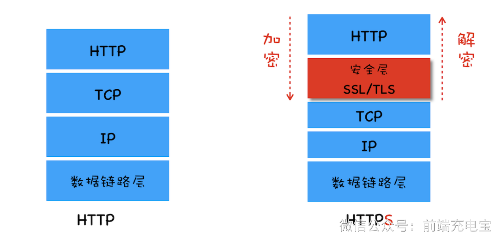
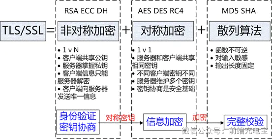
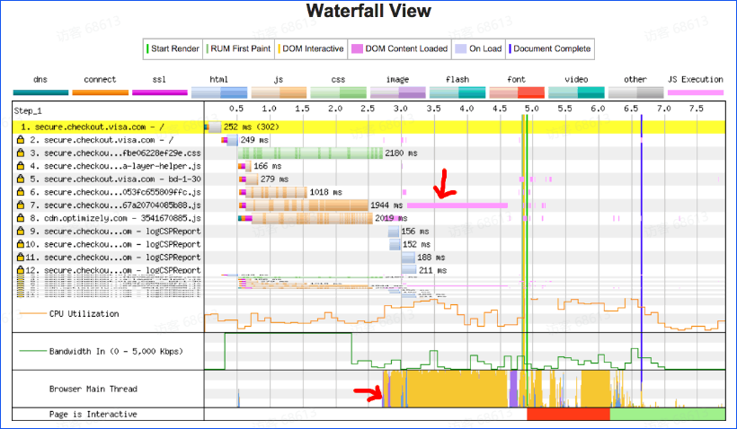
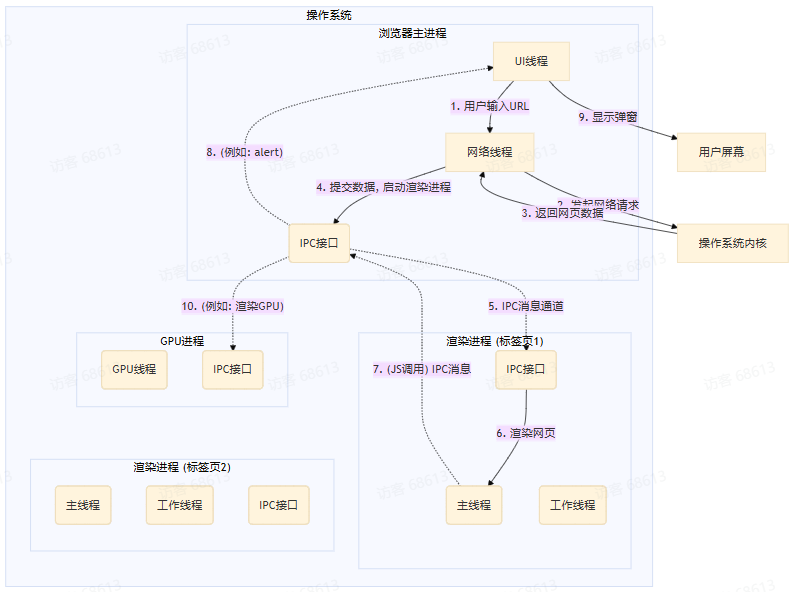

---
categories:
  - 前端核心原理知识进阶
---

# 基于Chrome浏览器渲染原理

> [王道计算机考研 计算机网络_哔哩哔哩_bilibili](https://www.bilibili.com/video/BV19E411D78Q/?spm_id_from=333.337.search-card.all.click&vd_source=ff414aaf189e3a685358d2a984fd4742) —— 传输层和应用层部分
>
> [1.6W字！梳理50道经典计算机网络面试题（收藏版）](../NodeJS/1.6W字！梳理50道经典计算机网络面试题（收藏版）.pdf)
>
> [计算机网络——面试题](../NodeJS/计算机网络)
>
> [计算机网络——前端充电宝](https://www.yuque.com/cuggz/feplus/cxuwy0)

## 0.目标

### 课程目标

#### 初中级

a. 理解浏览器的基本架构：学员将学习浏览器的多进程结构，包括浏览器主进程、渲染进程、网络进程等，以及它们如何协作处理网页内容。

b. 掌握DOM和CSSOM的构建过程：学员将了解浏览器是如何解析HTML和CSS，构建DOM树和CSSOM树，并学习这两者如何结合生成渲染树。

c. 学习页面的布局和绘制基础：介绍浏览器如何进行页面布局（Layout）和绘制（Paint），包括重排（Reflow）和重绘（Repaint）的触发条件和过程。

#### 高级

a. 探索高级渲染性能优化技术：学习现代浏览器的性能优化技术，包括异步加载、代码分割、硬件加速、以及如何利用浏览器的开发者工具进行性能分析和调试。

### 补充资料

关键渲染路径：https://developer.mozilla.org/zh-CN/docs/Web/Performance/Critical_rendering_path

进程类型 Enum：https://developer.chrome.com/docs/extensions/reference/api/processes#type-ProcessType

拓展 V8：https://v8.dev/docs/torque

Chromium V8 Promise 源码：https://chromium.googlesource.com/v8/v8/+/refs/tags/12.6.236/src/builtins/promise-jobs.tq

Chromium 多进程模型：https://www.chromium.org/developers/design-documents/multi-process-architecture/

### 核心面试题与解答

#### **请说说从输入 URL 到页面渲染完成的全过程**

答案：用户输入URL并回车后，浏览器主进程接收输入并发起导航，先判断是否复用渲染进程，网络进程同步进行缓存检查；随后网络进程完成DNS解析、建立TCP/QUIC连接、TLS握手（HTTPS协议）并发送HTTP请求，接收服务器响应后，将HTML数据流流式传递给渲染进程；渲染进程启动解析工作，解析HTML生成DOM树，解析CSS（外部CSS、内嵌CSS、行内CSS）生成CSSOM树，遇到JS脚本时，根据`defer`、`async`属性规则处理（无属性则阻塞DOM/CSSOM构建）；当DOM和CSSOM均构建完成后，合并生成渲染树（仅包含可见元素及对应样式）；接着执行布局（Layout）操作，计算渲染树中所有元素的几何位置和尺寸；随后执行绘制（Paint）操作，生成元素的像素绘制指令；再将绘制结果生成分层信息，提交给合成线程；合成线程将各图层传递给GPU进程，完成栅格化和图层合成后，将最终帧画面提交给系统显示管线，完成页面渲染；后续将持续监听用户交互，响应页面动态更新。

#### **DOM和CSSOM的关系和影响**

问题：

- 描述DOM和CSSOM是如何分别构建的？
- 它们是如何相互影响，最终形成渲染树的？
- 修改DOM或CSSOM中的元素对页面渲染有何影响？

答案：

- DOM（文档对象模型）是通过解析HTML文档构建的：浏览器接收HTML字节流，转换为字符编码，再解析为标记（标签、属性、文本），最后将标记转换为节点，按HTML层级结构连接形成DOM树，每个HTML标签、文本、属性都会对应DOM树中的一个节点，DOM构建是增量式进行的。
- CSSOM（CSS对象模型）是通过解析CSS样式信息构建的：浏览器解析外部CSS文件、`<style>`标签内嵌样式及元素行内样式，提取CSS规则，按样式层级关系组织形成CSSOM树，它反映了所有CSS规则及对应元素的样式属性，CSSOM构建是非增量式的，且CSS会阻塞渲染，需等待所有CSS解析完成才能生成完整CSSOM。
- DOM和CSSOM相互依赖、协同作用形成渲染树：只有当DOM和CSSOM均构建完成后，浏览器才会将两者合并，筛选出页面中可见的元素（排除`display: none;`元素、头部不可见元素等），并为可见元素绑定对应的CSS样式，最终生成渲染树，渲染树是布局和绘制的基础。
- 修改DOM或CSSOM都会影响页面渲染：修改DOM（如添加、删除、修改元素节点、改变元素结构）或CSSOM（如修改元素样式属性、新增CSS规则），都会导致渲染树重新构建，进而可能触发重排（Reflow）和重绘（Repaint），严重时会导致整个页面重新渲染，增加主线程负担，影响渲染性能；可借助`transform3d`开启GPU加速，减少重排的触发，提升渲染效率。

#### **浏览器的重排与重绘怎么理解**

问题：

- 解释什么是重排（Reflow）和重绘（Repaint）？
- 提供哪些常见操作会触发重排和重绘？
- 如何优化代码以减少重排和重绘的影响？

答案：

- 重排（Reflow）：又称回流，是浏览器重新计算页面布局的过程，当元素的几何属性（位置、尺寸、间距等）发生变化，或页面布局结构改变时，浏览器需要重新计算所有受影响元素的几何信息，更新元素在页面中的位置和尺寸，重排会触发后续的重绘和合成操作，对性能消耗较大。
- 重绘（Repaint）：是浏览器重新绘制元素像素的过程，当元素的外观属性（颜色、背景图、阴影、透明度等）发生变化，但几何属性（位置、尺寸）未改变时，浏览器无需重新计算布局，仅需重新绘制元素的视觉外观，重排一定会触发重绘，但重绘不一定触发重排。
- 常见触发操作：触发重排的操作包括修改DOM结构、改变元素`width`、`height`、`margin`、`padding`等盒模型属性、调整窗口大小、滚动页面、修改元素`display`属性等；触发重绘的操作包括修改元素`color`、`background-color`、`box-shadow`、背景图、透明度等外观属性。
- 优化方法：使用CSS类批量修改样式，而非直接操作元素样式属性；避免在循环中频繁操作DOM，可借助文档碎片（DocumentFragment）或虚拟DOM进行批量更新；动画优先使用`transform`和`opacity`属性，这类属性仅触发合成操作，不触发重排和重绘；减少不必要的DOM查询，缓存DOM元素引用；合理使用CSS分层，减少重排和重绘的影响范围。

#### **请说说浏览器的合成层**

问题：

- 什么是浏览器的合成层？
- 为何某些CSS属性可以触发GPU加速？
- 如何通过开发者工具来识别和优化合成层的性能？

答案：

- 合成层：是浏览器渲染流程的最后一个环节，浏览器处理完重排和重绘后，会将页面分割成多个独立的图层（合成层），每个合成层包含页面的一部分内容，合成线程会对每个合成层单独进行处理，再将所有合成层按层级叠加、合成，最终生成完整的页面视觉输出，合成层可单独被GPU处理，能有效提升渲染性能和动画流畅度。
- 部分CSS属性触发GPU加速的原因：`transform`、`opacity`等CSS属性，其变化仅影响元素的外观和位置变换，不涉及DOM的布局计算和像素绘制，无需主线程参与重排和重绘，可直接由合成线程处理；GPU（图形处理器）专门设计用于并行处理图形和视觉效果，处理这类变换比CPU更高效，因此使用这类属性会触发GPU加速，提升渲染性能。
- 合成层性能的识别与优化（基于Chrome开发者工具）：通过开发者工具的「Layers」面板（更多工具→Layers），可查看页面中所有合成层的信息，包括合成层的数量、大小、创建原因、内存占用等；优化方向包括：减少不必要的合成层（过多合成层会占用大量GPU内存，反而影响性能），合并可合并的合成层；避免合成层爆炸（如大量元素同时使用`transform: translateZ(0)`强制创建合成层）；调整动画使用`transform`、`opacity`等合适的属性，确保动画走合成线程；通过「Performance」面板配合查看合成层的渲染耗时，针对性优化

## 1.一个最常见的面试题

> 当浏览器中输入一行地址以后发生了什么？（例如https://www.baidu.com)

1. **URL 解析**

- 浏览器首先解析你输入的地址 `https://www.baidu.com`
- 分解出：
  - 协议（`https`）
  - 主机名（`www.baidu.com`）
  - 端口（`https` 默认 443）
  - 路径（`/`）
  - 查询参数（如果有）

---

2. **检查缓存**

浏览器会先看看本地有没有现成的资源，按顺序查找：

1. 浏览器缓存（Memory Cache / Disk Cache）
2. 操作系统缓存（DNS 缓存）
3. 路由器缓存
4. ISP DNS 缓存
   如果缓存命中，就直接用缓存返回数据，不再走后续步骤。

---

3. **DNS 解析**

如果缓存中没找到域名的 IP，需要向 DNS 服务器查询：

1. 浏览器调用操作系统的 **DNS 解析库**
2. OS 向本地配置的 DNS 服务器发起请求
3. 如果是多级域名，DNS 会从根域名服务器开始逐级解析：
   - 根 DNS → `.com` 顶级域 DNS → `baidu.com` 权威 DNS
4. 最终得到目标服务器的 **IP 地址**（比如 `220.181.38.150`）

---

4. **浏览器与服务器建立连接（TCP/IP）**

浏览器使用 IP 与服务器建立 TCP 连接：

1. **SYN**（浏览器 → 服务器，请求建立连接）
2. **SYN-ACK**（服务器 → 浏览器，同意建立连接）
3. **ACK**（浏览器 → 服务器，确认）
   连接建立后，浏览器和服务器之间可以可靠地收发数据。

HTTPS 会在 TCP 基础上进行 **TLS 握手**，确保数据加密传输：

1. 浏览器发送支持的加密算法和随机数
2. 服务器返回证书和公钥
3. 浏览器验证证书合法性
4. 双方协商会话密钥
   握手完成后，所有 HTTP 数据会被加密传输。

---

5. **浏览器发送HTTP请求**

浏览器构造请求报文：

```makefile
GET / HTTP/1.1
Host: www.baidu.com
User-Agent: ...
Accept: ...
```

通过 TCP 连接发送到服务器

---

6. **服务器处理请求**

服务器（比如 Nginx + 应用层）：

1. 接收请求数据
2. 根据 URL 路径匹配资源或调用后端程序
3. 查询数据库 / 缓存
4. 生成 HTTP 响应（包含 HTML / JSON / 图片等）

---

7. **返回 HTTP 响应**

- 服务器把响应通过 TCP 发送给浏览器

- 响应报文可能是：

  ```yaml
  HTTP/1.1 200 OK
  Content-Type: text/html
  Content-Length: 1024
  
  <html>...</html>
  ```

- 如果有 **压缩（gzip/br）**，浏览器需要解压

---

8. **浏览器渲染页面**

浏览器渲染引擎（如 Blink / WebKit）执行：

1. **解析 HTML** → 生成 DOM 树
2. **解析 CSS** → 生成 CSSOM 树
3. **合并 DOM + CSSOM** → 生成渲染树
4. **布局（Layout）**：计算元素位置和大小
5. **绘制（Paint）**：将像素绘制到屏幕
6. **执行 JavaScript**（如果遇到 `<script>` 标签，可能阻塞解析）
7. 如果页面有图片、CSS、JS 等资源，会**并行发起请求**（重复上述流程）

---

10. **连接关闭**

- 如果使用 HTTP/1.1 且有 `Connection: keep-alive`，TCP 连接会复用
- HTTP/2 / HTTP/3 会多路复用一个连接

## 2.体系结构

客户端与服务器之间进行通信，需要确定三个地址：`MAC地址`、`IP地址`、`端口号`。

- **MAC 地址**（物理地址）：定位 **同一局域网中** 的设备
- **IP 地址**（网络地址）：在 **整个互联网范围** 唯一定位一台设备（或者网络节点）
- **端口号**（进程地址）：在一台设备上区分不同的应用程序

根据 IP地址 + 端口号， 可以确定整个互联网中唯一一台设备的唯一进程。IP就好比快递传输中的通讯地址，进程好比收件人。那么MAC地址呢？如果需要跨省传输，那么快递会经过中转站，MAC地址也会改变。也就是<font color='#409eff'>IP地址不变，MAC地址每跳改变，端口号唯一定位进程</font>。

- 源IP和目的IP地址不会变。始终表示【发货地 -> 目的地】
- 源MAC地址和目的MAC地址可能改变。【发货地 -> A省中转站】 -> 【A省中转站 -> B省中转站】 -> 【B省中转站 -> 目的地】

其中

- 端口号是默认或者手动配置的，在传输层添加。
- IP地址通过DNS解析域名得到，在网络层添加。
- MAC地址通过ARP协议，利用IP地址获取，在数据链路层添加。

> 假设客户端向服务器发送一个 HTTP 请求，整个过程从应用层开始，依次经过传输层、网络层、数据链路层，到物理层发送出去，服务器再反向解析，完成通信。

1. 应用层（Application Layer）

- **作用**：提供用户直接使用的服务，处理具体应用协议，比如 HTTP、FTP、SMTP、DNS 等。
- **过程**：
  - 用户在浏览器输入 URL 发起 HTTP 请求。
  - 应用层生成符合 HTTP 协议格式的数据（请求报文），准备发送。
  - 调用下一层（传输层）接口发送数据。

2. 传输层（Transport Layer）

- **作用**：实现端到端的通信管理，提供可靠（TCP）或不可靠（UDP）的传输服务，负责分段、重传、流量控制、端口管理。
- **过程**：
  - 应用层数据被切分成传输层的数据段（TCP 段或 UDP 数据报）。
  - 为数据段添加**源端口和目的端口号**，确定通信的进程。
  - 如果是 TCP，会建立连接（三次握手），保证可靠传输。
  - 数据段传给下一层（网络层）。

3. 网络层（Network Layer）

- **作用**：负责数据包**从源主机到目标主机的路由选择和转发，主要协议是 IP**。
- **过程**：
  - 传输层传过来的数据段被封装成数据包（IP 包）。
  - 添加源 IP 和目的 IP 地址。
  - 网络层根据目标 IP 寻找路由路径，决定发送到哪个下一跳。
  - 发送给数据链路层。

4. 数据链路层（Data Link Layer）

- **作用**：负责相邻节点之间的可靠传输，处理物理地址（MAC）、帧的封装和差错检测。
- **过程**：
  - 将网络层传来的数据包封装成帧（Frame）。
  - **添加源 MAC 和目的 MAC 地址**。
  - 通过帧校验序列（FCS）实现差错检测。
  - 发送到物理层。

5. 物理层（Physical Layer）

- **作用**：负责物理传输媒体上的比特流传输，如电信号、光信号等。
- **过程**：
  - 把数据链路层的帧转化成适合传输的电信号或光信号。
  - 通过网线、光纤、无线信道等物理媒介发送给目标设备。

传输到目标服务器后，接收端的流程是反向的：

1. **物理层**接收信号，转成比特流交给数据链路层。
2. **数据链路层**解析帧，校验数据，提取数据包。
3. **网络层**检查 IP 地址，进行路由处理，将数据包交给传输层。
4. **传输层**重组数据段，校验完整性，确认端口，组装成应用层数据。
5. **应用层**根据协议解析数据，完成请求处理（如 HTTP 请求被 Web 服务器解析），返回响应。

```scss
客户端（发送端）
应用层 (HTTP请求)
    ↓
传输层 (TCP段，加端口)
    ↓
网络层 (IP包，加IP地址)
    ↓
数据链路层 (帧，加MAC地址)
    ↓
物理层 (电信号/光信号)

--------------------网络传输--------------------

服务器端（接收端）
物理层 (接收信号)
    ↑
数据链路层 (帧解包，MAC地址校验)
    ↑
网络层 (IP解包，路由处理)
    ↑
传输层 (TCP重组，端口校验)
    ↑
应用层 (HTTP请求解析)
```

<font color='#409eff'>为什么同时需要IP地址和MAC地址：</font>

**MAC 地址（物理地址 / 硬件地址）**

- 作用：
  用来标识 **同一局域网内** 的网络设备，在数据链路层用于点对点传输。

- 特性：

  - 唯一性：理论上全球唯一。
  - 不可更改（可以通过软件伪造）。
  - 只在局域网范围内有效，跨网络传输时会被替换（由路由器处理）。

**IP 地址（逻辑地址）**

  - **作用**：
    用于在 **不同网络之间** 定位主机，实现数据包的路由转发。

  - **特性**：

    - 逻辑性：可以手动配置，也可以自动分配（DHCP）。
    - 会变化（设备换网络、换运营商，IP就可能变）。
    - 在跨网通信时必须依赖IP进行寻址。

    > MAC地址跨网络传输时会被更新，起到中转的作用。

    示例：你的电脑（Client）要访问 **`www.example.com`** 服务器（Server）。

**步骤 1：DNS 解析**

1. 你在浏览器输入 `www.example.com`。
2. 浏览器向 **DNS 服务器** 查询，获取目标服务器的 **IP 地址**（假设是 `93.184.216.34`）。
3. 现在你的电脑知道了对方的 IP 地址，但还不知道对方的 **MAC 地址**。

**步骤 2：ARP 获取 MAC 地址（局域网内通信）**

1. 如果目标 IP 在**同一个局域网**：
   - 电脑发出 **ARP 广播**（"谁是 93.184.216.34，请告诉我你的 MAC 地址"）。
   - 目标主机返回自己的 MAC 地址。
2. 如果目标 IP 不在同一个局域网（大多数访问互联网的情况）：
   - 电脑会先查本地路由表，发现目标 IP 要通过**网关（路由器）**转发。
   - 电脑用 ARP 请求获取 **网关的 MAC 地址**（因为第一跳是网关，而不是服务器）。

**步骤 3：封装并发送数据**

1. 电脑把数据封装成 **IP 包**（源 IP = 你的电脑，目标 IP = 服务器）。
2. 在 IP 包外面再封装一层 **以太网帧**（源 MAC = 你的电脑，目标 MAC = 网关的 MAC）。
3. 数据从你的电脑发到网关。

**步骤 4：跨网络传输（路由器处理）**

1. 网关收到帧后，解封装，读取 IP 头，发现目标 IP 在外网。
2. 根据路由表，把数据转发给下一个路由器：
   - <font color='#409eff'>修改以太网帧的 **源 MAC** = 自己的 MAC，**目标 MAC** = 下一跳路由器的 MAC。</font>
   - **IP 地址保持不变**（源 IP 依旧是你的电脑，目标 IP 依旧是服务器）。
3. 经过多个路由器，这个过程不断重复。

**步骤 5：目标服务器接收**

1. 数据到达服务器所在的局域网后，最后一个路由器通过 ARP 找到服务器的 MAC 地址。
2. 以太网帧（目标 MAC = 服务器 MAC）送到服务器。
3. 服务器解封装，以 IP 为依据确认是发给自己的，然后交给 TCP/应用层处理。

**核心要点**

- **IP 地址**：跨网络定位主机（类似全球地址系统）。
- **MAC 地址**：在局域网内唯一标识设备（类似局域网内门牌号）。
- **ARP 协议**：IP ↔ MAC 之间的翻译员。
- 在跨网通信中，**IP 地址不变**，**MAC 地址每一跳都会改变**（因为每一跳的物理链路是不同的）。

## 3.DNS解析

### 1. DNS 协议的概念

**概念**： DNS 是域名系统 (Domain Name System) 的缩写，提供的是一种主机名到 IP 地址的转换服务，就是我们常说的域名系统。它是一个由分层的 DNS 服务器组成的分布式数据库，是定义了主机如何查询这个分布式数据库的方式的应用层协议。能够使人更方便的访问互联网，而不用去记住能够被机器直接读取的IP数串。

**作用**： 将域名解析为IP地址，客户端向DNS服务器（DNS服务器有自己的IP地址）发送域名查询请求，DNS服务器告知客户机Web服务器的IP 地址。

### 2. DNS同时使用TCP和UDP协议

**DNS占用53号端口，同时使用TCP和UDP协议。**

（1）在区域传输的时候使用TCP协议

- 辅域名服务器会定时（一般3小时）向主域名服务器进行查询以便了解数据是否有变动。如有变动，会执行一次区域传送，进行数据同步。区域传送使用TCP而不是UDP，因为数据同步传送的数据量比一个请求应答的数据量要多得多。
- TCP是一种可靠连接，保证了数据的准确性。

（2）在域名解析的时候使用UDP协议

- 客户端向DNS服务器查询域名，一般返回的内容都不超过512字节，用UDP传输即可。不用经过三次握手，这样DNS服务器负载更低，响应更快。理论上说，客户端也可以指定向DNS服务器查询时用TCP，但事实上，很多DNS服务器进行配置的时候，仅支持UDP查询包。

### 3. DNS完整的查询过程

DNS服务器解析域名的过程：

- 首先会在**浏览器的缓存**中查找对应的IP地址，如果查找到直接返回，若找不到继续下一步
- 将请求发送给**本地DNS服务器**，在本地域名服务器缓存中查询，如果查找到，就直接将查找结果返回，若找不到继续下一步
- 本地DNS服务器向**根域名服务器**发送请求，根域名服务器会返回一个所查询域的顶级域名服务器地址
- 本地DNS服务器向**顶级域名服务器**发送请求，接受请求的服务器查询自己的缓存，如果有记录，就返回查询结果，如果没有就返回相关的下一级的权威域名服务器的地址
- 本地DNS服务器向**权威域名服务器**发送请求，域名服务器返回对应的结果
- 本地DNS服务器将返回结果保存在缓存中，便于下次使用
- 本地DNS服务器将返回结果返回给浏览器

比如我们如果想要查询 [www.baidu.com](http://www.baidu.com/) 的 IP 地址，我们首先会在浏览器的缓存中查找是否有该域名的缓存，如果不存在就将请求发送到本地的 DNS 服务器中，本地DNS服务器会判断是否存在该域名的缓存，如果不存在，则向根域名服务器发送一个请求，根域名服务器返回负责 .com 的顶级域名服务器的 IP 地址的列表。然后本地 DNS 服务器再向其中一个负责 .com 的顶级域名服务器发送一个请求，负责 .com 的顶级域名服务器返回负责 .baidu 的权威域名服务器的 IP 地址列表。然后本地 DNS 服务器再向其中一个权威域名服务器发送一个请求，最后权威域名服务器返回一个对应的主机名的 IP 地址列表。

### 4.迭代查询与递归查询

实际上，DNS解析是一个包含迭代查询和递归查询的过程。

- **递归查询**指的是查询请求发出后，域名服务器代为向下一级域名服务器发出请求，最后向用户返回查询的最终结果。使用递归 查询，用户只需要发出一次查询请求。
- **迭代查询**指的是查询请求后，域名服务器返回单次查询的结果。下一级的查询由用户自己请求。使用迭代查询，用户需要发出 多次的查询请求。

一般我们向本地 DNS 服务器发送请求的方式就是递归查询，因为我们只需要发出一次请求，然后本地 DNS 服务器返回给我 们最终的请求结果。而本地 DNS 服务器向其他域名服务器请求的过程是迭代查询的过程，因为每一次域名服务器只返回单次 查询的结果，下一级的查询由本地 DNS 服务器自己进行。

### 5. DNS 记录和报文

DNS 服务器中以资源记录的形式存储信息，每一个 DNS 响应报文一般包含多条资源记录。一条资源记录的具体的格式为

`（Name，Value，Type，TTL）`

其中 TTL 是资源记录的生存时间，它定义了资源记录能够被其他的 DNS 服务器缓存多长时间。

常用的一共有四种 Type 的值，分别是 A、NS、CNAME 和 MX ，不同 Type 的值，对应资源记录代表的意义不同。

1. 如果 Type = A，则 Name 是主机名，Value 是主机名对应的 IP 地址。因此一条记录为 A 的资源记录，提供了标 准的主机名到 IP 地址的映射。
2. 如果 Type = NS，则 Name 是个域名，Value 是负责该域名的 DNS 服务器的主机名。这个记录主要用于 DNS 链式 查询时，返回下一级需要查询的 DNS 服务器的信息。
3. 如果 Type = CNAME，则 Name 为别名，Value 为该主机的规范主机名。该条记录用于向查询的主机返回一个主机名 对应的规范主机名，从而告诉查询主机去查询这个主机名的 IP 地址。主机别名主要是为了通过给一些复杂的主机名提供 一个便于记忆的简单的别名。
4. 如果 Type = MX，则 Name 为一个邮件服务器的别名，Value 为邮件服务器的规范主机名。它的作用和 CNAME 是一 样的，都是为了解决规范主机名不利于记忆的缺点。

## 4.TCP和UDP协议

### 【TCP与UDP协议特点】

**TCP 协议特点**

- **面向连接**：通信前需要建立连接（三次握手）。
- **可靠传输**：通过**确认应答、重传机制**保证数据不丢失、不乱序。
- **面向字节流**：数据被看作连续的字节流，没有明确边界。
- **流量控制**：通过滑动窗口控制发送速率，避免接收方处理不过来。
- **拥塞控制**：慢启动、拥塞避免、快速重传等算法，避免网络拥堵。
- **开销相对大**：头部20字节起。

**UDP 协议特点**

- **无连接**：发送数据前不建立连接，直接发送。
- **不保证可靠性**：不确认、不重传，可能丢包、乱序。
- **面向报文**：发送方一次发送的数据作为一个整体接收，保留数据边界。
- **速度快**：无握手和复杂控制，延迟低。
- **开销小**：头部只有8字节。
- **常用于**：实时通信（视频、语音）、广播、多播、DNS查询等。

**TCP vs UDP 对比表**

| 特性     | TCP              | UDP             |
| -------- | ---------------- | --------------- |
| 是否连接 | 面向连接         | 无连接          |
| 可靠性   | 可靠             | 不可靠          |
| 数据顺序 | 保证顺序         | 不保证          |
| 传输形式 | 字节流           | 报文            |
| 速度     | 较慢             | 快              |
| 开销     | 大（20字节以上） | 小（8字节）     |
| 场景     | HTTP、FTP、SMTP  | 视频、语音、DNS |

**应用场景**

- **TCP**：需要可靠性和顺序的传输（如网页、文件、邮件）。
- **UDP**：追求速度、容忍少量丢包的应用（如直播、游戏、DNS）。

### 【面试考点】

- UDP协议特点
- TPC协议特点
- TPC三次握手（为什么不采用二次握手）
- TPC四次挥手（为什么不采用三次挥手）
- TPC拥塞控制（慢开始，拥塞控制，快开始，快重传）
- TPC流量控制（根据返回窗口和拥塞窗口计算）
- TPC可靠传输（校验（不是重点）—— 序号 —— 确认 —— 重传（超时重传和快重传）

<font color='#409eff'>具体内容见标题下方PDF笔记链接</font>

## 5.HTTP协议

### 【HTTP协议概述】

HTTP 是超文本传输协议，它定义了客户端和服务器之间交换报文的格式和方式，默认使用 80 端口。它使用 TCP 作为传输层协议，保证了数据传输的可靠性。

HTTP协议具有以下**优点**：

- 支持客户端/服务器模式
- **简单快速**：客户向服务器请求服务时，只需传送请求方法和路径。由于 HTTP 协议简单，使得 HTTP 服务器的程序规模小，因而通信速度很快。
- **无连接**：无连接的含义是限制每次链接只处理一个请求。服务器处理完客户的请求，并收到客户的应答后，即断开链接，采用这种方式可以节省传输时间。
- **无状态**：HTTP 协议是无状态协议，这里的状态是指通信过程的上下文信息。缺少状态意味着如果后续处理需要前面的信息，则它必须重传，这样可能会导致每次连接传送的数据量增大。另一方面，在服务器不需要先前信息时它的应答就比较快。
- **灵活**：HTTP 允许传输任意类型的数据对象。正在传输的类型由 Content-Type 加以标记。

HTTP协议具有以下**缺点**：

- **无状态：**HTTP 是一个无状态的协议，HTTP 服务器不会保存关于客户的任何信息。
- **明文传输：**协议中的报文使用的是文本形式，这就直接暴露给外界，不安全。
- **不安全**

（1）通信使用明文（不加密），内容可能会被窃听

（2）不验证通信方的身份，因此有可能遭遇伪装

（3）无法证明报文的完整性，所以有可能已遭篡改

### 【HTTP连接方式】

HTTP 协议是基于 TCP/IP，并且使用了**请求-应答**的通信模式，所以性能的关键就在这两点里。

- **长连接**

HTTP协议有两种连接模式，一种是持续连接，一种非持续连接。

（1）非持续连接指的是服务器必须为每一个请求的对象建立和维护一个全新的连接。

（2）持续连接下，TCP 连接默认不关闭，可以被多个请求复用。采用持续连接的好处是可以避免每次建立 TCP 连接三次握手时所花费的时间。

对于不同版本的采用不同的连接方式：

- 在HTTP/1.0 每发起一个请求，都要新建一次 TCP 连接（三次握手），而且是串行请求，做了无畏的 TCP 连接建立和断开，增加了通信开销。该版本使用的非持续的连接，但是可以在请求时，加上 Connection: keep-a live 来要求服务器不要关闭 TCP 连接。
- 在HTTP/1.1 提出了**长连接**的通信方式，也叫持久连接。这种方式的好处在于减少了 TCP 连接的重复建立和断开所造成的额外开销，减轻了服务器端的负载。该版本及以后版本默认采用的是持续的连接。目前对于同一个域，大多数浏览器支持同时建立 6 个持久连接。

- **管道网络传输**

HTTP/1.1 采用了长连接的方式，这使得管道（pipeline）网络传输成为了可能。

管道（pipeline）网络传输是指：可以在同一个 TCP 连接里面，客户端可以发起多个请求，只要第一个请求发出去了，不必等其回来，就可以发第二个请求出去，可以减少整体的响应时间。但是服务器还是按照顺序回应请求。要是前面的回应特别慢，后面就会有许多请求排队等着。这称为队头堵塞。<font color='#409eff'>也就是流水线式连接</font>。

### 【HTTP无连接含义】

1. “无连接”指的是**应用层的逻辑连接**

- HTTP是**应用层协议**，设计时的“无连接”是指：
  - **每个请求/响应完成后，应用层不会保留连接状态**
  - 一次请求处理完毕，双方不会保存这次会话的信息
- 换句话说，HTTP协议本身不管理连接的持续，也不维持会话状态

2. HTTP与传输层TCP的关系

- HTTP协议基于**传输层TCP协议**
- TCP是**面向连接的协议**，会建立并维护连接（如三次握手、四次挥手）
- 但HTTP层面，在一次请求-响应完成后，默认关闭TCP连接（HTTP/1.0短连接）

3. 什么叫无连接

- 请求和响应是**独立的**
- 不需要也不保持之前请求的状态
- 每次请求都必须携带完成该请求所需的全部信息（例如cookies、认证信息等）

4. 现代HTTP的持久连接

- HTTP/1.1引入持久连接，允许复用底层TCP连接，但仍然保持HTTP层的无状态特性
- 即使连接保持，HTTP仍然是无连接协议，因为它不维护会话信息，状态由应用管理

<font color='#409eff'>HTTP的无连接也使得HTTP是无状态的</font>。

### 【HTTP无状态含义】

**1. 定义**

- **HTTP是无状态协议**，意味着**服务器不会自动保留客户端之前请求的任何信息**。
- 每一次HTTP请求都是**独立的、互不关联**的。

2. **具体表现**

- 当客户端向服务器发送请求时，服务器仅根据当前请求来处理，并不依赖之前的请求。
- 请求处理完毕后，服务器不会保存任何会话信息（状态）。
- 下一次请求服务器不会“记得”之前的任何事情。

3. **举例说明**

- 你第一次访问一个购物网站，添加商品到购物车后关闭页面。
- 第二次访问时，如果没有额外机制，服务器不知道你之前放了什么商品，因为HTTP本身不保存状态。

4. **无状态带来的问题**

- 不能自动跟踪用户会话
- 需要通过其他机制实现状态管理（例如：Cookie、Session、Token）

5. **如何解决无状态？**

- **Cookie**：浏览器保存少量信息，随请求发送给服务器
- **Session**：服务器存储用户状态，客户端通过Cookie保存会话ID
- **Token**：如JWT，包含用户身份信息，客户端每次请求携带

6. **为什么设计为无状态？**

- 简化服务器设计，提高性能和可伸缩性
- 服务器无需保存大量状态信息，方便分布式部署

### 【HTTP1.1】

**HTTP 1.1版本**较之前的1.0版本又有了更大的更新，它进一步完善了HTTP协议，现在仍然有在使用，它主要有以下更新：

- **持久连接（长连接）**
  该版本之前的版本所建立的都是短连接，该版本引入了持久连接的概念，就是TCP连接默认是不关闭的，建立一个TCP连接，就可以发送多个请求，减少了建立和关闭连接的消耗和延迟。
  在请求头设置一个非标准的Connection字段:`Connection: keep-alive`就可以进行长连接，这个字段要求服务器不要关闭TCP连接，服务器同样会回应这个字段。如果想要关闭TCP连接，就要在请求中设置字段：`Connection: false`
- **管道机制(流水线式）**：该版本还引入了管道机制，即在一个TCP连接里，客户端可以同时发送多个请求，不需要等收到上一个请求回应，就可以发送新的请求，但是请求的响应还是按照请求发送的顺序返回的，这样就进一步提高了HTTP协议的效率
- **分块传输编码**：在HTTP1.0版本中，如果在服务器端遇到较为耗费时间的操作，那么需要等到这一操作全部完成后，才会向客户端发送数据，这段等待时间很影响性能和客户体验。多以使用**分块传输编码**，只要请求或者回应的头部信息有`Transfer-Encoding`字段：`Transfer-Encoding: chunked`，就表明回应将由数量未定的数据块组成。每个非空的数据块之前，会有一个16进制的数值，表示这个块的长度。最后是一个大小为0的块，就表示本次回应的数据发送完了
- 加入了新的**请求方法**：**PUT、PATCH、HEAD、 OPTIONS、DELETE**
- 优化了**缓存机制**：**强缓存**和**协商缓存**
- 客户端请求的头部信息**加入了**`Host`**字段**，用来指定服务器的域名，这样就可以区分同一个物理主机中的不同虚拟主机的域名

### 【HTTP状态码】

应用通常就是客户端向服务器发出请求，服务器做出响应。状态码就是让我们知道 HTTP 请求是成功、失败还是其他。HTTP状态码通常分为五类：

| **类别** | **定义**                        | **描述**                   |
| -------- | ------------------------------- | -------------------------- |
| 1xx      | Informational(信息性状态码)     | 接受的请求正在处理         |
| 2xx      | Success(成功状态码)             | 请求正常处理完毕           |
| 3xx      | Redirection(重定向状态码)       | 需要进行附加操作来完成请求 |
| 4xx      | Client Error (客户端错误状态码) | 服务器无法处理请求         |
| 5xx      | Server Error(服务器错误状态码)  | 服务器处理请求出错         |

**常见状态码介绍**

- **200 OK**：请求成功，服务器返回请求的数据。
- **301 Moved Permanently**：资源已被永久移动到新地址，客户端应更新请求链接。
- **302 Found**：资源临时移动，客户端应继续使用原地址。
- **304 Not Modified**：资源未修改，客户端可使用缓存，节省带宽。
- **400 Bad Request**：请求参数错误，服务器无法理解请求。
- **401 Unauthorized**：请求未经授权，需进行身份验证。
- **403 Forbidden**：服务器拒绝访问，权限不足。
- **404 Not Found**：请求资源不存在。
- **500 Internal Server Error**：服务器内部错误，无法完成请求。
- **503 Service Unavailable**：服务器暂时不可用，可能过载或维护。

更详细的 **HTTP状态码** 总结：

1xx - 信息性状态码（暂时响应）

| 状态码 | 含义                            | 说明                                           |
| ------ | ------------------------------- | ---------------------------------------------- |
| 100    | Continue（继续）                | 服务器已收到请求，客户端继续发送请求的剩余部分 |
| 101    | Switching Protocols（切换协议） | 服务器同意切换协议                             |

2xx - 成功状态码

| 状态码 | 含义       | 说明                           |
| ------ | ---------- | ------------------------------ |
| 200    | OK         | 请求成功，服务器返回请求的数据 |
| 201    | Created    | 请求成功且服务器创建了新的资源 |
| 202    | Accepted   | 请求已接受，但未处理完成       |
| 204    | No Content | 请求成功，但没有内容返回       |

3xx - 重定向状态码

| 状态码 | 含义                          | 说明                             |
| ------ | ----------------------------- | -------------------------------- |
| 301    | Moved Permanently（永久移动） | 请求的资源已永久移动到新URL      |
| 302    | Found（临时移动）             | 请求的资源临时移动               |
| 303    | See Other                     | 请求的响应可以在另一个URL获得    |
| 304    | Not Modified（未修改）        | 资源未修改，客户端可使用缓存内容 |
| 307    | Temporary Redirect            | 临时重定向，方法不变             |
| 308    | Permanent Redirect            | 永久重定向，方法不变             |

4xx - 客户端错误状态码

| 状态码 | 含义                    | 说明                               |
| ------ | ----------------------- | ---------------------------------- |
| 400    | Bad Request（错误请求） | 请求参数有误，服务器无法理解       |
| 401    | Unauthorized（未授权）  | 需要身份验证，用户未登录或认证失败 |
| 403    | Forbidden（禁止访问）   | 服务器拒绝请求，权限不足           |
| 404    | Not Found（未找到）     | 请求资源不存在                     |
| 405    | Method Not Allowed      | 请求方法不被允许                   |
| 408    | Request Timeout         | 请求超时                           |
| 429    | Too Many Requests       | 请求过多，限流                     |

5xx - 服务器错误状态码

| 状态码 | 含义                                    | 说明                                   |
| ------ | --------------------------------------- | -------------------------------------- |
| 500    | Internal Server Error（服务器内部错误） | 服务器发生错误，无法完成请求           |
| 501    | Not Implemented                         | 服务器不支持请求的功能                 |
| 502    | Bad Gateway                             | 网关错误，服务器作为代理时接收无效响应 |
| 503    | Service Unavailable                     | 服务器不可用，可能过载或维护           |
| 504    | Gateway Timeout                         | 网关超时                               |

### 【HTTP请求方法】

#### 1. GET

- **作用**：请求访问指定资源，获取资源的表示（数据）。
- **特点**：只读操作，不应有副作用，幂等（多次请求结果相同）。
- **常用场景**：获取网页内容、查询数据等。

#### 2. POST

- **作用**：向服务器提交数据，用于创建资源或触发操作。
- **特点**：非幂等，可能产生副作用（比如新增数据）。
- **常用场景**：提交表单、上传文件、创建新资源。

#### 3. PUT

- **作用**：更新指定资源，或者如果资源不存在则创建。
- **特点**：幂等（多次执行结果相同）。
- **常用场景**：修改用户信息、更新数据。

#### 4. DELETE

- **作用**：删除指定资源。
- **特点**：幂等。
- **常用场景**：删除数据库中的记录或文件。

#### 5. HEAD

- **作用**：类似GET请求，但只请求响应头，不返回响应体。
- **用途**：检测资源是否存在、检查更新、获取元数据。

#### 6. OPTIONS

- **作用**：询问服务器支持的HTTP方法。
- **用途**：跨域请求时，浏览器发起预检请求。

#### 7. PATCH

- **作用**：对资源进行部分修改。
- **特点**：非幂等，修改部分字段。
- **常用场景**：局部更新资源数据。

### 【HTTP请求报文结构】

HTTP请求报文由三部分组成：

1. **请求行（Request Line）**
2. **请求头部（Request Headers）**
3. 空行
4. **请求体（Request Body）**（可选）

#### **请求行（Request Line）**

请求行是请求报文的第一行，包含三个部分：`方法 请求URL 协议版本`

- **方法（Method）**：表示客户端希望对资源执行的操作，比如：
  - GET（请求资源）
  - POST（提交数据）
  - PUT（更新资源）
  - DELETE（删除资源）
  - HEAD、OPTIONS、PATCH等
- **请求URL（Request-URI）**：请求的资源地址，通常是相对路径，如 `/index.html`。
- **协议版本（HTTP Version）**：一般是 HTTP/1.1 或 HTTP/2。

示例：

```js
GET /index.html HTTP/1.1
```

#### 请求头部（Request Headers）

请求头部是若干行键值对，用于描述客户端环境、请求特性等信息。格式为：`字段名: 字段值`

常见请求头字段包括：

- `Host`：请求的主机名和端口（HTTP/1.1中必须）
- `User-Agent`：客户端浏览器或工具信息
- `Accept`：客户端可接受的响应内容类型
- `Accept-Language`：客户端可接受的语言
- `Accept-Encoding`：客户端可接受的压缩编码
- `Connection`：是否保持连接（keep-alive）
- `Cookie`：客户端携带的Cookie信息
- `Content-Type`：请求体的数据类型（POST等请求才有）
- `Content-Length`：请求体长度

示例：

```yaml
Host: www.example.com
User-Agent: Mozilla/5.0 (Windows NT 10.0; Win64; x64)
Accept: text/html,application/xhtml+xml
Connection: keep-alive
```

`Content-Type`常用类型：

| 使用场景         | Content-Type                        |
| ---------------- | ----------------------------------- |
| 普通文本传输     | `text/plain; charset=utf-8`         |
| 浏览器请求网页   | `text/html; charset=utf-8`          |
| AJAX请求JSON数据 | `application/json`                  |
| HTML表单提交     | `application/x-www-form-urlencoded` |
| 文件上传         | `multipart/form-data`               |
| 图片显示         | `image/png`、`image/jpeg`           |
| 下载二进制文件   | `application/octet-stream`          |

#### 请求体（Request Body）

请求体是请求的实体内容，只有在某些请求方法中才有（如 POST、PUT）。用于发送提交的数据，比如表单数据、JSON等。

### 【HTTP响应报文结构】

HTTP响应报文由三部分组成：

1. **响应行（Response Line）**
2. **响应头部（Response Headers）**
3. 空行
4. **响应体（Response Body）**

#### 响应行（Response Line）

响应行是响应报文的第一行，包含三个部分：`协议版本 状态码 状态描述`

- **协议版本**：如 HTTP/1.1
- **状态码（Status Code）**：三位数字，表示响应状态，如：
  - 1xx：信息性状态
  - 2xx：成功（200 OK）
  - 3xx：重定向
  - 4xx：客户端错误（404 Not Found）
  - 5xx：服务器错误（500 Internal Server Error）
- **状态描述**：对状态码的简短描述，如 OK、Not Found 等

示例：

```php
HTTP/1.1 200 OK
```

#### 响应头部（Response Headers）

响应头部是若干行键值对，描述服务器和响应体的相关信息，格式同请求头：

常见响应头字段：

- `Content-Type`：响应体的数据类型，如 `text/html`、`application/json`
- `Content-Length`：响应体的字节长度
- `Server`：服务器软件信息
- `Set-Cookie`：服务器向客户端设置Cookie
- `Cache-Control`：缓存策略
- `Date`：响应时间
- `Connection`：连接状态

示例：

```yaml
Content-Type: text/html; charset=UTF-8
Content-Length: 138
Server: Apache/2.4.41 (Ubuntu)
Connection: keep-alive
```

响应头部与响应体之间也用空行分隔。

#### 响应体（Response Body）

响应体包含服务器返回给客户端的具体资源内容，比如HTML页面、图片、JSON数据等。它的格式和内容由 `Content-Type` 头部决定。

## 6.强缓存和协商缓存

### 【缓存基础】

浏览器缓存分为两大类：

- **强缓存（强制缓存，Fresh Cache）**：直接使用缓存，不发请求给服务器。
- **协商缓存（协商验证缓存，Conditional Cache）**：先向服务器询问资源是否更新，服务器判断后决定是否返回资源。

浏览器会先判断是否使用强缓存，强缓存未命中时才发起协商缓存请求。

### 【强缓存（强制缓存）】

#### 1. 工作流程

浏览器访问资源时：

- 先检查该资源是否存在且未过期的强缓存。
- 如果存在且有效，直接从缓存读取，不发起网络请求。
- 如果强缓存失效，浏览器才会发起网络请求。

#### 2. 设置方式（响应头）

服务器通过HTTP响应头告诉浏览器缓存资源的有效时间：

- `Expires`（HTTP/1.0，绝对时间，格式固定）
- `Cache-Control`（HTTP/1.1，推荐，优先级更高）

**具体说明**

- `Expires: <GMT时间>`
  表示资源过期时间，客户端只要在过期时间内，使用缓存。但`Expires`是绝对时间，可能受客户端和服务器时间不一致影响。
- `Cache-Control: max-age=<秒>`
  指定资源在客户端缓存的最大生命周期（秒）。max-age优先级高于Expires。
- 其他 Cache-Control 指令：
  - `public`：所有缓存都可以缓存
  - `private`：只有私有缓存可缓存（浏览器）
  - `no-cache`：不使用强缓存（需协商缓存）
  - `no-store`：不缓存

#### 3. 举例

```yaml
Cache-Control: max-age=3600
Expires: Wed, 11 Aug 2025 12:00:00 GMT
```

表示缓存1小时有效期，1小时内访问不请求服务器。

### 【协商缓存（协商验证缓存）】

#### 1. 工作流程

- 当强缓存失效，浏览器会带上上次缓存时服务器返回的**标识**向服务器发起请求，询问资源是否更新。
- 服务器根据标识判断资源是否改变：
  - 如果未改变，返回 `304 Not Modified`，浏览器使用缓存资源。
  - 如果改变，返回新的资源和状态码 `200 OK`。

#### 2. 设置方式（请求头 + 响应头）

服务器通过响应头告诉客户端标识，下次请求时客户端会带上验证标识。

**两种常用验证方式**

| 验证方式                              | 说明                                     | 相关头部                                                     |
| ------------------------------------- | ---------------------------------------- | ------------------------------------------------------------ |
| **Last-Modified / If-Modified-Since** | 通过最后修改时间比较是否更新             | 服务器响应头：`Last-Modified`   浏览器请求头：`If-Modified-Since` |
| **ETag / If-None-Match**              | 通过文件的唯一标识（哈希等）比较是否更新 | 服务器响应头：`ETag`   浏览器请求头：`If-None-Match`         |

#### 具体过程举例

1. 服务器返回：

```yaml
Last-Modified: Tue, 11 Aug 2025 08:00:00 GMT
ETag: "33a64df551425fcc55e4d42a148795d9f25f89d4"
```

2. 浏览器下次请求带：

```yaml
If-Modified-Since: Tue, 11 Aug 2025 08:00:00 GMT
If-None-Match: "33a64df551425fcc55e4d42a148795d9f25f89d4"
```

3. 服务器判断资源是否变化：

- 没变化，返回状态码 `304 Not Modified`，无响应体。
- 变化，返回状态码 `200 OK` 和新的资源。

### 【对比总结】

| 方面           | 强缓存                                | 协商缓存                                     |
| -------------- | ------------------------------------- | -------------------------------------------- |
| 作用           | 直接使用缓存，完全不请求服务器        | 先向服务器询问资源是否改变                   |
| 触发条件       | 缓存有效期内                          | 缓存过期或无强缓存时触发                     |
| 缓存时间控制   | 通过 `Cache-Control` / `Expires` 设置 | 服务器通过`Last-Modified`/`ETag`提供验证标识 |
| 网络请求       | 无                                    | 有请求，但服务器可能返回304                  |
| 性能           | 更快，不发请求                        | 需要发请求但节省传输资源                     |
| 是否返回响应体 | 不返回                                | 未变时不返回，变时返回                       |

## 7.浏览器安全问题

1. 什么是HTTPS协议？
2. TLS/SSL的工作原理是什么？
3. 数字证书是什么？
4. TLS握手
5. 浏览器的攻击方式有哪些？

### 1. HTTPS协议？

超文本传输安全协议（Hypertext Transfer Protocol Secure，简称：HTTPS）是一种通过计算机网络进行安全通信的传输协议。HTTPS经由HTTP进行通信，但利用SSL/TLS来加密数据包。HTTPS开发的主要目的，是提供对网站服务器的身份认证，保护交换数据的隐私与完整性。



HTTP协议采用**明文传输**信息，存在**信息窃听**、**信息篡改**和**信息劫持**的风险，而协议TLS/SSL具有**身份验证**、**信息加密**和**完整性校验**的功能，可以避免此类问题发生。

安全层的主要职责就是**对发起的HTTP请求的数据进行加密操作** 和 **对接收到的HTTP的内容进行解密操作**。

### 2. TLS/SSL的工作原理

**TLS/SSL**全称安全传输层协议（Transport Layer Security）, 是介于TCP和HTTP之间的一层安全协议，不影响原有的TCP协议和HTTP协议，所以使用HTTPS基本上不需要对HTTP页面进行太多的改造。

TLS/SSL的功能实现主要依赖三类基本算法：**散列函数hash**、**对称加密**、**非对称加密**。这三类算法的作用如下：

- 基于散列函数验证信息的完整性
- 对称加密算法采用协商的秘钥对数据加密
- 非对称加密实现身份认证和秘钥协商
  

**2.1 散列函数hash**

常见的散列函数有MD5、SHA1、SHA256。该函数的特点是单向不可逆，对输入数据非常敏感，输出的长度固定，任何数据的修改都会改变散列函数的结果，可以用于防止信息篡改并验证数据的完整性。

**特点：** 在信息传输过程中，散列函数不能都实现信息防篡改，由于传输是明文传输，中间人可以修改信息后重新计算信息的摘要，所以需要对传输的信息和信息摘要进行加密。

**2.2 对称加密**

对称加密的方法是，双方使用同一个秘钥对数据进行加密和解密。但是对称加密的存在一个问题，就 是如何保证秘钥传输的安全性，因为秘钥还是会通过网络传输的，一旦秘钥被其他人获取到，那么整个加密过程就毫无作用了。 这就要用到非对称加密的方法。

常见的对称加密算法有AES-CBC、DES、3DES、AES-GCM等。相同的秘钥可以用于信息的加密和解密。掌握秘钥才能获取信息，防止信息窃听，其通讯方式是一对一。

**特点：** 对称加密的优势就是信息传输使用一对一，需要共享相同的密码，密码的安全是保证信息安全的基础，服务器和N个客户端通信，需要维持N个密码记录且不能修改密码。

**2.3 非对称加密**

非对称加密的方法是，我们拥有两个秘钥，一个是公钥，一个是私钥。公钥是公开的，私钥是保密的。用私钥加密的数据，只 有对应的公钥才能解密，用公钥加密的数据，只有对应的私钥才能解密。我们可以将公钥公布出去，任何想和我们通信的客户， 都可以使用我们提供的公钥对数据进行加密，这样我们就可以使用私钥进行解密，这样就能保证数据的安全了。但是非对称加 密有一个缺点就是加密的过程很慢，因此如果每次通信都使用非对称加密的方式的话，反而会造成等待时间过长的问题。

常见的非对称加密算法有RSA、ECC、DH等。秘钥成对出现，一般称为公钥（公开）和私钥（保密）。公钥加密的信息只有私钥可以解开，私钥加密的信息只能公钥解开，因此掌握公钥的不同客户端之间不能相互解密信息，只能和服务器进行加密通信，服务器可以实现一对多的的通信，客户端也可以用来验证掌握私钥的服务器的身份。

**特点：** 非对称加密的特点就是信息一对多，服务器只需要维持一个私钥就可以和多个客户端进行通信，但服务器发出的信息能够被所有的客户端解密，且该算法的计算复杂，加密的速度慢。

综合上述算法特点，TLS/SSL的工作方式就是客户端使用非对称加密与服务器进行通信，实现身份的验证并协商对称加密使用的秘钥。对称加密算法采用协商秘钥对信息以及信息摘要进行加密通信，不同节点之间采用的对称秘钥不同，从而保证信息只能通信双方获取。这样就解决了两个方法各自存在的问题。

#### 【TLS 思路总结】

**1.为什么要校验数据完整性**

在网络传输中，客户端发送的数据可能面临三类风险：（1）被篡改；（2）被插入伪造内容；（3）在传输过程中发生异常变化。因此，通信双方需要一种机制来判断“接收到的数据是否仍然是原始数据”。

散列函数正是用于解决这一问题。其基本思路是：发送方对原始数据计算一个摘要值，接收方对接收到的数据再次计算摘要，并将两次结果进行比对。如果两者一致，可以认为数据在传输过程中没有发生变化。

但需要注意的是： **仅依靠散列函数并不能真正防止篡改。**
 如果数据和摘要以明文形式传输，中间人完全可以在篡改数据后重新计算摘要，使校验结果依然“正确”。

因此，完整性校验必须与密钥机制结合，才能具备安全意义。

**2.为什么需要加密数据内容**

为了防止数据在传输过程中被窃听或随意修改，通信内容不能以明文形式传输，而必须转换为密文。TLS 中用于加密实际数据内容的，是**对称加密机制**。

对称加密的基本特点是：通信双方使用同一把密钥对数据进行加密和解密。这种方式计算效率高，适合对大量数据（如 HTTP 请求和响应）进行加密传输。

因此，TLS 的基本策略是： **实际业务数据全部使用对称加密进行保护。**

**3.对称加密带来的核心问题：密钥如何安全获得**

对称加密的安全性完全依赖于密钥的保密性。一旦密钥在传输过程中被第三方获取，那么后续所有加密通信都会失去意义。

问题在于：通信双方在建立连接之前，并没有共享密钥，而网络本身又是不安全的，无法直接明文发送密钥。

因此，对称加密本身无法解决“密钥如何安全传输”的问题。

**4.非对称加密在 TLS 中的作用**

为了解决对称密钥的安全协商问题，TLS 引入了**非对称加密和密钥协商机制**。

非对称加密的基本特点是：每一方拥有一对密钥（公钥和私钥），公钥可以公开，私钥必须保密。通过这一机制，可以在不事先共享秘密的情况下建立安全关系。

在 TLS 中，非对称加密并不用于加密大量数据，而主要用于两件事：（1）确认通信对方的身份；（2）在不安全的网络中协助建立对称加密所需的会话密钥。

常见的密钥协商方式（如 Diffie-Hellman 类机制）并不是“直接传输密钥”，而是通过双方各自参与计算，使客户端和服务器最终得到同一份共享秘密，而这一秘密不会在网络中直接出现。

**5.为什么最终仍然使用对称加密通信**

虽然非对称加密可以解决密钥协商和身份认证问题，但其计算开销较大、效率较低。如果所有数据都使用非对称加密，会严重影响通信性能。

因此，TLS 采用的是一种“分工协作”的策略：

（1）使用非对称加密和证书机制完成身份认证和密钥协商；

（2）在此基础上生成一组对称会话密钥；

（3）后续所有通信数据，统一使用对称加密和完整性校验机制进行保护。

### 3. 数字证书

现在的方法也不一定是安全的，因为我们没有办法确定我们得到的公钥就一定是安全的公钥。可能存在一个中间人，截取 了对方发给我们的公钥，然后将他自己的公钥发送给我们，当我们使用他的公钥加密后发送的信息，就可以被他用自己的私钥 解密。然后他伪装成我们以同样的方法向对方发送信息，这样我们的信息就被窃取了，然而我们自己还不知道。

为了解决这样的问题，我们可以使用数字证书的方式，首先我们使用一种 Hash 算法来对我们的公钥和其他信息进行加密生成 一个信息摘要，然后让有公信力的认证中心（简称 CA ）用它的私钥对消息摘要加密，形成签名。最后将原始的信息和签名合 在一起，称为数字证书。当接收方收到数字证书的时候，先根据原始信息使用同样的 Hash 算法生成一个摘要，然后使用公证处的公钥来对数字证书中的摘要进行解密，最后将解密的摘要和我们生成的摘要进行对比，就能发现我们得到的信息是否被更改 了。这个方法最要的是认证中心的可靠性，一般浏览器里会内置一些顶层的认证中心的证书，相当于我们自动信任了他们，只有 这样我们才能保证数据的安全。

**【整个流程中只有三类核心参与方】：**

1. **服务器**
   - 生成并持有自己的私钥
   - 申请证书
   - 在 TLS 握手中证明“我拥有私钥”
2. **CA（证书颁发机构）**
   - 持有 CA 私钥
   - 校验申请者是否控制域名
   - 用 CA 私钥对证书签名
3. **客户端（浏览器 / App）**
   - 内置 Root CA 公钥信任库
   - 校验证书真实性
   - 校验服务器是否真正持有私钥

服务器申请证书阶段（离线 / 非 TLS）

---

**第 1 步：服务器本地生成密钥对**

在服务器本地完成：

- 生成 **服务器私钥**
- 从私钥推导 **服务器公钥**

关键约束：

- 服务器私钥 **永远不外发**
- CA 永远拿不到服务器私钥

---

**第 2 步：服务器生成 CSR（证书签名请求）**

CSR 内包含四类信息：

1. 服务器公钥
2. 证书主体数据
   - 域名（CN / SAN）
   - 组织信息（OV / EV 才有）
3. 使用的算法信息
4. **服务器私钥对上述内容的数字签名**

这一步的意义是：

- 声明“这把公钥属于这个域名”
- 证明“我确实持有这把公钥对应的私钥”

---

**第 3 步：服务器将 CSR 发送给 CA**

发送内容只有：

- CSR（公钥 + 数据信息 + 服务器私钥签名）

不包含：

- 服务器私钥
- CA 私钥

------

**第 4 步：CA 校验 CSR 的合法性**

CA 会做两类校验：

1. **校验 CSR 的签名**
   - 验证 CSR 未被篡改
   - 验证申请者确实持有对应私钥
   
   用公钥解密私钥签名得到数据摘要信息， 用同样的hash重新对数据信息生成消息摘要，比对两者摘要是否相同。
2. **校验域名控制权**
   - DNS 验证
   - HTTP 验证
   - Email 验证

只要有一步失败，CA 不会签证书。

------

**第 5 步：CA 生成并签名证书**

CA 使用：

- **CA 私钥**

对以下内容进行数字签名：

- 服务器公钥
- 域名信息
- 有效期
- 算法信息

最终生成：

- **服务器证书（Server Certificate）**

------

**第 6 步：CA 将证书返回给服务器**

服务器最终拥有：

- 服务器私钥（始终在本地）
- 服务器证书（CA 已签名）
- 中间 CA 证书（用于完整证书链）

**服务器部署阶段**

服务器配置：

- 私钥文件
- 服务器证书
- 中间证书链

服务器不会、也不需要：

- 校验 CA 是否可信
- 校验证书是否被客户端信任

服务器只做一件关键事：

- **确认证书中的公钥与本地私钥匹配**

------

**第 7 步：服务器向客户端发送证书链**

服务器发送给客户端：

- 服务器证书
- 中间 CA 证书

------

**第 8 步：客户端校验证书真实性**

客户端执行完整校验：

1. 校验签名链
   - 服务器证书 ← 中间 CA
   - 中间 CA ← Root CA
2. Root CA 公钥来自本地信任库
3. 校验域名是否匹配
4. 校验有效期
5. 校验吊销状态（OCSP / CRL）

任意一步失败：

- TLS 直接中断


### 4. TLS/SSL握手

从逻辑上看，TLS 握手可以分为四个阶段：

1. 客户端发起连接并声明能力
2. 服务器确认参数并证明身份
3. 双方协商并生成会话密钥
4. 双方确认握手完整性并进入加密通信

#### 第一阶段：客户端发起连接（ClientHello）

**客户端发送的主要信息**

客户端在第一次握手消息中，会向服务器发送以下内容：（1）支持的 TLS 协议版本；（2）支持的加密套件列表；（3）客户端随机数；（4）密钥协商所需的参数（在现代 TLS 中通常包含客户端的临时公钥）。

**这一阶段要解决的问题**

这一阶段的核心目的不是加密，而是**能力声明**：

- 告诉服务器“我支持哪些安全算法”
- 提供客户端随机数，作为后续会话密钥生成的输入
- 提前提供密钥协商所需的信息，以减少往返次数

此时所有数据均为明文传输，但不会直接影响安全性。

#### 第二阶段：服务器响应与身份认证

服务器在收到 ClientHello 后，会返回一组消息，用于确认参数并证明自身身份。

**服务器发送的主要信息**

服务器通常会发送：（1）选择使用的 TLS 版本和加密套件；（2）服务器随机数；（3）服务器数字证书；（4）密钥协商所需的参数（如服务器的临时公钥）；（5）表示握手阶段信息发送完毕的标志。

**服务器数字证书的作用**

数字证书的核心作用是：**证明服务器公钥的真实归属**。

客户端会根据内置的受信任 CA 列表，对证书的签名、有效期和域名进行验证，从而确认当前通信对象确实是目标服务器，而不是中间人。

**这一阶段解决的问题**

- 服务器确认最终使用的安全参数
- 客户端完成服务器身份验证
- 双方获得用于密钥协商的全部公开信息

#### **第三阶段：密钥协商与会话密钥生成**

**密钥协商的基本思路**

在 TLS 中，会话密钥不会被直接发送，而是通过密钥协商机制，使客户端和服务器**各自独立计算出相同的共享秘密**。这个共享秘密不会在网络中直接出现。

客户端和服务器都会参与计算，并结合双方在前面阶段交换的随机数，派生出一组会话密钥。

**会话密钥的特点**

通过握手生成的会话密钥具有以下特性：（1）只用于当前连接；（2）客户端和服务器各自保存；（3）不会被第三方获知；（4）连接结束后即失效。

这些会话密钥将用于后续所有数据通信。

#### **第四阶段：握手完整性确认（Finished）**

**为什么还需要“最后确认”**

即使完成了密钥协商，仍然需要确认一个问题：**整个握手过程中，所有消息是否被篡改过。**

为此，客户端和服务器会分别发送一条“完成消息”，该消息包含对之前所有握手消息的校验结果，并使用刚刚生成的会话密钥进行保护。

**这一阶段的意义**

- 确认双方计算出的会话密钥一致
- 确认握手过程未被中间人修改
- 标志 TLS 握手正式结束

如果校验失败，连接会被立即中断。

#### 握手完成后的通信阶段

TLS 握手完成后，客户端和服务器进入加密通信阶段。此后传输的所有应用层数据都会：

- 使用会话密钥进行对称加密；
- 结合完整性校验机制防止篡改；
- 保证通信内容的机密性和可靠性。

对应用层（如 HTTP）来说，TLS 的存在是透明的。

### 5. TLS 防护常见网络攻击笔记

#### 【窃听攻击（Eavesdropping / Sniffing）】

**攻击原理**

窃听攻击属于被动攻击，攻击者无需主动干预网络通信流程，只需将自身接入目标网络链路中，通过网络抓包工具捕获传输的数据包，从而被动监听并获取通信双方的内容。常见的攻击链路场景包括公共 Wi-Fi 热点覆盖的网络环境（如咖啡馆、商场、机场的免费 Wi-Fi）、企业内部局域网以及运营商的网络传输链路等。在未启用加密保护的通信中，传输的数据以明文形式存在，攻击者捕获数据包后可以直接解析出其中包含的关键信息。

**TLS 防护机制**

TLS 的核心防护逻辑在于对传输数据进行加密处理。在 TLS 握手阶段，客户端与服务器会完成服务器身份验证、加密算法协商以及会话密钥的生成；握手完成后，后续所有应用层数据（如 HTTP 请求与响应）都会使用协商好的会话密钥进行加密。即使攻击者成功捕获到全部网络数据包，由于无法获取对应的会话密钥，也无法解析出其中的原始内容，只能得到无意义的密文。

**典型案例**

用户在咖啡馆使用公共 Wi-Fi 登录某购物网站：（1）若网站使用 HTTP 协议，攻击者可通过抓包工具直接解析登录请求中的参数，例如 `username=alice&password=123456`，从而窃取用户账号密码；（2）若网站使用 HTTPS 协议，攻击者捕获到的仅为加密后的数据流，无法还原任何登录信息、访问内容或请求参数。

#### 【中间人攻击（Man-in-the-Middle，MITM）】

**攻击原理**

中间人攻击属于主动攻击，攻击者会主动介入客户端与服务器之间的通信链路，构建“客户端—攻击者—服务器”的通信结构。在该模式下，攻击者对客户端冒充服务器、对服务器冒充客户端，不仅能够监听通信内容，还可以篡改、伪造通信数据，并试图让通信双方无法察觉攻击的存在。典型场景包括恶意 Wi-Fi 热点、DNS 劫持以及局域网内的 ARP 欺骗。

**TLS 防护机制**

TLS 通过“数字证书 + 证书链验证”机制抵御中间人攻击。服务器必须持有由可信 CA 签发的数字证书，证书中包含服务器域名、公钥及 CA 的签名。在 TLS 握手阶段，客户端会验证证书的签发机构、域名匹配性、有效期以及签名合法性。由于攻击者无法伪造可信 CA 签发的合法证书，且密钥协商过程与服务器证书绑定，一旦攻击者尝试冒充服务器或篡改协商参数，客户端会检测到异常并拒绝建立连接。

**典型案例**

攻击者在商场搭建名为“免费 Wi-Fi”的恶意热点，诱导用户连接：（1）若用户访问 HTTP 网站，攻击者可返回伪造页面并窃取输入的银行卡或登录信息；（2）若用户访问 HTTPS 网站，攻击者无法提供对应域名的合法证书，浏览器会提示“连接不安全”并中断通信，从而阻断攻击。

#### 【数据篡改攻击（Tampering）】

**攻击原理**

数据篡改攻击是攻击者在通信过程中主动拦截数据包，对其中内容进行修改后再转发给目标方，试图让通信双方误以为数据未被篡改。常见手段包括在 HTML 中插入恶意脚本、替换资源文件、修改请求参数或业务数据，其前提是通信缺乏有效的完整性校验机制。

**TLS 防护机制**

TLS 在加密数据的同时对数据进行完整性保护。每一条加密数据都会附带完整性校验信息，接收方在解密后会重新计算并比对校验结果。若数据在传输过程中被修改，完整性校验将失败，数据会被直接丢弃并终止连接。

**典型案例**

用户在公共网络访问新闻网站：（1）使用 HTTP 时，攻击者可在 HTML 中插入恶意 JavaScript 并被浏览器正常执行；（2）使用 HTTPS 时，篡改后的数据无法通过完整性校验，浏览器会丢弃数据并中断连接。

#### 【重放攻击（Replay Attack）】

**攻击原理**

重放攻击通过记录一次合法通信的数据包，并在之后原样发送给服务器，试图重复触发某些关键操作。攻击者不需要理解数据内容，只需保证数据包形式完整即可，常见于缺乏时效性或唯一性校验的通信场景。

**TLS 防护机制**

TLS 通过会话绑定机制防止重放攻击。每一次 TLS 连接都会生成独立的会话密钥和加密上下文，数据包还会绑定序列号和通信状态。旧会话中的数据在新会话中无法通过解密和校验，因此无法被服务器接受。

**典型案例**

用户提交一次订单确认请求：（1）在未加密通信中，攻击者可重放请求导致重复下单；（2）在 TLS 保护下，旧会话的加密数据在新会话中无法被识别，服务器会拒绝处理。

#### 【身份伪造攻击（Impersonation）】

**攻击原理**

身份伪造攻击是攻击者冒充合法服务器，通过仿造域名和页面界面诱导用户提交敏感信息，常见于钓鱼攻击场景。攻击核心在于用户无法仅凭页面外观判断服务器真实身份。

**TLS 防护机制**

TLS 通过服务器身份验证机制防御身份伪造。服务器必须出示由可信 CA 签发的数字证书，客户端会验证证书的签发机构、域名一致性、有效期及签名合法性，只有验证通过才会建立连接。

**典型案例**

攻击者搭建仿冒邮箱网站：（1）HTTP 访问时，用户难以识别真假；（2）HTTPS 访问时，攻击者无法提供合法证书，浏览器会提示证书不可信并阻止访问。

#### 【会话劫持（Session Hijacking，传输层角度）】

**攻击原理**

会话劫持的目标是获取用户的会话标识（如 Session Cookie），并利用该标识冒充用户访问服务器。攻击者通常通过监听网络通信获取会话标识。

**TLS 防护机制**

TLS 对通信数据进行全程加密，会话标识在传输过程中不会以明文出现，攻击者即使抓包也无法解析出有效的会话信息。完整性校验机制还能防止攻击者篡改或伪造会话数据。

**典型案例**

用户登录社交网站：（1）HTTP 通信中，攻击者可抓包获取 Session Cookie 并直接冒充用户；（2）HTTPS 通信中，Cookie 被加密传输，攻击者无法窃取。

#### 【协议降级攻击（Downgrade Attack）】

**攻击原理**

协议降级攻击通过干扰 TLS 握手过程，诱导客户端和服务器使用较低版本协议或弱加密算法，从而为后续攻击创造条件。

**TLS 防护机制**

现代 TLS 会对协商过程进行完整性校验，并明确标识使用的协议版本和加密参数。异常的降级行为会被检测并导致连接失败，服务器和浏览器也可配置为仅支持高安全等级协议。

**典型案例**

攻击者试图诱导客户端从 TLS 1.3 降级到 TLS 1.0，但服务器已配置仅支持 TLS 1.2 及以上版本，浏览器检测到异常后直接终止连接。

## 8.浏览器渲染页面

浏览器从你输入网址开始，到页面呈现在屏幕上，大致经历以下步骤：

#### 1. 解析 HTML → 生成 DOM 树

- 浏览器接收到 HTML 文本后，开始**从上到下解析**HTML标记。
- 解析过程中，浏览器会根据标签构建**DOM（Document Object Model）树**，DOM树是页面的结构化内存表示，包含所有元素节点、文本节点等。
- 每个 HTML 标签对应 DOM 树中的一个节点。
- 注意：如果遇到 `<script>` 标签，且没有设置 `async` 或 `defer`，浏览器会**暂停解析HTML**，先下载并执行脚本，执行完再继续解析。

> 什么是DOM？ —— 《JavaScript核心总结 - JavaScript DOM》

##### 预加载扫描器

预加载扫描器是浏览器的性能优化机制，当浏览器在主线程构建DOM树时，它会并行解析HTML内容，识别并优先请求高优先级资源（如CSS、JavaScript、web字体等）。

其核心价值在于无需等待HTML解析器遍历到外部资源引用时才发起请求，预加载扫描器会在后台提前检索并下载资源，当主线程解析到对应资源引用时，资源可能已处于下载中或完成状态，有效减少了资源加载的阻塞时间。

示例代码如下：

```html
<link rel="stylesheet" href="styles.css" />
<script src="myscript.js" async></script>

<script src="anotherscript.js" async></script>
```

在上述示例中，主线程解析HTML和CSS时，预加载扫描器会提前识别script、img等资源并启动下载。若JavaScript执行顺序不影响页面逻辑，可通过为`<script>`标签添加`async`或`defer`属性，进一步避免脚本加载/执行阻塞主线程的DOM解析流程。

整体而言，预加载扫描器与主线程DOM解析并行工作，核心作用是提前请求高优先级资源、减少阻塞，配合`async/defer`属性可进一步优化页面加载性能。

#### 2. 解析 CSS → 生成 CSSOM 树

- 浏览器在解析HTML的过程中，如果遇到 `<style>` 标签或者外部CSS文件（`<link rel="stylesheet">`），会**同时开始解析 CSS**。
- CSS解析器把 CSS 代码转换成**CSSOM（CSS Object Model）树**，描述所有选择器和样式规则。
- CSSOM树描述了每个元素应该应用的样式。

构建 CSSOM 非常快，并且在当前的开发工具中没有以独特的颜色显示。相反，开发人员工具中的“重新计算样式”显示解析 CSS、构建 CSSOM 树和递归计算计算样式所需的总时间。在 web 性能优化方面，它是可轻易实现的，因为创建 CSSOM 的总时间通常小于一次 DNS 查询所需的时间。

#### 3. 合并 DOM + CSSOM → 生成渲染树（Render Tree）

- 浏览器将 DOM树和 CSSOM树结合，生成**渲染树（Render Tree）**。
- 渲染树只包含**需要渲染的节点**（例如 `display:none` 的节点不会出现在渲染树中）。
- 渲染树的每个节点包含元素的几何信息（尺寸、颜色、字体等）以及它们的布局关系。

#### 4. 布局（Layout 或 Reflow）

- 浏览器根据渲染树计算每个节点的**具体位置和大小**（x、y坐标，宽高）。
- 这个过程称为布局或回流（Reflow）。
- 布局阶段确定元素在页面上的准确位置，供后续绘制使用。
- 布局依赖父元素和兄弟元素的位置关系，可能触发多次回流。

#### 5. 绘制（Paint）

- 布局完成后，浏览器会遍历渲染树，将每个节点的内容转化为实际的**像素绘制指令**，比如绘制文字、颜色、边框、阴影等。
- 绘制会生成**图层**（Layers），之后传递给合成器进行合成。

#### 6. 执行 JavaScript

- 浏览器遇到 `<script>` 标签时，如果没有 `async` 或 `defer`，会暂停 HTML 解析，**下载并执行 JavaScript**。
- JS 脚本可以操作 DOM 和 CSSOM，改变页面结构和样式。
- 可能会导致重新生成渲染树、重新布局和重绘。
- 设置 `defer` 的脚本会延迟到 DOM 解析完成后执行。
- 设置 `async` 的脚本会在下载完成后立即执行，且不会阻塞 HTML 解析。

#### 7. 并行加载资源

- 页面中存在的资源（图片、CSS文件、JS文件、字体等）会**并行向服务器发起请求**。
- 这些资源的加载和解析可能和 HTML 解析并行，也可能会影响渲染流程（例如 CSS 解析阻塞渲染，JS 可能阻塞HTML解析）。
- 当这些资源加载完成，会触发对应的渲染更新。

## 9.关键术语

### 响应

当用户触发网页访问（如点击链接、输入网址）后，浏览器会首先与目标web服务器建立TCP连接，连接建立成功后，浏览器会代表用户发送一个初始的`HTTP GET`请求。对于网站访问而言，这个请求的目标通常是网站的核心HTML文件——因为HTML是网页的骨架，包含了页面的结构、资源引用等关键信息。

服务器接收到这个`HTTP GET`请求后，会对请求进行解析（确认请求的资源、用户权限等），随后返回对应的响应数据，响应数据主要包含两部分：响应头和HTML内容。响应头中包含了资源的类型、编码方式、缓存策略等元信息，HTML内容则是网页的实际结构代码。

初始请求的响应会首先返回所接收数据的第一个字节，行业内常用首字节时间（TTFB，Time to First Byte）来衡量这一过程的速度，其定义为：用户发起请求（如点击链接）到浏览器收到第一个HTML数据包之间的时间间隔。TTFB是衡量服务器响应速度和网络传输效率的重要指标，数值越短，用户等待感越弱。通常情况下，服务器返回的第一个内容分块大小为14KB，这是因为14KB是大多数网络传输中MTU（最大传输单元）的合理上限，能确保数据高效传输且不易出现分包丢失。

示例代码（网页初始HTML结构）：

```html
<!doctype html>
<html lang="zh-CN">
<head>
  <meta charset="UTF-8" />
  <title>简单的页面</title>
  <link rel="stylesheet" href="styles.css" />
  <script src="myscript.js"></script>
</head>
<body>
  <h1 class="heading">我的页面</h1>
  <p>含有<a href="https://example.com/about">链接</a>的段落。</p>
  <div>
    
  </div>
  <script src="anotherscript.js"></script>
</body>
</html>
```

对应问题：1.网页访问时，初始`HTTP GET`请求的发起流程是什么？—— 浏览器与web服务器建立TCP连接，代表用户发起请求，目标通常是核心HTML文件。2. 首字节时间（TTFB）的定义及核心作用是什么？—— 定义：用户发起请求到收到第一个HTML数据包的时间；作用：衡量服务器响应速度和网络传输效率。3. 服务器返回的初始响应包含哪些内容？第一个内容分块通常多大？—— 包含响应头和HTML内容；第一个分块通常14KB。

### 解析

浏览器并非要等待接收完所有网络数据后才开始处理，而是在收到第一个数据分块（通常为14KB的HTML内容）后，就立即启动解析过程。解析的核心目的是将浏览器通过网络接收的原始数据（如HTML、CSS、JavaScript代码）转换为浏览器可识别、可操作的内部结构，具体来说，就是生成`DOM`（文档对象模型）和`CSSOM`（CSS对象模型），这两个结构是后续渲染页面的基础。

其中，HTML代码会被解析为`DOM`树，DOM树是对网页结构的结构化描述，每个HTML标签（如`html>、<head>、<body>、<p>`）都会对应DOM树中的一个节点，节点之间存在层级关系（如父节点、子节点），完全对应HTML的嵌套结构。CSS代码（包括内嵌CSS、外部CSS文件）会被解析为`CSSOM`树，CSSOM树记录了所有CSS样式规则，包含了每个选择器（如.class、#id、标签选择器）对应的样式属性（如color、font-size、display）。

需要注意的是，`DOM`不仅是浏览器内部的结构标识，还会通过JavaScript的各种API（如`document.getElementById()`、`document.querySelector()`、`document.createElement()`）暴露给开发者，开发者可以通过这些API操作DOM节点，实现页面的动态修改（如添加节点、删除节点、修改节点内容和样式），这也是前端交互开发的核心基础。

此外，解析过程是逐步进行的，浏览器会边接收数据、边解析，同时预加载扫描器会并行工作，提前请求页面所需的外部资源（如CSS、JavaScript、图片），避免解析过程因等待资源而阻塞。

对应问题：1.浏览器启动解析过程的时机是什么？解析的核心目的是什么？—— 时机：收到第一个数据分块（通常14KB HTML）后；目的：将网络原始数据转换为`DOM`和`CSSOM`，为渲染打基础。2.`DOM`和`CSSOM`分别是由什么数据解析生成的？各自的作用是什么？—— `DOM`由HTML解析生成，描述网页结构；`CSSOM`由CSS解析生成，记录样式规则。3. 开发者如何操作`DOM`？解析过程中预加载扫描器的作用是什么？—— 通过JavaScript的DOM API操作；作用：并行提前请求外部资源，避免解析阻塞。

### JavaScript编译

在浏览器解析HTML生成`DOM`、解析CSS生成`CSSOM`的同时，页面中引用的JavaScript资源（内嵌脚本、外部JS文件）会被并行下载——这一高效的下载机制，正是得益于之前提到的预加载扫描器，它能提前识别HTML中的`<script>`标签，在主线程解析HTML的同时，后台发起JavaScript资源的下载请求，减少资源加载的阻塞时间。

JavaScript资源下载完成后，并不会立即执行，而是要经过解析、编译、解释三个核心步骤，这一过程被称为JavaScript编译。具体流程如下：首先，浏览器会对JavaScript代码进行解析，将其转换为抽象语法树（AST，Abstract Syntax Tree），抽象语法树是对代码语法结构的结构化表示，去除了代码中的冗余字符（如空格、注释），保留了变量、函数、表达式、语句的层级关系和逻辑结构；随后，部分现代浏览器引擎（如Chrome的V8引擎）会将抽象语法树输入编译器，编译生成字节码（Bytecode），字节码是一种介于源代码和机器码之间的中间代码，比源代码更易被解释执行，同时比机器码具有更好的跨平台性；最后，解释器会对字节码进行解释执行，将其转换为机器码，交由CPU执行。

需要注意的是，大部分JavaScript代码的解析、编译、执行过程都是在主线程上完成的，这也意味着，如果JavaScript代码体积过大、执行逻辑过复杂，会阻塞主线程的其他操作（如DOM解析、页面渲染、用户交互）。不过也存在例外情况，例如在`web worker`中运行的JavaScript代码，会在独立的子线程中执行，不会占用主线程资源，适合处理耗时较长的计算任务（如大数据处理、复杂算法运算），避免阻塞主线程。

对应问题：1.JavaScript资源的下载时机及依赖的机制是什么？—— 时机：与DOM、CSSOM解析并行；依赖预加载扫描器，提前识别`<script>`标签并下载。2. JavaScript编译的完整流程是什么？抽象语法树（AST）和字节码的作用分别是什么？—— 流程：解析→生成AST→编译生成字节码→解释执行；AST：结构化表示代码语法；字节码：介于源码和机器码，易执行、跨平台。3. 大部分JavaScript代码在哪个线程执行？`web worker`的特殊之处是什么？—— 主线程；特殊之处：在独立子线程执行，不占用主线程资源。

### 构建无障碍树

在浏览器解析生成`DOM`、编译执行JavaScript的同时，还会并行构建无障碍树（Accessibility Tree），这是浏览器为了适配辅助设备（如屏幕阅读器、语音识别设备）而构建的特殊内部结构，核心目的是让残障用户（如视觉障碍、听觉障碍用户）能够通过辅助设备理解和操作网页内容。

无障碍树又称无障碍对象模型（AOM，Accessibility Object Model），它类似于`DOM`的语义版本——与DOM关注网页的结构不同，无障碍树更关注网页内容的语义和可访问性，会提取DOM树中每个节点的语义信息（如标签的含义、内容的用途、交互元素的功能），并将其组织成层级结构。例如，`<h1>`标签会被识别为“一级标题”，`<button>`标签会被识别为“可点击按钮”，``标签的alt属性会被识别为图像的描述信息，供屏幕阅读器朗读。

无障碍树与`DOM`树保持同步更新：当开发者通过JavaScript修改DOM树（如添加、删除节点，修改节点内容或属性）时，浏览器会自动更新无障碍树，确保辅助设备能够及时获取网页内容的变化。需要特别注意的是，辅助技术本身只能读取和使用无障碍树中的信息，无法直接修改无障碍树的结构和内容，无障碍树的修改只能通过修改DOM树来间接实现。

构建无障碍树是网页可访问性（WCAG）的核心基础，符合可访问性规范的网页，其无障碍树会包含完整的语义信息，辅助设备能够准确识别网页内容和交互元素，帮助残障用户正常使用网页；反之，若网页缺乏可访问性设计（如img标签未添加alt属性、交互元素未设置语义标签），无障碍树会缺失关键信息，辅助设备无法正常解析，残障用户将无法使用网页。

对应问题：1. 浏览器构建无障碍树的核心目的是什么？适配哪些设备？—— 目的：让残障用户通过辅助设备使用网页；适配屏幕阅读器、语音识别设备等。2. 无障碍树（AOM）与`DOM`树的区别和联系是什么？—— 区别：AOM关注语义和可访问性，DOM关注结构；联系：AOM是DOM的语义版本，同步更新。3. 辅助技术能否直接修改无障碍树？如何实现无障碍树的更新？—— 不能；通过修改DOM树间接更新无障碍树。

### 渲染

渲染是浏览器将解析生成的`DOM`和`CSSOM`转换为屏幕上可见页面的核心过程，主要包括样式、布局、绘制三个核心步骤，在某些情况下还会包含合成步骤。这一过程是关键渲染路径的核心，直接决定了页面的加载速度和用户体验，每个步骤都有明确的任务和逻辑，且前后步骤相互依赖。

#### 样式

样式是渲染过程的第一步，核心任务是将`DOM`树和`CSSOM`树组合成渲染树（Render Tree），也称为计算样式树。渲染树的构建流程是从DOM树的根节点开始，逐一遍历DOM树中的每个节点，同时匹配CSSOM树中的样式规则，为每个可见节点应用对应的CSS样式。

需要注意的是，并非DOM树中的所有节点都会被包含在渲染树中——只有可见节点才会被纳入渲染树。常见的不可见节点包括：`<head>`标签及其所有子节点（如`<meta>、<title>、<link>`），这些节点主要用于定义页面元信息和引用资源，不会在屏幕上显示；带有`display: none`样式的节点，该样式会完全隐藏节点，且不占用页面空间，因此不会被纳入渲染树；此外，浏览器的用户代理样式表中默认设置`script { display: none; }`，因此`<script>`标签也不会被包含在渲染树中。

这里需要区分`display: none`和`visibility: hidden`的差异：带有`visibility: hidden`样式的节点，虽然在屏幕上不可见，但会占用页面空间（即保留节点的尺寸和位置），因此会被纳入渲染树；而`display: none`会完全移除节点的显示和空间占用，不会被纳入渲染树。如果未手动覆盖用户代理样式表的默认设置，网页中的`<script>`标签会因默认的`display: none`样式，被排除在渲染树之外。

#### 布局

布局是渲染过程的第二步，也称为回流（Reflow），核心任务是在渲染树的基础上，计算每个可见节点的几何体信息，即确定每个节点的尺寸（宽度、高度）和位置（在页面中的坐标），同时确定整个页面的布局结构。简单来说，布局过程就是浏览器“测量”每个元素的大小和位置，为后续绘制做准备。

渲染树仅包含了可见节点及其对应的CSS样式，但并未包含节点的尺寸和位置信息，因此需要通过布局步骤来补充这些关键信息。布局过程会从渲染树的根节点开始，逐一遍历每个节点，根据节点的CSS样式、父节点的布局信息、视口（Viewport）的大小，计算出节点的具体尺寸和位置。

网页中的大部分元素都可以看作是一个“盒子”（Box Model），布局过程本质上就是计算每个盒子的盒模型属性（内容区、内边距、边框、外边距）和位置。由于不同设备（手机、平板、电脑）的视口大小不同，同一设备的桌面设置也可能不同，因此布局过程会以当前视口大小为基础，从`<body>`标签开始，逐步计算所有子元素的尺寸和位置。对于替换元素（如``、`<video>`），如果未在CSS中定义其尺寸，浏览器会为其分配一个默认的占位符空间，占位符的大小由元素的盒模型属性和浏览器默认设置决定，待元素资源（如图片）加载完成后，会重新计算其尺寸并更新布局。

此外，布局过程是一个动态的过程：当页面后续发生变化（如修改元素样式、添加删除节点、加载图片完成）时，可能会触发布局的重新计算，这一过程被称为重排（Reflow）。重排会消耗较多的性能，尤其是当页面元素较多、布局复杂时，频繁重排会导致页面卡顿。

#### 绘制

绘制是渲染过程的第三步，也称为光栅化（Rasterization），核心任务是将布局步骤中计算出的每个节点的几何体信息，转换为屏幕上的实际像素点，即将元素的可见部分（文本、颜色、边框、阴影、图片等）绘制到屏幕上。其中，第一次将页面内容绘制到屏幕上的过程，被称为首次有意义绘制（FMP，First Meaningful Paint），FMP是衡量页面加载体验的重要指标，代表用户首次看到页面核心内容的时间。

绘制过程需要极高的执行速度，以确保页面的流畅性。为了实现平滑滚动和流畅的动画效果，所有占用主线程的操作（包括计算样式、重排、绘制），必须在16.67毫秒内完成——这是因为大多数设备的屏幕刷新率为60帧/秒，每帧的间隔时间约为16.67毫秒，若操作耗时超过这个时间，会导致页面卡顿、掉帧，影响用户体验。

绘制过程中，浏览器会将布局树中的元素分解为多个图层（Layer），这是一种重要的性能优化手段。将元素提升到独立的图层后，绘制操作会在GPU（图形处理器）上完成，而非CPU的主线程，这样可以释放主线程资源，提高绘制和重绘的速度。常见的会触发图层创建的元素和属性包括：`<video>`、`<canvas>`标签，带有`opacity`（透明度）、3D transform（3D变换）、`will-change`（预告元素变化）样式的元素等。这些节点会与其子节点一起绘制到独立的图层上，除非子节点因上述原因需要创建自己的独立图层。

需要注意的是，分层虽然能提升性能，但会占用更多的内存（GPU内存），因此不能过度使用分层作为性能优化策略，应根据页面实际情况合理设计元素样式，避免不必要的图层创建。

#### 合成

合成是渲染过程的可选步骤，仅当页面中的元素被分解为多个独立图层、且图层之间存在重叠时才会触发。合成的核心目的是将多个独立图层按照正确的顺序组合在一起，确保页面内容能够正确显示，避免图层重叠导致的显示异常（如元素遮挡、显示错乱）。

当页面继续加载资源（如图片、字体）时，可能会触发重排（例如，未定义尺寸的图片加载完成后，其实际尺寸与占位符尺寸不一致，会导致布局重新计算），重排会进一步触发重新绘制和重新合成。如果提前在CSS中定义了图片的尺寸，图片加载完成后，只会触发对应图层的重新绘制，无需重新布局，随后仅需重新合成相关图层即可，能有效减少性能消耗；反之，若未定义图片尺寸，图片加载完成后会触发完整的“重排→重绘→合成”流程，消耗更多的主线程资源，影响页面流畅性。

合成过程是在GPU上完成的，不会占用主线程资源，因此合理的分层和合成策略，能显著提升页面的渲染性能和流畅度，尤其是在页面包含复杂动画和滚动效果时。

渲染相关对应问题：1. 浏览器渲染过程包含哪些核心步骤？各步骤的核心任务是什么？—— 步骤：样式、布局、绘制，可选合成；样式：组合DOM和CSSOM生成渲染树；布局：计算节点尺寸和位置；绘制：转换为屏幕像素；合成：组合图层确保正确显示。2. 渲染树的构建逻辑是什么？哪些节点不会被纳入渲染树？—— 逻辑：遍历DOM可见节点，匹配CSSOM样式；不可见节点：`<head>`及其子节点、`display: none`节点、默认`script`节点。3. `display: none`和`visibility: hidden`在渲染过程中的差异是什么？—— `display: none`不纳入渲染树、不占空间；`visibility: hidden`纳入渲染树、占空间。4. 重排的定义及触发场景有哪些？如何减少重排？—— 定义：重新计算节点尺寸和位置；触发：修改样式、增删节点、图片加载完成；减少：提前定义图片尺寸、避免频繁DOM操作。5. 绘制过程中分层的作用是什么？哪些元素和属性会触发图层创建？—— 作用：GPU执行绘制，释放主线程；触发元素/属性：`<video>`、`<canvas>`、`opacity`、3D transform、`will-change`。6. 合成步骤的触发条件和核心目的是什么？提前定义图片尺寸能优化渲染性能的原因是什么？—— 触发：多图层且重叠；目的：组合图层确保显示正确；原因：避免重排，仅需重绘和合成。

### 交互

当浏览器完成页面的首次绘制后，页面在视觉上已经完整显示，但这并不意味着页面已经处于可交互状态。页面的可交互性，取决于主线程是否空闲——如果主线程被其他操作（如JavaScript解析、编译、执行）占用，就无法及时响应用户的交互操作（如滚动、点击、触摸），导致用户体验下降。

可交互时间（TTI，Time to Interactive）是衡量页面交互体验的核心指标，其定义为：从用户发起初始请求（导致DNS查询、SSL连接、TCP连接）开始，到页面能够在首次内容绘制（FCP）之后，50毫秒内响应用户交互操作的时间。50毫秒是用户感知不到延迟的临界值，若主线程被占用超过50毫秒，用户会明显感觉到交互延迟（如点击按钮无响应、滚动卡顿）。

主线程被占用的主要原因之一，是JavaScript代码的解析、编译和执行。例如，若页面中引用的`anotherscript.js`文件体积达到2MB，且用户的网络连接速度较慢，该脚本的下载、解析、编译、执行过程会占用主线程较长时间。此时，用户可能已经能够看到页面内容（FCP已完成），但无法进行滚动、点击等交互操作，这种“看得见、点不动”的情况，会严重影响用户体验。

为了避免主线程被过度占用，提升页面的可交互性，常用的优化手段包括：延迟加载非核心JavaScript代码（如通过`async`、`defer`属性，或动态创建`<script>`标签加载），将耗时较长的计算任务放入`web worker`中执行，减小JavaScript代码体积（如压缩、Tree-Shaking），避免在主线程中执行复杂的DOM操作和计算。

对应问题：1. 页面视觉上完整显示后，为何可能仍无法交互？—— 主线程被其他操作（如JS解析执行）占用，无法及时响应用户操作。2. 可交互时间（TTI）的定义及核心判断标准是什么？—— 定义：从初始请求到页面能在FCP后50毫秒内响应用户交互的时间；标准：50毫秒内响应。3. 主线程被占用会对用户交互产生什么影响？主要原因是什么？—— 影响：交互延迟、卡顿；主要原因：JS代码的解析、编译和执行。4. 如何优化页面的可交互性，避免主线程被过度占用？—— 延迟加载非核心JS、耗时任务用`web worker`、减小JS体积、避免复杂DOM操作。           



## 10.浏览器的合成（compositing）机制

核心口诀：`主线程产出内容，合成线程组织图层，GPU（或栅格线程）负责把图层变成可上屏的帧`，该口诀可快速梳理合成机制的核心分工，明确各线程的核心职责。

### 从DOM到合成：图层的生成逻辑

浏览器不会为每个`DOM`元素单独创建图层，若每个元素都对应独立图层，会导致内存占用过高、管理成本激增。因此浏览器会进行“分层决策”，将页面合理切割为少量图层，平衡性能与管理成本，分层过程需依托渲染树与绘制列表，结合元素特性判断是否创建独立图层。

#### 渲染树与绘制列表

图层生成的基础是渲染树与绘制列表，二者承接`DOM`与`CSSOM`的解析结果，为分层提供依据：

1. 渲染树（Render Tree）：由`DOM`树与`CSSOM`树组合生成，筛选出页面中的可见节点，剔除不可见节点（如`<head>`及其子节点、`display: none`的节点），仅保留需要在屏幕上显示的元素及对应样式。
2. 绘制列表（Display List）：在绘制（Paint）阶段生成，本质是一系列绘制指令的集合，明确绘制顺序与内容，类似“先画背景，再画边框，再画文字，再画图片”的步骤，告知浏览器如何绘制每个可见节点的内容。

#### 图层（Layer）与绘制（Paint）的关系

图层与绘制是两个相互关联但不同的概念，二者协同为合成阶段做准备：

1. 绘制（Paint）：核心职责是“把内容画出来”，根据绘制列表中的指令，将元素的可视内容（文本、颜色、边框、图片等）绘制到对应载体上，不涉及“在哪里画”的逻辑。
2. 图层（Layer）：相当于“独立的绘制面板”，决定了内容“画在哪个独立面板上”，每个图层都有自己的绘制列表，可独立进行绘制、更新，互不干扰。
3. 二者与合成的关联：绘制阶段为每个图层生成对应的绘制列表，合成阶段则将这些独立的“绘制面板”（图层）按照页面层级规则叠加，形成最终的页面显示效果。

#### 独立图层的常见触发条件

并非所有元素都会成为独立合成层，浏览器会根据元素特性、性能成本进行权衡，以下是常见的触发条件（不同浏览器实现有差异，但整体方向一致）：

1. 正在执行`transform`或`opacity`动画的元素，这类元素需要频繁更新显示状态，独立图层可避免影响其他元素。
2. 定位属性为`position: fixed`或`position: sticky`的元素，配合滚动优化，浏览器常将其提升为独立图层，确保滚动时不卡顿。
3. 显式设置`will-change: transform`或`will-change: opacity`的元素，该属性是开发者向浏览器传递的“预告”，提示浏览器为该元素分配独立图层，提前做好优化准备。
4. 包含`video`、`canvas`、`webgl`的元素，这类元素的内容渲染逻辑特殊，通常需要独立图层承载，避免与其他内容相互干扰。
5. 使用特定滤镜或混合模式的元素，如`filter`、`backdrop-filter`、`mix-blend-mode`等，部分场景下会触发独立图层创建。
6. 可滚动的容器（overflow滚动容器），即`scroll layer`（滚动图层），配合异步滚动优化，提升滚动流畅度。
7. 使用`3D transform`或`preserve-3d`属性的元素，这类元素的渲染需要更复杂的层级处理，更容易触发独立图层。

#### 核心结论

1. 并非只要使用`transform`就一定会创建独立图层，浏览器会权衡内存成本与性能收益，若元素无需频繁更新，可能不会分配独立图层。
2. `will-change`属性本质是“向浏览器申请资源”，过度使用（如为多个非关键元素设置）会导致内存占用过高，反而降低页面性能。

### 栅格化（Rasterization）：图层到GPU纹理的转换

生成独立图层后，无法直接用于合成，需将图层内容转换为GPU可识别、可合成的载体——纹理（Texture），这一转换过程就是栅格化（也称为光栅化）。

栅格化的核心逻辑：浏览器将每个图层对应的绘制列表，转换为GPU可处理的位图（像素矩阵），即将页面中的矢量图形、文字、图片等所有可视内容，绘制成由像素组成的位图，确保GPU能够正常读取并进行后续合成操作。

#### 栅格化的性能优化手段

为提升栅格化效率、减少性能消耗，浏览器会采用以下优化策略：

1. 切片（Tiling）：将较大的图层切割为多个小型切片（tile），每个切片独立进行栅格化。当页面局部内容变动时，只需重绘变动区域对应的切片，无需重绘整个图层，大幅减少计算量。
2. 遮挡剔除（Occlusion culling）：对被其他元素完全遮挡的图层或切片，不进行栅格化和合成操作。例如，页面底部的元素被顶部的固定导航完全遮挡，浏览器会识别并跳过该元素的栅格化，节省GPU资源。
3. 局部重栅格化（Partial raster）：仅对图层中发生变化的部分进行重新栅格化，未变动的切片直接复用之前的栅格化结果，进一步提升更新效率。

栅格化完成后，每个图层会持有一系列切片纹理，等待合成线程调用，进入后续合成阶段。

### 合成（Composite）的核心操作

合成阶段是浏览器将多个独立图层转换为最终屏幕显示画面的关键步骤，其核心逻辑可通俗理解为：将“多张透明PNG图片”按照页面层级规则叠加，形成最终的页面截图，同时还会处理图层的变换和动画效果。

合成阶段会构建并执行三个核心结构，协同完成合成操作：

#### 合成阶段的核心结构

1. 图层树（Layer Tree）：整合所有独立图层，记录图层之间的层级关系，明确每个图层在页面中的上下顺序，确保合成时图层叠加顺序正确，避免显示错乱。
2. 属性树（Property Trees）：将图层的`transform`、`opacity`、`clip`等可独立更新的属性结构化存储。这样一来，当仅需要修改图层的位置、透明度等属性时，无需重新绘制图层内容，只需更新属性树中的对应参数，大幅提升更新效率。
3. 绘制四边形（Draw Quads）：将每个图层的切片纹理，转换为GPU可处理的四边形（quad），并提交给GPU。GPU根据四边形的位置、大小和纹理信息，完成最终的图层叠加绘制。

#### 合成可高效处理的变化

若页面变化仅涉及以下属性，合成阶段可直接处理，无需触发重新绘制（Paint）和重排（Layout），是性能最优的更新方式：

1. `transform`属性：包括平移（translate）、缩放（scale）、旋转（rotate）等，仅修改图层的位置或形态，不改变图层内容和尺寸。
2. `opacity`属性：修改图层的透明度，不影响图层内容和布局，当元素没有被提升到合成层时，浏览器通常把它当作“普通内容”绘制在某个位图里。改 `opacity`，这张位图需要更新或重新绘制，会出现 **paint**。
3. `clip`（裁剪）和`scroll`（滚动）：多数情况下，仅修改图层的可视范围或滚动偏移，无需重新绘制内容。
4. 部分滤镜：根据浏览器实现和性能成本，部分滤镜效果的更新可由合成阶段直接处理，无需重绘。

这类变化仅需更新属性树和合成指令，无需重新执行绘制和栅格化，能最大程度节省主线程和GPU资源。

### 合成绕开主线程卡顿的原理

合成机制的核心优势的是能够绕开主线程的卡顿，提升页面滚动和动画的流畅度，但这种优势并非万能，存在一定的适用场景限制。

#### 合成线程+GPU：提升流畅度的核心逻辑

1. 主线程的瓶颈：JavaScript主线程若存在长任务（如复杂计算、大量`DOM`操作），会导致布局（Layout）、绘制（Paint）等操作卡住，无法及时响应页面更新，出现卡顿。
2. 合成的优势：合成操作由合成线程单独负责，且依托GPU进行并行计算，与JavaScript主线程相互独立。若页面的滚动或动画，仅涉及合成层的属性更新（如`transform`、`opacity`变化），即使主线程繁忙，合成线程仍可继续执行合成操作，持续输出帧画面，实现“线程化/异步滚动与合成动画”，保证页面流畅。

以 Chromium 为例（概念通用）：

- **渲染进程（Renderer）**：负责生成图层树、记录绘制列表、决定哪些内容需要独立图层
- **合成线程（Compositor thread）**：在渲染进程内负责调度合成、滚动、动画等（尽量不被 JS 主线程阻塞）
- **GPU 进程（GPU Process）**：负责最终把各图层纹理合成成一帧并提交显示（很多情况下）

#### 合成的局限性：无法绕开的主线程操作

以下场景中，合成机制无法绕开主线程，仍会导致卡顿，需额外注意性能优化：

1. 改变页面布局的操作：如修改元素的`width`、`height`、`margin`、`top`、`left`等属性，或插入、删除大量`DOM`元素，这类操作会触发重排（Layout），必须在主线程中执行。
2. 触发重排的操作：任何影响文档流的操作，都会导致重排，重排后需重新生成渲染树和绘制列表，无法绕开主线程。
3. 需要重新绘制的操作：如修改元素的背景色、文字内容、`box-shadow`（通常情况下）、`border-radius`复杂变化等，这类操作会触发重新绘制（Paint），绘制操作需在主线程中执行。
4. JavaScript长任务：若JavaScript自身进行复杂重计算，导致帧预算（通常为16.67毫秒，对应60帧/秒的屏幕刷新率）超标，即使合成线程空闲，页面也会出现卡顿。

### 性能优化：操作类型的成本分级（面试高频）

前端性能优化中，可根据操作对性能的消耗（成本从低到高），将页面更新操作分为三类，优先选择低成本操作，减少高性能消耗操作的使用：

1. 只合成（最佳性能）：仅涉及合成层属性更新，无需重绘、重排，如修改`transform`、`opacity`，是最优的更新方式，优先用于动画和滚动效果。
2. 重绘（中等成本）：无需重排，但需要重新绘制元素内容，如修改元素的颜色、阴影、文字颜色等，性能消耗取决于元素的大小和复杂度，元素越大、内容越复杂，重绘成本越高。
3. 重排（最高成本）：修改元素几何属性或影响文档流，触发重排、重绘和重新合成，如修改元素尺寸、位置、增删`DOM`，性能消耗最大，应尽量避免频繁操作。

#### 实践优化经验

1. 动画效果优先使用`transform: translate3d(...)`、`transform: translate(...)`配合`opacity`，确保动画仅触发合成，提升流畅度。
2. 谨慎使用`will-change`属性，仅对少量关键元素（如核心动画元素）使用，且使用后及时移除（如动画结束后通过JavaScript清除该属性），避免过度占用内存。

### 典型示例：滚动时的合成机制执行流程

以常见页面结构（包含`position: fixed`的头部导航、可滚动的内容区、正在执行`transform`动画的浮层）为例，梳理滚动时合成机制的执行过程：

1. 滚动事件触发后，内容区的滚动偏移更新，多数情况下该操作由合成线程单独处理，无需占用主线程。
2. 头部导航作为`position: fixed`元素，已被提升为独立图层，滚动时该图层保持不动，无需重新绘制和栅格化，仅需合成线程调整其与内容区图层的相对位置。
3. 正在执行`transform`动画的浮层，作为独立合成层，其动画更新由合成线程配合GPU处理，即使主线程有轻微繁忙，动画仍可保持流畅。
4. 若滚动过程中触发了某些元素的重新绘制（如内容区有复杂背景、巨大阴影，滚动时背景或阴影需要重新绘制），会占用主线程资源，导致合成线程无法及时输出帧，出现掉帧、卡顿现象。

### 开发者工具：验证合成机制的实操方法

可通过Chrome DevTools的相关面板，直观查看页面的图层、合成情况，判断页面更新是否仅触发合成，辅助性能优化：

1. 查看合成层：打开Chrome DevTools，进入`More tools` → `Layers`面板，可查看页面中所有独立合成层，明确每个图层的属性、大小和触发原因，也可通过`Rendering`面板开启`Paint flashing`（绘制闪烁），红色闪烁区域表示正在重新绘制，无闪烁则说明仅触发合成。
2. 判断性能瓶颈：通过`Performance`面板录制页面滚动或动画过程，查看`Layout`、`Paint`、`Composite`三个阶段的耗时，若`Layout`或`Paint`耗时过长，说明瓶颈在主线程；若`Composite`耗时过长，说明瓶颈在合成线程或GPU。

补充：通过开发者面板的`Layout`相关功能，也可直接查看合成层的详细情况，辅助定位分层不合理导致的性能问题。

### 知识点对应问题及简洁回答

1. 合成机制的核心口诀及各线程职责是什么？—— 口诀：`主线程产出内容，合成线程组织图层，GPU（或栅格线程）负责把图层变成可上屏的帧`；主线程：产出页面内容（解析、绘制）；合成线程：组织图层、执行合成；GPU/栅格线程：将图层转为可上屏帧（栅格化、合成渲染）。
2. 浏览器为什么不给每个`DOM`元素都创建独立图层？—— 避免内存占用过高、管理成本激增，浏览器会通过“分层决策”，平衡性能与管理成本，仅为必要元素创建独立图层。
3. 渲染树、绘制列表与图层的关系是什么？—— 渲染树由`DOM+CSSOM`生成，筛选可见节点；绘制列表是绘制指令集合，告知浏览器如何绘制；图层是独立绘制面板，每个图层对应自己的绘制列表，依托渲染树筛选的可见节点生成。
4. 常见的独立图层触发条件有哪些？（至少列举4个）—— 正在执行`transform/opacity`动画的元素、`position: fixed/sticky`元素、设置`will-change: transform/opacity`的元素、`video/canvas/webgl`元素。
5. 栅格化的核心作用是什么？浏览器有哪些栅格化优化手段？—— 核心作用：将图层内容转为GPU可合成的纹理（位图）；优化手段：切片（Tiling）、遮挡剔除（Occlusion culling）、局部重栅格化（Partial raster）。
6. 合成阶段会构建哪些核心结构？各自的作用是什么？—— 图层树：记录图层层级关系；属性树：结构化存储可独立更新的图层属性，提升更新效率；绘制四边形：将切片纹理转为GPU可处理的quad，提交给GPU。
7. 合成能高效处理哪些元素属性的变化？—— `transform`、`opacity`、多数情况下的`clip/scroll`、部分滤镜。
8. 合成为什么能绕开主线程卡顿？其局限性是什么？—— 原因：合成由合成线程+GPU负责，与主线程独立，主线程繁忙时，合成线程仍可执行合成操作；局限性：改变布局、触发重排、需要重绘、JS长任务，仍会占用主线程，无法绕开。
9. 前端页面更新操作按性能成本从低到高分为哪三类？各自对应哪些操作？—— 1. 只合成：`transform`、`opacity`；2. 重绘：颜色、阴影等；3. 重排：修改元素尺寸/位置、增删`DOM`等影响文档流的操作。
10. 如何通过Chrome DevTools查看合成层和判断性能瓶颈？—— 查看合成层：`More tools→Layers`面板，或`Rendering`面板开启`Paint flashing`；判断瓶颈：`Performance`面板录制，查看`Layout/Paint/Composite`耗时。

## 11.浏览器进程线程机制详解

核心概述：现代浏览器采用“多进程多线程”架构，核心目的是实现进程隔离、提升安全性和稳定性，避免单个页面/组件故障影响整个浏览器。其中，进程是资源分配的最小单位，线程是CPU调度的最小单位；一个进程可包含多个线程，线程共享进程的资源，进程之间相互独立、内存隔离，通过IPC（跨进程通信）实现数据交互。核心口诀：`进程管资源，线程做执行；隔离保安全，IPC传消息`。

### 浏览器各进程的作用

浏览器的多进程架构中，不同进程承担不同职责，各司其职、协同工作，核心进程包括浏览器主进程、网络进程、渲染进程、GPU进程，可选进程包括工具进程、扩展进程，具体作用如下：

#### 浏览器主进程（Browser Process）

浏览器主进程是整个浏览器的“总指挥”，同时承担UI外壳和权限管控的职责，是所有进程的核心协调者，具体作用如下：

1. 接收用户输入：处理用户的各类操作，如地址栏输入、前进/后退/刷新按钮点击、页面链接点击等，是用户与浏览器交互的入口。
2. 导航管理：负责决策页面导航逻辑，包括“跳转到哪个URL”“用哪个渲染进程承载当前页面”，同时处理重定向、历史记录管理、跨站导航的进程分配等。
3. 进程管理与隔离：负责创建和回收所有其他进程（如渲染进程、网络进程等），执行站点隔离（Site Isolation）策略，将不同站点的页面分配到不同渲染进程，避免跨站数据泄露，提升浏览器安全性和稳定性。
4. 权限与安全策略：作为所有权限的“最终裁决者”，管控浏览器的各类权限，包括同源策略执行、内容安全策略（CSP）、文件下载、弹窗限制、地理位置访问、摄像头/麦克风使用等权限的审批与管控。
5. 协调网络与渲染：不直接参与页面渲染，仅负责将网络进程返回的响应头、数据流等资源，分发给对应的渲染进程进行消费和处理。

#### 网络进程（Network Process）

网络进程专门负责浏览器的所有网络请求相关操作，相当于“网络协议栈 + 缓存 + 连接复用中心”，具体作用如下：

1. DNS解析：将用户输入的域名（如`www.baidu.com`）转换为对应的IP地址，解析过程中会优先命中系统或浏览器的DNS缓存，提升解析效率。
2. 建立连接：根据网络协议，与目标服务器建立通信连接，支持TCP、QUIC协议，若为HTTPS请求，还会执行TLS握手流程，确保通信安全。
3. 发送请求：构建并发送HTTP/1.1、HTTP/2、HTTP/3请求，处理请求头、Cookie携带、代理配置、HSTS协议等相关逻辑。
4. 接收响应：接收服务器返回的响应数据，处理响应头解析、数据压缩与解压（如gzip、br格式）、分块传输编码、流式下载等操作。
5. 缓存与复用：管理HTTP缓存（强缓存、协商缓存），处理Service Worker相关的请求拦截和缓存逻辑，同时维护连接池，实现HTTP/2多路复用，提升连接利用率。
6. 安全协作：参与浏览器的安全策略执行，包括SSL证书校验、混合内容（HTTP与HTTPS内容混合）拦截等，与浏览器主进程协同保障网络请求安全。

#### 渲染进程（Renderer Process）

渲染进程是“将网络资源转换为可交互页面”的核心工厂，通常每个页面（或同一站点的多个页面）会分配一个渲染进程，页面的JS执行、DOM/CSS解析、渲染等操作均在此完成，具体作用如下：

1. 解析HTML：将网络进程返回的HTML文本，逐行解析生成文档对象模型（DOM），DOM是页面结构的结构化表示，供后续操作使用。
2. 解析CSS：解析页面中的内嵌CSS、外部CSS文件，生成CSS对象模型（CSSOM），CSSOM记录了所有样式规则，描述了元素的显示样式。
3. 执行JavaScript：负责JavaScript代码的解析、编译与执行，包括事件循环、微任务/宏任务调度、定时器（setTimeout、setInterval）等逻辑，同时可通过DOM API、CSSOM API修改页面结构和样式。
4. 构建渲染树（Render Tree）：将DOM树与CSSOM树结合，筛选出页面中的可见节点，为每个可见节点分配对应的样式，生成渲染树，渲染树是页面渲染的直接依据。
5. 布局（Layout，又称回流）：遍历渲染树，计算每个节点（盒子模型）的几何位置和尺寸，确定每个元素在页面中的具体位置，是页面渲染的关键步骤。
6. 绘制（Paint，又称重绘）：根据渲染树和布局结果，生成绘制列表（一系列绘制指令），将每个元素的可视内容（文本、颜色、边框、图片等）绘制成位图。
7. 合成前准备：根据页面元素的特性，生成分层信息，判断哪些元素需要创建独立合成层，为后续合成操作做准备。
8. 通信协作：与浏览器主进程、GPU进程进行IPC通信，将绘制指令、合成信息等提交给GPU进程，最终完成页面显示。

补充：渲染进程内部包含多个线程（线程层面，非进程），核心线程包括主线程（负责JS执行、DOM/CSS解析、布局、绘制）、合成线程（负责组织图层、提交合成指令）、栅格线程（Raster线程，负责图层栅格化）等，线程之间协同工作，提升渲染效率。

#### GPU进程（GPU Process）

GPU进程专门负责将渲染结果转换为屏幕可显示的画面，相当于“页面显示加速器”，减轻CPU负担，提升页面渲染和动画流畅度，具体作用如下：

1. 接收合成指令：接收渲染进程提交的图层信息、合成指令，执行图层叠加、transform/opacity变换、动画效果等操作。
2. 纹理上传与栅格化协作：将渲染进程生成的绘制产物（位图）转换为GPU可识别、可处理的纹理，部分栅格化任务（将矢量内容转为位图）会由GPU进程或栅格线程协同执行。
3. 最终合成与呈现：将所有图层按层级顺序合成最终的帧画面，同步系统的垂直同步信号（vsync），将合成后的帧提交给系统显示管线，最终显示到屏幕上。

#### 工具进程（Utility Processes）

工具进程是浏览器的“外包队”，负责处理各类耗时、独立的任务，将重活从核心进程（渲染进程、主进程）中拆分出来，避免核心进程被拖死，具体作用如下（不同浏览器实现有差异）：

1. 音视频处理：负责音视频的解码与编码，支持网页音视频的播放和录制。
2. 图片解码：部分图片格式（如复杂PNG、WebP）的解码任务，会拆分到工具进程或对应线程中执行。
3. 特殊文件处理：负责PDF文件的解析、渲染与交互，支持网页中PDF文件的预览。
4. 存储与数据库相关：处理IndexedDB、文件系统访问等本地存储任务，管理浏览器的本地数据。
5. 加密与证书相关：执行部分加密运算、证书验证相关任务（部分任务也会由网络进程承担）。

#### 扩展进程（Extension Process，可选）

扩展进程仅在浏览器安装并启用扩展程序时存在，专门负责扩展程序的运行与管理，具体作用如下：

1. 运行扩展脚本：执行扩展程序自身的后台脚本、内容脚本，确保扩展功能正常运行。
2. 内容脚本注入：将扩展的内容脚本注入到对应的网页中，实现扩展对网页的操作（如修改页面内容、拦截请求）。
3. 请求拦截与协作：与浏览器提供的扩展API配合，拦截网页请求、修改请求头/响应头，影响页面的加载与渲染路径，实现扩展的核心功能。

### 进程视角：输入URL到页面渲染的完整流水线

从用户输入URL到页面完全渲染、可交互，整个过程涉及多个进程的协同工作，形成一条完整的流水线（简化且贴近真实场景）：

1. 用户输入URL并回车：浏览器主进程接收用户输入，判断输入内容是搜索关键词还是完整URL，若为URL则发起导航请求，若为关键词则先执行搜索并生成对应URL。
2. 准备加载阶段：浏览器主进程根据URL的站点信息，决策是否复用已有的渲染进程（同一站点可复用），若为跨站URL则新建一个渲染进程，实现站点隔离；同时通知网络进程准备发起网络请求，网络进程先检查浏览器缓存，判断是否可从缓存中获取资源，若存在Service Worker则由其拦截请求、处理缓存逻辑。
3. 网络请求阶段：网络进程执行DNS解析，将域名转换为IP地址；与目标服务器建立TCP/QUIC连接，若为HTTPS请求则执行TLS握手；构建HTTP请求并发送，接收服务器返回的响应数据，解析响应头后，将HTML主文档的响应流以流式方式分发给对应的渲染进程，实现“边下载边解析”。
4. 页面解析与渲染准备：渲染进程接收网络进程分发的HTML数据流，开始流式解析HTML并生成DOM；解析过程中若遇到`<link rel="stylesheet">`，则通过IPC通知网络进程请求CSS资源，CSS资源下载完成后解析生成CSSOM；若遇到`<script>`标签，则根据脚本类型处理：

   \- 阻塞脚本（无defer/async属性）：暂停HTML解析，等待脚本下载并执行完成后，再继续解析HTML；

   \- defer属性脚本：下载过程不阻塞HTML解析，脚本执行在DOM解析完成后、DOMContentLoaded事件触发前；

   \- async属性脚本：下载过程不阻塞HTML解析，脚本下载完成后立即执行，可能打断当前的HTML解析流程。

5. 渲染与合成阶段：渲染进程将DOM树与CSSOM树结合生成渲染树；执行布局（Layout）操作，计算每个节点的几何位置和尺寸；生成绘制列表并执行绘制（Paint），将元素内容绘制成位图；生成分层信息，将图层和合成指令通过IPC提交给GPU进程；GPU进程接收指令后，将图层合成最终帧，同步vsync信号后提交给系统显示管线，完成页面首屏显示。
6. 页面可交互与后续更新：页面首屏显示后，渲染进程继续执行剩余的JavaScript代码，处理用户交互事件（如点击、滚动）；若JS、DOM或CSS发生改动，可能触发不同级别的更新：仅合成（最优，如transform/opacity动画）、重绘（中等，如修改背景色）、回流（最重，如修改元素尺寸）；渲染进程将更新后的合成指令提交给GPU进程，实现页面动态更新，直到用户关闭页面，浏览器主进程回收对应的渲染进程、网络进程等资源。

### 浏览器进程间IPC通信机制

由于浏览器各进程之间相互隔离、无法直接共享内存，进程之间的协同工作必须通过IPC（Inter-Process Communication，跨进程通信）实现。IPC的核心本质是“不同进程之间发送结构化消息”，以下从底层实现、上层框架、通信流程等方面详细说明：

#### 核心前提

进程之间内存隔离，无法像同一进程内的线程那样，通过共享内存直接传递对象或调用函数，必须将数据打包成结构化消息，通过特定的“通道”传输，接收方解析消息后执行对应操作，再返回响应消息。

#### 底层通信通道（运输层）

Chromium（Chrome浏览器内核）的IPC底层依赖操作系统的原生通信机制，不同操作系统采用不同的实现，确保跨进程字节流的稳定传输：

1. Windows系统：采用命名管道（Named Pipe）作为底层通信通道，命名管道支持双向通信，适合本地进程间的高速数据传输。
2. Linux/macOS系统：采用socketpair()（成对本地套接字）作为底层通信通道，成对套接字可实现两个进程之间的双向通信，简化通信链路的搭建。

补充：每个渲染进程通常会与浏览器主进程建立一条独立的通信通道，且均采用异步通信模式，避免发送方与接收方相互阻塞，提升通信效率。

#### 上层通信框架：Mojo（Chromium主流）

现代Chromium浏览器采用Mojo作为核心IPC框架，其作用是将底层的字节流传输，包装成“接口调用”的形式，屏蔽不同操作系统的底层差异，简化进程间通信的开发，核心功能如下：

1. 接口定义（IDL）：通过.mojom文件定义进程间通信的接口和数据结构，然后通过工具生成不同语言（C++、Java、JS等）的绑定代码，确保不同进程之间的接口调用格式统一。

示例（简化的.mojom接口定义）：

```plaintext
// 网络请求相关接口定义
module network.mojom;

interface FetchService {
  // 发起网络请求的接口方法
  Fetch(Url url, Headers headers) => (Response response);
};
```

2. 消息传输原语：核心是消息管道（message pipes），消息管道是一条双向通信链路，进程之间通过消息管道发送结构化消息，消息管道会自动处理消息的排队和传输。
3. 跨平台屏蔽：Mojo将底层的命名管道、socketpair、共享内存（shm）等实现差异隐藏起来，开发者无需关注底层细节，只需调用生成的接口方法，即可实现跨进程通信。

补充：Chromium中仍存在一套旧的IPC框架（legacy IPC），部分老旧代码仍在使用，但整体正逐步迁移到Mojo框架，统一IPC实现。

#### 消息的组织方式

Mojo框架将进程间通信抽象为“接口、端点、路由、服务”的组合，可理解为“进程内RPC + 消息队列”的结合体，具体说明如下：

1. 接口（Interface）：进程之间的通信通过预定义的接口进行，例如渲染进程想发起网络请求，不会直接操作套接字，而是通过Mojo提供的网络相关接口（如FetchService），向网络进程或浏览器主进程发起请求，确保通信的可控性和安全性。
2. 端点（Endpoint）：每次建立通信连接时，Mojo会创建一对消息管道端点，将两个端点分别分发给通信的两个进程，每个进程持有一个端点，通过端点发送和接收消息。
3. 绑定层（Bindings）：负责消息的序列化与反序列化，将接口调用的参数转换为可传输的字节流（序列化），接收方收到字节流后，再转换为对应的参数（反序列化），并将消息路由到具体的接口实现方法。
4. 服务（Services）：浏览器的核心能力（如网络请求、权限管控）以“服务”的形式，运行在浏览器主进程或工具进程中，渲染进程等不可信进程只能通过Mojo接口访问这些服务，无法直接操作系统资源，配合沙箱机制提升安全性。

#### 一次IPC调用的完整流程（典型示例）

以“渲染进程发起网络请求（fetch）”为例，梳理一次IPC调用的完整路径，清晰呈现各环节的协同工作：

1. 发起请求：渲染进程（沙箱内，不可信）中的JS代码调用`fetch("https://a.com")`，渲染进程内部判断网络请求权限不在自身，调用Mojo生成的网络请求接口方法（如FetchService.Fetch），传入URL、请求头等结构化参数。
2. 消息序列化：Mojo绑定层将接口调用的参数（URL、请求头）序列化，转换为标准格式的消息帧，写入当前进程持有的消息管道端点（异步写入，不阻塞渲染进程）。
3. 底层传输：消息管道的底层实现（命名管道/socketpair）将消息帧跨进程传输，发送到网络进程（或浏览器主进程，根据架构分配）持有的另一个消息管道端点。
4. 消息反序列化与派发：网络进程的Mojo绑定层接收消息帧，将其反序列化，还原为URL、请求头等参数，然后将消息路由到对应的接口实现（如FetchService的服务端实现）。
5. 执行请求与返回结果：网络进程执行真正的网络请求（DNS解析、建立连接、发送请求、接收响应），获取响应数据后，将响应数据序列化，通过消息管道反向传输回渲染进程。
6. 回调执行：渲染进程接收响应消息，反序列化后触发`fetch`的Promise回调，JS代码继续执行，处理响应数据（如更新DOM、渲染页面）。

#### IPC的安全模型

浏览器IPC的设计严格遵循安全原则，核心逻辑是“可信进程裁决，不可信进程受限”：

1. 进程可信分级：浏览器主进程是核心可信进程，负责所有权限的裁决；网络进程、工具进程等为半可信进程；渲染进程、扩展进程为不可信进程，运行在沙箱内，无法直接操作系统资源。
2. 接口权限管控：Mojo接口采用“窄接口”设计，每个接口仅提供必要的功能，不可信进程只能通过预定义的接口访问核心能力，接口调用会经过严格的参数校验（类型、范围、状态机），防止恶意请求。
3. 沙箱配合：不可信进程（如渲染进程）运行在沙箱内，即使被攻击，也无法突破沙箱限制，只能通过IPC接口与其他进程通信，避免影响整个浏览器的安全。



#### Firefox浏览器的IPC对照

与Chromium的Mojo框架不同，Firefox浏览器有自己独立的IPC实现：

1. 描述语言：采用IPDL（Interface Definition Language）作为IPC接口描述语言，定义进程间的通信协议和消息格式。
2. 通信模型：围绕“父/子（parent/child）actor”模型组织通信，每个进程对应一个actor，进程之间通过actor发送和接收消息，实现协同工作，核心逻辑与Chromium类似，但底层实现和接口定义方式不同。

#### IPC通信的通俗理解

用“快递运输”类比IPC通信，便于快速理解核心逻辑：

1. 参与者：浏览器主进程=快递前台（总调度、权限审核）；渲染进程=寄件人（普通用户，无核心权限）；网络进程=快递配送部门（专门处理核心任务）；GPU进程=收件人（负责最终交付）。
2. 通信通道：底层的命名管道/socketpair=快递运输专线，负责将“包裹”（消息）从一个进程送到另一个进程。
3. 消息包装：Mojo=快递单和包装标准，统一包裹格式（结构化消息），确保寄件人和收件人能准确识别包裹内容，无需关注运输细节。
4. 核心区别：进程间通信≠函数调用，本质是“异步消息传递”，需要经过“打包-传输-解析-执行-回传”的流程，存在一定延迟，而同一进程内的线程可直接共享内存，无需消息传递。

### 核心延伸：布局、绘制、合成与交互（TTI）

进程线程机制的核心应用之一是页面渲染与交互，其中布局、绘制、合成是渲染进程的核心操作，交互（TTI）是衡量页面体验的重要指标，与进程线程的协同密切相关：

#### 布局（Layout，回流）

布局是渲染进程主线程的核心操作，定义为“根据渲染树，计算每个节点（盒子模型）的几何位置和尺寸”，触发条件包括修改元素的几何属性（如`width`、`height`、`margin`）、增删DOM元素、窗口大小变化等。布局操作耗时与页面元素数量正相关，频繁布局会阻塞主线程，导致页面卡顿。

#### 绘制（Paint，重绘）

绘制是渲染进程主线程的操作，定义为“根据布局结果，生成绘制列表并将元素内容绘制成位图”，触发条件包括修改元素的非几何属性（如背景色、文字颜色、`box-shadow`）等。绘制操作无需重新计算几何位置，但频繁绘制仍会占用主线程资源，影响页面流畅度。

#### 合成（Composite）

合成是渲染进程合成线程与GPU进程协同完成的操作，定义为“将多个独立图层按层级叠加，合成最终帧并上屏”。合成操作不占用主线程，若页面更新仅涉及合成（如`transform`、`opacity`动画），即使主线程繁忙，也能保证页面流畅，是最优的更新方式。

#### 交互（TTI，可交互时间）

TTI（Time to Interactive，可交互时间）是衡量页面交互体验的核心指标，定义为“从用户输入URL发起请求，到页面能在首次内容绘制（FCP）后，50毫秒内响应用户交互（如点击、滚动）”的时间。TTI的长短取决于主线程的空闲状态，若主线程被长任务（如复杂JS计算、频繁布局/绘制）占用，会导致TTI延长，影响用户体验。

### Lighthouse：进程线程相关性能检测工具

Lighthouse是Chrome浏览器内置的性能检测工具，可用于检测浏览器进程线程协同、页面渲染、IPC通信等相关的性能问题，辅助性能优化，核心检测内容如下：

1. 主线程性能：检测主线程的长任务（耗时超过50毫秒的任务），识别导致主线程阻塞的原因（如复杂JS执行、频繁布局/绘制），这些阻塞会影响TTI和页面流畅度。
2. 渲染性能：检测布局偏移（CLS）、首次内容绘制（FCP）、最大内容绘制（LCP）、绘制耗时、合成效率等指标，反映渲染进程与GPU进程的协同效率。
3. 网络性能：检测DNS解析耗时、TCP连接耗时、HTTP请求耗时等，反映网络进程的工作效率，网络性能瓶颈会影响页面加载速度，间接影响渲染进程的工作。
4. 优化建议：针对检测到的问题，Lighthouse会给出具体的优化建议，如减少主线程长任务、避免频繁布局/绘制、使用`transform`+`opacity`实现动画（仅触发合成）等，帮助开发者优化进程线程的协同效率。

### 知识点对应问题及简洁回答

1. 浏览器采用“多进程多线程”架构的核心目的是什么？—— 实现进程隔离，提升浏览器的安全性和稳定性，避免单个页面/组件故障影响整个浏览器。
2. 浏览器主进程的核心职责有哪些？（至少列举3个）—— 接收用户输入、导航管理、进程管理与隔离、权限与安全策略、协调网络与渲染。
3. 网络进程的核心作用是什么？DNS解析的流程是什么？—— 核心作用：处理所有网络请求相关操作（DNS解析、建连、收发请求等）；DNS解析流程：将域名转换为IP地址，优先命中系统/浏览器DNS缓存。
4. 渲染进程的核心操作有哪些？渲染进程内部包含哪些核心线程？—— 核心操作：解析HTML/CSS、执行JS、构建渲染树、布局、绘制、合成前准备；核心线程：主线程、合成线程、栅格线程。
5. GPU进程的核心职责是什么？与渲染进程的协同关系是什么？—— 核心职责：接收合成指令、转换GPU纹理、合成最终帧并上屏；协同关系：渲染进程提交图层和合成指令，GPU进程执行合成并上屏。
6. 工具进程的作用是什么？主要处理哪些任务？—— 作用：拆分耗时任务，避免核心进程被拖死；主要任务：音视频编解码、图片解码、PDF处理、本地存储相关操作。
7. 从进程视角，输入URL到页面渲染的完整流水线包含哪些关键步骤？（至少列举4个）—— 用户输入URL、准备加载（进程分配+缓存检查）、网络请求、页面解析与渲染准备、渲染与合成、页面可交互与后续更新。
8. 浏览器进程间为什么需要IPC通信？底层通信通道有哪些？—— 原因：进程之间内存隔离，无法直接共享内存，需通过IPC传递消息；底层通道：Windows用命名管道，Linux/macOS用socketpair()。
9. Chromium浏览器的主流IPC框架是什么？其核心作用是什么？—— 框架：Mojo；核心作用：将底层字节流包装成接口调用，屏蔽跨平台差异，简化进程间通信。
10. 一次IPC调用的完整流程是什么？（以渲染进程发起网络请求为例）—— 渲染进程调用Mojo接口→消息序列化→底层传输→接收方反序列化与派发→执行操作→返回响应消息→渲染进程执行回调。
11. 布局（回流）和绘制（重绘）的区别是什么？各自的触发条件有哪些？—— 区别：布局计算元素几何位置和尺寸，绘制将元素内容绘制成位图；触发条件：布局触发于几何属性修改/增删DOM，重绘触发于非几何属性修改。
12. TTI（可交互时间）的定义是什么？影响TTI的核心因素是什么？—— 定义：从输入URL到页面能在FCP后50毫秒内响应用户交互的时间；核心因素：主线程是否被长任务阻塞。
13. Lighthouse工具的核心作用是什么？可检测哪些与进程线程相关的性能问题？—— 核心作用：检测页面性能问题，提供优化建议；可检测：主线程长任务、渲染性能、网络性能等。
14. Firefox浏览器的IPC实现与Chromium有什么区别？—— Firefox用IPDL作为接口描述语言，采用“父/子actor”模型；Chromium用Mojo框架，采用消息管道+接口调用模型。
15. 同一站点和跨站的页面，渲染进程分配有什么区别？为什么？—— 区别：同一站点可复用渲染进程，跨站优先新建渲染进程；原因：实现站点隔离，提升安全性，避免跨站数据泄露。

## 12.浏览器渲染层性能优化思路

核心概述：浏览器渲染层性能瓶颈主要源于主线程阻塞、CPU 资源竞争及渲染流程（布局/绘制/合成）的不合理触发。优化的核心目标是：减少主线程负担，让关键渲染工作（布局、绘制、合成）更快获取 CPU 资源，避免被非关键任务长期占用，最终实现页面渲染流畅、交互响应及时。需明确：CPU 抢占并非万能优化方案，但它为渲染层性能优化提供了核心方向——通过合理的任务调度与资源分配，利用系统调度的公平性，保障渲染相关工作的优先级。

### 核心前提：抢占与渲染优化的关联

CPU 抢占的核心意义的是让系统能动态调整任务优先级，避免单个任务长期占用 CPU 导致其他高优先级任务（如渲染、用户输入）阻塞。前端无法直接控制操作系统的调度优先级，但可通过间接手段，借助抢占机制的公平性，为渲染工作“腾出时间”，本质是通过任务管理，让浏览器有机会插入渲染、输入处理等关键操作，避免主线程长期处于忙碌状态。

### 主动让出主线程，减少长任务

主线程是渲染层工作（HTML 解析、CSS 解析、JS 执行、布局、绘制）的核心载体，若主线程被长任务（耗时超过 50ms 的任务）占用，会直接导致渲染阻塞、页面卡顿、交互延迟。该策略的核心是主动拆分长任务、控制任务执行时机，让主线程频繁出现“空档”，交还控制权给浏览器。

#### 把大任务切分成小任务

将单次耗时较长的任务（如 200ms 的循环计算、大数据解析），拆分为多个耗时较短（如 10ms 以内）的小任务，分散到多帧执行，中间主动让出主线程，让浏览器有机会处理渲染、输入等关键工作。常用实现方式如下：

1. 使用 `requestAnimationFrame`：适合与渲染对齐的任务，将小任务分散到每帧的渲染间隙执行，确保任务执行不影响页面渲染节奏。

```javascript
// 示例：将200ms的大任务拆分为20个10ms小任务，结合requestAnimationFrame执行
const totalTasks = 20; // 总任务数
let currentTask = 0; // 当前执行的任务索引

function executeSmallTask() {
  const startTime = performance.now();
  // 每个小任务执行不超过10ms，避免阻塞主线程
  while (currentTask < totalTasks && performance.now() - startTime < 10) {
    // 具体的小任务逻辑（如大数据分片处理、轻量DOM更新）
    console.log(`执行小任务 ${currentTask + 1}`);
    currentTask++;
  }

  // 若还有未执行的任务，下一帧继续执行
  if (currentTask < totalTasks) {
    requestAnimationFrame(executeSmallTask);
  } else {
    console.log("所有小任务执行完成");
  }
}

// 启动任务执行，与渲染帧对齐
requestAnimationFrame(executeSmallTask);
```

2. 使用 `setTimeout(0)` / `postMessage`：通过让出一个宏任务的执行时机，让浏览器有机会插入渲染、输入处理等工作，适合不依赖渲染帧节奏的任务。

```javascript
// 示例：使用setTimeout(0)拆分大任务
const bigTask = () => {
  // 模拟大任务逻辑，拆分为3个小任务
  const task1 = () => console.log("执行小任务1");
  const task2 = () => console.log("执行小任务2");
  const task3 = () => console.log("执行小任务3");

  // 拆分执行，每个任务之间让出主线程
  setTimeout(task1, 0);
  setTimeout(task2, 0);
  setTimeout(task3, 0);
};

bigTask();
```

3. 使用 `requestIdleCallback`：将非关键任务（如日志上报、埋点统计、非紧急数据处理）放到浏览器主线程空闲时执行，需设置 `timeout` 参数，防止任务因主线程长期忙碌而无法执行。

```javascript
// 示例：使用requestIdleCallback执行非关键任务
const nonCriticalTask = (deadline) => {
  // deadline.timeRemaining() 获取主线程剩余空闲时间（ms）
  while (deadline.timeRemaining() > 0) {
    console.log("执行非关键任务（如日志上报）");
    // 执行完非关键任务后退出循环，避免占用过多空闲时间
    break;
  }

  // 若任务未执行完成，下次空闲时继续执行，设置timeout=1000防止长期阻塞
  requestIdleCallback(nonCriticalTask, { timeout: 1000 });
};

// 启动非关键任务执行
requestIdleCallback(nonCriticalTask, { timeout: 1000 });
```

核心原理：主动拆分任务并让出主线程，等价于给浏览器“喘气”的机会，让系统调度能抢占到渲染、输入等高优先级任务，避免长任务导致的渲染阻塞。

#### 避免在关键交互回调里做重活

用户点击、输入、滚动等关键交互的回调函数（如 `click`、`input`、`scroll`），直接影响用户体验，若在这些回调中执行重计算、大数据处理、复杂 DOM 操作等重活，会导致用户出现“点了没反应”“滚动卡顿”的感知。

优化做法：回调函数中仅执行最少的状态更新（如记录用户操作、更新简单变量），将重计算、复杂操作延后执行（如通过 `setTimeout` 延后）或搬离主线程（如通过 Web Worker 执行）。

```javascript
// 反面示例：点击回调中执行重活，导致交互延迟
document.querySelector("#btn").addEventListener("click", () => {
  // 重计算任务（耗时可能超过50ms）
  const result = Array(1000000).fill(0).map(item => item + 1).reduce((a, b) => a + b);
  console.log("重计算结果：", result);
});

// 正面示例：点击回调仅做状态更新，重活延后执行
document.querySelector("#btn").addEventListener("click", () => {
  // 仅执行最少的状态更新
  console.log("用户点击触发，记录操作状态");
  // 重活延后执行，让出主线程
  setTimeout(() => {
    const result = Array(1000000).fill(0).map(item => item + 1).reduce((a, b) => a + b);
    console.log("重计算结果：", result);
  }, 0);
});
```

### 把工作搬离主线程，减少主线程负担

主线程的负担是渲染层性能瓶颈的核心原因之一，将无需依赖 DOM/CSSOM 的工作（如纯计算、复杂绘制）搬离主线程，让 OS 抢占发生在其他线程上，可确保主线程始终有空档处理渲染、输入等关键工作。常用方式有两种：Web Worker 和 OffscreenCanvas。

#### Web Worker：纯计算任务搬离主线程

Web Worker 为 JavaScript 提供了独立于主线程的线程环境，可用于执行纯计算任务，不涉及 DOM 操作、CSS 解析等主线程专属工作，核心原理是 Worker 线程与主线程通过消息传递通信，互不阻塞。

适用场景：大数据处理、数据解析（如 JSON 大文件解析）、数据压缩/解压、排序/筛选、路径规划、模型推理的 CPU 计算部分等，所有不依赖 DOM/CSSOM 的纯计算任务。

```javascript
// 示例：使用Web Worker执行大数据计算
// 主线程代码（main.js）
const worker = new Worker("worker.js"); // 创建Worker线程

// 向Worker发送任务（大数据）
const bigData = Array(1000000).fill(0).map((_, index) => index);
worker.postMessage(bigData);

// 接收Worker返回的计算结果
worker.onmessage = (e) => {
  console.log("大数据计算结果：", e.data);
};

// 错误处理
worker.onerror = (error) => {
  console.error("Worker执行错误：", error);
};

// Worker线程代码（worker.js）
// 接收主线程发送的任务，执行计算
self.onmessage = (e) => {
  const bigData = e.data;
  // 执行纯计算任务（如求和）
  const result = bigData.reduce((a, b) => a + b, 0);
  // 将结果发送回主线程
  self.postMessage(result);
  // 任务完成后关闭Worker，释放资源
  self.close();
};
```

核心优势：Worker 线程独立于主线程，其执行过程中的 OS 抢占不会影响主线程，主线程可正常处理渲染、输入等工作，避免纯计算任务导致的渲染阻塞。

#### OffscreenCanvas：Canvas 绘制任务搬离主线程

OffscreenCanvas 允许将 Canvas 的绘制逻辑从主线程搬移到 Worker 线程中执行，适用于存在大量 Canvas 绘制、实时图表渲染（如高频更新的折线图、柱状图）等场景，可减轻主线程负担。

核心思路：在主线程创建 OffscreenCanvas 对象，将其传递给 Worker 线程，Worker 线程中执行绘制逻辑，绘制结果同步到主线程的 Canvas 元素上，实现绘制与主线程解耦。

```javascript
// 示例：使用OffscreenCanvas在Worker中执行Canvas绘制
// 主线程代码（main.js）
const canvas = document.querySelector("#myCanvas");
// 创建OffscreenCanvas，获取其2D上下文
const offscreen = canvas.transferControlToOffscreen();
// 创建Worker线程，传递OffscreenCanvas
const worker = new Worker("canvas-worker.js");
worker.postMessage({ canvas: offscreen }, [offscreen]);

// Worker线程代码（canvas-worker.js）
let canvas, ctx;
self.onmessage = (e) => {
  if (e.data.canvas) {
    canvas = e.data.canvas;
    ctx = canvas.getContext("2d");
    // 执行Canvas绘制逻辑（如实时绘制动画）
    drawAnimation();
  }
};

// 绘制动画（在Worker线程中执行，不阻塞主线程）
function drawAnimation() {
  ctx.clearRect(0, 0, canvas.width, canvas.height);
  ctx.fillStyle = "red";
  ctx.beginPath();
  ctx.arc(Math.random() * canvas.width, Math.random() * canvas.height, 20, 0, Math.PI * 2);
  ctx.fill();
  // 循环绘制，实现动画
  requestAnimationFrame(drawAnimation);
}
```

### 让动画/滚动尽量走合成线程，减少主线程参与

合成线程独立于主线程，可与 GPU 协同工作，负责图层合成、动画执行等操作，若能让动画、滚动等操作仅依赖合成线程，不触发主线程的布局、绘制，即使主线程被占用，也能维持平滑的视觉反馈。核心是避免触发布局（回流）、绘制（重绘），仅使用合成线程支持的属性和方法。

#### 核心优化做法

1. 动画优先使用 `transform` 和 `opacity`：这两个属性的变化仅触发合成操作，不涉及主线程的布局、绘制，完全由合成线程和 GPU 处理，是最优的动画实现方式。避免使用 `width`、`height`、`top`、`left` 等属性，这类属性的变化会触发布局和绘制，阻塞主线程。

```css
/* 正面示例：使用transform实现动画，仅触发合成 */
.animate-box {
  transition: transform 0.3s ease;
}
.animate-box:hover {
  transform: translate3d(100px, 0, 0); /* 3D transform 强制启用GPU加速 */
}

/* 反面示例：使用left实现动画，触发布局和绘制 */
.animate-box-bad {
  transition: left 0.3s ease;
  position: relative;
}
.animate-box-bad:hover {
  left: 100px; /* 触发布局、绘制、合成，阻塞主线程 */
}
```

2. 滚动监听使用 `passive: true`：默认情况下，滚动事件的回调函数会阻塞滚动（浏览器需等待回调执行完成才会继续滚动），添加 `passive: true` 可告知浏览器，回调函数不会调用 `preventDefault()`，浏览器可提前执行滚动渲染，减少滚动阻塞。

```javascript
// 正面示例：滚动监听添加passive: true，减少阻塞
window.addEventListener("scroll", handleScroll, { passive: true });

function handleScroll() {
  // 轻量的滚动处理逻辑，不做重计算、不调用preventDefault()
  console.log("滚动触发，执行轻量操作");
}

// 反面示例：未添加passive，可能阻塞滚动
window.addEventListener("scroll", handleScrollBad);
function handleScrollBad() {
  // 重计算任务，阻塞滚动渲染
  const result = Array(100000).fill(0).reduce((a, b) => a + b);
}
```

3. 减少触发布局/绘制的操作：避免频繁修改元素的几何属性（如 `width`、`margin`）、非几何属性（如 `background-color`、`box-shadow`），尽量通过分层策略，让更多工作落到合成线程，减少主线程的布局、绘制负担。

### 降低线程竞争，减少“被抢占”的概率

页面中若存在大量并行任务（如埋点上报、轮询请求、日志统计、后台计算等），这些任务会与渲染任务争抢 CPU 资源，导致渲染任务被 OS 抢占，出现卡顿。该策略的核心是减少与渲染任务争抢 CPU 的“对手”，降低线程竞争压力。

#### 核心优化做法

1. 降低后台任务频率：对埋点上报、轮询请求等后台任务进行节流、防抖或合并处理，避免高频执行占用 CPU 资源。例如，埋点上报可合并多个埋点，每 300ms 上报一次，而非每次操作都立即上报；轮询请求可延长轮询间隔，避免每秒多次请求。

```javascript
// 示例：埋点上报合并处理，降低执行频率
const埋点Queue = []; // 埋点队列
let isReporting = false; // 是否正在上报

// 埋点收集函数，不立即上报
function collectTrack(trackData) {
  埋点Queue.push(trackData);
  // 若未在上报中，触发上报（延迟300ms，合并期间的埋点）
  if (!isReporting) {
    setTimeout(reportTrack, 300);
    isReporting = true;
  }
}

// 埋点上报函数，一次性上报所有队列中的埋点
function reportTrack() {
  if (埋点Queue.length === 0) {
    isReporting = false;
    return;
  }
  // 合并埋点并上报（模拟接口请求）
  fetch("/api/track", {
    method: "POST",
    body: JSON.stringify(埋点Queue),
    headers: { "Content-Type": "application/json" }
  }).finally(() => {
    埋点Queue.length = 0; // 清空队列
    isReporting = false;
  });
}

// 调用示例：多次收集，合并上报
collectTrack({ action: "click", target: "btn1" });
collectTrack({ action: "scroll", position: 100 });
collectTrack({ action: "input", content: "test" });
```

2. 非首屏脚本延后加载：首屏渲染是用户体验的关键，将非首屏所需的脚本（如第三方统计脚本、非核心功能脚本）延后加载（如通过 `defer`、`async` 属性，或在首屏渲染完成后动态加载），避免这些脚本抢占首屏渲染的 CPU 资源。

```html
// 示例：非首屏脚本延后加载
<!-- 首屏核心脚本，同步加载 -->
<!-- 非首屏脚本，defer加载（DOM解析完成后执行，不阻塞首屏渲染） -->
<!-- 非首屏脚本，首屏渲染完成后动态加载 -->
```

3. 交互高峰期暂停非关键任务：在用户交互高峰期（如用户输入、滚动、点击操作期间），暂停非关键后台任务（如实时统计、日志上报），待交互结束后再恢复执行，避免这些任务与交互、渲染争抢 CPU 资源。

```javascript
// 示例：交互高峰期暂停非关键任务
let isInteractive = false; // 是否处于交互高峰期
let 统计Timer = null; // 统计任务定时器

// 启动统计任务（每1秒执行一次）
function startStat() {
  统计Timer = setInterval(() => {
    if (!isInteractive) {
      // 非交互高峰期，执行统计任务
      console.log("执行实时统计任务");
    }
  }, 1000);
}

// 监听用户交互事件，标记交互高峰期
const interactiveEvents = ["click", "input", "scroll", "touchmove"];
interactiveEvents.forEach(event => {
  window.addEventListener(event, () => {
    isInteractive = true;
    // 交互结束后300ms，取消交互高峰期标记
    clearTimeout(window.interactiveTimer);
    window.interactiveTimer = setTimeout(() => {
      isInteractive = false;
    }, 300);
  });
});

// 启动统计任务
startStat();
```

### 验证优化效果：Performance 面板的使用

优化后需通过 Chrome DevTools 的 Performance 面板验证效果，核心关注三个维度，判断优化是否真正生效，避免“伪优化”。

#### 核心验证要点

1. 长任务（Long Task）数量是否下降：长任务指耗时超过 50ms 的任务，是导致主线程阻塞、渲染卡顿的主要原因。优化后，Performance 面板中长任务的数量应明显减少，主线程阻塞时间缩短。
2. 主线程在交互/滚动时是否更“碎片化空闲”：优化后，主线程应频繁出现短时间的空闲间隙，浏览器可利用这些间隙插入渲染、输入处理等高优先级任务，避免主线程长期处于忙碌状态（表现为 Performance 面板中主线程时间轴不被连续的任务填满）。
3. 布局（Layout）/绘制（Paint）是否减少，更多帧是否只做合成（Composite）：优化的核心目标之一是减少主线程的布局、绘制操作，让更多帧仅执行合成操作。通过 Performance 面板可查看每帧的执行流程，若大部分帧仅包含“Composite”步骤，无“Layout”“Paint”步骤，说明优化生效。

#### 补充验证技巧

可配合 Chrome DevTools 的`Rendering` 面板，开启 `Paint flashing`（绘制闪烁）功能，红色闪烁区域表示正在执行绘制操作。优化后，交互、滚动时的红色闪烁区域应明显减少，甚至消失，说明绘制操作被有效减少。

### 知识点对应问题及简洁回答

1. 浏览器渲染层性能优化的核心目标是什么？—— 减少主线程负担，让关键渲染工作（布局、绘制、合成）更快获取 CPU 资源，避免被非关键任务长期占用，实现页面渲染流畅、交互响应及时。
2. 主动让出主线程、减少长任务的核心思路是什么？常用的实现方式有哪些？—— 核心思路：将长任务拆分为小任务，控制任务执行时机，让主线程频繁出现空闲间隙；常用方式：`requestAnimationFrame`、`setTimeout(0)`/`postMessage`、`requestIdleCallback`。
3. Web Worker 的适用场景和核心原理是什么？—— 适用场景：所有不依赖 DOM/CSSOM 的纯计算任务（如大数据处理、解析、排序）；核心原理：创建独立于主线程的线程，与主线程通过消息传递通信，互不阻塞。
4. OffscreenCanvas 的核心作用是什么？适用场景是什么？—— 核心作用：将 Canvas 绘制逻辑从主线程搬移到 Worker 线程，减轻主线程负担；适用场景：大量 Canvas 绘制、实时图表渲染等场景。
5. 为什么动画优先使用 `transform` 和 `opacity`？—— 这两个属性的变化仅触发合成操作，不涉及主线程的布局、绘制，完全由合成线程和 GPU 处理，即使主线程被占用，也能维持动画流畅。
6. 滚动监听添加 `passive: true` 的作用是什么？—— 告知浏览器滚动回调不会调用 `preventDefault()`，浏览器可提前执行滚动渲染，减少滚动阻塞，提升滚动流畅度。
7. 降低线程竞争的核心做法有哪些？（至少列举2个）—— 降低后台任务频率（节流、合并）、非首屏脚本延后加载、交互高峰期暂停非关键任务。
8. 如何通过 Performance 面板验证渲染层优化效果？—— 关注三点：长任务数量是否下降、主线程交互/滚动时是否有碎片化空闲、Layout/Paint 是否减少、更多帧是否仅做 Composite。
9. `requestIdleCallback` 的适用场景是什么？为什么需要设置 `timeout` 参数？—— 适用场景：非关键任务（日志上报、埋点）；设置 `timeout` 是为了防止任务因主线程长期忙碌而无法执行，确保任务在规定时间内完成。
10. 为什么要避免在关键交互回调（点击、输入）中做重活？—— 关键交互回调直接影响用户体验，重活会阻塞主线程，导致用户出现“点了没反应”“交互延迟”的感知。

## 13. **浏览器渲染触发的两个事件**

> 浏览器渲染过程中有两个关键事件：DOMContentLoaded 和 load。DOMContentLoaded 在 HTML 解析完成、DOM 树构建完成时触发，此时可以安全操作 DOM，但不等待图片等外部资源加载；load 事件在页面所有资源，包括图片、CSS、iframe 等全部加载完成后触发，通常用于依赖完整资源的逻辑。二者的主要区别在于是否等待外部资源，且 DOMContentLoaded 一定早于 load 触发。

### 1. DOMContentLoaded

#### 触发时机

> **HTML 文档解析完成，DOM 树构建完成时触发**

此时浏览器已经：

- 下载并解析了 HTML
- 构建完成 DOM 树

但**尚未保证**：

- 图片是否加载完成
- CSS、字体、iframe 是否全部加载完成

------

#### 触发时，浏览器完成了什么

- DOM 节点可以被安全访问
- `document.querySelector` 等 DOM API 可用
- JS 可以开始操作页面结构

------

#### 不包含的内容

- 不等待图片加载
- 不等待视频、音频
- 不等待 iframe
- 不保证所有 CSS 已下载完成（但会阻塞渲染）

------

#### 常见使用场景

- 初始化页面逻辑
- 绑定事件
- 操作 DOM
- 启动框架（Vue / React 挂载）

```
document.addEventListener('DOMContentLoaded', () => {
  // DOM 已就绪
});
```

------

#### 面试一句话回答

> DOMContentLoaded 表示 HTML 已解析完成，DOM 树已构建完成，可以安全操作 DOM，但不关心图片等资源是否加载完成。

------

### 2. load

#### 触发时机

> **页面中所有资源加载完成后触发**

包括：

- HTML
- CSS
- JavaScript
- 图片
- 字体
- iframe
- 视频、音频等

------

#### 触发时，浏览器完成了什么

- 页面所需的所有外部资源都已加载
- 页面进入“完全可用”状态

------

#### 常见使用场景

- 获取图片真实尺寸
- 做页面完整渲染后的统计
- 上报首屏/页面完全加载时间
- 依赖资源加载完成的逻辑

```
window.addEventListener('load', () => {
  // 所有资源加载完成
});
```

------

#### 面试一句话回答

> load 事件表示页面所有资源都已加载完成，包括图片和 iframe，触发时间晚于 DOMContentLoaded。

------

### 3. 二者的核心对比

| 对比点          | DOMContentLoaded | load         |
| --------------- | ---------------- | ------------ |
| 是否等待 DOM    | 是               | 是           |
| 是否等待图片    | 否               | 是           |
| 是否等待 CSS    | 不保证           | 是           |
| 是否等待 iframe | 否               | 是           |
| 触发时机        | 较早             | 较晚         |
| 典型用途        | 初始化 DOM       | 依赖完整资源 |

### CSS 会阻塞渲染

CSS 不阻塞 DOM 构建，但会阻塞 Render Tree 和页面绘制。

> HTML 解析和 CSS 解析是并发进行的，浏览器在解析 HTML 的过程中，一旦遇到 CSS 会立即下载并解析样式表，但 HTML 解析本身不会被 CSS 阻塞。不过，CSS 会阻塞页面渲染，因为渲染需要同时依赖 DOM 和 CSSOM，在 CSSOM 构建完成之前，浏览器无法确定元素的最终样式，因此不会进行绘制。

### HTML 解析过程

> 浏览器在加载 HTML 后，会自上而下解析文档，将 HTML 字符流进行词法和语法分析，生成对应的 DOM 节点，并按照父子关系逐步构建 DOM 树。解析过程是边下载边解析的，遇到外部资源会并行请求；在 DOM 树构建完成后，浏览器才能结合 CSSOM 进入后续的渲染流程。

