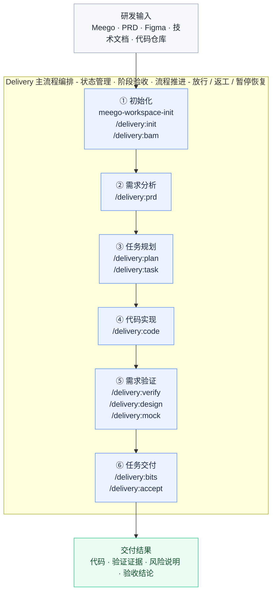
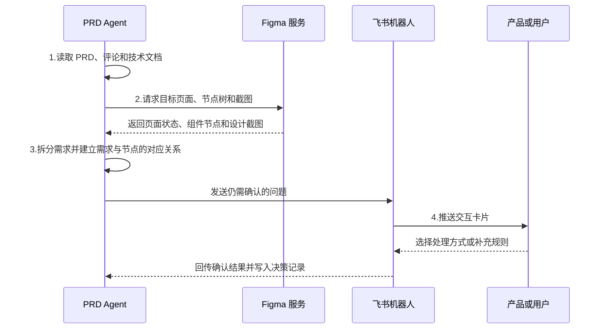
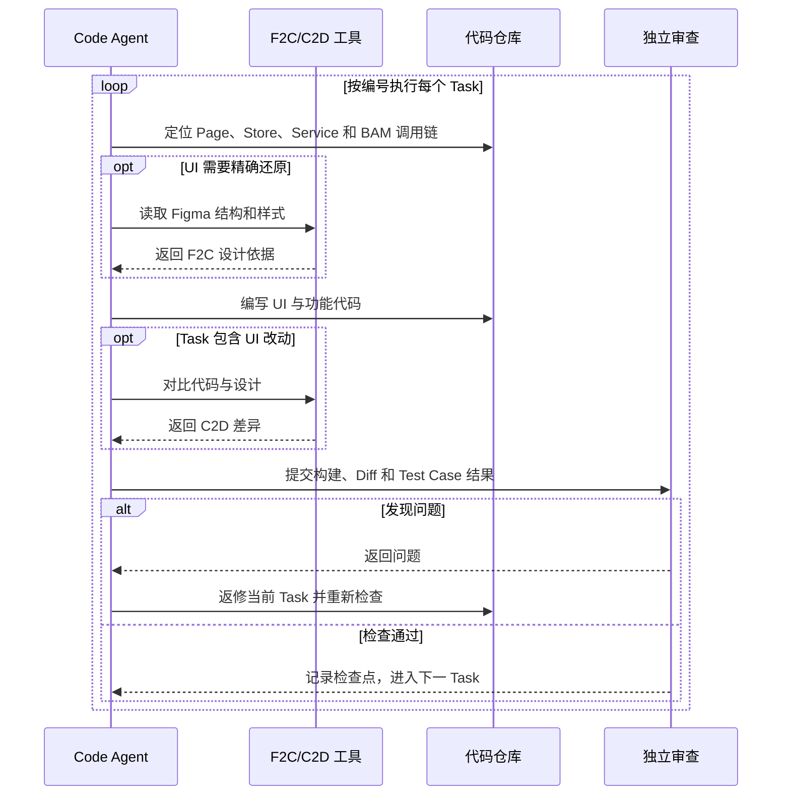

# AI Coding 工作流架构分享

## 架构概述

### 总体架构

AI Coding 工作流是一套面向真实业务研发的 **AI Harness 框架**。核心目标是：**让 AI 基于 Meego、PRD、Figma、接口文档、代码仓库，在明确授权范围内自主完成研发任务，并通过代码检查、运行结果和验收证据确认任务是否完成。**按照需求接入、需求分析、方案规划、代码实现、验收交付等阶段推进研发。每个阶段都会记录当前进度，明确 AI 可以处理的范围、需要产出的内容以及进入下一阶段的条件，确保整个过程可控、可验证。




### 关键闭环

一项前端需求通常同时包含两类目标：**业务功能正确**和 **UI 还原准确**。AI Coding 工作流分别建立功能闭环与 UI 闭环，并在最终验收时汇总两类证据。

#### 1. 需求功能实现闭环

- **核心问题：**业务规则、交互和接口行为是否符合需求

- **主要证据：**Test Case、浏览器操作、DOM、Network 请求、Console 日志、命令结果****

```text
Meego / PRD / 接口与仓库事实
  → 原子需求与验收条件
  → 规划 Task 和 Test Case 
  → 功能代码实现
  → 浏览器执行真实操作路径
  → DOM / Network 请求 / Console 日志 / 截图 / 命令结果
  → 需求—用例—证据对齐
  → Function Gate
```

代码实现以原子需求和 Test Case 为边界。完成后通过浏览器验证页面加载、点击、输入、提交、跳转和状态变化，并采集 DOM、Network 请求、Console 日志、截图等运行证据；每条需求都要关联具体用例、实际观察结果和证据位置。验证失败时，根据代码、Mock、环境或证据缺口分类修复，再回到同一用例复验。

#### 2. UI 实现与设计还原闭环

- **核心问题：**页面结构、样式和状态是否符合设计基准
- **主要证据：**Figma 节点或截图、D2C/F2C 结果、运行截图、DOM、元素位置与计算样式

```text
Figma 设计源
  → Figma MCP 获取节点、截图与布局信息
  → D2C / F2C 类 MCP 获取 Figma xml结构参考
  → UI 代码实现并验证
  → 浏览器采集运行截图、DOM、元素位置与计算样式
  → Figma 与 Runtime 对比
  → 代码对齐 Figma UI信息
  → UI Gate
```

Figma 节点和截图用于提供UI信息，D2C/F2C 工具为布局、样式和组件实现提供样式参考；生成结果结合现有组件库和仓库规范落地。验证时先对比 Figma 与运行页面的整体结构、区域顺序和视觉分组，再使用 DOM、元素位置与尺寸（BBox）、计算样式（Computed Style）解释尺寸、间距、颜色、字号和组件状态等差异。发现偏差后生成明确的设计返工任务，修改完成后复用原浏览器场景重新取证。

### 核心思想

AI Coding 工作流的核心，是把模型的分析、生成和修复能力放入可控制的工程流程中。

- 模型负责理解需求、制定方案和执行任务；
- 工作流负责提供可靠事实、限定执行范围、保存阶段状态、验证交付结果并控制流程推进。

整个过程可以概括为：

```text
事实输入 → 阶段规范 → 受限执行 → 阶段产物 → 证据验证 → Gate 决策
                                                        ├─ 通过：进入下一阶段
                                                        ├─ 不通过：返工或回退
                                                        └─ 无法判断：暂停并请求确认
```

#### 1. 事实驱动：结论必须有明确依据

[NIST《生成式人工智能风险管理框架》](https://www.nist.gov/publications/artificial-intelligence-risk-management-framework-generative-artificial-intelligence)将“自信地生成错误或虚假内容”列为生成式 AI 的虚构风险；Agent 在分析和执行前，需要区分信息来源，防止未经确认的信息被作为正式结论。

| 信息类型 | 典型来源 | 使用方式 |
| --- | --- | --- |
| 已确认事实 | 用户确认的业务规则和决策 | 直接作为阶段依据 |
| 可追溯事实 | PRD、Figma、技术文档、接口定义、仓库代码、命令与运行结果 | 记录来源后使用；存在冲突时进入待确认清单 |
| 模型推断 | 根据现有信息推测的设计意图或实现方案 | 仅作为候选判断，并标记依据和置信度 |
| 未决问题 | 信息缺失、来源冲突或权限不明确 | 显式登记；影响关键决策或高风险操作时暂停确认 |

这一机制主要解决：

- **将推测当成业务事实**，编造不存在的接口、字段或代码结构；
- 信息不足时擅自选择实现路径，基于局部代码推断整体逻辑；
- 多轮执行后，未确认假设逐渐变成“已确认结论”。

#### 2. 产物驱动：阶段结论必须持久化

正式结论不能只保存在聊天上下文中。每个阶段都需要形成可定位、可版本化的产物。例如[Spec Kit](https://github.github.com/spec-kit/)采用 `Spec → Plan → Tasks → Implement` 的阶段链路，并让每个阶段生成供下一阶段使用的 Markdown 产物；因此长流程需要把关键状态和阶段结论持久化到模型上下文之外，例如：

```
需求分析   → 需求结论、业务规则、待确认问题
任务规划   → 技术方案、任务拆解、测试用例
代码实现   → 代码变更、实现记录、影响范围
验证阶段   → 命令结果、测试结果、页面证据

阶段产物 = 事实来源 + 阶段结论 + 决策依据 + 未确认事项 + 验证证据
```

阶段产物主要承担三项作用：

1. **传递上下文**：为下一阶段提供稳定、明确的输入。
2. **支持自检**：Agent 可以重新读取需求、方案和任务，检查遗漏与偏差。
3. **支持验收**：用户能够定位结论来源、实现范围和验证证据。

这一机制主要解决：

- 长上下文导致的需求遗忘，需求、方案、代码逐步偏离；
- 多 Agent 交接时信息丢失或者任务中断后难以恢复；
- 交付结果缺少来源和证据。

#### 3. 规范先行：先定义阶段执行合同

每个阶段开始前，应通过 Skill 或工作流规则明确执行合同。

```
阶段输入
├── 必须读取的资料
├── 允许使用的工具
├── 需要完成的步骤
├── 允许修改的范围
├── 必须生成的产物
├── 必须提供的证据
└── Gate 通过条件
```

Skill 提供阶段规范，Agent 根据规范完成分析和执行。

#### 4. 门禁管控：由验证结果控制流程推进

阶段是否完成，需要结合产物和外部证据判断。Gate 的职责，是判断当前阶段是否具备进入下一阶段的条件。结合需求覆盖和运行态证据，避免只凭 Agent 的完成声明放行。

| Gate 结果 | 含义 | 后续处理 |
| --- | --- | --- |
| `PASS` | 产物和证据满足当前阶段合同 | 编排层放行下一阶段 |
| `AUTO_FIX_REQUIRED` | 问题明确且可在授权范围内修复 | 留在当前阶段完成受限修复并重新验证 |
| `NEEDS_TARGETED_REVIEW` | 证据不足、冲突或置信度较低 | 补充证据或进行专项审查 |
| `BLOCKED` | 关键事实、环境、权限或人工决策缺失 | 暂停流程，信息补齐后从恢复点继续 |

Gate 读取代码差异、产物证据，避免直接接受 Agent 的“已经完成”“测试通过”等文字结论。

这一机制主要解决：

- Agent 跳过规范步骤，使用自身判断完成自我验收；
- 代码可以运行，但没有满足完整需求；

#### 5. 反馈闭环：在阶段内修复，在阶段间纠偏

[Anthropic 的 Evaluator-Optimizer 模式](https://www.anthropic.com/engineering/building-effective-agents)通过“生成—评价—反馈”循环持续改进结果，证明初始输出经过反馈和多轮改进，通常优于一次性生成结果；AI Coding 工作流允许 Agent 在阶段内动态调整执行路径，但阶段出口必须满足统一规范。

- **阶段内部闭环：**Agent 不一定严格按照规范固定顺序完成每一步，但最终必须满足该阶段的输入、输出和验收证据要求。

```
读取规范 → 获取事实 → 执行任务 → 运行检查 → 自检差异
                                             │
                         ┌───────────────────┴───────────────────┐
                         ▼                                       ▼
                 满足要求：提交阶段产物                 存在偏差：修复后重新检查
                                                                  │
                                                                  └──────→ 运行检查
```

- **阶段之间闭环：**Agent 允许在某一阶段执行存在偏差，但最终能通过验收结果返工修复。

```
初始化 → 需求分析 → 任务规划 → 代码实现 → 需求验证 → 任务交付
           ↑          │       ↑          │
           └──────────┘       └──────────┘
          规划不合理             验证未通过
```

## 主流程编排

### 初始化

#### 核心功能

初始化阶段以 **Meego链接** 为统一入口，将需求资料、代码仓库和接口定义整理为后续研发可以直接使用的任务空间。

```
Meego 工作项
    ↓
读取需求信息与关联资料
    ↓
整理 PRD、技术文档、Figma 和仓库线索
    ↓
准备目标代码仓库
    ↓
创建统一 Artifacts 工作区
    ↓
同步 BAM 接口与类型
    ↓
进入需求分析和任务规划
```

#### 主要阶段

| 环节                   | 主要作用                                          | 输出结果                  |
| ---------------------- | ------------------------------------------------- | ------------------------- |
| `meego-init-workspace` | 从 Meego 读取需求、评论和关联文档，并定位目标仓库 | 原始需求上下文 `context/` |
| `/delivery:init`       | 汇总有效输入，创建正式产物空间并初始化交付状态    | 统一工作区 `artifacts/`   |
| `/delivery:bam`        | 根据技术方案同步后端接口、请求方法和类型定义      | 前端可使用的接口合同      |

初始化完成后，后续阶段可以基于同一份需求资料、目标仓库和接口定义开展工作，减少重复收集信息、上下文不一致和接口理解偏差。

#### Case 分析

case 以 Meego 工作项 `7306602080` 为入口，完成了从外部需求资料到前端可开发环境的初始化过程。

```
Meego 7306602080
    ↓
获取 PRD 和技术文档
    ↓
确定目标仓库
ecom/alliance-operation-mono
    ↓
创建正式产物空间
artifacts/7306602080-incentive-control-online/
    ↓
同步目标接口合同
ecom.buyin.admin_api / feat_bujili 生成 4 个新增接口及 1 个字段变更接口对应的前端方法和类型。
```

### 需求分析

#### 核心功能

 `/delivery:prd` 阶段负责把产品原稿整理成开发、测试和设计验收可以直接使用的需求说明。Agent 会读取 PRD 正文、评论和技术文档，拆出能够独立实现和验收的需求点；涉及页面的部分继续读取 Figma 节点和截图；仍有歧义的内容通过飞书机器人请产品或用户确认。本阶段只处理需求与设计依据，不修改业务代码。

1. **拆分原子需求：**将复合需求拆分为独立需求点，明确触发条件、页面状态、操作结果和异常边界，减少功能遗漏。
1. **对齐 Figma 设计：**将需求点关联到具体 Figma 页面、组件节点和截图，为页面结构、交互状态和 UI 实现提供直接依据。
1. **确认不确定问题：**将影响业务范围、交互行为或验收结果的问题整理为飞书卡片，由产品或用户确认，并将结论写入后续规划依据。

#### 主要步骤

| 步骤           | Agent 执行的工作                                             | 主要作用                                                     | 阶段产物                 |
| -------------- | ------------------------------------------------------------ | ------------------------------------------------------------ | ------------------------ |
| 1.汇总需求材料 | 读取 PRD 正文、评论、技术文档和已有页面信息                  | 把产品规则、页面要求和接口线索放到同一份上下文中             | 需求材料与来源说明       |
| 2.对齐 Figma   | 从 PRD 中的设计链接定位页面和状态，读取节点树并导出截图      | 确认页面结构、区域顺序、按钮和可见样式确有设计依据           | Figma 节点映射、设计截图 |
| 3.拆分需求     | 按触发条件、页面状态、操作结果和异常边界拆成可独立验收的需求点 | 后续开发可以逐项实现，测试可以逐项检查，减少只覆盖主流程的情况 | 需求分析稿与验收标准     |
| 4.发起确认     | 把会改变范围、页面行为或验收结果的问题整理成单项选择，通过飞书机器人推送 | 产品或用户的回答直接进入后续技术计划，避免开发自行猜测       | 用户确认结论与影响说明   |



#### Case 分析

##### 原子需求拆分

> **原需求点内容：** 运营在「奖励投放-人工提报」提交中奖名单后，对命中自然处罚的作品或账号红字提示“命中【不激励】规则”；系统仅提示，不自动剔除；页面展示问题作品汇总，提供“一键移除”和明细导出；处罚作品或账号未移除前禁止提交发奖名单。

```
原需求点
│
├─ ① 执行不激励校验并保留命中项
│     实现要求：系统只标记和提示，不自动删除。
│     验收重点：命中项仍在列表中，并以红字展示原因。
│
├─ ② 展示作品总数和问题作品数
│     实现要求：汇总数据需要随列表状态变化。
│     验收重点：提示数量与实际命中记录一致。
│
├─ ③ 支持一键移除问题作品
│     实现要求：只移除不满足准入条件或命中规则的作品。
│     验收重点：问题作品被移除，正常作品不受影响。
│
├─ ④ 支持导出剔除明细
│     实现要求：只导出已移除记录，并包含账号、作品、原因等信息。
│     验收重点：检查导出内容，不能只验证按钮可点击。
│
└─ ⑤ 问题项未处理前禁止提交
      实现要求：存在问题项时禁用提交，处理完成后恢复。
      验收重点：同时覆盖“禁止提交”和“恢复提交”两种状态。
```

##### 对齐 Figma 设计

| 原子需求点               | Figma 节点与定位                                             | 匹配结果                                                     |
| ------------------------ | ------------------------------------------------------------ | ------------------------------------------------------------ |
| 人工提报命中态的页面结构 | [`25:13842` 人工提报命中态](https://www.figma.com/design/fNJJ7mEmEMYU5y0tcAZm3X/Untitled?node-id=25-13842&p=f&m=dev)、[`87:6973` “提报视频”抽屉](https://www.figma.com/design/fNJJ7mEmEMYU5y0tcAZm3X/Untitled?node-id=87-6973&p=f&m=dev) | 原始节点包含人工提报页背景和右侧抽屉；抽屉内依次是提报方式、奖励配置、提示与操作区、表格、底部按钮，结构与需求流程一致。 |
| 命中数量汇总提示         | [`87:6998` 命中汇总提示](https://www.figma.com/design/fNJJ7mEmEMYU5y0tcAZm3X/Untitled?node-id=87-6998&p=f&m=dev) | 节点文案给出“共 100 个作品，其中……5 个”的示例，设计为浅蓝提示条。 |
| 一键移除与导出剔除明细   | [`87:7000` 一键移除](https://www.figma.com/design/fNJJ7mEmEMYU5y0tcAZm3X/Untitled?node-id=87-7000&p=f&m=dev)、[`87:7002` 导出剔除明细](https://www.figma.com/design/fNJJ7mEmEMYU5y0tcAZm3X/Untitled?node-id=87-7002&p=f&m=dev) | 两个按钮位于提示区右侧；“一键移除”是主按钮，“导出剔除明细”是次级按钮，顺序和层级均可直接用于开发。 |
| 行级原因与移除           | [`87:7016` 表格行区域](https://www.figma.com/design/fNJJ7mEmEMYU5y0tcAZm3X/Untitled?node-id=87-7016&p=f&m=dev)、[`87:7043` 行级移除](https://www.figma.com/design/fNJJ7mEmEMYU5y0tcAZm3X/Untitled?node-id=87-7043&p=f&m=dev) | 表格行内有红色“不满足准入门槛”“命中【不激励】规则”及组合状态，操作列有“移除”入口。 |
| 提交限制对应的底部操作区 | [`87:7133` 提交并投放](https://www.figma.com/design/fNJJ7mEmEMYU5y0tcAZm3X/Untitled?node-id=87-7133&p=f&m=dev) | 底部操作区包含“取消”和主按钮“提交并投放”；PRD 在这个按钮上补充了命中项未移除时禁止提交的规则。 |


##### 确认不确定问题

Figma 可以提供页面依据，但业务范围、字段来源和不同入口的复用关系未必会体现在画面中。本次 PRD 阶段把这类问题整理成飞书卡片，推送给产品或用户确认；提交结果写入决策记录，并作为技术计划和验收标准的输入。例如：

| 待确认问题                           | 原需求中的模糊点                                             | 产品或用户的确认                                             | 对后续实现的作用                                             |
| ------------------------------------ | ------------------------------------------------------------ | ------------------------------------------------------------ | ------------------------------------------------------------ |
| “导出剔除明细”中的原因字段与导出范围 | PRD 同时列出“移除原因”和“处罚原因”，但页面没有移除原因输入项，评论中也指出**处罚原因的数据来源不明确**；同时还需确认导出全部提报记录，还是只导出被剔除记录。 | “移除原因”只取“手动移除”和“命中【不激励】规则”两种；“处罚原因”从接口获取；只导出被剔除记录。 | 下载实现有了明确的记录范围、字段枚举和数据来源。验收可以检查每一列的内容，避免出现正常发奖记录被导出、原因字段为空或前后端口径不一致。 |


### 任务规划

> **阶段目标：**把“已经确认的需求”转换为“可以直接编码、可以明确验收的任务”。

#### 核心功能

1. **确定技术实现路径：**探索现有页面、组件、Store、Service 和接口调用链，明确哪些能力直接复用、哪些需要扩展或局部重构，以及允许修改的代码范围。
2. **拆分可执行任务：**按代码职责、页面区域和完整用户流程组织 Task，写清修改位置、实施步骤、UI 依据、完成条件和禁止范围。
3. **建立需求验收链路：**将每项需求关联到 Task、Test Case 和必要的 BAM Rule，确保功能、UI、异常状态和接口边界都有对应验证方式。

整个阶段只做分析和规划，不修改业务代码。最终形成一条从需求到验收的完整链路：

`原子需求 → 技术方案 → 可执行 Task → Test Case → BAM Rule / 真实联调`

| 规划层次          | 回答的问题                 | 核心产物                                                     |
| ----------------- | -------------------------- | ------------------------------------------------------------ |
| `/delivery:plan`  | **在哪里改、准备怎么改？** | 技术实现路径、代码落点、UI 与数据边界、接口策略，沉淀到 `04-tech-plan.md` |
| `/delivery:task`  | **拆成什么、怎样算完成？** | 可执行 Task、Test Case 和 BAM Rule，沉淀到 `delivery-task.md`、`09-test-case-matrix.md` |

- **先做 Plan：**在拆任务前确认技术方向正确，防止 Task 建立在错误的代码职责或接口假设上。
- **再做 Task：**把技术方案变成可以直接执行和检查的工作单元，防止 Plan 停留在“原则正确、无法落地”。

==Test Case 是人工审查的重要节点==

> **需求最终实现成什么样，直接取决于 Test Case 是否覆盖完整、断言是否正确。** 
>
> Test Case 不能把 Task 写出的预期结果直接复制成验收事实。审查时需要回到 PRD、用户决策、Plan 合同和 Figma 节点，逐项核对 Case 引用的需求或 UI 依据，以及正向断言、负向断言、视觉断言和证据要求。若正确断言与 Task 冲突，应记录具体偏移并返回 `/delivery:plan`，不能修改断言迎合 Task。

#### 主要步骤

1. **收敛输入：**汇总原子需求、Figma、用户确认、技术文档和接口信息，先固定事实来源。
2. **探索仓库：**读取相关页面、组件、Store、Service 和 BAM 封装，追踪现有数据流与调用链。
3. **形成 Plan：**确定复用或重构策略、代码落点、UI 约束、接口与异常边界，并完成技术方案门禁。
4. **生成 Task：**按代码职责和完整用户流程拆分任务，再补齐 Test Case、BAM Rule 和真实联调边界。
5. **覆盖检查：**确认每项需求都有 Task 承接、每个关键状态都有验证方式。

```
PRD + Figma + 用户决策 + 技术文档
                    │
                    ▼
Plan Agent  ◄──►  现有代码仓库
                    │
                    ├─ 定位页面、Store、Service 和接口
                    ├─ 确定复用、扩展或局部重构方案
                    └─ 明确 UI、数据、异常和修改边界
                    │
              Plan 门禁通过
                    ▼
Task Agent  ──►  Task ──► Test Case ──► BAM Rule
                    │
              Task 门禁通过
                    ▼
                   Code

方案冲突 / 任务不可执行 ──► 返回 Plan 修正
关键需求仍不确定         ──► 返回用户确认
```

#### Case 分析

> **需求目标：**命中不激励规则的作品保留在人工提报名单中并显示原因；运营可以移除和导出异常项；异常项未处理前禁止提交。

```
需求：发现异常作品，但不允许系统自动删除
  │
  ▼
Plan：确定代码职责和行为边界
  ├─ Store  ：维护命中状态、数量和已移除记录
  ├─ Form   ：展示汇总、红色原因、移除和导出入口
  ├─ Drawer ：异常项存在时阻止提交
  └─ Service：仅导出调用后端接口；移除保持为本地操作
  │
  ▼
Task：按完整用户流程组织
  ├─ TASK-005：手动输入主链路
  ├─ TASK-006：批量上传入口复用
  └─ TASK-008：命中提示曝光埋点
  │
  ▼
Test：分别验证页面、操作和接口边界
  ├─ 命中项保留，数量和红色原因正确
  ├─ 异常项未处理时不打开确认弹窗、不发送发奖请求
  ├─ 本地移除只删除异常项，不调用移除接口
  └─ 导出只包含已移除记录
```

Case体现了三个关键原则：

- **按用户流程拆任务：**汇总、移除、导出和提交保护共享同一份状态，由一个主体 Task 负责，不应该拆成五个孤立任务。
- **Test Case 独立于 Task：**验收断言以 PRD、Figma 和用户决策为事实，不能直接复制 Task 的预期结果。
- **明确 Mock 边界：**BAM Rule 可以验证页面状态、请求参数和失败分支，但飞书表格权限、后端持久化等结果仍需真实环境复验。

### 代码实现

> **阶段目标：**按照 Task 将需求稳定实现，同时保证 UI 有设计依据、功能有完整调用链、失败场景不会产生错误的成功状态。

#### 核心功能

代码实现阶段包含两类能力：

1. **将 UI 需求转为代码实现：**使用 F2C 工具读取 Figma 节点的结构、文案、样式和布局，将设计要求转成组件代码，并通过设计稿与运行页面对比持续修正。
2. **实现功能需求完整链路：**贯通页面、组件、Store、Service 和 BAM 接口，处理成功、阻断、超时、异常和空数据等分支，确保用户操作能够得到正确反馈。

#### 主要步骤

| 主要步骤 | 具体用法 | 检查与处理方式 | 本案例中的执行结果 |
| --- | --- | --- | --- |
| **1. 明确任务并定位代码** | 读取 Task、Figma 和 Test Case，沿 `Page → Store → Service → BAM` 找到改动位置。 | 核对修改范围和完成条件；依据冲突时，返回任务规划阶段澄清。 | 8 个 Task 的代码边界明确，人工提报、发奖治理和埋点分别实现。 |
| **2. 编写 UI 与功能代码** | UI 使用 F2C 获取设计依据并修改组件、样式；功能代码接通用户操作、状态、接口和结果反馈。 | 执行构建和 Diff 检查；接口失败时保留当前状态，不展示错误的成功结果。 | 完成不激励提示、剔除明细，以及 DOU+ 币/券发奖前治理链路。 |
| **3. 校验、返修并交付** | 使用 C2D 对比代码与设计，再进行独立代码审查。 | 发现问题就返修当前 Task，并重新执行构建和审查；通过后记录代码检查点。 | C2D 发现并修复重复跳转问题；8 个 Task 均通过构建和代码审查。 |



#### Case 分析

##### 将 UI 需求转为代码实现

1. **固定设计依据。** 调用 F2C 工具读取指定节点，调用参数如下；返回 XML 后，再定位提示文本节点 `1:10202`。

   ```text
   /f2c get_d2c_json
     --fileKey fNJJ7mEmEMYU5y0tcAZm3X
     --nodeId 1:9770
   ```

   XML 表明：提示位于“活动参与资格”和“内容体裁要求”之间，左侧缩进 `116px`；提示容器只有一个 `Text`，内部是连续的灰色说明和蓝色链接，没有前置图标。相关样式如下：

   ```xml
   <Container padding-left="116px" display="flex" align-items="center" gap="4px">
     <Text id="1:10202" font-size="12px" line-height="20px">
       <Span color="rgb(188,189,192)">奖励发放环节将进行账号校验，命中【不激励】规则的账号无法被发奖 </Span>
       <Span color="rgb(25,102,255)" text-decoration="underline">查看【不激励】规则</Span>
     </Text>
   </Container>
   ```

2. **代码实现。** 初次实现写入了文案、链接地址和全部用户分支，样式采用 `14px`、`#0088ff` 和默认无下划线，同时增加了 `DoubtIcon`。该代码作为后续运行态 UI 检查的输入。

   ```tsx
   <span className={styles.noIncentivePrompt}>
     <DoubtIcon style={{ color: '#BCBDC0', fontSize: 12 }} />
     <span>{NO_INCENTIVE_PROMPT_COPY}</span>
     <a className={styles.noIncentiveRuleLink}>{NO_INCENTIVE_RULE_LINK_COPY}</a>
   </span>
   ```

   ```scss
   // 初次实现
   .noIncentivePrompt {
     display: inline-flex;
     gap: 8px;
     color: #bcbdc0;
     font-size: 14px;
     line-height: 20px;
   }
   .noIncentiveRuleLink {
     color: #0088ff;
     text-decoration: none;
   }
   ```

3. **执行代码校验与审查。** 调用 `d2c_verify_code` 对设计节点和当前实现做代码级校验。产物保留了工具名、设计节点和代码范围，调用内容如下：

   ```yaml
   tool: d2c_verify_code
   input:
     figma_node: "1:9770"
     text_node: "1:10202"
     code_scope:
       - step-reward-config/index.tsx
       - step-reward-config/index.module.scss
   ```

   工具返回：

   ```yaml
   verdict: Excellent
   issues:
     critical: 0
     moderate: 0
     minor: 1
   minor_issue:
     target: 规则链接
     finding: href 与 window.open 重复触发跳转
     action: 删除额外的 window.open
   ```

   本轮根据轻微问题删除了链接上重复的 `window.open`，代码已按 Task 完成并可以进入运行态检查，视觉细节以 Design Case 的浏览器证据为准。

| 需求截图                                                     | 实现效果                                                     |
| ------------------------------------------------------------ | ------------------------------------------------------------ |
| 节点 `1:9770`，重点观察“活动参与资格”下方的提示行。<br /> | Code 阶段已实现提示文案、规则链接和全部用户分支。首次运行效果中仍可见前置问号图标，该截图作为后续 UI 对齐的输入。<br /> |

##### 功能需求实现完整链路

功能实现不以“页面已经显示”为结束，而是要求用户操作、状态管理、接口调用和结果反馈形成完整链路。以人工提报为例：

```
用户提交作品 → 调用接口 → 接口返回结果
                         │
        ┌────────────────┼────────────────┬─────────────────┐
        ▼                ▼                ▼                 ▼
      正常          命中不激励规则    接口异常或超时      无有效数据
        │                │                │                 │
保存数据并更新页面   保留问题作品      展示错误提示       停止后续操作
允许继续操作        展示红色原因      保留当前状态       不发送无效请求
                    禁止提交发奖      不显示成功结果
```

### 需求验证


### 任务交付

## 交付结果

### PRD 需求点 1：不激励规则前置透出

- **涉及模块：** 运营平台 > 内容活动 > 奖励配置 > 活动参与资格 / 预埋用户名单。
- **需求描述：** 奖励配置环节需要前置提示「奖励发放环节将进行账号校验，命中【不激励】规则的账号无法被发奖」，覆盖「全部用户」和「仅限预埋用户」两类活动参与资格，并提供「查看【不激励】规则」入口。

| **原子需求**                                          | **验收过程**                                                 | **验收结果与截图**                                           |
| ----------------------------------------------------- | ------------------------------------------------------------ | ------------------------------------------------------------ |
| AR-001 活动参与资格为“全部用户”时展示“不激励”提示     | 进入真实运营平台内容活动详情 → 打开奖励配置 → 选择一个活动配置项 → 将活动参与资格切换为「全部用户」 → 核对配置项下方是否展示“不激励”提示全文和“查看【不激励】规则”入口 | 通过。MTR 真实环境复验中，“全部用户”状态下已展示完整提示和规则入口。<br> |
| AR-002 活动参与资格为“仅限预埋用户”时展示“不激励”提示 | 进入奖励配置页 → 将活动参与资格切换为「仅限预埋用户」 → 确认预埋用户名单控件仍可见 → 核对同一区域是否展示“不激励”提示和规则入口 | 通过。Verify 与 Design 复验均确认预埋用户名单控件、完整提示和规则入口同屏展示，原表单顺序未被破坏。<br> |
| AR-003 点击“查看【不激励】规则”跳转规则文档           | 在已展示“不激励”提示的奖励配置项中定位规则入口 → 点击“查看【不激励】规则” → 检查是否新开目标文档 → 核对文档标题或正文是否包含“电商内容生态激励管控” | 通过。MTR 复验确认点击后新开 PRD 指定飞书文档，目标页标题和正文包含“电商内容生态激励管控”，且跳转未被埋点逻辑阻断。截图展示点击入口，跳转结果由 MTR 浏览器 Tab 记录确认。<br> |

### PRD 需求点 2：发奖前剔除

- **涉及模块：** 运营平台 > 内容活动 > 奖励投放 > 奖励下发 / 人工提报。
- **需求描述：** 奖励投放计算中奖作者名单和中奖作品名单时，需要先做治理合规校验。命中「不激励」规则的作者或作品从发奖池中剔除；人工提报场景中，命中规则的作品或账号展示红字提示，运营需先移除异常项，再提交发奖名单。

| **原子需求**                                   | **验收过程**                                                 | **验收结果与截图**                                           |
| ---------------------------------------------- | ------------------------------------------------------------ | ------------------------------------------------------------ |
| AR-004 DOU+ 币按作品处罚状态校验               | 在 Verify 的 DOU+ 币发奖流程中分别构造自然处罚和解除状态 → 选择候选并提交发奖 → 自然处罚场景核对不出现成功提示、弹窗不按成功态关闭 → 解除状态核对候选可沿用成功流程 | 部分通过，需后端联通。自然处罚响应已验证会阻断成功态，解除状态已验证不会被前端误拦截；MTR 进一步确认两条请求链路可被安全触发。现有证据证明前端分支正确，但写接口被安全拦截，不能证明真实后端处罚状态和最终发奖事务。<br> |
| AR-005 DOU+ 币命中处罚后自动剔除并进入剔除明细 | 进入 DOU+ 币奖励投放页 → 触发发奖前治理分支 → 切换到“剔除明细”Tab → 核对命中规则的作品、剔除时间、剔除原因和操作人 → 在真实环境重新读取剔除明细列表 | 部分通过，需后端联通。Verify/Design 已验证“命中【不激励】规则”的目标行态，BITS 真实只读请求也读取到币剔除明细列表；最终奖励核算、真实处罚状态与写入事务仍需后端或数仓证据。<br><br> |
| AR-006 DOU+ 券按作品 / 账号处罚状态校验        | 进入 DOU+ 券奖励投放页 → 准备账号维度和作品维度命中状态 → 触发发奖前治理校验 → 切换到“剔除明细”Tab → 分别核对作者账号剔除记录和作品剔除记录 | 部分通过，需后端联通。MTR 真实只读接口已返回作者维度剔除记录，Verify Mock 已覆盖作品维度记录和“不激励”原因；真实后端处罚状态合同、作品维度真实样本和写入事务仍需联调确认。<br><br> |
| AR-007 DOU+ 券处罚作品不计入激励核算           | 准备包含处罚作者或作品的 DOU+ 券候选 → 触发奖励提交并确认自然处罚分支不进入成功态 → 核对剔除记录 → 获取后端或数仓核算明细，对比 PV、VV、订单、GMV 和供给是否从最终激励核算中排除 | 部分通过，需后端联通。Verify 已证明自然处罚响应会阻断 DOU+ 券发奖成功态，MTR 真实只读列表也能看到券剔除记录；但页面和前端请求不能证明 PV、VV、订单、GMV、供给已从最终核算中排除，仍需后端或数仓结果。<br><br> |
| AR-008 治理接口超时或异常时暂停发奖并提示      | 在 Verify 中分别触发治理超时和异常响应 → 核对页面错误提示 → 核对投放弹窗未进入成功关闭或成功提示状态 → 检查异常后候选仍保留 | 部分通过，需后端联通。超时场景已展示“治理校验失败，请稍后重试”，异常分支也已由运行态记录确认不会进入成功态；真实错误码、后端超时来源和事务未执行仍需联调复验。<br> |
| AR-009 人工提报命中“不激励”后展示红字提示      | 进入奖励投放页“奖励下发”区域 → 打开“提报视频”弹窗 → 选择手动输入 → 输入包含命中“不激励”作品的混合 ID → 提交候选校验 → 核对命中项红字提示和保留状态 | 通过。Verify 与 Design 复验均确认命中项展示红字提示，并继续保留在候选列表中供运营处理。<br> |
| AR-010 人工提报展示统计提示                    | 打开“提报视频”弹窗 → 手动输入正常项和异常项混合作品 ID → 提交候选校验 → 核对候选列表上方是否展示作品总数和“不满足发奖条件或命中【不激励】规则”的数量 | 通过。候选结果上方已展示作品总数和异常作品数量，并与表格中的两类异常行一致。<br> |
| AR-011 一键移除异常作品                        | 在“提报视频”弹窗中保留异常候选列表 → 确认“一键移除”按钮可见 → 点击“一键移除” → 核对异常项是否从待提交列表移除 → 核对正常作品和统计区域是否保留 | 通过。Repair 复验确认混合列表中异常项被移除、正常作品保留且异常数更新为 0；BITS 真实页面操作也确认全异常样本可一键清空，工具栏继续保留。<br><br> |
| AR-012 导出剔除明细                            | 打开“提报视频”弹窗并核对初始空态 → 提交包含异常项的候选列表并确认“导出剔除明细”入口出现 → 未移除异常项时点击导出，确认不请求导出接口 → 移除异常项后再次点击导出，核对请求仅包含已移除记录 → 分别验证返回链接和缺少链接两类响应 | 部分通过。初始空态、入口显示、移除前 no-call、移除后工具栏保留、已移除记录请求以及缺少 `lark_url` 时的失败分支均已验证；返回链接仅在 Mock/Synthetic Contract 中闭合，真实飞书表格生成、权限和字段内容仍无证据。<br><br><br><br> |
| AR-013 未移除异常项前禁止提交发奖名单          | 在“提报视频”弹窗中提交异常候选 → 异常项未移除时点击“提交并投放” → 核对是否阻止进入二次确认 → 核对 Drawer、候选行和 footer 是否保持 → 移除异常项后重新进入提交链路 | 部分通过。未移除异常项时，运行态已捕获阻断提示、未打开二次确认弹窗且没有发奖请求；最终 CR 已修正不发奖项参与必填校验的问题，但尚未生成“混合样本移除后进入二次确认”的最新浏览器截图，因此后半段仍待复验。<br> |

### PRD 需求点 3：剔除明细查看与查询

- **涉及模块：** 运营平台 > 内容活动 > 奖励投放 > 剔除明细。
- **需求描述：** 奖励投放页新增「剔除明细」Tab，用于展示和查询因命中「不激励」标签被剔除的作者与作品明细。DOU+ 币和 DOU+ 券按奖励类型展示对应筛选项、列表字段和分页信息。

| **原子需求**                     | **验收过程**                                                 | **验收结果与截图**                                           |
| -------------------------------- | ------------------------------------------------------------ | ------------------------------------------------------------ |
| AR-014 新增“剔除明细”Tab         | 进入内容活动详情页 → 打开奖励投放模块 → 在“奖励下发 / 投放明细 / 剔除明细”区域点击“剔除明细”Tab → 核对 Tab 选中状态、查询区和剔除记录列表 | 通过。MTR 真实环境已展示并选中“剔除明细”Tab，真实只读接口返回记录后页面能够正常渲染查询区和列表。<br> |
| AR-015 DOU+ 币剔除明细字段和分页 | 进入 DOU+ 币配置项的“剔除明细”Tab → 核对筛选区仅包含作品 ID 和操作人 → 核对表格列顺序 → 触发真实只读查询 → 在多页 Mock 数据中翻页并核对分页状态 | 部分通过，需后端联通。BITS 真实只读接口已返回币剔除记录，Design/Verify 已确认筛选项、表格列顺序和两页分页状态；真实接口当前样本未覆盖多页，`total / has_more` 与筛选参数仍需后端联调证据。<br> |
| AR-016 DOU+ 券剔除明细字段和分页 | 进入 DOU+ 券配置项的“剔除明细”Tab → 核对筛选区包含作者 ID 和操作人 → 核对表格列顺序 → 触发真实只读查询 → 在多页 Mock 数据中翻页并核对分页状态 | 部分通过。MTR 真实接口已返回 3 条作者剔除记录，并验证作者 ID、操作人筛选项和四列表格；Design/Verify 已覆盖两页分页状态。真实接口当前仅一页，`total / has_more` 与真实筛选回包仍需继续联调。<br> |

### PRD 需求点 4：埋点需求

- **涉及模块：** 运营平台 > 内容活动 > 奖励配置 / 奖励投放 > 人工提报 / 奖励投放 > 剔除明细。
- **需求描述：** 需要记录「查看【不激励】规则」点击 UV、人工提报命中「不激励」规则提示曝光 UV，以及剔除明细 Tab 曝光 UV 和点击 UV。剔除明细埋点需要区分 Tab 所在配置项和奖励类型。

| **原子需求**                                   | **验收过程**                                                 | **验收结果与截图**                                           |
| ---------------------------------------------- | ------------------------------------------------------------ | ------------------------------------------------------------ |
| AR-017 记录查看“不激励”规则点击 UV             | 进入展示“不激励”提示的奖励配置项 → 点击“查看【不激励】规则”入口 → 核对前端点击处理器只上报一次，并携带 activity/config 上下文 → 在数据平台查询点击 UV 入库 | 部分通过，需后端联通。Verify 已确认点击时单次调用既有 logger，参数包含 `page_id=content_activity_edit`、`module_id=reward_config_no_incentive_prompt`、`element_id=no_incentive_rule_link` 以及 activity/config 上下文，且不阻断跳转；当前仍缺 DA 平台点击事件和 UV 入库截图。下图仅证明触发入口，不替代 DA 回收证据。<br> |
| AR-018 记录人工提报命中“不激励”规则提示曝光 UV | 进入人工提报弹窗 → 提交包含命中项的混合候选 → 等待统计提示首次出现 → 核对前端曝光事件及去重 → 在数据平台查询曝光 UV 入库 | 部分通过，需后端联通。Verify 已捕获 `module_expose`，其中 `module_id=manual_submit_hit_summary`、命中数为 2、总数为 3，并确认局部重渲染不会重复上报；当前仍缺 DA 平台曝光事件和 UV 入库截图。下图仅证明曝光触发条件已经出现。<br> |
| AR-019 记录剔除明细 Tab 曝光 / 点击 UV         | 进入奖励投放页 → 分别在 DOU+ 币和 DOU+ 券配置项下点击“剔除明细”Tab → 核对前端点击与曝光参数包含 config 和 reward type → 在数据平台查询 Tab 点击 / 曝光 UV 入库 | 部分通过，需后端联通。Verify 已确认币、券两条分支分别绑定点击和曝光上报，参数包含 `module_id=remove_detail_data`、配置项信息以及 `reward_type=DOU+币/DOU+券`，并能隔离另一奖励类型；当前仍缺 DA 平台点击 / 曝光事件和 UV 入库截图。下图仅证明两个触发页面状态。<br><br> |
