# AI交付记录-运营平台内容活动激励管控线上化交付过程记录

## 1. 需求基本信息

- **Meego 工作项：** `7306602080`
- **需求标题：** 运营平台_内容活动_激励管控线上化
- **需求类型：** story
- **当前节点：** FE 开发、Server 开发
- **PRD：** [【PRD】运营平台_内容活动_激励管控线上化](https://bytedance.larkoffice.com/wiki/RQFqwENe8iiLqTkWk7ScWfIznwt)
- **技术文档：** [【技术方案】内容活动激励管控线上化](https://bytedance.larkoffice.com/docx/HPMndx8meoqS5kxKSb9csLlAn5f)

## 2. 流程概览

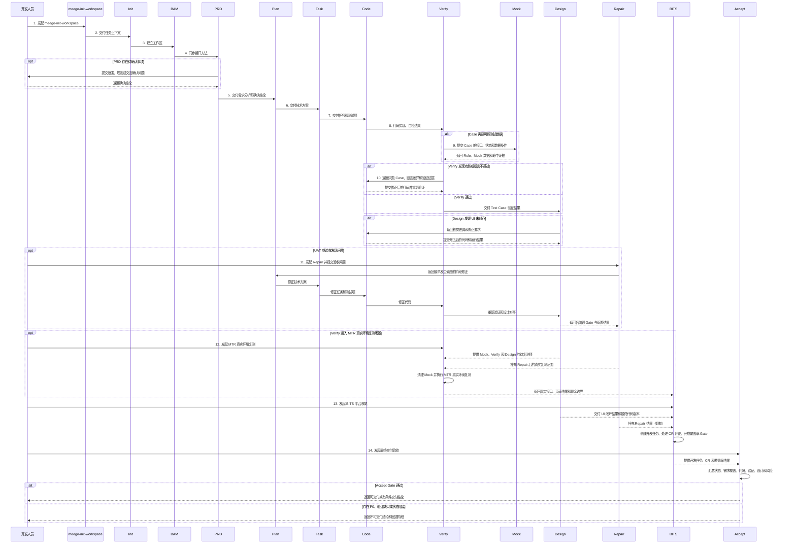
```mermaid
sequenceDiagram
    participant Dev as 开发人员
    participant W0 as meego-init-workspace
    participant W1 as Init
    participant B as BAM
    participant P as PRD
    participant L as Plan
    participant T as Task
    participant C as Code
    participant V as Verify
    participant M as Mock
    participant D as Design
    participant R as Repair
    participant Bits as BITS
    participant A as Accept

    Dev->>W0: 1. 发起 meego-init-workspace
    W0->>W1: 2. 交付任务上下文
    W1->>B: 3. 建立工作区
    B->>P: 4. 同步接口方法
    opt PRD 存在待确认事项
        P->>Dev: 提交范围、规则或交互确认问题
        Dev-->>P: 返回确认结论
    end
    P->>L: 5. 交付需求分析和确认结论
    L->>T: 6. 交付技术方案
    T->>C: 7. 交付任务和测试项
    C->>V: 8. 代码实现、自检结果

    alt Case 需要可控测试数据
        V->>M: 9. 提交 Case 的接口、状态和数据条件
        M-->>V: 返回 Rule、Mock 数据和命中证据
    end

    alt Verify 发现功能或断言不通过
        V->>C: 10. 返回失败 Case、断言差异和验证证据
        C-->>V: 提交修正后的代码并重新验证
    else Verify 通过
        V->>D: 交付 Test Case 验证结果
    end

    alt Design 发现 UI 未对齐
        D->>C: 返回视觉差异和修正要求
        C-->>D: 提交修正后的代码和运行结果
    end

    opt UAT 或验收发现问题
        Dev->>R: 11. 发起 Repair 并提交验收问题
        R->>L: 返回最早发生偏差的阶段修正
        L->>T: 修正技术方案
        T->>C: 修正任务和测试项
        C->>V: 修正代码
        V->>D: 重新验证和设计对齐
        D-->>R: 返回各阶段 Gate 与返修结果
    end

    opt Verify 进入 MTR 真实环境复测场景
        Dev->>V: 12. 发起 MTR 真实环境复测
        D-->>V: 提供 Mock、Verify 和 Design 的待复测项
        R-->>V: 补充 Repair 后的真实复测范围
        V->>V: 清理 Mock 并执行 MTR 真实环境复测
        V-->>Bits: 返回真实接口、页面结果和剩余边界
    end

    Dev->>Bits: 13. 发起 BITS 平台收尾
    D-->>Bits: 交付 UI 闭环结果和最终代码版本
    R-->>Bits: 补充 Repair 结果（如有）
    Bits->>Bits: 创建开发任务、处理 CR 评论、完成覆盖率 Gate

    Dev->>A: 14. 发起最终交付验收
    Bits-->>A: 提供开发任务、CR 和覆盖率结果
    A->>A: 汇总状态、需求覆盖、代码、验证、设计和风险
    alt Accept Gate 通过
        A-->>Dev: 返回可交付或有条件交付结论
    else 存在 P0、验证缺口或状态阻塞
        A-->>Dev: 返回不可交付结论和回退阶段
    end
```

## 3. 主流程交付阶段

### 3.1 `meego-init-workspace` 初始化阶段

`meego-init-workspace` 将 Meego 工作项、关联文档和目标代码仓库整理到同一个本地任务空间，为正式交付流程准备稳定的资料来源。本阶段只建立上下文，不进行需求拆解、技术规划或代码实现。

#### 3.1.1 主要步骤与交互方式

| 步骤 | 主要操作 | 完成标志 |
| --- | --- | --- |
| 1. 读取任务与文档线索 | 读取 Meego 工作项的基础信息、节点内容、评论和关联链接，识别 PRD、技术文档及其他交付材料。 | 工作项事实和文档清单完整，重复链接已经合并。 |
| 2. 整理文档与仓库 | 完整抽取 PRD、技术文档及其图片、评论等引用资源；再根据需求页面和代码线索确定目标仓库，将仓库放入当前任务空间。 | PRD、技术文档、仓库路由和目标代码仓库均已就绪。 |
| 3. 检查任务空间 | 核对 `context/` 中的资料、`repos/` 中的目标仓库以及团队交付规则是否可用，确认文档抽取和资源检查均已通过。 | 本地任务空间可以作为 `/delivery:init` 的输入。 |

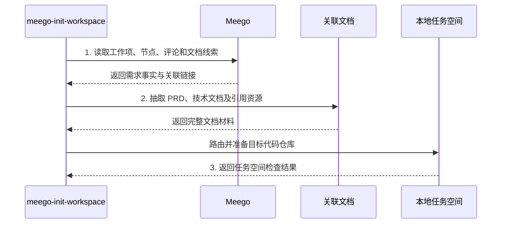
```mermaid
sequenceDiagram
    participant I as meego-init-workspace
    participant M as Meego
    participant D as 关联文档
    participant W as 本地任务空间

    I->>M: 1. 读取工作项、节点、评论和文档线索
    M-->>I: 返回需求事实与关联链接
    I->>D: 2. 抽取 PRD、技术文档及引用资源
    D-->>I: 返回完整文档材料
    I->>W: 路由并准备目标代码仓库
    W-->>I: 3. 返回任务空间检查结果
```

#### 3.1.2 阶段作用：把外部需求整理为本地上下文

本案例以 Meego 工作项 `7306602080` 为入口，取得 PRD 和技术文档，并将前端目标仓库确定为 `ecom/alliance-operation-mono`。完成后，后续流程可以从同一份本地资料读取需求、文档和代码，不必反复从多个外部入口重新收集信息。这里形成的 `context/` 是只读来源，还不是正式的交付产物空间。

### 3.2 `/delivery:init` 阶段

`/delivery:init` 复用上一阶段准备好的 `context/`，创建正式 artifacts 工作区，并登记本次交付的输入、状态和后续阶段入口。本阶段不重复读取 Meego、拉取仓库或重新抽取已经就绪的文档。

#### 3.2.1 主要步骤与交互方式

| 步骤 | 主要操作 | 完成标志 |
| --- | --- | --- |
| 1. 确认正式工作区 | 根据 Meego ID 和需求名称选择唯一的 `context/`，创建或复用对应的 artifacts 工作区；`context/` 只作为输入来源，不作为后续产物目录。 | 当前需求只有一个确定的 artifacts 工作区。 |
| 2. 导入并登记输入 | 将 PRD、Meego 摘要、仓库路由、技术文档及正文实际引用的资源导入工作区，同时登记来源、缺失材料和 Figma 设计源状态。 | 后续阶段需要的输入已经集中，来源和缺口均可追溯。 |
| 3. 初始化交付状态 | 建立需求入口、任务空间、决策和风险记录，更新交付状态；检查 PRD 和设计源满足入口要求后，将下一阶段设为 `/delivery:prd`。 | artifacts 工作区和交付状态均已就绪，可以进入 PRD 阶段。 |

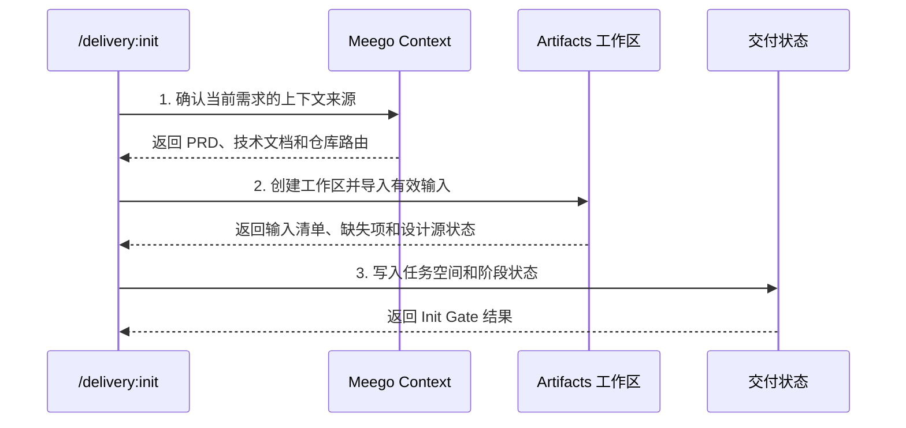
```mermaid
sequenceDiagram
    participant I as /delivery:init
    participant C as Meego Context
    participant A as Artifacts 工作区
    participant S as 交付状态

    I->>C: 1. 确认当前需求的上下文来源
    C-->>I: 返回 PRD、技术文档和仓库路由
    I->>A: 2. 创建工作区并导入有效输入
    A-->>I: 返回输入清单、缺失项和设计源状态
    I->>S: 3. 写入任务空间和阶段状态
    S-->>I: 返回 Init Gate 结果
```

#### 3.2.2 阶段作用：建立后续交付的统一工作区

本案例将 `meego-7306602080/context/` 中的 PRD、Meego 摘要、仓库路由和技术文档导入 `artifacts/7306602080-incentive-control-online/`，并把该目录设为后续阶段唯一的产物空间。这样既保留了初始化资料的原始状态，也使 PRD、Plan、Task、Code 和 Verify 的新增结论都写入同一处，避免来源目录和阶段产物相互覆盖。

### 3.3 `/delivery:bam` 阶段

`/delivery:bam` 将技术方案中的接口变更同步到前端工程，使后续 Plan 和 Code 能够使用与目标后端分支一致的接口方法和类型。本阶段只处理接口证据、BAM 配置和生成代码，不验证页面功能。

#### 3.3.1 主要步骤与交互方式

| 步骤 | 主要操作 | 完成标志 |
| --- | --- | --- |
| 1. 确认接口范围 | 从技术方案中确认目标应用、服务、分支，以及本需求新增或变更的接口和字段。 | 服务、分支和接口变更均有明确来源，且只覆盖当前前端应用实际消费的接口。 |
| 2. 更新 BAM 配置 | 校验目标服务分支可用后，将服务分支和所需接口写入目标应用的 BAM 配置；修改前后检查差异，避免带入其他应用或无关接口。 | 配置只包含当前需求需要的服务分支和接口，没有无关变更。 |
| 3. 同步并检查生成结果 | 在目标应用执行 BAM 更新，重新生成接口方法和类型，再检查命令结果及代码变更范围。 | BAM 更新成功，生成代码与配置一致，可以进入 `/delivery:plan`。 |

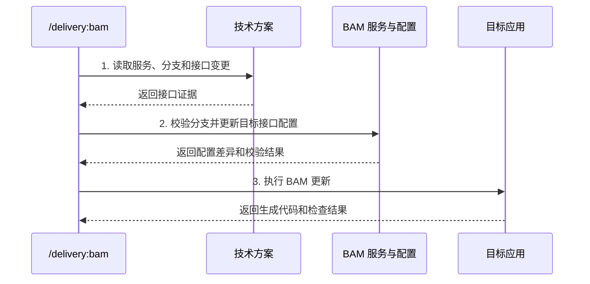
```mermaid
sequenceDiagram
    participant B as /delivery:bam
    participant T as 技术方案
    participant C as BAM 服务与配置
    participant A as 目标应用

    B->>T: 1. 读取服务、分支和接口变更
    T-->>B: 返回接口证据
    B->>C: 2. 校验分支并更新目标接口配置
    C-->>B: 返回配置差异和校验结果
    B->>A: 3. 执行 BAM 更新
    A-->>B: 返回生成代码和检查结果
```

#### 3.3.2 阶段作用：形成前端可消费的接口合同

本案例确认目标服务为 `ecom.buyin.admin_api`、目标分支为 `feat_bujili`，并同步了 4 个新增接口和 1 个字段变更接口。同步完成后，Plan 可以按确定的请求路径和字段规划数据流，Code 可以直接使用生成的接口方法与类型，避免手写合同产生偏差。BAM 通过只说明接口配置和生成结果已经对齐；真实响应、业务行为和页面结果仍由后续实现与验证阶段确认。

### 3.4 `/delivery:prd` 阶段

`/delivery:prd` 负责把产品原稿整理成开发、测试和设计验收可以直接使用的需求说明。Agent 会读取 PRD 正文、评论和技术文档，拆出能够独立实现和验收的需求点；涉及页面的部分继续读取 Figma 节点和截图；仍有歧义的内容通过飞书机器人请产品或用户确认。本阶段只处理需求与设计依据，不修改业务代码。

#### 3.4.1 主要步骤与交互方式

| 步骤         | Agent 执行的工作                                             | 主要作用                                                     | 阶段产物                 |
| ------------ | ------------------------------------------------------------ | ------------------------------------------------------------ | ------------------------ |
| 汇总需求材料 | 读取 PRD 正文、评论、技术文档和已有页面信息                  | 把产品规则、页面要求和接口线索放到同一份上下文中             | 需求材料与来源说明       |
| 拆分需求     | 按触发条件、页面状态、操作结果和异常边界拆成可独立验收的需求点 | 后续开发可以逐项实现，测试可以逐项检查，减少只覆盖主流程的情况 | 需求分析稿与验收标准     |
| 对齐 Figma   | 从 PRD 中的设计链接定位页面和状态，读取节点树并导出截图      | 确认页面结构、区域顺序、按钮和可见样式确有设计依据           | Figma 节点映射、设计截图 |
| 发起确认     | 把会改变范围、页面行为或验收结果的问题整理成单项选择，通过飞书机器人推送 | 产品或用户的回答直接进入后续技术计划，避免开发自行猜测       | 用户确认结论与影响说明   |

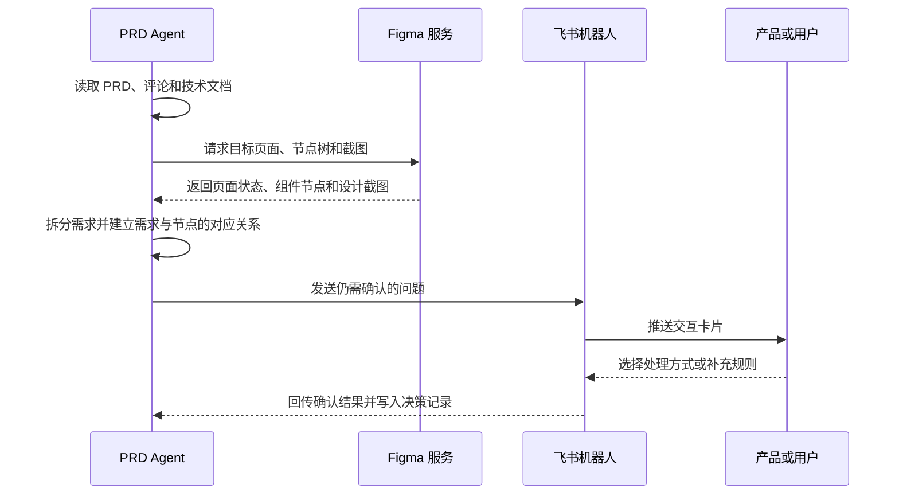
```mermaid
sequenceDiagram
    participant Agent as PRD Agent
    participant Figma as Figma 服务
    participant Bot as 飞书机器人
    participant PO as 产品或用户

    Agent->>Agent: 读取 PRD、评论和技术文档
    Agent->>Figma: 请求目标页面、节点树和截图
    Figma-->>Agent: 返回页面状态、组件节点和设计截图
    Agent->>Agent: 拆分需求并建立需求与节点的对应关系
    Agent->>Bot: 发送仍需确认的问题
    Bot->>PO: 推送交互卡片
    PO-->>Bot: 选择处理方式或补充规则
    Bot-->>Agent: 回传确认结果并写入决策记录
```

#### 3.4.2 当前阶段作用 - Case 分析

本次完整分析覆盖奖励配置、发奖前剔除、人工提报、剔除明细和埋点。下面只选择“人工提报命中不激励规则”这一段说明实际效果。

##### 3.4.2.1 原子需求拆分减少实现遗漏

> **原需求点内容：** 运营在「奖励投放-人工提报」提交中奖名单后，对命中自然处罚的作品或账号红字提示“命中【不激励】规则”；系统仅提示，不自动剔除；页面展示问题作品汇总，提供“一键移除”和明细导出；处罚作品或账号未移除前禁止提交发奖名单。

这段原需求同时包含校验、展示、操作、下载和提交限制。拆分结果如下：

| 拆出的原子需求点 | 拆分时的考虑及对后续开发、验收的作用 |
| --- | --- |
| 提交名单后执行不激励校验，命中项保留在列表，由运营决定是否移除 | **考虑系统和运营的职责边界。** 开发不能把命中项自动删除；验收需要检查命中项仍在列表中，并以红字显示原因。 |
| 存在命中项时展示作品总数和问题作品数 | **考虑提示出现条件和数量一致性。** 开发需要从列表状态计算汇总数字；验收要核对提示数量与命中行是否一致。 |
| 提供“一键移除”，只移除不满足准入门槛或命中不激励规则的作品 | **考虑批量操作边界。** 开发需要保留正常作品；验收要同时检查问题作品被移除、正常作品未被误删。 |
| 提供“导出剔除明细”，只导出被移除的记录 | **考虑导出范围、字段和数据来源。** 开发需要处理账号、视频、移除原因、处罚原因和操作人；验收不能只检查按钮可点击，还要检查导出内容。 |
| 问题作品未移除前禁止“提交并投放” | **考虑负向流程和恢复条件。** 验收既要覆盖禁止提交，也要覆盖移除完成后恢复提交，防止处罚作品进入发奖流程。 |

拆分后，后续任务不会停留在“接入校验接口”。提示、列表状态、批量操作、下载结果和提交限制都有明确的实现与验收要求。

##### 3.4.2.2 Figma 节点映射提供直接实现依据

Agent 在 Figma 中找到人工提报命中态，再沿页面结构定位右侧抽屉、提示区、按钮、表格行和底部提交区。Figma 节点是设计文件中页面或组件的位置编号，点击“Figma 定位”可以在原文件中打开对应图层。

| 原子需求点 | Figma 节点与定位 | 匹配结果 |
| --- | --- | --- |
| 人工提报命中态的页面结构 | [`25:13842` 人工提报命中态](https://www.figma.com/design/fNJJ7mEmEMYU5y0tcAZm3X/Untitled?node-id=25-13842&p=f&m=dev)、[`87:6973` “提报视频”抽屉](https://www.figma.com/design/fNJJ7mEmEMYU5y0tcAZm3X/Untitled?node-id=87-6973&p=f&m=dev) | 原始节点包含人工提报页背景和右侧抽屉；抽屉内依次是提报方式、奖励配置、提示与操作区、表格、底部按钮，结构与需求流程一致。 |
| 命中数量汇总提示 | [`87:6998` 命中汇总提示](https://www.figma.com/design/fNJJ7mEmEMYU5y0tcAZm3X/Untitled?node-id=87-6998&p=f&m=dev) | 节点文案给出“共 100 个作品，其中……5 个”的示例，设计为浅蓝提示条。 |
| 一键移除与导出剔除明细 | [`87:7000` 一键移除](https://www.figma.com/design/fNJJ7mEmEMYU5y0tcAZm3X/Untitled?node-id=87-7000&p=f&m=dev)、[`87:7002` 导出剔除明细](https://www.figma.com/design/fNJJ7mEmEMYU5y0tcAZm3X/Untitled?node-id=87-7002&p=f&m=dev) | 两个按钮位于提示区右侧；“一键移除”是主按钮，“导出剔除明细”是次级按钮，顺序和层级均可直接用于开发。 |
| 行级原因与移除 | [`87:7016` 表格行区域](https://www.figma.com/design/fNJJ7mEmEMYU5y0tcAZm3X/Untitled?node-id=87-7016&p=f&m=dev)、[`87:7043` 行级移除](https://www.figma.com/design/fNJJ7mEmEMYU5y0tcAZm3X/Untitled?node-id=87-7043&p=f&m=dev) | 表格行内有红色“不满足准入门槛”“命中【不激励】规则”及组合状态，操作列有“移除”入口。 |
| 提交限制对应的底部操作区 | [`87:7133` 提交并投放](https://www.figma.com/design/fNJJ7mEmEMYU5y0tcAZm3X/Untitled?node-id=87-7133&p=f&m=dev) | 底部操作区包含“取消”和主按钮“提交并投放”；PRD 在这个按钮上补充了命中项未移除时禁止提交的规则。 |


图中可以直接看到命中汇总、一键移除、导出剔除明细、行级红色原因和底部提交区。开发阶段可按表中的节点读取布局和样式；设计验收阶段用这张图核对运行页面。

##### 3.4.2.3 ask-first 确认后续实现口径

Figma 可以提供页面依据，但业务范围、字段来源和不同入口的复用关系未必会体现在画面中。本次 PRD 阶段把这类问题整理成飞书卡片，推送给产品或用户确认；提交结果写入决策记录，并作为技术计划和验收标准的输入。


下面列出三个直接影响人工提报实现的确认：

| 待确认问题 | 原需求中的模糊点 | 产品或用户的确认 | 对后续实现的作用 |
| --- | --- | --- | --- |
| 批量上传命中不激励规则后的页面状态 | PRD 规定人工提报需要展示命中状态，Figma 也有批量上传入口，但**没有单独给出批量上传命中后的设计状态**。无法判断是复用手动输入的命中态，还是新增一套提示和操作。 | 复用手动输入的命中态。 | 两种提报入口共用命中汇总、行级状态、移除操作和提交限制。开发不需要自行设计批量上传的异常态；测试按同一套规则覆盖手动输入和批量上传。 |
| “导出剔除明细”中的原因字段与导出范围 | PRD 同时列出“移除原因”和“处罚原因”，但页面没有移除原因输入项，评论中也指出**处罚原因的数据来源不明确**；同时还需确认导出全部提报记录，还是只导出被剔除记录。 | “移除原因”只取“手动移除”和“命中【不激励】规则”两种；“处罚原因”从接口获取；只导出被剔除记录。 | 下载实现有了明确的记录范围、字段枚举和数据来源。验收可以检查每一列的内容，避免出现正常发奖记录被导出、原因字段为空或前后端口径不一致。 |
| 本期申诉能力的交付范围 | PRD 评论提到“支持申诉”，但**没有说明入口位置、申诉对象、跳转目标和交互方式**，Figma 中也没有相应入口或弹窗。若直接实现，需要开发自行补齐产品方案。 | 本期不增加申诉入口，只交付提示、移除和剔除明细。 | 技术计划不再新增申诉按钮、跳转或弹窗，开发和验收范围保持在当前 PRD 内，也避免把未经确认的交互带入线上。 |

#### 3.4.3 补充说明

==真实 UI 开发必须直接消费 Figma==

> 结论：本案例的多轮设计复测表明，仅凭截图和自然语言描述，极难实现 UI 的百分百还原。真实需求开发应存在能够直接读取需求对应的 Figma 节点树和样式属性，并以同一节点作为设计验收基准。

### 3.5 `/delivery:plan` 阶段

`/delivery:plan` 把已确认的需求、设计依据和用户决策放进现有工程，形成可以直接拆任务的技术方案。阶段结果写入 `04-tech-plan.md`，供后续 Task、Code、Verify 和 Design 阶段使用；本阶段只做分析和规划，不修改业务代码。

本节只采用 repair 前快照 `20260710-162521-docx-NQxTdRPP` 中保存的原始 `04-tech-plan.md`。后续 repair 对 Plan 的修正不回填到本节；Plan 中判断不完整或仍为 P1 的内容也按快照保留。本案例Plan 的门禁结果为 `PARTIAL_READY`，实施模式为 `MOCK_PREVIEW`，下一阶段是 `/delivery:task`。

#### 3.5.1 主要步骤与交互方式

| 步骤 | Agent 执行的工作 | 主要作用 | 交互方式与阶段结果 |
| --- | --- | --- | --- |
| 1. 汇总已确认输入 | 读取 PRD 分析、Figma 节点与截图、用户确认结论、技术文档和已有接口信息 | 先固定需求范围和事实来源，避免技术规划重新解释已经确认的产品口径 | Agent 以只读方式汇总材料；缺失但不影响主流程的信息登记为待补充项，影响范围或方案的关键问题才再次请用户确认 |
| 2. 探索仓库代码 | 定位相关页面、组件、Store、Service、BAM 封装和类型定义，梳理当前数据流与提交链路 | 判断新需求应复用、扩展还是局部重构现有实现，并给出准确的代码落点 | Agent 只读搜索仓库并追踪调用关系，形成组件职责、状态来源、接口入口和允许修改范围 |
| 3. 规划页面与业务状态 | 将 PRD 原子需求、Figma 页面状态和现有运行态逐项对照，确定新增、保留、重构、移除或仅改逻辑 | 把“设计上看到了什么”转成“工程上具体怎么处理”，同时保护不在本期范围内的旧功能 | 对有 UI 的需求读取精确 Figma 节点；对无独立设计的状态使用已确认的复用决策或登记缺口，形成页面状态处置表 |
| 4. 明确数据与动作边界 | 为按钮、列表、导出、提交校验等动作说明状态变化、数据来源、接口调用和禁止发生的副作用 | 让开发知道哪些行为只改变前端状态，哪些必须请求后端；让测试能够检查正向结果和负向约束 | Agent 对照 PRD、接口文档和现有代码，形成交互、接口、错误处理和 mock/真实联调边界 |
| 5. 形成技术计划 | 将代码定位、UI 实施约束、数据流、接口策略、任务输入、验证方式和风险统一写入技术计划 | 把分散的需求、设计和代码调查结果收敛为一份可执行、可验收的阶段产物 | 输出 `04-tech-plan.md`；每项结论同时说明实现位置、完成条件和后续阶段使用方式 |
| 6. 完成阶段门禁与交接 | 检查需求是否都有代码落点、UI 是否有基线、接口是否有处理策略、未决项是否已分级 | 防止关键缺口被带入编码阶段后由开发临场决定 | 无阻塞项时进入 `/delivery:task`；若出现会改变方案的高优先级问题，则暂停交接并返回用户或前序阶段确认 |

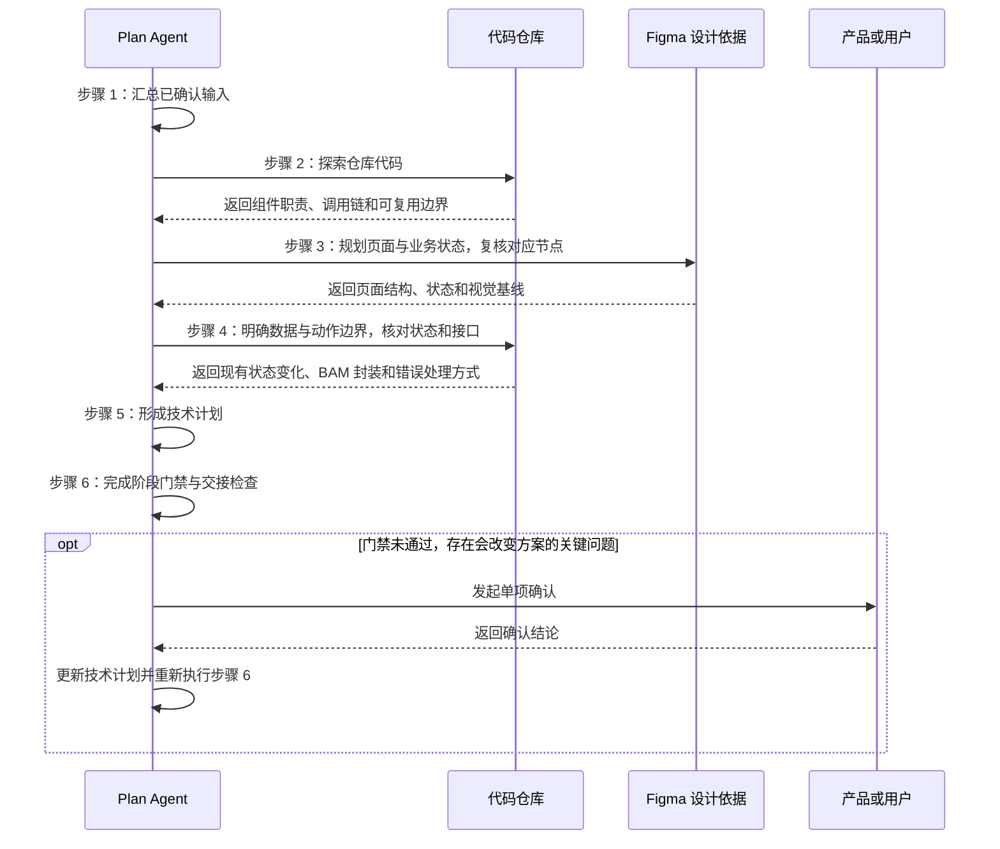
```mermaid
sequenceDiagram
    participant Agent as Plan Agent
    participant Repo as 代码仓库
    participant Figma as Figma 设计依据
    participant User as 产品或用户

    Agent->>Agent: 步骤 1：汇总已确认输入
    Agent->>Repo: 步骤 2：探索仓库代码
    Repo-->>Agent: 返回组件职责、调用链和可复用边界
    Agent->>Figma: 步骤 3：规划页面与业务状态，复核对应节点
    Figma-->>Agent: 返回页面结构、状态和视觉基线
    Agent->>Repo: 步骤 4：明确数据与动作边界，核对状态和接口
    Repo-->>Agent: 返回现有状态变化、BAM 封装和错误处理方式
    Agent->>Agent: 步骤 5：形成技术计划
    Agent->>Agent: 步骤 6：完成阶段门禁与交接检查
    opt 门禁未通过，存在会改变方案的关键问题
        Agent->>User: 发起单项确认
        User-->>Agent: 返回确认结论
        Agent->>Agent: 更新技术计划并重新执行步骤 6
    end
```

#### 3.5.2 当前阶段作用 - Case 分析

本案例继续以“人工提报命中不激励规则”为例。Plan 阶段既要把需求落实到现有代码，也要把 Figma 中可见的页面状态转成结构、交互和验收约束。下面先说明代码落位，再说明 UI 设计依据如何转化为实施约束。

##### 3.5.2.1 需求范围落实到具体代码位置

| 原子需求 | Plan 的落位结果 | Case 分析 |
| --- | --- | --- |
| 人工提报中存在不满足准入门槛或命中【不激励】规则的作品时，禁止“提交并投放”；问题作品移除后，恢复原有提交流程。 | `manuallySubmitVideoStore.ts` 接收 `if_not_incentive` 和 `not_incentive_reason`，保留命中项并提供命中统计、剔除项数据；`manually-submit-videos-form/index.tsx` 增加汇总提示、批量操作和行级状态；`manually-submit-videos-drawer/index.tsx` 扩展提交拦截。 | Plan 没有给出 `hasSubmitHitItems` 等最终实现变量，也没有把移除确定为纯前端动作。它规划为：命中项先保留在列表中并显示红色原因；点击“一键移除”时，必要时调用 `apiCandidateRemove` 记录剔除原因，成功后再更新当前名单，失败时不移除并提示；“导出剔除明细”通过 `apiDownloadContentRemoveRecord` 发送剔除项；问题作品未移除时阻止进入二次确认，移除后继续原提交流程。`candidate_id` 映射、失败提示、手动输入接口是否已同步命中字段仍是 P1 或 Task discovery 项。 |

##### 3.5.2.2 UI 设计依据转化为实施约束


截图中，蓝色提示区显示作品总数和问题作品数，右侧是“一键移除”和“导出剔除明细”；问题作品在表格行内显示红色原因，底部仍保留“提交并投放”。Plan 将这些可见内容转换为开发和验收都能执行的约束。

本案例使用的 Figma 依据包括：[人工提报命中态 `25:13842`](https://www.figma.com/design/fNJJ7mEmEMYU5y0tcAZm3X/Untitled?node-id=25-13842&p=f&m=dev)、[提报抽屉 `87:6973`](https://www.figma.com/design/fNJJ7mEmEMYU5y0tcAZm3X/Untitled?node-id=87-6973&p=f&m=dev)、[命中汇总 `87:6998`](https://www.figma.com/design/fNJJ7mEmEMYU5y0tcAZm3X/Untitled?node-id=87-6998&p=f&m=dev)、[一键移除 `87:7000`](https://www.figma.com/design/fNJJ7mEmEMYU5y0tcAZm3X/Untitled?node-id=87-7000&p=f&m=dev)、[导出剔除明细 `87:7002`](https://www.figma.com/design/fNJJ7mEmEMYU5y0tcAZm3X/Untitled?node-id=87-7002&p=f&m=dev)、[表格行 `87:7016`](https://www.figma.com/design/fNJJ7mEmEMYU5y0tcAZm3X/Untitled?node-id=87-7016&p=f&m=dev)、[行级移除 `87:7043`](https://www.figma.com/design/fNJJ7mEmEMYU5y0tcAZm3X/Untitled?node-id=87-7043&p=f&m=dev)和[提交并投放 `87:7133`](https://www.figma.com/design/fNJJ7mEmEMYU5y0tcAZm3X/Untitled?node-id=87-7133&p=f&m=dev)。下表不再重复链接，节点编号均指向这组设计依据。

| 步骤与关注问题 | Plan 的处理方式 | Plan 记录的结论及后续用途 |
| --- | --- | --- |
| 1. 锁定依据：设计从哪里来？ | 登记页面主态、容器节点和细节节点，说明每个节点在当前需求中代表什么。后续结论必须能回到原设计核对。 | Plan 将 `25:13842` 记为人工提报命中态，`87:6973` 记为目标抽屉，`87:7016` 记为表格行细节。三个节点共同描述同一业务状态，Task、Code、Verify 和 Design 使用这组节点，不再各自寻找参考图。 |
| 2. 划定范围：改哪一块？ | 读取节点层级，区分目标 UI 和截图中的背景页面，确定本期改造边界。 | `25:13842` 同时包含后台背景和右侧抽屉。Plan 将实现范围限定在 `87:6973` 对应的“提报视频”抽屉，背景只用于说明抽屉出现的位置，因此开发无需重做整页，验收也只检查抽屉。 |
| 3. 判断变化：哪些新增，哪些保留？ | 把 Figma 状态与现有页面逐项比较，为每个区域标记新增、局部调整、继续保留或仅修改逻辑。 | 命中汇总、行级红色原因和移除入口属于新增内容；提报方式、奖励配置、原有编辑列和底部操作区继续保留；“提交并投放”只增加命中拦截。本期没有确认过申诉设计，所以 Plan 明确不增加申诉入口，开发不需要重做整个抽屉。 |
| 4. 落到代码：由谁负责？ | 将页面区域和交互动作映射到现有组件与状态层，写清职责和允许修改的范围。 | 原 Plan 把命中统计和剔除项数据放在 `manuallySubmitVideoStore.ts`，把汇总提示、两个操作按钮和行级红色状态放在 `manually-submit-videos-form/index.tsx`，把提交限制放在 `manually-submit-videos-drawer/index.tsx`。Task 可以按这三个职责拆分，但具体状态变量和部分接口字段仍需在后续任务中确认。 |
| 5. 固定页面：应当长什么样？ | 把节点转成区域顺序、必显内容、单元格规则、固定文案和样式来源，供开发逐项实现。 | Plan 固定抽屉顺序为“提报方式 → 奖励配置 → 命中汇总与批量操作 → 作品表格 → 底部操作区”；红色原因放在作品信息单元格内，两种原因允许同时出现，原有编辑列继续保留。按钮文字和顺序以 `87:6998`、`87:7000`、`87:7002`、`87:7016` 为准，颜色、间距和组件属性也从这些节点读取。 |
| 6. 固定行为：点击后发生什么？ | 将每个可操作元素与业务规则、前端状态和接口调用对齐，并记录当时尚未闭合的接口问题。 | Plan 将“一键移除”规划为必要时先调用 `apiCandidateRemove`，请求携带活动、配置、候选项和移除原因；成功后从当前名单移除命中项，失败时不更新列表并提示。行级“移除”由 Store 更新目标行，Plan 同时保留了可选移除请求。导出调用 `apiDownloadContentRemoveRecord`，请求只包含剔除项；问题作品仍存在时，“提交并投放”被拦截，不进入二次确认。 |
| 7. 交接验收：后续怎样使用？ | 将 UI 约束转成 Task 的代码范围、节点读取要求、完成条件和验收基线；快照中没有解决的问题继续以风险交接。 | 人工提报命中态有精确节点，开发前需要重新读取节点数据；批量上传只有[基础页面 `25:13971`](https://www.figma.com/design/fNJJ7mEmEMYU5y0tcAZm3X/Untitled?node-id=25-13971&p=f&m=dev)，没有独立命中态，Plan 按已确认结论复用手动输入命中态。与此同时，`candidate_id` 映射和移除失败提示、手动输入接口命中字段、导出字段空值与处罚原因数组格式、`lark_url` 打开方式仍为 P1，不应在本节写成已经解决。 |

#### 3.5.3 补充说明

==`--mock-preview` 参数说明==

> **`--mock-preview` 表示在后端接口或联调环境尚未完全就绪时，先规划并验证前端页面和调用链。** 业务代码仍调用真实 BAM wrapper，mock 响应由后续 `/delivery:mock` 根据页面实际发出的请求提供。它不等于在业务代码中写静态假数据，也不代表真实后端已经联调完成。

### 3.6 `/delivery:task` 阶段

本阶段将 Plan 中的需求范围、实现路径和 UI 约束转换为三类可以互相校验的执行对象：==开发任务 Task、验收用例 Test Case，以及为用例构造可验证数据状态的 BAM Rule==。只有每项功能需求和 UI 要求都能映射到具体 Task 和 Test Case，且需要接口数据的用例已经声明对应 BAM Rule 与真实联调边界，任务才允许进入代码阶段。本节以阶段产物 `delivery-task.md` 和 `09-test-case-matrix.md` 为依据。产物中的 `Task Readiness` 和 `Coverage Result` 均为 `PASS`，`Mock Closure` 为 `PENDING`。

#### 3.6.1 主要步骤与交互方式

| 步骤 | 具体做法 | 解决的问题 | 产物结果 |
| --- | --- | --- | --- |
| 1. 建立需求覆盖台账 | 对照 Plan、原子需求、用户确认结论和 Figma 合同，逐条登记需求对应的页面、UI 节点、任务和验收方向 | 防止页面状态、交互动作或异常分支在拆任务时被遗漏 | AR-001～AR-017 均有承接任务，状态为 `COVERED`；发现事实冲突时返回 `/delivery:plan` |
| 2. 拆分可执行 Task | 按代码边界、页面区域和完整用户流程组织任务，并写清代码位置、实施步骤、UI 依据、完成条件、禁止范围和停止条件 | 让开发可以直接执行，同时避免把共享状态拆散或把不同业务域混入同一任务 | 先生成 `delivery-task.md`，再检查每个任务是否可执行；主体任务为 TASK-001～TASK-008，检查结果均为 `PASS` |
| 3. 为 Task 生成 Test Case | Task 完成后生成测试矩阵，每个 Case 都标明由哪个 Task 实现；验收结果仍以需求、用户决策、Plan 合同和 Figma 证据为准 | 为每个任务补齐页面、区域、单元格、交互、异常和回归检查，防止 Case 只复述 Task 的完成说明 | `09-test-case-matrix.md` 共包含 32 个 Case：页面级 6 个、区域级 2 个、单元格级 3 个、交互级 21 个。断言与 Task 冲突时记录偏移并阻断放行，不能修改断言迎合 Task |
| 4. 为用例绑定 BAM Rule | 对需要接口数据的 Case，记录接口、规则编号、具体 UI 操作、请求匹配条件、返回状态、验收断言和真实联调边界；静态 UI 等用例不绑定 Rule | 为命中、阻断、超时、异常和空名单等场景提供稳定数据，同时说明 mock 可以验证什么、不能验证什么 | 产物中有 28 个 Case 依赖运行时 BAM mock，共关联 15 个Mock Rule；另有 4 个 Case 不需要运行时 mock。Rule 在本阶段只形成用例合同，运行态闭合留给后续阶段 |

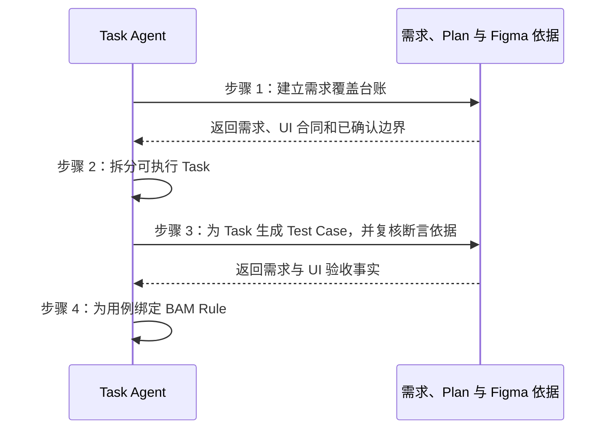
```mermaid
sequenceDiagram
    participant Agent as Task Agent
    participant Source as 需求、Plan 与 Figma 依据

    Agent->>Source: 步骤 1：建立需求覆盖台账
    Source-->>Agent: 返回需求、UI 合同和已确认边界
    Agent->>Agent: 步骤 2：拆分可执行 Task
    Agent->>Source: 步骤 3：为 Task 生成 Test Case，并复核断言依据
    Source-->>Agent: 返回需求与 UI 验收事实
    Agent->>Agent: 步骤 4：为用例绑定 BAM Rule
```

#### 3.6.2 当前阶段作用 - Case 分析

##### 3.6.2.1 Task 拆分覆盖功能和 UI 范围

Task 不是简单地把 17 条原子需求拆成 17 个开发事项。拆分时优先考虑代码边界、页面状态和用户操作是否属于同一条实现链路，因此一个 Task 可以承接多条相关需求；同一需求涉及不同入口或不同奖励类型时，也可以由多个 Task 共同覆盖。

| Task | 实施范围 | 覆盖的需求与 UI | 拆分逻辑及作用 |
| --- | --- | --- | --- |
| TASK-001、TASK-002 | 配置页“全部用户”和“仅限预埋用户”两种状态下的不激励提示与规则入口 | AR-001、AR-002；Figma `1:9770`、`1:10938` 及对应文本节点 | 两种状态修改同一配置组件，但挂载位置和页面上下文不同，分别建 Task 可以独立核对提示位置，同时复用同一提示和点击逻辑 |
| TASK-003、TASK-004 | DOU+币、DOU+券剔除明细的 Tab、筛选、表格和分页 | AR-011～AR-014；Figma `1:12120`、`1:12390` | 两类奖励共用页面框架，但接口、筛选标签和首列数据结构不同。拆开后可以分别约束作品维度与作者维度，防止字段和表格列跨 Tab 残留 |
| TASK-005 | 人工提报手动输入命中态、汇总、移除、导出和提交保护 | AR-006～AR-010；Figma `25:13842`、`87:6973` 及汇总、按钮、表格行、底部操作节点 | 这些功能共享同一 Drawer、Store 和操作链路，放在一个 Task 中可以完整处理“发现问题作品—运营处理—允许提交”的状态变化 |
| TASK-006 | 批量上传命中态复用 | AR-006～AR-010；Figma 基础状态 `25:13971` | 批量上传使用不同入口和数据接口，但复用 TASK-005 的命中汇总、行级状态和提交保护；单独建 Task 可以保护现有上传流程不被手动输入逻辑覆盖 |
| TASK-007 | DOU+币、DOU+券发奖前治理阻断、解除、超时、异常和空名单 | AR-003～AR-005 | 这部分以业务分支和接口结果为主，没有独立主页面设计。集中处理可以覆盖正向、反向和错误边界，并统一禁止伪成功状态 |
| TASK-008 | 配置入口、人工提报命中态、剔除明细 Tab 的埋点 | AR-015～AR-017 | 埋点分布在多个页面，但有独立的调用位置和断言方式。单列任务可以检查事件只触发一次、参数区分正确，并避免为埋点新增 SDK 或改变业务流程 |

##### 3.6.2.2 Test Case 与 BAM Rule 形成可验证链路

> **原需求点内容：** 运营在「奖励投放-人工提报」提交中奖名单后，对命中自然处罚的作品或账号红字提示“命中【不激励】规则”；系统仅提示，不自动剔除；页面展示问题作品汇总，提供“一键移除”和明细导出；处罚作品或账号未移除前禁止提交发奖名单。

以人工提报命中不激励规则为例，Task 阶段没有只写“完成命中态开发”，而是把同一条用户流程拆成不同层级的 Case，再为需要数据状态的 Case 指定 BAM Rule。这样既能检查 UI 是否符合设计，也能检查点击后的状态变化和接口行为。

| 链路环节 | 本案例中的具体内容与作用 |
| --- | --- |
| 需求和 UI 依据 | AR-006～AR-010 要求命中项保留在名单中，展示问题数量和红色原因，提供一键移除、导出剔除明细，并在问题项未处理时阻止提交。Figma 节点确定了 Drawer 结构、汇总区、按钮顺序、行级状态和底部提交区，Case 的页面与视觉断言从这些依据取得。 |
| Task 承接 | TASK-005 负责手动输入命中态及完整操作链，TASK-006 负责批量上传入口的状态复用，TASK-008 负责命中提示曝光埋点。三个 Task 分别处理主体功能、入口差异和横向埋点，合起来覆盖同一业务流程。 |
| 页面和单元格 Case | `TC-UI-MANUAL-HIT-PAGE` 检查 Drawer 中汇总、一键移除、导出、表格和提交区是否同时存在；<br />`TC-CELL-MANUAL-HIT-STATUS` 检查红色原因是否位于作品信息单元格内。<br />两条 Case 还要求命中项不得自动消失、不得出现申诉入口或额外页面结构。 |
| 操作 Case | `TC-INT-MANUAL-SUBMIT-GUARD` 检查问题项未处理时不打开二次确认、不发送发奖请求；<br />`TC-INT-MANUAL-ONE-CLICK-REMOVE` 检查批量操作后的名单变化；<br />`TC-INT-MANUAL-EXPORT` 检查只提交剔除记录并正确处理返回链接。每条操作都有正向结果和失败时不得出现的副作用。 |
| BAM Rule、对应接口与 mock 目的 | `R-BAM-MANUAL-SEARCH-HIT` 对应 `apiSearchDeliveryItems`。mock 返回同时包含正常项、未满足准入项和命中不激励规则项的名单，用于验证命中汇总、行级红色原因、提交阻断和曝光埋点。<br>`R-BAM-CANDIDATE-REMOVE-SUCCESS` 对应 `apiCandidateRemove`。mock 返回移除成功，用于验证请求内容，以及成功后问题项被移除、正常项仍保留。<br>`R-BAM-DOWNLOAD-REMOVE-RECORD` 对应 `apiDownloadContentRemoveRecord`。mock 返回 `lark_url`，用于验证导出请求只包含剔除记录，并检查页面能否正确处理返回链接。 |
| 验证边界 | 命中态 Rule 可以证明前端消费字段后的页面和提交保护；移除、导出等写接口 Rule 可以检查请求和页面响应，但不能证明真实持久化、飞书表格权限或发奖事务已经成功。这些结果必须留到真实环境复验。 |

同一 BAM Rule 可以为多个 Case 提供相同运行状态，例如 `R-BAM-MANUAL-SEARCH-HIT` 同时支撑页面、单元格、提交保护和埋点用例；这些 Case 仍需分别执行各自的 UI、交互和网络断言，不能用一个“命中态已展示”代替整条链路。

#### 3.6.3 补充说明

==Test Case 是人工审查的重要节点==

> **需求最终实现成什么样，直接取决于 Test Case 是否覆盖完整、断言是否正确。** Task 和 Case 的编号能够互相对应，只能说明追踪关系完整；如果两者同时误读需求，代码仍可能在全部 Case 通过后得到错误结果。
>
> Test Case 不能把 Task 写出的预期结果直接复制成验收事实。审查时需要回到 PRD、用户决策、Plan 合同和 Figma 节点，逐项核对 Case 引用的需求或 UI 依据，以及正向断言、负向断言、视觉断言和证据要求。若正确断言与 Task 冲突，应记录具体偏移并返回 `/delivery:plan`，不能修改断言迎合 Task。

### 3.7 `/delivery:code` 阶段

Code 阶段以 Task 为最小执行单元。每个 Task 先固定需求、UI 和 Test Case 约束，再修改业务代码，最后完成代码级 C2D 校验和独立审查；当前 Task 通过后才进入下一项。本案例按顺序执行 TASK-001～TASK-008，共完成 45/45 个实施步骤。运行页面是否与 Figma 一致，由后续 Design Case 根据截图、DOM 和浏览器实际样式给出结论。

本文把“读取设计节点、形成结构证据、再用代码反向核对设计”的过程统称为 C2D。其中，F2C 是 Figma-to-Code，指按精确 Figma 节点实现；Runtime 基线指以现有运行页面和组件为改造起点。工作流只保留一套 F2C/C2D 工具入口：`/f2c get_d2c_json` 读取设计证据，`d2c_verify_code` 校验代码，`d2c_cleanup_temp` 在证据归档后清理临时文件。Code 阶段不生成 BAM Rule，也不在业务代码中接入 mock 分支；页面、Store 和 Service 仍调用真实业务封装。

#### 3.7.1 主要步骤与交互方式

| 步骤 | 具体用法 | 检查与处理方式 | 本案例中的执行结果 |
| --- | --- | --- | --- |
| 1. 固定任务队列和验收依据 | 读取 Task 对应的需求编号、UI 证据模式、Figma 节点、Test Case、代码范围和禁止修改项，按任务编号顺序执行，不合并、不跳过。 | 开始编码前核对 Task 是否具备明确的页面状态、接口边界和完成条件；发现需求或 UI 依据冲突时，先退回上游处理。 | 人工提报命中态由 TASK-005 承接；批量上传复用、发奖治理和埋点分别由 TASK-006～TASK-008 承接，没有把后续范围提前混入当前 Task。 |
| 2. 执行功能与 UI 实现 | UI 采用两种用法。（1）需要精确还原时，运行 `/f2c get_d2c_json` 获取节点 XML 和预览图，从中读取层级、文案、字号、颜色和位置；（2）允许复用运行态基线时，读取既有页面截图、节点信息和当前组件，只改本次需求涉及的区域。<br />功能实现沿页面、Store、Service 到真实业务封装接通状态和动作。 | F2C 证据会被整理成结构、文案、样式和交互合同后再写代码；Runtime 基线需要说明哪些区域保持不变、哪些区域允许新增。接口成功后才更新页面，失败分支不得伪造成功。 | TASK-001 按节点实现“全部用户”状态下的不激励提示和规则链接；TASK-003 在现有表格基线上实现 DOU+币剔除明细；TASK-007 接通 DOU+币、DOU+券发奖前的治理分支。 |
| 3. 执行 C2D 校验和代码审查 | 对要求精确设计还原的 Task 运行 `d2c_verify_code`，将当前代码与设计节点比较，并按 critical、moderate、minor 输出问题；证据归档后用 `d2c_cleanup_temp` 清理临时文件。随后执行独立只读审查和机械检查。 | 独立审查核对五类内容：① Task 范围以及 PRD、Figma、Test Case 语义是否一致；② UI 证据模式是否使用正确；③ 页面是否调用真实业务封装，是否越界加入 mock、fixture 或 fake success；④ 构建、变更文件、`git diff --check` 和禁用模式扫描是否通过；⑤ 仍缺哪些运行态证据。C2D 或审查发现问题时，返回当前 Task 修改并重新检查。 | TASK-001 的 `d2c_verify_code` 结论为 Excellent，0 个严重问题、0 个中等问题、1 个轻微问题，并推动删除了多余的 `window.open`；TASK-002 的工具校验为 Excellent，0 个问题。8 个 Task 均通过构建、独立审查和主门禁，并分别形成代码检查点。需要截图、DOM 或交互才能回答的 UI 项保留给后续阶段。 |

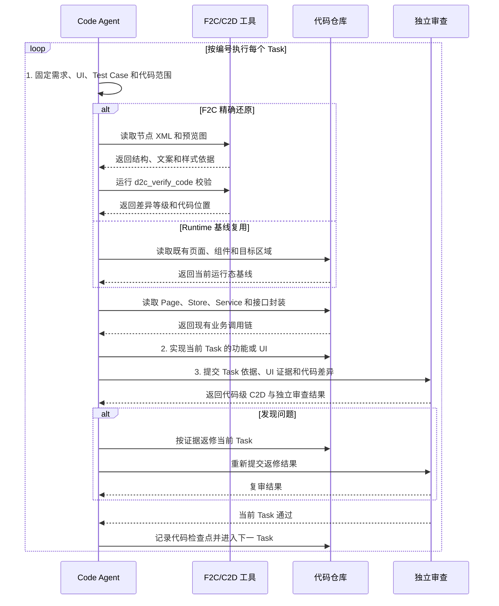
```mermaid
sequenceDiagram
    participant A as Code Agent
    participant T as F2C/C2D 工具
    participant R as 代码仓库
    participant C as 独立审查

    loop 按编号执行每个 Task
        A->>A: 1. 固定需求、UI、Test Case 和代码范围

            alt F2C 精确还原
                A->>T: 读取节点 XML 和预览图
                T-->>A: 返回结构、文案和样式依据
                A->>T: 运行 d2c_verify_code 校验
            		T-->>A: 返回差异等级和代码位置
            else Runtime 基线复用
                A->>R: 读取既有页面、组件和目标区域
                R-->>A: 返回当前运行态基线
            end


            A->>R: 读取 Page、Store、Service 和接口封装
            R-->>A: 返回现有业务调用链

        A->>R: 2. 实现当前 Task 的功能或 UI
        A->>C: 3. 提交 Task 依据、UI 证据和代码差异
        C-->>A: 返回代码级 C2D 与独立审查结果
        alt 发现问题
            A->>R: 按证据返修当前 Task
            A->>C: 重新提交返修结果
            C-->>A: 复审结果
        end
        C-->>A: 当前 Task 通过
        A->>R: 记录代码检查点并进入下一 Task
    end
```

#### 3.7.2 当前阶段作用 - Case分析

##### 3.7.2.1 将 UI 需求转为代码实现

Code 阶段根据 UI 依据选择 F2C 精确实现或 Runtime 基线复用。F2C 适合有明确设计节点的新内容；Runtime 适合在成熟页面上增加局部能力。本阶段输出可运行代码和代码检查点，不用静态校验结论代替运行态 UI 对齐。

###### F2C 精确还原

本案例使用 TASK-001，目标是在奖励配置页“全部用户”状态下增加不激励提示和规则链接。

1. **固定设计依据。** 调用 F2C 工具读取指定节点，调用参数如下；返回 XML 后，再定位提示文本节点 `1:10202`。

   ```text
   /f2c get_d2c_json
     --fileKey fNJJ7mEmEMYU5y0tcAZm3X
     --nodeId 1:9770
   ```

   XML 表明：提示位于“活动参与资格”和“内容体裁要求”之间，左侧缩进 `116px`；提示容器只有一个 `Text`，内部是连续的灰色说明和蓝色链接，没有前置图标。相关样式如下：

   ```xml
   <Container padding-left="116px" display="flex" align-items="center" gap="4px">
     <Text id="1:10202" font-size="12px" line-height="20px">
       <Span color="rgb(188,189,192)">奖励发放环节将进行账号校验，命中【不激励】规则的账号无法被发奖 </Span>
       <Span color="rgb(25,102,255)" text-decoration="underline">查看【不激励】规则</Span>
     </Text>
   </Container>
   ```

2. **代码实现。** 初次实现写入了文案、链接地址和全部用户分支，样式采用 `14px`、`#0088ff` 和默认无下划线，同时增加了 `DoubtIcon`。该代码作为后续运行态 UI 检查的输入。

   ```tsx
   <span className={styles.noIncentivePrompt}>
     <DoubtIcon style={{ color: '#BCBDC0', fontSize: 12 }} />
     <span>{NO_INCENTIVE_PROMPT_COPY}</span>
     <a className={styles.noIncentiveRuleLink}>{NO_INCENTIVE_RULE_LINK_COPY}</a>
   </span>
   ```

   ```scss
   // 初次实现
   .noIncentivePrompt {
     display: inline-flex;
     gap: 8px;
     color: #bcbdc0;
     font-size: 14px;
     line-height: 20px;
   }
   .noIncentiveRuleLink {
     color: #0088ff;
     text-decoration: none;
   }
   ```

3. **执行代码校验与审查。** 调用 `d2c_verify_code` 对设计节点和当前实现做代码级校验。产物保留了工具名、设计节点和代码范围，调用内容如下：

   ```yaml
   tool: d2c_verify_code
   input:
     figma_node: "1:9770"
     text_node: "1:10202"
     code_scope:
       - step-reward-config/index.tsx
       - step-reward-config/index.module.scss
   ```

   工具返回：

   ```yaml
   verdict: Excellent
   issues:
     critical: 0
     moderate: 0
     minor: 1
   minor_issue:
     target: 规则链接
     finding: href 与 window.open 重复触发跳转
     action: 删除额外的 window.open
   ```

   本轮根据轻微问题删除了链接上重复的 `window.open`，代码已按 Task 完成并可以进入运行态检查，视觉细节以 Design Case 的浏览器证据为准。

| 需求截图 | 实现效果 |
| --- | --- |
| 节点 `1:9770`，重点观察“活动参与资格”下方的提示行。<br /> | Code 阶段已实现提示文案、规则链接和全部用户分支。首次运行效果中仍可见前置问号图标，该截图作为后续 UI 对齐的输入。<br /> |


###### Runtime 基线复用

本案例使用 TASK-003，目标是在现有奖励投放页增加 DOU+币“剔除明细”。页面框架、EcopTable、作品单元格和分页方式继续复用，只修改需求涉及的区域。

1. **固定运行基线。** 该 Task 标记为 `RUNTIME_BASELINE_ALLOWED`。节点读取工具为 `get_figma_data`，调用参数为 `fileKey=fNJJ7mEmEMYU5y0tcAZm3X`、`nodeId=1:12120`、`depth=4`；同时读取现有 `send-award`、`dou-coin-distribution-table`、EcopTable 和 PeopleSelect 实现。节点返回内容给出了目标区域的直接约束：

   ```yaml
   筛选项:
     作品ID: 支持批量输入，用逗号间隔
     操作人: 请选择
   表头:
     - 作品内容
     - 剔除发奖时间
     - 剔除发奖原因
     - 操作人
   分页: 共40条，底部分页
   ```

2. **代码实现。** 首次实现复用了 EcopTable、PeopleSelect、PeopleCard、SmallerImage 和真实接口 `apiGetDouPlusCoinRemoveRecord`，但筛选文案和表头顺序沿用了现有组件习惯，与节点要求不一致。

   ```tsx
   // 初次实现
   fieldProps: { placeholder: '支持批量查询，用逗号隔开' }
   <PeopleSelect placeholder="请输入姓名搜索" />

   { title: '剔除发奖原因', dataIndex: 'remove_reason' }
   { title: '剔除发奖时间', dataIndex: 'remove_time' }
   ```

3. **执行代码审查。** 检查页面只调用 `apiGetDouPlusCoinRemoveRecord`，分页将 `current/pageSize` 正确映射为 `page/page_num`，且没有加入 mock、fixture 或 fake success。构建、`git diff --check`、禁用模式扫描和独立审查通过后，TASK-003 形成代码检查点 `800d8bbd4`。页面截图、DOM 表头顺序和分页请求被列为后续运行态证据。

| 需求截图 | 实现效果 |
| --- | --- |
| 节点 `1:12120`，重点观察筛选提示、表头顺序和分页。<br /> | Code 阶段已实现“剔除明细”入口、筛选区、四列表格、真实请求和分页。首次运行效果保留了当时的筛选文案和列顺序，作为后续 UI 对齐的输入。<br /> |

##### 3.7.2.2 功能需求实现完整链路

以 TASK-005 承接的 AR-010“未移除命中项禁止提交”为例。需求、代码和验证使用同一套“问题作品”判断，验证时同时检查页面结果和后台请求。

| 需求 | 代码实现 | 验证链路 |
| --- | --- | --- |
| **AR-010 提交保护**<br />人工提报名单中只要还有“不满足准入门槛”或“命中【不激励】规则”的作品，点击“提交并投放”就必须被拦住。页面应提示用户先移除问题作品，不能进入投放确认，也不能发出真实发奖请求。 | **1. 识别问题作品。** Store 将 `if_satisfy_delivery_rules === false` 解释为“未满足准入门槛”，将 `if_not_incentive === true` 解释为“命中不激励规则”。`isHitVideoItem` 统一判断这两种情况，`hasManualInputHitItems` 表示当前名单中是否还存在问题作品。<br /><br />**2. 在提交入口阻断。** 用户点击“提交并投放”时，处理函数先检查 `hasManualInputHitItems`。只要结果为 `true`，页面立即显示“请先移除不满足准入门槛或命中【不激励】规则的作品”并结束本次点击处理。投放确认弹窗和发奖逻辑位于该判断之后，因此不会继续执行。 | **1. 先确认验证场景成立。** `R-BAM-MANUAL-SEARCH-HIT` 只用于构造测试状态：搜索接口返回作品 `100001`、`100002`、`100003`。其中 `100001` 不满足准入门槛，`100002` 命中不激励规则，`100003` 可以正常发奖。页面显示“共3个作品，其中问题作品2个”，并在前两行显示红色原因。至此可以确认，点击提交前确实存在需要阻断的作品。<br /><br />**2. 执行用户动作并记录提示。** `TC-INT-MANUAL-SUBMIT-GUARD` 保持上述三行不变，直接点击底部“提交并投放”。阻断提示显示时间很短，截图未必能够截到，因此点击前安装了只读的页面节点监听；它只记录页面新增的提示，不修改名单和请求。监听结果记录到完整文案“请先移除不满足准入门槛或命中【不激励】规则的作品”，说明提交保护已在点击入口生效。<br /><br />**3. 确认页面没有进入下一步。** 点击后，右侧“提报视频”抽屉仍然打开，3 个作品仍在表格中，前两行的问题原因仍然可见，底部“提交并投放”按钮也还在；页面没有出现投放确认弹窗。这说明系统拒绝了本次提交，而不是已经提交后又返回列表。<br /><br /><br />**4. 确认后台没有发生发奖。** 点击后继续等待并检查浏览器请求记录，没有出现 DOU+币发奖接口或 DOU+券发奖接口请求，页面也没有“提交成功”或“发奖成功”提示。页面阻断和请求未发送同时成立，才能判定提交保护闭环。<br /><br />**5. 记录验证边界。** 本 Case 的结果为 `PASS_WITH_NOTES`：`PASS` 表示前端阻断、提示、页面停留和发奖请求未发送均已验证；`WITH_NOTES` 表示本次问题作品状态由 BAM mock 构造，真实后端是否正确返回治理字段仍需在 real verify 中确认。 |

### 3.8 `/delivery:verify` 阶段

Verify 阶段逐个执行测试矩阵中的 Case，通过浏览器操作检查当前代码是否满足 Test Case。一个 Case 的页面状态可以被后续 Case 复用，但断言和结论不能合并。

#### 3.8.1 主要步骤与交互方式

| 步骤 | 主要操作 | 发生问题时的处理 | 当前步骤的完成标志 |
| --- | --- | --- | --- |
| 1. 建立 Verify Case 队列 | 合并 Code 阶段的待验证项与测试矩阵，依据测试用例中标明“在哪个阶段执行”的信息，选出需要在 Verify 执行的 Case。开始执行前，逐 Case 展开正向断言、负向断言、视觉正向断言、视觉负向断言和所需证据。 | 如果需求已有验证点但测试矩阵缺少对应 Case 或断言，先补齐测试矩阵；不能因为缺少 Case 就直接跳过。 | 每个待验证功能都有 Case，每条断言都已明确“操作什么、期望什么、禁止发生什么、需要哪类证据”。 |
| 2. 逐个 Case 进行浏览器验证 | 主 Agent 在同一浏览器会话中按照 Case 的前置条件和操作步骤执行自然 UI 操作，采集点击前、点击动作和点击后的 DOM、截图、Network、console 或 computed style。 | 页面条件不足时，先通过页面已有控件补齐。不能直接修改 Store、DOM 或业务数据来制造通过结果。 | 当前 Case 的实际页面行为和请求结果已经采集，能够逐条回答 Test Case 的断言。 |
| 3. 定向修复后回到当前 Case | Case 在 MOCK_PREVIEW 下需要特定数据而 BAM mock 尚未覆盖时，进入 `/delivery:mock` 补充当前 Case 所需状态，完成后回到原 Case 重新执行。若失败定位为业务代码问题，则生成定向修复范围，通过受限 `/delivery:code` 修改代码，完成构建和检查后仍回到原 Case 复验。 | Mock 问题只修改 mock 范围，不借机修改业务代码；代码问题只修改允许文件，不扩展到其他 Task。两种处理都不能把当前 Case 标记为已通过后另开 Case。 | 修复后的同一 Case 已重新执行，旧失败证据、修复内容和新验证结果能够连续追踪。 |
| 4. 完成断言与证据对账 | 将本次执行结果分别写回正向、负向、视觉和证据要求。一个截图或一次请求可以被多条断言引用，但每条断言必须说明该证据具体证明了什么。 | 只有截图、只有接口返回、只有代码判断，或只有“已通过”的文字结论，都不足以关闭需要多类证据的 Case。证据缺失时继续取证，不能将断言改成不适用来绕过门禁。 | 所有必需断言都有可检查的观察结果和证据；不能由当前环境证明的内容被明确保留为 real verify，而不是写成已完成。 |

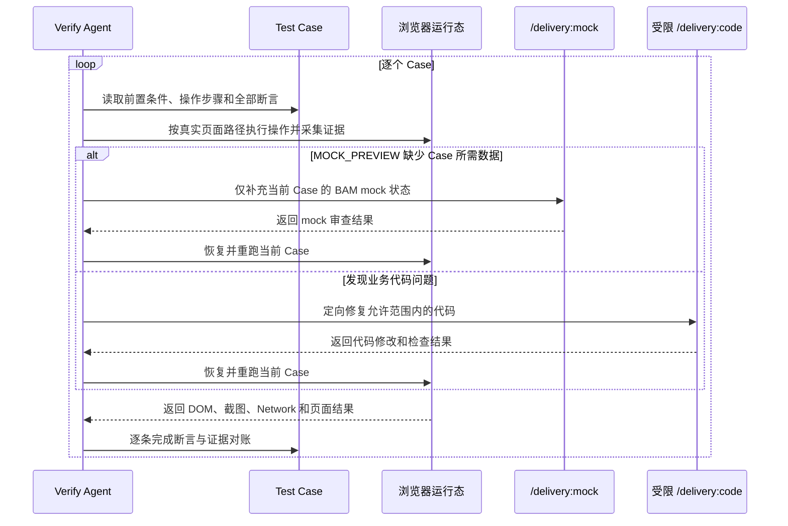
```mermaid
sequenceDiagram
    participant A as Verify Agent
    participant T as Test Case
    participant B as 浏览器运行态
    participant M as /delivery:mock
    participant C as 受限 /delivery:code

    loop 逐个 Case
        A->>T: 读取前置条件、操作步骤和全部断言
        A->>B: 按真实页面路径执行操作并采集证据
        alt MOCK_PREVIEW 缺少 Case 所需数据
            A->>M: 仅补充当前 Case 的 BAM mock 状态
            M-->>A: 返回 mock 审查结果
            A->>B: 恢复并重跑当前 Case
        else 发现业务代码问题
            A->>C: 定向修复允许范围内的代码
            C-->>A: 返回代码修改和检查结果
            A->>B: 恢复并重跑当前 Case
        end
        B-->>A: 返回 DOM、截图、Network 和页面结果
        A->>T: 逐条完成断言与证据对账
    end
```

#### 3.8.2 阶段作用：验证代码是否满足 Test Case

Verify 阶段在运行环境中验证代码，并确认执行结果与 Test Case 的全部断言一致。它不负责重新定义需求，也不负责完成 Figma 视觉对齐；Verify 中采集的截图只能证明运行态事实，Figma 与运行态的比较留在 `/delivery:design`。

| 断言类型 | 需要回答的问题 | 典型证据 | 不能单独证明的内容 |
| --- | --- | --- | --- |
| 正向断言 | 需求要求发生的行为是否真的发生？ | 自然点击后的页面变化、目标接口请求、返回数据被页面消费的结果 | 只有代码分支存在，不能证明运行时一定进入该分支 |
| 负向断言 | 需求禁止的行为是否没有发生？ | 禁止弹窗或字段未出现、错误接口未发送、其他列表或数据没有被误改 | 只有一张局部截图，不能证明后台没有请求 |
| 视觉正向与负向断言 | 运行页面中要求出现和禁止出现的区域是否符合 Test Case？ | 完整页面截图、DOM 顺序、显隐状态、必要的 computed style | Verify 截图不能代替 Figma 对齐结论 |
| 证据要求 | 上述判断是否有可复查的材料？ | 截图、脱敏 Network、DOM 记录、mock 命中记录、命令结果 | 只有 `PASS` 标签或汇总描述，不能证明断言已执行 |

##### 3.8.2.1 Case 示例一：DOU+币剔除明细页面

`TC-UI-COIN-REMOVE-PAGE` 验证点击 DOU+币“剔除明细”后，页面是否发起正确请求并展示筛选区、作品表格和分页，同时确认旧投放列和跨奖励类型内容没有残留。

| 断言类型 | 断言 | 验证链路 | 证据对齐 |
| --- | --- | --- | --- |
| 正向断言 | 用户点击“剔除明细”后，页面应选中该入口，并请求当前活动和配置下的 DOU+币剔除记录；请求页码为 1，每页 20 条。 | 1. 当前 MOCK_PREVIEW 没有足够的非空记录，先进入 `/delivery:mock`，为本 Case 补充 1 条作品记录和总数 40。<br />2. 返回原 Case 并重新加载页面，从“奖励下发”自然点击“剔除明细”。<br />3. 检查入口选中状态、GET 请求参数和 BAM 规则命中结果。 | 具体命中证据由四部分组成：<br />1. Network 记录 GET `/api/buyin/admin/content_activity/get_dou_plus_coin_remove_record`，请求参数为 `activity_id=7655304206886322458`、`config_id=7655304206886338842`、`page=1`、`page_num=20`。<br />2. 同次操作的控制台事件记录 `consoleMarker=[BAM_MOCK_HIT]`、`apiName=apiGetDouPlusCoinRemoveRecord`、`ruleId=R-BAM-COIN-REMOVE-DEFAULT`。<br />3. 事件中的 `requestBody` 与 Network 请求参数一致，并记录返回 `code=0`、`total=40`、`has_more=true`、`records.length=1`、`item_id=100001`。<br />4. 页面随后渲染作品 `100001`。请求、命中事件、Mock 返回和页面结果能够逐项对应，因此可以确认该请求命中了 `R-BAM-COIN-REMOVE-DEFAULT`。 |
| 视觉正向断言 | 页面应保留“奖励下发 / 投放明细 / 剔除明细”三个入口，并显示作品 ID、操作人筛选、作品表格、首行记录和分页。 | 1. 等待剔除记录请求完成并渲染页面。<br />2. 读取 DOM 中的入口、筛选项、表头、首行和分页。<br />3. 截取包含配置摘要、入口、筛选区、表格和分页的完整运行态页面。 | DOM 记录证明要求的页面元素均已渲染； |
| 负向断言 | 点击“剔除明细”不能误发其他奖励类型或投放明细接口。 | 1. 在点击后筛选本次操作产生的 Network 请求。<br />2. 核对请求目标仍为 DOU+币剔除记录接口。 | Network 记录中出现目标剔除记录请求，没有出现 DOU+券或旧投放明细请求，证明本次操作没有走错数据链路。 |
| 视觉负向断言 | 页面不得出现“投放金额”“充值记录”、旧投放明细列或 DOU+券作者列，也不能隐藏原有三个入口。 | 1. 对当前页面执行 DOM 禁止项扫描。<br />2. 将扫描结果与完整运行态截图交叉核对。 | DOM 中没有找到禁止文案和禁止列；完整截图同时保留三个原有入口，证明页面没有混入旧列或跨奖励类型内容。 |
| 证据要求 | Test Case 要求提供 `DOM + 截图 + Network` 三类证据。 | / | **DOM 产物：**`TC-UI-COIN-REMOVE-PAGE--mock-hit-runtime.json`，记录三个入口及“剔除明细”的选中状态、筛选项、表头、首行作品 `100001`、分页，以及“投放金额”“充值记录”未出现。<br />**截图产物：**`TC-UI-COIN-REMOVE-PAGE--design-rerun--remove-detail-coin-default--dom-capture.png`，保存同一 Case 加载完成后的完整页面，可核对入口、筛选区、表格首行和分页；文档中使用的图片是该截图复制到统一 assets 目录后的 `verify-coin-remove-page-rendered.png`。<br />**Network 产物：**`TC-UI-COIN-REMOVE-PAGE--mock-hit-runtime.json`，记录目标 GET 接口，以及 `activity_id`、`config_id`、`page=1`、`page_num=20`。三类证据均已取得，与 Test Case 的 `evidence_required` 一致。 |

验证结果为 `PASS_WITH_NOTES`：页面交互、请求、表格渲染和禁止项在 MOCK_PREVIEW 下均已验证；Figma 对齐和真实后端非空记录仍需在对应阶段验证。

##### 3.8.2.2 Case 示例二：DOU+币发奖超时

`TC-INT-AWARD-TIMEOUT` 验证发奖接口返回超时后，页面必须显示“治理校验失败，请稍后重试”，保留投放确认弹窗并停止成功流程。该 Case 还记录了 Verify 发现代码问题后，修复并回到原 Case 的过程。

| 断言类型 | 断言 | 验证链路 | 证据对齐 |
| --- | --- | --- | --- |
| 正向断言 | 发奖接口返回超时后，投放确认弹窗内必须持续显示“治理校验失败，请稍后重试”。 | 1. 通过批量上传进入发奖流程，选择可用充值记录并点击投放确认；BAM mock 依次返回可投放作品、余额检查通过和最终超时。<br />2. 首次执行时，DOM 中没有规定文案，因此 Case 不通过。<br />3. Verify 将问题交给受限 `/delivery:code`，只修改投放确认弹窗相关文件，增加持续可见的错误提示。<br />4. 定向检查和构建通过后返回同一 Case，重新执行浏览器操作，确认规定文案已经出现。 | 最终发奖规则返回 `{st:1, code:504, msg:"timeout"}`；修复前的 DOM 没有规定文案，修复后的 DOM 出现持续可见的 `role="alert"` 节点，节点文本为“治理校验失败，请稍后重试”。修复记录、构建通过结果和复验 DOM 对应同一个 Case，证明超时提示在修复后已按断言显示。 |
| 负向断言 | 超时后不能关闭投放确认弹窗，不能显示“提交成功”，也不能进入成功后的页面重置流程。 | 1. 在复验中触发同一超时响应。<br />2. 响应返回后继续观察弹窗、成功提示和页面内容。<br />3. 检查页面是否执行成功后的关闭或重置动作。 | 超时响应返回后，DOM 中仍能找到投放确认弹窗和 `role="alert"` 错误提示，没有找到“提交成功”；浏览器 Network 中没有真实 `/delivery_dou_plus_coin` XHR 或 fetch。截图同时显示弹窗保持打开、错误文案可见，页面未进入成功状态。<br /> |
| 证据要求 | Test Case 要求提供 `Network error/message evidence`，即接口超时证据和页面错误文案证据。 | / | **Network error 产物：**`TC-INT-AWARD-TIMEOUT--browser-network-final.log` 和 `TC-INT-AWARD-TIMEOUT--runtime.json`，记录最终发奖阶段的 `[BAM_MOCK_SYNTHETIC_CONTRACT]`、`[BAM_MOCK_HIT]`、`R-BAM-AWARD-COIN-TIMEOUT` 返回 `{st:1, code:504, msg:"timeout"}`，以及没有真实 `/delivery_dou_plus_coin` XHR 或 fetch。<br />**Message 产物：**`TC-INT-AWARD-TIMEOUT--runtime.json` 和 `TC-INT-AWARD-TIMEOUT.md`，记录修复后的 DOM 存在持续可见的 `role="alert"` 节点，文本为“治理校验失败，请稍后重试”。<br />**截图产物：**`TC-INT-AWARD-TIMEOUT--final-timeout-fixed.png`，显示错误文案可见且投放确认弹窗没有关闭；文档中统一保存为 `verify-award-timeout-fixed.png`。两类要求均有对应产物，与 Test Case 的 `evidence_required` 一致。 |

验证结果为 `PASS_WITH_NOTES`：前端超时分支、错误提示和停止成功流程已经闭合；真实后端超时、治理事务和发奖事务仍需 real verify。

#### 3.8.3 补充说明

==Verify 是人工审查的第二个重要节点==

> **可信的 Test Case 只定义了功能应该达到的结果，不能直接证明代码已经实现该结果。** Verify 对 test case 进行验证，观察要求发生的行为是否出现、禁止发生的行为是否没有出现，并为每条断言保存可复查的运行证据。只有操作、结果、断言和证据来自同一次有效验证且能够逐项对应，验证结果才能说明功能已经实现。
>
> 人工审查的作用是判断这条证明关系是否成立：执行过程是否真正触发了用例场景，观察结果是否回答了断言，证据是否直接、完整且没有被其他结果替代。自动生成的 `PASS` 只能表示流程给出了结论，不能判断结论是否做到证据对齐。人工确认每条断言都被有效证据覆盖后，Verify 才能作为功能实现闭环的依据。

### 3.9 `/delivery:mock` 阶段

`/delivery:mock` 用于解决 Case 在 Mock 预览环境（MOCK_PREVIEW）中缺少测试数据的问题。例如，页面需要展示一条命中记录，但当前接口没有返回这类数据，Verify 或 Design 就无法继续检查页面结果。此时，主流程会暂时进入本阶段，通过 BAM Rule（按请求条件返回指定数据的 Mock 规则）为当前 Case 准备数据；Rule 审查通过后，再回到原 Case 继续验证。

#### 3.9.1 主要步骤与交互方式

| 步骤 | 主要操作 | 具体作用 | 当前步骤的完成标志 |
| --- | --- | --- | --- |
| 1. 固定 Mock 范围和恢复点 | 先读取当前 Case，确认它缺少什么数据、由哪个接口提供，以及需要什么返回结果。同时记录本次调用来自 Verify 还是 Design，完成后应继续执行哪个 Case。 | 防止处理范围从“补一组测试数据”扩大到修改需求或业务代码，并保证 Mock 完成后能够回到原验证任务。 | 已明确当前 Case、目标接口、Rule 匹配条件、预期返回和允许修改的文件。 |
| 2. 生成或调整接口 Rule | 根据当前 Case 缺少的数据状态生成接口 Rule。确定目标接口和请求匹配条件，使 Rule 只命中当前场景；再依据 Case 的前置条件和断言，构造能够支持验证的最小返回数据。只读接口优先沿用真实响应结构，只补充 Case 必需的字段；不适合调用真实后端的写接口，则由 Mock 返回明确标记的结果。 | 让目标接口稳定返回当前 Case 所需的数据，同时说明哪些内容来自真实接口、哪些内容由 Mock 构造。Rule 只负责准备数据，不规定页面应当如何实现。 | 请求匹配条件、返回字段和适用 Case 均已明确；Rule 只命中目标场景，并能返回当前 Case 需要的最小数据状态。 |
| 3. 应用 Rule 并完成 BAM 审查 | 将 Rule 加载到 BAM Runtime，再从页面执行真实操作来触发接口。审查时依次核对 Network 请求、Rule 命中记录和返回数据，并检查其他请求是否被错误匹配。 | 确认页面发出的目标请求确实命中了指定 Rule，且接口返回了当前 Case 需要的数据。 | Network 参数与命中记录中的 `requestBody` 一致；`apiName` 和 `ruleId` 指向目标 Rule；返回数据与 Rule 设定一致；不符合匹配条件的请求不会命中该 Rule。 |
| 4. 返回原 Case 继续验证 | Rule 审查通过后，回到原 Verify 或 Design Case，重新执行页面操作，再按原断言采集 DOM、截图、Network、console 或样式证据。 | Mock 只解决数据前置条件。功能和 UI 是否通过，仍由原 Test Case 的执行结果决定。 | 原 Case 已重新执行，Mock 命中证据与 Case 验证证据可以连续核对，没有使用新 Case 替代原 Case。 |

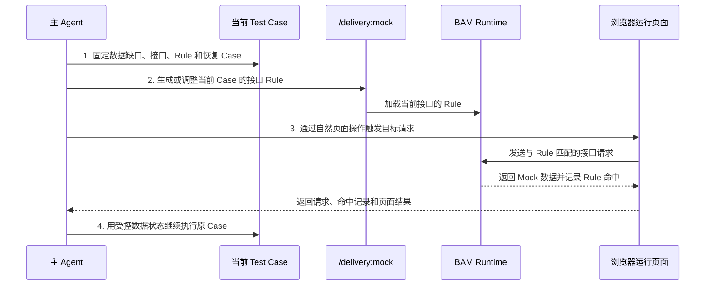
```mermaid
sequenceDiagram
    participant A as 主 Agent
    participant T as 当前 Test Case
    participant M as /delivery:mock
    participant B as BAM Runtime
    participant R as 浏览器运行页面

    A->>T: 1. 固定数据缺口、接口、Rule 和恢复 Case
    A->>M: 2. 生成或调整当前 Case 的接口 Rule
    M->>B: 加载当前接口的 Rule
    A->>R: 3. 通过自然页面操作触发目标请求
    R->>B: 发送与 Rule 匹配的接口请求
    B-->>R: 返回 Mock 数据并记录 Rule 命中
    R-->>A: 返回请求、命中记录和页面结果
    A->>T: 4. 用受控数据状态继续执行原 Case
```

#### 3.9.2 阶段作用：为 Case 提供可验收的测试数据

以下以 `TC-UI-COIN-REMOVE-PAGE` 为例，说明 `/delivery:mock` 如何根据 Test Case 准备数据，并把 Rule 命中结果接回原 Case 完成验收。

1. **固定 Test Case、接口和验证步骤。**

   - **Test Case：**`TC-UI-COIN-REMOVE-PAGE`，验证 DOU+币剔除明细首屏。页面需要显示三个入口、筛选区、作品表格、首行记录和分页，同时不能出现“投放金额”“充值记录”等旧投放明细内容。
   - **接口：**`apiGetDouPlusCoinRemoveRecord`，用于查询 DOU+币剔除记录。真实接口当时返回成功但列表为空，无法提供首行和分页数据，因此该 Case 进入 `/delivery:mock`。
   - **验证步骤：**从 DOU+币奖励投放页点击“剔除明细”，等待列表请求结束；检查“奖励下发 / 投放明细 / 剔除明细”三个入口、筛选区、作品表格、首行和分页；扫描禁止内容；最后核对 DOM、Network 和 Mock 命中记录。

2. **确认接口、Rule、命中规则和返回内容。**

   - **接口：**`GET /api/buyin/admin/content_activity/get_dou_plus_coin_remove_record`。请求携带当前 `activity_id`、`config_id`、`page` 和 `page_num`。
   - **Rule：**`R-BAM-COIN-REMOVE-DEFAULT`，用于构造默认剔除列表，不处理带作品 ID 或操作人条件的筛选请求。
   - **命中规则：**仅匹配第一页、每页 20 条，且未填写作品 ID 和操作人的默认列表请求。

     ```json
     {
       "page": 1,
       "page_num": 20,
       "candidate_ids": "__BAM_MOCK_ABSENT__",
       "operator_id": "__BAM_MOCK_ABSENT__"
     }
     ```

   - **响应内容：**返回一条剔除记录，并构造总数 40、存在下一页的列表状态，供 Case 检查首行内容和分页。

     ```json
     {
       "st": 0,
       "code": 0,
       "msg": "",
       "data": {
         "records": [
           {
             "record_id": "coin_remove_record_20260708001",
             "item_card": {
               "item_model": {
                 "item_id": "100001",
                 "base_model": {
                   "item_info": {
                     "base_info": {
                       "title": "夏日穿搭短视频示例"
                     }
                   }
                 }
               }
             },
             "remove_reason": "命中【不激励】规则",
             "operator_id": "chenxiang.2003",
             "remove_time": 1783508217
           }
         ],
         "total": 40,
         "has_more": true
       }
     }
     ```

3. **在 BAM Runtime 中生成 Mock。** 该接口采用“先请求真实接口，再最小改写返回值”的方式。真实响应中的 `st=0`、`code=0` 和其他原有字段保持不变；Rule 只补入一条剔除记录，并将总数改为 `40`、`has_more` 改为 `true`。

   ```ts
   if (
     _req?.page === 1 &&
     _req?.page_num === 20 &&
     (_req?.candidate_ids === undefined ||
       _req?.candidate_ids === null ||
       _req?.candidate_ids === '') &&
     (_req?.operator_id === undefined ||
       _req?.operator_id === null ||
       _req?.operator_id === '')
   ) {
     __bamMockMatches.push({
       ruleId: 'R-BAM-COIN-REMOVE-DEFAULT',
       requestFields: {
         page: 1,
         page_num: 20,
         candidate_ids: '__BAM_MOCK_ABSENT__',
         operator_id: '__BAM_MOCK_ABSENT__',
       },
       operations: [
         {
           op: 'set',
           path: 'data.records',
           value: [{
             record_id: 'coin_remove_record_20260708001',
             item_card: {
               item_model: {
                 item_id: '100001',
                 base_model: {
                   item_info: {
                     base_info: { title: '夏日穿搭短视频示例' },
                   },
                 },
               },
             },
             remove_reason: '命中【不激励】规则',
             operator_id: 'chenxiang.2003',
             remove_time: 1783508217,
           }],
         },
         { op: 'set', path: 'data.total', value: 40 },
         { op: 'set', path: 'data.has_more', value: true },
       ],
     });
   }

   if (__bamMockMatches.length === 1) {
     const __bamMockMatch = __bamMockMatches[0];
     return EcomBuyinAdminApiOptions
       .request({ url, method, params }, options)
       .then((originalResponse) => {
         const mockedResponse = __bamMockApplyOperations(
           originalResponse,
           __bamMockMatch.operations,
         );
         __bamMockOnHit(__bamMockMatch.ruleId, mockedResponse, _req);
         return mockedResponse;
       });
   }
   ```

4. **使用验收产物完成 Test Case 验收。** 重新执行 `TC-UI-COIN-REMOVE-PAGE` 后，使用验收产物 `TC-UI-COIN-REMOVE-PAGE--mock-hit-runtime.json` 中的 `mockHit` 记录作为 Mock 验收证据：

   ```json
   {
     "consoleMarker": "[BAM_MOCK_HIT]",
     "apiName": "apiGetDouPlusCoinRemoveRecord",
     "ruleId": "R-BAM-COIN-REMOVE-DEFAULT",
     "requestBody": {
       "activity_id": "7655304206886322458",
       "config_id": "7655304206886338842",
       "page_num": 20,
       "page": 1
     },
     "mockedResponseSummary": {
       "code": 0,
       "data.total": 40,
       "data.has_more": true,
       "data.records.length": 1,
       "data.records[0].item_id": "100001",
       "data.records[0].remove_reason": "命中【不激励】规则"
     }
   }
   ```

   **验收断言：**

   - 请求参数为当前活动、当前配置、`page=1`、`page_num=20`，且未携带作品 ID 和操作人筛选条件。
   - 请求命中 `R-BAM-COIN-REMOVE-DEFAULT`，没有命中其他 Rule。
   - 响应包含作品 `100001`、`total=40`、`has_more=true`。
   - 页面显示作品 `100001` 和两页分页，且未出现“投放金额”“充值记录”。

   **验收结果：**`PASS_WITH_NOTES`。Mock 数据已被页面消费；真实后端非空数据和 Figma 视觉对齐分别留在 `/delivery:verify --mtr` 和 Design 阶段验证。

#### 3.9.3 补充说明

`/delivery:mock` 主要用于后端接口尚未实现、尚未完成联调，或暂时无法返回当前 Case 所需数据的情况。依据已经确定的接口约定和 Test Case，在前端请求链路中构造响应，使页面开发和验收不必等待后端完成。Mock 结果只能说明前端能够发出约定请求并正确处理响应，不能证明后端接口、真实数据口径或写入事务已经实现；后端就绪后，仍需通过 `/delivery:verify --mtr` 使用真实接口复验。

### 3.10 `/delivery:design` 阶段

Design 阶段逐个执行测试矩阵中标记为 `design` 或 `verify+design` 的 Case，将 Figma 节点、F2C 结构化结果（从设计节点提取的层级与样式）与同一页面状态的运行证据进行对比。本阶段关闭的是 UI 的可见结构、文案、样式和交互状态，不代替 Verify 对功能行为、请求结果和真实后端链路的验证。

#### 3.10.1 主要步骤与交互方式

| 步骤 | 主要操作 | 对 UI 验收的作用 | 当前步骤的完成标志 |
| --- | --- | --- | --- |
| 1. 建立 Design Case 队列并固定设计基准 | 按测试矩阵中的执行顺序建立 Design Case 队列，每次只激活一个 Case。读取当前 Case 指定的页面状态、对齐范围、视觉断言和证据要求，再绑定能够覆盖整个核验范围的 Figma 节点、截图和节点数据。对 `F2C_REQUIRED` Case，还需同时读取 F2C XML 和预览图。 | 为每个 Case 建立唯一、完整的设计依据，避免用局部文字节点代替整页或整个区域。 | 当前 Case 已激活，设计基准的页面状态和范围与 Case 一致，并已明确使用 F2C 精确对齐或 Runtime 基线对齐。 |
| 2. 对比设计基准与运行页面 | 打开 Case 指定的页面状态，只有 Verify 截图与该状态完全一致时才直接复用；否则重新采集截图、DOM（页面实际节点）和 computed style（浏览器实际生效样式）。先核对页面区域和控件顺序，再检查文案、字号、颜色、间距和链接样式，最后扫描旧字段、旧控件和跨场景内容是否误出现。如果 MOCK_PREVIEW 缺少所需数据，先通过 `/delivery:mock` 补齐状态，再回到当前 Case 取证。 | 用同一页面状态下的设计与运行证据完成直接对比；DOM 和样式数据只用于解释可见差异。 | 当前 Case 的每条视觉断言均已找到对应的设计依据和运行证据。 |
| 3. 判断差异等级 | 对每项差异记录所在位置、设计值、运行值和对应证据，再根据是否影响当前 UI 合同判定为 `BLOCKER` 或 `NON_BLOCKER`。明确的结构、文案、顺序和样式偏差必须写出具体差值，不使用“基本一致”直接关闭。如果问题来自取证状态不足，返回上一步重新取证，不把它当作 UI 结论。 | 将截图比对转换为可复查、可执行的差异结论。 | 当前 Case 已形成 `PASS`、`BLOCKER` 或 `NON_BLOCKER` 结论；存在差异时，设计值、运行值和处理方式均已记录。 |
| 4. 返修并复验当前 Case | `PASS` 直接归档；`NON_BLOCKER` 记录不阻断原因和后续边界后归档；`BLOCKER` 转为 Design Rework，写明差异、允许修改文件和期望结果，再定向修改代码。修改后重新打开页面，重跑原 Case，采集新截图、DOM 和负向扫描结果；不新建替代 Case，也不修改断言迎合实现。 | 使问题发现、代码修改和复验结果在同一 Case 内连续可追溯。 | 当前 Case 以 `PASS`、`FIXED_PASS` 或有明确边界的 `NON_BLOCKER` 归档，然后才进入下一个 Case。 |

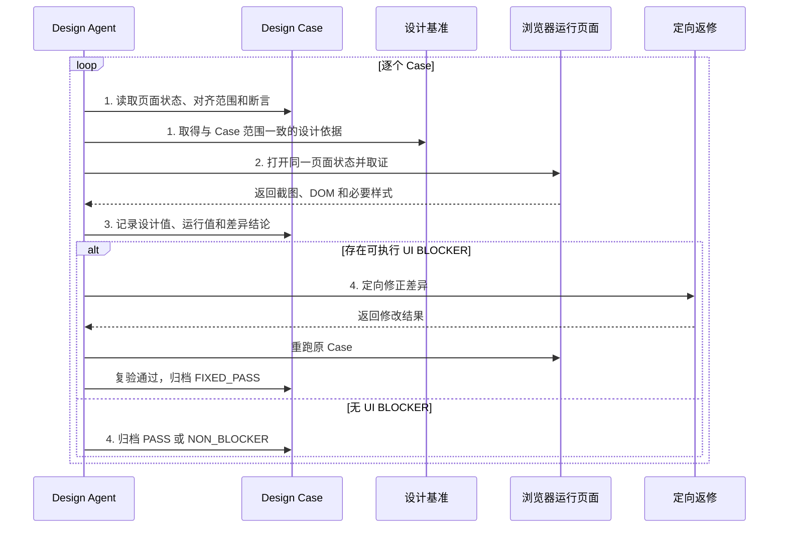
```mermaid
sequenceDiagram
    participant A as Design Agent
    participant T as Design Case
    participant F as 设计基准
    participant R as 浏览器运行页面
    participant C as 定向返修

    loop 逐个 Case
        A->>T: 1. 读取页面状态、对齐范围和断言
        A->>F: 1. 取得与 Case 范围一致的设计依据
        A->>R: 2. 打开同一页面状态并取证
        R-->>A: 返回截图、DOM 和必要样式
        A->>T: 3. 记录设计值、运行值和差异结论
        alt 存在可执行 UI BLOCKER
            A->>C: 4. 定向修正差异
            C-->>A: 返回修改结果
            A->>R: 重跑原 Case
            A->>T: 复验通过，归档 FIXED_PASS
        else 无 UI BLOCKER
            A->>T: 4. 归档 PASS 或 NON_BLOCKER
        end
    end
```

#### 3.10.2 阶段作用：形成 UI 对齐闭环

以下分别选取一个 F2C 精确对齐 Case 和一个 Runtime 基线对齐 Case，展示本案例如何发现偏差、返修并回到原 Case 复验。

##### 3.10.2.1 F2C 精确对齐：配置页全部用户状态

`TC-UI-CFG-ALL-BASELINE` 核对配置页“活动参与资格”下方的不激励规则提示。

1. **固定设计依据。** 本 Case 绑定 Figma 节点 `1:9770`、文字节点 `1:10202` 和 F2C XML。与提示行直接相关的返回内容如下：

   ```xml
   <Container padding-left="116px" display="flex" flex-direction="row"
     align-items="center" gap="4px">
     <Text id="1:10202" font-size="12px" line-height="20px">
       <Span color="rgb(188,189,192)">
         奖励发放环节将进行账号校验，命中【不激励】规则的账号无法被发奖
       </Span>
       <Span color="rgb(25,102,255)" text-decoration="underline">
         查看【不激励】规则
       </Span>
     </Text>
   </Container>
   ```

   XML 将可验收条件固定为：容器间距 `4px`，正文为 `12px/20px` 灰色，链接为 `rgb(25,102,255)` 且默认带下划线，文字前没有图标。

2. **检查 Code 阶段的运行结果。** 首次运行页面已显示完整提示和链接，但在文字前渲染了 `DoubtIcon`，提示使用 `14px`，链接使用 `#0088ff` 且默认没有下划线。Design 对比结果记录为：

   ```yaml
   case_id: TC-UI-CFG-ALL-BASELINE
   structure_comparison:
     status: BLOCKER
     finding: 提示前存在 Figma/F2C 中没有的 DoubtIcon
   style_comparison:
     status: BLOCKER
     findings:
       - "正文：实现为 14px，设计为 12px/20px"
       - "链接：实现为 #0088ff 且默认无下划线"
   result: AUTO_FIX_REQUIRED
   ```

3. **执行 Design Rework。** `DESIGN-REWORK-001` 限定修改 `step-reward-config/index.tsx` 和 `index.module.scss`，删除提示前的图标，保留原有文案、链接、跳转和点击埋点，并将提示样式改为：

   ```scss
   .noIncentivePrompt {
     display: inline-flex;
     gap: 4px;
     color: #bcbdc0;
     font-size: 12px;
     line-height: 20px;
   }
   .noIncentiveRuleLink {
     color: #1966ff;
     text-decoration: underline;
   }
   ```

4. **复验当前 Case。** 重新打开全部用户状态后，DOM 中只保留正文 `span` 和链接 `a`，无 `svg`、`img` 或其他图标子节点；浏览器实际样式与 XML 一致，负向扫描也未发现多余卡片、下载入口或申诉入口，结果为 `FIXED_PASS`。

| 原需求 | Code 阶段实现效果 | Design 阶段对齐效果 |
| --- | --- | --- |
| Figma 节点 `1:9770`：提示行只有灰色正文和蓝色下划线链接。<br /> | 已实现文案和链接，但可见前置问号图标，字号和链接样式与设计不同。<br /> | 图标已移除，字号、颜色和下划线与 F2C XML 一致。<br /> |

##### 3.10.2.2 Runtime 基线对齐：DOU+币剔除明细

`TC-UI-COIN-REMOVE-PAGE` 和 `TC-DATA-COIN-COLUMNS` 共同核对 DOU+币“剔除明细”首屏：前者检查页面结构和筛选文案，后者检查表头顺序和禁止列。

1. **固定设计依据。** 该页面使用 `RUNTIME_BASELINE_ALLOWED`，Figma 节点 `1:12120` 与节点数据定义本次变更区域：作品 ID 占位文案为“支持批量输入，用逗号间隔”，操作人占位文案为“请选择”，表头顺序为“作品内容 / 剔除发奖时间 / 剔除发奖原因 / 操作人”。页面框架、EcopTable、人员选择和分页方式继续复用。

2. **检查 Code 阶段的运行结果。** 首次运行页面已有配置摘要、三个入口、筛选区、表格和分页，但作品 ID 显示为“支持批量查询，用逗号隔开”，操作人显示为“请输入姓名搜索”，表头中“剔除发奖原因”排在“剔除发奖时间”之前。对比结果为：

   ```yaml
   TC-UI-COIN-REMOVE-PAGE:
     style_comparison: BLOCKER
     findings:
       - "作品 ID 占位文案与 Figma 不一致"
       - "操作人占位文案与 Figma 不一致"
     result: AUTO_FIX_REQUIRED
   TC-DATA-COIN-COLUMNS:
     structure_comparison: BLOCKER
     design_order: 作品内容 / 剔除发奖时间 / 剔除发奖原因 / 操作人
     runtime_order: 作品内容 / 剔除发奖原因 / 剔除发奖时间 / 操作人
     result: AUTO_FIX_REQUIRED
   ```

3. **执行 Design Rework。** `DESIGN-REWORK-003` 修改两个输入框占位文案，`DESIGN-REWORK-004` 将 `remove_time` 列移到 `remove_reason` 之前。修改范围仅限 DOU+币剔除明细表格，保留原有请求参数、单元格渲染、分页、SubTab 和 BAM mock 行为。目标代码为：

   ```tsx
   fieldProps: { placeholder: '支持批量输入，用逗号间隔' }
   <PeopleSelect placeholder="请选择" />

   { title: '剔除发奖时间', dataIndex: 'remove_time' }
   { title: '剔除发奖原因', dataIndex: 'remove_reason' }
   ```

4. **复验当前 Case。** 重跑后，两个占位文案和四列顺序与 Figma 一致；负向扫描没有发现“投放金额”、“投放状态”、“充值记录”、“处罚原因”或 DOU+券作者信息。`TC-UI-COIN-REMOVE-PAGE` 和 `TC-DATA-COIN-COLUMNS` 均归档为 `FIXED_PASS`。

| 原需求 | Code 阶段实现效果 | Design 阶段对齐效果 |
| --- | --- | --- |
| Figma 节点 `1:12120`：定义筛选文案和“时间在原因之前”的表头顺序。<br /> | 已实现剔除明细首屏，但筛选文案与表头顺序与设计不同。<br /> | 两个占位文案已对齐，表头按“作品内容 / 剔除发奖时间 / 剔除发奖原因 / 操作人”排列。<br /> |

##### 3.10.2.3 阶段结果

| 结果 | Case 数量 | 含义 |
| --- | ---: | --- |
| `FIXED_PASS` | 6 | 首次对比发现 UI `BLOCKER`，在 Design 阶段返修并通过原 Case 复验 |
| `PASS` | 6 | 设计基准、运行结果、断言和负向扫描证据直接对齐 |
| `NON_BLOCKER` | 1 | 当前可见 UI 合同已经成立，不属于本阶段的真实后端或交互复验内容被明确保留 |

本阶段共完成 13 个 Design Case，通过 7 组 Design Rework 关闭了 10 项可执行 `BLOCKER`，最终队列状态为 `DESIGN_QUEUE_COMPLETE_WITH_NON_BLOCKER_NOTES`。这一结果表示所有进入 Design 队列的 Case 都已经有可复查结论，不表示真实后端或非可见功能已经由本阶段验证。

### 3.11 `/delivery:repair` 阶段

`/delivery:repair` 用于处理自测、UAT 或验收阶段新发现的问题。本阶段先建立工作区快照，再根据验收问题定位最早偏差阶段，并重跑后续工作流，统一修正各阶段产物和实现。本案例从 Plan 开始，实际执行顺序为 `plan → task → code → verify → design → repair-result`。

#### 3.11.1 主要步骤与交互方式

| 步骤 | 主要操作 | 具体作用 | 当前步骤的完成标志 |
| --- | --- | --- | --- |
| 1. 建立工作区快照 | 重新读取飞书验收问题及其图片，确认问题描述和期望结果。在修改任何产物或代码前，对当前 Workspace、交付状态和执行仓库建立只读快照。 | 固定返修前状态，为问题对比、过程追踪和必要时恢复提供统一基线。 | 问题源内容完整，Workspace 快照创建成功且可校验。 |
| 2. 重跑工作流并修正各阶段问题 | 对照验收问题检查 PRD、Plan、Task、Test Case、代码和验证证据，确定最早偏差阶段，再按依赖顺序重跑后续工作流。本案例从 Plan 开始，依次执行 Task、Code、Verify 和 Design；每个阶段直接修正现有产物，并通过该阶段 Gate。 | 将验收问题落实到各阶段产物，保证上游约束、任务拆分、测试断言、实现和验证结果重新一致。 | 各阶段产物已原位修正，相关 Task 和 Test Case 已更新，所有阶段 Gate 均通过。 |
| 3. 汇总并写回验收结果 | 按验收问题逐条整理修正内容、运行结果和人工复验步骤，明确真实环境仍需复验的边界；随后将结果写回飞书验收文档，并记录最终代码提交。 | 让验收人员可以直接查看问题处理结果并手动复验，同时把 Repair 结果绑定到最终交付版本。 | 验收文档已回写，问题均有结论，Repair 结果与最终提交一致。 |

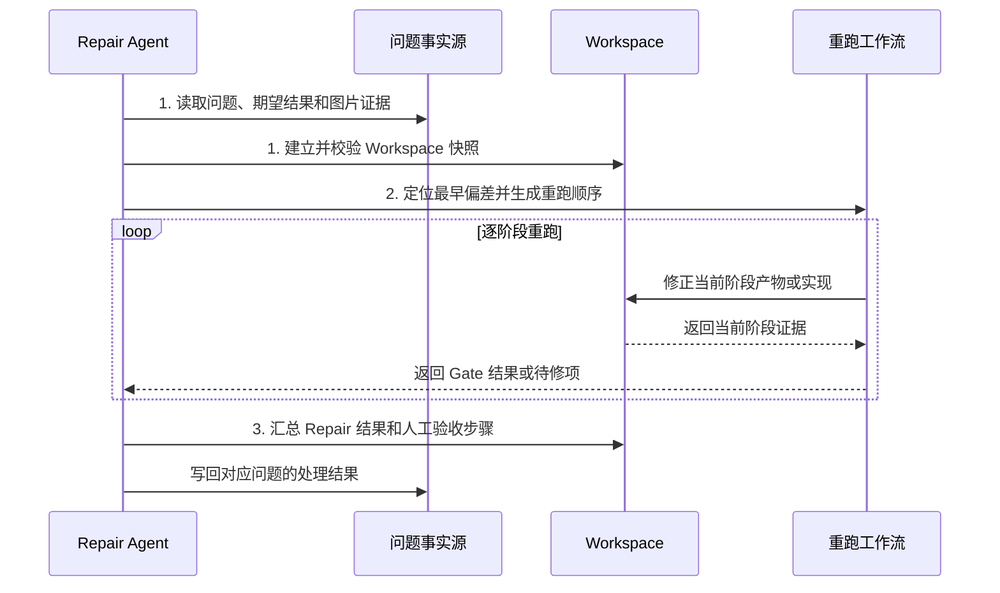
```mermaid
sequenceDiagram
    participant A as Repair Agent
    participant S as 问题事实源
    participant W as Workspace
    participant R as 重跑工作流

    A->>S: 1. 读取问题、期望结果和图片证据
    A->>W: 1. 建立并校验 Workspace 快照
    A->>R: 2. 定位最早偏差并生成重跑顺序
    loop 逐阶段重跑
        R->>W: 修正当前阶段产物或实现
        W-->>R: 返回当前阶段证据
        R-->>A: 返回 Gate 结果或待修项
    end
    A->>W: 3. 汇总 Repair 结果和人工验收步骤
    A->>S: 写回对应问题的处理结果
```

#### 3.11.2 阶段作用：根据验收问题修正各阶段产物

**验收文档：**[《剔除名单与导出剔除明细验收记录》](https://bytedance.larkoffice.com/docx/NQxTdRPPQoM9GPxcuAjcqvMCnkg)

| 验收问题 | 问题原因 | 修正内容 | Repair 后的运行结果 |
| --- | --- | --- | --- |
| **REPAIR-005：移除后“提报汇总”栏和按钮整体消失。** 验收要求汇总栏及相关按钮继续显示。<br /> | Plan 只要求保留导出入口，没有要求汇总文案和“一键移除”继续显示；Task 和 Test Case 也沿用了这一口径。 | 修正 Plan 的完整操作区显示规则；更新 Task 5 和 `TC-INT-MANUAL-EXPORT-PERSIST-AFTER-REMOVE`，再重跑 Verify 与 Design。 | 点击“一键移除”后，汇总文案更新为“共1个作品……0个”；“一键移除”保留为禁用状态，“导出剔除明细”仍可用，`100003` 继续保留。结果为 `PASS_WITH_NOTES`。<br /> |

#### 3.11.3 补充说明

==Repair 阶段是修正 Test Case 偏差的手段==

当验收问题表明现有 Test Case 的前置条件、操作步骤或断言与实际需求不一致时，Verify的验证必然存在偏差。Repair 以验收事实为准，先修正产生偏差的 Plan、Task 等上游产物，再更新 Test Case，并按修正后的断言重跑 Code、Verify 和 Design。Repair 不是修改断言来迎合现有实现，而是让需求、Test Case、实现和验证证据重新一致。

### 3.12 `/delivery:verify --mtr` 阶段

`--mtr` 是 Mock-To-Real Recheck，用于把 Mock 预览阶段无法证明的真实环境断言重新取回验证范围。本阶段只适用于仍标记为 `MOCK_PREVIEW` 的交付，不重复执行 Verify 已经闭合的通用检查，它只处理 Test Case 中明确保留的真实接口、真实数据、外部系统和写入安全边界。

#### 3.12.1 主要步骤与交互方式

| 步骤 | 主要操作 | 具体作用 | 当前步骤的完成标志 |
| --- | --- | --- | --- |
| 1. 建立 MTR 真实复测清单 | 从 Test Case 的 Mock / Real Boundary（Mock 能证明什么、哪些内容必须到真实环境证明）、Mock 阶段的真实复测项以及 Verify、Design 留下的 Notes 中，筛出只有真实环境才能回答的断言。每项记录对应 Case、接口或外部系统、Mock 阶段使用的 Rule、真实断言、清理要求、风险等级和预期证据；其中 Rule 只用于定位本轮需要清理的 Mock 数据。 | MTR 只复测 Mock 不能证明的内容，避免把已经完成的页面操作和断言对账重新执行一遍。 | 每个真实环境缺口都有对应 Case 和复测方式；纯前端且已经闭合的断言不进入清单。 |
| 2. 清理数据 Mock 并切换真实运行态 | 对目标应用执行 `bam update`，本案例使用 `pnpm --dir apps/alliance-operation-content bam`；随后移除 URL 中的 `externalLeadsDomainMock=1`，确认运行请求不再出现 `[BAM_MOCK_HIT]`（Mock 命中标记）、`mockedResponse`（Mock 返回）或 synthetic response（合成返回）。原有 Mock 验证记录保留，不做覆盖。 | 保证本轮结论来自真实页面和真实接口，而不是继续消费前一阶段构造的数据。 | 页面从无 Mock 参数的 vmok 地址打开，目标读请求透传到真实接口，没有活动中的数据 Mock。 |
| 3. 按安全边界复测并记录结论 | 只读接口和页面跳转走自然 UI 路径，使用真实 Request、Response、DOM、截图或外部系统回执判断结果。未经授权的发奖、导出、移除和保存等写接口，在浏览器层拦截，记录请求未离开浏览器；最后把 MTR 结果追加到原 Case，并列出仍缺的真实证据。 | 区分“真实链路已证明”“因真实样本不足仍待复测”和“为避免真实副作用只能证明未发请求”，防止把安全拦截写成真实写入成功。 | 每个复测项都有 `PASS`、`PASS_WITH_NOTES` 或明确的开放原因；只有所有非写入型真实缺口均关闭后，才能将运行环境标记为 `REAL_ENV_VERIFIED`。 |

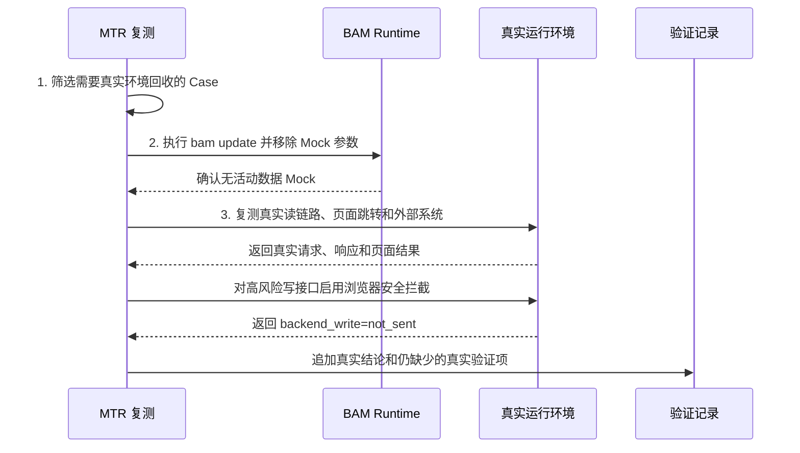
```mermaid
sequenceDiagram
    participant M as MTR 复测
    participant B as BAM Runtime
    participant R as 真实运行环境
    participant V as 验证记录

    M->>M: 1. 筛选需要真实环境回收的 Case
    M->>B: 2. 执行 bam update 并移除 Mock 参数
    B-->>M: 确认无活动数据 Mock
    M->>R: 3. 复测真实读链路、页面跳转和外部系统
    R-->>M: 返回真实请求、响应和页面结果
    M->>R: 对高风险写接口启用浏览器安全拦截
    R-->>M: 返回 backend_write=not_sent
    M->>V: 追加真实结论和仍缺少的真实验证项
```

#### 3.12.2 阶段作用：将 Mock 结论回收到真实环境

Mock Verify 证明的是前端能够按照约定请求接口并消费构造的数据；MTR 进一步检查去掉数据 Mock 后，真实页面、接口、权限和外部资源是否仍能支持同一个 Test Case。两轮结论并列保留：Mock 证据用于说明前端分支已经覆盖，MTR 证据用于说明哪些真实链路已经成立，哪些仍受数据、权限或外部平台限制。


| 复测对象 | 产物记录中的真实接口返回 | 页面证据 |
| --- | --- | --- |
| `TC-UI-COUPON-REMOVE-PAGE`：DOU+券剔除明细默认读取 | **请求：**`GET /api/buyin/admin/content_activity/get_dou_plus_coupon_remove_record`<br />**参数：**`activity_id=7629288371705643310`、`config_id=7629288371705676078`、`page=1`、`page_num=20`<br />**真实返回：**HTTP `200`；`records.length=3`、`total=3`、`has_more=false`。记录 ID 为 `7657200834236662054`、`7658231190465282331`、`7657084877908640050`；作者为“大亮农业菌蔬优选店”，`author_id=109638766301`；剔除原因包含“内容相关性低”“内容质量不佳”；`operator_id=6068830`。 | 页面显示 3 条作者“大亮农业菌蔬优选店”的记录，作者 ID 均为 `109638766301`；剔除原因分别为“内容相关性低”和“内容质量不佳”，操作人为“陈相”。接口返回、页面记录数和字段能够对应，真实默认读取与页面消费结果为 `PASS`。本次数据只有一页，多页排序仍属于真实样本补验范围。<br /><br /> |

### 3.13 `/delivery:bits` 阶段

`/delivery:bits` 处理平台侧收尾工作，包含创建或复用 BITS 开发任务、处理评审评论、补齐覆盖率问题。

| 参数 | 用途 |
| --- | --- |
| `--init` | 创建或复用 BITS 开发任务 |
| `--cr` | 处理 MR 评审评论 |
| `--coverage` | 执行覆盖率优化 |
| `--submit` | 用于 `--cr` 或 `--coverage` 的提交、推送和远端回写 |

#### 3.13.1 创建开发任务

##### 主要步骤

1. **确认任务上下文。** 从 Workspace 和执行仓库中确认需求标题、开发分支、Meego 工作项、关联 MR、BITS 项目及环境信息，保证即将创建的开发任务与当前需求和代码分支一致。
2. **校验创建参数。** 根据已确认的信息生成 BITS 创建参数，并先执行 dry-run，检查标题、项目、环境、分支、Meego、代码变更和可复用任务是否完整、是否冲突。参数不完整时停止创建并明确缺失项。
3. **创建或复用任务。** dry-run 通过且执行命令包含 `--execute` 时，才在 BITS 中创建或复用开发任务；如远端尚无当前分支，先完成分支推送。创建后核对任务 ID、分支、MR、Meego 和环境，未传 `--execute` 时只保留校验结论，不产生平台变更。

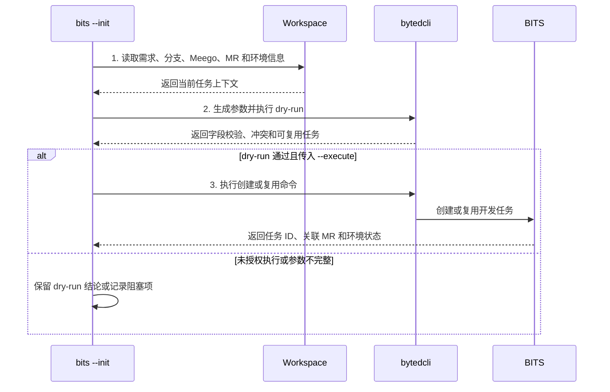
```mermaid
sequenceDiagram
    participant D as bits --init
    participant W as Workspace
    participant C as bytedcli
    participant B as BITS

    D->>W: 1. 读取需求、分支、Meego、MR 和环境信息
    W-->>D: 返回当前任务上下文
    D->>C: 2. 生成参数并执行 dry-run
    C-->>D: 返回字段校验、冲突和可复用任务
    alt dry-run 通过且传入 --execute
        D->>C: 3. 执行创建或复用命令
        C->>B: 创建或复用开发任务
        B-->>D: 返回任务 ID、关联 MR 和环境状态
    else 未授权执行或参数不完整
        D->>D: 保留 dry-run 结论或记录阻塞项
    end
```

##### 阶段功能：创建开发任务
| 运行结果 | 工作区截图 |
| --- | --- |
|  |  |


#### 3.13.2 解决 Codebase Assistant 评论

##### 主要步骤

1. **汇总评审问题。** 确认当前 MR，拉取 Codebase Assistant、Aime 的评论及线程状态；存在 CodeGuard 报告时一并纳入。相同文件、相同行为且根因一致的问题合并处理，同时保留每条评论的来源和位置。
2. **判断是否需要修改。** 将每个问题与当前需求、Task、Test Case 和实际代码链路对照，检查问题是否属于本次需求、能否从当前交互进入，以及建议是否会改变既定业务语义。有效问题标记为接受或部分接受；范围外、不可达、已解决或缺少需求依据的问题记录不修改原因。
3. **完成修改和验证。** 对确认接受的问题按顺序做最小范围修改，每完成一项即运行对应的聚焦验证，并记录修改文件、验证结果和剩余风险；未被接受的问题同样保留明确结论，避免评论被直接跳过。
4. **按授权回写 MR。** 未传 `--submit` 时只完成本地修改、验证和待回写内容；传入 `--submit` 后，才执行 commit、push，并对每个评审线程逐条回复，再关闭已经解决的线程，最后重新读取 MR 状态确认闭环。

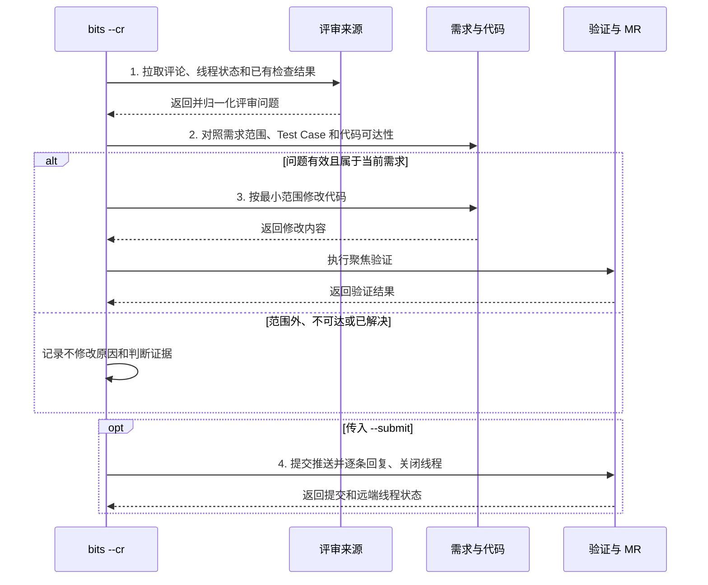
```mermaid
sequenceDiagram
    participant D as bits --cr
    participant R as 评审来源
    participant C as 需求与代码
    participant M as 验证与 MR

    D->>R: 1. 拉取评论、线程状态和已有检查结果
    R-->>D: 返回并归一化评审问题
    D->>C: 2. 对照需求范围、Test Case 和代码可达性
    alt 问题有效且属于当前需求
        D->>C: 3. 按最小范围修改代码
        C-->>D: 返回修改内容
        D->>M: 执行聚焦验证
        M-->>D: 返回验证结果
    else 范围外、不可达或已解决
        D->>D: 记录不修改原因和判断证据
    end
    opt 传入 --submit
        D->>M: 4. 提交推送并逐条回复、关闭线程
        M-->>D: 返回提交和远端线程状态
    end
```

##### 阶段功能：完成评审问题闭环

该阶段把 Codebase Assistant、Aime 等评审意见转化为可跟踪的问题清单，并逐条完成“判断有效性—修改代码—执行验证—回复评论—关闭线程”。它的作用不是直接清空评论，而是确保每条有效意见都落实到代码和验证结果，无需修改的意见也有明确依据。

- **评论线程：**38 / 38 已解决，0 个未关闭。<br />
- **代码检查：**9 / 9 通过。<br />
- **生产构建：**通过。<br />
- **最终提交：**`f0cc9f9cdf7c793ec672dcca9ae2a4f0318b11b7`。

| 评论成立，按评论处理 | 评论存在偏差，不按评论修改 |
| --- | --- |
| CodeGuard 指出候选剔除接口可能只返回 `st: 0`，原响应码判断会因可选字段 `code` 缺失而把成功响应误判为失败。核对接口响应和调用链路后确认问题成立，因此改用兼容可选 `code` 的响应码判断：非零 `code` 优先作为失败码，否则读取 `st`。修改后专项检查、代码格式检查和生产构建均通过。<br /><br /> | Aime 建议调整 DOU+券剔除记录的分页 IDL 字段，但核对后确认该类型由 BAM 生成，当前接口契约明确使用 `page` 表示页码、`page_num` 表示每页数量，前端不能手工修改生成类型或擅自变更接口字段。因此没有按照评论修改 IDL，仅在调用点补充该接口特殊分页约定的注释，并通过相关断言、代码格式检查和生产构建。<br /><br /> |

##### 补充说明

==CR评论修复需要人工审查==

CR 评论是代码审查的输入，不一定等同于正确的修改结论；Agent 对评论的接受或拒绝也可能存在误判，无法保证准确识别每一条评论的业务背景、接口契约和影响范围。因此，评论是否成立、是否需要修改、修改方式是否正确以及验证证据是否充分，都必须经过人工审核。人工确认后才能回复并关闭线程，评论全部关闭和自动检查通过不能替代这一审核过程。

#### 3.13.3 解决前端覆盖率问题

##### 主要步骤

1. **读取覆盖率基线。** 根据当前执行仓库和分支刷新 Huatuo 报告，读取整体覆盖率、目标阈值和有效未覆盖文件。整体覆盖率已经达到阈值时直接记录结果，不再为提高单个文件的数字继续修改代码。
2. **选择并分析本轮目标。** 整体覆盖率未达标时，从当前需求范围内选择有效未覆盖行数最多、且本版本尚未处理的文件；结合源码、需求和 Test Case 判断未覆盖分支是否真实可达。每轮只处理一个文件，不选择 BAM 文件、范围外文件或同版本已完成闭环的文件。
3. **执行代码优化和 UI 覆盖。** 先删除不可达或与需求无关的新增逻辑，精简重复或过度防护代码，再通过真实线上页面操作触发仍需保留的业务分支。只读接口保持真实请求；可能发奖、删除、保存或产生其他线上副作用的写接口，在浏览器中拦截并返回受控结果，同时保留页面、请求和未触达真实后端的证据。
4. **刷新报告并判断是否继续。** 每轮结束后重新刷新 Huatuo，比较最新整体覆盖率和剩余未覆盖文件；达到阈值时停止，未达到且仍有轮次时再选择下一个目标。最终记录每轮目标、代码处理、UI 操作、覆盖率变化和未解决边界；只有传入 `--submit` 时，才提交、推送并发布覆盖率评审结论。

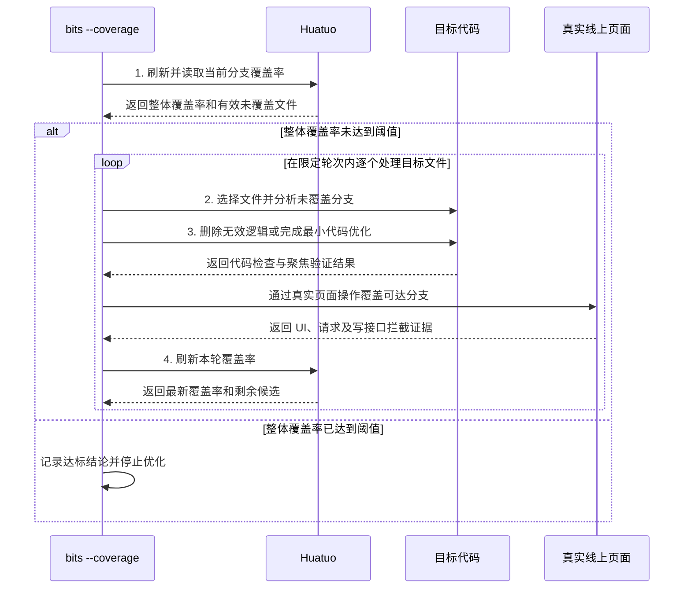
```mermaid
sequenceDiagram
    participant D as bits --coverage
    participant H as Huatuo
    participant C as 目标代码
    participant R as 真实线上页面

    D->>H: 1. 刷新并读取当前分支覆盖率
    H-->>D: 返回整体覆盖率和有效未覆盖文件
    alt 整体覆盖率未达到阈值
        loop 在限定轮次内逐个处理目标文件
            D->>C: 2. 选择文件并分析未覆盖分支
            D->>C: 3. 删除无效逻辑或完成最小代码优化
            C-->>D: 返回代码检查与聚焦验证结果
            D->>R: 通过真实页面操作覆盖可达分支
            R-->>D: 返回 UI、请求及写接口拦截证据
            D->>H: 4. 刷新本轮覆盖率
            H-->>D: 返回最新覆盖率和剩余候选
        end
    else 整体覆盖率已达到阈值
        D->>D: 记录达标结论并停止优化
    end
```

##### 阶段功能：使新增代码达到覆盖率准出门槛

覆盖率优化以前一次运行的结束值作为下一次运行的基线，持续处理剩余未覆盖分支，直到整体覆盖率超过最终准出门槛。按产物中连续衔接的运行记录，本案例共完成四次有效运行。

| 运行轮次 | 覆盖率 | 证据截图 |
| --- | --- | --- |
| 第 1 次运行（3 轮刷新） | `44.25% → 74.62% → 82.18% → 85.15%` |  |
| 第 2 次运行（3 轮刷新） | `85.15% → 88.60% → 88.60% → 89.56%` |  |
| 第 3 次运行（1 轮刷新） | `89.56% → 91.28%`，达到当次 90% 门槛 |  |
| 第 4 次运行（2 轮刷新） | `91.28% → 95.11% → 97.03%`，达到最终 96% 门槛 |  |

### 3.14 `/delivery:accept` 阶段

`/delivery:accept` 是最终交付门禁。该阶段不继续开发或替代前序验证，而是基于权威交付状态和各阶段产物，统一检查需求覆盖、技术方案落地、代码改动、Verify（含 MTR 真实环境复测）证据、Design 结论和遗留风险，最终给出“可交付”“有条件交付”或“不可交付”三类结论，并形成 MR 描述草稿和下一步处理建议。

#### 3.14.1 主要步骤与交互方式

| 步骤 | 主要操作 | 具体作用 | 完成标志 |
| --- | --- | --- | --- |
| 1. 固定验收基线 | 读取权威 Delivery State，确认当前 artifacts 工作区、Execution State、执行仓库、分支和代码差异，再读取当前工作区下的全部阶段产物。 | 保证最终判断针对同一个需求、工作区和代码版本，避免使用旧快照、候选目录或其他分支的结果代替当前状态。 | 工作区、仓库、分支和阶段状态能够唯一对应；不一致时直接登记为阻塞项。 |
| 2. 汇总并审查交付证据 | 由 `delivery-reviewer` 对照 PRD 原子需求检查技术方案和代码落地范围，核对 Verify（含 MTR 真实环境复测）、Design、构建与检查结果，同时扫描 P0/P1/P2 风险、临时代码、调试代码和无关改动。 | 将分散在各阶段的结论收敛为可审计的需求覆盖、代码改动、验证证据、设计对齐和风险清单。 | `Agent Gate Summary`、PRD Coverage、Verification Evidence、Design Alignment 和 Remaining Risks 均有明确结论。 |
| 3. 完成主门禁并输出结论 | 主 Agent 复核 reviewer 的摘要与关键门禁表；存在 P0、验证失败、设计 BLOCKER、状态不一致或证据缺失时不得放行。最终生成验收报告、MR 描述草稿、回滚说明和下一步建议。 | 防止把“代码已实现”“评论已关闭”或“部分 Case 通过”直接等同于可交付，并为阻塞项明确返回 Verify、Design 或状态修复的路径。 | `08-acceptance-report.md` 给出唯一交付结论和下一步；不可交付时明确阻塞原因及回退阶段。 |

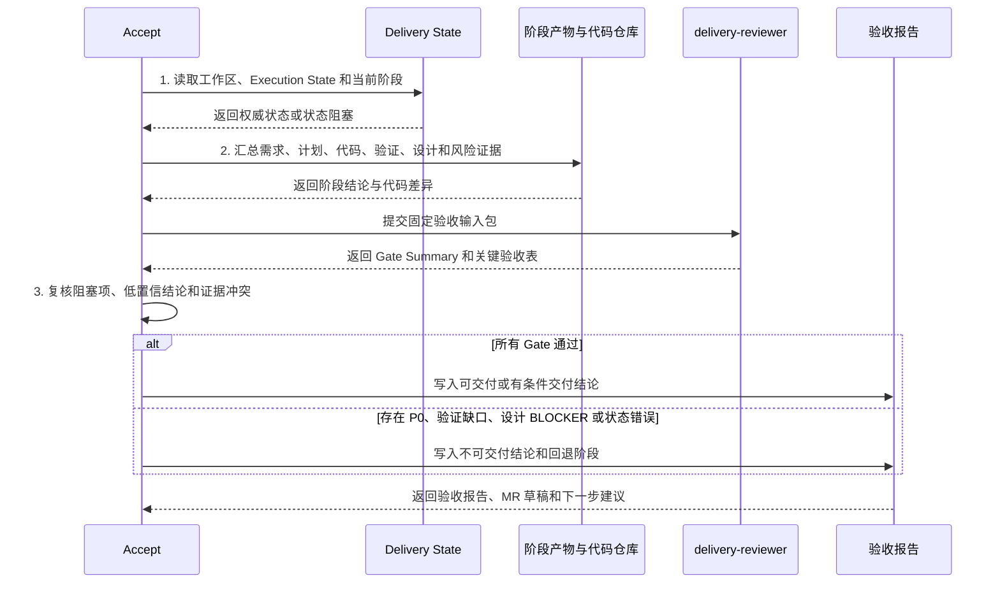
```mermaid
sequenceDiagram
    participant A as Accept
    participant S as Delivery State
    participant W as 阶段产物与代码仓库
    participant R as delivery-reviewer
    participant O as 验收报告

    A->>S: 1. 读取工作区、Execution State 和当前阶段
    S-->>A: 返回权威状态或状态阻塞
    A->>W: 2. 汇总需求、计划、代码、验证、设计和风险证据
    W-->>A: 返回阶段结论与代码差异
    A->>R: 提交固定验收输入包
    R-->>A: 返回 Gate Summary 和关键验收表
    A->>A: 3. 复核阻塞项、低置信结论和证据冲突
    alt 所有 Gate 通过
        A->>O: 写入可交付或有条件交付结论
    else 存在 P0、验证缺口、设计 BLOCKER 或状态错误
        A->>O: 写入不可交付结论和回退阶段
    end
    O-->>A: 返回验收报告、MR 草稿和下一步建议
```

#### 3.14.2 阶段作用：形成最终交付判断

Accept 将“需求是否实现”和“当前版本是否具备交付条件”分开判断。某些功能可以已经实现并取得页面证据，但只要权威状态无法定位当前版本、关键 Test Case 仍缺真实证据、Design 存在阻塞或真实写入副作用未被证明，最终门禁就不能放行。

## 4. 交付结果

> **证据口径（更新至 2026-07-17）：** 本节已按现有 Verify、Design、Repair、MTR 和 BITS 产物重新对账。页面展示和只读查询优先采用最新运行态或真实环境截图；高风险写接口仍以浏览器拦截或 BAM Mock 证明前端请求、响应分支和安全边界。最终 CR 已通过构建与代码检查，但未形成覆盖全部改动的浏览器复验，因此真实后端副作用、数仓核算和 DA 平台 UV 入库未用代码或页面截图替代，统一保留为“部分通过”。

### 4.1 PRD 需求点 1：不激励规则前置透出

- **涉及模块：** 运营平台 > 内容活动 > 奖励配置 > 活动参与资格 / 预埋用户名单。
- **需求描述：** 奖励配置环节需要前置提示「奖励发放环节将进行账号校验，命中【不激励】规则的账号无法被发奖」，覆盖「全部用户」和「仅限预埋用户」两类活动参与资格，并提供「查看【不激励】规则」入口。

| **原子需求** | **验收过程** | **验收结果与截图** |
| --- | --- | --- |
| AR-001 活动参与资格为“全部用户”时展示“不激励”提示 | 进入真实运营平台内容活动详情 → 打开奖励配置 → 选择一个活动配置项 → 将活动参与资格切换为「全部用户」 → 核对配置项下方是否展示“不激励”提示全文和“查看【不激励】规则”入口 | 通过。MTR 真实环境复验中，“全部用户”状态下已展示完整提示和规则入口。<br> |
| AR-002 活动参与资格为“仅限预埋用户”时展示“不激励”提示 | 进入奖励配置页 → 将活动参与资格切换为「仅限预埋用户」 → 确认预埋用户名单控件仍可见 → 核对同一区域是否展示“不激励”提示和规则入口 | 通过。Verify 与 Design 复验均确认预埋用户名单控件、完整提示和规则入口同屏展示，原表单顺序未被破坏。<br> |
| AR-003 点击“查看【不激励】规则”跳转规则文档 | 在已展示“不激励”提示的奖励配置项中定位规则入口 → 点击“查看【不激励】规则” → 检查是否新开目标文档 → 核对文档标题或正文是否包含“电商内容生态激励管控” | 通过。MTR 复验确认点击后新开 PRD 指定飞书文档，目标页标题和正文包含“电商内容生态激励管控”，且跳转未被埋点逻辑阻断。截图展示点击入口，跳转结果由 MTR 浏览器 Tab 记录确认。<br> |

### 4.2 PRD 需求点 2：发奖前剔除

- **涉及模块：** 运营平台 > 内容活动 > 奖励投放 > 奖励下发 / 人工提报。
- **需求描述：** 奖励投放计算中奖作者名单和中奖作品名单时，需要先做治理合规校验。命中「不激励」规则的作者或作品从发奖池中剔除；人工提报场景中，命中规则的作品或账号展示红字提示，运营需先移除异常项，再提交发奖名单。

| **原子需求** | **验收过程** | **验收结果与截图** |
| --- | --- | --- |
| AR-004 DOU+ 币按作品处罚状态校验 | 在 Verify 的 DOU+ 币发奖流程中分别构造自然处罚和解除状态 → 选择候选并提交发奖 → 自然处罚场景核对不出现成功提示、弹窗不按成功态关闭 → 解除状态核对候选可沿用成功流程 | 部分通过，需后端联通。自然处罚响应已验证会阻断成功态，解除状态已验证不会被前端误拦截；MTR 进一步确认两条请求链路可被安全触发。现有证据证明前端分支正确，但写接口被安全拦截，不能证明真实后端处罚状态和最终发奖事务。<br> |
| AR-005 DOU+ 币命中处罚后自动剔除并进入剔除明细 | 进入 DOU+ 币奖励投放页 → 触发发奖前治理分支 → 切换到“剔除明细”Tab → 核对命中规则的作品、剔除时间、剔除原因和操作人 → 在真实环境重新读取剔除明细列表 | 部分通过，需后端联通。Verify/Design 已验证“命中【不激励】规则”的目标行态，BITS 真实只读请求也读取到币剔除明细列表；最终奖励核算、真实处罚状态与写入事务仍需后端或数仓证据。<br><br> |
| AR-006 DOU+ 券按作品 / 账号处罚状态校验 | 进入 DOU+ 券奖励投放页 → 准备账号维度和作品维度命中状态 → 触发发奖前治理校验 → 切换到“剔除明细”Tab → 分别核对作者账号剔除记录和作品剔除记录 | 部分通过，需后端联通。MTR 真实只读接口已返回作者维度剔除记录，Verify Mock 已覆盖作品维度记录和“不激励”原因；真实后端处罚状态合同、作品维度真实样本和写入事务仍需联调确认。<br><br> |
| AR-007 DOU+ 券处罚作品不计入激励核算 | 准备包含处罚作者或作品的 DOU+ 券候选 → 触发奖励提交并确认自然处罚分支不进入成功态 → 核对剔除记录 → 获取后端或数仓核算明细，对比 PV、VV、订单、GMV 和供给是否从最终激励核算中排除 | 部分通过，需后端联通。Verify 已证明自然处罚响应会阻断 DOU+ 券发奖成功态，MTR 真实只读列表也能看到券剔除记录；但页面和前端请求不能证明 PV、VV、订单、GMV、供给已从最终核算中排除，仍需后端或数仓结果。<br><br> |
| AR-008 治理接口超时或异常时暂停发奖并提示 | 在 Verify 中分别触发治理超时和异常响应 → 核对页面错误提示 → 核对投放弹窗未进入成功关闭或成功提示状态 → 检查异常后候选仍保留 | 部分通过，需后端联通。超时场景已展示“治理校验失败，请稍后重试”，异常分支也已由运行态记录确认不会进入成功态；真实错误码、后端超时来源和事务未执行仍需联调复验。<br> |
| AR-009 人工提报命中“不激励”后展示红字提示 | 进入奖励投放页“奖励下发”区域 → 打开“提报视频”弹窗 → 选择手动输入 → 输入包含命中“不激励”作品的混合 ID → 提交候选校验 → 核对命中项红字提示和保留状态 | 通过。Verify 与 Design 复验均确认命中项展示红字提示，并继续保留在候选列表中供运营处理。<br> |
| AR-010 人工提报展示统计提示 | 打开“提报视频”弹窗 → 手动输入正常项和异常项混合作品 ID → 提交候选校验 → 核对候选列表上方是否展示作品总数和“不满足发奖条件或命中【不激励】规则”的数量 | 通过。候选结果上方已展示作品总数和异常作品数量，并与表格中的两类异常行一致。<br> |
| AR-011 一键移除异常作品 | 在“提报视频”弹窗中保留异常候选列表 → 确认“一键移除”按钮可见 → 点击“一键移除” → 核对异常项是否从待提交列表移除 → 核对正常作品和统计区域是否保留 | 通过。Repair 复验确认混合列表中异常项被移除、正常作品保留且异常数更新为 0；BITS 真实页面操作也确认全异常样本可一键清空，工具栏继续保留。<br><br> |
| AR-012 导出剔除明细 | 打开“提报视频”弹窗并核对初始空态 → 提交包含异常项的候选列表并确认“导出剔除明细”入口出现 → 未移除异常项时点击导出，确认不请求导出接口 → 移除异常项后再次点击导出，核对请求仅包含已移除记录 → 分别验证返回链接和缺少链接两类响应 | 部分通过。初始空态、入口显示、移除前 no-call、移除后工具栏保留、已移除记录请求以及缺少 `lark_url` 时的失败分支均已验证；返回链接仅在 Mock/Synthetic Contract 中闭合，真实飞书表格生成、权限和字段内容仍无证据。<br><br><br><br> |
| AR-013 未移除异常项前禁止提交发奖名单 | 在“提报视频”弹窗中提交异常候选 → 异常项未移除时点击“提交并投放” → 核对是否阻止进入二次确认 → 核对 Drawer、候选行和 footer 是否保持 → 移除异常项后重新进入提交链路 | 部分通过。未移除异常项时，运行态已捕获阻断提示、未打开二次确认弹窗且没有发奖请求；最终 CR 已修正不发奖项参与必填校验的问题，但尚未生成“混合样本移除后进入二次确认”的最新浏览器截图，因此后半段仍待复验。<br> |

### 4.3 PRD 需求点 3：剔除明细查看与查询

- **涉及模块：** 运营平台 > 内容活动 > 奖励投放 > 剔除明细。
- **需求描述：** 奖励投放页新增「剔除明细」Tab，用于展示和查询因命中「不激励」标签被剔除的作者与作品明细。DOU+ 币和 DOU+ 券按奖励类型展示对应筛选项、列表字段和分页信息。

| **原子需求** | **验收过程** | **验收结果与截图** |
| --- | --- | --- |
| AR-014 新增“剔除明细”Tab | 进入内容活动详情页 → 打开奖励投放模块 → 在“奖励下发 / 投放明细 / 剔除明细”区域点击“剔除明细”Tab → 核对 Tab 选中状态、查询区和剔除记录列表 | 通过。MTR 真实环境已展示并选中“剔除明细”Tab，真实只读接口返回记录后页面能够正常渲染查询区和列表。<br> |
| AR-015 DOU+ 币剔除明细字段和分页 | 进入 DOU+ 币配置项的“剔除明细”Tab → 核对筛选区仅包含作品 ID 和操作人 → 核对表格列顺序 → 触发真实只读查询 → 在多页 Mock 数据中翻页并核对分页状态 | 部分通过，需后端联通。BITS 真实只读接口已返回币剔除记录，Design/Verify 已确认筛选项、表格列顺序和两页分页状态；真实接口当前样本未覆盖多页，`total / has_more` 与筛选参数仍需后端联调证据。<br> |
| AR-016 DOU+ 券剔除明细字段和分页 | 进入 DOU+ 券配置项的“剔除明细”Tab → 核对筛选区包含作者 ID 和操作人 → 核对表格列顺序 → 触发真实只读查询 → 在多页 Mock 数据中翻页并核对分页状态 | 部分通过。MTR 真实接口已返回 3 条作者剔除记录，并验证作者 ID、操作人筛选项和四列表格；Design/Verify 已覆盖两页分页状态。真实接口当前仅一页，`total / has_more` 与真实筛选回包仍需继续联调。<br> |

### 4.4 PRD 需求点 4：埋点需求

- **涉及模块：** 运营平台 > 内容活动 > 奖励配置 / 奖励投放 > 人工提报 / 奖励投放 > 剔除明细。
- **需求描述：** 需要记录「查看【不激励】规则」点击 UV、人工提报命中「不激励」规则提示曝光 UV，以及剔除明细 Tab 曝光 UV 和点击 UV。剔除明细埋点需要区分 Tab 所在配置项和奖励类型。

| **原子需求** | **验收过程** | **验收结果与截图** |
| --- | --- | --- |
| AR-017 记录查看“不激励”规则点击 UV | 进入展示“不激励”提示的奖励配置项 → 点击“查看【不激励】规则”入口 → 核对前端点击处理器只上报一次，并携带 activity/config 上下文 → 在数据平台查询点击 UV 入库 | 部分通过，需后端联通。Verify 已确认点击时单次调用既有 logger，参数包含 `page_id=content_activity_edit`、`module_id=reward_config_no_incentive_prompt`、`element_id=no_incentive_rule_link` 以及 activity/config 上下文，且不阻断跳转；当前仍缺 DA 平台点击事件和 UV 入库截图。下图仅证明触发入口，不替代 DA 回收证据。<br> |
| AR-018 记录人工提报命中“不激励”规则提示曝光 UV | 进入人工提报弹窗 → 提交包含命中项的混合候选 → 等待统计提示首次出现 → 核对前端曝光事件及去重 → 在数据平台查询曝光 UV 入库 | 部分通过，需后端联通。Verify 已捕获 `module_expose`，其中 `module_id=manual_submit_hit_summary`、命中数为 2、总数为 3，并确认局部重渲染不会重复上报；当前仍缺 DA 平台曝光事件和 UV 入库截图。下图仅证明曝光触发条件已经出现。<br> |
| AR-019 记录剔除明细 Tab 曝光 / 点击 UV | 进入奖励投放页 → 分别在 DOU+ 币和 DOU+ 券配置项下点击“剔除明细”Tab → 核对前端点击与曝光参数包含 config 和 reward type → 在数据平台查询 Tab 点击 / 曝光 UV 入库 | 部分通过，需后端联通。Verify 已确认币、券两条分支分别绑定点击和曝光上报，参数包含 `module_id=remove_detail_data`、配置项信息以及 `reward_type=DOU+币/DOU+券`，并能隔离另一奖励类型；当前仍缺 DA 平台点击 / 曝光事件和 UV 入库截图。下图仅证明两个触发页面状态。<br><br> |
