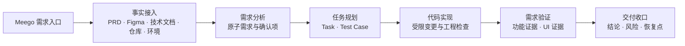

# 前端交付 Agent 工作流问答

## 工作流核心框架

`前端交付 Agent 工作流`是一套面向真实前端需求交付的 AI 工程化流程系统。它以 Meego 需求链接为统一入口，读取并关联 PRD、Figma、技术文档等需求事实，随后完成代码仓库与运行环境准备，通过标准化 SOP 将需求逐步转化为原子需求、开发任务、Test Case、代码变更、运行证据和最终交付结论。

它解决的不是“如何让 AI 更快生成代码”，而是“如何证明一项需求已经被正确交付”。因此，工作流的完成标准不是 Agent 声称“代码已写完”或“测试已通过”，而是需求、任务、实现、验证证据与验收结论能够逐项对应，并且全部通过阶段门禁。



### 本质：用工程约束管理 Agent 的不确定性

这套工作流本质上是一套面向前端交付的 **AI Harness**：

- Skill 定义阶段 SOP 和验收合同，以状态机组织阶段流转；
- Agent 实现需求理解、方案判断与代码执行；
- MCP、CLI、浏览器和脚本获取外部事实、执行真实操作并提供可复核结果；
- 阶段产物负责保存事实和上下文，
- Gate 负责依据检查结果决定放行、修复、回退或暂停。

主流程的阶段顺序和出口标准是确定的，阶段内部的执行路径则允许 Agent 根据实际观察动态调整。换言之，工作流约束的是“输入、边界、产物和完成标准”。

### 核心机制

#### 1. 产物：承接阶段上下文

每个阶段都必须生成结构和位置相对固定的产物。产物不是过程总结，而是阶段正式结论的载体，至少应记录事实来源、阶段结论、决策依据、未决问题、证据位置和下一步动作。

阶段产物主要承担三项职责：

1. **作为下游输入。** 上一阶段确认的需求、方案、任务和 Test Case，构成下一阶段的执行合同，避免依赖聊天记忆重新理解。
2. **作为门禁对象。** Gate 依据产物是否完整、内容是否符合 Schema、证据是否充分来判断阶段能否放行；不符合标准时不得进入下一阶段。
3. **作为恢复与追踪依据。** 工作流中断、跨会话继续或发生验收问题时，可以通过产物恢复当前状态，并沿“需求—任务—代码—证据”定位最早偏差点。

因此，产物设计直接决定工作流是否可追踪、可审查和可恢复。相较于自由格式的长篇描述，固定模板、结构化字段和稳定目录更适合作为阶段间接口。

#### 2. 验收：以可执行的 Gate 控制阶段放行

验收门禁是 Skill 规范中最关键的部分。长任务会持续累积需求、代码和证据，上下文越长，Agent 越容易遗忘约束或过早宣布完成。Gate 的作用是重新读取阶段合同和实际产物，检查“应该完成什么”与“已经证明什么”是否一致，而不是复述 Agent 的自我评价。

| Gate 结果 | 判定含义 | 后续动作 |
| --- | --- | --- |
| `PASS` | 产物、检查结果和证据满足阶段合同 | 更新状态并进入下一阶段 |
| `AUTO_FIX_REQUIRED` | 偏差明确，且可在当前授权范围内修复 | 留在当前阶段修复并重新验收 |
| `NEEDS_TARGETED_REVIEW` | 证据不足、结论冲突或需要专项判断 | 补充证据或提交人工审查 |
| `BLOCKED` | 关键事实、权限、环境或业务决策缺失 | 暂停流程，记录恢复点并请求确认 |

门禁应优先使用 JSON Schema、固定模板、退出码和校验脚本表达可确定判断，例如文件是否存在、字段是否完整、构建是否通过、Case 是否全部关联证据。机器可读约束可以减少自然语言歧义，防止 Agent 通过模糊表述绕过检查；涉及业务语义和视觉判断时，仍需结合原始证据进行审查，不能让脚本替代最终判断。

#### 3. 证据：事实先于推断，结论必须可追溯

生成式 AI 存在“自信地生成错误或虚假内容”的风险。工作流要求 Agent 在分析和执行前区分事实、推断与未决问题，任何正式结论都必须能够回到明确的信息源。

| 信息类型 | 典型来源 | 处理原则 |
| --- | --- | --- |
| 已确认事实 | 用户或产品明确确认的业务规则 | 直接作为阶段依据 |
| 可追溯事实 | PRD、Figma 节点、技术文档、仓库代码、命令和运行结果 | 标记来源后使用；来源冲突时停止下结论 |
| 模型推断 | 对设计意图、业务口径或实现方式的推测 | 只能作为候选方案，不能写成已确认事实 |
| 未决问题 | 信息缺失、描述歧义、权限不足或环境不可用 | 进入问题清单；影响范围或验收时执行 Pause and Ask |

工作流可以对技术实现进行方案探索，但不能对需求目标、接口口径和 UI 基准进行无依据补全。PRD 无法确定业务范围、Figma 无法定位对应节点或多份资料相互冲突时，Agent 必须显式阻塞并向用户确认，而不是在模糊前提下继续开发。

#### 4. 反馈：阶段内修复，阶段间回退纠偏

工作流通过“执行—评价—反馈—复验”持续收敛结果。它允许 Agent 在阶段内部调整路径，也允许验收问题反向修正上游产物，但每次修复都必须回到原 Gate 或原 Test Case 重新取证。

**阶段内部闭环：**

```text
读取规范 → 获取事实 → 执行任务 → 运行检查 → 自检差异
                                             │
                         ┌───────────────────┴───────────────────┐
                         ▼                                       ▼
                 满足要求：提交阶段产物                 存在偏差：修复后重新检查
                                                                  │
                                                                  └──────→ 运行检查

```

**阶段之间闭环：**

```text
初始化 → 需求分析 → 任务规划 → 代码实现 → 需求验证 → 任务交付
           ↑          │       ↑          │
           └──────────┘       └──────────┘
          规划不合理             验证未通过

```

### 核心作用

#### 1. 建立功能需求的端到端实现与验收链路

功能交付的核心，是把 PRD 中的业务描述转化为一条可以逐项追踪、逐项验证的实现链路。

```text
PRD / 技术文档 / 用户确认
              │
              ▼
         原子需求拆解
   “系统具体应该发生什么？”
              │
              ▼
          Task 任务划分
   “由哪一项代码变更负责实现？”
              │
              ▼
       Test Case 验收合同
   ┌──────────┼──────────┐
   ▼          ▼          ▼
正常路径    异常/边界    负向约束
应该发生    如何处理     不得发生
   └──────────┼──────────┘
              ▼
           代码实现
              │
              ▼
        Verify 逐 Case 取证
页面状态 · DOM · Network · Console · 截图
              │
              ▼
       功能 Gate：PASS / 返修 / 阻塞
```

这条链路让每一项代码变更都能回到具体需求，让每一条需求都能找到对应的 Test Case 和运行证据。验收对象因此不再是“页面能否运行”，而是正常路径、异常路径、边界条件以及“不应发生”的副作用是否全部符合业务合同。

当后端接口或测试数据尚未就绪时，工作流可以为指定 Case 构造最小范围的受控 Mock，并在验证完成后返回原 Case：

```text
真实数据暂不可用
      │
      ▼
为当前 Case 配置最小 Mock
      │
      ▼
验证前端请求、状态管理、交互分支和数据消费
      │
      ├── 前端逻辑不通过 → 修复代码 → 原 Case 复验
      │
      └── 前端逻辑通过   → 保留“待真实环境验证”标记
                                      │
                                      ▼
                         后端就绪后执行真实联调 / MTR
```

> **能力边界：**Mock 只能证明前端是否按照接口合同发起请求并消费数据，不能证明真实接口、权限、事务、数据口径和写操作副作用已经正确。Mock 通过不等于需求最终验收通过。

#### 2. 将 UI 还原转化为可验证的工程闭环

UI 交付的核心，是让每一项视觉实现都拥有明确的设计来源，并让设计稿与运行页面能够在同一业务状态下进行对照。

```text
原子需求
   │
   ├── 建立映射 ──→ Figma 页面 / Frame / 原子节点
   │                         │
   │                         ▼
   │              读取节点结构、截图、XML、样式信息
   │              Figma MCP · F2C / D2C
   │                         │
   └─────────────────────────▼
                         Code 实现
                             │
                             ▼
                    浏览器加载目标业务状态
                             │
             ┌───────────────┴───────────────┐
             ▼                               ▼
       Figma 设计基准                  Runtime 运行证据
     节点 · 截图 · 样式          截图 · DOM · BBox · Computed Style
             └───────────────┬───────────────┘
                             ▼
                     Design 差异对比
                             │
              ┌──────────────┴──────────────┐
              ▼                             ▼
          对齐：归档证据              存在偏差：定向返修
                                            │
                                            └──→ 返回原 Case 复验
```

这条链路在两个位置控制偏差：

- **编码之前确认来源。** PRD 阶段先把原子需求与 Figma 节点绑定；节点缺失、设计状态不明确或资料冲突时先询问，避免 Agent 自行补全 UI。
- **编码之后验证结果。** Verify 与 Design 阶段对比页面结构、文案、显隐状态、尺寸、间距、颜色和字号等信息，用 Runtime 证据解释具体差异。

```text
UI 对齐结论
  = 有明确的 Figma 来源
  + 有同一状态下的 Runtime 证据
  + 每一项差异都有“通过 / 返修 / 阻塞”结论
```

因此，UI 验收不再停留在“看起来差不多”，而是形成“设计来源可追溯、实现差异可定位、返修结果可复验”的工程闭环。

#### 3. 人工审查关键节点

工作流并不是取消人工责任，而是让 Agent 承担资料读取、结构化拆解、代码实现、自动检查和证据整理，把人工判断集中在三个会改变交付方向的关键节点。

```text
Agent 自动执行区
需求读取 → 原子需求 → Plan → Task → Test Case
                              │
                              ▼
┌──────────────────────────────────────────────────────┐
│ 人工 Gate 1：Test Case 合同审查                     │
│ 判断“需求是否被正确理解，后续开发路线是否正确”       │
└──────────────────────────────────────────────────────┘
                              │ PASS
                              ▼
Agent 自动执行区
Code → 工程检查 → 浏览器操作 → Case 证据归档
                              │
                              ▼
┌──────────────────────────────────────────────────────┐
│ 人工 Gate 2：Verify 证据审查                        │
│ 判断“证据是否真的支持 PASS，是否存在虚假验收”       │
└──────────────────────────────────────────────────────┘
                              │ PASS
                              ▼
Agent 自动执行区
Design 对齐 → 风险汇总 → 交付材料整理
                              │
                              ▼
┌──────────────────────────────────────────────────────┐
│ 人工 Gate 3：真实联调与最终验收                     │
│ 判断“真实接口、数据、权限和副作用是否满足交付要求”   │
└──────────────────────────────────────────────────────┘
                              │
                    ┌─────────┴─────────┐
                    ▼                   ▼
                 最终放行         Repair → 新一轮 SOP
```

**Gate 1：Test Case 合同审查。** 重点检查原子需求、Task、接口或 Mock Rule、正负向断言和证据要求是否完整对应。这个节点决定后续代码是否建立在正确需求上；如果 Test Case 本身偏离需求，即使代码和 Verify 全部通过，最终结果仍然是错误的。

**Gate 2：Verify 证据审查。** 重点检查每个 Case 的实际操作、页面截图、DOM、Network、Console 等证据能否支持对应结论，尤其要核对“不应出现”“不应发送”“不应删除”等负向断言。证据不足时必须留在原 Case 补证或返修，不能用汇总性的“已验证”代替事实。

**Gate 3：真实联调与最终验收。** 在功能 Gate 和 UI Gate 通过后，与后端及真实环境共同关闭 Mock 无法证明的接口、权限、数据和副作用问题。如果联调发现新的需求误读或实现偏差，则进入 Repair，定位最早偏差阶段，并按依赖顺序重新执行后续 SOP。

> **人机分工的结果：**Agent 负责规模化执行与证据生产，人负责事实确认、关键产物审查和最终放行。人工参与次数减少，但每一次参与都拥有明确的审查对象、判断标准和失败处理路径。

## **案例**

```text
案例一：需求是否已经被准确确认？       → 事实与证据机制
案例二：后续开发路线是否建立在正确用例上？ → Test Case 合同与人工审查
案例三：UI 是否真正还原了设计？         → Figma 到 Runtime 的视觉闭环
案例四：功能需求验证是否可信？       → Case 级多证据验收
案例五：验收发现偏差后如何系统修正？     → Repair 回溯与阶段间反馈
```

### 案例一：不确定需求不进入开发

**证明：**需求分析必须建立在 PRD、技术文档、Figma 和用户确认等可追溯事实之上。Figma 用于确认页面结构和视觉来源，但不能替代产品对业务范围、数据口径和交互边界的确认；关键证据不足时，工作流必须暂停并发起确认。

**结果：**开发开始前，原始需求已经转化为“原子需求 + Figma 节点 + 用户决策”的事实合同。批量上传状态、导出范围、原因字段和申诉能力均获得明确结论，后续 Plan、Task 和 Test Case 不再基于 Agent 推测展开。

> 【案例】运营提交中奖名单后，需要标记命中自然处罚的作品或账号，提供问题汇总、一键移除和明细导出，并在问题项未处理时禁止发奖。表面上是“接入一个校验接口”，实际上同时包含校验、展示、操作、导出和提交限制五类行为。

工作流首先把复合描述拆成可独立验收的原子需求，再把有 UI 的需求定位到具体 Figma 节点：

```text
PRD / 技术文档
      │
      ▼
拆成五项原子需求
  1. 命中项保留在名单中，不自动删除
  2. 展示作品总数和问题作品数
  3. 一键移除只删除问题作品，正常作品必须保留
  4. 导出只包含已经移除的记录
  5. 问题作品未移除前禁止“提交并投放”
      │
      ▼
映射 Figma 节点
  页面状态 25:13842 → 提报抽屉 87:6973
  汇总提示 87:6998 → 一键移除 87:7000
  导出按钮 87:7002 → 表格行 87:7016 → 提交区 87:7133
      │
      ▼
登记设计无法回答的问题 → Ask First → 写入正式决策
      │
      ▼
形成可以交给 Plan、Task 和 Test Case 的需求合同
```

| Figma 中的人工提报命中态 | Figma节点对齐 |
| --- | --- |
|  |  |

Figma 明确了抽屉结构、按钮顺序、红色原因和提交区，却没有回答三个会直接改变实现的问题。工作流没有让 Agent 自行补齐，而是通过 Ask First 获得确认：

| 待确认问题                             | 最终确认                                               | 对实现和验收的影响                                           |
| -------------------------------------- | ------------------------------------------------------ | ------------------------------------------------------------ |
| 批量上传没有单独的命中态设计           | 复用手动输入的命中态                                   | 两个入口共用汇总、行级状态、移除和提交保护，不新增一套猜测出来的 UI |
| 导出范围及原因字段来源不清楚           | 只导出已剔除记录；移除原因限定两类；处罚原因由接口提供 | 固定导出请求范围、字段枚举和数据来源                         |
| PRD 评论提到申诉，但没有入口和交互设计 | 本期不做申诉入口                                       | 避免 Agent 擅自扩大产品范围                                  |


### 案例二：Test Case 驱动开发

**证明：**Test Case 不是代码完成后的测试清单，而是连接需求、Task、BAM Rule、实现和证据的交付合同。审核 Test Case，实质上是在审核需求分析和任务规划是否正确，并提前确定后续代码实现与 Verify 取证的方向。

**结果：**原子需求 `AR-010` 由 `TASK-005` 承接，并形成 `TC-INT-MANUAL-SUBMIT-GUARD`。这条 Case 没有只写“提交时给出提示”，而是完整定义了场景、操作、正向结果、负向结果和证据要求：

> 【案例】运营提交中奖名单后，需要标记命中自然处罚的作品或账号，提供问题汇总、一键移除和明细导出，并在问题项未处理时禁止发奖。表面上是“接入一个校验接口”，实际上同时包含校验、展示、操作、导出和提交限制五类行为。

```text
需求 AR-010
“名单中仍有问题作品时，禁止提交发奖”
      │
      ▼
Task TASK-005
Store 统一识别问题作品；Drawer 在提交入口执行拦截
      │
      ▼
Test Case TC-INT-MANUAL-SUBMIT-GUARD
  前置条件：名单共 3 条
             ├─ 100001：不满足准入门槛
             ├─ 100002：命中【不激励】规则
             └─ 100003：正常作品
  用户动作：直接点击“提交并投放”
  正向断言：显示完整阻断提示，Drawer 和三条名单保持不变
  负向断言：不打开投放确认弹窗、不发送币或券发奖请求、
             不显示成功态、不删除正常作品
  所需证据：页面状态 + DOM 提示记录 + Network 请求记录
      │
      ▼
BAM Rule 构造 Case 所需前置状态
  对应 API：apiSearchDeliveryItems
  Method / Path：
    GET /api/buyin/admin/content_activity/search_delivery_items
  规则名（ruleId）：R-BAM-MANUAL-SEARCH-HIT
  规则语义：人工提报三条作品的混合命中态
  匹配字段：
    item_ids=100001,100002,100003
    candidate_pool_type=2
    page_no=1
    page_size=50
  返回状态：
    2 条问题作品 + 1 条正常作品
      │
      ▼
Verify 按自然页面路径执行并逐条对账
```


最终证据同时证明了“应该发生的提示和页面停留”以及“不应该发生的确认弹窗和发奖请求”。结论为 `PASS_WITH_NOTES`：前端提交保护已经闭合；问题作品由 Mock 构造，因此真实后端是否正确返回治理字段仍需真实环境复验。

### 案例三：UI 视觉对齐与还原

**证明：**UI 需求必须在需求分析阶段绑定具体 Figma 页面和原子节点，在代码实现阶段读取节点结构与样式，在运行阶段使用截图、DOM 和计算样式完成同一状态下的对比。设计来源、实现依据和验收基准必须使用同一套节点映射。

**结果：**需求分析将“全部用户状态下展示不激励规则提示”绑定到 Figma 原子 UI 区域 `1:9770` 和提示文字节点 `1:10202`；代码实现阶段通过 F2C 读取同一节点的结构与样式；测试验证阶段对同一页面状态进行 Figma—Runtime 对比，发现并关闭图标、字号、间距、颜色和下划线偏差，原 Design Case 复验结果为 `FIXED_PASS`。

> 【案例】原子需求 `AR-001` 要求：奖励配置选择“全部用户”时，在“活动参与资格”下方展示完整的不激励规则提示和可点击链接。设计合同要求正文为灰色 `12px/20px`、文字与链接间距为 `4px`、链接为蓝色下划线，并且提示前不出现图标。

```text
┌──────────────── 需求分析（/delivery:prd）────────────────┐
│ PRD 拆解为原子 UI 需求                                   │
│ AR-001：全部用户状态展示不激励规则提示                   │
│        ↓                                                  │
│ 定位 Figma 页面状态与原子节点                            │
│ 原子 UI 区域 1:9770 → 提示文字节点 1:10202               │
│        ↓                                                  │
│ 形成“原子需求—Figma 节点—设计边界”的 UI Source Map       │
└──────────────────────────┬────────────────────────────────┘
                           ▼
┌──────────────── 代码实现（/delivery:code）───────────────┐
│ Task 继承 UI Source Map，不重新猜测设计来源               │
│        ↓                                                  │
│ F2C 读取 1:9770 / 1:10202 的 XML、文案、尺寸和样式        │
│        ↓                                                  │
│ 生成代码并完成静态检查，形成首次 Runtime 实现             │
└──────────────────────────┬────────────────────────────────┘
                           ▼
┌──────── 测试验证（/delivery:verify + /delivery:design）───┐
│ 按 Test Case 通过自然页面路径进入同一 UI 状态             │
│        ↓                                                  │
│ Runtime 截图 + DOM + Computed Style                       │
│        ↕                                                  │
│ Figma 标注图 + F2C 结构化设计数据                         │
│        ↓                                                  │
│ 发现偏差 → Code Fix → 返回原 Case 重新取证                │
└──────────────────────────┬────────────────────────────────┘
                           ▼
                       FIXED_PASS
```

下表四张截图均对应原子需求 `AR-001`，按照需求分析、代码实现和测试验证的顺序，展示同一设计从原始 Figma、原子节点标注、首次 Runtime 到返修复验的完整变化。

| **需求分析：Figma 原设计图**<br><br>原始设计确定“全部用户”状态下提示文案、规则链接及其页面位置。 | **需求分析：原子节点标注图**<br><br>原子 UI 区域对应 `1:9770`，提示文字节点对应 `1:10202`，并记录字号、行高、间距和无图标约束。 |
| --- | --- |
| **代码实现：首次 Runtime 效果图**<br><br>文案和链接已经实现，但多出问号图标，正文为 `14px`，链接颜色和下划线存在偏差。 | **测试验证：返修后的 Runtime 效果图**<br><br>图标已移除，字号、间距、颜色和下划线与 Figma/F2C 设计合同一致，原 Case 复验为 `FIXED_PASS`。 |

### 案例四：Verify 的 PASS 必须被证据证明——DOU+币发奖超时

**证明作用：**Verify 的判断单位是 Test Case，不是页面或代码文件；一个可信的 `PASS` 必须同时回答要求发生的行为是否发生、禁止发生的行为是否未发生，以及这些判断是否来自同一次有效操作。

**结果：**`TC-INT-AWARD-TIMEOUT` 首次执行因 DOM 缺少规定错误文案而失败。完成受限 Code Fix 后，工作流返回同一个 Case 重跑，最终以接口超时记录、`role="alert"` DOM、运行截图和成功流程未发生等证据形成 `PASS_WITH_NOTES`。

> 【案例】`TC-INT-AWARD-TIMEOUT` 验证发奖接口返回超时后，页面必须显示“治理校验失败，请稍后重试”，保留投放确认弹窗并停止成功流程。该 Case 还记录了 Verify 发现代码问题后，修复并回到原 Case 的过程。

```text
进入批量上传发奖流程
      │
      ▼
选择充值记录并点击投放确认
      │
      ▼
BAM Runtime 返回超时合同
{ st: 1, code: 504, msg: "timeout" }
      │
      ▼
第一次 Verify：DOM 中没有规定错误文案 → Case FAIL
      │
      ▼
受限 Code Fix：只修改投放确认弹窗的错误提示范围
      │
      ▼
返回同一个 Case，重新执行完整页面操作
      │
      ▼
多证据对账
  ├─ 接口证据：超时 Rule 命中，返回 504 / timeout
  ├─ 正向证据：DOM 出现持续可见的 role="alert" 和完整文案
  ├─ 视觉证据：截图显示错误提示，弹窗仍保持打开
  ├─ 负向证据：没有“提交成功”，没有关闭弹窗或执行成功重置
  └─ 边界说明：本轮证明前端超时分支，不冒充真实后端事务验证
      │
      ▼
PASS_WITH_NOTES
```

| 断言类型 | 断言                                                         | 证据对齐                                                     |
| -------- | ------------------------------------------------------------ | ------------------------------------------------------------ |
| 正向断言 | 发奖接口返回超时后，投放确认弹窗内必须持续显示“治理校验失败，请稍后重试”。 | 最终发奖规则返回 `{st:1, code:504, msg:"timeout"}`；修复前的 DOM 没有规定文案，修复后的 DOM 出现持续可见的 `role="alert"` 节点，节点文本为“治理校验失败，请稍后重试”。修复记录、构建通过结果和复验 DOM 对应同一个 Case，证明超时提示在修复后已按断言显示。 |
| 负向断言 | 超时后不能关闭投放确认弹窗，不能显示“提交成功”，也不能进入成功后的页面重置流程。 | 超时响应返回后，DOM 中仍能找到投放确认弹窗和 `role="alert"` 错误提示，没有找到“提交成功”；浏览器 Network 中没有真实 `/delivery_dou_plus_coin` XHR 或 fetch。截图同时显示弹窗保持打开、错误文案可见，页面未进入成功状态。<br /> |
| 证据要求 | Test Case 要求提供 `Network error/message evidence`，即接口超时证据和页面错误文案证据。 | **Network error 产物：**`TC-INT-AWARD-TIMEOUT--browser-network-final.log` 和 `TC-INT-AWARD-TIMEOUT--runtime.json`，记录最终发奖阶段的 `[BAM_MOCK_SYNTHETIC_CONTRACT]`、`[BAM_MOCK_HIT]`、`R-BAM-AWARD-COIN-TIMEOUT` 返回 `{st:1, code:504, msg:"timeout"}`，以及没有真实 `/delivery_dou_plus_coin` XHR 或 fetch。<br />**Message 产物：**`TC-INT-AWARD-TIMEOUT--runtime.json` 和 `TC-INT-AWARD-TIMEOUT.md`，记录修复后的 DOM 存在持续可见的 `role="alert"` 节点，文本为“治理校验失败，请稍后重试”。<br />**截图产物：**`TC-INT-AWARD-TIMEOUT--final-timeout-fixed.png`，显示错误文案可见且投放确认弹窗没有关闭；文档中统一保存为 `verify-award-timeout-fixed.png`。两类要求均有对应产物，与 Test Case 的 `evidence_required` 一致。 |

### 案例五：Repair 不是只修代码

**证明作用：**当 UAT 或联调发现问题时，工作流需要定位最早发生偏差的阶段，修正需求合同、任务、Test Case、代码和证据；只修改当前页面，会让错误的上游产物继续影响后续迭代。

**结果：**Repair 将“一键移除后操作区消失”定位为 Plan 页面状态合同不完整，而不是单纯的 UI Bug。Plan、TASK-005、Test Case、代码和验证证据完成同步修正；复验确认正常作品保留、问题数归零、一键移除禁用且导出入口继续可用。

> 【案例】UAT 发现：人工提报点击“一键移除”后，问题作品虽然被正确移除，但“提报汇总”栏、“一键移除”和“导出剔除明细”整个操作区也一起消失。真实期望是操作区继续保留，问题数更新为 `0`，“一键移除”变为禁用状态，导出入口仍然可用。

问题表面上是 UI 条件渲染错误，继续追踪后发现根因并不只在代码：Plan 只要求移除后保留导出入口，没有明确要求汇总栏和“一键移除”继续显示；Task 与 Test Case 又继承了相同遗漏，因此旧 Verify 无法识别这个问题。

```text
UAT 问题事实
“一键移除后，汇总栏和操作按钮不应消失”
      │
      ▼
定位最早偏差：Plan 的页面状态合同不完整
      │
      ▼
修正 Plan
明确：汇总栏始终保留；问题数归零；一键移除禁用；导出仍可用
      │
      ▼
修正 TASK-005 与 Test Case
更新 TC-INT-MANUAL-EXPORT-PERSIST-AFTER-REMOVE
      │
      ▼
修正代码条件渲染
      │
      ▼
重跑原操作链和断言
  ├─ 正常作品 100003 仍保留
  ├─ 汇总更新为“共 1 个作品……问题作品 0 个”
  ├─ “一键移除”保留并禁用
  └─ “导出剔除明细”继续可用
      │
      ▼
Verify + Design 重新取证 → PASS_WITH_NOTES
```

| Repair 前：移除后操作区消失 | Repair 后：汇总与操作区按合同保留 |
| --- | --- |
|  |  |

## 启发是什么

这套工作流带来的核心启发，并不是为 Agent 编写更多提示词，而是将交付可靠性从“依赖 Agent 自觉”转移到**产物、门禁、证据和恢复机制**上。Agent 可以保留分析和执行的自主性，但不能自行降低交付标准，也不能在证据不足时跳过阶段出口。

### 1. 门禁必须从自然语言提醒升级为可执行判定

门禁是每个阶段不可缺少的组成部分。随着任务规模扩大、上下文增长，Agent 可能遗忘早期规范，也可能把“已经执行”误判为“已经完成”。如果阶段出口只是自然语言要求，Agent 仍有可能遗漏、弱化甚至绕过这些要求；而脚本、结构校验和明确的退出码，可以把软性提醒转化为必须满足的工程约束。

```text
阶段完成 ≠ Agent 声称已经完成

阶段完成 = 必需产物完整
         + 产物结构合法
         + 测试与证据覆盖达标
         + 阻塞问题已经处理
         + Gate 脚本返回通过
```

当门禁未通过时，工作流不会继续向后推进，而是依据失败项定位缺失规范、缺失产物或证据断点，回到当前阶段补齐后重新验收。这样即使 Agent 在执行中短暂丢失规范，也会在阶段出口重新被规范约束。

相比在 Skill 中堆叠大量自然语言，Java、Python、Shell 等校验脚本以及 JSON Schema、固定模板的优势在于：

- **执行成本低：** Agent 只需要知道何时运行校验，以及如何修复校验失败项；
- **判定结果稳定：** 同一份产物在相同规则下得到一致结论；
- **不容易被绕过：** 必填字段、文件完整性、Case 覆盖率等要求由程序直接检查；
- **能够触发回溯：** 校验错误可以明确指向缺失项，而不是笼统地提示“质量不足”。

脚本适合判断结构、数量、映射和状态等确定性条件；需求语义是否正确、证据是否真实，仍然需要结合事实来源、Agent 审查和关键节点人工审核。两者结合，才能形成既强硬又可信的验收门禁。

### 2. 产物模板决定了上下文传递和证据质量

产物不是工作过程的附属记录，而是阶段之间传递事实的接口。每份产物同时承担三项职责：向下一阶段提供输入、作为当前阶段的验收对象，以及在会话中断后提供恢复锚点。因此，产物结构是否稳定，会直接影响整个工作流能否持续执行。

最有效的方式不是反复用自然语言描述“文档应该写什么”，而是由脚本初始化固定模板，再要求 Agent 在事实和证据的基础上补全内容。例如，Verify 阶段的每个 Test Case 都必须形成独立证据账本：

```text
Case ID / Requirement ID
├── 前置条件与数据状态
├── 用户操作路径
├── 预期结果
├── 实际观察结果
├── 正向断言与证据
├── 负向断言与证据
├── 视觉正向／负向断言
├── Screenshot / DOM / Network / Console 证据
├── Mock 验证与真实环境验证边界
└── 验收结论、残余风险与证据索引
```

固定模板能够防止 Agent 随意改变报告结构，或者用一份简略总结替代逐 Case 验收；校验脚本还可以进一步检查必填字段、证据链接和 Case 覆盖情况。模板负责保证结构下限，事实和实际执行证据负责保证内容真实性，两者共同构成可审查、可复用的交付产物。

### 3. 确定性 SOP 应当与受限自主的 Agent 结合

工程流不适合通过一份超长 Skill，把 Agent 的每一步操作都写死。规范越长，占用的上下文越多，Agent 越难在执行过程中持续保留全部细节；过度限制还会削弱 Agent 根据仓库、页面状态和异常情况动态选择路径的能力。

更合理的设计，是把确定性要求放在外层 SOP，把分析和处理能力保留在受限的执行空间内：

```text
┌────────────── 确定性 SOP 外壳 ──────────────┐
│ 阶段路由 │ 状态流转 │ 权限边界 │ 固定产物 │ Gate │
│                                              │
│        ┌────── 受限自主的 Agent ──────┐       │
│        │ 观察事实 → 判断问题 → 选择工具 │       │
│        │ 执行修改 → 自检差异 → 重新验证 │       │
│        └──────────────────────────────┘       │
└──────────────────────────────────────────────┘
```

SOP 负责规定“必须交付什么、什么情况下才能离开、哪些操作不能越权”；Agent 负责决定“在当前事实条件下，怎样最有效地完成任务”。脚本和模板处理机械、重复、可计算的判断，Agent 处理语义分析、异常诊断和方案选择。这样的分工比单纯增加强制条款更稳定，也更容易维护和扩展。

### 4. 允许执行偏移，但必须能够发现、定位和恢复

复杂工程任务中，完全不发生偏移并不现实。真正重要的不是要求 Agent 永远一次做对，而是让偏移能够被证据和门禁发现，并能够定位到最早出现问题的阶段。

```text
阶段内偏移：执行 → 检查失败 → 定位差异 → 修复 → 重跑原检查

阶段间偏移：验收发现问题
              ↓
        定位最早失真阶段
              ↓
   回放 Plan / Task / Test Case / Code / Verify
              ↓
       更新产物并重新形成证据
```

例如，Verify 发现功能与需求不一致时，问题不一定来自代码，也可能来自原子需求遗漏、任务拆解错误或 Test Case 预期不准确。Repair 阶段应当回到最早失真的产物进行修正，再依次重放后续阶段，而不是只在代码末端打补丁。

在多 Agent 协作中，同样需要明确责任边界：主 Agent 负责维护阶段状态、审查产物和执行最终 Gate；子 Agent 或专业 Agent 负责范围明确的实现、验证和修复任务。允许局部执行路径变化，但阶段结论只能由统一证据和门禁产生。

## 我的工作

围绕前端交付工程流，我重点补齐了功能验证、问题回放、平台收尾和需求源读取四类能力。这些工作并不是增加孤立命令，而是将原来依赖人工经验的关键动作，沉淀为可复用的 Skill、标准产物和可执行门禁。

### 1. 建立需求、Test Case、Mock 与 Verify 的功能实现链路

#### 1.1 设计 Mock Skill，使测试场景能够驱动 Mock 数据

我设计了 Mock 阶段的 Skill，建立从需求到验证数据的完整映射：

```text
Requirement
    ↓
Task
    ↓
Test Case（前置状态、操作、预期结果）
    ↓
用户在页面上的自然操作
    ↓
浏览器实际 Request
    ↓
Mock Rule（apiName + 业务影响字段）
    ↓
BAM Mock Runtime
    ↓
回到同一个 Test Case 执行 Verify
```

这里的关键设计，是将 Mock Rule 与 Test Case 场景建立显式关系，而不是简单地按照“一个接口对应一条规则”进行配置。同一个接口可能服务多个业务状态，例如可领取、不可领取、已领取和异常返回；如果仅按接口匹配，不同测试场景之间容易互相命中，无法证明某一条规则究竟服务于哪个验收目标。

同时，规则不能在脱离运行时请求的情况下猜测匹配字段。Test Case 首先定义所需业务状态和预期结果，Verify 再通过真实页面操作捕获浏览器自然发出的请求，从中筛选真正影响业务分支的字段，形成以下绑定关系：

```text
caseIds + ruleId + apiName + requestFields + responseContract
```

只有来自已确认接口契约、并且由页面自然请求携带的业务字段，才可以作为规则匹配条件。这样能够避免规则与无关请求字段形成脆弱耦合，也减少使用测试专用字段、响应字段或无关参数强行命中规则的问题。

这套设计使后端接口尚未完成时，前端仍然能够围绕 Test Case 自动准备所需数据状态，验证请求是否正确发出、业务分支是否进入、响应是否被正确消费。但 Mock 结论会明确保留边界：它证明的是前端功能链路，不替代真实后端、鉴权、数据持久化和事务行为的联调验收。

#### 1.2 设计 Verify 阶段的逐 Case 证据对齐方案

我进一步设计了 Verify 阶段的证据约束，将“页面看起来可以使用”转化为“每一个 Test Case 都有可审查证据”。每个 Case 必须通过用户可见入口执行，并记录前置条件、操作路径、预期与实际结果，以及 Screenshot、DOM、Network、Console 等证据。

```text
Test Case
├── 正向：目标状态出现、功能结果成立
├── 负向：不应出现的状态未出现、错误分支受到约束
├── 视觉：关键元素、文案、状态与布局可见
├── 请求：接口、参数、响应与业务状态能够对应
├── 运行：控制台无相关错误，页面可继续操作
└── 边界：标明 Mock、真实环境和待联调项
```

当浏览器中无法定位目标请求或页面状态时，流程要求先检查入口路径、前置数据、DOM 状态和 Network 请求，再根据规定进入 Mock 或问题修复路径，而不是跳过当前 Case 或直接补写结论。标准模板负责限制报告结构，Gate 负责检查 Case 和证据覆盖，最终避免 Agent 以自由发挥的总结文档代替实际验收。

这两项设计共同打通了“需求定义什么、任务实现什么、Test Case 验收什么、Mock 提供什么状态、Verify 用什么证据证明”的功能交付闭环。

### 2. 设计 Repair 阶段，实现跨阶段问题回放

我设计了 Repair 阶段，用于处理验收、人工审核或后端联调之后发现的问题。Repair 的目标不是简单修改代码，而是判断问题最早在哪一阶段产生，并从该阶段开始修正共享事实和后续产物。

```text
问题输入
   ↓
保存当前快照与恢复点
   ↓
读取完整问题描述和证据
   ↓
定位最早失真阶段
   ↓
修正 Plan / Task / Test Case / Code
   ↓
重放 Verify / Design / Acceptance
   ↓
生成 repair-result 并回写问题结论
```

Repair 开始前先保存工作区状态、当前阶段和未完成任务，避免修复过程中丢失原始现场；随后获取问题来源中的完整描述、截图、评论和关联材料，对每个问题分别判断其属于需求理解、任务规划、测试用例、代码实现还是验证证据缺失。

如果问题来自 Test Case 预期错误，就必须先修正 Test Case 及其上游依据，再重新执行代码和验证；如果问题只发生在实现层，则可以从代码阶段回放。完成修复后，仍需通过相关阶段原有 Gate 和 Repair 自身的校验，更新任务状态、证据报告和剩余风险，并将处理结果回写到问题来源。

这一阶段解决了传统流程中“联调发现问题后只改代码、产物仍保持错误”的问题，使二轮乃至多轮修复能够继承原有上下文，并保持需求、任务、测试和实现的一致性。

参考：[Repair 阶段设计说明](https://bytedance.larkoffice.com/docx/T0CEdDix7ogmOZx17k1cy6QWnUf)

### 3. 新增 `/delivery:bits` 阶段，补齐研发平台收尾能力

我新增了 `/delivery:bits` 阶段，将创建开发任务、处理 MR 评审意见和优化前端覆盖率整合为统一入口，目前提供三类能力：

```text
/delivery:bits --init      创建或复用开发任务，建立代码交付关联
/delivery:bits --cr        拉取并处理 MR 评论，形成逐条处理结论
/delivery:bits --coverage  读取真实覆盖率，补充有效测试并重新校验
```

- **开发任务初始化：** 识别当前需求和代码仓库，创建或复用已有开发任务，避免重复建单，并将后续代码、评审和验证产物关联到同一交付对象；
- **MR 评审意见处理：** 统一读取评论线程，对意见进行独立判断。有效问题进入修复和回归验证；不适用的意见需要以代码事实和验证结果说明原因，而不是机械接受或直接忽略；
- **覆盖率优化：** 读取实际覆盖率结果，定位可达但未覆盖的业务分支，补充能够验证真实行为的测试，再重新运行覆盖率和构建检查。流程禁止为了数字提升而增加无业务价值代码或规避统计。

在实际项目中，该阶段完成了 38/38 条评论线程闭环，9/9 项检查及生产构建通过，前端覆盖率由 44.25% 提升至 97.03%。这些结果说明，BITS 能够把代码完成后的平台操作转化为可追踪、可验收的工程活动。

BITS 属于主交付链路的辅助收尾阶段，不替代 Verify、Design 和 Acceptance 的业务验收结论。它解决的是开发任务关联、代码评审闭环和测试覆盖质量问题。

参考：[代码提交](https://code.byted.org/ecom/alliance-operation-agent/commit/4de600bc3a5dfab84615e79305d0714b5b407b80)｜[delivery:bits 设计说明](https://bytedance.larkoffice.com/docx/CvPPda8JKoNZ5yxggnGcM8Ignxh)

### 4. 设计 `feishu-doc-extractor`，完整读取飞书需求文档

我通过工具调研和实际验证，设计了 `feishu-doc-extractor` 文档完整抽取 Skill。它解决的核心问题是：普通的正文读取只能获得文档文本，容易遗漏图片、附件、分页评论以及白板中的结构化信息，而这些内容往往包含需求规则、页面流程和 UI 设计事实。

```text
飞书文档输入
├── 原始正文：作为事实来源保留
├── 正文图片与附件：下载并建立索引
├── 文档评论：分页获取并保留讨论上下文
└── 飞书白板
    ├── 白板缩略图
    ├── 完整节点 JSON
    ├── 全量节点图片
    └── 独立白板分析
          ↓
    Evidence Gate
          ↓
    生成抽取报告
          ↓
    Report Gate
```

在数据来源设计上，原始正文始终作为唯一权威内容源，解析器只用于改善阅读结构，不能用解析结果覆盖原文。对白板则同时保存缩略图、完整节点结构、节点图片和独立分析，既能让 Agent 理解白板表达，也能在结论受到质疑时回到原始节点进行复核。

抽取完成后，Evidence Gate 会检查正文、媒体、附件、评论和白板材料是否完整；只有证据层通过，才允许生成最终报告，随后再由 Report Gate 检查来源索引和内容结构。在当前项目的需求材料中，该能力完成了 6/6 个白板和 14/14 张白板节点图片的读取与归档。

这项工作将“能够打开飞书文档”升级为“能够完整、可追溯地读取需求事实”，为后续原子需求拆解、Figma 节点映射、Test Case 设计和证据验收提供了更可靠的输入基础。
